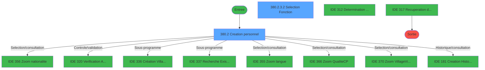
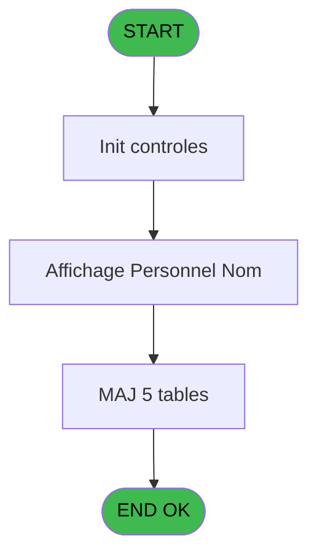
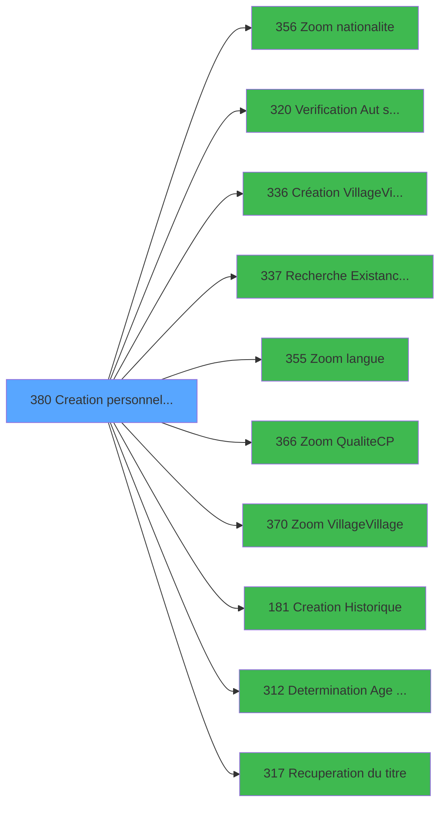

# PBG IDE 380 - Creation personnel identites S

> **Analyse**: Phases 1-4 2026-02-03 11:33 -> 11:33 (17s) | Assemblage 11:33
> **Pipeline**: V7.2 Enrichi
> **Structure**: 4 onglets (Resume | Ecrans | Donnees | Connexions)

<!-- TAB:Resume -->

## 1. FICHE D'IDENTITE

| Attribut | Valeur |
|----------|--------|
| Projet | PBG |
| IDE Position | 380 |
| Nom Programme | Creation personnel identites S |
| Fichier source | `Prg_380.xml` |
| Dossier IDE | General |
| Taches | 16 (2 ecrans visibles) |
| Tables modifiees | 5 |
| Programmes appeles | 10 |
| :warning: Statut | **ORPHELIN_POTENTIEL** |

## 2. DESCRIPTION FONCTIONNELLE

**Creation personnel identites S** assure la gestion complete de ce processus.

Le flux de traitement s'organise en **5 blocs fonctionnels** :

- **Traitement** (7 taches) : traitements metier divers
- **Calcul** (3 taches) : calculs de montants, stocks ou compteurs
- **Creation** (3 taches) : insertion d'enregistrements en base (mouvements, prestations)
- **Validation** (2 taches) : controles et verifications de coherence
- **Consultation** (1 tache) : ecrans de recherche, selection et consultation

**Donnees modifiees** : 5 tables en ecriture (gm-recherche_____gmr, hebergement______heb, compte_gm________cgm, compteurs________cpt, fichier_validation).

**Logique metier** : 1 regles identifiees couvrant valeurs par defaut.

Detail : phases du traitement

#### Phase 1 : Traitement (7 taches)

- **380** - Module des Identites
- **380.1** - Determination Age Bebe
- **380.2.1** - Langue ?
- **380.2.2** - Lecture Qualite&Occupation
- **380.2.3** - Determination Fonction **[[ECRAN]](#ecran-t7)**
- **380.2.3.1** - Determination Service
- **380.2.4** - Veuillez patienter... **[[ECRAN]](#ecran-t10)**

Delegue a : [Création Village/Village (IDE 336)](PBG-IDE-336.md), [Determination Age Debut Sejour (IDE 312)](PBG-IDE-312.md), [Recuperation du titre (IDE 317)](PBG-IDE-317.md)

#### Phase 2 : Creation (3 taches)

- **380.2** - Creation personnel **[[ECRAN]](#ecran-t4)**
- **380.2.4.2** - Creation Package Aller
- **380.2.4.3** - Creation Package Retour

Delegue a : [Creation Historique (IDE 181)](PBG-IDE-181.md)

#### Phase 3 : Consultation (1 tache)

- **380.2.3.2** - Selection Fonction **[[ECRAN]](#ecran-t9)**

Delegue a : [Zoom nationalite (IDE 356)](PBG-IDE-356.md), [Recherche Existance Groupe A/D (IDE 337)](PBG-IDE-337.md), [Zoom langue (IDE 355)](PBG-IDE-355.md), [Zoom Qualite(C/P) (IDE 366)](PBG-IDE-366.md), [Zoom Village/Village (IDE 370)](PBG-IDE-370.md), [Recuperation du titre (IDE 317)](PBG-IDE-317.md)

#### Phase 4 : Validation (2 taches)

- **380.2.4.1** - Verification Planning
- **380.2.4.5** - Creation Validation

Delegue a : [Verification Aut sans ecran (IDE 320)](PBG-IDE-320.md)

#### Phase 5 : Calcul (3 taches)

- **380.2.4.4** - Creation Compte
- **380.3** - Attribution Compte
- **380.4** - Attribution Compte

#### Tables impactees

| Table | Operations | Role metier |
|-------|-----------|-------------|
| hebergement______heb | R/**W**/L (4 usages) | Hebergement (chambres) |
| compteurs________cpt | **W** (2 usages) | Comptes GM (generaux) |
| fichier_validation | **W** (1 usages) |  |
| gm-recherche_____gmr | **W** (1 usages) | Index de recherche |
| compte_gm________cgm | **W** (1 usages) | Comptes GM (generaux) |

## 3. BLOCS FONCTIONNELS

### 3.1 Traitement (7 taches)

Traitements internes.

---

#### 380 - Module des Identites

**Role** : Tache d'orchestration : point d'entree du programme (7 sous-taches). Coordonne l'enchainement des traitements.

6 sous-taches directes

| Tache | Nom | Bloc |
|-------|-----|------|
| [380.1](#t2) | Determination Age Bebe | Traitement |
| [380.2.1](#t5) | Langue ? | Traitement |
| [380.2.2](#t6) | Lecture Qualite&Occupation | Traitement |
| [380.2.3](#t7) | Determination Fonction **[[ECRAN]](#ecran-t7)** | Traitement |
| [380.2.3.1](#t8) | Determination Service | Traitement |
| [380.2.4](#t10) | Veuillez patienter... **[[ECRAN]](#ecran-t10)** | Traitement |

**Delegue a** : [Création Village/Village (IDE 336)](PBG-IDE-336.md), [Determination Age Debut Sejour (IDE 312)](PBG-IDE-312.md), [Recuperation du titre (IDE 317)](PBG-IDE-317.md)

---

#### 380.1 - Determination Age Bebe

**Role** : Traitement : Determination Age Bebe.
**Variables liees** : C (W0-Age Bebe)
**Delegue a** : [Création Village/Village (IDE 336)](PBG-IDE-336.md), [Determination Age Debut Sejour (IDE 312)](PBG-IDE-312.md), [Recuperation du titre (IDE 317)](PBG-IDE-317.md)

---

#### 380.2.1 - Langue ?

**Role** : Traitement : Langue ?.
**Variables liees** : S (v. bouton langue), L (W0-Saisie langue ?)
**Delegue a** : [Création Village/Village (IDE 336)](PBG-IDE-336.md), [Determination Age Debut Sejour (IDE 312)](PBG-IDE-312.md), [Recuperation du titre (IDE 317)](PBG-IDE-317.md)

---

#### 380.2.2 - Lecture Qualite&Occupation

**Role** : Traitement : Lecture Qualite&Occupation.
**Delegue a** : [Création Village/Village (IDE 336)](PBG-IDE-336.md), [Determination Age Debut Sejour (IDE 312)](PBG-IDE-312.md), [Recuperation du titre (IDE 317)](PBG-IDE-317.md)

---

#### 380.2.3 - Determination Fonction [[ECRAN]](#ecran-t7)

**Role** : Traitement : Determination Fonction.
**Ecran** : 108 x 8 DLU (MDI) | [Voir mockup](#ecran-t7)
**Variables liees** : O (W0-Code fonction)
**Delegue a** : [Création Village/Village (IDE 336)](PBG-IDE-336.md), [Determination Age Debut Sejour (IDE 312)](PBG-IDE-312.md), [Recuperation du titre (IDE 317)](PBG-IDE-317.md)

---

#### 380.2.3.1 - Determination Service

**Role** : Traitement : Determination Service.
**Variables liees** : N (W0-Table service)
**Delegue a** : [Création Village/Village (IDE 336)](PBG-IDE-336.md), [Determination Age Debut Sejour (IDE 312)](PBG-IDE-312.md), [Recuperation du titre (IDE 317)](PBG-IDE-317.md)

---

#### 380.2.4 - Veuillez patienter... [[ECRAN]](#ecran-t10)

**Role** : Traitement : Veuillez patienter....
**Ecran** : 422 x 56 DLU (MDI) | [Voir mockup](#ecran-t10)
**Delegue a** : [Création Village/Village (IDE 336)](PBG-IDE-336.md), [Determination Age Debut Sejour (IDE 312)](PBG-IDE-312.md), [Recuperation du titre (IDE 317)](PBG-IDE-317.md)

### 3.2 Creation (3 taches)

Insertion de nouveaux enregistrements en base.

---

#### 380.2 - Creation personnel [[ECRAN]](#ecran-t4)

**Role** : Creation d'enregistrement : Creation personnel.
**Ecran** : 734 x 367 DLU (MDI) | [Voir mockup](#ecran-t4)
**Variables liees** : BD (v Suite Creation), G (W0-autorisation creation)
**Delegue a** : [Creation Historique (IDE 181)](PBG-IDE-181.md)

---

#### 380.2.4.2 - Creation Package Aller

**Role** : Creation d'enregistrement : Creation Package Aller.
**Variables liees** : T (v.bouton.V/VAller), X (v Existe Code VV Aller), Y (v Code VV Aller), Z (v Heure VV Aller), BD (v Suite Creation)
**Delegue a** : [Creation Historique (IDE 181)](PBG-IDE-181.md)

---

#### 380.2.4.3 - Creation Package Retour

**Role** : Creation d'enregistrement : Creation Package Retour.
**Variables liees** : U (v.bouton V/V Retour), W (v.Retour Question Bsi), BA (v Existe Code VV Retour), BB (v Code VV Retour), BC (v Heure VV Retour)
**Delegue a** : [Creation Historique (IDE 181)](PBG-IDE-181.md)

### 3.3 Consultation (1 tache)

Ecrans de recherche et consultation.

---

#### 380.2.3.2 - Selection Fonction [[ECRAN]](#ecran-t9)

**Role** : Selection par l'operateur : Selection Fonction.
**Ecran** : 392 x 167 DLU (MDI) | [Voir mockup](#ecran-t9)
**Variables liees** : O (W0-Code fonction)
**Delegue a** : [Zoom nationalite (IDE 356)](PBG-IDE-356.md), [Recherche Existance Groupe A/D (IDE 337)](PBG-IDE-337.md), [Zoom langue (IDE 355)](PBG-IDE-355.md)

### 3.4 Validation (2 taches)

Controles de coherence : 2 taches verifient les donnees et conditions.

---

#### 380.2.4.1 - Verification Planning

**Role** : Verification : Verification Planning.
**Delegue a** : [Verification Aut sans ecran (IDE 320)](PBG-IDE-320.md)

---

#### 380.2.4.5 - Creation Validation

**Role** : Verification : Creation Validation.
**Variables liees** : BD (v Suite Creation), G (W0-autorisation creation)
**Delegue a** : [Verification Aut sans ecran (IDE 320)](PBG-IDE-320.md), [Creation Historique (IDE 181)](PBG-IDE-181.md)

### 3.5 Calcul (3 taches)

Calculs metier : montants, stocks, compteurs.

---

#### 380.2.4.4 - Creation Compte

**Role** : Creation d'enregistrement : Creation Compte.
**Variables liees** : BD (v Suite Creation), F (W0-numero compte memo), G (W0-autorisation creation), P (W0-Compte)
**Delegue a** : [Creation Historique (IDE 181)](PBG-IDE-181.md)

---

#### 380.3 - Attribution Compte

**Role** : Traitement : Attribution Compte.
**Variables liees** : F (W0-numero compte memo), P (W0-Compte)

---

#### 380.4 - Attribution Compte

**Role** : Traitement : Attribution Compte.
**Variables liees** : F (W0-numero compte memo), P (W0-Compte)

## 5. REGLES METIER

1 regles identifiees:

### Autres (1 regles)

#### [RM-001] Valeur par defaut si Trim (> Mode attaque ecran [A]) est vide

| Element | Detail |
|---------|--------|
| **Condition** | `Trim (> Mode attaque ecran [A])=''` |
| **Si vrai** | 'E'MODE |
| **Si faux** | > Mode attaque ecran [A]) |
| **Variables** | A (> Mode attaque ecran) |
| **Expression source** | Expression 3 : `IF (Trim (> Mode attaque ecran [A])='','E'MODE,> Mode attaqu` |
| **Exemple** | Si Trim (> Mode attaque ecran [A])='' → 'E'MODE. Sinon → > Mode attaque ecran [A]) |

## 6. CONTEXTE

- **Appele par**: (aucun)
- **Appelle**: 10 programmes | **Tables**: 13 (W:5 R:4 L:7) | **Taches**: 16 | **Expressions**: 11

<!-- TAB:Ecrans -->

## 8. ECRANS

### 8.1 Forms visibles (2 / 16)

| # | Position | Tache | Nom | Type | Largeur | Hauteur | Bloc |
|---|----------|-------|-----|------|---------|---------|------|
| 1 | 380.2 | 380.2 | Creation personnel | MDI | 734 | 367 | Creation |
| 2 | 380.2.3.2 | 380.2.3.2 | Selection Fonction | MDI | 392 | 167 | Consultation |

### 8.2 Mockups Ecrans

---

#### 380.2 - Creation personnel
**Tache** : [380.2](#t4) | **Type** : MDI | **Dimensions** : 734 x 367 DLU
**Bloc** : Creation | **Titre IDE** : Creation personnel

<!-- FORM-DATA:
{
    "width":  734,
    "vFactor":  8,
    "type":  "MDI",
    "hFactor":  8,
    "controls":  [
                     {
                         "x":  1,
                         "type":  "label",
                         "var":  "",
                         "y":  1,
                         "w":  724,
                         "fmt":  "",
                         "name":  "",
                         "h":  19,
                         "color":  "1",
                         "text":  "",
                         "parent":  null
                     },
                     {
                         "x":  12,
                         "type":  "label",
                         "var":  "",
                         "y":  23,
                         "w":  716,
                         "fmt":  "",
                         "name":  "",
                         "h":  312,
                         "color":  "",
                         "text":  "",
                         "parent":  null
                     },
                     {
                         "x":  21,
                         "type":  "label",
                         "var":  "",
                         "y":  31,
                         "w":  83,
                         "fmt":  "",
                         "name":  "",
                         "h":  12,
                         "color":  "",
                         "text":  "Nom",
                         "parent":  4
                     },
                     {
                         "x":  358,
                         "type":  "label",
                         "var":  "",
                         "y":  31,
                         "w":  42,
                         "fmt":  "",
                         "name":  "",
                         "h":  12,
                         "color":  "",
                         "text":  "Titre",
                         "parent":  4
                     },
                     {
                         "x":  21,
                         "type":  "label",
                         "var":  "",
                         "y":  47,
                         "w":  82,
                         "fmt":  "",
                         "name":  "",
                         "h":  12,
                         "color":  "",
                         "text":  "Prénom",
                         "parent":  4
                     },
                     {
                         "x":  358,
                         "type":  "label",
                         "var":  "",
                         "y":  47,
                         "w":  71,
                         "fmt":  "",
                         "name":  "",
                         "h":  12,
                         "color":  "",
                         "text":  "Qualité",
                         "parent":  4
                     },
                     {
                         "x":  21,
                         "type":  "label",
                         "var":  "",
                         "y":  62,
                         "w":  66,
                         "fmt":  "",
                         "name":  "",
                         "h":  12,
                         "color":  "",
                         "text":  "Service",
                         "parent":  4
                     },
                     {
                         "x":  21,
                         "type":  "label",
                         "var":  "",
                         "y":  80,
                         "w":  82,
                         "fmt":  "",
                         "name":  "",
                         "h":  10,
                         "color":  "",
                         "text":  "Fonction",
                         "parent":  4
                     },
                     {
                         "x":  21,
                         "type":  "label",
                         "var":  "",
                         "y":  96,
                         "w":  75,
                         "fmt":  "",
                         "name":  "",
                         "h":  12,
                         "color":  "",
                         "text":  "Contrat",
                         "parent":  4
                     },
                     {
                         "x":  21,
                         "type":  "label",
                         "var":  "",
                         "y":  163,
                         "w":  67,
                         "fmt":  "",
                         "name":  "",
                         "h":  10,
                         "color":  "",
                         "text":  "Arrivée",
                         "parent":  4
                     },
                     {
                         "x":  21,
                         "type":  "label",
                         "var":  "",
                         "y":  177,
                         "w":  75,
                         "fmt":  "",
                         "name":  "",
                         "h":  10,
                         "color":  "",
                         "text":  "Départ",
                         "parent":  4
                     },
                     {
                         "x":  21,
                         "type":  "label",
                         "var":  "",
                         "y":  192,
                         "w":  154,
                         "fmt":  "",
                         "name":  "",
                         "h":  10,
                         "color":  "",
                         "text":  "Date de Naissance",
                         "parent":  4
                     },
                     {
                         "x":  358,
                         "type":  "label",
                         "var":  "",
                         "y":  192,
                         "w":  43,
                         "fmt":  "",
                         "name":  "",
                         "h":  10,
                         "color":  "",
                         "text":  "Age",
                         "parent":  4
                     },
                     {
                         "x":  21,
                         "type":  "label",
                         "var":  "",
                         "y":  206,
                         "w":  93,
                         "fmt":  "",
                         "name":  "",
                         "h":  10,
                         "color":  "",
                         "text":  "Nationalité",
                         "parent":  4
                     },
                     {
                         "x":  21,
                         "type":  "label",
                         "var":  "",
                         "y":  221,
                         "w":  96,
                         "fmt":  "",
                         "name":  "",
                         "h":  12,
                         "color":  "",
                         "text":  "Occupation",
                         "parent":  4
                     },
                     {
                         "x":  21,
                         "type":  "label",
                         "var":  "",
                         "y":  238,
                         "w":  64,
                         "fmt":  "",
                         "name":  "",
                         "h":  10,
                         "color":  "",
                         "text":  "Identité",
                         "parent":  4
                     },
                     {
                         "x":  21,
                         "type":  "label",
                         "var":  "",
                         "y":  252,
                         "w":  77,
                         "fmt":  "",
                         "name":  "",
                         "h":  10,
                         "color":  "",
                         "text":  "Délivré",
                         "parent":  4
                     },
                     {
                         "x":  424,
                         "type":  "label",
                         "var":  "",
                         "y":  254,
                         "w":  45,
                         "fmt":  "",
                         "name":  "",
                         "h":  10,
                         "color":  "",
                         "text":  "Date",
                         "parent":  4
                     },
                     {
                         "x":  25,
                         "type":  "label",
                         "var":  "",
                         "y":  267,
                         "w":  643,
                         "fmt":  "",
                         "name":  "",
                         "h":  49,
                         "color":  "195",
                         "text":  "Adresse",
                         "parent":  null
                     },
                     {
                         "x":  18,
                         "type":  "label",
                         "var":  "",
                         "y":  321,
                         "w":  82,
                         "fmt":  "",
                         "name":  "",
                         "h":  8,
                         "color":  "",
                         "text":  "Langue",
                         "parent":  4
                     },
                     {
                         "x":  0,
                         "type":  "label",
                         "var":  "",
                         "y":  341,
                         "w":  725,
                         "fmt":  "",
                         "name":  "",
                         "h":  24,
                         "color":  "1",
                         "text":  "",
                         "parent":  null
                     },
                     {
                         "x":  614,
                         "type":  "label",
                         "var":  "",
                         "y":  31,
                         "w":  57,
                         "fmt":  "",
                         "name":  "",
                         "h":  12,
                         "color":  "7",
                         "text":  "Bébé",
                         "parent":  4
                     },
                     {
                         "x":  21,
                         "type":  "label",
                         "var":  "",
                         "y":  114,
                         "w":  91,
                         "fmt":  "",
                         "name":  "",
                         "h":  12,
                         "color":  "",
                         "text":  "Cat.Emploi",
                         "parent":  4
                     },
                     {
                         "x":  21,
                         "type":  "label",
                         "var":  "",
                         "y":  129,
                         "w":  75,
                         "fmt":  "",
                         "name":  "",
                         "h":  12,
                         "color":  "",
                         "text":  "BSI Ok ?",
                         "parent":  4
                     },
                     {
                         "x":  21,
                         "type":  "label",
                         "var":  "",
                         "y":  144,
                         "w":  115,
                         "fmt":  "",
                         "name":  "",
                         "h":  12,
                         "color":  "",
                         "text":  "Lieu de séjour",
                         "parent":  4
                     },
                     {
                         "x":  360,
                         "type":  "label",
                         "var":  "",
                         "y":  163,
                         "w":  91,
                         "fmt":  "",
                         "name":  "",
                         "h":  10,
                         "color":  "",
                         "text":  "Vol aller",
                         "parent":  4
                     },
                     {
                         "x":  360,
                         "type":  "label",
                         "var":  "",
                         "y":  178,
                         "w":  91,
                         "fmt":  "",
                         "name":  "",
                         "h":  10,
                         "color":  "",
                         "text":  "Vol Retour",
                         "parent":  4
                     },
                     {
                         "x":  133,
                         "type":  "edit",
                         "var":  "",
                         "y":  31,
                         "w":  182,
                         "fmt":  "",
                         "name":  "GO Nom",
                         "h":  12,
                         "color":  "6",
                         "text":  "",
                         "parent":  4
                     },
                     {
                         "x":  426,
                         "type":  "combobox",
                         "var":  "",
                         "y":  31,
                         "w":  182,
                         "fmt":  "",
                         "name":  "W1-Select titre",
                         "h":  12,
                         "color":  "",
                         "text":  "1,2",
                         "parent":  4
                     },
                     {
                         "x":  133,
                         "type":  "edit",
                         "var":  "",
                         "y":  47,
                         "w":  182,
                         "fmt":  "",
                         "name":  "GO Prenom",
                         "h":  12,
                         "color":  "6",
                         "text":  "",
                         "parent":  4
                     },
                     {
                         "x":  614,
                         "type":  "button",
                         "var":  "",
                         "y":  47,
                         "w":  28,
                         "fmt":  "...",
                         "name":  "v. bouton qualite",
                         "h":  10,
                         "color":  "",
                         "text":  "",
                         "parent":  4
                     },
                     {
                         "x":  426,
                         "type":  "edit",
                         "var":  "",
                         "y":  47,
                         "w":  182,
                         "fmt":  "15",
                         "name":  "W1-Select qualite",
                         "h":  12,
                         "color":  "6",
                         "text":  "",
                         "parent":  4
                     },
                     {
                         "x":  133,
                         "type":  "combobox",
                         "var":  "",
                         "y":  62,
                         "w":  403,
                         "fmt":  "",
                         "name":  "go_code_service",
                         "h":  12,
                         "color":  "",
                         "text":  "",
                         "parent":  4
                     },
                     {
                         "x":  134,
                         "type":  "edit",
                         "var":  "",
                         "y":  80,
                         "w":  286,
                         "fmt":  "",
                         "name":  "go_fonction",
                         "h":  12,
                         "color":  "6",
                         "text":  "",
                         "parent":  4
                     },
                     {
                         "x":  426,
                         "type":  "button",
                         "var":  "",
                         "y":  80,
                         "w":  28,
                         "fmt":  "...",
                         "name":  "v.bouton fonction",
                         "h":  12,
                         "color":  "",
                         "text":  "",
                         "parent":  4
                     },
                     {
                         "x":  133,
                         "type":  "combobox",
                         "var":  "",
                         "y":  96,
                         "w":  206,
                         "fmt":  "",
                         "name":  "W1-Select Contrat",
                         "h":  12,
                         "color":  "",
                         "text":  "1,2",
                         "parent":  4
                     },
                     {
                         "x":  133,
                         "type":  "combobox",
                         "var":  "",
                         "y":  113,
                         "w":  403,
                         "fmt":  "",
                         "name":  "Go_cat_emploi",
                         "h":  12,
                         "color":  "6",
                         "text":  "1,2,3",
                         "parent":  4
                     },
                     {
                         "x":  133,
                         "type":  "checkbox",
                         "var":  "",
                         "y":  129,
                         "w":  34,
                         "fmt":  "",
                         "name":  "GO_bsi ok",
                         "h":  12,
                         "color":  "",
                         "text":  "",
                         "parent":  4
                     },
                     {
                         "x":  135,
                         "type":  "combobox",
                         "var":  "",
                         "y":  144,
                         "w":  280,
                         "fmt":  "",
                         "name":  "W1-Lieu de séjour",
                         "h":  12,
                         "color":  "",
                         "text":  "1,2",
                         "parent":  4
                     },
                     {
                         "x":  133,
                         "type":  "edit",
                         "var":  "",
                         "y":  163,
                         "w":  169,
                         "fmt":  "DD/MM/YYYYZ",
                         "name":  "GO Date Debut",
                         "h":  10,
                         "color":  "6",
                         "text":  "",
                         "parent":  4
                     },
                     {
                         "x":  309,
                         "type":  "button",
                         "var":  "",
                         "y":  163,
                         "w":  28,
                         "fmt":  "...",
                         "name":  "v.bouton date debut",
                         "h":  10,
                         "color":  "",
                         "text":  "",
                         "parent":  4
                     },
                     {
                         "x":  452,
                         "type":  "edit",
                         "var":  "",
                         "y":  163,
                         "w":  74,
                         "fmt":  "",
                         "name":  "heb_nom_logement",
                         "h":  10,
                         "color":  "6",
                         "text":  "",
                         "parent":  4
                     },
                     {
                         "x":  533,
                         "type":  "edit",
                         "var":  "",
                         "y":  163,
                         "w":  37,
                         "fmt":  "",
                         "name":  "heb_heure_debut_0001",
                         "h":  10,
                         "color":  "6",
                         "text":  "",
                         "parent":  4
                     },
                     {
                         "x":  574,
                         "type":  "button",
                         "var":  "",
                         "y":  163,
                         "w":  28,
                         "fmt":  "...",
                         "name":  "v.bouton.V/VAller",
                         "h":  10,
                         "color":  "",
                         "text":  "",
                         "parent":  4
                     },
                     {
                         "x":  133,
                         "type":  "edit",
                         "var":  "",
                         "y":  177,
                         "w":  169,
                         "fmt":  "DD/MM/YYYYZ",
                         "name":  "GO Date Fin",
                         "h":  10,
                         "color":  "6",
                         "text":  "",
                         "parent":  4
                     },
                     {
                         "x":  309,
                         "type":  "button",
                         "var":  "",
                         "y":  177,
                         "w":  28,
                         "fmt":  "...",
                         "name":  "v.bouton date fin",
                         "h":  10,
                         "color":  "",
                         "text":  "",
                         "parent":  4
                     },
                     {
                         "x":  452,
                         "type":  "edit",
                         "var":  "",
                         "y":  178,
                         "w":  74,
                         "fmt":  "",
                         "name":  "heb_nom_logement_0001",
                         "h":  10,
                         "color":  "6",
                         "text":  "",
                         "parent":  4
                     },
                     {
                         "x":  533,
                         "type":  "edit",
                         "var":  "",
                         "y":  178,
                         "w":  37,
                         "fmt":  "",
                         "name":  "heb_heure_debut_0002",
                         "h":  10,
                         "color":  "6",
                         "text":  "",
                         "parent":  4
                     },
                     {
                         "x":  574,
                         "type":  "button",
                         "var":  "",
                         "y":  178,
                         "w":  28,
                         "fmt":  "...",
                         "name":  "v.bouton V/V Retour",
                         "h":  10,
                         "color":  "",
                         "text":  "",
                         "parent":  4
                     },
                     {
                         "x":  174,
                         "type":  "edit",
                         "var":  "",
                         "y":  192,
                         "w":  126,
                         "fmt":  "DD/MM/YYYYT",
                         "name":  "GO Date Naissance",
                         "h":  10,
                         "color":  "6",
                         "text":  "",
                         "parent":  4
                     },
                     {
                         "x":  181,
                         "type":  "button",
                         "var":  "",
                         "y":  206,
                         "w":  28,
                         "fmt":  "...",
                         "name":  "v. bouton nationalite",
                         "h":  10,
                         "color":  "",
                         "text":  "",
                         "parent":  4
                     },
                     {
                         "x":  133,
                         "type":  "edit",
                         "var":  "",
                         "y":  206,
                         "w":  37,
                         "fmt":  "",
                         "name":  "GO Nationalite",
                         "h":  10,
                         "color":  "6",
                         "text":  "",
                         "parent":  4
                     },
                     {
                         "x":  224,
                         "type":  "edit",
                         "var":  "",
                         "y":  206,
                         "w":  232,
                         "fmt":  "U20",
                         "name":  "",
                         "h":  10,
                         "color":  "7",
                         "text":  "",
                         "parent":  4
                     },
                     {
                         "x":  182,
                         "type":  "combobox",
                         "var":  "",
                         "y":  221,
                         "w":  110,
                         "fmt":  "",
                         "name":  "W1-Base occupation",
                         "h":  12,
                         "color":  "",
                         "text":  "1,2",
                         "parent":  4
                     },
                     {
                         "x":  134,
                         "type":  "edit",
                         "var":  "",
                         "y":  238,
                         "w":  277,
                         "fmt":  "U18",
                         "name":  "GMC N° Pièce",
                         "h":  10,
                         "color":  "6",
                         "text":  "",
                         "parent":  4
                     },
                     {
                         "x":  133,
                         "type":  "edit",
                         "var":  "",
                         "y":  254,
                         "w":  277,
                         "fmt":  "U18",
                         "name":  "GMC Ville Delivrance",
                         "h":  10,
                         "color":  "6",
                         "text":  "",
                         "parent":  4
                     },
                     {
                         "x":  640,
                         "type":  "button",
                         "var":  "",
                         "y":  254,
                         "w":  26,
                         "fmt":  "...",
                         "name":  "v.bouton date delivrance",
                         "h":  10,
                         "color":  "",
                         "text":  "",
                         "parent":  4
                     },
                     {
                         "x":  492,
                         "type":  "edit",
                         "var":  "",
                         "y":  254,
                         "w":  144,
                         "fmt":  "DD/MM/YYYYT",
                         "name":  "GMC Date Delivrance",
                         "h":  10,
                         "color":  "6",
                         "text":  "",
                         "parent":  4
                     },
                     {
                         "x":  133,
                         "type":  "edit",
                         "var":  "",
                         "y":  277,
                         "w":  126,
                         "fmt":  "",
                         "name":  "GMC N° dans la rue",
                         "h":  10,
                         "color":  "6",
                         "text":  "",
                         "parent":  39
                     },
                     {
                         "x":  267,
                         "type":  "edit",
                         "var":  "",
                         "y":  277,
                         "w":  356,
                         "fmt":  "",
                         "name":  "GMC Nom de la rue",
                         "h":  10,
                         "color":  "6",
                         "text":  "",
                         "parent":  39
                     },
                     {
                         "x":  133,
                         "type":  "edit",
                         "var":  "",
                         "y":  289,
                         "w":  488,
                         "fmt":  "",
                         "name":  "GMC Commune",
                         "h":  10,
                         "color":  "6",
                         "text":  "",
                         "parent":  39
                     },
                     {
                         "x":  133,
                         "type":  "edit",
                         "var":  "",
                         "y":  301,
                         "w":  126,
                         "fmt":  "",
                         "name":  "GMC Code Postal",
                         "h":  10,
                         "color":  "6",
                         "text":  "",
                         "parent":  39
                     },
                     {
                         "x":  267,
                         "type":  "edit",
                         "var":  "",
                         "y":  301,
                         "w":  356,
                         "fmt":  "",
                         "name":  "GMC Ville",
                         "h":  10,
                         "color":  "6",
                         "text":  "",
                         "parent":  39
                     },
                     {
                         "x":  180,
                         "type":  "button",
                         "var":  "",
                         "y":  321,
                         "w":  28,
                         "fmt":  "...",
                         "name":  "v. bouton langue",
                         "h":  10,
                         "color":  "",
                         "text":  "",
                         "parent":  null
                     },
                     {
                         "x":  133,
                         "type":  "edit",
                         "var":  "",
                         "y":  321,
                         "w":  37,
                         "fmt":  "",
                         "name":  "GMR Langue Parlee",
                         "h":  10,
                         "color":  "6",
                         "text":  "",
                         "parent":  4
                     },
                     {
                         "x":  218,
                         "type":  "edit",
                         "var":  "",
                         "y":  321,
                         "w":  232,
                         "fmt":  "",
                         "name":  "",
                         "h":  10,
                         "color":  "7",
                         "text":  "",
                         "parent":  4
                     },
                     {
                         "x":  398,
                         "type":  "edit",
                         "var":  "",
                         "y":  192,
                         "w":  30,
                         "fmt":  "",
                         "name":  "",
                         "h":  10,
                         "color":  "",
                         "text":  "",
                         "parent":  4
                     },
                     {
                         "x":  9,
                         "type":  "button",
                         "var":  "",
                         "y":  346,
                         "w":  154,
                         "fmt":  "\u0026Ok",
                         "name":  "v. bouton quitter",
                         "h":  18,
                         "color":  "",
                         "text":  "",
                         "parent":  null
                     },
                     {
                         "x":  9,
                         "type":  "edit",
                         "var":  "",
                         "y":  6,
                         "w":  478,
                         "fmt":  "30",
                         "name":  "",
                         "h":  8,
                         "color":  "",
                         "text":  "",
                         "parent":  null
                     },
                     {
                         "x":  444,
                         "type":  "edit",
                         "var":  "",
                         "y":  6,
                         "w":  275,
                         "fmt":  "WWW DD MMM YYYYT",
                         "name":  "",
                         "h":  8,
                         "color":  "",
                         "text":  "",
                         "parent":  null
                     },
                     {
                         "x":  133,
                         "type":  "edit",
                         "var":  "",
                         "y":  221,
                         "w":  19,
                         "fmt":  "1",
                         "name":  "",
                         "h":  12,
                         "color":  "7",
                         "text":  "",
                         "parent":  4
                     },
                     {
                         "x":  187,
                         "type":  "button",
                         "var":  "",
                         "y":  346,
                         "w":  154,
                         "fmt":  "A\u0026bandonner",
                         "name":  "",
                         "h":  18,
                         "color":  "",
                         "text":  "",
                         "parent":  null
                     }
                 ],
    "taskId":  "380.2",
    "height":  367
}
-->

<strong>Champs : 34 champs</strong>

| Pos (x,y) | Nom | Variable | Type |
|-----------|-----|----------|------|
| 133,31 | GO Nom | - | edit |
| 426,31 | W1-Select titre | - | combobox |
| 133,47 | GO Prenom | - | edit |
| 426,47 | W1-Select qualite | - | edit |
| 133,62 | go_code_service | - | combobox |
| 134,80 | go_fonction | - | edit |
| 133,96 | W1-Select Contrat | - | combobox |
| 133,113 | Go_cat_emploi | - | combobox |
| 133,129 | GO_bsi ok | - | checkbox |
| 135,144 | W1-Lieu de séjour | - | combobox |
| 133,163 | GO Date Debut | - | edit |
| 452,163 | heb_nom_logement | - | edit |
| 533,163 | heb_heure_debut_0001 | - | edit |
| 133,177 | GO Date Fin | - | edit |
| 452,178 | heb_nom_logement_0001 | - | edit |
| 533,178 | heb_heure_debut_0002 | - | edit |
| 174,192 | GO Date Naissance | - | edit |
| 133,206 | GO Nationalite | - | edit |
| 224,206 | U20 | - | edit |
| 182,221 | W1-Base occupation | - | combobox |
| 134,238 | GMC N° Pièce | - | edit |
| 133,254 | GMC Ville Delivrance | - | edit |
| 492,254 | GMC Date Delivrance | - | edit |
| 133,277 | GMC N° dans la rue | - | edit |
| 267,277 | GMC Nom de la rue | - | edit |
| 133,289 | GMC Commune | - | edit |
| 133,301 | GMC Code Postal | - | edit |
| 267,301 | GMC Ville | - | edit |
| 133,321 | GMR Langue Parlee | - | edit |
| 218,321 | (sans nom) | - | edit |
| 398,192 | (sans nom) | - | edit |
| 9,6 | 30 | - | edit |
| 444,6 | WWW DD MMM YYYYT | - | edit |
| 133,221 | 1 | - | edit |

<strong>Boutons : 11 boutons</strong>

| Bouton | Pos (x,y) | Action |
|--------|-----------|--------|
| ... | 614,47 | Bouton fonctionnel |
| ... | 426,80 | Bouton fonctionnel |
| ... | 309,163 | Bouton fonctionnel |
| ... | 574,163 | Bouton fonctionnel |
| ... | 309,177 | Bouton fonctionnel |
| ... | 574,178 | Bouton fonctionnel |
| ... | 181,206 | Bouton fonctionnel |
| ... | 640,254 | Bouton fonctionnel |
| ... | 180,321 | Bouton fonctionnel |
| Ok | 9,346 | Valide la saisie et enregistre |
| Abandonner | 187,346 | Annule et retour au menu |

---

#### 380.2.3.2 - Selection Fonction
**Tache** : [380.2.3.2](#t9) | **Type** : MDI | **Dimensions** : 392 x 167 DLU
**Bloc** : Consultation | **Titre IDE** : Selection Fonction

<!-- FORM-DATA:
{
    "width":  392,
    "vFactor":  8,
    "type":  "MDI",
    "hFactor":  8,
    "controls":  [
                     {
                         "x":  34,
                         "type":  "table",
                         "var":  "",
                         "name":  "",
                         "titleH":  12,
                         "color":  "196",
                         "w":  336,
                         "y":  7,
                         "fmt":  "",
                         "parent":  null,
                         "text":  "",
                         "rowH":  12,
                         "h":  104,
                         "cols":  [
                                      {
                                          "title":  "Fonction",
                                          "layer":  1,
                                          "w":  301
                                      }
                                  ],
                         "rows":  1
                     },
                     {
                         "x":  2,
                         "type":  "label",
                         "var":  "",
                         "y":  140,
                         "w":  385,
                         "fmt":  "",
                         "name":  "",
                         "h":  24,
                         "color":  "",
                         "text":  "",
                         "parent":  null
                     },
                     {
                         "x":  40,
                         "type":  "edit",
                         "var":  "",
                         "y":  23,
                         "w":  288,
                         "fmt":  "U25",
                         "name":  "",
                         "h":  8,
                         "color":  "196",
                         "text":  "",
                         "parent":  1
                     },
                     {
                         "x":  29,
                         "type":  "button",
                         "var":  "",
                         "y":  143,
                         "w":  154,
                         "fmt":  "\u0026Sélectionner",
                         "name":  "",
                         "h":  18,
                         "color":  "",
                         "text":  "",
                         "parent":  null
                     },
                     {
                         "x":  209,
                         "type":  "button",
                         "var":  "",
                         "y":  143,
                         "w":  154,
                         "fmt":  "\u0026Quitter",
                         "name":  "",
                         "h":  18,
                         "color":  "",
                         "text":  "",
                         "parent":  null
                     },
                     {
                         "x":  167,
                         "type":  "image",
                         "var":  "",
                         "y":  116,
                         "w":  58,
                         "fmt":  "",
                         "name":  "",
                         "h":  18,
                         "color":  "",
                         "text":  "",
                         "parent":  null
                     }
                 ],
    "taskId":  "380.2.3.2",
    "height":  167
}
-->

<strong>Champs : 1 champs</strong>

| Pos (x,y) | Nom | Variable | Type |
|-----------|-----|----------|------|
| 40,23 | U25 | - | edit |

<strong>Boutons : 2 boutons</strong>

| Bouton | Pos (x,y) | Action |
|--------|-----------|--------|
| Sélectionner | 29,143 | Bouton fonctionnel |
| Quitter | 209,143 | Quitte le programme |

## 9. NAVIGATION

### 9.1 Enchainement des ecrans

**Detail par enchainement :**

| Depuis | Action | Vers | Retour |
|--------|--------|------|--------|
| Creation personnel | Selection/consultation | [Zoom nationalite (IDE 356)](PBG-IDE-356.md) | Retour ecran |
| Creation personnel | Controle/validation | [Verification Aut sans ecran (IDE 320)](PBG-IDE-320.md) | Retour ecran |
| Creation personnel | Sous-programme | [Création Village/Village (IDE 336)](PBG-IDE-336.md) | Retour ecran |
| Creation personnel | Sous-programme | [Recherche Existance Groupe A/D (IDE 337)](PBG-IDE-337.md) | Retour ecran |
| Creation personnel | Selection/consultation | [Zoom langue (IDE 355)](PBG-IDE-355.md) | Retour ecran |
| Creation personnel | Selection/consultation | [Zoom Qualite(C/P) (IDE 366)](PBG-IDE-366.md) | Retour ecran |
| Creation personnel | Selection/consultation | [Zoom Village/Village (IDE 370)](PBG-IDE-370.md) | Retour ecran |
| Creation personnel | Historique/consultation | [Creation Historique (IDE 181)](PBG-IDE-181.md) | Retour ecran |
| Creation personnel | Sous-programme | [Determination Age Debut Sejour (IDE 312)](PBG-IDE-312.md) | Retour ecran |
| Creation personnel | Recuperation donnees | [Recuperation du titre (IDE 317)](PBG-IDE-317.md) | Retour ecran |

### 9.3 Structure hierarchique (16 taches)

| Position | Tache | Type | Dimensions | Bloc |
|----------|-------|------|------------|------|
| **380.1** | [**Module des Identites** (380)](#t1) | MDI | - | Traitement |
| 380.1.1 | [Determination Age Bebe (380.1)](#t2) | MDI | - | |
| 380.1.2 | [Langue ? (380.2.1)](#t5) | MDI | - | |
| 380.1.3 | [Lecture Qualite&Occupation (380.2.2)](#t6) | MDI | - | |
| 380.1.4 | [Determination Fonction (380.2.3)](#t7) [mockup](#ecran-t7) | MDI | 108x8 | |
| 380.1.5 | [Determination Service (380.2.3.1)](#t8) | MDI | - | |
| 380.1.6 | [Veuillez patienter... (380.2.4)](#t10) [mockup](#ecran-t10) | MDI | 422x56 | |
| **380.2** | [**Creation personnel** (380.2)](#t4) [mockup](#ecran-t4) | MDI | 734x367 | Creation |
| 380.2.1 | [Creation Package Aller (380.2.4.2)](#t12) | MDI | - | |
| 380.2.2 | [Creation Package Retour (380.2.4.3)](#t13) | MDI | - | |
| **380.3** | [**Selection Fonction** (380.2.3.2)](#t9) [mockup](#ecran-t9) | MDI | 392x167 | Consultation |
| **380.4** | [**Verification Planning** (380.2.4.1)](#t11) | MDI | - | Validation |
| 380.4.1 | [Creation Validation (380.2.4.5)](#t15) | MDI | - | |
| **380.5** | [**Creation Compte** (380.2.4.4)](#t14) | MDI | - | Calcul |
| 380.5.1 | [Attribution Compte (380.3)](#t16) | MDI | - | |
| 380.5.2 | [Attribution Compte (380.4)](#t17) | MDI | - | |

### 9.4 Algorigramme

> **Legende**: Vert = START/END OK | Rouge = END KO | Bleu = Decisions
> *Algorigramme auto-genere. Utiliser `/algorigramme` pour une synthese metier detaillee.*

<!-- TAB:Donnees -->

## 10. TABLES

### Tables utilisees (13)

| ID | Nom | Description | Type | R | W | L | Usages |
|----|-----|-------------|------|---|---|---|--------|
| 30 | gm-recherche_____gmr | Index de recherche | DB |   | **W** |   | 1 |
| 31 | gm-complet_______gmc |  | DB |   |   | L | 1 |
| 34 | hebergement______heb | Hebergement (chambres) | DB | R | **W** | L | 4 |
| 35 | personnel_go______go |  | DB |   |   | L | 1 |
| 47 | compte_gm________cgm | Comptes GM (generaux) | DB |   | **W** |   | 1 |
| 63 | parametres___par |  | DB | R |   |   | 2 |
| 68 | compteurs________cpt | Comptes GM (generaux) | DB |   | **W** |   | 2 |
| 78 | param__telephone_tel |  | DB |   |   | L | 1 |
| 113 | tables_village |  | DB | R |   |   | 2 |
| 117 | tables_services | Services / filieres | DB | R |   | L | 3 |
| 119 | tables_pays_tel_ |  | DB |   |   | L | 1 |
| 130 | fichier_langue |  | DB |   |   | L | 1 |
| 131 | fichier_validation |  | DB |   | **W** |   | 1 |

### Colonnes par table (3 / 8 tables avec colonnes identifiees)

Table 30 - gm-recherche_____gmr (**W**) - 1 usages

| Lettre | Variable | Acces | Type |
|--------|----------|-------|------|
| A | W1-Fin de Tache | W | Logical |
| B | W1-Arrêt | W | Alpha |
| C | W1-Age codifie | W | Alpha |
| D | W1-Nb mois | W | Numeric |
| E | W1-Bebe | W | Alpha |
| F | W1-Acces planning | W | Alpha |
| G | W1- Numero compte memo | W | Numeric |
| H | W1-Select qualite | W | Alpha |
| I | v. bouton qualite | W | Alpha |
| J | W1-Select titre | W | Alpha |
| K | v.bouton fonction | W | Alpha |
| L | W1-Select Contrat | W | Alpha |
| M | W1-Lieu de séjour | W | Alpha |
| N | v.bouton date debut | W | Alpha |
| O | v.bouton date fin | W | Alpha |
| P | v. bouton nationalite | W | Alpha |
| Q | W1-Base occupation | W | Alpha |
| R | v.bouton date delivrance | W | Alpha |
| S | v. bouton langue | W | Alpha |
| T | v.bouton.V/VAller | W | Alpha |
| U | v.bouton V/V Retour | W | Alpha |
| V | v. bouton quitter | W | Alpha |
| W | v.Retour Question Bsi | W | Numeric |
| X | v Existe Code VV Aller | W | Logical |
| Y | v Code VV Aller | W | Alpha |
| Z | v Heure VV Aller | W | Alpha |
| BA | v Existe Code VV Retour | W | Logical |
| BB | v Code VV Retour | W | Alpha |
| BC | v Heure VV Retour | W | Alpha |
| BD | v Suite Creation | W | Alpha |
| BE | v Bt | W | Alpha |
| BF | CHG_REASON_go_bsi_ok | W | Numeric |
| BG | CHG_PRV_go_bsi_ok | W | Logical |

Table 34 - hebergement______heb (R/**W**/L) - 4 usages

*Table utilisee uniquement en Link ou aucune colonne Real identifiee dans le DataView.*

Table 47 - compte_gm________cgm (**W**) - 1 usages

| Lettre | Variable | Acces | Type |
|--------|----------|-------|------|
| F | W0-numero compte memo | W | Numeric |
| G | W1- Numero compte memo | W | Numeric |
| P | W0-Compte | W | Numeric |

Table 63 - parametres___par (R) - 2 usages

*Table utilisee uniquement en Link ou aucune colonne Real identifiee dans le DataView.*

Table 68 - compteurs________cpt (**W**) - 2 usages

*Table utilisee uniquement en Link ou aucune colonne Real identifiee dans le DataView.*

Table 113 - tables_village (R) - 2 usages

*Table utilisee uniquement en Link ou aucune colonne Real identifiee dans le DataView.*

Table 117 - tables_services (R/L) - 3 usages

*Table utilisee uniquement en Link ou aucune colonne Real identifiee dans le DataView.*

Table 131 - fichier_validation (**W**) - 1 usages

*Table utilisee uniquement en Link ou aucune colonne Real identifiee dans le DataView.*

## 11. VARIABLES

### 11.1 Parametres entrants (1)

Variables recues en parametre.

| Lettre | Nom | Type | Usage dans |
|--------|-----|------|-----------|
| B | P0 Front/Back | Alpha | 2x parametre entrant |

### 11.2 Variables de session (15)

Variables persistantes pendant toute la session.

| Lettre | Nom | Type | Usage dans |
|--------|-----|------|-----------|
| E | v.ecran titre | Alpha | - |
| R | v.bouton date delivrance | Alpha | - |
| S | v. bouton langue | Alpha | - |
| T | v.bouton.V/VAller | Alpha | - |
| U | v.bouton V/V Retour | Alpha | - |
| V | v. bouton quitter | Alpha | - |
| W | v.Retour Question Bsi | Numeric | - |
| X | v Existe Code VV Aller | Logical | - |
| Y | v Code VV Aller | Alpha | - |
| Z | v Heure VV Aller | Alpha | - |
| BA | v Existe Code VV Retour | Logical | - |
| BB | v Code VV Retour | Alpha | - |
| BC | v Heure VV Retour | Alpha | - |
| BD | v Suite Creation | Alpha | - |
| BE | v Bt | Alpha | - |

### 11.3 Autres (17)

Variables diverses.

| Lettre | Nom | Type | Usage dans |
|--------|-----|------|-----------|
| A | > Mode attaque ecran | Alpha | 1x refs |
| C | W0-Age Bebe | Numeric | - |
| D | W0-Base Vide | Alpha | - |
| F | W0-numero compte memo | Numeric | - |
| G | W0-autorisation creation | Alpha | - |
| H | W0-autorisation modif | Alpha | - |
| I | W0-autorisation | Alpha | - |
| J | W0-code base occup | Alpha | - |
| K | W0-heberg | Alpha | - |
| L | W0-Saisie langue ? | Alpha | - |
| M | W0-Bloquage effectue | Alpha | - |
| N | W0-Table service | Alpha | - |
| O | W0-Code fonction | Alpha | - |
| P | W0-Compte | Numeric | - |
| Q | W0-Adhesion | Numeric | - |
| BF | CHG_REASON_go_bsi_ok | Numeric | - |
| BG | CHG_PRV_go_bsi_ok | Logical | - |

Toutes les 33 variables (liste complete)

| Cat | Lettre | Nom Variable | Type |
|-----|--------|--------------|------|
| P0 | **B** | P0 Front/Back | Alpha |
| V. | **E** | v.ecran titre | Alpha |
| V. | **R** | v.bouton date delivrance | Alpha |
| V. | **S** | v. bouton langue | Alpha |
| V. | **T** | v.bouton.V/VAller | Alpha |
| V. | **U** | v.bouton V/V Retour | Alpha |
| V. | **V** | v. bouton quitter | Alpha |
| V. | **W** | v.Retour Question Bsi | Numeric |
| V. | **X** | v Existe Code VV Aller | Logical |
| V. | **Y** | v Code VV Aller | Alpha |
| V. | **Z** | v Heure VV Aller | Alpha |
| V. | **BA** | v Existe Code VV Retour | Logical |
| V. | **BB** | v Code VV Retour | Alpha |
| V. | **BC** | v Heure VV Retour | Alpha |
| V. | **BD** | v Suite Creation | Alpha |
| V. | **BE** | v Bt | Alpha |
| Autre | **A** | > Mode attaque ecran | Alpha |
| Autre | **C** | W0-Age Bebe | Numeric |
| Autre | **D** | W0-Base Vide | Alpha |
| Autre | **F** | W0-numero compte memo | Numeric |
| Autre | **G** | W0-autorisation creation | Alpha |
| Autre | **H** | W0-autorisation modif | Alpha |
| Autre | **I** | W0-autorisation | Alpha |
| Autre | **J** | W0-code base occup | Alpha |
| Autre | **K** | W0-heberg | Alpha |
| Autre | **L** | W0-Saisie langue ? | Alpha |
| Autre | **M** | W0-Bloquage effectue | Alpha |
| Autre | **N** | W0-Table service | Alpha |
| Autre | **O** | W0-Code fonction | Alpha |
| Autre | **P** | W0-Compte | Numeric |
| Autre | **Q** | W0-Adhesion | Numeric |
| Autre | **BF** | CHG_REASON_go_bsi_ok | Numeric |
| Autre | **BG** | CHG_PRV_go_bsi_ok | Logical |

## 12. EXPRESSIONS

**11 / 11 expressions decodees (100%)**

### 12.1 Repartition par type

| Type | Expressions | Regles |
|------|-------------|--------|
| CONDITION | 3 | 5 |
| CONSTANTE | 6 | 0 |
| OTHER | 2 | 0 |

### 12.2 Expressions cles par type

#### CONDITION (3 expressions)

| Type | IDE | Expression | Regle |
|------|-----|------------|-------|
| CONDITION | 3 | `IF (Trim (> Mode attaque ecran [A])='','E'MODE,> Mode attaque ecran [A])` | [RM-001](#rm-RM-001) |
| CONDITION | 10 | `P0 Front/Back [B]='B'` | - |
| CONDITION | 9 | `P0 Front/Back [B]='F'` | - |

#### CONSTANTE (6 expressions)

| Type | IDE | Expression | Regle |
|------|-----|------------|-------|
| CONSTANTE | 7 | `'09'` | - |
| CONSTANTE | 8 | `'10'` | - |
| CONSTANTE | 11 | `'O'` | - |
| CONSTANTE | 1 | `'N'` | - |
| CONSTANTE | 2 | `''` | - |
| ... | | *+1 autres* | |

#### OTHER (2 expressions)

| Type | IDE | Expression | Regle |
|------|-----|------------|-------|
| OTHER | 6 | `GetParam ('SOCIETE')` | - |
| OTHER | 5 | `GetParam ('FRONT')` | - |

<!-- TAB:Connexions -->

## 13. GRAPHE D'APPELS

### 13.1 Chaine depuis Main (Callers)

**Chemin**: (pas de callers directs)

### 13.2 Callers

| IDE | Nom Programme | Nb Appels |
|-----|---------------|-----------|
| - | (aucun) | - |

### 13.3 Callees (programmes appeles)

### 13.4 Detail Callees avec contexte

| IDE | Nom Programme | Appels | Contexte |
|-----|---------------|--------|----------|
| [356](PBG-IDE-356.md) | Zoom nationalite | 3 | Selection/consultation |
| [320](PBG-IDE-320.md) | Verification Aut sans ecran | 2 | Controle/validation |
| [336](PBG-IDE-336.md) | Création Village/Village | 2 | Sous-programme |
| [337](PBG-IDE-337.md) | Recherche Existance Groupe A/D | 2 | Sous-programme |
| [355](PBG-IDE-355.md) | Zoom langue | 2 | Selection/consultation |
| [366](PBG-IDE-366.md) | Zoom Qualite(C/P) | 2 | Selection/consultation |
| [370](PBG-IDE-370.md) | Zoom Village/Village | 2 | Selection/consultation |
| [181](PBG-IDE-181.md) | Creation Historique | 1 | Historique/consultation |
| [312](PBG-IDE-312.md) | Determination Age Debut Sejour | 1 | Sous-programme |
| [317](PBG-IDE-317.md) | Recuperation du titre | 1 | Recuperation donnees |

## 14. RECOMMANDATIONS MIGRATION

### 14.1 Profil du programme

| Metrique | Valeur | Impact migration |
|----------|--------|-----------------|
| Lignes de logique | 581 | Programme volumineux |
| Expressions | 11 | Peu de logique |
| Tables WRITE | 5 | Impact modere |
| Sous-programmes | 10 | Dependances moderees |
| Ecrans visibles | 2 | Quelques ecrans |
| Code desactive | 0.5% (3 / 581) | Code sain |
| Regles metier | 1 | Quelques regles a preserver |

### 14.2 Plan de migration par bloc

#### Traitement (7 taches: 2 ecrans, 5 traitements)

- **Strategie** : Orchestrateur avec 2 ecrans (Razor/React) et 5 traitements backend (services).
- Les ecrans deviennent des composants UI, les traitements invisibles deviennent des services injectables.
- 10 sous-programme(s) a migrer ou a reutiliser depuis les services existants.
- Decomposer les taches en services unitaires testables.

#### Creation (3 taches: 1 ecran, 2 traitements)

- **Strategie** : Repository pattern avec Entity Framework Core.
- Insertion via `IRepository<T>.CreateAsync()`

#### Consultation (1 tache: 1 ecran, 0 traitement)

- **Strategie** : Composants de recherche/selection en modales.
- 1 ecran : Selection Fonction

#### Validation (2 taches: 0 ecran, 2 traitements)

- **Strategie** : FluentValidation avec validators specifiques.
- Chaque tache de validation -> un validator injectable

#### Calcul (3 taches: 0 ecran, 3 traitements)

- **Strategie** : Services de calcul purs (Domain Services).
- Migrer la logique de calcul (stock, compteurs, montants)

### 14.3 Dependances critiques

| Dependance | Type | Appels | Impact |
|------------|------|--------|--------|
| gm-recherche_____gmr | Table WRITE (Database) | 1x | Schema + repository |
| hebergement______heb | Table WRITE (Database) | 2x | Schema + repository |
| compte_gm________cgm | Table WRITE (Database) | 1x | Schema + repository |
| compteurs________cpt | Table WRITE (Database) | 2x | Schema + repository |
| fichier_validation | Table WRITE (Database) | 1x | Schema + repository |
| [Zoom nationalite (IDE 356)](PBG-IDE-356.md) | Sous-programme | 3x | **CRITIQUE** - Selection/consultation |
| [Zoom langue (IDE 355)](PBG-IDE-355.md) | Sous-programme | 2x | Haute - Selection/consultation |
| [Zoom Qualite(C/P) (IDE 366)](PBG-IDE-366.md) | Sous-programme | 2x | Haute - Selection/consultation |
| [Zoom Village/Village (IDE 370)](PBG-IDE-370.md) | Sous-programme | 2x | Haute - Selection/consultation |
| [Verification Aut sans ecran (IDE 320)](PBG-IDE-320.md) | Sous-programme | 2x | Haute - Controle/validation |
| [Création Village/Village (IDE 336)](PBG-IDE-336.md) | Sous-programme | 2x | Haute - Sous-programme |
| [Recherche Existance Groupe A/D (IDE 337)](PBG-IDE-337.md) | Sous-programme | 2x | Haute - Sous-programme |
| [Recuperation du titre (IDE 317)](PBG-IDE-317.md) | Sous-programme | 1x | Normale - Recuperation donnees |
| [Determination Age Debut Sejour (IDE 312)](PBG-IDE-312.md) | Sous-programme | 1x | Normale - Sous-programme |
| [Creation Historique (IDE 181)](PBG-IDE-181.md) | Sous-programme | 1x | Normale - Historique/consultation |

---
*Spec DETAILED generee par Pipeline V7.2 - 2026-02-03 11:33*
