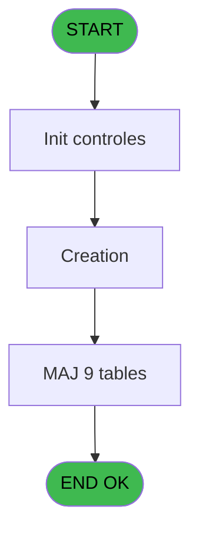
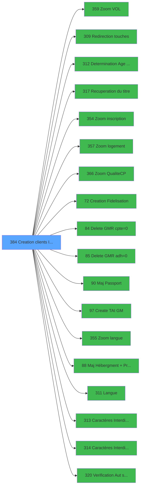

# PBG IDE 384 - Creation clients Identite en c

> **Analyse**: Phases 1-4 2026-02-03 11:34 -> 11:35 (25s) | Assemblage 11:35
> **Pipeline**: V7.2 Enrichi
> **Structure**: 4 onglets (Resume | Ecrans | Donnees | Connexions)

<!-- TAB:Resume -->

## 1. FICHE D'IDENTITE

| Attribut | Valeur |
|----------|--------|
| Projet | PBG |
| IDE Position | 384 |
| Nom Programme | Creation clients Identite en c |
| Fichier source | `Prg_384.xml` |
| Dossier IDE | General |
| Taches | 28 (4 ecrans visibles) |
| Tables modifiees | 9 |
| Programmes appeles | 18 |
| :warning: Statut | **ORPHELIN_POTENTIEL** |

## 2. DESCRIPTION FONCTIONNELLE

**Creation clients Identite en c** assure la gestion complete de ce processus.

Le flux de traitement s'organise en **6 blocs fonctionnels** :

- **Traitement** (16 taches) : traitements metier divers
- **Calcul** (4 taches) : calculs de montants, stocks ou compteurs
- **Creation** (4 taches) : insertion d'enregistrements en base (mouvements, prestations)
- **Validation** (2 taches) : controles et verifications de coherence
- **Initialisation** (1 tache) : reinitialisation d'etats et de variables de travail
- **Consultation** (1 tache) : ecrans de recherche, selection et consultation

**Donnees modifiees** : 9 tables en ecriture (gm-recherche_____gmr, gm-complet_______gmc, client_gm, compte_gm________cgm, compteurs________cpt, historik_station, groupe_arr_dep___vol, heb_circuit______hci, import_mod).

**Logique metier** : 2 regles identifiees couvrant conditions metier, valeurs par defaut.

Detail : phases du traitement

#### Phase 1 : Traitement (16 taches)

- **384** - Module des Clients
- **384.1** - Determination Age Bebe
- **384.2.1** - Modification Hebergement
- **384.2.3** - Demarquage Caisse
- **384.2.6** - personne existante **[[ECRAN]](#ecran-t10)**
- **384.2.7** - determination periode
- **384.2.8** - Reiteration **[[ECRAN]](#ecran-t12)**
- **384.2.8.1** - Clients **[[ECRAN]](#ecran-t13)**
- **384.2.8.1.1** - Modification Hebergement
- **384.2.8.1.3** - recup filiation club
- **384.2.8.1.4** - recup filiation
- **384.2.9** - MAJ immigration **[[ECRAN]](#ecran-t21)**
- **384.2.10** - Clients **[[ECRAN]](#ecran-t22)**
- **384.4** - Création client à vide
- **384.2.15** - Atrtribution num Club
- **384.2.16** - ABANDON - Delete Client_gm

Delegue a : [Redirection touches (IDE 309)](PBG-IDE-309.md), [Determination Age Debut Sejour (IDE 312)](PBG-IDE-312.md), [Recuperation du titre (IDE 317)](PBG-IDE-317.md), [   Delete GMR cpte=0 (IDE 84)](PBG-IDE-84.md), [   Delete GMR adh=0 (IDE 85)](PBG-IDE-85.md), [  Maj Passport (IDE 90)](PBG-IDE-90.md), [Maj Hébergment + Prestation (IDE 88)](PBG-IDE-88.md), [Langue ? (IDE 311)](PBG-IDE-311.md), [Caractères Interdits (A20) - L (IDE 313)](PBG-IDE-313.md), [Caractères Interdits (A20) - A (IDE 314)](PBG-IDE-314.md)

#### Phase 2 : Creation (4 taches)

- **384.2** - Creation client **[[ECRAN]](#ecran-t4)**
- **384.2.2** - Creation Historique
- **384.2.4** - creation V/V
- **384.2.8.1.2** - Creation Historique

Delegue a : [   Creation Fidelisation (IDE 72)](PBG-IDE-72.md), [Create TAI GM (IDE 97)](PBG-IDE-97.md)

#### Phase 3 : Validation (2 taches)

- **384.2.5** - Verification Algorythme
- **384.2.13** - verif logements

Delegue a : [Caractères Interdits (A20) - L (IDE 313)](PBG-IDE-313.md), [Caractères Interdits (A20) - A (IDE 314)](PBG-IDE-314.md), [Verification Aut sans ecran (IDE 320)](PBG-IDE-320.md)

#### Phase 4 : Calcul (4 taches)

- **384.2.8.1.5** - Calcul flag
- **384.2.8.1.6** - Calcul Millesia
- **384.2.12** - Mise a jour compteur *NU*
- **384.2.14** - Calcul Millesia

#### Phase 5 : Consultation (1 tache)

- **384.2.11** - Modif recherche

Delegue a : [Zoom VOL (IDE 359)](PBG-IDE-359.md), [Recuperation du titre (IDE 317)](PBG-IDE-317.md), [Zoom inscription (IDE 354)](PBG-IDE-354.md), [Zoom logement (IDE 357)](PBG-IDE-357.md), [Zoom Qualite(C/P) (IDE 366)](PBG-IDE-366.md), [Zoom langue (IDE 355)](PBG-IDE-355.md)

#### Phase 6 : Initialisation (1 tache)

- **384.3** - Initialisation paramètres

#### Tables impactees

| Table | Operations | Role metier |
|-------|-----------|-------------|
| client_gm | R/**W**/L (6 usages) |  |
| gm-recherche_____gmr | R/**W**/L (4 usages) | Index de recherche |
| compteurs________cpt | **W**/L (4 usages) | Comptes GM (generaux) |
| gm-complet_______gmc | **W** (3 usages) |  |
| groupe_arr_dep___vol | **W**/L (2 usages) |  |
| heb_circuit______hci | **W** (2 usages) | Hebergement (chambres) |
| import_mod | **W** (2 usages) |  |
| compte_gm________cgm | **W**/L (2 usages) | Comptes GM (generaux) |
| historik_station | **W** (2 usages) | Historique / journal |

## 3. BLOCS FONCTIONNELS

### 3.1 Traitement (16 taches)

Traitements internes.

---

#### 384 - Module des Clients

**Role** : Tache d'orchestration : point d'entree du programme (16 sous-taches). Coordonne l'enchainement des traitements.

15 sous-taches directes

| Tache | Nom | Bloc |
|-------|-----|------|
| [384.1](#t2) | Determination Age Bebe | Traitement |
| [384.2.1](#t5) | Modification Hebergement | Traitement |
| [384.2.3](#t7) | Demarquage Caisse | Traitement |
| [384.2.6](#t10) | personne existante **[[ECRAN]](#ecran-t10)** | Traitement |
| [384.2.7](#t11) | determination periode | Traitement |
| [384.2.8](#t12) | Reiteration **[[ECRAN]](#ecran-t12)** | Traitement |
| [384.2.8.1](#t13) | Clients **[[ECRAN]](#ecran-t13)** | Traitement |
| [384.2.8.1.1](#t14) | Modification Hebergement | Traitement |
| [384.2.8.1.3](#t17) | recup filiation club | Traitement |
| [384.2.8.1.4](#t18) | recup filiation | Traitement |
| [384.2.9](#t21) | MAJ immigration **[[ECRAN]](#ecran-t21)** | Traitement |
| [384.2.10](#t22) | Clients **[[ECRAN]](#ecran-t22)** | Traitement |
| [384.4](#t28) | Création client à vide | Traitement |
| [384.2.15](#t29) | Atrtribution num Club | Traitement |
| [384.2.16](#t30) | ABANDON - Delete Client_gm | Traitement |

---

#### 384.1 - Determination Age Bebe

**Role** : Traitement : Determination Age Bebe.
**Variables liees** : BL (W0 CREATION BEBE ?), BR (W0 Nbre Bebe), L (W0-Age Bebe)

---

#### 384.2.1 - Modification Hebergement

**Role** : Traitement : Modification Hebergement.
**Variables liees** : CK (v. Hebergement)

---

#### 384.2.3 - Demarquage Caisse

**Role** : Traitement : Demarquage Caisse.

---

#### 384.2.6 - personne existante [[ECRAN]](#ecran-t10)

**Role** : Traitement : personne existante.
**Ecran** : 776 x 145 DLU (MDI) | [Voir mockup](#ecran-t10)

---

#### 384.2.7 - determination periode

**Role** : Traitement : determination periode.

---

#### 384.2.8 - Reiteration [[ECRAN]](#ecran-t12)

**Role** : Traitement : Reiteration.
**Ecran** : 706 x 147 DLU (MDI) | [Voir mockup](#ecran-t12)

---

#### 384.2.8.1 - Clients [[ECRAN]](#ecran-t13)

**Role** : Traitement : Clients.
**Ecran** : 710 x 150 DLU (MDI) | [Voir mockup](#ecran-t13)

---

#### 384.2.8.1.1 - Modification Hebergement

**Role** : Traitement : Modification Hebergement.
**Variables liees** : CK (v. Hebergement)

---

#### 384.2.8.1.3 - recup filiation club

**Role** : Consultation/chargement : recup filiation club.
**Variables liees** : Z (W0 filiation club1), BA (W0 filiation club2), BM (W0 NUM COMPTE FILIATION), CO (v. ok filiation), C (>Filiation Compte)

---

#### 384.2.8.1.4 - recup filiation

**Role** : Consultation/chargement : recup filiation.
**Variables liees** : Z (W0 filiation club1), BA (W0 filiation club2), BM (W0 NUM COMPTE FILIATION), CO (v. ok filiation), C (>Filiation Compte)

---

#### 384.2.9 - MAJ immigration [[ECRAN]](#ecran-t21)

**Role** : Traitement : MAJ immigration.
**Ecran** : 638 x 168 DLU (MDI) | [Voir mockup](#ecran-t21)

---

#### 384.2.10 - Clients [[ECRAN]](#ecran-t22)

**Role** : Traitement : Clients.
**Ecran** : 216 x 52 DLU (MDI) | [Voir mockup](#ecran-t22)

---

#### 384.4 - Création client à vide

**Role** : Traitement : Création client à vide.
**Variables liees** : BU (V.COmpte en cours de création), BV (V.Remplace stat(0=Création), H (W0-Type Client), M (W0-Base Vide), CS (W1-Type client fondation)

---

#### 384.2.15 - Atrtribution num Club

**Role** : Traitement : Atrtribution num Club.
**Variables liees** : Z (W0 filiation club1), BA (W0 filiation club2)

---

#### 384.2.16 - ABANDON - Delete Client_gm

**Role** : Traitement : ABANDON - Delete Client_gm.

### 3.2 Creation (4 taches)

Insertion de nouveaux enregistrements en base.

---

#### 384.2 - Creation client [[ECRAN]](#ecran-t4)

**Role** : Creation d'enregistrement : Creation client.
**Ecran** : 870 x 344 DLU (MDI) | [Voir mockup](#ecran-t4)
**Variables liees** : BL (W0 CREATION BEBE ?), H (W0-Type Client), O (W0-autorisation creation), CS (W1-Type client fondation)
**Delegue a** : [   Creation Fidelisation (IDE 72)](PBG-IDE-72.md), [Create TAI GM (IDE 97)](PBG-IDE-97.md)

---

#### 384.2.2 - Creation Historique

**Role** : Consultation/chargement : Creation Historique.
**Variables liees** : BL (W0 CREATION BEBE ?), O (W0-autorisation creation)
**Delegue a** : [   Creation Fidelisation (IDE 72)](PBG-IDE-72.md), [Create TAI GM (IDE 97)](PBG-IDE-97.md)

---

#### 384.2.4 - creation V/V

**Role** : Creation d'enregistrement : creation V/V.
**Variables liees** : BL (W0 CREATION BEBE ?), O (W0-autorisation creation)
**Delegue a** : [   Creation Fidelisation (IDE 72)](PBG-IDE-72.md), [Create TAI GM (IDE 97)](PBG-IDE-97.md)

---

#### 384.2.8.1.2 - Creation Historique

**Role** : Consultation/chargement : Creation Historique.
**Variables liees** : BL (W0 CREATION BEBE ?), O (W0-autorisation creation)
**Delegue a** : [   Creation Fidelisation (IDE 72)](PBG-IDE-72.md), [Create TAI GM (IDE 97)](PBG-IDE-97.md)

### 3.3 Validation (2 taches)

Controles de coherence : 2 taches verifient les donnees et conditions.

---

#### 384.2.5 - Verification Algorythme

**Role** : Verification : Verification Algorythme.
**Delegue a** : [Verification Aut sans ecran (IDE 320)](PBG-IDE-320.md)

---

#### 384.2.13 - verif logements

**Role** : Verification : verif logements.
**Delegue a** : [Verification Aut sans ecran (IDE 320)](PBG-IDE-320.md)

### 3.4 Calcul (4 taches)

Calculs metier : montants, stocks, compteurs.

---

#### 384.2.8.1.5 - Calcul flag

**Role** : Calcul : Calcul flag.

---

#### 384.2.8.1.6 - Calcul Millesia

**Role** : Calcul : Calcul Millesia.

---

#### 384.2.12 - Mise a jour compteur *NU*

**Role** : Calcul : Mise a jour compteur *NU*.
**Variables liees** : BN (W0 Date Début Sejour), BO (W0 Heure Début séjour), BP (W0 Date Fin Sejour), BS (W0 Heure Fin séjour), V (W0-lieu sejour general)

---

#### 384.2.14 - Calcul Millesia

**Role** : Calcul : Calcul Millesia.

### 3.5 Consultation (1 tache)

Ecrans de recherche et consultation.

---

#### 384.2.11 - Modif recherche

**Role** : Traitement : Modif recherche.
**Variables liees** : BB (W0 modif langue), P (W0- autorisation modif)
**Delegue a** : [Zoom VOL (IDE 359)](PBG-IDE-359.md), [Zoom inscription (IDE 354)](PBG-IDE-354.md), [Zoom logement (IDE 357)](PBG-IDE-357.md)

### 3.6 Initialisation (1 tache)

Reinitialisation d'etats et variables de travail.

---

#### 384.3 - Initialisation paramètres

**Role** : Reinitialisation : Initialisation paramètres.

## 5. REGLES METIER

2 regles identifiees:

### Autres (2 regles)

#### [RM-001] Traitement conditionnel si GetParam ('NB_LIEU_SEJOUR') est a zero

| Element | Detail |
|---------|--------|
| **Condition** | `GetParam ('NB_LIEU_SEJOUR')=0` |
| **Si vrai** | 'G' |
| **Si faux** | IF (GetParam ('NB_LIEU_SEJOUR')=1,GetParam ('CODE_LIEU_SEJOUR'),'')) |
| **Expression source** | Expression 1 : `IF (GetParam ('NB_LIEU_SEJOUR')=0,'G',IF (GetParam ('NB_LIEU` |
| **Exemple** | Si GetParam ('NB_LIEU_SEJOUR')=0 → 'G' |

#### [RM-002] Valeur par defaut si > Mode attaque ecran [A] est vide

| Element | Detail |
|---------|--------|
| **Condition** | `> Mode attaque ecran [A]=''` |
| **Si vrai** | 'E'MODE |
| **Si faux** | > Mode attaque ecran [A]) |
| **Variables** | A (> Mode attaque ecran) |
| **Expression source** | Expression 6 : `IF (> Mode attaque ecran [A]='','E'MODE,> Mode attaque ecran` |
| **Exemple** | Si > Mode attaque ecran [A]='' → 'E'MODE. Sinon → > Mode attaque ecran [A]) |

## 6. CONTEXTE

- **Appele par**: (aucun)
- **Appelle**: 18 programmes | **Tables**: 22 (W:9 R:6 L:17) | **Taches**: 28 | **Expressions**: 19

<!-- TAB:Ecrans -->

## 8. ECRANS

### 8.1 Forms visibles (4 / 28)

| # | Position | Tache | Nom | Type | Largeur | Hauteur | Bloc |
|---|----------|-------|-----|------|---------|---------|------|
| 1 | 384.2 | 384.2 | Creation client | MDI | 870 | 344 | Creation |
| 2 | 384.2.6 | 384.2.6 | personne existante | MDI | 776 | 145 | Traitement |
| 3 | 384.2.8.1 | 384.2.8.1 | Clients | MDI | 710 | 150 | Traitement |
| 4 | 384.2.9 | 384.2.9 | MAJ immigration | MDI | 638 | 168 | Traitement |

### 8.2 Mockups Ecrans

---

#### 384.2 - Creation client
**Tache** : [384.2](#t4) | **Type** : MDI | **Dimensions** : 870 x 344 DLU
**Bloc** : Creation | **Titre IDE** : Creation client

<!-- FORM-DATA:
{
    "width":  870,
    "vFactor":  8,
    "type":  "MDI",
    "hFactor":  8,
    "controls":  [
                     {
                         "x":  0,
                         "type":  "label",
                         "var":  "",
                         "y":  0,
                         "w":  865,
                         "fmt":  "",
                         "name":  "",
                         "h":  21,
                         "color":  "",
                         "text":  "",
                         "parent":  null
                     },
                     {
                         "x":  14,
                         "type":  "label",
                         "var":  "",
                         "y":  22,
                         "w":  854,
                         "fmt":  "",
                         "name":  "",
                         "h":  238,
                         "color":  "1",
                         "text":  "",
                         "parent":  null
                     },
                     {
                         "x":  24,
                         "type":  "label",
                         "var":  "",
                         "y":  32,
                         "w":  85,
                         "fmt":  "",
                         "name":  "",
                         "h":  10,
                         "color":  "",
                         "text":  "Nom",
                         "parent":  4
                     },
                     {
                         "x":  359,
                         "type":  "label",
                         "var":  "",
                         "y":  32,
                         "w":  89,
                         "fmt":  "",
                         "name":  "",
                         "h":  10,
                         "color":  "",
                         "text":  "Prénom",
                         "parent":  4
                     },
                     {
                         "x":  623,
                         "type":  "label",
                         "var":  "",
                         "y":  32,
                         "w":  37,
                         "fmt":  "",
                         "name":  "",
                         "h":  9,
                         "color":  "",
                         "text":  "Titre",
                         "parent":  4
                     },
                     {
                         "x":  24,
                         "type":  "label",
                         "var":  "",
                         "y":  47,
                         "w":  61,
                         "fmt":  "",
                         "name":  "",
                         "h":  10,
                         "color":  "",
                         "text":  "Qualité",
                         "parent":  4
                     },
                     {
                         "x":  24,
                         "type":  "label",
                         "var":  "",
                         "y":  67,
                         "w":  106,
                         "fmt":  "",
                         "name":  "",
                         "h":  11,
                         "color":  "",
                         "text":  "Honey Moon",
                         "parent":  4
                     },
                     {
                         "x":  356,
                         "type":  "label",
                         "var":  "",
                         "y":  69,
                         "w":  91,
                         "fmt":  "",
                         "name":  "",
                         "h":  9,
                         "color":  "",
                         "text":  "Fleurs",
                         "parent":  4
                     },
                     {
                         "x":  23,
                         "type":  "label",
                         "var":  "",
                         "y":  85,
                         "w":  62,
                         "fmt":  "",
                         "name":  "",
                         "h":  10,
                         "color":  "",
                         "text":  "Fidel.",
                         "parent":  4
                     },
                     {
                         "x":  356,
                         "type":  "label",
                         "var":  "",
                         "y":  86,
                         "w":  118,
                         "fmt":  "",
                         "name":  "",
                         "h":  9,
                         "color":  "",
                         "text":  "Type Fidel.",
                         "parent":  4
                     },
                     {
                         "x":  24,
                         "type":  "label",
                         "var":  "",
                         "y":  107,
                         "w":  104,
                         "fmt":  "",
                         "name":  "",
                         "h":  11,
                         "color":  "",
                         "text":  "Date Début",
                         "parent":  4
                     },
                     {
                         "x":  356,
                         "type":  "label",
                         "var":  "",
                         "y":  107,
                         "w":  109,
                         "fmt":  "",
                         "name":  "",
                         "h":  11,
                         "color":  "",
                         "text":  "Vol aller",
                         "parent":  4
                     },
                     {
                         "x":  24,
                         "type":  "label",
                         "var":  "",
                         "y":  124,
                         "w":  96,
                         "fmt":  "",
                         "name":  "",
                         "h":  11,
                         "color":  "",
                         "text":  "Date Fin",
                         "parent":  4
                     },
                     {
                         "x":  356,
                         "type":  "label",
                         "var":  "",
                         "y":  124,
                         "w":  117,
                         "fmt":  "",
                         "name":  "",
                         "h":  11,
                         "color":  "",
                         "text":  "Vol retour",
                         "parent":  4
                     },
                     {
                         "x":  24,
                         "type":  "label",
                         "var":  "",
                         "y":  146,
                         "w":  96,
                         "fmt":  "",
                         "name":  "",
                         "h":  10,
                         "color":  "",
                         "text":  "N° Adhérent",
                         "parent":  4
                     },
                     {
                         "x":  356,
                         "type":  "label",
                         "var":  "",
                         "y":  146,
                         "w":  69,
                         "fmt":  "",
                         "name":  "",
                         "h":  10,
                         "color":  "",
                         "text":  "Filiation",
                         "parent":  4
                     },
                     {
                         "x":  490,
                         "type":  "label",
                         "var":  "",
                         "y":  146,
                         "w":  94,
                         "fmt":  "",
                         "name":  "",
                         "h":  10,
                         "color":  "",
                         "text":  "Date Naiss",
                         "parent":  4
                     },
                     {
                         "x":  741,
                         "type":  "label",
                         "var":  "",
                         "y":  146,
                         "w":  38,
                         "fmt":  "",
                         "name":  "",
                         "h":  10,
                         "color":  "",
                         "text":  "Age",
                         "parent":  4
                     },
                     {
                         "x":  24,
                         "type":  "label",
                         "var":  "",
                         "y":  162,
                         "w":  85,
                         "fmt":  "",
                         "name":  "",
                         "h":  11,
                         "color":  "",
                         "text":  "Inscription",
                         "parent":  4
                     },
                     {
                         "x":  24,
                         "type":  "label",
                         "var":  "",
                         "y":  187,
                         "w":  88,
                         "fmt":  "",
                         "name":  "",
                         "h":  9,
                         "color":  "",
                         "text":  "Fumeur",
                         "parent":  4
                     },
                     {
                         "x":  24,
                         "type":  "label",
                         "var":  "",
                         "y":  204,
                         "w":  101,
                         "fmt":  "",
                         "name":  "",
                         "h":  9,
                         "color":  "",
                         "text":  "Lieu séjour",
                         "parent":  4
                     },
                     {
                         "x":  410,
                         "type":  "label",
                         "var":  "",
                         "y":  202,
                         "w":  115,
                         "fmt":  "",
                         "name":  "",
                         "h":  11,
                         "color":  "",
                         "text":  "Logement",
                         "parent":  4
                     },
                     {
                         "x":  410,
                         "type":  "label",
                         "var":  "",
                         "y":  220,
                         "w":  94,
                         "fmt":  "",
                         "name":  "",
                         "h":  9,
                         "color":  "",
                         "text":  "Base Occ",
                         "parent":  4
                     },
                     {
                         "x":  24,
                         "type":  "label",
                         "var":  "",
                         "y":  221,
                         "w":  112,
                         "fmt":  "",
                         "name":  "",
                         "h":  9,
                         "color":  "",
                         "text":  "Occup (U/P)",
                         "parent":  4
                     },
                     {
                         "x":  32,
                         "type":  "label",
                         "var":  "",
                         "y":  244,
                         "w":  90,
                         "fmt":  "",
                         "name":  "",
                         "h":  10,
                         "color":  "",
                         "text":  "Langue",
                         "parent":  4
                     },
                     {
                         "x":  12,
                         "type":  "label",
                         "var":  "",
                         "y":  263,
                         "w":  853,
                         "fmt":  "",
                         "name":  "",
                         "h":  51,
                         "color":  "195",
                         "text":  "Adresse",
                         "parent":  null
                     },
                     {
                         "x":  12,
                         "type":  "label",
                         "var":  "",
                         "y":  317,
                         "w":  855,
                         "fmt":  "",
                         "name":  "",
                         "h":  24,
                         "color":  "",
                         "text":  "",
                         "parent":  null
                     },
                     {
                         "x":  18,
                         "type":  "line",
                         "var":  "",
                         "y":  239,
                         "w":  848,
                         "fmt":  "",
                         "name":  "",
                         "h":  0,
                         "color":  "",
                         "text":  "",
                         "parent":  4
                     },
                     {
                         "x":  18,
                         "type":  "line",
                         "var":  "",
                         "y":  59,
                         "w":  848,
                         "fmt":  "",
                         "name":  "",
                         "h":  0,
                         "color":  "",
                         "text":  "",
                         "parent":  4
                     },
                     {
                         "x":  18,
                         "type":  "line",
                         "var":  "",
                         "y":  103,
                         "w":  848,
                         "fmt":  "",
                         "name":  "",
                         "h":  0,
                         "color":  "",
                         "text":  "",
                         "parent":  4
                     },
                     {
                         "x":  18,
                         "type":  "line",
                         "var":  "",
                         "y":  141,
                         "w":  848,
                         "fmt":  "",
                         "name":  "",
                         "h":  0,
                         "color":  "",
                         "text":  "",
                         "parent":  4
                     },
                     {
                         "x":  18,
                         "type":  "line",
                         "var":  "",
                         "y":  177,
                         "w":  848,
                         "fmt":  "",
                         "name":  "",
                         "h":  0,
                         "color":  "",
                         "text":  "",
                         "parent":  4
                     },
                     {
                         "x":  623,
                         "type":  "label",
                         "var":  "",
                         "y":  69,
                         "w":  59,
                         "fmt":  "",
                         "name":  "",
                         "h":  9,
                         "color":  "",
                         "text":  "Dossier",
                         "parent":  4
                     },
                     {
                         "x":  141,
                         "type":  "edit",
                         "var":  "",
                         "y":  32,
                         "w":  182,
                         "fmt":  "",
                         "name":  "CLI Nom",
                         "h":  10,
                         "color":  "110",
                         "text":  "",
                         "parent":  4
                     },
                     {
                         "x":  488,
                         "type":  "edit",
                         "var":  "",
                         "y":  32,
                         "w":  126,
                         "fmt":  "",
                         "name":  "CLI Prenom",
                         "h":  10,
                         "color":  "110",
                         "text":  "",
                         "parent":  13
                     },
                     {
                         "x":  670,
                         "type":  "combobox",
                         "var":  "",
                         "y":  31,
                         "w":  191,
                         "fmt":  "",
                         "name":  "W1-select titre",
                         "h":  10,
                         "color":  "110",
                         "text":  "1,2",
                         "parent":  13
                     },
                     {
                         "x":  327,
                         "type":  "button",
                         "var":  "",
                         "y":  47,
                         "w":  27,
                         "fmt":  "...",
                         "name":  "v. bouton qualite",
                         "h":  10,
                         "color":  "",
                         "text":  "",
                         "parent":  4
                     },
                     {
                         "x":  141,
                         "type":  "edit",
                         "var":  "",
                         "y":  47,
                         "w":  182,
                         "fmt":  "30",
                         "name":  "W1-select qualite",
                         "h":  10,
                         "color":  "110",
                         "text":  "",
                         "parent":  4
                     },
                     {
                         "x":  138,
                         "type":  "combobox",
                         "var":  "",
                         "y":  67,
                         "w":  188,
                         "fmt":  "",
                         "name":  "W1-select honey moon",
                         "h":  11,
                         "color":  "110",
                         "text":  "1,2",
                         "parent":  4
                     },
                     {
                         "x":  488,
                         "type":  "combobox",
                         "var":  "",
                         "y":  67,
                         "w":  122,
                         "fmt":  "",
                         "name":  "W1-select fleurs",
                         "h":  11,
                         "color":  "110",
                         "text":  "1,2",
                         "parent":  4
                     },
                     {
                         "x":  698,
                         "type":  "edit",
                         "var":  "",
                         "y":  68,
                         "w":  93,
                         "fmt":  "9",
                         "name":  "W1-Numero de dossier",
                         "h":  11,
                         "color":  "110",
                         "text":  "",
                         "parent":  4
                     },
                     {
                         "x":  138,
                         "type":  "combobox",
                         "var":  "",
                         "y":  84,
                         "w":  188,
                         "fmt":  "",
                         "name":  "W1-select millesia",
                         "h":  11,
                         "color":  "110",
                         "text":  "1,2",
                         "parent":  4
                     },
                     {
                         "x":  488,
                         "type":  "combobox",
                         "var":  "",
                         "y":  84,
                         "w":  188,
                         "fmt":  "",
                         "name":  "W1-type de milesia",
                         "h":  11,
                         "color":  "110",
                         "text":  "Ami,Proche,Intime,Top top,GO Vacance",
                         "parent":  4
                     },
                     {
                         "x":  141,
                         "type":  "edit",
                         "var":  "",
                         "y":  107,
                         "w":  133,
                         "fmt":  "",
                         "name":  "CLI Date Debut",
                         "h":  11,
                         "color":  "110",
                         "text":  "",
                         "parent":  4
                     },
                     {
                         "x":  277,
                         "type":  "button",
                         "var":  "",
                         "y":  107,
                         "w":  27,
                         "fmt":  "...",
                         "name":  "W1-bouton date debut",
                         "h":  11,
                         "color":  "",
                         "text":  "",
                         "parent":  4
                     },
                     {
                         "x":  488,
                         "type":  "edit",
                         "var":  "",
                         "y":  107,
                         "w":  93,
                         "fmt":  "6U",
                         "name":  "W1-select vol aller",
                         "h":  11,
                         "color":  "110",
                         "text":  "",
                         "parent":  4
                     },
                     {
                         "x":  583,
                         "type":  "button",
                         "var":  "",
                         "y":  107,
                         "w":  27,
                         "fmt":  "...",
                         "name":  "v. bouton vol aller",
                         "h":  11,
                         "color":  "",
                         "text":  "",
                         "parent":  4
                     },
                     {
                         "x":  141,
                         "type":  "edit",
                         "var":  "",
                         "y":  124,
                         "w":  133,
                         "fmt":  "",
                         "name":  "CLI Date Fin",
                         "h":  11,
                         "color":  "110",
                         "text":  "",
                         "parent":  4
                     },
                     {
                         "x":  277,
                         "type":  "button",
                         "var":  "",
                         "y":  124,
                         "w":  27,
                         "fmt":  "...",
                         "name":  "W1-bouton date fin",
                         "h":  11,
                         "color":  "",
                         "text":  "",
                         "parent":  4
                     },
                     {
                         "x":  488,
                         "type":  "edit",
                         "var":  "",
                         "y":  124,
                         "w":  93,
                         "fmt":  "6U",
                         "name":  "W1-select vol dep",
                         "h":  11,
                         "color":  "110",
                         "text":  "",
                         "parent":  4
                     },
                     {
                         "x":  583,
                         "type":  "button",
                         "var":  "",
                         "y":  124,
                         "w":  27,
                         "fmt":  "...",
                         "name":  "v. bouton vol retour",
                         "h":  11,
                         "color":  "",
                         "text":  "",
                         "parent":  4
                     },
                     {
                         "x":  141,
                         "type":  "edit",
                         "var":  "",
                         "y":  146,
                         "w":  133,
                         "fmt":  "9P0Z",
                         "name":  "CLI N° Adherent",
                         "h":  10,
                         "color":  "110",
                         "text":  "",
                         "parent":  4
                     },
                     {
                         "x":  426,
                         "type":  "edit",
                         "var":  "",
                         "y":  146,
                         "w":  48,
                         "fmt":  "",
                         "name":  "",
                         "h":  10,
                         "color":  "110",
                         "text":  "",
                         "parent":  4
                     },
                     {
                         "x":  600,
                         "type":  "edit",
                         "var":  "",
                         "y":  146,
                         "w":  126,
                         "fmt":  "",
                         "name":  "CLI Date Naissance",
                         "h":  10,
                         "color":  "110",
                         "text":  "",
                         "parent":  4
                     },
                     {
                         "x":  141,
                         "type":  "edit",
                         "var":  "",
                         "y":  163,
                         "w":  48,
                         "fmt":  "",
                         "name":  "W1-select inscription",
                         "h":  10,
                         "color":  "110",
                         "text":  "",
                         "parent":  4
                     },
                     {
                         "x":  191,
                         "type":  "button",
                         "var":  "",
                         "y":  163,
                         "w":  27,
                         "fmt":  "...",
                         "name":  "v. bouton inscription",
                         "h":  10,
                         "color":  "",
                         "text":  "",
                         "parent":  4
                     },
                     {
                         "x":  226,
                         "type":  "edit",
                         "var":  "",
                         "y":  165,
                         "w":  288,
                         "fmt":  "",
                         "name":  "",
                         "h":  8,
                         "color":  "142",
                         "text":  "",
                         "parent":  4
                     },
                     {
                         "x":  141,
                         "type":  "combobox",
                         "var":  "",
                         "y":  185,
                         "w":  166,
                         "fmt":  "",
                         "name":  "W1-select fumeur",
                         "h":  11,
                         "color":  "110",
                         "text":  "1,2",
                         "parent":  4
                     },
                     {
                         "x":  141,
                         "type":  "combobox",
                         "var":  "",
                         "y":  202,
                         "w":  238,
                         "fmt":  "",
                         "name":  "W1-select lieu sejour",
                         "h":  11,
                         "color":  "110",
                         "text":  "1,2",
                         "parent":  4
                     },
                     {
                         "x":  663,
                         "type":  "button",
                         "var":  "",
                         "y":  202,
                         "w":  27,
                         "fmt":  "...",
                         "name":  "v. bouton logement",
                         "h":  11,
                         "color":  "",
                         "text":  "",
                         "parent":  4
                     },
                     {
                         "x":  541,
                         "type":  "edit",
                         "var":  "",
                         "y":  202,
                         "w":  118,
                         "fmt":  "10",
                         "name":  "W1-select logement",
                         "h":  11,
                         "color":  "110",
                         "text":  "",
                         "parent":  4
                     },
                     {
                         "x":  141,
                         "type":  "combobox",
                         "var":  "",
                         "y":  219,
                         "w":  238,
                         "fmt":  "",
                         "name":  "W1-select TUP",
                         "h":  11,
                         "color":  "110",
                         "text":  "1,2",
                         "parent":  4
                     },
                     {
                         "x":  541,
                         "type":  "combobox",
                         "var":  "",
                         "y":  218,
                         "w":  89,
                         "fmt":  "",
                         "name":  "W1-select Base OCC",
                         "h":  11,
                         "color":  "110",
                         "text":  "1,2",
                         "parent":  4
                     },
                     {
                         "x":  781,
                         "type":  "edit",
                         "var":  "",
                         "y":  146,
                         "w":  30,
                         "fmt":  "",
                         "name":  "CLI Age",
                         "h":  10,
                         "color":  "110",
                         "text":  "",
                         "parent":  4
                     },
                     {
                         "x":  180,
                         "type":  "button",
                         "var":  "",
                         "y":  244,
                         "w":  27,
                         "fmt":  "...",
                         "name":  "v. bouton langue",
                         "h":  10,
                         "color":  "",
                         "text":  "",
                         "parent":  4
                     },
                     {
                         "x":  141,
                         "type":  "edit",
                         "var":  "",
                         "y":  244,
                         "w":  37,
                         "fmt":  "",
                         "name":  "GMR Langue Parlee",
                         "h":  10,
                         "color":  "110",
                         "text":  "",
                         "parent":  4
                     },
                     {
                         "x":  83,
                         "type":  "edit",
                         "var":  "",
                         "y":  275,
                         "w":  126,
                         "fmt":  "",
                         "name":  "W1 n dans la rue",
                         "h":  10,
                         "color":  "110",
                         "text":  "",
                         "parent":  50
                     },
                     {
                         "x":  211,
                         "type":  "edit",
                         "var":  "",
                         "y":  275,
                         "w":  356,
                         "fmt":  "",
                         "name":  "W1 Nom de la rue",
                         "h":  10,
                         "color":  "110",
                         "text":  "",
                         "parent":  50
                     },
                     {
                         "x":  83,
                         "type":  "edit",
                         "var":  "",
                         "y":  287,
                         "w":  483,
                         "fmt":  "",
                         "name":  "W1 Commune",
                         "h":  10,
                         "color":  "110",
                         "text":  "",
                         "parent":  50
                     },
                     {
                         "x":  83,
                         "type":  "edit",
                         "var":  "",
                         "y":  299,
                         "w":  126,
                         "fmt":  "",
                         "name":  "W1 Code postal",
                         "h":  10,
                         "color":  "110",
                         "text":  "",
                         "parent":  50
                     },
                     {
                         "x":  211,
                         "type":  "edit",
                         "var":  "",
                         "y":  299,
                         "w":  356,
                         "fmt":  "",
                         "name":  "W1 Ville",
                         "h":  10,
                         "color":  "110",
                         "text":  "",
                         "parent":  50
                     },
                     {
                         "x":  218,
                         "type":  "edit",
                         "var":  "",
                         "y":  244,
                         "w":  238,
                         "fmt":  "",
                         "name":  "",
                         "h":  10,
                         "color":  "142",
                         "text":  "",
                         "parent":  4
                     },
                     {
                         "x":  362,
                         "type":  "edit",
                         "var":  "",
                         "y":  47,
                         "w":  277,
                         "fmt":  "",
                         "name":  "",
                         "h":  10,
                         "color":  "142",
                         "text":  "",
                         "parent":  4
                     },
                     {
                         "x":  24,
                         "type":  "button",
                         "var":  "",
                         "y":  320,
                         "w":  154,
                         "fmt":  "\u0026Ok",
                         "name":  "Bouton Ok",
                         "h":  18,
                         "color":  "",
                         "text":  "",
                         "parent":  56
                     },
                     {
                         "x":  185,
                         "type":  "button",
                         "var":  "",
                         "y":  320,
                         "w":  154,
                         "fmt":  "\u0026\\Filiation",
                         "name":  "Filiation",
                         "h":  18,
                         "color":  "",
                         "text":  "",
                         "parent":  56
                     },
                     {
                         "x":  6,
                         "type":  "edit",
                         "var":  "",
                         "y":  6,
                         "w":  267,
                         "fmt":  "30",
                         "name":  "",
                         "h":  8,
                         "color":  "",
                         "text":  "",
                         "parent":  null
                     },
                     {
                         "x":  573,
                         "type":  "edit",
                         "var":  "",
                         "y":  6,
                         "w":  267,
                         "fmt":  "WWW DD MMM YYYYT",
                         "name":  "",
                         "h":  8,
                         "color":  "",
                         "text":  "",
                         "parent":  null
                     },
                     {
                         "x":  141,
                         "type":  "edit",
                         "var":  "",
                         "y":  202,
                         "w":  48,
                         "fmt":  "",
                         "name":  "",
                         "h":  11,
                         "color":  "6",
                         "text":  "",
                         "parent":  4
                     },
                     {
                         "x":  760,
                         "type":  "image",
                         "var":  "",
                         "y":  268,
                         "w":  102,
                         "fmt":  "",
                         "name":  "",
                         "h":  45,
                         "color":  "7",
                         "text":  "",
                         "parent":  50
                     },
                     {
                         "x":  702,
                         "type":  "button",
                         "var":  "",
                         "y":  320,
                         "w":  154,
                         "fmt":  "A\u0026bandonner",
                         "name":  "Btn Abandonner",
                         "h":  18,
                         "color":  "",
                         "text":  "",
                         "parent":  56
                     }
                 ],
    "taskId":  "384.2",
    "height":  344
}
-->

<strong>Champs : 35 champs</strong>

| Pos (x,y) | Nom | Variable | Type |
|-----------|-----|----------|------|
| 141,32 | CLI Nom | - | edit |
| 488,32 | CLI Prenom | - | edit |
| 670,31 | W1-select titre | - | combobox |
| 141,47 | W1-select qualite | - | edit |
| 138,67 | W1-select honey moon | - | combobox |
| 488,67 | W1-select fleurs | - | combobox |
| 698,68 | W1-Numero de dossier | - | edit |
| 138,84 | W1-select millesia | - | combobox |
| 488,84 | W1-type de milesia | - | combobox |
| 141,107 | CLI Date Debut | - | edit |
| 488,107 | W1-select vol aller | - | edit |
| 141,124 | CLI Date Fin | - | edit |
| 488,124 | W1-select vol dep | - | edit |
| 141,146 | CLI N° Adherent | - | edit |
| 426,146 | (sans nom) | - | edit |
| 600,146 | CLI Date Naissance | - | edit |
| 141,163 | W1-select inscription | - | edit |
| 226,165 | (sans nom) | - | edit |
| 141,185 | W1-select fumeur | - | combobox |
| 141,202 | W1-select lieu sejour | - | combobox |
| 541,202 | W1-select logement | - | edit |
| 141,219 | W1-select TUP | - | combobox |
| 541,218 | W1-select Base OCC | - | combobox |
| 781,146 | CLI Age | - | edit |
| 141,244 | GMR Langue Parlee | - | edit |
| 83,275 | W1 n dans la rue | - | edit |
| 211,275 | W1 Nom de la rue | - | edit |
| 83,287 | W1 Commune | - | edit |
| 83,299 | W1 Code postal | - | edit |
| 211,299 | W1 Ville | - | edit |
| 218,244 | (sans nom) | - | edit |
| 362,47 | (sans nom) | - | edit |
| 6,6 | 30 | - | edit |
| 573,6 | WWW DD MMM YYYYT | - | edit |
| 141,202 | (sans nom) | - | edit |

<strong>Boutons : 11 boutons</strong>

| Bouton | Pos (x,y) | Action |
|--------|-----------|--------|
| ... | 327,47 | Bouton fonctionnel |
| ... | 277,107 | Bouton fonctionnel |
| ... | 583,107 | Bouton fonctionnel |
| ... | 277,124 | Bouton fonctionnel |
| ... | 583,124 | Bouton fonctionnel |
| ... | 191,163 | Bouton fonctionnel |
| ... | 663,202 | Bouton fonctionnel |
| ... | 180,244 | Bouton fonctionnel |
| Ok | 24,320 | Valide la saisie et enregistre |
| \Filiation | 185,320 | Bouton fonctionnel |
| Abandonner | 702,320 | Annule et retour au menu |

---

#### 384.2.6 - personne existante
**Tache** : [384.2.6](#t10) | **Type** : MDI | **Dimensions** : 776 x 145 DLU
**Bloc** : Traitement | **Titre IDE** : personne existante

<!-- FORM-DATA:
{
    "width":  776,
    "vFactor":  8,
    "type":  "MDI",
    "hFactor":  8,
    "controls":  [
                     {
                         "x":  0,
                         "type":  "label",
                         "var":  "",
                         "y":  1,
                         "w":  771,
                         "fmt":  "",
                         "name":  "",
                         "h":  21,
                         "color":  "",
                         "text":  "",
                         "parent":  null
                     },
                     {
                         "x":  258,
                         "type":  "label",
                         "var":  "",
                         "y":  26,
                         "w":  513,
                         "fmt":  "",
                         "name":  "",
                         "h":  89,
                         "color":  "",
                         "text":  "",
                         "parent":  null
                     },
                     {
                         "x":  261,
                         "type":  "label",
                         "var":  "",
                         "y":  27,
                         "w":  508,
                         "fmt":  "",
                         "name":  "",
                         "h":  87,
                         "color":  "",
                         "text":  "",
                         "parent":  null
                     },
                     {
                         "x":  293,
                         "type":  "label",
                         "var":  "",
                         "y":  35,
                         "w":  107,
                         "fmt":  "",
                         "name":  "",
                         "h":  8,
                         "color":  "",
                         "text":  "N° Adhérent",
                         "parent":  5
                     },
                     {
                         "x":  293,
                         "type":  "label",
                         "var":  "",
                         "y":  50,
                         "w":  107,
                         "fmt":  "",
                         "name":  "",
                         "h":  8,
                         "color":  "",
                         "text":  "Nom",
                         "parent":  5
                     },
                     {
                         "x":  293,
                         "type":  "label",
                         "var":  "",
                         "y":  65,
                         "w":  107,
                         "fmt":  "",
                         "name":  "",
                         "h":  8,
                         "color":  "",
                         "text":  "Prénom",
                         "parent":  null
                     },
                     {
                         "x":  293,
                         "type":  "label",
                         "var":  "",
                         "y":  80,
                         "w":  107,
                         "fmt":  "",
                         "name":  "",
                         "h":  8,
                         "color":  "",
                         "text":  "Début Séjour",
                         "parent":  5
                     },
                     {
                         "x":  293,
                         "type":  "label",
                         "var":  "",
                         "y":  95,
                         "w":  107,
                         "fmt":  "",
                         "name":  "",
                         "h":  8,
                         "color":  "",
                         "text":  "Fin Séjour",
                         "parent":  5
                     },
                     {
                         "x":  0,
                         "type":  "label",
                         "var":  "",
                         "y":  119,
                         "w":  771,
                         "fmt":  "",
                         "name":  "",
                         "h":  24,
                         "color":  "",
                         "text":  "",
                         "parent":  null
                     },
                     {
                         "x":  406,
                         "type":  "edit",
                         "var":  "",
                         "y":  50,
                         "w":  344,
                         "fmt":  "",
                         "name":  "",
                         "h":  8,
                         "color":  "",
                         "text":  "",
                         "parent":  5
                     },
                     {
                         "x":  406,
                         "type":  "edit",
                         "var":  "",
                         "y":  65,
                         "w":  98,
                         "fmt":  "",
                         "name":  "",
                         "h":  8,
                         "color":  "",
                         "text":  "",
                         "parent":  null
                     },
                     {
                         "x":  406,
                         "type":  "edit",
                         "var":  "",
                         "y":  80,
                         "w":  120,
                         "fmt":  "",
                         "name":  "",
                         "h":  8,
                         "color":  "",
                         "text":  "",
                         "parent":  5
                     },
                     {
                         "x":  406,
                         "type":  "edit",
                         "var":  "",
                         "y":  95,
                         "w":  120,
                         "fmt":  "",
                         "name":  "",
                         "h":  8,
                         "color":  "",
                         "text":  "",
                         "parent":  5
                     },
                     {
                         "x":  480,
                         "type":  "edit",
                         "var":  "",
                         "y":  7,
                         "w":  283,
                         "fmt":  "WWW DD MMM YYYYT",
                         "name":  "",
                         "h":  8,
                         "color":  "",
                         "text":  "",
                         "parent":  null
                     },
                     {
                         "x":  0,
                         "type":  "image",
                         "var":  "",
                         "y":  33,
                         "w":  249,
                         "fmt":  "",
                         "name":  "",
                         "h":  81,
                         "color":  "",
                         "text":  "",
                         "parent":  null
                     },
                     {
                         "x":  406,
                         "type":  "edit",
                         "var":  "",
                         "y":  35,
                         "w":  187,
                         "fmt":  "16",
                         "name":  "",
                         "h":  8,
                         "color":  "",
                         "text":  "",
                         "parent":  5
                     },
                     {
                         "x":  10,
                         "type":  "button",
                         "var":  "",
                         "y":  121,
                         "w":  154,
                         "fmt":  "\u0026OK",
                         "name":  "",
                         "h":  18,
                         "color":  "",
                         "text":  "",
                         "parent":  null
                     },
                     {
                         "x":  6,
                         "type":  "edit",
                         "var":  "",
                         "y":  7,
                         "w":  267,
                         "fmt":  "20",
                         "name":  "",
                         "h":  8,
                         "color":  "",
                         "text":  "",
                         "parent":  null
                     }
                 ],
    "taskId":  "384.2.6",
    "height":  145
}
-->

<strong>Champs : 7 champs</strong>

| Pos (x,y) | Nom | Variable | Type |
|-----------|-----|----------|------|
| 406,50 | (sans nom) | - | edit |
| 406,65 | (sans nom) | - | edit |
| 406,80 | (sans nom) | - | edit |
| 406,95 | (sans nom) | - | edit |
| 480,7 | WWW DD MMM YYYYT | - | edit |
| 406,35 | 16 | - | edit |
| 6,7 | 20 | - | edit |

<strong>Boutons : 1 boutons</strong>

| Bouton | Pos (x,y) | Action |
|--------|-----------|--------|
| OK | 10,121 | Valide la saisie et enregistre |

---

#### 384.2.8.1 - Clients
**Tache** : [384.2.8.1](#t13) | **Type** : MDI | **Dimensions** : 710 x 150 DLU
**Bloc** : Traitement | **Titre IDE** : Clients

<!-- FORM-DATA:
{
    "width":  710,
    "vFactor":  8,
    "type":  "MDI",
    "hFactor":  8,
    "controls":  [
                     {
                         "x":  0,
                         "type":  "label",
                         "var":  "",
                         "y":  0,
                         "w":  706,
                         "fmt":  "",
                         "name":  "",
                         "h":  21,
                         "color":  "",
                         "text":  "",
                         "parent":  null
                     },
                     {
                         "x":  175,
                         "type":  "label",
                         "var":  "",
                         "y":  24,
                         "w":  531,
                         "fmt":  "",
                         "name":  "",
                         "h":  52,
                         "color":  "1",
                         "text":  "",
                         "parent":  null
                     },
                     {
                         "x":  189,
                         "type":  "label",
                         "var":  "",
                         "y":  31,
                         "w":  96,
                         "fmt":  "",
                         "name":  "",
                         "h":  12,
                         "color":  "",
                         "text":  "N°Adherent",
                         "parent":  4
                     },
                     {
                         "x":  478,
                         "type":  "label",
                         "var":  "",
                         "y":  31,
                         "w":  80,
                         "fmt":  "",
                         "name":  "",
                         "h":  12,
                         "color":  "",
                         "text":  "Filiation",
                         "parent":  4
                     },
                     {
                         "x":  189,
                         "type":  "label",
                         "var":  "",
                         "y":  45,
                         "w":  80,
                         "fmt":  "",
                         "name":  "",
                         "h":  12,
                         "color":  "",
                         "text":  "Nom",
                         "parent":  4
                     },
                     {
                         "x":  478,
                         "type":  "label",
                         "var":  "",
                         "y":  45,
                         "w":  82,
                         "fmt":  "",
                         "name":  "",
                         "h":  12,
                         "color":  "",
                         "text":  "Prenom",
                         "parent":  4
                     },
                     {
                         "x":  189,
                         "type":  "label",
                         "var":  "",
                         "y":  60,
                         "w":  42,
                         "fmt":  "",
                         "name":  "",
                         "h":  12,
                         "color":  "",
                         "text":  "Titre",
                         "parent":  4
                     },
                     {
                         "x":  175,
                         "type":  "label",
                         "var":  "",
                         "y":  79,
                         "w":  531,
                         "fmt":  "",
                         "name":  "",
                         "h":  36,
                         "color":  "1",
                         "text":  "",
                         "parent":  null
                     },
                     {
                         "x":  202,
                         "type":  "label",
                         "var":  "",
                         "y":  84,
                         "w":  133,
                         "fmt":  "",
                         "name":  "",
                         "h":  12,
                         "color":  "",
                         "text":  "Date Naissance",
                         "parent":  15
                     },
                     {
                         "x":  497,
                         "type":  "label",
                         "var":  "",
                         "y":  84,
                         "w":  38,
                         "fmt":  "",
                         "name":  "",
                         "h":  12,
                         "color":  "",
                         "text":  "Age",
                         "parent":  15
                     },
                     {
                         "x":  202,
                         "type":  "label",
                         "var":  "",
                         "y":  100,
                         "w":  74,
                         "fmt":  "",
                         "name":  "",
                         "h":  12,
                         "color":  "",
                         "text":  "Fumeur",
                         "parent":  15
                     },
                     {
                         "x":  0,
                         "type":  "label",
                         "var":  "",
                         "y":  125,
                         "w":  706,
                         "fmt":  "",
                         "name":  "",
                         "h":  22,
                         "color":  "",
                         "text":  "",
                         "parent":  null
                     },
                     {
                         "x":  563,
                         "type":  "edit",
                         "var":  "",
                         "y":  31,
                         "w":  48,
                         "fmt":  "",
                         "name":  "CLI Filiation Club",
                         "h":  12,
                         "color":  "110",
                         "text":  "",
                         "parent":  4
                     },
                     {
                         "x":  288,
                         "type":  "edit",
                         "var":  "",
                         "y":  45,
                         "w":  182,
                         "fmt":  "",
                         "name":  "CLI Nom",
                         "h":  12,
                         "color":  "110",
                         "text":  "",
                         "parent":  4
                     },
                     {
                         "x":  563,
                         "type":  "edit",
                         "var":  "",
                         "y":  45,
                         "w":  126,
                         "fmt":  "UL9",
                         "name":  "CLI Prenom",
                         "h":  12,
                         "color":  "110",
                         "text":  "",
                         "parent":  4
                     },
                     {
                         "x":  290,
                         "type":  "combobox",
                         "var":  "",
                         "y":  60,
                         "w":  182,
                         "fmt":  "",
                         "name":  "W2-select titre",
                         "h":  12,
                         "color":  "110",
                         "text":  "1,2",
                         "parent":  4
                     },
                     {
                         "x":  565,
                         "type":  "edit",
                         "var":  "",
                         "y":  84,
                         "w":  38,
                         "fmt":  "",
                         "name":  "",
                         "h":  12,
                         "color":  "",
                         "text":  "",
                         "parent":  15
                     },
                     {
                         "x":  337,
                         "type":  "edit",
                         "var":  "",
                         "y":  84,
                         "w":  126,
                         "fmt":  "",
                         "name":  "CLI Date Naissance",
                         "h":  12,
                         "color":  "110",
                         "text":  "",
                         "parent":  15
                     },
                     {
                         "x":  337,
                         "type":  "combobox",
                         "var":  "",
                         "y":  99,
                         "w":  182,
                         "fmt":  "",
                         "name":  "W2-select fumeur",
                         "h":  12,
                         "color":  "110",
                         "text":  "1,2",
                         "parent":  15
                     },
                     {
                         "x":  8,
                         "type":  "button",
                         "var":  "",
                         "y":  127,
                         "w":  154,
                         "fmt":  "\u0026Ok",
                         "name":  "Bouton Ok",
                         "h":  18,
                         "color":  "",
                         "text":  "",
                         "parent":  null
                     },
                     {
                         "x":  6,
                         "type":  "edit",
                         "var":  "",
                         "y":  6,
                         "w":  267,
                         "fmt":  "30",
                         "name":  "",
                         "h":  8,
                         "color":  "",
                         "text":  "",
                         "parent":  null
                     },
                     {
                         "x":  411,
                         "type":  "edit",
                         "var":  "",
                         "y":  6,
                         "w":  283,
                         "fmt":  "WWW DD MMM YYYYT",
                         "name":  "",
                         "h":  8,
                         "color":  "",
                         "text":  "",
                         "parent":  null
                     },
                     {
                         "x":  293,
                         "type":  "edit",
                         "var":  "",
                         "y":  31,
                         "w":  120,
                         "fmt":  "10",
                         "name":  "",
                         "h":  12,
                         "color":  "",
                         "text":  "",
                         "parent":  4
                     },
                     {
                         "x":  10,
                         "type":  "image",
                         "var":  "",
                         "y":  37,
                         "w":  159,
                         "fmt":  "",
                         "name":  "",
                         "h":  59,
                         "color":  "7",
                         "text":  "",
                         "parent":  null
                     },
                     {
                         "x":  171,
                         "type":  "button",
                         "var":  "",
                         "y":  127,
                         "w":  154,
                         "fmt":  "\u0026Abandonner",
                         "name":  "",
                         "h":  18,
                         "color":  "",
                         "text":  "",
                         "parent":  null
                     }
                 ],
    "taskId":  "384.2.8.1",
    "height":  150
}
-->

<strong>Champs : 10 champs</strong>

| Pos (x,y) | Nom | Variable | Type |
|-----------|-----|----------|------|
| 563,31 | CLI Filiation Club | - | edit |
| 288,45 | CLI Nom | - | edit |
| 563,45 | CLI Prenom | - | edit |
| 290,60 | W2-select titre | - | combobox |
| 565,84 | (sans nom) | - | edit |
| 337,84 | CLI Date Naissance | - | edit |
| 337,99 | W2-select fumeur | - | combobox |
| 6,6 | 30 | - | edit |
| 411,6 | WWW DD MMM YYYYT | - | edit |
| 293,31 | 10 | - | edit |

<strong>Boutons : 2 boutons</strong>

| Bouton | Pos (x,y) | Action |
|--------|-----------|--------|
| Ok | 8,127 | Valide la saisie et enregistre |
| Abandonner | 171,127 | Annule et retour au menu |

---

#### 384.2.9 - MAJ immigration
**Tache** : [384.2.9](#t21) | **Type** : MDI | **Dimensions** : 638 x 168 DLU
**Bloc** : Traitement | **Titre IDE** : MAJ immigration

<!-- FORM-DATA:
{
    "width":  638,
    "vFactor":  8,
    "type":  "MDI",
    "hFactor":  8,
    "controls":  [
                     {
                         "x":  0,
                         "type":  "label",
                         "var":  "",
                         "y":  0,
                         "w":  633,
                         "fmt":  "",
                         "name":  "",
                         "h":  21,
                         "color":  "",
                         "text":  "",
                         "parent":  null
                     },
                     {
                         "x":  205,
                         "type":  "label",
                         "var":  "",
                         "y":  29,
                         "w":  415,
                         "fmt":  "",
                         "name":  "",
                         "h":  100,
                         "color":  "",
                         "text":  "",
                         "parent":  null
                     },
                     {
                         "x":  219,
                         "type":  "label",
                         "var":  "",
                         "y":  35,
                         "w":  130,
                         "fmt":  "",
                         "name":  "",
                         "h":  10,
                         "color":  "",
                         "text":  "Date Naissance",
                         "parent":  4
                     },
                     {
                         "x":  219,
                         "type":  "label",
                         "var":  "",
                         "y":  51,
                         "w":  118,
                         "fmt":  "",
                         "name":  "",
                         "h":  10,
                         "color":  "",
                         "text":  "Nationalite",
                         "parent":  4
                     },
                     {
                         "x":  219,
                         "type":  "label",
                         "var":  "",
                         "y":  67,
                         "w":  75,
                         "fmt":  "",
                         "name":  "",
                         "h":  10,
                         "color":  "",
                         "text":  "Identite",
                         "parent":  4
                     },
                     {
                         "x":  219,
                         "type":  "label",
                         "var":  "",
                         "y":  83,
                         "w":  125,
                         "fmt":  "",
                         "name":  "",
                         "h":  10,
                         "color":  "",
                         "text":  "Ville Delivrance",
                         "parent":  4
                     },
                     {
                         "x":  219,
                         "type":  "label",
                         "var":  "",
                         "y":  99,
                         "w":  131,
                         "fmt":  "",
                         "name":  "",
                         "h":  10,
                         "color":  "",
                         "text":  "Date Delivrance",
                         "parent":  4
                     },
                     {
                         "x":  219,
                         "type":  "label",
                         "var":  "",
                         "y":  115,
                         "w":  118,
                         "fmt":  "",
                         "name":  "",
                         "h":  8,
                         "color":  "",
                         "text":  "Profession",
                         "parent":  4
                     },
                     {
                         "x":  0,
                         "type":  "label",
                         "var":  "",
                         "y":  142,
                         "w":  633,
                         "fmt":  "",
                         "name":  "",
                         "h":  24,
                         "color":  "",
                         "text":  "",
                         "parent":  null
                     },
                     {
                         "x":  368,
                         "type":  "edit",
                         "var":  "",
                         "y":  35,
                         "w":  126,
                         "fmt":  "",
                         "name":  "W2-Date naissance",
                         "h":  10,
                         "color":  "110",
                         "text":  "",
                         "parent":  4
                     },
                     {
                         "x":  368,
                         "type":  "combobox",
                         "var":  "",
                         "y":  51,
                         "w":  238,
                         "fmt":  "",
                         "name":  "W2-select nationalite",
                         "h":  12,
                         "color":  "110",
                         "text":  "1,2",
                         "parent":  4
                     },
                     {
                         "x":  368,
                         "type":  "edit",
                         "var":  "",
                         "y":  67,
                         "w":  238,
                         "fmt":  "",
                         "name":  "W2-Identite",
                         "h":  10,
                         "color":  "110",
                         "text":  "",
                         "parent":  4
                     },
                     {
                         "x":  368,
                         "type":  "edit",
                         "var":  "",
                         "y":  83,
                         "w":  238,
                         "fmt":  "",
                         "name":  "W2-Ville delivrance",
                         "h":  10,
                         "color":  "110",
                         "text":  "",
                         "parent":  4
                     },
                     {
                         "x":  368,
                         "type":  "edit",
                         "var":  "",
                         "y":  99,
                         "w":  126,
                         "fmt":  "",
                         "name":  "W2-Date delivrance",
                         "h":  10,
                         "color":  "110",
                         "text":  "",
                         "parent":  4
                     },
                     {
                         "x":  368,
                         "type":  "edit",
                         "var":  "",
                         "y":  114,
                         "w":  238,
                         "fmt":  "",
                         "name":  "W2-Profession",
                         "h":  10,
                         "color":  "110",
                         "text":  "",
                         "parent":  4
                     },
                     {
                         "x":  9,
                         "type":  "button",
                         "var":  "",
                         "y":  145,
                         "w":  154,
                         "fmt":  "\u0026Ok",
                         "name":  "bouton quitter",
                         "h":  18,
                         "color":  "",
                         "text":  "",
                         "parent":  17
                     },
                     {
                         "x":  8,
                         "type":  "edit",
                         "var":  "",
                         "y":  6,
                         "w":  267,
                         "fmt":  "20",
                         "name":  "",
                         "h":  8,
                         "color":  "",
                         "text":  "",
                         "parent":  null
                     },
                     {
                         "x":  345,
                         "type":  "edit",
                         "var":  "",
                         "y":  6,
                         "w":  283,
                         "fmt":  "WWW DD MMM YYYYT",
                         "name":  "",
                         "h":  8,
                         "color":  "",
                         "text":  "",
                         "parent":  null
                     },
                     {
                         "x":  21,
                         "type":  "image",
                         "var":  "",
                         "y":  55,
                         "w":  155,
                         "fmt":  "",
                         "name":  "",
                         "h":  56,
                         "color":  "",
                         "text":  "",
                         "parent":  null
                     },
                     {
                         "x":  176,
                         "type":  "button",
                         "var":  "",
                         "y":  145,
                         "w":  154,
                         "fmt":  "\u0026Abandonner",
                         "name":  "",
                         "h":  18,
                         "color":  "",
                         "text":  "",
                         "parent":  17
                     }
                 ],
    "taskId":  "384.2.9",
    "height":  168
}
-->

<strong>Champs : 8 champs</strong>

| Pos (x,y) | Nom | Variable | Type |
|-----------|-----|----------|------|
| 368,35 | W2-Date naissance | - | edit |
| 368,51 | W2-select nationalite | - | combobox |
| 368,67 | W2-Identite | - | edit |
| 368,83 | W2-Ville delivrance | - | edit |
| 368,99 | W2-Date delivrance | - | edit |
| 368,114 | W2-Profession | - | edit |
| 8,6 | 20 | - | edit |
| 345,6 | WWW DD MMM YYYYT | - | edit |

<strong>Boutons : 2 boutons</strong>

| Bouton | Pos (x,y) | Action |
|--------|-----------|--------|
| Ok | 9,145 | Valide la saisie et enregistre |
| Abandonner | 176,145 | Annule et retour au menu |

## 9. NAVIGATION

### 9.1 Enchainement des ecrans

```mermaid
flowchart TD
    START([Entree])
    style START fill:#3fb950
    VF4[384.2 Creation client]
    style VF4 fill:#58a6ff
    VF10[384.2.6 personne existante]
    style VF10 fill:#58a6ff
    VF13[384.2.8.1 Clients]
    style VF13 fill:#58a6ff
    VF21[384.2.9 MAJ immigration]
    style VF21 fill:#58a6ff
    EXT359[IDE 359 Zoom VOL]
    style EXT359 fill:#3fb950
    EXT309[IDE 309 Redirection to...]
    style EXT309 fill:#3fb950
    EXT312[IDE 312 Determination ...]
    style EXT312 fill:#3fb950
    EXT317[IDE 317 Recuperation d...]
    style EXT317 fill:#3fb950
    EXT354[IDE 354 Zoom inscription]
    style EXT354 fill:#3fb950
    EXT357[IDE 357 Zoom logement]
    style EXT357 fill:#3fb950
    EXT366[IDE 366 Zoom QualiteCP]
    style EXT366 fill:#3fb950
    EXT72[IDE 72 Creation Fideli...]
    style EXT72 fill:#3fb950
    EXT84[IDE 84 Delete GMR cpte=0]
    style EXT84 fill:#3fb950
    EXT85[IDE 85 Delete GMR adh=0]
    style EXT85 fill:#3fb950
    EXT90[IDE 90 Maj Passport]
    style EXT90 fill:#3fb950
    EXT97[IDE 97 Create TAI GM]
    style EXT97 fill:#3fb950
    EXT355[IDE 355 Zoom langue]
    style EXT355 fill:#3fb950
    EXT88[IDE 88 Maj Hébergment ...]
    style EXT88 fill:#3fb950
    EXT311[IDE 311 Langue]
    style EXT311 fill:#3fb950
    EXT313[IDE 313 Caractères Int...]
    style EXT313 fill:#3fb950
    EXT314[IDE 314 Caractères Int...]
    style EXT314 fill:#3fb950
    EXT320[IDE 320 Verification A...]
    style EXT320 fill:#3fb950
    FIN([Sortie])
    style FIN fill:#f85149
    START --> VF4
    VF4 -->|Selection/consultation| EXT359
    VF4 -->|Sous-programme| EXT309
    VF4 -->|Sous-programme| EXT312
    VF4 -->|Recuperation donnees| EXT317
    VF4 -->|Selection/consultation| EXT354
    VF4 -->|Selection/consultation| EXT357
    VF4 -->|Selection/consultation| EXT366
    VF4 -->|Programme fidelite| EXT72
    EXT320 --> FIN
```

**Detail par enchainement :**

| Depuis | Action | Vers | Retour |
|--------|--------|------|--------|
| Creation client | Selection/consultation | [Zoom VOL (IDE 359)](PBG-IDE-359.md) | Retour ecran |
| Creation client | Sous-programme | [Redirection touches (IDE 309)](PBG-IDE-309.md) | Retour ecran |
| Creation client | Sous-programme | [Determination Age Debut Sejour (IDE 312)](PBG-IDE-312.md) | Retour ecran |
| Creation client | Recuperation donnees | [Recuperation du titre (IDE 317)](PBG-IDE-317.md) | Retour ecran |
| Creation client | Selection/consultation | [Zoom inscription (IDE 354)](PBG-IDE-354.md) | Retour ecran |
| Creation client | Selection/consultation | [Zoom logement (IDE 357)](PBG-IDE-357.md) | Retour ecran |
| Creation client | Selection/consultation | [Zoom Qualite(C/P) (IDE 366)](PBG-IDE-366.md) | Retour ecran |
| Creation client | Programme fidelite | [   Creation Fidelisation (IDE 72)](PBG-IDE-72.md) | Retour ecran |
| Creation client | Sous-programme | [   Delete GMR cpte=0 (IDE 84)](PBG-IDE-84.md) | Retour ecran |
| Creation client | Sous-programme | [   Delete GMR adh=0 (IDE 85)](PBG-IDE-85.md) | Retour ecran |
| Creation client | Mise a jour donnees | [  Maj Passport (IDE 90)](PBG-IDE-90.md) | Retour ecran |
| Creation client | Sous-programme | [Create TAI GM (IDE 97)](PBG-IDE-97.md) | Retour ecran |
| Creation client | Selection/consultation | [Zoom langue (IDE 355)](PBG-IDE-355.md) | Retour ecran |
| Creation client | Mise a jour donnees | [Maj Hébergment + Prestation (IDE 88)](PBG-IDE-88.md) | Retour ecran |
| Creation client | Sous-programme | [Langue ? (IDE 311)](PBG-IDE-311.md) | Retour ecran |
| Creation client | Validation saisie | [Caractères Interdits (A20) - L (IDE 313)](PBG-IDE-313.md) | Retour ecran |
| Creation client | Validation saisie | [Caractères Interdits (A20) - A (IDE 314)](PBG-IDE-314.md) | Retour ecran |
| Creation client | Controle/validation | [Verification Aut sans ecran (IDE 320)](PBG-IDE-320.md) | Retour ecran |

### 9.3 Structure hierarchique (28 taches)

| Position | Tache | Type | Dimensions | Bloc |
|----------|-------|------|------------|------|
| **384.1** | [**Module des Clients** (384)](#t1) | MDI | - | Traitement |
| 384.1.1 | [Determination Age Bebe (384.1)](#t2) | MDI | - | |
| 384.1.2 | [Modification Hebergement (384.2.1)](#t5) | MDI | - | |
| 384.1.3 | [Demarquage Caisse (384.2.3)](#t7) | MDI | - | |
| 384.1.4 | [personne existante (384.2.6)](#t10) [mockup](#ecran-t10) | MDI | 776x145 | |
| 384.1.5 | [determination periode (384.2.7)](#t11) | MDI | - | |
| 384.1.6 | [Reiteration (384.2.8)](#t12) [mockup](#ecran-t12) | MDI | 706x147 | |
| 384.1.7 | [Clients (384.2.8.1)](#t13) [mockup](#ecran-t13) | MDI | 710x150 | |
| 384.1.8 | [Modification Hebergement (384.2.8.1.1)](#t14) | MDI | - | |
| 384.1.9 | [recup filiation club (384.2.8.1.3)](#t17) | MDI | - | |
| 384.1.10 | [recup filiation (384.2.8.1.4)](#t18) | MDI | - | |
| 384.1.11 | [MAJ immigration (384.2.9)](#t21) [mockup](#ecran-t21) | MDI | 638x168 | |
| 384.1.12 | [Clients (384.2.10)](#t22) [mockup](#ecran-t22) | MDI | 216x52 | |
| 384.1.13 | [Création client à vide (384.4)](#t28) | - | - | |
| 384.1.14 | [Atrtribution num Club (384.2.15)](#t29) | - | - | |
| 384.1.15 | [ABANDON - Delete Client_gm (384.2.16)](#t30) | - | - | |
| **384.2** | [**Creation client** (384.2)](#t4) [mockup](#ecran-t4) | MDI | 870x344 | Creation |
| 384.2.1 | [Creation Historique (384.2.2)](#t6) | MDI | - | |
| 384.2.2 | [creation V/V (384.2.4)](#t8) | MDI | - | |
| 384.2.3 | [Creation Historique (384.2.8.1.2)](#t15) | MDI | - | |
| **384.3** | [**Verification Algorythme** (384.2.5)](#t9) | MDI | - | Validation |
| 384.3.1 | [verif logements (384.2.13)](#t25) | MDI | - | |
| **384.4** | [**Calcul flag** (384.2.8.1.5)](#t19) | MDI | - | Calcul |
| 384.4.1 | [Calcul Millesia (384.2.8.1.6)](#t20) | MDI | - | |
| 384.4.2 | [Mise a jour compteur *NU* (384.2.12)](#t24) | MDI | - | |
| 384.4.3 | [Calcul Millesia (384.2.14)](#t26) | MDI | - | |
| **384.5** | [**Modif recherche** (384.2.11)](#t23) | MDI | - | Consultation |
| **384.6** | [**Initialisation paramètres** (384.3)](#t27) | MDI | - | Initialisation |

### 9.4 Algorigramme

> **Legende**: Vert = START/END OK | Rouge = END KO | Bleu = Decisions
> *Algorigramme auto-genere. Utiliser `/algorigramme` pour une synthese metier detaillee.*

<!-- TAB:Donnees -->

## 10. TABLES

### Tables utilisees (22)

| ID | Nom | Description | Type | R | W | L | Usages |
|----|-----|-------------|------|---|---|---|--------|
| 30 | gm-recherche_____gmr | Index de recherche | DB | R | **W** | L | 4 |
| 31 | gm-complet_______gmc |  | DB |   | **W** |   | 3 |
| 34 | hebergement______heb | Hebergement (chambres) | DB | R |   | L | 3 |
| 36 | client_gm |  | DB | R | **W** | L | 6 |
| 47 | compte_gm________cgm | Comptes GM (generaux) | DB |   | **W** | L | 2 |
| 63 | parametres___par |  | DB | R |   | L | 2 |
| 68 | compteurs________cpt | Comptes GM (generaux) | DB |   | **W** | L | 4 |
| 69 | initialisation___ini |  | DB |   |   | L | 1 |
| 78 | param__telephone_tel |  | DB |   |   | L | 1 |
| 88 | historik_station | Historique / journal | DB |   | **W** |   | 2 |
| 108 | code_logement____clo |  | DB | R |   |   | 1 |
| 113 | tables_village |  | DB | R |   | L | 3 |
| 119 | tables_pays_tel_ |  | DB |   |   | L | 2 |
| 120 | tables_qualites__qua |  | DB |   |   | L | 1 |
| 121 | tables_pays_ventes | Donnees de ventes | DB |   |   | L | 1 |
| 130 | fichier_langue |  | DB |   |   | L | 1 |
| 131 | fichier_validation |  | DB |   |   | L | 2 |
| 134 | groupe_arr_dep___vol |  | DB |   | **W** | L | 2 |
| 168 | heb_circuit______hci | Hebergement (chambres) | DB |   | **W** |   | 2 |
| 171 | commentaire______com |  | DB |   |   | L | 1 |
| 358 | import_mod |  | DB |   | **W** |   | 2 |
| 728 | arc_cc_total |  | DB |   |   | L | 1 |

### Colonnes par table (9 / 13 tables avec colonnes identifiees)

Table 30 - gm-recherche_____gmr (R/**W**/L) - 4 usages

*Table utilisee uniquement en Link ou aucune colonne Real identifiee dans le DataView.*

Table 31 - gm-complet_______gmc (**W**) - 3 usages

| Lettre | Variable | Acces | Type |
|--------|----------|-------|------|
| A | W1-autorisation | W | Alpha |
| B | W1-fin tache | W | Logical |
| C | W1 ret lien comment | W | Numeric |
| D | W1-age codifie | W | Alpha |
| E | W1-Nb mois | W | Numeric |
| F | W1-fin compte | W | Date |
| G | W1-Numero compte memo | W | Numeric |
| H | W1-Filliation | W | Numeric |
| I | W1-Creation TAI | W | Logical |
| J | W1-planning | W | Logical |
| K | W1-saisie langue ? | W | Logical |
| L | W1-validation nom | W | Logical |
| M | W1-validation prenom | W | Alpha |
| N | W1-select titre | W | Alpha |
| O | v cdr | W | Logical |
| P | v. bouton qualite | W | Alpha |
| Q | W1-select qualite | W | Alpha |
| R | W1-select honey moon | W | Alpha |
| S | W1-select fleurs | W | Alpha |
| T | W1-select millesia | W | Alpha |
| U | W1-type de milesia | W | Alpha |
| V | W1-Actionnaire | W | Alpha |
| W | W1-Donateur | W | Alpha |
| X | W1-TOP VIP | W | Alpha |
| Y | W1-Ambassadeur | W | Alpha |
| Z | W1-Report | W | Alpha |
| BA | W1-anc date deb | W | Date |
| BB | W1-bouton date debut | W | Alpha |
| BC | W1-retour vol aller | W | Logical |
| BD | W1-select vol aller | W | Alpha |
| BE | v. bouton vol aller | W | Alpha |
| BF | W1-anc date fin | W | Date |
| BG | W1-bouton date fin | W | Alpha |
| BH | W1-retour vol retour | W | Logical |
| BI | W1-select vol dep | W | Alpha |
| BJ | v. bouton vol retour | W | Alpha |
| BK | W1-accord filiation | W | Logical |
| BL | W1 codrt adherent | W | Logical |
| BM | W1-retour filiation | W | Logical |
| BN | W1-retour famille | W | Logical |
| BO | W1 libelle nationalite | W | Alpha |
| BP | W1 langue parler | W | Alpha |
| BQ | W1-select inscription | W | Alpha |
| BR | v. bouton inscription | W | Alpha |
| BS | W1-select fumeur | W | Alpha |
| BT | W1-lieu sejour | W | Alpha |
| BU | W1-select lieu sejour | W | Alpha |
| BV | W1-retour logement | W | Logical |
| BW | W1-select logement | W | Alpha |
| BX | v. bouton logement | W | Alpha |
| BY | W1-select TUP | W | Alpha |
| BZ | W1-select Base OCC | W | Alpha |
| CA | W1 N° Piece | W | Alpha |
| CB | W1 Date de delivrance | W | Date |
| CC | W1 Ville delivrance | W | Alpha |
| CD | W1 Proffession | W | Alpha |
| CE | v. bouton langue | W | Alpha |
| CF | W1 n dans la rue | W | Alpha |
| CG | W1 Nom de la rue | W | Alpha |
| CH | W1 Commune | W | Alpha |
| CI | W1 Code postal | W | Alpha |
| CJ | W1 Ville | W | Alpha |
| CK | v. Hebergement | W | Alpha |
| CL | v. aller | W | Alpha |
| CM | v. retour | W | Alpha |
| CN | Bouton Ok | W | Alpha |
| CO | v. ok filiation | W | Logical |
| CP | W1-bouton creer une filiation | W | Alpha |
| CQ | W1-Appel Auto Zoom Aller | W | Logical |
| CR | W1-Appel Auto Zoom Retour | W | Logical |
| CS | W1-Type client fondation | W | Alpha |
| CT | W1-Numero de dossier | W | Numeric |

Table 34 - hebergement______heb (R/L) - 3 usages

| Lettre | Variable | Acces | Type |
|--------|----------|-------|------|
| CK | v. Hebergement | R | Alpha |

Table 36 - client_gm (R/**W**/L) - 6 usages

| Lettre | Variable | Acces | Type |
|--------|----------|-------|------|
| CS | W1-Type client fondation | W | Alpha |
| G | W2 cdrt client | W | Logical |
| H | W0-Type Client | W | Alpha |

Table 47 - compte_gm________cgm (**W**/L) - 2 usages

| Lettre | Variable | Acces | Type |
|--------|----------|-------|------|
| B | >Numero Compte | W | Numeric |
| BM | W0 NUM COMPTE FILIATION | W | Numeric |
| BU | V.COmpte en cours de création | W | Numeric |
| C | >Filiation Compte | W | Numeric |
| E | W2-fin compte | W | Date |
| F | W1-fin compte | W | Date |
| G | W1-Numero compte memo | W | Numeric |
| W | W0-compteur lieu | W | Numeric |

Table 63 - parametres___par (R/L) - 2 usages

*Table utilisee uniquement en Link ou aucune colonne Real identifiee dans le DataView.*

Table 68 - compteurs________cpt (**W**/L) - 4 usages

*Table utilisee uniquement en Link ou aucune colonne Real identifiee dans le DataView.*

Table 88 - historik_station (**W**) - 2 usages

*Table utilisee uniquement en Link ou aucune colonne Real identifiee dans le DataView.*

Table 108 - code_logement____clo (R) - 1 usages

| Lettre | Variable | Acces | Type |
|--------|----------|-------|------|
| BV | W1-retour logement | R | Logical |
| BW | W1-select logement | R | Alpha |
| BX | v. bouton logement | R | Alpha |
| CI | W1 Code postal | R | Alpha |

Table 113 - tables_village (R/L) - 3 usages

| Lettre | Variable | Acces | Type |
|--------|----------|-------|------|
| BG | W0 NomVillage | R | Alpha |
| BK | W0 VILLAGE TAI | R | Alpha |

Table 134 - groupe_arr_dep___vol (**W**/L) - 2 usages

| Lettre | Variable | Acces | Type |
|--------|----------|-------|------|
| A | Aller/Retour | W | Alpha |
| B | Date | W | Date |

Table 168 - heb_circuit______hci (**W**) - 2 usages

*Table utilisee uniquement en Link ou aucune colonne Real identifiee dans le DataView.*

Table 358 - import_mod (**W**) - 2 usages

*Table utilisee uniquement en Link ou aucune colonne Real identifiee dans le DataView.*

## 11. VARIABLES

### 11.1 Parametres entrants (1)

Variables recues en parametre.

| Lettre | Nom | Type | Usage dans |
|--------|-----|------|-----------|
| G | P0 Front/Back | Alpha | 1x parametre entrant |

### 11.2 Variables de session (9)

Variables persistantes pendant toute la session.

| Lettre | Nom | Type | Usage dans |
|--------|-----|------|-----------|
| BT | v. Nom Adherent | Alpha | - |
| BU | V.COmpte en cours de création | Numeric | - |
| BV | V.Remplace stat(0=Création | Logical | - |
| BX | v. bouton logement | Alpha | - |
| CE | v. bouton langue | Alpha | - |
| CK | v. Hebergement | Alpha | - |
| CL | v. aller | Alpha | - |
| CM | v. retour | Alpha | - |
| CO | v. ok filiation | Logical | - |

### 11.3 Variables de travail (27)

Variables internes au programme.

| Lettre | Nom | Type | Usage dans |
|--------|-----|------|-----------|
| F | W0 active menu | Logical | 6x calcul interne |
| N | W0 combo nationalite | Alpha | - |
| R | W0 vol arrive | Alpha | - |
| S | W0 vol depart | Alpha | - |
| T | W0 titre | Alpha | - |
| U | W0 titre 2 | Alpha | - |
| Y | W0 libelle nationalite | Alpha | - |
| Z | W0 filiation club1 | Numeric | - |
| BA | W0 filiation club2 | Numeric | - |
| BB | W0 modif langue | Alpha | - |
| BC | W0 Societe | Alpha | - |
| BD | W0 Devise | Alpha | - |
| BE | W0 Decimales | Numeric | - |
| BF | W0 Masque | Alpha | - |
| BG | W0 NomVillage | Alpha | - |
| BH | W0 TAI Obligatoire | Alpha | - |
| BI | W0 SAISIR TAI | Numeric | - |
| BJ | W0 TAI FAIT POUR FIL ZERO | Logical | - |
| BK | W0 VILLAGE TAI | Alpha | - |
| BL | W0 CREATION BEBE ? | Logical | - |
| BM | W0 NUM COMPTE FILIATION | Numeric | - |
| BN | W0 Date Début Sejour | Date | - |
| BO | W0 Heure Début séjour | Unicode | - |
| BP | W0 Date Fin Sejour | Date | - |
| BQ | W0 Nbre Adulte | Numeric | - |
| BR | W0 Nbre Bebe | Numeric | - |
| BS | W0 Heure Fin séjour | Unicode | - |

### 11.4 Autres (35)

Variables diverses.

| Lettre | Nom | Type | Usage dans |
|--------|-----|------|-----------|
| A | > Mode attaque ecran | Alpha | 1x refs |
| B | >Numero Compte | Numeric | - |
| C | >Filiation Compte | Numeric | - |
| D | >Nom Adherent | Alpha | - |
| E | >Prenom Adherent | Alpha | - |
| H | W0-Type Client | Alpha | - |
| I | W0-N°Adherent | Numeric | - |
| J | W0-Filiation | Numeric | - |
| K | W0-Fin de Tache | Logical | 1x refs |
| L | W0-Age Bebe | Numeric | - |
| M | W0-Base Vide | Alpha | - |
| O | W0-autorisation creation | Alpha | [384.2](#t4), [384.2.2](#t6), [384.2.4](#t8) |
| P | W0- autorisation modif | Alpha | - |
| Q | W0- Blocage effectue | Alpha | - |
| V | W0-lieu sejour general | Alpha | - |
| W | W0-compteur lieu | Numeric | - |
| X | W0-lieu sejour | Alpha | - |
| BW | W1-select logement | Alpha | - |
| BY | W1-select TUP | Alpha | - |
| BZ | W1-select Base OCC | Alpha | - |
| CA | W1 N° Piece | Alpha | - |
| CB | W1 Date de delivrance | Date | - |
| CC | W1 Ville delivrance | Alpha | - |
| CD | W1 Proffession | Alpha | - |
| CF | W1 n dans la rue | Alpha | - |
| CG | W1 Nom de la rue | Alpha | - |
| CH | W1 Commune | Alpha | - |
| CI | W1 Code postal | Alpha | - |
| CJ | W1 Ville | Alpha | - |
| CN | Bouton Ok | Alpha | - |
| CP | W1-bouton creer une filiation | Alpha | - |
| CQ | W1-Appel Auto Zoom Aller | Logical | - |
| CR | W1-Appel Auto Zoom Retour | Logical | - |
| CS | W1-Type client fondation | Alpha | - |
| CT | W1-Numero de dossier | Numeric | - |

Toutes les 72 variables (liste complete)

| Cat | Lettre | Nom Variable | Type |
|-----|--------|--------------|------|
| P0 | **G** | P0 Front/Back | Alpha |
| W0 | **F** | W0 active menu | Logical |
| W0 | **N** | W0 combo nationalite | Alpha |
| W0 | **R** | W0 vol arrive | Alpha |
| W0 | **S** | W0 vol depart | Alpha |
| W0 | **T** | W0 titre | Alpha |
| W0 | **U** | W0 titre 2 | Alpha |
| W0 | **Y** | W0 libelle nationalite | Alpha |
| W0 | **Z** | W0 filiation club1 | Numeric |
| W0 | **BA** | W0 filiation club2 | Numeric |
| W0 | **BB** | W0 modif langue | Alpha |
| W0 | **BC** | W0 Societe | Alpha |
| W0 | **BD** | W0 Devise | Alpha |
| W0 | **BE** | W0 Decimales | Numeric |
| W0 | **BF** | W0 Masque | Alpha |
| W0 | **BG** | W0 NomVillage | Alpha |
| W0 | **BH** | W0 TAI Obligatoire | Alpha |
| W0 | **BI** | W0 SAISIR TAI | Numeric |
| W0 | **BJ** | W0 TAI FAIT POUR FIL ZERO | Logical |
| W0 | **BK** | W0 VILLAGE TAI | Alpha |
| W0 | **BL** | W0 CREATION BEBE ? | Logical |
| W0 | **BM** | W0 NUM COMPTE FILIATION | Numeric |
| W0 | **BN** | W0 Date Début Sejour | Date |
| W0 | **BO** | W0 Heure Début séjour | Unicode |
| W0 | **BP** | W0 Date Fin Sejour | Date |
| W0 | **BQ** | W0 Nbre Adulte | Numeric |
| W0 | **BR** | W0 Nbre Bebe | Numeric |
| W0 | **BS** | W0 Heure Fin séjour | Unicode |
| V. | **BT** | v. Nom Adherent | Alpha |
| V. | **BU** | V.COmpte en cours de création | Numeric |
| V. | **BV** | V.Remplace stat(0=Création | Logical |
| V. | **BX** | v. bouton logement | Alpha |
| V. | **CE** | v. bouton langue | Alpha |
| V. | **CK** | v. Hebergement | Alpha |
| V. | **CL** | v. aller | Alpha |
| V. | **CM** | v. retour | Alpha |
| V. | **CO** | v. ok filiation | Logical |
| Autre | **A** | > Mode attaque ecran | Alpha |
| Autre | **B** | >Numero Compte | Numeric |
| Autre | **C** | >Filiation Compte | Numeric |
| Autre | **D** | >Nom Adherent | Alpha |
| Autre | **E** | >Prenom Adherent | Alpha |
| Autre | **H** | W0-Type Client | Alpha |
| Autre | **I** | W0-N°Adherent | Numeric |
| Autre | **J** | W0-Filiation | Numeric |
| Autre | **K** | W0-Fin de Tache | Logical |
| Autre | **L** | W0-Age Bebe | Numeric |
| Autre | **M** | W0-Base Vide | Alpha |
| Autre | **O** | W0-autorisation creation | Alpha |
| Autre | **P** | W0- autorisation modif | Alpha |
| Autre | **Q** | W0- Blocage effectue | Alpha |
| Autre | **V** | W0-lieu sejour general | Alpha |
| Autre | **W** | W0-compteur lieu | Numeric |
| Autre | **X** | W0-lieu sejour | Alpha |
| Autre | **BW** | W1-select logement | Alpha |
| Autre | **BY** | W1-select TUP | Alpha |
| Autre | **BZ** | W1-select Base OCC | Alpha |
| Autre | **CA** | W1 N° Piece | Alpha |
| Autre | **CB** | W1 Date de delivrance | Date |
| Autre | **CC** | W1 Ville delivrance | Alpha |
| Autre | **CD** | W1 Proffession | Alpha |
| Autre | **CF** | W1 n dans la rue | Alpha |
| Autre | **CG** | W1 Nom de la rue | Alpha |
| Autre | **CH** | W1 Commune | Alpha |
| Autre | **CI** | W1 Code postal | Alpha |
| Autre | **CJ** | W1 Ville | Alpha |
| Autre | **CN** | Bouton Ok | Alpha |
| Autre | **CP** | W1-bouton creer une filiation | Alpha |
| Autre | **CQ** | W1-Appel Auto Zoom Aller | Logical |
| Autre | **CR** | W1-Appel Auto Zoom Retour | Logical |
| Autre | **CS** | W1-Type client fondation | Alpha |
| Autre | **CT** | W1-Numero de dossier | Numeric |

## 12. EXPRESSIONS

**19 / 19 expressions decodees (100%)**

### 12.1 Repartition par type

| Type | Expressions | Regles |
|------|-------------|--------|
| CONDITION | 3 | 2 |
| CONSTANTE | 3 | 0 |
| OTHER | 9 | 0 |
| CAST_LOGIQUE | 3 | 0 |
| REFERENCE_VG | 1 | 0 |

### 12.2 Expressions cles par type

#### CONDITION (3 expressions)

| Type | IDE | Expression | Regle |
|------|-----|------------|-------|
| CONDITION | 6 | `IF (> Mode attaque ecran [A]='','E'MODE,> Mode attaque ecran [A])` | [RM-002](#rm-RM-002) |
| CONDITION | 1 | `IF (GetParam ('NB_LIEU_SEJOUR')=0,'G',IF (GetParam ('NB_LIEU_SEJOUR')=1,GetParam ('CODE_LIEU_SEJOUR'),''))` | [RM-001](#rm-RM-001) |
| CONDITION | 8 | `W0-autorisation creation [O]='O' OR P0 Front/Back [G]='B'` | - |

#### CONSTANTE (3 expressions)

| Type | IDE | Expression | Regle |
|------|-----|------------|-------|
| CONSTANTE | 7 | `'09'` | - |
| CONSTANTE | 5 | `51` | - |
| CONSTANTE | 4 | `55` | - |

#### OTHER (9 expressions)

| Type | IDE | Expression | Regle |
|------|-----|------------|-------|
| OTHER | 13 | `MnuShow ('Enr Precedent',W0 active menu [F])` | - |
| OTHER | 12 | `MnuShow ('Suivant',W0 active menu [F])` | - |
| OTHER | 19 | `W0-Fin de Tache [K]` | - |
| OTHER | 14 | `MnuShow ('Enr Suivant',W0 active menu [F])` | - |
| OTHER | 11 | `MnuShow ('Precedent',W0 active menu [F])` | - |
| ... | | *+4 autres* | |

#### CAST_LOGIQUE (3 expressions)

| Type | IDE | Expression | Regle |
|------|-----|------------|-------|
| CAST_LOGIQUE | 18 | `'TRUE'LOG` | - |
| CAST_LOGIQUE | 16 | `'FALSE'LOG` | - |
| CAST_LOGIQUE | 15 | `'TRUE'LOG` | - |

#### REFERENCE_VG (1 expressions)

| Type | IDE | Expression | Regle |
|------|-----|------------|-------|
| REFERENCE_VG | 17 | `VG38` | - |

<!-- TAB:Connexions -->

## 13. GRAPHE D'APPELS

### 13.1 Chaine depuis Main (Callers)

**Chemin**: (pas de callers directs)

### 13.2 Callers

| IDE | Nom Programme | Nb Appels |
|-----|---------------|-----------|
| - | (aucun) | - |

### 13.3 Callees (programmes appeles)

### 13.4 Detail Callees avec contexte

| IDE | Nom Programme | Appels | Contexte |
|-----|---------------|--------|----------|
| [359](PBG-IDE-359.md) | Zoom VOL | 6 | Selection/consultation |
| [309](PBG-IDE-309.md) | Redirection touches | 4 | Sous-programme |
| [312](PBG-IDE-312.md) | Determination Age Debut Sejour | 4 | Sous-programme |
| [317](PBG-IDE-317.md) | Recuperation du titre | 3 | Recuperation donnees |
| [354](PBG-IDE-354.md) | Zoom inscription | 3 | Selection/consultation |
| [357](PBG-IDE-357.md) | Zoom logement | 3 | Selection/consultation |
| [366](PBG-IDE-366.md) | Zoom Qualite(C/P) | 3 | Selection/consultation |
| [72](PBG-IDE-72.md) |    Creation Fidelisation | 2 | Programme fidelite |
| [84](PBG-IDE-84.md) |    Delete GMR cpte=0 | 2 | Sous-programme |
| [85](PBG-IDE-85.md) |    Delete GMR adh=0 | 2 | Sous-programme |
| [90](PBG-IDE-90.md) |   Maj Passport | 2 | Mise a jour donnees |
| [97](PBG-IDE-97.md) | Create TAI GM | 2 | Sous-programme |
| [355](PBG-IDE-355.md) | Zoom langue | 2 | Selection/consultation |
| [88](PBG-IDE-88.md) | Maj Hébergment + Prestation | 1 | Mise a jour donnees |
| [311](PBG-IDE-311.md) | Langue ? | 1 | Sous-programme |
| [313](PBG-IDE-313.md) | Caractères Interdits (A20) - L | 1 | Validation saisie |
| [314](PBG-IDE-314.md) | Caractères Interdits (A20) - A | 1 | Validation saisie |
| [320](PBG-IDE-320.md) | Verification Aut sans ecran | 1 | Controle/validation |

## 14. RECOMMANDATIONS MIGRATION

### 14.1 Profil du programme

| Metrique | Valeur | Impact migration |
|----------|--------|-----------------|
| Lignes de logique | 1501 | Programme volumineux |
| Expressions | 19 | Peu de logique |
| Tables WRITE | 9 | Fort impact donnees |
| Sous-programmes | 18 | Forte dependance |
| Ecrans visibles | 4 | Quelques ecrans |
| Code desactive | 0.9% (14 / 1501) | Code sain |
| Regles metier | 2 | Quelques regles a preserver |

### 14.2 Plan de migration par bloc

#### Traitement (16 taches: 5 ecrans, 11 traitements)

- **Strategie** : Orchestrateur avec 5 ecrans (Razor/React) et 11 traitements backend (services).
- Les ecrans deviennent des composants UI, les traitements invisibles deviennent des services injectables.
- 18 sous-programme(s) a migrer ou a reutiliser depuis les services existants.
- Decomposer les taches en services unitaires testables.

#### Creation (4 taches: 1 ecran, 3 traitements)

- **Strategie** : Repository pattern avec Entity Framework Core.
- Insertion via `IRepository<T>.CreateAsync()`

#### Validation (2 taches: 0 ecran, 2 traitements)

- **Strategie** : FluentValidation avec validators specifiques.
- Chaque tache de validation -> un validator injectable

#### Calcul (4 taches: 0 ecran, 4 traitements)

- **Strategie** : Services de calcul purs (Domain Services).
- Migrer la logique de calcul (stock, compteurs, montants)

#### Consultation (1 tache: 0 ecran, 1 traitement)

- **Strategie** : Composants de recherche/selection en modales.

#### Initialisation (1 tache: 0 ecran, 1 traitement)

- **Strategie** : Constructeur/methode `InitAsync()` dans l'orchestrateur.

### 14.3 Dependances critiques

| Dependance | Type | Appels | Impact |
|------------|------|--------|--------|
| gm-recherche_____gmr | Table WRITE (Database) | 1x | Schema + repository |
| gm-complet_______gmc | Table WRITE (Database) | 3x | Schema + repository |
| client_gm | Table WRITE (Database) | 2x | Schema + repository |
| compte_gm________cgm | Table WRITE (Database) | 1x | Schema + repository |
| compteurs________cpt | Table WRITE (Database) | 2x | Schema + repository |
| historik_station | Table WRITE (Database) | 2x | Schema + repository |
| groupe_arr_dep___vol | Table WRITE (Database) | 1x | Schema + repository |
| heb_circuit______hci | Table WRITE (Database) | 2x | Schema + repository |
| import_mod | Table WRITE (Database) | 2x | Schema + repository |
| [Zoom VOL (IDE 359)](PBG-IDE-359.md) | Sous-programme | 6x | **CRITIQUE** - Selection/consultation |
| [Determination Age Debut Sejour (IDE 312)](PBG-IDE-312.md) | Sous-programme | 4x | **CRITIQUE** - Sous-programme |
| [Redirection touches (IDE 309)](PBG-IDE-309.md) | Sous-programme | 4x | **CRITIQUE** - Sous-programme |
| [Zoom logement (IDE 357)](PBG-IDE-357.md) | Sous-programme | 3x | **CRITIQUE** - Selection/consultation |
| [Zoom Qualite(C/P) (IDE 366)](PBG-IDE-366.md) | Sous-programme | 3x | **CRITIQUE** - Selection/consultation |
| [Recuperation du titre (IDE 317)](PBG-IDE-317.md) | Sous-programme | 3x | **CRITIQUE** - Recuperation donnees |
| [Zoom inscription (IDE 354)](PBG-IDE-354.md) | Sous-programme | 3x | **CRITIQUE** - Selection/consultation |
| [  Maj Passport (IDE 90)](PBG-IDE-90.md) | Sous-programme | 2x | Haute - Mise a jour donnees |
| [Create TAI GM (IDE 97)](PBG-IDE-97.md) | Sous-programme | 2x | Haute - Sous-programme |
| [Zoom langue (IDE 355)](PBG-IDE-355.md) | Sous-programme | 2x | Haute - Selection/consultation |

---
*Spec DETAILED generee par Pipeline V7.2 - 2026-02-03 11:35*
