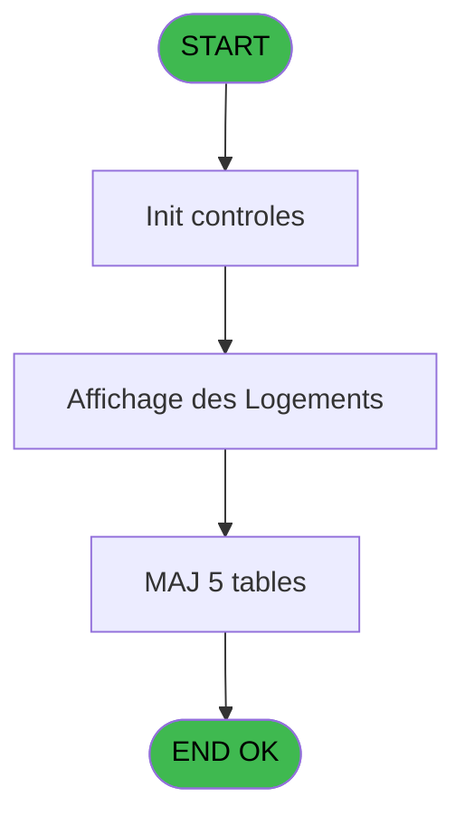
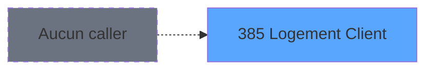
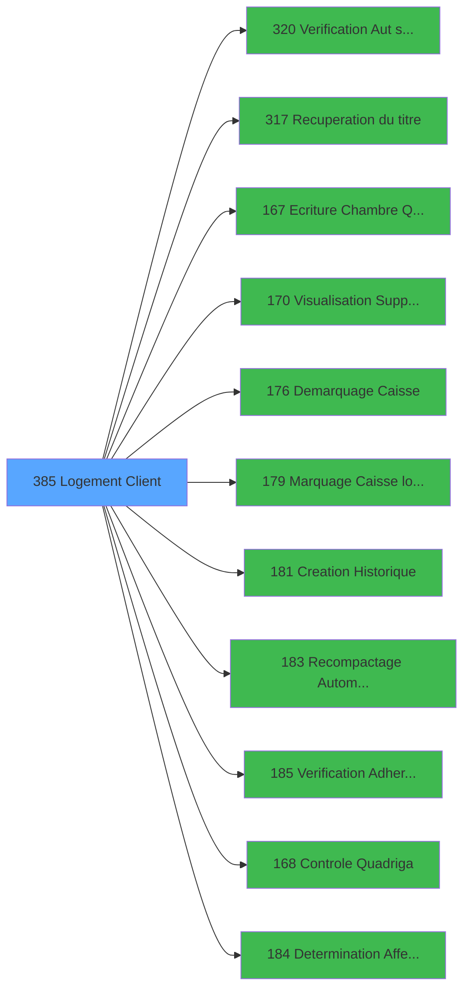

# PBG IDE 385 - Logement Client

> **Analyse**: Phases 1-4 2026-02-03 11:35 -> 11:35 (22s) | Assemblage 11:35
> **Pipeline**: V7.2 Enrichi
> **Structure**: 4 onglets (Resume | Ecrans | Donnees | Connexions)

<!-- TAB:Resume -->

## 1. FICHE D'IDENTITE

| Attribut | Valeur |
|----------|--------|
| Projet | PBG |
| IDE Position | 385 |
| Nom Programme | Logement Client |
| Fichier source | `Prg_385.xml` |
| Dossier IDE | General |
| Taches | 39 (10 ecrans visibles) |
| Tables modifiees | 5 |
| Programmes appeles | 11 |
| :warning: Statut | **ORPHELIN_POTENTIEL** |

## 2. DESCRIPTION FONCTIONNELLE

**Logement Client** assure la gestion complete de ce processus.

Le flux de traitement s'organise en **5 blocs fonctionnels** :

- **Traitement** (14 taches) : traitements metier divers
- **Consultation** (8 taches) : ecrans de recherche, selection et consultation
- **Creation** (7 taches) : insertion d'enregistrements en base (mouvements, prestations)
- **Validation** (7 taches) : controles et verifications de coherence
- **Saisie** (3 taches) : ecrans de saisie utilisateur (formulaires, champs, donnees)

**Donnees modifiees** : 5 tables en ecriture (hebergement______heb, historik_station, logement_client__loc, fi_complet_______gm_go, tairejet).

Detail : phases du traitement

#### Phase 1 : Traitement (14 taches)

- **385** - Logement Standard **[[ECRAN]](#ecran-t1)**
- **385.2.3** - Traitement Adherents **[[ECRAN]](#ecran-t6)**
- **385.2.3.1** - Liberation Hebergement
- **385.2.3.2** - Effaçage Blocage
- **385.2.3.3** - Efface chambre
- **385.2.4.1** - Listes des adherents **[[ECRAN]](#ecran-t11)**
- **385.2.4.1.2** - Mise à Jour Hebergement
- **385.2.4.1.6** - Mise à Jour Hebergement
- **385.2.5** - Blocage Logement **[[ECRAN]](#ecran-t20)**
- **385.2.5.4** - Attribution N°Blocage
- **385.2.6** - Statut logement
- **385.2.8** - Blocage Logement **[[ECRAN]](#ecran-t31)**
- **385.2.8.4** - Attribution N°Blocage
- **385.2.9** - Update Pickable

Delegue a : [Recuperation du titre (IDE 317)](PBG-IDE-317.md), [Ecriture Chambre Quadriga (IDE 167)](PBG-IDE-167.md), [  Visualisation Supplementaire (IDE 170)](PBG-IDE-170.md), [Demarquage Caisse (IDE 176)](PBG-IDE-176.md), [Marquage Caisse logique (IDE 179)](PBG-IDE-179.md), [Recompactage Automatique (IDE 183)](PBG-IDE-183.md), [Determination Affectation (IDE 184)](PBG-IDE-184.md)

#### Phase 2 : Validation (7 taches)

- **385.1** - Verification Logement
- **385.2.4.1.4** - Verification Adherents
- **385.2.4.1.7** - verif eci
- **385.2.5.2** - Verification Logement
- **385.2.5.3** - Verification Blocage
- **385.2.8.2** - Verification Logement
- **385.2.8.3** - Verification Blocage

Delegue a : [Verification Aut sans ecran (IDE 320)](PBG-IDE-320.md), [Verification Adherents (IDE 185)](PBG-IDE-185.md), [Controle Quadriga (IDE 168)](PBG-IDE-168.md)

#### Phase 3 : Consultation (8 taches)

- **385.2** - Affichage des logements PYR **[[ECRAN]](#ecran-t3)**
- **385.2.1** - Affichage Communicante **[[ECRAN]](#ecran-t4)**
- **385.2.2** - Affichage Proximite **[[ECRAN]](#ecran-t5)**
- **385.2.4** - Affichage Adherent batch **[[ECRAN]](#ecran-t10)**
- **385.2.4.1.5** - Recherche Adherents **[[ECRAN]](#ecran-t17)**
- **385.2.5.4.1** - Recherche N°Blocage
- **385.2.7** - Recherche Logement **[[ECRAN]](#ecran-t30)**
- **385.2.8.4.1** - Recherche N°Blocage

Delegue a : [Recuperation du titre (IDE 317)](PBG-IDE-317.md)

#### Phase 4 : Saisie (3 taches)

- **385.2.4.1.1** - Saisie Commentaire **[[ECRAN]](#ecran-t12)**
- **385.2.5.1** - Saisie Blocage **[[ECRAN]](#ecran-t21)**
- **385.2.8.1** - Saisie Reservation **[[ECRAN]](#ecran-t32)**

#### Phase 5 : Creation (7 taches)

- **385.2.4.1.2.1** - Creation chambre
- **385.2.4.1.3** - Creation Historique
- **385.2.5.5** - Creation Blocage
- **385.2.5.6** - Creation Historique
- **385.2.6.1** - Creation Historique
- **385.2.8.5** - Creation Blocage
- **385.2.8.6** - Creation Historique

Delegue a : [Creation Historique (IDE 181)](PBG-IDE-181.md)

#### Tables impactees

| Table | Operations | Role metier |
|-------|-----------|-------------|
| hebergement______heb | R/**W**/L (14 usages) | Hebergement (chambres) |
| historik_station | **W** (4 usages) | Historique / journal |
| logement_client__loc | R/**W**/L (3 usages) |  |
| tairejet | **W** (2 usages) |  |
| fi_complet_______gm_go | **W** (1 usages) |  |

## 3. BLOCS FONCTIONNELS

### 3.1 Traitement (14 taches)

Traitements internes.

---

#### 385 - Logement Standard [[ECRAN]](#ecran-t1)

**Role** : Tache d'orchestration : point d'entree du programme (14 sous-taches). Coordonne l'enchainement des traitements.
**Ecran** : 175 x 90 DLU (MDI) | [Voir mockup](#ecran-t1)

13 sous-taches directes

| Tache | Nom | Bloc |
|-------|-----|------|
| [385.2.3](#t6) | Traitement Adherents **[[ECRAN]](#ecran-t6)** | Traitement |
| [385.2.3.1](#t7) | Liberation Hebergement | Traitement |
| [385.2.3.2](#t8) | Effaçage Blocage | Traitement |
| [385.2.3.3](#t9) | Efface chambre | Traitement |
| [385.2.4.1](#t11) | Listes des adherents **[[ECRAN]](#ecran-t11)** | Traitement |
| [385.2.4.1.2](#t13) | Mise à Jour Hebergement | Traitement |
| [385.2.4.1.6](#t18) | Mise à Jour Hebergement | Traitement |
| [385.2.5](#t20) | Blocage Logement **[[ECRAN]](#ecran-t20)** | Traitement |
| [385.2.5.4](#t24) | Attribution N°Blocage | Traitement |
| [385.2.6](#t28) | Statut logement | Traitement |
| [385.2.8](#t31) | Blocage Logement **[[ECRAN]](#ecran-t31)** | Traitement |
| [385.2.8.4](#t35) | Attribution N°Blocage | Traitement |
| [385.2.9](#t39) | Update Pickable | Traitement |

**Variables liees** : A (> logement)

---

#### 385.2.3 - Traitement Adherents [[ECRAN]](#ecran-t6)

**Role** : Traitement : Traitement Adherents.
**Ecran** : 1406 x 176 DLU (Modal) | [Voir mockup](#ecran-t6)

---

#### 385.2.3.1 - Liberation Hebergement

**Role** : Traitement : Liberation Hebergement.

---

#### 385.2.3.2 - Effaçage Blocage

**Role** : Traitement : Effaçage Blocage.

---

#### 385.2.3.3 - Efface chambre

**Role** : Traitement : Efface chambre.

---

#### 385.2.4.1 - Listes des adherents [[ECRAN]](#ecran-t11)

**Role** : Traitement : Listes des adherents.
**Ecran** : 1144 x 246 DLU (MDI) | [Voir mockup](#ecran-t11)

---

#### 385.2.4.1.2 - Mise à Jour Hebergement

**Role** : Traitement : Mise à Jour Hebergement.

---

#### 385.2.4.1.6 - Mise à Jour Hebergement

**Role** : Traitement : Mise à Jour Hebergement.

---

#### 385.2.5 - Blocage Logement [[ECRAN]](#ecran-t20)

**Role** : Traitement : Blocage Logement.
**Ecran** : 156 x 80 DLU (MDI) | [Voir mockup](#ecran-t20)
**Variables liees** : A (> logement)

---

#### 385.2.5.4 - Attribution N°Blocage

**Role** : Traitement : Attribution N°Blocage.

---

#### 385.2.6 - Statut logement

**Role** : Traitement : Statut logement.
**Variables liees** : A (> logement)

---

#### 385.2.8 - Blocage Logement [[ECRAN]](#ecran-t31)

**Role** : Traitement : Blocage Logement.
**Ecran** : 156 x 80 DLU (MDI) | [Voir mockup](#ecran-t31)
**Variables liees** : A (> logement)

---

#### 385.2.8.4 - Attribution N°Blocage

**Role** : Traitement : Attribution N°Blocage.

---

#### 385.2.9 - Update Pickable

**Role** : Traitement : Update Pickable.

### 3.2 Validation (7 taches)

Controles de coherence : 7 taches verifient les donnees et conditions.

---

#### 385.1 - Verification Logement

**Role** : Verification : Verification Logement.
**Variables liees** : A (> logement)
**Delegue a** : [Verification Aut sans ecran (IDE 320)](PBG-IDE-320.md), [Verification Adherents (IDE 185)](PBG-IDE-185.md), [Controle Quadriga (IDE 168)](PBG-IDE-168.md)

---

#### 385.2.4.1.4 - Verification Adherents

**Role** : Verification : Verification Adherents.
**Delegue a** : [Verification Aut sans ecran (IDE 320)](PBG-IDE-320.md), [Verification Adherents (IDE 185)](PBG-IDE-185.md), [Controle Quadriga (IDE 168)](PBG-IDE-168.md)

---

#### 385.2.4.1.7 - verif eci

**Role** : Verification : verif eci.
**Delegue a** : [Verification Aut sans ecran (IDE 320)](PBG-IDE-320.md), [Verification Adherents (IDE 185)](PBG-IDE-185.md), [Controle Quadriga (IDE 168)](PBG-IDE-168.md)

---

#### 385.2.5.2 - Verification Logement

**Role** : Verification : Verification Logement.
**Variables liees** : A (> logement)
**Delegue a** : [Verification Aut sans ecran (IDE 320)](PBG-IDE-320.md), [Verification Adherents (IDE 185)](PBG-IDE-185.md), [Controle Quadriga (IDE 168)](PBG-IDE-168.md)

---

#### 385.2.5.3 - Verification Blocage

**Role** : Verification : Verification Blocage.
**Delegue a** : [Verification Aut sans ecran (IDE 320)](PBG-IDE-320.md), [Verification Adherents (IDE 185)](PBG-IDE-185.md), [Controle Quadriga (IDE 168)](PBG-IDE-168.md)

---

#### 385.2.8.2 - Verification Logement

**Role** : Verification : Verification Logement.
**Variables liees** : A (> logement)
**Delegue a** : [Verification Aut sans ecran (IDE 320)](PBG-IDE-320.md), [Verification Adherents (IDE 185)](PBG-IDE-185.md), [Controle Quadriga (IDE 168)](PBG-IDE-168.md)

---

#### 385.2.8.3 - Verification Blocage

**Role** : Verification : Verification Blocage.
**Delegue a** : [Verification Aut sans ecran (IDE 320)](PBG-IDE-320.md), [Verification Adherents (IDE 185)](PBG-IDE-185.md), [Controle Quadriga (IDE 168)](PBG-IDE-168.md)

### 3.3 Consultation (8 taches)

Ecrans de recherche et consultation.

---

#### 385.2 - Affichage des logements PYR [[ECRAN]](#ecran-t3)

**Role** : Reinitialisation : Affichage des logements PYR.
**Ecran** : 1648 x 364 DLU (MDI) | [Voir mockup](#ecran-t3)
**Variables liees** : V (Choix affichage)

---

#### 385.2.1 - Affichage Communicante [[ECRAN]](#ecran-t4)

**Role** : Reinitialisation : Affichage Communicante.
**Ecran** : 142 x 78 DLU (Modal) | [Voir mockup](#ecran-t4)
**Variables liees** : V (Choix affichage)

---

#### 385.2.2 - Affichage Proximite [[ECRAN]](#ecran-t5)

**Role** : Reinitialisation : Affichage Proximite.
**Ecran** : 144 x 84 DLU (Modal) | [Voir mockup](#ecran-t5)
**Variables liees** : V (Choix affichage)

---

#### 385.2.4 - Affichage Adherent batch [[ECRAN]](#ecran-t10)

**Role** : Reinitialisation : Affichage Adherent batch.
**Ecran** : 121 x 9 DLU (MDI) | [Voir mockup](#ecran-t10)
**Variables liees** : V (Choix affichage)

---

#### 385.2.4.1.5 - Recherche Adherents [[ECRAN]](#ecran-t17)

**Role** : Traitement : Recherche Adherents.
**Ecran** : 538 x 113 DLU (MDI) | [Voir mockup](#ecran-t17)
**Variables liees** : G (W0-Recherche Std), H (W0-Recherche Cpt)

---

#### 385.2.5.4.1 - Recherche N°Blocage

**Role** : Traitement : Recherche N°Blocage.
**Variables liees** : G (W0-Recherche Std), H (W0-Recherche Cpt)

---

#### 385.2.7 - Recherche Logement [[ECRAN]](#ecran-t30)

**Role** : Traitement : Recherche Logement.
**Ecran** : 558 x 108 DLU (MDI) | [Voir mockup](#ecran-t30)
**Variables liees** : A (> logement), G (W0-Recherche Std), H (W0-Recherche Cpt)

---

#### 385.2.8.4.1 - Recherche N°Blocage

**Role** : Traitement : Recherche N°Blocage.
**Variables liees** : G (W0-Recherche Std), H (W0-Recherche Cpt)

### 3.4 Saisie (3 taches)

L'operateur saisit les donnees de la transaction via 3 ecrans (Saisie Commentaire, Saisie Blocage, Saisie Reservation).

---

#### 385.2.4.1.1 - Saisie Commentaire [[ECRAN]](#ecran-t12)

**Role** : Saisie des donnees : Saisie Commentaire.
**Ecran** : 878 x 79 DLU (MDI) | [Voir mockup](#ecran-t12)

---

#### 385.2.5.1 - Saisie Blocage [[ECRAN]](#ecran-t21)

**Role** : Saisie des donnees : Saisie Blocage.
**Ecran** : 509 x 97 DLU (MDI) | [Voir mockup](#ecran-t21)

---

#### 385.2.8.1 - Saisie Reservation [[ECRAN]](#ecran-t32)

**Role** : Saisie des donnees : Saisie Reservation.
**Ecran** : 509 x 97 DLU (MDI) | [Voir mockup](#ecran-t32)

### 3.5 Creation (7 taches)

Insertion de nouveaux enregistrements en base.

---

#### 385.2.4.1.2.1 - Creation chambre

**Role** : Creation d'enregistrement : Creation chambre.
**Delegue a** : [Creation Historique (IDE 181)](PBG-IDE-181.md)

---

#### 385.2.4.1.3 - Creation Historique

**Role** : Consultation/chargement : Creation Historique.
**Delegue a** : [Creation Historique (IDE 181)](PBG-IDE-181.md)

---

#### 385.2.5.5 - Creation Blocage

**Role** : Creation d'enregistrement : Creation Blocage.
**Delegue a** : [Creation Historique (IDE 181)](PBG-IDE-181.md)

---

#### 385.2.5.6 - Creation Historique

**Role** : Consultation/chargement : Creation Historique.
**Delegue a** : [Creation Historique (IDE 181)](PBG-IDE-181.md)

---

#### 385.2.6.1 - Creation Historique

**Role** : Consultation/chargement : Creation Historique.
**Delegue a** : [Creation Historique (IDE 181)](PBG-IDE-181.md)

---

#### 385.2.8.5 - Creation Blocage

**Role** : Creation d'enregistrement : Creation Blocage.
**Delegue a** : [Creation Historique (IDE 181)](PBG-IDE-181.md)

---

#### 385.2.8.6 - Creation Historique

**Role** : Consultation/chargement : Creation Historique.
**Delegue a** : [Creation Historique (IDE 181)](PBG-IDE-181.md)

## 5. REGLES METIER

*(Aucune regle metier identifiee)*

## 6. CONTEXTE

- **Appele par**: (aucun)
- **Appelle**: 11 programmes | **Tables**: 16 (W:5 R:6 L:9) | **Taches**: 39 | **Expressions**: 22

<!-- TAB:Ecrans -->

## 8. ECRANS

### 8.1 Forms visibles (10 / 39)

| # | Position | Tache | Nom | Type | Largeur | Hauteur | Bloc |
|---|----------|-------|-----|------|---------|---------|------|
| 1 | 385.2 | 385.2 | Affichage des logements PYR | MDI | 1648 | 364 | Consultation |
| 2 | 385.2.1 | 385.2.1 | Affichage Communicante | Modal | 142 | 78 | Consultation |
| 3 | 385.2.2 | 385.2.2 | Affichage Proximite | Modal | 144 | 84 | Consultation |
| 4 | 385.2.3 | 385.2.3 | Traitement Adherents | Modal | 1406 | 176 | Traitement |
| 5 | 385.2.4.1 | 385.2.4.1 | Listes des adherents | MDI | 1144 | 246 | Traitement |
| 6 | 385.2.4.1.1 | 385.2.4.1.1 | Saisie Commentaire | MDI | 878 | 79 | Saisie |
| 7 | 385.2.4.1.5 | 385.2.4.1.5 | Recherche Adherents | MDI | 538 | 113 | Consultation |
| 8 | 385.2.5.1 | 385.2.5.1 | Saisie Blocage | MDI | 509 | 97 | Saisie |
| 9 | 385.2.7 | 385.2.7 | Recherche Logement | MDI | 558 | 108 | Consultation |
| 10 | 385.2.8.1 | 385.2.8.1 | Saisie Reservation | MDI | 509 | 97 | Saisie |

### 8.2 Mockups Ecrans

---

#### 385.2 - Affichage des logements PYR
**Tache** : [385.2](#t3) | **Type** : MDI | **Dimensions** : 1648 x 364 DLU
**Bloc** : Consultation | **Titre IDE** : Affichage des logements PYR

<!-- FORM-DATA:
{
    "width":  1648,
    "vFactor":  8,
    "type":  "MDI",
    "hFactor":  8,
    "controls":  [
                     {
                         "x":  0,
                         "type":  "label",
                         "var":  "",
                         "y":  2,
                         "w":  1638,
                         "fmt":  "",
                         "name":  "",
                         "h":  18,
                         "color":  "",
                         "text":  "",
                         "parent":  null
                     },
                     {
                         "x":  0,
                         "type":  "label",
                         "var":  "",
                         "y":  338,
                         "w":  1637,
                         "fmt":  "",
                         "name":  "",
                         "h":  24,
                         "color":  "",
                         "text":  "",
                         "parent":  null
                     },
                     {
                         "x":  0,
                         "type":  "table",
                         "var":  "",
                         "name":  "",
                         "titleH":  12,
                         "color":  "110",
                         "w":  230,
                         "y":  24,
                         "fmt":  "",
                         "parent":  null,
                         "text":  "",
                         "rowH":  13,
                         "h":  306,
                         "cols":  [
                                      {
                                          "title":  "Standard",
                                          "layer":  1,
                                          "w":  107
                                      },
                                      {
                                          "title":  "Pickable",
                                          "layer":  2,
                                          "w":  85
                                      }
                                  ],
                         "rows":  2
                     },
                     {
                         "x":  11,
                         "type":  "label",
                         "var":  "",
                         "y":  40,
                         "w":  23,
                         "fmt":  "",
                         "name":  "",
                         "h":  8,
                         "color":  "146",
                         "text":  "è",
                         "parent":  7
                     },
                     {
                         "x":  234,
                         "type":  "label",
                         "var":  "",
                         "y":  24,
                         "w":  1219,
                         "fmt":  "",
                         "name":  "",
                         "h":  32,
                         "color":  "",
                         "text":  "",
                         "parent":  null
                     },
                     {
                         "x":  512,
                         "type":  "label",
                         "var":  "",
                         "y":  32,
                         "w":  53,
                         "fmt":  "",
                         "name":  "",
                         "h":  8,
                         "color":  "",
                         "text":  "Statut",
                         "parent":  13
                     },
                     {
                         "x":  572,
                         "type":  "label",
                         "var":  "",
                         "y":  32,
                         "w":  119,
                         "fmt":  "",
                         "name":  "",
                         "h":  8,
                         "color":  "",
                         "text":  "Tel. Intérieur",
                         "parent":  13
                     },
                     {
                         "x":  682,
                         "type":  "label",
                         "var":  "",
                         "y":  32,
                         "w":  193,
                         "fmt":  "",
                         "name":  "",
                         "h":  8,
                         "color":  "",
                         "text":  "Lieu sej/Code log.",
                         "parent":  13
                     },
                     {
                         "x":  881,
                         "type":  "label",
                         "var":  "",
                         "y":  32,
                         "w":  74,
                         "fmt":  "",
                         "name":  "",
                         "h":  8,
                         "color":  "",
                         "text":  "Standing",
                         "parent":  13
                     },
                     {
                         "x":  970,
                         "type":  "label",
                         "var":  "",
                         "y":  32,
                         "w":  87,
                         "fmt":  "",
                         "name":  "",
                         "h":  8,
                         "color":  "",
                         "text":  "Attribution",
                         "parent":  13
                     },
                     {
                         "x":  1467,
                         "type":  "label",
                         "var":  "",
                         "y":  24,
                         "w":  173,
                         "fmt":  "",
                         "name":  "",
                         "h":  131,
                         "color":  "",
                         "text":  "",
                         "parent":  null
                     },
                     {
                         "x":  236,
                         "type":  "label",
                         "var":  "",
                         "y":  57,
                         "w":  897,
                         "fmt":  "",
                         "name":  "",
                         "h":  98,
                         "color":  "195",
                         "text":  "Renseignements",
                         "parent":  null
                     },
                     {
                         "x":  559,
                         "type":  "label",
                         "var":  "",
                         "y":  67,
                         "w":  72,
                         "fmt":  "",
                         "name":  "",
                         "h":  8,
                         "color":  "",
                         "text":  "Lit Pliant",
                         "parent":  32
                     },
                     {
                         "x":  250,
                         "type":  "label",
                         "var":  "",
                         "y":  68,
                         "w":  91,
                         "fmt":  "",
                         "name":  "",
                         "h":  8,
                         "color":  "",
                         "text":  "Ensemble",
                         "parent":  32
                     },
                     {
                         "x":  559,
                         "type":  "label",
                         "var":  "",
                         "y":  82,
                         "w":  73,
                         "fmt":  "",
                         "name":  "",
                         "h":  8,
                         "color":  "",
                         "text":  "Lit Bébé",
                         "parent":  32
                     },
                     {
                         "x":  250,
                         "type":  "label",
                         "var":  "",
                         "y":  83,
                         "w":  109,
                         "fmt":  "",
                         "name":  "",
                         "h":  8,
                         "color":  "",
                         "text":  "Logement :",
                         "parent":  32
                     },
                     {
                         "x":  559,
                         "type":  "label",
                         "var":  "",
                         "y":  97,
                         "w":  86,
                         "fmt":  "",
                         "name":  "",
                         "h":  8,
                         "color":  "",
                         "text":  "Banquette",
                         "parent":  32
                     },
                     {
                         "x":  250,
                         "type":  "label",
                         "var":  "",
                         "y":  98,
                         "w":  80,
                         "fmt":  "",
                         "name":  "",
                         "h":  8,
                         "color":  "",
                         "text":  "Batiment",
                         "parent":  32
                     },
                     {
                         "x":  559,
                         "type":  "label",
                         "var":  "",
                         "y":  111,
                         "w":  48,
                         "fmt":  "",
                         "name":  "",
                         "h":  8,
                         "color":  "",
                         "text":  "Zone",
                         "parent":  32
                     },
                     {
                         "x":  250,
                         "type":  "label",
                         "var":  "",
                         "y":  112,
                         "w":  53,
                         "fmt":  "",
                         "name":  "",
                         "h":  8,
                         "color":  "",
                         "text":  "Etage",
                         "parent":  32
                     },
                     {
                         "x":  559,
                         "type":  "label",
                         "var":  "",
                         "y":  126,
                         "w":  67,
                         "fmt":  "",
                         "name":  "",
                         "h":  8,
                         "color":  "",
                         "text":  "Secteur",
                         "parent":  32
                     },
                     {
                         "x":  250,
                         "type":  "label",
                         "var":  "",
                         "y":  127,
                         "w":  38,
                         "fmt":  "",
                         "name":  "",
                         "h":  8,
                         "color":  "",
                         "text":  "Vue",
                         "parent":  32
                     },
                     {
                         "x":  559,
                         "type":  "label",
                         "var":  "",
                         "y":  141,
                         "w":  91,
                         "fmt":  "",
                         "name":  "",
                         "h":  8,
                         "color":  "",
                         "text":  "Handicapé",
                         "parent":  32
                     },
                     {
                         "x":  250,
                         "type":  "label",
                         "var":  "",
                         "y":  142,
                         "w":  96,
                         "fmt":  "",
                         "name":  "",
                         "h":  8,
                         "color":  "",
                         "text":  "Occupation",
                         "parent":  32
                     },
                     {
                         "x":  1144,
                         "type":  "label",
                         "var":  "",
                         "y":  57,
                         "w":  311,
                         "fmt":  "",
                         "name":  "",
                         "h":  98,
                         "color":  "195",
                         "text":  "Chambres voisines",
                         "parent":  null
                     },
                     {
                         "x":  835,
                         "type":  "label",
                         "var":  "",
                         "y":  68,
                         "w":  108,
                         "fmt":  "",
                         "name":  "",
                         "h":  8,
                         "color":  "",
                         "text":  "Orientation",
                         "parent":  32
                     },
                     {
                         "x":  835,
                         "type":  "label",
                         "var":  "",
                         "y":  83,
                         "w":  108,
                         "fmt":  "",
                         "name":  "",
                         "h":  8,
                         "color":  "",
                         "text":  "Proche centre",
                         "parent":  32
                     },
                     {
                         "x":  835,
                         "type":  "label",
                         "var":  "",
                         "y":  98,
                         "w":  108,
                         "fmt":  "",
                         "name":  "",
                         "h":  8,
                         "color":  "",
                         "text":  "Plus Belle",
                         "parent":  32
                     },
                     {
                         "x":  40,
                         "type":  "edit",
                         "var":  "",
                         "y":  39,
                         "w":  75,
                         "fmt":  "U6A",
                         "name":  "LOC Nom Standard",
                         "h":  8,
                         "color":  "110",
                         "text":  "",
                         "parent":  7
                     },
                     {
                         "x":  605,
                         "type":  "edit",
                         "var":  "",
                         "y":  43,
                         "w":  75,
                         "fmt":  "",
                         "name":  "",
                         "h":  8,
                         "color":  "",
                         "text":  "",
                         "parent":  13
                     },
                     {
                         "x":  903,
                         "type":  "edit",
                         "var":  "",
                         "y":  43,
                         "w":  30,
                         "fmt":  "",
                         "name":  "",
                         "h":  8,
                         "color":  "",
                         "text":  "",
                         "parent":  13
                     },
                     {
                         "x":  358,
                         "type":  "edit",
                         "var":  "",
                         "y":  67,
                         "w":  195,
                         "fmt":  "",
                         "name":  "LOC Ensemble",
                         "h":  9,
                         "color":  "",
                         "text":  "",
                         "parent":  32
                     },
                     {
                         "x":  358,
                         "type":  "edit",
                         "var":  "",
                         "y":  83,
                         "w":  195,
                         "fmt":  "",
                         "name":  "libelle_type_logement",
                         "h":  9,
                         "color":  "",
                         "text":  "",
                         "parent":  32
                     },
                     {
                         "x":  358,
                         "type":  "edit",
                         "var":  "",
                         "y":  98,
                         "w":  195,
                         "fmt":  "",
                         "name":  "libelle_batiment",
                         "h":  9,
                         "color":  "",
                         "text":  "",
                         "parent":  32
                     },
                     {
                         "x":  358,
                         "type":  "edit",
                         "var":  "",
                         "y":  112,
                         "w":  195,
                         "fmt":  "",
                         "name":  "",
                         "h":  9,
                         "color":  "",
                         "text":  "",
                         "parent":  32
                     },
                     {
                         "x":  358,
                         "type":  "edit",
                         "var":  "",
                         "y":  127,
                         "w":  195,
                         "fmt":  "",
                         "name":  "libelle_vue",
                         "h":  9,
                         "color":  "",
                         "text":  "",
                         "parent":  32
                     },
                     {
                         "x":  358,
                         "type":  "edit",
                         "var":  "",
                         "y":  142,
                         "w":  195,
                         "fmt":  "",
                         "name":  "",
                         "h":  9,
                         "color":  "",
                         "text":  "",
                         "parent":  32
                     },
                     {
                         "x":  655,
                         "type":  "edit",
                         "var":  "",
                         "y":  111,
                         "w":  171,
                         "fmt":  "",
                         "name":  "nom_zone",
                         "h":  9,
                         "color":  "",
                         "text":  "",
                         "parent":  32
                     },
                     {
                         "x":  655,
                         "type":  "edit",
                         "var":  "",
                         "y":  126,
                         "w":  171,
                         "fmt":  "",
                         "name":  "nom_secteur",
                         "h":  9,
                         "color":  "",
                         "text":  "",
                         "parent":  32
                     },
                     {
                         "x":  1478,
                         "type":  "button",
                         "var":  "",
                         "y":  341,
                         "w":  154,
                         "fmt":  "\u0026Recherche",
                         "name":  "B_Rechercher",
                         "h":  18,
                         "color":  "",
                         "text":  "",
                         "parent":  6
                     },
                     {
                         "x":  1478,
                         "type":  "button",
                         "var":  "",
                         "y":  33,
                         "w":  154,
                         "fmt":  "15",
                         "name":  "B_Affecter",
                         "h":  18,
                         "color":  "",
                         "text":  "",
                         "parent":  25
                     },
                     {
                         "x":  1478,
                         "type":  "button",
                         "var":  "",
                         "y":  53,
                         "w":  154,
                         "fmt":  "",
                         "name":  "Bouton Reaffecter",
                         "h":  18,
                         "color":  "",
                         "text":  "",
                         "parent":  25
                     },
                     {
                         "x":  1429,
                         "type":  "edit",
                         "var":  "",
                         "y":  6,
                         "w":  203,
                         "fmt":  "WWW DD MMM YYYYT",
                         "name":  "",
                         "h":  8,
                         "color":  "",
                         "text":  "",
                         "parent":  1
                     },
                     {
                         "x":  9,
                         "type":  "edit",
                         "var":  "",
                         "y":  7,
                         "w":  395,
                         "fmt":  "30",
                         "name":  "",
                         "h":  8,
                         "color":  "",
                         "text":  "",
                         "parent":  1
                     },
                     {
                         "x":  258,
                         "type":  "edit",
                         "var":  "",
                         "y":  43,
                         "w":  203,
                         "fmt":  "15",
                         "name":  "",
                         "h":  8,
                         "color":  "142",
                         "text":  "",
                         "parent":  13
                     },
                     {
                         "x":  484,
                         "type":  "edit",
                         "var":  "",
                         "y":  43,
                         "w":  109,
                         "fmt":  "9",
                         "name":  "",
                         "h":  8,
                         "color":  "",
                         "text":  "",
                         "parent":  13
                     },
                     {
                         "x":  682,
                         "type":  "edit",
                         "var":  "",
                         "y":  43,
                         "w":  193,
                         "fmt":  "30",
                         "name":  "",
                         "h":  8,
                         "color":  "",
                         "text":  "",
                         "parent":  13
                     },
                     {
                         "x":  998,
                         "type":  "edit",
                         "var":  "",
                         "y":  43,
                         "w":  30,
                         "fmt":  "2",
                         "name":  "",
                         "h":  8,
                         "color":  "",
                         "text":  "",
                         "parent":  13
                     },
                     {
                         "x":  22,
                         "type":  "image",
                         "var":  "",
                         "y":  58,
                         "w":  165,
                         "fmt":  "",
                         "name":  "",
                         "h":  58,
                         "color":  "",
                         "text":  "",
                         "parent":  null
                     },
                     {
                         "x":  655,
                         "type":  "edit",
                         "var":  "",
                         "y":  67,
                         "w":  171,
                         "fmt":  "4",
                         "name":  "",
                         "h":  9,
                         "color":  "",
                         "text":  "",
                         "parent":  32
                     },
                     {
                         "x":  1478,
                         "type":  "button",
                         "var":  "",
                         "y":  73,
                         "w":  154,
                         "fmt":  "\u0026Bloquer",
                         "name":  "",
                         "h":  18,
                         "color":  "",
                         "text":  "",
                         "parent":  25
                     },
                     {
                         "x":  655,
                         "type":  "edit",
                         "var":  "",
                         "y":  82,
                         "w":  171,
                         "fmt":  "4",
                         "name":  "",
                         "h":  9,
                         "color":  "",
                         "text":  "",
                         "parent":  32
                     },
                     {
                         "x":  655,
                         "type":  "edit",
                         "var":  "",
                         "y":  97,
                         "w":  171,
                         "fmt":  "4",
                         "name":  "",
                         "h":  9,
                         "color":  "",
                         "text":  "",
                         "parent":  32
                     },
                     {
                         "x":  1478,
                         "type":  "button",
                         "var":  "",
                         "y":  93,
                         "w":  154,
                         "fmt":  "\u0026Statuer",
                         "name":  "",
                         "h":  18,
                         "color":  "",
                         "text":  "",
                         "parent":  25
                     },
                     {
                         "x":  1478,
                         "type":  "button",
                         "var":  "",
                         "y":  113,
                         "w":  154,
                         "fmt":  "\u0026Réservation",
                         "name":  "",
                         "h":  18,
                         "color":  "",
                         "text":  "",
                         "parent":  25
                     },
                     {
                         "x":  655,
                         "type":  "edit",
                         "var":  "",
                         "y":  141,
                         "w":  171,
                         "fmt":  "4",
                         "name":  "",
                         "h":  9,
                         "color":  "",
                         "text":  "",
                         "parent":  32
                     },
                     {
                         "x":  22,
                         "type":  "image",
                         "var":  "",
                         "y":  175,
                         "w":  163,
                         "fmt":  "",
                         "name":  "",
                         "h":  44,
                         "color":  "",
                         "text":  "",
                         "parent":  null
                     },
                     {
                         "x":  7,
                         "type":  "button",
                         "var":  "",
                         "y":  341,
                         "w":  154,
                         "fmt":  "\u0026Quitter",
                         "name":  "",
                         "h":  18,
                         "color":  "",
                         "text":  "",
                         "parent":  6
                     },
                     {
                         "x":  234,
                         "type":  "subform",
                         "var":  "",
                         "y":  158,
                         "w":  1406,
                         "fmt":  "",
                         "name":  "Traitement Adherents",
                         "h":  174,
                         "color":  "",
                         "text":  "",
                         "parent":  null
                     },
                     {
                         "x":  1149,
                         "type":  "subform",
                         "var":  "",
                         "y":  66,
                         "w":  151,
                         "fmt":  "",
                         "name":  "Affichage Communicante",
                         "h":  87,
                         "color":  "",
                         "text":  "",
                         "parent":  57
                     },
                     {
                         "x":  1302,
                         "type":  "subform",
                         "var":  "",
                         "y":  66,
                         "w":  150,
                         "fmt":  "",
                         "name":  "Affichage Proximite",
                         "h":  87,
                         "color":  "",
                         "text":  "",
                         "parent":  57
                     },
                     {
                         "x":  1478,
                         "type":  "button",
                         "var":  "",
                         "y":  133,
                         "w":  154,
                         "fmt":  "\u0026VOD",
                         "name":  "",
                         "h":  18,
                         "color":  "",
                         "text":  "",
                         "parent":  25
                     },
                     {
                         "x":  949,
                         "type":  "edit",
                         "var":  "",
                         "y":  68,
                         "w":  171,
                         "fmt":  "30",
                         "name":  "libelle_orientation",
                         "h":  9,
                         "color":  "",
                         "text":  "",
                         "parent":  32
                     },
                     {
                         "x":  949,
                         "type":  "edit",
                         "var":  "",
                         "y":  83,
                         "w":  171,
                         "fmt":  "4",
                         "name":  "",
                         "h":  9,
                         "color":  "",
                         "text":  "",
                         "parent":  32
                     },
                     {
                         "x":  949,
                         "type":  "edit",
                         "var":  "",
                         "y":  98,
                         "w":  171,
                         "fmt":  "4",
                         "name":  "",
                         "h":  9,
                         "color":  "",
                         "text":  "",
                         "parent":  32
                     },
                     {
                         "x":  140,
                         "type":  "checkbox",
                         "var":  "",
                         "y":  39,
                         "w":  32,
                         "fmt":  "",
                         "name":  "v.pickable",
                         "h":  9,
                         "color":  "6",
                         "text":  "",
                         "parent":  7
                     },
                     {
                         "x":  176,
                         "type":  "button",
                         "var":  "",
                         "y":  341,
                         "w":  154,
                         "fmt":  "\u0026Modifier",
                         "name":  "",
                         "h":  18,
                         "color":  "",
                         "text":  "",
                         "parent":  6
                     }
                 ],
    "taskId":  "385.2",
    "height":  364
}
-->

<strong>Champs : 25 champs</strong>

| Pos (x,y) | Nom | Variable | Type |
|-----------|-----|----------|------|
| 40,39 | LOC Nom Standard | - | edit |
| 605,43 | (sans nom) | - | edit |
| 903,43 | (sans nom) | - | edit |
| 358,67 | LOC Ensemble | - | edit |
| 358,83 | libelle_type_logement | - | edit |
| 358,98 | libelle_batiment | - | edit |
| 358,112 | (sans nom) | - | edit |
| 358,127 | libelle_vue | - | edit |
| 358,142 | (sans nom) | - | edit |
| 655,111 | nom_zone | - | edit |
| 655,126 | nom_secteur | - | edit |
| 1429,6 | WWW DD MMM YYYYT | - | edit |
| 9,7 | 30 | - | edit |
| 258,43 | 15 | - | edit |
| 484,43 | 9 | - | edit |
| 682,43 | 30 | - | edit |
| 998,43 | 2 | - | edit |
| 655,67 | 4 | - | edit |
| 655,82 | 4 | - | edit |
| 655,97 | 4 | - | edit |
| 655,141 | 4 | - | edit |
| 949,68 | libelle_orientation | - | edit |
| 949,83 | 4 | - | edit |
| 949,98 | 4 | - | edit |
| 140,39 | v.pickable | - | checkbox |

<strong>Boutons : 9 boutons</strong>

| Bouton | Pos (x,y) | Action |
|--------|-----------|--------|
| Recherche | 1478,341 | Ouvre la selection |
| 15 | 1478,33 | Bouton fonctionnel |
| Reaffecter | 1478,53 | Bouton fonctionnel |
| Bloquer | 1478,73 | Bouton fonctionnel |
| Statuer | 1478,93 | Bouton fonctionnel |
| Réservation | 1478,113 | Bouton fonctionnel |
| Quitter | 7,341 | Quitte le programme |
| VOD | 1478,133 | Bouton fonctionnel |
| Modifier | 176,341 | Modifie l'element |

---

#### 385.2.1 - Affichage Communicante
**Tache** : [385.2.1](#t4) | **Type** : Modal | **Dimensions** : 142 x 78 DLU
**Bloc** : Consultation | **Titre IDE** : Affichage Communicante

<!-- FORM-DATA:
{
    "width":  142,
    "vFactor":  8,
    "type":  "Modal",
    "hFactor":  8,
    "controls":  [
                     {
                         "x":  3,
                         "type":  "table",
                         "var":  "",
                         "name":  "",
                         "titleH":  12,
                         "color":  "110",
                         "w":  133,
                         "y":  0,
                         "fmt":  "",
                         "parent":  null,
                         "text":  "",
                         "rowH":  12,
                         "h":  75,
                         "cols":  [
                                      {
                                          "title":  "Communicante",
                                          "layer":  1,
                                          "w":  133
                                      }
                                  ],
                         "rows":  1
                     },
                     {
                         "x":  21,
                         "type":  "edit",
                         "var":  "",
                         "y":  15,
                         "w":  75,
                         "fmt":  "",
                         "name":  "",
                         "h":  8,
                         "color":  "110",
                         "text":  "",
                         "parent":  1
                     }
                 ],
    "taskId":  "385.2.1",
    "height":  78
}
-->

<strong>Champs : 1 champs</strong>

| Pos (x,y) | Nom | Variable | Type |
|-----------|-----|----------|------|
| 21,15 | (sans nom) | - | edit |

---

#### 385.2.2 - Affichage Proximite
**Tache** : [385.2.2](#t5) | **Type** : Modal | **Dimensions** : 144 x 84 DLU
**Bloc** : Consultation | **Titre IDE** : Affichage Proximite

<!-- FORM-DATA:
{
    "width":  144,
    "vFactor":  8,
    "type":  "Modal",
    "hFactor":  8,
    "controls":  [
                     {
                         "x":  3,
                         "type":  "table",
                         "var":  "",
                         "name":  "",
                         "titleH":  12,
                         "color":  "110",
                         "w":  141,
                         "y":  0,
                         "fmt":  "",
                         "parent":  null,
                         "text":  "",
                         "rowH":  12,
                         "h":  74,
                         "cols":  [
                                      {
                                          "title":  "Proximité",
                                          "layer":  1,
                                          "w":  135
                                      }
                                  ],
                         "rows":  1
                     },
                     {
                         "x":  26,
                         "type":  "edit",
                         "var":  "",
                         "y":  15,
                         "w":  75,
                         "fmt":  "",
                         "name":  "",
                         "h":  8,
                         "color":  "110",
                         "text":  "",
                         "parent":  1
                     }
                 ],
    "taskId":  "385.2.2",
    "height":  84
}
-->

<strong>Champs : 1 champs</strong>

| Pos (x,y) | Nom | Variable | Type |
|-----------|-----|----------|------|
| 26,15 | (sans nom) | - | edit |

---

#### 385.2.3 - Traitement Adherents
**Tache** : [385.2.3](#t6) | **Type** : Modal | **Dimensions** : 1406 x 176 DLU
**Bloc** : Traitement | **Titre IDE** : Traitement Adherents

<!-- FORM-DATA:
{
    "width":  1406,
    "vFactor":  8,
    "type":  "Modal",
    "hFactor":  8,
    "controls":  [
                     {
                         "x":  9,
                         "type":  "table",
                         "var":  "",
                         "name":  "",
                         "titleH":  11,
                         "color":  "7",
                         "w":  1210,
                         "y":  2,
                         "fmt":  "",
                         "parent":  null,
                         "text":  "",
                         "rowH":  14,
                         "h":  171,
                         "cols":  [
                                      {
                                          "title":  "Nom",
                                          "layer":  1,
                                          "w":  334
                                      },
                                      {
                                          "title":  "Fid.",
                                          "layer":  2,
                                          "w":  167
                                      },
                                      {
                                          "title":  "VIP",
                                          "layer":  3,
                                          "w":  91
                                      },
                                      {
                                          "title":  "Date Deb/Heure",
                                          "layer":  4,
                                          "w":  142
                                      },
                                      {
                                          "title":  "Date Fin/Heure",
                                          "layer":  5,
                                          "w":  138
                                      },
                                      {
                                          "title":  "Nat.",
                                          "layer":  6,
                                          "w":  58
                                      },
                                      {
                                          "title":  "Age",
                                          "layer":  7,
                                          "w":  64
                                      },
                                      {
                                          "title":  "Statut",
                                          "layer":  8,
                                          "w":  177
                                      }
                                  ],
                         "rows":  8
                     },
                     {
                         "x":  1227,
                         "type":  "label",
                         "var":  "",
                         "y":  12,
                         "w":  175,
                         "fmt":  "",
                         "name":  "",
                         "h":  54,
                         "color":  "",
                         "text":  "",
                         "parent":  null
                     },
                     {
                         "x":  93,
                         "type":  "edit",
                         "var":  "",
                         "y":  16,
                         "w":  247,
                         "fmt":  "",
                         "name":  "HEB Libelle",
                         "h":  11,
                         "color":  "110",
                         "text":  "",
                         "parent":  1
                     },
                     {
                         "x":  615,
                         "type":  "edit",
                         "var":  "",
                         "y":  16,
                         "w":  64,
                         "fmt":  "##/##",
                         "name":  "",
                         "h":  11,
                         "color":  "110",
                         "text":  "",
                         "parent":  1
                     },
                     {
                         "x":  684,
                         "type":  "edit",
                         "var":  "",
                         "y":  16,
                         "w":  42,
                         "fmt":  "UUH",
                         "name":  "",
                         "h":  11,
                         "color":  "110",
                         "text":  "",
                         "parent":  1
                     },
                     {
                         "x":  750,
                         "type":  "edit",
                         "var":  "",
                         "y":  16,
                         "w":  64,
                         "fmt":  "##/##",
                         "name":  "",
                         "h":  11,
                         "color":  "110",
                         "text":  "",
                         "parent":  1
                     },
                     {
                         "x":  819,
                         "type":  "edit",
                         "var":  "",
                         "y":  16,
                         "w":  42,
                         "fmt":  "UUH",
                         "name":  "",
                         "h":  11,
                         "color":  "110",
                         "text":  "",
                         "parent":  1
                     },
                     {
                         "x":  898,
                         "type":  "edit",
                         "var":  "",
                         "y":  16,
                         "w":  30,
                         "fmt":  "",
                         "name":  "",
                         "h":  11,
                         "color":  "110",
                         "text":  "",
                         "parent":  1
                     },
                     {
                         "x":  1237,
                         "type":  "button",
                         "var":  "",
                         "y":  19,
                         "w":  154,
                         "fmt":  "",
                         "name":  "B-Liberer",
                         "h":  18,
                         "color":  "",
                         "text":  "",
                         "parent":  20
                     },
                     {
                         "x":  16,
                         "type":  "edit",
                         "var":  "",
                         "y":  16,
                         "w":  41,
                         "fmt":  "3",
                         "name":  "",
                         "h":  11,
                         "color":  "110",
                         "text":  "",
                         "parent":  1
                     },
                     {
                         "x":  61,
                         "type":  "edit",
                         "var":  "",
                         "y":  16,
                         "w":  30,
                         "fmt":  "UX",
                         "name":  "",
                         "h":  11,
                         "color":  "110",
                         "text":  "",
                         "parent":  1
                     },
                     {
                         "x":  348,
                         "type":  "edit",
                         "var":  "",
                         "y":  16,
                         "w":  160,
                         "fmt":  "30",
                         "name":  "",
                         "h":  11,
                         "color":  "110",
                         "text":  "",
                         "parent":  1
                     },
                     {
                         "x":  953,
                         "type":  "edit",
                         "var":  "",
                         "y":  16,
                         "w":  49,
                         "fmt":  "#2Z",
                         "name":  "heb_age",
                         "h":  11,
                         "color":  "110",
                         "text":  "",
                         "parent":  1
                     },
                     {
                         "x":  1237,
                         "type":  "button",
                         "var":  "",
                         "y":  42,
                         "w":  154,
                         "fmt":  "\u0026Visualiser",
                         "name":  "",
                         "h":  18,
                         "color":  "",
                         "text":  "",
                         "parent":  20
                     },
                     {
                         "x":  516,
                         "type":  "edit",
                         "var":  "",
                         "y":  16,
                         "w":  82,
                         "fmt":  "30",
                         "name":  "",
                         "h":  11,
                         "color":  "110",
                         "text":  "",
                         "parent":  1
                     },
                     {
                         "x":  1009,
                         "type":  "edit",
                         "var":  "",
                         "y":  16,
                         "w":  170,
                         "fmt":  "30",
                         "name":  "",
                         "h":  11,
                         "color":  "110",
                         "text":  "",
                         "parent":  1
                     }
                 ],
    "taskId":  "385.2.3",
    "height":  176
}
-->

<strong>Champs : 12 champs</strong>

| Pos (x,y) | Nom | Variable | Type |
|-----------|-----|----------|------|
| 93,16 | HEB Libelle | - | edit |
| 615,16 | ##/## | - | edit |
| 684,16 | UUH | - | edit |
| 750,16 | ##/## | - | edit |
| 819,16 | UUH | - | edit |
| 898,16 | (sans nom) | - | edit |
| 16,16 | 3 | - | edit |
| 61,16 | UX | - | edit |
| 348,16 | 30 | - | edit |
| 953,16 | heb_age | - | edit |
| 516,16 | 30 | - | edit |
| 1009,16 | 30 | - | edit |

<strong>Boutons : 2 boutons</strong>

| Bouton | Pos (x,y) | Action |
|--------|-----------|--------|
| B-Liberer | 1237,19 | Bouton fonctionnel |
| Visualiser | 1237,42 | Appel [  Visualisation Supplementaire (IDE 170)](PBG-IDE-170.md) |

---

#### 385.2.4.1 - Listes des adherents
**Tache** : [385.2.4.1](#t11) | **Type** : MDI | **Dimensions** : 1144 x 246 DLU
**Bloc** : Traitement | **Titre IDE** : Listes des adherents

<!-- FORM-DATA:
{
    "width":  1144,
    "vFactor":  8,
    "type":  "MDI",
    "hFactor":  8,
    "controls":  [
                     {
                         "x":  75,
                         "type":  "label",
                         "var":  "",
                         "y":  201,
                         "w":  117,
                         "fmt":  "",
                         "name":  "",
                         "h":  8,
                         "color":  "",
                         "text":  "Entrez le nom",
                         "parent":  null
                     },
                     {
                         "x":  0,
                         "type":  "label",
                         "var":  "",
                         "y":  218,
                         "w":  1137,
                         "fmt":  "",
                         "name":  "",
                         "h":  24,
                         "color":  "",
                         "text":  "",
                         "parent":  null
                     },
                     {
                         "x":  6,
                         "type":  "table",
                         "var":  "",
                         "name":  "",
                         "titleH":  14,
                         "color":  "7",
                         "w":  1130,
                         "y":  2,
                         "fmt":  "",
                         "parent":  null,
                         "text":  "",
                         "rowH":  14,
                         "h":  181,
                         "cols":  [
                                      {
                                          "title":  "Nom",
                                          "layer":  1,
                                          "w":  341
                                      },
                                      {
                                          "title":  "Date/heure début",
                                          "layer":  2,
                                          "w":  158
                                      },
                                      {
                                          "title":  "Date/heure fin",
                                          "layer":  3,
                                          "w":  146
                                      },
                                      {
                                          "title":  "Logement",
                                          "layer":  4,
                                          "w":  392
                                      },
                                      {
                                          "title":  "Fid.",
                                          "layer":  5,
                                          "w":  61
                                      }
                                  ],
                         "rows":  5
                     },
                     {
                         "x":  106,
                         "type":  "edit",
                         "var":  "",
                         "y":  20,
                         "w":  221,
                         "fmt":  "",
                         "name":  "",
                         "h":  8,
                         "color":  "110",
                         "text":  "",
                         "parent":  5
                     },
                     {
                         "x":  371,
                         "type":  "edit",
                         "var":  "",
                         "y":  20,
                         "w":  64,
                         "fmt":  "##/##",
                         "name":  "",
                         "h":  8,
                         "color":  "110",
                         "text":  "",
                         "parent":  5
                     },
                     {
                         "x":  445,
                         "type":  "edit",
                         "var":  "",
                         "y":  20,
                         "w":  42,
                         "fmt":  "UUH",
                         "name":  "",
                         "h":  8,
                         "color":  "110",
                         "text":  "",
                         "parent":  5
                     },
                     {
                         "x":  525,
                         "type":  "edit",
                         "var":  "",
                         "y":  20,
                         "w":  64,
                         "fmt":  "##/##",
                         "name":  "",
                         "h":  8,
                         "color":  "110",
                         "text":  "",
                         "parent":  5
                     },
                     {
                         "x":  603,
                         "type":  "edit",
                         "var":  "",
                         "y":  20,
                         "w":  42,
                         "fmt":  "UUH",
                         "name":  "",
                         "h":  8,
                         "color":  "110",
                         "text":  "",
                         "parent":  5
                     },
                     {
                         "x":  691,
                         "type":  "edit",
                         "var":  "",
                         "y":  20,
                         "w":  75,
                         "fmt":  "",
                         "name":  "",
                         "h":  8,
                         "color":  "110",
                         "text":  "",
                         "parent":  5
                     },
                     {
                         "x":  781,
                         "type":  "edit",
                         "var":  "",
                         "y":  20,
                         "w":  19,
                         "fmt":  "",
                         "name":  "",
                         "h":  8,
                         "color":  "110",
                         "text":  "",
                         "parent":  5
                     },
                     {
                         "x":  816,
                         "type":  "edit",
                         "var":  "",
                         "y":  20,
                         "w":  75,
                         "fmt":  "",
                         "name":  "",
                         "h":  8,
                         "color":  "110",
                         "text":  "",
                         "parent":  5
                     },
                     {
                         "x":  19,
                         "type":  "edit",
                         "var":  "",
                         "y":  20,
                         "w":  30,
                         "fmt":  "",
                         "name":  "",
                         "h":  8,
                         "color":  "110",
                         "text":  "",
                         "parent":  5
                     },
                     {
                         "x":  207,
                         "type":  "edit",
                         "var":  "",
                         "y":  200,
                         "w":  182,
                         "fmt":  "",
                         "name":  "RECHERCHE",
                         "h":  10,
                         "color":  "110",
                         "text":  "",
                         "parent":  null
                     },
                     {
                         "x":  10,
                         "type":  "button",
                         "var":  "",
                         "y":  221,
                         "w":  154,
                         "fmt":  "\u0026Selectionner",
                         "name":  "Bouton selection",
                         "h":  18,
                         "color":  "",
                         "text":  "",
                         "parent":  4
                     },
                     {
                         "x":  61,
                         "type":  "edit",
                         "var":  "",
                         "y":  20,
                         "w":  30,
                         "fmt":  "UX",
                         "name":  "",
                         "h":  8,
                         "color":  "110",
                         "text":  "",
                         "parent":  5
                     },
                     {
                         "x":  899,
                         "type":  "edit",
                         "var":  "",
                         "y":  20,
                         "w":  142,
                         "fmt":  "12",
                         "name":  "",
                         "h":  8,
                         "color":  "110",
                         "text":  "",
                         "parent":  5
                     },
                     {
                         "x":  1070,
                         "type":  "edit",
                         "var":  "",
                         "y":  20,
                         "w":  19,
                         "fmt":  "U",
                         "name":  "",
                         "h":  8,
                         "color":  "110",
                         "text":  "",
                         "parent":  5
                     },
                     {
                         "x":  5,
                         "type":  "image",
                         "var":  "",
                         "y":  190,
                         "w":  1123,
                         "fmt":  "",
                         "name":  "RECHERCHE",
                         "h":  27,
                         "color":  "",
                         "text":  "",
                         "parent":  null
                     },
                     {
                         "x":  341,
                         "type":  "button",
                         "var":  "",
                         "y":  221,
                         "w":  154,
                         "fmt":  "\u0026Quitter",
                         "name":  "",
                         "h":  18,
                         "color":  "",
                         "text":  "",
                         "parent":  4
                     },
                     {
                         "x":  642,
                         "type":  "button",
                         "var":  "",
                         "y":  221,
                         "w":  154,
                         "fmt":  "\u0026Rechercher",
                         "name":  "",
                         "h":  18,
                         "color":  "",
                         "text":  "",
                         "parent":  null
                     },
                     {
                         "x":  973,
                         "type":  "button",
                         "var":  "",
                         "y":  221,
                         "w":  154,
                         "fmt":  "\u0026Visualiser",
                         "name":  "",
                         "h":  18,
                         "color":  "",
                         "text":  "",
                         "parent":  null
                     }
                 ],
    "taskId":  "385.2.4.1",
    "height":  246
}
-->

<strong>Champs : 13 champs</strong>

| Pos (x,y) | Nom | Variable | Type |
|-----------|-----|----------|------|
| 106,20 | (sans nom) | - | edit |
| 371,20 | ##/## | - | edit |
| 445,20 | UUH | - | edit |
| 525,20 | ##/## | - | edit |
| 603,20 | UUH | - | edit |
| 691,20 | (sans nom) | - | edit |
| 781,20 | (sans nom) | - | edit |
| 816,20 | (sans nom) | - | edit |
| 19,20 | (sans nom) | - | edit |
| 207,200 | RECHERCHE | - | edit |
| 61,20 | UX | - | edit |
| 899,20 | 12 | - | edit |
| 1070,20 | U | - | edit |

<strong>Boutons : 4 boutons</strong>

| Bouton | Pos (x,y) | Action |
|--------|-----------|--------|
| Selectionner | 10,221 | Ouvre la selection |
| Quitter | 341,221 | Quitte le programme |
| Rechercher | 642,221 | Ouvre la selection |
| Visualiser | 973,221 | Appel [  Visualisation Supplementaire (IDE 170)](PBG-IDE-170.md) |

---

#### 385.2.4.1.1 - Saisie Commentaire
**Tache** : [385.2.4.1.1](#t12) | **Type** : MDI | **Dimensions** : 878 x 79 DLU
**Bloc** : Saisie | **Titre IDE** : Saisie Commentaire

<!-- FORM-DATA:
{
    "width":  878,
    "vFactor":  8,
    "type":  "MDI",
    "hFactor":  8,
    "controls":  [
                     {
                         "x":  0,
                         "type":  "label",
                         "var":  "",
                         "y":  55,
                         "w":  870,
                         "fmt":  "",
                         "name":  "",
                         "h":  24,
                         "color":  "",
                         "text":  "",
                         "parent":  null
                     },
                     {
                         "x":  7,
                         "type":  "label",
                         "var":  "",
                         "y":  0,
                         "w":  861,
                         "fmt":  "",
                         "name":  "",
                         "h":  51,
                         "color":  "",
                         "text":  "",
                         "parent":  null
                     },
                     {
                         "x":  116,
                         "type":  "label",
                         "var":  "",
                         "y":  9,
                         "w":  680,
                         "fmt":  "",
                         "name":  "",
                         "h":  9,
                         "color":  "142",
                         "text":  "Une affectation automatique a été effectuée, merci de préciser la raison du changement",
                         "parent":  2
                     },
                     {
                         "x":  24,
                         "type":  "label",
                         "var":  "",
                         "y":  26,
                         "w":  106,
                         "fmt":  "",
                         "name":  "",
                         "h":  10,
                         "color":  "",
                         "text":  "Commentaire",
                         "parent":  2
                     },
                     {
                         "x":  136,
                         "type":  "edit",
                         "var":  "",
                         "y":  26,
                         "w":  675,
                         "fmt":  "",
                         "name":  "W4 Commentaires",
                         "h":  10,
                         "color":  "110",
                         "text":  "",
                         "parent":  2
                     },
                     {
                         "x":  550,
                         "type":  "button",
                         "var":  "",
                         "y":  58,
                         "w":  154,
                         "fmt":  "\u0026Ok",
                         "name":  "",
                         "h":  18,
                         "color":  "",
                         "text":  "",
                         "parent":  1
                     },
                     {
                         "x":  709,
                         "type":  "button",
                         "var":  "",
                         "y":  58,
                         "w":  154,
                         "fmt":  "\u0026Abandonner",
                         "name":  "Abandonner",
                         "h":  18,
                         "color":  "",
                         "text":  "",
                         "parent":  1
                     }
                 ],
    "taskId":  "385.2.4.1.1",
    "height":  79
}
-->

<strong>Champs : 1 champs</strong>

| Pos (x,y) | Nom | Variable | Type |
|-----------|-----|----------|------|
| 136,26 | W4 Commentaires | - | edit |

<strong>Boutons : 2 boutons</strong>

| Bouton | Pos (x,y) | Action |
|--------|-----------|--------|
| Ok | 550,58 | Valide la saisie et enregistre |
| Abandonner | 709,58 | Annule et retour au menu |

---

#### 385.2.4.1.5 - Recherche Adherents
**Tache** : [385.2.4.1.5](#t17) | **Type** : MDI | **Dimensions** : 538 x 113 DLU
**Bloc** : Consultation | **Titre IDE** : Recherche Adherents

<!-- FORM-DATA:
{
    "width":  538,
    "vFactor":  8,
    "type":  "MDI",
    "hFactor":  8,
    "controls":  [
                     {
                         "x":  0,
                         "type":  "label",
                         "var":  "",
                         "y":  1,
                         "w":  530,
                         "fmt":  "",
                         "name":  "",
                         "h":  19,
                         "color":  "",
                         "text":  "",
                         "parent":  null
                     },
                     {
                         "x":  170,
                         "type":  "label",
                         "var":  "",
                         "y":  34,
                         "w":  340,
                         "fmt":  "",
                         "name":  "",
                         "h":  37,
                         "color":  "",
                         "text":  "",
                         "parent":  null
                     },
                     {
                         "x":  173,
                         "type":  "label",
                         "var":  "",
                         "y":  35,
                         "w":  334,
                         "fmt":  "",
                         "name":  "",
                         "h":  35,
                         "color":  "",
                         "text":  "",
                         "parent":  null
                     },
                     {
                         "x":  190,
                         "type":  "label",
                         "var":  "",
                         "y":  48,
                         "w":  197,
                         "fmt":  "",
                         "name":  "",
                         "h":  8,
                         "color":  "",
                         "text":  "Entrer les première lettres",
                         "parent":  6
                     },
                     {
                         "x":  0,
                         "type":  "label",
                         "var":  "",
                         "y":  85,
                         "w":  531,
                         "fmt":  "",
                         "name":  "",
                         "h":  24,
                         "color":  "",
                         "text":  "",
                         "parent":  null
                     },
                     {
                         "x":  391,
                         "type":  "edit",
                         "var":  "",
                         "y":  47,
                         "w":  93,
                         "fmt":  "",
                         "name":  "",
                         "h":  10,
                         "color":  "110",
                         "text":  "",
                         "parent":  6
                     },
                     {
                         "x":  358,
                         "type":  "edit",
                         "var":  "",
                         "y":  6,
                         "w":  165,
                         "fmt":  "WW DD MMM YYYYT",
                         "name":  "",
                         "h":  8,
                         "color":  "",
                         "text":  "",
                         "parent":  null
                     },
                     {
                         "x":  4,
                         "type":  "image",
                         "var":  "",
                         "y":  23,
                         "w":  154,
                         "fmt":  "",
                         "name":  "",
                         "h":  59,
                         "color":  "",
                         "text":  "",
                         "parent":  null
                     },
                     {
                         "x":  7,
                         "type":  "button",
                         "var":  "",
                         "y":  88,
                         "w":  154,
                         "fmt":  "\u0026Valider",
                         "name":  "",
                         "h":  18,
                         "color":  "",
                         "text":  "",
                         "parent":  null
                     },
                     {
                         "x":  368,
                         "type":  "button",
                         "var":  "",
                         "y":  88,
                         "w":  154,
                         "fmt":  "A\u0026bandonner",
                         "name":  "",
                         "h":  18,
                         "color":  "",
                         "text":  "",
                         "parent":  null
                     },
                     {
                         "x":  5,
                         "type":  "edit",
                         "var":  "",
                         "y":  6,
                         "w":  267,
                         "fmt":  "30",
                         "name":  "",
                         "h":  8,
                         "color":  "",
                         "text":  "",
                         "parent":  null
                     }
                 ],
    "taskId":  "385.2.4.1.5",
    "height":  113
}
-->

<strong>Champs : 3 champs</strong>

| Pos (x,y) | Nom | Variable | Type |
|-----------|-----|----------|------|
| 391,47 | (sans nom) | - | edit |
| 358,6 | WW DD MMM YYYYT | - | edit |
| 5,6 | 30 | - | edit |

<strong>Boutons : 2 boutons</strong>

| Bouton | Pos (x,y) | Action |
|--------|-----------|--------|
| Valider | 7,88 | Valide la saisie et enregistre |
| Abandonner | 368,88 | Annule et retour au menu |

---

#### 385.2.5.1 - Saisie Blocage
**Tache** : [385.2.5.1](#t21) | **Type** : MDI | **Dimensions** : 509 x 97 DLU
**Bloc** : Saisie | **Titre IDE** : Saisie Blocage

<!-- FORM-DATA:
{
    "width":  509,
    "vFactor":  8,
    "type":  "MDI",
    "hFactor":  8,
    "controls":  [
                     {
                         "x":  0,
                         "type":  "label",
                         "var":  "",
                         "y":  71,
                         "w":  502,
                         "fmt":  "",
                         "name":  "",
                         "h":  24,
                         "color":  "",
                         "text":  "",
                         "parent":  null
                     },
                     {
                         "x":  7,
                         "type":  "label",
                         "var":  "",
                         "y":  1,
                         "w":  496,
                         "fmt":  "",
                         "name":  "",
                         "h":  66,
                         "color":  "",
                         "text":  "",
                         "parent":  null
                     },
                     {
                         "x":  21,
                         "type":  "label",
                         "var":  "",
                         "y":  9,
                         "w":  83,
                         "fmt":  "",
                         "name":  "",
                         "h":  9,
                         "color":  "",
                         "text":  "Opérateur",
                         "parent":  2
                     },
                     {
                         "x":  21,
                         "type":  "label",
                         "var":  "",
                         "y":  23,
                         "w":  106,
                         "fmt":  "",
                         "name":  "",
                         "h":  10,
                         "color":  "",
                         "text":  "Commentaire",
                         "parent":  2
                     },
                     {
                         "x":  21,
                         "type":  "label",
                         "var":  "",
                         "y":  37,
                         "w":  93,
                         "fmt":  "",
                         "name":  "",
                         "h":  10,
                         "color":  "",
                         "text":  "Date début",
                         "parent":  2
                     },
                     {
                         "x":  21,
                         "type":  "label",
                         "var":  "",
                         "y":  51,
                         "w":  86,
                         "fmt":  "",
                         "name":  "",
                         "h":  10,
                         "color":  "",
                         "text":  "Date fin",
                         "parent":  2
                     },
                     {
                         "x":  133,
                         "type":  "edit",
                         "var":  "",
                         "y":  23,
                         "w":  115,
                         "fmt":  "",
                         "name":  "",
                         "h":  10,
                         "color":  "6",
                         "text":  "",
                         "parent":  2
                     },
                     {
                         "x":  133,
                         "type":  "edit",
                         "var":  "",
                         "y":  38,
                         "w":  126,
                         "fmt":  "DD/MM/YYYYZ",
                         "name":  "",
                         "h":  10,
                         "color":  "6",
                         "text":  "",
                         "parent":  2
                     },
                     {
                         "x":  133,
                         "type":  "edit",
                         "var":  "",
                         "y":  51,
                         "w":  126,
                         "fmt":  "DD/MM/YYYYZ",
                         "name":  "",
                         "h":  10,
                         "color":  "6",
                         "text":  "",
                         "parent":  2
                     },
                     {
                         "x":  133,
                         "type":  "edit",
                         "var":  "",
                         "y":  9,
                         "w":  123,
                         "fmt":  "",
                         "name":  "",
                         "h":  9,
                         "color":  "",
                         "text":  "",
                         "parent":  2
                     },
                     {
                         "x":  6,
                         "type":  "button",
                         "var":  "",
                         "y":  74,
                         "w":  154,
                         "fmt":  "\u0026Ok",
                         "name":  "",
                         "h":  18,
                         "color":  "",
                         "text":  "",
                         "parent":  1
                     },
                     {
                         "x":  341,
                         "type":  "button",
                         "var":  "",
                         "y":  74,
                         "w":  154,
                         "fmt":  "A\u0026bandonner",
                         "name":  "",
                         "h":  18,
                         "color":  "",
                         "text":  "",
                         "parent":  1
                     },
                     {
                         "x":  326,
                         "type":  "image",
                         "var":  "",
                         "y":  8,
                         "w":  162,
                         "fmt":  "",
                         "name":  "",
                         "h":  55,
                         "color":  "",
                         "text":  "",
                         "parent":  2
                     }
                 ],
    "taskId":  "385.2.5.1",
    "height":  97
}
-->

<strong>Champs : 4 champs</strong>

| Pos (x,y) | Nom | Variable | Type |
|-----------|-----|----------|------|
| 133,23 | (sans nom) | - | edit |
| 133,38 | DD/MM/YYYYZ | - | edit |
| 133,51 | DD/MM/YYYYZ | - | edit |
| 133,9 | (sans nom) | - | edit |

<strong>Boutons : 2 boutons</strong>

| Bouton | Pos (x,y) | Action |
|--------|-----------|--------|
| Ok | 6,74 | Valide la saisie et enregistre |
| Abandonner | 341,74 | Annule et retour au menu |

---

#### 385.2.7 - Recherche Logement
**Tache** : [385.2.7](#t30) | **Type** : MDI | **Dimensions** : 558 x 108 DLU
**Bloc** : Consultation | **Titre IDE** : Recherche Logement

<!-- FORM-DATA:
{
    "width":  558,
    "vFactor":  8,
    "type":  "MDI",
    "hFactor":  8,
    "controls":  [
                     {
                         "x":  0,
                         "type":  "label",
                         "var":  "",
                         "y":  1,
                         "w":  554,
                         "fmt":  "",
                         "name":  "",
                         "h":  19,
                         "color":  "",
                         "text":  "",
                         "parent":  null
                     },
                     {
                         "x":  0,
                         "type":  "label",
                         "var":  "",
                         "y":  83,
                         "w":  555,
                         "fmt":  "",
                         "name":  "",
                         "h":  24,
                         "color":  "",
                         "text":  "",
                         "parent":  null
                     },
                     {
                         "x":  149,
                         "type":  "label",
                         "var":  "",
                         "y":  35,
                         "w":  410,
                         "fmt":  "",
                         "name":  "",
                         "h":  32,
                         "color":  "",
                         "text":  "",
                         "parent":  null
                     },
                     {
                         "x":  158,
                         "type":  "label",
                         "var":  "",
                         "y":  49,
                         "w":  197,
                         "fmt":  "",
                         "name":  "",
                         "h":  8,
                         "color":  "",
                         "text":  "Numéro de la chambre",
                         "parent":  6
                     },
                     {
                         "x":  367,
                         "type":  "edit",
                         "var":  "",
                         "y":  48,
                         "w":  182,
                         "fmt":  "15",
                         "name":  "",
                         "h":  10,
                         "color":  "6",
                         "text":  "",
                         "parent":  6
                     },
                     {
                         "x":  345,
                         "type":  "edit",
                         "var":  "",
                         "y":  6,
                         "w":  203,
                         "fmt":  "WWW DD MMM YYYYT",
                         "name":  "",
                         "h":  8,
                         "color":  "",
                         "text":  "",
                         "parent":  null
                     },
                     {
                         "x":  3,
                         "type":  "image",
                         "var":  "",
                         "y":  25,
                         "w":  141,
                         "fmt":  "",
                         "name":  "",
                         "h":  53,
                         "color":  "",
                         "text":  "",
                         "parent":  null
                     },
                     {
                         "x":  7,
                         "type":  "button",
                         "var":  "",
                         "y":  86,
                         "w":  154,
                         "fmt":  "\u0026Valider",
                         "name":  "",
                         "h":  18,
                         "color":  "",
                         "text":  "",
                         "parent":  null
                     },
                     {
                         "x":  392,
                         "type":  "button",
                         "var":  "",
                         "y":  86,
                         "w":  154,
                         "fmt":  "\u0026Abandonner",
                         "name":  "",
                         "h":  18,
                         "color":  "",
                         "text":  "",
                         "parent":  null
                     },
                     {
                         "x":  5,
                         "type":  "edit",
                         "var":  "",
                         "y":  6,
                         "w":  267,
                         "fmt":  "20",
                         "name":  "",
                         "h":  8,
                         "color":  "",
                         "text":  "",
                         "parent":  null
                     }
                 ],
    "taskId":  "385.2.7",
    "height":  108
}
-->

<strong>Champs : 3 champs</strong>

| Pos (x,y) | Nom | Variable | Type |
|-----------|-----|----------|------|
| 367,48 | 15 | - | edit |
| 345,6 | WWW DD MMM YYYYT | - | edit |
| 5,6 | 20 | - | edit |

<strong>Boutons : 2 boutons</strong>

| Bouton | Pos (x,y) | Action |
|--------|-----------|--------|
| Valider | 7,86 | Valide la saisie et enregistre |
| Abandonner | 392,86 | Annule et retour au menu |

---

#### 385.2.8.1 - Saisie Reservation
**Tache** : [385.2.8.1](#t32) | **Type** : MDI | **Dimensions** : 509 x 97 DLU
**Bloc** : Saisie | **Titre IDE** : Saisie Reservation

<!-- FORM-DATA:
{
    "width":  509,
    "vFactor":  8,
    "type":  "MDI",
    "hFactor":  8,
    "controls":  [
                     {
                         "x":  0,
                         "type":  "label",
                         "var":  "",
                         "y":  71,
                         "w":  502,
                         "fmt":  "",
                         "name":  "",
                         "h":  24,
                         "color":  "",
                         "text":  "",
                         "parent":  null
                     },
                     {
                         "x":  7,
                         "type":  "label",
                         "var":  "",
                         "y":  0,
                         "w":  496,
                         "fmt":  "",
                         "name":  "",
                         "h":  65,
                         "color":  "",
                         "text":  "",
                         "parent":  null
                     },
                     {
                         "x":  21,
                         "type":  "label",
                         "var":  "",
                         "y":  7,
                         "w":  83,
                         "fmt":  "",
                         "name":  "",
                         "h":  9,
                         "color":  "",
                         "text":  "Opérateur",
                         "parent":  2
                     },
                     {
                         "x":  21,
                         "type":  "label",
                         "var":  "",
                         "y":  21,
                         "w":  106,
                         "fmt":  "",
                         "name":  "",
                         "h":  10,
                         "color":  "",
                         "text":  "Commentaire",
                         "parent":  2
                     },
                     {
                         "x":  21,
                         "type":  "label",
                         "var":  "",
                         "y":  35,
                         "w":  93,
                         "fmt":  "",
                         "name":  "",
                         "h":  10,
                         "color":  "",
                         "text":  "Date début",
                         "parent":  2
                     },
                     {
                         "x":  21,
                         "type":  "label",
                         "var":  "",
                         "y":  49,
                         "w":  86,
                         "fmt":  "",
                         "name":  "",
                         "h":  10,
                         "color":  "",
                         "text":  "Date fin",
                         "parent":  2
                     },
                     {
                         "x":  133,
                         "type":  "edit",
                         "var":  "",
                         "y":  21,
                         "w":  115,
                         "fmt":  "",
                         "name":  "",
                         "h":  10,
                         "color":  "110",
                         "text":  "",
                         "parent":  2
                     },
                     {
                         "x":  133,
                         "type":  "edit",
                         "var":  "",
                         "y":  36,
                         "w":  126,
                         "fmt":  "DD/MM/YYYYZ",
                         "name":  "",
                         "h":  10,
                         "color":  "110",
                         "text":  "",
                         "parent":  2
                     },
                     {
                         "x":  133,
                         "type":  "edit",
                         "var":  "",
                         "y":  49,
                         "w":  126,
                         "fmt":  "DD/MM/YYYYZ",
                         "name":  "",
                         "h":  10,
                         "color":  "110",
                         "text":  "",
                         "parent":  2
                     },
                     {
                         "x":  133,
                         "type":  "edit",
                         "var":  "",
                         "y":  7,
                         "w":  123,
                         "fmt":  "",
                         "name":  "",
                         "h":  9,
                         "color":  "",
                         "text":  "",
                         "parent":  2
                     },
                     {
                         "x":  6,
                         "type":  "button",
                         "var":  "",
                         "y":  74,
                         "w":  154,
                         "fmt":  "\u0026Ok",
                         "name":  "",
                         "h":  18,
                         "color":  "",
                         "text":  "",
                         "parent":  1
                     },
                     {
                         "x":  341,
                         "type":  "button",
                         "var":  "",
                         "y":  74,
                         "w":  154,
                         "fmt":  "\u0026Abandonner",
                         "name":  "",
                         "h":  18,
                         "color":  "",
                         "text":  "",
                         "parent":  1
                     },
                     {
                         "x":  326,
                         "type":  "image",
                         "var":  "",
                         "y":  6,
                         "w":  162,
                         "fmt":  "",
                         "name":  "",
                         "h":  55,
                         "color":  "",
                         "text":  "",
                         "parent":  2
                     }
                 ],
    "taskId":  "385.2.8.1",
    "height":  97
}
-->

<strong>Champs : 4 champs</strong>

| Pos (x,y) | Nom | Variable | Type |
|-----------|-----|----------|------|
| 133,21 | (sans nom) | - | edit |
| 133,36 | DD/MM/YYYYZ | - | edit |
| 133,49 | DD/MM/YYYYZ | - | edit |
| 133,7 | (sans nom) | - | edit |

<strong>Boutons : 2 boutons</strong>

| Bouton | Pos (x,y) | Action |
|--------|-----------|--------|
| Ok | 6,74 | Valide la saisie et enregistre |
| Abandonner | 341,74 | Annule et retour au menu |

## 9. NAVIGATION

### 9.1 Enchainement des ecrans

```mermaid
flowchart TD
    START([Entree])
    style START fill:#3fb950
    VF3[385.2 Affichage des logem...]
    style VF3 fill:#58a6ff
    VF4[385.2.1 Affichage Communicante]
    style VF4 fill:#58a6ff
    VF5[385.2.2 Affichage Proximite]
    style VF5 fill:#58a6ff
    VF6[385.2.3 Traitement Adherents]
    style VF6 fill:#58a6ff
    VF11[385.2.4.1 Listes des adherents]
    style VF11 fill:#58a6ff
    VF12[385.2.4.1.1 Saisie Commentaire]
    style VF12 fill:#58a6ff
    VF17[385.2.4.1.5 Recherche Adherents]
    style VF17 fill:#58a6ff
    VF21[385.2.5.1 Saisie Blocage]
    style VF21 fill:#58a6ff
    VF30[385.2.7 Recherche Logement]
    style VF30 fill:#58a6ff
    VF32[385.2.8.1 Saisie Reservation]
    style VF32 fill:#58a6ff
    EXT320[IDE 320 Verification A...]
    style EXT320 fill:#3fb950
    EXT317[IDE 317 Recuperation d...]
    style EXT317 fill:#3fb950
    EXT167[IDE 167 Ecriture Chamb...]
    style EXT167 fill:#3fb950
    EXT170[IDE 170 Visualisation ...]
    style EXT170 fill:#3fb950
    EXT176[IDE 176 Demarquage Caisse]
    style EXT176 fill:#3fb950
    EXT179[IDE 179 Marquage Caiss...]
    style EXT179 fill:#3fb950
    EXT181[IDE 181 Creation Histo...]
    style EXT181 fill:#3fb950
    EXT183[IDE 183 Recompactage A...]
    style EXT183 fill:#3fb950
    EXT185[IDE 185 Verification A...]
    style EXT185 fill:#3fb950
    EXT168[IDE 168 Controle Quadriga]
    style EXT168 fill:#3fb950
    EXT184[IDE 184 Determination ...]
    style EXT184 fill:#3fb950
    FIN([Sortie])
    style FIN fill:#f85149
    START --> VF3
    VF3 -->|Controle/validation| EXT320
    VF3 -->|Recuperation donnees| EXT317
    VF3 -->|Sous-programme| EXT167
    VF3 -->|Sous-programme| EXT170
    VF3 -->|Sous-programme| EXT176
    VF3 -->|Sous-programme| EXT179
    VF3 -->|Historique/consultation| EXT181
    VF3 -->|Sous-programme| EXT183
    EXT184 --> FIN
```

**Detail par enchainement :**

| Depuis | Action | Vers | Retour |
|--------|--------|------|--------|
| Affichage des logements PYR | Controle/validation | [Verification Aut sans ecran (IDE 320)](PBG-IDE-320.md) | Retour ecran |
| Affichage des logements PYR | Recuperation donnees | [Recuperation du titre (IDE 317)](PBG-IDE-317.md) | Retour ecran |
| Affichage des logements PYR | Sous-programme | [Ecriture Chambre Quadriga (IDE 167)](PBG-IDE-167.md) | Retour ecran |
| Affichage des logements PYR | Sous-programme | [  Visualisation Supplementaire (IDE 170)](PBG-IDE-170.md) | Retour ecran |
| Affichage des logements PYR | Sous-programme | [Demarquage Caisse (IDE 176)](PBG-IDE-176.md) | Retour ecran |
| Affichage des logements PYR | Sous-programme | [Marquage Caisse logique (IDE 179)](PBG-IDE-179.md) | Retour ecran |
| Affichage des logements PYR | Historique/consultation | [Creation Historique (IDE 181)](PBG-IDE-181.md) | Retour ecran |
| Affichage des logements PYR | Sous-programme | [Recompactage Automatique (IDE 183)](PBG-IDE-183.md) | Retour ecran |
| Affichage des logements PYR | Controle/validation | [Verification Adherents (IDE 185)](PBG-IDE-185.md) | Retour ecran |
| Affichage des logements PYR | Controle/validation | [Controle Quadriga (IDE 168)](PBG-IDE-168.md) | Retour ecran |
| Affichage des logements PYR | Sous-programme | [Determination Affectation (IDE 184)](PBG-IDE-184.md) | Retour ecran |

### 9.3 Structure hierarchique (39 taches)

| Position | Tache | Type | Dimensions | Bloc |
|----------|-------|------|------------|------|
| **385.1** | [**Logement Standard** (385)](#t1) [mockup](#ecran-t1) | MDI | 175x90 | Traitement |
| 385.1.1 | [Traitement Adherents (385.2.3)](#t6) [mockup](#ecran-t6) | Modal | 1406x176 | |
| 385.1.2 | [Liberation Hebergement (385.2.3.1)](#t7) | MDI | - | |
| 385.1.3 | [Effaçage Blocage (385.2.3.2)](#t8) | MDI | - | |
| 385.1.4 | [Efface chambre (385.2.3.3)](#t9) | MDI | - | |
| 385.1.5 | [Listes des adherents (385.2.4.1)](#t11) [mockup](#ecran-t11) | MDI | 1144x246 | |
| 385.1.6 | [Mise à Jour Hebergement (385.2.4.1.2)](#t13) | MDI | - | |
| 385.1.7 | [Mise à Jour Hebergement (385.2.4.1.6)](#t18) | MDI | - | |
| 385.1.8 | [Blocage Logement (385.2.5)](#t20) [mockup](#ecran-t20) | MDI | 156x80 | |
| 385.1.9 | [Attribution N°Blocage (385.2.5.4)](#t24) | MDI | - | |
| 385.1.10 | [Statut logement (385.2.6)](#t28) | MDI | - | |
| 385.1.11 | [Blocage Logement (385.2.8)](#t31) [mockup](#ecran-t31) | MDI | 156x80 | |
| 385.1.12 | [Attribution N°Blocage (385.2.8.4)](#t35) | MDI | - | |
| 385.1.13 | [Update Pickable (385.2.9)](#t39) | - | - | |
| **385.2** | [**Verification Logement** (385.1)](#t2) | MDI | - | Validation |
| 385.2.1 | [Verification Adherents (385.2.4.1.4)](#t16) | MDI | - | |
| 385.2.2 | [verif eci (385.2.4.1.7)](#t19) | - | - | |
| 385.2.3 | [Verification Logement (385.2.5.2)](#t22) | MDI | - | |
| 385.2.4 | [Verification Blocage (385.2.5.3)](#t23) | MDI | - | |
| 385.2.5 | [Verification Logement (385.2.8.2)](#t33) | MDI | - | |
| 385.2.6 | [Verification Blocage (385.2.8.3)](#t34) | MDI | - | |
| **385.3** | [**Affichage des logements PYR** (385.2)](#t3) [mockup](#ecran-t3) | MDI | 1648x364 | Consultation |
| 385.3.1 | [Affichage Communicante (385.2.1)](#t4) [mockup](#ecran-t4) | Modal | 142x78 | |
| 385.3.2 | [Affichage Proximite (385.2.2)](#t5) [mockup](#ecran-t5) | Modal | 144x84 | |
| 385.3.3 | [Affichage Adherent batch (385.2.4)](#t10) [mockup](#ecran-t10) | MDI | 121x9 | |
| 385.3.4 | [Recherche Adherents (385.2.4.1.5)](#t17) [mockup](#ecran-t17) | MDI | 538x113 | |
| 385.3.5 | [Recherche N°Blocage (385.2.5.4.1)](#t25) | MDI | - | |
| 385.3.6 | [Recherche Logement (385.2.7)](#t30) [mockup](#ecran-t30) | MDI | 558x108 | |
| 385.3.7 | [Recherche N°Blocage (385.2.8.4.1)](#t36) | MDI | - | |
| **385.4** | [**Saisie Commentaire** (385.2.4.1.1)](#t12) [mockup](#ecran-t12) | MDI | 878x79 | Saisie |
| 385.4.1 | [Saisie Blocage (385.2.5.1)](#t21) [mockup](#ecran-t21) | MDI | 509x97 | |
| 385.4.2 | [Saisie Reservation (385.2.8.1)](#t32) [mockup](#ecran-t32) | MDI | 509x97 | |
| **385.5** | [**Creation chambre** (385.2.4.1.2.1)](#t14) | MDI | - | Creation |
| 385.5.1 | [Creation Historique (385.2.4.1.3)](#t15) | MDI | - | |
| 385.5.2 | [Creation Blocage (385.2.5.5)](#t26) | MDI | - | |
| 385.5.3 | [Creation Historique (385.2.5.6)](#t27) | MDI | - | |
| 385.5.4 | [Creation Historique (385.2.6.1)](#t29) | MDI | - | |
| 385.5.5 | [Creation Blocage (385.2.8.5)](#t37) | MDI | - | |
| 385.5.6 | [Creation Historique (385.2.8.6)](#t38) | MDI | - | |

### 9.4 Algorigramme

> **Legende**: Vert = START/END OK | Rouge = END KO | Bleu = Decisions
> *Algorigramme auto-genere. Utiliser `/algorigramme` pour une synthese metier detaillee.*

<!-- TAB:Donnees -->

## 10. TABLES

### Tables utilisees (16)

| ID | Nom | Description | Type | R | W | L | Usages |
|----|-----|-------------|------|---|---|---|--------|
| 31 | gm-complet_______gmc |  | DB | R |   |   | 2 |
| 34 | hebergement______heb | Hebergement (chambres) | DB | R | **W** | L | 14 |
| 36 | client_gm |  | DB |   |   | L | 1 |
| 88 | historik_station | Historique / journal | DB |   | **W** |   | 4 |
| 103 | logement_client__loc |  | DB | R | **W** | L | 3 |
| 104 | fichier_menage |  | DB |   |   | L | 2 |
| 105 | logement_complement |  | DB | R |   |   | 2 |
| 107 | logement_zone_menage |  | DB |   |   | L | 1 |
| 112 | tables_paris |  | DB | R |   |   | 1 |
| 113 | tables_village |  | DB |   |   | L | 1 |
| 131 | fichier_validation |  | DB |   |   | L | 1 |
| 315 | fi_complet_______gm_go |  | DB |   | **W** |   | 1 |
| 358 | import_mod |  | DB |   |   | L | 2 |
| 455 | tairejet |  | DB |   | **W** |   | 2 |
| 805 | vente_par_moyen_paiement | Donnees de ventes | DB | R |   |   | 1 |
| 846 | stat_lieu_vente | Statistiques point de vente | TMP |   |   | L | 1 |

### Colonnes par table (7 / 9 tables avec colonnes identifiees)

Table 31 - gm-complet_______gmc (R) - 2 usages

| Lettre | Variable | Acces | Type |
|--------|----------|-------|------|
| A | P.Nom logement | R | Alpha |
| B | W3-Date/Heure | R | Numeric |
| C | W3 Autorisation | R | Alpha |
| D | W3 Fin de tâche | R | Logical |
| E | B-Liberer | R | Alpha |
| F | ConfirmationLiberer | R | Numeric |
| G | W3-Confirme | R | Logical |
| H | Bouton selection | R | Alpha |
| I | W3-Existe Res # | R | Logical |
| J | V.Heb nom logement | R | Alpha |
| K | Retour Logement | R | Logical |
| L | V.ECI ski service ? | R | Logical |
| M | V.ECI mini club ? | R | Logical |
| N | V.Comment affec auto | R | Alpha |

Table 34 - hebergement______heb (R/**W**/L) - 14 usages

| Lettre | Variable | Acces | Type |
|--------|----------|-------|------|
| A | W3-Code Retour | W | Numeric |
| B | W2-Date/Heure Fin | W | Numeric |

Table 88 - historik_station (**W**) - 4 usages

*Table utilisee uniquement en Link ou aucune colonne Real identifiee dans le DataView.*

Table 103 - logement_client__loc (R/**W**/L) - 3 usages

| Lettre | Variable | Acces | Type |
|--------|----------|-------|------|
| A | > logement | W | Alpha |
| J | V.Heb nom logement | W | Alpha |
| K | Retour Logement | W | Logical |

Table 105 - logement_complement (R) - 2 usages

| Lettre | Variable | Acces | Type |
|--------|----------|-------|------|
| A | > logement | R | Alpha |
| J | V.Heb nom logement | R | Alpha |
| K | Retour Logement | R | Logical |

Table 112 - tables_paris (R) - 1 usages

| Lettre | Variable | Acces | Type |
|--------|----------|-------|------|
| A | v.code | R | Alpha |
| B | v.flag visualisation | R | Alpha |
| C | v.liberation | R | Alpha |
| D | v.Statut sejour | R | Alpha |
| E | v.choix du nom | R | Alpha |
| F | v.Autorisation affecter | R | Alpha |
| G | v.Autorisation Blocage | R | Alpha |
| H | v.Autorisation Statut | R | Alpha |
| I | v.Accord liberation | R | Numeric |
| J | W1-Fin de Tache | R | Logical |
| K | W1-Visualisation | R | Alpha |
| L | W1-Selection Choix | R | Alpha |
| M | W1-Date/Heure | R | Numeric |
| N | W1 Autorisation | R | Alpha |
| O | v.pickable | R | Logical |
| P | B_Rechercher | R | Alpha |
| Q | B_Affecter | R | Alpha |
| R | Bouton Reaffecter | R | Alpha |
| S | v.titre | R | Alpha |
| T | Column Name | R | Unicode |
| U | CHG_REASON_v.pickable | R | Numeric |
| V | CHG_PRV_v.pickable | R | Logical |

Table 315 - fi_complet_______gm_go (**W**) - 1 usages

*Table utilisee uniquement en Link ou aucune colonne Real identifiee dans le DataView.*

Table 455 - tairejet (**W**) - 2 usages

*Table utilisee uniquement en Link ou aucune colonne Real identifiee dans le DataView.*

Table 805 - vente_par_moyen_paiement (R) - 1 usages

*Table utilisee uniquement en Link ou aucune colonne Real identifiee dans le DataView.*

## 11. VARIABLES

### 11.1 Variables de travail (4)

Variables internes au programme.

| Lettre | Nom | Type | Usage dans |
|--------|-----|------|-----------|
| R | W0 Code 12 | Alpha | - |
| S | W0 Code 23 | Alpha | - |
| T | W0 Code 24 | Alpha | - |
| U | W0 Code 25 | Alpha | - |

### 11.2 Autres (18)

Variables diverses.

| Lettre | Nom | Type | Usage dans |
|--------|-----|------|-----------|
| A | > logement | Alpha | - |
| B | W0-Code Societe | Alpha | - |
| C | W0-Code Langue | Alpha | - |
| D | W0-Front/Back | Alpha | - |
| E | W0-Fin de Tache | Logical | 1x refs |
| F | W0-Code Suite | Alpha | 1x refs |
| G | W0-Recherche Std | Alpha | - |
| H | W0-Recherche Cpt | Alpha | - |
| I | W0-Valeur Tri | Numeric | 1x refs |
| J | W0-Code LIBC | Alpha | - |
| K | W0-Code DEBC | Alpha | - |
| L | W0-Code B004 | Alpha | - |
| M | W0-Code B011 | Alpha | - |
| N | W0-Code B012 | Alpha | - |
| O | W0-Code B013 | Alpha | - |
| P | W0-Code B016 | Alpha | - |
| Q | W0-Code B017 | Alpha | - |
| V | Choix affichage | Alpha | - |

Toutes les 22 variables (liste complete)

| Cat | Lettre | Nom Variable | Type |
|-----|--------|--------------|------|
| W0 | **R** | W0 Code 12 | Alpha |
| W0 | **S** | W0 Code 23 | Alpha |
| W0 | **T** | W0 Code 24 | Alpha |
| W0 | **U** | W0 Code 25 | Alpha |
| Autre | **A** | > logement | Alpha |
| Autre | **B** | W0-Code Societe | Alpha |
| Autre | **C** | W0-Code Langue | Alpha |
| Autre | **D** | W0-Front/Back | Alpha |
| Autre | **E** | W0-Fin de Tache | Logical |
| Autre | **F** | W0-Code Suite | Alpha |
| Autre | **G** | W0-Recherche Std | Alpha |
| Autre | **H** | W0-Recherche Cpt | Alpha |
| Autre | **I** | W0-Valeur Tri | Numeric |
| Autre | **J** | W0-Code LIBC | Alpha |
| Autre | **K** | W0-Code DEBC | Alpha |
| Autre | **L** | W0-Code B004 | Alpha |
| Autre | **M** | W0-Code B011 | Alpha |
| Autre | **N** | W0-Code B012 | Alpha |
| Autre | **O** | W0-Code B013 | Alpha |
| Autre | **P** | W0-Code B016 | Alpha |
| Autre | **Q** | W0-Code B017 | Alpha |
| Autre | **V** | Choix affichage | Alpha |

## 12. EXPRESSIONS

**22 / 22 expressions decodees (100%)**

### 12.1 Repartition par type

| Type | Expressions | Regles |
|------|-------------|--------|
| CONSTANTE | 16 | 0 |
| CONDITION | 2 | 0 |
| OTHER | 4 | 0 |

### 12.2 Expressions cles par type

#### CONSTANTE (16 expressions)

| Type | IDE | Expression | Regle |
|------|-----|------------|-------|
| CONSTANTE | 17 | `'B016'` | - |
| CONSTANTE | 18 | `'B017'` | - |
| CONSTANTE | 15 | `'B012'` | - |
| CONSTANTE | 16 | `'B013'` | - |
| CONSTANTE | 21 | `'24'` | - |
| ... | | *+11 autres* | |

#### CONDITION (2 expressions)

| Type | IDE | Expression | Regle |
|------|-----|------------|-------|
| CONDITION | 10 | `W0-Code Suite [F]='O'` | - |
| CONDITION | 1 | `W0-Valeur Tri [I]=0` | - |

#### OTHER (4 expressions)

| Type | IDE | Expression | Regle |
|------|-----|------------|-------|
| OTHER | 6 | `GetParam ('FRONT')` | - |
| OTHER | 7 | `W0-Fin de Tache [E]` | - |
| OTHER | 4 | `GetParam ('SOCIETE')` | - |
| OTHER | 5 | `GetParam ('LANGUE')` | - |

### 12.3 Toutes les expressions (22)

Voir les 22 expressions

#### CONSTANTE (16)

| IDE | Expression Decodee |
|-----|-------------------|
| 2 | `1` |
| 3 | `'S'` |
| 8 | `''` |
| 9 | `''` |
| 11 | `'LIBC'` |
| 12 | `'DEBC'` |
| 13 | `'B004'` |
| 14 | `'B011'` |
| 15 | `'B012'` |
| 16 | `'B013'` |
| 17 | `'B016'` |
| 18 | `'B017'` |
| 19 | `'12'` |
| 20 | `'23'` |
| 21 | `'24'` |
| 22 | `'25'` |

#### CONDITION (2)

| IDE | Expression Decodee |
|-----|-------------------|
| 1 | `W0-Valeur Tri [I]=0` |
| 10 | `W0-Code Suite [F]='O'` |

#### OTHER (4)

| IDE | Expression Decodee |
|-----|-------------------|
| 4 | `GetParam ('SOCIETE')` |
| 5 | `GetParam ('LANGUE')` |
| 6 | `GetParam ('FRONT')` |
| 7 | `W0-Fin de Tache [E]` |

<!-- TAB:Connexions -->

## 13. GRAPHE D'APPELS

### 13.1 Chaine depuis Main (Callers)

**Chemin**: (pas de callers directs)

### 13.2 Callers

| IDE | Nom Programme | Nb Appels |
|-----|---------------|-----------|
| - | (aucun) | - |

### 13.3 Callees (programmes appeles)

### 13.4 Detail Callees avec contexte

| IDE | Nom Programme | Appels | Contexte |
|-----|---------------|--------|----------|
| [320](PBG-IDE-320.md) | Verification Aut sans ecran | 4 | Controle/validation |
| [317](PBG-IDE-317.md) | Recuperation du titre | 3 | Recuperation donnees |
| [167](PBG-IDE-167.md) | Ecriture Chambre Quadriga | 2 | Sous-programme |
| [170](PBG-IDE-170.md) |   Visualisation Supplementaire | 2 | Sous-programme |
| [176](PBG-IDE-176.md) | Demarquage Caisse | 2 | Sous-programme |
| [179](PBG-IDE-179.md) | Marquage Caisse logique | 2 | Sous-programme |
| [181](PBG-IDE-181.md) | Creation Historique | 2 | Historique/consultation |
| [183](PBG-IDE-183.md) | Recompactage Automatique | 2 | Sous-programme |
| [185](PBG-IDE-185.md) | Verification Adherents | 2 | Controle/validation |
| [168](PBG-IDE-168.md) | Controle Quadriga | 1 | Controle/validation |
| [184](PBG-IDE-184.md) | Determination Affectation | 1 | Sous-programme |

## 14. RECOMMANDATIONS MIGRATION

### 14.1 Profil du programme

| Metrique | Valeur | Impact migration |
|----------|--------|-----------------|
| Lignes de logique | 1036 | Programme volumineux |
| Expressions | 22 | Peu de logique |
| Tables WRITE | 5 | Impact modere |
| Sous-programmes | 11 | Forte dependance |
| Ecrans visibles | 10 | Interface complexe multi-ecrans |
| Code desactive | 0% (0 / 1036) | Code sain |
| Regles metier | 0 | Pas de regle identifiee |

### 14.2 Plan de migration par bloc

#### Traitement (14 taches: 5 ecrans, 9 traitements)

- **Strategie** : Orchestrateur avec 5 ecrans (Razor/React) et 9 traitements backend (services).
- Les ecrans deviennent des composants UI, les traitements invisibles deviennent des services injectables.
- 11 sous-programme(s) a migrer ou a reutiliser depuis les services existants.
- Decomposer les taches en services unitaires testables.

#### Validation (7 taches: 0 ecran, 7 traitements)

- **Strategie** : FluentValidation avec validators specifiques.
- Chaque tache de validation -> un validator injectable

#### Consultation (8 taches: 6 ecrans, 2 traitements)

- **Strategie** : Composants de recherche/selection en modales.
- 6 ecrans : Affichage des logements PYR, Affichage Communicante, Affichage Proximite, Affichage Adherent batch, Recherche Adherents, Recherche Logement

#### Saisie (3 taches: 3 ecrans, 0 traitement)

- **Strategie** : Formulaire React/Blazor avec validation Zod/FluentValidation.
- Reproduire 3 ecrans : Saisie Commentaire, Saisie Blocage, Saisie Reservation
- Validation temps reel cote client + serveur

#### Creation (7 taches: 0 ecran, 7 traitements)

- **Strategie** : Repository pattern avec Entity Framework Core.
- Insertion via `IRepository<T>.CreateAsync()`

### 14.3 Dependances critiques

| Dependance | Type | Appels | Impact |
|------------|------|--------|--------|
| hebergement______heb | Table WRITE (Database) | 5x | Schema + repository |
| historik_station | Table WRITE (Database) | 4x | Schema + repository |
| logement_client__loc | Table WRITE (Database) | 1x | Schema + repository |
| fi_complet_______gm_go | Table WRITE (Database) | 1x | Schema + repository |
| tairejet | Table WRITE (Database) | 2x | Schema + repository |
| [Verification Aut sans ecran (IDE 320)](PBG-IDE-320.md) | Sous-programme | 4x | **CRITIQUE** - Controle/validation |
| [Recuperation du titre (IDE 317)](PBG-IDE-317.md) | Sous-programme | 3x | **CRITIQUE** - Recuperation donnees |
| [Creation Historique (IDE 181)](PBG-IDE-181.md) | Sous-programme | 2x | Haute - Historique/consultation |
| [Recompactage Automatique (IDE 183)](PBG-IDE-183.md) | Sous-programme | 2x | Haute - Sous-programme |
| [Verification Adherents (IDE 185)](PBG-IDE-185.md) | Sous-programme | 2x | Haute - Controle/validation |
| [Marquage Caisse logique (IDE 179)](PBG-IDE-179.md) | Sous-programme | 2x | Haute - Sous-programme |
| [Ecriture Chambre Quadriga (IDE 167)](PBG-IDE-167.md) | Sous-programme | 2x | Haute - Sous-programme |
| [  Visualisation Supplementaire (IDE 170)](PBG-IDE-170.md) | Sous-programme | 2x | Haute - Sous-programme |
| [Demarquage Caisse (IDE 176)](PBG-IDE-176.md) | Sous-programme | 2x | Haute - Sous-programme |
| [Determination Affectation (IDE 184)](PBG-IDE-184.md) | Sous-programme | 1x | Normale - Sous-programme |

---
*Spec DETAILED generee par Pipeline V7.2 - 2026-02-03 11:35*
