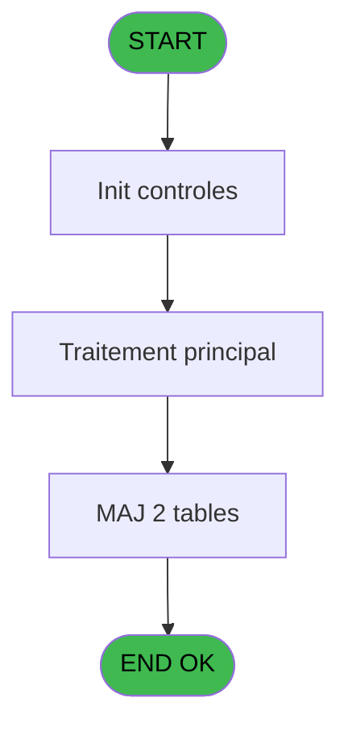

# PBG IDE 389 - Recalcul effectif

> **Analyse**: Phases 1-4 2026-02-03 11:37 -> 11:37 (18s) | Assemblage 11:37
> **Pipeline**: V7.2 Enrichi
> **Structure**: 4 onglets (Resume | Ecrans | Donnees | Connexions)

<!-- TAB:Resume -->

## 1. FICHE D'IDENTITE

| Attribut | Valeur |
|----------|--------|
| Projet | PBG |
| IDE Position | 389 |
| Nom Programme | Recalcul effectif |
| Fichier source | `Prg_389.xml` |
| Dossier IDE | General |
| Taches | 11 (0 ecrans visibles) |
| Tables modifiees | 2 |
| Programmes appeles | 0 |
| :warning: Statut | **ORPHELIN_POTENTIEL** |

## 2. DESCRIPTION FONCTIONNELLE

**Recalcul effectif** assure la gestion complete de ce processus.

Le flux de traitement s'organise en **2 blocs fonctionnels** :

- **Traitement** (9 taches) : traitements metier divers
- **Calcul** (2 taches) : calculs de montants, stocks ou compteurs

**Donnees modifiees** : 2 tables en ecriture (fac_hebergement_pro, num_tpe_par_service).

Detail : phases du traitement

#### Phase 1 : Calcul (2 taches)

- **389** - Calcul effectif quotidien **[[ECRAN]](#ecran-t1)**
- **389.5.1** - Calcul JH absence

#### Phase 2 : Traitement (9 taches)

- **389.1** - Vrl
- **389.2** - Vrl
- **389.3** - Vrl
- **389.4** - delete journee
- **389.5** - Traitement deval val diff
- **389.6** - Vrl
- **389.7** - Realise
- **389.7.1** - Maj personnes
- **389.8** - Previsionnel

#### Tables impactees

| Table | Operations | Role metier |
|-------|-----------|-------------|
| fac_hebergement_pro | **W**/L (8 usages) | Hebergement (chambres) |
| num_tpe_par_service | **W** (1 usages) | Services / filieres |

## 3. BLOCS FONCTIONNELS

### 3.1 Calcul (2 taches)

Calculs metier : montants, stocks, compteurs.

---

#### 389 - Calcul effectif quotidien [[ECRAN]](#ecran-t1)

**Role** : Calcul : Calcul effectif quotidien.
**Ecran** : 316 x 220 DLU (Modal) | [Voir mockup](#ecran-t1)

---

#### 389.5.1 - Calcul JH absence

**Role** : Calcul : Calcul JH absence.
**Variables liees** : C (V.Nb absence)

### 3.2 Traitement (9 taches)

Traitements internes.

---

#### 389.1 - Vrl

**Role** : Traitement interne.

---

#### 389.2 - Vrl

**Role** : Traitement interne.

---

#### 389.3 - Vrl

**Role** : Traitement interne.

---

#### 389.4 - delete journee

**Role** : Traitement : delete journee.

---

#### 389.5 - Traitement deval val diff

**Role** : Traitement : Traitement deval val diff.

---

#### 389.6 - Vrl

**Role** : Traitement interne.

---

#### 389.7 - Realise

**Role** : Traitement : Realise.

---

#### 389.7.1 - Maj personnes

**Role** : Traitement : Maj personnes.

---

#### 389.8 - Previsionnel

**Role** : Traitement : Previsionnel.

## 5. REGLES METIER

*(Aucune regle metier identifiee)*

## 6. CONTEXTE

- **Appele par**: (aucun)
- **Appelle**: 0 programmes | **Tables**: 11 (W:2 R:4 L:7) | **Taches**: 11 | **Expressions**: 2

<!-- TAB:Ecrans -->

## 8. ECRANS

*(Programme sans ecran visible)*

## 9. NAVIGATION

### 9.3 Structure hierarchique (11 taches)

| Position | Tache | Type | Dimensions | Bloc |
|----------|-------|------|------------|------|
| **389.1** | [**Calcul effectif quotidien** (389)](#t1) [mockup](#ecran-t1) | Modal | 316x220 | Calcul |
| 389.1.1 | [Calcul JH absence (389.5.1)](#t15) | - | - | |
| **389.2** | [**Vrl** (389.1)](#t4) | - | - | Traitement |
| 389.2.1 | [Vrl (389.2)](#t6) | - | - | |
| 389.2.2 | [Vrl (389.3)](#t7) | - | - | |
| 389.2.3 | [delete journee (389.4)](#t11) | - | - | |
| 389.2.4 | [Traitement deval val diff (389.5)](#t14) | - | - | |
| 389.2.5 | [Vrl (389.6)](#t18) | - | - | |
| 389.2.6 | [Realise (389.7)](#t28) | MDI | - | |
| 389.2.7 | [Maj personnes (389.7.1)](#t29) | - | - | |
| 389.2.8 | [Previsionnel (389.8)](#t32) | MDI | - | |

### 9.4 Algorigramme

> **Legende**: Vert = START/END OK | Rouge = END KO | Bleu = Decisions
> *Algorigramme auto-genere. Utiliser `/algorigramme` pour une synthese metier detaillee.*

<!-- TAB:Donnees -->

## 10. TABLES

### Tables utilisees (11)

| ID | Nom | Description | Type | R | W | L | Usages |
|----|-----|-------------|------|---|---|---|--------|
| 30 | gm-recherche_____gmr | Index de recherche | DB | R |   |   | 3 |
| 31 | gm-complet_______gmc |  | DB |   |   | L | 1 |
| 34 | hebergement______heb | Hebergement (chambres) | DB |   |   | L | 3 |
| 35 | personnel_go______go |  | DB |   |   | L | 1 |
| 120 | tables_qualites__qua |  | DB | R |   |   | 1 |
| 366 | pms_print_param |  | DB | R |   | L | 3 |
| 825 | fac_hebergement_pro | Hebergement (chambres) | DB |   | **W** | L | 8 |
| 826 | wording_mention_legal |  | DB |   |   | L | 4 |
| 827 | lg_vente_facture | Donnees de ventes | DB | R |   |   | 4 |
| 832 | pv_globalca_prepaid |  | DB |   |   | L | 1 |
| 835 | num_tpe_par_service | Services / filieres | DB |   | **W** |   | 1 |

### Colonnes par table (2 / 6 tables avec colonnes identifiees)

Table 30 - gm-recherche_____gmr (R) - 3 usages

| Lettre | Variable | Acces | Type |
|--------|----------|-------|------|
| A | v.retour absence | R | Logical |
| B | Statut | R | Alpha |
| C | V.heure fin | R | Alpha |
| D | V.Heure fin periode precedente | R | Alpha |
| E | V.Heure fin periode precedente | R | Alpha |

Table 120 - tables_qualites__qua (R) - 1 usages

*Table utilisee uniquement en Link ou aucune colonne Real identifiee dans le DataView.*

Table 366 - pms_print_param (R/L) - 3 usages

| Lettre | Variable | Acces | Type |
|--------|----------|-------|------|
| A | V.Date debut absence | R | Date |
| B | V.Date fin absence | R | Date |
| C | V.J absence | R | Numeric |

Table 825 - fac_hebergement_pro (**W**/L) - 8 usages

*Table utilisee uniquement en Link ou aucune colonne Real identifiee dans le DataView.*

Table 827 - lg_vente_facture (R) - 4 usages

*Table utilisee uniquement en Link ou aucune colonne Real identifiee dans le DataView.*

Table 835 - num_tpe_par_service (**W**) - 1 usages

*Table utilisee uniquement en Link ou aucune colonne Real identifiee dans le DataView.*

## 11. VARIABLES

### 11.1 Parametres entrants (1)

Variables recues en parametre.

| Lettre | Nom | Type | Usage dans |
|--------|-----|------|-----------|
| A | P.Date | Date | - |

### 11.2 Variables de session (4)

Variables persistantes pendant toute la session.

| Lettre | Nom | Type | Usage dans |
|--------|-----|------|-----------|
| B | V.Date operation | Date | - |
| C | V.Nb absence | Numeric | - |
| D | V.Heure fin | Alpha | 1x session |
| E | V.Heure fin periode precedente | Alpha | - |

## 12. EXPRESSIONS

**2 / 2 expressions decodees (100%)**

### 12.1 Repartition par type

| Type | Expressions | Regles |
|------|-------------|--------|
| OTHER | 1 | 0 |
| CONDITION | 1 | 0 |

### 12.2 Expressions cles par type

#### OTHER (1 expressions)

| Type | IDE | Expression | Regle |
|------|-----|------------|-------|
| OTHER | 1 | `GetParam ('SOCIETE')` | - |

#### CONDITION (1 expressions)

| Type | IDE | Expression | Regle |
|------|-----|------------|-------|
| CONDITION | 2 | `V.Heure fin periode pr... [E]<>'VSEC'` | - |

<!-- TAB:Connexions -->

## 13. GRAPHE D'APPELS

### 13.1 Chaine depuis Main (Callers)

**Chemin**: (pas de callers directs)

### 13.2 Callers

| IDE | Nom Programme | Nb Appels |
|-----|---------------|-----------|
| - | (aucun) | - |

### 13.3 Callees (programmes appeles)

### 13.4 Detail Callees avec contexte

| IDE | Nom Programme | Appels | Contexte |
|-----|---------------|--------|----------|
| - | (aucun) | - | - |

## 14. RECOMMANDATIONS MIGRATION

### 14.1 Profil du programme

| Metrique | Valeur | Impact migration |
|----------|--------|-----------------|
| Lignes de logique | 693 | Programme volumineux |
| Expressions | 2 | Peu de logique |
| Tables WRITE | 2 | Impact faible |
| Sous-programmes | 0 | Peu de dependances |
| Ecrans visibles | 0 | Ecran unique ou traitement batch |
| Code desactive | 0% (0 / 693) | Code sain |
| Regles metier | 0 | Pas de regle identifiee |

### 14.2 Plan de migration par bloc

#### Calcul (2 taches: 1 ecran, 1 traitement)

- **Strategie** : Services de calcul purs (Domain Services).
- Migrer la logique de calcul (stock, compteurs, montants)

#### Traitement (9 taches: 0 ecran, 9 traitements)

- **Strategie** : 9 service(s) backend injectable(s) (Domain Services).
- Decomposer les taches en services unitaires testables.

### 14.3 Dependances critiques

| Dependance | Type | Appels | Impact |
|------------|------|--------|--------|
| fac_hebergement_pro | Table WRITE (Database) | 1x | Schema + repository |
| num_tpe_par_service | Table WRITE (Database) | 1x | Schema + repository |

---
*Spec DETAILED generee par Pipeline V7.2 - 2026-02-03 11:37*
