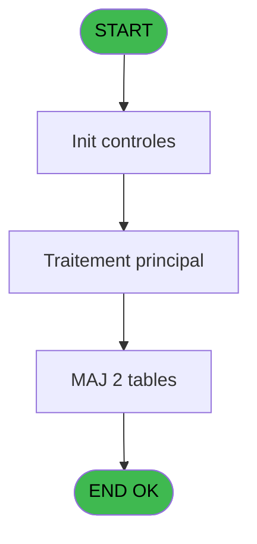
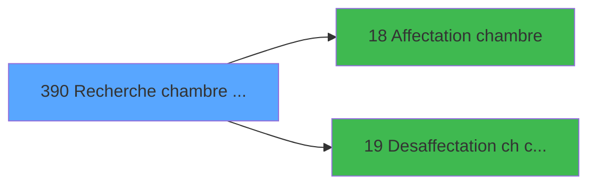

# PBG IDE 390 - Recherche chambre dispo sav

> **Analyse**: Phases 1-4 2026-02-03 11:37 -> 11:38 (18s) | Assemblage 11:38
> **Pipeline**: V7.2 Enrichi
> **Structure**: 4 onglets (Resume | Ecrans | Donnees | Connexions)

<!-- TAB:Resume -->

## 1. FICHE D'IDENTITE

| Attribut | Valeur |
|----------|--------|
| Projet | PBG |
| IDE Position | 390 |
| Nom Programme | Recherche chambre dispo sav |
| Fichier source | `Prg_390.xml` |
| Dossier IDE | Consultation |
| Taches | 7 (0 ecrans visibles) |
| Tables modifiees | 2 |
| Programmes appeles | 2 |
| :warning: Statut | **ORPHELIN_POTENTIEL** |

## 2. DESCRIPTION FONCTIONNELLE

**Recherche chambre dispo sav** assure la gestion complete de ce processus.

Le flux de traitement s'organise en **2 blocs fonctionnels** :

- **Consultation** (5 taches) : ecrans de recherche, selection et consultation
- **Traitement** (2 taches) : traitements metier divers

**Donnees modifiees** : 2 tables en ecriture (Commentaire supprime, pv_message).

Detail : phases du traitement

#### Phase 1 : Consultation (5 taches)

- **390.1** - Recherche chambre disponible s
- **390.1.1** - recherche dispo
- **390.1.2** - recherche dispo
- **390** - rech
- **390.1.4** - recherche dispo

#### Phase 2 : Traitement (2 taches)

- **390.1.3** - suppression log si affect
- **390.1.3.1** - log

Delegue a : [Affectation chambre (IDE 18)](PBG-IDE-18.md)

#### Tables impactees

| Table | Operations | Role metier |
|-------|-----------|-------------|
| Commentaire supprime | R/**W** (2 usages) |  |
| pv_message | **W** (1 usages) |  |

## 3. BLOCS FONCTIONNELS

### 3.1 Consultation (5 taches)

Ecrans de recherche et consultation.

---

#### 390.1 - Recherche chambre disponible s

**Role** : Traitement : Recherche chambre disponible s.

4 sous-taches directes

| Tache | Nom | Bloc |
|-------|-----|------|
| [390.1.1](#t3) | recherche dispo | Consultation |
| [390.1.2](#t22) | recherche dispo | Consultation |
| [390](#t31) | rech | Consultation |
| [390.1.4](#t34) | recherche dispo | Consultation |

**Variables liees** : I (P.Chambre affectee), C (V.Chambre affectee), J (V.Aucune chambre trouvee), K (V.Chambre sauvegardee), L (V.Chambre suiv)

---

#### 390.1.1 - recherche dispo

**Role** : Traitement : recherche dispo.

---

#### 390.1.2 - recherche dispo

**Role** : Traitement : recherche dispo.

---

#### 390 - rech

**Role** : Traitement : rech.

---

#### 390.1.4 - recherche dispo

**Role** : Traitement : recherche dispo.

### 3.2 Traitement (2 taches)

Traitements internes.

---

#### 390.1.3 - suppression log si affect

**Role** : Traitement : suppression log si affect.
**Variables liees** : I (P.Chambre affectee), B (V.Nb pax restant a affecter ch), C (V.Chambre affectee), E (V.Nb pax total restant a affect)
**Delegue a** : [Affectation chambre (IDE 18)](PBG-IDE-18.md)

---

#### 390.1.3.1 - log

**Role** : Traitement interne.

## 5. REGLES METIER

*(Aucune regle metier identifiee)*

## 6. CONTEXTE

- **Appele par**: (aucun)
- **Appelle**: 2 programmes | **Tables**: 4 (W:2 R:2 L:1) | **Taches**: 7 | **Expressions**: 7

<!-- TAB:Ecrans -->

## 8. ECRANS

*(Programme sans ecran visible)*

## 9. NAVIGATION

### 9.3 Structure hierarchique (7 taches)

| Position | Tache | Type | Dimensions | Bloc |
|----------|-------|------|------------|------|
| **390.1** | [**Recherche chambre disponible s** (390.1)](#t1) | - | - | Consultation |
| 390.1.1 | [recherche dispo (390.1.1)](#t3) | - | - | |
| 390.1.2 | [recherche dispo (390.1.2)](#t22) | - | - | |
| 390.1.3 | [rech (390)](#t31) | - | - | |
| 390.1.4 | [recherche dispo (390.1.4)](#t34) | - | - | |
| **390.2** | [**suppression log si affect** (390.1.3)](#t25) | - | - | Traitement |
| 390.2.1 | [log (390.1.3.1)](#t26) | - | - | |

### 9.4 Algorigramme

> **Legende**: Vert = START/END OK | Rouge = END KO | Bleu = Decisions
> *Algorigramme auto-genere. Utiliser `/algorigramme` pour une synthese metier detaillee.*

<!-- TAB:Donnees -->

## 10. TABLES

### Tables utilisees (4)

| ID | Nom | Description | Type | R | W | L | Usages |
|----|-----|-------------|------|---|---|---|--------|
| 103 | logement_client__loc |  | DB | R |   |   | 3 |
| 105 | logement_complement |  | DB |   |   | L | 2 |
| 820 | Commentaire supprime |  | DB | R | **W** |   | 2 |
| 822 | pv_message |  | DB |   | **W** |   | 1 |

### Colonnes par table (2 / 3 tables avec colonnes identifiees)

Table 103 - logement_client__loc (R) - 3 usages

| Lettre | Variable | Acces | Type |
|--------|----------|-------|------|
| A | P.Chambre affectee prox | R | Alpha |
| B | V.Dispo ch1 ? | R | Logical |
| C | V.Dispo ch 2 ? | R | Logical |
| D | V.Passage suffixe ? | R | Logical |

Table 820 - Commentaire supprime (R/**W**) - 2 usages

| Lettre | Variable | Acces | Type |
|--------|----------|-------|------|
| A | P.Pas de gestion horaire ? | W | Logical |
| B | V.Nb pax restant a affecter ch | W | Numeric |
| C | V.Chambre affectee | W | Alpha |
| D | V.Code occupation | W | Numeric |
| E | V.Nb pax total restant a affect | W | Numeric |
| F | V.Communicante | W | Logical |

Table 822 - pv_message (**W**) - 1 usages

*Table utilisee uniquement en Link ou aucune colonne Real identifiee dans le DataView.*

## 11. VARIABLES

### 11.1 Parametres entrants (4)

Variables recues en parametre.

| Lettre | Nom | Type | Usage dans |
|--------|-----|------|-----------|
| A | P.Pas de gestion horaire ? | Logical | - |
| G | P.Proche centre | Alpha | - |
| H | P.RDC | Logical | - |
| I | P.Chambre affectee | Logical | - |

### 11.2 Variables de session (8)

Variables persistantes pendant toute la session.

| Lettre | Nom | Type | Usage dans |
|--------|-----|------|-----------|
| B | V.Nb pax restant a affecter ch | Numeric | - |
| C | V.Chambre affectee | Alpha | 2x session |
| D | V.Code occupation | Numeric | - |
| E | V.Nb pax total restant a affect | Numeric | - |
| F | V.Communicante | Logical | - |
| J | V.Aucune chambre trouvee | Logical | - |
| K | V.Chambre sauvegardee | Alpha | - |
| L | V.Chambre suiv | Alpha | - |

## 12. EXPRESSIONS

**7 / 7 expressions decodees (100%)**

### 12.1 Repartition par type

| Type | Expressions | Regles |
|------|-------------|--------|
| CONSTANTE | 1 | 0 |
| OTHER | 3 | 0 |
| NEGATION | 1 | 0 |
| CAST_LOGIQUE | 1 | 0 |
| FORMAT | 1 | 0 |

### 12.2 Expressions cles par type

#### CONSTANTE (1 expressions)

| Type | IDE | Expression | Regle |
|------|-----|------------|-------|
| CONSTANTE | 4 | `''` | - |

#### OTHER (3 expressions)

| Type | IDE | Expression | Regle |
|------|-----|------------|-------|
| OTHER | 5 | `Translate('%club_exportdata%traceaffec.txt')` | - |
| OTHER | 3 | `[S]` | - |
| OTHER | 1 | `V.Nb pax total restant... [E] OR V.Chambre affectee [C]` | - |

#### NEGATION (1 expressions)

| Type | IDE | Expression | Regle |
|------|-----|------------|-------|
| NEGATION | 2 | `NOT V.Nb pax total restant... [E] AND NOT V.Chambre affectee [C]` | - |

#### CAST_LOGIQUE (1 expressions)

| Type | IDE | Expression | Regle |
|------|-----|------------|-------|
| CAST_LOGIQUE | 7 | `'FALSE'LOG` | - |

#### FORMAT (1 expressions)

| Type | IDE | Expression | Regle |
|------|-----|------------|-------|
| FORMAT | 6 | `'boucle '&Trim(Str(Counter(0),'6'))` | - |

<!-- TAB:Connexions -->

## 13. GRAPHE D'APPELS

### 13.1 Chaine depuis Main (Callers)

**Chemin**: (pas de callers directs)

### 13.2 Callers

| IDE | Nom Programme | Nb Appels |
|-----|---------------|-----------|
| - | (aucun) | - |

### 13.3 Callees (programmes appeles)

### 13.4 Detail Callees avec contexte

| IDE | Nom Programme | Appels | Contexte |
|-----|---------------|--------|----------|
| [18](PBG-IDE-18.md) | Affectation chambre | 1 | Sous-programme |
| [19](PBG-IDE-19.md) | Desaffectation ch compte | 1 | Sous-programme |

## 14. RECOMMANDATIONS MIGRATION

### 14.1 Profil du programme

| Metrique | Valeur | Impact migration |
|----------|--------|-----------------|
| Lignes de logique | 181 | Programme compact |
| Expressions | 7 | Peu de logique |
| Tables WRITE | 2 | Impact faible |
| Sous-programmes | 2 | Peu de dependances |
| Ecrans visibles | 0 | Ecran unique ou traitement batch |
| Code desactive | 0% (0 / 181) | Code sain |
| Regles metier | 0 | Pas de regle identifiee |

### 14.2 Plan de migration par bloc

#### Consultation (5 taches: 0 ecran, 5 traitements)

- **Strategie** : Composants de recherche/selection en modales.

#### Traitement (2 taches: 0 ecran, 2 traitements)

- **Strategie** : 2 service(s) backend injectable(s) (Domain Services).
- 2 sous-programme(s) a migrer ou a reutiliser depuis les services existants.
- Decomposer les taches en services unitaires testables.

### 14.3 Dependances critiques

| Dependance | Type | Appels | Impact |
|------------|------|--------|--------|
| Commentaire supprime | Table WRITE (Database) | 1x | Schema + repository |
| pv_message | Table WRITE (Database) | 1x | Schema + repository |
| [Desaffectation ch compte (IDE 19)](PBG-IDE-19.md) | Sous-programme | 1x | Normale - Sous-programme |
| [Affectation chambre (IDE 18)](PBG-IDE-18.md) | Sous-programme | 1x | Normale - Sous-programme |

---
*Spec DETAILED generee par Pipeline V7.2 - 2026-02-03 11:38*
