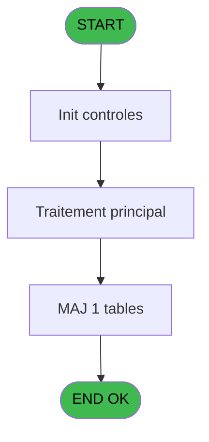

# PBG IDE 392 - Vente VRL VSL

> **Analyse**: Phases 1-4 2026-02-03 11:38 -> 11:39 (18s) | Assemblage 11:39
> **Pipeline**: V7.2 Enrichi
> **Structure**: 4 onglets (Resume | Ecrans | Donnees | Connexions)

<!-- TAB:Resume -->

## 1. FICHE D'IDENTITE

| Attribut | Valeur |
|----------|--------|
| Projet | PBG |
| IDE Position | 392 |
| Nom Programme | Vente VRL VSL |
| Fichier source | `Prg_392.xml` |
| Dossier IDE | Ventes |
| Taches | 3 (1 ecrans visibles) |
| Tables modifiees | 1 |
| Programmes appeles | 0 |
| :warning: Statut | **ORPHELIN_POTENTIEL** |

## 2. DESCRIPTION FONCTIONNELLE

**Vente VRL VSL** assure la gestion complete de ce processus.

Le flux de traitement s'organise en **2 blocs fonctionnels** :

- **Initialisation** (2 taches) : reinitialisation d'etats et de variables de travail
- **Traitement** (1 tache) : traitements metier divers

**Donnees modifiees** : 1 tables en ecriture (valeur_credit_bar_defaut).

Detail : phases du traitement

#### Phase 1 : Traitement (1 tache)

- **392** - Repas non encaissés au village **[[ECRAN]](#ecran-t8)**

#### Phase 2 : Initialisation (2 taches)

- **392.1** - init
- **392.2** - init

#### Tables impactees

| Table | Operations | Role metier |
|-------|-----------|-------------|
| valeur_credit_bar_defaut | **W** (2 usages) |  |

## 3. BLOCS FONCTIONNELS

### 3.1 Traitement (1 tache)

Traitements internes.

---

#### 392 - Repas non encaissés au village [[ECRAN]](#ecran-t8)

**Role** : Traitement : Repas non encaissés au village.
**Ecran** : 422 x 84 DLU (MDI) | [Voir mockup](#ecran-t8)

### 3.2 Initialisation (2 taches)

Reinitialisation d'etats et variables de travail.

---

#### 392.1 - init

**Role** : Reinitialisation : init.

---

#### 392.2 - init

**Role** : Reinitialisation : init.

## 5. REGLES METIER

*(Aucune regle metier identifiee)*

## 6. CONTEXTE

- **Appele par**: (aucun)
- **Appelle**: 0 programmes | **Tables**: 1 (W:1 R:0 L:0) | **Taches**: 3 | **Expressions**: 4

<!-- TAB:Ecrans -->

## 8. ECRANS

### 8.1 Forms visibles (1 / 3)

| # | Position | Tache | Nom | Type | Largeur | Hauteur | Bloc |
|---|----------|-------|-----|------|---------|---------|------|
| 1 | 392.1 | 392 | Repas non encaissés au village | MDI | 422 | 84 | Traitement |

### 8.2 Mockups Ecrans

---

#### 392.1 - Repas non encaissés au village
**Tache** : [392](#t8) | **Type** : MDI | **Dimensions** : 422 x 84 DLU
**Bloc** : Traitement | **Titre IDE** : Repas non encaissés au village

<!-- FORM-DATA:
{
    "width":  422,
    "vFactor":  8,
    "type":  "MDI",
    "hFactor":  8,
    "controls":  [
                     {
                         "x":  114,
                         "type":  "button",
                         "var":  "",
                         "y":  11,
                         "w":  223,
                         "fmt":  "Avec RowId déclaré",
                         "name":  "b_consultation",
                         "h":  18,
                         "color":  "",
                         "text":  "",
                         "parent":  null
                     },
                     {
                         "x":  124,
                         "type":  "button",
                         "var":  "",
                         "y":  43,
                         "w":  213,
                         "fmt":  "Sans RowId déclaré",
                         "name":  "b_consultation",
                         "h":  18,
                         "color":  "",
                         "text":  "",
                         "parent":  null
                     }
                 ],
    "taskId":  "392.1",
    "height":  84
}
-->

<strong>Boutons : 2 boutons</strong>

| Bouton | Pos (x,y) | Action |
|--------|-----------|--------|
| Avec RowId déclaré | 114,11 | Bouton fonctionnel |
| Sans RowId déclaré | 124,43 | Bouton fonctionnel |

## 9. NAVIGATION

Ecran unique: **Repas non encaissés au village**

### 9.3 Structure hierarchique (3 taches)

| Position | Tache | Type | Dimensions | Bloc |
|----------|-------|------|------------|------|
| **392.1** | [**Repas non encaissés au village** (392)](#t8) [mockup](#ecran-t8) | MDI | 422x84 | Traitement |
| **392.2** | [**init** (392.1)](#t12) | - | - | Initialisation |
| 392.2.1 | [init (392.2)](#t15) | - | - | |

### 9.4 Algorigramme

> **Legende**: Vert = START/END OK | Rouge = END KO | Bleu = Decisions
> *Algorigramme auto-genere. Utiliser `/algorigramme` pour une synthese metier detaillee.*

<!-- TAB:Donnees -->

## 10. TABLES

### Tables utilisees (1)

| ID | Nom | Description | Type | R | W | L | Usages |
|----|-----|-------------|------|---|---|---|--------|
| 804 | valeur_credit_bar_defaut |  | DB |   | **W** |   | 2 |

### Colonnes par table (0 / 1 tables avec colonnes identifiees)

Table 804 - valeur_credit_bar_defaut (**W**) - 2 usages

*Table utilisee uniquement en Link ou aucune colonne Real identifiee dans le DataView.*

## 11. VARIABLES

*(Programme sans variables locales mappees)*

## 12. EXPRESSIONS

**4 / 4 expressions decodees (100%)**

### 12.1 Repartition par type

| Type | Expressions | Regles |
|------|-------------|--------|
| CONSTANTE | 4 | 0 |

### 12.2 Expressions cles par type

#### CONSTANTE (4 expressions)

| Type | IDE | Expression | Regle |
|------|-----|------------|-------|
| CONSTANTE | 3 | `999999999` | - |
| CONSTANTE | 4 | `'CBX'` | - |
| CONSTANTE | 1 | `'C'` | - |
| CONSTANTE | 2 | `1` | - |

<!-- TAB:Connexions -->

## 13. GRAPHE D'APPELS

### 13.1 Chaine depuis Main (Callers)

**Chemin**: (pas de callers directs)

### 13.2 Callers

| IDE | Nom Programme | Nb Appels |
|-----|---------------|-----------|
| - | (aucun) | - |

### 13.3 Callees (programmes appeles)

### 13.4 Detail Callees avec contexte

| IDE | Nom Programme | Appels | Contexte |
|-----|---------------|--------|----------|
| - | (aucun) | - | - |

## 14. RECOMMANDATIONS MIGRATION

### 14.1 Profil du programme

| Metrique | Valeur | Impact migration |
|----------|--------|-----------------|
| Lignes de logique | 30 | Programme compact |
| Expressions | 4 | Peu de logique |
| Tables WRITE | 1 | Impact faible |
| Sous-programmes | 0 | Peu de dependances |
| Ecrans visibles | 1 | Ecran unique ou traitement batch |
| Code desactive | 0% (0 / 30) | Code sain |
| Regles metier | 0 | Pas de regle identifiee |

### 14.2 Plan de migration par bloc

#### Traitement (1 tache: 1 ecran, 0 traitement)

- **Strategie** : 1 composant(s) UI (Razor/React) avec formulaires et validation.
- Decomposer les taches en services unitaires testables.

#### Initialisation (2 taches: 0 ecran, 2 traitements)

- **Strategie** : Constructeur/methode `InitAsync()` dans l'orchestrateur.

### 14.3 Dependances critiques

| Dependance | Type | Appels | Impact |
|------------|------|--------|--------|
| valeur_credit_bar_defaut | Table WRITE (Database) | 2x | Schema + repository |

---
*Spec DETAILED generee par Pipeline V7.2 - 2026-02-03 11:39*
