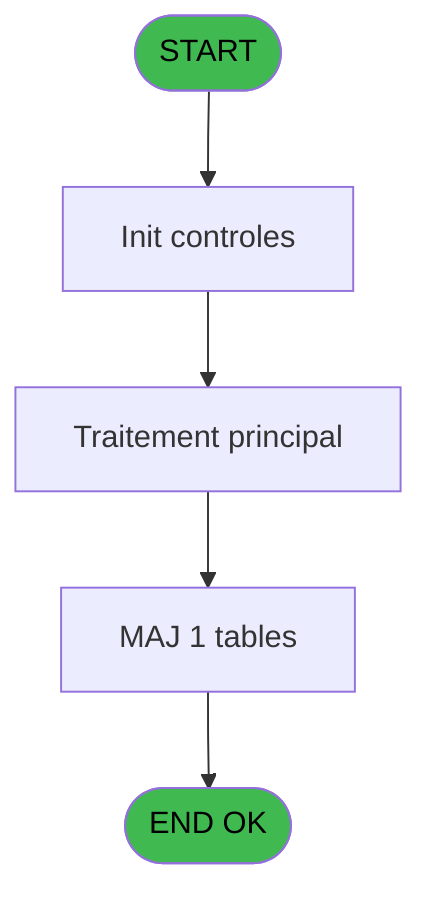
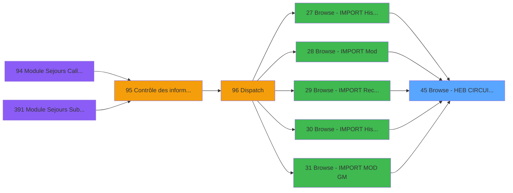

# PBG IDE 45 - Browse - HEB CIRCUIT      HCI

> **Analyse**: Phases 1-4 2026-02-03 08:54 -> 08:54 (21s) | Assemblage 08:54
> **Pipeline**: V7.2 Enrichi
> **Structure**: 4 onglets (Resume | Ecrans | Donnees | Connexions)

<!-- TAB:Resume -->

## 1. FICHE D'IDENTITE

| Attribut | Valeur |
|----------|--------|
| Projet | PBG |
| IDE Position | 45 |
| Nom Programme | Browse - HEB CIRCUIT      HCI |
| Fichier source | `Prg_45.xml` |
| Domaine metier | General |
| Taches | 1 (1 ecrans visibles) |
| Tables modifiees | 1 |
| Programmes appeles | 0 |

## 2. DESCRIPTION FONCTIONNELLE

**Browse - HEB CIRCUIT      HCI** assure la gestion complete de ce processus, accessible depuis [Browse - IMPORT Historique Cha (IDE 27)](PBG-IDE-27.md), [Browse - IMPORT Mod (IDE 28)](PBG-IDE-28.md), [Browse - IMPORT Recup N°Chambr (IDE 29)](PBG-IDE-29.md), [Browse - IMPORT Historique Cha (IDE 30)](PBG-IDE-30.md), [Browse - IMPORT MOD GM (IDE 31)](PBG-IDE-31.md), [Browse - IMPORT Avertiss. MOD (IDE 32)](PBG-IDE-32.md), [Browse - IMPORT Avertiss. AN/V (IDE 33)](PBG-IDE-33.md), [Browse - IMPORT Commentai IMO (IDE 34)](PBG-IDE-34.md), [Browse - IMPORT Troncon   IMT (IDE 35)](PBG-IDE-35.md), [Browse - IMPORT Reprise   IMR (IDE 36)](PBG-IDE-36.md), [Browse - IMPORT Avertiss. IMA (IDE 37)](PBG-IDE-37.md), [Browse - IMPORT PrestationIMP (IDE 38)](PBG-IDE-38.md), [Browse - IMPORT Circuit   IMC (IDE 39)](PBG-IDE-39.md), [Browse - IMPORT Logement  IML (IDE 40)](PBG-IDE-40.md), [Browse - IMPORT Identite  IMI (IDE 41)](PBG-IDE-41.md).

Le flux de traitement s'organise en **1 blocs fonctionnels** :

- **Traitement** (1 tache) : traitements metier divers

**Donnees modifiees** : 1 tables en ecriture (heb_circuit______hci).

## 3. BLOCS FONCTIONNELS

### 3.1 Traitement (1 tache)

Traitements internes.

---

#### 45 - Browse - HEB CIRCUIT      HCI [[ECRAN]](#ecran-t1)

**Role** : Traitement : Browse - HEB CIRCUIT      HCI.
**Ecran** : 780 x 160 DLU (MDI) | [Voir mockup](#ecran-t1)

## 5. REGLES METIER

*(Aucune regle metier identifiee)*

## 6. CONTEXTE

- **Appele par**: [Browse - IMPORT Historique Cha (IDE 27)](PBG-IDE-27.md), [Browse - IMPORT Mod (IDE 28)](PBG-IDE-28.md), [Browse - IMPORT Recup N°Chambr (IDE 29)](PBG-IDE-29.md), [Browse - IMPORT Historique Cha (IDE 30)](PBG-IDE-30.md), [Browse - IMPORT MOD GM (IDE 31)](PBG-IDE-31.md), [Browse - IMPORT Avertiss. MOD (IDE 32)](PBG-IDE-32.md), [Browse - IMPORT Avertiss. AN/V (IDE 33)](PBG-IDE-33.md), [Browse - IMPORT Commentai IMO (IDE 34)](PBG-IDE-34.md), [Browse - IMPORT Troncon   IMT (IDE 35)](PBG-IDE-35.md), [Browse - IMPORT Reprise   IMR (IDE 36)](PBG-IDE-36.md), [Browse - IMPORT Avertiss. IMA (IDE 37)](PBG-IDE-37.md), [Browse - IMPORT PrestationIMP (IDE 38)](PBG-IDE-38.md), [Browse - IMPORT Circuit   IMC (IDE 39)](PBG-IDE-39.md), [Browse - IMPORT Logement  IML (IDE 40)](PBG-IDE-40.md), [Browse - IMPORT Identite  IMI (IDE 41)](PBG-IDE-41.md)
- **Appelle**: 0 programmes | **Tables**: 1 (W:1 R:0 L:0) | **Taches**: 1 | **Expressions**: 3

<!-- TAB:Ecrans -->

## 8. ECRANS

### 8.1 Forms visibles (1 / 1)

| # | Position | Tache | Nom | Type | Largeur | Hauteur | Bloc |
|---|----------|-------|-----|------|---------|---------|------|
| 1 | 45 | 45 | Browse - HEB CIRCUIT      HCI | MDI | 780 | 160 | Traitement |

### 8.2 Mockups Ecrans

---

#### 45 - Browse - HEB CIRCUIT      HCI
**Tache** : [45](#t1) | **Type** : MDI | **Dimensions** : 780 x 160 DLU
**Bloc** : Traitement | **Titre IDE** : Browse - HEB CIRCUIT      HCI

<!-- FORM-DATA:
{
    "width":  780,
    "vFactor":  8,
    "type":  "MDI",
    "hFactor":  4,
    "controls":  [
                     {
                         "x":  8,
                         "type":  "table",
                         "var":  "",
                         "name":  "",
                         "titleH":  12,
                         "color":  "110",
                         "w":  476,
                         "y":  6,
                         "fmt":  "",
                         "parent":  null,
                         "text":  "",
                         "rowH":  14,
                         "h":  140,
                         "cols":  [
                                      {
                                          "title":  "HCI Societe",
                                          "layer":  1,
                                          "w":  56
                                      },
                                      {
                                          "title":  "HCI N° Compte",
                                          "layer":  2,
                                          "w":  68
                                      },
                                      {
                                          "title":  "HCI Filiation",
                                          "layer":  3,
                                          "w":  55
                                      },
                                      {
                                          "title":  "HCI Package",
                                          "layer":  4,
                                          "w":  61
                                      },
                                      {
                                          "title":  "HCI Statut Sejour",
                                          "layer":  5,
                                          "w":  76
                                      },
                                      {
                                          "title":  "HCI Date debut",
                                          "layer":  6,
                                          "w":  71
                                      },
                                      {
                                          "title":  "HCI Heure Debut",
                                          "layer":  7,
                                          "w":  75
                                      }
                                  ],
                         "rows":  7
                     },
                     {
                         "x":  492,
                         "type":  "label",
                         "var":  "",
                         "y":  10,
                         "w":  53,
                         "fmt":  "",
                         "name":  "",
                         "h":  8,
                         "color":  "",
                         "text":  "HCI Date Fin",
                         "parent":  null
                     },
                     {
                         "x":  492,
                         "type":  "label",
                         "var":  "",
                         "y":  20,
                         "w":  58,
                         "fmt":  "",
                         "name":  "",
                         "h":  8,
                         "color":  "",
                         "text":  "HCI Heure Fin",
                         "parent":  null
                     },
                     {
                         "x":  492,
                         "type":  "label",
                         "var":  "",
                         "y":  30,
                         "w":  90,
                         "fmt":  "",
                         "name":  "",
                         "h":  8,
                         "color":  "",
                         "text":  "HCI (U/P) Nb occup.:",
                         "parent":  null
                     },
                     {
                         "x":  492,
                         "type":  "label",
                         "var":  "",
                         "y":  40,
                         "w":  100,
                         "fmt":  "",
                         "name":  "",
                         "h":  8,
                         "color":  "",
                         "text":  "HCI Type Hebergement:",
                         "parent":  null
                     },
                     {
                         "x":  492,
                         "type":  "label",
                         "var":  "",
                         "y":  50,
                         "w":  95,
                         "fmt":  "",
                         "name":  "",
                         "h":  8,
                         "color":  "",
                         "text":  "HCI Complement Type:",
                         "parent":  null
                     },
                     {
                         "x":  492,
                         "type":  "label",
                         "var":  "",
                         "y":  60,
                         "w":  51,
                         "fmt":  "",
                         "name":  "",
                         "h":  8,
                         "color":  "",
                         "text":  "HCI Libelle:",
                         "parent":  null
                     },
                     {
                         "x":  492,
                         "type":  "label",
                         "var":  "",
                         "y":  70,
                         "w":  42,
                         "fmt":  "",
                         "name":  "",
                         "h":  8,
                         "color":  "",
                         "text":  "HCI Age:",
                         "parent":  null
                     },
                     {
                         "x":  492,
                         "type":  "label",
                         "var":  "",
                         "y":  80,
                         "w":  67,
                         "fmt":  "",
                         "name":  "",
                         "h":  8,
                         "color":  "",
                         "text":  "HCI Nationalite:",
                         "parent":  null
                     },
                     {
                         "x":  492,
                         "type":  "label",
                         "var":  "",
                         "y":  90,
                         "w":  84,
                         "fmt":  "",
                         "name":  "",
                         "h":  8,
                         "color":  "",
                         "text":  "HCI Nom Logement:",
                         "parent":  null
                     },
                     {
                         "x":  492,
                         "type":  "label",
                         "var":  "",
                         "y":  100,
                         "w":  68,
                         "fmt":  "",
                         "name":  "",
                         "h":  8,
                         "color":  "",
                         "text":  "HCI Code Sexe:",
                         "parent":  null
                     },
                     {
                         "x":  492,
                         "type":  "label",
                         "var":  "",
                         "y":  110,
                         "w":  77,
                         "fmt":  "",
                         "name":  "",
                         "h":  8,
                         "color":  "",
                         "text":  "HCI Code Fumeur:",
                         "parent":  null
                     },
                     {
                         "x":  492,
                         "type":  "label",
                         "var":  "",
                         "y":  120,
                         "w":  69,
                         "fmt":  "",
                         "name":  "",
                         "h":  8,
                         "color":  "",
                         "text":  "HCI Lieu Sejour:",
                         "parent":  null
                     },
                     {
                         "x":  492,
                         "type":  "label",
                         "var":  "",
                         "y":  130,
                         "w":  87,
                         "fmt":  "",
                         "name":  "",
                         "h":  8,
                         "color":  "",
                         "text":  "HCI Code Logement:",
                         "parent":  null
                     },
                     {
                         "x":  492,
                         "type":  "label",
                         "var":  "",
                         "y":  140,
                         "w":  76,
                         "fmt":  "",
                         "name":  "",
                         "h":  8,
                         "color":  "",
                         "text":  "HCI Compactable:",
                         "parent":  null
                     },
                     {
                         "x":  11,
                         "type":  "edit",
                         "var":  "",
                         "y":  20,
                         "w":  13,
                         "fmt":  "",
                         "name":  "",
                         "h":  10,
                         "color":  "110",
                         "text":  "",
                         "parent":  1
                     },
                     {
                         "x":  67,
                         "type":  "edit",
                         "var":  "",
                         "y":  20,
                         "w":  52,
                         "fmt":  "",
                         "name":  "",
                         "h":  10,
                         "color":  "110",
                         "text":  "",
                         "parent":  1
                     },
                     {
                         "x":  135,
                         "type":  "edit",
                         "var":  "",
                         "y":  20,
                         "w":  24,
                         "fmt":  "",
                         "name":  "",
                         "h":  10,
                         "color":  "110",
                         "text":  "",
                         "parent":  1
                     },
                     {
                         "x":  190,
                         "type":  "edit",
                         "var":  "",
                         "y":  20,
                         "w":  13,
                         "fmt":  "",
                         "name":  "",
                         "h":  10,
                         "color":  "110",
                         "text":  "",
                         "parent":  1
                     },
                     {
                         "x":  251,
                         "type":  "edit",
                         "var":  "",
                         "y":  20,
                         "w":  13,
                         "fmt":  "",
                         "name":  "",
                         "h":  10,
                         "color":  "110",
                         "text":  "",
                         "parent":  1
                     },
                     {
                         "x":  327,
                         "type":  "edit",
                         "var":  "",
                         "y":  20,
                         "w":  63,
                         "fmt":  "",
                         "name":  "",
                         "h":  10,
                         "color":  "110",
                         "text":  "",
                         "parent":  1
                     },
                     {
                         "x":  398,
                         "type":  "edit",
                         "var":  "",
                         "y":  20,
                         "w":  18,
                         "fmt":  "",
                         "name":  "",
                         "h":  10,
                         "color":  "110",
                         "text":  "",
                         "parent":  1
                     },
                     {
                         "x":  592,
                         "type":  "edit",
                         "var":  "",
                         "y":  10,
                         "w":  63,
                         "fmt":  "",
                         "name":  "",
                         "h":  10,
                         "color":  "110",
                         "text":  "",
                         "parent":  null
                     },
                     {
                         "x":  592,
                         "type":  "edit",
                         "var":  "",
                         "y":  20,
                         "w":  18,
                         "fmt":  "",
                         "name":  "",
                         "h":  10,
                         "color":  "110",
                         "text":  "",
                         "parent":  null
                     },
                     {
                         "x":  592,
                         "type":  "edit",
                         "var":  "",
                         "y":  30,
                         "w":  20,
                         "fmt":  "",
                         "name":  "",
                         "h":  10,
                         "color":  "110",
                         "text":  "",
                         "parent":  null
                     },
                     {
                         "x":  592,
                         "type":  "edit",
                         "var":  "",
                         "y":  40,
                         "w":  46,
                         "fmt":  "",
                         "name":  "",
                         "h":  10,
                         "color":  "110",
                         "text":  "",
                         "parent":  null
                     },
                     {
                         "x":  592,
                         "type":  "edit",
                         "var":  "",
                         "y":  50,
                         "w":  33,
                         "fmt":  "",
                         "name":  "",
                         "h":  10,
                         "color":  "110",
                         "text":  "",
                         "parent":  null
                     },
                     {
                         "x":  592,
                         "type":  "edit",
                         "var":  "",
                         "y":  60,
                         "w":  114,
                         "fmt":  "",
                         "name":  "",
                         "h":  10,
                         "color":  "110",
                         "text":  "",
                         "parent":  null
                     },
                     {
                         "x":  592,
                         "type":  "edit",
                         "var":  "",
                         "y":  70,
                         "w":  14,
                         "fmt":  "",
                         "name":  "hci_age_num",
                         "h":  10,
                         "color":  "110",
                         "text":  "",
                         "parent":  null
                     },
                     {
                         "x":  592,
                         "type":  "edit",
                         "var":  "",
                         "y":  80,
                         "w":  20,
                         "fmt":  "",
                         "name":  "",
                         "h":  10,
                         "color":  "110",
                         "text":  "",
                         "parent":  null
                     },
                     {
                         "x":  592,
                         "type":  "edit",
                         "var":  "",
                         "y":  90,
                         "w":  46,
                         "fmt":  "",
                         "name":  "",
                         "h":  10,
                         "color":  "110",
                         "text":  "",
                         "parent":  null
                     },
                     {
                         "x":  592,
                         "type":  "edit",
                         "var":  "",
                         "y":  100,
                         "w":  14,
                         "fmt":  "",
                         "name":  "",
                         "h":  10,
                         "color":  "110",
                         "text":  "",
                         "parent":  null
                     },
                     {
                         "x":  592,
                         "type":  "edit",
                         "var":  "",
                         "y":  110,
                         "w":  14,
                         "fmt":  "",
                         "name":  "",
                         "h":  10,
                         "color":  "110",
                         "text":  "",
                         "parent":  null
                     },
                     {
                         "x":  592,
                         "type":  "edit",
                         "var":  "",
                         "y":  120,
                         "w":  14,
                         "fmt":  "",
                         "name":  "",
                         "h":  10,
                         "color":  "110",
                         "text":  "",
                         "parent":  null
                     },
                     {
                         "x":  592,
                         "type":  "edit",
                         "var":  "",
                         "y":  130,
                         "w":  46,
                         "fmt":  "",
                         "name":  "",
                         "h":  10,
                         "color":  "110",
                         "text":  "",
                         "parent":  null
                     },
                     {
                         "x":  592,
                         "type":  "edit",
                         "var":  "",
                         "y":  140,
                         "w":  14,
                         "fmt":  "",
                         "name":  "",
                         "h":  10,
                         "color":  "110",
                         "text":  "",
                         "parent":  null
                     }
                 ],
    "taskId":  "45",
    "height":  160
}
-->

<strong>Champs : 21 champs</strong>

| Pos (x,y) | Nom | Variable | Type |
|-----------|-----|----------|------|
| 11,20 | (sans nom) | - | edit |
| 67,20 | (sans nom) | - | edit |
| 135,20 | (sans nom) | - | edit |
| 190,20 | (sans nom) | - | edit |
| 251,20 | (sans nom) | - | edit |
| 327,20 | (sans nom) | - | edit |
| 398,20 | (sans nom) | - | edit |
| 592,10 | (sans nom) | - | edit |
| 592,20 | (sans nom) | - | edit |
| 592,30 | (sans nom) | - | edit |
| 592,40 | (sans nom) | - | edit |
| 592,50 | (sans nom) | - | edit |
| 592,60 | (sans nom) | - | edit |
| 592,70 | hci_age_num | - | edit |
| 592,80 | (sans nom) | - | edit |
| 592,90 | (sans nom) | - | edit |
| 592,100 | (sans nom) | - | edit |
| 592,110 | (sans nom) | - | edit |
| 592,120 | (sans nom) | - | edit |
| 592,130 | (sans nom) | - | edit |
| 592,140 | (sans nom) | - | edit |

## 9. NAVIGATION

Ecran unique: **Browse - HEB CIRCUIT      HCI**

### 9.3 Structure hierarchique (1 tache)

| Position | Tache | Type | Dimensions | Bloc |
|----------|-------|------|------------|------|
| **45.1** | [**Browse - HEB CIRCUIT      HCI** (45)](#t1) [mockup](#ecran-t1) | MDI | 780x160 | Traitement |

### 9.4 Algorigramme

> **Legende**: Vert = START/END OK | Rouge = END KO | Bleu = Decisions
> *Algorigramme auto-genere. Utiliser `/algorigramme` pour une synthese metier detaillee.*

<!-- TAB:Donnees -->

## 10. TABLES

### Tables utilisees (1)

| ID | Nom | Description | Type | R | W | L | Usages |
|----|-----|-------------|------|---|---|---|--------|
| 168 | heb_circuit______hci | Hebergement (chambres) | DB |   | **W** |   | 1 |

### Colonnes par table (0 / 1 tables avec colonnes identifiees)

Table 168 - heb_circuit______hci (**W**) - 1 usages

*Table utilisee uniquement en Link ou aucune colonne Real identifiee dans le DataView.*

## 11. VARIABLES

*(Programme sans variables locales mappees)*

## 12. EXPRESSIONS

**3 / 3 expressions decodees (100%)**

### 12.1 Repartition par type

| Type | Expressions | Regles |
|------|-------------|--------|
| OTHER | 3 | 0 |

### 12.2 Expressions cles par type

#### OTHER (3 expressions)

| Type | IDE | Expression | Regle |
|------|-----|------------|-------|
| OTHER | 3 | `GetParam ('CODE_F')` | - |
| OTHER | 2 | `GetParam ('CODE_C')` | - |
| OTHER | 1 | `GetParam ('CODE_S')` | - |

<!-- TAB:Connexions -->

## 13. GRAPHE D'APPELS

### 13.1 Chaine depuis Main (Callers)

Main -> ... -> [Browse - IMPORT Historique Cha (IDE 27)](PBG-IDE-27.md) -> **Browse - HEB CIRCUIT      HCI (IDE 45)**

Main -> ... -> [Browse - IMPORT Mod (IDE 28)](PBG-IDE-28.md) -> **Browse - HEB CIRCUIT      HCI (IDE 45)**

Main -> ... -> [Browse - IMPORT Recup N°Chambr (IDE 29)](PBG-IDE-29.md) -> **Browse - HEB CIRCUIT      HCI (IDE 45)**

Main -> ... -> [Browse - IMPORT Historique Cha (IDE 30)](PBG-IDE-30.md) -> **Browse - HEB CIRCUIT      HCI (IDE 45)**

Main -> ... -> [Browse - IMPORT MOD GM (IDE 31)](PBG-IDE-31.md) -> **Browse - HEB CIRCUIT      HCI (IDE 45)**

Main -> ... -> [Browse - IMPORT Avertiss. MOD (IDE 32)](PBG-IDE-32.md) -> **Browse - HEB CIRCUIT      HCI (IDE 45)**

Main -> ... -> [Browse - IMPORT Avertiss. AN/V (IDE 33)](PBG-IDE-33.md) -> **Browse - HEB CIRCUIT      HCI (IDE 45)**

Main -> ... -> [Browse - IMPORT Commentai IMO (IDE 34)](PBG-IDE-34.md) -> **Browse - HEB CIRCUIT      HCI (IDE 45)**

Main -> ... -> [Browse - IMPORT Troncon   IMT (IDE 35)](PBG-IDE-35.md) -> **Browse - HEB CIRCUIT      HCI (IDE 45)**

Main -> ... -> [Browse - IMPORT Reprise   IMR (IDE 36)](PBG-IDE-36.md) -> **Browse - HEB CIRCUIT      HCI (IDE 45)**

Main -> ... -> [Browse - IMPORT Avertiss. IMA (IDE 37)](PBG-IDE-37.md) -> **Browse - HEB CIRCUIT      HCI (IDE 45)**

Main -> ... -> [Browse - IMPORT PrestationIMP (IDE 38)](PBG-IDE-38.md) -> **Browse - HEB CIRCUIT      HCI (IDE 45)**

Main -> ... -> [Browse - IMPORT Circuit   IMC (IDE 39)](PBG-IDE-39.md) -> **Browse - HEB CIRCUIT      HCI (IDE 45)**

Main -> ... -> [Browse - IMPORT Logement  IML (IDE 40)](PBG-IDE-40.md) -> **Browse - HEB CIRCUIT      HCI (IDE 45)**

Main -> ... -> [Browse - IMPORT Identite  IMI (IDE 41)](PBG-IDE-41.md) -> **Browse - HEB CIRCUIT      HCI (IDE 45)**

### 13.2 Callers

| IDE | Nom Programme | Nb Appels |
|-----|---------------|-----------|
| [27](PBG-IDE-27.md) | Browse - IMPORT Historique Cha | 1 |
| [28](PBG-IDE-28.md) | Browse - IMPORT Mod | 1 |
| [29](PBG-IDE-29.md) | Browse - IMPORT Recup N°Chambr | 1 |
| [30](PBG-IDE-30.md) | Browse - IMPORT Historique Cha | 1 |
| [31](PBG-IDE-31.md) | Browse - IMPORT MOD GM | 1 |
| [32](PBG-IDE-32.md) | Browse - IMPORT Avertiss. MOD | 1 |
| [33](PBG-IDE-33.md) | Browse - IMPORT Avertiss. AN/V | 1 |
| [34](PBG-IDE-34.md) | Browse - IMPORT Commentai IMO | 1 |
| [35](PBG-IDE-35.md) | Browse - IMPORT Troncon   IMT | 1 |
| [36](PBG-IDE-36.md) | Browse - IMPORT Reprise   IMR | 1 |
| [37](PBG-IDE-37.md) | Browse - IMPORT Avertiss. IMA | 1 |
| [38](PBG-IDE-38.md) | Browse - IMPORT PrestationIMP | 1 |
| [39](PBG-IDE-39.md) | Browse - IMPORT Circuit   IMC | 1 |
| [40](PBG-IDE-40.md) | Browse - IMPORT Logement  IML | 1 |
| [41](PBG-IDE-41.md) | Browse - IMPORT Identite  IMI | 1 |

### 13.3 Callees (programmes appeles)

### 13.4 Detail Callees avec contexte

| IDE | Nom Programme | Appels | Contexte |
|-----|---------------|--------|----------|
| - | (aucun) | - | - |

## 14. RECOMMANDATIONS MIGRATION

### 14.1 Profil du programme

| Metrique | Valeur | Impact migration |
|----------|--------|-----------------|
| Lignes de logique | 23 | Programme compact |
| Expressions | 3 | Peu de logique |
| Tables WRITE | 1 | Impact faible |
| Sous-programmes | 0 | Peu de dependances |
| Ecrans visibles | 1 | Ecran unique ou traitement batch |
| Code desactive | 0% (0 / 23) | Code sain |
| Regles metier | 0 | Pas de regle identifiee |

### 14.2 Plan de migration par bloc

#### Traitement (1 tache: 1 ecran, 0 traitement)

- **Strategie** : 1 composant(s) UI (Razor/React) avec formulaires et validation.
- Decomposer les taches en services unitaires testables.

### 14.3 Dependances critiques

| Dependance | Type | Appels | Impact |
|------------|------|--------|--------|
| heb_circuit______hci | Table WRITE (Database) | 1x | Schema + repository |

---
*Spec DETAILED generee par Pipeline V7.2 - 2026-02-03 08:54*
