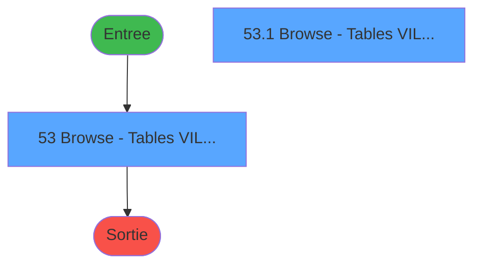
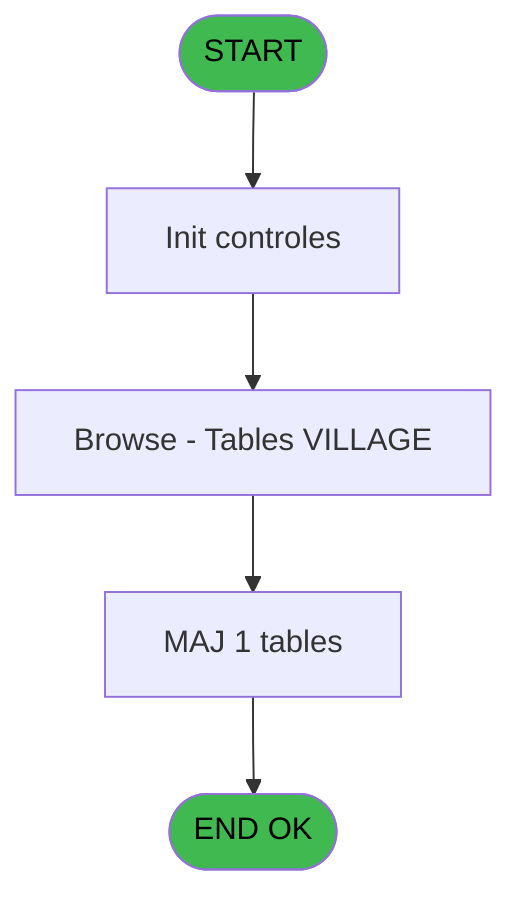
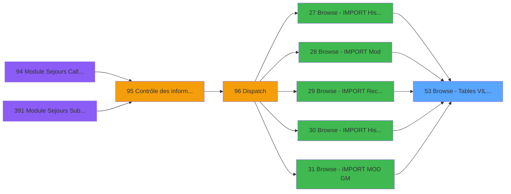

# PBG IDE 53 - Browse - Tables VILLAGE

> **Analyse**: Phases 1-4 2026-02-03 08:58 -> 08:58 (21s) | Assemblage 08:58
> **Pipeline**: V7.2 Enrichi
> **Structure**: 4 onglets (Resume | Ecrans | Donnees | Connexions)

<!-- TAB:Resume -->

## 1. FICHE D'IDENTITE

| Attribut | Valeur |
|----------|--------|
| Projet | PBG |
| IDE Position | 53 |
| Nom Programme | Browse - Tables VILLAGE |
| Fichier source | `Prg_53.xml` |
| Domaine metier | General |
| Taches | 2 (2 ecrans visibles) |
| Tables modifiees | 1 |
| Programmes appeles | 0 |

## 2. DESCRIPTION FONCTIONNELLE

**Browse - Tables VILLAGE** assure la gestion complete de ce processus, accessible depuis [Browse - IMPORT Historique Cha (IDE 27)](PBG-IDE-27.md), [Browse - IMPORT Mod (IDE 28)](PBG-IDE-28.md), [Browse - IMPORT Recup N°Chambr (IDE 29)](PBG-IDE-29.md), [Browse - IMPORT Historique Cha (IDE 30)](PBG-IDE-30.md), [Browse - IMPORT MOD GM (IDE 31)](PBG-IDE-31.md), [Browse - IMPORT Avertiss. MOD (IDE 32)](PBG-IDE-32.md), [Browse - IMPORT Avertiss. AN/V (IDE 33)](PBG-IDE-33.md), [Browse - IMPORT Commentai IMO (IDE 34)](PBG-IDE-34.md), [Browse - IMPORT Troncon   IMT (IDE 35)](PBG-IDE-35.md), [Browse - IMPORT Reprise   IMR (IDE 36)](PBG-IDE-36.md), [Browse - IMPORT Avertiss. IMA (IDE 37)](PBG-IDE-37.md), [Browse - IMPORT PrestationIMP (IDE 38)](PBG-IDE-38.md), [Browse - IMPORT Circuit   IMC (IDE 39)](PBG-IDE-39.md), [Browse - IMPORT Logement  IML (IDE 40)](PBG-IDE-40.md), [Browse - IMPORT Identite  IMI (IDE 41)](PBG-IDE-41.md).

Le flux de traitement s'organise en **1 blocs fonctionnels** :

- **Traitement** (2 taches) : traitements metier divers

**Donnees modifiees** : 1 tables en ecriture (tables_village).

## 3. BLOCS FONCTIONNELS

### 3.1 Traitement (2 taches)

Traitements internes.

---

#### 53 - Browse - Tables VILLAGE [[ECRAN]](#ecran-t1)

**Role** : Traitement : Browse - Tables VILLAGE.
**Ecran** : 780 x 160 DLU (MDI) | [Voir mockup](#ecran-t1)

---

#### 53.1 - Browse - Tables VILLAGE [[ECRAN]](#ecran-t2)

**Role** : Traitement : Browse - Tables VILLAGE.
**Ecran** : 780 x 160 DLU (MDI) | [Voir mockup](#ecran-t2)

## 5. REGLES METIER

*(Aucune regle metier identifiee)*

## 6. CONTEXTE

- **Appele par**: [Browse - IMPORT Historique Cha (IDE 27)](PBG-IDE-27.md), [Browse - IMPORT Mod (IDE 28)](PBG-IDE-28.md), [Browse - IMPORT Recup N°Chambr (IDE 29)](PBG-IDE-29.md), [Browse - IMPORT Historique Cha (IDE 30)](PBG-IDE-30.md), [Browse - IMPORT MOD GM (IDE 31)](PBG-IDE-31.md), [Browse - IMPORT Avertiss. MOD (IDE 32)](PBG-IDE-32.md), [Browse - IMPORT Avertiss. AN/V (IDE 33)](PBG-IDE-33.md), [Browse - IMPORT Commentai IMO (IDE 34)](PBG-IDE-34.md), [Browse - IMPORT Troncon   IMT (IDE 35)](PBG-IDE-35.md), [Browse - IMPORT Reprise   IMR (IDE 36)](PBG-IDE-36.md), [Browse - IMPORT Avertiss. IMA (IDE 37)](PBG-IDE-37.md), [Browse - IMPORT PrestationIMP (IDE 38)](PBG-IDE-38.md), [Browse - IMPORT Circuit   IMC (IDE 39)](PBG-IDE-39.md), [Browse - IMPORT Logement  IML (IDE 40)](PBG-IDE-40.md), [Browse - IMPORT Identite  IMI (IDE 41)](PBG-IDE-41.md)
- **Appelle**: 0 programmes | **Tables**: 1 (W:1 R:0 L:0) | **Taches**: 2 | **Expressions**: 2

<!-- TAB:Ecrans -->

## 8. ECRANS

### 8.1 Forms visibles (2 / 2)

| # | Position | Tache | Nom | Type | Largeur | Hauteur | Bloc |
|---|----------|-------|-----|------|---------|---------|------|
| 1 | 53 | 53 | Browse - Tables VILLAGE | MDI | 780 | 160 | Traitement |
| 2 | 53.1 | 53.1 | Browse - Tables VILLAGE | MDI | 780 | 160 | Traitement |

### 8.2 Mockups Ecrans

---

#### 53 - Browse - Tables VILLAGE
**Tache** : [53](#t1) | **Type** : MDI | **Dimensions** : 780 x 160 DLU
**Bloc** : Traitement | **Titre IDE** : Browse - Tables VILLAGE

<!-- FORM-DATA:
{
    "width":  780,
    "vFactor":  8,
    "type":  "MDI",
    "hFactor":  4,
    "controls":  [
                     {
                         "x":  4,
                         "type":  "table",
                         "var":  "",
                         "name":  "",
                         "titleH":  11,
                         "color":  "110",
                         "w":  598,
                         "y":  8,
                         "fmt":  "",
                         "parent":  null,
                         "text":  "",
                         "rowH":  12,
                         "h":  147,
                         "cols":  [
                                      {
                                          "title":  "CODE SOCIETE",
                                          "layer":  1,
                                          "w":  75
                                      },
                                      {
                                          "title":  "NOM DE TABLE",
                                          "layer":  2,
                                          "w":  76
                                      },
                                      {
                                          "title":  "CODE LANGUE",
                                          "layer":  3,
                                          "w":  74
                                      },
                                      {
                                          "title":  "CODE ALPHA6",
                                          "layer":  4,
                                          "w":  71
                                      },
                                      {
                                          "title":  "LIBELLE DIX",
                                          "layer":  5,
                                          "w":  69
                                      },
                                      {
                                          "title":  "LIBELLE VINGT",
                                          "layer":  6,
                                          "w":  125
                                      },
                                      {
                                          "title":  "CODE NUMERIQUE",
                                          "layer":  7,
                                          "w":  90
                                      }
                                  ],
                         "rows":  7
                     },
                     {
                         "x":  608,
                         "type":  "label",
                         "var":  "",
                         "y":  12,
                         "w":  54,
                         "fmt":  "",
                         "name":  "",
                         "h":  8,
                         "color":  "",
                         "text":  "VALEUR UN",
                         "parent":  null
                     },
                     {
                         "x":  608,
                         "type":  "label",
                         "var":  "",
                         "y":  28,
                         "w":  65,
                         "fmt":  "",
                         "name":  "",
                         "h":  8,
                         "color":  "",
                         "text":  "VALEUR DEUX",
                         "parent":  null
                     },
                     {
                         "x":  608,
                         "type":  "label",
                         "var":  "",
                         "y":  44,
                         "w":  58,
                         "fmt":  "",
                         "name":  "",
                         "h":  8,
                         "color":  "",
                         "text":  "OPERATEUR",
                         "parent":  null
                     },
                     {
                         "x":  608,
                         "type":  "label",
                         "var":  "",
                         "y":  60,
                         "w":  57,
                         "fmt":  "",
                         "name":  "",
                         "h":  8,
                         "color":  "",
                         "text":  "DATE TABLE",
                         "parent":  null
                     },
                     {
                         "x":  608,
                         "type":  "label",
                         "var":  "",
                         "y":  76,
                         "w":  64,
                         "fmt":  "",
                         "name":  "",
                         "h":  8,
                         "color":  "",
                         "text":  "HEURE TABLE",
                         "parent":  null
                     },
                     {
                         "x":  8,
                         "type":  "edit",
                         "var":  "",
                         "y":  21,
                         "w":  10,
                         "fmt":  "",
                         "name":  "CODE SOCIETE",
                         "h":  8,
                         "color":  "110",
                         "text":  "",
                         "parent":  1
                     },
                     {
                         "x":  83,
                         "type":  "edit",
                         "var":  "",
                         "y":  21,
                         "w":  41,
                         "fmt":  "",
                         "name":  "NOM DE TABLE",
                         "h":  8,
                         "color":  "110",
                         "text":  "",
                         "parent":  1
                     },
                     {
                         "x":  159,
                         "type":  "edit",
                         "var":  "",
                         "y":  21,
                         "w":  10,
                         "fmt":  "",
                         "name":  "CODE LANGUE",
                         "h":  8,
                         "color":  "110",
                         "text":  "",
                         "parent":  1
                     },
                     {
                         "x":  233,
                         "type":  "edit",
                         "var":  "",
                         "y":  21,
                         "w":  42,
                         "fmt":  "",
                         "name":  "CODE ALPHA6",
                         "h":  8,
                         "color":  "110",
                         "text":  "",
                         "parent":  1
                     },
                     {
                         "x":  304,
                         "type":  "edit",
                         "var":  "",
                         "y":  21,
                         "w":  61,
                         "fmt":  "",
                         "name":  "LIBELLE DIX",
                         "h":  8,
                         "color":  "110",
                         "text":  "",
                         "parent":  1
                     },
                     {
                         "x":  373,
                         "type":  "edit",
                         "var":  "",
                         "y":  21,
                         "w":  117,
                         "fmt":  "",
                         "name":  "LIBELLE VINGT",
                         "h":  8,
                         "color":  "110",
                         "text":  "",
                         "parent":  1
                     },
                     {
                         "x":  498,
                         "type":  "edit",
                         "var":  "",
                         "y":  21,
                         "w":  32,
                         "fmt":  "",
                         "name":  "CODE NUMERIQUE",
                         "h":  8,
                         "color":  "110",
                         "text":  "",
                         "parent":  1
                     },
                     {
                         "x":  678,
                         "type":  "edit",
                         "var":  "",
                         "y":  12,
                         "w":  24,
                         "fmt":  "",
                         "name":  "VALEUR UN",
                         "h":  10,
                         "color":  "110",
                         "text":  "",
                         "parent":  null
                     },
                     {
                         "x":  678,
                         "type":  "edit",
                         "var":  "",
                         "y":  28,
                         "w":  24,
                         "fmt":  "",
                         "name":  "VALEUR DEUX",
                         "h":  10,
                         "color":  "110",
                         "text":  "",
                         "parent":  null
                     },
                     {
                         "x":  678,
                         "type":  "edit",
                         "var":  "",
                         "y":  44,
                         "w":  63,
                         "fmt":  "",
                         "name":  "OPERATEUR",
                         "h":  10,
                         "color":  "110",
                         "text":  "",
                         "parent":  null
                     },
                     {
                         "x":  678,
                         "type":  "edit",
                         "var":  "",
                         "y":  60,
                         "w":  63,
                         "fmt":  "",
                         "name":  "DATE TABLE",
                         "h":  10,
                         "color":  "110",
                         "text":  "",
                         "parent":  null
                     },
                     {
                         "x":  678,
                         "type":  "edit",
                         "var":  "",
                         "y":  76,
                         "w":  35,
                         "fmt":  "",
                         "name":  "HEURE TABLE",
                         "h":  10,
                         "color":  "110",
                         "text":  "",
                         "parent":  null
                     }
                 ],
    "taskId":  "53",
    "height":  160
}
-->

<strong>Champs : 12 champs</strong>

| Pos (x,y) | Nom | Variable | Type |
|-----------|-----|----------|------|
| 8,21 | CODE SOCIETE | - | edit |
| 83,21 | NOM DE TABLE | - | edit |
| 159,21 | CODE LANGUE | - | edit |
| 233,21 | CODE ALPHA6 | - | edit |
| 304,21 | LIBELLE DIX | - | edit |
| 373,21 | LIBELLE VINGT | - | edit |
| 498,21 | CODE NUMERIQUE | - | edit |
| 678,12 | VALEUR UN | - | edit |
| 678,28 | VALEUR DEUX | - | edit |
| 678,44 | OPERATEUR | - | edit |
| 678,60 | DATE TABLE | - | edit |
| 678,76 | HEURE TABLE | - | edit |

---

#### 53.1 - Browse - Tables VILLAGE
**Tache** : [53.1](#t2) | **Type** : MDI | **Dimensions** : 780 x 160 DLU
**Bloc** : Traitement | **Titre IDE** : Browse - Tables VILLAGE

<!-- FORM-DATA:
{
    "width":  780,
    "vFactor":  8,
    "type":  "MDI",
    "hFactor":  4,
    "controls":  [
                     {
                         "x":  4,
                         "type":  "table",
                         "var":  "",
                         "name":  "",
                         "titleH":  11,
                         "color":  "110",
                         "w":  591,
                         "y":  8,
                         "fmt":  "",
                         "parent":  null,
                         "text":  "",
                         "rowH":  13,
                         "h":  141,
                         "cols":  [
                                      {
                                          "title":  "CODE SOCIETE",
                                          "layer":  1,
                                          "w":  72
                                      },
                                      {
                                          "title":  "NOM DE TABLE",
                                          "layer":  2,
                                          "w":  76
                                      },
                                      {
                                          "title":  "CODE LANGUE",
                                          "layer":  3,
                                          "w":  74
                                      },
                                      {
                                          "title":  "CODE ALPHA6",
                                          "layer":  4,
                                          "w":  71
                                      },
                                      {
                                          "title":  "LIBELLE DIX",
                                          "layer":  5,
                                          "w":  69
                                      },
                                      {
                                          "title":  "LIBELLE VINGT",
                                          "layer":  6,
                                          "w":  125
                                      },
                                      {
                                          "title":  "CODE NUMERIQUE",
                                          "layer":  7,
                                          "w":  88
                                      }
                                  ],
                         "rows":  7
                     },
                     {
                         "x":  622,
                         "type":  "label",
                         "var":  "",
                         "y":  14,
                         "w":  54,
                         "fmt":  "",
                         "name":  "",
                         "h":  8,
                         "color":  "",
                         "text":  "VALEUR UN",
                         "parent":  null
                     },
                     {
                         "x":  624,
                         "type":  "label",
                         "var":  "",
                         "y":  30,
                         "w":  65,
                         "fmt":  "",
                         "name":  "",
                         "h":  8,
                         "color":  "",
                         "text":  "VALEUR DEUX",
                         "parent":  null
                     },
                     {
                         "x":  624,
                         "type":  "label",
                         "var":  "",
                         "y":  46,
                         "w":  58,
                         "fmt":  "",
                         "name":  "",
                         "h":  8,
                         "color":  "",
                         "text":  "OPERATEUR",
                         "parent":  null
                     },
                     {
                         "x":  626,
                         "type":  "label",
                         "var":  "",
                         "y":  60,
                         "w":  57,
                         "fmt":  "",
                         "name":  "",
                         "h":  8,
                         "color":  "",
                         "text":  "DATE TABLE",
                         "parent":  null
                     },
                     {
                         "x":  626,
                         "type":  "label",
                         "var":  "",
                         "y":  76,
                         "w":  64,
                         "fmt":  "",
                         "name":  "",
                         "h":  8,
                         "color":  "",
                         "text":  "HEURE TABLE",
                         "parent":  null
                     },
                     {
                         "x":  80,
                         "type":  "edit",
                         "var":  "",
                         "y":  21,
                         "w":  41,
                         "fmt":  "",
                         "name":  "",
                         "h":  8,
                         "color":  "110",
                         "text":  "",
                         "parent":  1
                     },
                     {
                         "x":  156,
                         "type":  "edit",
                         "var":  "",
                         "y":  21,
                         "w":  10,
                         "fmt":  "",
                         "name":  "",
                         "h":  8,
                         "color":  "110",
                         "text":  "",
                         "parent":  1
                     },
                     {
                         "x":  230,
                         "type":  "edit",
                         "var":  "",
                         "y":  21,
                         "w":  42,
                         "fmt":  "",
                         "name":  "",
                         "h":  8,
                         "color":  "110",
                         "text":  "",
                         "parent":  1
                     },
                     {
                         "x":  301,
                         "type":  "edit",
                         "var":  "",
                         "y":  21,
                         "w":  61,
                         "fmt":  "",
                         "name":  "",
                         "h":  8,
                         "color":  "110",
                         "text":  "",
                         "parent":  1
                     },
                     {
                         "x":  370,
                         "type":  "edit",
                         "var":  "",
                         "y":  21,
                         "w":  117,
                         "fmt":  "",
                         "name":  "",
                         "h":  8,
                         "color":  "110",
                         "text":  "",
                         "parent":  1
                     },
                     {
                         "x":  495,
                         "type":  "edit",
                         "var":  "",
                         "y":  21,
                         "w":  32,
                         "fmt":  "",
                         "name":  "",
                         "h":  8,
                         "color":  "110",
                         "text":  "",
                         "parent":  1
                     },
                     {
                         "x":  690,
                         "type":  "edit",
                         "var":  "",
                         "y":  14,
                         "w":  24,
                         "fmt":  "",
                         "name":  "",
                         "h":  10,
                         "color":  "110",
                         "text":  "",
                         "parent":  null
                     },
                     {
                         "x":  690,
                         "type":  "edit",
                         "var":  "",
                         "y":  30,
                         "w":  24,
                         "fmt":  "",
                         "name":  "",
                         "h":  10,
                         "color":  "110",
                         "text":  "",
                         "parent":  null
                     },
                     {
                         "x":  690,
                         "type":  "edit",
                         "var":  "",
                         "y":  46,
                         "w":  63,
                         "fmt":  "",
                         "name":  "",
                         "h":  10,
                         "color":  "110",
                         "text":  "",
                         "parent":  null
                     },
                     {
                         "x":  690,
                         "type":  "edit",
                         "var":  "",
                         "y":  60,
                         "w":  63,
                         "fmt":  "",
                         "name":  "",
                         "h":  10,
                         "color":  "110",
                         "text":  "",
                         "parent":  null
                     },
                     {
                         "x":  690,
                         "type":  "edit",
                         "var":  "",
                         "y":  76,
                         "w":  35,
                         "fmt":  "",
                         "name":  "",
                         "h":  10,
                         "color":  "110",
                         "text":  "",
                         "parent":  null
                     },
                     {
                         "x":  8,
                         "type":  "edit",
                         "var":  "",
                         "y":  21,
                         "w":  9,
                         "fmt":  "",
                         "name":  "societe",
                         "h":  10,
                         "color":  "110",
                         "text":  "",
                         "parent":  1
                     }
                 ],
    "taskId":  "53.1",
    "height":  160
}
-->

<strong>Champs : 12 champs</strong>

| Pos (x,y) | Nom | Variable | Type |
|-----------|-----|----------|------|
| 80,21 | (sans nom) | - | edit |
| 156,21 | (sans nom) | - | edit |
| 230,21 | (sans nom) | - | edit |
| 301,21 | (sans nom) | - | edit |
| 370,21 | (sans nom) | - | edit |
| 495,21 | (sans nom) | - | edit |
| 690,14 | (sans nom) | - | edit |
| 690,30 | (sans nom) | - | edit |
| 690,46 | (sans nom) | - | edit |
| 690,60 | (sans nom) | - | edit |
| 690,76 | (sans nom) | - | edit |
| 8,21 | societe | - | edit |

## 9. NAVIGATION

### 9.1 Enchainement des ecrans

**Detail par enchainement :**

| Depuis | Action | Vers | Retour |
|--------|--------|------|--------|

### 9.3 Structure hierarchique (2 taches)

| Position | Tache | Type | Dimensions | Bloc |
|----------|-------|------|------------|------|
| **53.1** | [**Browse - Tables VILLAGE** (53)](#t1) [mockup](#ecran-t1) | MDI | 780x160 | Traitement |
| 53.1.1 | [Browse - Tables VILLAGE (53.1)](#t2) [mockup](#ecran-t2) | MDI | 780x160 | |

### 9.4 Algorigramme

> **Legende**: Vert = START/END OK | Rouge = END KO | Bleu = Decisions
> *Algorigramme auto-genere. Utiliser `/algorigramme` pour une synthese metier detaillee.*

<!-- TAB:Donnees -->

## 10. TABLES

### Tables utilisees (1)

| ID | Nom | Description | Type | R | W | L | Usages |
|----|-----|-------------|------|---|---|---|--------|
| 113 | tables_village |  | DB |   | **W** |   | 2 |

### Colonnes par table (0 / 1 tables avec colonnes identifiees)

Table 113 - tables_village (**W**) - 2 usages

*Table utilisee uniquement en Link ou aucune colonne Real identifiee dans le DataView.*

## 11. VARIABLES

*(Programme sans variables locales mappees)*

## 12. EXPRESSIONS

**2 / 2 expressions decodees (100%)**

### 12.1 Repartition par type

| Type | Expressions | Regles |
|------|-------------|--------|
| CONSTANTE | 1 | 0 |
| OTHER | 1 | 0 |

### 12.2 Expressions cles par type

#### CONSTANTE (1 expressions)

| Type | IDE | Expression | Regle |
|------|-----|------------|-------|
| CONSTANTE | 2 | `'VBEBE'` | - |

#### OTHER (1 expressions)

| Type | IDE | Expression | Regle |
|------|-----|------------|-------|
| OTHER | 1 | `GetParam ('CODE_S')` | - |

<!-- TAB:Connexions -->

## 13. GRAPHE D'APPELS

### 13.1 Chaine depuis Main (Callers)

Main -> ... -> [Browse - IMPORT Historique Cha (IDE 27)](PBG-IDE-27.md) -> **Browse - Tables VILLAGE (IDE 53)**

Main -> ... -> [Browse - IMPORT Mod (IDE 28)](PBG-IDE-28.md) -> **Browse - Tables VILLAGE (IDE 53)**

Main -> ... -> [Browse - IMPORT Recup N°Chambr (IDE 29)](PBG-IDE-29.md) -> **Browse - Tables VILLAGE (IDE 53)**

Main -> ... -> [Browse - IMPORT Historique Cha (IDE 30)](PBG-IDE-30.md) -> **Browse - Tables VILLAGE (IDE 53)**

Main -> ... -> [Browse - IMPORT MOD GM (IDE 31)](PBG-IDE-31.md) -> **Browse - Tables VILLAGE (IDE 53)**

Main -> ... -> [Browse - IMPORT Avertiss. MOD (IDE 32)](PBG-IDE-32.md) -> **Browse - Tables VILLAGE (IDE 53)**

Main -> ... -> [Browse - IMPORT Avertiss. AN/V (IDE 33)](PBG-IDE-33.md) -> **Browse - Tables VILLAGE (IDE 53)**

Main -> ... -> [Browse - IMPORT Commentai IMO (IDE 34)](PBG-IDE-34.md) -> **Browse - Tables VILLAGE (IDE 53)**

Main -> ... -> [Browse - IMPORT Troncon   IMT (IDE 35)](PBG-IDE-35.md) -> **Browse - Tables VILLAGE (IDE 53)**

Main -> ... -> [Browse - IMPORT Reprise   IMR (IDE 36)](PBG-IDE-36.md) -> **Browse - Tables VILLAGE (IDE 53)**

Main -> ... -> [Browse - IMPORT Avertiss. IMA (IDE 37)](PBG-IDE-37.md) -> **Browse - Tables VILLAGE (IDE 53)**

Main -> ... -> [Browse - IMPORT PrestationIMP (IDE 38)](PBG-IDE-38.md) -> **Browse - Tables VILLAGE (IDE 53)**

Main -> ... -> [Browse - IMPORT Circuit   IMC (IDE 39)](PBG-IDE-39.md) -> **Browse - Tables VILLAGE (IDE 53)**

Main -> ... -> [Browse - IMPORT Logement  IML (IDE 40)](PBG-IDE-40.md) -> **Browse - Tables VILLAGE (IDE 53)**

Main -> ... -> [Browse - IMPORT Identite  IMI (IDE 41)](PBG-IDE-41.md) -> **Browse - Tables VILLAGE (IDE 53)**

### 13.2 Callers

| IDE | Nom Programme | Nb Appels |
|-----|---------------|-----------|
| [27](PBG-IDE-27.md) | Browse - IMPORT Historique Cha | 1 |
| [28](PBG-IDE-28.md) | Browse - IMPORT Mod | 1 |
| [29](PBG-IDE-29.md) | Browse - IMPORT Recup N°Chambr | 1 |
| [30](PBG-IDE-30.md) | Browse - IMPORT Historique Cha | 1 |
| [31](PBG-IDE-31.md) | Browse - IMPORT MOD GM | 1 |
| [32](PBG-IDE-32.md) | Browse - IMPORT Avertiss. MOD | 1 |
| [33](PBG-IDE-33.md) | Browse - IMPORT Avertiss. AN/V | 1 |
| [34](PBG-IDE-34.md) | Browse - IMPORT Commentai IMO | 1 |
| [35](PBG-IDE-35.md) | Browse - IMPORT Troncon   IMT | 1 |
| [36](PBG-IDE-36.md) | Browse - IMPORT Reprise   IMR | 1 |
| [37](PBG-IDE-37.md) | Browse - IMPORT Avertiss. IMA | 1 |
| [38](PBG-IDE-38.md) | Browse - IMPORT PrestationIMP | 1 |
| [39](PBG-IDE-39.md) | Browse - IMPORT Circuit   IMC | 1 |
| [40](PBG-IDE-40.md) | Browse - IMPORT Logement  IML | 1 |
| [41](PBG-IDE-41.md) | Browse - IMPORT Identite  IMI | 1 |

### 13.3 Callees (programmes appeles)

### 13.4 Detail Callees avec contexte

| IDE | Nom Programme | Appels | Contexte |
|-----|---------------|--------|----------|
| - | (aucun) | - | - |

## 14. RECOMMANDATIONS MIGRATION

### 14.1 Profil du programme

| Metrique | Valeur | Impact migration |
|----------|--------|-----------------|
| Lignes de logique | 30 | Programme compact |
| Expressions | 2 | Peu de logique |
| Tables WRITE | 1 | Impact faible |
| Sous-programmes | 0 | Peu de dependances |
| Ecrans visibles | 2 | Quelques ecrans |
| Code desactive | 0% (0 / 30) | Code sain |
| Regles metier | 0 | Pas de regle identifiee |

### 14.2 Plan de migration par bloc

#### Traitement (2 taches: 2 ecrans, 0 traitement)

- **Strategie** : 2 composant(s) UI (Razor/React) avec formulaires et validation.
- Decomposer les taches en services unitaires testables.

### 14.3 Dependances critiques

| Dependance | Type | Appels | Impact |
|------------|------|--------|--------|
| tables_village | Table WRITE (Database) | 2x | Schema + repository |

---
*Spec DETAILED generee par Pipeline V7.2 - 2026-02-03 08:59*
