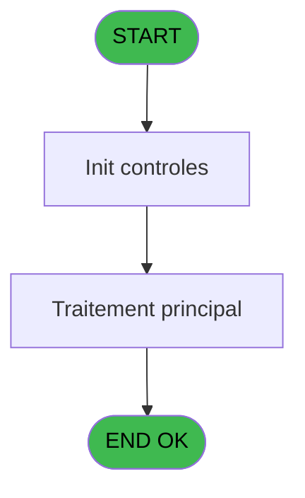
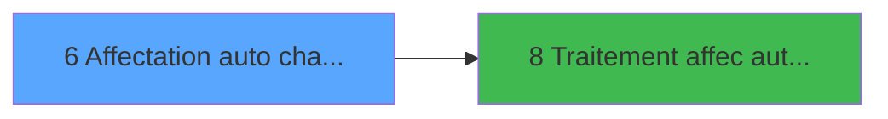

# PBG IDE 6 - Affectation auto chambres v1

> **Analyse**: Phases 1-4 2026-02-03 00:54 -> 00:55 (36s) | Assemblage 00:55
> **Pipeline**: V7.2 Enrichi
> **Structure**: 4 onglets (Resume | Ecrans | Donnees | Connexions)

<!-- TAB:Resume -->

## 1. FICHE D'IDENTITE

| Attribut | Valeur |
|----------|--------|
| Projet | PBG |
| IDE Position | 6 |
| Nom Programme | Affectation auto chambres v1 |
| Fichier source | `Prg_6.xml` |
| Domaine metier | General |
| Taches | 1 (1 ecrans visibles) |
| Tables modifiees | 0 |
| Programmes appeles | 1 |

## 2. DESCRIPTION FONCTIONNELLE

**Affectation auto chambres v1** assure la gestion complete de ce processus, accessible depuis [Affectation auto chambres lanc (IDE 5)](PBG-IDE-5.md).

Le flux de traitement s'organise en **1 blocs fonctionnels** :

- **Traitement** (1 tache) : traitements metier divers

## 3. BLOCS FONCTIONNELS

### 3.1 Traitement (1 tache)

Traitements internes.

---

#### 6 - Affectation automatique des ch [[ECRAN]](#ecran-t6)

**Role** : Traitement : Affectation automatique des ch.
**Ecran** : 1117 x 177 DLU | [Voir mockup](#ecran-t6)
**Delegue a** : [Traitement affec auto chambres (IDE 8)](PBG-IDE-8.md)

## 5. REGLES METIER

*(Aucune regle metier identifiee)*

## 6. CONTEXTE

- **Appele par**: [Affectation auto chambres lanc (IDE 5)](PBG-IDE-5.md)
- **Appelle**: 1 programmes | **Tables**: 1 (W:0 R:1 L:0) | **Taches**: 1 | **Expressions**: 8

<!-- TAB:Ecrans -->

## 8. ECRANS

### 8.1 Forms visibles (1 / 1)

| # | Position | Tache | Nom | Type | Largeur | Hauteur | Bloc |
|---|----------|-------|-----|------|---------|---------|------|
| 1 | 6.1 | 6 | Affectation automatique des ch | Type0 | 1117 | 177 | Traitement |

### 8.2 Mockups Ecrans

---

#### 6.1 - Affectation automatique des ch
**Tache** : [6](#t6) | **Type** : Type0 | **Dimensions** : 1117 x 177 DLU
**Bloc** : Traitement | **Titre IDE** : Affectation automatique des ch

<!-- FORM-DATA:
{
    "width":  1117,
    "vFactor":  8,
    "type":  "Type0",
    "hFactor":  8,
    "controls":  [
                     {
                         "x":  390,
                         "type":  "label",
                         "var":  "",
                         "y":  40,
                         "w":  336,
                         "fmt":  "",
                         "name":  "",
                         "h":  58,
                         "color":  "195",
                         "text":  "Regroupement",
                         "parent":  null
                     },
                     {
                         "x":  13,
                         "type":  "label",
                         "var":  "",
                         "y":  3,
                         "w":  1095,
                         "fmt":  "",
                         "name":  "",
                         "h":  22,
                         "color":  "",
                         "text":  "",
                         "parent":  null
                     },
                     {
                         "x":  19,
                         "type":  "label",
                         "var":  "",
                         "y":  150,
                         "w":  1096,
                         "fmt":  "",
                         "name":  "",
                         "h":  23,
                         "color":  "",
                         "text":  "",
                         "parent":  null
                     },
                     {
                         "x":  19,
                         "type":  "edit",
                         "var":  "",
                         "y":  9,
                         "w":  394,
                         "fmt":  "20",
                         "name":  "VG.USER",
                         "h":  10,
                         "color":  "",
                         "text":  "",
                         "parent":  4
                     },
                     {
                         "x":  825,
                         "type":  "edit",
                         "var":  "",
                         "y":  9,
                         "w":  274,
                         "fmt":  "WWW DD MMM YYYYT",
                         "name":  "",
                         "h":  10,
                         "color":  "",
                         "text":  "",
                         "parent":  4
                     },
                     {
                         "x":  488,
                         "type":  "radio",
                         "var":  "",
                         "y":  54,
                         "w":  140,
                         "fmt":  "",
                         "name":  "R.Regroupement",
                         "h":  38,
                         "color":  "",
                         "text":  "A,C",
                         "parent":  1
                     },
                     {
                         "x":  395,
                         "type":  "checkbox",
                         "var":  "",
                         "y":  111,
                         "w":  630,
                         "fmt":  "",
                         "name":  "v.Loger les dossier si comment.",
                         "h":  12,
                         "color":  "",
                         "text":  "Affectation automatique des chambres pour les dossiers avec commentaires ?",
                         "parent":  null
                     },
                     {
                         "x":  26,
                         "type":  "button",
                         "var":  "",
                         "y":  153,
                         "w":  154,
                         "fmt":  "\u0026Quitter",
                         "name":  "bouton quitter",
                         "h":  18,
                         "color":  "",
                         "text":  "",
                         "parent":  7
                     },
                     {
                         "x":  952,
                         "type":  "button",
                         "var":  "",
                         "y":  153,
                         "w":  154,
                         "fmt":  "\u0026\\Lancement",
                         "name":  "bouton recherche",
                         "h":  18,
                         "color":  "",
                         "text":  "",
                         "parent":  7
                     }
                 ],
    "taskId":  "6.1",
    "height":  177
}
-->

<strong>Champs : 3 champs</strong>

| Pos (x,y) | Nom | Variable | Type |
|-----------|-----|----------|------|
| 19,9 | VG.USER | - | edit |
| 825,9 | WWW DD MMM YYYYT | - | edit |
| 395,111 | v.Loger les dossier si comment. | - | checkbox |

<strong>Boutons : 2 boutons</strong>

| Bouton | Pos (x,y) | Action |
|--------|-----------|--------|
| Quitter | 26,153 | Quitte le programme |
| \Lancement | 952,153 | Bouton fonctionnel |

## 9. NAVIGATION

Ecran unique: **Affectation automatique des ch**

### 9.3 Structure hierarchique (1 tache)

| Position | Tache | Type | Dimensions | Bloc |
|----------|-------|------|------------|------|
| **6.1** | [**Affectation automatique des ch** (6)](#t6) [mockup](#ecran-t6) | - | 1117x177 | Traitement |

### 9.4 Algorigramme

> **Legende**: Vert = START/END OK | Rouge = END KO | Bleu = Decisions
> *Algorigramme auto-genere. Utiliser `/algorigramme` pour une synthese metier detaillee.*

<!-- TAB:Donnees -->

## 10. TABLES

### Tables utilisees (1)

| ID | Nom | Description | Type | R | W | L | Usages |
|----|-----|-------------|------|---|---|---|--------|
| 823 | fac_tva_pro |  | DB | R |   |   | 1 |

### Colonnes par table (1 / 1 tables avec colonnes identifiees)

Table 823 - fac_tva_pro (R) - 1 usages

| Lettre | Variable | Acces | Type |
|--------|----------|-------|------|
| A | V.Confirmation | R | Numeric |
| B | V.Traitement deja lance ? | R | Logical |
| C | R.Regroupement | R | Alpha |
| D | v.Loger les dossier si comment. | R | Logical |
| E | Bt.Quitter | R | Alpha |
| F | Bt.Lancement | R | Alpha |

## 11. VARIABLES

### 11.1 Variables de session (3)

Variables persistantes pendant toute la session.

| Lettre | Nom | Type | Usage dans |
|--------|-----|------|-----------|
| A | V.Confirmation | Numeric | - |
| B | V.Traitement deja lance ? | Logical | 2x session |
| D | v.Loger les dossier si comment. | Logical | - |

### 11.2 Autres (3)

Variables diverses.

| Lettre | Nom | Type | Usage dans |
|--------|-----|------|-----------|
| C | R.Regroupement | Alpha | - |
| E | Bt.Quitter | Alpha | - |
| F | Bt.Lancement | Alpha | - |

## 12. EXPRESSIONS

**8 / 8 expressions decodees (100%)**

### 12.1 Repartition par type

| Type | Expressions | Regles |
|------|-------------|--------|
| CONSTANTE | 2 | 0 |
| DATE | 2 | 0 |
| OTHER | 2 | 0 |
| NEGATION | 1 | 0 |
| CAST_LOGIQUE | 1 | 0 |

### 12.2 Expressions cles par type

#### CONSTANTE (2 expressions)

| Type | IDE | Expression | Regle |
|------|-----|------------|-------|
| CONSTANTE | 7 | `'C'` | - |
| CONSTANTE | 1 | `'C'` | - |

#### DATE (2 expressions)

| Type | IDE | Expression | Regle |
|------|-----|------------|-------|
| DATE | 6 | `Date()` | - |
| DATE | 2 | `Date()` | - |

#### OTHER (2 expressions)

| Type | IDE | Expression | Regle |
|------|-----|------------|-------|
| OTHER | 5 | `MlsTrans('Affectation automatique des chambres')` | - |
| OTHER | 3 | `V.Traitement deja lance ? [B]` | - |

#### NEGATION (1 expressions)

| Type | IDE | Expression | Regle |
|------|-----|------------|-------|
| NEGATION | 4 | `NOT V.Traitement deja lance ? [B]` | - |

#### CAST_LOGIQUE (1 expressions)

| Type | IDE | Expression | Regle |
|------|-----|------------|-------|
| CAST_LOGIQUE | 8 | `'TRUE'LOG` | - |

<!-- TAB:Connexions -->

## 13. GRAPHE D'APPELS

### 13.1 Chaine depuis Main (Callers)

Main -> ... -> [Affectation auto chambres lanc (IDE 5)](PBG-IDE-5.md) -> **Affectation auto chambres v1 (IDE 6)**

### 13.2 Callers

| IDE | Nom Programme | Nb Appels |
|-----|---------------|-----------|
| [5](PBG-IDE-5.md) | Affectation auto chambres lanc | 1 |

### 13.3 Callees (programmes appeles)

### 13.4 Detail Callees avec contexte

| IDE | Nom Programme | Appels | Contexte |
|-----|---------------|--------|----------|
| [8](PBG-IDE-8.md) | Traitement affec auto chambres | 1 | Sous-programme |

## 14. RECOMMANDATIONS MIGRATION

### 14.1 Profil du programme

| Metrique | Valeur | Impact migration |
|----------|--------|-----------------|
| Lignes de logique | 15 | Programme compact |
| Expressions | 8 | Peu de logique |
| Tables WRITE | 0 | Impact faible |
| Sous-programmes | 1 | Peu de dependances |
| Ecrans visibles | 1 | Ecran unique ou traitement batch |
| Code desactive | 0% (0 / 15) | Code sain |
| Regles metier | 0 | Pas de regle identifiee |

### 14.2 Plan de migration par bloc

#### Traitement (1 tache: 1 ecran, 0 traitement)

- **Strategie** : 1 composant(s) UI (Razor/React) avec formulaires et validation.
- 1 sous-programme(s) a migrer ou a reutiliser depuis les services existants.
- Decomposer les taches en services unitaires testables.

### 14.3 Dependances critiques

| Dependance | Type | Appels | Impact |
|------------|------|--------|--------|
| [Traitement affec auto chambres (IDE 8)](PBG-IDE-8.md) | Sous-programme | 1x | Normale - Sous-programme |

---
*Spec DETAILED generee par Pipeline V7.2 - 2026-02-03 00:55*
