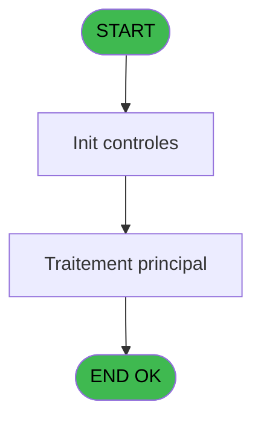
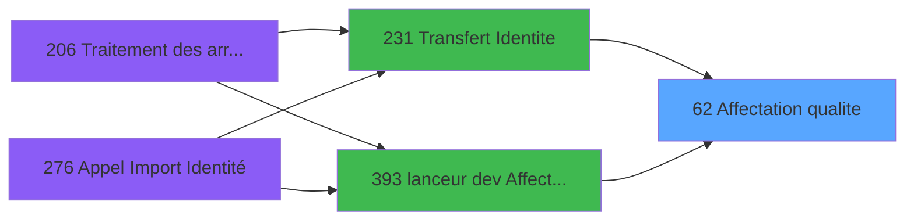

# PBG IDE 62 - Affectation qualite

> **Analyse**: Phases 1-4 2026-02-03 09:03 -> 09:03 (21s) | Assemblage 09:03
> **Pipeline**: V7.2 Enrichi
> **Structure**: 4 onglets (Resume | Ecrans | Donnees | Connexions)

<!-- TAB:Resume -->

## 1. FICHE D'IDENTITE

| Attribut | Valeur |
|----------|--------|
| Projet | PBG |
| IDE Position | 62 |
| Nom Programme | Affectation qualite |
| Fichier source | `Prg_62.xml` |
| Domaine metier | General |
| Taches | 3 (0 ecrans visibles) |
| Tables modifiees | 0 |
| Programmes appeles | 0 |

## 2. DESCRIPTION FONCTIONNELLE

**Affectation qualite** assure la gestion complete de ce processus, accessible depuis [Transfert Identite (IDE 231)](PBG-IDE-231.md), [lanceur dev Affectation qualit (IDE 393)](PBG-IDE-393.md).

Le flux de traitement s'organise en **2 blocs fonctionnels** :

- **Creation** (2 taches) : insertion d'enregistrements en base (mouvements, prestations)
- **Traitement** (1 tache) : traitements metier divers

Detail : phases du traitement

#### Phase 1 : Creation (2 taches)

- **62.1** - Creation Hebergement
- **62.2** - Creation Hebergement

#### Phase 2 : Traitement (1 tache)

- **62** - Affectation qualite

## 3. BLOCS FONCTIONNELS

### 3.1 Creation (2 taches)

Insertion de nouveaux enregistrements en base.

---

#### 62.1 - Creation Hebergement

**Role** : Creation d'enregistrement : Creation Hebergement.

---

#### 62.2 - Creation Hebergement

**Role** : Creation d'enregistrement : Creation Hebergement.

### 3.2 Traitement (1 tache)

Traitements internes.

---

#### 62 - Affectation qualite

**Role** : Traitement : Affectation qualite.
**Variables liees** : B (P.Qualite), I (v. Qualite)

## 5. REGLES METIER

*(Aucune regle metier identifiee)*

## 6. CONTEXTE

- **Appele par**: [Transfert Identite (IDE 231)](PBG-IDE-231.md), [lanceur dev Affectation qualit (IDE 393)](PBG-IDE-393.md)
- **Appelle**: 0 programmes | **Tables**: 0 (W:0 R:0 L:0) | **Taches**: 3 | **Expressions**: 127

<!-- TAB:Ecrans -->

## 8. ECRANS

*(Programme sans ecran visible)*

## 9. NAVIGATION

### 9.3 Structure hierarchique (3 taches)

| Position | Tache | Type | Dimensions | Bloc |
|----------|-------|------|------------|------|
| **62.1** | [**Creation Hebergement** (62.1)](#t10) | MDI | - | Creation |
| 62.1.1 | [Creation Hebergement (62.2)](#t15) | MDI | - | |
| **62.2** | [**Affectation qualite** (62)](#t11) | - | - | Traitement |

### 9.4 Algorigramme

> **Legende**: Vert = START/END OK | Rouge = END KO | Bleu = Decisions
> *Algorigramme auto-genere. Utiliser `/algorigramme` pour une synthese metier detaillee.*

<!-- TAB:Donnees -->

## 10. TABLES

### Tables utilisees (0)

| ID | Nom | Description | Type | R | W | L | Usages |
|----|-----|-------------|------|---|---|---|--------|

### Colonnes par table (0 / 0 tables avec colonnes identifiees)

## 11. VARIABLES

### 11.1 Parametres entrants (7)

Variables recues du programme appelant ([Transfert Identite (IDE 231)](PBG-IDE-231.md)).

| Lettre | Nom | Type | Usage dans |
|--------|-----|------|-----------|
| A | P.Type GO GM | Alpha | - |
| B | P.Qualite | Alpha | - |
| C | P.Creneau | Alpha | - |
| D | P.Pays | Alpha | - |
| E | P.Reseau | Alpha | - |
| F | P.Agent | Alpha | - |
| G | P.Free | Alpha | - |

### 11.2 Variables de session (2)

Variables persistantes pendant toute la session.

| Lettre | Nom | Type | Usage dans |
|--------|-----|------|-----------|
| H | v. Type GO GM | Alpha | - |
| I | v. Qualite | Alpha | - |

## 12. EXPRESSIONS

**127 / 127 expressions decodees (100%)**

### 12.1 Repartition par type

| Type | Expressions | Regles |
|------|-------------|--------|
| CONSTANTE | 16 | 0 |
| REFERENCE_VG | 1 | 0 |
| CONDITION | 103 | 0 |
| NEGATION | 1 | 0 |
| OTHER | 5 | 0 |
| STRING | 1 | 0 |

### 12.2 Expressions cles par type

#### CONSTANTE (16 expressions)

| Type | IDE | Expression | Regle |
|------|-----|------------|-------|
| CONSTANTE | 24 | `''` | - |
| CONSTANTE | 26 | `'GO'` | - |
| CONSTANTE | 10 | `'PROP'` | - |
| CONSTANTE | 11 | `'EDUC'` | - |
| CONSTANTE | 111 | `'VILL'` | - |
| ... | | *+11 autres* | |

#### REFERENCE_VG (1 expressions)

| Type | IDE | Expression | Regle |
|------|-----|------------|-------|
| REFERENCE_VG | 1 | `VG152` | - |

#### CONDITION (103 expressions)

| Type | IDE | Expression | Regle |
|------|-----|------------|-------|
| CONDITION | 87 | `[AR]='650' AND [AQ]='M1' AND [AS]='ED'` | - |
| CONDITION | 88 | `[AR]='700' AND [AQ]='M1' AND [AS]='ED'` | - |
| CONDITION | 89 | `[AR]='830' AND [AQ]='M2' AND [AS]='9F'` | - |
| CONDITION | 84 | `[AR]='480' AND [AQ]='M1' AND [AS]='ED'` | - |
| CONDITION | 85 | `[AR]='550' AND [AQ]='M1' AND [AS]='ED'` | - |
| ... | | *+98 autres* | |

#### NEGATION (1 expressions)

| Type | IDE | Expression | Regle |
|------|-----|------------|-------|
| NEGATION | 113 | `NOT IN ([AT],'M37ECFAM','M37EAFAM','M37WEFAM','M37NOFAM','M37SOFAM','M37NKFAM','M37OTFAM','M37ECMIS','M37EAMIS','M37WEMIS','M37NOMIS','M37SOMIS','M37NKMIS','M37SPMIS','M37RSMIS','M37SRMIS','M37HRMIS','M37OTMIS','M37SEMIN','M37IMMER','V37EVENTS','M37REMWK','M37VACAT','M37ECWIN','M37EAWIN','M37WEWIN')` | - |

#### OTHER (5 expressions)

| Type | IDE | Expression | Regle |
|------|-----|------------|-------|
| OTHER | 120 | `ExpCalc('58'EXP) AND IN([AT],'M37ECWIN','M37EAWIN','M37WEWIN','M37NOWIN','M37SOWIN','M37NKWIN','M37OTWIN','37LJICOW','37CBACOW','37GUICOW','37YABCOW','37YABCOW','37BEICOW','M37MEDIA','M37ECFOC','M37CSITEI','M37RSITEI','M37OPITEI')` | - |
| OTHER | 125 | `ExpCalc('58'EXP) AND IN([AT],'DGUICGR','DFINGUIC')` | - |
| OTHER | 118 | `ExpCalc('58'EXP) AND IN ([AT],'M37REMWK','M37VACAT')` | - |
| OTHER | 114 | `ExpCalc('157'EXP) AND NOT IN ([AT],'M37SOWIN','M37NKWIN','M37OTWIN','37LJICOW','37LJICOW','37CBACOW','37CBACOW','37GUICOW','37GUICOW','37YABCOW','37YABCOW','37BEICOW','37BEICOW','M37MEDIA','M37ECFOC','M37CSITEI','M37RSITEI','M37OPITEI')` | - |
| OTHER | 115 | `ExpCalc('58'EXP) AND IN([AT],'M37ECMIS','M37EAMIS','M37WEMIS','M37NOMIS','M37SOMIS','M37NKMIS','M37SPMIS','M37RSMIS','M37SRMIS','M37HRMIS','M37OTMIS','M37SEMIN','M37IMMER','V37EVENTS')` | - |

#### STRING (1 expressions)

| Type | IDE | Expression | Regle |
|------|-----|------------|-------|
| STRING | 127 | `Trim([AQ])` | - |

### 12.3 Toutes les expressions (127)

Voir les 127 expressions

#### CONSTANTE (16)

| IDE | Expression Decodee |
|-----|-------------------|
| 2 | `'MISS'` |
| 3 | `'SEM'` |
| 4 | `'CLUB'` |
| 5 | `'SEM'` |
| 6 | `'ORDI'` |
| 7 | `'VSL'` |
| 8 | `'ARTI'` |
| 9 | `'DOCT'` |
| 10 | `'PROP'` |
| 11 | `'EDUC'` |
| 24 | `''` |
| 26 | `'GO'` |
| 27 | `'GM'` |
| 109 | `'IGP'` |
| 111 | `'VILL'` |
| 122 | `'IGP2'` |

#### REFERENCE_VG (1)

| IDE | Expression Decodee |
|-----|-------------------|
| 1 | `VG152` |

#### CONDITION (103)

| IDE | Expression Decodee |
|-----|-------------------|
| 12 | `Left ([AQ],1)='M' AND [AS]='MI'` |
| 13 | `Left ([AQ],1)='M' AND [AS]='PV'` |
| 14 | `Left ([AQ],1)='M' AND NOT(IN([AS],'MI','ED','PV','98')) AND NOT IN([AT],'M37ECWIN','M37EAWIN','M37WEWIN','M37NOWIN','M37SOWIN','M37NKWIN','M37OTWIN','37LJICOW','37CBACOW','37GUICOW','37YABCOW','37BEICOW','M37MEDIA','M37ECFOC','M37CSITEI','M37RSITEI','M37OPITEI')` |
| 15 | `[AQ]='G9' AND ([AR]='900' OR [AR]='910' OR [AR]='920' OR [AR]='930')` |
| 16 | `[AQ]='G8' AND ([AR]='900' OR [AR]='910' OR [AR]='920' OR [AR]='930')` |
| 17 | `[AQ]='GO'` |
| 18 | `Left ([AQ],1)='G' AND [AS]<>'GO' AND [AR]<>'900' AND [AR]<>'910' AND [AR]<>'920' AND [AR]<>'930'` |
| 19 | `[AQ]='SE'` |
| 20 | `Left ([AQ],1)<>'G' AND ([AR]='900' OR [AR]='910' OR [AR]='920' OR [AR]='930') AND [AS]='VT'` |
| 21 | `[AQ]='VR' AND [AS]='VR' AND [AR]='920'` |
| 22 | `[AQ]='T9' AND [AS]='VL' AND [AR]='930'` |
| 23 | `[AQ]='M9' AND [AS]='98'` |
| 25 | `[AW]=''` |
| 28 | `[AR]='010' AND [AQ]='M1' AND [AS]='98' AND [AT]='ANIMCREAT'` |
| 29 | `[AR]='040' AND [AQ]='M1' AND [AS]='98' AND [AT]='ANIMCREAT'` |
| 30 | `[AR]='210' AND [AQ]='M1' AND [AS]='98' AND [AT]='CMARTISTE'` |
| 31 | `[AR]='080' AND [AQ]='M1' AND [AS]='SX' AND [AT]='CMARTISTS'` |
| 32 | `[AR]='330' AND [AQ]='M1' AND [AS]='98' AND [AT]='ARTISANIM'` |
| 33 | `[AQ]='MA' AND [AS]='97' AND [AT]='ARTISTS'` |
| 34 | `[AR]='010' AND [AQ]='M1' AND [AS]='MI' AND [AT]='CMSANTE'` |
| 35 | `[AR]='010' AND [AQ]='M1' AND [AS]='MD' AND [AT]='MEDECINS'` |
| 36 | `[AR]='010' AND [AQ]='M1' AND [AS]='0E'` |
| 37 | `[AR]='010' AND [AQ]='M1' AND [AS]='0J'` |
| 38 | `[AR]='010' AND [AQ]='M1' AND [AS]='1E'` |
| 39 | `[AR]='010' AND [AQ]='M1' AND [AS]='1J'` |
| 40 | `[AR]='020' AND [AQ]='M1' AND [AS]='0E'` |
| 41 | `[AR]='020' AND [AQ]='M1' AND [AS]='1E'` |
| 42 | `[AR]='030' AND [AQ]='M1' AND [AS]='0E'` |
| 43 | `[AR]='030' AND [AQ]='M1' AND [AS]='1E'` |
| 44 | `[AR]='070' AND [AQ]='M1' AND [AS]='0E'` |
| 45 | `[AR]='070' AND [AQ]='M1' AND [AS]='0J'` |
| 46 | `[AR]='070' AND [AQ]='M1' AND [AS]='1E'` |
| 47 | `[AR]='070' AND [AQ]='M1' AND [AS]='1J'` |
| 48 | `[AR]='120' AND [AQ]='M1' AND [AS]='0E'` |
| 49 | `[AR]='120' AND [AQ]='M1' AND [AS]='0J'` |
| 50 | `[AR]='120' AND [AQ]='M1' AND [AS]='1E'` |
| 51 | `[AR]='120' AND [AQ]='M1' AND [AS]='1J'` |
| 56 | `[AR]='010' AND [AQ]='M1' AND [AS]='ED'` |
| 57 | `[AR]='020' AND [AQ]='M1' AND [AS]='ED'` |
| 58 | `[AR]='030' AND [AQ]='M1' AND [AS]='ED'` |
| 59 | `[AR]='040' AND [AQ]='M1' AND [AS]='ED'` |
| 60 | `[AR]='050' AND [AQ]='M1' AND [AS]='ED'` |
| 61 | `[AR]='050' AND [AQ]='M1' AND [AS]='AN'` |
| 62 | `[AR]='070' AND [AQ]='M1' AND [AS]='ED'` |
| 63 | `[AR]='080' AND [AQ]='M1' AND [AS]='ED'` |
| 64 | `[AR]='120' AND [AQ]='M1' AND [AS]='ED'` |
| 65 | `[AR]='130' AND [AQ]='M1' AND [AS]='ED'` |
| 66 | `[AR]='140' AND [AQ]='M1' AND [AS]='ED'` |
| 67 | `[AR]='160' AND [AQ]='M1' AND [AS]='ED'` |
| 68 | `[AR]='160' AND [AQ]='M3' AND [AS]='FT'` |
| 69 | `[AR]='170' AND [AQ]='M3' AND [AS]='EU'` |
| 70 | `[AR]='180' AND [AQ]='M1' AND [AS]='ED'` |
| 71 | `[AR]='190' AND [AQ]='M1' AND [AS]='ED'` |
| 72 | `[AR]='210' AND [AQ]='M1' AND [AS]='ED'` |
| 73 | `[AR]='220' AND [AQ]='M1' AND [AS]='ED'` |
| 74 | `[AR]='230' AND [AQ]='M1' AND [AS]='ED'` |
| 75 | `[AR]='270' AND [AQ]='M1' AND [AS]='ED'` |
| 76 | `[AR]='280' AND [AQ]='M1' AND [AS]='ED'` |
| 77 | `[AR]='290' AND [AQ]='M1' AND [AS]='ED'` |
| 78 | `[AR]='300' AND [AQ]='M1' AND [AS]='ED'` |
| 79 | `[AR]='360' AND [AQ]='M1' AND [AS]='ED'` |
| 80 | `[AR]='370' AND [AQ]='M2' AND [AS]='EM'` |
| 81 | `[AR]='420' AND [AQ]='M1' AND [AS]='ED'` |
| 82 | `[AR]='430' AND [AQ]='M1' AND [AS]='ED'` |
| 83 | `[AR]='470' AND [AQ]='M1' AND [AS]='ED'` |
| 84 | `[AR]='480' AND [AQ]='M1' AND [AS]='ED'` |
| 85 | `[AR]='550' AND [AQ]='M1' AND [AS]='ED'` |
| 86 | `[AR]='570' AND [AQ]='M1' AND [AS]='ED'` |
| 87 | `[AR]='650' AND [AQ]='M1' AND [AS]='ED'` |
| 88 | `[AR]='700' AND [AQ]='M1' AND [AS]='ED'` |
| 89 | `[AR]='830' AND [AQ]='M2' AND [AS]='9F'` |
| 90 | `[AR]='010' AND [AQ]='G1' AND [AS]='GM'` |
| 91 | `[AR]='010' AND [AQ]='GX' AND [AS]='GL'` |
| 92 | `[AR]='020' AND [AQ]='G1' AND [AS]='EM'` |
| 93 | `[AR]='030' AND [AQ]='G1' AND [AS]='EM'` |
| 94 | `[AR]='040' AND [AQ]='G1' AND [AS]='EM'` |
| 95 | `[AR]='040' AND [AQ]='SE' AND [AS]='EU'` |
| 96 | `[AR]='050' AND [AQ]='G1' AND [AS]='EM'` |
| 97 | `[AR]='050' AND [AQ]='G1' AND [AS]='GM'` |
| 98 | `[AR]='070' AND [AQ]='G1' AND [AS]='EM'` |
| 99 | `[AR]='120' AND [AQ]='G1' AND [AS]='EM'` |
| 100 | `[AR]='140' AND [AQ]='G1' AND [AS]='EM'` |
| 101 | `[AR]='180' AND [AQ]='G1' AND [AS]='EM'` |
| 102 | `[AR]='270' AND [AQ]='G1' AND [AS]='EM'` |
| 103 | `[AR]='570' AND [AQ]='G1' AND [AS]='EM'` |
| 104 | `[AR]='370' AND [AQ]='M2' AND [AS]='EM'` |
| 105 | `[AR]='830' AND [AQ]='M2' AND [AS]='9F'` |
| 106 | `[AS]='CI' AND [AQ]='SE' AND [AT]='NMEA'` |
| 107 | `[AQ]='MH' AND [AS]='YP' AND IN([AT],'M37ECFAM','M37EAFAM','M37WEFAM','M37NOFAM','M37SOFAM','M37NKFAM','M37OTFAM')` |
| 108 | `[AQ]='SH' AND [AS]='GV' AND IN([AT],'M37ECFAM','M37EAFAM','M37WEFAM','M37NOFAM','M37SOFAM','M37NKFAM','M37OTFAM')` |
| 110 | `[AW]='VSL' AND [BD]='O'` |
| 112 | `[AT]='GORENFORT'` |
| 116 | `[AQ]='MH' AND IN ([AS],'VP','YP')` |
| 117 | `[AQ]='SH' AND [AS]='GV'` |
| 119 | `[AQ]='MH' AND [AS]='VP'` |
| 121 | `[AQ]='MH' AND [AS]='YP'` |
| 123 | `[AQ]='MH' AND [AS]='ZP'` |
| 124 | `[AQ]='IH' AND [AS]='RP'` |
| 126 | `[AQ]='G9' AND IN([AS],'GF','GL')` |
| 52 | `Trim([AT])='ALBVPROPR' AND [AQ]='M1' AND IN([AS],'0E','0J')` |
| 53 | `Trim([AT])='VMOVPROPR' AND [AQ]='M1' AND IN([AS],'1E','1J')` |
| 54 | `Trim([AT])='GMAVPROPR' AND [AQ]='M1' AND IN([AS],'2E','2J')` |
| 55 | `IN(Trim([AT]),'LROCPROPR','LROVPROPR') AND [AQ]='M1' AND IN([AS],'3E','3J')` |

#### NEGATION (1)

| IDE | Expression Decodee |
|-----|-------------------|
| 113 | `NOT IN ([AT],'M37ECFAM','M37EAFAM','M37WEFAM','M37NOFAM','M37SOFAM','M37NKFAM','M37OTFAM','M37ECMIS','M37EAMIS','M37WEMIS','M37NOMIS','M37SOMIS','M37NKMIS','M37SPMIS','M37RSMIS','M37SRMIS','M37HRMIS','M37OTMIS','M37SEMIN','M37IMMER','V37EVENTS','M37REMWK','M37VACAT','M37ECWIN','M37EAWIN','M37WEWIN')` |

#### OTHER (5)

| IDE | Expression Decodee |
|-----|-------------------|
| 114 | `ExpCalc('157'EXP) AND NOT IN ([AT],'M37SOWIN','M37NKWIN','M37OTWIN','37LJICOW','37LJICOW','37CBACOW','37CBACOW','37GUICOW','37GUICOW','37YABCOW','37YABCOW','37BEICOW','37BEICOW','M37MEDIA','M37ECFOC','M37CSITEI','M37RSITEI','M37OPITEI')` |
| 115 | `ExpCalc('58'EXP) AND IN([AT],'M37ECMIS','M37EAMIS','M37WEMIS','M37NOMIS','M37SOMIS','M37NKMIS','M37SPMIS','M37RSMIS','M37SRMIS','M37HRMIS','M37OTMIS','M37SEMIN','M37IMMER','V37EVENTS')` |
| 118 | `ExpCalc('58'EXP) AND IN ([AT],'M37REMWK','M37VACAT')` |
| 120 | `ExpCalc('58'EXP) AND IN([AT],'M37ECWIN','M37EAWIN','M37WEWIN','M37NOWIN','M37SOWIN','M37NKWIN','M37OTWIN','37LJICOW','37CBACOW','37GUICOW','37YABCOW','37YABCOW','37BEICOW','M37MEDIA','M37ECFOC','M37CSITEI','M37RSITEI','M37OPITEI')` |
| 125 | `ExpCalc('58'EXP) AND IN([AT],'DGUICGR','DFINGUIC')` |

#### STRING (1)

| IDE | Expression Decodee |
|-----|-------------------|
| 127 | `Trim([AQ])` |

<!-- TAB:Connexions -->

## 13. GRAPHE D'APPELS

### 13.1 Chaine depuis Main (Callers)

Main -> ... -> [Transfert Identite (IDE 231)](PBG-IDE-231.md) -> **Affectation qualite (IDE 62)**

Main -> ... -> [lanceur dev Affectation qualit (IDE 393)](PBG-IDE-393.md) -> **Affectation qualite (IDE 62)**

### 13.2 Callers

| IDE | Nom Programme | Nb Appels |
|-----|---------------|-----------|
| [231](PBG-IDE-231.md) | Transfert Identite | 2 |
| [393](PBG-IDE-393.md) | lanceur dev Affectation qualit | 1 |

### 13.3 Callees (programmes appeles)

### 13.4 Detail Callees avec contexte

| IDE | Nom Programme | Appels | Contexte |
|-----|---------------|--------|----------|
| - | (aucun) | - | - |

## 14. RECOMMANDATIONS MIGRATION

### 14.1 Profil du programme

| Metrique | Valeur | Impact migration |
|----------|--------|-----------------|
| Lignes de logique | 346 | Taille moyenne |
| Expressions | 127 | Logique moderee |
| Tables WRITE | 0 | Impact faible |
| Sous-programmes | 0 | Peu de dependances |
| Ecrans visibles | 0 | Ecran unique ou traitement batch |
| Code desactive | 0% (0 / 346) | Code sain |
| Regles metier | 0 | Pas de regle identifiee |

### 14.2 Plan de migration par bloc

#### Creation (2 taches: 0 ecran, 2 traitements)

- **Strategie** : Repository pattern avec Entity Framework Core.
- Insertion via `IRepository<T>.CreateAsync()`

#### Traitement (1 tache: 0 ecran, 1 traitement)

- **Strategie** : 1 service(s) backend injectable(s) (Domain Services).
- Decomposer les taches en services unitaires testables.

### 14.3 Dependances critiques

| Dependance | Type | Appels | Impact |
|------------|------|--------|--------|

---
*Spec DETAILED generee par Pipeline V7.2 - 2026-02-03 09:03*
