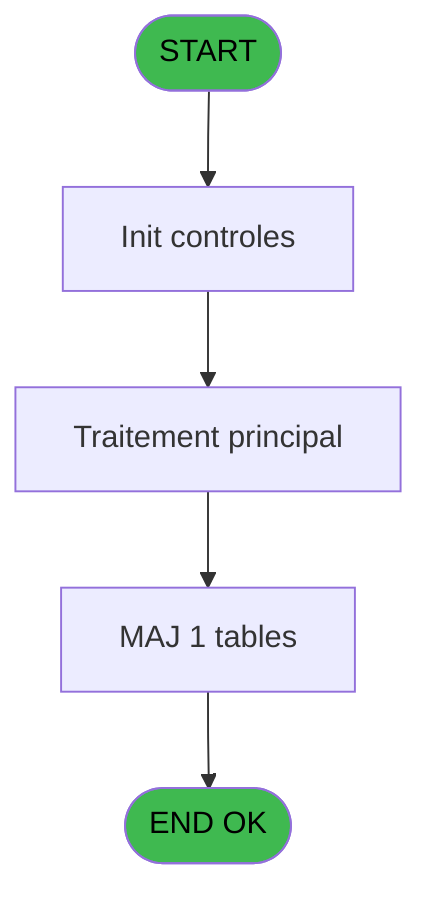
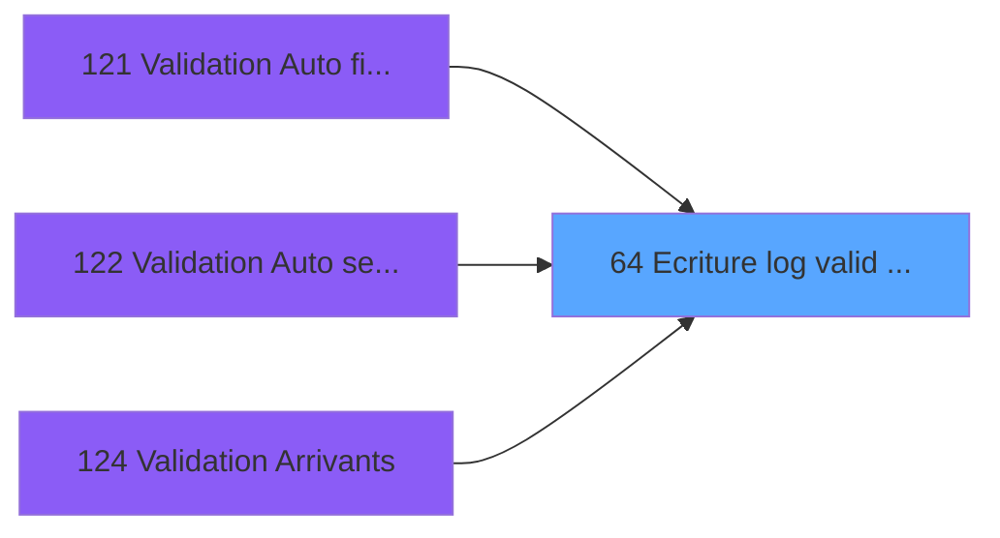

# PBG IDE 64 - Ecriture log valid devalid

> **Analyse**: Phases 1-4 2026-02-03 09:04 -> 09:04 (20s) | Assemblage 09:04
> **Pipeline**: V7.2 Enrichi
> **Structure**: 4 onglets (Resume | Ecrans | Donnees | Connexions)

<!-- TAB:Resume -->

## 1. FICHE D'IDENTITE

| Attribut | Valeur |
|----------|--------|
| Projet | PBG |
| IDE Position | 64 |
| Nom Programme | Ecriture log valid devalid |
| Fichier source | `Prg_64.xml` |
| Domaine metier | General |
| Taches | 4 (0 ecrans visibles) |
| Tables modifiees | 1 |
| Programmes appeles | 1 |

## 2. DESCRIPTION FONCTIONNELLE

**Ecriture log valid devalid** assure la gestion complete de ce processus, accessible depuis [Validation Arrivants (IDE 124)](PBG-IDE-124.md), [    Validation Auto filiations (IDE 121)](PBG-IDE-121.md), [    Validation Auto seminaire (IDE 122)](PBG-IDE-122.md).

Le flux de traitement s'organise en **3 blocs fonctionnels** :

- **Traitement** (2 taches) : traitements metier divers
- **Creation** (1 tache) : insertion d'enregistrements en base (mouvements, prestations)
- **Validation** (1 tache) : controles et verifications de coherence

**Donnees modifiees** : 1 tables en ecriture (pv_globalca_prepaid).

Detail : phases du traitement

#### Phase 1 : Validation (1 tache)

- **64** - Ecriture log valid devalid

#### Phase 2 : Traitement (2 taches)

- **64.1** - supress log
- **64.3** - maj personnes

#### Phase 3 : Creation (1 tache)

- **64.2** - create log

#### Tables impactees

| Table | Operations | Role metier |
|-------|-----------|-------------|
| pv_globalca_prepaid | **W**/L (3 usages) |  |

## 3. BLOCS FONCTIONNELS

### 3.1 Validation (1 tache)

Controles de coherence : 1 tache verifie les donnees et conditions.

---

#### 64 - Ecriture log valid devalid

**Role** : Verification : Ecriture log valid devalid.

### 3.2 Traitement (2 taches)

Traitements internes.

---

#### 64.1 - supress log

**Role** : Traitement : supress log.

---

#### 64.3 - maj personnes

**Role** : Traitement : maj personnes.

### 3.3 Creation (1 tache)

Insertion de nouveaux enregistrements en base.

---

#### 64.2 - create log

**Role** : Traitement : create log.

## 5. REGLES METIER

*(Aucune regle metier identifiee)*

## 6. CONTEXTE

- **Appele par**: [Validation Arrivants (IDE 124)](PBG-IDE-124.md), [    Validation Auto filiations (IDE 121)](PBG-IDE-121.md), [    Validation Auto seminaire (IDE 122)](PBG-IDE-122.md)
- **Appelle**: 1 programmes | **Tables**: 7 (W:1 R:2 L:6) | **Taches**: 4 | **Expressions**: 25

<!-- TAB:Ecrans -->

## 8. ECRANS

*(Programme sans ecran visible)*

## 9. NAVIGATION

### 9.3 Structure hierarchique (4 taches)

| Position | Tache | Type | Dimensions | Bloc |
|----------|-------|------|------------|------|
| **64.1** | [**Ecriture log valid devalid** (64)](#t1) | - | - | Validation |
| **64.2** | [**supress log** (64.1)](#t2) | - | - | Traitement |
| 64.2.1 | [maj personnes (64.3)](#t4) | - | - | |
| **64.3** | [**create log** (64.2)](#t3) | - | - | Creation |

### 9.4 Algorigramme

> **Legende**: Vert = START/END OK | Rouge = END KO | Bleu = Decisions
> *Algorigramme auto-genere. Utiliser `/algorigramme` pour une synthese metier detaillee.*

<!-- TAB:Donnees -->

## 10. TABLES

### Tables utilisees (7)

| ID | Nom | Description | Type | R | W | L | Usages |
|----|-----|-------------|------|---|---|---|--------|
| 31 | gm-complet_______gmc |  | DB | R |   |   | 1 |
| 34 | hebergement______heb | Hebergement (chambres) | DB | R |   | L | 2 |
| 35 | personnel_go______go |  | DB |   |   | L | 1 |
| 366 | pms_print_param |  | DB |   |   | L | 1 |
| 825 | fac_hebergement_pro | Hebergement (chambres) | DB |   |   | L | 1 |
| 832 | pv_globalca_prepaid |  | DB |   | **W** | L | 3 |
| 835 | num_tpe_par_service | Services / filieres | DB |   |   | L | 1 |

### Colonnes par table (2 / 3 tables avec colonnes identifiees)

Table 31 - gm-complet_______gmc (R) - 1 usages

*Table utilisee uniquement en Link ou aucune colonne Real identifiee dans le DataView.*

Table 34 - hebergement______heb (R/L) - 2 usages

| Lettre | Variable | Acces | Type |
|--------|----------|-------|------|
| A | P.Compte | R | Numeric |
| B | P.Filiation | R | Numeric |
| C | P.Code operation | R | Alpha |
| D | V.Existe enreg ? | R | Logical |
| E | v.Hebergement | R | Alpha |
| F | V.existe absence ? | R | Logical |
| G | V.Recalc ? | R | Logical |

Table 832 - pv_globalca_prepaid (**W**/L) - 3 usages

*Table utilisee uniquement en Link ou aucune colonne Real identifiee dans le DataView.*

## 11. VARIABLES

### 11.1 Parametres entrants (3)

Variables recues du programme appelant ([Validation Arrivants (IDE 124)](PBG-IDE-124.md)).

| Lettre | Nom | Type | Usage dans |
|--------|-----|------|-----------|
| A | P.Compte | Numeric | 1x parametre entrant |
| B | P.Filiation | Numeric | 1x parametre entrant |
| C | P.Code operation | Alpha | 3x parametre entrant |

### 11.2 Variables de session (4)

Variables persistantes pendant toute la session.

| Lettre | Nom | Type | Usage dans |
|--------|-----|------|-----------|
| D | V.Existe enreg ? | Logical | 2x session |
| E | v.Hebergement | Alpha | - |
| F | V.existe absence ? | Logical | - |
| G | V.Recalc ? | Logical | - |

## 12. EXPRESSIONS

**25 / 25 expressions decodees (100%)**

### 12.1 Repartition par type

| Type | Expressions | Regles |
|------|-------------|--------|
| CALCULATION | 4 | 0 |
| CONSTANTE | 3 | 0 |
| NEGATION | 1 | 0 |
| CONDITION | 6 | 0 |
| DATE | 1 | 0 |
| OTHER | 8 | 0 |
| CAST_LOGIQUE | 2 | 0 |

### 12.2 Expressions cles par type

#### CALCULATION (4 expressions)

| Type | IDE | Expression | Regle |
|------|-----|------------|-------|
| CALCULATION | 18 | `[AD]-1` | - |
| CALCULATION | 20 | `[AE]-1` | - |
| CALCULATION | 16 | `[AD]+1` | - |
| CALCULATION | 17 | `[AE]+1` | - |

#### CONSTANTE (3 expressions)

| Type | IDE | Expression | Regle |
|------|-----|------------|-------|
| CONSTANTE | 12 | `'H'` | - |
| CONSTANTE | 9 | `'Z'` | - |
| CONSTANTE | 8 | `'A'` | - |

#### NEGATION (1 expressions)

| Type | IDE | Expression | Regle |
|------|-----|------------|-------|
| NEGATION | 5 | `NOT V.Existe enreg ? [D] AND (P.Code operation [C]='D' OR (P.Code operation [C]='V' AND [K]<Date()-1))` | - |

#### CONDITION (6 expressions)

| Type | IDE | Expression | Regle |
|------|-----|------------|-------|
| CONDITION | 11 | `P.Code operation [C]='D'` | - |
| CONDITION | 19 | `Val([M],'2')>=15` | - |
| CONDITION | 21 | `Val([M],'2')>=23` | - |
| CONDITION | 6 | `[K]<Date()-1 OR [K]=Date()` | - |
| CONDITION | 7 | `[K]=Date()-1 AND NOT [AF]` | - |
| ... | | *+1 autres* | |

#### DATE (1 expressions)

| Type | IDE | Expression | Regle |
|------|-----|------------|-------|
| DATE | 25 | `Date()-1` | - |

#### OTHER (8 expressions)

| Type | IDE | Expression | Regle |
|------|-----|------------|-------|
| OTHER | 14 | `[Y]` | - |
| OTHER | 13 | `[K]` | - |
| OTHER | 24 | `[AL]` | - |
| OTHER | 15 | `[Z]` | - |
| OTHER | 2 | `P.Compte [A]` | - |
| ... | | *+3 autres* | |

#### CAST_LOGIQUE (2 expressions)

| Type | IDE | Expression | Regle |
|------|-----|------------|-------|
| CAST_LOGIQUE | 23 | `'FALSE'LOG` | - |
| CAST_LOGIQUE | 22 | `'TRUE'LOG` | - |

### 12.3 Toutes les expressions (25)

Voir les 25 expressions

#### CALCULATION (4)

| IDE | Expression Decodee |
|-----|-------------------|
| 16 | `[AD]+1` |
| 17 | `[AE]+1` |
| 18 | `[AD]-1` |
| 20 | `[AE]-1` |

#### CONSTANTE (3)

| IDE | Expression Decodee |
|-----|-------------------|
| 8 | `'A'` |
| 9 | `'Z'` |
| 12 | `'H'` |

#### NEGATION (1)

| IDE | Expression Decodee |
|-----|-------------------|
| 5 | `NOT V.Existe enreg ? [D] AND (P.Code operation [C]='D' OR (P.Code operation [C]='V' AND [K]<Date()-1))` |

#### CONDITION (6)

| IDE | Expression Decodee |
|-----|-------------------|
| 6 | `[K]<Date()-1 OR [K]=Date()` |
| 7 | `[K]=Date()-1 AND NOT [AF]` |
| 10 | `P.Code operation [C]='V'` |
| 11 | `P.Code operation [C]='D'` |
| 19 | `Val([M],'2')>=15` |
| 21 | `Val([M],'2')>=23` |

#### DATE (1)

| IDE | Expression Decodee |
|-----|-------------------|
| 25 | `Date()-1` |

#### OTHER (8)

| IDE | Expression Decodee |
|-----|-------------------|
| 1 | `GetParam('SOCIETE')` |
| 2 | `P.Compte [A]` |
| 3 | `P.Filiation [B]` |
| 4 | `V.Existe enreg ? [D]` |
| 13 | `[K]` |
| 14 | `[Y]` |
| 15 | `[Z]` |
| 24 | `[AL]` |

#### CAST_LOGIQUE (2)

| IDE | Expression Decodee |
|-----|-------------------|
| 22 | `'TRUE'LOG` |
| 23 | `'FALSE'LOG` |

<!-- TAB:Connexions -->

## 13. GRAPHE D'APPELS

### 13.1 Chaine depuis Main (Callers)

Main -> ... -> [Validation Arrivants (IDE 124)](PBG-IDE-124.md) -> **Ecriture log valid devalid (IDE 64)**

Main -> ... -> [    Validation Auto filiations (IDE 121)](PBG-IDE-121.md) -> **Ecriture log valid devalid (IDE 64)**

Main -> ... -> [    Validation Auto seminaire (IDE 122)](PBG-IDE-122.md) -> **Ecriture log valid devalid (IDE 64)**

### 13.2 Callers

| IDE | Nom Programme | Nb Appels |
|-----|---------------|-----------|
| [124](PBG-IDE-124.md) | Validation Arrivants | 4 |
| [121](PBG-IDE-121.md) |     Validation Auto filiations | 1 |
| [122](PBG-IDE-122.md) |     Validation Auto seminaire | 1 |

### 13.3 Callees (programmes appeles)

### 13.4 Detail Callees avec contexte

| IDE | Nom Programme | Appels | Contexte |
|-----|---------------|--------|----------|
| [63](PBG-IDE-63.md) | Calcul JH | 1 | Calcul de donnees |

## 14. RECOMMANDATIONS MIGRATION

### 14.1 Profil du programme

| Metrique | Valeur | Impact migration |
|----------|--------|-----------------|
| Lignes de logique | 149 | Programme compact |
| Expressions | 25 | Peu de logique |
| Tables WRITE | 1 | Impact faible |
| Sous-programmes | 1 | Peu de dependances |
| Ecrans visibles | 0 | Ecran unique ou traitement batch |
| Code desactive | 0% (0 / 149) | Code sain |
| Regles metier | 0 | Pas de regle identifiee |

### 14.2 Plan de migration par bloc

#### Validation (1 tache: 0 ecran, 1 traitement)

- **Strategie** : FluentValidation avec validators specifiques.
- Chaque tache de validation -> un validator injectable

#### Traitement (2 taches: 0 ecran, 2 traitements)

- **Strategie** : 2 service(s) backend injectable(s) (Domain Services).
- 1 sous-programme(s) a migrer ou a reutiliser depuis les services existants.
- Decomposer les taches en services unitaires testables.

#### Creation (1 tache: 0 ecran, 1 traitement)

- **Strategie** : Repository pattern avec Entity Framework Core.
- Insertion via `IRepository<T>.CreateAsync()`

### 14.3 Dependances critiques

| Dependance | Type | Appels | Impact |
|------------|------|--------|--------|
| pv_globalca_prepaid | Table WRITE (Database) | 2x | Schema + repository |
| [Calcul JH (IDE 63)](PBG-IDE-63.md) | Sous-programme | 1x | Normale - Calcul de donnees |

---
*Spec DETAILED generee par Pipeline V7.2 - 2026-02-03 09:04*
