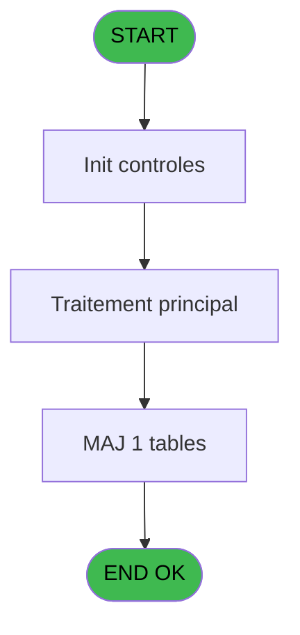
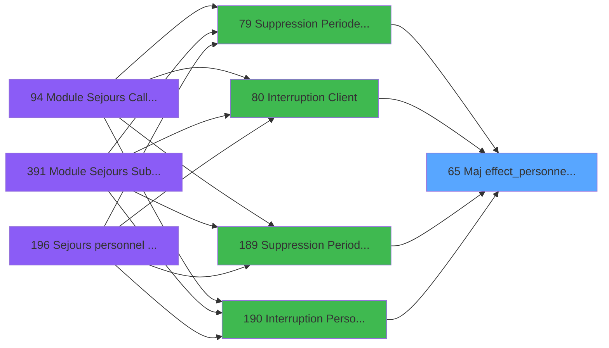

# PBG IDE 65 - Maj effect_personnes_modif_sej

> **Analyse**: Phases 1-4 2026-02-03 09:04 -> 09:04 (21s) | Assemblage 09:04
> **Pipeline**: V7.2 Enrichi
> **Structure**: 4 onglets (Resume | Ecrans | Donnees | Connexions)

<!-- TAB:Resume -->

## 1. FICHE D'IDENTITE

| Attribut | Valeur |
|----------|--------|
| Projet | PBG |
| IDE Position | 65 |
| Nom Programme | Maj effect_personnes_modif_sej |
| Fichier source | `Prg_65.xml` |
| Domaine metier | General |
| Taches | 3 (0 ecrans visibles) |
| Tables modifiees | 1 |
| Programmes appeles | 0 |

## 2. DESCRIPTION FONCTIONNELLE

**Maj effect_personnes_modif_sej** assure la gestion complete de ce processus, accessible depuis [   Suppression Periode Client (IDE 79)](PBG-IDE-79.md), [   Interruption Client (IDE 80)](PBG-IDE-80.md), [  Suppression Periode Personn (IDE 189)](PBG-IDE-189.md), [  Interruption Personnel (IDE 190)](PBG-IDE-190.md).

Le flux de traitement s'organise en **1 blocs fonctionnels** :

- **Traitement** (3 taches) : traitements metier divers

**Donnees modifiees** : 1 tables en ecriture (num_tpe_par_service).

## 3. BLOCS FONCTIONNELS

### 3.1 Traitement (3 taches)

Traitements internes.

---

#### 65 - Maj effect_personnes_modif_sej

**Role** : Traitement : Maj effect_personnes_modif_sej.

---

#### 65.1 - Suppression eff personnes

**Role** : Traitement : Suppression eff personnes.
**Variables liees** : D (V.Existe effectif personnes ?)

---

#### 65.2 - MAj effectif personnes

**Role** : Traitement : MAj effectif personnes.
**Variables liees** : D (V.Existe effectif personnes ?)

## 5. REGLES METIER

*(Aucune regle metier identifiee)*

## 6. CONTEXTE

- **Appele par**: [   Suppression Periode Client (IDE 79)](PBG-IDE-79.md), [   Interruption Client (IDE 80)](PBG-IDE-80.md), [  Suppression Periode Personn (IDE 189)](PBG-IDE-189.md), [  Interruption Personnel (IDE 190)](PBG-IDE-190.md)
- **Appelle**: 0 programmes | **Tables**: 4 (W:1 R:2 L:3) | **Taches**: 3 | **Expressions**: 5

<!-- TAB:Ecrans -->

## 8. ECRANS

*(Programme sans ecran visible)*

## 9. NAVIGATION

### 9.3 Structure hierarchique (3 taches)

| Position | Tache | Type | Dimensions | Bloc |
|----------|-------|------|------------|------|
| **65.1** | [**Maj effect_personnes_modif_sej** (65)](#t1) | - | - | Traitement |
| 65.1.1 | [Suppression eff personnes (65.1)](#t2) | - | - | |
| 65.1.2 | [MAj effectif personnes (65.2)](#t3) | - | - | |

### 9.4 Algorigramme

> **Legende**: Vert = START/END OK | Rouge = END KO | Bleu = Decisions
> *Algorigramme auto-genere. Utiliser `/algorigramme` pour une synthese metier detaillee.*

<!-- TAB:Donnees -->

## 10. TABLES

### Tables utilisees (4)

| ID | Nom | Description | Type | R | W | L | Usages |
|----|-----|-------------|------|---|---|---|--------|
| 31 | gm-complet_______gmc |  | DB | R |   |   | 1 |
| 34 | hebergement______heb | Hebergement (chambres) | DB |   |   | L | 1 |
| 35 | personnel_go______go |  | DB |   |   | L | 1 |
| 835 | num_tpe_par_service | Services / filieres | DB | R | **W** | L | 3 |

### Colonnes par table (1 / 2 tables avec colonnes identifiees)

Table 31 - gm-complet_______gmc (R) - 1 usages

*Table utilisee uniquement en Link ou aucune colonne Real identifiee dans le DataView.*

Table 835 - num_tpe_par_service (R/**W**/L) - 3 usages

| Lettre | Variable | Acces | Type |
|--------|----------|-------|------|
| A | P.Societe | W | Alpha |
| B | P.Compte | W | Numeric |
| C | P.Filiation | W | Numeric |
| D | V.Existe effectif personnes ? | W | Logical |

## 11. VARIABLES

### 11.1 Parametres entrants (3)

Variables recues du programme appelant ([   Suppression Periode Client (IDE 79)](PBG-IDE-79.md)).

| Lettre | Nom | Type | Usage dans |
|--------|-----|------|-----------|
| A | P.Societe | Alpha | - |
| B | P.Compte | Numeric | - |
| C | P.Filiation | Numeric | - |

### 11.2 Variables de session (1)

Variables persistantes pendant toute la session.

| Lettre | Nom | Type | Usage dans |
|--------|-----|------|-----------|
| D | V.Existe effectif personnes ? | Logical | - |

## 12. EXPRESSIONS

**5 / 5 expressions decodees (100%)**

### 12.1 Repartition par type

| Type | Expressions | Regles |
|------|-------------|--------|
| DATE | 1 | 0 |
| OTHER | 4 | 0 |

### 12.2 Expressions cles par type

#### DATE (1 expressions)

| Type | IDE | Expression | Regle |
|------|-----|------------|-------|
| DATE | 4 | `EOM(Date())` | - |

#### OTHER (4 expressions)

| Type | IDE | Expression | Regle |
|------|-----|------------|-------|
| OTHER | 3 | `[L]` | - |
| OTHER | 5 | `[AF]` | - |
| OTHER | 1 | `[T]` | - |
| OTHER | 2 | `[K]` | - |

<!-- TAB:Connexions -->

## 13. GRAPHE D'APPELS

### 13.1 Chaine depuis Main (Callers)

Main -> ... -> [   Suppression Periode Client (IDE 79)](PBG-IDE-79.md) -> **Maj effect_personnes_modif_sej (IDE 65)**

Main -> ... -> [   Interruption Client (IDE 80)](PBG-IDE-80.md) -> **Maj effect_personnes_modif_sej (IDE 65)**

Main -> ... -> [  Suppression Periode Personn (IDE 189)](PBG-IDE-189.md) -> **Maj effect_personnes_modif_sej (IDE 65)**

Main -> ... -> [  Interruption Personnel (IDE 190)](PBG-IDE-190.md) -> **Maj effect_personnes_modif_sej (IDE 65)**

### 13.2 Callers

| IDE | Nom Programme | Nb Appels |
|-----|---------------|-----------|
| [79](PBG-IDE-79.md) |    Suppression Periode Client | 1 |
| [80](PBG-IDE-80.md) |    Interruption Client | 1 |
| [189](PBG-IDE-189.md) |   Suppression Periode Personn | 1 |
| [190](PBG-IDE-190.md) |   Interruption Personnel | 1 |

### 13.3 Callees (programmes appeles)

### 13.4 Detail Callees avec contexte

| IDE | Nom Programme | Appels | Contexte |
|-----|---------------|--------|----------|
| - | (aucun) | - | - |

## 14. RECOMMANDATIONS MIGRATION

### 14.1 Profil du programme

| Metrique | Valeur | Impact migration |
|----------|--------|-----------------|
| Lignes de logique | 72 | Programme compact |
| Expressions | 5 | Peu de logique |
| Tables WRITE | 1 | Impact faible |
| Sous-programmes | 0 | Peu de dependances |
| Ecrans visibles | 0 | Ecran unique ou traitement batch |
| Code desactive | 0% (0 / 72) | Code sain |
| Regles metier | 0 | Pas de regle identifiee |

### 14.2 Plan de migration par bloc

#### Traitement (3 taches: 0 ecran, 3 traitements)

- **Strategie** : 3 service(s) backend injectable(s) (Domain Services).
- Decomposer les taches en services unitaires testables.

### 14.3 Dependances critiques

| Dependance | Type | Appels | Impact |
|------------|------|--------|--------|
| num_tpe_par_service | Table WRITE (Database) | 1x | Schema + repository |

---
*Spec DETAILED generee par Pipeline V7.2 - 2026-02-03 09:04*
