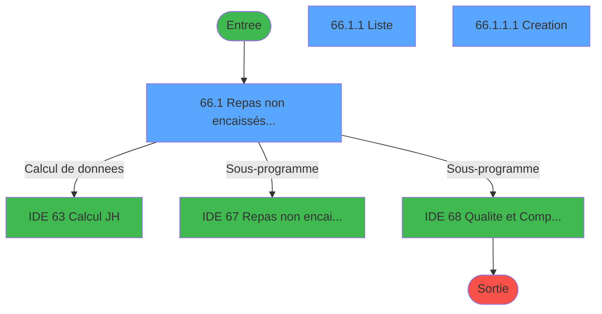
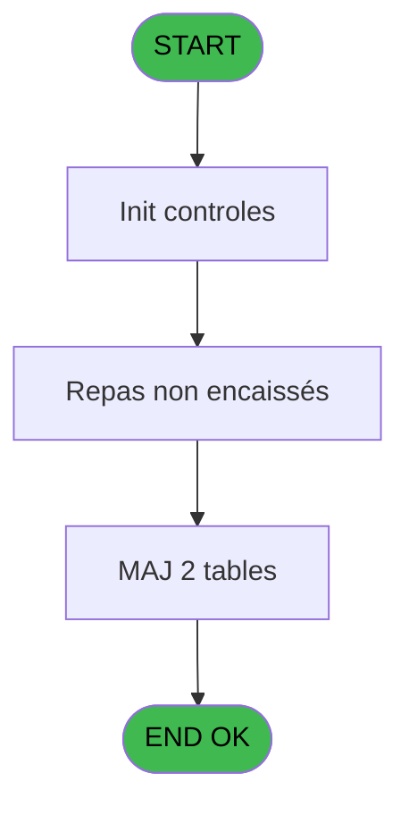
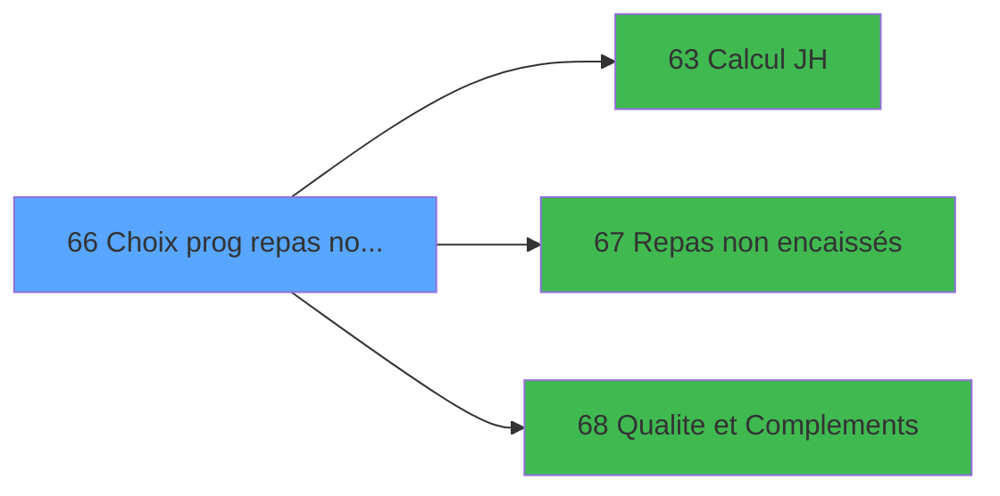

# PBG IDE 66 - Choix prog repas non encaissée

> **Analyse**: Phases 1-4 2026-02-03 09:05 -> 09:05 (21s) | Assemblage 09:05
> **Pipeline**: V7.2 Enrichi
> **Structure**: 4 onglets (Resume | Ecrans | Donnees | Connexions)

<!-- TAB:Resume -->

## 1. FICHE D'IDENTITE

| Attribut | Valeur |
|----------|--------|
| Projet | PBG |
| IDE Position | 66 |
| Nom Programme | Choix prog repas non encaissée |
| Fichier source | `Prg_66.xml` |
| Domaine metier | Navigation |
| Taches | 6 (3 ecrans visibles) |
| Tables modifiees | 2 |
| Programmes appeles | 3 |
| :warning: Statut | **ORPHELIN_POTENTIEL** |

## 2. DESCRIPTION FONCTIONNELLE

**Choix prog repas non encaissée** assure la gestion complete de ce processus.

Le flux de traitement s'organise en **3 blocs fonctionnels** :

- **Traitement** (4 taches) : traitements metier divers
- **Consultation** (1 tache) : ecrans de recherche, selection et consultation
- **Creation** (1 tache) : insertion d'enregistrements en base (mouvements, prestations)

**Donnees modifiees** : 2 tables en ecriture (pv_budget, lg_vente_facture).

Detail : phases du traitement

#### Phase 1 : Traitement (4 taches)

- **66.1** - Repas non encaissés au village **[[ECRAN]](#ecran-t2)**
- **66.1.1** - Liste **[[ECRAN]](#ecran-t19)**
- **66.1.1.2** - suppresion ligne
- **66.1.1.1.1** - Création sur une Période

Delegue a : [Repas non encaissés (IDE 67)](PBG-IDE-67.md), [Qualite et Complements (IDE 68)](PBG-IDE-68.md)

#### Phase 2 : Creation (1 tache)

- **66.1.1.1** - Creation **[[ECRAN]](#ecran-t20)**

#### Phase 3 : Consultation (1 tache)

- **66** - Choix prog repas non encaissée

#### Tables impactees

| Table | Operations | Role metier |
|-------|-----------|-------------|
| lg_vente_facture | R/**W** (4 usages) | Donnees de ventes |
| pv_budget | **W** (1 usages) |  |

## 3. BLOCS FONCTIONNELS

### 3.1 Traitement (4 taches)

Traitements internes.

---

#### 66.1 - Repas non encaissés au village [[ECRAN]](#ecran-t2)

**Role** : Traitement : Repas non encaissés au village.
**Ecran** : 1102 x 263 DLU (MDI) | [Voir mockup](#ecran-t2)
**Variables liees** : J (V.Existe Repas DEJ ou DIN ?), K (V.Sens Qté repas)
**Delegue a** : [Repas non encaissés (IDE 67)](PBG-IDE-67.md), [Qualite et Complements (IDE 68)](PBG-IDE-68.md)

---

#### 66.1.1 - Liste [[ECRAN]](#ecran-t19)

**Role** : Traitement : Liste.
**Ecran** : 1080 x 179 DLU (Modal) | [Voir mockup](#ecran-t19)
**Delegue a** : [Repas non encaissés (IDE 67)](PBG-IDE-67.md), [Qualite et Complements (IDE 68)](PBG-IDE-68.md)

---

#### 66.1.1.2 - suppresion ligne

**Role** : Traitement : suppresion ligne.
**Variables liees** : E (V.Affiche ligne ?)
**Delegue a** : [Repas non encaissés (IDE 67)](PBG-IDE-67.md), [Qualite et Complements (IDE 68)](PBG-IDE-68.md)

---

#### 66.1.1.1.1 - Création sur une Période

**Role** : Traitement : Création sur une Période.
**Delegue a** : [Repas non encaissés (IDE 67)](PBG-IDE-67.md), [Qualite et Complements (IDE 68)](PBG-IDE-68.md)

### 3.2 Creation (1 tache)

Insertion de nouveaux enregistrements en base.

---

#### 66.1.1.1 - Creation [[ECRAN]](#ecran-t20)

**Role** : Creation d'enregistrement : Creation.
**Ecran** : 1298 x 148 DLU | [Voir mockup](#ecran-t20)

### 3.3 Consultation (1 tache)

Ecrans de recherche et consultation.

---

#### 66 - Choix prog repas non encaissée

**Role** : Selection par l'operateur : Choix prog repas non encaissée.
**Variables liees** : J (V.Existe Repas DEJ ou DIN ?), K (V.Sens Qté repas)

## 5. REGLES METIER

*(Aucune regle metier identifiee)*

## 6. CONTEXTE

- **Appele par**: (aucun)
- **Appelle**: 3 programmes | **Tables**: 3 (W:2 R:1 L:1) | **Taches**: 6 | **Expressions**: 18

<!-- TAB:Ecrans -->

## 8. ECRANS

### 8.1 Forms visibles (3 / 6)

| # | Position | Tache | Nom | Type | Largeur | Hauteur | Bloc |
|---|----------|-------|-----|------|---------|---------|------|
| 1 | 66.1.1 | 66.1 | Repas non encaissés au village | MDI | 1102 | 263 | Traitement |
| 2 | 66.1.1.1 | 66.1.1 | Liste | Modal | 1080 | 179 | Traitement |
| 3 | 66.1.1.1.1 | 66.1.1.1 | Creation | Type0 | 1298 | 148 | Creation |

### 8.2 Mockups Ecrans

---

#### 66.1.1 - Repas non encaissés au village
**Tache** : [66.1](#t2) | **Type** : MDI | **Dimensions** : 1102 x 263 DLU
**Bloc** : Traitement | **Titre IDE** : Repas non encaissés au village

<!-- FORM-DATA:
{
    "width":  1102,
    "vFactor":  8,
    "type":  "MDI",
    "hFactor":  8,
    "controls":  [
                     {
                         "x":  1,
                         "type":  "label",
                         "var":  "",
                         "y":  0,
                         "w":  1095,
                         "fmt":  "",
                         "name":  "",
                         "h":  22,
                         "color":  "",
                         "text":  "",
                         "parent":  null
                     },
                     {
                         "x":  2,
                         "type":  "label",
                         "var":  "",
                         "y":  235,
                         "w":  1096,
                         "fmt":  "",
                         "name":  "",
                         "h":  23,
                         "color":  "",
                         "text":  "",
                         "parent":  null
                     },
                     {
                         "x":  16,
                         "type":  "label",
                         "var":  "",
                         "y":  32,
                         "w":  183,
                         "fmt":  "",
                         "name":  "",
                         "h":  10,
                         "color":  "",
                         "text":  "Date de consommation",
                         "parent":  101
                     },
                     {
                         "x":  6,
                         "type":  "label",
                         "var":  "",
                         "y":  23,
                         "w":  918,
                         "fmt":  "",
                         "name":  "",
                         "h":  25,
                         "color":  "1",
                         "text":  "",
                         "parent":  null
                     },
                     {
                         "x":  9,
                         "type":  "button",
                         "var":  "",
                         "y":  238,
                         "w":  154,
                         "fmt":  "\u0026Quitter",
                         "name":  "bouton quitter",
                         "h":  18,
                         "color":  "",
                         "text":  "",
                         "parent":  42
                     },
                     {
                         "x":  7,
                         "type":  "edit",
                         "var":  "",
                         "y":  6,
                         "w":  394,
                         "fmt":  "20",
                         "name":  "",
                         "h":  10,
                         "color":  "",
                         "text":  "",
                         "parent":  1
                     },
                     {
                         "x":  813,
                         "type":  "edit",
                         "var":  "",
                         "y":  6,
                         "w":  274,
                         "fmt":  "WWW DD MMM YYYYT",
                         "name":  "",
                         "h":  10,
                         "color":  "",
                         "text":  "",
                         "parent":  1
                     },
                     {
                         "x":  8,
                         "type":  "subform",
                         "var":  "",
                         "y":  52,
                         "w":  1085,
                         "fmt":  "",
                         "name":  "REPAS",
                         "h":  181,
                         "color":  "",
                         "text":  "",
                         "parent":  null
                     },
                     {
                         "x":  195,
                         "type":  "edit",
                         "var":  "",
                         "y":  32,
                         "w":  126,
                         "fmt":  "DD/MM/YYYYZ",
                         "name":  "w0_DateConsommation",
                         "h":  10,
                         "color":  "110",
                         "text":  "",
                         "parent":  101
                     },
                     {
                         "x":  324,
                         "type":  "button",
                         "var":  "",
                         "y":  32,
                         "w":  28,
                         "fmt":  "...",
                         "name":  "b_date",
                         "h":  10,
                         "color":  "",
                         "text":  "",
                         "parent":  101
                     },
                     {
                         "x":  930,
                         "type":  "button",
                         "var":  "",
                         "y":  27,
                         "w":  154,
                         "fmt":  "\u0026Consultation",
                         "name":  "b_consultation",
                         "h":  18,
                         "color":  "",
                         "text":  "",
                         "parent":  null
                     },
                     {
                         "x":  189,
                         "type":  "edit",
                         "var":  "",
                         "y":  241,
                         "w":  724,
                         "fmt":  "80",
                         "name":  "",
                         "h":  10,
                         "color":  "143",
                         "text":  "",
                         "parent":  null
                     }
                 ],
    "taskId":  "66.1.1",
    "height":  263
}
-->

<strong>Champs : 4 champs</strong>

| Pos (x,y) | Nom | Variable | Type |
|-----------|-----|----------|------|
| 7,6 | 20 | - | edit |
| 813,6 | WWW DD MMM YYYYT | - | edit |
| 195,32 | w0_DateConsommation | - | edit |
| 189,241 | 80 | - | edit |

<strong>Boutons : 3 boutons</strong>

| Bouton | Pos (x,y) | Action |
|--------|-----------|--------|
| Quitter | 9,238 | Quitte le programme |
| ... | 324,32 | Bouton fonctionnel |
| Consultation | 930,27 | Bouton fonctionnel |

---

#### 66.1.1.1 - Liste
**Tache** : [66.1.1](#t19) | **Type** : Modal | **Dimensions** : 1080 x 179 DLU
**Bloc** : Traitement | **Titre IDE** : Liste

<!-- FORM-DATA:
{
    "width":  1080,
    "vFactor":  8,
    "type":  "Modal",
    "hFactor":  8,
    "controls":  [
                     {
                         "x":  0,
                         "type":  "table",
                         "var":  "",
                         "name":  "",
                         "titleH":  12,
                         "color":  "110",
                         "w":  915,
                         "y":  1,
                         "fmt":  "",
                         "parent":  null,
                         "text":  "",
                         "rowH":  15,
                         "h":  172,
                         "cols":  [
                                      {
                                          "title":  "Type de repas",
                                          "layer":  1,
                                          "w":  204
                                      },
                                      {
                                          "title":  "Village/Groupe",
                                          "layer":  2,
                                          "w":  394
                                      },
                                      {
                                          "title":  "Nb de repas",
                                          "layer":  3,
                                          "w":  126
                                      },
                                      {
                                          "title":  "Repas",
                                          "layer":  4,
                                          "w":  155
                                      }
                                  ],
                         "rows":  4
                     },
                     {
                         "x":  0,
                         "type":  "label",
                         "var":  "",
                         "y":  167,
                         "w":  122,
                         "fmt":  "",
                         "name":  "",
                         "h":  9,
                         "color":  "",
                         "text":  "Motif annulation",
                         "parent":  null
                     },
                     {
                         "x":  9,
                         "type":  "edit",
                         "var":  "",
                         "y":  16,
                         "w":  192,
                         "fmt":  "",
                         "name":  "type_repas",
                         "h":  12,
                         "color":  "110",
                         "text":  "",
                         "parent":  1
                     },
                     {
                         "x":  213,
                         "type":  "edit",
                         "var":  "",
                         "y":  16,
                         "w":  382,
                         "fmt":  "",
                         "name":  "village",
                         "h":  12,
                         "color":  "110",
                         "text":  "",
                         "parent":  1
                     },
                     {
                         "x":  609,
                         "type":  "edit",
                         "var":  "",
                         "y":  16,
                         "w":  110,
                         "fmt":  "N6Z",
                         "name":  "nb_repas",
                         "h":  12,
                         "color":  "110",
                         "text":  "",
                         "parent":  1
                     },
                     {
                         "x":  924,
                         "type":  "button",
                         "var":  "",
                         "y":  7,
                         "w":  154,
                         "fmt":  "\u0026Modification",
                         "name":  "b_modification",
                         "h":  18,
                         "color":  "",
                         "text":  "",
                         "parent":  null
                     },
                     {
                         "x":  922,
                         "type":  "button",
                         "var":  "",
                         "y":  29,
                         "w":  154,
                         "fmt":  "\u0026Création",
                         "name":  "b_creation",
                         "h":  18,
                         "color":  "",
                         "text":  "",
                         "parent":  null
                     },
                     {
                         "x":  732,
                         "type":  "combobox",
                         "var":  "",
                         "y":  16,
                         "w":  143,
                         "fmt":  "",
                         "name":  "repas",
                         "h":  12,
                         "color":  "110",
                         "text":  "DIN,DEJ,DDE",
                         "parent":  1
                     },
                     {
                         "x":  922,
                         "type":  "button",
                         "var":  "",
                         "y":  50,
                         "w":  154,
                         "fmt":  "\u0026Annulation",
                         "name":  "b_annulation",
                         "h":  18,
                         "color":  "",
                         "text":  "",
                         "parent":  null
                     },
                     {
                         "x":  127,
                         "type":  "edit",
                         "var":  "",
                         "y":  167,
                         "w":  937,
                         "fmt":  "",
                         "name":  "effq_motif_annulation",
                         "h":  10,
                         "color":  "143",
                         "text":  "",
                         "parent":  null
                     }
                 ],
    "taskId":  "66.1.1.1",
    "height":  179
}
-->

<strong>Champs : 5 champs</strong>

| Pos (x,y) | Nom | Variable | Type |
|-----------|-----|----------|------|
| 9,16 | type_repas | - | edit |
| 213,16 | village | - | edit |
| 609,16 | nb_repas | - | edit |
| 732,16 | repas | - | combobox |
| 127,167 | effq_motif_annulation | - | edit |

<strong>Boutons : 3 boutons</strong>

| Bouton | Pos (x,y) | Action |
|--------|-----------|--------|
| Modification | 924,7 | Modifie l'element |
| Création | 922,29 | Bouton fonctionnel |
| Annulation | 922,50 | Annule et retour au menu |

---

#### 66.1.1.1.1 - Creation
**Tache** : [66.1.1.1](#t20) | **Type** : Type0 | **Dimensions** : 1298 x 148 DLU
**Bloc** : Creation | **Titre IDE** : Creation

<!-- FORM-DATA:
{
    "width":  1298,
    "vFactor":  8,
    "type":  "Type0",
    "hFactor":  8,
    "controls":  [
                     {
                         "x":  10,
                         "type":  "label",
                         "var":  "",
                         "y":  5,
                         "w":  1281,
                         "fmt":  "",
                         "name":  "",
                         "h":  101,
                         "color":  "",
                         "text":  "",
                         "parent":  null
                     },
                     {
                         "x":  29,
                         "type":  "label",
                         "var":  "",
                         "y":  35,
                         "w":  104,
                         "fmt":  "",
                         "name":  "",
                         "h":  13,
                         "color":  "",
                         "text":  "Type repas",
                         "parent":  1
                     },
                     {
                         "x":  29,
                         "type":  "label",
                         "var":  "",
                         "y":  51,
                         "w":  88,
                         "fmt":  "",
                         "name":  "",
                         "h":  13,
                         "color":  "",
                         "text":  "Nombre",
                         "parent":  1
                     },
                     {
                         "x":  645,
                         "type":  "label",
                         "var":  "",
                         "y":  51,
                         "w":  149,
                         "fmt":  "",
                         "name":  "",
                         "h":  13,
                         "color":  "",
                         "text":  "Repas",
                         "parent":  1
                     },
                     {
                         "x":  10,
                         "type":  "label",
                         "var":  "",
                         "y":  114,
                         "w":  1281,
                         "fmt":  "",
                         "name":  "",
                         "h":  25,
                         "color":  "",
                         "text":  "",
                         "parent":  null
                     },
                     {
                         "x":  29,
                         "type":  "label",
                         "var":  "",
                         "y":  67,
                         "w":  184,
                         "fmt":  "",
                         "name":  "",
                         "h":  13,
                         "color":  "",
                         "text":  "Motif annulation",
                         "parent":  1
                     },
                     {
                         "x":  29,
                         "type":  "label",
                         "var":  "",
                         "y":  19,
                         "w":  112,
                         "fmt":  "",
                         "name":  "",
                         "h":  13,
                         "color":  "",
                         "text":  "Lieu de séjour",
                         "parent":  1
                     },
                     {
                         "x":  645,
                         "type":  "label",
                         "var":  "",
                         "y":  19,
                         "w":  179,
                         "fmt":  "",
                         "name":  "",
                         "h":  13,
                         "color":  "",
                         "text":  "Date de fin",
                         "parent":  1
                     },
                     {
                         "x":  149,
                         "type":  "combobox",
                         "var":  "",
                         "y":  19,
                         "w":  485,
                         "fmt":  "",
                         "name":  "vhp_lieu_sejour",
                         "h":  13,
                         "color":  "110",
                         "text":  "",
                         "parent":  1
                     },
                     {
                         "x":  831,
                         "type":  "edit",
                         "var":  "",
                         "y":  19,
                         "w":  157,
                         "fmt":  "DD/MM/YYYYZ",
                         "name":  "v.Date de fin_0001",
                         "h":  13,
                         "color":  "110",
                         "text":  "",
                         "parent":  1
                     },
                     {
                         "x":  998,
                         "type":  "button",
                         "var":  "",
                         "y":  19,
                         "w":  28,
                         "fmt":  "...",
                         "name":  "Bt.DateFIn",
                         "h":  13,
                         "color":  "",
                         "text":  "",
                         "parent":  1
                     },
                     {
                         "x":  149,
                         "type":  "combobox",
                         "var":  "",
                         "y":  35,
                         "w":  485,
                         "fmt":  "",
                         "name":  "vhp_code_repas_nenc_vil",
                         "h":  13,
                         "color":  "110",
                         "text":  "",
                         "parent":  1
                     },
                     {
                         "x":  645,
                         "type":  "edit",
                         "var":  "",
                         "y":  35,
                         "w":  179,
                         "fmt":  "30",
                         "name":  "",
                         "h":  13,
                         "color":  "",
                         "text":  "",
                         "parent":  1
                     },
                     {
                         "x":  831,
                         "type":  "edit",
                         "var":  "",
                         "y":  35,
                         "w":  453,
                         "fmt":  "U50",
                         "name":  "effq_groupe",
                         "h":  13,
                         "color":  "110",
                         "text":  "",
                         "parent":  1
                     },
                     {
                         "x":  149,
                         "type":  "edit",
                         "var":  "",
                         "y":  51,
                         "w":  64,
                         "fmt":  "6Z",
                         "name":  "V.Nb repas Saisis",
                         "h":  13,
                         "color":  "110",
                         "text":  "",
                         "parent":  1
                     },
                     {
                         "x":  831,
                         "type":  "combobox",
                         "var":  "",
                         "y":  51,
                         "w":  210,
                         "fmt":  "",
                         "name":  "effq_repas",
                         "h":  13,
                         "color":  "",
                         "text":  "DIN,DEJ,DDE",
                         "parent":  1
                     },
                     {
                         "x":  28,
                         "type":  "edit",
                         "var":  "",
                         "y":  83,
                         "w":  1165,
                         "fmt":  "",
                         "name":  "effq_motif_annulation",
                         "h":  13,
                         "color":  "110",
                         "text":  "",
                         "parent":  1
                     },
                     {
                         "x":  969,
                         "type":  "button",
                         "var":  "",
                         "y":  117,
                         "w":  154,
                         "fmt":  "\u0026Annuler",
                         "name":  "",
                         "h":  18,
                         "color":  "",
                         "text":  "",
                         "parent":  null
                     },
                     {
                         "x":  1128,
                         "type":  "button",
                         "var":  "",
                         "y":  117,
                         "w":  154,
                         "fmt":  "\u0026Valider",
                         "name":  "",
                         "h":  18,
                         "color":  "",
                         "text":  "",
                         "parent":  null
                     }
                 ],
    "taskId":  "66.1.1.1.1",
    "height":  148
}
-->

<strong>Champs : 8 champs</strong>

| Pos (x,y) | Nom | Variable | Type |
|-----------|-----|----------|------|
| 149,19 | vhp_lieu_sejour | - | combobox |
| 831,19 | v.Date de fin_0001 | - | edit |
| 149,35 | vhp_code_repas_nenc_vil | - | combobox |
| 645,35 | 30 | - | edit |
| 831,35 | effq_groupe | - | edit |
| 149,51 | V.Nb repas Saisis | - | edit |
| 831,51 | effq_repas | - | combobox |
| 28,83 | effq_motif_annulation | - | edit |

<strong>Boutons : 3 boutons</strong>

| Bouton | Pos (x,y) | Action |
|--------|-----------|--------|
| ... | 998,19 | Bouton fonctionnel |
| Annuler | 969,117 | Annule et retour au menu |
| Valider | 1128,117 | Valide la saisie et enregistre |

## 9. NAVIGATION

### 9.1 Enchainement des ecrans

**Detail par enchainement :**

| Depuis | Action | Vers | Retour |
|--------|--------|------|--------|
| Repas non encaissés au village | Calcul de donnees | [Calcul JH (IDE 63)](PBG-IDE-63.md) | Retour ecran |
| Repas non encaissés au village | Sous-programme | [Repas non encaissés (IDE 67)](PBG-IDE-67.md) | Retour ecran |
| Repas non encaissés au village | Sous-programme | [Qualite et Complements (IDE 68)](PBG-IDE-68.md) | Retour ecran |

### 9.3 Structure hierarchique (6 taches)

| Position | Tache | Type | Dimensions | Bloc |
|----------|-------|------|------------|------|
| **66.1** | [**Repas non encaissés au village** (66.1)](#t2) [mockup](#ecran-t2) | MDI | 1102x263 | Traitement |
| 66.1.1 | [Liste (66.1.1)](#t19) [mockup](#ecran-t19) | Modal | 1080x179 | |
| 66.1.2 | [suppresion ligne (66.1.1.2)](#t21) | - | - | |
| 66.1.3 | [Création sur une Période (66.1.1.1.1)](#t22) | - | - | |
| **66.2** | [**Creation** (66.1.1.1)](#t20) [mockup](#ecran-t20) | - | 1298x148 | Creation |
| **66.3** | [**Choix prog repas non encaissée** (66)](#t23) | - | - | Consultation |

### 9.4 Algorigramme

> **Legende**: Vert = START/END OK | Rouge = END KO | Bleu = Decisions
> *Algorigramme auto-genere. Utiliser `/algorigramme` pour une synthese metier detaillee.*

<!-- TAB:Donnees -->

## 10. TABLES

### Tables utilisees (3)

| ID | Nom | Description | Type | R | W | L | Usages |
|----|-----|-------------|------|---|---|---|--------|
| 372 | pv_budget |  | DB |   | **W** |   | 1 |
| 826 | wording_mention_legal |  | DB |   |   | L | 2 |
| 827 | lg_vente_facture | Donnees de ventes | DB | R | **W** |   | 4 |

### Colonnes par table (2 / 2 tables avec colonnes identifiees)

Table 372 - pv_budget (**W**) - 1 usages

| Lettre | Variable | Acces | Type |
|--------|----------|-------|------|
| A | W1-Fin de Tache | W | Alpha |
| B | V.Date de consommation | W | Date |
| C | Bt.Date | W | Alpha |
| D | Bt.Consultation | W | Alpha |
| E | V.Affiche ligne ? | W | Logical |
| F | V.Modif effectuee ? | W | Logical |
| G | V.Affiche recalcul | W | Logical |

Table 827 - lg_vente_facture (R/**W**) - 4 usages

| Lettre | Variable | Acces | Type |
|--------|----------|-------|------|
| A | Bt.Modification | W | Alpha |
| B | Bt.Création | W | Alpha |
| C | Bt.Annulation | W | Alpha |
| D | V.Confirm annulation | W | Numeric |
| E | Bt.DateFIn | W | Alpha |
| F | v.qualite | W | Unicode |
| G | v.complement qualite | W | Unicode |
| H | V.Btn Valider | W | Alpha |
| I | V.Existe DDE ? | W | Logical |
| J | V.Existe Repas DEJ ou DIN ? | W | Logical |
| K | V.Sens Qté repas | W | Numeric |

## 11. VARIABLES

### 11.1 Variables de session (8)

Variables persistantes pendant toute la session.

| Lettre | Nom | Type | Usage dans |
|--------|-----|------|-----------|
| B | V.Date de consommation | Date | 2x session |
| E | V.Affiche ligne ? | Logical | - |
| F | V.Modif effectuee ? | Logical | - |
| G | V.Affiche recalcul | Logical | - |
| H | V.Btn Valider | Alpha | - |
| I | V.Existe DDE ? | Logical | - |
| J | V.Existe Repas DEJ ou DIN ? | Logical | - |
| K | V.Sens Qté repas | Numeric | - |

### 11.2 Autres (3)

Variables diverses.

| Lettre | Nom | Type | Usage dans |
|--------|-----|------|-----------|
| A | W1-Fin de Tache | Alpha | - |
| C | Bt.Date | Alpha | - |
| D | Bt.Consultation | Alpha | - |

## 12. EXPRESSIONS

**18 / 18 expressions decodees (100%)**

### 12.1 Repartition par type

| Type | Expressions | Regles |
|------|-------------|--------|
| CONSTANTE | 2 | 0 |
| DATE | 2 | 0 |
| CONDITION | 3 | 0 |
| OTHER | 7 | 0 |
| REFERENCE_VG | 2 | 0 |
| CAST_LOGIQUE | 2 | 0 |

### 12.2 Expressions cles par type

#### CONSTANTE (2 expressions)

| Type | IDE | Expression | Regle |
|------|-----|------------|-------|
| CONSTANTE | 8 | `'REPAS'` | - |
| CONSTANTE | 5 | `'...'` | - |

#### DATE (2 expressions)

| Type | IDE | Expression | Regle |
|------|-----|------------|-------|
| DATE | 13 | `Date()-1` | - |
| DATE | 4 | `Date()` | - |

#### CONDITION (3 expressions)

| Type | IDE | Expression | Regle |
|------|-----|------------|-------|
| CONDITION | 7 | `LastClicked()<>'b_date'` | - |
| CONDITION | 6 | `V.Date de consommation [B]=0` | - |
| CONDITION | 12 | `V.Date de consommation [B]<BOM(Date()) AND Date()>BOM(Date()) OR V.Date de consommation [B]<BOM(Date()-1) AND Date()=BOM(Date())` | - |

#### OTHER (7 expressions)

| Type | IDE | Expression | Regle |
|------|-----|------------|-------|
| OTHER | 16 | `SetCrsr(1)` | - |
| OTHER | 17 | `MlsTrans('Recalcul effectif en cours...')` | - |
| OTHER | 18 | `[CW]` | - |
| OTHER | 15 | `SetCrsr(2)` | - |
| OTHER | 1 | `NOT(VG23)` | - |
| ... | | *+2 autres* | |

#### REFERENCE_VG (2 expressions)

| Type | IDE | Expression | Regle |
|------|-----|------------|-------|
| REFERENCE_VG | 3 | `VG21` | - |
| REFERENCE_VG | 2 | `VG23` | - |

#### CAST_LOGIQUE (2 expressions)

| Type | IDE | Expression | Regle |
|------|-----|------------|-------|
| CAST_LOGIQUE | 11 | `'FALSE'LOG` | - |
| CAST_LOGIQUE | 9 | `'TRUE'LOG` | - |

<!-- TAB:Connexions -->

## 13. GRAPHE D'APPELS

### 13.1 Chaine depuis Main (Callers)

**Chemin**: (pas de callers directs)

### 13.2 Callers

| IDE | Nom Programme | Nb Appels |
|-----|---------------|-----------|
| - | (aucun) | - |

### 13.3 Callees (programmes appeles)

### 13.4 Detail Callees avec contexte

| IDE | Nom Programme | Appels | Contexte |
|-----|---------------|--------|----------|
| [63](PBG-IDE-63.md) | Calcul JH | 1 | Calcul de donnees |
| [67](PBG-IDE-67.md) | Repas non encaissés | 1 | Sous-programme |
| [68](PBG-IDE-68.md) | Qualite et Complements | 1 | Sous-programme |

## 14. RECOMMANDATIONS MIGRATION

### 14.1 Profil du programme

| Metrique | Valeur | Impact migration |
|----------|--------|-----------------|
| Lignes de logique | 255 | Taille moyenne |
| Expressions | 18 | Peu de logique |
| Tables WRITE | 2 | Impact faible |
| Sous-programmes | 3 | Peu de dependances |
| Ecrans visibles | 3 | Quelques ecrans |
| Code desactive | 0% (0 / 255) | Code sain |
| Regles metier | 0 | Pas de regle identifiee |

### 14.2 Plan de migration par bloc

#### Traitement (4 taches: 2 ecrans, 2 traitements)

- **Strategie** : Orchestrateur avec 2 ecrans (Razor/React) et 2 traitements backend (services).
- Les ecrans deviennent des composants UI, les traitements invisibles deviennent des services injectables.
- 3 sous-programme(s) a migrer ou a reutiliser depuis les services existants.
- Decomposer les taches en services unitaires testables.

#### Creation (1 tache: 1 ecran, 0 traitement)

- **Strategie** : Repository pattern avec Entity Framework Core.
- Insertion via `IRepository<T>.CreateAsync()`

#### Consultation (1 tache: 0 ecran, 1 traitement)

- **Strategie** : Composants de recherche/selection en modales.

### 14.3 Dependances critiques

| Dependance | Type | Appels | Impact |
|------------|------|--------|--------|
| pv_budget | Table WRITE (Database) | 1x | Schema + repository |
| lg_vente_facture | Table WRITE (Database) | 3x | Schema + repository |
| [Qualite et Complements (IDE 68)](PBG-IDE-68.md) | Sous-programme | 1x | Normale - Sous-programme |
| [Repas non encaissés (IDE 67)](PBG-IDE-67.md) | Sous-programme | 1x | Normale - Sous-programme |
| [Calcul JH (IDE 63)](PBG-IDE-63.md) | Sous-programme | 1x | Normale - Calcul de donnees |

---
*Spec DETAILED generee par Pipeline V7.2 - 2026-02-03 09:05*
