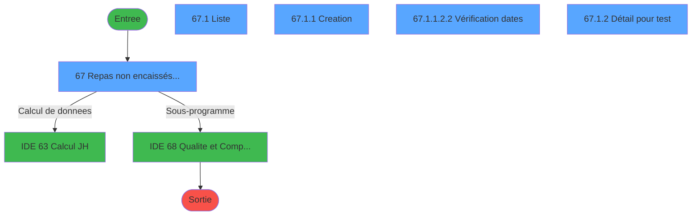
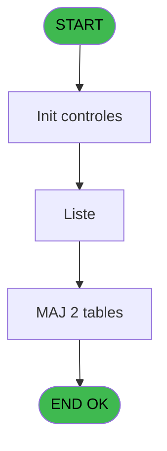
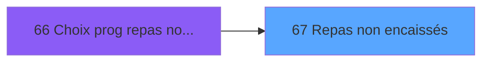
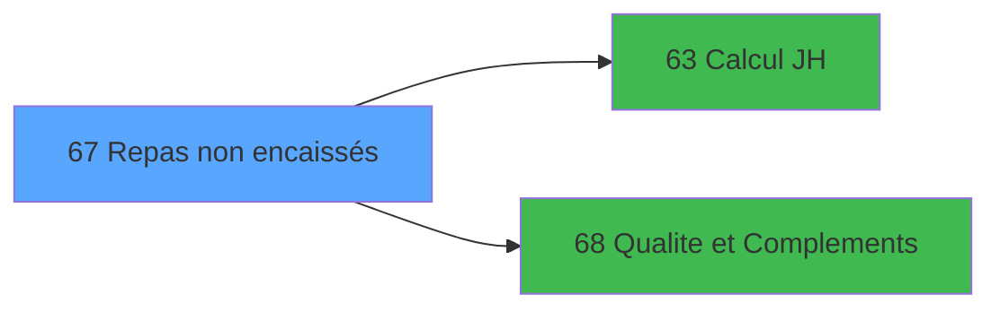

# PBG IDE 67 - Repas non encaissés

> **Analyse**: Phases 1-4 2026-02-03 09:05 -> 09:05 (21s) | Assemblage 09:05
> **Pipeline**: V7.2 Enrichi
> **Structure**: 4 onglets (Resume | Ecrans | Donnees | Connexions)

<!-- TAB:Resume -->

## 1. FICHE D'IDENTITE

| Attribut | Valeur |
|----------|--------|
| Projet | PBG |
| IDE Position | 67 |
| Nom Programme | Repas non encaissés |
| Fichier source | `Prg_67.xml` |
| Domaine metier | General |
| Taches | 14 (5 ecrans visibles) |
| Tables modifiees | 2 |
| Programmes appeles | 2 |

## 2. DESCRIPTION FONCTIONNELLE

**Repas non encaissés** assure la gestion complete de ce processus, accessible depuis [Choix prog repas non encaissée (IDE 66)](PBG-IDE-66.md).

Le flux de traitement s'organise en **3 blocs fonctionnels** :

- **Traitement** (12 taches) : traitements metier divers
- **Initialisation** (1 tache) : reinitialisation d'etats et de variables de travail
- **Creation** (1 tache) : insertion d'enregistrements en base (mouvements, prestations)

**Donnees modifiees** : 2 tables en ecriture (lg_vente_facture, Table_1054).

Detail : phases du traitement

#### Phase 1 : Traitement (12 taches)

- **67** - Repas non encaissés au village **[[ECRAN]](#ecran-t2)**
- **67.1** - Liste **[[ECRAN]](#ecran-t19)**
- **67.1.1.1** - Création sur une Période
- **67.1.1.2** - Modification sur uné période
- **67.1.1.2.1** - Création sur une Période
- **67.1.1.2.2** - Vérification dates **[[ECRAN]](#ecran-t35)**
- **67.1.1.2.1.1** - Création sur une Période
- **67.1.2** - Détail pour test **[[ECRAN]](#ecran-t52)**
- **67.1.1.2.4.1** - Création sur une Période
- **67.1.1.2.4** - Traitement Modif ou Annul
- **67.1.1.2.4.2** - Création sur une Période
- **67.1.1.2.4.3** - Création sur une Période

Delegue a : [Qualite et Complements (IDE 68)](PBG-IDE-68.md)

#### Phase 2 : Creation (1 tache)

- **67.1.1** - Creation **[[ECRAN]](#ecran-t20)**

#### Phase 3 : Initialisation (1 tache)

- **67.1.1.2.3** - Init table temp

#### Tables impactees

| Table | Operations | Role metier |
|-------|-----------|-------------|
| lg_vente_facture | R/**W** (9 usages) | Donnees de ventes |
| Table_1054 | **W**/L (6 usages) |  |

## 3. BLOCS FONCTIONNELS

### 3.1 Traitement (12 taches)

Traitements internes.

---

#### 67 - Repas non encaissés au village [[ECRAN]](#ecran-t2)

**Role** : Traitement : Repas non encaissés au village.
**Ecran** : 1102 x 263 DLU (MDI) | [Voir mockup](#ecran-t2)
**Variables liees** : K (V.Existe Repas DEJ ou DIN ?), L (V.Sens Qté repas), M (CHG_REASON_vhp_code_repas_nenc), N (CHG_PRV_vhp_code_repas_nenc_vi)

---

#### 67.1 - Liste [[ECRAN]](#ecran-t19)

**Role** : Traitement : Liste.
**Ecran** : 1080 x 179 DLU (Modal) | [Voir mockup](#ecran-t19)

---

#### 67.1.1.1 - Création sur une Période

**Role** : Traitement : Création sur une Période.

---

#### 67.1.1.2 - Modification sur uné période

**Role** : Traitement : Modification sur uné période.

---

#### 67.1.1.2.1 - Création sur une Période

**Role** : Traitement : Création sur une Période.

---

#### 67.1.1.2.2 - Vérification dates [[ECRAN]](#ecran-t35)

**Role** : Traitement : Vérification dates.
**Ecran** : 631 x 151 DLU (MDI) | [Voir mockup](#ecran-t35)

---

#### 67.1.1.2.1.1 - Création sur une Période

**Role** : Traitement : Création sur une Période.

---

#### 67.1.2 - Détail pour test [[ECRAN]](#ecran-t52)

**Role** : Verification : Détail pour test.
**Ecran** : 2390 x 282 DLU | [Voir mockup](#ecran-t52)

---

#### 67.1.1.2.4.1 - Création sur une Période

**Role** : Traitement : Création sur une Période.

---

#### 67.1.1.2.4 - Traitement Modif ou Annul

**Role** : Traitement : Traitement Modif ou Annul.
**Variables liees** : F (V.Modif effectuee ?)

---

#### 67.1.1.2.4.2 - Création sur une Période

**Role** : Traitement : Création sur une Période.

---

#### 67.1.1.2.4.3 - Création sur une Période

**Role** : Traitement : Création sur une Période.

### 3.2 Creation (1 tache)

Insertion de nouveaux enregistrements en base.

---

#### 67.1.1 - Creation [[ECRAN]](#ecran-t20)

**Role** : Creation d'enregistrement : Creation.
**Ecran** : 1298 x 221 DLU | [Voir mockup](#ecran-t20)

### 3.3 Initialisation (1 tache)

Reinitialisation d'etats et variables de travail.

---

#### 67.1.1.2.3 - Init table temp

**Role** : Reinitialisation : Init table temp.

## 5. REGLES METIER

*(Aucune regle metier identifiee)*

## 6. CONTEXTE

- **Appele par**: [Choix prog repas non encaissée (IDE 66)](PBG-IDE-66.md)
- **Appelle**: 2 programmes | **Tables**: 4 (W:2 R:2 L:2) | **Taches**: 14 | **Expressions**: 19

<!-- TAB:Ecrans -->

## 8. ECRANS

### 8.1 Forms visibles (5 / 14)

| # | Position | Tache | Nom | Type | Largeur | Hauteur | Bloc |
|---|----------|-------|-----|------|---------|---------|------|
| 1 | 67.1 | 67 | Repas non encaissés au village | MDI | 1102 | 263 | Traitement |
| 2 | 67.1.1 | 67.1 | Liste | Modal | 1080 | 179 | Traitement |
| 3 | 67.1.1.1 | 67.1.1 | Creation | Type0 | 1298 | 221 | Creation |
| 4 | 67.1.1.1.2.3 | 67.1.1.2.2 | Vérification dates | MDI | 631 | 151 | Traitement |
| 5 | 67.1.1.2 | 67.1.2 | Détail pour test | Type0 | 2390 | 282 | Traitement |

### 8.2 Mockups Ecrans

---

#### 67.1 - Repas non encaissés au village
**Tache** : [67](#t2) | **Type** : MDI | **Dimensions** : 1102 x 263 DLU
**Bloc** : Traitement | **Titre IDE** : Repas non encaissés au village

<!-- FORM-DATA:
{
    "width":  1102,
    "vFactor":  8,
    "type":  "MDI",
    "hFactor":  8,
    "controls":  [
                     {
                         "x":  1,
                         "type":  "label",
                         "var":  "",
                         "y":  0,
                         "w":  1095,
                         "fmt":  "",
                         "name":  "",
                         "h":  22,
                         "color":  "",
                         "text":  "",
                         "parent":  null
                     },
                     {
                         "x":  2,
                         "type":  "label",
                         "var":  "",
                         "y":  235,
                         "w":  1096,
                         "fmt":  "",
                         "name":  "",
                         "h":  23,
                         "color":  "",
                         "text":  "",
                         "parent":  null
                     },
                     {
                         "x":  16,
                         "type":  "label",
                         "var":  "",
                         "y":  32,
                         "w":  183,
                         "fmt":  "",
                         "name":  "",
                         "h":  10,
                         "color":  "",
                         "text":  "Date de consommation",
                         "parent":  101
                     },
                     {
                         "x":  6,
                         "type":  "label",
                         "var":  "",
                         "y":  23,
                         "w":  918,
                         "fmt":  "",
                         "name":  "",
                         "h":  25,
                         "color":  "1",
                         "text":  "",
                         "parent":  null
                     },
                     {
                         "x":  9,
                         "type":  "button",
                         "var":  "",
                         "y":  238,
                         "w":  154,
                         "fmt":  "\u0026Quitter",
                         "name":  "bouton quitter",
                         "h":  18,
                         "color":  "",
                         "text":  "",
                         "parent":  42
                     },
                     {
                         "x":  7,
                         "type":  "edit",
                         "var":  "",
                         "y":  6,
                         "w":  394,
                         "fmt":  "20",
                         "name":  "",
                         "h":  10,
                         "color":  "",
                         "text":  "",
                         "parent":  1
                     },
                     {
                         "x":  813,
                         "type":  "edit",
                         "var":  "",
                         "y":  6,
                         "w":  274,
                         "fmt":  "WWW DD MMM YYYYT",
                         "name":  "",
                         "h":  10,
                         "color":  "",
                         "text":  "",
                         "parent":  1
                     },
                     {
                         "x":  8,
                         "type":  "subform",
                         "var":  "",
                         "y":  52,
                         "w":  1085,
                         "fmt":  "",
                         "name":  "REPAS",
                         "h":  181,
                         "color":  "",
                         "text":  "",
                         "parent":  null
                     },
                     {
                         "x":  195,
                         "type":  "edit",
                         "var":  "",
                         "y":  32,
                         "w":  126,
                         "fmt":  "DD/MM/YYYYZ",
                         "name":  "w0_DateConsommation",
                         "h":  10,
                         "color":  "110",
                         "text":  "",
                         "parent":  101
                     },
                     {
                         "x":  324,
                         "type":  "button",
                         "var":  "",
                         "y":  32,
                         "w":  28,
                         "fmt":  "...",
                         "name":  "b_date",
                         "h":  10,
                         "color":  "",
                         "text":  "",
                         "parent":  101
                     },
                     {
                         "x":  930,
                         "type":  "button",
                         "var":  "",
                         "y":  27,
                         "w":  154,
                         "fmt":  "\u0026Consultation",
                         "name":  "b_consultation",
                         "h":  18,
                         "color":  "",
                         "text":  "",
                         "parent":  null
                     },
                     {
                         "x":  189,
                         "type":  "edit",
                         "var":  "",
                         "y":  241,
                         "w":  724,
                         "fmt":  "80",
                         "name":  "",
                         "h":  10,
                         "color":  "143",
                         "text":  "",
                         "parent":  null
                     }
                 ],
    "taskId":  "67.1",
    "height":  263
}
-->

<strong>Champs : 4 champs</strong>

| Pos (x,y) | Nom | Variable | Type |
|-----------|-----|----------|------|
| 7,6 | 20 | - | edit |
| 813,6 | WWW DD MMM YYYYT | - | edit |
| 195,32 | w0_DateConsommation | - | edit |
| 189,241 | 80 | - | edit |

<strong>Boutons : 3 boutons</strong>

| Bouton | Pos (x,y) | Action |
|--------|-----------|--------|
| Quitter | 9,238 | Quitte le programme |
| ... | 324,32 | Bouton fonctionnel |
| Consultation | 930,27 | Bouton fonctionnel |

---

#### 67.1.1 - Liste
**Tache** : [67.1](#t19) | **Type** : Modal | **Dimensions** : 1080 x 179 DLU
**Bloc** : Traitement | **Titre IDE** : Liste

<!-- FORM-DATA:
{
    "width":  1080,
    "vFactor":  8,
    "type":  "Modal",
    "hFactor":  8,
    "controls":  [
                     {
                         "x":  0,
                         "type":  "table",
                         "var":  "",
                         "name":  "",
                         "titleH":  12,
                         "color":  "110",
                         "w":  915,
                         "y":  1,
                         "fmt":  "",
                         "parent":  null,
                         "text":  "",
                         "rowH":  15,
                         "h":  172,
                         "cols":  [
                                      {
                                          "title":  "Type de repas",
                                          "layer":  1,
                                          "w":  204
                                      },
                                      {
                                          "title":  "Village/Groupe",
                                          "layer":  2,
                                          "w":  394
                                      },
                                      {
                                          "title":  "Nb de repas",
                                          "layer":  3,
                                          "w":  126
                                      },
                                      {
                                          "title":  "Repas",
                                          "layer":  4,
                                          "w":  155
                                      }
                                  ],
                         "rows":  4
                     },
                     {
                         "x":  0,
                         "type":  "label",
                         "var":  "",
                         "y":  167,
                         "w":  122,
                         "fmt":  "",
                         "name":  "",
                         "h":  9,
                         "color":  "",
                         "text":  "Motif annulation",
                         "parent":  null
                     },
                     {
                         "x":  9,
                         "type":  "edit",
                         "var":  "",
                         "y":  16,
                         "w":  192,
                         "fmt":  "",
                         "name":  "type_repas",
                         "h":  12,
                         "color":  "110",
                         "text":  "",
                         "parent":  1
                     },
                     {
                         "x":  213,
                         "type":  "edit",
                         "var":  "",
                         "y":  16,
                         "w":  382,
                         "fmt":  "",
                         "name":  "village",
                         "h":  12,
                         "color":  "110",
                         "text":  "",
                         "parent":  1
                     },
                     {
                         "x":  609,
                         "type":  "edit",
                         "var":  "",
                         "y":  16,
                         "w":  110,
                         "fmt":  "N6Z",
                         "name":  "nb_repas",
                         "h":  12,
                         "color":  "110",
                         "text":  "",
                         "parent":  1
                     },
                     {
                         "x":  924,
                         "type":  "button",
                         "var":  "",
                         "y":  7,
                         "w":  154,
                         "fmt":  "\u0026Modification",
                         "name":  "b_modification",
                         "h":  18,
                         "color":  "",
                         "text":  "",
                         "parent":  null
                     },
                     {
                         "x":  922,
                         "type":  "button",
                         "var":  "",
                         "y":  29,
                         "w":  154,
                         "fmt":  "\u0026Création",
                         "name":  "b_creation",
                         "h":  18,
                         "color":  "",
                         "text":  "",
                         "parent":  null
                     },
                     {
                         "x":  732,
                         "type":  "combobox",
                         "var":  "",
                         "y":  16,
                         "w":  143,
                         "fmt":  "",
                         "name":  "repas",
                         "h":  12,
                         "color":  "110",
                         "text":  "DIN,DEJ,DDE",
                         "parent":  1
                     },
                     {
                         "x":  922,
                         "type":  "button",
                         "var":  "",
                         "y":  50,
                         "w":  154,
                         "fmt":  "\u0026Annulation",
                         "name":  "b_annulation",
                         "h":  18,
                         "color":  "",
                         "text":  "",
                         "parent":  null
                     },
                     {
                         "x":  127,
                         "type":  "edit",
                         "var":  "",
                         "y":  167,
                         "w":  937,
                         "fmt":  "",
                         "name":  "effq_motif_annulation",
                         "h":  10,
                         "color":  "143",
                         "text":  "",
                         "parent":  null
                     }
                 ],
    "taskId":  "67.1.1",
    "height":  179
}
-->

<strong>Champs : 5 champs</strong>

| Pos (x,y) | Nom | Variable | Type |
|-----------|-----|----------|------|
| 9,16 | type_repas | - | edit |
| 213,16 | village | - | edit |
| 609,16 | nb_repas | - | edit |
| 732,16 | repas | - | combobox |
| 127,167 | effq_motif_annulation | - | edit |

<strong>Boutons : 3 boutons</strong>

| Bouton | Pos (x,y) | Action |
|--------|-----------|--------|
| Modification | 924,7 | Modifie l'element |
| Création | 922,29 | Bouton fonctionnel |
| Annulation | 922,50 | Annule et retour au menu |

---

#### 67.1.1.1 - Creation
**Tache** : [67.1.1](#t20) | **Type** : Type0 | **Dimensions** : 1298 x 221 DLU
**Bloc** : Creation | **Titre IDE** : Creation

<!-- FORM-DATA:
{
    "width":  1298,
    "vFactor":  8,
    "type":  "Type0",
    "hFactor":  8,
    "controls":  [
                     {
                         "x":  10,
                         "type":  "label",
                         "var":  "",
                         "y":  5,
                         "w":  1281,
                         "fmt":  "",
                         "name":  "",
                         "h":  101,
                         "color":  "",
                         "text":  "",
                         "parent":  null
                     },
                     {
                         "x":  29,
                         "type":  "label",
                         "var":  "",
                         "y":  35,
                         "w":  104,
                         "fmt":  "",
                         "name":  "",
                         "h":  13,
                         "color":  "",
                         "text":  "Type repas",
                         "parent":  1
                     },
                     {
                         "x":  29,
                         "type":  "label",
                         "var":  "",
                         "y":  51,
                         "w":  88,
                         "fmt":  "",
                         "name":  "",
                         "h":  13,
                         "color":  "",
                         "text":  "Nombre",
                         "parent":  1
                     },
                     {
                         "x":  645,
                         "type":  "label",
                         "var":  "",
                         "y":  51,
                         "w":  149,
                         "fmt":  "",
                         "name":  "",
                         "h":  13,
                         "color":  "",
                         "text":  "Repas",
                         "parent":  1
                     },
                     {
                         "x":  10,
                         "type":  "label",
                         "var":  "",
                         "y":  191,
                         "w":  1281,
                         "fmt":  "",
                         "name":  "",
                         "h":  25,
                         "color":  "",
                         "text":  "",
                         "parent":  null
                     },
                     {
                         "x":  29,
                         "type":  "label",
                         "var":  "",
                         "y":  67,
                         "w":  184,
                         "fmt":  "",
                         "name":  "",
                         "h":  13,
                         "color":  "",
                         "text":  "Motif annulation",
                         "parent":  1
                     },
                     {
                         "x":  29,
                         "type":  "label",
                         "var":  "",
                         "y":  19,
                         "w":  112,
                         "fmt":  "",
                         "name":  "",
                         "h":  13,
                         "color":  "",
                         "text":  "Lieu de séjour",
                         "parent":  1
                     },
                     {
                         "x":  645,
                         "type":  "label",
                         "var":  "",
                         "y":  18,
                         "w":  179,
                         "fmt":  "",
                         "name":  "",
                         "h":  13,
                         "color":  "",
                         "text":  "Date de fin",
                         "parent":  1
                     },
                     {
                         "x":  149,
                         "type":  "combobox",
                         "var":  "",
                         "y":  19,
                         "w":  485,
                         "fmt":  "",
                         "name":  "vhp_lieu_sejour",
                         "h":  13,
                         "color":  "110",
                         "text":  "",
                         "parent":  1
                     },
                     {
                         "x":  831,
                         "type":  "edit",
                         "var":  "",
                         "y":  19,
                         "w":  157,
                         "fmt":  "DD/MM/YYYYZ",
                         "name":  "v.Date de fin_0001",
                         "h":  13,
                         "color":  "110",
                         "text":  "",
                         "parent":  1
                     },
                     {
                         "x":  998,
                         "type":  "button",
                         "var":  "",
                         "y":  19,
                         "w":  28,
                         "fmt":  "...",
                         "name":  "Bt.DateFIn",
                         "h":  13,
                         "color":  "",
                         "text":  "",
                         "parent":  1
                     },
                     {
                         "x":  149,
                         "type":  "combobox",
                         "var":  "",
                         "y":  35,
                         "w":  485,
                         "fmt":  "",
                         "name":  "vhp_code_repas_nenc_vil",
                         "h":  13,
                         "color":  "110",
                         "text":  "",
                         "parent":  1
                     },
                     {
                         "x":  645,
                         "type":  "edit",
                         "var":  "",
                         "y":  35,
                         "w":  179,
                         "fmt":  "30",
                         "name":  "",
                         "h":  13,
                         "color":  "",
                         "text":  "",
                         "parent":  1
                     },
                     {
                         "x":  831,
                         "type":  "edit",
                         "var":  "",
                         "y":  35,
                         "w":  453,
                         "fmt":  "U50",
                         "name":  "effq_groupe",
                         "h":  13,
                         "color":  "110",
                         "text":  "",
                         "parent":  1
                     },
                     {
                         "x":  149,
                         "type":  "edit",
                         "var":  "",
                         "y":  51,
                         "w":  64,
                         "fmt":  "6Z",
                         "name":  "V.Nb repas Saisis",
                         "h":  13,
                         "color":  "110",
                         "text":  "",
                         "parent":  1
                     },
                     {
                         "x":  831,
                         "type":  "combobox",
                         "var":  "",
                         "y":  51,
                         "w":  210,
                         "fmt":  "",
                         "name":  "effq_repas",
                         "h":  13,
                         "color":  "",
                         "text":  "DIN,DEJ,DDE",
                         "parent":  1
                     },
                     {
                         "x":  28,
                         "type":  "edit",
                         "var":  "",
                         "y":  83,
                         "w":  1165,
                         "fmt":  "",
                         "name":  "effq_motif_annulation",
                         "h":  13,
                         "color":  "110",
                         "text":  "",
                         "parent":  1
                     },
                     {
                         "x":  969,
                         "type":  "button",
                         "var":  "",
                         "y":  194,
                         "w":  154,
                         "fmt":  "\u0026Annuler",
                         "name":  "",
                         "h":  18,
                         "color":  "",
                         "text":  "",
                         "parent":  17
                     },
                     {
                         "x":  1128,
                         "type":  "button",
                         "var":  "",
                         "y":  194,
                         "w":  154,
                         "fmt":  "\u0026Valider",
                         "name":  "",
                         "h":  18,
                         "color":  "",
                         "text":  "",
                         "parent":  17
                     }
                 ],
    "taskId":  "67.1.1.1",
    "height":  221
}
-->

<strong>Champs : 8 champs</strong>

| Pos (x,y) | Nom | Variable | Type |
|-----------|-----|----------|------|
| 149,19 | vhp_lieu_sejour | - | combobox |
| 831,19 | v.Date de fin_0001 | - | edit |
| 149,35 | vhp_code_repas_nenc_vil | - | combobox |
| 645,35 | 30 | - | edit |
| 831,35 | effq_groupe | - | edit |
| 149,51 | V.Nb repas Saisis | - | edit |
| 831,51 | effq_repas | - | combobox |
| 28,83 | effq_motif_annulation | - | edit |

<strong>Boutons : 3 boutons</strong>

| Bouton | Pos (x,y) | Action |
|--------|-----------|--------|
| ... | 998,19 | Bouton fonctionnel |
| Annuler | 969,194 | Annule et retour au menu |
| Valider | 1128,194 | Valide la saisie et enregistre |

---

#### 67.1.1.1.2.3 - Vérification dates
**Tache** : [67.1.1.2.2](#t35) | **Type** : MDI | **Dimensions** : 631 x 151 DLU
**Bloc** : Traitement | **Titre IDE** : Vérification dates

<!-- FORM-DATA:
{
    "width":  631,
    "vFactor":  8,
    "type":  "MDI",
    "hFactor":  4,
    "controls":  [
                     {
                         "x":  292,
                         "type":  "table",
                         "var":  "",
                         "name":  "",
                         "titleH":  16,
                         "color":  "110",
                         "w":  295,
                         "y":  8,
                         "fmt":  "",
                         "parent":  null,
                         "text":  "",
                         "rowH":  16,
                         "h":  133,
                         "cols":  [
                                      {
                                          "title":  "Date",
                                          "layer":  1,
                                          "w":  88
                                      },
                                      {
                                          "title":  "Nombre initial",
                                          "layer":  2,
                                          "w":  81
                                      },
                                      {
                                          "title":  "Ne PAS modifier ",
                                          "layer":  3,
                                          "w":  107
                                      }
                                  ],
                         "rows":  3
                     },
                     {
                         "x":  32,
                         "type":  "label",
                         "var":  "",
                         "y":  16,
                         "w":  240,
                         "fmt":  "",
                         "name":  "",
                         "h":  21,
                         "color":  "",
                         "text":  "Pour les dates affichées dans le tableau, le nombre de repas est différent du nombre initial pour la date de consommation",
                         "parent":  null
                     },
                     {
                         "x":  32,
                         "type":  "label",
                         "var":  "",
                         "y":  43,
                         "w":  95,
                         "fmt":  "",
                         "name":  "",
                         "h":  10,
                         "color":  "",
                         "text":  "Date de consommation",
                         "parent":  null
                     },
                     {
                         "x":  32,
                         "type":  "label",
                         "var":  "",
                         "y":  69,
                         "w":  95,
                         "fmt":  "",
                         "name":  "",
                         "h":  10,
                         "color":  "",
                         "text":  "Nombre initial",
                         "parent":  null
                     },
                     {
                         "x":  32,
                         "type":  "label",
                         "var":  "",
                         "y":  92,
                         "w":  240,
                         "fmt":  "",
                         "name":  "",
                         "h":  21,
                         "color":  "",
                         "text":  "Veuillez décocher la case à cocher \"Ne PAS modifier\" pour les dates dont le nombre de repas doit être modifié.",
                         "parent":  null
                     },
                     {
                         "x":  308,
                         "type":  "edit",
                         "var":  "",
                         "y":  27,
                         "w":  68,
                         "fmt":  "##/##/####",
                         "name":  "ID",
                         "h":  10,
                         "color":  "6",
                         "text":  "",
                         "parent":  1
                     },
                     {
                         "x":  396,
                         "type":  "edit",
                         "var":  "",
                         "y":  27,
                         "w":  44,
                         "fmt":  "",
                         "name":  "vhp_nb_real_initial",
                         "h":  10,
                         "color":  "6",
                         "text":  "",
                         "parent":  1
                     },
                     {
                         "x":  514,
                         "type":  "checkbox",
                         "var":  "",
                         "y":  27,
                         "w":  16,
                         "fmt":  "",
                         "name":  "Selectionne",
                         "h":  9,
                         "color":  "6",
                         "text":  "",
                         "parent":  1
                     },
                     {
                         "x":  127,
                         "type":  "edit",
                         "var":  "",
                         "y":  43,
                         "w":  84,
                         "fmt":  "",
                         "name":  "V.Date de consommation",
                         "h":  10,
                         "color":  "",
                         "text":  "",
                         "parent":  null
                     },
                     {
                         "x":  128,
                         "type":  "edit",
                         "var":  "",
                         "y":  69,
                         "w":  26,
                         "fmt":  "",
                         "name":  "vhp_nb_REPAS SAISIS",
                         "h":  10,
                         "color":  "",
                         "text":  "",
                         "parent":  null
                     },
                     {
                         "x":  32,
                         "type":  "button",
                         "var":  "",
                         "y":  129,
                         "w":  67,
                         "fmt":  "\u0026Annuler",
                         "name":  "",
                         "h":  14,
                         "color":  "",
                         "text":  "",
                         "parent":  null
                     },
                     {
                         "x":  191,
                         "type":  "button",
                         "var":  "",
                         "y":  129,
                         "w":  67,
                         "fmt":  "\u0026Valider",
                         "name":  "",
                         "h":  14,
                         "color":  "",
                         "text":  "",
                         "parent":  null
                     }
                 ],
    "taskId":  "67.1.1.1.2.3",
    "height":  151
}
-->

<strong>Champs : 5 champs</strong>

| Pos (x,y) | Nom | Variable | Type |
|-----------|-----|----------|------|
| 308,27 | ID | - | edit |
| 396,27 | vhp_nb_real_initial | - | edit |
| 514,27 | Selectionne | - | checkbox |
| 127,43 | V.Date de consommation | - | edit |
| 128,69 | vhp_nb_REPAS SAISIS | - | edit |

<strong>Boutons : 2 boutons</strong>

| Bouton | Pos (x,y) | Action |
|--------|-----------|--------|
| Annuler | 32,129 | Annule et retour au menu |
| Valider | 191,129 | Valide la saisie et enregistre |

---

#### 67.1.1.2 - Détail pour test
**Tache** : [67.1.2](#t52) | **Type** : Type0 | **Dimensions** : 2390 x 282 DLU
**Bloc** : Traitement | **Titre IDE** : Détail pour test

<!-- FORM-DATA:
{
    "width":  2390,
    "vFactor":  8,
    "type":  "Type0",
    "hFactor":  8,
    "controls":  [
                     {
                         "x":  16,
                         "type":  "table",
                         "var":  "",
                         "name":  "",
                         "titleH":  12,
                         "color":  "",
                         "w":  3350,
                         "y":  8,
                         "fmt":  "",
                         "parent":  null,
                         "text":  "",
                         "rowH":  13,
                         "h":  264,
                         "cols":  [
                                      {
                                          "title":  "vhp_date_conso",
                                          "layer":  1,
                                          "w":  134
                                      },
                                      {
                                          "title":  "vhp_lieu_sejour",
                                          "layer":  2,
                                          "w":  125
                                      },
                                      {
                                          "title":  "vhp_code_repas_nenc_vil",
                                          "layer":  3,
                                          "w":  208
                                      },
                                      {
                                          "title":  "vhp_groupe",
                                          "layer":  4,
                                          "w":  578
                                      },
                                      {
                                          "title":  "vhp_nb_prev",
                                          "layer":  5,
                                          "w":  107
                                      },
                                      {
                                          "title":  "vhp_nb_real",
                                          "layer":  6,
                                          "w":  101
                                      },
                                      {
                                          "title":  "vhp_repas",
                                          "layer":  7,
                                          "w":  86
                                      },
                                      {
                                          "title":  "vhp_motif_annulation",
                                          "layer":  8,
                                          "w":  80
                                      },
                                      {
                                          "title":  "vhp_date_der_modif",
                                          "layer":  9,
                                          "w":  162
                                      },
                                      {
                                          "title":  "vhp_heure_der_modif",
                                          "layer":  10,
                                          "w":  171
                                      },
                                      {
                                          "title":  "vhp_user_der_modif",
                                          "layer":  11,
                                          "w":  160
                                      },
                                      {
                                          "title":  "vhp_date_operation",
                                          "layer":  12,
                                          "w":  158
                                      },
                                      {
                                          "title":  "vhp_nb_REPAS SAISIS",
                                          "layer":  13,
                                          "w":  190
                                      }
                                  ],
                         "rows":  13
                     },
                     {
                         "x":  22,
                         "type":  "edit",
                         "var":  "",
                         "y":  23,
                         "w":  122,
                         "fmt":  "",
                         "name":  "vhp_date_conso",
                         "h":  10,
                         "color":  "",
                         "text":  "",
                         "parent":  32
                     },
                     {
                         "x":  156,
                         "type":  "edit",
                         "var":  "",
                         "y":  23,
                         "w":  18,
                         "fmt":  "",
                         "name":  "vhp_lieu_sejour",
                         "h":  10,
                         "color":  "",
                         "text":  "",
                         "parent":  32
                     },
                     {
                         "x":  281,
                         "type":  "edit",
                         "var":  "",
                         "y":  23,
                         "w":  74,
                         "fmt":  "",
                         "name":  "vhp_code_repas_nenc_vil",
                         "h":  10,
                         "color":  "",
                         "text":  "",
                         "parent":  32
                     },
                     {
                         "x":  489,
                         "type":  "edit",
                         "var":  "",
                         "y":  23,
                         "w":  566,
                         "fmt":  "",
                         "name":  "vhp_groupe",
                         "h":  10,
                         "color":  "",
                         "text":  "",
                         "parent":  32
                     },
                     {
                         "x":  1067,
                         "type":  "edit",
                         "var":  "",
                         "y":  23,
                         "w":  64,
                         "fmt":  "",
                         "name":  "vhp_nb_prev",
                         "h":  10,
                         "color":  "",
                         "text":  "",
                         "parent":  32
                     },
                     {
                         "x":  1174,
                         "type":  "edit",
                         "var":  "",
                         "y":  23,
                         "w":  64,
                         "fmt":  "",
                         "name":  "vhp_nb_real",
                         "h":  10,
                         "color":  "",
                         "text":  "",
                         "parent":  32
                     },
                     {
                         "x":  1275,
                         "type":  "edit",
                         "var":  "",
                         "y":  23,
                         "w":  40,
                         "fmt":  "",
                         "name":  "vhp_repas",
                         "h":  10,
                         "color":  "",
                         "text":  "",
                         "parent":  32
                     },
                     {
                         "x":  1361,
                         "type":  "edit",
                         "var":  "",
                         "y":  23,
                         "w":  80,
                         "fmt":  "",
                         "name":  "vhp_motif_annulation",
                         "h":  10,
                         "color":  "",
                         "text":  "",
                         "parent":  32
                     },
                     {
                         "x":  1441,
                         "type":  "edit",
                         "var":  "",
                         "y":  23,
                         "w":  122,
                         "fmt":  "",
                         "name":  "vhp_date_der_modif",
                         "h":  10,
                         "color":  "",
                         "text":  "",
                         "parent":  32
                     },
                     {
                         "x":  1603,
                         "type":  "edit",
                         "var":  "",
                         "y":  23,
                         "w":  93,
                         "fmt":  "",
                         "name":  "vhp_heure_der_modif",
                         "h":  10,
                         "color":  "",
                         "text":  "",
                         "parent":  32
                     },
                     {
                         "x":  1774,
                         "type":  "edit",
                         "var":  "",
                         "y":  23,
                         "w":  96,
                         "fmt":  "",
                         "name":  "vhp_user_der_modif",
                         "h":  10,
                         "color":  "",
                         "text":  "",
                         "parent":  32
                     },
                     {
                         "x":  1934,
                         "type":  "edit",
                         "var":  "",
                         "y":  23,
                         "w":  122,
                         "fmt":  "",
                         "name":  "vhp_date_operation",
                         "h":  10,
                         "color":  "",
                         "text":  "",
                         "parent":  32
                     },
                     {
                         "x":  2092,
                         "type":  "edit",
                         "var":  "",
                         "y":  23,
                         "w":  64,
                         "fmt":  "",
                         "name":  "vhp_nb_REPAS SAISIS",
                         "h":  10,
                         "color":  "",
                         "text":  "",
                         "parent":  32
                     }
                 ],
    "taskId":  "67.1.1.2",
    "height":  282
}
-->

<strong>Champs : 13 champs</strong>

| Pos (x,y) | Nom | Variable | Type |
|-----------|-----|----------|------|
| 22,23 | vhp_date_conso | - | edit |
| 156,23 | vhp_lieu_sejour | - | edit |
| 281,23 | vhp_code_repas_nenc_vil | - | edit |
| 489,23 | vhp_groupe | - | edit |
| 1067,23 | vhp_nb_prev | - | edit |
| 1174,23 | vhp_nb_real | - | edit |
| 1275,23 | vhp_repas | - | edit |
| 1361,23 | vhp_motif_annulation | - | edit |
| 1441,23 | vhp_date_der_modif | - | edit |
| 1603,23 | vhp_heure_der_modif | - | edit |
| 1774,23 | vhp_user_der_modif | - | edit |
| 1934,23 | vhp_date_operation | - | edit |
| 2092,23 | vhp_nb_REPAS SAISIS | - | edit |

## 9. NAVIGATION

### 9.1 Enchainement des ecrans

**Detail par enchainement :**

| Depuis | Action | Vers | Retour |
|--------|--------|------|--------|
| Repas non encaissés au village | Calcul de donnees | [Calcul JH (IDE 63)](PBG-IDE-63.md) | Retour ecran |
| Repas non encaissés au village | Sous-programme | [Qualite et Complements (IDE 68)](PBG-IDE-68.md) | Retour ecran |

### 9.3 Structure hierarchique (14 taches)

| Position | Tache | Type | Dimensions | Bloc |
|----------|-------|------|------------|------|
| **67.1** | [**Repas non encaissés au village** (67)](#t2) [mockup](#ecran-t2) | MDI | 1102x263 | Traitement |
| 67.1.1 | [Liste (67.1)](#t19) [mockup](#ecran-t19) | Modal | 1080x179 | |
| 67.1.2 | [Création sur une Période (67.1.1.1)](#t22) | - | - | |
| 67.1.3 | [Modification sur uné période (67.1.1.2)](#t26) | - | - | |
| 67.1.4 | [Création sur une Période (67.1.1.2.1)](#t34) | - | - | |
| 67.1.5 | [Vérification dates (67.1.1.2.2)](#t35) [mockup](#ecran-t35) | MDI | 631x151 | |
| 67.1.6 | [Création sur une Période (67.1.1.2.1.1)](#t39) | - | - | |
| 67.1.7 | [Détail pour test (67.1.2)](#t52) [mockup](#ecran-t52) | - | 2390x282 | |
| 67.1.8 | [Création sur une Période (67.1.1.2.4.1)](#t63) | - | - | |
| 67.1.9 | [Traitement Modif ou Annul (67.1.1.2.4)](#t64) | - | - | |
| 67.1.10 | [Création sur une Période (67.1.1.2.4.2)](#t68) | - | - | |
| 67.1.11 | [Création sur une Période (67.1.1.2.4.3)](#t71) | - | - | |
| **67.2** | [**Creation** (67.1.1)](#t20) [mockup](#ecran-t20) | - | 1298x221 | Creation |
| **67.3** | [**Init table temp** (67.1.1.2.3)](#t36) | - | - | Initialisation |

### 9.4 Algorigramme

> **Legende**: Vert = START/END OK | Rouge = END KO | Bleu = Decisions
> *Algorigramme auto-genere. Utiliser `/algorigramme` pour une synthese metier detaillee.*

<!-- TAB:Donnees -->

## 10. TABLES

### Tables utilisees (4)

| ID | Nom | Description | Type | R | W | L | Usages |
|----|-----|-------------|------|---|---|---|--------|
| 372 | pv_budget |  | DB | R |   |   | 1 |
| 826 | wording_mention_legal |  | DB |   |   | L | 2 |
| 827 | lg_vente_facture | Donnees de ventes | DB | R | **W** |   | 9 |
| 1054 | Table_1054 |  | MEM |   | **W** | L | 6 |

### Colonnes par table (2 / 3 tables avec colonnes identifiees)

Table 372 - pv_budget (R) - 1 usages

| Lettre | Variable | Acces | Type |
|--------|----------|-------|------|
| A | W1-Fin de Tache | R | Alpha |
| B | V.Date de consommation | R | Date |
| C | Bt.Date | R | Alpha |
| D | Bt.Consultation | R | Alpha |
| E | V.Affiche ligne ? | R | Logical |
| F | V.Modif effectuee ? | R | Logical |
| G | V.Affiche recalcul | R | Logical |

Table 827 - lg_vente_facture (R/**W**) - 9 usages

| Lettre | Variable | Acces | Type |
|--------|----------|-------|------|
| A | Bt.Modification | W | Alpha |
| B | Bt.Création | W | Alpha |
| C | Bt.Annulation | W | Alpha |
| D | V.Confirm annulation | W | Numeric |
| E | v.Date de fin | W | Date |
| F | Bt.DateFIn | W | Alpha |
| G | v.qualite | W | Unicode |
| H | v.complement qualite | W | Unicode |
| I | V.Btn Valider | W | Alpha |
| J | V.Existe DDE ? | W | Logical |
| K | V.Existe Repas DEJ ou DIN ? | W | Logical |
| L | V.Sens Qté repas | W | Numeric |
| M | CHG_REASON_vhp_code_repas_nenc | W | Numeric |
| N | CHG_PRV_vhp_code_repas_nenc_vi | W | Unicode |

Table 1054 - Table_1054 (**W**/L) - 6 usages

*Table utilisee uniquement en Link ou aucune colonne Real identifiee dans le DataView.*

## 11. VARIABLES

### 11.1 Variables de session (9)

Variables persistantes pendant toute la session.

| Lettre | Nom | Type | Usage dans |
|--------|-----|------|-----------|
| B | V.Date de consommation | Date | 2x session |
| E | V.Affiche ligne ? | Logical | - |
| F | V.Modif effectuee ? | Logical | - |
| G | V.Affiche recalcul | Logical | - |
| H | v.complement qualite | Unicode | - |
| I | V.Btn Valider | Alpha | - |
| J | V.Existe DDE ? | Logical | - |
| K | V.Existe Repas DEJ ou DIN ? | Logical | - |
| L | V.Sens Qté repas | Numeric | - |

### 11.2 Autres (5)

Variables diverses.

| Lettre | Nom | Type | Usage dans |
|--------|-----|------|-----------|
| A | W1-Fin de Tache | Alpha | - |
| C | Bt.Date | Alpha | - |
| D | Bt.Consultation | Alpha | - |
| M | CHG_REASON_vhp_code_repas_nenc | Numeric | - |
| N | CHG_PRV_vhp_code_repas_nenc_vi | Unicode | - |

## 12. EXPRESSIONS

**19 / 19 expressions decodees (100%)**

### 12.1 Repartition par type

| Type | Expressions | Regles |
|------|-------------|--------|
| CONSTANTE | 4 | 0 |
| DATE | 2 | 0 |
| CONDITION | 3 | 0 |
| REFERENCE_VG | 1 | 0 |
| CAST_LOGIQUE | 2 | 0 |
| OTHER | 7 | 0 |

### 12.2 Expressions cles par type

#### CONSTANTE (4 expressions)

| Type | IDE | Expression | Regle |
|------|-----|------------|-------|
| CONSTANTE | 18 | `'C'` | - |
| CONSTANTE | 19 | `'M'` | - |
| CONSTANTE | 3 | `'...'` | - |
| CONSTANTE | 6 | `'REPAS'` | - |

#### DATE (2 expressions)

| Type | IDE | Expression | Regle |
|------|-----|------------|-------|
| DATE | 11 | `Date()-1` | - |
| DATE | 2 | `Date()` | - |

#### CONDITION (3 expressions)

| Type | IDE | Expression | Regle |
|------|-----|------------|-------|
| CONDITION | 5 | `LastClicked()<>'b_date'` | - |
| CONDITION | 4 | `V.Date de consommation [B]=0` | - |
| CONDITION | 10 | `V.Date de consommation [B]<BOM(Date()) AND Date()>BOM(Date()) OR V.Date de consommation [B]<BOM(Date()-1) AND Date()=BOM(Date())` | - |

#### REFERENCE_VG (1 expressions)

| Type | IDE | Expression | Regle |
|------|-----|------------|-------|
| REFERENCE_VG | 1 | `VG21` | - |

#### CAST_LOGIQUE (2 expressions)

| Type | IDE | Expression | Regle |
|------|-----|------------|-------|
| CAST_LOGIQUE | 9 | `'FALSE'LOG` | - |
| CAST_LOGIQUE | 7 | `'TRUE'LOG` | - |

#### OTHER (7 expressions)

| Type | IDE | Expression | Regle |
|------|-----|------------|-------|
| OTHER | 15 | `MlsTrans('Recalcul effectif en cours...')` | - |
| OTHER | 16 | `[CW]` | - |
| OTHER | 17 | `{1,2}` | - |
| OTHER | 14 | `SetCrsr(1)` | - |
| OTHER | 8 | `[CR]` | - |
| ... | | *+2 autres* | |

<!-- TAB:Connexions -->

## 13. GRAPHE D'APPELS

### 13.1 Chaine depuis Main (Callers)

Main -> ... -> [Choix prog repas non encaissée (IDE 66)](PBG-IDE-66.md) -> **Repas non encaissés (IDE 67)**

### 13.2 Callers

| IDE | Nom Programme | Nb Appels |
|-----|---------------|-----------|
| [66](PBG-IDE-66.md) | Choix prog repas non encaissée | 1 |

### 13.3 Callees (programmes appeles)

### 13.4 Detail Callees avec contexte

| IDE | Nom Programme | Appels | Contexte |
|-----|---------------|--------|----------|
| [63](PBG-IDE-63.md) | Calcul JH | 1 | Calcul de donnees |
| [68](PBG-IDE-68.md) | Qualite et Complements | 1 | Sous-programme |

## 14. RECOMMANDATIONS MIGRATION

### 14.1 Profil du programme

| Metrique | Valeur | Impact migration |
|----------|--------|-----------------|
| Lignes de logique | 426 | Taille moyenne |
| Expressions | 19 | Peu de logique |
| Tables WRITE | 2 | Impact faible |
| Sous-programmes | 2 | Peu de dependances |
| Ecrans visibles | 5 | Quelques ecrans |
| Code desactive | 0.2% (1 / 426) | Code sain |
| Regles metier | 0 | Pas de regle identifiee |

### 14.2 Plan de migration par bloc

#### Traitement (12 taches: 4 ecrans, 8 traitements)

- **Strategie** : Orchestrateur avec 4 ecrans (Razor/React) et 8 traitements backend (services).
- Les ecrans deviennent des composants UI, les traitements invisibles deviennent des services injectables.
- 2 sous-programme(s) a migrer ou a reutiliser depuis les services existants.
- Decomposer les taches en services unitaires testables.

#### Creation (1 tache: 1 ecran, 0 traitement)

- **Strategie** : Repository pattern avec Entity Framework Core.
- Insertion via `IRepository<T>.CreateAsync()`

#### Initialisation (1 tache: 0 ecran, 1 traitement)

- **Strategie** : Constructeur/methode `InitAsync()` dans l'orchestrateur.

### 14.3 Dependances critiques

| Dependance | Type | Appels | Impact |
|------------|------|--------|--------|
| lg_vente_facture | Table WRITE (Database) | 6x | Schema + repository |
| Table_1054 | Table WRITE (Memory) | 2x | Schema + repository |
| [Qualite et Complements (IDE 68)](PBG-IDE-68.md) | Sous-programme | 1x | Normale - Sous-programme |
| [Calcul JH (IDE 63)](PBG-IDE-63.md) | Sous-programme | 1x | Normale - Calcul de donnees |

---
*Spec DETAILED generee par Pipeline V7.2 - 2026-02-03 09:06*
