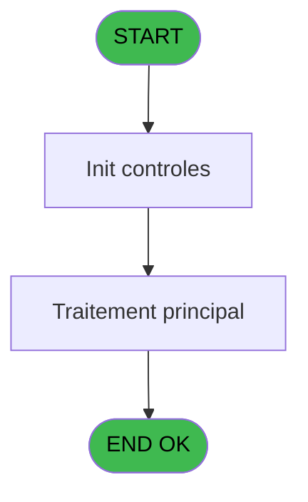
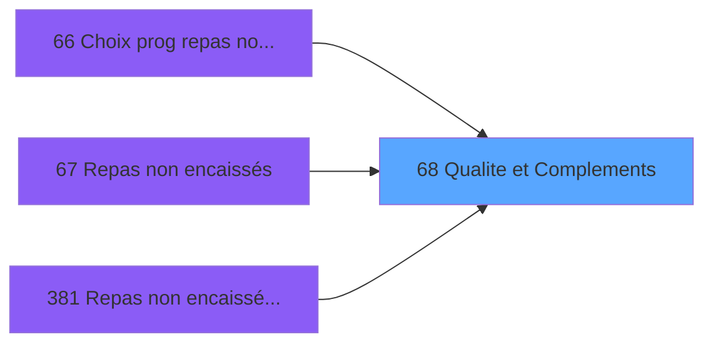

# PBG IDE 68 - Qualite et Complements

> **Analyse**: Phases 1-4 2026-02-03 09:06 -> 09:06 (20s) | Assemblage 09:06
> **Pipeline**: V7.2 Enrichi
> **Structure**: 4 onglets (Resume | Ecrans | Donnees | Connexions)

<!-- TAB:Resume -->

## 1. FICHE D'IDENTITE

| Attribut | Valeur |
|----------|--------|
| Projet | PBG |
| IDE Position | 68 |
| Nom Programme | Qualite et Complements |
| Fichier source | `Prg_68.xml` |
| Domaine metier | General |
| Taches | 1 (0 ecrans visibles) |
| Tables modifiees | 0 |
| Programmes appeles | 0 |

## 2. DESCRIPTION FONCTIONNELLE

**Qualite et Complements** assure la gestion complete de ce processus, accessible depuis [Choix prog repas non encaissée (IDE 66)](PBG-IDE-66.md), [Repas non encaissés (IDE 67)](PBG-IDE-67.md), [Repas non encaissés au villNEW (IDE 381)](PBG-IDE-381.md).

Le flux de traitement s'organise en **1 blocs fonctionnels** :

- **Traitement** (1 tache) : traitements metier divers

## 3. BLOCS FONCTIONNELS

### 3.1 Traitement (1 tache)

Traitements internes.

---

#### 68 - Qualite et Complements

**Role** : Traitement : Qualite et Complements.
**Variables liees** : B (P.qualite), C (P.complement qualite)

## 5. REGLES METIER

*(Aucune regle metier identifiee)*

## 6. CONTEXTE

- **Appele par**: [Choix prog repas non encaissée (IDE 66)](PBG-IDE-66.md), [Repas non encaissés (IDE 67)](PBG-IDE-67.md), [Repas non encaissés au villNEW (IDE 381)](PBG-IDE-381.md)
- **Appelle**: 0 programmes | **Tables**: 0 (W:0 R:0 L:0) | **Taches**: 1 | **Expressions**: 28

<!-- TAB:Ecrans -->

## 8. ECRANS

*(Programme sans ecran visible)*

## 9. NAVIGATION

### 9.3 Structure hierarchique (1 tache)

| Position | Tache | Type | Dimensions | Bloc |
|----------|-------|------|------------|------|
| **68.1** | [**Qualite et Complements** (68)](#t1) | - | - | Traitement |

### 9.4 Algorigramme

> **Legende**: Vert = START/END OK | Rouge = END KO | Bleu = Decisions
> *Algorigramme auto-genere. Utiliser `/algorigramme` pour une synthese metier detaillee.*

<!-- TAB:Donnees -->

## 10. TABLES

### Tables utilisees (0)

| ID | Nom | Description | Type | R | W | L | Usages |
|----|-----|-------------|------|---|---|---|--------|

### Colonnes par table (0 / 0 tables avec colonnes identifiees)

## 11. VARIABLES

### 11.1 Parametres entrants (3)

Variables recues du programme appelant ([Choix prog repas non encaissée (IDE 66)](PBG-IDE-66.md)).

| Lettre | Nom | Type | Usage dans |
|--------|-----|------|-----------|
| A | P.code repas non enc vil | Unicode | 13x parametre entrant |
| B | P.qualite | Unicode | - |
| C | P.complement qualite | Unicode | - |

## 12. EXPRESSIONS

**28 / 28 expressions decodees (100%)**

### 12.1 Repartition par type

| Type | Expressions | Regles |
|------|-------------|--------|
| CONDITION | 7 | 0 |
| CONSTANTE | 15 | 0 |
| OTHER | 6 | 0 |

### 12.2 Expressions cles par type

#### CONDITION (7 expressions)

| Type | IDE | Expression | Regle |
|------|-----|------------|-------|
| CONDITION | 18 | `P.code repas non enc vil [A]='IGRVSP'` | - |
| CONDITION | 23 | `P.code repas non enc vil [A]='VRLHP'` | - |
| CONDITION | 26 | `P.code repas non enc vil [A]='IGRBSI'` | - |
| CONDITION | 16 | `P.code repas non enc vil [A]='GMPRES'` | - |
| CONDITION | 22 | `CASE(P.code repas non enc vil [A],'GEGEMP','GE','GOLOC','LOC','GOVILL','VILL','GOVVDE','VILL','GOVALA','VILL','')` | - |
| ... | | *+2 autres* | |

#### CONSTANTE (15 expressions)

| Type | IDE | Expression | Regle |
|------|-----|------------|-------|
| CONSTANTE | 21 | `'GO'` | - |
| CONSTANTE | 19 | `'VSP'` | - |
| CONSTANTE | 17 | `'PRES'` | - |
| CONSTANTE | 24 | `'VRL'` | - |
| CONSTANTE | 28 | `''` | - |
| ... | | *+10 autres* | |

#### OTHER (6 expressions)

| Type | IDE | Expression | Regle |
|------|-----|------------|-------|
| OTHER | 10 | `IN(P.code repas non enc vil [A],'EXCALA','EXCVDE','SEMALA')` | - |
| OTHER | 14 | `IN(P.code repas non enc vil [A],'IGRFOU','ESFVDE','ESFVIL')` | - |
| OTHER | 20 | `IN(P.code repas non enc vil [A],'GEGEMP','GOLOC','GOVILL','GOVVDE','GOVALA')` | - |
| OTHER | 4 | `NOT(IN(P.code repas non enc vil [A],'IGRBSI','VRLHP','GEGEMP','GOLOC','GOVVDE','GOVILL','GOVALA','REGANS'))` | - |
| OTHER | 5 | `NOT(IN(P.code repas non enc vil [A],'GMPRES','IGRVSP'))` | - |
| ... | | *+1 autres* | |

### 12.3 Toutes les expressions (28)

Voir les 28 expressions

#### CONDITION (7)

| IDE | Expression Decodee |
|-----|-------------------|
| 22 | `CASE(P.code repas non enc vil [A],'GEGEMP','GE','GOLOC','LOC','GOVILL','VILL','GOVVDE','VILL','GOVALA','VILL','')` |
| 1 | `P.code repas non enc vil [A]='REGANS'` |
| 12 | `P.code repas non enc vil [A]='IGRSAV'` |
| 16 | `P.code repas non enc vil [A]='GMPRES'` |
| 18 | `P.code repas non enc vil [A]='IGRVSP'` |
| 23 | `P.code repas non enc vil [A]='VRLHP'` |
| 26 | `P.code repas non enc vil [A]='IGRBSI'` |

#### CONSTANTE (15)

| IDE | Expression Decodee |
|-----|-------------------|
| 2 | `'GO'` |
| 3 | `'ANS'` |
| 6 | `'IGR'` |
| 7 | `'HCMB'` |
| 9 | `'ECH'` |
| 11 | `'EXC'` |
| 13 | `'SRB'` |
| 15 | `'FOU'` |
| 17 | `'PRES'` |
| 19 | `'VSP'` |
| 21 | `'GO'` |
| 24 | `'VRL'` |
| 25 | `'CMB'` |
| 27 | `'IGR'` |
| 28 | `''` |

#### OTHER (6)

| IDE | Expression Decodee |
|-----|-------------------|
| 4 | `NOT(IN(P.code repas non enc vil [A],'IGRBSI','VRLHP','GEGEMP','GOLOC','GOVVDE','GOVILL','GOVALA','REGANS'))` |
| 5 | `NOT(IN(P.code repas non enc vil [A],'GMPRES','IGRVSP'))` |
| 8 | `IN(P.code repas non enc vil [A],'IGRALA','IGRVDE')` |
| 10 | `IN(P.code repas non enc vil [A],'EXCALA','EXCVDE','SEMALA')` |
| 14 | `IN(P.code repas non enc vil [A],'IGRFOU','ESFVDE','ESFVIL')` |
| 20 | `IN(P.code repas non enc vil [A],'GEGEMP','GOLOC','GOVILL','GOVVDE','GOVALA')` |

<!-- TAB:Connexions -->

## 13. GRAPHE D'APPELS

### 13.1 Chaine depuis Main (Callers)

Main -> ... -> [Choix prog repas non encaissée (IDE 66)](PBG-IDE-66.md) -> **Qualite et Complements (IDE 68)**

Main -> ... -> [Repas non encaissés (IDE 67)](PBG-IDE-67.md) -> **Qualite et Complements (IDE 68)**

Main -> ... -> [Repas non encaissés au villNEW (IDE 381)](PBG-IDE-381.md) -> **Qualite et Complements (IDE 68)**

### 13.2 Callers

| IDE | Nom Programme | Nb Appels |
|-----|---------------|-----------|
| [66](PBG-IDE-66.md) | Choix prog repas non encaissée | 1 |
| [67](PBG-IDE-67.md) | Repas non encaissés | 1 |
| [381](PBG-IDE-381.md) | Repas non encaissés au villNEW | 1 |

### 13.3 Callees (programmes appeles)

### 13.4 Detail Callees avec contexte

| IDE | Nom Programme | Appels | Contexte |
|-----|---------------|--------|----------|
| - | (aucun) | - | - |

## 14. RECOMMANDATIONS MIGRATION

### 14.1 Profil du programme

| Metrique | Valeur | Impact migration |
|----------|--------|-----------------|
| Lignes de logique | 70 | Programme compact |
| Expressions | 28 | Peu de logique |
| Tables WRITE | 0 | Impact faible |
| Sous-programmes | 0 | Peu de dependances |
| Ecrans visibles | 0 | Ecran unique ou traitement batch |
| Code desactive | 8.6% (6 / 70) | A verifier |
| Regles metier | 0 | Pas de regle identifiee |

### 14.2 Plan de migration par bloc

#### Traitement (1 tache: 0 ecran, 1 traitement)

- **Strategie** : 1 service(s) backend injectable(s) (Domain Services).
- Decomposer les taches en services unitaires testables.

### 14.3 Dependances critiques

| Dependance | Type | Appels | Impact |
|------------|------|--------|--------|

---
*Spec DETAILED generee par Pipeline V7.2 - 2026-02-03 09:06*
