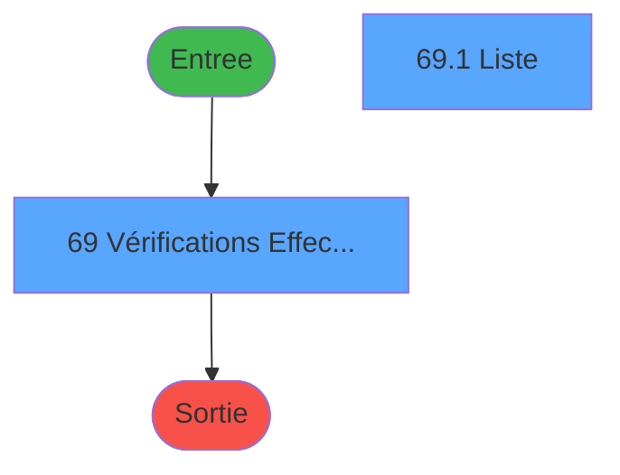
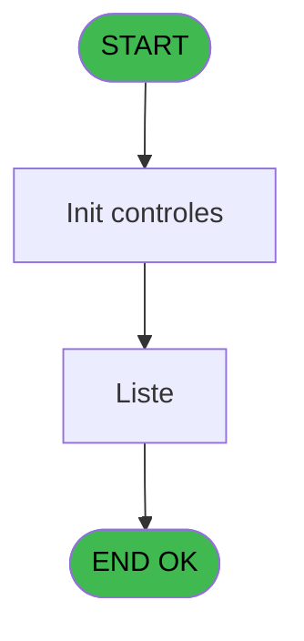

# PBG IDE 69 - Suivi des Effectifs

> **Analyse**: Phases 1-4 2026-02-03 09:06 -> 09:06 (21s) | Assemblage 09:06
> **Pipeline**: V7.2 Enrichi
> **Structure**: 4 onglets (Resume | Ecrans | Donnees | Connexions)

<!-- TAB:Resume -->

## 1. FICHE D'IDENTITE

| Attribut | Valeur |
|----------|--------|
| Projet | PBG |
| IDE Position | 69 |
| Nom Programme | Suivi des Effectifs |
| Fichier source | `Prg_69.xml` |
| Domaine metier | General |
| Taches | 2 (2 ecrans visibles) |
| Tables modifiees | 0 |
| Programmes appeles | 0 |
| :warning: Statut | **ORPHELIN_POTENTIEL** |

## 2. DESCRIPTION FONCTIONNELLE

**Suivi des Effectifs** assure la gestion complete de ce processus.

Le flux de traitement s'organise en **1 blocs fonctionnels** :

- **Traitement** (2 taches) : traitements metier divers

## 3. BLOCS FONCTIONNELS

### 3.1 Traitement (2 taches)

Traitements internes.

---

#### 69 - Vérifications Effectifs [[ECRAN]](#ecran-t2)

**Role** : Traitement : Vérifications Effectifs.
**Ecran** : 1562 x 312 DLU (MDI) | [Voir mockup](#ecran-t2)

---

#### 69.1 - Liste [[ECRAN]](#ecran-t38)

**Role** : Traitement : Liste.
**Ecran** : 770 x 184 DLU | [Voir mockup](#ecran-t38)

## 5. REGLES METIER

*(Aucune regle metier identifiee)*

## 6. CONTEXTE

- **Appele par**: (aucun)
- **Appelle**: 0 programmes | **Tables**: 0 (W:0 R:0 L:0) | **Taches**: 2 | **Expressions**: 72

<!-- TAB:Ecrans -->

## 8. ECRANS

### 8.1 Forms visibles (2 / 2)

| # | Position | Tache | Nom | Type | Largeur | Hauteur | Bloc |
|---|----------|-------|-----|------|---------|---------|------|
| 1 | 69.1 | 69 | Vérifications Effectifs | MDI | 1562 | 312 | Traitement |
| 2 | 69.1.1 | 69.1 | Liste | Type0 | 770 | 184 | Traitement |

### 8.2 Mockups Ecrans

---

#### 69.1 - Vérifications Effectifs
**Tache** : [69](#t2) | **Type** : MDI | **Dimensions** : 1562 x 312 DLU
**Bloc** : Traitement | **Titre IDE** : Vérifications Effectifs

<!-- FORM-DATA:
{
    "width":  1562,
    "vFactor":  8,
    "type":  "MDI",
    "hFactor":  8,
    "controls":  [
                     {
                         "x":  1,
                         "type":  "label",
                         "var":  "",
                         "y":  0,
                         "w":  1557,
                         "fmt":  "",
                         "name":  "",
                         "h":  22,
                         "color":  "",
                         "text":  "",
                         "parent":  null
                     },
                     {
                         "x":  0,
                         "type":  "label",
                         "var":  "",
                         "y":  287,
                         "w":  1555,
                         "fmt":  "",
                         "name":  "",
                         "h":  23,
                         "color":  "",
                         "text":  "",
                         "parent":  null
                     },
                     {
                         "x":  37,
                         "type":  "label",
                         "var":  "",
                         "y":  37,
                         "w":  130,
                         "fmt":  "",
                         "name":  "",
                         "h":  10,
                         "color":  "",
                         "text":  "Date de debut",
                         "parent":  101
                     },
                     {
                         "x":  9,
                         "type":  "label",
                         "var":  "",
                         "y":  24,
                         "w":  1540,
                         "fmt":  "",
                         "name":  "",
                         "h":  64,
                         "color":  "1",
                         "text":  "",
                         "parent":  null
                     },
                     {
                         "x":  636,
                         "type":  "label",
                         "var":  "",
                         "y":  37,
                         "w":  129,
                         "fmt":  "",
                         "name":  "",
                         "h":  10,
                         "color":  "",
                         "text":  "Date de fin",
                         "parent":  101
                     },
                     {
                         "x":  634,
                         "type":  "label",
                         "var":  "",
                         "y":  64,
                         "w":  129,
                         "fmt":  "",
                         "name":  "",
                         "h":  12,
                         "color":  "",
                         "text":  "Repas",
                         "parent":  101
                     },
                     {
                         "x":  37,
                         "type":  "label",
                         "var":  "",
                         "y":  64,
                         "w":  130,
                         "fmt":  "",
                         "name":  "",
                         "h":  12,
                         "color":  "",
                         "text":  "Qualité",
                         "parent":  101
                     },
                     {
                         "x":  9,
                         "type":  "button",
                         "var":  "",
                         "y":  291,
                         "w":  154,
                         "fmt":  "\u0026Quitter",
                         "name":  "bouton quitter",
                         "h":  18,
                         "color":  "",
                         "text":  "",
                         "parent":  42
                     },
                     {
                         "x":  9,
                         "type":  "edit",
                         "var":  "",
                         "y":  6,
                         "w":  394,
                         "fmt":  "20",
                         "name":  "",
                         "h":  10,
                         "color":  "",
                         "text":  "",
                         "parent":  1
                     },
                     {
                         "x":  1275,
                         "type":  "edit",
                         "var":  "",
                         "y":  6,
                         "w":  274,
                         "fmt":  "WWW DD MMM YYYYT",
                         "name":  "",
                         "h":  10,
                         "color":  "",
                         "text":  "",
                         "parent":  1
                     },
                     {
                         "x":  11,
                         "type":  "subform",
                         "var":  "",
                         "y":  96,
                         "w":  1540,
                         "fmt":  "",
                         "name":  "EFFECTIF",
                         "h":  184,
                         "color":  "",
                         "text":  "",
                         "parent":  null
                     },
                     {
                         "x":  195,
                         "type":  "edit",
                         "var":  "",
                         "y":  37,
                         "w":  179,
                         "fmt":  "DD/MM/YYYYZ",
                         "name":  "w0_Datedebut",
                         "h":  10,
                         "color":  "110",
                         "text":  "",
                         "parent":  101
                     },
                     {
                         "x":  400,
                         "type":  "button",
                         "var":  "",
                         "y":  37,
                         "w":  28,
                         "fmt":  "...",
                         "name":  "b_datedebut",
                         "h":  10,
                         "color":  "",
                         "text":  "",
                         "parent":  101
                     },
                     {
                         "x":  1382,
                         "type":  "button",
                         "var":  "",
                         "y":  37,
                         "w":  154,
                         "fmt":  "\u0026Rechercher",
                         "name":  "b_Rechercher",
                         "h":  18,
                         "color":  "",
                         "text":  "",
                         "parent":  101
                     },
                     {
                         "x":  803,
                         "type":  "edit",
                         "var":  "",
                         "y":  37,
                         "w":  179,
                         "fmt":  "DD/MM/YYYYZ",
                         "name":  "w0_Datefin",
                         "h":  10,
                         "color":  "110",
                         "text":  "",
                         "parent":  101
                     },
                     {
                         "x":  994,
                         "type":  "button",
                         "var":  "",
                         "y":  37,
                         "w":  28,
                         "fmt":  "...",
                         "name":  "b_datefin",
                         "h":  10,
                         "color":  "",
                         "text":  "",
                         "parent":  101
                     },
                     {
                         "x":  803,
                         "type":  "combobox",
                         "var":  "",
                         "y":  64,
                         "w":  219,
                         "fmt":  "",
                         "name":  "V.repas",
                         "h":  12,
                         "color":  "",
                         "text":  "DDE,DEJ,DIN",
                         "parent":  101
                     },
                     {
                         "x":  193,
                         "type":  "combobox",
                         "var":  "",
                         "y":  64,
                         "w":  365,
                         "fmt":  "",
                         "name":  "V.Qualite_effectif_mois",
                         "h":  12,
                         "color":  "",
                         "text":  "",
                         "parent":  101
                     },
                     {
                         "x":  1395,
                         "type":  "button",
                         "var":  "",
                         "y":  291,
                         "w":  154,
                         "fmt":  "\u0026Extraction",
                         "name":  "b_Extraction",
                         "h":  18,
                         "color":  "",
                         "text":  "",
                         "parent":  42
                     }
                 ],
    "taskId":  "69.1",
    "height":  312
}
-->

<strong>Champs : 6 champs</strong>

| Pos (x,y) | Nom | Variable | Type |
|-----------|-----|----------|------|
| 9,6 | 20 | - | edit |
| 1275,6 | WWW DD MMM YYYYT | - | edit |
| 195,37 | w0_Datedebut | - | edit |
| 803,37 | w0_Datefin | - | edit |
| 803,64 | V.repas | - | combobox |
| 193,64 | V.Qualite_effectif_mois | - | combobox |

<strong>Boutons : 5 boutons</strong>

| Bouton | Pos (x,y) | Action |
|--------|-----------|--------|
| Quitter | 9,291 | Quitte le programme |
| ... | 400,37 | Bouton fonctionnel |
| Rechercher | 1382,37 | Ouvre la selection |
| ... | 994,37 | Bouton fonctionnel |
| Extraction | 1395,291 | Bouton fonctionnel |

---

#### 69.1.1 - Liste
**Tache** : [69.1](#t38) | **Type** : Type0 | **Dimensions** : 770 x 184 DLU
**Bloc** : Traitement | **Titre IDE** : Liste

<!-- FORM-DATA:
{
    "width":  770,
    "vFactor":  8,
    "type":  "Type0",
    "hFactor":  4,
    "controls":  [
                     {
                         "x":  0,
                         "type":  "table",
                         "var":  "",
                         "name":  "",
                         "titleH":  12,
                         "color":  "",
                         "w":  768,
                         "y":  0,
                         "fmt":  "",
                         "parent":  null,
                         "text":  "",
                         "rowH":  13,
                         "h":  182,
                         "cols":  [
                                      {
                                          "title":  "nom",
                                          "layer":  1,
                                          "w":  144
                                      },
                                      {
                                          "title":  "prénom",
                                          "layer":  2,
                                          "w":  144
                                      },
                                      {
                                          "title":  "qualité",
                                          "layer":  3,
                                          "w":  42
                                      },
                                      {
                                          "title":  "qualité complementaire",
                                          "layer":  4,
                                          "w":  56
                                      },
                                      {
                                          "title":  "date début",
                                          "layer":  5,
                                          "w":  61
                                      },
                                      {
                                          "title":  "heure de début",
                                          "layer":  6,
                                          "w":  68
                                      },
                                      {
                                          "title":  "date de fin",
                                          "layer":  7,
                                          "w":  55
                                      },
                                      {
                                          "title":  "heure de fin ",
                                          "layer":  8,
                                          "w":  52
                                      },
                                      {
                                          "title":  "nb déjeuners",
                                          "layer":  9,
                                          "w":  63
                                      },
                                      {
                                          "title":  "nb dîners",
                                          "layer":  10,
                                          "w":  65
                                      }
                                  ],
                         "rows":  10
                     },
                     {
                         "x":  4,
                         "type":  "edit",
                         "var":  "",
                         "y":  15,
                         "w":  140,
                         "fmt":  "",
                         "name":  "NOM",
                         "h":  10,
                         "color":  "",
                         "text":  "",
                         "parent":  1
                     },
                     {
                         "x":  148,
                         "type":  "edit",
                         "var":  "",
                         "y":  15,
                         "w":  140,
                         "fmt":  "",
                         "name":  "PRENOM",
                         "h":  10,
                         "color":  "",
                         "text":  "",
                         "parent":  1
                     },
                     {
                         "x":  292,
                         "type":  "edit",
                         "var":  "",
                         "y":  15,
                         "w":  20,
                         "fmt":  "",
                         "name":  "eff_qualite",
                         "h":  10,
                         "color":  "",
                         "text":  "",
                         "parent":  1
                     },
                     {
                         "x":  334,
                         "type":  "edit",
                         "var":  "",
                         "y":  15,
                         "w":  52,
                         "fmt":  "",
                         "name":  "eff_qualite_complementaire",
                         "h":  10,
                         "color":  "",
                         "text":  "",
                         "parent":  1
                     },
                     {
                         "x":  390,
                         "type":  "edit",
                         "var":  "",
                         "y":  15,
                         "w":  48,
                         "fmt":  "",
                         "name":  "DATE_DEBUT",
                         "h":  10,
                         "color":  "",
                         "text":  "",
                         "parent":  1
                     },
                     {
                         "x":  451,
                         "type":  "edit",
                         "var":  "",
                         "y":  15,
                         "w":  14,
                         "fmt":  "",
                         "name":  "HEURE_DEBUT",
                         "h":  10,
                         "color":  "",
                         "text":  "",
                         "parent":  1
                     },
                     {
                         "x":  519,
                         "type":  "edit",
                         "var":  "",
                         "y":  15,
                         "w":  48,
                         "fmt":  "",
                         "name":  "DATE_FIN",
                         "h":  10,
                         "color":  "",
                         "text":  "",
                         "parent":  1
                     },
                     {
                         "x":  574,
                         "type":  "edit",
                         "var":  "",
                         "y":  15,
                         "w":  14,
                         "fmt":  "",
                         "name":  "HEURE_FIN",
                         "h":  10,
                         "color":  "",
                         "text":  "",
                         "parent":  1
                     },
                     {
                         "x":  626,
                         "type":  "edit",
                         "var":  "",
                         "y":  15,
                         "w":  56,
                         "fmt":  "",
                         "name":  "NB_DEJ",
                         "h":  10,
                         "color":  "",
                         "text":  "",
                         "parent":  1
                     },
                     {
                         "x":  689,
                         "type":  "edit",
                         "var":  "",
                         "y":  15,
                         "w":  56,
                         "fmt":  "",
                         "name":  "NB_DIN",
                         "h":  10,
                         "color":  "",
                         "text":  "",
                         "parent":  1
                     }
                 ],
    "taskId":  "69.1.1",
    "height":  184
}
-->

<strong>Champs : 10 champs</strong>

| Pos (x,y) | Nom | Variable | Type |
|-----------|-----|----------|------|
| 4,15 | NOM | - | edit |
| 148,15 | PRENOM | - | edit |
| 292,15 | eff_qualite | - | edit |
| 334,15 | eff_qualite_complementaire | - | edit |
| 390,15 | DATE_DEBUT | - | edit |
| 451,15 | HEURE_DEBUT | - | edit |
| 519,15 | DATE_FIN | - | edit |
| 574,15 | HEURE_FIN | - | edit |
| 626,15 | NB_DEJ | - | edit |
| 689,15 | NB_DIN | - | edit |

## 9. NAVIGATION

### 9.1 Enchainement des ecrans

**Detail par enchainement :**

| Depuis | Action | Vers | Retour |
|--------|--------|------|--------|

### 9.3 Structure hierarchique (2 taches)

| Position | Tache | Type | Dimensions | Bloc |
|----------|-------|------|------------|------|
| **69.1** | [**Vérifications Effectifs** (69)](#t2) [mockup](#ecran-t2) | MDI | 1562x312 | Traitement |
| 69.1.1 | [Liste (69.1)](#t38) [mockup](#ecran-t38) | - | 770x184 | |

### 9.4 Algorigramme

> **Legende**: Vert = START/END OK | Rouge = END KO | Bleu = Decisions
> *Algorigramme auto-genere. Utiliser `/algorigramme` pour une synthese metier detaillee.*

<!-- TAB:Donnees -->

## 10. TABLES

### Tables utilisees (0)

| ID | Nom | Description | Type | R | W | L | Usages |
|----|-----|-------------|------|---|---|---|--------|

### Colonnes par table (0 / 0 tables avec colonnes identifiees)

## 11. VARIABLES

### 11.1 Variables de session (9)

Variables persistantes pendant toute la session.

| Lettre | Nom | Type | Usage dans |
|--------|-----|------|-----------|
| B | V.Date de debut | Date | - |
| C | V.Date de fin | Date | - |
| E | V.Qualite | Unicode | - |
| F | V.Qualite_comp | Unicode | - |
| G | V.repas | Unicode | - |
| H | V.Libellé_repas | Unicode | - |
| J | V.Affiche ligne ? | Logical | - |
| K | V.Qualite_effectif_mois | Numeric | - |
| M | V.extraire la vue csv | Logical | - |

### 11.2 Autres (6)

Variables diverses.

| Lettre | Nom | Type | Usage dans |
|--------|-----|------|-----------|
| A | W1-Fin de Tache | Alpha | - |
| D | Bt.Date | Alpha | - |
| I | Bt_Rechercher | Alpha | - |
| L | Requete | Alpha | - |
| N | NB_DEJ | Numeric | 1x refs |
| O | NB_DIN | Numeric | 1x refs |

## 12. EXPRESSIONS

**72 / 72 expressions decodees (100%)**

### 12.1 Repartition par type

| Type | Expressions | Regles |
|------|-------------|--------|
| CONSTANTE | 17 | 0 |
| DATE | 3 | 0 |
| FORMAT | 2 | 0 |
| CONCATENATION | 2 | 0 |
| REFERENCE_VG | 1 | 0 |
| CONDITION | 22 | 0 |
| CAST_LOGIQUE | 3 | 0 |
| OTHER | 21 | 0 |
| STRING | 1 | 0 |

### 12.2 Expressions cles par type

#### CONSTANTE (17 expressions)

| Type | IDE | Expression | Regle |
|------|-----|------------|-------|
| CONSTANTE | 47 | `'IGR'` | - |
| CONSTANTE | 50 | `'IGR'` | - |
| CONSTANTE | 37 | `'IGR'` | - |
| CONSTANTE | 42 | `'GM'` | - |
| CONSTANTE | 61 | `'VRL'` | - |
| ... | | *+12 autres* | |

#### DATE (3 expressions)

| Type | IDE | Expression | Regle |
|------|-----|------------|-------|
| DATE | 4 | `DVal('31/01/2018','DD/MM/YYYY')` | - |
| DATE | 3 | `DVal('01/01/2018','DD/MM/YYYY')` | - |
| DATE | 2 | `Date()-1` | - |

#### FORMAT (2 expressions)

| Type | IDE | Expression | Regle |
|------|-----|------------|-------|
| FORMAT | 68 | `DStr([BU],'YYYYMMDD')` | - |
| FORMAT | 67 | `DStr([BT],'YYYYMMDD')` | - |

#### CONCATENATION (2 expressions)

| Type | IDE | Expression | Regle |
|------|-----|------------|-------|
| CONCATENATION | 70 | ` IF([BX]='DDE','','  AND A.eff_repas='&''''&Trim([BX])&'''')` | - |
| CONCATENATION | 71 | `DataViewToText(0,
'NOM,PRENOM,eff_qualite,eff_qualite_complementaire,DATE_DEBUT,HEURE_DEBUT,DATE_FIN,HEURE_FIN,NB_DEJ,NB_DIN',
'nom,prénom,qualité,qualité complementaire, date début,heure début, date fin,heure fin,nb dejeuners,nb dîners',
'%club_exportdata%'&'_Extraction_effectif_'&'_'&DStr ([BT],'YYYYMMDD')&'_'&DStr ([BU],'YYYYMMDD')&'.csv',';','"',0)` | - |

#### REFERENCE_VG (1 expressions)

| Type | IDE | Expression | Regle |
|------|-----|------------|-------|
| REFERENCE_VG | 1 | `VG21` | - |

#### CONDITION (22 expressions)

| Type | IDE | Expression | Regle |
|------|-----|------------|-------|
| CONDITION | 44 | `[DG]=12` | - |
| CONDITION | 46 | `[DG]=13` | - |
| CONDITION | 41 | `[DG]=11` | - |
| CONDITION | 36 | `[DG]=9` | - |
| CONDITION | 39 | `[DG]=10` | - |
| ... | | *+17 autres* | |

#### CAST_LOGIQUE (3 expressions)

| Type | IDE | Expression | Regle |
|------|-----|------------|-------|
| CAST_LOGIQUE | 66 | `'TRUE'LOG` | - |
| CAST_LOGIQUE | 13 | `'FALSE'LOG` | - |
| CAST_LOGIQUE | 11 | `'TRUE'LOG` | - |

#### OTHER (21 expressions)

| Type | IDE | Expression | Regle |
|------|-----|------------|-------|
| OTHER | 51 | `'''EXC'''` | - |
| OTHER | 53 | `'''ECH'''` | - |
| OTHER | 48 | `''' '',''HCMB'''` | - |
| OTHER | 43 | `'''IGP2'''` | - |
| OTHER | 45 | `'''IGP'''` | - |
| ... | | *+16 autres* | |

#### STRING (1 expressions)

| Type | IDE | Expression | Regle |
|------|-----|------------|-------|
| STRING | 69 | `Trim([BW])` | - |

### 12.3 Toutes les expressions (72)

Voir les 72 expressions

#### CONSTANTE (17)

| IDE | Expression Decodee |
|-----|-------------------|
| 5 | `'...'` |
| 6 | `'DDE'` |
| 10 | `'EFFECTIF'` |
| 14 | `'GO Artiste,
GO Eductour,
GO Médecin,
GO Stagiaire,
Accompagnant non salarié,
GM Prestataire Séjour,
GM Prestataire Repas,
Guides/GO Miss/GO transit/GO formation,
Fournisseurs V-Ship,
Fournisseurs/Surbook charters,
IGP Hors CDV,
IGP,
IGR,
Excursions,
GM / IGR Echange   repas chalets et inter villages,
GO,
GE,
VRL encaissées Hors Place,
VRL encaissées Sur place'` |
| 15 | `'1,
2,
3,
4,
5,
6,
7,
8,
9,
10,
11,
12,
13,
14,
15,
16,
17,
18,
19'` |
| 17 | `'GO'` |
| 28 | `'GM'` |
| 31 | `'IGR'` |
| 34 | `'GO'` |
| 37 | `'IGR'` |
| 42 | `'GM'` |
| 47 | `'IGR'` |
| 50 | `'IGR'` |
| 55 | `'GO'` |
| 58 | `'GO'` |
| 61 | `'VRL'` |
| 64 | `'GO'` |

#### DATE (3)

| IDE | Expression Decodee |
|-----|-------------------|
| 2 | `Date()-1` |
| 3 | `DVal('01/01/2018','DD/MM/YYYY')` |
| 4 | `DVal('31/01/2018','DD/MM/YYYY')` |

#### FORMAT (2)

| IDE | Expression Decodee |
|-----|-------------------|
| 67 | `DStr([BT],'YYYYMMDD')` |
| 68 | `DStr([BU],'YYYYMMDD')` |

#### CONCATENATION (2)

| IDE | Expression Decodee |
|-----|-------------------|
| 71 | `DataViewToText(0,
'NOM,PRENOM,eff_qualite,eff_qualite_complementaire,DATE_DEBUT,HEURE_DEBUT,DATE_FIN,HEURE_FIN,NB_DEJ,NB_DIN',
'nom,prénom,qualité,qualité complementaire, date début,heure début, date fin,heure fin,nb dejeuners,nb dîners',
'%club_exportdata%'&'_Extraction_effectif_'&'_'&DStr ([BT],'YYYYMMDD')&'_'&DStr ([BU],'YYYYMMDD')&'.csv',';','"',0)` |
| 70 | ` IF([BX]='DDE','','  AND A.eff_repas='&''''&Trim([BX])&'''')` |

#### REFERENCE_VG (1)

| IDE | Expression Decodee |
|-----|-------------------|
| 1 | `VG21` |

#### CONDITION (22)

| IDE | Expression Decodee |
|-----|-------------------|
| 7 | `[CX]=0` |
| 8 | `LastClicked()<>'b_datedebut'` |
| 9 | `[DG]=0` |
| 16 | `[DG]=1` |
| 19 | `[DG]=2` |
| 21 | `[DG]=3` |
| 23 | `[DG]=4` |
| 25 | `[DG]=5` |
| 27 | `[DG]=6` |
| 30 | `[DG]=7` |
| 33 | `[DG]=8` |
| 36 | `[DG]=9` |
| 39 | `[DG]=10` |
| 41 | `[DG]=11` |
| 44 | `[DG]=12` |
| 46 | `[DG]=13` |
| 49 | `[DG]=14` |
| 52 | `[DG]=15` |
| 54 | `[DG]=16` |
| 57 | `[DG]=17` |
| 60 | `[DG]=18` |
| 63 | `[DG]=19` |

#### CAST_LOGIQUE (3)

| IDE | Expression Decodee |
|-----|-------------------|
| 11 | `'TRUE'LOG` |
| 13 | `'FALSE'LOG` |
| 66 | `'TRUE'LOG` |

#### OTHER (21)

| IDE | Expression Decodee |
|-----|-------------------|
| 12 | `[CR]` |
| 18 | `'''ARTI'''` |
| 20 | `'''EDUC'''` |
| 22 | `'''DOCT'''` |
| 24 | `'''STAG'''` |
| 26 | `'''ANS'''` |
| 29 | `'''PRES'''` |
| 32 | `'''PRES'''` |
| 35 | `'''MISS'''` |
| 38 | `'''IGPV'',''OFFI'',''MARI'',''VSP'''` |
| 40 | `'''SRB'',''FOU'''` |
| 43 | `'''IGP2'''` |
| 45 | `'''IGP'''` |
| 48 | `''' '',''HCMB'''` |
| 51 | `'''EXC'''` |
| 53 | `'''ECH'''` |
| 56 | `'''LOC'',''VILL'''` |
| 59 | `'''GE'''` |
| 62 | `'''CMB'''` |
| 65 | `'''GE'',''LOC'',''VILL'',''VILL'''` |
| 72 | `{1,116}` |

#### STRING (1)

| IDE | Expression Decodee |
|-----|-------------------|
| 69 | `Trim([BW])` |

<!-- TAB:Connexions -->

## 13. GRAPHE D'APPELS

### 13.1 Chaine depuis Main (Callers)

**Chemin**: (pas de callers directs)

### 13.2 Callers

| IDE | Nom Programme | Nb Appels |
|-----|---------------|-----------|
| - | (aucun) | - |

### 13.3 Callees (programmes appeles)

### 13.4 Detail Callees avec contexte

| IDE | Nom Programme | Appels | Contexte |
|-----|---------------|--------|----------|
| - | (aucun) | - | - |

## 14. RECOMMANDATIONS MIGRATION

### 14.1 Profil du programme

| Metrique | Valeur | Impact migration |
|----------|--------|-----------------|
| Lignes de logique | 160 | Programme compact |
| Expressions | 72 | Logique moderee |
| Tables WRITE | 0 | Impact faible |
| Sous-programmes | 0 | Peu de dependances |
| Ecrans visibles | 2 | Quelques ecrans |
| Code desactive | 1.2% (2 / 160) | Code sain |
| Regles metier | 0 | Pas de regle identifiee |

### 14.2 Plan de migration par bloc

#### Traitement (2 taches: 2 ecrans, 0 traitement)

- **Strategie** : 2 composant(s) UI (Razor/React) avec formulaires et validation.
- Decomposer les taches en services unitaires testables.

### 14.3 Dependances critiques

| Dependance | Type | Appels | Impact |
|------------|------|--------|--------|

---
*Spec DETAILED generee par Pipeline V7.2 - 2026-02-03 09:07*
