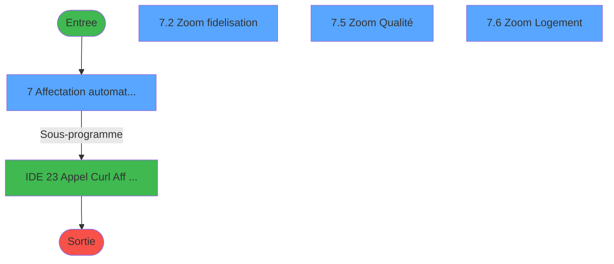
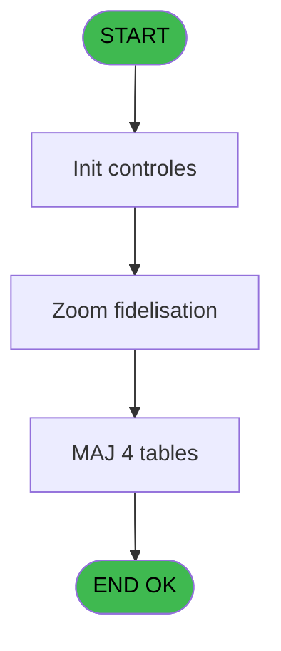
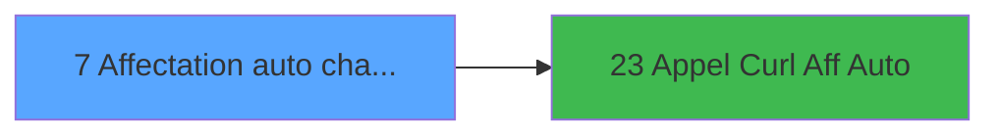

# PBG IDE 7 - Affectation auto chambres v2

> **Analyse**: Phases 1-4 2026-02-03 00:55 -> 00:56 (40s) | Assemblage 00:56
> **Pipeline**: V7.2 Enrichi
> **Structure**: 4 onglets (Resume | Ecrans | Donnees | Connexions)

<!-- TAB:Resume -->

## 1. FICHE D'IDENTITE

| Attribut | Valeur |
|----------|--------|
| Projet | PBG |
| IDE Position | 7 |
| Nom Programme | Affectation auto chambres v2 |
| Fichier source | `Prg_7.xml` |
| Domaine metier | General |
| Taches | 17 (4 ecrans visibles) |
| Tables modifiees | 4 |
| Programmes appeles | 1 |

## 2. DESCRIPTION FONCTIONNELLE

**Affectation auto chambres v2** assure la gestion complete de ce processus, accessible depuis [Affectation auto chambres lanc (IDE 5)](PBG-IDE-5.md).

Le flux de traitement s'organise en **5 blocs fonctionnels** :

- **Traitement** (7 taches) : traitements metier divers
- **Consultation** (6 taches) : ecrans de recherche, selection et consultation
- **Calcul** (2 taches) : calculs de montants, stocks ou compteurs
- **Validation** (1 tache) : controles et verifications de coherence
- **Initialisation** (1 tache) : reinitialisation d'etats et de variables de travail

**Donnees modifiees** : 4 tables en ecriture (code_logement____clo, tables_qualites__qua, import_recup_numchambre, tempo_liste_service).

Detail : phases du traitement

#### Phase 1 : Traitement (7 taches)

- **7** - Affectation automatique des ch **[[ECRAN]](#ecran-t6)**
- **7.3** - Liste Qualité
- **7.4** - Liste Qualité
- **7.9** - Desaffectation
- **7.10** - Desaffectation
- **7.11** - Desaffectation
- **7.12.1** - Lecture Log Header

Delegue a : [Appel Curl Aff Auto (IDE 23)](PBG-IDE-23.md)

#### Phase 2 : Initialisation (1 tache)

- **7.1** - Init Temp_type_Millesia

#### Phase 3 : Consultation (6 taches)

- **7.2** - Zoom fidelisation **[[ECRAN]](#ecran-t18)**
- **7.2.1** - Select/Deselect All
- **7.5** - Zoom Qualité **[[ECRAN]](#ecran-t32)**
- **7.5.1** - Select/Deselect All
- **7.6** - Zoom Logement **[[ECRAN]](#ecran-t36)**
- **7.6.1** - Select/Deselect All

#### Phase 4 : Calcul (2 taches)

- **7.7** - Calcul Liste Fid
- **7.8** - Calcul Liste Fid

#### Phase 5 : Validation (1 tache)

- **7.12** - Verif Fin Traitement **[[ECRAN]](#ecran-t50)**

#### Tables impactees

| Table | Operations | Role metier |
|-------|-----------|-------------|
| import_recup_numchambre | **W**/L (7 usages) |  |
| tempo_liste_service | **W** (4 usages) | Table temporaire ecran |
| code_logement____clo | **W** (1 usages) |  |
| tables_qualites__qua | **W** (1 usages) |  |

## 3. BLOCS FONCTIONNELS

### 3.1 Traitement (7 taches)

Traitements internes.

---

#### 7 - Affectation automatique des ch [[ECRAN]](#ecran-t6)

**Role** : Traitement : Affectation automatique des ch.
**Ecran** : 680 x 142 DLU | [Voir mockup](#ecran-t6)
**Delegue a** : [Appel Curl Aff Auto (IDE 23)](PBG-IDE-23.md)

---

#### 7.3 - Liste Qualité

**Role** : Traitement : Liste Qualité.
**Variables liees** : O (v.Liste Fid), P (v.Liste Qual), Q (v.Liste Log)
**Delegue a** : [Appel Curl Aff Auto (IDE 23)](PBG-IDE-23.md)

---

#### 7.4 - Liste Qualité

**Role** : Traitement : Liste Qualité.
**Variables liees** : O (v.Liste Fid), P (v.Liste Qual), Q (v.Liste Log)
**Delegue a** : [Appel Curl Aff Auto (IDE 23)](PBG-IDE-23.md)

---

#### 7.9 - Desaffectation

**Role** : Traitement : Desaffectation.
**Delegue a** : [Appel Curl Aff Auto (IDE 23)](PBG-IDE-23.md)

---

#### 7.10 - Desaffectation

**Role** : Traitement : Desaffectation.
**Delegue a** : [Appel Curl Aff Auto (IDE 23)](PBG-IDE-23.md)

---

#### 7.11 - Desaffectation

**Role** : Traitement : Desaffectation.
**Delegue a** : [Appel Curl Aff Auto (IDE 23)](PBG-IDE-23.md)

---

#### 7.12.1 - Lecture Log Header

**Role** : Traitement : Lecture Log Header.
**Variables liees** : T (v.Header id)
**Delegue a** : [Appel Curl Aff Auto (IDE 23)](PBG-IDE-23.md)

### 3.2 Initialisation (1 tache)

Reinitialisation d'etats et variables de travail.

---

#### 7.1 - Init Temp_type_Millesia

**Role** : Reinitialisation : Init Temp_type_Millesia.

### 3.3 Consultation (6 taches)

Ecrans de recherche et consultation.

---

#### 7.2 - Zoom fidelisation [[ECRAN]](#ecran-t18)

**Role** : Selection par l'operateur : Zoom fidelisation.
**Ecran** : 410 x 246 DLU | [Voir mockup](#ecran-t18)
**Variables liees** : D (v.Nombre Fidelisation), E (b.Fidelisation)

---

#### 7.2.1 - Select/Deselect All

**Role** : Traitement : Select/Deselect All.

---

#### 7.5 - Zoom Qualité [[ECRAN]](#ecran-t32)

**Role** : Selection par l'operateur : Zoom Qualité.
**Ecran** : 410 x 246 DLU | [Voir mockup](#ecran-t32)

---

#### 7.5.1 - Select/Deselect All

**Role** : Traitement : Select/Deselect All.

---

#### 7.6 - Zoom Logement [[ECRAN]](#ecran-t36)

**Role** : Selection par l'operateur : Zoom Logement.
**Ecran** : 549 x 246 DLU | [Voir mockup](#ecran-t36)
**Variables liees** : H (v.Nombre Code Logement), I (b.Code Logement)

---

#### 7.6.1 - Select/Deselect All

**Role** : Traitement : Select/Deselect All.

### 3.4 Calcul (2 taches)

Calculs metier : montants, stocks, compteurs.

---

#### 7.7 - Calcul Liste Fid

**Role** : Calcul : Calcul Liste Fid.
**Variables liees** : O (v.Liste Fid), P (v.Liste Qual), Q (v.Liste Log)

---

#### 7.8 - Calcul Liste Fid

**Role** : Calcul : Calcul Liste Fid.
**Variables liees** : O (v.Liste Fid), P (v.Liste Qual), Q (v.Liste Log)

### 3.5 Validation (1 tache)

Controles de coherence : 1 tache verifie les donnees et conditions.

---

#### 7.12 - Verif Fin Traitement [[ECRAN]](#ecran-t50)

**Role** : Verification : Verif Fin Traitement.
**Ecran** : 262 x 62 DLU | [Voir mockup](#ecran-t50)
**Variables liees** : A (V.Traitement deja lance ?)

## 5. REGLES METIER

*(Aucune regle metier identifiee)*

## 6. CONTEXTE

- **Appele par**: [Affectation auto chambres lanc (IDE 5)](PBG-IDE-5.md)
- **Appelle**: 1 programmes | **Tables**: 6 (W:4 R:0 L:3) | **Taches**: 17 | **Expressions**: 29

<!-- TAB:Ecrans -->

## 8. ECRANS

### 8.1 Forms visibles (4 / 17)

| # | Position | Tache | Nom | Type | Largeur | Hauteur | Bloc |
|---|----------|-------|-----|------|---------|---------|------|
| 1 | 7.1 | 7 | Affectation automatique des ch | Type0 | 680 | 142 | Traitement |
| 2 | 7.1.4 | 7.2 | Zoom fidelisation | Type0 | 410 | 246 | Consultation |
| 3 | 7.1.5 | 7.5 | Zoom Qualité | Type0 | 410 | 246 | Consultation |
| 4 | 7.1.6 | 7.6 | Zoom Logement | Type0 | 549 | 246 | Consultation |

### 8.2 Mockups Ecrans

---

#### 7.1 - Affectation automatique des ch
**Tache** : [7](#t6) | **Type** : Type0 | **Dimensions** : 680 x 142 DLU
**Bloc** : Traitement | **Titre IDE** : Affectation automatique des ch

<!-- FORM-DATA:
{
    "width":  680,
    "vFactor":  8,
    "type":  "Type0",
    "hFactor":  8,
    "controls":  [
                     {
                         "x":  13,
                         "type":  "label",
                         "var":  "",
                         "y":  3,
                         "w":  645,
                         "fmt":  "",
                         "name":  "",
                         "h":  22,
                         "color":  "",
                         "text":  "",
                         "parent":  null
                     },
                     {
                         "x":  19,
                         "type":  "label",
                         "var":  "",
                         "y":  114,
                         "w":  646,
                         "fmt":  "",
                         "name":  "",
                         "h":  23,
                         "color":  "",
                         "text":  "",
                         "parent":  null
                     },
                     {
                         "x":  72,
                         "type":  "label",
                         "var":  "",
                         "y":  40,
                         "w":  146,
                         "fmt":  "",
                         "name":  "",
                         "h":  12,
                         "color":  "",
                         "text":  "Date d\u0027arrivée du :",
                         "parent":  null
                     },
                     {
                         "x":  70,
                         "type":  "label",
                         "var":  "",
                         "y":  57,
                         "w":  146,
                         "fmt":  "",
                         "name":  "",
                         "h":  12,
                         "color":  "",
                         "text":  "Fidélisation :",
                         "parent":  null
                     },
                     {
                         "x":  70,
                         "type":  "label",
                         "var":  "",
                         "y":  74,
                         "w":  146,
                         "fmt":  "",
                         "name":  "",
                         "h":  12,
                         "color":  "",
                         "text":  "Qualité GM / GO :",
                         "parent":  null
                     },
                     {
                         "x":  72,
                         "type":  "label",
                         "var":  "",
                         "y":  91,
                         "w":  146,
                         "fmt":  "",
                         "name":  "",
                         "h":  12,
                         "color":  "",
                         "text":  "Code logement :",
                         "parent":  null
                     },
                     {
                         "x":  406,
                         "type":  "label",
                         "var":  "",
                         "y":  40,
                         "w":  34,
                         "fmt":  "",
                         "name":  "",
                         "h":  12,
                         "color":  "",
                         "text":  "au :",
                         "parent":  null
                     },
                     {
                         "x":  19,
                         "type":  "edit",
                         "var":  "",
                         "y":  9,
                         "w":  394,
                         "fmt":  "20",
                         "name":  "VG.USER",
                         "h":  10,
                         "color":  "",
                         "text":  "",
                         "parent":  4
                     },
                     {
                         "x":  375,
                         "type":  "edit",
                         "var":  "",
                         "y":  9,
                         "w":  274,
                         "fmt":  "WWW DD MMM YYYYT",
                         "name":  "",
                         "h":  10,
                         "color":  "",
                         "text":  "",
                         "parent":  4
                     },
                     {
                         "x":  218,
                         "type":  "edit",
                         "var":  "",
                         "y":  40,
                         "w":  136,
                         "fmt":  "",
                         "name":  "v.Date début",
                         "h":  12,
                         "color":  "6",
                         "text":  "",
                         "parent":  null
                     },
                     {
                         "x":  361,
                         "type":  "button",
                         "var":  "",
                         "y":  40,
                         "w":  32,
                         "fmt":  "",
                         "name":  "Bt_cal_deb",
                         "h":  12,
                         "color":  "",
                         "text":  "",
                         "parent":  null
                     },
                     {
                         "x":  446,
                         "type":  "edit",
                         "var":  "",
                         "y":  40,
                         "w":  136,
                         "fmt":  "",
                         "name":  "v.Date fin_0001",
                         "h":  12,
                         "color":  "6",
                         "text":  "",
                         "parent":  null
                     },
                     {
                         "x":  589,
                         "type":  "button",
                         "var":  "",
                         "y":  40,
                         "w":  32,
                         "fmt":  "",
                         "name":  "Bt_cal_fin",
                         "h":  12,
                         "color":  "",
                         "text":  "",
                         "parent":  null
                     },
                     {
                         "x":  218,
                         "type":  "button",
                         "var":  "",
                         "y":  56,
                         "w":  252,
                         "fmt":  "",
                         "name":  "b.Fidelisation",
                         "h":  14,
                         "color":  "",
                         "text":  "",
                         "parent":  null
                     },
                     {
                         "x":  501,
                         "type":  "checkbox",
                         "var":  "",
                         "y":  59,
                         "w":  162,
                         "fmt":  "",
                         "name":  "A supprimer?",
                         "h":  12,
                         "color":  "",
                         "text":  "Couleur Fidelité?",
                         "parent":  null
                     },
                     {
                         "x":  218,
                         "type":  "button",
                         "var":  "",
                         "y":  72,
                         "w":  252,
                         "fmt":  "",
                         "name":  "b.Qualite GM/GO",
                         "h":  14,
                         "color":  "",
                         "text":  "",
                         "parent":  null
                     },
                     {
                         "x":  218,
                         "type":  "button",
                         "var":  "",
                         "y":  89,
                         "w":  252,
                         "fmt":  "",
                         "name":  "b.Code Logement",
                         "h":  14,
                         "color":  "",
                         "text":  "",
                         "parent":  null
                     },
                     {
                         "x":  26,
                         "type":  "button",
                         "var":  "",
                         "y":  117,
                         "w":  154,
                         "fmt":  "\u0026Quitter",
                         "name":  "bouton quitter",
                         "h":  18,
                         "color":  "",
                         "text":  "",
                         "parent":  7
                     },
                     {
                         "x":  344,
                         "type":  "button",
                         "var":  "",
                         "y":  117,
                         "w":  154,
                         "fmt":  "\u0026Desaffecter",
                         "name":  "Bt Desaffecter",
                         "h":  18,
                         "color":  "",
                         "text":  "",
                         "parent":  7
                     },
                     {
                         "x":  502,
                         "type":  "button",
                         "var":  "",
                         "y":  117,
                         "w":  154,
                         "fmt":  "\u0026\\Affecter",
                         "name":  "Bt Affecter",
                         "h":  18,
                         "color":  "",
                         "text":  "",
                         "parent":  7
                     }
                 ],
    "taskId":  "7.1",
    "height":  142
}
-->

<strong>Champs : 5 champs</strong>

| Pos (x,y) | Nom | Variable | Type |
|-----------|-----|----------|------|
| 19,9 | VG.USER | - | edit |
| 375,9 | WWW DD MMM YYYYT | - | edit |
| 218,40 | v.Date début | - | edit |
| 446,40 | v.Date fin_0001 | - | edit |
| 501,59 | A supprimer? | - | checkbox |

<strong>Boutons : 8 boutons</strong>

| Bouton | Pos (x,y) | Action |
|--------|-----------|--------|
| Bt_cal_deb | 361,40 | Bouton fonctionnel |
| Bt_cal_fin | 589,40 | Bouton fonctionnel |
| b.Fidelisation | 218,56 | Bouton fonctionnel |
| b.Qualite GM/GO | 218,72 | Bouton fonctionnel |
| b.Code Logement | 218,89 | Bouton fonctionnel |
| Quitter | 26,117 | Quitte le programme |
| Desaffecter | 344,117 | Bouton fonctionnel |
| \Affecter | 502,117 | Bouton fonctionnel |

---

#### 7.1.4 - Zoom fidelisation
**Tache** : [7.2](#t18) | **Type** : Type0 | **Dimensions** : 410 x 246 DLU
**Bloc** : Consultation | **Titre IDE** : Zoom fidelisation

<!-- FORM-DATA:
{
    "width":  410,
    "vFactor":  8,
    "type":  "Type0",
    "hFactor":  8,
    "controls":  [
                     {
                         "x":  11,
                         "type":  "table",
                         "var":  "",
                         "name":  "",
                         "titleH":  12,
                         "color":  "6",
                         "w":  386,
                         "y":  1,
                         "fmt":  "",
                         "parent":  null,
                         "text":  "",
                         "rowH":  13,
                         "h":  217,
                         "cols":  [
                                      {
                                          "title":  "",
                                          "layer":  1,
                                          "w":  353
                                      }
                                  ],
                         "rows":  1
                     },
                     {
                         "x":  5,
                         "type":  "label",
                         "var":  "",
                         "y":  224,
                         "w":  398,
                         "fmt":  "",
                         "name":  "",
                         "h":  20,
                         "color":  "",
                         "text":  "",
                         "parent":  null
                     },
                     {
                         "x":  16,
                         "type":  "edit",
                         "var":  "",
                         "y":  16,
                         "w":  288,
                         "fmt":  "",
                         "name":  "libelle",
                         "h":  8,
                         "color":  "196",
                         "text":  "",
                         "parent":  8
                     },
                     {
                         "x":  330,
                         "type":  "checkbox",
                         "var":  "",
                         "y":  16,
                         "w":  21,
                         "fmt":  "",
                         "name":  "check",
                         "h":  10,
                         "color":  "196",
                         "text":  "",
                         "parent":  8
                     },
                     {
                         "x":  340,
                         "type":  "button",
                         "var":  "",
                         "y":  1,
                         "w":  29,
                         "fmt":  "þ",
                         "name":  "Bouton_All/None",
                         "h":  13,
                         "color":  "",
                         "text":  "",
                         "parent":  null
                     },
                     {
                         "x":  134,
                         "type":  "button",
                         "var":  "",
                         "y":  227,
                         "w":  144,
                         "fmt":  "\u0026Quitter",
                         "name":  "",
                         "h":  14,
                         "color":  "",
                         "text":  "",
                         "parent":  10
                     }
                 ],
    "taskId":  "7.1.4",
    "height":  246
}
-->

<strong>Champs : 2 champs</strong>

| Pos (x,y) | Nom | Variable | Type |
|-----------|-----|----------|------|
| 16,16 | libelle | - | edit |
| 330,16 | check | - | checkbox |

<strong>Boutons : 2 boutons</strong>

| Bouton | Pos (x,y) | Action |
|--------|-----------|--------|
| þ | 340,1 | Bouton fonctionnel |
| Quitter | 134,227 | Quitte le programme |

---

#### 7.1.5 - Zoom Qualité
**Tache** : [7.5](#t32) | **Type** : Type0 | **Dimensions** : 410 x 246 DLU
**Bloc** : Consultation | **Titre IDE** : Zoom Qualité

<!-- FORM-DATA:
{
    "width":  410,
    "vFactor":  8,
    "type":  "Type0",
    "hFactor":  8,
    "controls":  [
                     {
                         "x":  11,
                         "type":  "table",
                         "var":  "",
                         "name":  "",
                         "titleH":  12,
                         "color":  "6",
                         "w":  386,
                         "y":  1,
                         "fmt":  "",
                         "parent":  null,
                         "text":  "",
                         "rowH":  13,
                         "h":  217,
                         "cols":  [
                                      {
                                          "title":  "",
                                          "layer":  1,
                                          "w":  353
                                      }
                                  ],
                         "rows":  1
                     },
                     {
                         "x":  5,
                         "type":  "label",
                         "var":  "",
                         "y":  224,
                         "w":  398,
                         "fmt":  "",
                         "name":  "",
                         "h":  20,
                         "color":  "",
                         "text":  "",
                         "parent":  null
                     },
                     {
                         "x":  16,
                         "type":  "edit",
                         "var":  "",
                         "y":  16,
                         "w":  288,
                         "fmt":  "",
                         "name":  "libelle",
                         "h":  8,
                         "color":  "196",
                         "text":  "",
                         "parent":  8
                     },
                     {
                         "x":  330,
                         "type":  "checkbox",
                         "var":  "",
                         "y":  16,
                         "w":  21,
                         "fmt":  "",
                         "name":  "check",
                         "h":  10,
                         "color":  "196",
                         "text":  "",
                         "parent":  8
                     },
                     {
                         "x":  340,
                         "type":  "button",
                         "var":  "",
                         "y":  1,
                         "w":  29,
                         "fmt":  "þ",
                         "name":  "Bouton_All/None",
                         "h":  13,
                         "color":  "",
                         "text":  "",
                         "parent":  null
                     },
                     {
                         "x":  134,
                         "type":  "button",
                         "var":  "",
                         "y":  227,
                         "w":  144,
                         "fmt":  "\u0026Quitter",
                         "name":  "",
                         "h":  14,
                         "color":  "",
                         "text":  "",
                         "parent":  10
                     }
                 ],
    "taskId":  "7.1.5",
    "height":  246
}
-->

<strong>Champs : 2 champs</strong>

| Pos (x,y) | Nom | Variable | Type |
|-----------|-----|----------|------|
| 16,16 | libelle | - | edit |
| 330,16 | check | - | checkbox |

<strong>Boutons : 2 boutons</strong>

| Bouton | Pos (x,y) | Action |
|--------|-----------|--------|
| þ | 340,1 | Bouton fonctionnel |
| Quitter | 134,227 | Quitte le programme |

---

#### 7.1.6 - Zoom Logement
**Tache** : [7.6](#t36) | **Type** : Type0 | **Dimensions** : 549 x 246 DLU
**Bloc** : Consultation | **Titre IDE** : Zoom Logement

<!-- FORM-DATA:
{
    "width":  549,
    "vFactor":  8,
    "type":  "Type0",
    "hFactor":  8,
    "controls":  [
                     {
                         "x":  11,
                         "type":  "table",
                         "var":  "",
                         "name":  "",
                         "titleH":  12,
                         "color":  "6",
                         "w":  528,
                         "y":  1,
                         "fmt":  "",
                         "parent":  null,
                         "text":  "",
                         "rowH":  13,
                         "h":  217,
                         "cols":  [
                                      {
                                          "title":  "",
                                          "layer":  1,
                                          "w":  493
                                      }
                                  ],
                         "rows":  1
                     },
                     {
                         "x":  5,
                         "type":  "label",
                         "var":  "",
                         "y":  224,
                         "w":  538,
                         "fmt":  "",
                         "name":  "",
                         "h":  20,
                         "color":  "",
                         "text":  "",
                         "parent":  null
                     },
                     {
                         "x":  16,
                         "type":  "edit",
                         "var":  "",
                         "y":  16,
                         "w":  438,
                         "fmt":  "",
                         "name":  "libelle",
                         "h":  8,
                         "color":  "196",
                         "text":  "",
                         "parent":  8
                     },
                     {
                         "x":  466,
                         "type":  "checkbox",
                         "var":  "",
                         "y":  16,
                         "w":  21,
                         "fmt":  "",
                         "name":  "check",
                         "h":  10,
                         "color":  "196",
                         "text":  "",
                         "parent":  8
                     },
                     {
                         "x":  476,
                         "type":  "button",
                         "var":  "",
                         "y":  1,
                         "w":  29,
                         "fmt":  "þ",
                         "name":  "Bouton_All/None",
                         "h":  13,
                         "color":  "",
                         "text":  "",
                         "parent":  null
                     },
                     {
                         "x":  134,
                         "type":  "button",
                         "var":  "",
                         "y":  227,
                         "w":  144,
                         "fmt":  "\u0026Quitter",
                         "name":  "",
                         "h":  14,
                         "color":  "",
                         "text":  "",
                         "parent":  10
                     }
                 ],
    "taskId":  "7.1.6",
    "height":  246
}
-->

<strong>Champs : 2 champs</strong>

| Pos (x,y) | Nom | Variable | Type |
|-----------|-----|----------|------|
| 16,16 | libelle | - | edit |
| 466,16 | check | - | checkbox |

<strong>Boutons : 2 boutons</strong>

| Bouton | Pos (x,y) | Action |
|--------|-----------|--------|
| þ | 476,1 | Bouton fonctionnel |
| Quitter | 134,227 | Quitte le programme |

## 9. NAVIGATION

### 9.1 Enchainement des ecrans

**Detail par enchainement :**

| Depuis | Action | Vers | Retour |
|--------|--------|------|--------|
| Affectation automatique des ch | Sous-programme | [Appel Curl Aff Auto (IDE 23)](PBG-IDE-23.md) | Retour ecran |

### 9.3 Structure hierarchique (17 taches)

| Position | Tache | Type | Dimensions | Bloc |
|----------|-------|------|------------|------|
| **7.1** | [**Affectation automatique des ch** (7)](#t6) [mockup](#ecran-t6) | - | 680x142 | Traitement |
| 7.1.1 | [Liste Qualité (7.3)](#t26) | - | - | |
| 7.1.2 | [Liste Qualité (7.4)](#t29) | - | - | |
| 7.1.3 | [Desaffectation (7.9)](#t43) | - | - | |
| 7.1.4 | [Desaffectation (7.10)](#t46) | - | - | |
| 7.1.5 | [Desaffectation (7.11)](#t49) | - | - | |
| 7.1.6 | [Lecture Log Header (7.12.1)](#t51) | - | - | |
| **7.2** | [**Init Temp_type_Millesia** (7.1)](#t17) | - | - | Initialisation |
| **7.3** | [**Zoom fidelisation** (7.2)](#t18) [mockup](#ecran-t18) | - | 410x246 | Consultation |
| 7.3.1 | [Select/Deselect All (7.2.1)](#t19) | - | - | |
| 7.3.2 | [Zoom Qualité (7.5)](#t32) [mockup](#ecran-t32) | - | 410x246 | |
| 7.3.3 | [Select/Deselect All (7.5.1)](#t33) | - | - | |
| 7.3.4 | [Zoom Logement (7.6)](#t36) [mockup](#ecran-t36) | - | 549x246 | |
| 7.3.5 | [Select/Deselect All (7.6.1)](#t37) | - | - | |
| **7.4** | [**Calcul Liste Fid** (7.7)](#t38) | - | - | Calcul |
| 7.4.1 | [Calcul Liste Fid (7.8)](#t41) | - | - | |
| **7.5** | [**Verif Fin Traitement** (7.12)](#t50) [mockup](#ecran-t50) | - | 262x62 | Validation |

### 9.4 Algorigramme

> **Legende**: Vert = START/END OK | Rouge = END KO | Bleu = Decisions
> *Algorigramme auto-genere. Utiliser `/algorigramme` pour une synthese metier detaillee.*

<!-- TAB:Donnees -->

## 10. TABLES

### Tables utilisees (6)

| ID | Nom | Description | Type | R | W | L | Usages |
|----|-----|-------------|------|---|---|---|--------|
| 108 | code_logement____clo |  | DB |   | **W** |   | 1 |
| 120 | tables_qualites__qua |  | DB |   | **W** |   | 1 |
| 540 | import_recup_numchambre |  | DB |   | **W** | L | 7 |
| 602 | tempo_liste_service | Table temporaire ecran | TMP |   | **W** |   | 4 |
| 738 | pv_selling_unit |  | DB |   |   | L | 1 |
| 846 | stat_lieu_vente | Statistiques point de vente | TMP |   |   | L | 2 |

### Colonnes par table (3 / 4 tables avec colonnes identifiees)

Table 108 - code_logement____clo (**W**) - 1 usages

| Lettre | Variable | Acces | Type |
|--------|----------|-------|------|
| A | P.i.Code Liste | W | Unicode |
| H | v.Nombre Code Logement | W | Numeric |
| I | b.Code Logement | W | Unicode |

Table 120 - tables_qualites__qua (**W**) - 1 usages

*Table utilisee uniquement en Link ou aucune colonne Real identifiee dans le DataView.*

Table 540 - import_recup_numchambre (**W**/L) - 7 usages

| Lettre | Variable | Acces | Type |
|--------|----------|-------|------|
| A | v.cocher? | W | Logical |
| B | P.o.Liste Resultat | W | Unicode |

Table 602 - tempo_liste_service (**W**) - 4 usages

| Lettre | Variable | Acces | Type |
|--------|----------|-------|------|
| A | v.Color | W | Numeric |
| B | v.cocher? | W | Logical |

## 11. VARIABLES

### 11.1 Variables de session (14)

Variables persistantes pendant toute la session.

| Lettre | Nom | Type | Usage dans |
|--------|-----|------|-----------|
| A | V.Traitement deja lance ? | Logical | - |
| B | v.Date début | Date | 1x session |
| C | v.Date fin | Date | - |
| D | v.Nombre Fidelisation | Numeric | - |
| F | v.Nombre Qualite | Numeric | - |
| H | v.Nombre Code Logement | Numeric | - |
| O | v.Liste Fid | Unicode | - |
| P | v.Liste Qual | Unicode | - |
| Q | v.Liste Log | Unicode | - |
| R | v.Body | Unicode | - |
| S | v.Success | Logical | - |
| T | v.Header id | Numeric | - |
| U | v.Nb Personnes Totales | Numeric | - |
| V | v.Nb Personnes Affectées | Numeric | - |

### 11.2 Autres (10)

Variables diverses.

| Lettre | Nom | Type | Usage dans |
|--------|-----|------|-----------|
| E | b.Fidelisation | Unicode | - |
| G | b.Qualite GM/GO | Unicode | - |
| I | b.Code Logement | Unicode | - |
| J | Bt.Quitter | Alpha | 4x refs |
| K | Bt.Lancement | Alpha | 2x refs |
| L | Bt.Cal_deb | Alpha | - |
| M | Bt.Cal_fin | Alpha | - |
| N | A supprimer? | Logical | - |
| W | CHG_REASON_v.Date début | Numeric | - |
| X | CHG_PRV_v.Date début | Date | - |

Toutes les 24 variables (liste complete)

| Cat | Lettre | Nom Variable | Type |
|-----|--------|--------------|------|
| V. | **A** | V.Traitement deja lance ? | Logical |
| V. | **B** | v.Date début | Date |
| V. | **C** | v.Date fin | Date |
| V. | **D** | v.Nombre Fidelisation | Numeric |
| V. | **F** | v.Nombre Qualite | Numeric |
| V. | **H** | v.Nombre Code Logement | Numeric |
| V. | **O** | v.Liste Fid | Unicode |
| V. | **P** | v.Liste Qual | Unicode |
| V. | **Q** | v.Liste Log | Unicode |
| V. | **R** | v.Body | Unicode |
| V. | **S** | v.Success | Logical |
| V. | **T** | v.Header id | Numeric |
| V. | **U** | v.Nb Personnes Totales | Numeric |
| V. | **V** | v.Nb Personnes Affectées | Numeric |
| Autre | **E** | b.Fidelisation | Unicode |
| Autre | **G** | b.Qualite GM/GO | Unicode |
| Autre | **I** | b.Code Logement | Unicode |
| Autre | **J** | Bt.Quitter | Alpha |
| Autre | **K** | Bt.Lancement | Alpha |
| Autre | **L** | Bt.Cal_deb | Alpha |
| Autre | **M** | Bt.Cal_fin | Alpha |
| Autre | **N** | A supprimer? | Logical |
| Autre | **W** | CHG_REASON_v.Date début | Numeric |
| Autre | **X** | CHG_PRV_v.Date début | Date |

## 12. EXPRESSIONS

**29 / 29 expressions decodees (100%)**

### 12.1 Repartition par type

| Type | Expressions | Regles |
|------|-------------|--------|
| CONSTANTE | 4 | 0 |
| DATE | 2 | 0 |
| CONDITION | 6 | 0 |
| FORMAT | 3 | 0 |
| OTHER | 10 | 0 |
| CAST_LOGIQUE | 1 | 0 |
| CONCATENATION | 3 | 0 |

### 12.2 Expressions cles par type

#### CONSTANTE (4 expressions)

| Type | IDE | Expression | Regle |
|------|-----|------------|-------|
| CONSTANTE | 14 | `'LOGE'` | - |
| CONSTANTE | 15 | `'{"beginDate": "@1@ 00:00:00.0","dateRange": @2@ @3@ @4@ @5@ }'` | - |
| CONSTANTE | 6 | `'%club_images%CALENDR.BMP'` | - |
| CONSTANTE | 13 | `'QUAL'` | - |

#### DATE (2 expressions)

| Type | IDE | Expression | Regle |
|------|-----|------------|-------|
| DATE | 3 | `Date()` | - |
| DATE | 1 | `Date()` | - |

#### CONDITION (6 expressions)

| Type | IDE | Expression | Regle |
|------|-----|------------|-------|
| CONDITION | 21 | `LastClicked()='Bt Desaffecter'` | - |
| CONDITION | 22 | `[BE]<>0` | - |
| CONDITION | 23 | `[BE]=0` | - |
| CONDITION | 7 | `Bt.Quitter [J]<Date()` | - |
| CONDITION | 4 | `Bt.Lancement [K]<Bt.Quitter [J]` | - |
| ... | | *+1 autres* | |

#### FORMAT (3 expressions)

| Type | IDE | Expression | Regle |
|------|-----|------------|-------|
| FORMAT | 24 | `Str([BD],'6')` | - |
| FORMAT | 18 | `RepStr([BB],'"','\"')` | - |
| FORMAT | 16 | `StrBuild ('{"beginDate": "@1@ 00:00:00.0","dateRange": @2@ @3@ @4@ @5@ }',DStr(Bt.Quitter [J],'YYYY-MM-DD'),Trim(Str(Bt.Lancement [K]-Bt.Quitter [J]+1,'4')),IF(Trim([AY])<>'',',"loyaltyCode": ['&Trim([AY])&']',''),IF(Trim([AZ])<>'',', "gmQuality": ['&Trim([AZ])&']',''),IF(Trim([BA])<>'',', "codeAssigned": ['&Trim([BA])&']',''))` | - |

#### OTHER (10 expressions)

| Type | IDE | Expression | Regle |
|------|-----|------------|-------|
| OTHER | 26 | `SetCrsr(1)` | - |
| OTHER | 25 | `SetCrsr(2)` | - |
| OTHER | 27 | `Delay(30)` | - |
| OTHER | 29 | `v.Date début [B]` | - |
| OTHER | 28 | `GetParam ('CODELANGUE')` | - |
| ... | | *+5 autres* | |

#### CAST_LOGIQUE (1 expressions)

| Type | IDE | Expression | Regle |
|------|-----|------------|-------|
| CAST_LOGIQUE | 17 | `'FALSE'LOG` | - |

#### CONCATENATION (3 expressions)

| Type | IDE | Expression | Regle |
|------|-----|------------|-------|
| CONCATENATION | 12 | `MlsTrans ('Logement')&' ('&Trim (Str ([AU],'3'))&')'` | - |
| CONCATENATION | 11 | `MlsTrans ('Qualité')&' ('&Trim (Str ([AT],'3'))&')'` | - |
| CONCATENATION | 10 | `MlsTrans ('Fidelisation')&' ('&Trim (Str ([AS],'3'))&')'` | - |

### 12.3 Toutes les expressions (29)

Voir les 29 expressions

#### CONSTANTE (4)

| IDE | Expression Decodee |
|-----|-------------------|
| 6 | `'%club_images%CALENDR.BMP'` |
| 13 | `'QUAL'` |
| 14 | `'LOGE'` |
| 15 | `'{"beginDate": "@1@ 00:00:00.0","dateRange": @2@ @3@ @4@ @5@ }'` |

#### DATE (2)

| IDE | Expression Decodee |
|-----|-------------------|
| 1 | `Date()` |
| 3 | `Date()` |

#### CONDITION (6)

| IDE | Expression Decodee |
|-----|-------------------|
| 7 | `Bt.Quitter [J]<Date()` |
| 4 | `Bt.Lancement [K]<Bt.Quitter [J]` |
| 20 | `LastClicked ()='Bt Affecter'` |
| 21 | `LastClicked()='Bt Desaffecter'` |
| 22 | `[BE]<>0` |
| 23 | `[BE]=0` |

#### FORMAT (3)

| IDE | Expression Decodee |
|-----|-------------------|
| 16 | `StrBuild ('{"beginDate": "@1@ 00:00:00.0","dateRange": @2@ @3@ @4@ @5@ }',DStr(Bt.Quitter [J],'YYYY-MM-DD'),Trim(Str(Bt.Lancement [K]-Bt.Quitter [J]+1,'4')),IF(Trim([AY])<>'',',"loyaltyCode": ['&Trim([AY])&']',''),IF(Trim([AZ])<>'',', "gmQuality": ['&Trim([AZ])&']',''),IF(Trim([BA])<>'',', "codeAssigned": ['&Trim([BA])&']',''))` |
| 18 | `RepStr([BB],'"','\"')` |
| 24 | `Str([BD],'6')` |

#### OTHER (10)

| IDE | Expression Decodee |
|-----|-------------------|
| 2 | `MlsTrans('Affectation automatique des chambres')` |
| 5 | `Bt.Quitter [J]` |
| 8 | `DbDel('{602,2}'DSOURCE,'')` |
| 9 | `DbDel('{540,2}'DSOURCE,'')` |
| 19 | `[BB]` |
| 25 | `SetCrsr(2)` |
| 26 | `SetCrsr(1)` |
| 27 | `Delay(30)` |
| 28 | `GetParam ('CODELANGUE')` |
| 29 | `v.Date début [B]` |

#### CAST_LOGIQUE (1)

| IDE | Expression Decodee |
|-----|-------------------|
| 17 | `'FALSE'LOG` |

#### CONCATENATION (3)

| IDE | Expression Decodee |
|-----|-------------------|
| 10 | `MlsTrans ('Fidelisation')&' ('&Trim (Str ([AS],'3'))&')'` |
| 11 | `MlsTrans ('Qualité')&' ('&Trim (Str ([AT],'3'))&')'` |
| 12 | `MlsTrans ('Logement')&' ('&Trim (Str ([AU],'3'))&')'` |

<!-- TAB:Connexions -->

## 13. GRAPHE D'APPELS

### 13.1 Chaine depuis Main (Callers)

Main -> ... -> [Affectation auto chambres lanc (IDE 5)](PBG-IDE-5.md) -> **Affectation auto chambres v2 (IDE 7)**

### 13.2 Callers

| IDE | Nom Programme | Nb Appels |
|-----|---------------|-----------|
| [5](PBG-IDE-5.md) | Affectation auto chambres lanc | 1 |

### 13.3 Callees (programmes appeles)

### 13.4 Detail Callees avec contexte

| IDE | Nom Programme | Appels | Contexte |
|-----|---------------|--------|----------|
| [23](PBG-IDE-23.md) | Appel Curl Aff Auto | 1 | Sous-programme |

## 14. RECOMMANDATIONS MIGRATION

### 14.1 Profil du programme

| Metrique | Valeur | Impact migration |
|----------|--------|-----------------|
| Lignes de logique | 205 | Taille moyenne |
| Expressions | 29 | Peu de logique |
| Tables WRITE | 4 | Impact modere |
| Sous-programmes | 1 | Peu de dependances |
| Ecrans visibles | 4 | Quelques ecrans |
| Code desactive | 1% (2 / 205) | Code sain |
| Regles metier | 0 | Pas de regle identifiee |

### 14.2 Plan de migration par bloc

#### Traitement (7 taches: 1 ecran, 6 traitements)

- **Strategie** : Orchestrateur avec 1 ecrans (Razor/React) et 6 traitements backend (services).
- Les ecrans deviennent des composants UI, les traitements invisibles deviennent des services injectables.
- 1 sous-programme(s) a migrer ou a reutiliser depuis les services existants.
- Decomposer les taches en services unitaires testables.

#### Initialisation (1 tache: 0 ecran, 1 traitement)

- **Strategie** : Constructeur/methode `InitAsync()` dans l'orchestrateur.

#### Consultation (6 taches: 3 ecrans, 3 traitements)

- **Strategie** : Composants de recherche/selection en modales.
- 3 ecrans : Zoom fidelisation, Zoom Qualité, Zoom Logement

#### Calcul (2 taches: 0 ecran, 2 traitements)

- **Strategie** : Services de calcul purs (Domain Services).
- Migrer la logique de calcul (stock, compteurs, montants)

#### Validation (1 tache: 1 ecran, 0 traitement)

- **Strategie** : FluentValidation avec validators specifiques.
- Chaque tache de validation -> un validator injectable

### 14.3 Dependances critiques

| Dependance | Type | Appels | Impact |
|------------|------|--------|--------|
| code_logement____clo | Table WRITE (Database) | 1x | Schema + repository |
| tables_qualites__qua | Table WRITE (Database) | 1x | Schema + repository |
| import_recup_numchambre | Table WRITE (Database) | 5x | Schema + repository |
| tempo_liste_service | Table WRITE (Temp) | 4x | Schema + repository |
| [Appel Curl Aff Auto (IDE 23)](PBG-IDE-23.md) | Sous-programme | 1x | Normale - Sous-programme |

---
*Spec DETAILED generee par Pipeline V7.2 - 2026-02-03 00:56*
