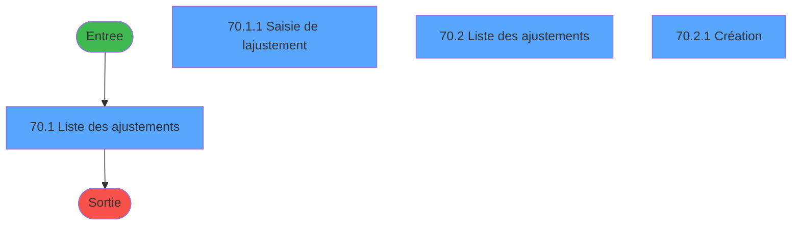
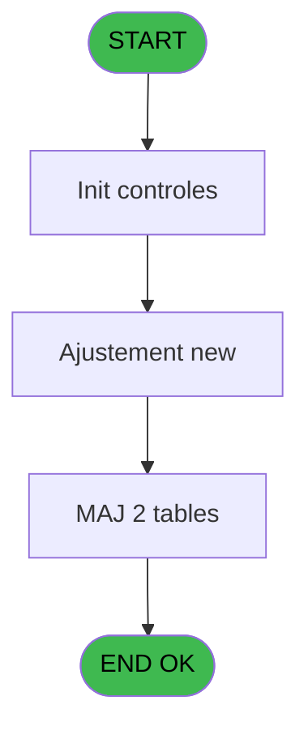
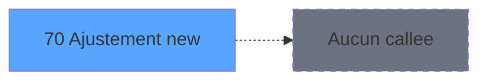

# PBG IDE 70 - Ajustement new

> **Analyse**: Phases 1-4 2026-02-03 09:07 -> 09:07 (21s) | Assemblage 09:07
> **Pipeline**: V7.2 Enrichi
> **Structure**: 4 onglets (Resume | Ecrans | Donnees | Connexions)

<!-- TAB:Resume -->

## 1. FICHE D'IDENTITE

| Attribut | Valeur |
|----------|--------|
| Projet | PBG |
| IDE Position | 70 |
| Nom Programme | Ajustement new |
| Fichier source | `Prg_70.xml` |
| Domaine metier | General |
| Taches | 9 (4 ecrans visibles) |
| Tables modifiees | 2 |
| Programmes appeles | 0 |
| :warning: Statut | **ORPHELIN_POTENTIEL** |

## 2. DESCRIPTION FONCTIONNELLE

**Ajustement new** assure la gestion complete de ce processus.

Le flux de traitement s'organise en **3 blocs fonctionnels** :

- **Traitement** (6 taches) : traitements metier divers
- **Creation** (2 taches) : insertion d'enregistrements en base (mouvements, prestations)
- **Saisie** (1 tache) : ecrans de saisie utilisateur (formulaires, champs, donnees)

**Donnees modifiees** : 2 tables en ecriture (fac_hebergement_pro, Table_953).

**Logique metier** : 1 regles identifiees couvrant conditions metier.

Detail : phases du traitement

#### Phase 1 : Traitement (6 taches)

- **70** - Liste des ajustements **[[ECRAN]](#ecran-t3)**
- **70.1** - Liste des ajustements **[[ECRAN]](#ecran-t52)**
- **70.1.2** - Extration des ajustement
- **70.2** - Liste des ajustements **[[ECRAN]](#ecran-t61)**
- **70.2.1** - Création **[[ECRAN]](#ecran-t62)**
- **70.2.2** - Extration des ajustement

#### Phase 2 : Saisie (1 tache)

- **70.1.1** - Saisie de l'ajustement **[[ECRAN]](#ecran-t53)**

#### Phase 3 : Creation (2 taches)

- **70.1.1.1** - create log
- **70.2.1.1** - create log

#### Tables impactees

| Table | Operations | Role metier |
|-------|-----------|-------------|
| Table_953 | R/**W**/L (6 usages) |  |
| fac_hebergement_pro | **W**/L (2 usages) | Hebergement (chambres) |

## 3. BLOCS FONCTIONNELS

### 3.1 Traitement (6 taches)

Traitements internes.

---

#### 70 - Liste des ajustements [[ECRAN]](#ecran-t3)

**Role** : Traitement : Liste des ajustements.
**Ecran** : 1291 x 263 DLU (MDI) | [Voir mockup](#ecran-t3)
**Variables liees** : Q (v. liste code repas), R (v. liste lib repas)

---

#### 70.1 - Liste des ajustements [[ECRAN]](#ecran-t52)

**Role** : Traitement : Liste des ajustements.
**Ecran** : 1291 x 263 DLU (MDI) | [Voir mockup](#ecran-t52)
**Variables liees** : Q (v. liste code repas), R (v. liste lib repas)

---

#### 70.1.2 - Extration des ajustement

**Role** : Traitement : Extration des ajustement.

---

#### 70.2 - Liste des ajustements [[ECRAN]](#ecran-t61)

**Role** : Traitement : Liste des ajustements.
**Ecran** : 1291 x 265 DLU (MDI) | [Voir mockup](#ecran-t61)
**Variables liees** : Q (v. liste code repas), R (v. liste lib repas)

---

#### 70.2.1 - Création [[ECRAN]](#ecran-t62)

**Role** : Traitement : Création.
**Ecran** : 153 x 195 DLU | [Voir mockup](#ecran-t62)
**Variables liees** : B (Bt.Création)

---

#### 70.2.2 - Extration des ajustement

**Role** : Traitement : Extration des ajustement.

### 3.2 Saisie (1 tache)

L'operateur saisit les donnees de la transaction via 1 ecran (Saisie de l'ajustement).

---

#### 70.1.1 - Saisie de l'ajustement [[ECRAN]](#ecran-t53)

**Role** : Saisie des donnees : Saisie de l'ajustement.
**Ecran** : 153 x 195 DLU | [Voir mockup](#ecran-t53)

### 3.3 Creation (2 taches)

Insertion de nouveaux enregistrements en base.

---

#### 70.1.1.1 - create log

**Role** : Traitement : create log.

---

#### 70.2.1.1 - create log

**Role** : Traitement : create log.

## 5. REGLES METIER

1 regles identifiees:

### Autres (1 regles)

#### [RM-001] Si [Z]='C' alors MlsTrans('Création') sinon IF([Z]='A',MlsTrans('Annulation'),MlsTrans('Modification')))

| Element | Detail |
|---------|--------|
| **Condition** | `[Z]='C'` |
| **Si vrai** | MlsTrans('Création') |
| **Si faux** | IF([Z]='A',MlsTrans('Annulation'),MlsTrans('Modification'))) |
| **Expression source** | Expression 13 : `IF([Z]='C',MlsTrans('Création'),IF([Z]='A',MlsTrans('Annulat` |
| **Exemple** | Si [Z]='C' → MlsTrans('Création') |
| **Impact** | [70.2.1 - Création](#t62) |

## 6. CONTEXTE

- **Appele par**: (aucun)
- **Appelle**: 0 programmes | **Tables**: 4 (W:2 R:3 L:2) | **Taches**: 9 | **Expressions**: 32

<!-- TAB:Ecrans -->

## 8. ECRANS

### 8.1 Forms visibles (4 / 9)

| # | Position | Tache | Nom | Type | Largeur | Hauteur | Bloc |
|---|----------|-------|-----|------|---------|---------|------|
| 1 | 70.1.1 | 70.1 | Liste des ajustements | MDI | 1291 | 263 | Traitement |
| 2 | 70.1.1.1 | 70.1.1 | Saisie de l'ajustement | Type0 | 153 | 195 | Saisie |
| 3 | 70.1.2 | 70.2 | Liste des ajustements | MDI | 1291 | 265 | Traitement |
| 4 | 70.1.2.1 | 70.2.1 | Création | Type0 | 153 | 195 | Traitement |

### 8.2 Mockups Ecrans

---

#### 70.1.1 - Liste des ajustements
**Tache** : [70.1](#t52) | **Type** : MDI | **Dimensions** : 1291 x 263 DLU
**Bloc** : Traitement | **Titre IDE** : Liste des ajustements

<!-- FORM-DATA:
{
    "width":  1291,
    "vFactor":  8,
    "type":  "MDI",
    "hFactor":  8,
    "controls":  [
                     {
                         "x":  9,
                         "type":  "table",
                         "var":  "",
                         "name":  "",
                         "titleH":  12,
                         "color":  "110",
                         "w":  1075,
                         "y":  52,
                         "fmt":  "",
                         "parent":  null,
                         "text":  "",
                         "rowH":  15,
                         "h":  172,
                         "cols":  [
                                      {
                                          "title":  "Date de consommation",
                                          "layer":  1,
                                          "w":  204
                                      },
                                      {
                                          "title":  "Qualité",
                                          "layer":  2,
                                          "w":  190
                                      },
                                      {
                                          "title":  "Qualité complem.",
                                          "layer":  3,
                                          "w":  214
                                      },
                                      {
                                          "title":  "Quantité",
                                          "layer":  4,
                                          "w":  138
                                      },
                                      {
                                          "title":  "Nb Ajustement",
                                          "layer":  5,
                                          "w":  138
                                      },
                                      {
                                          "title":  "Repas",
                                          "layer":  6,
                                          "w":  158
                                      }
                                  ],
                         "rows":  6
                     },
                     {
                         "x":  14,
                         "type":  "label",
                         "var":  "",
                         "y":  218,
                         "w":  122,
                         "fmt":  "",
                         "name":  "",
                         "h":  9,
                         "color":  "",
                         "text":  "Raison",
                         "parent":  null
                     },
                     {
                         "x":  5,
                         "type":  "label",
                         "var":  "",
                         "y":  0,
                         "w":  1280,
                         "fmt":  "",
                         "name":  "",
                         "h":  22,
                         "color":  "",
                         "text":  "",
                         "parent":  null
                     },
                     {
                         "x":  5,
                         "type":  "label",
                         "var":  "",
                         "y":  235,
                         "w":  1280,
                         "fmt":  "",
                         "name":  "",
                         "h":  23,
                         "color":  "",
                         "text":  "",
                         "parent":  null
                     },
                     {
                         "x":  19,
                         "type":  "edit",
                         "var":  "",
                         "y":  67,
                         "w":  192,
                         "fmt":  "",
                         "name":  "eff_date_consommation",
                         "h":  12,
                         "color":  "110",
                         "text":  "",
                         "parent":  1
                     },
                     {
                         "x":  222,
                         "type":  "edit",
                         "var":  "",
                         "y":  67,
                         "w":  175,
                         "fmt":  "",
                         "name":  "eff_qualite",
                         "h":  12,
                         "color":  "110",
                         "text":  "",
                         "parent":  1
                     },
                     {
                         "x":  767,
                         "type":  "edit",
                         "var":  "",
                         "y":  67,
                         "w":  124,
                         "fmt":  "N6Z",
                         "name":  "eff_nb_ajustement",
                         "h":  12,
                         "color":  "110",
                         "text":  "",
                         "parent":  1
                     },
                     {
                         "x":  1111,
                         "type":  "button",
                         "var":  "",
                         "y":  52,
                         "w":  154,
                         "fmt":  "\u0026Création",
                         "name":  "b_creation",
                         "h":  18,
                         "color":  "",
                         "text":  "",
                         "parent":  null
                     },
                     {
                         "x":  905,
                         "type":  "combobox",
                         "var":  "",
                         "y":  67,
                         "w":  143,
                         "fmt":  "",
                         "name":  "eff_repas",
                         "h":  12,
                         "color":  "110",
                         "text":  "DIN,DEJ,DDE",
                         "parent":  1
                     },
                     {
                         "x":  141,
                         "type":  "edit",
                         "var":  "",
                         "y":  218,
                         "w":  937,
                         "fmt":  "",
                         "name":  "effq_motif_annulation",
                         "h":  10,
                         "color":  "143",
                         "text":  "",
                         "parent":  null
                     },
                     {
                         "x":  410,
                         "type":  "edit",
                         "var":  "",
                         "y":  67,
                         "w":  203,
                         "fmt":  "",
                         "name":  "eff_qualite_complementaire",
                         "h":  12,
                         "color":  "110",
                         "text":  "",
                         "parent":  1
                     },
                     {
                         "x":  624,
                         "type":  "edit",
                         "var":  "",
                         "y":  67,
                         "w":  124,
                         "fmt":  "N6Z",
                         "name":  "eff_nb_reel",
                         "h":  12,
                         "color":  "110",
                         "text":  "",
                         "parent":  1
                     },
                     {
                         "x":  14,
                         "type":  "edit",
                         "var":  "",
                         "y":  6,
                         "w":  394,
                         "fmt":  "20",
                         "name":  "",
                         "h":  10,
                         "color":  "",
                         "text":  "",
                         "parent":  44
                     },
                     {
                         "x":  991,
                         "type":  "edit",
                         "var":  "",
                         "y":  6,
                         "w":  274,
                         "fmt":  "WWW DD MMM YYYYT",
                         "name":  "",
                         "h":  10,
                         "color":  "",
                         "text":  "",
                         "parent":  44
                     },
                     {
                         "x":  14,
                         "type":  "button",
                         "var":  "",
                         "y":  237,
                         "w":  172,
                         "fmt":  "\u0026Quitter",
                         "name":  "bouton quitter",
                         "h":  18,
                         "color":  "",
                         "text":  "",
                         "parent":  47
                     },
                     {
                         "x":  544,
                         "type":  "edit",
                         "var":  "",
                         "y":  240,
                         "w":  724,
                         "fmt":  "80",
                         "name":  "",
                         "h":  10,
                         "color":  "143",
                         "text":  "",
                         "parent":  47
                     },
                     {
                         "x":  1111,
                         "type":  "button",
                         "var":  "",
                         "y":  75,
                         "w":  154,
                         "fmt":  "\u0026Extraction",
                         "name":  "b_extraction",
                         "h":  18,
                         "color":  "",
                         "text":  "",
                         "parent":  null
                     }
                 ],
    "taskId":  "70.1.1",
    "height":  263
}
-->

<strong>Champs : 10 champs</strong>

| Pos (x,y) | Nom | Variable | Type |
|-----------|-----|----------|------|
| 19,67 | eff_date_consommation | - | edit |
| 222,67 | eff_qualite | - | edit |
| 767,67 | eff_nb_ajustement | - | edit |
| 905,67 | eff_repas | - | combobox |
| 141,218 | effq_motif_annulation | - | edit |
| 410,67 | eff_qualite_complementaire | - | edit |
| 624,67 | eff_nb_reel | - | edit |
| 14,6 | 20 | - | edit |
| 991,6 | WWW DD MMM YYYYT | - | edit |
| 544,240 | 80 | - | edit |

<strong>Boutons : 3 boutons</strong>

| Bouton | Pos (x,y) | Action |
|--------|-----------|--------|
| Création | 1111,52 | Bouton fonctionnel |
| Quitter | 14,237 | Quitte le programme |
| Extraction | 1111,75 | Bouton fonctionnel |

---

#### 70.1.1.1 - Saisie de l'ajustement
**Tache** : [70.1.1](#t53) | **Type** : Type0 | **Dimensions** : 153 x 195 DLU
**Bloc** : Saisie | **Titre IDE** : Saisie de l'ajustement

<!-- FORM-DATA:
{
    "width":  153,
    "vFactor":  8,
    "type":  "Type0",
    "hFactor":  1,
    "controls":  [
                     {
                         "x":  1,
                         "type":  "label",
                         "var":  "",
                         "y":  5,
                         "w":  151,
                         "fmt":  "",
                         "name":  "",
                         "h":  146,
                         "color":  "",
                         "text":  "",
                         "parent":  null
                     },
                     {
                         "x":  3,
                         "type":  "label",
                         "var":  "",
                         "y":  54,
                         "w":  14,
                         "fmt":  "",
                         "name":  "",
                         "h":  13,
                         "color":  "",
                         "text":  "Qualité",
                         "parent":  1
                     },
                     {
                         "x":  80,
                         "type":  "label",
                         "var":  "",
                         "y":  87,
                         "w":  15,
                         "fmt":  "",
                         "name":  "",
                         "h":  13,
                         "color":  "",
                         "text":  "Quantité",
                         "parent":  1
                     },
                     {
                         "x":  80,
                         "type":  "label",
                         "var":  "",
                         "y":  54,
                         "w":  15,
                         "fmt":  "",
                         "name":  "",
                         "h":  13,
                         "color":  "",
                         "text":  "Code Repas",
                         "parent":  1
                     },
                     {
                         "x":  1,
                         "type":  "label",
                         "var":  "",
                         "y":  162,
                         "w":  151,
                         "fmt":  "",
                         "name":  "",
                         "h":  25,
                         "color":  "",
                         "text":  "",
                         "parent":  null
                     },
                     {
                         "x":  3,
                         "type":  "label",
                         "var":  "",
                         "y":  110,
                         "w":  23,
                         "fmt":  "",
                         "name":  "",
                         "h":  11,
                         "color":  "",
                         "text":  "Raison",
                         "parent":  1
                     },
                     {
                         "x":  3,
                         "type":  "label",
                         "var":  "",
                         "y":  87,
                         "w":  14,
                         "fmt":  "",
                         "name":  "",
                         "h":  13,
                         "color":  "",
                         "text":  "Lieu de séjour",
                         "parent":  1
                     },
                     {
                         "x":  3,
                         "type":  "label",
                         "var":  "",
                         "y":  21,
                         "w":  14,
                         "fmt":  "",
                         "name":  "",
                         "h":  21,
                         "color":  "",
                         "text":  "Date de consommation",
                         "parent":  1
                     },
                     {
                         "x":  19,
                         "type":  "edit",
                         "var":  "",
                         "y":  21,
                         "w":  20,
                         "fmt":  "DD/MM/YYYYZ",
                         "name":  "P.date_consommation",
                         "h":  13,
                         "color":  "110",
                         "text":  "",
                         "parent":  1
                     },
                     {
                         "x":  40,
                         "type":  "button",
                         "var":  "",
                         "y":  21,
                         "w":  4,
                         "fmt":  "...",
                         "name":  "Bt.Dateconsommation",
                         "h":  13,
                         "color":  "",
                         "text":  "",
                         "parent":  1
                     },
                     {
                         "x":  19,
                         "type":  "combobox",
                         "var":  "",
                         "y":  54,
                         "w":  26,
                         "fmt":  "",
                         "name":  "P.qualite",
                         "h":  13,
                         "color":  "110",
                         "text":  "",
                         "parent":  1
                     },
                     {
                         "x":  47,
                         "type":  "combobox",
                         "var":  "",
                         "y":  54,
                         "w":  26,
                         "fmt":  "",
                         "name":  "P.qualite_complement",
                         "h":  13,
                         "color":  "110",
                         "text":  "",
                         "parent":  1
                     },
                     {
                         "x":  96,
                         "type":  "combobox",
                         "var":  "",
                         "y":  54,
                         "w":  36,
                         "fmt":  "",
                         "name":  "P.code_repas",
                         "h":  13,
                         "color":  "",
                         "text":  "DEJ,DIN, DDE",
                         "parent":  1
                     },
                     {
                         "x":  19,
                         "type":  "combobox",
                         "var":  "",
                         "y":  87,
                         "w":  36,
                         "fmt":  "",
                         "name":  "P.lieu sejour",
                         "h":  13,
                         "color":  "110",
                         "text":  "",
                         "parent":  1
                     },
                     {
                         "x":  96,
                         "type":  "edit",
                         "var":  "",
                         "y":  87,
                         "w":  36,
                         "fmt":  "N6Z",
                         "name":  "P.quantite",
                         "h":  13,
                         "color":  "110",
                         "text":  "",
                         "parent":  1
                     },
                     {
                         "x":  3,
                         "type":  "edit",
                         "var":  "",
                         "y":  120,
                         "w":  147,
                         "fmt":  "",
                         "name":  "P.raison",
                         "h":  13,
                         "color":  "110",
                         "text":  "",
                         "parent":  1
                     },
                     {
                         "x":  111,
                         "type":  "button",
                         "var":  "",
                         "y":  165,
                         "w":  19,
                         "fmt":  "\u0026Annuler",
                         "name":  "",
                         "h":  18,
                         "color":  "",
                         "text":  "",
                         "parent":  17
                     },
                     {
                         "x":  131,
                         "type":  "button",
                         "var":  "",
                         "y":  165,
                         "w":  19,
                         "fmt":  "\u0026Valider",
                         "name":  "",
                         "h":  18,
                         "color":  "",
                         "text":  "",
                         "parent":  17
                     }
                 ],
    "taskId":  "70.1.1.1",
    "height":  195
}
-->

<strong>Champs : 7 champs</strong>

| Pos (x,y) | Nom | Variable | Type |
|-----------|-----|----------|------|
| 19,21 | P.date_consommation | - | edit |
| 19,54 | P.qualite | - | combobox |
| 47,54 | P.qualite_complement | - | combobox |
| 96,54 | P.code_repas | - | combobox |
| 19,87 | P.lieu sejour | - | combobox |
| 96,87 | P.quantite | - | edit |
| 3,120 | P.raison | - | edit |

<strong>Boutons : 3 boutons</strong>

| Bouton | Pos (x,y) | Action |
|--------|-----------|--------|
| ... | 40,21 | Bouton fonctionnel |
| Annuler | 111,165 | Annule et retour au menu |
| Valider | 131,165 | Valide la saisie et enregistre |

---

#### 70.1.2 - Liste des ajustements
**Tache** : [70.2](#t61) | **Type** : MDI | **Dimensions** : 1291 x 265 DLU
**Bloc** : Traitement | **Titre IDE** : Liste des ajustements

<!-- FORM-DATA:
{
    "width":  1291,
    "vFactor":  8,
    "type":  "MDI",
    "hFactor":  8,
    "controls":  [
                     {
                         "x":  10,
                         "type":  "table",
                         "var":  "",
                         "name":  "",
                         "titleH":  12,
                         "color":  "110",
                         "w":  1075,
                         "y":  52,
                         "fmt":  "",
                         "parent":  null,
                         "text":  "",
                         "rowH":  15,
                         "h":  172,
                         "cols":  [
                                      {
                                          "title":  "Lieu de séjour",
                                          "layer":  1,
                                          "w":  127
                                      },
                                      {
                                          "title":  "Date de consommation",
                                          "layer":  2,
                                          "w":  187
                                      },
                                      {
                                          "title":  "Type",
                                          "layer":  3,
                                          "w":  82
                                      },
                                      {
                                          "title":  "Libellé",
                                          "layer":  4,
                                          "w":  328
                                      },
                                      {
                                          "title":  "Nb JH",
                                          "layer":  5,
                                          "w":  143
                                      },
                                      {
                                          "title":  "Nb Ajustement",
                                          "layer":  6,
                                          "w":  171
                                      }
                                  ],
                         "rows":  6
                     },
                     {
                         "x":  5,
                         "type":  "label",
                         "var":  "",
                         "y":  0,
                         "w":  1280,
                         "fmt":  "",
                         "name":  "",
                         "h":  22,
                         "color":  "",
                         "text":  "",
                         "parent":  null
                     },
                     {
                         "x":  5,
                         "type":  "label",
                         "var":  "",
                         "y":  240,
                         "w":  1280,
                         "fmt":  "",
                         "name":  "",
                         "h":  23,
                         "color":  "",
                         "text":  "",
                         "parent":  null
                     },
                     {
                         "x":  22,
                         "type":  "label",
                         "var":  "",
                         "y":  224,
                         "w":  122,
                         "fmt":  "",
                         "name":  "",
                         "h":  9,
                         "color":  "",
                         "text":  "Raison",
                         "parent":  null
                     },
                     {
                         "x":  147,
                         "type":  "edit",
                         "var":  "",
                         "y":  67,
                         "w":  171,
                         "fmt":  "",
                         "name":  "eff_date_consommation",
                         "h":  12,
                         "color":  "110",
                         "text":  "",
                         "parent":  1
                     },
                     {
                         "x":  334,
                         "type":  "edit",
                         "var":  "",
                         "y":  67,
                         "w":  68,
                         "fmt":  "",
                         "name":  "eff_qualite",
                         "h":  12,
                         "color":  "110",
                         "text":  "",
                         "parent":  1
                     },
                     {
                         "x":  918,
                         "type":  "edit",
                         "var":  "",
                         "y":  67,
                         "w":  124,
                         "fmt":  "N6.1Z",
                         "name":  "eff_nb_ajustement",
                         "h":  12,
                         "color":  "110",
                         "text":  "",
                         "parent":  1
                     },
                     {
                         "x":  1111,
                         "type":  "button",
                         "var":  "",
                         "y":  52,
                         "w":  154,
                         "fmt":  "\u0026Création",
                         "name":  "b_creation",
                         "h":  18,
                         "color":  "",
                         "text":  "",
                         "parent":  null
                     },
                     {
                         "x":  418,
                         "type":  "edit",
                         "var":  "",
                         "y":  67,
                         "w":  313,
                         "fmt":  "60",
                         "name":  "eff_qualite_complementaire",
                         "h":  12,
                         "color":  "110",
                         "text":  "",
                         "parent":  1
                     },
                     {
                         "x":  740,
                         "type":  "edit",
                         "var":  "",
                         "y":  67,
                         "w":  124,
                         "fmt":  "N6.1Z",
                         "name":  "eff_nb_reel",
                         "h":  12,
                         "color":  "110",
                         "text":  "",
                         "parent":  1
                     },
                     {
                         "x":  14,
                         "type":  "edit",
                         "var":  "",
                         "y":  6,
                         "w":  394,
                         "fmt":  "20",
                         "name":  "",
                         "h":  10,
                         "color":  "",
                         "text":  "",
                         "parent":  44
                     },
                     {
                         "x":  991,
                         "type":  "edit",
                         "var":  "",
                         "y":  6,
                         "w":  274,
                         "fmt":  "WWW DD MMM YYYYT",
                         "name":  "",
                         "h":  10,
                         "color":  "",
                         "text":  "",
                         "parent":  44
                     },
                     {
                         "x":  14,
                         "type":  "button",
                         "var":  "",
                         "y":  242,
                         "w":  172,
                         "fmt":  "\u0026Quitter",
                         "name":  "bouton quitter",
                         "h":  18,
                         "color":  "",
                         "text":  "",
                         "parent":  47
                     },
                     {
                         "x":  544,
                         "type":  "edit",
                         "var":  "",
                         "y":  245,
                         "w":  724,
                         "fmt":  "80",
                         "name":  "",
                         "h":  10,
                         "color":  "143",
                         "text":  "",
                         "parent":  47
                     },
                     {
                         "x":  1111,
                         "type":  "button",
                         "var":  "",
                         "y":  95,
                         "w":  154,
                         "fmt":  "\u0026Extraction",
                         "name":  "b_extraction",
                         "h":  18,
                         "color":  "",
                         "text":  "",
                         "parent":  null
                     },
                     {
                         "x":  26,
                         "type":  "edit",
                         "var":  "",
                         "y":  67,
                         "w":  18,
                         "fmt":  "",
                         "name":  "lieu_sejour",
                         "h":  10,
                         "color":  "110",
                         "text":  "",
                         "parent":  1
                     },
                     {
                         "x":  148,
                         "type":  "edit",
                         "var":  "",
                         "y":  224,
                         "w":  937,
                         "fmt":  "",
                         "name":  "effq_motif_annulation",
                         "h":  10,
                         "color":  "143",
                         "text":  "",
                         "parent":  null
                     },
                     {
                         "x":  1111,
                         "type":  "button",
                         "var":  "",
                         "y":  74,
                         "w":  154,
                         "fmt":  "\u0026Modification",
                         "name":  "b_creation",
                         "h":  18,
                         "color":  "",
                         "text":  "",
                         "parent":  null
                     }
                 ],
    "taskId":  "70.1.2",
    "height":  265
}
-->

<strong>Champs : 10 champs</strong>

| Pos (x,y) | Nom | Variable | Type |
|-----------|-----|----------|------|
| 147,67 | eff_date_consommation | - | edit |
| 334,67 | eff_qualite | - | edit |
| 918,67 | eff_nb_ajustement | - | edit |
| 418,67 | eff_qualite_complementaire | - | edit |
| 740,67 | eff_nb_reel | - | edit |
| 14,6 | 20 | - | edit |
| 991,6 | WWW DD MMM YYYYT | - | edit |
| 544,245 | 80 | - | edit |
| 26,67 | lieu_sejour | - | edit |
| 148,224 | effq_motif_annulation | - | edit |

<strong>Boutons : 4 boutons</strong>

| Bouton | Pos (x,y) | Action |
|--------|-----------|--------|
| Création | 1111,52 | Bouton fonctionnel |
| Quitter | 14,242 | Quitte le programme |
| Extraction | 1111,95 | Bouton fonctionnel |
| Modification | 1111,74 | Modifie l'element |

---

#### 70.1.2.1 - Création
**Tache** : [70.2.1](#t62) | **Type** : Type0 | **Dimensions** : 153 x 195 DLU
**Bloc** : Traitement | **Titre IDE** : Création

<!-- FORM-DATA:
{
    "width":  153,
    "vFactor":  8,
    "type":  "Type0",
    "hFactor":  1,
    "controls":  [
                     {
                         "x":  1,
                         "type":  "label",
                         "var":  "",
                         "y":  5,
                         "w":  151,
                         "fmt":  "",
                         "name":  "",
                         "h":  146,
                         "color":  "",
                         "text":  "",
                         "parent":  null
                     },
                     {
                         "x":  3,
                         "type":  "label",
                         "var":  "",
                         "y":  54,
                         "w":  14,
                         "fmt":  "",
                         "name":  "",
                         "h":  13,
                         "color":  "",
                         "text":  "Type",
                         "parent":  1
                     },
                     {
                         "x":  3,
                         "type":  "label",
                         "var":  "",
                         "y":  87,
                         "w":  15,
                         "fmt":  "",
                         "name":  "",
                         "h":  13,
                         "color":  "",
                         "text":  "Quantité",
                         "parent":  1
                     },
                     {
                         "x":  1,
                         "type":  "label",
                         "var":  "",
                         "y":  162,
                         "w":  151,
                         "fmt":  "",
                         "name":  "",
                         "h":  25,
                         "color":  "",
                         "text":  "",
                         "parent":  null
                     },
                     {
                         "x":  3,
                         "type":  "label",
                         "var":  "",
                         "y":  110,
                         "w":  23,
                         "fmt":  "",
                         "name":  "",
                         "h":  11,
                         "color":  "",
                         "text":  "Raison",
                         "parent":  1
                     },
                     {
                         "x":  80,
                         "type":  "label",
                         "var":  "",
                         "y":  21,
                         "w":  14,
                         "fmt":  "",
                         "name":  "",
                         "h":  13,
                         "color":  "",
                         "text":  "Lieu de séjour",
                         "parent":  1
                     },
                     {
                         "x":  3,
                         "type":  "label",
                         "var":  "",
                         "y":  21,
                         "w":  14,
                         "fmt":  "",
                         "name":  "",
                         "h":  21,
                         "color":  "",
                         "text":  "Date de consommation",
                         "parent":  1
                     },
                     {
                         "x":  56,
                         "type":  "label",
                         "var":  "",
                         "y":  87,
                         "w":  7,
                         "fmt":  "",
                         "name":  "",
                         "h":  13,
                         "color":  "",
                         "text":  "JH",
                         "parent":  1
                     },
                     {
                         "x":  40,
                         "type":  "button",
                         "var":  "",
                         "y":  20,
                         "w":  4,
                         "fmt":  "...",
                         "name":  "Bt.Dateconsommation",
                         "h":  13,
                         "color":  "",
                         "text":  "",
                         "parent":  1
                     },
                     {
                         "x":  19,
                         "type":  "edit",
                         "var":  "",
                         "y":  21,
                         "w":  20,
                         "fmt":  "DD/MM/YYYYZ",
                         "name":  "P.date_consommation",
                         "h":  12,
                         "color":  "110",
                         "text":  "",
                         "parent":  1
                     },
                     {
                         "x":  96,
                         "type":  "combobox",
                         "var":  "",
                         "y":  21,
                         "w":  36,
                         "fmt":  "",
                         "name":  "P.lieu sejour",
                         "h":  13,
                         "color":  "110",
                         "text":  "",
                         "parent":  1
                     },
                     {
                         "x":  19,
                         "type":  "combobox",
                         "var":  "",
                         "y":  54,
                         "w":  26,
                         "fmt":  "",
                         "name":  "P.qualite",
                         "h":  13,
                         "color":  "110",
                         "text":  "GM,GO,IGR",
                         "parent":  1
                     },
                     {
                         "x":  46,
                         "type":  "combobox",
                         "var":  "",
                         "y":  54,
                         "w":  40,
                         "fmt":  "",
                         "name":  "P.qualite_complement",
                         "h":  13,
                         "color":  "110",
                         "text":  "",
                         "parent":  1
                     },
                     {
                         "x":  46,
                         "type":  "combobox",
                         "var":  "",
                         "y":  54,
                         "w":  40,
                         "fmt":  "",
                         "name":  "P.coderepas_",
                         "h":  13,
                         "color":  "110",
                         "text":  "",
                         "parent":  1
                     },
                     {
                         "x":  19,
                         "type":  "edit",
                         "var":  "",
                         "y":  87,
                         "w":  36,
                         "fmt":  "N6.1Z",
                         "name":  "P.quantite",
                         "h":  12,
                         "color":  "110",
                         "text":  "",
                         "parent":  1
                     },
                     {
                         "x":  3,
                         "type":  "edit",
                         "var":  "",
                         "y":  120,
                         "w":  147,
                         "fmt":  "",
                         "name":  "P.raison",
                         "h":  12,
                         "color":  "110",
                         "text":  "",
                         "parent":  1
                     },
                     {
                         "x":  111,
                         "type":  "button",
                         "var":  "",
                         "y":  165,
                         "w":  19,
                         "fmt":  "\u0026Annuler",
                         "name":  "b.Annuler",
                         "h":  18,
                         "color":  "",
                         "text":  "",
                         "parent":  17
                     },
                     {
                         "x":  131,
                         "type":  "button",
                         "var":  "",
                         "y":  165,
                         "w":  19,
                         "fmt":  "10",
                         "name":  "b.Valider",
                         "h":  18,
                         "color":  "",
                         "text":  "",
                         "parent":  17
                     }
                 ],
    "taskId":  "70.1.2.1",
    "height":  195
}
-->

<strong>Champs : 7 champs</strong>

| Pos (x,y) | Nom | Variable | Type |
|-----------|-----|----------|------|
| 19,21 | P.date_consommation | - | edit |
| 96,21 | P.lieu sejour | - | combobox |
| 19,54 | P.qualite | - | combobox |
| 46,54 | P.qualite_complement | - | combobox |
| 46,54 | P.coderepas_ | - | combobox |
| 19,87 | P.quantite | - | edit |
| 3,120 | P.raison | - | edit |

<strong>Boutons : 3 boutons</strong>

| Bouton | Pos (x,y) | Action |
|--------|-----------|--------|
| ... | 40,20 | Bouton fonctionnel |
| Annuler | 111,165 | Annule et retour au menu |
| 10 | 131,165 | Bouton fonctionnel |

## 9. NAVIGATION

### 9.1 Enchainement des ecrans

**Detail par enchainement :**

| Depuis | Action | Vers | Retour |
|--------|--------|------|--------|

### 9.3 Structure hierarchique (9 taches)

| Position | Tache | Type | Dimensions | Bloc |
|----------|-------|------|------------|------|
| **70.1** | [**Liste des ajustements** (70)](#t3) [mockup](#ecran-t3) | MDI | 1291x263 | Traitement |
| 70.1.1 | [Liste des ajustements (70.1)](#t52) [mockup](#ecran-t52) | MDI | 1291x263 | |
| 70.1.2 | [Extration des ajustement (70.1.2)](#t58) | - | - | |
| 70.1.3 | [Liste des ajustements (70.2)](#t61) [mockup](#ecran-t61) | MDI | 1291x265 | |
| 70.1.4 | [Création (70.2.1)](#t62) [mockup](#ecran-t62) | - | 153x195 | |
| 70.1.5 | [Extration des ajustement (70.2.2)](#t64) | - | - | |
| **70.2** | [**Saisie de l'ajustement** (70.1.1)](#t53) [mockup](#ecran-t53) | - | 153x195 | Saisie |
| **70.3** | [**create log** (70.1.1.1)](#t54) | - | - | Creation |
| 70.3.1 | [create log (70.2.1.1)](#t63) | - | - | |

### 9.4 Algorigramme

> **Legende**: Vert = START/END OK | Rouge = END KO | Bleu = Decisions
> *Algorigramme auto-genere. Utiliser `/algorigramme` pour une synthese metier detaillee.*

<!-- TAB:Donnees -->

## 10. TABLES

### Tables utilisees (4)

| ID | Nom | Description | Type | R | W | L | Usages |
|----|-----|-------------|------|---|---|---|--------|
| 120 | tables_qualites__qua |  | DB | R |   |   | 1 |
| 825 | fac_hebergement_pro | Hebergement (chambres) | DB |   | **W** | L | 2 |
| 948 | Table_948 |  | MEM | R |   |   | 1 |
| 953 | Table_953 |  | MEM | R | **W** | L | 6 |

### Colonnes par table (4 / 4 tables avec colonnes identifiees)

Table 120 - tables_qualites__qua (R) - 1 usages

| Lettre | Variable | Acces | Type |
|--------|----------|-------|------|
| A | Bt.Modification | R | Alpha |
| B | Bt.Création | R | Alpha |
| C | Bt.Annulation | R | Alpha |
| D | V.Confirm annulation | R | Numeric |
| E | V.Modif effectuee ? | R | Logical |
| F | V.Affiche recalcul | R | Logical |
| G | v. Lib repas IGR | R | Unicode |

Table 825 - fac_hebergement_pro (**W**/L) - 2 usages

| Lettre | Variable | Acces | Type |
|--------|----------|-------|------|
| A | P.date_consomamtion | W | Date |
| B | P.Qualite | W | Unicode |
| C | P.Qualite_complementaire | W | Unicode |
| D | P.quantite_repas | W | Numeric |
| E | P.raison | W | Unicode |
| F | P.lieu_sejour | W | Unicode |
| G | v. nb repas dej | W | Numeric |
| H | v. nb repas din | W | Numeric |

Table 948 - Table_948 (R) - 1 usages

| Lettre | Variable | Acces | Type |
|--------|----------|-------|------|
| A | Bt.Modification | R | Alpha |
| B | Bt.Création | R | Alpha |
| C | Bt.Annulation | R | Alpha |
| D | V.Confirm annulation | R | Numeric |
| E | V.Modif effectuee ? | R | Logical |
| F | V.Affiche recalcul | R | Logical |

Table 953 - Table_953 (R/**W**/L) - 6 usages

| Lettre | Variable | Acces | Type |
|--------|----------|-------|------|
| A | P.date_consomamtion | W | Date |
| B | P.indicateur_repas_sejour | W | Unicode |
| C | P.Qualite | W | Unicode |
| D | P.Qualite_complementaire | W | Unicode |
| E | P.code_repas | W | Unicode |
| F | P.quantite_repas | W | Numeric |
| G | P.raison | W | Unicode |
| H | P.lieu_sejour | W | Unicode |
| I | v. raison | W | Unicode |
| J | V.Modif ligne ? | W | Logical |
| K | Bt.Dateconsommation | W | Alpha |
| L | v. valider? | W | Logical |
| M | v. exist aju DEJ | W | Logical |
| N | v. exist aju DIN | W | Logical |
| O | b.Annuler | W | Unicode |
| P | b.Valider | W | Unicode |
| Q | v. liste code repas | W | Unicode |
| R | v. liste lib repas | W | Unicode |
| S | v. continuer? | W | Numeric |

## 11. VARIABLES

### 11.1 Parametres entrants (2)

Variables recues en parametre.

| Lettre | Nom | Type | Usage dans |
|--------|-----|------|-----------|
| G | P.raison | Unicode | - |
| H | P.lieu sejour | Unicode | - |

### 11.2 Variables de session (11)

Variables persistantes pendant toute la session.

| Lettre | Nom | Type | Usage dans |
|--------|-----|------|-----------|
| D | V.Confirm annulation | Numeric | - |
| E | V.Modif effectuee ? | Logical | - |
| F | V.Affiche recalcul | Logical | - |
| I | V.Modif ligne ? | Logical | - |
| K | v.Indicateur Repas Sejour | Unicode | - |
| L | v. valider? | Logical | - |
| M | v. exist aju DEJ | Logical | - |
| N | v. exist aju DIN | Logical | - |
| Q | v. liste code repas | Unicode | - |
| R | v. liste lib repas | Unicode | - |
| S | v. continuer? | Numeric | - |

### 11.3 Autres (6)

Variables diverses.

| Lettre | Nom | Type | Usage dans |
|--------|-----|------|-----------|
| A | Bt.Modification | Alpha | - |
| B | Bt.Création | Alpha | - |
| C | Bt.Annulation | Alpha | - |
| J | Bt.Dateconsommation | Alpha | - |
| O | b.Annuler | Unicode | - |
| P | b.Valider | Unicode | - |

Toutes les 19 variables (liste complete)

| Cat | Lettre | Nom Variable | Type |
|-----|--------|--------------|------|
| P0 | **G** | P.raison | Unicode |
| P0 | **H** | P.lieu sejour | Unicode |
| V. | **D** | V.Confirm annulation | Numeric |
| V. | **E** | V.Modif effectuee ? | Logical |
| V. | **F** | V.Affiche recalcul | Logical |
| V. | **I** | V.Modif ligne ? | Logical |
| V. | **K** | v.Indicateur Repas Sejour | Unicode |
| V. | **L** | v. valider? | Logical |
| V. | **M** | v. exist aju DEJ | Logical |
| V. | **N** | v. exist aju DIN | Logical |
| V. | **Q** | v. liste code repas | Unicode |
| V. | **R** | v. liste lib repas | Unicode |
| V. | **S** | v. continuer? | Numeric |
| Autre | **A** | Bt.Modification | Alpha |
| Autre | **B** | Bt.Création | Alpha |
| Autre | **C** | Bt.Annulation | Alpha |
| Autre | **J** | Bt.Dateconsommation | Alpha |
| Autre | **O** | b.Annuler | Unicode |
| Autre | **P** | b.Valider | Unicode |

## 12. EXPRESSIONS

**32 / 32 expressions decodees (100%)**

### 12.1 Repartition par type

| Type | Expressions | Regles |
|------|-------------|--------|
| CONDITION | 11 | 5 |
| CONSTANTE | 7 | 0 |
| DATE | 4 | 0 |
| OTHER | 8 | 0 |
| REFERENCE_VG | 1 | 0 |
| CAST_LOGIQUE | 1 | 0 |

### 12.2 Expressions cles par type

#### CONDITION (11 expressions)

| Type | IDE | Expression | Regle |
|------|-----|------------|-------|
| CONDITION | 13 | `IF([Z]='C',MlsTrans('Création'),IF([Z]='A',MlsTrans('Annulation'),MlsTrans('Modification')))` | [RM-001](#rm-RM-001) |
| CONDITION | 17 | `[CE]=0` | - |
| CONDITION | 16 | `[CF]=''` | - |
| CONDITION | 18 | `[CD]=''` | - |
| CONDITION | 32 | `[Z]<>''` | - |
| ... | | *+6 autres* | |

#### CONSTANTE (7 expressions)

| Type | IDE | Expression | Regle |
|------|-----|------------|-------|
| CONSTANTE | 29 | `'v'` | - |
| CONSTANTE | 30 | `' '` | - |
| CONSTANTE | 31 | `''` | - |
| CONSTANTE | 28 | `0` | - |
| CONSTANTE | 8 | `'C'` | - |
| ... | | *+2 autres* | |

#### DATE (4 expressions)

| Type | IDE | Expression | Regle |
|------|-----|------------|-------|
| DATE | 7 | `EOM(Date()-1)` | - |
| DATE | 9 | `Date()` | - |
| DATE | 3 | `Date()` | - |
| DATE | 6 | `BOM(Date()-1)` | - |

#### OTHER (8 expressions)

| Type | IDE | Expression | Regle |
|------|-----|------------|-------|
| OTHER | 20 | `SetCrsr(1)` | - |
| OTHER | 19 | `SetCrsr(2)` | - |
| OTHER | 23 | `GetParam('LIEU_SEJOUR')` | - |
| OTHER | 22 | `[BN]` | - |
| OTHER | 4 | `MlsTrans('Recalcul effectif en cours...')` | - |
| ... | | *+3 autres* | |

#### REFERENCE_VG (1 expressions)

| Type | IDE | Expression | Regle |
|------|-----|------------|-------|
| REFERENCE_VG | 2 | `VG21` | - |

#### CAST_LOGIQUE (1 expressions)

| Type | IDE | Expression | Regle |
|------|-----|------------|-------|
| CAST_LOGIQUE | 21 | `'TRUE'LOG` | - |

### 12.3 Toutes les expressions (32)

Voir les 32 expressions

#### CONDITION (11)

| IDE | Expression Decodee |
|-----|-------------------|
| 13 | `IF([Z]='C',MlsTrans('Création'),IF([Z]='A',MlsTrans('Annulation'),MlsTrans('Modification')))` |
| 26 | `[BZ]<AddDate(BOM(Date()),0,0,1) OR [BZ]>AddDate(EOM(Date()),0,0,1)` |
| 11 | `GetParam('NB_LIEU_SEJOUR')>1` |
| 12 | `[Z]='C'` |
| 14 | `[Z]<>'A'` |
| 15 | `[Z]<>'A' AND [Z]<>'M'` |
| 16 | `[CF]=''` |
| 17 | `[CE]=0` |
| 18 | `[CD]=''` |
| 24 | ` VG58 AND [CG]='' AND GetParam('NB_LIEU_SEJOUR')>1` |
| 32 | `[Z]<>''` |

#### CONSTANTE (7)

| IDE | Expression Decodee |
|-----|-------------------|
| 8 | `'C'` |
| 25 | `'M'` |
| 27 | `' '` |
| 28 | `0` |
| 29 | `'v'` |
| 30 | `' '` |
| 31 | `''` |

#### DATE (4)

| IDE | Expression Decodee |
|-----|-------------------|
| 3 | `Date()` |
| 6 | `BOM(Date()-1)` |
| 7 | `EOM(Date()-1)` |
| 9 | `Date()` |

#### OTHER (8)

| IDE | Expression Decodee |
|-----|-------------------|
| 1 | `NOT(VG146)` |
| 4 | `MlsTrans('Recalcul effectif en cours...')` |
| 5 | `[BL]` |
| 10 | `[CB]` |
| 19 | `SetCrsr(2)` |
| 20 | `SetCrsr(1)` |
| 22 | `[BN]` |
| 23 | `GetParam('LIEU_SEJOUR')` |

#### REFERENCE_VG (1)

| IDE | Expression Decodee |
|-----|-------------------|
| 2 | `VG21` |

#### CAST_LOGIQUE (1)

| IDE | Expression Decodee |
|-----|-------------------|
| 21 | `'TRUE'LOG` |

<!-- TAB:Connexions -->

## 13. GRAPHE D'APPELS

### 13.1 Chaine depuis Main (Callers)

**Chemin**: (pas de callers directs)

### 13.2 Callers

| IDE | Nom Programme | Nb Appels |
|-----|---------------|-----------|
| - | (aucun) | - |

### 13.3 Callees (programmes appeles)

### 13.4 Detail Callees avec contexte

| IDE | Nom Programme | Appels | Contexte |
|-----|---------------|--------|----------|
| - | (aucun) | - | - |

## 14. RECOMMANDATIONS MIGRATION

### 14.1 Profil du programme

| Metrique | Valeur | Impact migration |
|----------|--------|-----------------|
| Lignes de logique | 419 | Taille moyenne |
| Expressions | 32 | Peu de logique |
| Tables WRITE | 2 | Impact faible |
| Sous-programmes | 0 | Peu de dependances |
| Ecrans visibles | 4 | Quelques ecrans |
| Code desactive | 0.7% (3 / 419) | Code sain |
| Regles metier | 1 | Quelques regles a preserver |

### 14.2 Plan de migration par bloc

#### Traitement (6 taches: 4 ecrans, 2 traitements)

- **Strategie** : Orchestrateur avec 4 ecrans (Razor/React) et 2 traitements backend (services).
- Les ecrans deviennent des composants UI, les traitements invisibles deviennent des services injectables.
- Decomposer les taches en services unitaires testables.

#### Saisie (1 tache: 1 ecran, 0 traitement)

- **Strategie** : Formulaire React/Blazor avec validation Zod/FluentValidation.
- Reproduire 1 ecran : Saisie de l'ajustement
- Validation temps reel cote client + serveur

#### Creation (2 taches: 0 ecran, 2 traitements)

- **Strategie** : Repository pattern avec Entity Framework Core.
- Insertion via `IRepository<T>.CreateAsync()`

### 14.3 Dependances critiques

| Dependance | Type | Appels | Impact |
|------------|------|--------|--------|
| fac_hebergement_pro | Table WRITE (Database) | 1x | Schema + repository |
| Table_953 | Table WRITE (Memory) | 3x | Schema + repository |

---
*Spec DETAILED generee par Pipeline V7.2 - 2026-02-03 09:07*
