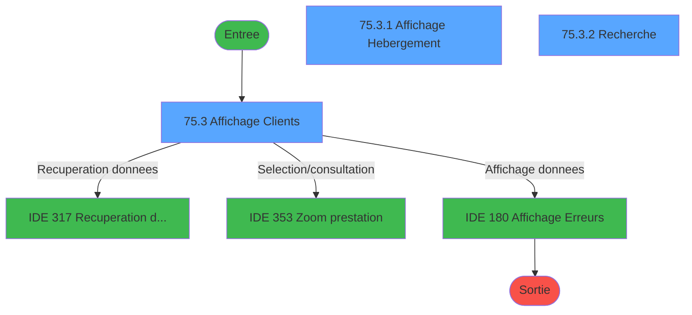
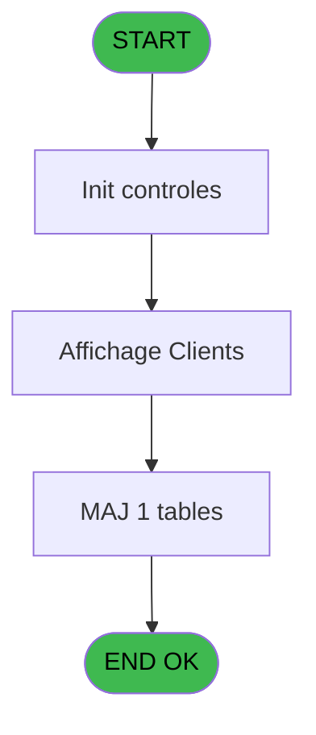
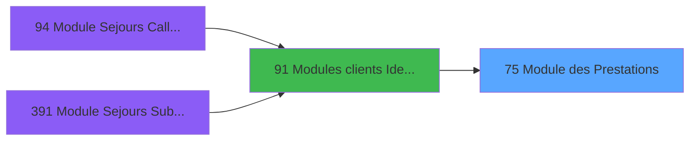
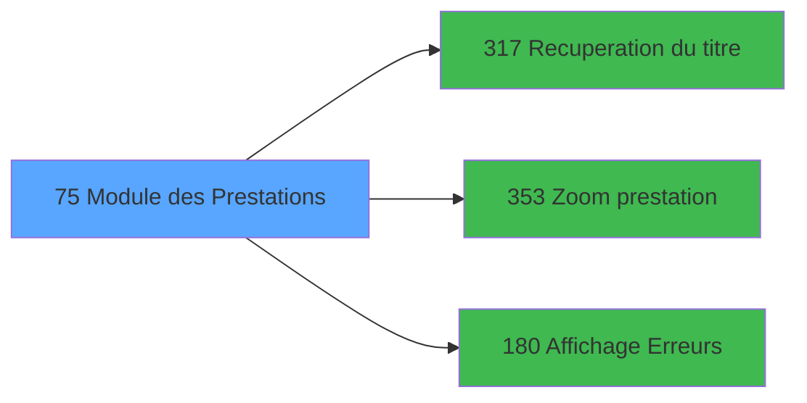

# PBG IDE 75 - Module des Prestations

> **Analyse**: Phases 1-4 2026-02-03 09:10 -> 09:10 (26s) | Assemblage 09:10
> **Pipeline**: V7.2 Enrichi
> **Structure**: 4 onglets (Resume | Ecrans | Donnees | Connexions)

<!-- TAB:Resume -->

## 1. FICHE D'IDENTITE

| Attribut | Valeur |
|----------|--------|
| Projet | PBG |
| IDE Position | 75 |
| Nom Programme | Module des Prestations |
| Fichier source | `Prg_75.xml` |
| Domaine metier | General |
| Taches | 6 (3 ecrans visibles) |
| Tables modifiees | 1 |
| Programmes appeles | 3 |

## 2. DESCRIPTION FONCTIONNELLE

**Module des Prestations** assure la gestion complete de ce processus, accessible depuis [Modules clients Identite (IDE 91)](PBG-IDE-91.md).

Le flux de traitement s'organise en **2 blocs fonctionnels** :

- **Consultation** (3 taches) : ecrans de recherche, selection et consultation
- **Traitement** (3 taches) : traitements metier divers

**Donnees modifiees** : 1 tables en ecriture (prestations______pre).

**Logique metier** : 2 regles identifiees couvrant valeurs par defaut.

Detail : phases du traitement

#### Phase 1 : Traitement (3 taches)

- **75** - Module des Sejours **[[ECRAN]](#ecran-t1)**
- **75.1** - Determination Age Bebe
- **75.2** - Test Base

Delegue a : [Recuperation du titre (IDE 317)](PBG-IDE-317.md)

#### Phase 2 : Consultation (3 taches)

- **75.3** - Affichage Clients **[[ECRAN]](#ecran-t4)**
- **75.3.1** - Affichage Hebergement **[[ECRAN]](#ecran-t5)**
- **75.3.2** - Recherche **[[ECRAN]](#ecran-t7)**

Delegue a : [Recuperation du titre (IDE 317)](PBG-IDE-317.md), [Zoom prestation (IDE 353)](PBG-IDE-353.md), [Affichage Erreurs !! (IDE 180)](PBG-IDE-180.md)

#### Tables impactees

| Table | Operations | Role metier |
|-------|-----------|-------------|
| prestations______pre | **W** (1 usages) | Prestations/services vendus |

## 3. BLOCS FONCTIONNELS

### 3.1 Traitement (3 taches)

Traitements internes.

---

#### 75 - Module des Sejours [[ECRAN]](#ecran-t1)

**Role** : Traitement : Module des Sejours.
**Ecran** : 1086 x 26 DLU (MDI) | [Voir mockup](#ecran-t1)
**Delegue a** : [Recuperation du titre (IDE 317)](PBG-IDE-317.md)

---

#### 75.1 - Determination Age Bebe

**Role** : Traitement : Determination Age Bebe.
**Variables liees** : P (W0-Age Bebe)
**Delegue a** : [Recuperation du titre (IDE 317)](PBG-IDE-317.md)

---

#### 75.2 - Test Base

**Role** : Verification : Test Base.
**Variables liees** : Q (W0-Base Vide)
**Delegue a** : [Recuperation du titre (IDE 317)](PBG-IDE-317.md)

### 3.2 Consultation (3 taches)

Ecrans de recherche et consultation.

---

#### 75.3 - Affichage Clients [[ECRAN]](#ecran-t4)

**Role** : Reinitialisation : Affichage Clients.
**Ecran** : 1142 x 368 DLU (MDI) | [Voir mockup](#ecran-t4)
**Delegue a** : [Zoom prestation (IDE 353)](PBG-IDE-353.md), [Affichage Erreurs !! (IDE 180)](PBG-IDE-180.md)

---

#### 75.3.1 - Affichage Hebergement [[ECRAN]](#ecran-t5)

**Role** : Reinitialisation : Affichage Hebergement.
**Ecran** : 710 x 162 DLU (Modal) | [Voir mockup](#ecran-t5)
**Delegue a** : [Zoom prestation (IDE 353)](PBG-IDE-353.md), [Affichage Erreurs !! (IDE 180)](PBG-IDE-180.md)

---

#### 75.3.2 - Recherche [[ECRAN]](#ecran-t7)

**Role** : Traitement : Recherche.
**Ecran** : 531 x 109 DLU (MDI) | [Voir mockup](#ecran-t7)
**Variables liees** : N (W0-nom-recherche), O (W0-prenom-recherche)
**Delegue a** : [Zoom prestation (IDE 353)](PBG-IDE-353.md), [Affichage Erreurs !! (IDE 180)](PBG-IDE-180.md)

## 5. REGLES METIER

2 regles identifiees:

### Autres (2 regles)

#### [RM-001] Valeur par defaut si P0-Code Societe [B] est vide

| Element | Detail |
|---------|--------|
| **Condition** | `P0-Code Societe [B]=''` |
| **Si vrai** | 'C' |
| **Si faux** | P0-Code Societe [B]) |
| **Variables** | B (P0-Code Societe) |
| **Expression source** | Expression 5 : `IF (P0-Code Societe [B]='','C',P0-Code Societe [B])` |
| **Exemple** | Si P0-Code Societe [B]='' → 'C'. Sinon → P0-Code Societe [B]) |

#### [RM-002] Valeur par defaut si P0-Code Langue [C] est vide

| Element | Detail |
|---------|--------|
| **Condition** | `P0-Code Langue [C]=''` |
| **Si vrai** | 'F' |
| **Si faux** | P0-Code Langue [C]) |
| **Variables** | C (P0-Code Langue) |
| **Expression source** | Expression 6 : `IF (P0-Code Langue [C]='','F',P0-Code Langue [C])` |
| **Exemple** | Si P0-Code Langue [C]='' → 'F'. Sinon → P0-Code Langue [C]) |

## 6. CONTEXTE

- **Appele par**: [Modules clients Identite (IDE 91)](PBG-IDE-91.md)
- **Appelle**: 3 programmes | **Tables**: 8 (W:1 R:3 L:5) | **Taches**: 6 | **Expressions**: 18

<!-- TAB:Ecrans -->

## 8. ECRANS

### 8.1 Forms visibles (3 / 6)

| # | Position | Tache | Nom | Type | Largeur | Hauteur | Bloc |
|---|----------|-------|-----|------|---------|---------|------|
| 1 | 75.3 | 75.3 | Affichage Clients | MDI | 1142 | 368 | Consultation |
| 2 | 75.3.1 | 75.3.1 | Affichage Hebergement | Modal | 710 | 162 | Consultation |
| 3 | 75.3.2 | 75.3.2 | Recherche | MDI | 531 | 109 | Consultation |

### 8.2 Mockups Ecrans

---

#### 75.3 - Affichage Clients
**Tache** : [75.3](#t4) | **Type** : MDI | **Dimensions** : 1142 x 368 DLU
**Bloc** : Consultation | **Titre IDE** : Affichage Clients

<!-- FORM-DATA:
{
    "width":  1142,
    "vFactor":  8,
    "type":  "MDI",
    "hFactor":  8,
    "controls":  [
                     {
                         "x":  9,
                         "type":  "label",
                         "var":  "",
                         "y":  0,
                         "w":  1125,
                         "fmt":  "",
                         "name":  "",
                         "h":  22,
                         "color":  "",
                         "text":  "",
                         "parent":  null
                     },
                     {
                         "x":  380,
                         "type":  "label",
                         "var":  "",
                         "y":  21,
                         "w":  745,
                         "fmt":  "",
                         "name":  "",
                         "h":  88,
                         "color":  "1",
                         "text":  "",
                         "parent":  null
                     },
                     {
                         "x":  410,
                         "type":  "label",
                         "var":  "",
                         "y":  26,
                         "w":  79,
                         "fmt":  "",
                         "name":  "",
                         "h":  10,
                         "color":  "",
                         "text":  "Nom",
                         "parent":  4
                     },
                     {
                         "x":  7,
                         "type":  "table",
                         "var":  "",
                         "name":  "",
                         "titleH":  12,
                         "color":  "110",
                         "w":  371,
                         "y":  24,
                         "fmt":  "",
                         "parent":  null,
                         "text":  "",
                         "rowH":  12,
                         "h":  315,
                         "cols":  [
                                      {
                                          "title":  "Nom",
                                          "layer":  1,
                                          "w":  194
                                      },
                                      {
                                          "title":  "Prénom",
                                          "layer":  2,
                                          "w":  146
                                      }
                                  ],
                         "rows":  2
                     },
                     {
                         "x":  410,
                         "type":  "label",
                         "var":  "",
                         "y":  41,
                         "w":  79,
                         "fmt":  "",
                         "name":  "",
                         "h":  10,
                         "color":  "",
                         "text":  "Prénom",
                         "parent":  4
                     },
                     {
                         "x":  410,
                         "type":  "label",
                         "var":  "",
                         "y":  55,
                         "w":  79,
                         "fmt":  "",
                         "name":  "",
                         "h":  10,
                         "color":  "",
                         "text":  "Titre",
                         "parent":  4
                     },
                     {
                         "x":  380,
                         "type":  "label",
                         "var":  "",
                         "y":  72,
                         "w":  740,
                         "fmt":  "",
                         "name":  "",
                         "h":  37,
                         "color":  "178",
                         "text":  "",
                         "parent":  null
                     },
                     {
                         "x":  410,
                         "type":  "label",
                         "var":  "",
                         "y":  95,
                         "w":  79,
                         "fmt":  "",
                         "name":  "",
                         "h":  9,
                         "color":  "178",
                         "text":  "Adhérent",
                         "parent":  14
                     },
                     {
                         "x":  722,
                         "type":  "label",
                         "var":  "",
                         "y":  95,
                         "w":  66,
                         "fmt":  "",
                         "name":  "",
                         "h":  9,
                         "color":  "178",
                         "text":  "Filiation",
                         "parent":  14
                     },
                     {
                         "x":  380,
                         "type":  "label",
                         "var":  "",
                         "y":  109,
                         "w":  349,
                         "fmt":  "",
                         "name":  "",
                         "h":  33,
                         "color":  "195",
                         "text":  "Aller",
                         "parent":  null
                     },
                     {
                         "x":  768,
                         "type":  "label",
                         "var":  "",
                         "y":  109,
                         "w":  357,
                         "fmt":  "",
                         "name":  "",
                         "h":  33,
                         "color":  "195",
                         "text":  "Retour",
                         "parent":  null
                     },
                     {
                         "x":  380,
                         "type":  "label",
                         "var":  "",
                         "y":  143,
                         "w":  745,
                         "fmt":  "",
                         "name":  "",
                         "h":  197,
                         "color":  "195",
                         "text":  "Prestations",
                         "parent":  null
                     },
                     {
                         "x":  9,
                         "type":  "label",
                         "var":  "",
                         "y":  343,
                         "w":  1125,
                         "fmt":  "",
                         "name":  "",
                         "h":  23,
                         "color":  "",
                         "text":  "",
                         "parent":  null
                     },
                     {
                         "x":  14,
                         "type":  "edit",
                         "var":  "",
                         "y":  40,
                         "w":  176,
                         "fmt":  "",
                         "name":  "CLI Nom",
                         "h":  8,
                         "color":  "110",
                         "text":  "",
                         "parent":  7
                     },
                     {
                         "x":  210,
                         "type":  "edit",
                         "var":  "",
                         "y":  40,
                         "w":  120,
                         "fmt":  "",
                         "name":  "CLI Prenom",
                         "h":  8,
                         "color":  "110",
                         "text":  "",
                         "parent":  7
                     },
                     {
                         "x":  530,
                         "type":  "edit",
                         "var":  "",
                         "y":  55,
                         "w":  30,
                         "fmt":  "",
                         "name":  "",
                         "h":  10,
                         "color":  "",
                         "text":  "",
                         "parent":  4
                     },
                     {
                         "x":  528,
                         "type":  "edit",
                         "var":  "",
                         "y":  95,
                         "w":  123,
                         "fmt":  "#10P0",
                         "name":  "",
                         "h":  9,
                         "color":  "178",
                         "text":  "",
                         "parent":  14
                     },
                     {
                         "x":  683,
                         "type":  "edit",
                         "var":  "",
                         "y":  95,
                         "w":  22,
                         "fmt":  "",
                         "name":  "",
                         "h":  9,
                         "color":  "178",
                         "text":  "",
                         "parent":  14
                     },
                     {
                         "x":  795,
                         "type":  "edit",
                         "var":  "",
                         "y":  95,
                         "w":  24,
                         "fmt":  "",
                         "name":  "",
                         "h":  9,
                         "color":  "178",
                         "text":  "",
                         "parent":  14
                     },
                     {
                         "x":  509,
                         "type":  "edit",
                         "var":  "",
                         "y":  118,
                         "w":  120,
                         "fmt":  "",
                         "name":  "",
                         "h":  8,
                         "color":  "",
                         "text":  "",
                         "parent":  25
                     },
                     {
                         "x":  650,
                         "type":  "edit",
                         "var":  "",
                         "y":  118,
                         "w":  30,
                         "fmt":  "UUH",
                         "name":  "",
                         "h":  8,
                         "color":  "",
                         "text":  "",
                         "parent":  25
                     },
                     {
                         "x":  509,
                         "type":  "edit",
                         "var":  "",
                         "y":  130,
                         "w":  75,
                         "fmt":  "",
                         "name":  "",
                         "h":  9,
                         "color":  "",
                         "text":  "",
                         "parent":  25
                     },
                     {
                         "x":  642,
                         "type":  "edit",
                         "var":  "",
                         "y":  130,
                         "w":  75,
                         "fmt":  "",
                         "name":  "",
                         "h":  9,
                         "color":  "",
                         "text":  "",
                         "parent":  25
                     },
                     {
                         "x":  912,
                         "type":  "edit",
                         "var":  "",
                         "y":  118,
                         "w":  120,
                         "fmt":  "",
                         "name":  "",
                         "h":  8,
                         "color":  "",
                         "text":  "",
                         "parent":  26
                     },
                     {
                         "x":  1035,
                         "type":  "edit",
                         "var":  "",
                         "y":  118,
                         "w":  30,
                         "fmt":  "U2H",
                         "name":  "",
                         "h":  8,
                         "color":  "",
                         "text":  "",
                         "parent":  26
                     },
                     {
                         "x":  909,
                         "type":  "edit",
                         "var":  "",
                         "y":  130,
                         "w":  75,
                         "fmt":  "",
                         "name":  "",
                         "h":  9,
                         "color":  "",
                         "text":  "",
                         "parent":  26
                     },
                     {
                         "x":  1024,
                         "type":  "edit",
                         "var":  "",
                         "y":  130,
                         "w":  75,
                         "fmt":  "",
                         "name":  "",
                         "h":  9,
                         "color":  "",
                         "text":  "",
                         "parent":  26
                     },
                     {
                         "x":  16,
                         "type":  "button",
                         "var":  "",
                         "y":  346,
                         "w":  154,
                         "fmt":  "\u0026Quitter",
                         "name":  "bouton quitter",
                         "h":  18,
                         "color":  "",
                         "text":  "",
                         "parent":  42
                     },
                     {
                         "x":  964,
                         "type":  "button",
                         "var":  "",
                         "y":  346,
                         "w":  154,
                         "fmt":  "\u0026Recherche",
                         "name":  "bouton recherche",
                         "h":  18,
                         "color":  "",
                         "text":  "",
                         "parent":  42
                     },
                     {
                         "x":  528,
                         "type":  "edit",
                         "var":  "",
                         "y":  78,
                         "w":  23,
                         "fmt":  "",
                         "name":  "V.Code fidelisation",
                         "h":  8,
                         "color":  "164",
                         "text":  "",
                         "parent":  14
                     },
                     {
                         "x":  562,
                         "type":  "edit",
                         "var":  "",
                         "y":  78,
                         "w":  200,
                         "fmt":  "",
                         "name":  "V.Libelle fidelisation",
                         "h":  8,
                         "color":  "164",
                         "text":  "",
                         "parent":  14
                     },
                     {
                         "x":  15,
                         "type":  "edit",
                         "var":  "",
                         "y":  6,
                         "w":  394,
                         "fmt":  "20",
                         "name":  "",
                         "h":  10,
                         "color":  "",
                         "text":  "",
                         "parent":  1
                     },
                     {
                         "x":  845,
                         "type":  "edit",
                         "var":  "",
                         "y":  6,
                         "w":  274,
                         "fmt":  "WWW DD MMM YYYYT",
                         "name":  "",
                         "h":  10,
                         "color":  "",
                         "text":  "",
                         "parent":  1
                     },
                     {
                         "x":  530,
                         "type":  "edit",
                         "var":  "",
                         "y":  26,
                         "w":  176,
                         "fmt":  "15",
                         "name":  "",
                         "h":  10,
                         "color":  "",
                         "text":  "",
                         "parent":  4
                     },
                     {
                         "x":  530,
                         "type":  "edit",
                         "var":  "",
                         "y":  41,
                         "w":  120,
                         "fmt":  "UX9",
                         "name":  "",
                         "h":  10,
                         "color":  "",
                         "text":  "",
                         "parent":  4
                     },
                     {
                         "x":  410,
                         "type":  "edit",
                         "var":  "",
                         "y":  77,
                         "w":  78,
                         "fmt":  "UX5",
                         "name":  "",
                         "h":  9,
                         "color":  "140",
                         "text":  "",
                         "parent":  14
                     },
                     {
                         "x":  774,
                         "type":  "edit",
                         "var":  "",
                         "y":  78,
                         "w":  53,
                         "fmt":  "UX3",
                         "name":  "",
                         "h":  8,
                         "color":  "143",
                         "text":  "",
                         "parent":  14
                     },
                     {
                         "x":  853,
                         "type":  "edit",
                         "var":  "",
                         "y":  78,
                         "w":  120,
                         "fmt":  "UX9",
                         "name":  "",
                         "h":  8,
                         "color":  "143",
                         "text":  "",
                         "parent":  14
                     },
                     {
                         "x":  797,
                         "type":  "edit",
                         "var":  "",
                         "y":  117,
                         "w":  98,
                         "fmt":  "10",
                         "name":  "",
                         "h":  8,
                         "color":  "",
                         "text":  "",
                         "parent":  26
                     },
                     {
                         "x":  398,
                         "type":  "edit",
                         "var":  "",
                         "y":  118,
                         "w":  98,
                         "fmt":  "10",
                         "name":  "",
                         "h":  8,
                         "color":  "",
                         "text":  "",
                         "parent":  25
                     },
                     {
                         "x":  400,
                         "type":  "edit",
                         "var":  "",
                         "y":  130,
                         "w":  98,
                         "fmt":  "10",
                         "name":  "",
                         "h":  9,
                         "color":  "",
                         "text":  "",
                         "parent":  25
                     },
                     {
                         "x":  606,
                         "type":  "edit",
                         "var":  "",
                         "y":  130,
                         "w":  22,
                         "fmt":  "1",
                         "name":  "",
                         "h":  9,
                         "color":  "",
                         "text":  "",
                         "parent":  25
                     },
                     {
                         "x":  798,
                         "type":  "edit",
                         "var":  "",
                         "y":  130,
                         "w":  98,
                         "fmt":  "10",
                         "name":  "",
                         "h":  9,
                         "color":  "",
                         "text":  "",
                         "parent":  26
                     },
                     {
                         "x":  995,
                         "type":  "edit",
                         "var":  "",
                         "y":  130,
                         "w":  22,
                         "fmt":  "1",
                         "name":  "",
                         "h":  9,
                         "color":  "",
                         "text":  "",
                         "parent":  26
                     },
                     {
                         "x":  390,
                         "type":  "subform",
                         "var":  "",
                         "y":  173,
                         "w":  720,
                         "fmt":  "",
                         "name":  "Prestations",
                         "h":  165,
                         "color":  "",
                         "text":  "",
                         "parent":  41
                     },
                     {
                         "x":  571,
                         "type":  "combobox",
                         "var":  "",
                         "y":  152,
                         "w":  330,
                         "fmt":  "",
                         "name":  "v.Filtre Prestation",
                         "h":  12,
                         "color":  "",
                         "text":  "",
                         "parent":  41
                     }
                 ],
    "taskId":  "75.3",
    "height":  368
}
-->

<strong>Champs : 30 champs</strong>

| Pos (x,y) | Nom | Variable | Type |
|-----------|-----|----------|------|
| 14,40 | CLI Nom | - | edit |
| 210,40 | CLI Prenom | - | edit |
| 530,55 | (sans nom) | - | edit |
| 528,95 | #10P0 | - | edit |
| 683,95 | (sans nom) | - | edit |
| 795,95 | (sans nom) | - | edit |
| 509,118 | (sans nom) | - | edit |
| 650,118 | UUH | - | edit |
| 509,130 | (sans nom) | - | edit |
| 642,130 | (sans nom) | - | edit |
| 912,118 | (sans nom) | - | edit |
| 1035,118 | U2H | - | edit |
| 909,130 | (sans nom) | - | edit |
| 1024,130 | (sans nom) | - | edit |
| 528,78 | V.Code fidelisation | - | edit |
| 562,78 | V.Libelle fidelisation | - | edit |
| 15,6 | 20 | - | edit |
| 845,6 | WWW DD MMM YYYYT | - | edit |
| 530,26 | 15 | - | edit |
| 530,41 | UX9 | - | edit |
| 410,77 | UX5 | - | edit |
| 774,78 | UX3 | - | edit |
| 853,78 | UX9 | - | edit |
| 797,117 | 10 | - | edit |
| 398,118 | 10 | - | edit |
| 400,130 | 10 | - | edit |
| 606,130 | 1 | - | edit |
| 798,130 | 10 | - | edit |
| 995,130 | 1 | - | edit |
| 571,152 | v.Filtre Prestation | - | combobox |

<strong>Boutons : 2 boutons</strong>

| Bouton | Pos (x,y) | Action |
|--------|-----------|--------|
| Quitter | 16,346 | Quitte le programme |
| Recherche | 964,346 | Ouvre la selection |

---

#### 75.3.1 - Affichage Hebergement
**Tache** : [75.3.1](#t5) | **Type** : Modal | **Dimensions** : 710 x 162 DLU
**Bloc** : Consultation | **Titre IDE** : Affichage Hebergement

<!-- FORM-DATA:
{
    "width":  710,
    "vFactor":  8,
    "type":  "Modal",
    "hFactor":  8,
    "controls":  [
                     {
                         "x":  0,
                         "type":  "table",
                         "var":  "",
                         "name":  "",
                         "titleH":  12,
                         "color":  "110",
                         "w":  704,
                         "y":  1,
                         "fmt":  "",
                         "parent":  null,
                         "text":  "",
                         "rowH":  12,
                         "h":  158,
                         "cols":  [
                                      {
                                          "title":  "Code Prestation",
                                          "layer":  1,
                                          "w":  151
                                      },
                                      {
                                          "title":  "Libellé",
                                          "layer":  2,
                                          "w":  247
                                      },
                                      {
                                          "title":  "Date début",
                                          "layer":  3,
                                          "w":  143
                                      },
                                      {
                                          "title":  "Date fin",
                                          "layer":  4,
                                          "w":  123
                                      }
                                  ],
                         "rows":  4
                     },
                     {
                         "x":  10,
                         "type":  "edit",
                         "var":  "",
                         "y":  15,
                         "w":  82,
                         "fmt":  "",
                         "name":  "PRE Code Circuit",
                         "h":  10,
                         "color":  "110",
                         "text":  "",
                         "parent":  1
                     },
                     {
                         "x":  160,
                         "type":  "edit",
                         "var":  "",
                         "y":  15,
                         "w":  232,
                         "fmt":  "",
                         "name":  "",
                         "h":  10,
                         "color":  "110",
                         "text":  "",
                         "parent":  1
                     },
                     {
                         "x":  120,
                         "type":  "button",
                         "var":  "",
                         "y":  15,
                         "w":  27,
                         "fmt":  "...",
                         "name":  "bouton prestation",
                         "h":  11,
                         "color":  "",
                         "text":  "",
                         "parent":  1
                     },
                     {
                         "x":  410,
                         "type":  "edit",
                         "var":  "",
                         "y":  15,
                         "w":  120,
                         "fmt":  "",
                         "name":  "PRE Date Debut",
                         "h":  8,
                         "color":  "110",
                         "text":  "",
                         "parent":  1
                     },
                     {
                         "x":  547,
                         "type":  "edit",
                         "var":  "",
                         "y":  15,
                         "w":  120,
                         "fmt":  "",
                         "name":  "PRE Date Fin",
                         "h":  8,
                         "color":  "110",
                         "text":  "",
                         "parent":  1
                     }
                 ],
    "taskId":  "75.3.1",
    "height":  162
}
-->

<strong>Champs : 4 champs</strong>

| Pos (x,y) | Nom | Variable | Type |
|-----------|-----|----------|------|
| 10,15 | PRE Code Circuit | - | edit |
| 160,15 | (sans nom) | - | edit |
| 410,15 | PRE Date Debut | - | edit |
| 547,15 | PRE Date Fin | - | edit |

<strong>Boutons : 1 boutons</strong>

| Bouton | Pos (x,y) | Action |
|--------|-----------|--------|
| ... | 120,15 | Bouton fonctionnel |

---

#### 75.3.2 - Recherche
**Tache** : [75.3.2](#t7) | **Type** : MDI | **Dimensions** : 531 x 109 DLU
**Bloc** : Consultation | **Titre IDE** : Recherche

<!-- FORM-DATA:
{
    "width":  531,
    "vFactor":  8,
    "type":  "MDI",
    "hFactor":  8,
    "controls":  [
                     {
                         "x":  0,
                         "type":  "label",
                         "var":  "",
                         "y":  1,
                         "w":  530,
                         "fmt":  "",
                         "name":  "",
                         "h":  19,
                         "color":  "",
                         "text":  "",
                         "parent":  null
                     },
                     {
                         "x":  170,
                         "type":  "label",
                         "var":  "",
                         "y":  34,
                         "w":  340,
                         "fmt":  "",
                         "name":  "",
                         "h":  37,
                         "color":  "",
                         "text":  "",
                         "parent":  null
                     },
                     {
                         "x":  173,
                         "type":  "label",
                         "var":  "",
                         "y":  35,
                         "w":  334,
                         "fmt":  "",
                         "name":  "",
                         "h":  35,
                         "color":  "",
                         "text":  "",
                         "parent":  null
                     },
                     {
                         "x":  190,
                         "type":  "label",
                         "var":  "",
                         "y":  49,
                         "w":  197,
                         "fmt":  "",
                         "name":  "",
                         "h":  8,
                         "color":  "",
                         "text":  "Entrer les première lettres",
                         "parent":  6
                     },
                     {
                         "x":  0,
                         "type":  "label",
                         "var":  "",
                         "y":  85,
                         "w":  531,
                         "fmt":  "",
                         "name":  "",
                         "h":  24,
                         "color":  "",
                         "text":  "",
                         "parent":  null
                     },
                     {
                         "x":  391,
                         "type":  "edit",
                         "var":  "",
                         "y":  48,
                         "w":  93,
                         "fmt":  "U7",
                         "name":  "",
                         "h":  10,
                         "color":  "6",
                         "text":  "",
                         "parent":  6
                     },
                     {
                         "x":  262,
                         "type":  "edit",
                         "var":  "",
                         "y":  6,
                         "w":  262,
                         "fmt":  "WWW DD MMM YYYYT",
                         "name":  "",
                         "h":  8,
                         "color":  "",
                         "text":  "",
                         "parent":  null
                     },
                     {
                         "x":  4,
                         "type":  "image",
                         "var":  "",
                         "y":  23,
                         "w":  154,
                         "fmt":  "",
                         "name":  "",
                         "h":  59,
                         "color":  "",
                         "text":  "",
                         "parent":  null
                     },
                     {
                         "x":  7,
                         "type":  "button",
                         "var":  "",
                         "y":  88,
                         "w":  154,
                         "fmt":  "\u0026Valider",
                         "name":  "",
                         "h":  18,
                         "color":  "",
                         "text":  "",
                         "parent":  null
                     },
                     {
                         "x":  368,
                         "type":  "button",
                         "var":  "",
                         "y":  88,
                         "w":  154,
                         "fmt":  "\u0026Abandonner",
                         "name":  "",
                         "h":  18,
                         "color":  "",
                         "text":  "",
                         "parent":  null
                     },
                     {
                         "x":  5,
                         "type":  "edit",
                         "var":  "",
                         "y":  6,
                         "w":  267,
                         "fmt":  "20",
                         "name":  "",
                         "h":  8,
                         "color":  "",
                         "text":  "",
                         "parent":  null
                     }
                 ],
    "taskId":  "75.3.2",
    "height":  109
}
-->

<strong>Champs : 3 champs</strong>

| Pos (x,y) | Nom | Variable | Type |
|-----------|-----|----------|------|
| 391,48 | U7 | - | edit |
| 262,6 | WWW DD MMM YYYYT | - | edit |
| 5,6 | 20 | - | edit |

<strong>Boutons : 2 boutons</strong>

| Bouton | Pos (x,y) | Action |
|--------|-----------|--------|
| Valider | 7,88 | Valide la saisie et enregistre |
| Abandonner | 368,88 | Annule et retour au menu |

## 9. NAVIGATION

### 9.1 Enchainement des ecrans

**Detail par enchainement :**

| Depuis | Action | Vers | Retour |
|--------|--------|------|--------|
| Affichage Clients | Recuperation donnees | [Recuperation du titre (IDE 317)](PBG-IDE-317.md) | Retour ecran |
| Affichage Clients | Selection/consultation | [Zoom prestation (IDE 353)](PBG-IDE-353.md) | Retour ecran |
| Affichage Clients | Affichage donnees | [Affichage Erreurs !! (IDE 180)](PBG-IDE-180.md) | Retour ecran |

### 9.3 Structure hierarchique (6 taches)

| Position | Tache | Type | Dimensions | Bloc |
|----------|-------|------|------------|------|
| **75.1** | [**Module des Sejours** (75)](#t1) [mockup](#ecran-t1) | MDI | 1086x26 | Traitement |
| 75.1.1 | [Determination Age Bebe (75.1)](#t2) | MDI | - | |
| 75.1.2 | [Test Base (75.2)](#t3) | MDI | - | |
| **75.2** | [**Affichage Clients** (75.3)](#t4) [mockup](#ecran-t4) | MDI | 1142x368 | Consultation |
| 75.2.1 | [Affichage Hebergement (75.3.1)](#t5) [mockup](#ecran-t5) | Modal | 710x162 | |
| 75.2.2 | [Recherche (75.3.2)](#t7) [mockup](#ecran-t7) | MDI | 531x109 | |

### 9.4 Algorigramme

> **Legende**: Vert = START/END OK | Rouge = END KO | Bleu = Decisions
> *Algorigramme auto-genere. Utiliser `/algorigramme` pour une synthese metier detaillee.*

<!-- TAB:Donnees -->

## 10. TABLES

### Tables utilisees (8)

| ID | Nom | Description | Type | R | W | L | Usages |
|----|-----|-------------|------|---|---|---|--------|
| 31 | gm-complet_______gmc |  | DB |   |   | L | 1 |
| 33 | prestations______pre | Prestations/services vendus | DB |   | **W** |   | 1 |
| 34 | hebergement______heb | Hebergement (chambres) | DB | R |   |   | 1 |
| 36 | client_gm |  | DB | R |   | L | 2 |
| 113 | tables_village |  | DB | R |   |   | 1 |
| 135 | libelle_prestation | Prestations/services vendus | DB |   |   | L | 1 |
| 358 | import_mod |  | DB |   |   | L | 1 |
| 846 | stat_lieu_vente | Statistiques point de vente | TMP |   |   | L | 1 |

### Colonnes par table (5 / 4 tables avec colonnes identifiees)

Table 33 - prestations______pre (**W**) - 1 usages

| Lettre | Variable | Acces | Type |
|--------|----------|-------|------|
| A | P.Num compte | W | Numeric |
| B | P.Filiation | W | Numeric |
| C | P.Filtre Prestation | W | Alpha |
| D | bouton prestation | W | Alpha |

Table 34 - hebergement______heb (R) - 1 usages

| Lettre | Variable | Acces | Type |
|--------|----------|-------|------|
| A | W1-Fin de Tache | R | Alpha |
| B | bouton quitter | R | Alpha |
| C | bouton recherche | R | Alpha |
| D | W1-Titre | R | Alpha |
| E | v.Filtre Prestation | R | Unicode |
| F | Column Name | R | Unicode |

Table 36 - client_gm (R/L) - 2 usages

| Lettre | Variable | Acces | Type |
|--------|----------|-------|------|
| A | W1-Fin de Tache | R | Alpha |
| B | W1-Code Retour | R | Numeric |

Table 113 - tables_village (R) - 1 usages

*Table utilisee uniquement en Link ou aucune colonne Real identifiee dans le DataView.*

## 11. VARIABLES

### 11.1 Autres (24)

Variables diverses.

| Lettre | Nom | Type | Usage dans |
|--------|-----|------|-----------|
| A | P0-Choix Programme | Alpha | - |
| B | P0-Code Societe | Alpha | 1x refs |
| C | P0-Code Langue | Alpha | 1x refs |
| D | P0-Societe | Alpha | - |
| E | P0-Numero Compte | Numeric | - |
| F | P0-Filiation Compte | Numeric | - |
| G | P0-Nom Adherent | Alpha | - |
| H | P0-Prenom Adherent | Alpha | - |
| I | P0-Nom Personne | Alpha | - |
| J | P0-Prenom Personne | Alpha | - |
| K | P0-Nom Logement | Alpha | - |
| L | W0-Fin de Tache | Alpha | 1x refs |
| M | W0-Valeur-tri | Numeric | 1x refs |
| N | W0-nom-recherche | Alpha | - |
| O | W0-prenom-recherche | Alpha | - |
| P | W0-Age Bebe | Numeric | - |
| Q | W0-Base Vide | Alpha | 3x refs |
| R | W0-Code B004 | Alpha | - |
| S | W0-Code B020 | Alpha | - |
| T | W0-Code B023 | Alpha | - |
| U | W0-Code B024 | Alpha | - |
| V | W0-Code B026 | Alpha | - |
| W | W0-Code B027 | Alpha | - |
| X | W0-Code B044 | Alpha | - |

Toutes les 24 variables (liste complete)

| Cat | Lettre | Nom Variable | Type |
|-----|--------|--------------|------|
| Autre | **A** | P0-Choix Programme | Alpha |
| Autre | **B** | P0-Code Societe | Alpha |
| Autre | **C** | P0-Code Langue | Alpha |
| Autre | **D** | P0-Societe | Alpha |
| Autre | **E** | P0-Numero Compte | Numeric |
| Autre | **F** | P0-Filiation Compte | Numeric |
| Autre | **G** | P0-Nom Adherent | Alpha |
| Autre | **H** | P0-Prenom Adherent | Alpha |
| Autre | **I** | P0-Nom Personne | Alpha |
| Autre | **J** | P0-Prenom Personne | Alpha |
| Autre | **K** | P0-Nom Logement | Alpha |
| Autre | **L** | W0-Fin de Tache | Alpha |
| Autre | **M** | W0-Valeur-tri | Numeric |
| Autre | **N** | W0-nom-recherche | Alpha |
| Autre | **O** | W0-prenom-recherche | Alpha |
| Autre | **P** | W0-Age Bebe | Numeric |
| Autre | **Q** | W0-Base Vide | Alpha |
| Autre | **R** | W0-Code B004 | Alpha |
| Autre | **S** | W0-Code B020 | Alpha |
| Autre | **T** | W0-Code B023 | Alpha |
| Autre | **U** | W0-Code B024 | Alpha |
| Autre | **V** | W0-Code B026 | Alpha |
| Autre | **W** | W0-Code B027 | Alpha |
| Autre | **X** | W0-Code B044 | Alpha |

## 12. EXPRESSIONS

**18 / 18 expressions decodees (100%)**

### 12.1 Repartition par type

| Type | Expressions | Regles |
|------|-------------|--------|
| CONDITION | 7 | 2 |
| CONSTANTE | 9 | 0 |
| OTHER | 2 | 0 |

### 12.2 Expressions cles par type

#### CONDITION (7 expressions)

| Type | IDE | Expression | Regle |
|------|-----|------------|-------|
| CONDITION | 6 | `IF (P0-Code Langue [C]='','F',P0-Code Langue [C])` | [RM-002](#rm-RM-002) |
| CONDITION | 5 | `IF (P0-Code Societe [B]='','C',P0-Code Societe [B])` | [RM-001](#rm-RM-001) |
| CONDITION | 8 | `W0-Base Vide [Q]='O'` | - |
| CONDITION | 9 | `W0-Base Vide [Q]='N'` | - |
| CONDITION | 7 | `W0-Base Vide [Q]<>'O' OR W0-Base Vide [Q]<>'N'` | - |
| ... | | *+2 autres* | |

#### CONSTANTE (9 expressions)

| Type | IDE | Expression | Regle |
|------|-----|------------|-------|
| CONSTANTE | 14 | `'B026'` | - |
| CONSTANTE | 13 | `'B024'` | - |
| CONSTANTE | 16 | `'B044'` | - |
| CONSTANTE | 15 | `'B027'` | - |
| CONSTANTE | 12 | `'B023'` | - |
| ... | | *+4 autres* | |

#### OTHER (2 expressions)

| Type | IDE | Expression | Regle |
|------|-----|------------|-------|
| OTHER | 18 | `GetParam ('PRENOM')` | - |
| OTHER | 17 | `GetParam ('NOM')` | - |

<!-- TAB:Connexions -->

## 13. GRAPHE D'APPELS

### 13.1 Chaine depuis Main (Callers)

Main -> ... -> [Modules clients Identite (IDE 91)](PBG-IDE-91.md) -> **Module des Prestations (IDE 75)**

### 13.2 Callers

| IDE | Nom Programme | Nb Appels |
|-----|---------------|-----------|
| [91](PBG-IDE-91.md) | Modules clients Identite | 1 |

### 13.3 Callees (programmes appeles)

### 13.4 Detail Callees avec contexte

| IDE | Nom Programme | Appels | Contexte |
|-----|---------------|--------|----------|
| [317](PBG-IDE-317.md) | Recuperation du titre | 2 | Recuperation donnees |
| [353](PBG-IDE-353.md) | Zoom prestation | 2 | Selection/consultation |
| [180](PBG-IDE-180.md) | Affichage Erreurs !! | 1 | Affichage donnees |

## 14. RECOMMANDATIONS MIGRATION

### 14.1 Profil du programme

| Metrique | Valeur | Impact migration |
|----------|--------|-----------------|
| Lignes de logique | 208 | Taille moyenne |
| Expressions | 18 | Peu de logique |
| Tables WRITE | 1 | Impact faible |
| Sous-programmes | 3 | Peu de dependances |
| Ecrans visibles | 3 | Quelques ecrans |
| Code desactive | 0% (0 / 208) | Code sain |
| Regles metier | 2 | Quelques regles a preserver |

### 14.2 Plan de migration par bloc

#### Traitement (3 taches: 1 ecran, 2 traitements)

- **Strategie** : Orchestrateur avec 1 ecrans (Razor/React) et 2 traitements backend (services).
- Les ecrans deviennent des composants UI, les traitements invisibles deviennent des services injectables.
- 3 sous-programme(s) a migrer ou a reutiliser depuis les services existants.
- Decomposer les taches en services unitaires testables.

#### Consultation (3 taches: 3 ecrans, 0 traitement)

- **Strategie** : Composants de recherche/selection en modales.
- 3 ecrans : Affichage Clients, Affichage Hebergement, Recherche

### 14.3 Dependances critiques

| Dependance | Type | Appels | Impact |
|------------|------|--------|--------|
| prestations______pre | Table WRITE (Database) | 1x | Schema + repository |
| [Zoom prestation (IDE 353)](PBG-IDE-353.md) | Sous-programme | 2x | Haute - Selection/consultation |
| [Recuperation du titre (IDE 317)](PBG-IDE-317.md) | Sous-programme | 2x | Haute - Recuperation donnees |
| [Affichage Erreurs !! (IDE 180)](PBG-IDE-180.md) | Sous-programme | 1x | Normale - Affichage donnees |

---
*Spec DETAILED generee par Pipeline V7.2 - 2026-02-03 09:10*
