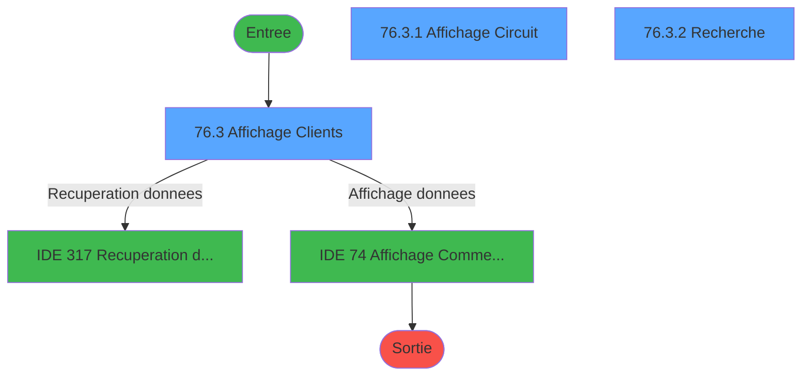
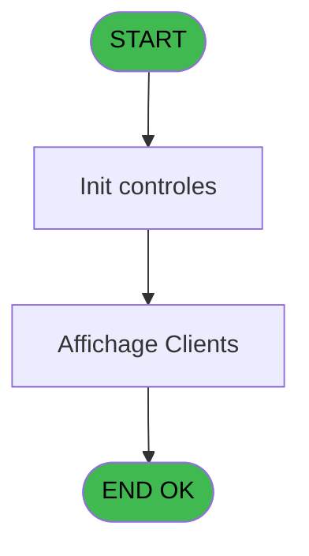
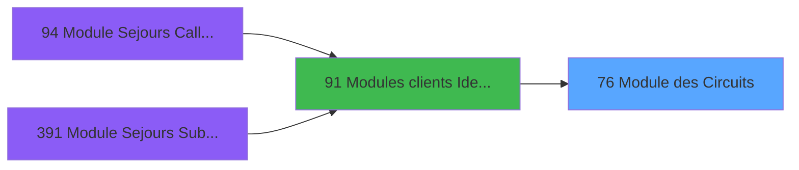
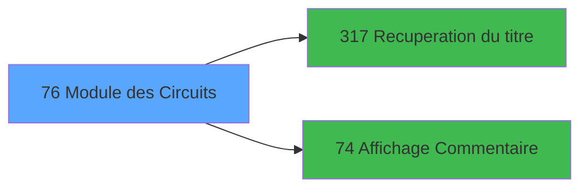

# PBG IDE 76 - Module des Circuits

> **Analyse**: Phases 1-4 2026-02-03 09:10 -> 09:10 (20s) | Assemblage 09:10
> **Pipeline**: V7.2 Enrichi
> **Structure**: 4 onglets (Resume | Ecrans | Donnees | Connexions)

<!-- TAB:Resume -->

## 1. FICHE D'IDENTITE

| Attribut | Valeur |
|----------|--------|
| Projet | PBG |
| IDE Position | 76 |
| Nom Programme | Module des Circuits |
| Fichier source | `Prg_76.xml` |
| Domaine metier | General |
| Taches | 6 (3 ecrans visibles) |
| Tables modifiees | 0 |
| Programmes appeles | 2 |

## 2. DESCRIPTION FONCTIONNELLE

**Module des Circuits** assure la gestion complete de ce processus, accessible depuis [Modules clients Identite (IDE 91)](PBG-IDE-91.md).

Le flux de traitement s'organise en **2 blocs fonctionnels** :

- **Consultation** (3 taches) : ecrans de recherche, selection et consultation
- **Traitement** (3 taches) : traitements metier divers

Detail : phases du traitement

#### Phase 1 : Traitement (3 taches)

- **76** - Module des Circuits
- **76.1** - Determination Age Bebe
- **76.2** - Test Base

Delegue a : [Recuperation du titre (IDE 317)](PBG-IDE-317.md)

#### Phase 2 : Consultation (3 taches)

- **76.3** - Affichage Clients **[[ECRAN]](#ecran-t4)**
- **76.3.1** - Affichage Circuit **[[ECRAN]](#ecran-t5)**
- **76.3.2** - Recherche **[[ECRAN]](#ecran-t6)**

Delegue a : [Recuperation du titre (IDE 317)](PBG-IDE-317.md), [   Affichage Commentaire (IDE 74)](PBG-IDE-74.md)

## 3. BLOCS FONCTIONNELS

### 3.1 Traitement (3 taches)

Traitements internes.

---

#### 76 - Module des Circuits

**Role** : Traitement : Module des Circuits.
**Delegue a** : [Recuperation du titre (IDE 317)](PBG-IDE-317.md)

---

#### 76.1 - Determination Age Bebe

**Role** : Traitement : Determination Age Bebe.
**Variables liees** : M (W0-Age Bebe)
**Delegue a** : [Recuperation du titre (IDE 317)](PBG-IDE-317.md)

---

#### 76.2 - Test Base

**Role** : Verification : Test Base.
**Variables liees** : N (W0-Base Vide)
**Delegue a** : [Recuperation du titre (IDE 317)](PBG-IDE-317.md)

### 3.2 Consultation (3 taches)

Ecrans de recherche et consultation.

---

#### 76.3 - Affichage Clients [[ECRAN]](#ecran-t4)

**Role** : Reinitialisation : Affichage Clients.
**Ecran** : 1266 x 267 DLU (MDI) | [Voir mockup](#ecran-t4)
**Delegue a** : [   Affichage Commentaire (IDE 74)](PBG-IDE-74.md)

---

#### 76.3.1 - Affichage Circuit [[ECRAN]](#ecran-t5)

**Role** : Reinitialisation : Affichage Circuit.
**Ecran** : 835 x 66 DLU (Modal) | [Voir mockup](#ecran-t5)
**Delegue a** : [   Affichage Commentaire (IDE 74)](PBG-IDE-74.md)

---

#### 76.3.2 - Recherche [[ECRAN]](#ecran-t6)

**Role** : Traitement : Recherche.
**Ecran** : 539 x 112 DLU (MDI) | [Voir mockup](#ecran-t6)
**Variables liees** : O (W0-Recherche)
**Delegue a** : [   Affichage Commentaire (IDE 74)](PBG-IDE-74.md)

## 5. REGLES METIER

*(Aucune regle metier identifiee)*

## 6. CONTEXTE

- **Appele par**: [Modules clients Identite (IDE 91)](PBG-IDE-91.md)
- **Appelle**: 2 programmes | **Tables**: 10 (W:0 R:4 L:8) | **Taches**: 6 | **Expressions**: 9

<!-- TAB:Ecrans -->

## 8. ECRANS

### 8.1 Forms visibles (3 / 6)

| # | Position | Tache | Nom | Type | Largeur | Hauteur | Bloc |
|---|----------|-------|-----|------|---------|---------|------|
| 1 | 76.3 | 76.3 | Affichage Clients | MDI | 1266 | 267 | Consultation |
| 2 | 76.3.1 | 76.3.1 | Affichage Circuit | Modal | 835 | 66 | Consultation |
| 3 | 76.3.2 | 76.3.2 | Recherche | MDI | 539 | 112 | Consultation |

### 8.2 Mockups Ecrans

---

#### 76.3 - Affichage Clients
**Tache** : [76.3](#t4) | **Type** : MDI | **Dimensions** : 1266 x 267 DLU
**Bloc** : Consultation | **Titre IDE** : Affichage Clients

<!-- FORM-DATA:
{
    "width":  1266,
    "vFactor":  8,
    "type":  "MDI",
    "hFactor":  8,
    "controls":  [
                     {
                         "x":  0,
                         "type":  "label",
                         "var":  "",
                         "y":  1,
                         "w":  1260,
                         "fmt":  "",
                         "name":  "",
                         "h":  23,
                         "color":  "",
                         "text":  "",
                         "parent":  null
                     },
                     {
                         "x":  402,
                         "type":  "label",
                         "var":  "",
                         "y":  26,
                         "w":  861,
                         "fmt":  "",
                         "name":  "",
                         "h":  209,
                         "color":  "",
                         "text":  "",
                         "parent":  null
                     },
                     {
                         "x":  414,
                         "type":  "label",
                         "var":  "",
                         "y":  45,
                         "w":  85,
                         "fmt":  "",
                         "name":  "",
                         "h":  10,
                         "color":  "",
                         "text":  "Nom",
                         "parent":  110
                     },
                     {
                         "x":  418,
                         "type":  "label",
                         "var":  "",
                         "y":  51,
                         "w":  43,
                         "fmt":  "",
                         "name":  "",
                         "h":  8,
                         "color":  "",
                         "text":  "Nom",
                         "parent":  4
                     },
                     {
                         "x":  920,
                         "type":  "label",
                         "var":  "",
                         "y":  45,
                         "w":  76,
                         "fmt":  "",
                         "name":  "",
                         "h":  10,
                         "color":  "",
                         "text":  "Prenom",
                         "parent":  110
                     },
                     {
                         "x":  1,
                         "type":  "table",
                         "var":  "",
                         "name":  "",
                         "titleH":  12,
                         "color":  "110",
                         "w":  395,
                         "y":  29,
                         "fmt":  "",
                         "parent":  null,
                         "text":  "",
                         "rowH":  12,
                         "h":  209,
                         "cols":  [
                                      {
                                          "title":  "Nom",
                                          "layer":  1,
                                          "w":  224
                                      },
                                      {
                                          "title":  "Prénom",
                                          "layer":  2,
                                          "w":  138
                                      }
                                  ],
                         "rows":  2
                     },
                     {
                         "x":  414,
                         "type":  "label",
                         "var":  "",
                         "y":  63,
                         "w":  85,
                         "fmt":  "",
                         "name":  "",
                         "h":  10,
                         "color":  "",
                         "text":  "Seminaire",
                         "parent":  110
                     },
                     {
                         "x":  414,
                         "type":  "label",
                         "var":  "",
                         "y":  83,
                         "w":  77,
                         "fmt":  "",
                         "name":  "",
                         "h":  10,
                         "color":  "",
                         "text":  "Adherent",
                         "parent":  110
                     },
                     {
                         "x":  643,
                         "type":  "label",
                         "var":  "",
                         "y":  83,
                         "w":  72,
                         "fmt":  "",
                         "name":  "",
                         "h":  10,
                         "color":  "",
                         "text":  "Filiation",
                         "parent":  110
                     },
                     {
                         "x":  414,
                         "type":  "label",
                         "var":  "",
                         "y":  100,
                         "w":  123,
                         "fmt":  "",
                         "name":  "",
                         "h":  8,
                         "color":  "",
                         "text":  "Accompagnant",
                         "parent":  110
                     },
                     {
                         "x":  404,
                         "type":  "line",
                         "var":  "",
                         "y":  110,
                         "w":  756,
                         "fmt":  "",
                         "name":  "",
                         "h":  0,
                         "color":  "",
                         "text":  "",
                         "parent":  null
                     },
                     {
                         "x":  404,
                         "type":  "label",
                         "var":  "",
                         "y":  114,
                         "w":  344,
                         "fmt":  "",
                         "name":  "",
                         "h":  45,
                         "color":  "195",
                         "text":  "Aller",
                         "parent":  null
                     },
                     {
                         "x":  907,
                         "type":  "label",
                         "var":  "",
                         "y":  115,
                         "w":  344,
                         "fmt":  "",
                         "name":  "",
                         "h":  45,
                         "color":  "195",
                         "text":  "Retour",
                         "parent":  null
                     },
                     {
                         "x":  414,
                         "type":  "label",
                         "var":  "",
                         "y":  125,
                         "w":  43,
                         "fmt":  "",
                         "name":  "",
                         "h":  9,
                         "color":  "",
                         "text":  "Date",
                         "parent":  31
                     },
                     {
                         "x":  651,
                         "type":  "label",
                         "var":  "",
                         "y":  128,
                         "w":  21,
                         "fmt":  "",
                         "name":  "",
                         "h":  9,
                         "color":  "2",
                         "text":  "H",
                         "parent":  31
                     },
                     {
                         "x":  920,
                         "type":  "label",
                         "var":  "",
                         "y":  126,
                         "w":  59,
                         "fmt":  "",
                         "name":  "",
                         "h":  9,
                         "color":  "2",
                         "text":  "Date",
                         "parent":  29
                     },
                     {
                         "x":  1144,
                         "type":  "label",
                         "var":  "",
                         "y":  126,
                         "w":  21,
                         "fmt":  "",
                         "name":  "",
                         "h":  10,
                         "color":  "2",
                         "text":  "H",
                         "parent":  29
                     },
                     {
                         "x":  414,
                         "type":  "label",
                         "var":  "",
                         "y":  144,
                         "w":  62,
                         "fmt":  "",
                         "name":  "",
                         "h":  9,
                         "color":  "",
                         "text":  "Groupe",
                         "parent":  31
                     },
                     {
                         "x":  920,
                         "type":  "label",
                         "var":  "",
                         "y":  144,
                         "w":  62,
                         "fmt":  "",
                         "name":  "",
                         "h":  9,
                         "color":  "2",
                         "text":  "Groupe",
                         "parent":  29
                     },
                     {
                         "x":  406,
                         "type":  "line",
                         "var":  "",
                         "y":  166,
                         "w":  756,
                         "fmt":  "",
                         "name":  "",
                         "h":  0,
                         "color":  "",
                         "text":  "",
                         "parent":  null
                     },
                     {
                         "x":  0,
                         "type":  "label",
                         "var":  "",
                         "y":  241,
                         "w":  1265,
                         "fmt":  "",
                         "name":  "",
                         "h":  23,
                         "color":  "",
                         "text":  "",
                         "parent":  null
                     },
                     {
                         "x":  409,
                         "type":  "label",
                         "var":  "",
                         "y":  35,
                         "w":  844,
                         "fmt":  "",
                         "name":  "",
                         "h":  79,
                         "color":  "",
                         "text":  "",
                         "parent":  null
                     },
                     {
                         "x":  48,
                         "type":  "edit",
                         "var":  "",
                         "y":  45,
                         "w":  171,
                         "fmt":  "",
                         "name":  "CLI Nom",
                         "h":  7,
                         "color":  "110",
                         "text":  "",
                         "parent":  11
                     },
                     {
                         "x":  234,
                         "type":  "edit",
                         "var":  "",
                         "y":  45,
                         "w":  120,
                         "fmt":  "",
                         "name":  "CLI Prenom",
                         "h":  7,
                         "color":  "110",
                         "text":  "",
                         "parent":  11
                     },
                     {
                         "x":  10,
                         "type":  "edit",
                         "var":  "",
                         "y":  45,
                         "w":  30,
                         "fmt":  "",
                         "name":  "",
                         "h":  7,
                         "color":  "110",
                         "text":  "",
                         "parent":  11
                     },
                     {
                         "x":  536,
                         "type":  "edit",
                         "var":  "",
                         "y":  83,
                         "w":  102,
                         "fmt":  "#10P0",
                         "name":  "",
                         "h":  10,
                         "color":  "110",
                         "text":  "",
                         "parent":  110
                     },
                     {
                         "x":  717,
                         "type":  "edit",
                         "var":  "",
                         "y":  83,
                         "w":  42,
                         "fmt":  "",
                         "name":  "",
                         "h":  10,
                         "color":  "110",
                         "text":  "",
                         "parent":  110
                     },
                     {
                         "x":  536,
                         "type":  "edit",
                         "var":  "",
                         "y":  63,
                         "w":  230,
                         "fmt":  "",
                         "name":  "",
                         "h":  10,
                         "color":  "110",
                         "text":  "",
                         "parent":  110
                     },
                     {
                         "x":  536,
                         "type":  "edit",
                         "var":  "",
                         "y":  126,
                         "w":  69,
                         "fmt":  "##/##Z",
                         "name":  "",
                         "h":  10,
                         "color":  "110",
                         "text":  "",
                         "parent":  28
                     },
                     {
                         "x":  618,
                         "type":  "edit",
                         "var":  "",
                         "y":  127,
                         "w":  29,
                         "fmt":  "UU",
                         "name":  "",
                         "h":  10,
                         "color":  "110",
                         "text":  "",
                         "parent":  31
                     },
                     {
                         "x":  535,
                         "type":  "edit",
                         "var":  "",
                         "y":  144,
                         "w":  74,
                         "fmt":  "",
                         "name":  "",
                         "h":  10,
                         "color":  "110",
                         "text":  "",
                         "parent":  31
                     },
                     {
                         "x":  641,
                         "type":  "edit",
                         "var":  "",
                         "y":  144,
                         "w":  74,
                         "fmt":  "",
                         "name":  "",
                         "h":  10,
                         "color":  "110",
                         "text":  "",
                         "parent":  31
                     },
                     {
                         "x":  1018,
                         "type":  "edit",
                         "var":  "",
                         "y":  126,
                         "w":  69,
                         "fmt":  "##/##Z",
                         "name":  "",
                         "h":  10,
                         "color":  "110",
                         "text":  "",
                         "parent":  29
                     },
                     {
                         "x":  1104,
                         "type":  "edit",
                         "var":  "",
                         "y":  126,
                         "w":  29,
                         "fmt":  "UU",
                         "name":  "",
                         "h":  10,
                         "color":  "110",
                         "text":  "",
                         "parent":  29
                     },
                     {
                         "x":  1018,
                         "type":  "edit",
                         "var":  "",
                         "y":  144,
                         "w":  72,
                         "fmt":  "",
                         "name":  "",
                         "h":  10,
                         "color":  "110",
                         "text":  "",
                         "parent":  29
                     },
                     {
                         "x":  1131,
                         "type":  "edit",
                         "var":  "",
                         "y":  144,
                         "w":  72,
                         "fmt":  "",
                         "name":  "",
                         "h":  10,
                         "color":  "110",
                         "text":  "",
                         "parent":  29
                     },
                     {
                         "x":  934,
                         "type":  "button",
                         "var":  "",
                         "y":  244,
                         "w":  154,
                         "fmt":  "\u0026Recherche",
                         "name":  "W1-B-Recherche",
                         "h":  20,
                         "color":  "",
                         "text":  "",
                         "parent":  null
                     },
                     {
                         "x":  9,
                         "type":  "button",
                         "var":  "",
                         "y":  244,
                         "w":  154,
                         "fmt":  "\u0026Quitter",
                         "name":  "W1-B-Quitter",
                         "h":  20,
                         "color":  "",
                         "text":  "",
                         "parent":  null
                     },
                     {
                         "x":  920,
                         "type":  "edit",
                         "var":  "",
                         "y":  83,
                         "w":  23,
                         "fmt":  "",
                         "name":  "V.Code fidelisation",
                         "h":  10,
                         "color":  "164",
                         "text":  "",
                         "parent":  110
                     },
                     {
                         "x":  973,
                         "type":  "edit",
                         "var":  "",
                         "y":  83,
                         "w":  200,
                         "fmt":  "",
                         "name":  "V.Libelle fidelisation",
                         "h":  10,
                         "color":  "164",
                         "text":  "",
                         "parent":  110
                     },
                     {
                         "x":  1011,
                         "type":  "edit",
                         "var":  "",
                         "y":  5,
                         "w":  237,
                         "fmt":  "WWW DD MMM YYYYT",
                         "name":  "",
                         "h":  17,
                         "color":  "",
                         "text":  "",
                         "parent":  null
                     },
                     {
                         "x":  17,
                         "type":  "edit",
                         "var":  "",
                         "y":  8,
                         "w":  395,
                         "fmt":  "30",
                         "name":  "",
                         "h":  10,
                         "color":  "",
                         "text":  "",
                         "parent":  null
                     },
                     {
                         "x":  536,
                         "type":  "edit",
                         "var":  "",
                         "y":  45,
                         "w":  336,
                         "fmt":  "30",
                         "name":  "",
                         "h":  10,
                         "color":  "110",
                         "text":  "",
                         "parent":  110
                     },
                     {
                         "x":  1018,
                         "type":  "edit",
                         "var":  "",
                         "y":  45,
                         "w":  120,
                         "fmt":  "10",
                         "name":  "",
                         "h":  10,
                         "color":  "110",
                         "text":  "",
                         "parent":  110
                     },
                     {
                         "x":  1192,
                         "type":  "edit",
                         "var":  "",
                         "y":  45,
                         "w":  53,
                         "fmt":  "4",
                         "name":  "",
                         "h":  8,
                         "color":  "168",
                         "text":  "",
                         "parent":  110
                     },
                     {
                         "x":  920,
                         "type":  "edit",
                         "var":  "",
                         "y":  63,
                         "w":  120,
                         "fmt":  "10",
                         "name":  "",
                         "h":  10,
                         "color":  "168",
                         "text":  "",
                         "parent":  110
                     },
                     {
                         "x":  536,
                         "type":  "edit",
                         "var":  "",
                         "y":  100,
                         "w":  342,
                         "fmt":  "UX29",
                         "name":  "",
                         "h":  10,
                         "color":  "110",
                         "text":  "",
                         "parent":  110
                     },
                     {
                         "x":  920,
                         "type":  "edit",
                         "var":  "",
                         "y":  100,
                         "w":  75,
                         "fmt":  "UX5",
                         "name":  "",
                         "h":  8,
                         "color":  "169",
                         "text":  "",
                         "parent":  110
                     },
                     {
                         "x":  618,
                         "type":  "edit",
                         "var":  "",
                         "y":  144,
                         "w":  18,
                         "fmt":  "1",
                         "name":  "",
                         "h":  10,
                         "color":  "110",
                         "text":  "",
                         "parent":  31
                     },
                     {
                         "x":  1108,
                         "type":  "edit",
                         "var":  "",
                         "y":  144,
                         "w":  16,
                         "fmt":  "1",
                         "name":  "",
                         "h":  10,
                         "color":  "110",
                         "text":  "",
                         "parent":  29
                     },
                     {
                         "x":  1100,
                         "type":  "button",
                         "var":  "",
                         "y":  244,
                         "w":  154,
                         "fmt":  "\u0026Commentaire",
                         "name":  "",
                         "h":  20,
                         "color":  "",
                         "text":  "",
                         "parent":  null
                     },
                     {
                         "x":  408,
                         "type":  "subform",
                         "var":  "",
                         "y":  162,
                         "w":  845,
                         "fmt":  "",
                         "name":  "Affichage Circuit",
                         "h":  71,
                         "color":  "",
                         "text":  "",
                         "parent":  4
                     }
                 ],
    "taskId":  "76.3",
    "height":  267
}
-->

<strong>Champs : 26 champs</strong>

| Pos (x,y) | Nom | Variable | Type |
|-----------|-----|----------|------|
| 48,45 | CLI Nom | - | edit |
| 234,45 | CLI Prenom | - | edit |
| 10,45 | (sans nom) | - | edit |
| 536,83 | #10P0 | - | edit |
| 717,83 | (sans nom) | - | edit |
| 536,63 | (sans nom) | - | edit |
| 536,126 | ##/##Z | - | edit |
| 618,127 | UU | - | edit |
| 535,144 | (sans nom) | - | edit |
| 641,144 | (sans nom) | - | edit |
| 1018,126 | ##/##Z | - | edit |
| 1104,126 | UU | - | edit |
| 1018,144 | (sans nom) | - | edit |
| 1131,144 | (sans nom) | - | edit |
| 920,83 | V.Code fidelisation | - | edit |
| 973,83 | V.Libelle fidelisation | - | edit |
| 1011,5 | WWW DD MMM YYYYT | - | edit |
| 17,8 | 30 | - | edit |
| 536,45 | 30 | - | edit |
| 1018,45 | 10 | - | edit |
| 1192,45 | 4 | - | edit |
| 920,63 | 10 | - | edit |
| 536,100 | UX29 | - | edit |
| 920,100 | UX5 | - | edit |
| 618,144 | 1 | - | edit |
| 1108,144 | 1 | - | edit |

<strong>Boutons : 3 boutons</strong>

| Bouton | Pos (x,y) | Action |
|--------|-----------|--------|
| Recherche | 934,244 | Ouvre la selection |
| Quitter | 9,244 | Quitte le programme |
| Commentaire | 1100,244 | Appel [   Affichage Commentaire (IDE 74)](PBG-IDE-74.md) |

---

#### 76.3.1 - Affichage Circuit
**Tache** : [76.3.1](#t5) | **Type** : Modal | **Dimensions** : 835 x 66 DLU
**Bloc** : Consultation | **Titre IDE** : Affichage Circuit

<!-- FORM-DATA:
{
    "width":  835,
    "vFactor":  8,
    "type":  "Modal",
    "hFactor":  8,
    "controls":  [
                     {
                         "x":  56,
                         "type":  "table",
                         "var":  "",
                         "name":  "",
                         "titleH":  12,
                         "color":  "110",
                         "w":  696,
                         "y":  0,
                         "fmt":  "",
                         "parent":  null,
                         "text":  "",
                         "rowH":  12,
                         "h":  64,
                         "cols":  [
                                      {
                                          "title":  "Code Circuit",
                                          "layer":  1,
                                          "w":  278
                                      },
                                      {
                                          "title":  "Date début / Heure",
                                          "layer":  2,
                                          "w":  182
                                      },
                                      {
                                          "title":  "Date Fin / Heure",
                                          "layer":  3,
                                          "w":  203
                                      }
                                  ],
                         "rows":  3
                     },
                     {
                         "x":  107,
                         "type":  "edit",
                         "var":  "",
                         "y":  14,
                         "w":  221,
                         "fmt":  "",
                         "name":  "",
                         "h":  8,
                         "color":  "110",
                         "text":  "",
                         "parent":  1
                     },
                     {
                         "x":  341,
                         "type":  "edit",
                         "var":  "",
                         "y":  14,
                         "w":  120,
                         "fmt":  "",
                         "name":  "",
                         "h":  8,
                         "color":  "110",
                         "text":  "",
                         "parent":  1
                     },
                     {
                         "x":  475,
                         "type":  "edit",
                         "var":  "",
                         "y":  14,
                         "w":  30,
                         "fmt":  "",
                         "name":  "",
                         "h":  8,
                         "color":  "110",
                         "text":  "",
                         "parent":  1
                     },
                     {
                         "x":  534,
                         "type":  "edit",
                         "var":  "",
                         "y":  14,
                         "w":  120,
                         "fmt":  "DD/MM/YYYYZ",
                         "name":  "",
                         "h":  8,
                         "color":  "110",
                         "text":  "",
                         "parent":  1
                     },
                     {
                         "x":  669,
                         "type":  "edit",
                         "var":  "",
                         "y":  14,
                         "w":  30,
                         "fmt":  "",
                         "name":  "",
                         "h":  8,
                         "color":  "110",
                         "text":  "",
                         "parent":  1
                     },
                     {
                         "x":  66,
                         "type":  "edit",
                         "var":  "",
                         "y":  14,
                         "w":  38,
                         "fmt":  "",
                         "name":  "",
                         "h":  8,
                         "color":  "110",
                         "text":  "",
                         "parent":  1
                     }
                 ],
    "taskId":  "76.3.1",
    "height":  66
}
-->

<strong>Champs : 6 champs</strong>

| Pos (x,y) | Nom | Variable | Type |
|-----------|-----|----------|------|
| 107,14 | (sans nom) | - | edit |
| 341,14 | (sans nom) | - | edit |
| 475,14 | (sans nom) | - | edit |
| 534,14 | DD/MM/YYYYZ | - | edit |
| 669,14 | (sans nom) | - | edit |
| 66,14 | (sans nom) | - | edit |

---

#### 76.3.2 - Recherche
**Tache** : [76.3.2](#t6) | **Type** : MDI | **Dimensions** : 539 x 112 DLU
**Bloc** : Consultation | **Titre IDE** : Recherche

<!-- FORM-DATA:
{
    "width":  539,
    "vFactor":  8,
    "type":  "MDI",
    "hFactor":  8,
    "controls":  [
                     {
                         "x":  0,
                         "type":  "label",
                         "var":  "",
                         "y":  1,
                         "w":  530,
                         "fmt":  "",
                         "name":  "",
                         "h":  19,
                         "color":  "",
                         "text":  "",
                         "parent":  null
                     },
                     {
                         "x":  170,
                         "type":  "label",
                         "var":  "",
                         "y":  34,
                         "w":  340,
                         "fmt":  "",
                         "name":  "",
                         "h":  37,
                         "color":  "",
                         "text":  "",
                         "parent":  null
                     },
                     {
                         "x":  173,
                         "type":  "label",
                         "var":  "",
                         "y":  35,
                         "w":  334,
                         "fmt":  "",
                         "name":  "",
                         "h":  35,
                         "color":  "",
                         "text":  "",
                         "parent":  null
                     },
                     {
                         "x":  190,
                         "type":  "label",
                         "var":  "",
                         "y":  49,
                         "w":  197,
                         "fmt":  "",
                         "name":  "",
                         "h":  8,
                         "color":  "",
                         "text":  "Entrer les première lettres",
                         "parent":  6
                     },
                     {
                         "x":  0,
                         "type":  "label",
                         "var":  "",
                         "y":  85,
                         "w":  531,
                         "fmt":  "",
                         "name":  "",
                         "h":  24,
                         "color":  "",
                         "text":  "",
                         "parent":  null
                     },
                     {
                         "x":  391,
                         "type":  "edit",
                         "var":  "",
                         "y":  48,
                         "w":  93,
                         "fmt":  "U7",
                         "name":  "",
                         "h":  10,
                         "color":  "110",
                         "text":  "",
                         "parent":  6
                     },
                     {
                         "x":  321,
                         "type":  "edit",
                         "var":  "",
                         "y":  6,
                         "w":  203,
                         "fmt":  "WWW DD MMM YYYYT",
                         "name":  "",
                         "h":  8,
                         "color":  "",
                         "text":  "",
                         "parent":  null
                     },
                     {
                         "x":  4,
                         "type":  "image",
                         "var":  "",
                         "y":  23,
                         "w":  154,
                         "fmt":  "",
                         "name":  "",
                         "h":  59,
                         "color":  "",
                         "text":  "",
                         "parent":  null
                     },
                     {
                         "x":  7,
                         "type":  "button",
                         "var":  "",
                         "y":  88,
                         "w":  154,
                         "fmt":  "\u0026Valider",
                         "name":  "",
                         "h":  18,
                         "color":  "",
                         "text":  "",
                         "parent":  null
                     },
                     {
                         "x":  368,
                         "type":  "button",
                         "var":  "",
                         "y":  88,
                         "w":  154,
                         "fmt":  "\u0026Abandonner",
                         "name":  "",
                         "h":  18,
                         "color":  "",
                         "text":  "",
                         "parent":  null
                     },
                     {
                         "x":  5,
                         "type":  "edit",
                         "var":  "",
                         "y":  6,
                         "w":  267,
                         "fmt":  "30",
                         "name":  "",
                         "h":  8,
                         "color":  "",
                         "text":  "",
                         "parent":  null
                     }
                 ],
    "taskId":  "76.3.2",
    "height":  112
}
-->

<strong>Champs : 3 champs</strong>

| Pos (x,y) | Nom | Variable | Type |
|-----------|-----|----------|------|
| 391,48 | U7 | - | edit |
| 321,6 | WWW DD MMM YYYYT | - | edit |
| 5,6 | 30 | - | edit |

<strong>Boutons : 2 boutons</strong>

| Bouton | Pos (x,y) | Action |
|--------|-----------|--------|
| Valider | 7,88 | Valide la saisie et enregistre |
| Abandonner | 368,88 | Annule et retour au menu |

## 9. NAVIGATION

### 9.1 Enchainement des ecrans

**Detail par enchainement :**

| Depuis | Action | Vers | Retour |
|--------|--------|------|--------|
| Affichage Clients | Recuperation donnees | [Recuperation du titre (IDE 317)](PBG-IDE-317.md) | Retour ecran |
| Affichage Clients | Affichage donnees | [   Affichage Commentaire (IDE 74)](PBG-IDE-74.md) | Retour ecran |

### 9.3 Structure hierarchique (6 taches)

| Position | Tache | Type | Dimensions | Bloc |
|----------|-------|------|------------|------|
| **76.1** | [**Module des Circuits** (76)](#t1) | MDI | - | Traitement |
| 76.1.1 | [Determination Age Bebe (76.1)](#t2) | MDI | - | |
| 76.1.2 | [Test Base (76.2)](#t3) | MDI | - | |
| **76.2** | [**Affichage Clients** (76.3)](#t4) [mockup](#ecran-t4) | MDI | 1266x267 | Consultation |
| 76.2.1 | [Affichage Circuit (76.3.1)](#t5) [mockup](#ecran-t5) | Modal | 835x66 | |
| 76.2.2 | [Recherche (76.3.2)](#t6) [mockup](#ecran-t6) | MDI | 539x112 | |

### 9.4 Algorigramme

> **Legende**: Vert = START/END OK | Rouge = END KO | Bleu = Decisions
> *Algorigramme auto-genere. Utiliser `/algorigramme` pour une synthese metier detaillee.*

<!-- TAB:Donnees -->

## 10. TABLES

### Tables utilisees (10)

| ID | Nom | Description | Type | R | W | L | Usages |
|----|-----|-------------|------|---|---|---|--------|
| 30 | gm-recherche_____gmr | Index de recherche | DB | R |   |   | 1 |
| 31 | gm-complet_______gmc |  | DB |   |   | L | 1 |
| 34 | hebergement______heb | Hebergement (chambres) | DB |   |   | L | 1 |
| 36 | client_gm |  | DB | R |   | L | 2 |
| 113 | tables_village |  | DB | R |   |   | 1 |
| 168 | heb_circuit______hci | Hebergement (chambres) | DB | R |   | L | 2 |
| 171 | commentaire______com |  | DB |   |   | L | 1 |
| 358 | import_mod |  | DB |   |   | L | 1 |
| 738 | pv_selling_unit |  | DB |   |   | L | 1 |
| 846 | stat_lieu_vente | Statistiques point de vente | TMP |   |   | L | 1 |

### Colonnes par table (2 / 4 tables avec colonnes identifiees)

Table 30 - gm-recherche_____gmr (R) - 1 usages

| Lettre | Variable | Acces | Type |
|--------|----------|-------|------|
| A | W1-Fin de Tache | R | Alpha |
| B | W1-Date/Heure | R | Numeric |
| C | W1-Fin Sous/Tache | R | Alpha |
| D | W1-Motif | R | Alpha |
| E | W1-Selection Choix | R | Alpha |
| F | W1 ret lien Comment | R | Numeric |
| G | W1 N° Cas | R | Numeric |
| H | W1 type traitement | R | Alpha |
| I | W1-Code ret sejour | R | Numeric |
| J | W1-B-Recherche | R | Alpha |
| K | W1-B-Quitter | R | Alpha |
| L | v.titre | R | Alpha |
| M | V.Code fidelisation | R | Alpha |
| N | V.Libelle fidelisation | R | Alpha |
| O | V.Couleur fidelisation | R | Numeric |
| P | Column Name | R | Unicode |

Table 36 - client_gm (R/L) - 2 usages

*Table utilisee uniquement en Link ou aucune colonne Real identifiee dans le DataView.*

Table 113 - tables_village (R) - 1 usages

*Table utilisee uniquement en Link ou aucune colonne Real identifiee dans le DataView.*

Table 168 - heb_circuit______hci (R/L) - 2 usages

| Lettre | Variable | Acces | Type |
|--------|----------|-------|------|
| A | P.Num compte | R | Numeric |
| B | P.filiation | R | Numeric |

## 11. VARIABLES

### 11.1 Parametres entrants (1)

Variables recues du programme appelant ([Modules clients Identite (IDE 91)](PBG-IDE-91.md)).

| Lettre | Nom | Type | Usage dans |
|--------|-----|------|-----------|
| H | P0 Front/Back | Alpha | - |

### 11.2 Autres (15)

Variables diverses.

| Lettre | Nom | Type | Usage dans |
|--------|-----|------|-----------|
| A | P0-Numero Compte | Numeric | - |
| B | P0-Filiation Compte | Numeric | - |
| C | P0-Nom Adherent | Alpha | - |
| D | P0-Prenom Adherent | Alpha | - |
| E | P0-Nom Personne | Alpha | - |
| F | P0-Prenom Personne | Alpha | - |
| G | P0-Nom Logement | Alpha | - |
| I | W0-Fin de Tache | Alpha | 1x refs |
| J | W0-Valeur tri | Numeric | 1x refs |
| K | W0-Nom Personne | Alpha | - |
| L | W0-Prenom | Alpha | - |
| M | W0-Age Bebe | Numeric | - |
| N | W0-Base Vide | Alpha | 3x refs |
| O | W0-Recherche | Alpha | - |
| P | Column Name | Unicode | - |

Toutes les 16 variables (liste complete)

| Cat | Lettre | Nom Variable | Type |
|-----|--------|--------------|------|
| P0 | **H** | P0 Front/Back | Alpha |
| Autre | **A** | P0-Numero Compte | Numeric |
| Autre | **B** | P0-Filiation Compte | Numeric |
| Autre | **C** | P0-Nom Adherent | Alpha |
| Autre | **D** | P0-Prenom Adherent | Alpha |
| Autre | **E** | P0-Nom Personne | Alpha |
| Autre | **F** | P0-Prenom Personne | Alpha |
| Autre | **G** | P0-Nom Logement | Alpha |
| Autre | **I** | W0-Fin de Tache | Alpha |
| Autre | **J** | W0-Valeur tri | Numeric |
| Autre | **K** | W0-Nom Personne | Alpha |
| Autre | **L** | W0-Prenom | Alpha |
| Autre | **M** | W0-Age Bebe | Numeric |
| Autre | **N** | W0-Base Vide | Alpha |
| Autre | **O** | W0-Recherche | Alpha |
| Autre | **P** | Column Name | Unicode |

## 12. EXPRESSIONS

**9 / 9 expressions decodees (100%)**

### 12.1 Repartition par type

| Type | Expressions | Regles |
|------|-------------|--------|
| CONSTANTE | 2 | 0 |
| OTHER | 2 | 0 |
| CONDITION | 5 | 0 |

### 12.2 Expressions cles par type

#### CONSTANTE (2 expressions)

| Type | IDE | Expression | Regle |
|------|-----|------------|-------|
| CONSTANTE | 9 | `'F'` | - |
| CONSTANTE | 4 | `1` | - |

#### OTHER (2 expressions)

| Type | IDE | Expression | Regle |
|------|-----|------------|-------|
| OTHER | 2 | `GetParam ('PRENOM')` | - |
| OTHER | 1 | `GetParam ('NOM')` | - |

#### CONDITION (5 expressions)

| Type | IDE | Expression | Regle |
|------|-----|------------|-------|
| CONDITION | 7 | `W0-Base Vide [N]='O'` | - |
| CONDITION | 8 | `W0-Base Vide [N]='N'` | - |
| CONDITION | 6 | `W0-Base Vide [N]<>'O' OR W0-Base Vide [N]<>'N'` | - |
| CONDITION | 3 | `W0-Valeur tri [J]=0` | - |
| CONDITION | 5 | `W0-Fin de Tache [I]='F'` | - |

<!-- TAB:Connexions -->

## 13. GRAPHE D'APPELS

### 13.1 Chaine depuis Main (Callers)

Main -> ... -> [Modules clients Identite (IDE 91)](PBG-IDE-91.md) -> **Module des Circuits (IDE 76)**

### 13.2 Callers

| IDE | Nom Programme | Nb Appels |
|-----|---------------|-----------|
| [91](PBG-IDE-91.md) | Modules clients Identite | 1 |

### 13.3 Callees (programmes appeles)

### 13.4 Detail Callees avec contexte

| IDE | Nom Programme | Appels | Contexte |
|-----|---------------|--------|----------|
| [317](PBG-IDE-317.md) | Recuperation du titre | 2 | Recuperation donnees |
| [74](PBG-IDE-74.md) |    Affichage Commentaire | 1 | Affichage donnees |

## 14. RECOMMANDATIONS MIGRATION

### 14.1 Profil du programme

| Metrique | Valeur | Impact migration |
|----------|--------|-----------------|
| Lignes de logique | 224 | Taille moyenne |
| Expressions | 9 | Peu de logique |
| Tables WRITE | 0 | Impact faible |
| Sous-programmes | 2 | Peu de dependances |
| Ecrans visibles | 3 | Quelques ecrans |
| Code desactive | 0% (0 / 224) | Code sain |
| Regles metier | 0 | Pas de regle identifiee |

### 14.2 Plan de migration par bloc

#### Traitement (3 taches: 0 ecran, 3 traitements)

- **Strategie** : 3 service(s) backend injectable(s) (Domain Services).
- 2 sous-programme(s) a migrer ou a reutiliser depuis les services existants.
- Decomposer les taches en services unitaires testables.

#### Consultation (3 taches: 3 ecrans, 0 traitement)

- **Strategie** : Composants de recherche/selection en modales.
- 3 ecrans : Affichage Clients, Affichage Circuit, Recherche

### 14.3 Dependances critiques

| Dependance | Type | Appels | Impact |
|------------|------|--------|--------|
| [Recuperation du titre (IDE 317)](PBG-IDE-317.md) | Sous-programme | 2x | Haute - Recuperation donnees |
| [   Affichage Commentaire (IDE 74)](PBG-IDE-74.md) | Sous-programme | 1x | Normale - Affichage donnees |

---
*Spec DETAILED generee par Pipeline V7.2 - 2026-02-03 09:11*
