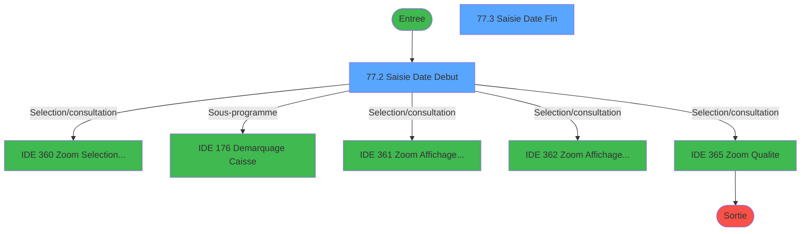
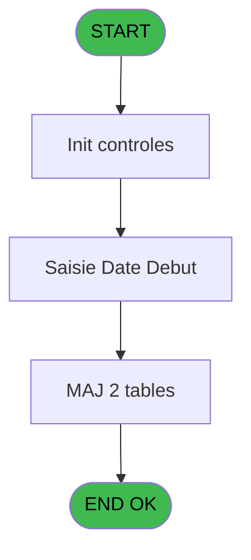
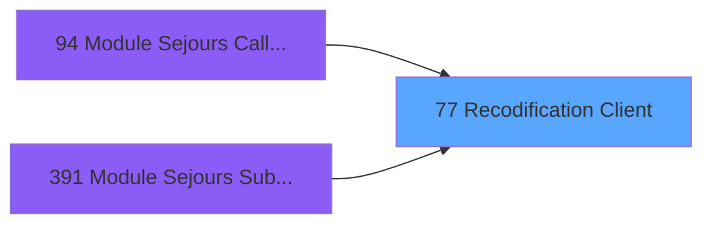
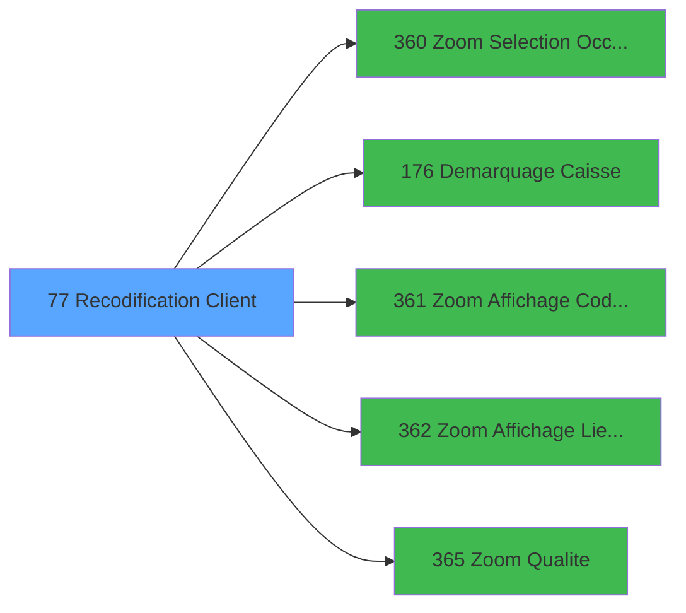

# PBG IDE 77 - Recodification Client

> **Analyse**: Phases 1-4 2026-02-03 09:11 -> 09:11 (19s) | Assemblage 09:11
> **Pipeline**: V7.2 Enrichi
> **Structure**: 4 onglets (Resume | Ecrans | Donnees | Connexions)

<!-- TAB:Resume -->

## 1. FICHE D'IDENTITE

| Attribut | Valeur |
|----------|--------|
| Projet | PBG |
| IDE Position | 77 |
| Nom Programme | Recodification Client |
| Fichier source | `Prg_77.xml` |
| Domaine metier | General |
| Taches | 24 (2 ecrans visibles) |
| Tables modifiees | 2 |
| Programmes appeles | 5 |

## 2. DESCRIPTION FONCTIONNELLE

**Recodification Client** assure la gestion complete de ce processus, accessible depuis [Module Sejours CallTask (IDE 0)](PBG-IDE-0.md), [Module Sejours CallTask (IDE 94)](PBG-IDE-94.md), [Module Sejours SubForm (IDE 391)](PBG-IDE-391.md).

Le flux de traitement s'organise en **5 blocs fonctionnels** :

- **Traitement** (11 taches) : traitements metier divers
- **Creation** (8 taches) : insertion d'enregistrements en base (mouvements, prestations)
- **Validation** (2 taches) : controles et verifications de coherence
- **Saisie** (2 taches) : ecrans de saisie utilisateur (formulaires, champs, donnees)
- **Consultation** (1 tache) : ecrans de recherche, selection et consultation

**Donnees modifiees** : 2 tables en ecriture (hebergement______heb, historik_station).

Detail : phases du traitement

#### Phase 1 : Traitement (11 taches)

- **77** - Recodification Client **[[ECRAN]](#ecran-t1)**
- **77.1** - Recuperation Periode
- **77.5** - Confirmation Recodification **[[ECRAN]](#ecran-t8)**
- **77.6** - Recodification Totale **[[ECRAN]](#ecran-t9)**
- **77.6.1** - Modification Hebergement
- **77.7** - Recodification Avant **[[ECRAN]](#ecran-t12)**
- **77.7.1** - Modification Hebergement
- **77.8** - Recodification Après **[[ECRAN]](#ecran-t16)**
- **77.8.1** - Modification Hebergement
- **77.9** - Recodification Milieu **[[ECRAN]](#ecran-t20)**
- **77.9.1** - Modification Hebergement

Delegue a : [Demarquage Caisse (IDE 176)](PBG-IDE-176.md)

#### Phase 2 : Saisie (2 taches)

- **77.2** - Saisie Date Debut **[[ECRAN]](#ecran-t3)**
- **77.3** - Saisie Date Fin **[[ECRAN]](#ecran-t4)**

#### Phase 3 : Consultation (1 tache)

- **77.4** - Selection Logement

Delegue a : [Zoom Selection Occupation (IDE 360)](PBG-IDE-360.md), [Zoom Affichage Code Logement (IDE 361)](PBG-IDE-361.md), [Zoom Affichage Lieu de Sejour (IDE 362)](PBG-IDE-362.md), [Zoom Qualite (IDE 365)](PBG-IDE-365.md)

#### Phase 4 : Validation (2 taches)

- **77.4.1** - Verification Lieu de Sejour
- **77.4.2** - Verification Code Logement

#### Phase 5 : Creation (8 taches)

- **77.6.2** - Creation Historique
- **77.7.2** - Creation Hebergement
- **77.7.3** - Creation Historique
- **77.8.2** - Creation Hebergement
- **77.8.3** - Creation Historique
- **77.9.2** - Creation Hebergement
- **77.9.3** - Creation Hebergement
- **77.9.4** - Creation Historique

#### Tables impactees

| Table | Operations | Role metier |
|-------|-----------|-------------|
| hebergement______heb | R/**W** (9 usages) | Hebergement (chambres) |
| historik_station | **W** (4 usages) | Historique / journal |

## 3. BLOCS FONCTIONNELS

### 3.1 Traitement (11 taches)

Traitements internes.

---

#### 77 - Recodification Client [[ECRAN]](#ecran-t1)

**Role** : Tache d'orchestration : point d'entree du programme (11 sous-taches). Coordonne l'enchainement des traitements.
**Ecran** : 132 x 40 DLU (MDI) | [Voir mockup](#ecran-t1)

10 sous-taches directes

| Tache | Nom | Bloc |
|-------|-----|------|
| [77.1](#t2) | Recuperation Periode | Traitement |
| [77.5](#t8) | Confirmation Recodification **[[ECRAN]](#ecran-t8)** | Traitement |
| [77.6](#t9) | Recodification Totale **[[ECRAN]](#ecran-t9)** | Traitement |
| [77.6.1](#t10) | Modification Hebergement | Traitement |
| [77.7](#t12) | Recodification Avant **[[ECRAN]](#ecran-t12)** | Traitement |
| [77.7.1](#t13) | Modification Hebergement | Traitement |
| [77.8](#t16) | Recodification Après **[[ECRAN]](#ecran-t16)** | Traitement |
| [77.8.1](#t17) | Modification Hebergement | Traitement |
| [77.9](#t20) | Recodification Milieu **[[ECRAN]](#ecran-t20)** | Traitement |
| [77.9.1](#t21) | Modification Hebergement | Traitement |

---

#### 77.1 - Recuperation Periode

**Role** : Consultation/chargement : Recuperation Periode.

---

#### 77.5 - Confirmation Recodification [[ECRAN]](#ecran-t8)

**Role** : Traitement : Confirmation Recodification.
**Ecran** : 132 x 32 DLU (Modal) | [Voir mockup](#ecran-t8)

---

#### 77.6 - Recodification Totale [[ECRAN]](#ecran-t9)

**Role** : Traitement : Recodification Totale.
**Ecran** : 132 x 32 DLU (Modal) | [Voir mockup](#ecran-t9)

---

#### 77.6.1 - Modification Hebergement

**Role** : Traitement : Modification Hebergement.

---

#### 77.7 - Recodification Avant [[ECRAN]](#ecran-t12)

**Role** : Traitement : Recodification Avant.
**Ecran** : 132 x 32 DLU (Modal) | [Voir mockup](#ecran-t12)

---

#### 77.7.1 - Modification Hebergement

**Role** : Traitement : Modification Hebergement.

---

#### 77.8 - Recodification Après [[ECRAN]](#ecran-t16)

**Role** : Traitement : Recodification Après.
**Ecran** : 132 x 32 DLU (Modal) | [Voir mockup](#ecran-t16)

---

#### 77.8.1 - Modification Hebergement

**Role** : Traitement : Modification Hebergement.

---

#### 77.9 - Recodification Milieu [[ECRAN]](#ecran-t20)

**Role** : Traitement : Recodification Milieu.
**Ecran** : 132 x 32 DLU (Modal) | [Voir mockup](#ecran-t20)

---

#### 77.9.1 - Modification Hebergement

**Role** : Traitement : Modification Hebergement.

### 3.2 Saisie (2 taches)

L'operateur saisit les donnees de la transaction via 2 ecrans (Saisie Date Debut, Saisie Date Fin).

---

#### 77.2 - Saisie Date Debut [[ECRAN]](#ecran-t3)

**Role** : Saisie des donnees : Saisie Date Debut.
**Ecran** : 501 x 84 DLU (MDI) | [Voir mockup](#ecran-t3)
**Variables liees** : A (P0-Date Debut), B (P0-Heure Debut), I (W0-Date Debut), J (W0-Heure Debut), K (W0-Date Deb.Prevue)

---

#### 77.3 - Saisie Date Fin [[ECRAN]](#ecran-t4)

**Role** : Saisie des donnees : Saisie Date Fin.
**Ecran** : 410 x 84 DLU (MDI) | [Voir mockup](#ecran-t4)
**Variables liees** : A (P0-Date Debut), I (W0-Date Debut), K (W0-Date Deb.Prevue), M (W0-Date Fin), O (W0-Date Fin Prevue)

### 3.3 Consultation (1 tache)

Ecrans de recherche et consultation.

---

#### 77.4 - Selection Logement

**Role** : Selection par l'operateur : Selection Logement.
**Variables liees** : F (P0-Code Logement), T (W0-Code Logement)
**Delegue a** : [Zoom Selection Occupation (IDE 360)](PBG-IDE-360.md), [Zoom Affichage Code Logement (IDE 361)](PBG-IDE-361.md), [Zoom Affichage Lieu de Sejour (IDE 362)](PBG-IDE-362.md)

### 3.4 Validation (2 taches)

Controles de coherence : 2 taches verifient les donnees et conditions.

---

#### 77.4.1 - Verification Lieu de Sejour

**Role** : Verification : Verification Lieu de Sejour.
**Variables liees** : E (P0-Lieu de Sejour), S (W0-Lieu de Sejour)

---

#### 77.4.2 - Verification Code Logement

**Role** : Verification : Verification Code Logement.
**Variables liees** : F (P0-Code Logement), T (W0-Code Logement)

### 3.5 Creation (8 taches)

Insertion de nouveaux enregistrements en base.

---

#### 77.6.2 - Creation Historique

**Role** : Consultation/chargement : Creation Historique.

---

#### 77.7.2 - Creation Hebergement

**Role** : Creation d'enregistrement : Creation Hebergement.

---

#### 77.7.3 - Creation Historique

**Role** : Consultation/chargement : Creation Historique.

---

#### 77.8.2 - Creation Hebergement

**Role** : Creation d'enregistrement : Creation Hebergement.

---

#### 77.8.3 - Creation Historique

**Role** : Consultation/chargement : Creation Historique.

---

#### 77.9.2 - Creation Hebergement

**Role** : Creation d'enregistrement : Creation Hebergement.

---

#### 77.9.3 - Creation Hebergement

**Role** : Creation d'enregistrement : Creation Hebergement.

---

#### 77.9.4 - Creation Historique

**Role** : Consultation/chargement : Creation Historique.

## 5. REGLES METIER

*(Aucune regle metier identifiee)*

## 6. CONTEXTE

- **Appele par**: [Module Sejours CallTask (IDE 0)](PBG-IDE-0.md), [Module Sejours CallTask (IDE 94)](PBG-IDE-94.md), [Module Sejours SubForm (IDE 391)](PBG-IDE-391.md)
- **Appelle**: 5 programmes | **Tables**: 5 (W:2 R:4 L:0) | **Taches**: 24 | **Expressions**: 14

<!-- TAB:Ecrans -->

## 8. ECRANS

### 8.1 Forms visibles (2 / 24)

| # | Position | Tache | Nom | Type | Largeur | Hauteur | Bloc |
|---|----------|-------|-----|------|---------|---------|------|
| 1 | 77.2 | 77.2 | Saisie Date Debut | MDI | 501 | 84 | Saisie |
| 2 | 77.3 | 77.3 | Saisie Date Fin | MDI | 410 | 84 | Saisie |

### 8.2 Mockups Ecrans

---

#### 77.2 - Saisie Date Debut
**Tache** : [77.2](#t3) | **Type** : MDI | **Dimensions** : 501 x 84 DLU
**Bloc** : Saisie | **Titre IDE** : Saisie Date Debut

<!-- FORM-DATA:
{
    "width":  501,
    "vFactor":  8,
    "type":  "MDI",
    "hFactor":  8,
    "controls":  [
                     {
                         "x":  151,
                         "type":  "label",
                         "var":  "",
                         "y":  14,
                         "w":  341,
                         "fmt":  "",
                         "name":  "",
                         "h":  29,
                         "color":  "",
                         "text":  "",
                         "parent":  null
                     },
                     {
                         "x":  153,
                         "type":  "label",
                         "var":  "",
                         "y":  23,
                         "w":  146,
                         "fmt":  "",
                         "name":  "",
                         "h":  10,
                         "color":  "",
                         "text":  "Date debut",
                         "parent":  2
                     },
                     {
                         "x":  0,
                         "type":  "label",
                         "var":  "",
                         "y":  60,
                         "w":  492,
                         "fmt":  "",
                         "name":  "",
                         "h":  24,
                         "color":  "",
                         "text":  "",
                         "parent":  null
                     },
                     {
                         "x":  452,
                         "type":  "button",
                         "var":  "",
                         "y":  23,
                         "w":  27,
                         "fmt":  "...",
                         "name":  "Btn Date",
                         "h":  10,
                         "color":  "",
                         "text":  "",
                         "parent":  null
                     },
                     {
                         "x":  324,
                         "type":  "edit",
                         "var":  "",
                         "y":  23,
                         "w":  126,
                         "fmt":  "",
                         "name":  "W1-Date Debut",
                         "h":  10,
                         "color":  "6",
                         "text":  "",
                         "parent":  2
                     },
                     {
                         "x":  2,
                         "type":  "image",
                         "var":  "",
                         "y":  3,
                         "w":  144,
                         "fmt":  "",
                         "name":  "",
                         "h":  53,
                         "color":  "",
                         "text":  "",
                         "parent":  null
                     },
                     {
                         "x":  5,
                         "type":  "button",
                         "var":  "",
                         "y":  63,
                         "w":  154,
                         "fmt":  "\u0026Ok",
                         "name":  "",
                         "h":  18,
                         "color":  "",
                         "text":  "",
                         "parent":  5
                     },
                     {
                         "x":  164,
                         "type":  "button",
                         "var":  "",
                         "y":  63,
                         "w":  154,
                         "fmt":  "A\u0026bandonner",
                         "name":  "",
                         "h":  18,
                         "color":  "",
                         "text":  "",
                         "parent":  null
                     }
                 ],
    "taskId":  "77.2",
    "height":  84
}
-->

<strong>Champs : 1 champs</strong>

| Pos (x,y) | Nom | Variable | Type |
|-----------|-----|----------|------|
| 324,23 | W1-Date Debut | - | edit |

<strong>Boutons : 3 boutons</strong>

| Bouton | Pos (x,y) | Action |
|--------|-----------|--------|
| ... | 452,23 | Bouton fonctionnel |
| Ok | 5,63 | Valide la saisie et enregistre |
| Abandonner | 164,63 | Annule et retour au menu |

---

#### 77.3 - Saisie Date Fin
**Tache** : [77.3](#t4) | **Type** : MDI | **Dimensions** : 410 x 84 DLU
**Bloc** : Saisie | **Titre IDE** : Saisie Date Fin

<!-- FORM-DATA:
{
    "width":  410,
    "vFactor":  8,
    "type":  "MDI",
    "hFactor":  8,
    "controls":  [
                     {
                         "x":  137,
                         "type":  "label",
                         "var":  "",
                         "y":  14,
                         "w":  266,
                         "fmt":  "",
                         "name":  "",
                         "h":  29,
                         "color":  "",
                         "text":  "",
                         "parent":  null
                     },
                     {
                         "x":  143,
                         "type":  "label",
                         "var":  "",
                         "y":  23,
                         "w":  90,
                         "fmt":  "",
                         "name":  "",
                         "h":  10,
                         "color":  "",
                         "text":  "Date fin",
                         "parent":  2
                     },
                     {
                         "x":  0,
                         "type":  "label",
                         "var":  "",
                         "y":  60,
                         "w":  409,
                         "fmt":  "",
                         "name":  "",
                         "h":  24,
                         "color":  "",
                         "text":  "",
                         "parent":  null
                     },
                     {
                         "x":  365,
                         "type":  "button",
                         "var":  "",
                         "y":  23,
                         "w":  27,
                         "fmt":  "...",
                         "name":  "Btn Date",
                         "h":  10,
                         "color":  "",
                         "text":  "",
                         "parent":  null
                     },
                     {
                         "x":  237,
                         "type":  "edit",
                         "var":  "",
                         "y":  23,
                         "w":  126,
                         "fmt":  "",
                         "name":  "W1-Date Fin",
                         "h":  10,
                         "color":  "6",
                         "text":  "",
                         "parent":  2
                     },
                     {
                         "x":  2,
                         "type":  "image",
                         "var":  "",
                         "y":  3,
                         "w":  144,
                         "fmt":  "",
                         "name":  "",
                         "h":  53,
                         "color":  "",
                         "text":  "",
                         "parent":  null
                     },
                     {
                         "x":  5,
                         "type":  "button",
                         "var":  "",
                         "y":  63,
                         "w":  154,
                         "fmt":  "\u0026Ok",
                         "name":  "",
                         "h":  18,
                         "color":  "",
                         "text":  "",
                         "parent":  5
                     },
                     {
                         "x":  163,
                         "type":  "button",
                         "var":  "",
                         "y":  63,
                         "w":  154,
                         "fmt":  "A\u0026bandonner",
                         "name":  "",
                         "h":  18,
                         "color":  "",
                         "text":  "",
                         "parent":  null
                     }
                 ],
    "taskId":  "77.3",
    "height":  84
}
-->

<strong>Champs : 1 champs</strong>

| Pos (x,y) | Nom | Variable | Type |
|-----------|-----|----------|------|
| 237,23 | W1-Date Fin | - | edit |

<strong>Boutons : 3 boutons</strong>

| Bouton | Pos (x,y) | Action |
|--------|-----------|--------|
| ... | 365,23 | Bouton fonctionnel |
| Ok | 5,63 | Valide la saisie et enregistre |
| Abandonner | 163,63 | Annule et retour au menu |

## 9. NAVIGATION

### 9.1 Enchainement des ecrans

**Detail par enchainement :**

| Depuis | Action | Vers | Retour |
|--------|--------|------|--------|
| Saisie Date Debut | Selection/consultation | [Zoom Selection Occupation (IDE 360)](PBG-IDE-360.md) | Retour ecran |
| Saisie Date Debut | Sous-programme | [Demarquage Caisse (IDE 176)](PBG-IDE-176.md) | Retour ecran |
| Saisie Date Debut | Selection/consultation | [Zoom Affichage Code Logement (IDE 361)](PBG-IDE-361.md) | Retour ecran |
| Saisie Date Debut | Selection/consultation | [Zoom Affichage Lieu de Sejour (IDE 362)](PBG-IDE-362.md) | Retour ecran |
| Saisie Date Debut | Selection/consultation | [Zoom Qualite (IDE 365)](PBG-IDE-365.md) | Retour ecran |

### 9.3 Structure hierarchique (24 taches)

| Position | Tache | Type | Dimensions | Bloc |
|----------|-------|------|------------|------|
| **77.1** | [**Recodification Client** (77)](#t1) [mockup](#ecran-t1) | MDI | 132x40 | Traitement |
| 77.1.1 | [Recuperation Periode (77.1)](#t2) | MDI | - | |
| 77.1.2 | [Confirmation Recodification (77.5)](#t8) [mockup](#ecran-t8) | Modal | 132x32 | |
| 77.1.3 | [Recodification Totale (77.6)](#t9) [mockup](#ecran-t9) | Modal | 132x32 | |
| 77.1.4 | [Modification Hebergement (77.6.1)](#t10) | MDI | - | |
| 77.1.5 | [Recodification Avant (77.7)](#t12) [mockup](#ecran-t12) | Modal | 132x32 | |
| 77.1.6 | [Modification Hebergement (77.7.1)](#t13) | MDI | - | |
| 77.1.7 | [Recodification Après (77.8)](#t16) [mockup](#ecran-t16) | Modal | 132x32 | |
| 77.1.8 | [Modification Hebergement (77.8.1)](#t17) | MDI | - | |
| 77.1.9 | [Recodification Milieu (77.9)](#t20) [mockup](#ecran-t20) | Modal | 132x32 | |
| 77.1.10 | [Modification Hebergement (77.9.1)](#t21) | MDI | - | |
| **77.2** | [**Saisie Date Debut** (77.2)](#t3) [mockup](#ecran-t3) | MDI | 501x84 | Saisie |
| 77.2.1 | [Saisie Date Fin (77.3)](#t4) [mockup](#ecran-t4) | MDI | 410x84 | |
| **77.3** | [**Selection Logement** (77.4)](#t5) | MDI | - | Consultation |
| **77.4** | [**Verification Lieu de Sejour** (77.4.1)](#t6) | MDI | - | Validation |
| 77.4.1 | [Verification Code Logement (77.4.2)](#t7) | MDI | - | |
| **77.5** | [**Creation Historique** (77.6.2)](#t11) | MDI | - | Creation |
| 77.5.1 | [Creation Hebergement (77.7.2)](#t14) | MDI | - | |
| 77.5.2 | [Creation Historique (77.7.3)](#t15) | MDI | - | |
| 77.5.3 | [Creation Hebergement (77.8.2)](#t18) | MDI | - | |
| 77.5.4 | [Creation Historique (77.8.3)](#t19) | MDI | - | |
| 77.5.5 | [Creation Hebergement (77.9.2)](#t22) | MDI | - | |
| 77.5.6 | [Creation Hebergement (77.9.3)](#t23) | MDI | - | |
| 77.5.7 | [Creation Historique (77.9.4)](#t24) | MDI | - | |

### 9.4 Algorigramme

> **Legende**: Vert = START/END OK | Rouge = END KO | Bleu = Decisions
> *Algorigramme auto-genere. Utiliser `/algorigramme` pour une synthese metier detaillee.*

<!-- TAB:Donnees -->

## 10. TABLES

### Tables utilisees (5)

| ID | Nom | Description | Type | R | W | L | Usages |
|----|-----|-------------|------|---|---|---|--------|
| 34 | hebergement______heb | Hebergement (chambres) | DB | R | **W** |   | 9 |
| 36 | client_gm |  | DB | R |   |   | 4 |
| 88 | historik_station | Historique / journal | DB |   | **W** |   | 4 |
| 108 | code_logement____clo |  | DB | R |   |   | 1 |
| 118 | tables_imports |  | DB | R |   |   | 1 |

### Colonnes par table (2 / 5 tables avec colonnes identifiees)

Table 34 - hebergement______heb (R/**W**) - 9 usages

*Table utilisee uniquement en Link ou aucune colonne Real identifiee dans le DataView.*

Table 36 - client_gm (R) - 4 usages

| Lettre | Variable | Acces | Type |
|--------|----------|-------|------|
| A | W1-Statut Sejour | R | Alpha |
| B | W1-Libelle | R | Alpha |
| C | W1-Age | R | Alpha |
| D | W1-Nationalite | R | Alpha |
| E | W1-Code Sexe | R | Alpha |
| F | W1-Code Fumeur | R | Alpha |
| G | W1-Nom Logement | R | Alpha |
| H | W1-Age num | R | Numeric |
| I | W1-Nb mois | R | Numeric |

Table 88 - historik_station (**W**) - 4 usages

*Table utilisee uniquement en Link ou aucune colonne Real identifiee dans le DataView.*

Table 108 - code_logement____clo (R) - 1 usages

| Lettre | Variable | Acces | Type |
|--------|----------|-------|------|
| A | W2-Code Retour | R | Numeric |
| C | W1-Accord Logement | R | Alpha |
| E | W1-Code Sexe | R | Alpha |
| F | P0-Code Logement | R | Alpha |
| G | W1-Nom Logement | R | Alpha |
| T | W0-Code Logement | R | Alpha |

Table 118 - tables_imports (R) - 1 usages

*Table utilisee uniquement en Link ou aucune colonne Real identifiee dans le DataView.*

## 11. VARIABLES

### 11.1 Autres (23)

Variables diverses.

| Lettre | Nom | Type | Usage dans |
|--------|-----|------|-----------|
| A | P0-Date Debut | Date | - |
| B | P0-Heure Debut | Alpha | - |
| C | P0-Valide (N/B/P) | Alpha | - |
| D | P0-P/U Occupation | Alpha | - |
| E | P0-Lieu de Sejour | Alpha | - |
| F | P0-Code Logement | Alpha | - |
| G | P0-Qualite | Alpha | - |
| H | P0-Complement | Alpha | - |
| I | W0-Date Debut | Date | [77.2](#t3) |
| J | W0-Heure Debut | Alpha | - |
| K | W0-Date Deb.Prevue | Date | 5x refs |
| L | W0-Heure Deb.Prevue | Alpha | - |
| M | W0-Date Fin | Date | 5x refs |
| N | W0-Heure Fin | Alpha | - |
| O | W0-Date Fin Prevue | Date | 4x refs |
| P | W0-Heure Fin Prevue | Alpha | - |
| Q | W0-Qualite | Alpha | - |
| R | W0-Complement | Alpha | 1x refs |
| S | W0-Lieu de Sejour | Alpha | - |
| T | W0-Code Logement | Alpha | - |
| U | W0-Occupation | Alpha | - |
| V | W0-Base Occupation | Alpha | - |
| W | W0-Accord Suite | Alpha | 4x refs |

Toutes les 23 variables (liste complete)

| Cat | Lettre | Nom Variable | Type |
|-----|--------|--------------|------|
| Autre | **A** | P0-Date Debut | Date |
| Autre | **B** | P0-Heure Debut | Alpha |
| Autre | **C** | P0-Valide (N/B/P) | Alpha |
| Autre | **D** | P0-P/U Occupation | Alpha |
| Autre | **E** | P0-Lieu de Sejour | Alpha |
| Autre | **F** | P0-Code Logement | Alpha |
| Autre | **G** | P0-Qualite | Alpha |
| Autre | **H** | P0-Complement | Alpha |
| Autre | **I** | W0-Date Debut | Date |
| Autre | **J** | W0-Heure Debut | Alpha |
| Autre | **K** | W0-Date Deb.Prevue | Date |
| Autre | **L** | W0-Heure Deb.Prevue | Alpha |
| Autre | **M** | W0-Date Fin | Date |
| Autre | **N** | W0-Heure Fin | Alpha |
| Autre | **O** | W0-Date Fin Prevue | Date |
| Autre | **P** | W0-Heure Fin Prevue | Alpha |
| Autre | **Q** | W0-Qualite | Alpha |
| Autre | **R** | W0-Complement | Alpha |
| Autre | **S** | W0-Lieu de Sejour | Alpha |
| Autre | **T** | W0-Code Logement | Alpha |
| Autre | **U** | W0-Occupation | Alpha |
| Autre | **V** | W0-Base Occupation | Alpha |
| Autre | **W** | W0-Accord Suite | Alpha |

## 12. EXPRESSIONS

**14 / 14 expressions decodees (100%)**

### 12.1 Repartition par type

| Type | Expressions | Regles |
|------|-------------|--------|
| CONDITION | 8 | 0 |
| CONSTANTE | 3 | 0 |
| OTHER | 3 | 0 |

### 12.2 Expressions cles par type

#### CONDITION (8 expressions)

| Type | IDE | Expression | Regle |
|------|-----|------------|-------|
| CONDITION | 11 | `W0-Date Debut [I]=W0-Date Deb.Prevue [K] AND W0-Date Fin [M]>W0-Date Fin Prevue [O]` | - |
| CONDITION | 10 | `W0-Date Debut [I]=W0-Date Deb.Prevue [K] AND W0-Date Fin [M]=W0-Date Fin Prevue [O]` | - |
| CONDITION | 13 | `W0-Date Debut [I]<W0-Date Deb.Prevue [K] AND W0-Date Fin [M]>W0-Date Fin Prevue [O]` | - |
| CONDITION | 12 | `W0-Date Debut [I]<W0-Date Deb.Prevue [K] AND W0-Date Fin [M]=W0-Date Fin Prevue [O]` | - |
| CONDITION | 6 | `W0-Accord Suite [W]='O'` | - |
| ... | | *+3 autres* | |

#### CONSTANTE (3 expressions)

| Type | IDE | Expression | Regle |
|------|-----|------------|-------|
| CONSTANTE | 14 | `''` | - |
| CONSTANTE | 5 | `'TUP'` | - |
| CONSTANTE | 4 | `'TBAOC'` | - |

#### OTHER (3 expressions)

| Type | IDE | Expression | Regle |
|------|-----|------------|-------|
| OTHER | 3 | `GetParam ('SOCIETE')` | - |
| OTHER | 2 | `GetParam ('LANGUE')` | - |
| OTHER | 1 | `GetParam ('NRO_CPTE')` | - |

<!-- TAB:Connexions -->

## 13. GRAPHE D'APPELS

### 13.1 Chaine depuis Main (Callers)

Main -> ... -> [Module Sejours CallTask (IDE 0)](PBG-IDE-0.md) -> **Recodification Client (IDE 77)**

Main -> ... -> [Module Sejours CallTask (IDE 94)](PBG-IDE-94.md) -> **Recodification Client (IDE 77)**

Main -> ... -> [Module Sejours SubForm (IDE 391)](PBG-IDE-391.md) -> **Recodification Client (IDE 77)**

### 13.2 Callers

| IDE | Nom Programme | Nb Appels |
|-----|---------------|-----------|
| [0](PBG-IDE-0.md) | Module Sejours CallTask | 1 |
| [94](PBG-IDE-94.md) | Module Sejours CallTask | 1 |
| [391](PBG-IDE-391.md) | Module Sejours SubForm | 1 |

### 13.3 Callees (programmes appeles)

### 13.4 Detail Callees avec contexte

| IDE | Nom Programme | Appels | Contexte |
|-----|---------------|--------|----------|
| [360](PBG-IDE-360.md) | Zoom Selection Occupation | 2 | Selection/consultation |
| [176](PBG-IDE-176.md) | Demarquage Caisse | 1 | Sous-programme |
| [361](PBG-IDE-361.md) | Zoom Affichage Code Logement | 1 | Selection/consultation |
| [362](PBG-IDE-362.md) | Zoom Affichage Lieu de Sejour | 1 | Selection/consultation |
| [365](PBG-IDE-365.md) | Zoom Qualite | 1 | Selection/consultation |

## 14. RECOMMANDATIONS MIGRATION

### 14.1 Profil du programme

| Metrique | Valeur | Impact migration |
|----------|--------|-----------------|
| Lignes de logique | 732 | Programme volumineux |
| Expressions | 14 | Peu de logique |
| Tables WRITE | 2 | Impact faible |
| Sous-programmes | 5 | Peu de dependances |
| Ecrans visibles | 2 | Quelques ecrans |
| Code desactive | 0% (0 / 732) | Code sain |
| Regles metier | 0 | Pas de regle identifiee |

### 14.2 Plan de migration par bloc

#### Traitement (11 taches: 6 ecrans, 5 traitements)

- **Strategie** : Orchestrateur avec 6 ecrans (Razor/React) et 5 traitements backend (services).
- Les ecrans deviennent des composants UI, les traitements invisibles deviennent des services injectables.
- 5 sous-programme(s) a migrer ou a reutiliser depuis les services existants.
- Decomposer les taches en services unitaires testables.

#### Saisie (2 taches: 2 ecrans, 0 traitement)

- **Strategie** : Formulaire React/Blazor avec validation Zod/FluentValidation.
- Reproduire 2 ecrans : Saisie Date Debut, Saisie Date Fin
- Validation temps reel cote client + serveur

#### Consultation (1 tache: 0 ecran, 1 traitement)

- **Strategie** : Composants de recherche/selection en modales.

#### Validation (2 taches: 0 ecran, 2 traitements)

- **Strategie** : FluentValidation avec validators specifiques.
- Chaque tache de validation -> un validator injectable

#### Creation (8 taches: 0 ecran, 8 traitements)

- **Strategie** : Repository pattern avec Entity Framework Core.
- Insertion via `IRepository<T>.CreateAsync()`

### 14.3 Dependances critiques

| Dependance | Type | Appels | Impact |
|------------|------|--------|--------|
| hebergement______heb | Table WRITE (Database) | 8x | Schema + repository |
| historik_station | Table WRITE (Database) | 4x | Schema + repository |
| [Zoom Selection Occupation (IDE 360)](PBG-IDE-360.md) | Sous-programme | 2x | Haute - Selection/consultation |
| [Zoom Affichage Lieu de Sejour (IDE 362)](PBG-IDE-362.md) | Sous-programme | 1x | Normale - Selection/consultation |
| [Zoom Qualite (IDE 365)](PBG-IDE-365.md) | Sous-programme | 1x | Normale - Selection/consultation |
| [Demarquage Caisse (IDE 176)](PBG-IDE-176.md) | Sous-programme | 1x | Normale - Sous-programme |
| [Zoom Affichage Code Logement (IDE 361)](PBG-IDE-361.md) | Sous-programme | 1x | Normale - Selection/consultation |

---
*Spec DETAILED generee par Pipeline V7.2 - 2026-02-03 09:11*
