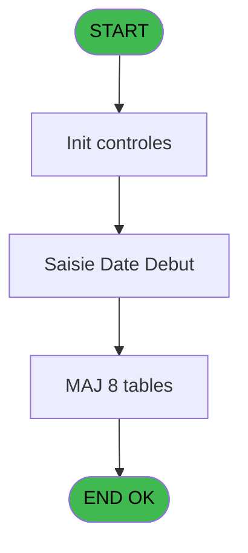
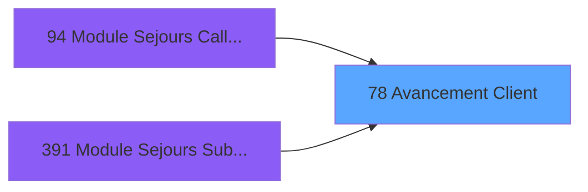
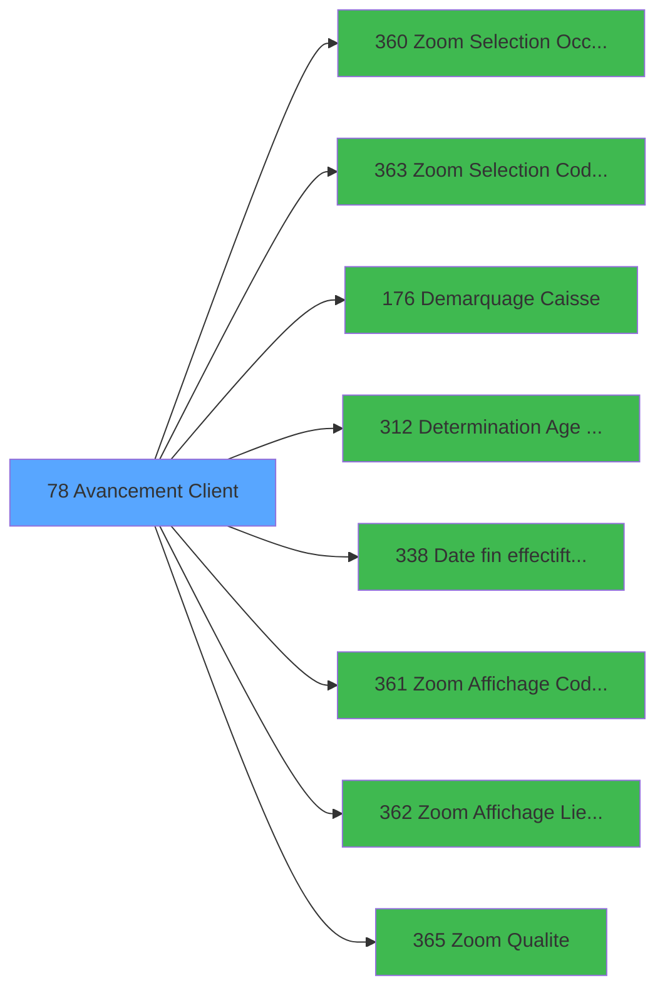

# PBG IDE 78 - Avancement Client

> **Analyse**: Phases 1-4 2026-02-03 09:11 -> 09:11 (20s) | Assemblage 09:11
> **Pipeline**: V7.2 Enrichi
> **Structure**: 4 onglets (Resume | Ecrans | Donnees | Connexions)

<!-- TAB:Resume -->

## 1. FICHE D'IDENTITE

| Attribut | Valeur |
|----------|--------|
| Projet | PBG |
| IDE Position | 78 |
| Nom Programme | Avancement Client |
| Fichier source | `Prg_78.xml` |
| Domaine metier | General |
| Taches | 23 (1 ecrans visibles) |
| Tables modifiees | 8 |
| Programmes appeles | 8 |

## 2. DESCRIPTION FONCTIONNELLE

**Avancement Client** assure la gestion complete de ce processus, accessible depuis [Module Sejours CallTask (IDE 0)](PBG-IDE-0.md), [Module Sejours CallTask (IDE 94)](PBG-IDE-94.md), [Module Sejours SubForm (IDE 391)](PBG-IDE-391.md).

Le flux de traitement s'organise en **5 blocs fonctionnels** :

- **Traitement** (14 taches) : traitements metier divers
- **Creation** (3 taches) : insertion d'enregistrements en base (mouvements, prestations)
- **Validation** (3 taches) : controles et verifications de coherence
- **Consultation** (2 taches) : ecrans de recherche, selection et consultation
- **Saisie** (1 tache) : ecrans de saisie utilisateur (formulaires, champs, donnees)

**Donnees modifiees** : 8 tables en ecriture (gm-recherche_____gmr, hebergement______heb, client_gm, compte_gm________cgm, historik_station, fichier_validation, groupe_arr_dep___vol, heb_circuit______hci).

**Logique metier** : 2 regles identifiees couvrant valeurs par defaut.

Detail : phases du traitement

#### Phase 1 : Traitement (14 taches)

- **78** - Avancement Client **[[ECRAN]](#ecran-t1)**
- **78.1** - Age Bebe
- **78.2.1** - Determination Qualite
- **78.3** - Recuperation Debut
- **78.7** - Confirmation Avancement **[[ECRAN]](#ecran-t11)**
- **78.8** - Avancement Batch **[[ECRAN]](#ecran-t12)**
- **78.8.2** - Modification Package Retour
- **78.8.3** - Mofification Heure Deb Circuit
- **78.8.4** - Modification Package
- **78.8.5** - Modification Sejour
- **78.8.6** - Modification Sejour
- **78.8.7** - Modification Sejour
- **78.8.9** - Modification Package
- **78.8.10** - Modification Package

Delegue a : [Demarquage Caisse (IDE 176)](PBG-IDE-176.md), [Determination Age Debut Sejour (IDE 312)](PBG-IDE-312.md)

#### Phase 2 : Consultation (2 taches)

- **78.2** - Selection Qualite
- **78.6** - Selection Logement

Delegue a : [Zoom Selection Occupation (IDE 360)](PBG-IDE-360.md), [Zoom Selection Code-Vol (IDE 363)](PBG-IDE-363.md), [Zoom Affichage Code Logement (IDE 361)](PBG-IDE-361.md), [Zoom Affichage Lieu de Sejour (IDE 362)](PBG-IDE-362.md), [Zoom Qualite (IDE 365)](PBG-IDE-365.md)

#### Phase 3 : Saisie (1 tache)

- **78.4** - Saisie Date Debut **[[ECRAN]](#ecran-t6)**

#### Phase 4 : Creation (3 taches)

- **78.5** - Creation Groupe V/V
- **78.8.1** - Creation Hebergement
- **78.8.11** - Creation Historique

#### Phase 5 : Validation (3 taches)

- **78.6.1** - Verification Lieu Sejour
- **78.6.2** - Verification Code Logement
- **78.8.8** - Modification Validation

#### Tables impactees

| Table | Operations | Role metier |
|-------|-----------|-------------|
| hebergement______heb | R/**W** (7 usages) | Hebergement (chambres) |
| client_gm | R/**W** (2 usages) |  |
| compte_gm________cgm | **W** (1 usages) | Comptes GM (generaux) |
| historik_station | **W** (1 usages) | Historique / journal |
| fichier_validation | **W** (1 usages) |  |
| groupe_arr_dep___vol | **W** (1 usages) |  |
| heb_circuit______hci | **W** (1 usages) | Hebergement (chambres) |
| gm-recherche_____gmr | **W** (1 usages) | Index de recherche |

## 3. BLOCS FONCTIONNELS

### 3.1 Traitement (14 taches)

Traitements internes.

---

#### 78 - Avancement Client [[ECRAN]](#ecran-t1)

**Role** : Tache d'orchestration : point d'entree du programme (14 sous-taches). Coordonne l'enchainement des traitements.
**Ecran** : 406 x 161 DLU (MDI) | [Voir mockup](#ecran-t1)

13 sous-taches directes

| Tache | Nom | Bloc |
|-------|-----|------|
| [78.1](#t2) | Age Bebe | Traitement |
| [78.2.1](#t4) | Determination Qualite | Traitement |
| [78.3](#t5) | Recuperation Debut | Traitement |
| [78.7](#t11) | Confirmation Avancement **[[ECRAN]](#ecran-t11)** | Traitement |
| [78.8](#t12) | Avancement Batch **[[ECRAN]](#ecran-t12)** | Traitement |
| [78.8.2](#t14) | Modification Package Retour | Traitement |
| [78.8.3](#t15) | Mofification Heure Deb Circuit | Traitement |
| [78.8.4](#t16) | Modification Package | Traitement |
| [78.8.5](#t17) | Modification Sejour | Traitement |
| [78.8.6](#t18) | Modification Sejour | Traitement |
| [78.8.7](#t19) | Modification Sejour | Traitement |
| [78.8.9](#t21) | Modification Package | Traitement |
| [78.8.10](#t22) | Modification Package | Traitement |

---

#### 78.1 - Age Bebe

**Role** : Traitement : Age Bebe.
**Variables liees** : X (W0 Age bebe)

---

#### 78.2.1 - Determination Qualite

**Role** : Traitement : Determination Qualite.
**Variables liees** : A (W0-Qualite)

---

#### 78.3 - Recuperation Debut

**Role** : Consultation/chargement : Recuperation Debut.
**Variables liees** : C (W0-Date Debut), D (W0-Heure Debut)

---

#### 78.7 - Confirmation Avancement [[ECRAN]](#ecran-t11)

**Role** : Traitement : Confirmation Avancement.
**Ecran** : 132 x 32 DLU (Modal) | [Voir mockup](#ecran-t11)

---

#### 78.8 - Avancement Batch [[ECRAN]](#ecran-t12)

**Role** : Traitement : Avancement Batch.
**Ecran** : 132 x 32 DLU (Modal) | [Voir mockup](#ecran-t12)

---

#### 78.8.2 - Modification Package Retour

**Role** : Traitement : Modification Package Retour.
**Variables liees** : M (W0 Code Ville Retour), N (W0 Lib Transp Retour), K (W0-Code Vol Retour), L (W0-Transport Retour)

---

#### 78.8.3 - Mofification Heure Deb Circuit

**Role** : Traitement : Mofification Heure Deb Circuit.
**Variables liees** : D (W0-Heure Debut), F (W0-Heure Fin)

---

#### 78.8.4 - Modification Package

**Role** : Traitement : Modification Package.

---

#### 78.8.5 - Modification Sejour

**Role** : Traitement : Modification Sejour.
**Variables liees** : O (W0-Lieu de Sejour)

---

#### 78.8.6 - Modification Sejour

**Role** : Traitement : Modification Sejour.
**Variables liees** : O (W0-Lieu de Sejour)

---

#### 78.8.7 - Modification Sejour

**Role** : Traitement : Modification Sejour.
**Variables liees** : O (W0-Lieu de Sejour)

---

#### 78.8.9 - Modification Package

**Role** : Traitement : Modification Package.

---

#### 78.8.10 - Modification Package

**Role** : Traitement : Modification Package.

### 3.2 Consultation (2 taches)

Ecrans de recherche et consultation.

---

#### 78.2 - Selection Qualite

**Role** : Selection par l'operateur : Selection Qualite.
**Variables liees** : A (W0-Qualite)
**Delegue a** : [Zoom Selection Occupation (IDE 360)](PBG-IDE-360.md), [Zoom Selection Code-Vol (IDE 363)](PBG-IDE-363.md), [Zoom Affichage Code Logement (IDE 361)](PBG-IDE-361.md)

---

#### 78.6 - Selection Logement

**Role** : Selection par l'operateur : Selection Logement.
**Variables liees** : P (W0-Code Logement)
**Delegue a** : [Zoom Selection Occupation (IDE 360)](PBG-IDE-360.md), [Zoom Selection Code-Vol (IDE 363)](PBG-IDE-363.md), [Zoom Affichage Code Logement (IDE 361)](PBG-IDE-361.md)

### 3.3 Saisie (1 tache)

L'operateur saisit les donnees de la transaction via 1 ecran (Saisie Date Debut).

---

#### 78.4 - Saisie Date Debut [[ECRAN]](#ecran-t6)

**Role** : Saisie des donnees : Saisie Date Debut.
**Ecran** : 453 x 87 DLU (MDI) | [Voir mockup](#ecran-t6)
**Variables liees** : C (W0-Date Debut), D (W0-Heure Debut), E (W0-Date Fin)

### 3.4 Creation (3 taches)

Insertion de nouveaux enregistrements en base.

---

#### 78.5 - Creation Groupe V/V

**Role** : Creation d'enregistrement : Creation Groupe V/V.

---

#### 78.8.1 - Creation Hebergement

**Role** : Creation d'enregistrement : Creation Hebergement.

---

#### 78.8.11 - Creation Historique

**Role** : Consultation/chargement : Creation Historique.

### 3.5 Validation (3 taches)

Controles de coherence : 3 taches verifient les donnees et conditions.

---

#### 78.6.1 - Verification Lieu Sejour

**Role** : Verification : Verification Lieu Sejour.
**Variables liees** : O (W0-Lieu de Sejour)

---

#### 78.6.2 - Verification Code Logement

**Role** : Verification : Verification Code Logement.
**Variables liees** : M (W0 Code Ville Retour), U (W0 Code Sexe), V (W0 Code Fumeur), G (W0-Code Vol Aller), I (W0-Code Ville Aller)

---

#### 78.8.8 - Modification Validation

**Role** : Verification : Modification Validation.

## 5. REGLES METIER

2 regles identifiees:

### Saisie (2 regles)

#### [RM-001] Valeur par defaut si W0-Heure Debut [D] est vide

| Element | Detail |
|---------|--------|
| **Condition** | `W0-Heure Debut [D]=''` |
| **Si vrai** | 'U3' |
| **Si faux** | 'U2h') |
| **Variables** | D (W0-Heure Debut) |
| **Expression source** | Expression 8 : `IF (W0-Heure Debut [D]='','U3','U2h')` |
| **Exemple** | Si W0-Heure Debut [D]='' → 'U3'. Sinon → 'U2h') |
| **Impact** | Bloc Saisie |

#### [RM-002] Valeur par defaut si W0-Heure Fin [F] est vide

| Element | Detail |
|---------|--------|
| **Condition** | `W0-Heure Fin [F]=''` |
| **Si vrai** | 'U3' |
| **Si faux** | 'U2h') |
| **Variables** | F (W0-Heure Fin) |
| **Expression source** | Expression 9 : `IF (W0-Heure Fin [F]='','U3','U2h')` |
| **Exemple** | Si W0-Heure Fin [F]='' → 'U3'. Sinon → 'U2h') |
| **Impact** | Bloc Saisie |

## 6. CONTEXTE

- **Appele par**: [Module Sejours CallTask (IDE 0)](PBG-IDE-0.md), [Module Sejours CallTask (IDE 94)](PBG-IDE-94.md), [Module Sejours SubForm (IDE 391)](PBG-IDE-391.md)
- **Appelle**: 8 programmes | **Tables**: 12 (W:8 R:5 L:2) | **Taches**: 23 | **Expressions**: 13

<!-- TAB:Ecrans -->

## 8. ECRANS

### 8.1 Forms visibles (1 / 23)

| # | Position | Tache | Nom | Type | Largeur | Hauteur | Bloc |
|---|----------|-------|-----|------|---------|---------|------|
| 1 | 78.4 | 78.4 | Saisie Date Debut | MDI | 453 | 87 | Saisie |

### 8.2 Mockups Ecrans

---

#### 78.4 - Saisie Date Debut
**Tache** : [78.4](#t6) | **Type** : MDI | **Dimensions** : 453 x 87 DLU
**Bloc** : Saisie | **Titre IDE** : Saisie Date Debut

<!-- FORM-DATA:
{
    "width":  453,
    "vFactor":  8,
    "type":  "MDI",
    "hFactor":  8,
    "controls":  [
                     {
                         "x":  146,
                         "type":  "label",
                         "var":  "",
                         "y":  14,
                         "w":  307,
                         "fmt":  "",
                         "name":  "",
                         "h":  27,
                         "color":  "",
                         "text":  "",
                         "parent":  null
                     },
                     {
                         "x":  162,
                         "type":  "label",
                         "var":  "",
                         "y":  23,
                         "w":  124,
                         "fmt":  "",
                         "name":  "",
                         "h":  10,
                         "color":  "",
                         "text":  "Date Debut",
                         "parent":  2
                     },
                     {
                         "x":  0,
                         "type":  "label",
                         "var":  "",
                         "y":  60,
                         "w":  444,
                         "fmt":  "",
                         "name":  "",
                         "h":  24,
                         "color":  "",
                         "text":  "",
                         "parent":  null
                     },
                     {
                         "x":  417,
                         "type":  "button",
                         "var":  "",
                         "y":  23,
                         "w":  27,
                         "fmt":  "...",
                         "name":  "Btn date",
                         "h":  10,
                         "color":  "",
                         "text":  "",
                         "parent":  null
                     },
                     {
                         "x":  288,
                         "type":  "edit",
                         "var":  "",
                         "y":  23,
                         "w":  126,
                         "fmt":  "",
                         "name":  "W1-Date Debut",
                         "h":  10,
                         "color":  "6",
                         "text":  "",
                         "parent":  2
                     },
                     {
                         "x":  2,
                         "type":  "image",
                         "var":  "",
                         "y":  3,
                         "w":  144,
                         "fmt":  "",
                         "name":  "",
                         "h":  53,
                         "color":  "",
                         "text":  "",
                         "parent":  null
                     },
                     {
                         "x":  5,
                         "type":  "button",
                         "var":  "",
                         "y":  63,
                         "w":  154,
                         "fmt":  "\u0026Ok",
                         "name":  "",
                         "h":  18,
                         "color":  "",
                         "text":  "",
                         "parent":  5
                     },
                     {
                         "x":  286,
                         "type":  "button",
                         "var":  "",
                         "y":  63,
                         "w":  154,
                         "fmt":  "A\u0026bandonner",
                         "name":  "",
                         "h":  18,
                         "color":  "",
                         "text":  "",
                         "parent":  null
                     }
                 ],
    "taskId":  "78.4",
    "height":  87
}
-->

<strong>Champs : 1 champs</strong>

| Pos (x,y) | Nom | Variable | Type |
|-----------|-----|----------|------|
| 288,23 | W1-Date Debut | - | edit |

<strong>Boutons : 3 boutons</strong>

| Bouton | Pos (x,y) | Action |
|--------|-----------|--------|
| ... | 417,23 | Bouton fonctionnel |
| Ok | 5,63 | Valide la saisie et enregistre |
| Abandonner | 286,63 | Annule et retour au menu |

## 9. NAVIGATION

Ecran unique: **Saisie Date Debut**

### 9.3 Structure hierarchique (23 taches)

| Position | Tache | Type | Dimensions | Bloc |
|----------|-------|------|------------|------|
| **78.1** | [**Avancement Client** (78)](#t1) [mockup](#ecran-t1) | MDI | 406x161 | Traitement |
| 78.1.1 | [Age Bebe (78.1)](#t2) | MDI | - | |
| 78.1.2 | [Determination Qualite (78.2.1)](#t4) | MDI | - | |
| 78.1.3 | [Recuperation Debut (78.3)](#t5) | MDI | - | |
| 78.1.4 | [Confirmation Avancement (78.7)](#t11) [mockup](#ecran-t11) | Modal | 132x32 | |
| 78.1.5 | [Avancement Batch (78.8)](#t12) [mockup](#ecran-t12) | Modal | 132x32 | |
| 78.1.6 | [Modification Package Retour (78.8.2)](#t14) | MDI | - | |
| 78.1.7 | [Mofification Heure Deb Circuit (78.8.3)](#t15) | MDI | - | |
| 78.1.8 | [Modification Package (78.8.4)](#t16) | MDI | - | |
| 78.1.9 | [Modification Sejour (78.8.5)](#t17) | MDI | - | |
| 78.1.10 | [Modification Sejour (78.8.6)](#t18) | MDI | - | |
| 78.1.11 | [Modification Sejour (78.8.7)](#t19) | MDI | - | |
| 78.1.12 | [Modification Package (78.8.9)](#t21) | MDI | - | |
| 78.1.13 | [Modification Package (78.8.10)](#t22) | MDI | - | |
| **78.2** | [**Selection Qualite** (78.2)](#t3) | MDI | - | Consultation |
| 78.2.1 | [Selection Logement (78.6)](#t8) | MDI | - | |
| **78.3** | [**Saisie Date Debut** (78.4)](#t6) [mockup](#ecran-t6) | MDI | 453x87 | Saisie |
| **78.4** | [**Creation Groupe V/V** (78.5)](#t7) | MDI | - | Creation |
| 78.4.1 | [Creation Hebergement (78.8.1)](#t13) | MDI | - | |
| 78.4.2 | [Creation Historique (78.8.11)](#t23) | MDI | - | |
| **78.5** | [**Verification Lieu Sejour** (78.6.1)](#t9) | MDI | - | Validation |
| 78.5.1 | [Verification Code Logement (78.6.2)](#t10) | MDI | - | |
| 78.5.2 | [Modification Validation (78.8.8)](#t20) | MDI | - | |

### 9.4 Algorigramme

> **Legende**: Vert = START/END OK | Rouge = END KO | Bleu = Decisions
> *Algorigramme auto-genere. Utiliser `/algorigramme` pour une synthese metier detaillee.*

<!-- TAB:Donnees -->

## 10. TABLES

### Tables utilisees (12)

| ID | Nom | Description | Type | R | W | L | Usages |
|----|-----|-------------|------|---|---|---|--------|
| 30 | gm-recherche_____gmr | Index de recherche | DB |   | **W** |   | 1 |
| 31 | gm-complet_______gmc |  | DB |   |   | L | 1 |
| 34 | hebergement______heb | Hebergement (chambres) | DB | R | **W** |   | 7 |
| 36 | client_gm |  | DB | R | **W** |   | 2 |
| 47 | compte_gm________cgm | Comptes GM (generaux) | DB |   | **W** |   | 1 |
| 88 | historik_station | Historique / journal | DB |   | **W** |   | 1 |
| 108 | code_logement____clo |  | DB | R |   | L | 2 |
| 113 | tables_village |  | DB | R |   |   | 1 |
| 118 | tables_imports |  | DB | R |   |   | 2 |
| 131 | fichier_validation |  | DB |   | **W** |   | 1 |
| 134 | groupe_arr_dep___vol |  | DB |   | **W** |   | 1 |
| 168 | heb_circuit______hci | Hebergement (chambres) | DB |   | **W** |   | 1 |

### Colonnes par table (5 / 11 tables avec colonnes identifiees)

Table 30 - gm-recherche_____gmr (**W**) - 1 usages

*Table utilisee uniquement en Link ou aucune colonne Real identifiee dans le DataView.*

Table 34 - hebergement______heb (R/**W**) - 7 usages

*Table utilisee uniquement en Link ou aucune colonne Real identifiee dans le DataView.*

Table 36 - client_gm (R/**W**) - 2 usages

| Lettre | Variable | Acces | Type |
|--------|----------|-------|------|
| A | W1-Code Retour | W | Numeric |
| B | W1 Age | W | Numeric |
| C | W1 Age Codifie | W | Alpha |
| D | W1 Nb mois | W | Numeric |

Table 47 - compte_gm________cgm (**W**) - 1 usages

| Lettre | Variable | Acces | Type |
|--------|----------|-------|------|
| B | W1-Compteur Lieu | W | Numeric |

Table 88 - historik_station (**W**) - 1 usages

*Table utilisee uniquement en Link ou aucune colonne Real identifiee dans le DataView.*

Table 108 - code_logement____clo (R/L) - 2 usages

| Lettre | Variable | Acces | Type |
|--------|----------|-------|------|
| A | W2-Code Retour | R | Numeric |
| D | W1-Accord Logement | R | Alpha |
| G | W0-Code Vol Aller | R | Alpha |
| I | W0-Code Ville Aller | R | Alpha |
| K | W0-Code Vol Retour | R | Alpha |
| M | W0 Code Ville Retour | R | Alpha |
| P | W0-Code Logement | R | Alpha |
| U | W0 Code Sexe | R | Alpha |
| V | W0 Code Fumeur | R | Alpha |

Table 113 - tables_village (R) - 1 usages

*Table utilisee uniquement en Link ou aucune colonne Real identifiee dans le DataView.*

Table 118 - tables_imports (R) - 2 usages

| Lettre | Variable | Acces | Type |
|--------|----------|-------|------|
| A | W1-Fin de Tache | R | Alpha |
| B | W1-Compteur Lieu | R | Numeric |
| C | W1-Lieu General | R | Alpha |
| D | W1-Accord Logement | R | Alpha |
| E | W1-Accord Suite | R | Alpha |

Table 131 - fichier_validation (**W**) - 1 usages

*Table utilisee uniquement en Link ou aucune colonne Real identifiee dans le DataView.*

Table 134 - groupe_arr_dep___vol (**W**) - 1 usages

| Lettre | Variable | Acces | Type |
|--------|----------|-------|------|
| A | v.Selection A/R | W | Alpha |
| B | v.date | W | Date |

Table 168 - heb_circuit______hci (**W**) - 1 usages

*Table utilisee uniquement en Link ou aucune colonne Real identifiee dans le DataView.*

## 11. VARIABLES

### 11.1 Variables de travail (8)

Variables internes au programme.

| Lettre | Nom | Type | Usage dans |
|--------|-----|------|-----------|
| J | W0 Lib Transp aller | Alpha | - |
| M | W0 Code Ville Retour | Alpha | - |
| N | W0 Lib Transp Retour | Alpha | - |
| T | W0 Nationalite | Alpha | - |
| U | W0 Code Sexe | Alpha | - |
| V | W0 Code Fumeur | Alpha | - |
| W | W0 Heb existe ? | Alpha | 1x calcul interne |
| X | W0 Age bebe | Numeric | - |

### 11.2 Autres (17)

Variables diverses.

| Lettre | Nom | Type | Usage dans |
|--------|-----|------|-----------|
| A | W0-Qualite | Alpha | - |
| B | W0-Complement | Alpha | - |
| C | W0-Date Debut | Date | - |
| D | W0-Heure Debut | Alpha | [78.3](#t5), [78.4](#t6) |
| E | W0-Date Fin | Date | - |
| F | W0-Heure Fin | Alpha | 1x refs |
| G | W0-Code Vol Aller | Alpha | - |
| H | W0-Transport Aller | Alpha | - |
| I | W0-Code Ville Aller | Alpha | - |
| K | W0-Code Vol Retour | Alpha | - |
| L | W0-Transport Retour | Alpha | - |
| O | W0-Lieu de Sejour | Alpha | - |
| P | W0-Code Logement | Alpha | - |
| Q | W0-Occupation | Alpha | - |
| R | W0-Base Occupation | Alpha | - |
| S | W0-Valide ? | Alpha | - |
| Y | W0-Accord Suite | Alpha | 3x refs |

Toutes les 25 variables (liste complete)

| Cat | Lettre | Nom Variable | Type |
|-----|--------|--------------|------|
| W0 | **J** | W0 Lib Transp aller | Alpha |
| W0 | **M** | W0 Code Ville Retour | Alpha |
| W0 | **N** | W0 Lib Transp Retour | Alpha |
| W0 | **T** | W0 Nationalite | Alpha |
| W0 | **U** | W0 Code Sexe | Alpha |
| W0 | **V** | W0 Code Fumeur | Alpha |
| W0 | **W** | W0 Heb existe ? | Alpha |
| W0 | **X** | W0 Age bebe | Numeric |
| Autre | **A** | W0-Qualite | Alpha |
| Autre | **B** | W0-Complement | Alpha |
| Autre | **C** | W0-Date Debut | Date |
| Autre | **D** | W0-Heure Debut | Alpha |
| Autre | **E** | W0-Date Fin | Date |
| Autre | **F** | W0-Heure Fin | Alpha |
| Autre | **G** | W0-Code Vol Aller | Alpha |
| Autre | **H** | W0-Transport Aller | Alpha |
| Autre | **I** | W0-Code Ville Aller | Alpha |
| Autre | **K** | W0-Code Vol Retour | Alpha |
| Autre | **L** | W0-Transport Retour | Alpha |
| Autre | **O** | W0-Lieu de Sejour | Alpha |
| Autre | **P** | W0-Code Logement | Alpha |
| Autre | **Q** | W0-Occupation | Alpha |
| Autre | **R** | W0-Base Occupation | Alpha |
| Autre | **S** | W0-Valide ? | Alpha |
| Autre | **Y** | W0-Accord Suite | Alpha |

## 12. EXPRESSIONS

**13 / 13 expressions decodees (100%)**

### 12.1 Repartition par type

| Type | Expressions | Regles |
|------|-------------|--------|
| CONDITION | 5 | 2 |
| CONSTANTE | 5 | 0 |
| OTHER | 3 | 0 |

### 12.2 Expressions cles par type

#### CONDITION (5 expressions)

| Type | IDE | Expression | Regle |
|------|-----|------------|-------|
| CONDITION | 9 | `IF (W0-Heure Fin [F]='','U3','U2h')` | [RM-002](#rm-RM-002) |
| CONDITION | 8 | `IF (W0-Heure Debut [D]='','U3','U2h')` | [RM-001](#rm-RM-001) |
| CONDITION | 12 | `W0-Accord Suite [Y]='E'` | - |
| CONDITION | 11 | `W0-Accord Suite [Y]='O' AND W0 Heb existe ? [W]<>'O'` | - |
| CONDITION | 10 | `W0-Accord Suite [Y]='O'` | - |

#### CONSTANTE (5 expressions)

| Type | IDE | Expression | Regle |
|------|-----|------------|-------|
| CONSTANTE | 7 | `'A'` | - |
| CONSTANTE | 13 | `''` | - |
| CONSTANTE | 6 | `'R'` | - |
| CONSTANTE | 4 | `'TBAOC'` | - |
| CONSTANTE | 5 | `'TUP'` | - |

#### OTHER (3 expressions)

| Type | IDE | Expression | Regle |
|------|-----|------------|-------|
| OTHER | 3 | `GetParam ('SOCIETE')` | - |
| OTHER | 2 | `GetParam ('LANGUE')` | - |
| OTHER | 1 | `GetParam ('NRO_CPTE')` | - |

<!-- TAB:Connexions -->

## 13. GRAPHE D'APPELS

### 13.1 Chaine depuis Main (Callers)

Main -> ... -> [Module Sejours CallTask (IDE 0)](PBG-IDE-0.md) -> **Avancement Client (IDE 78)**

Main -> ... -> [Module Sejours CallTask (IDE 94)](PBG-IDE-94.md) -> **Avancement Client (IDE 78)**

Main -> ... -> [Module Sejours SubForm (IDE 391)](PBG-IDE-391.md) -> **Avancement Client (IDE 78)**

### 13.2 Callers

| IDE | Nom Programme | Nb Appels |
|-----|---------------|-----------|
| [0](PBG-IDE-0.md) | Module Sejours CallTask | 1 |
| [94](PBG-IDE-94.md) | Module Sejours CallTask | 1 |
| [391](PBG-IDE-391.md) | Module Sejours SubForm | 1 |

### 13.3 Callees (programmes appeles)

### 13.4 Detail Callees avec contexte

| IDE | Nom Programme | Appels | Contexte |
|-----|---------------|--------|----------|
| [360](PBG-IDE-360.md) | Zoom Selection Occupation | 2 | Selection/consultation |
| [363](PBG-IDE-363.md) | Zoom Selection Code-Vol | 2 | Selection/consultation |
| [176](PBG-IDE-176.md) | Demarquage Caisse | 1 | Sous-programme |
| [312](PBG-IDE-312.md) | Determination Age Debut Sejour | 1 | Sous-programme |
| [338](PBG-IDE-338.md) | Date fin effectif/t transfert | 1 | Transfert donnees |
| [361](PBG-IDE-361.md) | Zoom Affichage Code Logement | 1 | Selection/consultation |
| [362](PBG-IDE-362.md) | Zoom Affichage Lieu de Sejour | 1 | Selection/consultation |
| [365](PBG-IDE-365.md) | Zoom Qualite | 1 | Selection/consultation |

## 14. RECOMMANDATIONS MIGRATION

### 14.1 Profil du programme

| Metrique | Valeur | Impact migration |
|----------|--------|-----------------|
| Lignes de logique | 465 | Taille moyenne |
| Expressions | 13 | Peu de logique |
| Tables WRITE | 8 | Fort impact donnees |
| Sous-programmes | 8 | Dependances moderees |
| Ecrans visibles | 1 | Ecran unique ou traitement batch |
| Code desactive | 0% (0 / 465) | Code sain |
| Regles metier | 2 | Quelques regles a preserver |

### 14.2 Plan de migration par bloc

#### Traitement (14 taches: 3 ecrans, 11 traitements)

- **Strategie** : Orchestrateur avec 3 ecrans (Razor/React) et 11 traitements backend (services).
- Les ecrans deviennent des composants UI, les traitements invisibles deviennent des services injectables.
- 8 sous-programme(s) a migrer ou a reutiliser depuis les services existants.
- Decomposer les taches en services unitaires testables.

#### Consultation (2 taches: 0 ecran, 2 traitements)

- **Strategie** : Composants de recherche/selection en modales.

#### Saisie (1 tache: 1 ecran, 0 traitement)

- **Strategie** : Formulaire React/Blazor avec validation Zod/FluentValidation.
- Reproduire 1 ecran : Saisie Date Debut
- Validation temps reel cote client + serveur

#### Creation (3 taches: 0 ecran, 3 traitements)

- **Strategie** : Repository pattern avec Entity Framework Core.
- Insertion via `IRepository<T>.CreateAsync()`

#### Validation (3 taches: 0 ecran, 3 traitements)

- **Strategie** : FluentValidation avec validators specifiques.
- Chaque tache de validation -> un validator injectable

### 14.3 Dependances critiques

| Dependance | Type | Appels | Impact |
|------------|------|--------|--------|
| gm-recherche_____gmr | Table WRITE (Database) | 1x | Schema + repository |
| hebergement______heb | Table WRITE (Database) | 5x | Schema + repository |
| client_gm | Table WRITE (Database) | 1x | Schema + repository |
| compte_gm________cgm | Table WRITE (Database) | 1x | Schema + repository |
| historik_station | Table WRITE (Database) | 1x | Schema + repository |
| fichier_validation | Table WRITE (Database) | 1x | Schema + repository |
| groupe_arr_dep___vol | Table WRITE (Database) | 1x | Schema + repository |
| heb_circuit______hci | Table WRITE (Database) | 1x | Schema + repository |
| [Zoom Selection Code-Vol (IDE 363)](PBG-IDE-363.md) | Sous-programme | 2x | Haute - Selection/consultation |
| [Zoom Selection Occupation (IDE 360)](PBG-IDE-360.md) | Sous-programme | 2x | Haute - Selection/consultation |
| [Zoom Affichage Code Logement (IDE 361)](PBG-IDE-361.md) | Sous-programme | 1x | Normale - Selection/consultation |
| [Zoom Affichage Lieu de Sejour (IDE 362)](PBG-IDE-362.md) | Sous-programme | 1x | Normale - Selection/consultation |
| [Zoom Qualite (IDE 365)](PBG-IDE-365.md) | Sous-programme | 1x | Normale - Selection/consultation |
| [Demarquage Caisse (IDE 176)](PBG-IDE-176.md) | Sous-programme | 1x | Normale - Sous-programme |
| [Determination Age Debut Sejour (IDE 312)](PBG-IDE-312.md) | Sous-programme | 1x | Normale - Sous-programme |
| [Date fin effectif/t transfert (IDE 338)](PBG-IDE-338.md) | Sous-programme | 1x | Normale - Transfert donnees |

---
*Spec DETAILED generee par Pipeline V7.2 - 2026-02-03 09:11*
