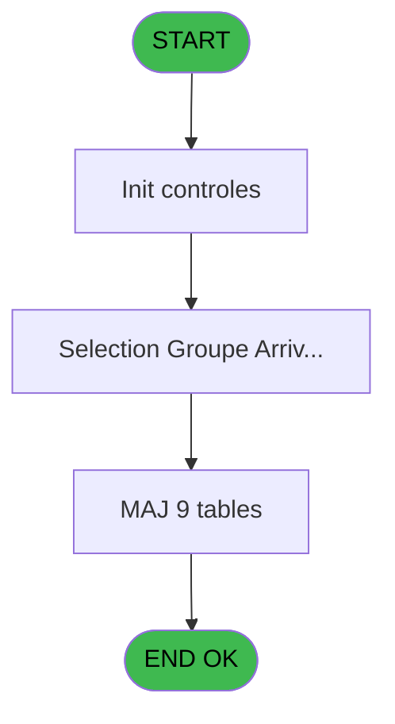
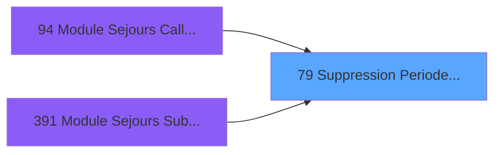
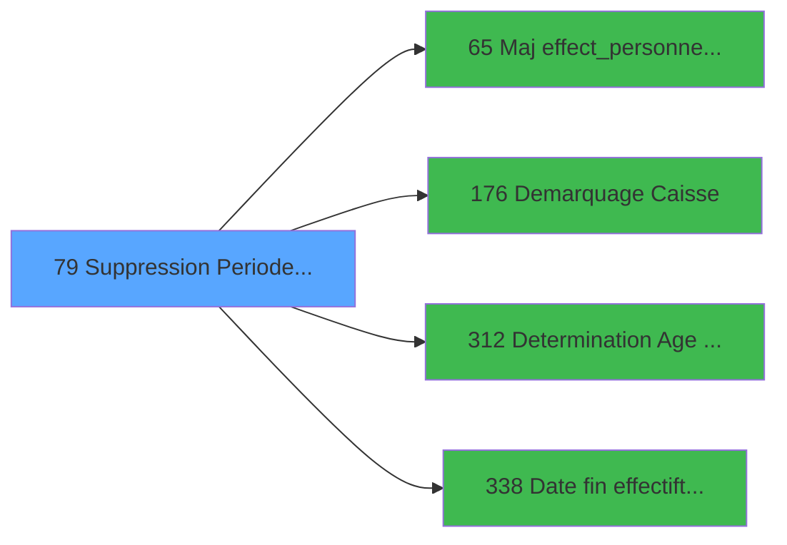

# PBG IDE 79 - Suppression Periode Client

> **Analyse**: Phases 1-4 2026-02-03 09:12 -> 09:12 (19s) | Assemblage 09:12
> **Pipeline**: V7.2 Enrichi
> **Structure**: 4 onglets (Resume | Ecrans | Donnees | Connexions)

<!-- TAB:Resume -->

## 1. FICHE D'IDENTITE

| Attribut | Valeur |
|----------|--------|
| Projet | PBG |
| IDE Position | 79 |
| Nom Programme | Suppression Periode Client |
| Fichier source | `Prg_79.xml` |
| Domaine metier | General |
| Taches | 19 (1 ecrans visibles) |
| Tables modifiees | 9 |
| Programmes appeles | 4 |

## 2. DESCRIPTION FONCTIONNELLE

**Suppression Periode Client** assure la gestion complete de ce processus, accessible depuis [Module Sejours CallTask (IDE 0)](PBG-IDE-0.md), [Module Sejours CallTask (IDE 94)](PBG-IDE-94.md), [Module Sejours SubForm (IDE 391)](PBG-IDE-391.md).

Le flux de traitement s'organise en **3 blocs fonctionnels** :

- **Traitement** (16 taches) : traitements metier divers
- **Creation** (2 taches) : insertion d'enregistrements en base (mouvements, prestations)
- **Calcul** (1 tache) : calculs de montants, stocks ou compteurs

**Donnees modifiees** : 9 tables en ecriture (gm-recherche_____gmr, gm-complet_______gmc, hebergement______heb, client_gm, compte_gm________cgm, historik_station, fichier_validation, groupe_arr_dep___vol, heb_circuit______hci).

**Logique metier** : 1 regles identifiees couvrant conditions metier.

Detail : phases du traitement

#### Phase 1 : Traitement (16 taches)

- **79** - Suppression Periode Client **[[ECRAN]](#ecran-t1)**
- **79.1** - Recuperation Periode
- **79.3** - Groupe Arrivee/Depart **[[ECRAN]](#ecran-t4)**
- **79.4** - Confirmation suppression
- **79.5** - suppression periode batch
- **79.5.1** - Suppression
- **79.5.2** - Maj Package
- **79.5.3** - Maj Package
- **79.5.4** - Maj Package
- **79.5.5** - Maj GMR
- **79.5.6** - Maj GMR
- **79.5.7** - Maj GMR
- **79.5.8** - Maj GMR
- **79.5.9** - Maj GMR
- **79.5.10** - Maj GMR
- **79.5.11** - Maj GMR

Delegue a : [Maj effect_personnes_modif_sej (IDE 65)](PBG-IDE-65.md), [Demarquage Caisse (IDE 176)](PBG-IDE-176.md), [Determination Age Debut Sejour (IDE 312)](PBG-IDE-312.md)

#### Phase 2 : Creation (2 taches)

- **79.2** - Creation Groupe Arrivee VV
- **79.5.12** - Creation Historique

#### Phase 3 : Calcul (1 tache)

- **79.5.11.1** - Maj Compte

#### Tables impactees

| Table | Operations | Role metier |
|-------|-----------|-------------|
| hebergement______heb | R/**W** (6 usages) | Hebergement (chambres) |
| groupe_arr_dep___vol | R/**W** (2 usages) |  |
| gm-recherche_____gmr | R/**W** (2 usages) | Index de recherche |
| historik_station | **W** (1 usages) | Historique / journal |
| gm-complet_______gmc | **W** (1 usages) |  |
| fichier_validation | **W** (1 usages) |  |
| client_gm | **W** (1 usages) |  |
| heb_circuit______hci | **W** (1 usages) | Hebergement (chambres) |
| compte_gm________cgm | **W** (1 usages) | Comptes GM (generaux) |

## 3. BLOCS FONCTIONNELS

### 3.1 Traitement (16 taches)

Traitements internes.

---

#### 79 - Suppression Periode Client [[ECRAN]](#ecran-t1)

**Role** : Tache d'orchestration : point d'entree du programme (16 sous-taches). Coordonne l'enchainement des traitements.
**Ecran** : 160 x 40 DLU (MDI) | [Voir mockup](#ecran-t1)

15 sous-taches directes

| Tache | Nom | Bloc |
|-------|-----|------|
| [79.1](#t2) | Recuperation Periode | Traitement |
| [79.3](#t4) | Groupe Arrivee/Depart **[[ECRAN]](#ecran-t4)** | Traitement |
| [79.4](#t5) | Confirmation suppression | Traitement |
| [79.5](#t19) | suppression periode batch | Traitement |
| [79.5.1](#t22) | Suppression | Traitement |
| [79.5.2](#t25) | Maj Package | Traitement |
| [79.5.3](#t28) | Maj Package | Traitement |
| [79.5.4](#t31) | Maj Package | Traitement |
| [79.5.5](#t34) | Maj GMR | Traitement |
| [79.5.6](#t37) | Maj GMR | Traitement |
| [79.5.7](#t40) | Maj GMR | Traitement |
| [79.5.8](#t43) | Maj GMR | Traitement |
| [79.5.9](#t46) | Maj GMR | Traitement |
| [79.5.10](#t49) | Maj GMR | Traitement |
| [79.5.11](#t52) | Maj GMR | Traitement |

---

#### 79.1 - Recuperation Periode

**Role** : Consultation/chargement : Recuperation Periode.

---

#### 79.3 - Groupe Arrivee/Depart [[ECRAN]](#ecran-t4)

**Role** : Traitement : Groupe Arrivee/Depart.
**Ecran** : 528 x 165 DLU (MDI) | [Voir mockup](#ecran-t4)

---

#### 79.4 - Confirmation suppression

**Role** : Traitement : Confirmation suppression.

---

#### 79.5 - suppression periode batch

**Role** : Traitement : suppression periode batch.

---

#### 79.5.1 - Suppression

**Role** : Traitement : Suppression.

---

#### 79.5.2 - Maj Package

**Role** : Traitement : Maj Package.

---

#### 79.5.3 - Maj Package

**Role** : Traitement : Maj Package.

---

#### 79.5.4 - Maj Package

**Role** : Traitement : Maj Package.

---

#### 79.5.5 - Maj GMR

**Role** : Traitement : Maj GMR.

---

#### 79.5.6 - Maj GMR

**Role** : Traitement : Maj GMR.

---

#### 79.5.7 - Maj GMR

**Role** : Traitement : Maj GMR.

---

#### 79.5.8 - Maj GMR

**Role** : Traitement : Maj GMR.

---

#### 79.5.9 - Maj GMR

**Role** : Traitement : Maj GMR.

---

#### 79.5.10 - Maj GMR

**Role** : Traitement : Maj GMR.

---

#### 79.5.11 - Maj GMR

**Role** : Traitement : Maj GMR.

### 3.2 Creation (2 taches)

Insertion de nouveaux enregistrements en base.

---

#### 79.2 - Creation Groupe Arrivee VV

**Role** : Creation d'enregistrement : Creation Groupe Arrivee VV.

---

#### 79.5.12 - Creation Historique

**Role** : Consultation/chargement : Creation Historique.

### 3.3 Calcul (1 tache)

Calculs metier : montants, stocks, compteurs.

---

#### 79.5.11.1 - Maj Compte

**Role** : Traitement : Maj Compte.

## 5. REGLES METIER

1 regles identifiees:

### Autres (1 regles)

#### [RM-001] Si P0-Circuit/Hebergeme [A]='C' alors MlsTrans ('Circuit') sinon MlsTrans ('Hebergement'))

| Element | Detail |
|---------|--------|
| **Condition** | `P0-Circuit/Hebergeme [A]='C'` |
| **Si vrai** | MlsTrans ('Circuit') |
| **Si faux** | MlsTrans ('Hebergement')) |
| **Variables** | A (P0-Circuit/Hebergeme) |
| **Expression source** | Expression 7 : `IF (P0-Circuit/Hebergeme [A]='C',MlsTrans ('Circuit'),MlsTra` |
| **Exemple** | Si P0-Circuit/Hebergeme [A]='C' → MlsTrans ('Circuit'). Sinon → MlsTrans ('Hebergement')) |

## 6. CONTEXTE

- **Appele par**: [Module Sejours CallTask (IDE 0)](PBG-IDE-0.md), [Module Sejours CallTask (IDE 94)](PBG-IDE-94.md), [Module Sejours SubForm (IDE 391)](PBG-IDE-391.md)
- **Appelle**: 4 programmes | **Tables**: 11 (W:9 R:3 L:2) | **Taches**: 19 | **Expressions**: 12

<!-- TAB:Ecrans -->

## 8. ECRANS

### 8.1 Forms visibles (1 / 19)

| # | Position | Tache | Nom | Type | Largeur | Hauteur | Bloc |
|---|----------|-------|-----|------|---------|---------|------|
| 1 | 79.4 | 79.3 | Groupe Arrivee/Depart | MDI | 528 | 165 | Traitement |

### 8.2 Mockups Ecrans

---

#### 79.4 - Groupe Arrivee/Depart
**Tache** : [79.3](#t4) | **Type** : MDI | **Dimensions** : 528 x 165 DLU
**Bloc** : Traitement | **Titre IDE** : Groupe Arrivee/Depart

<!-- FORM-DATA:
{
    "width":  528,
    "vFactor":  8,
    "type":  "MDI",
    "hFactor":  8,
    "controls":  [
                     {
                         "x":  45,
                         "type":  "table",
                         "var":  "",
                         "name":  "",
                         "titleH":  12,
                         "color":  "196",
                         "w":  440,
                         "y":  19,
                         "fmt":  "",
                         "parent":  null,
                         "text":  "",
                         "rowH":  12,
                         "h":  90,
                         "cols":  [
                                      {
                                          "title":  "Vol",
                                          "layer":  1,
                                          "w":  88
                                      },
                                      {
                                          "title":  "Ville",
                                          "layer":  2,
                                          "w":  91
                                      },
                                      {
                                          "title":  "Heure",
                                          "layer":  3,
                                          "w":  107
                                      },
                                      {
                                          "title":  "Libelle",
                                          "layer":  4,
                                          "w":  122
                                      }
                                  ],
                         "rows":  4
                     },
                     {
                         "x":  0,
                         "type":  "label",
                         "var":  "",
                         "y":  139,
                         "w":  525,
                         "fmt":  "",
                         "name":  "",
                         "h":  24,
                         "color":  "",
                         "text":  "",
                         "parent":  null
                     },
                     {
                         "x":  237,
                         "type":  "edit",
                         "var":  "",
                         "y":  34,
                         "w":  30,
                         "fmt":  "#2P0",
                         "name":  "",
                         "h":  8,
                         "color":  "196",
                         "text":  "",
                         "parent":  3
                     },
                     {
                         "x":  54,
                         "type":  "edit",
                         "var":  "",
                         "y":  34,
                         "w":  75,
                         "fmt":  "30",
                         "name":  "",
                         "h":  8,
                         "color":  "196",
                         "text":  "",
                         "parent":  3
                     },
                     {
                         "x":  142,
                         "type":  "edit",
                         "var":  "",
                         "y":  34,
                         "w":  75,
                         "fmt":  "",
                         "name":  "",
                         "h":  8,
                         "color":  "196",
                         "text":  "",
                         "parent":  3
                     },
                     {
                         "x":  349,
                         "type":  "edit",
                         "var":  "",
                         "y":  34,
                         "w":  98,
                         "fmt":  "8",
                         "name":  "",
                         "h":  8,
                         "color":  "196",
                         "text":  "",
                         "parent":  3
                     },
                     {
                         "x":  300,
                         "type":  "edit",
                         "var":  "",
                         "y":  5,
                         "w":  120,
                         "fmt":  "DD/MM/YYYY",
                         "name":  "",
                         "h":  10,
                         "color":  "",
                         "text":  "",
                         "parent":  null
                     },
                     {
                         "x":  282,
                         "type":  "edit",
                         "var":  "",
                         "y":  34,
                         "w":  42,
                         "fmt":  "3",
                         "name":  "",
                         "h":  8,
                         "color":  "196",
                         "text":  "",
                         "parent":  3
                     },
                     {
                         "x":  233,
                         "type":  "image",
                         "var":  "",
                         "y":  114,
                         "w":  58,
                         "fmt":  "",
                         "name":  "",
                         "h":  18,
                         "color":  "",
                         "text":  "",
                         "parent":  null
                     },
                     {
                         "x":  8,
                         "type":  "button",
                         "var":  "",
                         "y":  142,
                         "w":  154,
                         "fmt":  "\u0026Selectionner",
                         "name":  "",
                         "h":  18,
                         "color":  "",
                         "text":  "",
                         "parent":  null
                     },
                     {
                         "x":  363,
                         "type":  "button",
                         "var":  "",
                         "y":  142,
                         "w":  154,
                         "fmt":  "\u0026Quitter",
                         "name":  "",
                         "h":  18,
                         "color":  "",
                         "text":  "",
                         "parent":  null
                     },
                     {
                         "x":  124,
                         "type":  "edit",
                         "var":  "",
                         "y":  5,
                         "w":  154,
                         "fmt":  "30",
                         "name":  "",
                         "h":  10,
                         "color":  "",
                         "text":  "",
                         "parent":  null
                     }
                 ],
    "taskId":  "79.4",
    "height":  165
}
-->

<strong>Champs : 7 champs</strong>

| Pos (x,y) | Nom | Variable | Type |
|-----------|-----|----------|------|
| 237,34 | #2P0 | - | edit |
| 54,34 | 30 | - | edit |
| 142,34 | (sans nom) | - | edit |
| 349,34 | 8 | - | edit |
| 300,5 | DD/MM/YYYY | - | edit |
| 282,34 | 3 | - | edit |
| 124,5 | 30 | - | edit |

<strong>Boutons : 2 boutons</strong>

| Bouton | Pos (x,y) | Action |
|--------|-----------|--------|
| Selectionner | 8,142 | Ouvre la selection |
| Quitter | 363,142 | Quitte le programme |

## 9. NAVIGATION

Ecran unique: **Groupe Arrivee/Depart**

### 9.3 Structure hierarchique (19 taches)

| Position | Tache | Type | Dimensions | Bloc |
|----------|-------|------|------------|------|
| **79.1** | [**Suppression Periode Client** (79)](#t1) [mockup](#ecran-t1) | MDI | 160x40 | Traitement |
| 79.1.1 | [Recuperation Periode (79.1)](#t2) | MDI | - | |
| 79.1.2 | [Groupe Arrivee/Depart (79.3)](#t4) [mockup](#ecran-t4) | MDI | 528x165 | |
| 79.1.3 | [Confirmation suppression (79.4)](#t5) | MDI | - | |
| 79.1.4 | [suppression periode batch (79.5)](#t19) | - | - | |
| 79.1.5 | [Suppression (79.5.1)](#t22) | MDI | - | |
| 79.1.6 | [Maj Package (79.5.2)](#t25) | MDI | - | |
| 79.1.7 | [Maj Package (79.5.3)](#t28) | MDI | - | |
| 79.1.8 | [Maj Package (79.5.4)](#t31) | MDI | - | |
| 79.1.9 | [Maj GMR (79.5.5)](#t34) | MDI | - | |
| 79.1.10 | [Maj GMR (79.5.6)](#t37) | MDI | - | |
| 79.1.11 | [Maj GMR (79.5.7)](#t40) | MDI | - | |
| 79.1.12 | [Maj GMR (79.5.8)](#t43) | MDI | - | |
| 79.1.13 | [Maj GMR (79.5.9)](#t46) | MDI | - | |
| 79.1.14 | [Maj GMR (79.5.10)](#t49) | MDI | - | |
| 79.1.15 | [Maj GMR (79.5.11)](#t52) | MDI | - | |
| **79.2** | [**Creation Groupe Arrivee VV** (79.2)](#t3) | MDI | - | Creation |
| 79.2.1 | [Creation Historique (79.5.12)](#t56) | MDI | - | |
| **79.3** | [**Maj Compte** (79.5.11.1)](#t53) | MDI | - | Calcul |

### 9.4 Algorigramme

> **Legende**: Vert = START/END OK | Rouge = END KO | Bleu = Decisions
> *Algorigramme auto-genere. Utiliser `/algorigramme` pour une synthese metier detaillee.*

<!-- TAB:Donnees -->

## 10. TABLES

### Tables utilisees (11)

| ID | Nom | Description | Type | R | W | L | Usages |
|----|-----|-------------|------|---|---|---|--------|
| 30 | gm-recherche_____gmr | Index de recherche | DB | R | **W** |   | 2 |
| 31 | gm-complet_______gmc |  | DB |   | **W** |   | 1 |
| 34 | hebergement______heb | Hebergement (chambres) | DB | R | **W** |   | 6 |
| 36 | client_gm |  | DB |   | **W** |   | 1 |
| 47 | compte_gm________cgm | Comptes GM (generaux) | DB |   | **W** |   | 1 |
| 88 | historik_station | Historique / journal | DB |   | **W** |   | 1 |
| 112 | tables_paris |  | DB |   |   | L | 1 |
| 131 | fichier_validation |  | DB |   | **W** |   | 1 |
| 132 | code_vol_________vot |  | DB |   |   | L | 1 |
| 134 | groupe_arr_dep___vol |  | DB | R | **W** |   | 2 |
| 168 | heb_circuit______hci | Hebergement (chambres) | DB |   | **W** |   | 1 |

### Colonnes par table (3 / 9 tables avec colonnes identifiees)

Table 30 - gm-recherche_____gmr (R/**W**) - 2 usages

*Table utilisee uniquement en Link ou aucune colonne Real identifiee dans le DataView.*

Table 31 - gm-complet_______gmc (**W**) - 1 usages

*Table utilisee uniquement en Link ou aucune colonne Real identifiee dans le DataView.*

Table 34 - hebergement______heb (R/**W**) - 6 usages

*Table utilisee uniquement en Link ou aucune colonne Real identifiee dans le DataView.*

Table 36 - client_gm (**W**) - 1 usages

*Table utilisee uniquement en Link ou aucune colonne Real identifiee dans le DataView.*

Table 47 - compte_gm________cgm (**W**) - 1 usages

*Table utilisee uniquement en Link ou aucune colonne Real identifiee dans le DataView.*

Table 88 - historik_station (**W**) - 1 usages

*Table utilisee uniquement en Link ou aucune colonne Real identifiee dans le DataView.*

Table 131 - fichier_validation (**W**) - 1 usages

*Table utilisee uniquement en Link ou aucune colonne Real identifiee dans le DataView.*

Table 134 - groupe_arr_dep___vol (R/**W**) - 2 usages

| Lettre | Variable | Acces | Type |
|--------|----------|-------|------|
| A | v.Selection A/R | W | Alpha |
| B | v.date | W | Date |

Table 168 - heb_circuit______hci (**W**) - 1 usages

| Lettre | Variable | Acces | Type |
|--------|----------|-------|------|
| A | P0-Circuit/Hebergeme | W | Alpha |

## 11. VARIABLES

### 11.1 Parametres entrants (4)

Variables recues du programme appelant ([Module Sejours CallTask (IDE 0)](PBG-IDE-0.md)).

| Lettre | Nom | Type | Usage dans |
|--------|-----|------|-----------|
| F | P0 Date debut sejour | Date | 1x parametre entrant |
| G | P0 Date fin sejour | Date | 1x parametre entrant |
| H | P0 Date Naisssance | Date | - |
| I | P0 Age Bebe | Numeric | - |

### 11.2 Variables de travail (17)

Variables internes au programme.

| Lettre | Nom | Type | Usage dans |
|--------|-----|------|-----------|
| J | W0 Code Vol Aller | Alpha | - |
| K | W0 Transport Aller | Alpha | - |
| L | W0 Ville Aller | Alpha | - |
| M | W0 Lib Transp Aller | Alpha | - |
| N | W0 Heure Debut | Alpha | - |
| O | W0 Code Vol Retour | Alpha | - |
| P | W0 Transport Retour | Alpha | - |
| Q | W0 Ville Retour | Alpha | - |
| R | W0 Lib Transp Retour | Alpha | - |
| S | W0 Heure Fin | Alpha | - |
| T | W0 Nbre d'Heb./Circ. | Numeric | - |
| U | W0 New Debut Sejour | Date | 1x calcul interne |
| V | W0 New Fin Sejour | Date | 1x calcul interne |
| W | W0 Date Solde | Date | - |
| X | W0 Age | Numeric | - |
| Y | W0 Age Codifie | Alpha | - |
| Z | W0 Nb mois | Numeric | 5x calcul interne |

### 11.3 Autres (6)

Variables diverses.

| Lettre | Nom | Type | Usage dans |
|--------|-----|------|-----------|
| A | P0-Circuit/Hebergeme | Alpha | 3x refs |
| B | P0-Date Debut | Date | - |
| C | P0-Heure Debut | Alpha | - |
| D | P0-Date Fin | Date | - |
| E | P0-Heure Fin | Alpha | - |
| BA | W0-Accord Suite | Alpha | - |

Toutes les 27 variables (liste complete)

| Cat | Lettre | Nom Variable | Type |
|-----|--------|--------------|------|
| P0 | **F** | P0 Date debut sejour | Date |
| P0 | **G** | P0 Date fin sejour | Date |
| P0 | **H** | P0 Date Naisssance | Date |
| P0 | **I** | P0 Age Bebe | Numeric |
| W0 | **J** | W0 Code Vol Aller | Alpha |
| W0 | **K** | W0 Transport Aller | Alpha |
| W0 | **L** | W0 Ville Aller | Alpha |
| W0 | **M** | W0 Lib Transp Aller | Alpha |
| W0 | **N** | W0 Heure Debut | Alpha |
| W0 | **O** | W0 Code Vol Retour | Alpha |
| W0 | **P** | W0 Transport Retour | Alpha |
| W0 | **Q** | W0 Ville Retour | Alpha |
| W0 | **R** | W0 Lib Transp Retour | Alpha |
| W0 | **S** | W0 Heure Fin | Alpha |
| W0 | **T** | W0 Nbre d'Heb./Circ. | Numeric |
| W0 | **U** | W0 New Debut Sejour | Date |
| W0 | **V** | W0 New Fin Sejour | Date |
| W0 | **W** | W0 Date Solde | Date |
| W0 | **X** | W0 Age | Numeric |
| W0 | **Y** | W0 Age Codifie | Alpha |
| W0 | **Z** | W0 Nb mois | Numeric |
| Autre | **A** | P0-Circuit/Hebergeme | Alpha |
| Autre | **B** | P0-Date Debut | Date |
| Autre | **C** | P0-Heure Debut | Alpha |
| Autre | **D** | P0-Date Fin | Date |
| Autre | **E** | P0-Heure Fin | Alpha |
| Autre | **BA** | W0-Accord Suite | Alpha |

## 12. EXPRESSIONS

**12 / 12 expressions decodees (100%)**

### 12.1 Repartition par type

| Type | Expressions | Regles |
|------|-------------|--------|
| CONDITION | 6 | 5 |
| CONSTANTE | 2 | 0 |
| OTHER | 4 | 0 |

### 12.2 Expressions cles par type

#### CONDITION (6 expressions)

| Type | IDE | Expression | Regle |
|------|-----|------------|-------|
| CONDITION | 7 | `IF (P0-Circuit/Hebergeme [A]='C',MlsTrans ('Circuit'),MlsTrans ('Hebergement'))` | [RM-001](#rm-RM-001) |
| CONDITION | 11 | `W0 Nb mois [Z]='O'` | - |
| CONDITION | 12 | `W0 Nb mois [Z]='E'` | - |
| CONDITION | 10 | `W0 Nb mois [Z]='O' AND P0-Circuit/Hebergeme [A]='H' AND W0 New Fin Sejour [V]<>0 AND W0 New Fin Sejour [V]<>P0 Date fin sejour [G]` | - |
| CONDITION | 8 | `W0 Nb mois [Z]='N'` | - |
| ... | | *+1 autres* | |

#### CONSTANTE (2 expressions)

| Type | IDE | Expression | Regle |
|------|-----|------------|-------|
| CONSTANTE | 6 | `'A'` | - |
| CONSTANTE | 5 | `'R'` | - |

#### OTHER (4 expressions)

| Type | IDE | Expression | Regle |
|------|-----|------------|-------|
| OTHER | 3 | `GetParam ('NRO_CPTE')` | - |
| OTHER | 4 | `GetParam ('SOCIETE')` | - |
| OTHER | 1 | `SetCrsr (2)` | - |
| OTHER | 2 | `SetCrsr (1)` | - |

<!-- TAB:Connexions -->

## 13. GRAPHE D'APPELS

### 13.1 Chaine depuis Main (Callers)

Main -> ... -> [Module Sejours CallTask (IDE 0)](PBG-IDE-0.md) -> **Suppression Periode Client (IDE 79)**

Main -> ... -> [Module Sejours CallTask (IDE 94)](PBG-IDE-94.md) -> **Suppression Periode Client (IDE 79)**

Main -> ... -> [Module Sejours SubForm (IDE 391)](PBG-IDE-391.md) -> **Suppression Periode Client (IDE 79)**

### 13.2 Callers

| IDE | Nom Programme | Nb Appels |
|-----|---------------|-----------|
| [0](PBG-IDE-0.md) | Module Sejours CallTask | 1 |
| [94](PBG-IDE-94.md) | Module Sejours CallTask | 1 |
| [391](PBG-IDE-391.md) | Module Sejours SubForm | 1 |

### 13.3 Callees (programmes appeles)

### 13.4 Detail Callees avec contexte

| IDE | Nom Programme | Appels | Contexte |
|-----|---------------|--------|----------|
| [65](PBG-IDE-65.md) | Maj effect_personnes_modif_sej | 1 | Mise a jour donnees |
| [176](PBG-IDE-176.md) | Demarquage Caisse | 1 | Sous-programme |
| [312](PBG-IDE-312.md) | Determination Age Debut Sejour | 1 | Sous-programme |
| [338](PBG-IDE-338.md) | Date fin effectif/t transfert | 1 | Transfert donnees |

## 14. RECOMMANDATIONS MIGRATION

### 14.1 Profil du programme

| Metrique | Valeur | Impact migration |
|----------|--------|-----------------|
| Lignes de logique | 352 | Taille moyenne |
| Expressions | 12 | Peu de logique |
| Tables WRITE | 9 | Fort impact donnees |
| Sous-programmes | 4 | Peu de dependances |
| Ecrans visibles | 1 | Ecran unique ou traitement batch |
| Code desactive | 0% (0 / 352) | Code sain |
| Regles metier | 1 | Quelques regles a preserver |

### 14.2 Plan de migration par bloc

#### Traitement (16 taches: 2 ecrans, 14 traitements)

- **Strategie** : Orchestrateur avec 2 ecrans (Razor/React) et 14 traitements backend (services).
- Les ecrans deviennent des composants UI, les traitements invisibles deviennent des services injectables.
- 4 sous-programme(s) a migrer ou a reutiliser depuis les services existants.
- Decomposer les taches en services unitaires testables.

#### Creation (2 taches: 0 ecran, 2 traitements)

- **Strategie** : Repository pattern avec Entity Framework Core.
- Insertion via `IRepository<T>.CreateAsync()`

#### Calcul (1 tache: 0 ecran, 1 traitement)

- **Strategie** : Services de calcul purs (Domain Services).
- Migrer la logique de calcul (stock, compteurs, montants)

### 14.3 Dependances critiques

| Dependance | Type | Appels | Impact |
|------------|------|--------|--------|
| gm-recherche_____gmr | Table WRITE (Database) | 1x | Schema + repository |
| gm-complet_______gmc | Table WRITE (Database) | 1x | Schema + repository |
| hebergement______heb | Table WRITE (Database) | 5x | Schema + repository |
| client_gm | Table WRITE (Database) | 1x | Schema + repository |
| compte_gm________cgm | Table WRITE (Database) | 1x | Schema + repository |
| historik_station | Table WRITE (Database) | 1x | Schema + repository |
| fichier_validation | Table WRITE (Database) | 1x | Schema + repository |
| groupe_arr_dep___vol | Table WRITE (Database) | 1x | Schema + repository |
| heb_circuit______hci | Table WRITE (Database) | 1x | Schema + repository |
| [Determination Age Debut Sejour (IDE 312)](PBG-IDE-312.md) | Sous-programme | 1x | Normale - Sous-programme |
| [Date fin effectif/t transfert (IDE 338)](PBG-IDE-338.md) | Sous-programme | 1x | Normale - Transfert donnees |
| [Maj effect_personnes_modif_sej (IDE 65)](PBG-IDE-65.md) | Sous-programme | 1x | Normale - Mise a jour donnees |
| [Demarquage Caisse (IDE 176)](PBG-IDE-176.md) | Sous-programme | 1x | Normale - Sous-programme |

---
*Spec DETAILED generee par Pipeline V7.2 - 2026-02-03 09:12*
