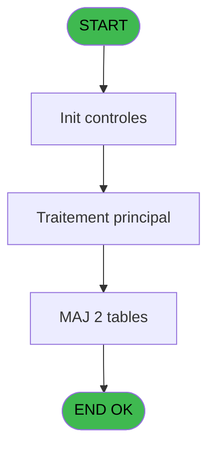
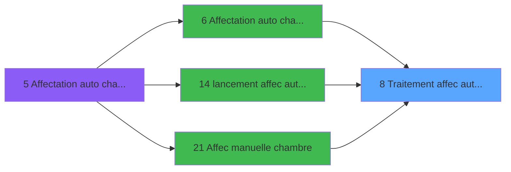
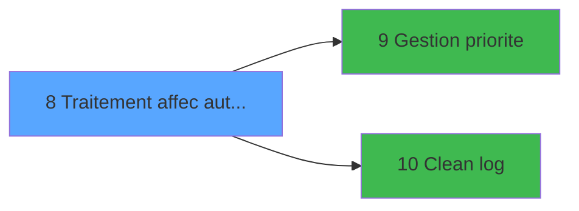

# PBG IDE 8 - Traitement affec auto chambres

> **Analyse**: Phases 1-4 2026-02-03 00:56 -> 00:57 (37s) | Assemblage 00:57
> **Pipeline**: V7.2 Enrichi
> **Structure**: 4 onglets (Resume | Ecrans | Donnees | Connexions)

<!-- TAB:Resume -->

## 1. FICHE D'IDENTITE

| Attribut | Valeur |
|----------|--------|
| Projet | PBG |
| IDE Position | 8 |
| Nom Programme | Traitement affec auto chambres |
| Fichier source | `Prg_8.xml` |
| Domaine metier | General |
| Taches | 10 (1 ecrans visibles) |
| Tables modifiees | 2 |
| Programmes appeles | 2 |

## 2. DESCRIPTION FONCTIONNELLE

**Traitement affec auto chambres** assure la gestion complete de ce processus, accessible depuis [Affectation auto chambres v1 (IDE 6)](PBG-IDE-6.md), [lancement affec auto test (IDE 14)](PBG-IDE-14.md), [Affec manuelle chambre (IDE 21)](PBG-IDE-21.md).

Le flux de traitement s'organise en **2 blocs fonctionnels** :

- **Traitement** (8 taches) : traitements metier divers
- **Creation** (2 taches) : insertion d'enregistrements en base (mouvements, prestations)

**Donnees modifiees** : 2 tables en ecriture (tempo_ecran_police, Commentaire supprime).

**Logique metier** : 2 regles identifiees couvrant conditions metier.

Detail : phases du traitement

#### Phase 1 : Traitement (8 taches)

- **8** - Traitement affec auto chambres **[[ECRAN]](#ecran-t4)**
- **8.2** - Affectation **[[ECRAN]](#ecran-t21)**
- **8.2.1** - Determination composition
- **8.2.2** - Del dossier ch affectee
- **8.2.3** - maj communicante
- **8.3** - rempli table temp affi
- **8.3.2** - suppression dernier separateur
- **8.2.4** - Vérif Chambre comm cassée

Delegue a : [Gestion priorite (IDE 9)](PBG-IDE-9.md), [Clean log (IDE 10)](PBG-IDE-10.md)

#### Phase 2 : Creation (2 taches)

- **8.1** - Creation fichier temporaite **[[ECRAN]](#ecran-t18)**
- **8.3.1** - creation separator

#### Tables impactees

| Table | Operations | Role metier |
|-------|-----------|-------------|
| Commentaire supprime | R/**W**/L (6 usages) |  |
| tempo_ecran_police | **W** (3 usages) | Table temporaire ecran |

## 3. BLOCS FONCTIONNELS

### 3.1 Traitement (8 taches)

Traitements internes.

---

#### 8 - Traitement affec auto chambres [[ECRAN]](#ecran-t4)

**Role** : Traitement : Traitement affec auto chambres.
**Ecran** : 266 x 68 DLU | [Voir mockup](#ecran-t4)
**Delegue a** : [Gestion priorite (IDE 9)](PBG-IDE-9.md), [Clean log (IDE 10)](PBG-IDE-10.md)

---

#### 8.2 - Affectation [[ECRAN]](#ecran-t21)

**Role** : Traitement : Affectation.
**Ecran** : 443 x 79 DLU | [Voir mockup](#ecran-t21)
**Delegue a** : [Gestion priorite (IDE 9)](PBG-IDE-9.md), [Clean log (IDE 10)](PBG-IDE-10.md)

---

#### 8.2.1 - Determination composition

**Role** : Traitement : Determination composition.
**Delegue a** : [Gestion priorite (IDE 9)](PBG-IDE-9.md), [Clean log (IDE 10)](PBG-IDE-10.md)

---

#### 8.2.2 - Del dossier ch affectee

**Role** : Traitement : Del dossier ch affectee.
**Variables liees** : I (P.i.Gest° dossier/commentaire), N (V.Note dossier ?)
**Delegue a** : [Gestion priorite (IDE 9)](PBG-IDE-9.md), [Clean log (IDE 10)](PBG-IDE-10.md)

---

#### 8.2.3 - maj communicante

**Role** : Traitement : maj communicante.
**Delegue a** : [Gestion priorite (IDE 9)](PBG-IDE-9.md), [Clean log (IDE 10)](PBG-IDE-10.md)

---

#### 8.3 - rempli table temp affi

**Role** : Traitement : rempli table temp affi.
**Delegue a** : [Gestion priorite (IDE 9)](PBG-IDE-9.md), [Clean log (IDE 10)](PBG-IDE-10.md)

---

#### 8.3.2 - suppression dernier separateur

**Role** : Traitement : suppression dernier separateur.
**Delegue a** : [Gestion priorite (IDE 9)](PBG-IDE-9.md), [Clean log (IDE 10)](PBG-IDE-10.md)

---

#### 8.2.4 - Vérif Chambre comm cassée

**Role** : Traitement : Vérif Chambre comm cassée.
**Variables liees** : H (P.i.Chambre comm. cassées), I (P.i.Gest° dossier/commentaire), Q (V.Ret. Chambre comm. cassée)
**Delegue a** : [Gestion priorite (IDE 9)](PBG-IDE-9.md), [Clean log (IDE 10)](PBG-IDE-10.md)

### 3.2 Creation (2 taches)

Insertion de nouveaux enregistrements en base.

---

#### 8.1 - Creation fichier temporaite [[ECRAN]](#ecran-t18)

**Role** : Creation d'enregistrement : Creation fichier temporaite.
**Ecran** : 640 x 0 DLU | [Voir mockup](#ecran-t18)

---

#### 8.3.1 - creation separator

**Role** : Creation d'enregistrement : creation separator.

## 5. REGLES METIER

2 regles identifiees:

### Autres (2 regles)

#### [RM-001] Si [U] alors [V] sinon P.i.Comptes à loger [F]+3)

| Element | Detail |
|---------|--------|
| **Condition** | `[U]` |
| **Si vrai** | [V] |
| **Si faux** | P.i.Comptes à loger [F]+3) |
| **Variables** | F (P.i.Comptes à loger) |
| **Expression source** | Expression 3 : `IF([U],[V],P.i.Comptes à loger [F]+3)` |
| **Exemple** | Si [U] → [V]. Sinon → P.i.Comptes à loger [F]+3) |

#### [RM-002] Traitement si DbRecs('{820,2}'DSOURCE,'') est non nul

| Element | Detail |
|---------|--------|
| **Condition** | `DbRecs('{820` |
| **Si vrai** | 2}'DSOURCE |
| **Si faux** | '')<>0,'TRUE'LOG,'FALSE'LOG) |
| **Expression source** | Expression 11 : `IF(DbRecs('{820,2}'DSOURCE,'')<>0,'TRUE'LOG,'FALSE'LOG)` |
| **Exemple** | Si DbRecs('{820 → 2}'DSOURCE. Sinon → '')<>0,'TRUE'LOG,'FALSE'LOG) |

## 6. CONTEXTE

- **Appele par**: [Affectation auto chambres v1 (IDE 6)](PBG-IDE-6.md), [lancement affec auto test (IDE 14)](PBG-IDE-14.md), [Affec manuelle chambre (IDE 21)](PBG-IDE-21.md)
- **Appelle**: 2 programmes | **Tables**: 15 (W:2 R:4 L:12) | **Taches**: 10 | **Expressions**: 18

<!-- TAB:Ecrans -->

## 8. ECRANS

### 8.1 Forms visibles (1 / 10)

| # | Position | Tache | Nom | Type | Largeur | Hauteur | Bloc |
|---|----------|-------|-----|------|---------|---------|------|
| 1 | 8.1 | 8 | Traitement affec auto chambres | Type0 | 266 | 68 | Traitement |

### 8.2 Mockups Ecrans

---

#### 8.1 - Traitement affec auto chambres
**Tache** : [8](#t4) | **Type** : Type0 | **Dimensions** : 266 x 68 DLU
**Bloc** : Traitement | **Titre IDE** : Traitement affec auto chambres

<!-- FORM-DATA:
{
    "width":  266,
    "vFactor":  8,
    "type":  "Type0",
    "hFactor":  4,
    "controls":  [
                     {
                         "x":  5,
                         "type":  "label",
                         "var":  "",
                         "y":  6,
                         "w":  256,
                         "fmt":  "",
                         "name":  "",
                         "h":  29,
                         "color":  "",
                         "text":  "",
                         "parent":  null
                     },
                     {
                         "x":  52,
                         "type":  "label",
                         "var":  "",
                         "y":  16,
                         "w":  200,
                         "fmt":  "",
                         "name":  "",
                         "h":  8,
                         "color":  "7",
                         "text":  "Affectation automatique des chambres",
                         "parent":  null
                     },
                     {
                         "x":  5,
                         "type":  "label",
                         "var":  "",
                         "y":  35,
                         "w":  256,
                         "fmt":  "",
                         "name":  "",
                         "h":  27,
                         "color":  "",
                         "text":  "",
                         "parent":  null
                     },
                     {
                         "x":  67,
                         "type":  "label",
                         "var":  "",
                         "y":  45,
                         "w":  132,
                         "fmt":  "",
                         "name":  "",
                         "h":  8,
                         "color":  "",
                         "text":  "Traitement en cours...",
                         "parent":  null
                     },
                     {
                         "x":  6,
                         "type":  "image",
                         "var":  "",
                         "y":  8,
                         "w":  36,
                         "fmt":  "",
                         "name":  "",
                         "h":  25,
                         "color":  "",
                         "text":  "",
                         "parent":  null
                     }
                 ],
    "taskId":  "8.1",
    "height":  68
}
-->

## 9. NAVIGATION

Ecran unique: **Traitement affec auto chambres**

### 9.3 Structure hierarchique (10 taches)

| Position | Tache | Type | Dimensions | Bloc |
|----------|-------|------|------------|------|
| **8.1** | [**Traitement affec auto chambres** (8)](#t4) [mockup](#ecran-t4) | - | 266x68 | Traitement |
| 8.1.1 | [Affectation (8.2)](#t21) [mockup](#ecran-t21) | - | 443x79 | |
| 8.1.2 | [Determination composition (8.2.1)](#t22) | - | - | |
| 8.1.3 | [Del dossier ch affectee (8.2.2)](#t23) | - | - | |
| 8.1.4 | [maj communicante (8.2.3)](#t24) | - | - | |
| 8.1.5 | [rempli table temp affi (8.3)](#t25) | - | - | |
| 8.1.6 | [suppression dernier separateur (8.3.2)](#t27) | - | - | |
| 8.1.7 | [Vérif Chambre comm cassée (8.2.4)](#t28) | - | - | |
| **8.2** | [**Creation fichier temporaite** (8.1)](#t18) [mockup](#ecran-t18) | - | 640x0 | Creation |
| 8.2.1 | [creation separator (8.3.1)](#t26) | - | - | |

### 9.4 Algorigramme

> **Legende**: Vert = START/END OK | Rouge = END KO | Bleu = Decisions
> *Algorigramme auto-genere. Utiliser `/algorigramme` pour une synthese metier detaillee.*

<!-- TAB:Donnees -->

## 10. TABLES

### Tables utilisees (15)

| ID | Nom | Description | Type | R | W | L | Usages |
|----|-----|-------------|------|---|---|---|--------|
| 30 | gm-recherche_____gmr | Index de recherche | DB | R |   |   | 2 |
| 31 | gm-complet_______gmc |  | DB |   |   | L | 1 |
| 34 | hebergement______heb | Hebergement (chambres) | DB | R |   | L | 3 |
| 37 | commentaire_gm_________acc |  | DB |   |   | L | 1 |
| 81 | societe__________soc |  | DB | R |   |   | 1 |
| 105 | logement_complement |  | DB |   |   | L | 1 |
| 108 | code_logement____clo |  | DB |   |   | L | 1 |
| 120 | tables_qualites__qua |  | DB |   |   | L | 1 |
| 171 | commentaire______com |  | DB |   |   | L | 1 |
| 358 | import_mod |  | DB |   |   | L | 1 |
| 591 | tempo_ecran_police | Table temporaire ecran | TMP |   | **W** |   | 3 |
| 738 | pv_selling_unit |  | DB |   |   | L | 1 |
| 820 | Commentaire supprime |  | DB | R | **W** | L | 6 |
| 823 | fac_tva_pro |  | DB |   |   | L | 1 |
| 846 | stat_lieu_vente | Statistiques point de vente | TMP |   |   | L | 1 |

### Colonnes par table (9 / 5 tables avec colonnes identifiees)

Table 30 - gm-recherche_____gmr (R) - 2 usages

| Lettre | Variable | Acces | Type |
|--------|----------|-------|------|
| A | V.Existe note ? | R | Logical |
| B | V.Existe com NA hebergement ? | R | Logical |
| C | V.Priorite composition | R | Numeric |
| D | V.Nom maitre | R | Alpha |
| E | V.Prenom maitre | R | Alpha |
| F | V.Nb pax | R | Numeric |
| G | V.Nb adultes | R | Numeric |
| H | V.Nb enf | R | Numeric |
| I | V.Nb enf bas age | R | Numeric |
| J | V.Nb p agees | R | Numeric |
| K | V.Nom logement | R | Alpha |
| L | V.Communicante | R | Logical |
| M | V.code logement interdit ? | R | Logical |
| N | V.Note dossier ? | R | Logical |
| O | V.Note NA ? | R | Logical |
| P | V.cpt record | R | Numeric |
| Q | V.Ret. Chambre comm. cassée | R | Logical |

Table 34 - hebergement______heb (R/L) - 3 usages

| Lettre | Variable | Acces | Type |
|--------|----------|-------|------|
| B | V.Existe com NA hebergement ? | R | Logical |

Table 81 - societe__________soc (R) - 1 usages

| Lettre | Variable | Acces | Type |
|--------|----------|-------|------|
| A | P.i.Code societe | R | Alpha |
| B | P.i.Date reference | R | Date |
| C | P.i.Pour etat | R | Logical |
| D | P.i.Date debut | R | Date |
| E | P.i.Date fin | R | Date |
| F | P.i.Comptes à loger | R | Logical |
| G | P.i.Ordre regroupement | R | Alpha |
| H | P.i.Chambre comm. cassées | R | Logical |
| I | P.i.Gest° dossier/commentaire | R | Logical |
| J | V.Date debut | R | Date |
| K | V.Date fin | R | Date |
| L | V.Date debut alpha | R | Alpha |
| M | V.Date fin alpha | R | Alpha |

Table 591 - tempo_ecran_police (**W**) - 3 usages

| Lettre | Variable | Acces | Type |
|--------|----------|-------|------|
| A | V.Compte record tempo | W | Numeric |

Table 820 - Commentaire supprime (R/**W**/L) - 6 usages

| Lettre | Variable | Acces | Type |
|--------|----------|-------|------|
| I | P.i.Gest° dossier/commentaire | W | Logical |

## 11. VARIABLES

### 11.1 Parametres entrants (9)

Variables recues du programme appelant ([Affectation auto chambres v1 (IDE 6)](PBG-IDE-6.md)).

| Lettre | Nom | Type | Usage dans |
|--------|-----|------|-----------|
| A | P.i.Code societe | Alpha | 1x parametre entrant |
| B | P.i.Date reference | Date | - |
| C | P.i.Pour etat | Logical | - |
| D | P.i.Date debut | Date | - |
| E | P.i.Date fin | Date | 1x parametre entrant |
| F | P.i.Comptes à loger | Logical | 2x parametre entrant |
| G | P.i.Ordre regroupement | Alpha | - |
| H | P.i.Chambre comm. cassées | Logical | - |
| I | P.i.Gest° dossier/commentaire | Logical | - |

### 11.2 Variables de session (8)

Variables persistantes pendant toute la session.

| Lettre | Nom | Type | Usage dans |
|--------|-----|------|-----------|
| J | V.Date debut | Date | 1x session |
| K | V.Date fin | Date | - |
| L | V.Date debut alpha | Alpha | - |
| M | V.Date fin alpha | Alpha | - |
| N | V.Note dossier ? | Logical | - |
| O | V.Note NA ? | Logical | - |
| P | V.cpt record | Numeric | - |
| Q | V.Ret. Chambre comm. cassée | Logical | - |

Toutes les 17 variables (liste complete)

| Cat | Lettre | Nom Variable | Type |
|-----|--------|--------------|------|
| P0 | **A** | P.i.Code societe | Alpha |
| P0 | **B** | P.i.Date reference | Date |
| P0 | **C** | P.i.Pour etat | Logical |
| P0 | **D** | P.i.Date debut | Date |
| P0 | **E** | P.i.Date fin | Date |
| P0 | **F** | P.i.Comptes à loger | Logical |
| P0 | **G** | P.i.Ordre regroupement | Alpha |
| P0 | **H** | P.i.Chambre comm. cassées | Logical |
| P0 | **I** | P.i.Gest° dossier/commentaire | Logical |
| V. | **J** | V.Date debut | Date |
| V. | **K** | V.Date fin | Date |
| V. | **L** | V.Date debut alpha | Alpha |
| V. | **M** | V.Date fin alpha | Alpha |
| V. | **N** | V.Note dossier ? | Logical |
| V. | **O** | V.Note NA ? | Logical |
| V. | **P** | V.cpt record | Numeric |
| V. | **Q** | V.Ret. Chambre comm. cassée | Logical |

## 12. EXPRESSIONS

**18 / 18 expressions decodees (100%)**

### 12.1 Repartition par type

| Type | Expressions | Regles |
|------|-------------|--------|
| CONDITION | 3 | 5 |
| CAST_LOGIQUE | 1 | 5 |
| CONSTANTE | 1 | 0 |
| FORMAT | 2 | 0 |
| DATE | 1 | 0 |
| OTHER | 9 | 0 |
| NEGATION | 1 | 0 |

### 12.2 Expressions cles par type

#### CONDITION (3 expressions)

| Type | IDE | Expression | Regle |
|------|-----|------------|-------|
| CONDITION | 3 | `IF([U],[V],P.i.Comptes à loger [F]+3)` | [RM-001](#rm-RM-001) |
| CONDITION | 10 | `IF([U],'Recherche des comptes non logés','Affectation automatique des chambres')` | - |
| CONDITION | 4 | `IF([U],[W],P.i.Comptes à loger [F]+5)` | - |

#### CAST_LOGIQUE (1 expressions)

| Type | IDE | Expression | Regle |
|------|-----|------------|-------|
| CAST_LOGIQUE | 11 | `IF(DbRecs('{820,2}'DSOURCE,'')<>0,'TRUE'LOG,'FALSE'LOG)` | [RM-002](#rm-RM-002) |

#### CONSTANTE (1 expressions)

| Type | IDE | Expression | Regle |
|------|-----|------------|-------|
| CONSTANTE | 9 | `1` | - |

#### FORMAT (2 expressions)

| Type | IDE | Expression | Regle |
|------|-----|------------|-------|
| FORMAT | 6 | `DStr(V.Date debut [J],'YYYYMMDD')` | - |
| FORMAT | 5 | `DStr(P.i.Gest° dossier/comm... [I],'YYYYMMDD')` | - |

#### DATE (1 expressions)

| Type | IDE | Expression | Regle |
|------|-----|------------|-------|
| DATE | 15 | `Date()` | - |

#### OTHER (9 expressions)

| Type | IDE | Expression | Regle |
|------|-----|------------|-------|
| OTHER | 16 | `GetParam('SOCIETE')` | - |
| OTHER | 14 | `FileDelete(Translate('%club_exportdata%traceaffec.txt'))` | - |
| OTHER | 18 | `P.i.Code societe [A]` | - |
| OTHER | 17 | `{1,5}` | - |
| OTHER | 13 | `DbDel('{591,2}'DSOURCE,'')` | - |
| ... | | *+4 autres* | |

#### NEGATION (1 expressions)

| Type | IDE | Expression | Regle |
|------|-----|------------|-------|
| NEGATION | 8 | `NOT [U]` | - |

<!-- TAB:Connexions -->

## 13. GRAPHE D'APPELS

### 13.1 Chaine depuis Main (Callers)

Main -> ... -> [Affectation auto chambres v1 (IDE 6)](PBG-IDE-6.md) -> **Traitement affec auto chambres (IDE 8)**

Main -> ... -> [lancement affec auto test (IDE 14)](PBG-IDE-14.md) -> **Traitement affec auto chambres (IDE 8)**

Main -> ... -> [Affec manuelle chambre (IDE 21)](PBG-IDE-21.md) -> **Traitement affec auto chambres (IDE 8)**

### 13.2 Callers

| IDE | Nom Programme | Nb Appels |
|-----|---------------|-----------|
| [6](PBG-IDE-6.md) | Affectation auto chambres v1 | 1 |
| [14](PBG-IDE-14.md) | lancement affec auto test | 1 |
| [21](PBG-IDE-21.md) | Affec manuelle chambre | 1 |

### 13.3 Callees (programmes appeles)

### 13.4 Detail Callees avec contexte

| IDE | Nom Programme | Appels | Contexte |
|-----|---------------|--------|----------|
| [9](PBG-IDE-9.md) | Gestion priorite | 1 | Gestion moyens paiement |
| [10](PBG-IDE-10.md) | Clean log | 1 | Sous-programme |

## 14. RECOMMANDATIONS MIGRATION

### 14.1 Profil du programme

| Metrique | Valeur | Impact migration |
|----------|--------|-----------------|
| Lignes de logique | 375 | Taille moyenne |
| Expressions | 18 | Peu de logique |
| Tables WRITE | 2 | Impact faible |
| Sous-programmes | 2 | Peu de dependances |
| Ecrans visibles | 1 | Ecran unique ou traitement batch |
| Code desactive | 0% (0 / 375) | Code sain |
| Regles metier | 2 | Quelques regles a preserver |

### 14.2 Plan de migration par bloc

#### Traitement (8 taches: 2 ecrans, 6 traitements)

- **Strategie** : Orchestrateur avec 2 ecrans (Razor/React) et 6 traitements backend (services).
- Les ecrans deviennent des composants UI, les traitements invisibles deviennent des services injectables.
- 2 sous-programme(s) a migrer ou a reutiliser depuis les services existants.
- Decomposer les taches en services unitaires testables.

#### Creation (2 taches: 1 ecran, 1 traitement)

- **Strategie** : Repository pattern avec Entity Framework Core.
- Insertion via `IRepository<T>.CreateAsync()`

### 14.3 Dependances critiques

| Dependance | Type | Appels | Impact |
|------------|------|--------|--------|
| tempo_ecran_police | Table WRITE (Temp) | 3x | Schema + repository |
| Commentaire supprime | Table WRITE (Database) | 2x | Schema + repository |
| [Clean log (IDE 10)](PBG-IDE-10.md) | Sous-programme | 1x | Normale - Sous-programme |
| [Gestion priorite (IDE 9)](PBG-IDE-9.md) | Sous-programme | 1x | Normale - Gestion moyens paiement |

---
*Spec DETAILED generee par Pipeline V7.2 - 2026-02-03 00:57*
