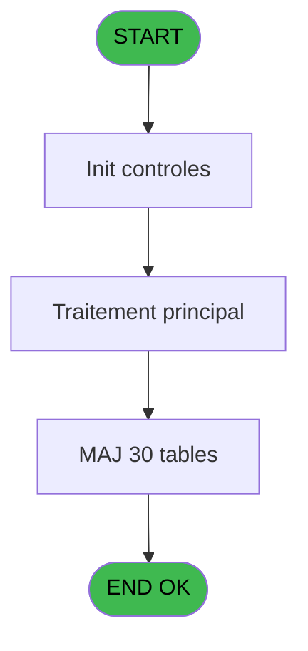
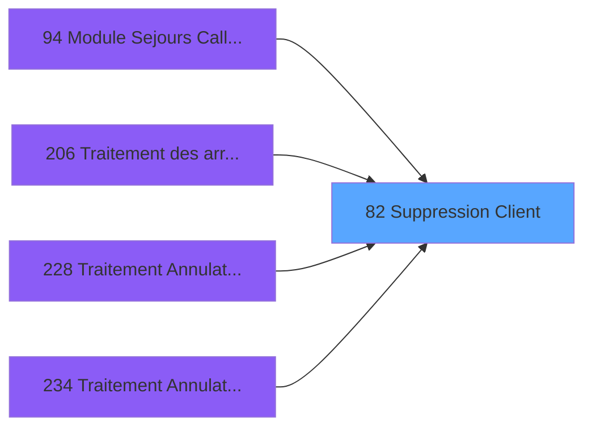

# PBG IDE 82 - Suppression Client

> **Analyse**: Phases 1-4 2026-02-03 09:13 -> 09:13 (19s) | Assemblage 09:13
> **Pipeline**: V7.2 Enrichi
> **Structure**: 4 onglets (Resume | Ecrans | Donnees | Connexions)

<!-- TAB:Resume -->

## 1. FICHE D'IDENTITE

| Attribut | Valeur |
|----------|--------|
| Projet | PBG |
| IDE Position | 82 |
| Nom Programme | Suppression Client |
| Fichier source | `Prg_82.xml` |
| Domaine metier | General |
| Taches | 36 (0 ecrans visibles) |
| Tables modifiees | 30 |
| Programmes appeles | 1 |

## 2. DESCRIPTION FONCTIONNELLE

**Suppression Client** assure la gestion complete de ce processus, accessible depuis [Module Sejours CallTask (IDE 0)](PBG-IDE-0.md), [Module Sejours CallTask (IDE 94)](PBG-IDE-94.md), [Traitement des arrivants (IDE 206)](PBG-IDE-206.md), [Traitement Annulation Existant (IDE 228)](PBG-IDE-228.md), [Traitement Annulation sur modi (IDE 234)](PBG-IDE-234.md), [Traitement Annulation/pms-682 (IDE 235)](PBG-IDE-235.md), [Traitement Annulation/pms-912 (IDE 236)](PBG-IDE-236.md), [Traitement Annulation (IDE 238)](PBG-IDE-238.md), [Module Sejours SubForm (IDE 391)](PBG-IDE-391.md).

Le flux de traitement s'organise en **3 blocs fonctionnels** :

- **Traitement** (30 taches) : traitements metier divers
- **Validation** (5 taches) : controles et verifications de coherence
- **Creation** (1 tache) : insertion d'enregistrements en base (mouvements, prestations)

**Donnees modifiees** : 30 tables en ecriture (voyages__________voy, gm-recherche_____gmr, gm-complet_______gmc, prestations______pre, hebergement______heb, personnel_go______go, client_gm, compte_gm________cgm, historik_station, fichier_messagerie, fichier_validation, troncon__________tro, heb_circuit______hci, commentaire______com, fid_cumul, handicap, lit_matrimoniaux, import_mod, pv_discount_reasons, tairejet, tempo_totaux_qualites, heure_de_passage, comptage_caisse, tempo_ventes, vente_par_moyen_paiement, plafond_lit, pv_globalca_prepaid, num_tpe_par_service, ##_pv_rentals_dat, Table_1057).

**Logique metier** : 1 regles identifiees couvrant conditions metier.

Detail : phases du traitement

#### Phase 1 : Traitement (30 taches)

- **82** - Veuillez patienter ... **[[ECRAN]](#ecran-t1)**
- **82.1** - Suppression **[[ECRAN]](#ecran-t2)**
- **82.1.1** - Suppression 7
- **82.1.2** - Suppression 10
- **82.1.3** - Suppression 10
- **82.1.4** - Suppression 10
- **82.1.5** - Suppression 10
- **82.1.6** - Suppression 10
- **82.1.7** - Suppression 10
- **82.1.8** - Suppression 10
- **82.1.9** - Suppression 10
- **82.1.10** - Suppression 10
- **82.1.11** - Suppression 10
- **82.1.12** - Suppression 10
- **82.1.13** - Suppression 10
- **82.1.14** - Suppression 10
- **82.1.15** - Suppression 10
- **82.1.17** - Suppression 10
- **82.1.18** - Suppression 10
- **82.1.19** - Suppression 10
- **82.1.20** - Suppression 10
- **82.1.21** - Suppression 10
- **82.1.22** - Suppression 10
- **82.1.26** - Suppression 10
- **82.1.28** - Suppression 10
- **82.1.30** - Suppression Messagerie
- **82.1.31** - Suppression Messagerie
- **82.1.32** - (sans nom)
- **82.1.33** - (sans nom)
- **82.1.34** - (sans nom)

Delegue a : [GM supprimes en modif 2 (IDE 129)](PBG-IDE-129.md)

#### Phase 2 : Creation (1 tache)

- **82.1.16** - Creation Historique

#### Phase 3 : Validation (5 taches)

- **82.1.23** - Suppression log valid devalid
- **82.1.24** - Suppression log valid devalid
- **82.1.25** - Suppression log valid devalid
- **82.1.27** - Suppression log valid devalid
- **82.1.29** - Suppression log valid devalid

#### Tables impactees

| Table | Operations | Role metier |
|-------|-----------|-------------|
| gm-recherche_____gmr | R/**W** (2 usages) | Index de recherche |
| fichier_messagerie | **W** (2 usages) |  |
| Table_1057 | **W** (1 usages) |  |
| personnel_go______go | **W** (1 usages) |  |
| lit_matrimoniaux | **W** (1 usages) |  |
| handicap | **W** (1 usages) |  |
| tempo_ventes | **W** (1 usages) | Table temporaire ecran |
| vente_par_moyen_paiement | **W** (1 usages) | Donnees de ventes |
| troncon__________tro | **W** (1 usages) |  |
| heure_de_passage | **W** (1 usages) |  |
| pv_discount_reasons | **W** (1 usages) |  |
| plafond_lit | **W** (1 usages) |  |
| tairejet | **W** (1 usages) |  |
| prestations______pre | **W** (1 usages) | Prestations/services vendus |
| hebergement______heb | **W** (1 usages) | Hebergement (chambres) |
| compte_gm________cgm | **W** (1 usages) | Comptes GM (generaux) |
| commentaire______com | **W** (1 usages) |  |
| import_mod | **W** (1 usages) |  |
| tempo_totaux_qualites | **W** (1 usages) | Table temporaire ecran |
| gm-complet_______gmc | **W** (1 usages) |  |
| fid_cumul | **W** (1 usages) |  |
| num_tpe_par_service | **W** (1 usages) | Services / filieres |
| heb_circuit______hci | **W** (1 usages) | Hebergement (chambres) |
| voyages__________voy | **W** (1 usages) |  |
| historik_station | **W** (1 usages) | Historique / journal |
| pv_globalca_prepaid | **W** (1 usages) |  |
| fichier_validation | **W** (1 usages) |  |
| comptage_caisse | **W** (1 usages) | Sessions de caisse |
| client_gm | **W** (1 usages) |  |
| ##_pv_rentals_dat | **W** (1 usages) |  |

## 3. BLOCS FONCTIONNELS

### 3.1 Traitement (30 taches)

Traitements internes.

---

#### 82 - Veuillez patienter ... [[ECRAN]](#ecran-t1)

**Role** : Tache d'orchestration : point d'entree du programme (30 sous-taches). Coordonne l'enchainement des traitements.
**Ecran** : 426 x 58 DLU (MDI) | [Voir mockup](#ecran-t1)

29 sous-taches directes

| Tache | Nom | Bloc |
|-------|-----|------|
| [82.1](#t2) | Suppression **[[ECRAN]](#ecran-t2)** | Traitement |
| [82.1.1](#t3) | Suppression 7 | Traitement |
| [82.1.2](#t4) | Suppression 10 | Traitement |
| [82.1.3](#t5) | Suppression 10 | Traitement |
| [82.1.4](#t7) | Suppression 10 | Traitement |
| [82.1.5](#t8) | Suppression 10 | Traitement |
| [82.1.6](#t9) | Suppression 10 | Traitement |
| [82.1.7](#t10) | Suppression 10 | Traitement |
| [82.1.8](#t11) | Suppression 10 | Traitement |
| [82.1.9](#t12) | Suppression 10 | Traitement |
| [82.1.10](#t13) | Suppression 10 | Traitement |
| [82.1.11](#t14) | Suppression 10 | Traitement |
| [82.1.12](#t15) | Suppression 10 | Traitement |
| [82.1.13](#t16) | Suppression 10 | Traitement |
| [82.1.14](#t17) | Suppression 10 | Traitement |
| [82.1.15](#t18) | Suppression 10 | Traitement |
| [82.1.17](#t20) | Suppression 10 | Traitement |
| [82.1.18](#t21) | Suppression 10 | Traitement |
| [82.1.19](#t22) | Suppression 10 | Traitement |
| [82.1.20](#t23) | Suppression 10 | Traitement |
| [82.1.21](#t26) | Suppression 10 | Traitement |
| [82.1.22](#t29) | Suppression 10 | Traitement |
| [82.1.26](#t39) | Suppression 10 | Traitement |
| [82.1.28](#t49) | Suppression 10 | Traitement |
| [82.1.30](#t53) | Suppression Messagerie | Traitement |
| [82.1.31](#t57) | Suppression Messagerie | Traitement |
| [82.1.32](#t62) | (sans nom) | Traitement |
| [82.1.33](#t71) | (sans nom) | Traitement |
| [82.1.34](#t74) | (sans nom) | Traitement |

---

#### 82.1 - Suppression [[ECRAN]](#ecran-t2)

**Role** : Traitement : Suppression.
**Ecran** : 619 x 21 DLU (MDI) | [Voir mockup](#ecran-t2)

---

#### 82.1.1 - Suppression 7

**Role** : Traitement : Suppression 7.

---

#### 82.1.2 - Suppression 10

**Role** : Traitement : Suppression 10.

---

#### 82.1.3 - Suppression 10

**Role** : Traitement : Suppression 10.

---

#### 82.1.4 - Suppression 10

**Role** : Traitement : Suppression 10.

---

#### 82.1.5 - Suppression 10

**Role** : Traitement : Suppression 10.

---

#### 82.1.6 - Suppression 10

**Role** : Traitement : Suppression 10.

---

#### 82.1.7 - Suppression 10

**Role** : Traitement : Suppression 10.

---

#### 82.1.8 - Suppression 10

**Role** : Traitement : Suppression 10.

---

#### 82.1.9 - Suppression 10

**Role** : Traitement : Suppression 10.

---

#### 82.1.10 - Suppression 10

**Role** : Traitement : Suppression 10.

---

#### 82.1.11 - Suppression 10

**Role** : Traitement : Suppression 10.

---

#### 82.1.12 - Suppression 10

**Role** : Traitement : Suppression 10.

---

#### 82.1.13 - Suppression 10

**Role** : Traitement : Suppression 10.

---

#### 82.1.14 - Suppression 10

**Role** : Traitement : Suppression 10.

---

#### 82.1.15 - Suppression 10

**Role** : Traitement : Suppression 10.

---

#### 82.1.17 - Suppression 10

**Role** : Traitement : Suppression 10.

---

#### 82.1.18 - Suppression 10

**Role** : Traitement : Suppression 10.

---

#### 82.1.19 - Suppression 10

**Role** : Traitement : Suppression 10.

---

#### 82.1.20 - Suppression 10

**Role** : Traitement : Suppression 10.

---

#### 82.1.21 - Suppression 10

**Role** : Traitement : Suppression 10.

---

#### 82.1.22 - Suppression 10

**Role** : Traitement : Suppression 10.

---

#### 82.1.26 - Suppression 10

**Role** : Traitement : Suppression 10.

---

#### 82.1.28 - Suppression 10

**Role** : Traitement : Suppression 10.

---

#### 82.1.30 - Suppression Messagerie

**Role** : Traitement : Suppression Messagerie.

---

#### 82.1.31 - Suppression Messagerie

**Role** : Traitement : Suppression Messagerie.

---

#### 82.1.32 - (sans nom)

**Role** : Traitement interne.

---

#### 82.1.33 - (sans nom)

**Role** : Traitement interne.

---

#### 82.1.34 - (sans nom)

**Role** : Traitement interne.

### 3.2 Creation (1 tache)

Insertion de nouveaux enregistrements en base.

---

#### 82.1.16 - Creation Historique

**Role** : Consultation/chargement : Creation Historique.

### 3.3 Validation (5 taches)

Controles de coherence : 5 taches verifient les donnees et conditions.

---

#### 82.1.23 - Suppression log valid devalid

**Role** : Verification : Suppression log valid devalid.

---

#### 82.1.24 - Suppression log valid devalid

**Role** : Verification : Suppression log valid devalid.

---

#### 82.1.25 - Suppression log valid devalid

**Role** : Verification : Suppression log valid devalid.

---

#### 82.1.27 - Suppression log valid devalid

**Role** : Verification : Suppression log valid devalid.

---

#### 82.1.29 - Suppression log valid devalid

**Role** : Verification : Suppression log valid devalid.

## 5. REGLES METIER

1 regles identifiees:

### Autres (1 regles)

#### [RM-001] Si P0 Choix Programme [A]='S1' alors 'S' sinon 'T')

| Element | Detail |
|---------|--------|
| **Condition** | `P0 Choix Programme [A]='S1'` |
| **Si vrai** | 'S' |
| **Si faux** | 'T') |
| **Variables** | A (P0 Choix Programme) |
| **Expression source** | Expression 1 : `IF (P0 Choix Programme [A]='S1','S','T')` |
| **Exemple** | Si P0 Choix Programme [A]='S1' → 'S'. Sinon → 'T') |

## 6. CONTEXTE

- **Appele par**: [Module Sejours CallTask (IDE 0)](PBG-IDE-0.md), [Module Sejours CallTask (IDE 94)](PBG-IDE-94.md), [Traitement des arrivants (IDE 206)](PBG-IDE-206.md), [Traitement Annulation Existant (IDE 228)](PBG-IDE-228.md), [Traitement Annulation sur modi (IDE 234)](PBG-IDE-234.md), [Traitement Annulation/pms-682 (IDE 235)](PBG-IDE-235.md), [Traitement Annulation/pms-912 (IDE 236)](PBG-IDE-236.md), [Traitement Annulation (IDE 238)](PBG-IDE-238.md), [Module Sejours SubForm (IDE 391)](PBG-IDE-391.md)
- **Appelle**: 1 programmes | **Tables**: 30 (W:30 R:1 L:0) | **Taches**: 36 | **Expressions**: 1

<!-- TAB:Ecrans -->

## 8. ECRANS

*(Programme sans ecran visible)*

## 9. NAVIGATION

### 9.3 Structure hierarchique (36 taches)

| Position | Tache | Type | Dimensions | Bloc |
|----------|-------|------|------------|------|
| **82.1** | [**Veuillez patienter ...** (82)](#t1) [mockup](#ecran-t1) | MDI | 426x58 | Traitement |
| 82.1.1 | [Suppression (82.1)](#t2) [mockup](#ecran-t2) | MDI | 619x21 | |
| 82.1.2 | [Suppression 7 (82.1.1)](#t3) | MDI | - | |
| 82.1.3 | [Suppression 10 (82.1.2)](#t4) | MDI | - | |
| 82.1.4 | [Suppression 10 (82.1.3)](#t5) | MDI | - | |
| 82.1.5 | [Suppression 10 (82.1.4)](#t7) | MDI | - | |
| 82.1.6 | [Suppression 10 (82.1.5)](#t8) | MDI | - | |
| 82.1.7 | [Suppression 10 (82.1.6)](#t9) | MDI | - | |
| 82.1.8 | [Suppression 10 (82.1.7)](#t10) | MDI | - | |
| 82.1.9 | [Suppression 10 (82.1.8)](#t11) | MDI | - | |
| 82.1.10 | [Suppression 10 (82.1.9)](#t12) | MDI | - | |
| 82.1.11 | [Suppression 10 (82.1.10)](#t13) | MDI | - | |
| 82.1.12 | [Suppression 10 (82.1.11)](#t14) | MDI | - | |
| 82.1.13 | [Suppression 10 (82.1.12)](#t15) | MDI | - | |
| 82.1.14 | [Suppression 10 (82.1.13)](#t16) | MDI | - | |
| 82.1.15 | [Suppression 10 (82.1.14)](#t17) | MDI | - | |
| 82.1.16 | [Suppression 10 (82.1.15)](#t18) | MDI | - | |
| 82.1.17 | [Suppression 10 (82.1.17)](#t20) | MDI | - | |
| 82.1.18 | [Suppression 10 (82.1.18)](#t21) | MDI | - | |
| 82.1.19 | [Suppression 10 (82.1.19)](#t22) | MDI | - | |
| 82.1.20 | [Suppression 10 (82.1.20)](#t23) | MDI | - | |
| 82.1.21 | [Suppression 10 (82.1.21)](#t26) | MDI | - | |
| 82.1.22 | [Suppression 10 (82.1.22)](#t29) | MDI | - | |
| 82.1.23 | [Suppression 10 (82.1.26)](#t39) | MDI | - | |
| 82.1.24 | [Suppression 10 (82.1.28)](#t49) | MDI | - | |
| 82.1.25 | [Suppression Messagerie (82.1.30)](#t53) | - | - | |
| 82.1.26 | [Suppression Messagerie (82.1.31)](#t57) | - | - | |
| 82.1.27 | [(sans nom) (82.1.32)](#t62) | - | - | |
| 82.1.28 | [(sans nom) (82.1.33)](#t71) | - | - | |
| 82.1.29 | [(sans nom) (82.1.34)](#t74) | - | - | |
| **82.2** | [**Creation Historique** (82.1.16)](#t19) | MDI | - | Creation |
| **82.3** | [**Suppression log valid devalid** (82.1.23)](#t30) | - | - | Validation |
| 82.3.1 | [Suppression log valid devalid (82.1.24)](#t33) | - | - | |
| 82.3.2 | [Suppression log valid devalid (82.1.25)](#t36) | - | - | |
| 82.3.3 | [Suppression log valid devalid (82.1.27)](#t46) | - | - | |
| 82.3.4 | [Suppression log valid devalid (82.1.29)](#t52) | - | - | |

### 9.4 Algorigramme

> **Legende**: Vert = START/END OK | Rouge = END KO | Bleu = Decisions
> *Algorigramme auto-genere. Utiliser `/algorigramme` pour une synthese metier detaillee.*

<!-- TAB:Donnees -->

## 10. TABLES

### Tables utilisees (30)

| ID | Nom | Description | Type | R | W | L | Usages |
|----|-----|-------------|------|---|---|---|--------|
| 29 | voyages__________voy |  | DB |   | **W** |   | 1 |
| 30 | gm-recherche_____gmr | Index de recherche | DB | R | **W** |   | 2 |
| 31 | gm-complet_______gmc |  | DB |   | **W** |   | 1 |
| 33 | prestations______pre | Prestations/services vendus | DB |   | **W** |   | 1 |
| 34 | hebergement______heb | Hebergement (chambres) | DB |   | **W** |   | 1 |
| 35 | personnel_go______go |  | DB |   | **W** |   | 1 |
| 36 | client_gm |  | DB |   | **W** |   | 1 |
| 47 | compte_gm________cgm | Comptes GM (generaux) | DB |   | **W** |   | 1 |
| 88 | historik_station | Historique / journal | DB |   | **W** |   | 1 |
| 123 | fichier_messagerie |  | DB |   | **W** |   | 2 |
| 131 | fichier_validation |  | DB |   | **W** |   | 1 |
| 167 | troncon__________tro |  | DB |   | **W** |   | 1 |
| 168 | heb_circuit______hci | Hebergement (chambres) | DB |   | **W** |   | 1 |
| 171 | commentaire______com |  | DB |   | **W** |   | 1 |
| 314 | fid_cumul |  | DB |   | **W** |   | 1 |
| 337 | handicap |  | DB |   | **W** |   | 1 |
| 350 | lit_matrimoniaux |  | DB |   | **W** |   | 1 |
| 358 | import_mod |  | DB |   | **W** |   | 1 |
| 382 | pv_discount_reasons |  | DB |   | **W** |   | 1 |
| 455 | tairejet |  | DB |   | **W** |   | 1 |
| 458 | tempo_totaux_qualites | Table temporaire ecran | DB |   | **W** |   | 1 |
| 463 | heure_de_passage |  | DB |   | **W** |   | 1 |
| 473 | comptage_caisse | Sessions de caisse | TMP |   | **W** |   | 1 |
| 478 | tempo_ventes | Table temporaire ecran | TMP |   | **W** |   | 1 |
| 805 | vente_par_moyen_paiement | Donnees de ventes | DB |   | **W** |   | 1 |
| 807 | plafond_lit |  | DB |   | **W** |   | 1 |
| 832 | pv_globalca_prepaid |  | DB |   | **W** |   | 1 |
| 835 | num_tpe_par_service | Services / filieres | DB |   | **W** |   | 1 |
| 838 | ##_pv_rentals_dat |  | DB |   | **W** |   | 1 |
| 1057 | Table_1057 |  | MEM |   | **W** |   | 1 |

### Colonnes par table (2 / 30 tables avec colonnes identifiees)

Table 29 - voyages__________voy (**W**) - 1 usages

*Table utilisee uniquement en Link ou aucune colonne Real identifiee dans le DataView.*

Table 30 - gm-recherche_____gmr (R/**W**) - 2 usages

| Lettre | Variable | Acces | Type |
|--------|----------|-------|------|
| A | v.societe | W | Alpha |
| B | v.compte | W | Numeric |
| C | v.filiation | W | Numeric |

Table 31 - gm-complet_______gmc (**W**) - 1 usages

*Table utilisee uniquement en Link ou aucune colonne Real identifiee dans le DataView.*

Table 33 - prestations______pre (**W**) - 1 usages

*Table utilisee uniquement en Link ou aucune colonne Real identifiee dans le DataView.*

Table 34 - hebergement______heb (**W**) - 1 usages

*Table utilisee uniquement en Link ou aucune colonne Real identifiee dans le DataView.*

Table 35 - personnel_go______go (**W**) - 1 usages

*Table utilisee uniquement en Link ou aucune colonne Real identifiee dans le DataView.*

Table 36 - client_gm (**W**) - 1 usages

*Table utilisee uniquement en Link ou aucune colonne Real identifiee dans le DataView.*

Table 47 - compte_gm________cgm (**W**) - 1 usages

| Lettre | Variable | Acces | Type |
|--------|----------|-------|------|
| B | v.compte | W | Numeric |

Table 88 - historik_station (**W**) - 1 usages

*Table utilisee uniquement en Link ou aucune colonne Real identifiee dans le DataView.*

Table 123 - fichier_messagerie (**W**) - 2 usages

*Table utilisee uniquement en Link ou aucune colonne Real identifiee dans le DataView.*

Table 131 - fichier_validation (**W**) - 1 usages

*Table utilisee uniquement en Link ou aucune colonne Real identifiee dans le DataView.*

Table 167 - troncon__________tro (**W**) - 1 usages

*Table utilisee uniquement en Link ou aucune colonne Real identifiee dans le DataView.*

Table 168 - heb_circuit______hci (**W**) - 1 usages

*Table utilisee uniquement en Link ou aucune colonne Real identifiee dans le DataView.*

Table 171 - commentaire______com (**W**) - 1 usages

*Table utilisee uniquement en Link ou aucune colonne Real identifiee dans le DataView.*

Table 314 - fid_cumul (**W**) - 1 usages

*Table utilisee uniquement en Link ou aucune colonne Real identifiee dans le DataView.*

Table 337 - handicap (**W**) - 1 usages

*Table utilisee uniquement en Link ou aucune colonne Real identifiee dans le DataView.*

Table 350 - lit_matrimoniaux (**W**) - 1 usages

*Table utilisee uniquement en Link ou aucune colonne Real identifiee dans le DataView.*

Table 358 - import_mod (**W**) - 1 usages

*Table utilisee uniquement en Link ou aucune colonne Real identifiee dans le DataView.*

Table 382 - pv_discount_reasons (**W**) - 1 usages

*Table utilisee uniquement en Link ou aucune colonne Real identifiee dans le DataView.*

Table 455 - tairejet (**W**) - 1 usages

*Table utilisee uniquement en Link ou aucune colonne Real identifiee dans le DataView.*

Table 458 - tempo_totaux_qualites (**W**) - 1 usages

*Table utilisee uniquement en Link ou aucune colonne Real identifiee dans le DataView.*

Table 463 - heure_de_passage (**W**) - 1 usages

*Table utilisee uniquement en Link ou aucune colonne Real identifiee dans le DataView.*

Table 473 - comptage_caisse (**W**) - 1 usages

*Table utilisee uniquement en Link ou aucune colonne Real identifiee dans le DataView.*

Table 478 - tempo_ventes (**W**) - 1 usages

*Table utilisee uniquement en Link ou aucune colonne Real identifiee dans le DataView.*

Table 805 - vente_par_moyen_paiement (**W**) - 1 usages

*Table utilisee uniquement en Link ou aucune colonne Real identifiee dans le DataView.*

Table 807 - plafond_lit (**W**) - 1 usages

*Table utilisee uniquement en Link ou aucune colonne Real identifiee dans le DataView.*

Table 832 - pv_globalca_prepaid (**W**) - 1 usages

*Table utilisee uniquement en Link ou aucune colonne Real identifiee dans le DataView.*

Table 835 - num_tpe_par_service (**W**) - 1 usages

*Table utilisee uniquement en Link ou aucune colonne Real identifiee dans le DataView.*

Table 838 - ##_pv_rentals_dat (**W**) - 1 usages

*Table utilisee uniquement en Link ou aucune colonne Real identifiee dans le DataView.*

Table 1057 - Table_1057 (**W**) - 1 usages

*Table utilisee uniquement en Link ou aucune colonne Real identifiee dans le DataView.*

## 11. VARIABLES

### 11.1 Parametres entrants (1)

Variables recues du programme appelant ([Module Sejours CallTask (IDE 0)](PBG-IDE-0.md)).

| Lettre | Nom | Type | Usage dans |
|--------|-----|------|-----------|
| A | P0 Choix Programme | Alpha | 1x parametre entrant |

### 11.2 Variables de session (1)

Variables persistantes pendant toute la session.

| Lettre | Nom | Type | Usage dans |
|--------|-----|------|-----------|
| C | v.filiation | Numeric | - |

### 11.3 Variables de travail (1)

Variables internes au programme.

| Lettre | Nom | Type | Usage dans |
|--------|-----|------|-----------|
| B | W0 Type Traitement | Alpha | - |

## 12. EXPRESSIONS

**1 / 1 expressions decodees (100%)**

### 12.1 Repartition par type

| Type | Expressions | Regles |
|------|-------------|--------|
| CONDITION | 1 | 5 |

### 12.2 Expressions cles par type

#### CONDITION (1 expressions)

| Type | IDE | Expression | Regle |
|------|-----|------------|-------|
| CONDITION | 1 | `IF (P0 Choix Programme [A]='S1','S','T')` | [RM-001](#rm-RM-001) |

<!-- TAB:Connexions -->

## 13. GRAPHE D'APPELS

### 13.1 Chaine depuis Main (Callers)

Main -> ... -> [Module Sejours CallTask (IDE 0)](PBG-IDE-0.md) -> **Suppression Client (IDE 82)**

Main -> ... -> [Module Sejours CallTask (IDE 94)](PBG-IDE-94.md) -> **Suppression Client (IDE 82)**

Main -> ... -> [Traitement des arrivants (IDE 206)](PBG-IDE-206.md) -> **Suppression Client (IDE 82)**

Main -> ... -> [Traitement Annulation Existant (IDE 228)](PBG-IDE-228.md) -> **Suppression Client (IDE 82)**

Main -> ... -> [Traitement Annulation sur modi (IDE 234)](PBG-IDE-234.md) -> **Suppression Client (IDE 82)**

Main -> ... -> [Traitement Annulation/pms-682 (IDE 235)](PBG-IDE-235.md) -> **Suppression Client (IDE 82)**

Main -> ... -> [Traitement Annulation/pms-912 (IDE 236)](PBG-IDE-236.md) -> **Suppression Client (IDE 82)**

Main -> ... -> [Traitement Annulation (IDE 238)](PBG-IDE-238.md) -> **Suppression Client (IDE 82)**

Main -> ... -> [Module Sejours SubForm (IDE 391)](PBG-IDE-391.md) -> **Suppression Client (IDE 82)**

### 13.2 Callers

| IDE | Nom Programme | Nb Appels |
|-----|---------------|-----------|
| [0](PBG-IDE-0.md) | Module Sejours CallTask | 1 |
| [94](PBG-IDE-94.md) | Module Sejours CallTask | 1 |
| [206](PBG-IDE-206.md) | Traitement des arrivants | 1 |
| [228](PBG-IDE-228.md) | Traitement Annulation Existant | 1 |
| [234](PBG-IDE-234.md) | Traitement Annulation sur modi | 1 |
| [235](PBG-IDE-235.md) | Traitement Annulation/pms-682 | 1 |
| [236](PBG-IDE-236.md) | Traitement Annulation/pms-912 | 1 |
| [238](PBG-IDE-238.md) | Traitement Annulation | 1 |
| [391](PBG-IDE-391.md) | Module Sejours SubForm | 1 |

### 13.3 Callees (programmes appeles)

### 13.4 Detail Callees avec contexte

| IDE | Nom Programme | Appels | Contexte |
|-----|---------------|--------|----------|
| [129](PBG-IDE-129.md) | GM supprimes en modif 2 | 1 | Sous-programme |

## 14. RECOMMANDATIONS MIGRATION

### 14.1 Profil du programme

| Metrique | Valeur | Impact migration |
|----------|--------|-----------------|
| Lignes de logique | 205 | Taille moyenne |
| Expressions | 1 | Peu de logique |
| Tables WRITE | 30 | Fort impact donnees |
| Sous-programmes | 1 | Peu de dependances |
| Ecrans visibles | 0 | Ecran unique ou traitement batch |
| Code desactive | 0% (0 / 205) | Code sain |
| Regles metier | 1 | Quelques regles a preserver |

### 14.2 Plan de migration par bloc

#### Traitement (30 taches: 2 ecrans, 28 traitements)

- **Strategie** : Orchestrateur avec 2 ecrans (Razor/React) et 28 traitements backend (services).
- Les ecrans deviennent des composants UI, les traitements invisibles deviennent des services injectables.
- 1 sous-programme(s) a migrer ou a reutiliser depuis les services existants.
- Decomposer les taches en services unitaires testables.

#### Creation (1 tache: 0 ecran, 1 traitement)

- **Strategie** : Repository pattern avec Entity Framework Core.
- Insertion via `IRepository<T>.CreateAsync()`

#### Validation (5 taches: 0 ecran, 5 traitements)

- **Strategie** : FluentValidation avec validators specifiques.
- Chaque tache de validation -> un validator injectable

### 14.3 Dependances critiques

| Dependance | Type | Appels | Impact |
|------------|------|--------|--------|
| voyages__________voy | Table WRITE (Database) | 1x | Schema + repository |
| gm-recherche_____gmr | Table WRITE (Database) | 1x | Schema + repository |
| gm-complet_______gmc | Table WRITE (Database) | 1x | Schema + repository |
| prestations______pre | Table WRITE (Database) | 1x | Schema + repository |
| hebergement______heb | Table WRITE (Database) | 1x | Schema + repository |
| personnel_go______go | Table WRITE (Database) | 1x | Schema + repository |
| client_gm | Table WRITE (Database) | 1x | Schema + repository |
| compte_gm________cgm | Table WRITE (Database) | 1x | Schema + repository |
| historik_station | Table WRITE (Database) | 1x | Schema + repository |
| fichier_messagerie | Table WRITE (Database) | 2x | Schema + repository |
| fichier_validation | Table WRITE (Database) | 1x | Schema + repository |
| troncon__________tro | Table WRITE (Database) | 1x | Schema + repository |
| heb_circuit______hci | Table WRITE (Database) | 1x | Schema + repository |
| commentaire______com | Table WRITE (Database) | 1x | Schema + repository |
| fid_cumul | Table WRITE (Database) | 1x | Schema + repository |
| handicap | Table WRITE (Database) | 1x | Schema + repository |
| lit_matrimoniaux | Table WRITE (Database) | 1x | Schema + repository |
| import_mod | Table WRITE (Database) | 1x | Schema + repository |
| pv_discount_reasons | Table WRITE (Database) | 1x | Schema + repository |
| tairejet | Table WRITE (Database) | 1x | Schema + repository |
| tempo_totaux_qualites | Table WRITE (Database) | 1x | Schema + repository |
| heure_de_passage | Table WRITE (Database) | 1x | Schema + repository |
| comptage_caisse | Table WRITE (Temp) | 1x | Schema + repository |
| tempo_ventes | Table WRITE (Temp) | 1x | Schema + repository |
| vente_par_moyen_paiement | Table WRITE (Database) | 1x | Schema + repository |
| plafond_lit | Table WRITE (Database) | 1x | Schema + repository |
| pv_globalca_prepaid | Table WRITE (Database) | 1x | Schema + repository |
| num_tpe_par_service | Table WRITE (Database) | 1x | Schema + repository |
| ##_pv_rentals_dat | Table WRITE (Database) | 1x | Schema + repository |
| Table_1057 | Table WRITE (Memory) | 1x | Schema + repository |
| [GM supprimes en modif 2 (IDE 129)](PBG-IDE-129.md) | Sous-programme | 1x | Normale - Sous-programme |

---
*Spec DETAILED generee par Pipeline V7.2 - 2026-02-03 09:13*
