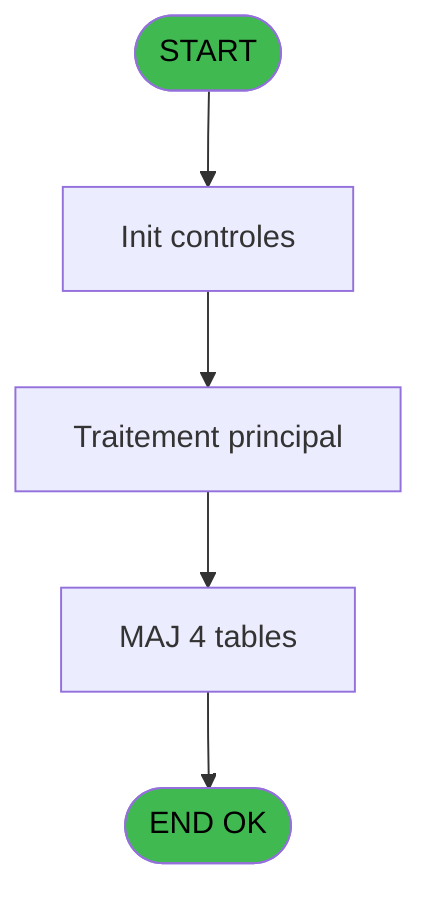
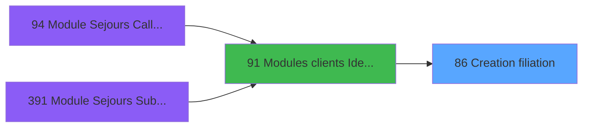
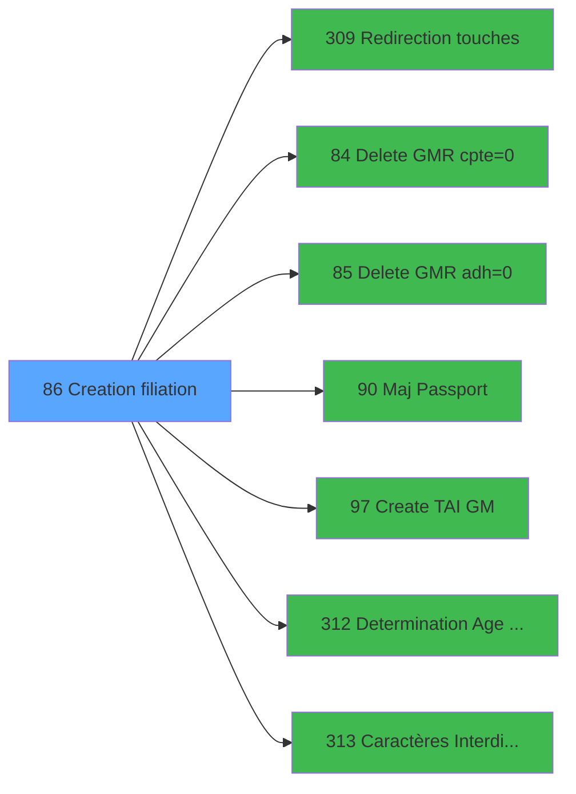

# PBG IDE 86 - Creation filiation

> **Analyse**: Phases 1-4 2026-02-03 15:19 -> 15:19 (12s) | Assemblage 15:19
> **Pipeline**: V7.2 Enrichi
> **Structure**: 4 onglets (Resume | Ecrans | Donnees | Connexions)

<!-- TAB:Resume -->

## 1. FICHE D'IDENTITE

| Attribut | Valeur |
|----------|--------|
| Projet | PBG |
| IDE Position | 86 |
| Nom Programme | Creation filiation |
| Fichier source | `Prg_86.xml` |
| Dossier IDE | Clients |
| Taches | 12 (1 ecrans visibles) |
| Tables modifiees | 4 |
| Programmes appeles | 7 |

## 2. DESCRIPTION FONCTIONNELLE

**Creation filiation** assure la gestion complete de ce processus, accessible depuis [Modules clients Identite (IDE 91)](PBG-IDE-91.md).

Le flux de traitement s'organise en **4 blocs fonctionnels** :

- **Traitement** (7 taches) : traitements metier divers
- **Calcul** (2 taches) : calculs de montants, stocks ou compteurs
- **Creation** (2 taches) : insertion d'enregistrements en base (mouvements, prestations)
- **Initialisation** (1 tache) : reinitialisation d'etats et de variables de travail

**Donnees modifiees** : 4 tables en ecriture (gm-complet_______gmc, historik_station, heb_circuit______hci, import_mod).

**Logique metier** : 1 regles identifiees couvrant conditions metier.

Detail : phases du traitement

#### Phase 1 : Traitement (7 taches)

- **86** - Module des Clients
- **86.1.1** - Reiteration **[[ECRAN]](#ecran-t3)**
- **86.1.1.1** - Clients **[[ECRAN]](#ecran-t4)**
- **86.1.1.1.1** - Modification Hebergement
- **86.1.1.1.3** - recup filiation club
- **86.1.1.1.4** - recup filiation
- **86.1.2** - Determination Age Bebe

Delegue a : [Redirection touches (IDE 309)](PBG-IDE-309.md), [   Delete GMR cpte=0 (IDE 84)](PBG-IDE-84.md), [   Delete GMR adh=0 (IDE 85)](PBG-IDE-85.md), [  Maj Passport (IDE 90)](PBG-IDE-90.md), [Determination Age Debut Sejour (IDE 312)](PBG-IDE-312.md), [Caractères Interdits (A20) - L (IDE 313)](PBG-IDE-313.md)

#### Phase 2 : Creation (2 taches)

- **86.1** - Creation client **[[ECRAN]](#ecran-t2)**
- **86.1.1.1.2** - Creation Historique

Delegue a : [Create TAI GM (IDE 97)](PBG-IDE-97.md)

#### Phase 3 : Calcul (2 taches)

- **86.1.1.1.5** - Calcul flag
- **86.1.1.1.6** - Calcul type millesia

#### Phase 4 : Initialisation (1 tache)

- **86.2** - Initialisation paramètres

#### Tables impactees

| Table | Operations | Role metier |
|-------|-----------|-------------|
| gm-complet_______gmc | R/**W** (2 usages) |  |
| import_mod | **W** (1 usages) |  |
| historik_station | **W** (1 usages) | Historique / journal |
| heb_circuit______hci | **W** (1 usages) | Hebergement (chambres) |

## 3. BLOCS FONCTIONNELS

### 3.1 Traitement (7 taches)

Traitements internes.

---

#### 86 - Module des Clients

**Role** : Tache d'orchestration : point d'entree du programme (7 sous-taches). Coordonne l'enchainement des traitements.

6 sous-taches directes

| Tache | Nom | Bloc |
|-------|-----|------|
| [86.1.1](#t3) | Reiteration **[[ECRAN]](#ecran-t3)** | Traitement |
| [86.1.1.1](#t4) | Clients **[[ECRAN]](#ecran-t4)** | Traitement |
| [86.1.1.1.1](#t5) | Modification Hebergement | Traitement |
| [86.1.1.1.3](#t8) | recup filiation club | Traitement |
| [86.1.1.1.4](#t9) | recup filiation | Traitement |
| [86.1.2](#t19) | Determination Age Bebe | Traitement |

**Delegue a** : [Redirection touches (IDE 309)](PBG-IDE-309.md), [   Delete GMR cpte=0 (IDE 84)](PBG-IDE-84.md), [   Delete GMR adh=0 (IDE 85)](PBG-IDE-85.md)

---

#### 86.1.1 - Reiteration [[ECRAN]](#ecran-t3)

**Role** : Traitement : Reiteration.
**Ecran** : 706 x 147 DLU (MDI) | [Voir mockup](#ecran-t3)
**Delegue a** : [Redirection touches (IDE 309)](PBG-IDE-309.md), [   Delete GMR cpte=0 (IDE 84)](PBG-IDE-84.md), [   Delete GMR adh=0 (IDE 85)](PBG-IDE-85.md)

---

#### 86.1.1.1 - Clients [[ECRAN]](#ecran-t4)

**Role** : Traitement : Clients.
**Ecran** : 712 x 150 DLU (MDI) | [Voir mockup](#ecran-t4)
**Delegue a** : [Redirection touches (IDE 309)](PBG-IDE-309.md), [   Delete GMR cpte=0 (IDE 84)](PBG-IDE-84.md), [   Delete GMR adh=0 (IDE 85)](PBG-IDE-85.md)

---

#### 86.1.1.1.1 - Modification Hebergement

**Role** : Traitement : Modification Hebergement.
**Delegue a** : [Redirection touches (IDE 309)](PBG-IDE-309.md), [   Delete GMR cpte=0 (IDE 84)](PBG-IDE-84.md), [   Delete GMR adh=0 (IDE 85)](PBG-IDE-85.md)

---

#### 86.1.1.1.3 - recup filiation club

**Role** : Consultation/chargement : recup filiation club.
**Variables liees** : BA (W0 filiation club1), BB (W0 filiation club2), B (>Filiation Compte), K (W0-Filiation)
**Delegue a** : [Redirection touches (IDE 309)](PBG-IDE-309.md), [   Delete GMR cpte=0 (IDE 84)](PBG-IDE-84.md), [   Delete GMR adh=0 (IDE 85)](PBG-IDE-85.md)

---

#### 86.1.1.1.4 - recup filiation

**Role** : Consultation/chargement : recup filiation.
**Variables liees** : BA (W0 filiation club1), BB (W0 filiation club2), B (>Filiation Compte), K (W0-Filiation)
**Delegue a** : [Redirection touches (IDE 309)](PBG-IDE-309.md), [   Delete GMR cpte=0 (IDE 84)](PBG-IDE-84.md), [   Delete GMR adh=0 (IDE 85)](PBG-IDE-85.md)

---

#### 86.1.2 - Determination Age Bebe

**Role** : Traitement : Determination Age Bebe.
**Variables liees** : M (W0-Age Bebe), BK (W1 Age Bebe)
**Delegue a** : [Redirection touches (IDE 309)](PBG-IDE-309.md), [   Delete GMR cpte=0 (IDE 84)](PBG-IDE-84.md), [   Delete GMR adh=0 (IDE 85)](PBG-IDE-85.md)

### 3.2 Creation (2 taches)

Insertion de nouveaux enregistrements en base.

---

#### 86.1 - Creation client [[ECRAN]](#ecran-t2)

**Role** : Creation d'enregistrement : Creation client.
**Ecran** : 763 x 286 DLU (MDI) | [Voir mockup](#ecran-t2)
**Variables liees** : I (W0-Type Client), P (W0-autorisation creation)
**Delegue a** : [Create TAI GM (IDE 97)](PBG-IDE-97.md)

---

#### 86.1.1.1.2 - Creation Historique

**Role** : Consultation/chargement : Creation Historique.
**Variables liees** : P (W0-autorisation creation)
**Delegue a** : [Create TAI GM (IDE 97)](PBG-IDE-97.md)

### 3.3 Calcul (2 taches)

Calculs metier : montants, stocks, compteurs.

---

#### 86.1.1.1.5 - Calcul flag

**Role** : Calcul : Calcul flag.

---

#### 86.1.1.1.6 - Calcul type millesia

**Role** : Calcul : Calcul type millesia.
**Variables liees** : I (W0-Type Client)

### 3.4 Initialisation (1 tache)

Reinitialisation d'etats et variables de travail.

---

#### 86.2 - Initialisation paramètres

**Role** : Reinitialisation : Initialisation paramètres.

## 5. REGLES METIER

1 regles identifiees:

### Autres (1 regles)

#### [RM-001] Traitement conditionnel si GetParam ('NB_LIEU_SEJOUR') est a zero

| Element | Detail |
|---------|--------|
| **Condition** | `GetParam ('NB_LIEU_SEJOUR')=0` |
| **Si vrai** | 'G' |
| **Si faux** | IF (GetParam ('NB_LIEU_SEJOUR')=1,GetParam ('CODE_LIEU_SEJOUR'),'')) |
| **Expression source** | Expression 1 : `IF (GetParam ('NB_LIEU_SEJOUR')=0,'G',IF (GetParam ('NB_LIEU` |
| **Exemple** | Si GetParam ('NB_LIEU_SEJOUR')=0 → 'G' |

## 6. CONTEXTE

- **Appele par**: [Modules clients Identite (IDE 91)](PBG-IDE-91.md)
- **Appelle**: 7 programmes | **Tables**: 13 (W:4 R:4 L:8) | **Taches**: 12 | **Expressions**: 4

<!-- TAB:Ecrans -->

## 8. ECRANS

### 8.1 Forms visibles (1 / 12)

| # | Position | Tache | Nom | Type | Largeur | Hauteur | Bloc |
|---|----------|-------|-----|------|---------|---------|------|
| 1 | 86.1.1.1 | 86.1.1.1 | Clients | MDI | 712 | 150 | Traitement |

### 8.2 Mockups Ecrans

---

#### 86.1.1.1 - Clients
**Tache** : [86.1.1.1](#t4) | **Type** : MDI | **Dimensions** : 712 x 150 DLU
**Bloc** : Traitement | **Titre IDE** : Clients

<!-- FORM-DATA:
{
    "width":  712,
    "vFactor":  8,
    "type":  "MDI",
    "hFactor":  8,
    "controls":  [
                     {
                         "x":  0,
                         "type":  "label",
                         "var":  "",
                         "y":  0,
                         "w":  706,
                         "fmt":  "",
                         "name":  "",
                         "h":  21,
                         "color":  "",
                         "text":  "",
                         "parent":  null
                     },
                     {
                         "x":  183,
                         "type":  "label",
                         "var":  "",
                         "y":  28,
                         "w":  523,
                         "fmt":  "",
                         "name":  "",
                         "h":  48,
                         "color":  "1",
                         "text":  "",
                         "parent":  null
                     },
                     {
                         "x":  202,
                         "type":  "label",
                         "var":  "",
                         "y":  34,
                         "w":  96,
                         "fmt":  "",
                         "name":  "",
                         "h":  12,
                         "color":  "",
                         "text":  "N° Adhérent",
                         "parent":  4
                     },
                     {
                         "x":  486,
                         "type":  "label",
                         "var":  "",
                         "y":  34,
                         "w":  75,
                         "fmt":  "",
                         "name":  "",
                         "h":  12,
                         "color":  "",
                         "text":  "Filiation",
                         "parent":  4
                     },
                     {
                         "x":  202,
                         "type":  "label",
                         "var":  "",
                         "y":  48,
                         "w":  94,
                         "fmt":  "",
                         "name":  "",
                         "h":  12,
                         "color":  "",
                         "text":  "Nom",
                         "parent":  4
                     },
                     {
                         "x":  486,
                         "type":  "label",
                         "var":  "",
                         "y":  48,
                         "w":  77,
                         "fmt":  "",
                         "name":  "",
                         "h":  12,
                         "color":  "",
                         "text":  "Prénom",
                         "parent":  4
                     },
                     {
                         "x":  202,
                         "type":  "label",
                         "var":  "",
                         "y":  63,
                         "w":  42,
                         "fmt":  "",
                         "name":  "",
                         "h":  12,
                         "color":  "",
                         "text":  "Titre",
                         "parent":  4
                     },
                     {
                         "x":  183,
                         "type":  "label",
                         "var":  "",
                         "y":  79,
                         "w":  523,
                         "fmt":  "",
                         "name":  "",
                         "h":  36,
                         "color":  "1",
                         "text":  "",
                         "parent":  null
                     },
                     {
                         "x":  202,
                         "type":  "label",
                         "var":  "",
                         "y":  84,
                         "w":  133,
                         "fmt":  "",
                         "name":  "",
                         "h":  12,
                         "color":  "",
                         "text":  "Date Naissance",
                         "parent":  15
                     },
                     {
                         "x":  497,
                         "type":  "label",
                         "var":  "",
                         "y":  84,
                         "w":  38,
                         "fmt":  "",
                         "name":  "",
                         "h":  12,
                         "color":  "",
                         "text":  "Age",
                         "parent":  15
                     },
                     {
                         "x":  202,
                         "type":  "label",
                         "var":  "",
                         "y":  100,
                         "w":  96,
                         "fmt":  "",
                         "name":  "",
                         "h":  12,
                         "color":  "",
                         "text":  "Fumeur",
                         "parent":  15
                     },
                     {
                         "x":  0,
                         "type":  "label",
                         "var":  "",
                         "y":  125,
                         "w":  706,
                         "fmt":  "",
                         "name":  "",
                         "h":  22,
                         "color":  "",
                         "text":  "",
                         "parent":  null
                     },
                     {
                         "x":  573,
                         "type":  "edit",
                         "var":  "",
                         "y":  34,
                         "w":  48,
                         "fmt":  "",
                         "name":  "CLI Filiation Club",
                         "h":  12,
                         "color":  "110",
                         "text":  "",
                         "parent":  4
                     },
                     {
                         "x":  301,
                         "type":  "edit",
                         "var":  "",
                         "y":  48,
                         "w":  182,
                         "fmt":  "",
                         "name":  "CLI Nom",
                         "h":  12,
                         "color":  "110",
                         "text":  "",
                         "parent":  4
                     },
                     {
                         "x":  573,
                         "type":  "edit",
                         "var":  "",
                         "y":  48,
                         "w":  126,
                         "fmt":  "UL9",
                         "name":  "CLI Prenom",
                         "h":  12,
                         "color":  "110",
                         "text":  "",
                         "parent":  4
                     },
                     {
                         "x":  303,
                         "type":  "combobox",
                         "var":  "",
                         "y":  63,
                         "w":  182,
                         "fmt":  "",
                         "name":  "W2-select titre",
                         "h":  12,
                         "color":  "110",
                         "text":  "1,2",
                         "parent":  4
                     },
                     {
                         "x":  565,
                         "type":  "edit",
                         "var":  "",
                         "y":  84,
                         "w":  38,
                         "fmt":  "",
                         "name":  "",
                         "h":  12,
                         "color":  "",
                         "text":  "",
                         "parent":  15
                     },
                     {
                         "x":  337,
                         "type":  "edit",
                         "var":  "",
                         "y":  84,
                         "w":  126,
                         "fmt":  "",
                         "name":  "CLI Date Naissance",
                         "h":  12,
                         "color":  "110",
                         "text":  "",
                         "parent":  15
                     },
                     {
                         "x":  337,
                         "type":  "combobox",
                         "var":  "",
                         "y":  99,
                         "w":  182,
                         "fmt":  "",
                         "name":  "W2-select fumeur",
                         "h":  12,
                         "color":  "110",
                         "text":  "1,2",
                         "parent":  15
                     },
                     {
                         "x":  8,
                         "type":  "button",
                         "var":  "",
                         "y":  127,
                         "w":  154,
                         "fmt":  "\u0026Ok",
                         "name":  "Bouton Ok",
                         "h":  18,
                         "color":  "",
                         "text":  "",
                         "parent":  null
                     },
                     {
                         "x":  6,
                         "type":  "edit",
                         "var":  "",
                         "y":  6,
                         "w":  267,
                         "fmt":  "30",
                         "name":  "",
                         "h":  8,
                         "color":  "",
                         "text":  "",
                         "parent":  null
                     },
                     {
                         "x":  411,
                         "type":  "edit",
                         "var":  "",
                         "y":  6,
                         "w":  283,
                         "fmt":  "WWW DD MMM YYYYT",
                         "name":  "",
                         "h":  8,
                         "color":  "",
                         "text":  "",
                         "parent":  null
                     },
                     {
                         "x":  305,
                         "type":  "edit",
                         "var":  "",
                         "y":  34,
                         "w":  120,
                         "fmt":  "10",
                         "name":  "",
                         "h":  12,
                         "color":  "",
                         "text":  "",
                         "parent":  4
                     },
                     {
                         "x":  10,
                         "type":  "image",
                         "var":  "",
                         "y":  37,
                         "w":  159,
                         "fmt":  "",
                         "name":  "",
                         "h":  59,
                         "color":  "7",
                         "text":  "",
                         "parent":  null
                     },
                     {
                         "x":  171,
                         "type":  "button",
                         "var":  "",
                         "y":  127,
                         "w":  154,
                         "fmt":  "\u0026Abandonner",
                         "name":  "",
                         "h":  18,
                         "color":  "",
                         "text":  "",
                         "parent":  null
                     }
                 ],
    "taskId":  "86.1.1.1",
    "height":  150
}
-->

<strong>Champs : 10 champs</strong>

| Pos (x,y) | Nom | Variable | Type |
|-----------|-----|----------|------|
| 573,34 | CLI Filiation Club | - | edit |
| 301,48 | CLI Nom | - | edit |
| 573,48 | CLI Prenom | - | edit |
| 303,63 | W2-select titre | - | combobox |
| 565,84 | (sans nom) | - | edit |
| 337,84 | CLI Date Naissance | - | edit |
| 337,99 | W2-select fumeur | - | combobox |
| 6,6 | 30 | - | edit |
| 411,6 | WWW DD MMM YYYYT | - | edit |
| 305,34 | 10 | - | edit |

<strong>Boutons : 2 boutons</strong>

| Bouton | Pos (x,y) | Action |
|--------|-----------|--------|
| Ok | 8,127 | Valide la saisie et enregistre |
| Abandonner | 171,127 | Annule et retour au menu |

## 9. NAVIGATION

Ecran unique: **Clients**

### 9.3 Structure hierarchique (12 taches)

| Position | Tache | Type | Dimensions | Bloc |
|----------|-------|------|------------|------|
| **86.1** | [**Module des Clients** (86)](#t1) | MDI | - | Traitement |
| 86.1.1 | [Reiteration (86.1.1)](#t3) [mockup](#ecran-t3) | MDI | 706x147 | |
| 86.1.2 | [Clients (86.1.1.1)](#t4) [mockup](#ecran-t4) | MDI | 712x150 | |
| 86.1.3 | [Modification Hebergement (86.1.1.1.1)](#t5) | MDI | - | |
| 86.1.4 | [recup filiation club (86.1.1.1.3)](#t8) | MDI | - | |
| 86.1.5 | [recup filiation (86.1.1.1.4)](#t9) | MDI | - | |
| 86.1.6 | [Determination Age Bebe (86.1.2)](#t19) | MDI | - | |
| **86.2** | [**Creation client** (86.1)](#t2) [mockup](#ecran-t2) | MDI | 763x286 | Creation |
| 86.2.1 | [Creation Historique (86.1.1.1.2)](#t6) | MDI | - | |
| **86.3** | [**Calcul flag** (86.1.1.1.5)](#t10) | MDI | - | Calcul |
| 86.3.1 | [Calcul type millesia (86.1.1.1.6)](#t11) | MDI | - | |
| **86.4** | [**Initialisation paramètres** (86.2)](#t12) | MDI | - | Initialisation |

### 9.4 Algorigramme

> **Legende**: Vert = START/END OK | Rouge = END KO | Bleu = Decisions
> *Algorigramme auto-genere. Utiliser `/algorigramme` pour une synthese metier detaillee.*

<!-- TAB:Donnees -->

## 10. TABLES

### Tables utilisees (13)

| ID | Nom | Description | Type | R | W | L | Usages |
|----|-----|-------------|------|---|---|---|--------|
| 30 | gm-recherche_____gmr | Index de recherche | DB |   |   | L | 2 |
| 31 | gm-complet_______gmc |  | DB | R | **W** |   | 2 |
| 34 | hebergement______heb | Hebergement (chambres) | DB |   |   | L | 2 |
| 36 | client_gm |  | DB | R |   | L | 4 |
| 63 | parametres___par |  | DB | R |   |   | 1 |
| 69 | initialisation___ini |  | DB |   |   | L | 1 |
| 88 | historik_station | Historique / journal | DB |   | **W** |   | 1 |
| 113 | tables_village |  | DB | R |   | L | 2 |
| 119 | tables_pays_tel_ |  | DB |   |   | L | 1 |
| 131 | fichier_validation |  | DB |   |   | L | 2 |
| 168 | heb_circuit______hci | Hebergement (chambres) | DB |   | **W** |   | 1 |
| 358 | import_mod |  | DB |   | **W** |   | 1 |
| 728 | arc_cc_total |  | DB |   |   | L | 1 |

### Colonnes par table (5 / 7 tables avec colonnes identifiees)

Table 31 - gm-complet_______gmc (R/**W**) - 2 usages

| Lettre | Variable | Acces | Type |
|--------|----------|-------|------|
| A | W1-autorisation | W | Alpha |
| B | W1-fin tache | W | Logical |
| C | W1 ret lien comment | W | Numeric |
| D | W1-fin compte | W | Date |
| E | W1-Numero compte memo | W | Numeric |
| F | W1-Filliation | W | Numeric |
| G | v cdr | W | Logical |
| H | W1-select qualite | W | Alpha |
| I | W1-select honey moon | W | Alpha |
| J | W1-select millesia | W | Alpha |
| K | W1-select fleurs | W | Alpha |
| L | W1-anc date deb | W | Date |
| M | W1-select vol dep | W | Alpha |
| N | W1-accord filiation | W | Logical |
| O | W1 libelle nationalite | W | Alpha |
| P | W1 langue parler | W | Alpha |
| Q | W1-select inscription | W | Alpha |
| R | W1-select fumeur | W | Alpha |
| S | W1-lieu sejour | W | Alpha |
| T | W1-select lieu sejour | W | Alpha |
| U | W1-retour logement | W | Logical |
| V | W1-select logement | W | Alpha |
| W | W1-select TUP | W | Alpha |
| X | W1-select Base OCC | W | Alpha |
| Y | W1 N° Piece | W | Alpha |
| Z | W1 Date de delivrance | W | Date |
| BA | W1 Ville delivrance | W | Alpha |
| BB | W1 Proffession | W | Alpha |
| BC | W1 n dans la rue | W | Alpha |
| BD | W1 Nom de la rue | W | Alpha |
| BE | W1 Commune | W | Alpha |
| BF | W1 Code postal | W | Alpha |
| BG | W1 Ville | W | Alpha |
| BH | v. Hebergement | W | Alpha |
| BI | v. aller | W | Alpha |
| BJ | v. retour | W | Alpha |
| BK | W1 Age Bebe | W | Numeric |
| BL | W1 Nbre Adulte | W | Numeric |
| BM | W1 Nbre Enfant | W | Numeric |
| BN | W1 Date Début Séjour | W | Date |
| BO | W1 Date FIn Séjour | W | Date |

Table 36 - client_gm (R/L) - 4 usages

| Lettre | Variable | Acces | Type |
|--------|----------|-------|------|
| G | W2 cdrt client | R | Logical |
| I | W0-Type Client | R | Alpha |

Table 63 - parametres___par (R) - 1 usages

*Table utilisee uniquement en Link ou aucune colonne Real identifiee dans le DataView.*

Table 88 - historik_station (**W**) - 1 usages

*Table utilisee uniquement en Link ou aucune colonne Real identifiee dans le DataView.*

Table 113 - tables_village (R/L) - 2 usages

| Lettre | Variable | Acces | Type |
|--------|----------|-------|------|
| BG | W0 NomVillage | R | Alpha |
| BJ | W0  VillageTAI | R | Alpha |

Table 168 - heb_circuit______hci (**W**) - 1 usages

*Table utilisee uniquement en Link ou aucune colonne Real identifiee dans le DataView.*

Table 358 - import_mod (**W**) - 1 usages

*Table utilisee uniquement en Link ou aucune colonne Real identifiee dans le DataView.*

## 11. VARIABLES

### 11.1 Parametres entrants (1)

Variables recues du programme appelant ([Modules clients Identite (IDE 91)](PBG-IDE-91.md)).

| Lettre | Nom | Type | Usage dans |
|--------|-----|------|-----------|
| H | P0 Front/Back | Alpha | - |

### 11.2 Variables de travail (17)

Variables internes au programme.

| Lettre | Nom | Type | Usage dans |
|--------|-----|------|-----------|
| G | W0 active menu | Logical | - |
| O | W0 combo nationalite | Alpha | - |
| S | W0 vol arrive | Alpha | - |
| T | W0 vol depart | Alpha | - |
| U | W0 titre | Alpha | - |
| V | W0 titre 2 | Alpha | - |
| Z | W0 libelle nationalite | Alpha | - |
| BA | W0 filiation club1 | Numeric | - |
| BB | W0 filiation club2 | Numeric | - |
| BC | W0 Societe | Alpha | - |
| BD | W0 Devise | Alpha | - |
| BE | W0 Decimales | Numeric | - |
| BF | W0 Masque | Alpha | - |
| BG | W0 NomVillage | Alpha | - |
| BH | W0 TAI Obligatoire | Alpha | - |
| BI | W0 Saisir TAI | Numeric | - |
| BJ | W0  VillageTAI | Alpha | - |

### 11.3 Autres (23)

Variables diverses.

| Lettre | Nom | Type | Usage dans |
|--------|-----|------|-----------|
| A | >Numero Compte | Numeric | - |
| B | >Filiation Compte | Numeric | - |
| C | > fin tache 1 | Logical | - |
| D | > fin tache 0 | Logical | - |
| E | >Nom Adherent | Alpha | - |
| F | >Prenom Adherent | Alpha | - |
| I | W0-Type Client | Alpha | - |
| J | W0-N°Adherent | Numeric | - |
| K | W0-Filiation | Numeric | - |
| L | W0-Fin de Tache | Logical | 1x refs |
| M | W0-Age Bebe | Numeric | - |
| N | W0-Base Vide | Alpha | - |
| P | W0-autorisation creation | Alpha | - |
| Q | W0- autorisation modif | Alpha | - |
| R | W0- Blocage effectue | Alpha | - |
| W | W0-lieu sejour general | Alpha | - |
| X | W0-compteur lieu | Numeric | - |
| Y | W0-lieu sejour | Alpha | - |
| BK | W1 Age Bebe | Numeric | - |
| BL | W1 Nbre Adulte | Numeric | - |
| BM | W1 Nbre Enfant | Numeric | - |
| BN | W1 Date Début Séjour | Date | - |
| BO | W1 Date FIn Séjour | Date | - |

Toutes les 41 variables (liste complete)

| Cat | Lettre | Nom Variable | Type |
|-----|--------|--------------|------|
| P0 | **H** | P0 Front/Back | Alpha |
| W0 | **G** | W0 active menu | Logical |
| W0 | **O** | W0 combo nationalite | Alpha |
| W0 | **S** | W0 vol arrive | Alpha |
| W0 | **T** | W0 vol depart | Alpha |
| W0 | **U** | W0 titre | Alpha |
| W0 | **V** | W0 titre 2 | Alpha |
| W0 | **Z** | W0 libelle nationalite | Alpha |
| W0 | **BA** | W0 filiation club1 | Numeric |
| W0 | **BB** | W0 filiation club2 | Numeric |
| W0 | **BC** | W0 Societe | Alpha |
| W0 | **BD** | W0 Devise | Alpha |
| W0 | **BE** | W0 Decimales | Numeric |
| W0 | **BF** | W0 Masque | Alpha |
| W0 | **BG** | W0 NomVillage | Alpha |
| W0 | **BH** | W0 TAI Obligatoire | Alpha |
| W0 | **BI** | W0 Saisir TAI | Numeric |
| W0 | **BJ** | W0  VillageTAI | Alpha |
| Autre | **A** | >Numero Compte | Numeric |
| Autre | **B** | >Filiation Compte | Numeric |
| Autre | **C** | > fin tache 1 | Logical |
| Autre | **D** | > fin tache 0 | Logical |
| Autre | **E** | >Nom Adherent | Alpha |
| Autre | **F** | >Prenom Adherent | Alpha |
| Autre | **I** | W0-Type Client | Alpha |
| Autre | **J** | W0-N°Adherent | Numeric |
| Autre | **K** | W0-Filiation | Numeric |
| Autre | **L** | W0-Fin de Tache | Logical |
| Autre | **M** | W0-Age Bebe | Numeric |
| Autre | **N** | W0-Base Vide | Alpha |
| Autre | **P** | W0-autorisation creation | Alpha |
| Autre | **Q** | W0- autorisation modif | Alpha |
| Autre | **R** | W0- Blocage effectue | Alpha |
| Autre | **W** | W0-lieu sejour general | Alpha |
| Autre | **X** | W0-compteur lieu | Numeric |
| Autre | **Y** | W0-lieu sejour | Alpha |
| Autre | **BK** | W1 Age Bebe | Numeric |
| Autre | **BL** | W1 Nbre Adulte | Numeric |
| Autre | **BM** | W1 Nbre Enfant | Numeric |
| Autre | **BN** | W1 Date Début Séjour | Date |
| Autre | **BO** | W1 Date FIn Séjour | Date |

## 12. EXPRESSIONS

**4 / 4 expressions decodees (100%)**

### 12.1 Repartition par type

| Type | Expressions | Regles |
|------|-------------|--------|
| CONDITION | 1 | 5 |
| OTHER | 1 | 0 |
| CAST_LOGIQUE | 2 | 0 |

### 12.2 Expressions cles par type

#### CONDITION (1 expressions)

| Type | IDE | Expression | Regle |
|------|-----|------------|-------|
| CONDITION | 1 | `IF (GetParam ('NB_LIEU_SEJOUR')=0,'G',IF (GetParam ('NB_LIEU_SEJOUR')=1,GetParam ('CODE_LIEU_SEJOUR'),''))` | [RM-001](#rm-RM-001) |

#### OTHER (1 expressions)

| Type | IDE | Expression | Regle |
|------|-----|------------|-------|
| OTHER | 2 | `W0-Fin de Tache [L]` | - |

#### CAST_LOGIQUE (2 expressions)

| Type | IDE | Expression | Regle |
|------|-----|------------|-------|
| CAST_LOGIQUE | 4 | `'FALSE'LOG` | - |
| CAST_LOGIQUE | 3 | `'TRUE'LOG` | - |

<!-- TAB:Connexions -->

## 13. GRAPHE D'APPELS

### 13.1 Chaine depuis Main (Callers)

Main -> ... -> [Modules clients Identite (IDE 91)](PBG-IDE-91.md) -> **Creation filiation (IDE 86)**

### 13.2 Callers

| IDE | Nom Programme | Nb Appels |
|-----|---------------|-----------|
| [91](PBG-IDE-91.md) | Modules clients Identite | 1 |

### 13.3 Callees (programmes appeles)

### 13.4 Detail Callees avec contexte

| IDE | Nom Programme | Appels | Contexte |
|-----|---------------|--------|----------|
| [309](PBG-IDE-309.md) | Redirection touches | 4 | Sous-programme |
| [84](PBG-IDE-84.md) |    Delete GMR cpte=0 | 2 | Sous-programme |
| [85](PBG-IDE-85.md) |    Delete GMR adh=0 | 2 | Sous-programme |
| [90](PBG-IDE-90.md) |   Maj Passport | 1 | Mise a jour donnees |
| [97](PBG-IDE-97.md) | Create TAI GM | 1 | Sous-programme |
| [312](PBG-IDE-312.md) | Determination Age Debut Sejour | 1 | Sous-programme |
| [313](PBG-IDE-313.md) | Caractères Interdits (A20) - L | 1 | Validation saisie |

## 14. RECOMMANDATIONS MIGRATION

### 14.1 Profil du programme

| Metrique | Valeur | Impact migration |
|----------|--------|-----------------|
| Lignes de logique | 680 | Programme volumineux |
| Expressions | 4 | Peu de logique |
| Tables WRITE | 4 | Impact modere |
| Sous-programmes | 7 | Dependances moderees |
| Ecrans visibles | 1 | Ecran unique ou traitement batch |
| Code desactive | 0% (0 / 680) | Code sain |
| Regles metier | 1 | Quelques regles a preserver |

### 14.2 Plan de migration par bloc

#### Traitement (7 taches: 2 ecrans, 5 traitements)

- **Strategie** : Orchestrateur avec 2 ecrans (Razor/React) et 5 traitements backend (services).
- Les ecrans deviennent des composants UI, les traitements invisibles deviennent des services injectables.
- 7 sous-programme(s) a migrer ou a reutiliser depuis les services existants.
- Decomposer les taches en services unitaires testables.

#### Creation (2 taches: 1 ecran, 1 traitement)

- **Strategie** : Repository pattern avec Entity Framework Core.
- Insertion via `IRepository<T>.CreateAsync()`

#### Calcul (2 taches: 0 ecran, 2 traitements)

- **Strategie** : Services de calcul purs (Domain Services).
- Migrer la logique de calcul (stock, compteurs, montants)

#### Initialisation (1 tache: 0 ecran, 1 traitement)

- **Strategie** : Constructeur/methode `InitAsync()` dans l'orchestrateur.

### 14.3 Dependances critiques

| Dependance | Type | Appels | Impact |
|------------|------|--------|--------|
| gm-complet_______gmc | Table WRITE (Database) | 1x | Schema + repository |
| historik_station | Table WRITE (Database) | 1x | Schema + repository |
| heb_circuit______hci | Table WRITE (Database) | 1x | Schema + repository |
| import_mod | Table WRITE (Database) | 1x | Schema + repository |
| [Redirection touches (IDE 309)](PBG-IDE-309.md) | Sous-programme | 4x | **CRITIQUE** - Sous-programme |
| [   Delete GMR adh=0 (IDE 85)](PBG-IDE-85.md) | Sous-programme | 2x | Haute - Sous-programme |
| [   Delete GMR cpte=0 (IDE 84)](PBG-IDE-84.md) | Sous-programme | 2x | Haute - Sous-programme |
| [Determination Age Debut Sejour (IDE 312)](PBG-IDE-312.md) | Sous-programme | 1x | Normale - Sous-programme |
| [Caractères Interdits (A20) - L (IDE 313)](PBG-IDE-313.md) | Sous-programme | 1x | Normale - Validation saisie |
| [  Maj Passport (IDE 90)](PBG-IDE-90.md) | Sous-programme | 1x | Normale - Mise a jour donnees |
| [Create TAI GM (IDE 97)](PBG-IDE-97.md) | Sous-programme | 1x | Normale - Sous-programme |

---
*Spec DETAILED generee par Pipeline V7.2 - 2026-02-03 15:19*
