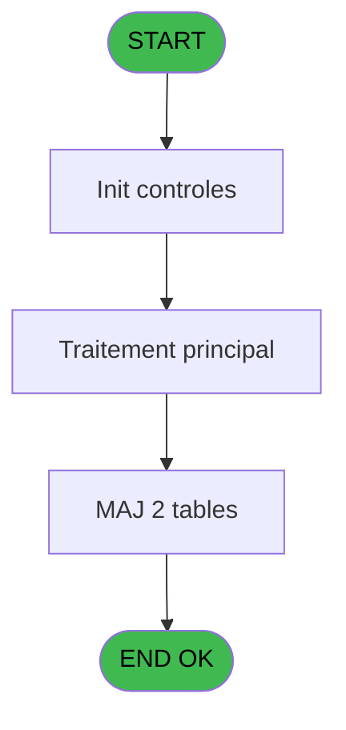
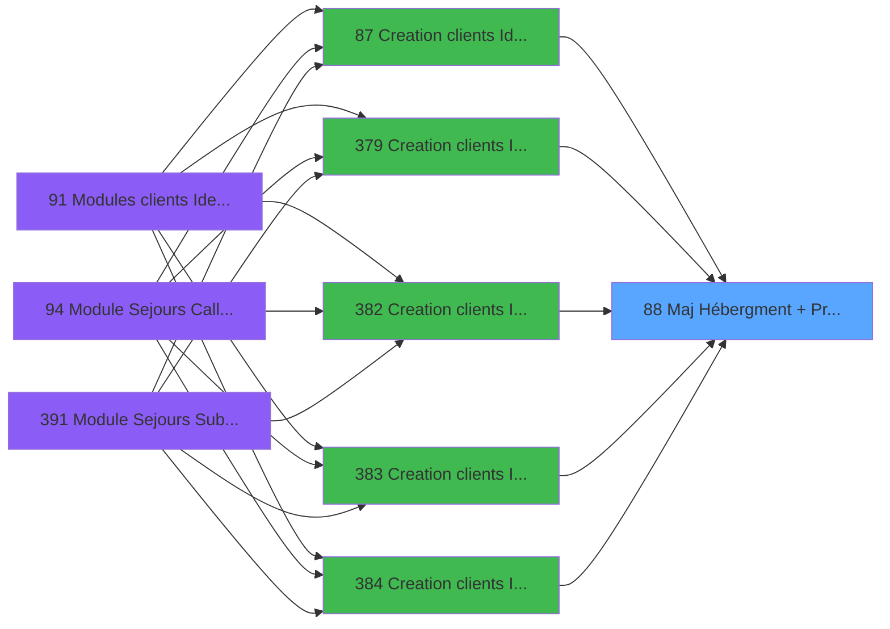

# PBG IDE 88 - Maj Hébergment + Prestation

> **Analyse**: Phases 1-4 2026-02-03 09:16 -> 09:16 (19s) | Assemblage 09:16
> **Pipeline**: V7.2 Enrichi
> **Structure**: 4 onglets (Resume | Ecrans | Donnees | Connexions)

<!-- TAB:Resume -->

## 1. FICHE D'IDENTITE

| Attribut | Valeur |
|----------|--------|
| Projet | PBG |
| IDE Position | 88 |
| Nom Programme | Maj Hébergment + Prestation |
| Fichier source | `Prg_88.xml` |
| Domaine metier | General |
| Taches | 7 (0 ecrans visibles) |
| Tables modifiees | 2 |
| Programmes appeles | 1 |

## 2. DESCRIPTION FONCTIONNELLE

**Maj Hébergment + Prestation** assure la gestion complete de ce processus, accessible depuis [Creation clients Identite (IDE 87)](PBG-IDE-87.md), [Creation clients Identite SAV (IDE 379)](PBG-IDE-379.md), [Creation clients Identite P185 (IDE 382)](PBG-IDE-382.md), [Creation clients Identite PROD (IDE 383)](PBG-IDE-383.md), [Creation clients Identite en c (IDE 384)](PBG-IDE-384.md), [Creation clients Identite SAV* (IDE 386)](PBG-IDE-386.md).

Le flux de traitement s'organise en **4 blocs fonctionnels** :

- **Traitement** (4 taches) : traitements metier divers
- **Calcul** (1 tache) : calculs de montants, stocks ou compteurs
- **Creation** (1 tache) : insertion d'enregistrements en base (mouvements, prestations)
- **Consultation** (1 tache) : ecrans de recherche, selection et consultation

**Donnees modifiees** : 2 tables en ecriture (prestations______pre, hebergement______heb).

Detail : phases du traitement

#### Phase 1 : Traitement (4 taches)

- **88.1** - Attribution Prestation **[[ECRAN]](#ecran-t2)**
- **88.1.3** - Proposition Prestation **[[ECRAN]](#ecran-t43)**
- **88** - Maj Hébergment + Prestation
- **88.3** - Maj Hebergement **[[ECRAN]](#ecran-t61)**

Delegue a : [Gestion des Prestations (IDE 369)](PBG-IDE-369.md)

#### Phase 2 : Consultation (1 tache)

- **88.1.1** - Recherche Prestation Bébé

#### Phase 3 : Creation (1 tache)

- **88.1.2** - Creation Prestation

#### Phase 4 : Calcul (1 tache)

- **88.2** - Recalcul Occupation **[[ECRAN]](#ecran-t57)**

#### Tables impactees

| Table | Operations | Role metier |
|-------|-----------|-------------|
| hebergement______heb | R/**W**/L (4 usages) | Hebergement (chambres) |
| prestations______pre | **W** (2 usages) | Prestations/services vendus |

## 3. BLOCS FONCTIONNELS

### 3.1 Traitement (4 taches)

Traitements internes.

---

#### 88.1 - Attribution Prestation [[ECRAN]](#ecran-t2)

**Role** : Traitement : Attribution Prestation.
**Ecran** : 604 x 0 DLU | [Voir mockup](#ecran-t2)
**Variables liees** : A (v NbrePrestationsBébé), B (vCodePrestation)
**Delegue a** : [Gestion des Prestations (IDE 369)](PBG-IDE-369.md)

---

#### 88.1.3 - Proposition Prestation [[ECRAN]](#ecran-t43)

**Role** : Traitement : Proposition Prestation.
**Ecran** : 1314 x 0 DLU | [Voir mockup](#ecran-t43)
**Variables liees** : A (v NbrePrestationsBébé), B (vCodePrestation)
**Delegue a** : [Gestion des Prestations (IDE 369)](PBG-IDE-369.md)

---

#### 88 - Maj Hébergment + Prestation

**Role** : Traitement : Maj Hébergment + Prestation.
**Variables liees** : A (v NbrePrestationsBébé), B (vCodePrestation)
**Delegue a** : [Gestion des Prestations (IDE 369)](PBG-IDE-369.md)

---

#### 88.3 - Maj Hebergement [[ECRAN]](#ecran-t61)

**Role** : Traitement : Maj Hebergement.
**Ecran** : 619 x 0 DLU | [Voir mockup](#ecran-t61)
**Delegue a** : [Gestion des Prestations (IDE 369)](PBG-IDE-369.md)

### 3.2 Consultation (1 tache)

Ecrans de recherche et consultation.

---

#### 88.1.1 - Recherche Prestation Bébé

**Role** : Traitement : Recherche Prestation Bébé.
**Variables liees** : A (v NbrePrestationsBébé), F (V.Nbre Bébé), B (vCodePrestation)

### 3.3 Creation (1 tache)

Insertion de nouveaux enregistrements en base.

---

#### 88.1.2 - Creation Prestation

**Role** : Creation d'enregistrement : Creation Prestation.
**Variables liees** : A (v NbrePrestationsBébé), B (vCodePrestation)

### 3.4 Calcul (1 tache)

Calculs metier : montants, stocks, compteurs.

---

#### 88.2 - Recalcul Occupation [[ECRAN]](#ecran-t57)

**Role** : Calcul : Recalcul Occupation.
**Ecran** : 625 x 0 DLU | [Voir mockup](#ecran-t57)

## 5. REGLES METIER

*(Aucune regle metier identifiee)*

## 6. CONTEXTE

- **Appele par**: [Creation clients Identite (IDE 87)](PBG-IDE-87.md), [Creation clients Identite SAV (IDE 379)](PBG-IDE-379.md), [Creation clients Identite P185 (IDE 382)](PBG-IDE-382.md), [Creation clients Identite PROD (IDE 383)](PBG-IDE-383.md), [Creation clients Identite en c (IDE 384)](PBG-IDE-384.md), [Creation clients Identite SAV* (IDE 386)](PBG-IDE-386.md)
- **Appelle**: 1 programmes | **Tables**: 4 (W:2 R:2 L:2) | **Taches**: 7 | **Expressions**: 8

<!-- TAB:Ecrans -->

## 8. ECRANS

*(Programme sans ecran visible)*

## 9. NAVIGATION

### 9.3 Structure hierarchique (7 taches)

| Position | Tache | Type | Dimensions | Bloc |
|----------|-------|------|------------|------|
| **88.1** | [**Attribution Prestation** (88.1)](#t2) [mockup](#ecran-t2) | - | 604x0 | Traitement |
| 88.1.1 | [Proposition Prestation (88.1.3)](#t43) [mockup](#ecran-t43) | - | 1314x0 | |
| 88.1.2 | [Maj Hébergment + Prestation (88)](#t45) | - | - | |
| 88.1.3 | [Maj Hebergement (88.3)](#t61) [mockup](#ecran-t61) | - | 619x0 | |
| **88.2** | [**Recherche Prestation Bébé** (88.1.1)](#t41) | - | - | Consultation |
| **88.3** | [**Creation Prestation** (88.1.2)](#t42) | - | - | Creation |
| **88.4** | [**Recalcul Occupation** (88.2)](#t57) [mockup](#ecran-t57) | - | 625x0 | Calcul |

### 9.4 Algorigramme

> **Legende**: Vert = START/END OK | Rouge = END KO | Bleu = Decisions
> *Algorigramme auto-genere. Utiliser `/algorigramme` pour une synthese metier detaillee.*

<!-- TAB:Donnees -->

## 10. TABLES

### Tables utilisees (4)

| ID | Nom | Description | Type | R | W | L | Usages |
|----|-----|-------------|------|---|---|---|--------|
| 31 | gm-complet_______gmc |  | DB |   |   | L | 1 |
| 33 | prestations______pre | Prestations/services vendus | DB |   | **W** |   | 2 |
| 34 | hebergement______heb | Hebergement (chambres) | DB | R | **W** | L | 4 |
| 135 | libelle_prestation | Prestations/services vendus | DB | R |   |   | 1 |

### Colonnes par table (3 / 3 tables avec colonnes identifiees)

Table 33 - prestations______pre (**W**) - 2 usages

| Lettre | Variable | Acces | Type |
|--------|----------|-------|------|
| A | v NbrePrestationsBébé | W | Numeric |

Table 34 - hebergement______heb (R/**W**/L) - 4 usages

| Lettre | Variable | Acces | Type |
|--------|----------|-------|------|
| A | v NbrePrestationsBébé | W | Numeric |
| B | vCodePrestation | W | Unicode |

Table 135 - libelle_prestation (R) - 1 usages

| Lettre | Variable | Acces | Type |
|--------|----------|-------|------|
| A | v NbrePrestationsBébé | R | Numeric |
| B | vCodePrestation | R | Unicode |

## 11. VARIABLES

### 11.1 Parametres entrants (3)

Variables recues du programme appelant ([Creation clients Identite (IDE 87)](PBG-IDE-87.md)).

| Lettre | Nom | Type | Usage dans |
|--------|-----|------|-----------|
| C | P Date Fin | Date | - |
| D | P Age Bebe | Numeric | - |
| G | P Code Circuit | Unicode | - |

### 11.2 Variables de session (3)

Variables persistantes pendant toute la session.

| Lettre | Nom | Type | Usage dans |
|--------|-----|------|-----------|
| A | v NbrePrestationsBébé | Numeric | - |
| E | V.Nbre Adulte | Numeric | - |
| F | V.Nbre Bébé | Numeric | - |

### 11.3 Autres (1)

Variables diverses.

| Lettre | Nom | Type | Usage dans |
|--------|-----|------|-----------|
| B | vCodePrestation | Unicode | - |

## 12. EXPRESSIONS

**8 / 8 expressions decodees (100%)**

### 12.1 Repartition par type

| Type | Expressions | Regles |
|------|-------------|--------|
| CALCULATION | 2 | 0 |
| CONSTANTE | 1 | 0 |
| OTHER | 3 | 0 |
| CONDITION | 2 | 0 |

### 12.2 Expressions cles par type

#### CALCULATION (2 expressions)

| Type | IDE | Expression | Regle |
|------|-----|------------|-------|
| CALCULATION | 6 | `{1,8}+1` | - |
| CALCULATION | 5 | `{1,7}+1` | - |

#### CONSTANTE (1 expressions)

| Type | IDE | Expression | Regle |
|------|-----|------------|-------|
| CONSTANTE | 4 | `'H'` | - |

#### OTHER (3 expressions)

| Type | IDE | Expression | Regle |
|------|-----|------------|-------|
| OTHER | 3 | `{1,2}` | - |
| OTHER | 2 | `{1,1}` | - |
| OTHER | 1 | `GetParam ('SOCIETE')` | - |

#### CONDITION (2 expressions)

| Type | IDE | Expression | Regle |
|------|-----|------------|-------|
| CONDITION | 8 | `[H]<={1,4}` | - |
| CONDITION | 7 | `[H]>{1,4}` | - |

<!-- TAB:Connexions -->

## 13. GRAPHE D'APPELS

### 13.1 Chaine depuis Main (Callers)

Main -> ... -> [Creation clients Identite (IDE 87)](PBG-IDE-87.md) -> **Maj Hébergment + Prestation (IDE 88)**

Main -> ... -> [Creation clients Identite SAV (IDE 379)](PBG-IDE-379.md) -> **Maj Hébergment + Prestation (IDE 88)**

Main -> ... -> [Creation clients Identite P185 (IDE 382)](PBG-IDE-382.md) -> **Maj Hébergment + Prestation (IDE 88)**

Main -> ... -> [Creation clients Identite PROD (IDE 383)](PBG-IDE-383.md) -> **Maj Hébergment + Prestation (IDE 88)**

Main -> ... -> [Creation clients Identite en c (IDE 384)](PBG-IDE-384.md) -> **Maj Hébergment + Prestation (IDE 88)**

Main -> ... -> [Creation clients Identite SAV* (IDE 386)](PBG-IDE-386.md) -> **Maj Hébergment + Prestation (IDE 88)**

### 13.2 Callers

| IDE | Nom Programme | Nb Appels |
|-----|---------------|-----------|
| [87](PBG-IDE-87.md) | Creation clients Identite | 1 |
| [379](PBG-IDE-379.md) | Creation clients Identite SAV | 1 |
| [382](PBG-IDE-382.md) | Creation clients Identite P185 | 1 |
| [383](PBG-IDE-383.md) | Creation clients Identite PROD | 1 |
| [384](PBG-IDE-384.md) | Creation clients Identite en c | 1 |
| [386](PBG-IDE-386.md) | Creation clients Identite SAV* | 1 |

### 13.3 Callees (programmes appeles)

### 13.4 Detail Callees avec contexte

| IDE | Nom Programme | Appels | Contexte |
|-----|---------------|--------|----------|
| [369](PBG-IDE-369.md) | Gestion des Prestations | 1 | Gestion moyens paiement |

## 14. RECOMMANDATIONS MIGRATION

### 14.1 Profil du programme

| Metrique | Valeur | Impact migration |
|----------|--------|-----------------|
| Lignes de logique | 98 | Programme compact |
| Expressions | 8 | Peu de logique |
| Tables WRITE | 2 | Impact faible |
| Sous-programmes | 1 | Peu de dependances |
| Ecrans visibles | 0 | Ecran unique ou traitement batch |
| Code desactive | 0% (0 / 98) | Code sain |
| Regles metier | 0 | Pas de regle identifiee |

### 14.2 Plan de migration par bloc

#### Traitement (4 taches: 3 ecrans, 1 traitement)

- **Strategie** : Orchestrateur avec 3 ecrans (Razor/React) et 1 traitements backend (services).
- Les ecrans deviennent des composants UI, les traitements invisibles deviennent des services injectables.
- 1 sous-programme(s) a migrer ou a reutiliser depuis les services existants.
- Decomposer les taches en services unitaires testables.

#### Consultation (1 tache: 0 ecran, 1 traitement)

- **Strategie** : Composants de recherche/selection en modales.

#### Creation (1 tache: 0 ecran, 1 traitement)

- **Strategie** : Repository pattern avec Entity Framework Core.
- Insertion via `IRepository<T>.CreateAsync()`

#### Calcul (1 tache: 1 ecran, 0 traitement)

- **Strategie** : Services de calcul purs (Domain Services).
- Migrer la logique de calcul (stock, compteurs, montants)

### 14.3 Dependances critiques

| Dependance | Type | Appels | Impact |
|------------|------|--------|--------|
| prestations______pre | Table WRITE (Database) | 2x | Schema + repository |
| hebergement______heb | Table WRITE (Database) | 1x | Schema + repository |
| [Gestion des Prestations (IDE 369)](PBG-IDE-369.md) | Sous-programme | 1x | Normale - Gestion moyens paiement |

---
*Spec DETAILED generee par Pipeline V7.2 - 2026-02-03 09:16*
