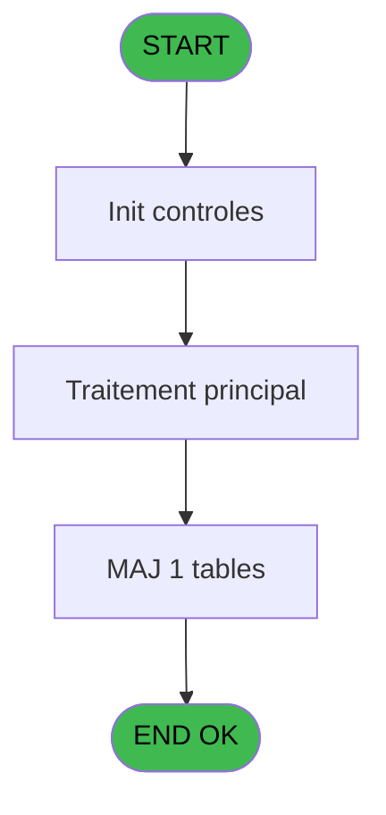
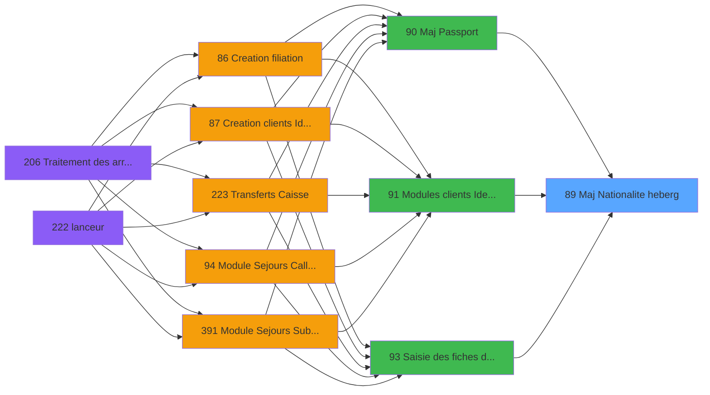

# PBG IDE 89 - Maj Nationalite heberg

> **Analyse**: Phases 1-4 2026-02-03 09:16 -> 09:17 (19s) | Assemblage 09:17
> **Pipeline**: V7.2 Enrichi
> **Structure**: 4 onglets (Resume | Ecrans | Donnees | Connexions)

<!-- TAB:Resume -->

## 1. FICHE D'IDENTITE

| Attribut | Valeur |
|----------|--------|
| Projet | PBG |
| IDE Position | 89 |
| Nom Programme | Maj Nationalite heberg |
| Fichier source | `Prg_89.xml` |
| Domaine metier | General |
| Taches | 2 (0 ecrans visibles) |
| Tables modifiees | 1 |
| Programmes appeles | 0 |

## 2. DESCRIPTION FONCTIONNELLE

**Maj Nationalite heberg** assure la gestion complete de ce processus, accessible depuis [  Maj Passport (IDE 90)](PBG-IDE-90.md), [Modules clients Identite (IDE 91)](PBG-IDE-91.md), [Saisie des fiches de police (IDE 93)](PBG-IDE-93.md).

Le flux de traitement s'organise en **1 blocs fonctionnels** :

- **Traitement** (2 taches) : traitements metier divers

**Donnees modifiees** : 1 tables en ecriture (hebergement______heb).

## 3. BLOCS FONCTIONNELS

### 3.1 Traitement (2 taches)

Traitements internes.

---

#### 89 - Maj Nationalite heberg

**Role** : Traitement : Maj Nationalite heberg.

---

#### 89.1 - Mise a jour fichier 12

**Role** : Traitement : Mise a jour fichier 12.

## 5. REGLES METIER

*(Aucune regle metier identifiee)*

## 6. CONTEXTE

- **Appele par**: [  Maj Passport (IDE 90)](PBG-IDE-90.md), [Modules clients Identite (IDE 91)](PBG-IDE-91.md), [Saisie des fiches de police (IDE 93)](PBG-IDE-93.md)
- **Appelle**: 0 programmes | **Tables**: 1 (W:1 R:0 L:0) | **Taches**: 2 | **Expressions**: 3

<!-- TAB:Ecrans -->

## 8. ECRANS

*(Programme sans ecran visible)*

## 9. NAVIGATION

### 9.3 Structure hierarchique (2 taches)

| Position | Tache | Type | Dimensions | Bloc |
|----------|-------|------|------------|------|
| **89.1** | [**Maj Nationalite heberg** (89)](#t1) | MDI | - | Traitement |
| 89.1.1 | [Mise a jour fichier 12 (89.1)](#t2) | MDI | - | |

### 9.4 Algorigramme

> **Legende**: Vert = START/END OK | Rouge = END KO | Bleu = Decisions
> *Algorigramme auto-genere. Utiliser `/algorigramme` pour une synthese metier detaillee.*

<!-- TAB:Donnees -->

## 10. TABLES

### Tables utilisees (1)

| ID | Nom | Description | Type | R | W | L | Usages |
|----|-----|-------------|------|---|---|---|--------|
| 34 | hebergement______heb | Hebergement (chambres) | DB |   | **W** |   | 1 |

### Colonnes par table (0 / 1 tables avec colonnes identifiees)

Table 34 - hebergement______heb (**W**) - 1 usages

*Table utilisee uniquement en Link ou aucune colonne Real identifiee dans le DataView.*

## 11. VARIABLES

### 11.1 Autres (3)

Variables diverses.

| Lettre | Nom | Type | Usage dans |
|--------|-----|------|-----------|
| A | > compte | Numeric | - |
| B | > filiation | Numeric | - |
| C | > code pays | Alpha | - |

## 12. EXPRESSIONS

**3 / 3 expressions decodees (100%)**

### 12.1 Repartition par type

| Type | Expressions | Regles |
|------|-------------|--------|
| CONSTANTE | 3 | 0 |

### 12.2 Expressions cles par type

#### CONSTANTE (3 expressions)

| Type | IDE | Expression | Regle |
|------|-----|------------|-------|
| CONSTANTE | 3 | `'H'` | - |
| CONSTANTE | 2 | `'Z'` | - |
| CONSTANTE | 1 | `'A'` | - |

<!-- TAB:Connexions -->

## 13. GRAPHE D'APPELS

### 13.1 Chaine depuis Main (Callers)

Main -> ... -> [  Maj Passport (IDE 90)](PBG-IDE-90.md) -> **Maj Nationalite heberg (IDE 89)**

Main -> ... -> [Modules clients Identite (IDE 91)](PBG-IDE-91.md) -> **Maj Nationalite heberg (IDE 89)**

Main -> ... -> [Saisie des fiches de police (IDE 93)](PBG-IDE-93.md) -> **Maj Nationalite heberg (IDE 89)**

### 13.2 Callers

| IDE | Nom Programme | Nb Appels |
|-----|---------------|-----------|
| [90](PBG-IDE-90.md) |   Maj Passport | 1 |
| [91](PBG-IDE-91.md) | Modules clients Identite | 1 |
| [93](PBG-IDE-93.md) | Saisie des fiches de police | 1 |

### 13.3 Callees (programmes appeles)

### 13.4 Detail Callees avec contexte

| IDE | Nom Programme | Appels | Contexte |
|-----|---------------|--------|----------|
| - | (aucun) | - | - |

## 14. RECOMMANDATIONS MIGRATION

### 14.1 Profil du programme

| Metrique | Valeur | Impact migration |
|----------|--------|-----------------|
| Lignes de logique | 17 | Programme compact |
| Expressions | 3 | Peu de logique |
| Tables WRITE | 1 | Impact faible |
| Sous-programmes | 0 | Peu de dependances |
| Ecrans visibles | 0 | Ecran unique ou traitement batch |
| Code desactive | 0% (0 / 17) | Code sain |
| Regles metier | 0 | Pas de regle identifiee |

### 14.2 Plan de migration par bloc

#### Traitement (2 taches: 0 ecran, 2 traitements)

- **Strategie** : 2 service(s) backend injectable(s) (Domain Services).
- Decomposer les taches en services unitaires testables.

### 14.3 Dependances critiques

| Dependance | Type | Appels | Impact |
|------------|------|--------|--------|
| hebergement______heb | Table WRITE (Database) | 1x | Schema + repository |

---
*Spec DETAILED generee par Pipeline V7.2 - 2026-02-03 09:17*
