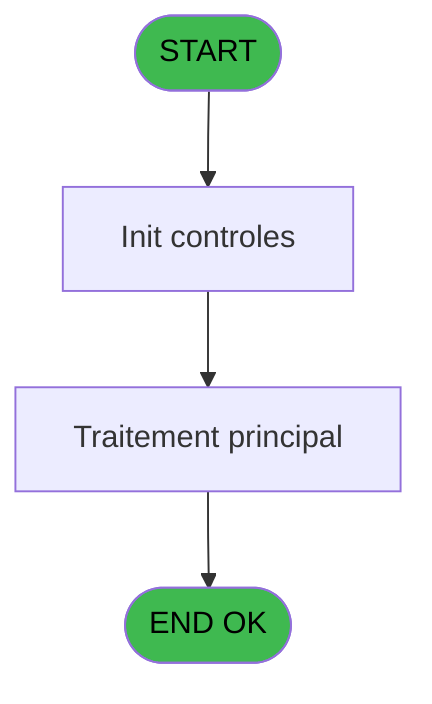
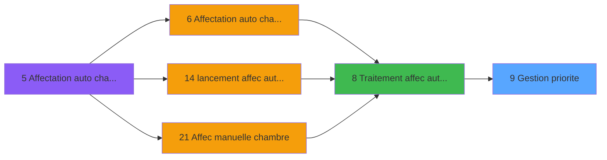
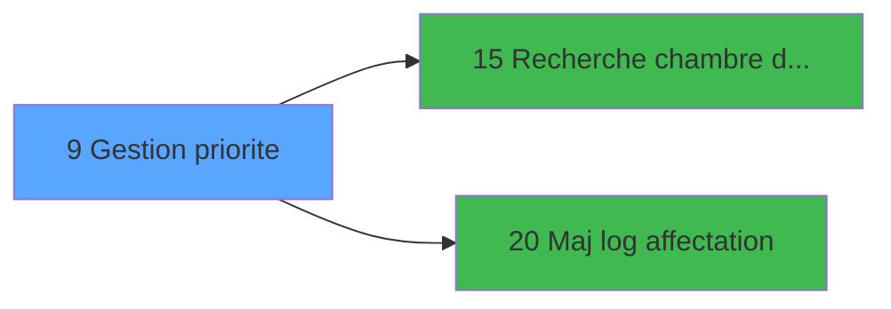

# PBG IDE 9 - Gestion priorite

> **Analyse**: Phases 1-4 2026-02-03 00:57 -> 00:58 (40s) | Assemblage 00:58
> **Pipeline**: V7.2 Enrichi
> **Structure**: 4 onglets (Resume | Ecrans | Donnees | Connexions)

<!-- TAB:Resume -->

## 1. FICHE D'IDENTITE

| Attribut | Valeur |
|----------|--------|
| Projet | PBG |
| IDE Position | 9 |
| Nom Programme | Gestion priorite |
| Fichier source | `Prg_9.xml` |
| Domaine metier | General |
| Taches | 1 (1 ecrans visibles) |
| Tables modifiees | 0 |
| Programmes appeles | 2 |

## 2. DESCRIPTION FONCTIONNELLE

**Gestion priorite** assure la gestion complete de ce processus, accessible depuis [Traitement affec auto chambres (IDE 8)](PBG-IDE-8.md).

Le flux de traitement s'organise en **1 blocs fonctionnels** :

- **Traitement** (1 tache) : traitements metier divers

## 3. BLOCS FONCTIONNELS

### 3.1 Traitement (1 tache)

Traitements internes.

---

#### 9 - Affectation chambre [[ECRAN]](#ecran-t2)

**Role** : Traitement : Affectation chambre.
**Ecran** : 437 x 76 DLU | [Voir mockup](#ecran-t2)
**Delegue a** : [Maj log affectation (IDE 20)](PBG-IDE-20.md)

## 5. REGLES METIER

*(Aucune regle metier identifiee)*

## 6. CONTEXTE

- **Appele par**: [Traitement affec auto chambres (IDE 8)](PBG-IDE-8.md)
- **Appelle**: 2 programmes | **Tables**: 3 (W:0 R:1 L:2) | **Taches**: 1 | **Expressions**: 37

<!-- TAB:Ecrans -->

## 8. ECRANS

### 8.1 Forms visibles (1 / 1)

| # | Position | Tache | Nom | Type | Largeur | Hauteur | Bloc |
|---|----------|-------|-----|------|---------|---------|------|
| 1 | 9.1 | 9 | Affectation chambre | Type0 | 437 | 76 | Traitement |

### 8.2 Mockups Ecrans

---

#### 9.1 - Affectation chambre
**Tache** : [9](#t2) | **Type** : Type0 | **Dimensions** : 437 x 76 DLU
**Bloc** : Traitement | **Titre IDE** : Affectation chambre

<!-- FORM-DATA:
{
    "width":  437,
    "vFactor":  8,
    "type":  "Type0",
    "hFactor":  8,
    "controls":  [
                     {
                         "x":  5,
                         "type":  "label",
                         "var":  "",
                         "y":  2,
                         "w":  423,
                         "fmt":  "",
                         "name":  "",
                         "h":  29,
                         "color":  "",
                         "text":  "",
                         "parent":  null
                     },
                     {
                         "x":  103,
                         "type":  "label",
                         "var":  "",
                         "y":  12,
                         "w":  275,
                         "fmt":  "",
                         "name":  "",
                         "h":  8,
                         "color":  "7",
                         "text":  "Affectation en cours...",
                         "parent":  null
                     },
                     {
                         "x":  5,
                         "type":  "label",
                         "var":  "",
                         "y":  31,
                         "w":  423,
                         "fmt":  "",
                         "name":  "",
                         "h":  37,
                         "color":  "",
                         "text":  "",
                         "parent":  null
                     },
                     {
                         "x":  13,
                         "type":  "label",
                         "var":  "",
                         "y":  43,
                         "w":  405,
                         "fmt":  "",
                         "name":  "",
                         "h":  19,
                         "color":  "",
                         "text":  "",
                         "parent":  null
                     },
                     {
                         "x":  6,
                         "type":  "image",
                         "var":  "",
                         "y":  4,
                         "w":  72,
                         "fmt":  "",
                         "name":  "",
                         "h":  25,
                         "color":  "",
                         "text":  "",
                         "parent":  null
                     },
                     {
                         "x":  16,
                         "type":  "edit",
                         "var":  "",
                         "y":  44,
                         "w":  400,
                         "fmt":  "30",
                         "name":  "",
                         "h":  17,
                         "color":  "159",
                         "text":  "",
                         "parent":  4
                     },
                     {
                         "x":  181,
                         "type":  "edit",
                         "var":  "",
                         "y":  48,
                         "w":  64,
                         "fmt":  "3 %",
                         "name":  "",
                         "h":  8,
                         "color":  "143",
                         "text":  "",
                         "parent":  1
                     }
                 ],
    "taskId":  "9.1",
    "height":  76
}
-->

<strong>Champs : 2 champs</strong>

| Pos (x,y) | Nom | Variable | Type |
|-----------|-----|----------|------|
| 16,44 | 30 | - | edit |
| 181,48 | 3 % | - | edit |

## 9. NAVIGATION

Ecran unique: **Affectation chambre**

### 9.3 Structure hierarchique (1 tache)

| Position | Tache | Type | Dimensions | Bloc |
|----------|-------|------|------------|------|
| **9.1** | [**Affectation chambre** (9)](#t2) [mockup](#ecran-t2) | - | 437x76 | Traitement |

### 9.4 Algorigramme

> **Legende**: Vert = START/END OK | Rouge = END KO | Bleu = Decisions
> *Algorigramme auto-genere. Utiliser `/algorigramme` pour une synthese metier detaillee.*

<!-- TAB:Donnees -->

## 10. TABLES

### Tables utilisees (3)

| ID | Nom | Description | Type | R | W | L | Usages |
|----|-----|-------------|------|---|---|---|--------|
| 120 | tables_qualites__qua |  | DB | R |   |   | 1 |
| 820 | Commentaire supprime |  | DB |   |   | L | 1 |
| 823 | fac_tva_pro |  | DB |   |   | L | 1 |

### Colonnes par table (1 / 1 tables avec colonnes identifiees)

Table 120 - tables_qualites__qua (R) - 1 usages

| Lettre | Variable | Acces | Type |
|--------|----------|-------|------|
| A | P.Date reference | R | Date |
| B | P.Ordre regroupement | R | Alpha |
| C | V.Ok suite | R | Logical |
| D | V.Compteur | R | Numeric |
| E | V.Total | R | Numeric |

## 11. VARIABLES

### 11.1 Parametres entrants (2)

Variables recues du programme appelant ([Traitement affec auto chambres (IDE 8)](PBG-IDE-8.md)).

| Lettre | Nom | Type | Usage dans |
|--------|-----|------|-----------|
| A | P.Date reference | Date | - |
| B | P.Ordre regroupement | Alpha | - |

### 11.2 Variables de session (3)

Variables persistantes pendant toute la session.

| Lettre | Nom | Type | Usage dans |
|--------|-----|------|-----------|
| C | V.Ok suite | Logical | 2x session |
| D | V.Compteur | Numeric | 6x session |
| E | V.Total | Numeric | - |

## 12. EXPRESSIONS

**37 / 37 expressions decodees (100%)**

### 12.1 Repartition par type

| Type | Expressions | Regles |
|------|-------------|--------|
| CALCULATION | 5 | 0 |
| CONSTANTE | 3 | 0 |
| CONDITION | 18 | 0 |
| OTHER | 8 | 0 |
| CAST_LOGIQUE | 2 | 0 |
| NEGATION | 1 | 0 |

### 12.2 Expressions cles par type

#### CALCULATION (5 expressions)

| Type | IDE | Expression | Regle |
|------|-----|------------|-------|
| CALCULATION | 33 | `[AP]+1` | - |
| CALCULATION | 34 | `[AQ]+1` | - |
| CALCULATION | 30 | `[AJ]+1` | - |
| CALCULATION | 26 | `([AJ]/[AL])*100` | - |
| CALCULATION | 29 | `([AJ]/[AL])*50` | - |

#### CONSTANTE (3 expressions)

| Type | IDE | Expression | Regle |
|------|-----|------------|-------|
| CONSTANTE | 28 | `''` | - |
| CONSTANTE | 20 | `'N'` | - |
| CONSTANTE | 19 | `'O'` | - |

#### CONDITION (18 expressions)

| Type | IDE | Expression | Regle |
|------|-----|------------|-------|
| CONDITION | 12 | `[AX] OR (NOT [AX] AND (V.Compteur [D]<>1 OR (V.Compteur [D]=1 AND [AA]=0)))` | - |
| CONDITION | 13 | `V.Compteur [D]=1 AND ([G]='SEM' OR [G]='EDUC' OR [G]='MISS') AND [AA]>0` | - |
| CONDITION | 10 | `[AC]>0` | - |
| CONDITION | 11 | `[AC]=0` | - |
| CONDITION | 21 | `[Y]>[R] AND NOT [AH]` | - |
| ... | | *+13 autres* | |

#### OTHER (8 expressions)

| Type | IDE | Expression | Regle |
|------|-----|------------|-------|
| OTHER | 35 | `[AF]` | - |
| OTHER | 32 | `[AI]` | - |
| OTHER | 37 | `[BB]` | - |
| OTHER | 36 | `[G]` | - |
| OTHER | 15 | `MlsTrans('Aucune chambre disponible pour ces dates')` | - |
| ... | | *+3 autres* | |

#### CAST_LOGIQUE (2 expressions)

| Type | IDE | Expression | Regle |
|------|-----|------------|-------|
| CAST_LOGIQUE | 17 | `'TRUE'LOG` | - |
| CAST_LOGIQUE | 16 | `'FALSE'LOG` | - |

#### NEGATION (1 expressions)

| Type | IDE | Expression | Regle |
|------|-----|------------|-------|
| NEGATION | 18 | `NOT [AE]` | - |

### 12.3 Toutes les expressions (37)

Voir les 37 expressions

#### CALCULATION (5)

| IDE | Expression Decodee |
|-----|-------------------|
| 26 | `([AJ]/[AL])*100` |
| 29 | `([AJ]/[AL])*50` |
| 30 | `[AJ]+1` |
| 33 | `[AP]+1` |
| 34 | `[AQ]+1` |

#### CONSTANTE (3)

| IDE | Expression Decodee |
|-----|-------------------|
| 19 | `'O'` |
| 20 | `'N'` |
| 28 | `''` |

#### CONDITION (18)

| IDE | Expression Decodee |
|-----|-------------------|
| 1 | `[G]='ORDI' AND V.Ok suite [C]=1 AND [AC]=0` |
| 2 | `V.Ok suite [C]<>1 OR [G]<>'ORDI' OR [AC]>0` |
| 3 | `V.Compteur [D]=1` |
| 4 | `V.Compteur [D]=1 OR (V.Compteur [D]=2 AND [Y]>=[R])` |
| 5 | `V.Compteur [D]=3 OR (V.Compteur [D]=2 AND [Y]=[R])` |
| 6 | `[AB]>0` |
| 7 | `[AB]=0` |
| 8 | `[AC]>0 AND [AB]=0` |
| 9 | `[AB]=0 AND [AC]=0` |
| 10 | `[AC]>0` |
| 11 | `[AC]=0` |
| 12 | `[AX] OR (NOT [AX] AND (V.Compteur [D]<>1 OR (V.Compteur [D]=1 AND [AA]=0)))` |
| 13 | `V.Compteur [D]=1 AND ([G]='SEM' OR [G]='EDUC' OR [G]='MISS') AND [AA]>0` |
| 21 | `[Y]>[R] AND NOT [AH]` |
| 22 | `[Y]>[R] AND NOT [AH]` |
| 23 | `[Y]<=[R] OR [AH]` |
| 24 | `[Y]<=[R] OR [AH]` |
| 25 | `V.Compteur [D]=2 OR V.Compteur [D]=3` |

#### OTHER (8)

| IDE | Expression Decodee |
|-----|-------------------|
| 14 | `MlsTrans('Qualité interdite pour groupe ou famille avec enfants')` |
| 15 | `MlsTrans('Aucune chambre disponible pour ces dates')` |
| 27 | `DbRecs('{820,2}'DSOURCE,'')` |
| 31 | `[AE]` |
| 32 | `[AI]` |
| 35 | `[AF]` |
| 36 | `[G]` |
| 37 | `[BB]` |

#### CAST_LOGIQUE (2)

| IDE | Expression Decodee |
|-----|-------------------|
| 16 | `'FALSE'LOG` |
| 17 | `'TRUE'LOG` |

#### NEGATION (1)

| IDE | Expression Decodee |
|-----|-------------------|
| 18 | `NOT [AE]` |

<!-- TAB:Connexions -->

## 13. GRAPHE D'APPELS

### 13.1 Chaine depuis Main (Callers)

Main -> ... -> [Traitement affec auto chambres (IDE 8)](PBG-IDE-8.md) -> **Gestion priorite (IDE 9)**

### 13.2 Callers

| IDE | Nom Programme | Nb Appels |
|-----|---------------|-----------|
| [8](PBG-IDE-8.md) | Traitement affec auto chambres | 1 |

### 13.3 Callees (programmes appeles)

### 13.4 Detail Callees avec contexte

| IDE | Nom Programme | Appels | Contexte |
|-----|---------------|--------|----------|
| [15](PBG-IDE-15.md) | Recherche chambre dispo new | 102 | Sous-programme |
| [20](PBG-IDE-20.md) | Maj log affectation | 2 | Mise a jour donnees |

## 14. RECOMMANDATIONS MIGRATION

### 14.1 Profil du programme

| Metrique | Valeur | Impact migration |
|----------|--------|-----------------|
| Lignes de logique | 341 | Taille moyenne |
| Expressions | 37 | Peu de logique |
| Tables WRITE | 0 | Impact faible |
| Sous-programmes | 2 | Peu de dependances |
| Ecrans visibles | 1 | Ecran unique ou traitement batch |
| Code desactive | 1.2% (4 / 341) | Code sain |
| Regles metier | 0 | Pas de regle identifiee |

### 14.2 Plan de migration par bloc

#### Traitement (1 tache: 1 ecran, 0 traitement)

- **Strategie** : 1 composant(s) UI (Razor/React) avec formulaires et validation.
- 2 sous-programme(s) a migrer ou a reutiliser depuis les services existants.
- Decomposer les taches en services unitaires testables.

### 14.3 Dependances critiques

| Dependance | Type | Appels | Impact |
|------------|------|--------|--------|
| [Recherche chambre dispo new (IDE 15)](PBG-IDE-15.md) | Sous-programme | 102x | **CRITIQUE** - Sous-programme |
| [Maj log affectation (IDE 20)](PBG-IDE-20.md) | Sous-programme | 2x | Haute - Mise a jour donnees |

---
*Spec DETAILED generee par Pipeline V7.2 - 2026-02-03 00:58*
