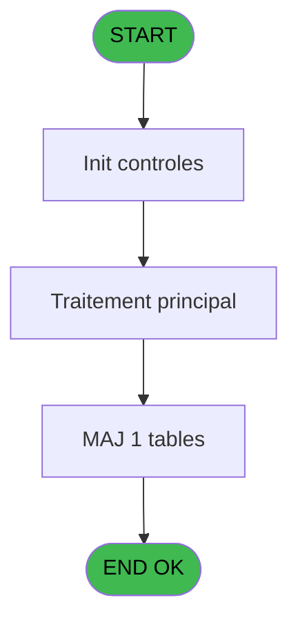
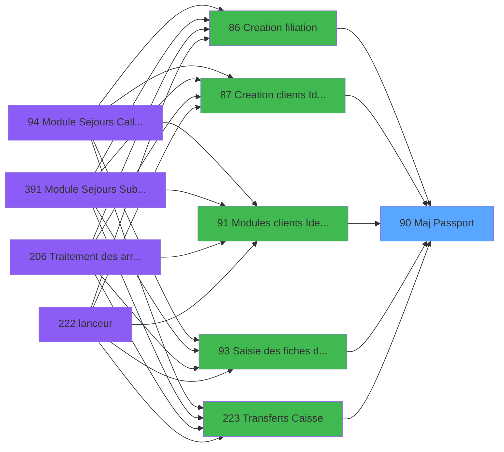

# PBG IDE 90 - Maj Passport

> **Analyse**: Phases 1-4 2026-02-03 09:17 -> 09:17 (19s) | Assemblage 09:17
> **Pipeline**: V7.2 Enrichi
> **Structure**: 4 onglets (Resume | Ecrans | Donnees | Connexions)

<!-- TAB:Resume -->

## 1. FICHE D'IDENTITE

| Attribut | Valeur |
|----------|--------|
| Projet | PBG |
| IDE Position | 90 |
| Nom Programme | Maj Passport |
| Fichier source | `Prg_90.xml` |
| Domaine metier | General |
| Taches | 1 (0 ecrans visibles) |
| Tables modifiees | 1 |
| Programmes appeles | 1 |

## 2. DESCRIPTION FONCTIONNELLE

**Maj Passport** assure la gestion complete de ce processus, accessible depuis [Creation clients Identite (IDE 87)](PBG-IDE-87.md), [Creation clients Identite SAV (IDE 379)](PBG-IDE-379.md), [Creation clients Identite P185 (IDE 382)](PBG-IDE-382.md), [Creation clients Identite PROD (IDE 383)](PBG-IDE-383.md), [Creation clients Identite en c (IDE 384)](PBG-IDE-384.md), [Creation clients Identite SAV* (IDE 386)](PBG-IDE-386.md), [Creation clients Identite_sav (IDE 387)](PBG-IDE-387.md), [Creation filiation (IDE 86)](PBG-IDE-86.md), [Modules clients Identite (IDE 91)](PBG-IDE-91.md), [Saisie des fiches de police (IDE 93)](PBG-IDE-93.md), [Transferts Caisse (IDE 223)](PBG-IDE-223.md), [Transferts Caisse new (IDE 287)](PBG-IDE-287.md).

Le flux de traitement s'organise en **1 blocs fonctionnels** :

- **Traitement** (1 tache) : traitements metier divers

**Donnees modifiees** : 1 tables en ecriture (gm-complet_______gmc).

## 3. BLOCS FONCTIONNELS

### 3.1 Traitement (1 tache)

Traitements internes.

---

#### 90 - Maj Passport

**Role** : Traitement : Maj Passport.
**Delegue a** : [  Maj Nationalite heberg (IDE 89)](PBG-IDE-89.md)

## 5. REGLES METIER

*(Aucune regle metier identifiee)*

## 6. CONTEXTE

- **Appele par**: [Creation clients Identite (IDE 87)](PBG-IDE-87.md), [Creation clients Identite SAV (IDE 379)](PBG-IDE-379.md), [Creation clients Identite P185 (IDE 382)](PBG-IDE-382.md), [Creation clients Identite PROD (IDE 383)](PBG-IDE-383.md), [Creation clients Identite en c (IDE 384)](PBG-IDE-384.md), [Creation clients Identite SAV* (IDE 386)](PBG-IDE-386.md), [Creation clients Identite_sav (IDE 387)](PBG-IDE-387.md), [Creation filiation (IDE 86)](PBG-IDE-86.md), [Modules clients Identite (IDE 91)](PBG-IDE-91.md), [Saisie des fiches de police (IDE 93)](PBG-IDE-93.md), [Transferts Caisse (IDE 223)](PBG-IDE-223.md), [Transferts Caisse new (IDE 287)](PBG-IDE-287.md)
- **Appelle**: 1 programmes | **Tables**: 4 (W:1 R:0 L:3) | **Taches**: 1 | **Expressions**: 8

<!-- TAB:Ecrans -->

## 8. ECRANS

*(Programme sans ecran visible)*

## 9. NAVIGATION

### 9.3 Structure hierarchique (1 tache)

| Position | Tache | Type | Dimensions | Bloc |
|----------|-------|------|------------|------|
| **90.1** | [**Maj Passport** (90)](#t1) | MDI | - | Traitement |

### 9.4 Algorigramme

> **Legende**: Vert = START/END OK | Rouge = END KO | Bleu = Decisions
> *Algorigramme auto-genere. Utiliser `/algorigramme` pour une synthese metier detaillee.*

<!-- TAB:Donnees -->

## 10. TABLES

### Tables utilisees (4)

| ID | Nom | Description | Type | R | W | L | Usages |
|----|-----|-------------|------|---|---|---|--------|
| 31 | gm-complet_______gmc |  | DB |   | **W** |   | 1 |
| 119 | tables_pays_tel_ |  | DB |   |   | L | 1 |
| 364 | pms_footer_comment |  | DB |   |   | L | 1 |
| 478 | tempo_ventes | Table temporaire ecran | TMP |   |   | L | 1 |

### Colonnes par table (2 / 1 tables avec colonnes identifiees)

Table 31 - gm-complet_______gmc (**W**) - 1 usages

| Lettre | Variable | Acces | Type |
|--------|----------|-------|------|
| A | > compte | W | Numeric |
| B | > filiation | W | Numeric |
| C | > code pays | W | Alpha |
| D | > pas maj sur hebergement | W | Logical |

## 11. VARIABLES

### 11.1 Autres (4)

Variables diverses.

| Lettre | Nom | Type | Usage dans |
|--------|-----|------|-----------|
| A | > compte | Numeric | 1x refs |
| B | > filiation | Numeric | 1x refs |
| C | > code pays | Alpha | 1x refs |
| D | > pas maj sur hebergement | Logical | 1x refs |

## 12. EXPRESSIONS

**8 / 8 expressions decodees (100%)**

### 12.1 Repartition par type

| Type | Expressions | Regles |
|------|-------------|--------|
| OTHER | 4 | 0 |
| CONDITION | 3 | 0 |
| NEGATION | 1 | 0 |

### 12.2 Expressions cles par type

#### OTHER (4 expressions)

| Type | IDE | Expression | Regle |
|------|-----|------------|-------|
| OTHER | 6 | `[S]` | - |
| OTHER | 7 | `[V]` | - |
| OTHER | 1 | `GetParam ('SOCIETE')` | - |
| OTHER | 5 | `GetParam ('LANGUE')` | - |

#### CONDITION (3 expressions)

| Type | IDE | Expression | Regle |
|------|-----|------------|-------|
| CONDITION | 4 | `> code pays [C]` | - |
| CONDITION | 3 | `> filiation [B]` | - |
| CONDITION | 2 | `> compte [A]` | - |

#### NEGATION (1 expressions)

| Type | IDE | Expression | Regle |
|------|-----|------------|-------|
| NEGATION | 8 | `NOT (> pas maj sur hebergement [D])` | - |

<!-- TAB:Connexions -->

## 13. GRAPHE D'APPELS

### 13.1 Chaine depuis Main (Callers)

Main -> ... -> [Creation clients Identite (IDE 87)](PBG-IDE-87.md) -> **Maj Passport (IDE 90)**

Main -> ... -> [Creation clients Identite SAV (IDE 379)](PBG-IDE-379.md) -> **Maj Passport (IDE 90)**

Main -> ... -> [Creation clients Identite P185 (IDE 382)](PBG-IDE-382.md) -> **Maj Passport (IDE 90)**

Main -> ... -> [Creation clients Identite PROD (IDE 383)](PBG-IDE-383.md) -> **Maj Passport (IDE 90)**

Main -> ... -> [Creation clients Identite en c (IDE 384)](PBG-IDE-384.md) -> **Maj Passport (IDE 90)**

Main -> ... -> [Creation clients Identite SAV* (IDE 386)](PBG-IDE-386.md) -> **Maj Passport (IDE 90)**

Main -> ... -> [Creation clients Identite_sav (IDE 387)](PBG-IDE-387.md) -> **Maj Passport (IDE 90)**

Main -> ... -> [Creation filiation (IDE 86)](PBG-IDE-86.md) -> **Maj Passport (IDE 90)**

Main -> ... -> [Modules clients Identite (IDE 91)](PBG-IDE-91.md) -> **Maj Passport (IDE 90)**

Main -> ... -> [Saisie des fiches de police (IDE 93)](PBG-IDE-93.md) -> **Maj Passport (IDE 90)**

Main -> ... -> [Transferts Caisse (IDE 223)](PBG-IDE-223.md) -> **Maj Passport (IDE 90)**

Main -> ... -> [Transferts Caisse new (IDE 287)](PBG-IDE-287.md) -> **Maj Passport (IDE 90)**

### 13.2 Callers

| IDE | Nom Programme | Nb Appels |
|-----|---------------|-----------|
| [87](PBG-IDE-87.md) | Creation clients Identite | 2 |
| [379](PBG-IDE-379.md) | Creation clients Identite SAV | 2 |
| [382](PBG-IDE-382.md) | Creation clients Identite P185 | 2 |
| [383](PBG-IDE-383.md) | Creation clients Identite PROD | 2 |
| [384](PBG-IDE-384.md) | Creation clients Identite en c | 2 |
| [386](PBG-IDE-386.md) | Creation clients Identite SAV* | 2 |
| [387](PBG-IDE-387.md) | Creation clients Identite_sav | 2 |
| [86](PBG-IDE-86.md) | Creation filiation | 1 |
| [91](PBG-IDE-91.md) | Modules clients Identite | 1 |
| [93](PBG-IDE-93.md) | Saisie des fiches de police | 1 |
| [223](PBG-IDE-223.md) | Transferts Caisse | 1 |
| [287](PBG-IDE-287.md) | Transferts Caisse new | 1 |

### 13.3 Callees (programmes appeles)

### 13.4 Detail Callees avec contexte

| IDE | Nom Programme | Appels | Contexte |
|-----|---------------|--------|----------|
| [89](PBG-IDE-89.md) |   Maj Nationalite heberg | 1 | Mise a jour donnees |

## 14. RECOMMANDATIONS MIGRATION

### 14.1 Profil du programme

| Metrique | Valeur | Impact migration |
|----------|--------|-----------------|
| Lignes de logique | 48 | Programme compact |
| Expressions | 8 | Peu de logique |
| Tables WRITE | 1 | Impact faible |
| Sous-programmes | 1 | Peu de dependances |
| Ecrans visibles | 0 | Ecran unique ou traitement batch |
| Code desactive | 2.1% (1 / 48) | Code sain |
| Regles metier | 0 | Pas de regle identifiee |

### 14.2 Plan de migration par bloc

#### Traitement (1 tache: 0 ecran, 1 traitement)

- **Strategie** : 1 service(s) backend injectable(s) (Domain Services).
- 1 sous-programme(s) a migrer ou a reutiliser depuis les services existants.
- Decomposer les taches en services unitaires testables.

### 14.3 Dependances critiques

| Dependance | Type | Appels | Impact |
|------------|------|--------|--------|
| gm-complet_______gmc | Table WRITE (Database) | 1x | Schema + repository |
| [  Maj Nationalite heberg (IDE 89)](PBG-IDE-89.md) | Sous-programme | 1x | Normale - Mise a jour donnees |

---
*Spec DETAILED generee par Pipeline V7.2 - 2026-02-03 09:17*
