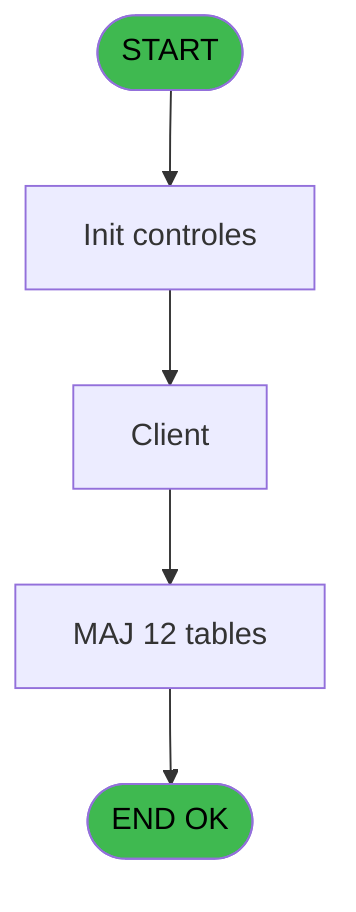
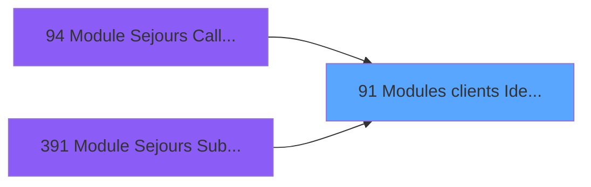
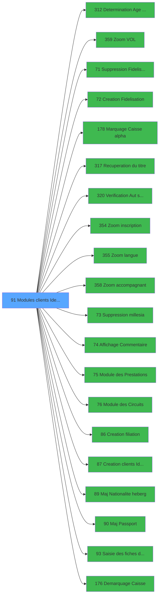

# PBG IDE 91 - Modules clients Identite

> **Analyse**: Phases 1-4 2026-02-03 09:17 -> 09:18 (20s) | Assemblage 09:18
> **Pipeline**: V7.2 Enrichi
> **Structure**: 4 onglets (Resume | Ecrans | Donnees | Connexions)

<!-- TAB:Resume -->

## 1. FICHE D'IDENTITE

| Attribut | Valeur |
|----------|--------|
| Projet | PBG |
| IDE Position | 91 |
| Nom Programme | Modules clients Identite |
| Fichier source | `Prg_91.xml` |
| Domaine metier | General |
| Taches | 26 (5 ecrans visibles) |
| Tables modifiees | 12 |
| Programmes appeles | 20 |

## 2. DESCRIPTION FONCTIONNELLE

**Modules clients Identite** assure la gestion complete de ce processus, accessible depuis [Module Sejours CallTask (IDE 0)](PBG-IDE-0.md), [Module Sejours CallTask (IDE 94)](PBG-IDE-94.md), [Module Sejours SubForm (IDE 391)](PBG-IDE-391.md).

Le flux de traitement s'organise en **4 blocs fonctionnels** :

- **Traitement** (20 taches) : traitements metier divers
- **Consultation** (3 taches) : ecrans de recherche, selection et consultation
- **Creation** (2 taches) : insertion d'enregistrements en base (mouvements, prestations)
- **Saisie** (1 tache) : ecrans de saisie utilisateur (formulaires, champs, donnees)

**Donnees modifiees** : 12 tables en ecriture (gm-recherche_____gmr, gm-complet_______gmc, hebergement______heb, commentaire_gm_________acc, historik_station, groupe_arr_dep___vol, heb_circuit______hci, email, fi_complet_______gm_go, gm_handicap, handicap, pv_discount_reasons).

**Logique metier** : 2 regles identifiees couvrant conditions metier, valeurs par defaut.

Detail : phases du traitement

#### Phase 1 : Traitement (20 taches)

- **91** - Module des Clients
- **91.1** - Determination Age Bebe
- **91.2** - Clients **[[ECRAN]](#ecran-t4)**
- **91.2.1** - Modification Hebergement
- **91.2.4** - determination periode
- **91.2.5** - Immigration **[[ECRAN]](#ecran-t13)**
- **91.2.6** - Clients **[[ECRAN]](#ecran-t14)**
- **91.2.8** - Recuperation info
- **91.2.11** - Filiation
- **91.2.12** - Clients **[[ECRAN]](#ecran-t24)**
- **91.2.13** - MaJ Handicap
- **91.2.14** - Lecture Note
- **91.2.15** - Update Note
- **91.2.16** - Modification du Nom **[[ECRAN]](#ecran-t28)**
- **91.2.18** - Dates des derniers séjours **[[ECRAN]](#ecran-t33)**
- **91.2.19** - MaJ Handicap
- **91.2.5.1** - Infos GM complémentaires
- **91.2.5.2** - Infos GM complémentaires
- **91.2.20** - Récupération d
- **91.2.21** - Clients **[[ECRAN]](#ecran-t44)**

Delegue a : [Determination Age Debut Sejour (IDE 312)](PBG-IDE-312.md), [   Suppression Fidelisation (IDE 71)](PBG-IDE-71.md), [Marquage Caisse alpha (IDE 178)](PBG-IDE-178.md), [Recuperation du titre (IDE 317)](PBG-IDE-317.md), [   Suppression millesia (IDE 73)](PBG-IDE-73.md), [Module des Prestations (IDE 75)](PBG-IDE-75.md), [Module des Circuits (IDE 76)](PBG-IDE-76.md), [  Maj Nationalite heberg (IDE 89)](PBG-IDE-89.md), [  Maj Passport (IDE 90)](PBG-IDE-90.md), [Demarquage Caisse (IDE 176)](PBG-IDE-176.md)

#### Phase 2 : Creation (2 taches)

- **91.2.2** - Creation Historique
- **91.2.3** - creation V/V

Delegue a : [   Creation Fidelisation (IDE 72)](PBG-IDE-72.md), [Creation filiation (IDE 86)](PBG-IDE-86.md), [Creation clients Identite (IDE 87)](PBG-IDE-87.md)

#### Phase 3 : Consultation (3 taches)

- **91.2.7** - Modif recherche
- **91.2.9** - recherche **[[ECRAN]](#ecran-t18)**
- **91.2.10** - recherche accompagnant **[[ECRAN]](#ecran-t19)**

Delegue a : [Zoom VOL (IDE 359)](PBG-IDE-359.md), [Recuperation du titre (IDE 317)](PBG-IDE-317.md), [Zoom inscription (IDE 354)](PBG-IDE-354.md), [Zoom langue (IDE 355)](PBG-IDE-355.md), [Zoom accompagnant (IDE 358)](PBG-IDE-358.md), [   Affichage Commentaire (IDE 74)](PBG-IDE-74.md)

#### Phase 4 : Saisie (1 tache)

- **91.2.17** - Modif Client Point de Vente

Delegue a : [Saisie des fiches de police (IDE 93)](PBG-IDE-93.md)

#### Tables impactees

| Table | Operations | Role metier |
|-------|-----------|-------------|
| gm-complet_______gmc | R/**W**/L (5 usages) |  |
| hebergement______heb | R/**W**/L (4 usages) | Hebergement (chambres) |
| groupe_arr_dep___vol | R/**W** (2 usages) |  |
| gm_handicap | **W**/L (2 usages) |  |
| email | **W**/L (2 usages) |  |
| gm-recherche_____gmr | **W**/L (2 usages) | Index de recherche |
| commentaire_gm_________acc | R/**W** (2 usages) |  |
| handicap | **W** (1 usages) |  |
| pv_discount_reasons | **W** (1 usages) |  |
| historik_station | **W** (1 usages) | Historique / journal |
| heb_circuit______hci | **W** (1 usages) | Hebergement (chambres) |
| fi_complet_______gm_go | **W** (1 usages) |  |

## 3. BLOCS FONCTIONNELS

### 3.1 Traitement (20 taches)

Traitements internes.

---

#### 91 - Module des Clients

**Role** : Tache d'orchestration : point d'entree du programme (20 sous-taches). Coordonne l'enchainement des traitements.

19 sous-taches directes

| Tache | Nom | Bloc |
|-------|-----|------|
| [91.1](#t2) | Determination Age Bebe | Traitement |
| [91.2](#t4) | Clients **[[ECRAN]](#ecran-t4)** | Traitement |
| [91.2.1](#t5) | Modification Hebergement | Traitement |
| [91.2.4](#t11) | determination periode | Traitement |
| [91.2.5](#t13) | Immigration **[[ECRAN]](#ecran-t13)** | Traitement |
| [91.2.6](#t14) | Clients **[[ECRAN]](#ecran-t14)** | Traitement |
| [91.2.8](#t16) | Recuperation info | Traitement |
| [91.2.11](#t20) | Filiation | Traitement |
| [91.2.12](#t24) | Clients **[[ECRAN]](#ecran-t24)** | Traitement |
| [91.2.13](#t25) | MaJ Handicap | Traitement |
| [91.2.14](#t26) | Lecture Note | Traitement |
| [91.2.15](#t27) | Update Note | Traitement |
| [91.2.16](#t28) | Modification du Nom **[[ECRAN]](#ecran-t28)** | Traitement |
| [91.2.18](#t33) | Dates des derniers séjours **[[ECRAN]](#ecran-t33)** | Traitement |
| [91.2.19](#t36) | MaJ Handicap | Traitement |
| [91.2.5.1](#t37) | Infos GM complémentaires | Traitement |
| [91.2.5.2](#t40) | Infos GM complémentaires | Traitement |
| [91.2.20](#t41) | Récupération d | Traitement |
| [91.2.21](#t44) | Clients **[[ECRAN]](#ecran-t44)** | Traitement |

---

#### 91.1 - Determination Age Bebe

**Role** : Traitement : Determination Age Bebe.
**Variables liees** : K (W0-Age Bebe)

---

#### 91.2 - Clients [[ECRAN]](#ecran-t4)

**Role** : Traitement : Clients.
**Ecran** : 1363 x 373 DLU (MDI) | [Voir mockup](#ecran-t4)

---

#### 91.2.1 - Modification Hebergement

**Role** : Traitement : Modification Hebergement.

---

#### 91.2.4 - determination periode

**Role** : Traitement : determination periode.

---

#### 91.2.5 - Immigration [[ECRAN]](#ecran-t13)

**Role** : Traitement : Immigration.
**Ecran** : 640 x 398 DLU (MDI) | [Voir mockup](#ecran-t13)
**Variables liees** : CR (bouton immigration)

---

#### 91.2.6 - Clients [[ECRAN]](#ecran-t14)

**Role** : Traitement : Clients.
**Ecran** : 216 x 52 DLU (MDI) | [Voir mockup](#ecran-t14)

---

#### 91.2.8 - Recuperation info

**Role** : Consultation/chargement : Recuperation info.

---

#### 91.2.11 - Filiation

**Role** : Traitement : Filiation.
**Variables liees** : Z (W0 filiation club1), BA (W0 filiation club2), C (>Filiation Compte), I (W0-Filiation)

---

#### 91.2.12 - Clients [[ECRAN]](#ecran-t24)

**Role** : Traitement : Clients.
**Ecran** : 216 x 52 DLU (MDI) | [Voir mockup](#ecran-t24)

---

#### 91.2.13 - MaJ Handicap

**Role** : Traitement : MaJ Handicap.

---

#### 91.2.14 - Lecture Note

**Role** : Traitement : Lecture Note.

---

#### 91.2.15 - Update Note

**Role** : Traitement : Update Note.
**Variables liees** : BG (v. user update), BH (v. date update), BI (v. time update)

---

#### 91.2.16 - Modification du Nom [[ECRAN]](#ecran-t28)

**Role** : Traitement : Modification du Nom.
**Ecran** : 586 x 105 DLU (MDI) | [Voir mockup](#ecran-t28)

---

#### 91.2.18 - Dates des derniers séjours [[ECRAN]](#ecran-t33)

**Role** : Traitement : Dates des derniers séjours.
**Ecran** : 409 x 203 DLU (Type6) | [Voir mockup](#ecran-t33)
**Variables liees** : CV (btnDatesSejours)

---

#### 91.2.19 - MaJ Handicap

**Role** : Traitement : MaJ Handicap.

---

#### 91.2.5.1 - Infos GM complémentaires

**Role** : Traitement : Infos GM complémentaires.

---

#### 91.2.5.2 - Infos GM complémentaires

**Role** : Traitement : Infos GM complémentaires.

---

#### 91.2.20 - Récupération d

**Role** : Traitement : Récupération d.

---

#### 91.2.21 - Clients [[ECRAN]](#ecran-t44)

**Role** : Traitement : Clients.
**Ecran** : 216 x 52 DLU (MDI) | [Voir mockup](#ecran-t44)

### 3.2 Creation (2 taches)

Insertion de nouveaux enregistrements en base.

---

#### 91.2.2 - Creation Historique

**Role** : Consultation/chargement : Creation Historique.
**Variables liees** : BE (v. date creation), BF (v. time creation), O (W0-autorisation creation), CQ (bouton creation)
**Delegue a** : [   Creation Fidelisation (IDE 72)](PBG-IDE-72.md), [Creation filiation (IDE 86)](PBG-IDE-86.md), [Creation clients Identite (IDE 87)](PBG-IDE-87.md)

---

#### 91.2.3 - creation V/V

**Role** : Creation d'enregistrement : creation V/V.
**Variables liees** : BE (v. date creation), BF (v. time creation), O (W0-autorisation creation), CQ (bouton creation)
**Delegue a** : [   Creation Fidelisation (IDE 72)](PBG-IDE-72.md), [Creation filiation (IDE 86)](PBG-IDE-86.md), [Creation clients Identite (IDE 87)](PBG-IDE-87.md)

### 3.3 Consultation (3 taches)

Ecrans de recherche et consultation.

---

#### 91.2.7 - Modif recherche

**Role** : Traitement : Modif recherche.
**Variables liees** : BD (W0 recherche accompa), P (W0- autorisation modif), CL (bouton recherche), CO (W1 modif), CP (bouton modif)
**Delegue a** : [Zoom VOL (IDE 359)](PBG-IDE-359.md), [Zoom inscription (IDE 354)](PBG-IDE-354.md), [Zoom langue (IDE 355)](PBG-IDE-355.md)

---

#### 91.2.9 - recherche [[ECRAN]](#ecran-t18)

**Role** : Traitement : recherche.
**Ecran** : 582 x 105 DLU (MDI) | [Voir mockup](#ecran-t18)
**Variables liees** : BD (W0 recherche accompa), CL (bouton recherche)
**Delegue a** : [Zoom VOL (IDE 359)](PBG-IDE-359.md), [Zoom inscription (IDE 354)](PBG-IDE-354.md), [Zoom langue (IDE 355)](PBG-IDE-355.md)

---

#### 91.2.10 - recherche accompagnant [[ECRAN]](#ecran-t19)

**Role** : Traitement : recherche accompagnant.
**Ecran** : 579 x 102 DLU (MDI) | [Voir mockup](#ecran-t19)
**Variables liees** : BD (W0 recherche accompa), CL (bouton recherche)
**Delegue a** : [Zoom VOL (IDE 359)](PBG-IDE-359.md), [Zoom inscription (IDE 354)](PBG-IDE-354.md), [Zoom langue (IDE 355)](PBG-IDE-355.md)

### 3.4 Saisie (1 tache)

Ce bloc traite la saisie des donnees de la transaction.

---

#### 91.2.17 - Modif Client Point de Vente

**Role** : Saisie des donnees : Modif Client Point de Vente.
**Variables liees** : G (W0-Type Client), P (W0- autorisation modif), CO (W1 modif), CP (bouton modif)
**Delegue a** : [Saisie des fiches de police (IDE 93)](PBG-IDE-93.md)

## 5. REGLES METIER

2 regles identifiees:

### Autres (2 regles)

#### [RM-001] Traitement conditionnel si GetParam ('NB_LIEU_SEJOUR') est a zero

| Element | Detail |
|---------|--------|
| **Condition** | `GetParam ('NB_LIEU_SEJOUR')=0` |
| **Si vrai** | 'G' |
| **Si faux** | IF (GetParam ('NB_LIEU_SEJOUR')=1,GetParam ('CODE_LIEU_SEJOUR'),'')) |
| **Expression source** | Expression 1 : `IF (GetParam ('NB_LIEU_SEJOUR')=0,'G',IF (GetParam ('NB_LIEU` |
| **Exemple** | Si GetParam ('NB_LIEU_SEJOUR')=0 → 'G' |

#### [RM-002] Valeur par defaut si > Mode attaque ecran [A] est vide

| Element | Detail |
|---------|--------|
| **Condition** | `> Mode attaque ecran [A]=''` |
| **Si vrai** | 'E'MODE |
| **Si faux** | > Mode attaque ecran [A]) |
| **Variables** | A (> Mode attaque ecran) |
| **Expression source** | Expression 7 : `IF (> Mode attaque ecran [A]='','E'MODE,> Mode attaque ecran` |
| **Exemple** | Si > Mode attaque ecran [A]='' → 'E'MODE. Sinon → > Mode attaque ecran [A]) |

## 6. CONTEXTE

- **Appele par**: [Module Sejours CallTask (IDE 0)](PBG-IDE-0.md), [Module Sejours CallTask (IDE 94)](PBG-IDE-94.md), [Module Sejours SubForm (IDE 391)](PBG-IDE-391.md)
- **Appelle**: 20 programmes | **Tables**: 27 (W:12 R:6 L:19) | **Taches**: 26 | **Expressions**: 11

<!-- TAB:Ecrans -->

## 8. ECRANS

### 8.1 Forms visibles (5 / 26)

| # | Position | Tache | Nom | Type | Largeur | Hauteur | Bloc |
|---|----------|-------|-----|------|---------|---------|------|
| 1 | 91.2 | 91.2 | Clients | MDI | 1363 | 373 | Traitement |
| 2 | 91.2.5 | 91.2.5 | Immigration | MDI | 640 | 398 | Traitement |
| 3 | 91.2.11 | 91.2.9 | recherche | MDI | 582 | 105 | Consultation |
| 4 | 91.2.19 | 91.2.16 | Modification du Nom | MDI | 586 | 105 | Traitement |
| 5 | 91.2.20 | 91.2.18 | Dates des derniers séjours | Type6 | 409 | 203 | Traitement |

### 8.2 Mockups Ecrans

---

#### 91.2 - Clients
**Tache** : [91.2](#t4) | **Type** : MDI | **Dimensions** : 1363 x 373 DLU
**Bloc** : Traitement | **Titre IDE** : Clients

<!-- FORM-DATA:
{
    "width":  1363,
    "vFactor":  8,
    "type":  "MDI",
    "hFactor":  8,
    "controls":  [
                     {
                         "x":  0,
                         "type":  "label",
                         "var":  "",
                         "y":  0,
                         "w":  1358,
                         "fmt":  "",
                         "name":  "",
                         "h":  21,
                         "color":  "",
                         "text":  "",
                         "parent":  null
                     },
                     {
                         "x":  10,
                         "type":  "table",
                         "var":  "",
                         "name":  "Table",
                         "titleH":  12,
                         "color":  "110",
                         "w":  528,
                         "y":  25,
                         "fmt":  "",
                         "parent":  null,
                         "text":  "",
                         "rowH":  12,
                         "h":  224,
                         "cols":  [
                                      {
                                          "title":  "Titre",
                                          "layer":  1,
                                          "w":  66
                                      },
                                      {
                                          "title":  "Nom",
                                          "layer":  2,
                                          "w":  234
                                      },
                                      {
                                          "title":  "Prénom",
                                          "layer":  3,
                                          "w":  194
                                      }
                                  ],
                         "rows":  3
                     },
                     {
                         "x":  554,
                         "type":  "label",
                         "var":  "",
                         "y":  27,
                         "w":  106,
                         "fmt":  "",
                         "name":  "",
                         "h":  12,
                         "color":  "",
                         "text":  "Titre",
                         "parent":  231
                     },
                     {
                         "x":  554,
                         "type":  "label",
                         "var":  "",
                         "y":  44,
                         "w":  106,
                         "fmt":  "",
                         "name":  "",
                         "h":  12,
                         "color":  "",
                         "text":  "Qualité",
                         "parent":  231
                     },
                     {
                         "x":  554,
                         "type":  "label",
                         "var":  "",
                         "y":  76,
                         "w":  74,
                         "fmt":  "",
                         "name":  "",
                         "h":  12,
                         "color":  "",
                         "text":  "Fleurs",
                         "parent":  231
                     },
                     {
                         "x":  817,
                         "type":  "label",
                         "var":  "",
                         "y":  76,
                         "w":  106,
                         "fmt":  "",
                         "name":  "",
                         "h":  12,
                         "color":  "",
                         "text":  "Honey Moon",
                         "parent":  231
                     },
                     {
                         "x":  1026,
                         "type":  "label",
                         "var":  "",
                         "y":  76,
                         "w":  44,
                         "fmt":  "",
                         "name":  "",
                         "h":  12,
                         "color":  "",
                         "text":  "Fidel.",
                         "parent":  231
                     },
                     {
                         "x":  554,
                         "type":  "label",
                         "var":  "",
                         "y":  94,
                         "w":  106,
                         "fmt":  "",
                         "name":  "",
                         "h":  11,
                         "color":  "",
                         "text":  "Arrivée",
                         "parent":  231
                     },
                     {
                         "x":  977,
                         "type":  "label",
                         "var":  "",
                         "y":  94,
                         "w":  115,
                         "fmt":  "",
                         "name":  "",
                         "h":  11,
                         "color":  "",
                         "text":  "Vol aller",
                         "parent":  231
                     },
                     {
                         "x":  554,
                         "type":  "label",
                         "var":  "",
                         "y":  109,
                         "w":  106,
                         "fmt":  "",
                         "name":  "",
                         "h":  11,
                         "color":  "",
                         "text":  "Départ",
                         "parent":  231
                     },
                     {
                         "x":  977,
                         "type":  "label",
                         "var":  "",
                         "y":  109,
                         "w":  115,
                         "fmt":  "",
                         "name":  "",
                         "h":  11,
                         "color":  "",
                         "text":  "Vol retour",
                         "parent":  231
                     },
                     {
                         "x":  554,
                         "type":  "label",
                         "var":  "",
                         "y":  122,
                         "w":  106,
                         "fmt":  "",
                         "name":  "",
                         "h":  11,
                         "color":  "",
                         "text":  "N° Adhérent",
                         "parent":  231
                     },
                     {
                         "x":  977,
                         "type":  "label",
                         "var":  "",
                         "y":  122,
                         "w":  72,
                         "fmt":  "",
                         "name":  "",
                         "h":  11,
                         "color":  "",
                         "text":  "Filiation",
                         "parent":  231
                     },
                     {
                         "x":  554,
                         "type":  "label",
                         "var":  "",
                         "y":  136,
                         "w":  115,
                         "fmt":  "",
                         "name":  "",
                         "h":  11,
                         "color":  "",
                         "text":  "Date Naiss",
                         "parent":  231
                     },
                     {
                         "x":  977,
                         "type":  "label",
                         "var":  "",
                         "y":  136,
                         "w":  38,
                         "fmt":  "",
                         "name":  "",
                         "h":  11,
                         "color":  "",
                         "text":  "Age",
                         "parent":  231
                     },
                     {
                         "x":  554,
                         "type":  "label",
                         "var":  "",
                         "y":  150,
                         "w":  106,
                         "fmt":  "",
                         "name":  "",
                         "h":  12,
                         "color":  "",
                         "text":  "Inscription",
                         "parent":  231
                     },
                     {
                         "x":  977,
                         "type":  "label",
                         "var":  "",
                         "y":  151,
                         "w":  115,
                         "fmt":  "",
                         "name":  "",
                         "h":  12,
                         "color":  "",
                         "text":  "Pays Naiss",
                         "parent":  231
                     },
                     {
                         "x":  554,
                         "type":  "label",
                         "var":  "",
                         "y":  166,
                         "w":  106,
                         "fmt":  "",
                         "name":  "",
                         "h":  11,
                         "color":  "",
                         "text":  "Fumeur",
                         "parent":  231
                     },
                     {
                         "x":  977,
                         "type":  "label",
                         "var":  "",
                         "y":  166,
                         "w":  115,
                         "fmt":  "",
                         "name":  "",
                         "h":  11,
                         "color":  "",
                         "text":  "Logement",
                         "parent":  231
                     },
                     {
                         "x":  554,
                         "type":  "label",
                         "var":  "",
                         "y":  181,
                         "w":  106,
                         "fmt":  "",
                         "name":  "",
                         "h":  11,
                         "color":  "",
                         "text":  "Lieu séjour",
                         "parent":  231
                     },
                     {
                         "x":  977,
                         "type":  "label",
                         "var":  "",
                         "y":  184,
                         "w":  115,
                         "fmt":  "",
                         "name":  "",
                         "h":  8,
                         "color":  "",
                         "text":  "Base Occ",
                         "parent":  231
                     },
                     {
                         "x":  554,
                         "type":  "label",
                         "var":  "",
                         "y":  196,
                         "w":  106,
                         "fmt":  "",
                         "name":  "",
                         "h":  11,
                         "color":  "",
                         "text":  "Handicap",
                         "parent":  231
                     },
                     {
                         "x":  977,
                         "type":  "label",
                         "var":  "",
                         "y":  216,
                         "w":  82,
                         "fmt":  "",
                         "name":  "",
                         "h":  12,
                         "color":  "",
                         "text":  "Séminaire",
                         "parent":  231
                     },
                     {
                         "x":  554,
                         "type":  "label",
                         "var":  "",
                         "y":  214,
                         "w":  106,
                         "fmt":  "",
                         "name":  "",
                         "h":  12,
                         "color":  "",
                         "text":  "Occup (U/P)",
                         "parent":  231
                     },
                     {
                         "x":  554,
                         "type":  "label",
                         "var":  "",
                         "y":  230,
                         "w":  106,
                         "fmt":  "",
                         "name":  "",
                         "h":  11,
                         "color":  "",
                         "text":  "N° Acc",
                         "parent":  231
                     },
                     {
                         "x":  554,
                         "type":  "label",
                         "var":  "",
                         "y":  245,
                         "w":  106,
                         "fmt":  "",
                         "name":  "",
                         "h":  11,
                         "color":  "",
                         "text":  "Note",
                         "parent":  231
                     },
                     {
                         "x":  554,
                         "type":  "label",
                         "var":  "",
                         "y":  272,
                         "w":  106,
                         "fmt":  "",
                         "name":  "",
                         "h":  11,
                         "color":  "",
                         "text":  "Identité",
                         "parent":  231
                     },
                     {
                         "x":  554,
                         "type":  "label",
                         "var":  "",
                         "y":  287,
                         "w":  106,
                         "fmt":  "",
                         "name":  "",
                         "h":  11,
                         "color":  "",
                         "text":  "Délivré",
                         "parent":  231
                     },
                     {
                         "x":  11,
                         "type":  "label",
                         "var":  "",
                         "y":  256,
                         "w":  521,
                         "fmt":  "",
                         "name":  "",
                         "h":  69,
                         "color":  "195",
                         "text":  "Adresse",
                         "parent":  null
                     },
                     {
                         "x":  554,
                         "type":  "label",
                         "var":  "",
                         "y":  302,
                         "w":  106,
                         "fmt":  "",
                         "name":  "",
                         "h":  11,
                         "color":  "",
                         "text":  "Date",
                         "parent":  231
                     },
                     {
                         "x":  921,
                         "type":  "label",
                         "var":  "",
                         "y":  302,
                         "w":  90,
                         "fmt":  "",
                         "name":  "",
                         "h":  11,
                         "color":  "",
                         "text":  "Expiration",
                         "parent":  231
                     },
                     {
                         "x":  554,
                         "type":  "label",
                         "var":  "",
                         "y":  320,
                         "w":  106,
                         "fmt":  "",
                         "name":  "",
                         "h":  11,
                         "color":  "",
                         "text":  "Langue",
                         "parent":  231
                     },
                     {
                         "x":  0,
                         "type":  "label",
                         "var":  "",
                         "y":  348,
                         "w":  1358,
                         "fmt":  "",
                         "name":  "",
                         "h":  24,
                         "color":  "",
                         "text":  "",
                         "parent":  null
                     },
                     {
                         "x":  1113,
                         "type":  "label",
                         "var":  "",
                         "y":  28,
                         "w":  93,
                         "fmt":  "",
                         "name":  "",
                         "h":  12,
                         "color":  "",
                         "text":  "Dossier",
                         "parent":  231
                     },
                     {
                         "x":  544,
                         "type":  "label",
                         "var":  "",
                         "y":  20,
                         "w":  815,
                         "fmt":  "",
                         "name":  "",
                         "h":  324,
                         "color":  "",
                         "text":  "",
                         "parent":  null
                     },
                     {
                         "x":  554,
                         "type":  "label",
                         "var":  "",
                         "y":  60,
                         "w":  106,
                         "fmt":  "",
                         "name":  "",
                         "h":  11,
                         "color":  "",
                         "text":  "Société",
                         "parent":  231
                     },
                     {
                         "x":  85,
                         "type":  "edit",
                         "var":  "",
                         "y":  40,
                         "w":  218,
                         "fmt":  "",
                         "name":  "gm_nom",
                         "h":  8,
                         "color":  "110",
                         "text":  "",
                         "parent":  4
                     },
                     {
                         "x":  323,
                         "type":  "edit",
                         "var":  "",
                         "y":  40,
                         "w":  147,
                         "fmt":  "",
                         "name":  "gm_prenom",
                         "h":  8,
                         "color":  "110",
                         "text":  "",
                         "parent":  4
                     },
                     {
                         "x":  710,
                         "type":  "combobox",
                         "var":  "",
                         "y":  27,
                         "w":  220,
                         "fmt":  "",
                         "name":  "W1-select titre",
                         "h":  12,
                         "color":  "110",
                         "text":  "1,2",
                         "parent":  231
                     },
                     {
                         "x":  1200,
                         "type":  "edit",
                         "var":  "",
                         "y":  28,
                         "w":  111,
                         "fmt":  "9",
                         "name":  "W1 Numero de dossier",
                         "h":  11,
                         "color":  "110",
                         "text":  "",
                         "parent":  231
                     },
                     {
                         "x":  713,
                         "type":  "edit",
                         "var":  "",
                         "y":  44,
                         "w":  56,
                         "fmt":  "",
                         "name":  "",
                         "h":  12,
                         "color":  "",
                         "text":  "",
                         "parent":  231
                     },
                     {
                         "x":  713,
                         "type":  "combobox",
                         "var":  "",
                         "y":  76,
                         "w":  101,
                         "fmt":  "",
                         "name":  "W1-select fleurs",
                         "h":  12,
                         "color":  "110",
                         "text":  "1,2",
                         "parent":  231
                     },
                     {
                         "x":  921,
                         "type":  "combobox",
                         "var":  "",
                         "y":  76,
                         "w":  98,
                         "fmt":  "",
                         "name":  "W1-select honey moon",
                         "h":  12,
                         "color":  "110",
                         "text":  "1,2",
                         "parent":  231
                     },
                     {
                         "x":  1070,
                         "type":  "combobox",
                         "var":  "",
                         "y":  76,
                         "w":  93,
                         "fmt":  "",
                         "name":  "W1-select millesia",
                         "h":  12,
                         "color":  "110",
                         "text":  "1,2",
                         "parent":  231
                     },
                     {
                         "x":  1172,
                         "type":  "combobox",
                         "var":  "",
                         "y":  76,
                         "w":  172,
                         "fmt":  "",
                         "name":  "MIL Fidelisation",
                         "h":  12,
                         "color":  "110",
                         "text":  "Ami,Proche,Intime,Top top,GO Vacance",
                         "parent":  231
                     },
                     {
                         "x":  713,
                         "type":  "edit",
                         "var":  "",
                         "y":  94,
                         "w":  133,
                         "fmt":  "",
                         "name":  "CLI Date Debut",
                         "h":  11,
                         "color":  "110",
                         "text":  "",
                         "parent":  231
                     },
                     {
                         "x":  850,
                         "type":  "button",
                         "var":  "",
                         "y":  94,
                         "w":  27,
                         "fmt":  "...",
                         "name":  "W1-bouton date debut",
                         "h":  11,
                         "color":  "",
                         "text":  "",
                         "parent":  231
                     },
                     {
                         "x":  1110,
                         "type":  "edit",
                         "var":  "",
                         "y":  94,
                         "w":  93,
                         "fmt":  "6U",
                         "name":  "W1-select vol aller",
                         "h":  11,
                         "color":  "110",
                         "text":  "",
                         "parent":  231
                     },
                     {
                         "x":  1209,
                         "type":  "button",
                         "var":  "",
                         "y":  94,
                         "w":  27,
                         "fmt":  "...",
                         "name":  "v. bouton vol aller",
                         "h":  11,
                         "color":  "",
                         "text":  "",
                         "parent":  231
                     },
                     {
                         "x":  713,
                         "type":  "edit",
                         "var":  "",
                         "y":  109,
                         "w":  133,
                         "fmt":  "",
                         "name":  "CLI Date Fin",
                         "h":  11,
                         "color":  "110",
                         "text":  "",
                         "parent":  231
                     },
                     {
                         "x":  850,
                         "type":  "button",
                         "var":  "",
                         "y":  109,
                         "w":  27,
                         "fmt":  "...",
                         "name":  "W1-bouton date fin",
                         "h":  11,
                         "color":  "",
                         "text":  "",
                         "parent":  231
                     },
                     {
                         "x":  1110,
                         "type":  "edit",
                         "var":  "",
                         "y":  109,
                         "w":  93,
                         "fmt":  "6U",
                         "name":  "W1-select vol dep",
                         "h":  11,
                         "color":  "110",
                         "text":  "",
                         "parent":  231
                     },
                     {
                         "x":  1209,
                         "type":  "button",
                         "var":  "",
                         "y":  109,
                         "w":  27,
                         "fmt":  "...",
                         "name":  "v. bouton vol retour",
                         "h":  11,
                         "color":  "",
                         "text":  "",
                         "parent":  231
                     },
                     {
                         "x":  713,
                         "type":  "edit",
                         "var":  "",
                         "y":  122,
                         "w":  133,
                         "fmt":  "",
                         "name":  "",
                         "h":  11,
                         "color":  "",
                         "text":  "",
                         "parent":  231
                     },
                     {
                         "x":  1110,
                         "type":  "edit",
                         "var":  "",
                         "y":  122,
                         "w":  48,
                         "fmt":  "",
                         "name":  "",
                         "h":  11,
                         "color":  "",
                         "text":  "",
                         "parent":  231
                     },
                     {
                         "x":  713,
                         "type":  "edit",
                         "var":  "",
                         "y":  136,
                         "w":  126,
                         "fmt":  "",
                         "name":  "CLI Date Naissance",
                         "h":  11,
                         "color":  "110",
                         "text":  "",
                         "parent":  231
                     },
                     {
                         "x":  1110,
                         "type":  "edit",
                         "var":  "",
                         "y":  136,
                         "w":  30,
                         "fmt":  "",
                         "name":  "CLI Age",
                         "h":  11,
                         "color":  "",
                         "text":  "",
                         "parent":  231
                     },
                     {
                         "x":  713,
                         "type":  "edit",
                         "var":  "",
                         "y":  150,
                         "w":  48,
                         "fmt":  "",
                         "name":  "W1-select inscription",
                         "h":  12,
                         "color":  "110",
                         "text":  "",
                         "parent":  231
                     },
                     {
                         "x":  764,
                         "type":  "button",
                         "var":  "",
                         "y":  150,
                         "w":  27,
                         "fmt":  "...",
                         "name":  "v. bouton inscription",
                         "h":  12,
                         "color":  "",
                         "text":  "",
                         "parent":  231
                     },
                     {
                         "x":  1110,
                         "type":  "combobox",
                         "var":  "",
                         "y":  151,
                         "w":  235,
                         "fmt":  "",
                         "name":  "W1-Pays naissance",
                         "h":  12,
                         "color":  "110",
                         "text":  "1,2",
                         "parent":  231
                     },
                     {
                         "x":  794,
                         "type":  "edit",
                         "var":  "",
                         "y":  150,
                         "w":  170,
                         "fmt":  "",
                         "name":  "",
                         "h":  12,
                         "color":  "142",
                         "text":  "",
                         "parent":  231
                     },
                     {
                         "x":  713,
                         "type":  "combobox",
                         "var":  "",
                         "y":  165,
                         "w":  166,
                         "fmt":  "",
                         "name":  "W1-select fumeur",
                         "h":  12,
                         "color":  "110",
                         "text":  "1,2",
                         "parent":  231
                     },
                     {
                         "x":  712,
                         "type":  "combobox",
                         "var":  "",
                         "y":  195,
                         "w":  633,
                         "fmt":  "",
                         "name":  "W1-select handicap",
                         "h":  12,
                         "color":  "110",
                         "text":  "1,2",
                         "parent":  231
                     },
                     {
                         "x":  713,
                         "type":  "combobox",
                         "var":  "",
                         "y":  214,
                         "w":  238,
                         "fmt":  "",
                         "name":  "",
                         "h":  12,
                         "color":  "110",
                         "text":  "1,2",
                         "parent":  231
                     },
                     {
                         "x":  1110,
                         "type":  "edit",
                         "var":  "",
                         "y":  216,
                         "w":  236,
                         "fmt":  "",
                         "name":  "CLI Seminaire",
                         "h":  12,
                         "color":  "110",
                         "text":  "",
                         "parent":  231
                     },
                     {
                         "x":  713,
                         "type":  "edit",
                         "var":  "",
                         "y":  230,
                         "w":  126,
                         "fmt":  "10Z",
                         "name":  "CLI N° Accompagnant",
                         "h":  11,
                         "color":  "110",
                         "text":  "",
                         "parent":  231
                     },
                     {
                         "x":  842,
                         "type":  "button",
                         "var":  "",
                         "y":  230,
                         "w":  27,
                         "fmt":  "...",
                         "name":  "v. bouton accompagnant",
                         "h":  11,
                         "color":  "",
                         "text":  "",
                         "parent":  231
                     },
                     {
                         "x":  712,
                         "type":  "edit",
                         "var":  "",
                         "y":  246,
                         "w":  633,
                         "fmt":  "",
                         "name":  "v. commentaire GM",
                         "h":  10,
                         "color":  "110",
                         "text":  "",
                         "parent":  231
                     },
                     {
                         "x":  876,
                         "type":  "edit",
                         "var":  "",
                         "y":  230,
                         "w":  176,
                         "fmt":  "",
                         "name":  "",
                         "h":  11,
                         "color":  "142",
                         "text":  "",
                         "parent":  231
                     },
                     {
                         "x":  1110,
                         "type":  "edit",
                         "var":  "",
                         "y":  230,
                         "w":  227,
                         "fmt":  "",
                         "name":  "",
                         "h":  11,
                         "color":  "142",
                         "text":  "",
                         "parent":  231
                     },
                     {
                         "x":  713,
                         "type":  "edit",
                         "var":  "",
                         "y":  273,
                         "w":  303,
                         "fmt":  "",
                         "name":  "",
                         "h":  10,
                         "color":  "",
                         "text":  "",
                         "parent":  231
                     },
                     {
                         "x":  713,
                         "type":  "edit",
                         "var":  "",
                         "y":  302,
                         "w":  126,
                         "fmt":  "",
                         "name":  "",
                         "h":  11,
                         "color":  "",
                         "text":  "",
                         "parent":  231
                     },
                     {
                         "x":  1014,
                         "type":  "edit",
                         "var":  "",
                         "y":  302,
                         "w":  126,
                         "fmt":  "",
                         "name":  "",
                         "h":  11,
                         "color":  "",
                         "text":  "",
                         "parent":  231
                     },
                     {
                         "x":  713,
                         "type":  "edit",
                         "var":  "",
                         "y":  288,
                         "w":  303,
                         "fmt":  "",
                         "name":  "",
                         "h":  10,
                         "color":  "",
                         "text":  "",
                         "parent":  231
                     },
                     {
                         "x":  30,
                         "type":  "edit",
                         "var":  "",
                         "y":  274,
                         "w":  126,
                         "fmt":  "",
                         "name":  "W1 n dans la rue",
                         "h":  10,
                         "color":  "6",
                         "text":  "",
                         "parent":  66
                     },
                     {
                         "x":  157,
                         "type":  "edit",
                         "var":  "",
                         "y":  274,
                         "w":  356,
                         "fmt":  "",
                         "name":  "W1 Nom de la rue",
                         "h":  10,
                         "color":  "6",
                         "text":  "",
                         "parent":  66
                     },
                     {
                         "x":  30,
                         "type":  "edit",
                         "var":  "",
                         "y":  288,
                         "w":  483,
                         "fmt":  "",
                         "name":  "W1 Commune",
                         "h":  10,
                         "color":  "6",
                         "text":  "",
                         "parent":  66
                     },
                     {
                         "x":  30,
                         "type":  "edit",
                         "var":  "",
                         "y":  304,
                         "w":  126,
                         "fmt":  "",
                         "name":  "W1 Code postal",
                         "h":  10,
                         "color":  "6",
                         "text":  "",
                         "parent":  66
                     },
                     {
                         "x":  157,
                         "type":  "edit",
                         "var":  "",
                         "y":  304,
                         "w":  356,
                         "fmt":  "",
                         "name":  "W1 Ville",
                         "h":  10,
                         "color":  "6",
                         "text":  "",
                         "parent":  66
                     },
                     {
                         "x":  758,
                         "type":  "button",
                         "var":  "",
                         "y":  320,
                         "w":  27,
                         "fmt":  "...",
                         "name":  "v. bouton langue",
                         "h":  11,
                         "color":  "",
                         "text":  "",
                         "parent":  231
                     },
                     {
                         "x":  713,
                         "type":  "edit",
                         "var":  "",
                         "y":  320,
                         "w":  37,
                         "fmt":  "",
                         "name":  "GMR Langue Parlee",
                         "h":  11,
                         "color":  "110",
                         "text":  "",
                         "parent":  231
                     },
                     {
                         "x":  798,
                         "type":  "edit",
                         "var":  "",
                         "y":  320,
                         "w":  238,
                         "fmt":  "",
                         "name":  "",
                         "h":  11,
                         "color":  "142",
                         "text":  "",
                         "parent":  231
                     },
                     {
                         "x":  713,
                         "type":  "edit",
                         "var":  "",
                         "y":  183,
                         "w":  22,
                         "fmt":  "",
                         "name":  "",
                         "h":  9,
                         "color":  "",
                         "text":  "",
                         "parent":  231
                     },
                     {
                         "x":  1110,
                         "type":  "edit",
                         "var":  "",
                         "y":  168,
                         "w":  78,
                         "fmt":  "",
                         "name":  "",
                         "h":  9,
                         "color":  "",
                         "text":  "",
                         "parent":  231
                     },
                     {
                         "x":  780,
                         "type":  "edit",
                         "var":  "",
                         "y":  44,
                         "w":  431,
                         "fmt":  "",
                         "name":  "",
                         "h":  12,
                         "color":  "142",
                         "text":  "",
                         "parent":  231
                     },
                     {
                         "x":  1180,
                         "type":  "button",
                         "var":  "",
                         "y":  294,
                         "w":  170,
                         "fmt":  "\\Pre\u0026station",
                         "name":  "bouton prestation",
                         "h":  18,
                         "color":  "",
                         "text":  "",
                         "parent":  231
                     },
                     {
                         "x":  1180,
                         "type":  "button",
                         "var":  "",
                         "y":  316,
                         "w":  170,
                         "fmt":  "Ci\u0026rcuit",
                         "name":  "bouton circuit",
                         "h":  18,
                         "color":  "",
                         "text":  "",
                         "parent":  231
                     },
                     {
                         "x":  345,
                         "type":  "button",
                         "var":  "",
                         "y":  351,
                         "w":  152,
                         "fmt":  "\u0026Recherche",
                         "name":  "bouton recherche",
                         "h":  18,
                         "color":  "",
                         "text":  "",
                         "parent":  80
                     },
                     {
                         "x":  512,
                         "type":  "button",
                         "var":  "",
                         "y":  351,
                         "w":  152,
                         "fmt":  "\u0026Visualisation",
                         "name":  "bouton visu",
                         "h":  18,
                         "color":  "",
                         "text":  "",
                         "parent":  80
                     },
                     {
                         "x":  679,
                         "type":  "button",
                         "var":  "",
                         "y":  351,
                         "w":  152,
                         "fmt":  "\u0026Modification",
                         "name":  "M",
                         "h":  18,
                         "color":  "",
                         "text":  "",
                         "parent":  80
                     },
                     {
                         "x":  846,
                         "type":  "button",
                         "var":  "",
                         "y":  351,
                         "w":  152,
                         "fmt":  "\u0026Création",
                         "name":  "Creation",
                         "h":  18,
                         "color":  "",
                         "text":  "",
                         "parent":  80
                     },
                     {
                         "x":  1013,
                         "type":  "button",
                         "var":  "",
                         "y":  351,
                         "w":  152,
                         "fmt":  "\u0026Identité",
                         "name":  "bouton immigration",
                         "h":  18,
                         "color":  "",
                         "text":  "",
                         "parent":  80
                     },
                     {
                         "x":  1180,
                         "type":  "button",
                         "var":  "",
                         "y":  351,
                         "w":  170,
                         "fmt":  "C\u0026ommentaire N\\A",
                         "name":  "bouton commentaire",
                         "h":  18,
                         "color":  "",
                         "text":  "",
                         "parent":  80
                     },
                     {
                         "x":  6,
                         "type":  "edit",
                         "var":  "",
                         "y":  6,
                         "w":  267,
                         "fmt":  "30",
                         "name":  "",
                         "h":  8,
                         "color":  "",
                         "text":  "",
                         "parent":  1
                     },
                     {
                         "x":  1072,
                         "type":  "edit",
                         "var":  "",
                         "y":  6,
                         "w":  267,
                         "fmt":  "WWW DD MMM YYYYT",
                         "name":  "",
                         "h":  8,
                         "color":  "",
                         "text":  "",
                         "parent":  1
                     },
                     {
                         "x":  22,
                         "type":  "edit",
                         "var":  "",
                         "y":  40,
                         "w":  30,
                         "fmt":  "UX",
                         "name":  "",
                         "h":  8,
                         "color":  "110",
                         "text":  "",
                         "parent":  4
                     },
                     {
                         "x":  1110,
                         "type":  "edit",
                         "var":  "",
                         "y":  183,
                         "w":  27,
                         "fmt":  "2",
                         "name":  "",
                         "h":  9,
                         "color":  "",
                         "text":  "",
                         "parent":  231
                     },
                     {
                         "x":  681,
                         "type":  "button",
                         "var":  "",
                         "y":  230,
                         "w":  27,
                         "fmt":  "\u003c-",
                         "name":  "",
                         "h":  11,
                         "color":  "",
                         "text":  "",
                         "parent":  231
                     },
                     {
                         "x":  1180,
                         "type":  "button",
                         "var":  "",
                         "y":  272,
                         "w":  170,
                         "fmt":  "Creat. Fi\u0026liation",
                         "name":  "",
                         "h":  18,
                         "color":  "",
                         "text":  "",
                         "parent":  231
                     },
                     {
                         "x":  11,
                         "type":  "button",
                         "var":  "",
                         "y":  351,
                         "w":  152,
                         "fmt":  "\u0026Ok",
                         "name":  "",
                         "h":  18,
                         "color":  "",
                         "text":  "",
                         "parent":  80
                     },
                     {
                         "x":  178,
                         "type":  "button",
                         "var":  "",
                         "y":  351,
                         "w":  152,
                         "fmt":  "A\u0026bandonner",
                         "name":  "Abandonner",
                         "h":  18,
                         "color":  "",
                         "text":  "",
                         "parent":  80
                     },
                     {
                         "x":  974,
                         "type":  "edit",
                         "var":  "",
                         "y":  27,
                         "w":  83,
                         "fmt":  "5",
                         "name":  "",
                         "h":  12,
                         "color":  "204",
                         "text":  "",
                         "parent":  231
                     },
                     {
                         "x":  712,
                         "type":  "edit",
                         "var":  "",
                         "y":  60,
                         "w":  633,
                         "fmt":  "",
                         "name":  "gm_ste",
                         "h":  11,
                         "color":  "110",
                         "text":  "",
                         "parent":  231
                     },
                     {
                         "x":  1256,
                         "type":  "edit",
                         "var":  "",
                         "y":  94,
                         "w":  88,
                         "fmt":  "#2h",
                         "name":  "v.vol_heure A",
                         "h":  11,
                         "color":  "142",
                         "text":  "",
                         "parent":  231
                     },
                     {
                         "x":  1256,
                         "type":  "edit",
                         "var":  "",
                         "y":  109,
                         "w":  88,
                         "fmt":  "#2h",
                         "name":  "v.vol_heure R",
                         "h":  11,
                         "color":  "142",
                         "text":  "",
                         "parent":  231
                     },
                     {
                         "x":  712,
                         "type":  "edit",
                         "var":  "",
                         "y":  258,
                         "w":  633,
                         "fmt":  "150",
                         "name":  "",
                         "h":  10,
                         "color":  "",
                         "text":  "",
                         "parent":  231
                     },
                     {
                         "x":  1318,
                         "type":  "image",
                         "var":  "",
                         "y":  28,
                         "w":  27,
                         "fmt":  "",
                         "name":  "copy_dossier",
                         "h":  11,
                         "color":  "",
                         "text":  "",
                         "parent":  17
                     },
                     {
                         "x":  852,
                         "type":  "image",
                         "var":  "",
                         "y":  121,
                         "w":  27,
                         "fmt":  "",
                         "name":  "copy_adh",
                         "h":  11,
                         "color":  "",
                         "text":  "",
                         "parent":  231
                     }
                 ],
    "taskId":  "91.2",
    "height":  373
}
-->

<strong>Champs : 51 champs</strong>

| Pos (x,y) | Nom | Variable | Type |
|-----------|-----|----------|------|
| 85,40 | gm_nom | - | edit |
| 323,40 | gm_prenom | - | edit |
| 710,27 | W1-select titre | - | combobox |
| 1200,28 | W1 Numero de dossier | - | edit |
| 713,44 | (sans nom) | - | edit |
| 713,76 | W1-select fleurs | - | combobox |
| 921,76 | W1-select honey moon | - | combobox |
| 1070,76 | W1-select millesia | - | combobox |
| 1172,76 | MIL Fidelisation | - | combobox |
| 713,94 | CLI Date Debut | - | edit |
| 1110,94 | W1-select vol aller | - | edit |
| 713,109 | CLI Date Fin | - | edit |
| 1110,109 | W1-select vol dep | - | edit |
| 713,122 | (sans nom) | - | edit |
| 1110,122 | (sans nom) | - | edit |
| 713,136 | CLI Date Naissance | - | edit |
| 1110,136 | CLI Age | - | edit |
| 713,150 | W1-select inscription | - | edit |
| 1110,151 | W1-Pays naissance | - | combobox |
| 794,150 | (sans nom) | - | edit |
| 713,165 | W1-select fumeur | - | combobox |
| 712,195 | W1-select handicap | - | combobox |
| 713,214 | 1,2 | - | combobox |
| 1110,216 | CLI Seminaire | - | edit |
| 713,230 | CLI N° Accompagnant | - | edit |
| 712,246 | v. commentaire GM | - | edit |
| 876,230 | (sans nom) | - | edit |
| 1110,230 | (sans nom) | - | edit |
| 713,273 | (sans nom) | - | edit |
| 713,302 | (sans nom) | - | edit |
| 1014,302 | (sans nom) | - | edit |
| 713,288 | (sans nom) | - | edit |
| 30,274 | W1 n dans la rue | - | edit |
| 157,274 | W1 Nom de la rue | - | edit |
| 30,288 | W1 Commune | - | edit |
| 30,304 | W1 Code postal | - | edit |
| 157,304 | W1 Ville | - | edit |
| 713,320 | GMR Langue Parlee | - | edit |
| 798,320 | (sans nom) | - | edit |
| 713,183 | (sans nom) | - | edit |
| 1110,168 | (sans nom) | - | edit |
| 780,44 | (sans nom) | - | edit |
| 6,6 | 30 | - | edit |
| 1072,6 | WWW DD MMM YYYYT | - | edit |
| 22,40 | UX | - | edit |
| 1110,183 | 2 | - | edit |
| 974,27 | 5 | - | edit |
| 712,60 | gm_ste | - | edit |
| 1256,94 | v.vol_heure A | - | edit |
| 1256,109 | v.vol_heure R | - | edit |
| 712,258 | 150 | - | edit |

<strong>Boutons : 19 boutons</strong>

| Bouton | Pos (x,y) | Action |
|--------|-----------|--------|
| ... | 850,94 | Bouton fonctionnel |
| ... | 1209,94 | Bouton fonctionnel |
| ... | 850,109 | Bouton fonctionnel |
| ... | 1209,109 | Bouton fonctionnel |
| ... | 764,150 | Bouton fonctionnel |
| ... | 842,230 | Bouton fonctionnel |
| ... | 758,320 | Bouton fonctionnel |
| \Prestation | 1180,294 | Bouton fonctionnel |
| Circuit | 1180,316 | Appel [Module des Circuits (IDE 76)](PBG-IDE-76.md) |
| Recherche | 345,351 | Ouvre la selection |
| Visualisation | 512,351 | Bouton fonctionnel |
| Modification | 679,351 | Modifie l'element |
| Création | 846,351 | Bouton fonctionnel |
| Identité | 1013,351 | Appel [Creation clients Identite (IDE 87)](PBG-IDE-87.md) |
| Commentaire N\A | 1180,351 | Appel [   Affichage Commentaire (IDE 74)](PBG-IDE-74.md) |
| <- | 681,230 | Bouton fonctionnel |
| Creat. Filiation | 1180,272 | Appel [   Creation Fidelisation (IDE 72)](PBG-IDE-72.md) |
| Ok | 11,351 | Valide la saisie et enregistre |
| Abandonner | 178,351 | Annule et retour au menu |

---

#### 91.2.5 - Immigration
**Tache** : [91.2.5](#t13) | **Type** : MDI | **Dimensions** : 640 x 398 DLU
**Bloc** : Traitement | **Titre IDE** : Immigration

<!-- FORM-DATA:
{
    "width":  640,
    "vFactor":  8,
    "type":  "MDI",
    "hFactor":  8,
    "controls":  [
                     {
                         "x":  0,
                         "type":  "label",
                         "var":  "",
                         "y":  0,
                         "w":  633,
                         "fmt":  "",
                         "name":  "",
                         "h":  21,
                         "color":  "",
                         "text":  "",
                         "parent":  null
                     },
                     {
                         "x":  152,
                         "type":  "label",
                         "var":  "",
                         "y":  23,
                         "w":  468,
                         "fmt":  "",
                         "name":  "",
                         "h":  348,
                         "color":  "",
                         "text":  "",
                         "parent":  null
                     },
                     {
                         "x":  166,
                         "type":  "label",
                         "var":  "",
                         "y":  30,
                         "w":  187,
                         "fmt":  "",
                         "name":  "",
                         "h":  10,
                         "color":  "",
                         "text":  "Date Naissance",
                         "parent":  4
                     },
                     {
                         "x":  166,
                         "type":  "label",
                         "var":  "",
                         "y":  58,
                         "w":  187,
                         "fmt":  "",
                         "name":  "",
                         "h":  12,
                         "color":  "",
                         "text":  "Nationalité",
                         "parent":  4
                     },
                     {
                         "x":  166,
                         "type":  "label",
                         "var":  "",
                         "y":  75,
                         "w":  187,
                         "fmt":  "",
                         "name":  "",
                         "h":  10,
                         "color":  "",
                         "text":  "Identité",
                         "parent":  4
                     },
                     {
                         "x":  166,
                         "type":  "label",
                         "var":  "",
                         "y":  105,
                         "w":  187,
                         "fmt":  "",
                         "name":  "",
                         "h":  10,
                         "color":  "",
                         "text":  "Ville Délivrance",
                         "parent":  4
                     },
                     {
                         "x":  166,
                         "type":  "label",
                         "var":  "",
                         "y":  120,
                         "w":  187,
                         "fmt":  "",
                         "name":  "",
                         "h":  12,
                         "color":  "",
                         "text":  "Pays Délivrance",
                         "parent":  4
                     },
                     {
                         "x":  166,
                         "type":  "label",
                         "var":  "",
                         "y":  137,
                         "w":  187,
                         "fmt":  "",
                         "name":  "",
                         "h":  10,
                         "color":  "",
                         "text":  "Date Délivrance",
                         "parent":  4
                     },
                     {
                         "x":  166,
                         "type":  "label",
                         "var":  "",
                         "y":  152,
                         "w":  187,
                         "fmt":  "",
                         "name":  "",
                         "h":  10,
                         "color":  "",
                         "text":  "Date Expiration",
                         "parent":  4
                     },
                     {
                         "x":  166,
                         "type":  "label",
                         "var":  "",
                         "y":  167,
                         "w":  187,
                         "fmt":  "",
                         "name":  "",
                         "h":  8,
                         "color":  "",
                         "text":  "Profession",
                         "parent":  4
                     },
                     {
                         "x":  166,
                         "type":  "label",
                         "var":  "",
                         "y":  180,
                         "w":  187,
                         "fmt":  "",
                         "name":  "",
                         "h":  12,
                         "color":  "",
                         "text":  "Handicap",
                         "parent":  4
                     },
                     {
                         "x":  166,
                         "type":  "label",
                         "var":  "",
                         "y":  199,
                         "w":  187,
                         "fmt":  "",
                         "name":  "",
                         "h":  8,
                         "color":  "",
                         "text":  "Visa",
                         "parent":  4
                     },
                     {
                         "x":  166,
                         "type":  "label",
                         "var":  "",
                         "y":  213,
                         "w":  187,
                         "fmt":  "",
                         "name":  "",
                         "h":  8,
                         "color":  "",
                         "text":  "Date",
                         "parent":  4
                     },
                     {
                         "x":  166,
                         "type":  "label",
                         "var":  "",
                         "y":  227,
                         "w":  187,
                         "fmt":  "",
                         "name":  "",
                         "h":  8,
                         "color":  "",
                         "text":  "Lieu",
                         "parent":  4
                     },
                     {
                         "x":  167,
                         "type":  "label",
                         "var":  "",
                         "y":  242,
                         "w":  187,
                         "fmt":  "",
                         "name":  "",
                         "h":  8,
                         "color":  "",
                         "text":  "Pays Résidence",
                         "parent":  4
                     },
                     {
                         "x":  167,
                         "type":  "label",
                         "var":  "",
                         "y":  256,
                         "w":  187,
                         "fmt":  "",
                         "name":  "",
                         "h":  8,
                         "color":  "",
                         "text":  "En provenance de",
                         "parent":  4
                     },
                     {
                         "x":  167,
                         "type":  "label",
                         "var":  "",
                         "y":  270,
                         "w":  187,
                         "fmt":  "",
                         "name":  "",
                         "h":  8,
                         "color":  "",
                         "text":  "A destination de",
                         "parent":  4
                     },
                     {
                         "x":  277,
                         "type":  "label",
                         "var":  "",
                         "y":  281,
                         "w":  18,
                         "fmt":  "",
                         "name":  "",
                         "h":  8,
                         "color":  "",
                         "text":  "(",
                         "parent":  4
                     },
                     {
                         "x":  341,
                         "type":  "label",
                         "var":  "",
                         "y":  281,
                         "w":  18,
                         "fmt":  "",
                         "name":  "",
                         "h":  8,
                         "color":  "",
                         "text":  ")",
                         "parent":  4
                     },
                     {
                         "x":  167,
                         "type":  "label",
                         "var":  "",
                         "y":  282,
                         "w":  104,
                         "fmt":  "",
                         "name":  "",
                         "h":  8,
                         "color":  "",
                         "text":  "Téléphone",
                         "parent":  4
                     },
                     {
                         "x":  167,
                         "type":  "label",
                         "var":  "",
                         "y":  295,
                         "w":  59,
                         "fmt":  "",
                         "name":  "",
                         "h":  8,
                         "color":  "",
                         "text":  "Email",
                         "parent":  4
                     },
                     {
                         "x":  0,
                         "type":  "label",
                         "var":  "",
                         "y":  375,
                         "w":  633,
                         "fmt":  "",
                         "name":  "",
                         "h":  22,
                         "color":  "",
                         "text":  "",
                         "parent":  null
                     },
                     {
                         "x":  166,
                         "type":  "label",
                         "var":  "",
                         "y":  90,
                         "w":  187,
                         "fmt":  "",
                         "name":  "",
                         "h":  10,
                         "color":  "",
                         "text":  "Carte d\u0027identité",
                         "parent":  4
                     },
                     {
                         "x":  167,
                         "type":  "label",
                         "var":  "",
                         "y":  309,
                         "w":  187,
                         "fmt":  "",
                         "name":  "",
                         "h":  10,
                         "color":  "",
                         "text":  "Immatriculation",
                         "parent":  4
                     },
                     {
                         "x":  166,
                         "type":  "label",
                         "var":  "",
                         "y":  43,
                         "w":  187,
                         "fmt":  "",
                         "name":  "",
                         "h":  12,
                         "color":  "",
                         "text":  "Pays naissance",
                         "parent":  4
                     },
                     {
                         "x":  167,
                         "type":  "label",
                         "var":  "",
                         "y":  324,
                         "w":  187,
                         "fmt":  "",
                         "name":  "",
                         "h":  9,
                         "color":  "",
                         "text":  "2ème prénom",
                         "parent":  4
                     },
                     {
                         "x":  167,
                         "type":  "label",
                         "var":  "",
                         "y":  339,
                         "w":  187,
                         "fmt":  "",
                         "name":  "",
                         "h":  9,
                         "color":  "",
                         "text":  "3ème prénom",
                         "parent":  4
                     },
                     {
                         "x":  167,
                         "type":  "label",
                         "var":  "",
                         "y":  355,
                         "w":  187,
                         "fmt":  "",
                         "name":  "",
                         "h":  9,
                         "color":  "",
                         "text":  "4ème prénom",
                         "parent":  4
                     },
                     {
                         "x":  363,
                         "type":  "edit",
                         "var":  "",
                         "y":  30,
                         "w":  126,
                         "fmt":  "",
                         "name":  "W2-Date naissance",
                         "h":  10,
                         "color":  "110",
                         "text":  "",
                         "parent":  4
                     },
                     {
                         "x":  363,
                         "type":  "combobox",
                         "var":  "",
                         "y":  43,
                         "w":  249,
                         "fmt":  "",
                         "name":  "W2-Pays naissance_0001",
                         "h":  12,
                         "color":  "110",
                         "text":  "1,2",
                         "parent":  4
                     },
                     {
                         "x":  363,
                         "type":  "combobox",
                         "var":  "",
                         "y":  58,
                         "w":  249,
                         "fmt":  "",
                         "name":  "W2-select nationalite",
                         "h":  12,
                         "color":  "110",
                         "text":  "1,2",
                         "parent":  4
                     },
                     {
                         "x":  363,
                         "type":  "edit",
                         "var":  "",
                         "y":  75,
                         "w":  249,
                         "fmt":  "",
                         "name":  "W2-Identite",
                         "h":  10,
                         "color":  "110",
                         "text":  "",
                         "parent":  4
                     },
                     {
                         "x":  363,
                         "type":  "edit",
                         "var":  "",
                         "y":  105,
                         "w":  249,
                         "fmt":  "",
                         "name":  "W2-Ville delivrance",
                         "h":  10,
                         "color":  "110",
                         "text":  "",
                         "parent":  4
                     },
                     {
                         "x":  363,
                         "type":  "combobox",
                         "var":  "",
                         "y":  120,
                         "w":  249,
                         "fmt":  "",
                         "name":  "W2-Pays delivrance",
                         "h":  12,
                         "color":  "110",
                         "text":  "1,2",
                         "parent":  4
                     },
                     {
                         "x":  363,
                         "type":  "edit",
                         "var":  "",
                         "y":  137,
                         "w":  126,
                         "fmt":  "",
                         "name":  "W2-Date delivrance",
                         "h":  10,
                         "color":  "110",
                         "text":  "",
                         "parent":  4
                     },
                     {
                         "x":  363,
                         "type":  "edit",
                         "var":  "",
                         "y":  152,
                         "w":  126,
                         "fmt":  "",
                         "name":  "W2-Date expiration",
                         "h":  10,
                         "color":  "110",
                         "text":  "",
                         "parent":  4
                     },
                     {
                         "x":  363,
                         "type":  "edit",
                         "var":  "",
                         "y":  167,
                         "w":  249,
                         "fmt":  "",
                         "name":  "W2-Profession",
                         "h":  10,
                         "color":  "110",
                         "text":  "",
                         "parent":  4
                     },
                     {
                         "x":  363,
                         "type":  "checkbox",
                         "var":  "",
                         "y":  182,
                         "w":  21,
                         "fmt":  "",
                         "name":  "HA Handicap",
                         "h":  9,
                         "color":  "136",
                         "text":  "",
                         "parent":  4
                     },
                     {
                         "x":  363,
                         "type":  "checkbox",
                         "var":  "",
                         "y":  199,
                         "w":  21,
                         "fmt":  "",
                         "name":  "VI Visa",
                         "h":  9,
                         "color":  "136",
                         "text":  "",
                         "parent":  4
                     },
                     {
                         "x":  362,
                         "type":  "edit",
                         "var":  "",
                         "y":  212,
                         "w":  126,
                         "fmt":  "DD/MM/YYYY",
                         "name":  "VI Date visa",
                         "h":  10,
                         "color":  "110",
                         "text":  "",
                         "parent":  4
                     },
                     {
                         "x":  362,
                         "type":  "edit",
                         "var":  "",
                         "y":  226,
                         "w":  160,
                         "fmt":  "",
                         "name":  "VI Ville emettrice visa",
                         "h":  10,
                         "color":  "110",
                         "text":  "",
                         "parent":  4
                     },
                     {
                         "x":  361,
                         "type":  "combobox",
                         "var":  "",
                         "y":  241,
                         "w":  249,
                         "fmt":  "",
                         "name":  "VI Pays de residence",
                         "h":  12,
                         "color":  "110",
                         "text":  "1,2",
                         "parent":  4
                     },
                     {
                         "x":  359,
                         "type":  "edit",
                         "var":  "",
                         "y":  255,
                         "w":  249,
                         "fmt":  "",
                         "name":  "BRE venant de",
                         "h":  10,
                         "color":  "110",
                         "text":  "",
                         "parent":  4
                     },
                     {
                         "x":  359,
                         "type":  "edit",
                         "var":  "",
                         "y":  268,
                         "w":  249,
                         "fmt":  "",
                         "name":  "BRE allant a",
                         "h":  10,
                         "color":  "110",
                         "text":  "",
                         "parent":  4
                     },
                     {
                         "x":  288,
                         "type":  "edit",
                         "var":  "",
                         "y":  281,
                         "w":  48,
                         "fmt":  "",
                         "name":  "BRE tel indic.",
                         "h":  10,
                         "color":  "110",
                         "text":  "",
                         "parent":  4
                     },
                     {
                         "x":  359,
                         "type":  "edit",
                         "var":  "",
                         "y":  281,
                         "w":  249,
                         "fmt":  "",
                         "name":  "BRE telephone",
                         "h":  10,
                         "color":  "110",
                         "text":  "",
                         "parent":  4
                     },
                     {
                         "x":  237,
                         "type":  "edit",
                         "var":  "",
                         "y":  294,
                         "w":  371,
                         "fmt":  "",
                         "name":  "BRE email",
                         "h":  10,
                         "color":  "110",
                         "text":  "",
                         "parent":  4
                     },
                     {
                         "x":  359,
                         "type":  "edit",
                         "var":  "",
                         "y":  309,
                         "w":  249,
                         "fmt":  "",
                         "name":  "v.Immatriculation",
                         "h":  10,
                         "color":  "110",
                         "text":  "",
                         "parent":  4
                     },
                     {
                         "x":  305,
                         "type":  "button",
                         "var":  "",
                         "y":  377,
                         "w":  154,
                         "fmt":  "\u0026Ok",
                         "name":  "bouton quitter",
                         "h":  18,
                         "color":  "",
                         "text":  "",
                         "parent":  40
                     },
                     {
                         "x":  8,
                         "type":  "edit",
                         "var":  "",
                         "y":  6,
                         "w":  267,
                         "fmt":  "20",
                         "name":  "",
                         "h":  8,
                         "color":  "",
                         "text":  "",
                         "parent":  null
                     },
                     {
                         "x":  345,
                         "type":  "edit",
                         "var":  "",
                         "y":  6,
                         "w":  283,
                         "fmt":  "WWW DD MMM YYYYT",
                         "name":  "",
                         "h":  8,
                         "color":  "",
                         "text":  "",
                         "parent":  null
                     },
                     {
                         "x":  5,
                         "type":  "image",
                         "var":  "",
                         "y":  55,
                         "w":  139,
                         "fmt":  "",
                         "name":  "",
                         "h":  56,
                         "color":  "",
                         "text":  "",
                         "parent":  null
                     },
                     {
                         "x":  469,
                         "type":  "button",
                         "var":  "",
                         "y":  377,
                         "w":  154,
                         "fmt":  "A\u0026bandonner",
                         "name":  "",
                         "h":  18,
                         "color":  "",
                         "text":  "",
                         "parent":  40
                     },
                     {
                         "x":  363,
                         "type":  "edit",
                         "var":  "",
                         "y":  90,
                         "w":  185,
                         "fmt":  "",
                         "name":  "v.Carte nationnale d\u0027identité",
                         "h":  10,
                         "color":  "110",
                         "text":  "",
                         "parent":  4
                     },
                     {
                         "x":  359,
                         "type":  "edit",
                         "var":  "",
                         "y":  324,
                         "w":  249,
                         "fmt":  "",
                         "name":  "v. prenom 2",
                         "h":  10,
                         "color":  "110",
                         "text":  "",
                         "parent":  4
                     },
                     {
                         "x":  359,
                         "type":  "edit",
                         "var":  "",
                         "y":  339,
                         "w":  249,
                         "fmt":  "",
                         "name":  "v. prenom 3",
                         "h":  10,
                         "color":  "110",
                         "text":  "",
                         "parent":  4
                     },
                     {
                         "x":  359,
                         "type":  "edit",
                         "var":  "",
                         "y":  355,
                         "w":  249,
                         "fmt":  "",
                         "name":  "v. prenom 4",
                         "h":  10,
                         "color":  "110",
                         "text":  "",
                         "parent":  4
                     }
                 ],
    "taskId":  "91.2.5",
    "height":  398
}
-->

<strong>Champs : 26 champs</strong>

| Pos (x,y) | Nom | Variable | Type |
|-----------|-----|----------|------|
| 363,30 | W2-Date naissance | - | edit |
| 363,43 | W2-Pays naissance_0001 | - | combobox |
| 363,58 | W2-select nationalite | - | combobox |
| 363,75 | W2-Identite | - | edit |
| 363,105 | W2-Ville delivrance | - | edit |
| 363,120 | W2-Pays delivrance | - | combobox |
| 363,137 | W2-Date delivrance | - | edit |
| 363,152 | W2-Date expiration | - | edit |
| 363,167 | W2-Profession | - | edit |
| 363,182 | HA Handicap | - | checkbox |
| 363,199 | VI Visa | - | checkbox |
| 362,212 | VI Date visa | - | edit |
| 362,226 | VI Ville emettrice visa | - | edit |
| 361,241 | VI Pays de residence | - | combobox |
| 359,255 | BRE venant de | - | edit |
| 359,268 | BRE allant a | - | edit |
| 288,281 | BRE tel indic. | - | edit |
| 359,281 | BRE telephone | - | edit |
| 237,294 | BRE email | - | edit |
| 359,309 | v.Immatriculation | - | edit |
| 8,6 | 20 | - | edit |
| 345,6 | WWW DD MMM YYYYT | - | edit |
| 363,90 | v.Carte nationnale d'identité | - | edit |
| 359,324 | v. prenom 2 | - | edit |
| 359,339 | v. prenom 3 | - | edit |
| 359,355 | v. prenom 4 | - | edit |

<strong>Boutons : 2 boutons</strong>

| Bouton | Pos (x,y) | Action |
|--------|-----------|--------|
| Ok | 305,377 | Valide la saisie et enregistre |
| Abandonner | 469,377 | Annule et retour au menu |

---

#### 91.2.11 - recherche
**Tache** : [91.2.9](#t18) | **Type** : MDI | **Dimensions** : 582 x 105 DLU
**Bloc** : Consultation | **Titre IDE** : recherche

<!-- FORM-DATA:
{
    "width":  582,
    "vFactor":  8,
    "type":  "MDI",
    "hFactor":  8,
    "controls":  [
                     {
                         "x":  199,
                         "type":  "label",
                         "var":  "",
                         "y":  11,
                         "w":  375,
                         "fmt":  "",
                         "name":  "",
                         "h":  56,
                         "color":  "",
                         "text":  "",
                         "parent":  null
                     },
                     {
                         "x":  2,
                         "type":  "label",
                         "var":  "",
                         "y":  78,
                         "w":  577,
                         "fmt":  "",
                         "name":  "",
                         "h":  24,
                         "color":  "",
                         "text":  "",
                         "parent":  null
                     },
                     {
                         "x":  210,
                         "type":  "label",
                         "var":  "",
                         "y":  47,
                         "w":  96,
                         "fmt":  "",
                         "name":  "",
                         "h":  9,
                         "color":  "",
                         "text":  "Prénom",
                         "parent":  2
                     },
                     {
                         "x":  210,
                         "type":  "label",
                         "var":  "",
                         "y":  29,
                         "w":  96,
                         "fmt":  "",
                         "name":  "",
                         "h":  9,
                         "color":  "",
                         "text":  "Nom",
                         "parent":  2
                     },
                     {
                         "x":  318,
                         "type":  "edit",
                         "var":  "",
                         "y":  28,
                         "w":  238,
                         "fmt":  "U20",
                         "name":  "",
                         "h":  10,
                         "color":  "110",
                         "text":  "",
                         "parent":  2
                     },
                     {
                         "x":  9,
                         "type":  "button",
                         "var":  "",
                         "y":  81,
                         "w":  154,
                         "fmt":  "\u0026Ok",
                         "name":  "",
                         "h":  18,
                         "color":  "",
                         "text":  "",
                         "parent":  7
                     },
                     {
                         "x":  172,
                         "type":  "button",
                         "var":  "",
                         "y":  81,
                         "w":  154,
                         "fmt":  "A\u0026bandonner",
                         "name":  "",
                         "h":  18,
                         "color":  "",
                         "text":  "",
                         "parent":  7
                     },
                     {
                         "x":  30,
                         "type":  "image",
                         "var":  "",
                         "y":  3,
                         "w":  151,
                         "fmt":  "",
                         "name":  "",
                         "h":  67,
                         "color":  "",
                         "text":  "",
                         "parent":  null
                     },
                     {
                         "x":  318,
                         "type":  "edit",
                         "var":  "",
                         "y":  47,
                         "w":  238,
                         "fmt":  "UX9",
                         "name":  "W2-recherche prenom",
                         "h":  10,
                         "color":  "110",
                         "text":  "",
                         "parent":  2
                     }
                 ],
    "taskId":  "91.2.11",
    "height":  105
}
-->

<strong>Champs : 2 champs</strong>

| Pos (x,y) | Nom | Variable | Type |
|-----------|-----|----------|------|
| 318,28 | U20 | - | edit |
| 318,47 | W2-recherche prenom | - | edit |

<strong>Boutons : 2 boutons</strong>

| Bouton | Pos (x,y) | Action |
|--------|-----------|--------|
| Ok | 9,81 | Valide la saisie et enregistre |
| Abandonner | 172,81 | Annule et retour au menu |

---

#### 91.2.19 - Modification du Nom
**Tache** : [91.2.16](#t28) | **Type** : MDI | **Dimensions** : 586 x 105 DLU
**Bloc** : Traitement | **Titre IDE** : Modification du Nom

<!-- FORM-DATA:
{
    "width":  586,
    "vFactor":  8,
    "type":  "MDI",
    "hFactor":  8,
    "controls":  [
                     {
                         "x":  199,
                         "type":  "label",
                         "var":  "",
                         "y":  18,
                         "w":  375,
                         "fmt":  "",
                         "name":  "",
                         "h":  41,
                         "color":  "",
                         "text":  "",
                         "parent":  null
                     },
                     {
                         "x":  208,
                         "type":  "label",
                         "var":  "",
                         "y":  27,
                         "w":  208,
                         "fmt":  "",
                         "name":  "",
                         "h":  8,
                         "color":  "",
                         "text":  "Nom",
                         "parent":  2
                     },
                     {
                         "x":  2,
                         "type":  "label",
                         "var":  "",
                         "y":  78,
                         "w":  577,
                         "fmt":  "",
                         "name":  "",
                         "h":  24,
                         "color":  "",
                         "text":  "",
                         "parent":  null
                     },
                     {
                         "x":  208,
                         "type":  "edit",
                         "var":  "",
                         "y":  36,
                         "w":  350,
                         "fmt":  "",
                         "name":  "W2-Nom",
                         "h":  10,
                         "color":  "110",
                         "text":  "",
                         "parent":  2
                     },
                     {
                         "x":  9,
                         "type":  "button",
                         "var":  "",
                         "y":  81,
                         "w":  154,
                         "fmt":  "\u0026Ok",
                         "name":  "",
                         "h":  18,
                         "color":  "",
                         "text":  "",
                         "parent":  5
                     },
                     {
                         "x":  172,
                         "type":  "button",
                         "var":  "",
                         "y":  81,
                         "w":  154,
                         "fmt":  "A\u0026bandonner",
                         "name":  "",
                         "h":  18,
                         "color":  "",
                         "text":  "",
                         "parent":  5
                     },
                     {
                         "x":  30,
                         "type":  "image",
                         "var":  "",
                         "y":  3,
                         "w":  151,
                         "fmt":  "",
                         "name":  "",
                         "h":  67,
                         "color":  "",
                         "text":  "",
                         "parent":  null
                     }
                 ],
    "taskId":  "91.2.19",
    "height":  105
}
-->

<strong>Champs : 1 champs</strong>

| Pos (x,y) | Nom | Variable | Type |
|-----------|-----|----------|------|
| 208,36 | W2-Nom | - | edit |

<strong>Boutons : 2 boutons</strong>

| Bouton | Pos (x,y) | Action |
|--------|-----------|--------|
| Ok | 9,81 | Valide la saisie et enregistre |
| Abandonner | 172,81 | Annule et retour au menu |

---

#### 91.2.20 - Dates des derniers séjours
**Tache** : [91.2.18](#t33) | **Type** : Type6 | **Dimensions** : 409 x 203 DLU
**Bloc** : Traitement | **Titre IDE** : Dates des derniers séjours

<!-- FORM-DATA:
{
    "width":  409,
    "vFactor":  8,
    "type":  "Type6",
    "hFactor":  8,
    "controls":  [
                     {
                         "x":  9,
                         "type":  "label",
                         "var":  "",
                         "y":  176,
                         "w":  388,
                         "fmt":  "",
                         "name":  "",
                         "h":  24,
                         "color":  "",
                         "text":  "",
                         "parent":  null
                     },
                     {
                         "x":  9,
                         "type":  "table",
                         "var":  "",
                         "name":  "",
                         "titleH":  12,
                         "color":  "110",
                         "w":  389,
                         "y":  5,
                         "fmt":  "",
                         "parent":  null,
                         "text":  "",
                         "rowH":  13,
                         "h":  167,
                         "cols":  [
                                      {
                                          "title":  "Date de séjour",
                                          "layer":  1,
                                          "w":  350
                                      }
                                  ],
                         "rows":  1
                     },
                     {
                         "x":  14,
                         "type":  "button",
                         "var":  "",
                         "y":  179,
                         "w":  154,
                         "fmt":  "\u0026Quitter",
                         "name":  "",
                         "h":  18,
                         "color":  "",
                         "text":  "",
                         "parent":  5
                     },
                     {
                         "x":  16,
                         "type":  "edit",
                         "var":  "",
                         "y":  20,
                         "w":  122,
                         "fmt":  "##/##/####",
                         "name":  "mil_dateSejour",
                         "h":  10,
                         "color":  "110",
                         "text":  "",
                         "parent":  15
                     }
                 ],
    "taskId":  "91.2.20",
    "height":  203
}
-->

<strong>Champs : 1 champs</strong>

| Pos (x,y) | Nom | Variable | Type |
|-----------|-----|----------|------|
| 16,20 | mil_dateSejour | - | edit |

<strong>Boutons : 1 boutons</strong>

| Bouton | Pos (x,y) | Action |
|--------|-----------|--------|
| Quitter | 14,179 | Quitte le programme |

## 9. NAVIGATION

### 9.1 Enchainement des ecrans

```mermaid
flowchart TD
    START([Entree])
    style START fill:#3fb950
    VF4[91.2 Clients]
    style VF4 fill:#58a6ff
    VF13[91.2.5 Immigration]
    style VF13 fill:#58a6ff
    VF18[91.2.9 recherche]
    style VF18 fill:#58a6ff
    VF28[91.2.16 Modification du Nom]
    style VF28 fill:#58a6ff
    VF33[91.2.18 Dates des derniers...]
    style VF33 fill:#58a6ff
    EXT312[IDE 312 Determination ...]
    style EXT312 fill:#3fb950
    EXT359[IDE 359 Zoom VOL]
    style EXT359 fill:#3fb950
    EXT71[IDE 71 Suppression Fid...]
    style EXT71 fill:#3fb950
    EXT72[IDE 72 Creation Fideli...]
    style EXT72 fill:#3fb950
    EXT178[IDE 178 Marquage Caiss...]
    style EXT178 fill:#3fb950
    EXT317[IDE 317 Recuperation d...]
    style EXT317 fill:#3fb950
    EXT320[IDE 320 Verification A...]
    style EXT320 fill:#3fb950
    EXT354[IDE 354 Zoom inscription]
    style EXT354 fill:#3fb950
    EXT355[IDE 355 Zoom langue]
    style EXT355 fill:#3fb950
    EXT358[IDE 358 Zoom accompagnant]
    style EXT358 fill:#3fb950
    EXT73[IDE 73 Suppression mil...]
    style EXT73 fill:#3fb950
    EXT74[IDE 74 Affichage Comme...]
    style EXT74 fill:#3fb950
    EXT75[IDE 75 Module des Pres...]
    style EXT75 fill:#3fb950
    EXT76[IDE 76 Module des Circ...]
    style EXT76 fill:#3fb950
    EXT86[IDE 86 Creation filiation]
    style EXT86 fill:#3fb950
    EXT87[IDE 87 Creation client...]
    style EXT87 fill:#3fb950
    EXT89[IDE 89 Maj Nationalite...]
    style EXT89 fill:#3fb950
    EXT90[IDE 90 Maj Passport]
    style EXT90 fill:#3fb950
    EXT93[IDE 93 Saisie des fich...]
    style EXT93 fill:#3fb950
    EXT176[IDE 176 Demarquage Caisse]
    style EXT176 fill:#3fb950
    FIN([Sortie])
    style FIN fill:#f85149
    START --> VF4
    VF4 -->|Sous-programme| EXT312
    VF4 -->|Selection/consultation| EXT359
    VF4 -->|Programme fidelite| EXT71
    VF4 -->|Programme fidelite| EXT72
    VF4 -->|Sous-programme| EXT178
    VF4 -->|Recuperation donnees| EXT317
    VF4 -->|Controle/validation| EXT320
    VF4 -->|Selection/consultation| EXT354
    EXT176 --> FIN
```

**Detail par enchainement :**

| Depuis | Action | Vers | Retour |
|--------|--------|------|--------|
| Clients | Sous-programme | [Determination Age Debut Sejour (IDE 312)](PBG-IDE-312.md) | Retour ecran |
| Clients | Selection/consultation | [Zoom VOL (IDE 359)](PBG-IDE-359.md) | Retour ecran |
| Clients | Programme fidelite | [   Suppression Fidelisation (IDE 71)](PBG-IDE-71.md) | Retour ecran |
| Clients | Programme fidelite | [   Creation Fidelisation (IDE 72)](PBG-IDE-72.md) | Retour ecran |
| Clients | Sous-programme | [Marquage Caisse alpha (IDE 178)](PBG-IDE-178.md) | Retour ecran |
| Clients | Recuperation donnees | [Recuperation du titre (IDE 317)](PBG-IDE-317.md) | Retour ecran |
| Clients | Controle/validation | [Verification Aut sans ecran (IDE 320)](PBG-IDE-320.md) | Retour ecran |
| Clients | Selection/consultation | [Zoom inscription (IDE 354)](PBG-IDE-354.md) | Retour ecran |
| Clients | Selection/consultation | [Zoom langue (IDE 355)](PBG-IDE-355.md) | Retour ecran |
| Clients | Selection/consultation | [Zoom accompagnant (IDE 358)](PBG-IDE-358.md) | Retour ecran |
| Clients | Sous-programme | [   Suppression millesia (IDE 73)](PBG-IDE-73.md) | Retour ecran |
| Clients | Affichage donnees | [   Affichage Commentaire (IDE 74)](PBG-IDE-74.md) | Retour ecran |
| Clients | Sous-programme | [Module des Prestations (IDE 75)](PBG-IDE-75.md) | Retour ecran |
| Clients | Sous-programme | [Module des Circuits (IDE 76)](PBG-IDE-76.md) | Retour ecran |
| Clients | Sous-programme | [Creation filiation (IDE 86)](PBG-IDE-86.md) | Retour ecran |
| Clients | Sous-programme | [Creation clients Identite (IDE 87)](PBG-IDE-87.md) | Retour ecran |
| Clients | Mise a jour donnees | [  Maj Nationalite heberg (IDE 89)](PBG-IDE-89.md) | Retour ecran |
| Clients | Mise a jour donnees | [  Maj Passport (IDE 90)](PBG-IDE-90.md) | Retour ecran |
| Clients | Sous-programme | [Saisie des fiches de police (IDE 93)](PBG-IDE-93.md) | Retour ecran |
| Clients | Sous-programme | [Demarquage Caisse (IDE 176)](PBG-IDE-176.md) | Retour ecran |

### 9.3 Structure hierarchique (26 taches)

| Position | Tache | Type | Dimensions | Bloc |
|----------|-------|------|------------|------|
| **91.1** | [**Module des Clients** (91)](#t1) | MDI | - | Traitement |
| 91.1.1 | [Determination Age Bebe (91.1)](#t2) | MDI | - | |
| 91.1.2 | [Clients (91.2)](#t4) [mockup](#ecran-t4) | MDI | 1363x373 | |
| 91.1.3 | [Modification Hebergement (91.2.1)](#t5) | MDI | - | |
| 91.1.4 | [determination periode (91.2.4)](#t11) | MDI | - | |
| 91.1.5 | [Immigration (91.2.5)](#t13) [mockup](#ecran-t13) | MDI | 640x398 | |
| 91.1.6 | [Clients (91.2.6)](#t14) [mockup](#ecran-t14) | MDI | 216x52 | |
| 91.1.7 | [Recuperation info (91.2.8)](#t16) | MDI | - | |
| 91.1.8 | [Filiation (91.2.11)](#t20) | MDI | - | |
| 91.1.9 | [Clients (91.2.12)](#t24) [mockup](#ecran-t24) | MDI | 216x52 | |
| 91.1.10 | [MaJ Handicap (91.2.13)](#t25) | MDI | - | |
| 91.1.11 | [Lecture Note (91.2.14)](#t26) | MDI | - | |
| 91.1.12 | [Update Note (91.2.15)](#t27) | MDI | - | |
| 91.1.13 | [Modification du Nom (91.2.16)](#t28) [mockup](#ecran-t28) | MDI | 586x105 | |
| 91.1.14 | [Dates des derniers séjours (91.2.18)](#t33) [mockup](#ecran-t33) | Type6 | 409x203 | |
| 91.1.15 | [MaJ Handicap (91.2.19)](#t36) | MDI | - | |
| 91.1.16 | [Infos GM complémentaires (91.2.5.1)](#t37) | - | - | |
| 91.1.17 | [Infos GM complémentaires (91.2.5.2)](#t40) | - | - | |
| 91.1.18 | [Récupération d (91.2.20)](#t41) | - | - | |
| 91.1.19 | [Clients (91.2.21)](#t44) [mockup](#ecran-t44) | MDI | 216x52 | |
| **91.2** | [**Creation Historique** (91.2.2)](#t6) | MDI | - | Creation |
| 91.2.1 | [creation V/V (91.2.3)](#t8) | MDI | - | |
| **91.3** | [**Modif recherche** (91.2.7)](#t15) | MDI | - | Consultation |
| 91.3.1 | [recherche (91.2.9)](#t18) [mockup](#ecran-t18) | MDI | 582x105 | |
| 91.3.2 | [recherche accompagnant (91.2.10)](#t19) [mockup](#ecran-t19) | MDI | 579x102 | |
| **91.4** | [**Modif Client Point de Vente** (91.2.17)](#t29) | - | - | Saisie |

### 9.4 Algorigramme

> **Legende**: Vert = START/END OK | Rouge = END KO | Bleu = Decisions
> *Algorigramme auto-genere. Utiliser `/algorigramme` pour une synthese metier detaillee.*

<!-- TAB:Donnees -->

## 10. TABLES

### Tables utilisees (27)

| ID | Nom | Description | Type | R | W | L | Usages |
|----|-----|-------------|------|---|---|---|--------|
| 30 | gm-recherche_____gmr | Index de recherche | DB |   | **W** | L | 2 |
| 31 | gm-complet_______gmc |  | DB | R | **W** | L | 5 |
| 34 | hebergement______heb | Hebergement (chambres) | DB | R | **W** | L | 4 |
| 36 | client_gm |  | DB |   |   | L | 1 |
| 37 | commentaire_gm_________acc |  | DB | R | **W** |   | 2 |
| 47 | compte_gm________cgm | Comptes GM (generaux) | DB |   |   | L | 1 |
| 63 | parametres___par |  | DB |   |   | L | 1 |
| 78 | param__telephone_tel |  | DB |   |   | L | 1 |
| 88 | historik_station | Historique / journal | DB |   | **W** |   | 1 |
| 113 | tables_village |  | DB | R |   | L | 2 |
| 119 | tables_pays_tel_ |  | DB |   |   | L | 1 |
| 120 | tables_qualites__qua |  | DB |   |   | L | 1 |
| 121 | tables_pays_ventes | Donnees de ventes | DB |   |   | L | 1 |
| 130 | fichier_langue |  | DB |   |   | L | 1 |
| 131 | fichier_validation |  | DB |   |   | L | 1 |
| 134 | groupe_arr_dep___vol |  | DB | R | **W** |   | 2 |
| 168 | heb_circuit______hci | Hebergement (chambres) | DB |   | **W** |   | 1 |
| 171 | commentaire______com |  | DB |   |   | L | 1 |
| 285 | email |  | DB |   | **W** | L | 2 |
| 315 | fi_complet_______gm_go |  | DB |   | **W** |   | 1 |
| 325 | gm_handicap |  | DB |   | **W** | L | 2 |
| 337 | handicap |  | DB |   | **W** |   | 1 |
| 358 | import_mod |  | DB |   |   | L | 1 |
| 382 | pv_discount_reasons |  | DB |   | **W** |   | 1 |
| 458 | tempo_totaux_qualites | Table temporaire ecran | DB |   |   | L | 1 |
| 478 | tempo_ventes | Table temporaire ecran | TMP |   |   | L | 1 |
| 805 | vente_par_moyen_paiement | Donnees de ventes | DB | R |   |   | 1 |

### Colonnes par table (14 / 14 tables avec colonnes identifiees)

Table 30 - gm-recherche_____gmr (**W**/L) - 2 usages

*Table utilisee uniquement en Link ou aucune colonne Real identifiee dans le DataView.*

Table 31 - gm-complet_______gmc (R/**W**/L) - 5 usages

*Table utilisee uniquement en Link ou aucune colonne Real identifiee dans le DataView.*

Table 34 - hebergement______heb (R/**W**/L) - 4 usages

*Table utilisee uniquement en Link ou aucune colonne Real identifiee dans le DataView.*

Table 37 - commentaire_gm_________acc (R/**W**) - 2 usages

| Lettre | Variable | Acces | Type |
|--------|----------|-------|------|
| BC | v. commentaire GM | W | Alpha |
| CS | bouton commentaire | W | Alpha |

Table 88 - historik_station (**W**) - 1 usages

| Lettre | Variable | Acces | Type |
|--------|----------|-------|------|
| CJ | bouton prestation | W | Alpha |

Table 113 - tables_village (R/L) - 2 usages

*Table utilisee uniquement en Link ou aucune colonne Real identifiee dans le DataView.*

Table 134 - groupe_arr_dep___vol (R/**W**) - 2 usages

| Lettre | Variable | Acces | Type |
|--------|----------|-------|------|
| A | > Aller/Retour | W | Alpha |
| B | > Date | W | Date |
| C | v.R_Group_Arr_Dep ? | W | Logical |
| D | R_Heure | W | Numeric |

Table 168 - heb_circuit______hci (**W**) - 1 usages

| Lettre | Variable | Acces | Type |
|--------|----------|-------|------|
| CK | bouton circuit | W | Alpha |

Table 285 - email (**W**/L) - 2 usages

| Lettre | Variable | Acces | Type |
|--------|----------|-------|------|
| K | v.Email existe ? | W | Logical |
| L | v.Email | W | Unicode |

Table 315 - fi_complet_______gm_go (**W**) - 1 usages

*Table utilisee uniquement en Link ou aucune colonne Real identifiee dans le DataView.*

Table 325 - gm_handicap (**W**/L) - 2 usages

| Lettre | Variable | Acces | Type |
|--------|----------|-------|------|
| Z | W1-select handicap | W | Alpha |

Table 337 - handicap (**W**) - 1 usages

| Lettre | Variable | Acces | Type |
|--------|----------|-------|------|
| A | W2-Date naissance | W | Date |
| B | W2-Pays naissance | W | Alpha |
| C | W2-select nationalite | W | Alpha |
| D | W2-Identite | W | Alpha |
| E | W2-Ville delivrance | W | Alpha |
| F | W2-Pays delivrance | W | Alpha |
| G | W2-Date delivrance | W | Date |
| H | W2-Date expiration | W | Date |
| I | W2-Profession | W | Alpha |
| J | v.Carte nationnale d'identité | W | Unicode |
| K | v.Immatriculation | W | Unicode |
| L | v. prenom 2 | W | Unicode |
| M | v. prenom 3 | W | Unicode |
| N | v. prenom 4 | W | Unicode |
| O | bouton quitter | W | Alpha |

Table 382 - pv_discount_reasons (**W**) - 1 usages

*Table utilisee uniquement en Link ou aucune colonne Real identifiee dans le DataView.*

Table 805 - vente_par_moyen_paiement (R) - 1 usages

| Lettre | Variable | Acces | Type |
|--------|----------|-------|------|
| A | W1-autorisation | R | Alpha |
| B | W1-fin tache | R | Logical |
| C | W1 ret lien comment | R | Numeric |
| D | W1-age codifie | R | Alpha |
| E | W1-Nb mois | R | Numeric |
| F | W1-fin compte | R | Date |
| G | W1-Numero compte memo | R | Numeric |
| H | W1-Filliation | R | Numeric |
| I | W1-saisie langue ? | R | Logical |
| J | W1-select titre | R | Alpha |
| K | v.Email existe ? | R | Logical |
| L | v.Email | R | Unicode |
| M | W1-select fleurs | R | Alpha |
| N | W1-select honey moon | R | Alpha |
| O | W1-select millesia | R | Alpha |
| P | W1-anc date deb | R | Date |
| Q | W1-bouton date debut | R | Alpha |
| R | W1-anc date fin | R | Date |
| S | W1-bouton date fin | R | Alpha |
| T | W1-Pays naissance | R | Alpha |
| U | W1 libelle nationalite | R | Alpha |
| V | W1 langue parler | R | Alpha |
| W | W1-select inscription | R | Alpha |
| X | v. bouton inscription | R | Alpha |
| Y | W1-select fumeur | R | Alpha |
| Z | W1-select handicap | R | Alpha |
| BA | W1-select TUP | R | Alpha |
| BB | v. bouton accompagnant | R | Alpha |
| BC | v. commentaire GM | R | Alpha |
| BD | v. user creation | R | Unicode |
| BE | v. date creation | R | Date |
| BF | v. time creation | R | Time |
| BG | v. user update | R | Unicode |
| BH | v. date update | R | Date |
| BI | v. time update | R | Time |
| BJ | v.vol_ville A | R | Unicode |
| BK | v.vol_transport A | R | Unicode |
| BL | v.vol_heure A | R | Numeric |
| BM | v.vol_ville R | R | Unicode |
| BN | v.vol_transport R | R | Unicode |
| BO | v.vol_heure R | R | Numeric |
| BP | W1 N° Piece | R | Alpha |
| BQ | W1 Date de delivrance | R | Date |
| BR | W1 Date Expiration | R | Date |
| BS | W1 Ville delivrance | R | Alpha |
| BT | W1 pays delivrance piece | R | Alpha |
| BU | W1 n dans la rue | R | Alpha |
| BV | W1 Nom de la rue | R | Alpha |
| BW | W1 Commune | R | Alpha |
| BX | W1 Code postal | R | Alpha |
| BY | W1 Ville | R | Alpha |
| BZ | W1 Profession | R | Alpha |
| CA | W1 Numero de dossier | R | Numeric |
| CB | v. bouton langue | R | Alpha |
| CC | V.Existe ECI (Quest 60) | R | Logical |
| CD | V.Existe ECI (Quest 61) | R | Logical |
| CE | V.Existe ECI (Quest 62) | R | Logical |
| CF | W1-select vol aller | R | Alpha |
| CG | v. bouton vol aller | R | Alpha |
| CH | W1-select vol retour | R | Alpha |
| CI | v. bouton vol retour | R | Alpha |
| CJ | bouton prestation | R | Alpha |
| CK | bouton circuit | R | Alpha |
| CL | bouton recherche | R | Alpha |
| CM | v. demande visu | R | Logical |
| CN | bouton visu | R | Alpha |
| CO | W1 modif | R | Logical |
| CP | bouton modif | R | Alpha |
| CQ | bouton creation | R | Alpha |
| CR | bouton immigration | R | Alpha |
| CS | bouton commentaire | R | Alpha |
| CT | v.was gold | R | Logical |
| CU | v type easy chek in | R | Alpha |
| CV | btnDatesSejours | R | Alpha |
| CW | Column Name | R | Unicode |
| CX | CHG_REASON_W1-select vol aller | R | Numeric |
| CY | CHG_PRV_W1-select vol aller | R | Alpha |
| CZ | CHG_REASON_W1-select vol retou | R | Numeric |
| DA | CHG_PRV_W1-select vol retour | R | Alpha |

## 11. VARIABLES

### 11.1 Parametres entrants (1)

Variables recues du programme appelant ([Module Sejours CallTask (IDE 0)](PBG-IDE-0.md)).

| Lettre | Nom | Type | Usage dans |
|--------|-----|------|-----------|
| F | P0 Front/Back | Alpha | - |

### 11.2 Variables de session (20)

Variables persistantes pendant toute la session.

| Lettre | Nom | Type | Usage dans |
|--------|-----|------|-----------|
| BE | v. date creation | Date | - |
| BF | v. time creation | Time | - |
| BG | v. user update | Unicode | - |
| BH | v. date update | Date | - |
| BI | v. time update | Time | - |
| BJ | v.vol_ville A | Unicode | - |
| BK | v.vol_transport A | Unicode | - |
| BL | v.vol_heure A | Numeric | - |
| BM | v.vol_ville R | Unicode | - |
| BN | v.vol_transport R | Unicode | - |
| BO | v.vol_heure R | Numeric | - |
| CB | v. bouton langue | Alpha | - |
| CC | V.Existe ECI (Quest 60) | Logical | - |
| CD | V.Existe ECI (Quest 61) | Logical | - |
| CE | V.Existe ECI (Quest 62) | Logical | - |
| CG | v. bouton vol aller | Alpha | - |
| CI | v. bouton vol retour | Alpha | - |
| CM | v. demande visu | Logical | - |
| CT | v.was gold | Logical | - |
| CU | v type easy chek in | Alpha | - |

### 11.3 Variables de travail (12)

Variables internes au programme.

| Lettre | Nom | Type | Usage dans |
|--------|-----|------|-----------|
| M | W0 combo nationalite | Alpha | - |
| N | W0 valeur tri | Numeric | 1x calcul interne |
| R | W0 vol arrive | Alpha | - |
| S | W0 vol depart | Alpha | - |
| T | W0 titre | Alpha | - |
| U | W0 titre 2 | Alpha | - |
| Y | W0 libelle nationalite | Alpha | - |
| Z | W0 filiation club1 | Numeric | - |
| BA | W0 filiation club2 | Numeric | - |
| BB | W0 nom | Alpha | - |
| BC | W0 prenom | Alpha | - |
| BD | W0 recherche accompa | Logical | - |

### 11.4 Autres (46)

Variables diverses.

| Lettre | Nom | Type | Usage dans |
|--------|-----|------|-----------|
| A | > Mode attaque ecran | Alpha | 1x refs |
| B | >Numero Compte | Numeric | - |
| C | >Filiation Compte | Numeric | - |
| D | >Nom Adherent | Alpha | - |
| E | >Prenom Adherent | Alpha | - |
| G | W0-Type Client | Alpha | - |
| H | W0-N°Adherent | Numeric | - |
| I | W0-Filiation | Numeric | - |
| J | W0-Fin de Tache | Logical | 1x refs |
| K | W0-Age Bebe | Numeric | - |
| L | W0-Base Vide | Alpha | - |
| O | W0-autorisation creation | Alpha | - |
| P | W0- autorisation modif | Alpha | - |
| Q | W0- Blocage effectue | Alpha | - |
| V | W0-lieu sejour general | Alpha | - |
| W | W0-compteur lieu | Numeric | - |
| X | W0-lieu sejour | Alpha | - |
| BP | W1 N° Piece | Alpha | - |
| BQ | W1 Date de delivrance | Date | - |
| BR | W1 Date Expiration | Date | - |
| BS | W1 Ville delivrance | Alpha | - |
| BT | W1 pays delivrance piece | Alpha | - |
| BU | W1 n dans la rue | Alpha | - |
| BV | W1 Nom de la rue | Alpha | - |
| BW | W1 Commune | Alpha | - |
| BX | W1 Code postal | Alpha | - |
| BY | W1 Ville | Alpha | - |
| BZ | W1 Profession | Alpha | - |
| CA | W1 Numero de dossier | Numeric | - |
| CF | W1-select vol aller | Alpha | - |
| CH | W1-select vol retour | Alpha | - |
| CJ | bouton prestation | Alpha | - |
| CK | bouton circuit | Alpha | - |
| CL | bouton recherche | Alpha | - |
| CN | bouton visu | Alpha | - |
| CO | W1 modif | Logical | - |
| CP | bouton modif | Alpha | - |
| CQ | bouton creation | Alpha | - |
| CR | bouton immigration | Alpha | - |
| CS | bouton commentaire | Alpha | - |
| CV | btnDatesSejours | Alpha | - |
| CW | Column Name | Unicode | - |
| CX | CHG_REASON_W1-select vol aller | Numeric | - |
| CY | CHG_PRV_W1-select vol aller | Alpha | - |
| CZ | CHG_REASON_W1-select vol retou | Numeric | - |
| DA | CHG_PRV_W1-select vol retour | Alpha | - |

Toutes les 79 variables (liste complete)

| Cat | Lettre | Nom Variable | Type |
|-----|--------|--------------|------|
| P0 | **F** | P0 Front/Back | Alpha |
| W0 | **M** | W0 combo nationalite | Alpha |
| W0 | **N** | W0 valeur tri | Numeric |
| W0 | **R** | W0 vol arrive | Alpha |
| W0 | **S** | W0 vol depart | Alpha |
| W0 | **T** | W0 titre | Alpha |
| W0 | **U** | W0 titre 2 | Alpha |
| W0 | **Y** | W0 libelle nationalite | Alpha |
| W0 | **Z** | W0 filiation club1 | Numeric |
| W0 | **BA** | W0 filiation club2 | Numeric |
| W0 | **BB** | W0 nom | Alpha |
| W0 | **BC** | W0 prenom | Alpha |
| W0 | **BD** | W0 recherche accompa | Logical |
| V. | **BE** | v. date creation | Date |
| V. | **BF** | v. time creation | Time |
| V. | **BG** | v. user update | Unicode |
| V. | **BH** | v. date update | Date |
| V. | **BI** | v. time update | Time |
| V. | **BJ** | v.vol_ville A | Unicode |
| V. | **BK** | v.vol_transport A | Unicode |
| V. | **BL** | v.vol_heure A | Numeric |
| V. | **BM** | v.vol_ville R | Unicode |
| V. | **BN** | v.vol_transport R | Unicode |
| V. | **BO** | v.vol_heure R | Numeric |
| V. | **CB** | v. bouton langue | Alpha |
| V. | **CC** | V.Existe ECI (Quest 60) | Logical |
| V. | **CD** | V.Existe ECI (Quest 61) | Logical |
| V. | **CE** | V.Existe ECI (Quest 62) | Logical |
| V. | **CG** | v. bouton vol aller | Alpha |
| V. | **CI** | v. bouton vol retour | Alpha |
| V. | **CM** | v. demande visu | Logical |
| V. | **CT** | v.was gold | Logical |
| V. | **CU** | v type easy chek in | Alpha |
| Autre | **A** | > Mode attaque ecran | Alpha |
| Autre | **B** | >Numero Compte | Numeric |
| Autre | **C** | >Filiation Compte | Numeric |
| Autre | **D** | >Nom Adherent | Alpha |
| Autre | **E** | >Prenom Adherent | Alpha |
| Autre | **G** | W0-Type Client | Alpha |
| Autre | **H** | W0-N°Adherent | Numeric |
| Autre | **I** | W0-Filiation | Numeric |
| Autre | **J** | W0-Fin de Tache | Logical |
| Autre | **K** | W0-Age Bebe | Numeric |
| Autre | **L** | W0-Base Vide | Alpha |
| Autre | **O** | W0-autorisation creation | Alpha |
| Autre | **P** | W0- autorisation modif | Alpha |
| Autre | **Q** | W0- Blocage effectue | Alpha |
| Autre | **V** | W0-lieu sejour general | Alpha |
| Autre | **W** | W0-compteur lieu | Numeric |
| Autre | **X** | W0-lieu sejour | Alpha |
| Autre | **BP** | W1 N° Piece | Alpha |
| Autre | **BQ** | W1 Date de delivrance | Date |
| Autre | **BR** | W1 Date Expiration | Date |
| Autre | **BS** | W1 Ville delivrance | Alpha |
| Autre | **BT** | W1 pays delivrance piece | Alpha |
| Autre | **BU** | W1 n dans la rue | Alpha |
| Autre | **BV** | W1 Nom de la rue | Alpha |
| Autre | **BW** | W1 Commune | Alpha |
| Autre | **BX** | W1 Code postal | Alpha |
| Autre | **BY** | W1 Ville | Alpha |
| Autre | **BZ** | W1 Profession | Alpha |
| Autre | **CA** | W1 Numero de dossier | Numeric |
| Autre | **CF** | W1-select vol aller | Alpha |
| Autre | **CH** | W1-select vol retour | Alpha |
| Autre | **CJ** | bouton prestation | Alpha |
| Autre | **CK** | bouton circuit | Alpha |
| Autre | **CL** | bouton recherche | Alpha |
| Autre | **CN** | bouton visu | Alpha |
| Autre | **CO** | W1 modif | Logical |
| Autre | **CP** | bouton modif | Alpha |
| Autre | **CQ** | bouton creation | Alpha |
| Autre | **CR** | bouton immigration | Alpha |
| Autre | **CS** | bouton commentaire | Alpha |
| Autre | **CV** | btnDatesSejours | Alpha |
| Autre | **CW** | Column Name | Unicode |
| Autre | **CX** | CHG_REASON_W1-select vol aller | Numeric |
| Autre | **CY** | CHG_PRV_W1-select vol aller | Alpha |
| Autre | **CZ** | CHG_REASON_W1-select vol retou | Numeric |
| Autre | **DA** | CHG_PRV_W1-select vol retour | Alpha |

## 12. EXPRESSIONS

**11 / 11 expressions decodees (100%)**

### 12.1 Repartition par type

| Type | Expressions | Regles |
|------|-------------|--------|
| CONDITION | 4 | 2 |
| CONSTANTE | 3 | 0 |
| OTHER | 4 | 0 |

### 12.2 Expressions cles par type

#### CONDITION (4 expressions)

| Type | IDE | Expression | Regle |
|------|-----|------------|-------|
| CONDITION | 7 | `IF (> Mode attaque ecran [A]='','E'MODE,> Mode attaque ecran [A])` | [RM-002](#rm-RM-002) |
| CONDITION | 1 | `IF (GetParam ('NB_LIEU_SEJOUR')=0,'G',IF (GetParam ('NB_LIEU_SEJOUR')=1,GetParam ('CODE_LIEU_SEJOUR'),''))` | [RM-001](#rm-RM-001) |
| CONDITION | 11 | `Level (1)<>''` | - |
| CONDITION | 2 | `W0 valeur tri [N]=0` | - |

#### CONSTANTE (3 expressions)

| Type | IDE | Expression | Regle |
|------|-----|------------|-------|
| CONSTANTE | 6 | `51` | - |
| CONSTANTE | 5 | `50` | - |
| CONSTANTE | 3 | `1` | - |

#### OTHER (4 expressions)

| Type | IDE | Expression | Regle |
|------|-----|------------|-------|
| OTHER | 9 | `GetParam ('NOM')` | - |
| OTHER | 10 | `GetParam ('PRENOM')` | - |
| OTHER | 4 | `GetParam ('FRONT')` | - |
| OTHER | 8 | `W0-Fin de Tache [J]` | - |

<!-- TAB:Connexions -->

## 13. GRAPHE D'APPELS

### 13.1 Chaine depuis Main (Callers)

Main -> ... -> [Module Sejours CallTask (IDE 0)](PBG-IDE-0.md) -> **Modules clients Identite (IDE 91)**

Main -> ... -> [Module Sejours CallTask (IDE 94)](PBG-IDE-94.md) -> **Modules clients Identite (IDE 91)**

Main -> ... -> [Module Sejours SubForm (IDE 391)](PBG-IDE-391.md) -> **Modules clients Identite (IDE 91)**

### 13.2 Callers

| IDE | Nom Programme | Nb Appels |
|-----|---------------|-----------|
| [0](PBG-IDE-0.md) | Module Sejours CallTask | 1 |
| [94](PBG-IDE-94.md) | Module Sejours CallTask | 1 |
| [391](PBG-IDE-391.md) | Module Sejours SubForm | 1 |

### 13.3 Callees (programmes appeles)

### 13.4 Detail Callees avec contexte

| IDE | Nom Programme | Appels | Contexte |
|-----|---------------|--------|----------|
| [312](PBG-IDE-312.md) | Determination Age Debut Sejour | 5 | Sous-programme |
| [359](PBG-IDE-359.md) | Zoom VOL | 4 | Selection/consultation |
| [71](PBG-IDE-71.md) |    Suppression Fidelisation | 2 | Programme fidelite |
| [72](PBG-IDE-72.md) |    Creation Fidelisation | 2 | Programme fidelite |
| [178](PBG-IDE-178.md) | Marquage Caisse alpha | 2 | Sous-programme |
| [317](PBG-IDE-317.md) | Recuperation du titre | 2 | Recuperation donnees |
| [320](PBG-IDE-320.md) | Verification Aut sans ecran | 2 | Controle/validation |
| [354](PBG-IDE-354.md) | Zoom inscription | 2 | Selection/consultation |
| [355](PBG-IDE-355.md) | Zoom langue | 2 | Selection/consultation |
| [358](PBG-IDE-358.md) | Zoom accompagnant | 2 | Selection/consultation |
| [73](PBG-IDE-73.md) |    Suppression millesia | 1 | Sous-programme |
| [74](PBG-IDE-74.md) |    Affichage Commentaire | 1 | Affichage donnees |
| [75](PBG-IDE-75.md) | Module des Prestations | 1 | Sous-programme |
| [76](PBG-IDE-76.md) | Module des Circuits | 1 | Sous-programme |
| [86](PBG-IDE-86.md) | Creation filiation | 1 | Sous-programme |
| [87](PBG-IDE-87.md) | Creation clients Identite | 1 | Sous-programme |
| [89](PBG-IDE-89.md) |   Maj Nationalite heberg | 1 | Mise a jour donnees |
| [90](PBG-IDE-90.md) |   Maj Passport | 1 | Mise a jour donnees |
| [93](PBG-IDE-93.md) | Saisie des fiches de police | 1 | Sous-programme |
| [176](PBG-IDE-176.md) | Demarquage Caisse | 1 | Sous-programme |

## 14. RECOMMANDATIONS MIGRATION

### 14.1 Profil du programme

| Metrique | Valeur | Impact migration |
|----------|--------|-----------------|
| Lignes de logique | 1376 | Programme volumineux |
| Expressions | 11 | Peu de logique |
| Tables WRITE | 12 | Fort impact donnees |
| Sous-programmes | 20 | Forte dependance |
| Ecrans visibles | 5 | Quelques ecrans |
| Code desactive | 1.5% (20 / 1376) | Code sain |
| Regles metier | 2 | Quelques regles a preserver |

### 14.2 Plan de migration par bloc

#### Traitement (20 taches: 7 ecrans, 13 traitements)

- **Strategie** : Orchestrateur avec 7 ecrans (Razor/React) et 13 traitements backend (services).
- Les ecrans deviennent des composants UI, les traitements invisibles deviennent des services injectables.
- 20 sous-programme(s) a migrer ou a reutiliser depuis les services existants.
- Decomposer les taches en services unitaires testables.

#### Creation (2 taches: 0 ecran, 2 traitements)

- **Strategie** : Repository pattern avec Entity Framework Core.
- Insertion via `IRepository<T>.CreateAsync()`

#### Consultation (3 taches: 2 ecrans, 1 traitement)

- **Strategie** : Composants de recherche/selection en modales.
- 2 ecrans : recherche, recherche accompagnant

#### Saisie (1 tache: 0 ecran, 1 traitement)

- **Strategie** : Formulaire React/Blazor avec validation Zod/FluentValidation.
- Validation temps reel cote client + serveur

### 14.3 Dependances critiques

| Dependance | Type | Appels | Impact |
|------------|------|--------|--------|
| gm-recherche_____gmr | Table WRITE (Database) | 1x | Schema + repository |
| gm-complet_______gmc | Table WRITE (Database) | 2x | Schema + repository |
| hebergement______heb | Table WRITE (Database) | 1x | Schema + repository |
| commentaire_gm_________acc | Table WRITE (Database) | 1x | Schema + repository |
| historik_station | Table WRITE (Database) | 1x | Schema + repository |
| groupe_arr_dep___vol | Table WRITE (Database) | 1x | Schema + repository |
| heb_circuit______hci | Table WRITE (Database) | 1x | Schema + repository |
| email | Table WRITE (Database) | 1x | Schema + repository |
| fi_complet_______gm_go | Table WRITE (Database) | 1x | Schema + repository |
| gm_handicap | Table WRITE (Database) | 1x | Schema + repository |
| handicap | Table WRITE (Database) | 1x | Schema + repository |
| pv_discount_reasons | Table WRITE (Database) | 1x | Schema + repository |
| [Determination Age Debut Sejour (IDE 312)](PBG-IDE-312.md) | Sous-programme | 5x | **CRITIQUE** - Sous-programme |
| [Zoom VOL (IDE 359)](PBG-IDE-359.md) | Sous-programme | 4x | **CRITIQUE** - Selection/consultation |
| [Zoom inscription (IDE 354)](PBG-IDE-354.md) | Sous-programme | 2x | Haute - Selection/consultation |
| [Verification Aut sans ecran (IDE 320)](PBG-IDE-320.md) | Sous-programme | 2x | Haute - Controle/validation |
| [Zoom accompagnant (IDE 358)](PBG-IDE-358.md) | Sous-programme | 2x | Haute - Selection/consultation |
| [Zoom langue (IDE 355)](PBG-IDE-355.md) | Sous-programme | 2x | Haute - Selection/consultation |
| [   Creation Fidelisation (IDE 72)](PBG-IDE-72.md) | Sous-programme | 2x | Haute - Programme fidelite |
| [   Suppression Fidelisation (IDE 71)](PBG-IDE-71.md) | Sous-programme | 2x | Haute - Programme fidelite |
| [Recuperation du titre (IDE 317)](PBG-IDE-317.md) | Sous-programme | 2x | Haute - Recuperation donnees |
| [Marquage Caisse alpha (IDE 178)](PBG-IDE-178.md) | Sous-programme | 2x | Haute - Sous-programme |

---
*Spec DETAILED generee par Pipeline V7.2 - 2026-02-03 09:18*
