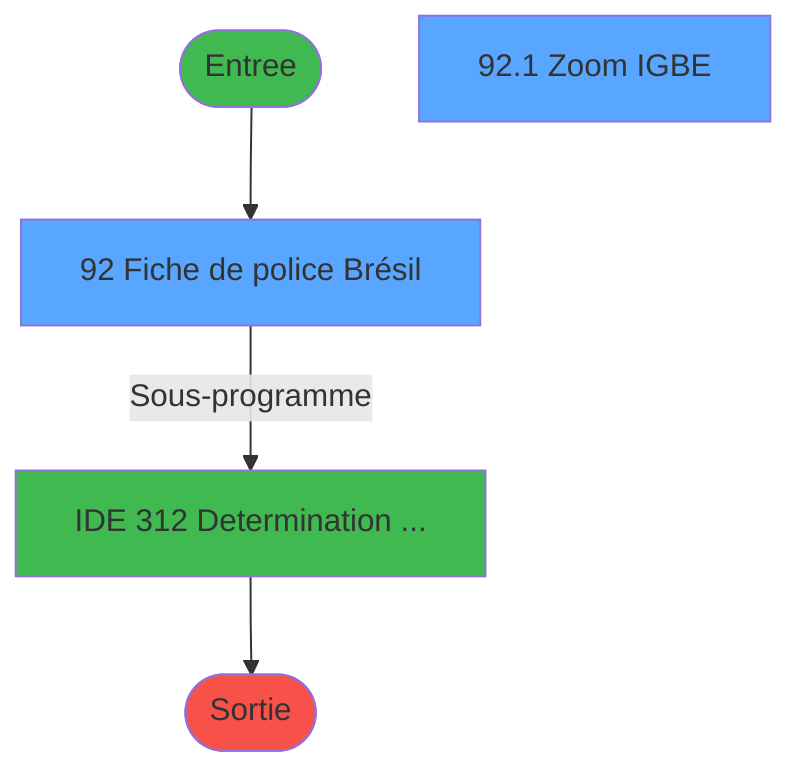
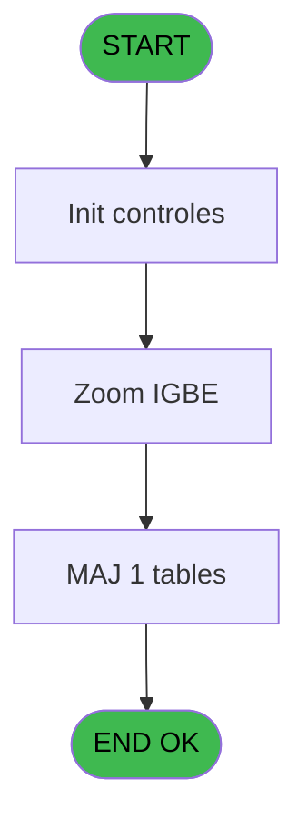

# PBG IDE 92 - Fiche de police Brésil

> **Analyse**: Phases 1-4 2026-02-03 09:18 -> 09:18 (19s) | Assemblage 09:18
> **Pipeline**: V7.2 Enrichi
> **Structure**: 4 onglets (Resume | Ecrans | Donnees | Connexions)

<!-- TAB:Resume -->

## 1. FICHE D'IDENTITE

| Attribut | Valeur |
|----------|--------|
| Projet | PBG |
| IDE Position | 92 |
| Nom Programme | Fiche de police Brésil |
| Fichier source | `Prg_92.xml` |
| Domaine metier | General |
| Taches | 3 (2 ecrans visibles) |
| Tables modifiees | 1 |
| Programmes appeles | 1 |
| :warning: Statut | **ORPHELIN_POTENTIEL** |

## 2. DESCRIPTION FONCTIONNELLE

**Fiche de police Brésil** assure la gestion complete de ce processus.

Le flux de traitement s'organise en **3 blocs fonctionnels** :

- **Validation** (1 tache) : controles et verifications de coherence
- **Consultation** (1 tache) : ecrans de recherche, selection et consultation
- **Traitement** (1 tache) : traitements metier divers

**Donnees modifiees** : 1 tables en ecriture (tables_paris).

**Logique metier** : 6 regles identifiees couvrant conditions metier.

Detail : phases du traitement

#### Phase 1 : Traitement (1 tache)

- **92** - Fiche de police Brésil **[[ECRAN]](#ecran-t1)**

Delegue a : [Determination Age Debut Sejour (IDE 312)](PBG-IDE-312.md)

#### Phase 2 : Consultation (1 tache)

- **92.1** - Zoom IGBE **[[ECRAN]](#ecran-t2)**

#### Phase 3 : Validation (1 tache)

- **92.2** - Verification VPF

#### Tables impactees

| Table | Operations | Role metier |
|-------|-----------|-------------|
| tables_paris | R/**W** (2 usages) |  |

## 3. BLOCS FONCTIONNELS

### 3.1 Traitement (1 tache)

Traitements internes.

---

#### 92 - Fiche de police Brésil [[ECRAN]](#ecran-t1)

**Role** : Traitement : Fiche de police Brésil.
**Ecran** : 771 x 410 DLU | [Voir mockup](#ecran-t1)
**Variables liees** : BN (v.Brésilien ?)
**Delegue a** : [Determination Age Debut Sejour (IDE 312)](PBG-IDE-312.md)

### 3.2 Consultation (1 tache)

Ecrans de recherche et consultation.

---

#### 92.1 - Zoom IGBE [[ECRAN]](#ecran-t2)

**Role** : Selection par l'operateur : Zoom IGBE.
**Ecran** : 613 x 286 DLU | [Voir mockup](#ecran-t2)

### 3.3 Validation (1 tache)

Controles de coherence : 1 tache verifie les donnees et conditions.

---

#### 92.2 - Verification VPF

**Role** : Verification : Verification VPF.

## 5. REGLES METIER

6 regles identifiees:

### Autres (6 regles)

#### [RM-001] Traitement si [AO] est renseigne

| Element | Detail |
|---------|--------|
| **Condition** | `[AO]<>''` |
| **Si vrai** | 'PASSP' |
| **Si faux** | IF(p.Pays résidence [S]<>'', 'CPF', IF(p.Ville résidence [U]<>'', 'RG', IF(p.Etat résidence [V]<>'', 'CN', IF(p.Pays avant [W]<>'', 'CIE', p.IBGE résidence [T]))))) |
| **Variables** | S (p.Pays résidence), T (p.IBGE résidence), U (p.Ville résidence), V (p.Etat résidence), W (p.Pays avant) |
| **Expression source** | Expression 7 : `IF([AO]<>'', 'PASSP', IF(p.Pays résidence [S]<>'', 'CPF', IF` |
| **Exemple** | Si [AO]<>'' → 'PASSP' |

#### [RM-002] Si [AR]<=18 alors 48 sinon 2)

| Element | Detail |
|---------|--------|
| **Condition** | `[AR]<=18` |
| **Si vrai** | 48 |
| **Si faux** | 2) |
| **Expression source** | Expression 26 : `IF([AR]<=18, 48, 2)` |
| **Exemple** | Si [AR]<=18 → 48. Sinon → 2) |

#### [RM-003] Si v.Nationnalité [BL]='00/00/0000'DATE alors Date() sinon v.Nationnalité [BL])

| Element | Detail |
|---------|--------|
| **Condition** | `v.Nationnalité [BL]='00/00/0000'DATE` |
| **Si vrai** | Date() |
| **Si faux** | v.Nationnalité [BL]) |
| **Variables** | BL (v.Nationnalité) |
| **Expression source** | Expression 27 : `IF(v.Nationnalité [BL]='00/00/0000'DATE, Date(), v.Nationnal` |
| **Exemple** | Si v.Nationnalité [BL]='00/00/0000'DATE → Date(). Sinon → v.Nationnalité [BL]) |

#### [RM-004] Si v.Date de naissance [BI]='BR' alors [CY] sinon CHG_REASON_v.Email [CR])

| Element | Detail |
|---------|--------|
| **Condition** | `v.Date de naissance [BI]='BR'` |
| **Si vrai** | [CY] |
| **Si faux** | CHG_REASON_v.Email [CR]) |
| **Variables** | BI (v.Date de naissance), BJ (v.Email), CR (CHG_REASON_v.Email) |
| **Expression source** | Expression 95 : `IF(v.Date de naissance [BI]='BR', [CY], CHG_REASON_v.Email [` |
| **Exemple** | Si v.Date de naissance [BI]='BR' → [CY]. Sinon → CHG_REASON_v.Email [CR]) |

#### [RM-005] Si p.Etat avant [Z]='BR' alors [DF] sinon [DH])

| Element | Detail |
|---------|--------|
| **Condition** | `p.Etat avant [Z]='BR'` |
| **Si vrai** | [DF] |
| **Si faux** | [DH]) |
| **Variables** | Z (p.Etat avant) |
| **Expression source** | Expression 97 : `IF(p.Etat avant [Z]='BR', [DF], [DH])` |
| **Exemple** | Si p.Etat avant [Z]='BR' → [DF]. Sinon → [DH]) |

#### [RM-006] Si [AA]='BR' alors [DO] sinon [DQ])

| Element | Detail |
|---------|--------|
| **Condition** | `[AA]='BR'` |
| **Si vrai** | [DO] |
| **Si faux** | [DQ]) |
| **Expression source** | Expression 99 : `IF([AA]='BR', [DO], [DQ])` |
| **Exemple** | Si [AA]='BR' → [DO]. Sinon → [DQ]) |

## 6. CONTEXTE

- **Appele par**: (aucun)
- **Appelle**: 1 programmes | **Tables**: 2 (W:1 R:1 L:1) | **Taches**: 3 | **Expressions**: 115

<!-- TAB:Ecrans -->

## 8. ECRANS

### 8.1 Forms visibles (2 / 3)

| # | Position | Tache | Nom | Type | Largeur | Hauteur | Bloc |
|---|----------|-------|-----|------|---------|---------|------|
| 1 | 92 | 92 | Fiche de police Brésil | Type0 | 771 | 410 | Traitement |
| 2 | 92.1 | 92.1 | Zoom IGBE | Type0 | 613 | 286 | Consultation |

### 8.2 Mockups Ecrans

---

#### 92 - Fiche de police Brésil
**Tache** : [92](#t1) | **Type** : Type0 | **Dimensions** : 771 x 410 DLU
**Bloc** : Traitement | **Titre IDE** : Fiche de police Brésil

<!-- FORM-DATA:
{
    "width":  771,
    "vFactor":  8,
    "type":  "Type0",
    "hFactor":  4,
    "controls":  [
                     {
                         "x":  18,
                         "type":  "label",
                         "var":  "",
                         "y":  44,
                         "w":  150,
                         "fmt":  "",
                         "name":  "",
                         "h":  12,
                         "color":  "",
                         "text":  "Nationnalité",
                         "parent":  null
                     },
                     {
                         "x":  18,
                         "type":  "label",
                         "var":  "",
                         "y":  188,
                         "w":  150,
                         "fmt":  "",
                         "name":  "",
                         "h":  12,
                         "color":  "",
                         "text":  "Type de document d\u0027identité fourni",
                         "parent":  28
                     },
                     {
                         "x":  18,
                         "type":  "label",
                         "var":  "",
                         "y":  76,
                         "w":  150,
                         "fmt":  "",
                         "name":  "",
                         "h":  10,
                         "color":  "",
                         "text":  "Passeport",
                         "parent":  28
                     },
                     {
                         "x":  18,
                         "type":  "label",
                         "var":  "",
                         "y":  100,
                         "w":  150,
                         "fmt":  "",
                         "name":  "",
                         "h":  10,
                         "color":  "",
                         "text":  "Numéro CPF",
                         "parent":  28
                     },
                     {
                         "x":  18,
                         "type":  "label",
                         "var":  "",
                         "y":  124,
                         "w":  150,
                         "fmt":  "",
                         "name":  "",
                         "h":  10,
                         "color":  "",
                         "text":  "Carte d\u0027identité",
                         "parent":  28
                     },
                     {
                         "x":  18,
                         "type":  "label",
                         "var":  "",
                         "y":  144,
                         "w":  150,
                         "fmt":  "",
                         "name":  "",
                         "h":  10,
                         "color":  "",
                         "text":  "Certificat de naissance",
                         "parent":  28
                     },
                     {
                         "x":  18,
                         "type":  "label",
                         "var":  "",
                         "y":  168,
                         "w":  150,
                         "fmt":  "",
                         "name":  "",
                         "h":  10,
                         "color":  "",
                         "text":  "Carte Mercosul",
                         "parent":  28
                     },
                     {
                         "x":  4,
                         "type":  "label",
                         "var":  "",
                         "y":  64,
                         "w":  760,
                         "fmt":  "",
                         "name":  "",
                         "h":  168,
                         "color":  "",
                         "text":  "Saisir un document d\u0027identitié",
                         "parent":  null
                     },
                     {
                         "x":  4,
                         "type":  "label",
                         "var":  "",
                         "y":  236,
                         "w":  760,
                         "fmt":  "",
                         "name":  "",
                         "h":  44,
                         "color":  "",
                         "text":  "Numéros locaux",
                         "parent":  null
                     },
                     {
                         "x":  18,
                         "type":  "label",
                         "var":  "",
                         "y":  248,
                         "w":  150,
                         "fmt":  "",
                         "name":  "",
                         "h":  9,
                         "color":  "",
                         "text":  "Téléphone fixe",
                         "parent":  30
                     },
                     {
                         "x":  18,
                         "type":  "label",
                         "var":  "",
                         "y":  264,
                         "w":  150,
                         "fmt":  "",
                         "name":  "",
                         "h":  9,
                         "color":  "",
                         "text":  "Téléphone mobile",
                         "parent":  30
                     },
                     {
                         "x":  4,
                         "type":  "label",
                         "var":  "",
                         "y":  284,
                         "w":  760,
                         "fmt":  "",
                         "name":  "",
                         "h":  96,
                         "color":  "",
                         "text":  "Détails du voyage",
                         "parent":  null
                     },
                     {
                         "x":  16,
                         "type":  "label",
                         "var":  "",
                         "y":  296,
                         "w":  150,
                         "fmt":  "",
                         "name":  "",
                         "h":  12,
                         "color":  "",
                         "text":  "Pays de résidence",
                         "parent":  36
                     },
                     {
                         "x":  16,
                         "type":  "label",
                         "var":  "",
                         "y":  312,
                         "w":  150,
                         "fmt":  "",
                         "name":  "",
                         "h":  12,
                         "color":  "",
                         "text":  "Dernier pays avant d\u0027arriver au Brésil",
                         "parent":  36
                     },
                     {
                         "x":  16,
                         "type":  "label",
                         "var":  "",
                         "y":  328,
                         "w":  150,
                         "fmt":  "",
                         "name":  "",
                         "h":  12,
                         "color":  "",
                         "text":  "Pays suivant après le départ du Brésil",
                         "parent":  36
                     },
                     {
                         "x":  16,
                         "type":  "label",
                         "var":  "",
                         "y":  344,
                         "w":  150,
                         "fmt":  "",
                         "name":  "",
                         "h":  12,
                         "color":  "",
                         "text":  "Raison de la visite",
                         "parent":  36
                     },
                     {
                         "x":  16,
                         "type":  "label",
                         "var":  "",
                         "y":  360,
                         "w":  150,
                         "fmt":  "",
                         "name":  "",
                         "h":  12,
                         "color":  "",
                         "text":  "Mode de transport principal",
                         "parent":  36
                     },
                     {
                         "x":  18,
                         "type":  "label",
                         "var":  "",
                         "y":  12,
                         "w":  80,
                         "fmt":  "",
                         "name":  "",
                         "h":  12,
                         "color":  "",
                         "text":  "Date de naissance",
                         "parent":  null
                     },
                     {
                         "x":  610,
                         "type":  "label",
                         "var":  "",
                         "y":  4,
                         "w":  152,
                         "fmt":  "",
                         "name":  "",
                         "h":  32,
                         "color":  "",
                         "text":  "Code ministère du tourisme",
                         "parent":  28
                     },
                     {
                         "x":  18,
                         "type":  "label",
                         "var":  "",
                         "y":  27,
                         "w":  80,
                         "fmt":  "",
                         "name":  "",
                         "h":  12,
                         "color":  "",
                         "text":  "Email",
                         "parent":  null
                     },
                     {
                         "x":  18,
                         "type":  "label",
                         "var":  "",
                         "y":  207,
                         "w":  150,
                         "fmt":  "",
                         "name":  "",
                         "h":  10,
                         "color":  "",
                         "text":  "Emetteur",
                         "parent":  28
                     },
                     {
                         "x":  328,
                         "type":  "label",
                         "var":  "",
                         "y":  296,
                         "w":  30,
                         "fmt":  "",
                         "name":  "",
                         "h":  12,
                         "color":  "",
                         "text":  "IBGE",
                         "parent":  36
                     },
                     {
                         "x":  410,
                         "type":  "label",
                         "var":  "",
                         "y":  296,
                         "w":  30,
                         "fmt":  "",
                         "name":  "",
                         "h":  12,
                         "color":  "",
                         "text":  "Ville",
                         "parent":  36
                     },
                     {
                         "x":  578,
                         "type":  "label",
                         "var":  "",
                         "y":  296,
                         "w":  38,
                         "fmt":  "",
                         "name":  "",
                         "h":  12,
                         "color":  "",
                         "text":  "Région",
                         "parent":  36
                     },
                     {
                         "x":  328,
                         "type":  "label",
                         "var":  "",
                         "y":  312,
                         "w":  30,
                         "fmt":  "",
                         "name":  "",
                         "h":  12,
                         "color":  "",
                         "text":  "IBGE",
                         "parent":  36
                     },
                     {
                         "x":  410,
                         "type":  "label",
                         "var":  "",
                         "y":  312,
                         "w":  30,
                         "fmt":  "",
                         "name":  "",
                         "h":  12,
                         "color":  "",
                         "text":  "Ville",
                         "parent":  36
                     },
                     {
                         "x":  578,
                         "type":  "label",
                         "var":  "",
                         "y":  312,
                         "w":  38,
                         "fmt":  "",
                         "name":  "",
                         "h":  12,
                         "color":  "",
                         "text":  "Région",
                         "parent":  36
                     },
                     {
                         "x":  328,
                         "type":  "label",
                         "var":  "",
                         "y":  328,
                         "w":  30,
                         "fmt":  "",
                         "name":  "",
                         "h":  12,
                         "color":  "",
                         "text":  "IBGE",
                         "parent":  36
                     },
                     {
                         "x":  410,
                         "type":  "label",
                         "var":  "",
                         "y":  328,
                         "w":  30,
                         "fmt":  "",
                         "name":  "",
                         "h":  12,
                         "color":  "",
                         "text":  "Ville",
                         "parent":  36
                     },
                     {
                         "x":  578,
                         "type":  "label",
                         "var":  "",
                         "y":  328,
                         "w":  38,
                         "fmt":  "",
                         "name":  "",
                         "h":  12,
                         "color":  "",
                         "text":  "Région",
                         "parent":  36
                     },
                     {
                         "x":  690,
                         "type":  "button",
                         "var":  "",
                         "y":  384,
                         "w":  76,
                         "fmt":  "\\Annuler",
                         "name":  "b.Annuler",
                         "h":  20,
                         "color":  "",
                         "text":  "",
                         "parent":  null
                     },
                     {
                         "x":  174,
                         "type":  "edit",
                         "var":  "",
                         "y":  12,
                         "w":  61,
                         "fmt":  "",
                         "name":  "v.Date de naissance",
                         "h":  12,
                         "color":  "",
                         "text":  "",
                         "parent":  null
                     },
                     {
                         "x":  254,
                         "type":  "edit",
                         "var":  "",
                         "y":  12,
                         "w":  202,
                         "fmt":  "30",
                         "name":  "",
                         "h":  12,
                         "color":  "48",
                         "text":  "",
                         "parent":  null
                     },
                     {
                         "x":  174,
                         "type":  "edit",
                         "var":  "",
                         "y":  27,
                         "w":  376,
                         "fmt":  "",
                         "name":  "p.Email_0001",
                         "h":  12,
                         "color":  "",
                         "text":  "",
                         "parent":  null
                     },
                     {
                         "x":  174,
                         "type":  "combobox",
                         "var":  "",
                         "y":  44,
                         "w":  148,
                         "fmt":  "",
                         "name":  "v.Nationnalité",
                         "h":  12,
                         "color":  "",
                         "text":  "",
                         "parent":  null
                     },
                     {
                         "x":  174,
                         "type":  "edit",
                         "var":  "",
                         "y":  76,
                         "w":  171,
                         "fmt":  "",
                         "name":  "v.Passeport",
                         "h":  10,
                         "color":  "",
                         "text":  "",
                         "parent":  28
                     },
                     {
                         "x":  630,
                         "type":  "edit",
                         "var":  "",
                         "y":  20,
                         "w":  116,
                         "fmt":  "",
                         "name":  "p.i.Code_touriste",
                         "h":  10,
                         "color":  "",
                         "text":  "",
                         "parent":  54
                     },
                     {
                         "x":  174,
                         "type":  "edit",
                         "var":  "",
                         "y":  100,
                         "w":  82,
                         "fmt":  "",
                         "name":  "v.Numero cpf_bresil",
                         "h":  10,
                         "color":  "",
                         "text":  "",
                         "parent":  28
                     },
                     {
                         "x":  174,
                         "type":  "edit",
                         "var":  "",
                         "y":  124,
                         "w":  171,
                         "fmt":  "",
                         "name":  "v.CNI",
                         "h":  10,
                         "color":  "",
                         "text":  "",
                         "parent":  28
                     },
                     {
                         "x":  174,
                         "type":  "edit",
                         "var":  "",
                         "y":  144,
                         "w":  171,
                         "fmt":  "",
                         "name":  "v.Acte naissance",
                         "h":  10,
                         "color":  "",
                         "text":  "",
                         "parent":  28
                     },
                     {
                         "x":  174,
                         "type":  "edit",
                         "var":  "",
                         "y":  168,
                         "w":  171,
                         "fmt":  "",
                         "name":  "v.Carte Mercosul",
                         "h":  10,
                         "color":  "",
                         "text":  "",
                         "parent":  28
                     },
                     {
                         "x":  174,
                         "type":  "combobox",
                         "var":  "",
                         "y":  188,
                         "w":  218,
                         "fmt":  "",
                         "name":  "p.Type pièce d\u0027identité",
                         "h":  12,
                         "color":  "",
                         "text":  "",
                         "parent":  28
                     },
                     {
                         "x":  174,
                         "type":  "edit",
                         "var":  "",
                         "y":  207,
                         "w":  171,
                         "fmt":  "",
                         "name":  "v.Emeteur pièce d\u0027identité",
                         "h":  10,
                         "color":  "",
                         "text":  "",
                         "parent":  28
                     },
                     {
                         "x":  408,
                         "type":  "edit",
                         "var":  "",
                         "y":  188,
                         "w":  134,
                         "fmt":  "",
                         "name":  "v.N° pièce",
                         "h":  12,
                         "color":  "195",
                         "text":  "",
                         "parent":  28
                     },
                     {
                         "x":  174,
                         "type":  "edit",
                         "var":  "",
                         "y":  248,
                         "w":  94,
                         "fmt":  "UU ####-####",
                         "name":  "v.Téléphone fixe",
                         "h":  10,
                         "color":  "",
                         "text":  "",
                         "parent":  30
                     },
                     {
                         "x":  174,
                         "type":  "edit",
                         "var":  "",
                         "y":  264,
                         "w":  94,
                         "fmt":  "UU #####-####",
                         "name":  "v.Téléphone mobile",
                         "h":  10,
                         "color":  "",
                         "text":  "",
                         "parent":  30
                     },
                     {
                         "x":  174,
                         "type":  "combobox",
                         "var":  "",
                         "y":  296,
                         "w":  148,
                         "fmt":  "",
                         "name":  "v.Pays de résidence_0001",
                         "h":  12,
                         "color":  "",
                         "text":  "",
                         "parent":  36
                     },
                     {
                         "x":  364,
                         "type":  "edit",
                         "var":  "",
                         "y":  296,
                         "w":  42,
                         "fmt":  "",
                         "name":  "v.IBGE résidence",
                         "h":  12,
                         "color":  "",
                         "text":  "",
                         "parent":  36
                     },
                     {
                         "x":  442,
                         "type":  "edit",
                         "var":  "",
                         "y":  296,
                         "w":  128,
                         "fmt":  "",
                         "name":  "v.Ville résidence",
                         "h":  12,
                         "color":  "",
                         "text":  "",
                         "parent":  36
                     },
                     {
                         "x":  618,
                         "type":  "edit",
                         "var":  "",
                         "y":  296,
                         "w":  142,
                         "fmt":  "",
                         "name":  "v.Etat résidence",
                         "h":  12,
                         "color":  "",
                         "text":  "",
                         "parent":  36
                     },
                     {
                         "x":  174,
                         "type":  "combobox",
                         "var":  "",
                         "y":  312,
                         "w":  148,
                         "fmt":  "",
                         "name":  "v.Pays avant",
                         "h":  12,
                         "color":  "",
                         "text":  "",
                         "parent":  36
                     },
                     {
                         "x":  364,
                         "type":  "edit",
                         "var":  "",
                         "y":  312,
                         "w":  42,
                         "fmt":  "",
                         "name":  "v.IBGE avant",
                         "h":  12,
                         "color":  "",
                         "text":  "",
                         "parent":  36
                     },
                     {
                         "x":  442,
                         "type":  "edit",
                         "var":  "",
                         "y":  312,
                         "w":  128,
                         "fmt":  "",
                         "name":  "v.Ville avant",
                         "h":  12,
                         "color":  "",
                         "text":  "",
                         "parent":  36
                     },
                     {
                         "x":  618,
                         "type":  "edit",
                         "var":  "",
                         "y":  312,
                         "w":  142,
                         "fmt":  "",
                         "name":  "v.Etat avant",
                         "h":  12,
                         "color":  "",
                         "text":  "",
                         "parent":  36
                     },
                     {
                         "x":  174,
                         "type":  "combobox",
                         "var":  "",
                         "y":  328,
                         "w":  148,
                         "fmt":  "",
                         "name":  "v.Pays après_0001",
                         "h":  12,
                         "color":  "",
                         "text":  "",
                         "parent":  36
                     },
                     {
                         "x":  364,
                         "type":  "edit",
                         "var":  "",
                         "y":  328,
                         "w":  42,
                         "fmt":  "",
                         "name":  "v.IBGE après",
                         "h":  12,
                         "color":  "",
                         "text":  "",
                         "parent":  36
                     },
                     {
                         "x":  442,
                         "type":  "edit",
                         "var":  "",
                         "y":  328,
                         "w":  128,
                         "fmt":  "",
                         "name":  "v.Ville après",
                         "h":  12,
                         "color":  "",
                         "text":  "",
                         "parent":  36
                     },
                     {
                         "x":  618,
                         "type":  "edit",
                         "var":  "",
                         "y":  328,
                         "w":  142,
                         "fmt":  "",
                         "name":  "v.Etat après",
                         "h":  12,
                         "color":  "",
                         "text":  "",
                         "parent":  36
                     },
                     {
                         "x":  174,
                         "type":  "combobox",
                         "var":  "",
                         "y":  344,
                         "w":  148,
                         "fmt":  "",
                         "name":  "p.i.Nom",
                         "h":  12,
                         "color":  "",
                         "text":  "",
                         "parent":  36
                     },
                     {
                         "x":  174,
                         "type":  "combobox",
                         "var":  "",
                         "y":  360,
                         "w":  148,
                         "fmt":  "",
                         "name":  "v.Transport arrivée",
                         "h":  12,
                         "color":  "",
                         "text":  "",
                         "parent":  36
                     },
                     {
                         "x":  602,
                         "type":  "button",
                         "var":  "",
                         "y":  384,
                         "w":  76,
                         "fmt":  "Valider",
                         "name":  "b.Valider",
                         "h":  20,
                         "color":  "",
                         "text":  "",
                         "parent":  null
                     }
                 ],
    "taskId":  "92",
    "height":  410
}
-->

<strong>Champs : 29 champs</strong>

| Pos (x,y) | Nom | Variable | Type |
|-----------|-----|----------|------|
| 174,12 | v.Date de naissance | - | edit |
| 254,12 | 30 | - | edit |
| 174,27 | p.Email_0001 | - | edit |
| 174,44 | v.Nationnalité | - | combobox |
| 174,76 | v.Passeport | - | edit |
| 630,20 | p.i.Code_touriste | - | edit |
| 174,100 | v.Numero cpf_bresil | - | edit |
| 174,124 | v.CNI | - | edit |
| 174,144 | v.Acte naissance | - | edit |
| 174,168 | v.Carte Mercosul | - | edit |
| 174,188 | p.Type pièce d'identité | - | combobox |
| 174,207 | v.Emeteur pièce d'identité | - | edit |
| 408,188 | v.N° pièce | - | edit |
| 174,248 | v.Téléphone fixe | - | edit |
| 174,264 | v.Téléphone mobile | - | edit |
| 174,296 | v.Pays de résidence_0001 | - | combobox |
| 364,296 | v.IBGE résidence | - | edit |
| 442,296 | v.Ville résidence | - | edit |
| 618,296 | v.Etat résidence | - | edit |
| 174,312 | v.Pays avant | - | combobox |
| 364,312 | v.IBGE avant | - | edit |
| 442,312 | v.Ville avant | - | edit |
| 618,312 | v.Etat avant | - | edit |
| 174,328 | v.Pays après_0001 | - | combobox |
| 364,328 | v.IBGE après | - | edit |
| 442,328 | v.Ville après | - | edit |
| 618,328 | v.Etat après | - | edit |
| 174,344 | p.i.Nom | - | combobox |
| 174,360 | v.Transport arrivée | - | combobox |

<strong>Boutons : 2 boutons</strong>

| Bouton | Pos (x,y) | Action |
|--------|-----------|--------|
| \Annuler | 690,384 | Annule et retour au menu |
| Valider | 602,384 | Valide la saisie et enregistre |

---

#### 92.1 - Zoom IGBE
**Tache** : [92.1](#t2) | **Type** : Type0 | **Dimensions** : 613 x 286 DLU
**Bloc** : Consultation | **Titre IDE** : Zoom IGBE

<!-- FORM-DATA:
{
    "width":  613,
    "vFactor":  8,
    "type":  "Type0",
    "hFactor":  4,
    "controls":  [
                     {
                         "x":  4,
                         "type":  "table",
                         "var":  "",
                         "name":  "",
                         "titleH":  12,
                         "color":  "",
                         "w":  604,
                         "y":  8,
                         "fmt":  "",
                         "parent":  null,
                         "text":  "",
                         "rowH":  13,
                         "h":  248,
                         "cols":  [
                                      {
                                          "title":  "Code",
                                          "layer":  1,
                                          "w":  70
                                      },
                                      {
                                          "title":  "Ville",
                                          "layer":  2,
                                          "w":  317
                                      },
                                      {
                                          "title":  "Région",
                                          "layer":  3,
                                          "w":  200
                                      }
                                  ],
                         "rows":  3
                     },
                     {
                         "x":  8,
                         "type":  "edit",
                         "var":  "",
                         "y":  23,
                         "w":  59,
                         "fmt":  "",
                         "name":  "code_alpha6 (10)",
                         "h":  10,
                         "color":  "",
                         "text":  "",
                         "parent":  1
                     },
                     {
                         "x":  78,
                         "type":  "edit",
                         "var":  "",
                         "y":  23,
                         "w":  316,
                         "fmt":  "",
                         "name":  "libelle_trente (200)",
                         "h":  10,
                         "color":  "",
                         "text":  "",
                         "parent":  1
                     },
                     {
                         "x":  395,
                         "type":  "edit",
                         "var":  "",
                         "y":  23,
                         "w":  196,
                         "fmt":  "",
                         "name":  "libelle_long",
                         "h":  10,
                         "color":  "",
                         "text":  "",
                         "parent":  1
                     },
                     {
                         "x":  120,
                         "type":  "button",
                         "var":  "",
                         "y":  264,
                         "w":  100,
                         "fmt":  "\u0026Selectionner",
                         "name":  "",
                         "h":  14,
                         "color":  "",
                         "text":  "",
                         "parent":  null
                     },
                     {
                         "x":  392,
                         "type":  "button",
                         "var":  "",
                         "y":  264,
                         "w":  100,
                         "fmt":  "\u0026Quitter",
                         "name":  "",
                         "h":  14,
                         "color":  "",
                         "text":  "",
                         "parent":  null
                     }
                 ],
    "taskId":  "92.1",
    "height":  286
}
-->

<strong>Champs : 3 champs</strong>

| Pos (x,y) | Nom | Variable | Type |
|-----------|-----|----------|------|
| 8,23 | code_alpha6 (10) | - | edit |
| 78,23 | libelle_trente (200) | - | edit |
| 395,23 | libelle_long | - | edit |

<strong>Boutons : 2 boutons</strong>

| Bouton | Pos (x,y) | Action |
|--------|-----------|--------|
| Selectionner | 120,264 | Ouvre la selection |
| Quitter | 392,264 | Quitte le programme |

## 9. NAVIGATION

### 9.1 Enchainement des ecrans

**Detail par enchainement :**

| Depuis | Action | Vers | Retour |
|--------|--------|------|--------|
| Fiche de police Brésil | Sous-programme | [Determination Age Debut Sejour (IDE 312)](PBG-IDE-312.md) | Retour ecran |

### 9.3 Structure hierarchique (3 taches)

| Position | Tache | Type | Dimensions | Bloc |
|----------|-------|------|------------|------|
| **92.1** | [**Fiche de police Brésil** (92)](#t1) [mockup](#ecran-t1) | - | 771x410 | Traitement |
| **92.2** | [**Zoom IGBE** (92.1)](#t2) [mockup](#ecran-t2) | - | 613x286 | Consultation |
| **92.3** | [**Verification VPF** (92.2)](#t3) | - | - | Validation |

### 9.4 Algorigramme

> **Legende**: Vert = START/END OK | Rouge = END KO | Bleu = Decisions
> *Algorigramme auto-genere. Utiliser `/algorigramme` pour une synthese metier detaillee.*

<!-- TAB:Donnees -->

## 10. TABLES

### Tables utilisees (2)

| ID | Nom | Description | Type | R | W | L | Usages |
|----|-----|-------------|------|---|---|---|--------|
| 112 | tables_paris |  | DB | R | **W** |   | 2 |
| 364 | pms_footer_comment |  | DB |   |   | L | 1 |

### Colonnes par table (1 / 1 tables avec colonnes identifiees)

Table 112 - tables_paris (R/**W**) - 2 usages

| Lettre | Variable | Acces | Type |
|--------|----------|-------|------|
| A | p.i.Nom | W | Unicode |
| B | p.i.Prénom | W | Unicode |
| C | p.i.Titre | W | Unicode |
| D | p.Date naissance | W | Date |
| E | p.i.Date début séjour | W | Date |
| F | p.i.Date fin séjour | W | Date |
| G | p.Email | W | Unicode |
| H | p.Nationnalité | W | Unicode |
| I | p.Passeport (numero piece) | W | Unicode |
| J | p.i.Code_touriste | W | Unicode |
| K | p.Numero cpf_bresil | W | Unicode |
| L | p.CNI | W | Unicode |
| M | p.Acte naissance | W | Unicode |
| N | p.Carte Mercosul | W | Unicode |
| O | p.Type pièce d'identité | W | Unicode |
| P | p.Emetteur pièce d'identité | W | Unicode |
| Q | p.Téléphone fixe | W | Unicode |
| R | p.Téléphone mobile | W | Unicode |
| S | p.Pays résidence | W | Unicode |
| T | p.IBGE résidence | W | Unicode |
| U | p.Ville résidence | W | Unicode |
| V | p.Etat résidence | W | Unicode |
| W | p.Pays avant | W | Unicode |
| X | p.IBGE avant | W | Unicode |
| Y | p.Ville avant | W | Unicode |
| Z | p.Etat avant | W | Unicode |
| BA | p.Pays après | W | Unicode |
| BB | p.IBGE après | W | Unicode |
| BC | p.Ville après | W | Unicode |
| BD | p.Etat après | W | Unicode |
| BE | p.Raision visiste | W | Unicode |
| BF | p.Transport arrivée | W | Unicode |
| BG | v.Date début séjour | W | Date |
| BH | b.Annuler | W | Alpha |
| BI | v.Date de naissance | W | Date |
| BJ | v.Email | W | Unicode |
| BK | v.Age | W | Numeric |
| BL | v.Nationnalité | W | Unicode |
| BM | v.Mercosul country ? | W | Logical |
| BN | v.Brésilien ? | W | Logical |
| BO | v.Passeport | W | Unicode |
| BP | v.Numero cpf_bresil | W | Unicode |
| BQ | v.CNI | W | Unicode |
| BR | v.Acte naissance | W | Unicode |
| BS | v.Carte Mercosul | W | Unicode |
| BT | v.Type pièce d'identité | W | Unicode |
| BU | v.N° pièce | W | Unicode |
| BV | v.Emeteur pièce d'identité | W | Unicode |
| BW | v.Téléphone fixe | W | Unicode |
| BX | v.Téléphone mobile | W | Unicode |
| BY | v.Pays de résidence | W | Unicode |
| BZ | v.IBGE résidence | W | Unicode |
| CA | v.Ville résidence | W | Unicode |
| CB | v.Etat résidence | W | Unicode |
| CC | v.Pays avant | W | Unicode |
| CD | v.IBGE avant | W | Unicode |
| CE | v.Ville avant | W | Unicode |
| CF | v.Etat avant | W | Unicode |
| CG | v.Pays après | W | Unicode |
| CH | v.IBGE après | W | Unicode |
| CI | v.Ville après | W | Unicode |
| CJ | v.Etat après | W | Unicode |
| CK | v.Raision visite | W | Unicode |
| CL | v.Transport arrivée | W | Unicode |
| CM | b.Valider | W | Unicode |
| CN | CHG_REASON_v.Date de naissance | W | Numeric |
| CO | CHG_PRV_v.Date de naissance | W | Date |
| CP | CHG_REASON_v.Nationnalité | W | Numeric |
| CQ | CHG_PRV_v.Nationnalité | W | Unicode |
| CR | CHG_REASON_v.Email | W | Numeric |
| CS | CHG_PRV_v.Email | W | Unicode |
| CT | CHG_REASON_v.Numero cpf_bresil | W | Numeric |
| CU | CHG_PRV_v.Numero cpf_bresil | W | Unicode |
| CV | v.Clef OK ? | W | Logical |

## 11. VARIABLES

### 11.1 Parametres entrants (32)

Variables recues en parametre.

| Lettre | Nom | Type | Usage dans |
|--------|-----|------|-----------|
| A | p.i.Nom | Unicode | 1x parametre entrant |
| B | p.i.Prénom | Unicode | 1x parametre entrant |
| C | p.i.Titre | Unicode | 1x parametre entrant |
| D | p.Date naissance | Date | 1x parametre entrant |
| E | p.i.Date début séjour | Date | 1x parametre entrant |
| F | p.i.Date fin séjour | Date | 1x parametre entrant |
| G | p.Email | Unicode | 2x parametre entrant |
| H | p.Nationnalité | Unicode | 1x parametre entrant |
| I | p.Passeport (numero piece) | Unicode | - |
| J | p.i.Code_touriste | Unicode | 1x parametre entrant |
| K | p.Numero cpf_bresil | Unicode | 1x parametre entrant |
| L | p.CNI | Unicode | 1x parametre entrant |
| M | p.Acte naissance | Unicode | 1x parametre entrant |
| N | p.Carte Mercosul | Unicode | 1x parametre entrant |
| O | p.Type pièce d'identité | Unicode | 1x parametre entrant |
| P | p.Emetteur pièce d'identité | Unicode | - |
| Q | p.Téléphone fixe | Unicode | 1x parametre entrant |
| R | p.Téléphone mobile | Unicode | - |
| S | p.Pays résidence | Unicode | 5x parametre entrant |
| T | p.IBGE résidence | Unicode | 5x parametre entrant |
| U | p.Ville résidence | Unicode | 3x parametre entrant |
| V | p.Etat résidence | Unicode | 3x parametre entrant |
| W | p.Pays avant | Unicode | 3x parametre entrant |
| X | p.IBGE avant | Unicode | 1x parametre entrant |
| Y | p.Ville avant | Unicode | 1x parametre entrant |
| Z | p.Etat avant | Unicode | 5x parametre entrant |
| BA | p.Pays après | Unicode | - |
| BB | p.IBGE après | Unicode | - |
| BC | p.Ville après | Unicode | - |
| BD | p.Etat après | Unicode | - |
| BE | p.Raision visiste | Unicode | 3x parametre entrant |
| BF | p.Transport arrivée | Unicode | - |

### 11.2 Variables de session (32)

Variables persistantes pendant toute la session.

| Lettre | Nom | Type | Usage dans |
|--------|-----|------|-----------|
| BG | v.Date début séjour | Date | - |
| BI | v.Date de naissance | Date | 6x session |
| BJ | v.Email | Unicode | 5x session |
| BK | v.Age | Numeric | - |
| BL | v.Nationnalité | Unicode | 3x session |
| BM | v.Mercosul country ? | Logical | - |
| BN | v.Brésilien ? | Logical | - |
| BO | v.Passeport | Unicode | - |
| BP | v.Numero cpf_bresil | Unicode | - |
| BQ | v.CNI | Unicode | 1x session |
| BR | v.Acte naissance | Unicode | - |
| BS | v.Carte Mercosul | Unicode | - |
| BT | v.Type pièce d'identité | Unicode | - |
| BU | v.N° pièce | Unicode | 4x session |
| BV | v.Emeteur pièce d'identité | Unicode | - |
| BW | v.Téléphone fixe | Unicode | - |
| BX | v.Téléphone mobile | Unicode | - |
| BY | v.Pays de résidence | Unicode | - |
| BZ | v.IBGE résidence | Unicode | - |
| CA | v.Ville résidence | Unicode | 1x session |
| CB | v.Etat résidence | Unicode | 2x session |
| CC | v.Pays avant | Unicode | - |
| CD | v.IBGE avant | Unicode | - |
| CE | v.Ville avant | Unicode | 1x session |
| CF | v.Etat avant | Unicode | 1x session |
| CG | v.Pays après | Unicode | 1x session |
| CH | v.IBGE après | Unicode | 1x session |
| CI | v.Ville après | Unicode | 1x session |
| CJ | v.Etat après | Unicode | 1x session |
| CK | v.Raision visite | Unicode | 1x session |
| CL | v.Transport arrivée | Unicode | 1x session |
| CV | v.Clef OK ? | Logical | - |

### 11.3 Autres (10)

Variables diverses.

| Lettre | Nom | Type | Usage dans |
|--------|-----|------|-----------|
| BH | b.Annuler | Alpha | - |
| CM | b.Valider | Unicode | 1x refs |
| CN | CHG_REASON_v.Date de naissance | Numeric | - |
| CO | CHG_PRV_v.Date de naissance | Date | - |
| CP | CHG_REASON_v.Nationnalité | Numeric | - |
| CQ | CHG_PRV_v.Nationnalité | Unicode | 2x refs |
| CR | CHG_REASON_v.Email | Numeric | 3x refs |
| CS | CHG_PRV_v.Email | Unicode | 3x refs |
| CT | CHG_REASON_v.Numero cpf_bresil | Numeric | - |
| CU | CHG_PRV_v.Numero cpf_bresil | Unicode | - |

Toutes les 74 variables (liste complete)

| Cat | Lettre | Nom Variable | Type |
|-----|--------|--------------|------|
| P0 | **A** | p.i.Nom | Unicode |
| P0 | **B** | p.i.Prénom | Unicode |
| P0 | **C** | p.i.Titre | Unicode |
| P0 | **D** | p.Date naissance | Date |
| P0 | **E** | p.i.Date début séjour | Date |
| P0 | **F** | p.i.Date fin séjour | Date |
| P0 | **G** | p.Email | Unicode |
| P0 | **H** | p.Nationnalité | Unicode |
| P0 | **I** | p.Passeport (numero piece) | Unicode |
| P0 | **J** | p.i.Code_touriste | Unicode |
| P0 | **K** | p.Numero cpf_bresil | Unicode |
| P0 | **L** | p.CNI | Unicode |
| P0 | **M** | p.Acte naissance | Unicode |
| P0 | **N** | p.Carte Mercosul | Unicode |
| P0 | **O** | p.Type pièce d'identité | Unicode |
| P0 | **P** | p.Emetteur pièce d'identité | Unicode |
| P0 | **Q** | p.Téléphone fixe | Unicode |
| P0 | **R** | p.Téléphone mobile | Unicode |
| P0 | **S** | p.Pays résidence | Unicode |
| P0 | **T** | p.IBGE résidence | Unicode |
| P0 | **U** | p.Ville résidence | Unicode |
| P0 | **V** | p.Etat résidence | Unicode |
| P0 | **W** | p.Pays avant | Unicode |
| P0 | **X** | p.IBGE avant | Unicode |
| P0 | **Y** | p.Ville avant | Unicode |
| P0 | **Z** | p.Etat avant | Unicode |
| P0 | **BA** | p.Pays après | Unicode |
| P0 | **BB** | p.IBGE après | Unicode |
| P0 | **BC** | p.Ville après | Unicode |
| P0 | **BD** | p.Etat après | Unicode |
| P0 | **BE** | p.Raision visiste | Unicode |
| P0 | **BF** | p.Transport arrivée | Unicode |
| V. | **BG** | v.Date début séjour | Date |
| V. | **BI** | v.Date de naissance | Date |
| V. | **BJ** | v.Email | Unicode |
| V. | **BK** | v.Age | Numeric |
| V. | **BL** | v.Nationnalité | Unicode |
| V. | **BM** | v.Mercosul country ? | Logical |
| V. | **BN** | v.Brésilien ? | Logical |
| V. | **BO** | v.Passeport | Unicode |
| V. | **BP** | v.Numero cpf_bresil | Unicode |
| V. | **BQ** | v.CNI | Unicode |
| V. | **BR** | v.Acte naissance | Unicode |
| V. | **BS** | v.Carte Mercosul | Unicode |
| V. | **BT** | v.Type pièce d'identité | Unicode |
| V. | **BU** | v.N° pièce | Unicode |
| V. | **BV** | v.Emeteur pièce d'identité | Unicode |
| V. | **BW** | v.Téléphone fixe | Unicode |
| V. | **BX** | v.Téléphone mobile | Unicode |
| V. | **BY** | v.Pays de résidence | Unicode |
| V. | **BZ** | v.IBGE résidence | Unicode |
| V. | **CA** | v.Ville résidence | Unicode |
| V. | **CB** | v.Etat résidence | Unicode |
| V. | **CC** | v.Pays avant | Unicode |
| V. | **CD** | v.IBGE avant | Unicode |
| V. | **CE** | v.Ville avant | Unicode |
| V. | **CF** | v.Etat avant | Unicode |
| V. | **CG** | v.Pays après | Unicode |
| V. | **CH** | v.IBGE après | Unicode |
| V. | **CI** | v.Ville après | Unicode |
| V. | **CJ** | v.Etat après | Unicode |
| V. | **CK** | v.Raision visite | Unicode |
| V. | **CL** | v.Transport arrivée | Unicode |
| V. | **CV** | v.Clef OK ? | Logical |
| Autre | **BH** | b.Annuler | Alpha |
| Autre | **CM** | b.Valider | Unicode |
| Autre | **CN** | CHG_REASON_v.Date de naissance | Numeric |
| Autre | **CO** | CHG_PRV_v.Date de naissance | Date |
| Autre | **CP** | CHG_REASON_v.Nationnalité | Numeric |
| Autre | **CQ** | CHG_PRV_v.Nationnalité | Unicode |
| Autre | **CR** | CHG_REASON_v.Email | Numeric |
| Autre | **CS** | CHG_PRV_v.Email | Unicode |
| Autre | **CT** | CHG_REASON_v.Numero cpf_bresil | Numeric |
| Autre | **CU** | CHG_PRV_v.Numero cpf_bresil | Unicode |

## 12. EXPRESSIONS

**115 / 115 expressions decodees (100%)**

### 12.1 Repartition par type

| Type | Expressions | Regles |
|------|-------------|--------|
| CALCULATION | 1 | 0 |
| CONDITION | 31 | 6 |
| CONSTANTE | 8 | 0 |
| FORMAT | 3 | 0 |
| OTHER | 68 | 0 |
| NEGATION | 4 | 0 |

### 12.2 Expressions cles par type

#### CALCULATION (1 expressions)

| Type | IDE | Expression | Regle |
|------|-----|------------|-------|
| CALCULATION | 108 | `IN(p.Raision visiste [BE], '00/00/0000'DATE, '01/01/1901'DATE)` | - |

#### CONDITION (31 expressions)

| Type | IDE | Expression | Regle |
|------|-----|------------|-------|
| CONDITION | 95 | `IF(v.Date de naissance [BI]='BR', [CY], CHG_REASON_v.Email [CR])` | [RM-004](#rm-RM-004) |
| CONDITION | 97 | `IF(p.Etat avant [Z]='BR', [DF], [DH])` | [RM-005](#rm-RM-005) |
| CONDITION | 99 | `IF([AA]='BR', [DO], [DQ])` | [RM-006](#rm-RM-006) |
| CONDITION | 27 | `IF(v.Nationnalité [BL]='00/00/0000'DATE, Date(), v.Nationnalité [BL])` | [RM-003](#rm-RM-003) |
| CONDITION | 7 | `IF([AO]<>'', 'PASSP', IF(p.Pays résidence [S]<>'', 'CPF', IF(p.Ville résidence [U]<>'', 'RG', IF(p.Etat résidence [V]<>'', 'CN', IF(p.Pays avant [W]<>'', 'CIE', p.IBGE résidence [T])))))` | [RM-001](#rm-RM-001) |
| ... | | *+26 autres* | |

#### CONSTANTE (8 expressions)

| Type | IDE | Expression | Regle |
|------|-----|------------|-------|
| CONSTANTE | 81 | `''` | - |
| CONSTANTE | 15 | `'!'` | - |
| CONSTANTE | 91 | `'F'` | - |
| CONSTANTE | 90 | `'IBGE'` | - |
| CONSTANTE | 10 | `'VISIT'` | - |
| ... | | *+3 autres* | |

#### FORMAT (3 expressions)

| Type | IDE | Expression | Regle |
|------|-----|------------|-------|
| FORMAT | 83 | `InStr(StrToken(v.N° pièce [BU], 2, '@'), '.')=0` | - |
| FORMAT | 82 | `InStr(v.N° pièce [BU], '@')=0` | - |
| FORMAT | 24 | `StrBuild(MlsTrans('@1@ ans au @2@'), Str([AR], '3'), DStr([AS], '##/##/####'))` | - |

#### OTHER (68 expressions)

| Type | IDE | Expression | Regle |
|------|-----|------------|-------|
| OTHER | 65 | `p.IBGE avant [X]` | - |
| OTHER | 66 | `p.Ville avant [Y]` | - |
| OTHER | 63 | `p.IBGE résidence [T]` | - |
| OTHER | 64 | `v.Etat résidence [CB]` | - |
| OTHER | 69 | `CHG_REASON_v.Email [CR]` | - |
| ... | | *+63 autres* | |

#### NEGATION (4 expressions)

| Type | IDE | Expression | Regle |
|------|-----|------------|-------|
| NEGATION | 19 | `NOT [AL] OR [AQ]` | - |
| NEGATION | 115 | `NOT [DZ]` | - |
| NEGATION | 16 | `NOT [AQ]` | - |
| NEGATION | 18 | `NOT [AQ] AND [AL]` | - |

### 12.3 Toutes les expressions (115)

Voir les 115 expressions

#### CALCULATION (1)

| IDE | Expression Decodee |
|-----|-------------------|
| 108 | `IN(p.Raision visiste [BE], '00/00/0000'DATE, '01/01/1901'DATE)` |

#### CONDITION (31)

| IDE | Expression Decodee |
|-----|-------------------|
| 7 | `IF([AO]<>'', 'PASSP', IF(p.Pays résidence [S]<>'', 'CPF', IF(p.Ville résidence [U]<>'', 'RG', IF(p.Etat résidence [V]<>'', 'CN', IF(p.Pays avant [W]<>'', 'CIE', p.IBGE résidence [T])))))` |
| 8 | `CASE(p.IBGE résidence [T], 'PASSP', [AO], 'CPF', p.Pays résidence [S], 'RG', p.Ville résidence [U], 'CN', p.Etat résidence [V], 'CIE', p.Pays avant [W], '')` |
| 26 | `IF([AR]<=18, 48, 2)` |
| 27 | `IF(v.Nationnalité [BL]='00/00/0000'DATE, Date(), v.Nationnalité [BL])` |
| 95 | `IF(v.Date de naissance [BI]='BR', [CY], CHG_REASON_v.Email [CR])` |
| 96 | `IF(v.Date de naissance [BI]='BR', [CZ], CHG_PRV_v.Email [CS])` |
| 97 | `IF(p.Etat avant [Z]='BR', [DF], [DH])` |
| 98 | `IF(p.Etat avant [Z]='BR', [DG], [DI])` |
| 99 | `IF([AA]='BR', [DO], [DQ])` |
| 100 | `IF([AA]='BR', [DP], [DR])` |
| 3 | `[AK]='MERCOSUL'` |
| 4 | `[AD]='BR'` |
| 17 | `[AR]<=18 AND [AQ]` |
| 20 | `[AU]=''` |
| 23 | `[AR]>18 OR NOT [AQ]` |
| 53 | `p.Email [G]<>''` |
| 84 | `v.N° pièce [BU]<>''` |
| 85 | `p.i.Date début séjour [E]<>''` |
| 88 | `v.Emeteur pièce d'iden... [BV]=0` |
| 101 | `v.Date de naissance [BI]='BR'` |
| 102 | `v.Date de naissance [BI]<>'BR'` |
| 103 | `p.Etat avant [Z]='BR'` |
| 104 | `p.Etat avant [Z]<>'BR'` |
| 105 | `[AA]='BR'` |
| 106 | `[AA]<>'BR'` |
| 107 | `[DV]=0` |
| 109 | `(CHG_REASON_v.Email [CR]='' OR CHG_PRV_v.Email [CS]='')` |
| 110 | `([DH]='' OR [DI]='')` |
| 111 | `([DQ]='' OR [DR]='')` |
| 112 | `v.Etat résidence [CB]=''` |
| 113 | `[EB]=0 AND p.Pays résidence [S]<>''` |

#### CONSTANTE (8)

| IDE | Expression Decodee |
|-----|-------------------|
| 9 | `'IDENT'` |
| 10 | `'VISIT'` |
| 11 | `'TRNSP'` |
| 14 | `1` |
| 15 | `'!'` |
| 81 | `''` |
| 90 | `'IBGE'` |
| 91 | `'F'` |

#### FORMAT (3)

| IDE | Expression Decodee |
|-----|-------------------|
| 24 | `StrBuild(MlsTrans('@1@ ans au @2@'), Str([AR], '3'), DStr([AS], '##/##/####'))` |
| 82 | `InStr(v.N° pièce [BU], '@')=0` |
| 83 | `InStr(StrToken(v.N° pièce [BU], 2, '@'), '.')=0` |

#### OTHER (68)

| IDE | Expression Decodee |
|-----|-------------------|
| 1 | `GetParam ('LANGUE')` |
| 2 | `[AD]` |
| 5 | `[AF]` |
| 6 | `[AS]` |
| 12 | `SetParam ('LANGUE','F')` |
| 13 | `ISNULL(GetParam ('LANGUE'))` |
| 21 | `p.IBGE résidence [T]` |
| 22 | `[AQ]` |
| 25 | `p.Raision visiste [BE]` |
| 28 | `[AE]` |
| 29 | `p.Numero cpf_bresil [K]` |
| 30 | `p.Date naissance [D]` |
| 31 | `p.i.Date fin séjour [F]` |
| 32 | `p.Nationnalité [H]` |
| 33 | `p.Passeport (numero pi... [I]` |
| 34 | `p.i.Code_touriste [J]` |
| 35 | `p.Email [G]` |
| 36 | `v.Ville résidence [CA]` |
| 37 | `p.CNI [L]` |
| 38 | `p.Acte naissance [M]` |
| 39 | `v.CNI [BQ]` |
| 40 | `v.Ville avant [CE]` |
| 41 | `v.Etat avant [CF]` |
| 42 | `v.Pays après [CG]` |
| 43 | `p.Carte Mercosul [N]` |
| 44 | `v.IBGE après [CH]` |
| 45 | `v.Ville après [CI]` |
| 46 | `v.Etat après [CJ]` |
| 47 | `p.Type pièce d'identité [O]` |
| 48 | `v.Raision visite [CK]` |
| 49 | `v.Transport arrivée [CL]` |
| 50 | `b.Valider [CM]` |
| 51 | `p.Emetteur pièce d'ide... [P]` |
| 52 | `p.Téléphone fixe [Q]` |
| 54 | `[AF]` |
| 55 | `p.Raision visiste [BE]` |
| 56 | `v.N° pièce [BU]` |
| 57 | `[AD]` |
| 58 | `[AO]` |
| 59 | `p.Pays résidence [S]` |
| 60 | `p.Ville résidence [U]` |
| 61 | `p.Etat résidence [V]` |
| 62 | `p.Pays avant [W]` |
| 63 | `p.IBGE résidence [T]` |
| 64 | `v.Etat résidence [CB]` |
| 65 | `p.IBGE avant [X]` |
| 66 | `p.Ville avant [Y]` |
| 67 | `v.Date de naissance [BI]` |
| 68 | `CHG_PRV_v.Nationnalité [CQ]` |
| 69 | `CHG_REASON_v.Email [CR]` |
| 70 | `CHG_PRV_v.Email [CS]` |
| 71 | `p.Etat avant [Z]` |
| 72 | `[DB]` |
| 73 | `[DH]` |
| 74 | `[DI]` |
| 75 | `[AA]` |
| 76 | `[DK]` |
| 77 | `[DQ]` |
| 78 | `[DR]` |
| 79 | `[AB]` |
| 80 | `[AC]` |
| 86 | `StrBuild('@1@ @2@ @3@', p.i.Titre [C], p.i.Prénom [B], p.i.Nom [A])` |
| 87 | `CtrlGoto ('v.Date de naissance', 0, 0)` |
| 89 | `IN(p.IBGE résidence [T], 'RG', 'CN')` |
| 92 | `CHG_PRV_v.Nationnalité [CQ]` |
| 93 | `[DB]` |
| 94 | `[DK]` |
| 114 | `p.Pays résidence [S]` |

#### NEGATION (4)

| IDE | Expression Decodee |
|-----|-------------------|
| 16 | `NOT [AQ]` |
| 18 | `NOT [AQ] AND [AL]` |
| 19 | `NOT [AL] OR [AQ]` |
| 115 | `NOT [DZ]` |

<!-- TAB:Connexions -->

## 13. GRAPHE D'APPELS

### 13.1 Chaine depuis Main (Callers)

**Chemin**: (pas de callers directs)

### 13.2 Callers

| IDE | Nom Programme | Nb Appels |
|-----|---------------|-----------|
| - | (aucun) | - |

### 13.3 Callees (programmes appeles)

### 13.4 Detail Callees avec contexte

| IDE | Nom Programme | Appels | Contexte |
|-----|---------------|--------|----------|
| [312](PBG-IDE-312.md) | Determination Age Debut Sejour | 2 | Sous-programme |

## 14. RECOMMANDATIONS MIGRATION

### 14.1 Profil du programme

| Metrique | Valeur | Impact migration |
|----------|--------|-----------------|
| Lignes de logique | 372 | Taille moyenne |
| Expressions | 115 | Logique moderee |
| Tables WRITE | 1 | Impact faible |
| Sous-programmes | 1 | Peu de dependances |
| Ecrans visibles | 2 | Quelques ecrans |
| Code desactive | 0% (0 / 372) | Code sain |
| Regles metier | 6 | Quelques regles a preserver |

### 14.2 Plan de migration par bloc

#### Traitement (1 tache: 1 ecran, 0 traitement)

- **Strategie** : 1 composant(s) UI (Razor/React) avec formulaires et validation.
- 1 sous-programme(s) a migrer ou a reutiliser depuis les services existants.
- Decomposer les taches en services unitaires testables.

#### Consultation (1 tache: 1 ecran, 0 traitement)

- **Strategie** : Composants de recherche/selection en modales.
- 1 ecran : Zoom IGBE

#### Validation (1 tache: 0 ecran, 1 traitement)

- **Strategie** : FluentValidation avec validators specifiques.
- Chaque tache de validation -> un validator injectable

### 14.3 Dependances critiques

| Dependance | Type | Appels | Impact |
|------------|------|--------|--------|
| tables_paris | Table WRITE (Database) | 1x | Schema + repository |
| [Determination Age Debut Sejour (IDE 312)](PBG-IDE-312.md) | Sous-programme | 2x | Haute - Sous-programme |

---
*Spec DETAILED generee par Pipeline V7.2 - 2026-02-03 09:18*
