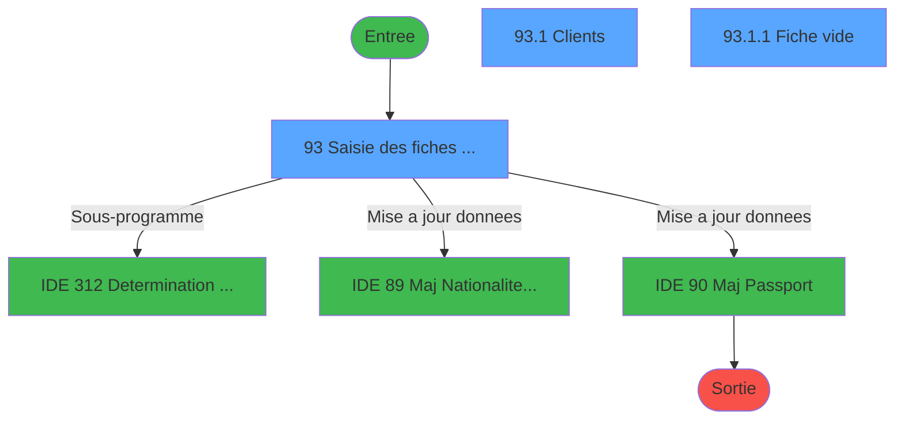
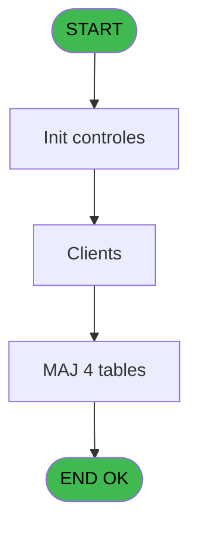
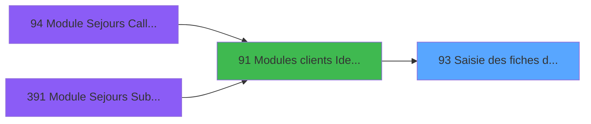
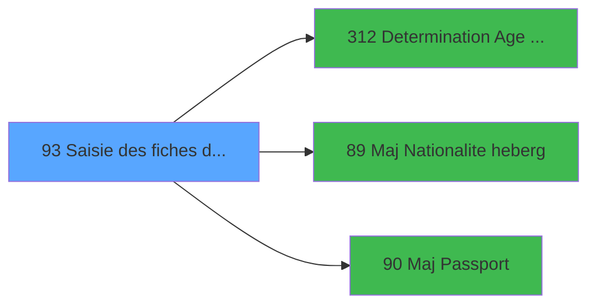

# PBG IDE 93 - Saisie des fiches de police

> **Analyse**: Phases 1-4 2026-02-03 09:18 -> 09:19 (20s) | Assemblage 09:19
> **Pipeline**: V7.2 Enrichi
> **Structure**: 4 onglets (Resume | Ecrans | Donnees | Connexions)

<!-- TAB:Resume -->

## 1. FICHE D'IDENTITE

| Attribut | Valeur |
|----------|--------|
| Projet | PBG |
| IDE Position | 93 |
| Nom Programme | Saisie des fiches de police |
| Fichier source | `Prg_93.xml` |
| Domaine metier | General |
| Taches | 12 (3 ecrans visibles) |
| Tables modifiees | 4 |
| Programmes appeles | 3 |

## 2. DESCRIPTION FONCTIONNELLE

**Saisie des fiches de police** assure la gestion complete de ce processus, accessible depuis [Modules clients Identite (IDE 91)](PBG-IDE-91.md).

Le flux de traitement s'organise en **4 blocs fonctionnels** :

- **Traitement** (6 taches) : traitements metier divers
- **Consultation** (4 taches) : ecrans de recherche, selection et consultation
- **Calcul** (1 tache) : calculs de montants, stocks ou compteurs
- **Saisie** (1 tache) : ecrans de saisie utilisateur (formulaires, champs, donnees)

**Donnees modifiees** : 4 tables en ecriture (hebergement______heb, fi_complet_______gm_go, pv_discount_reasons, Table_1057).

**Logique metier** : 3 regles identifiees couvrant conditions metier.

Detail : phases du traitement

#### Phase 1 : Saisie (1 tache)

- **93** - Saisie des fiches de police **[[ECRAN]](#ecran-t41)**

#### Phase 2 : Traitement (6 taches)

- **93.1** - Clients **[[ECRAN]](#ecran-t49)**
- **93.1.1** - Fiche vide **[[ECRAN]](#ecran-t54)**
- **93.1.1.1** - Vérification zones Maroc
- **93.1.1.2** - Modification autres fichiers
- **93.1.1.2.1** - Modification circuit
- **93.1.1.2.6** - Mah Fiche de police

Delegue a : [Determination Age Debut Sejour (IDE 312)](PBG-IDE-312.md), [  Maj Nationalite heberg (IDE 89)](PBG-IDE-89.md), [  Maj Passport (IDE 90)](PBG-IDE-90.md)

#### Phase 3 : Consultation (4 taches)

- **93.1.1.2.2** - Modif recherche
- **93.1.1.2.3** - Modif recherche
- **93.1.1.2.4** - Modif recherche
- **93.1.1.2.5** - Modif recherche

#### Phase 4 : Calcul (1 tache)

- **93.1.2** - Comptage du nombre de fiches

#### Tables impactees

| Table | Operations | Role metier |
|-------|-----------|-------------|
| hebergement______heb | **W**/L (2 usages) | Hebergement (chambres) |
| pv_discount_reasons | **W** (1 usages) |  |
| Table_1057 | **W** (1 usages) |  |
| fi_complet_______gm_go | **W** (1 usages) |  |

## 3. BLOCS FONCTIONNELS

### 3.1 Saisie (1 tache)

L'operateur saisit les donnees de la transaction via 1 ecran (Saisie des fiches de police).

---

#### 93 - Saisie des fiches de police [[ECRAN]](#ecran-t41)

**Role** : Saisie des donnees : Saisie des fiches de police.
**Ecran** : 849 x 360 DLU (MDI) | [Voir mockup](#ecran-t41)
**Variables liees** : J (v.sélection fiches de police), O (v.n° ecran fiche de police), P (v.Requete selection fiches), Y (CHG_REASON_v.sélection fiches), Z (CHG_PRV_v.sélection fiches de)

### 3.2 Traitement (6 taches)

Traitements internes.

---

#### 93.1 - Clients [[ECRAN]](#ecran-t49)

**Role** : Traitement : Clients.
**Ecran** : 832 x 290 DLU (Modal) | [Voir mockup](#ecran-t49)
**Delegue a** : [Determination Age Debut Sejour (IDE 312)](PBG-IDE-312.md), [  Maj Nationalite heberg (IDE 89)](PBG-IDE-89.md), [  Maj Passport (IDE 90)](PBG-IDE-90.md)

---

#### 93.1.1 - Fiche vide [[ECRAN]](#ecran-t54)

**Role** : Traitement : Fiche vide.
**Ecran** : 464 x 280 DLU | [Voir mockup](#ecran-t54)
**Variables liees** : H (v.afficher uniquement vol), J (v.sélection fiches de police), O (v.n° ecran fiche de police), P (v.Requete selection fiches), Q (v.Nombre de fiche)
**Delegue a** : [Determination Age Debut Sejour (IDE 312)](PBG-IDE-312.md), [  Maj Nationalite heberg (IDE 89)](PBG-IDE-89.md), [  Maj Passport (IDE 90)](PBG-IDE-90.md)

---

#### 93.1.1.1 - Vérification zones Maroc

**Role** : Traitement : Vérification zones Maroc.
**Delegue a** : [Determination Age Debut Sejour (IDE 312)](PBG-IDE-312.md), [  Maj Nationalite heberg (IDE 89)](PBG-IDE-89.md), [  Maj Passport (IDE 90)](PBG-IDE-90.md)

---

#### 93.1.1.2 - Modification autres fichiers

**Role** : Traitement : Modification autres fichiers.
**Delegue a** : [Determination Age Debut Sejour (IDE 312)](PBG-IDE-312.md), [  Maj Nationalite heberg (IDE 89)](PBG-IDE-89.md), [  Maj Passport (IDE 90)](PBG-IDE-90.md)

---

#### 93.1.1.2.1 - Modification circuit

**Role** : Traitement : Modification circuit.
**Delegue a** : [Determination Age Debut Sejour (IDE 312)](PBG-IDE-312.md), [  Maj Nationalite heberg (IDE 89)](PBG-IDE-89.md), [  Maj Passport (IDE 90)](PBG-IDE-90.md)

---

#### 93.1.1.2.6 - Mah Fiche de police

**Role** : Traitement : Mah Fiche de police.
**Variables liees** : H (v.afficher uniquement vol), J (v.sélection fiches de police), O (v.n° ecran fiche de police), P (v.Requete selection fiches), Q (v.Nombre de fiche)
**Delegue a** : [Determination Age Debut Sejour (IDE 312)](PBG-IDE-312.md), [  Maj Nationalite heberg (IDE 89)](PBG-IDE-89.md), [  Maj Passport (IDE 90)](PBG-IDE-90.md)

### 3.3 Consultation (4 taches)

Ecrans de recherche et consultation.

---

#### 93.1.1.2.2 - Modif recherche

**Role** : Traitement : Modif recherche.
**Variables liees** : I (v.recherche client), BC (CHG_REASON_v.recherche client), BD (CHG_PRV_v.recherche client)

---

#### 93.1.1.2.3 - Modif recherche

**Role** : Traitement : Modif recherche.
**Variables liees** : I (v.recherche client), BC (CHG_REASON_v.recherche client), BD (CHG_PRV_v.recherche client)

---

#### 93.1.1.2.4 - Modif recherche

**Role** : Traitement : Modif recherche.
**Variables liees** : I (v.recherche client), BC (CHG_REASON_v.recherche client), BD (CHG_PRV_v.recherche client)

---

#### 93.1.1.2.5 - Modif recherche

**Role** : Traitement : Modif recherche.
**Variables liees** : I (v.recherche client), BC (CHG_REASON_v.recherche client), BD (CHG_PRV_v.recherche client)

### 3.4 Calcul (1 tache)

Calculs metier : montants, stocks, compteurs.

---

#### 93.1.2 - Comptage du nombre de fiches

**Role** : Calcul : Comptage du nombre de fiches.
**Variables liees** : J (v.sélection fiches de police), P (v.Requete selection fiches), Q (v.Nombre de fiche), Y (CHG_REASON_v.sélection fiches), Z (CHG_PRV_v.sélection fiches de)

## 5. REGLES METIER

3 regles identifiees:

### Autres (3 regles)

#### [RM-001] Si CHG_PRV_v.Uniquement_z... [BJ]='01/01/1901'DATE alors Date() sinon CHG_PRV_v.Uniquement_z... [BJ])

| Element | Detail |
|---------|--------|
| **Condition** | `CHG_PRV_v.Uniquement_z... [BJ]='01/01/1901'DATE` |
| **Si vrai** | Date() |
| **Si faux** | CHG_PRV_v.Uniquement_z... [BJ]) |
| **Expression source** | Expression 1 : `IF(CHG_PRV_v.Uniquement_z... [BJ]='01/01/1901'DATE,Date(),CH` |
| **Exemple** | Si CHG_PRV_v.Uniquement_z... [BJ]='01/01/1901'DATE → Date(). Sinon → CHG_PRV_v.Uniquement_z... [BJ]) |

#### [RM-002] Si v.date validité pièce ... [BK]='01/01/1901'DATE alors Date() sinon v.date validité pièce ... [BK])

| Element | Detail |
|---------|--------|
| **Condition** | `v.date validité pièce ... [BK]='01/01/1901'DATE` |
| **Si vrai** | Date() |
| **Si faux** | v.date validité pièce ... [BK]) |
| **Expression source** | Expression 2 : `IF(v.date validité pièce ... [BK]='01/01/1901'DATE,Date(),v.` |
| **Exemple** | Si v.date validité pièce ... [BK]='01/01/1901'DATE → Date(). Sinon → v.date validité pièce ... [BK]) |

#### [RM-003] Condition toujours vraie (flag actif)

| Element | Detail |
|---------|--------|
| **Condition** | `ISNULL(v.CODEPOSTAL à renseig... [BU])` |
| **Si vrai** | 'TRUE'LOG |
| **Si faux** | v.CODEPOSTAL à renseig... [BU]) |
| **Expression source** | Expression 27 : `IF(ISNULL(v.CODEPOSTAL à renseig... [BU]),'TRUE'LOG,v.CODEPO` |
| **Exemple** | Si ISNULL(v.CODEPOSTAL à renseig... [BU]) → 'TRUE'LOG. Sinon → v.CODEPOSTAL à renseig... [BU]) |

## 6. CONTEXTE

- **Appele par**: [Modules clients Identite (IDE 91)](PBG-IDE-91.md)
- **Appelle**: 3 programmes | **Tables**: 11 (W:4 R:3 L:5) | **Taches**: 12 | **Expressions**: 28

<!-- TAB:Ecrans -->

## 8. ECRANS

### 8.1 Forms visibles (3 / 12)

| # | Position | Tache | Nom | Type | Largeur | Hauteur | Bloc |
|---|----------|-------|-----|------|---------|---------|------|
| 1 | 93.1 | 93 | Saisie des fiches de police | MDI | 849 | 360 | Saisie |
| 2 | 93.1.1 | 93.1 | Clients | Modal | 832 | 290 | Traitement |
| 3 | 93.1.1.1 | 93.1.1 | Fiche vide | Type0 | 464 | 280 | Traitement |

### 8.2 Mockups Ecrans

---

#### 93.1 - Saisie des fiches de police
**Tache** : [93](#t41) | **Type** : MDI | **Dimensions** : 849 x 360 DLU
**Bloc** : Saisie | **Titre IDE** : Saisie des fiches de police

<!-- FORM-DATA:
{
    "width":  849,
    "vFactor":  8,
    "type":  "MDI",
    "hFactor":  4,
    "controls":  [
                     {
                         "x":  28,
                         "type":  "label",
                         "var":  "",
                         "y":  24,
                         "w":  77,
                         "fmt":  "",
                         "name":  "",
                         "h":  12,
                         "color":  "6",
                         "text":  "Date d\u0027arrivée",
                         "parent":  10
                     },
                     {
                         "x":  28,
                         "type":  "label",
                         "var":  "",
                         "y":  41,
                         "w":  106,
                         "fmt":  "",
                         "name":  "",
                         "h":  12,
                         "color":  "6",
                         "text":  "Fiches de police",
                         "parent":  10
                     },
                     {
                         "x":  177,
                         "type":  "label",
                         "var":  "",
                         "y":  24,
                         "w":  14,
                         "fmt":  "",
                         "name":  "",
                         "h":  12,
                         "color":  "6",
                         "text":  "au",
                         "parent":  10
                     },
                     {
                         "x":  11,
                         "type":  "label",
                         "var":  "",
                         "y":  8,
                         "w":  828,
                         "fmt":  "",
                         "name":  "",
                         "h":  50,
                         "color":  "6",
                         "text":  "Sélections",
                         "parent":  null
                     },
                     {
                         "x":  279,
                         "type":  "label",
                         "var":  "",
                         "y":  24,
                         "w":  75,
                         "fmt":  "",
                         "name":  "",
                         "h":  12,
                         "color":  "6",
                         "text":  "Uniquement vol",
                         "parent":  10
                     },
                     {
                         "x":  618,
                         "type":  "label",
                         "var":  "",
                         "y":  24,
                         "w":  80,
                         "fmt":  "",
                         "name":  "",
                         "h":  12,
                         "color":  "6",
                         "text":  "Recherche par nom",
                         "parent":  10
                     },
                     {
                         "x":  343,
                         "type":  "label",
                         "var":  "",
                         "y":  40,
                         "w":  75,
                         "fmt":  "",
                         "name":  "",
                         "h":  12,
                         "color":  "6",
                         "text":  "Positionnement sur",
                         "parent":  10
                     },
                     {
                         "x":  618,
                         "type":  "label",
                         "var":  "",
                         "y":  41,
                         "w":  80,
                         "fmt":  "",
                         "name":  "",
                         "h":  12,
                         "color":  "6",
                         "text":  "No Adhérent",
                         "parent":  10
                     },
                     {
                         "x":  114,
                         "type":  "edit",
                         "var":  "",
                         "y":  24,
                         "w":  59,
                         "fmt":  "",
                         "name":  "v.date début séjour",
                         "h":  12,
                         "color":  "6",
                         "text":  "",
                         "parent":  10
                     },
                     {
                         "x":  193,
                         "type":  "edit",
                         "var":  "",
                         "y":  24,
                         "w":  59,
                         "fmt":  "",
                         "name":  "v.date fin séjour",
                         "h":  12,
                         "color":  "6",
                         "text":  "",
                         "parent":  10
                     },
                     {
                         "x":  356,
                         "type":  "combobox",
                         "var":  "",
                         "y":  24,
                         "w":  68,
                         "fmt":  "",
                         "name":  "v.afficher uniquement vol",
                         "h":  12,
                         "color":  "",
                         "text":  "\\ ,?",
                         "parent":  10
                     },
                     {
                         "x":  447,
                         "type":  "checkbox",
                         "var":  "",
                         "y":  24,
                         "w":  150,
                         "fmt":  "",
                         "name":  "\u003eP.Uniquement_zone_obligatoire?",
                         "h":  12,
                         "color":  "6",
                         "text":  "Uniquement les zones obligatoires",
                         "parent":  10
                     },
                     {
                         "x":  713,
                         "type":  "edit",
                         "var":  "",
                         "y":  24,
                         "w":  113,
                         "fmt":  "U30",
                         "name":  "v.recherche client",
                         "h":  12,
                         "color":  "6",
                         "text":  "",
                         "parent":  10
                     },
                     {
                         "x":  114,
                         "type":  "combobox",
                         "var":  "",
                         "y":  40,
                         "w":  138,
                         "fmt":  "",
                         "name":  "v.sélection fiches de police",
                         "h":  12,
                         "color":  "",
                         "text":  "",
                         "parent":  10
                     },
                     {
                         "x":  420,
                         "type":  "combobox",
                         "var":  "",
                         "y":  40,
                         "w":  136,
                         "fmt":  "",
                         "name":  "v.positionnement sur",
                         "h":  12,
                         "color":  "",
                         "text":  "C,T",
                         "parent":  10
                     },
                     {
                         "x":  713,
                         "type":  "edit",
                         "var":  "",
                         "y":  41,
                         "w":  113,
                         "fmt":  "10Z",
                         "name":  "\u003eP.No_Adhérent",
                         "h":  12,
                         "color":  "6",
                         "text":  "",
                         "parent":  10
                     },
                     {
                         "x":  6,
                         "type":  "subform",
                         "var":  "",
                         "y":  60,
                         "w":  836,
                         "fmt":  "",
                         "name":  "Clients",
                         "h":  295,
                         "color":  "",
                         "text":  "",
                         "parent":  null
                     }
                 ],
    "taskId":  "93.1",
    "height":  360
}
-->

<strong>Champs : 8 champs</strong>

| Pos (x,y) | Nom | Variable | Type |
|-----------|-----|----------|------|
| 114,24 | v.date début séjour | - | edit |
| 193,24 | v.date fin séjour | - | edit |
| 356,24 | v.afficher uniquement vol | - | combobox |
| 447,24 | >P.Uniquement_zone_obligatoire? | - | checkbox |
| 713,24 | v.recherche client | - | edit |
| 114,40 | v.sélection fiches de police | - | combobox |
| 420,40 | v.positionnement sur | - | combobox |
| 713,41 | >P.No_Adhérent | - | edit |

---

#### 93.1.1 - Clients
**Tache** : [93.1](#t49) | **Type** : Modal | **Dimensions** : 832 x 290 DLU
**Bloc** : Traitement | **Titre IDE** : Clients

<!-- FORM-DATA:
{
    "width":  832,
    "vFactor":  8,
    "type":  "Modal",
    "hFactor":  4,
    "controls":  [
                     {
                         "x":  0,
                         "type":  "table",
                         "var":  "",
                         "name":  "",
                         "titleH":  12,
                         "color":  "",
                         "w":  357,
                         "y":  0,
                         "fmt":  "",
                         "parent":  null,
                         "text":  "",
                         "rowH":  14,
                         "h":  280,
                         "cols":  [
                                      {
                                          "title":  "Compte/Fil.",
                                          "layer":  1,
                                          "w":  64
                                      },
                                      {
                                          "title":  "Nom",
                                          "layer":  2,
                                          "w":  122
                                      },
                                      {
                                          "title":  "Prénom",
                                          "layer":  3,
                                          "w":  79
                                      },
                                      {
                                          "title":  "Complet",
                                          "layer":  4,
                                          "w":  39
                                      },
                                      {
                                          "title":  "Vol",
                                          "layer":  5,
                                          "w":  36
                                      }
                                  ],
                         "rows":  5
                     },
                     {
                         "x":  32,
                         "type":  "label",
                         "var":  "",
                         "y":  280,
                         "w":  71,
                         "fmt":  "",
                         "name":  "",
                         "h":  9,
                         "color":  "",
                         "text":  "v.Nombre de fiche",
                         "parent":  null
                     },
                     {
                         "x":  4,
                         "type":  "edit",
                         "var":  "",
                         "y":  15,
                         "w":  59,
                         "fmt":  "12",
                         "name":  "heb_num_compte",
                         "h":  10,
                         "color":  "",
                         "text":  "",
                         "parent":  8
                     },
                     {
                         "x":  69,
                         "type":  "edit",
                         "var":  "",
                         "y":  15,
                         "w":  114,
                         "fmt":  "",
                         "name":  "gm_nom",
                         "h":  10,
                         "color":  "",
                         "text":  "",
                         "parent":  8
                     },
                     {
                         "x":  190,
                         "type":  "edit",
                         "var":  "",
                         "y":  15,
                         "w":  76,
                         "fmt":  "",
                         "name":  "gm_prenom",
                         "h":  10,
                         "color":  "",
                         "text":  "",
                         "parent":  8
                     },
                     {
                         "x":  268,
                         "type":  "edit",
                         "var":  "",
                         "y":  15,
                         "w":  35,
                         "fmt":  "30",
                         "name":  "",
                         "h":  10,
                         "color":  "2",
                         "text":  "",
                         "parent":  8
                     },
                     {
                         "x":  307,
                         "type":  "edit",
                         "var":  "",
                         "y":  15,
                         "w":  31,
                         "fmt":  "30",
                         "name":  "tro_iata_depart",
                         "h":  10,
                         "color":  "",
                         "text":  "",
                         "parent":  8
                     },
                     {
                         "x":  360,
                         "type":  "subform",
                         "var":  "",
                         "y":  0,
                         "w":  464,
                         "fmt":  "",
                         "name":  "Fiche de police",
                         "h":  280,
                         "color":  "",
                         "text":  "",
                         "parent":  null
                     },
                     {
                         "x":  104,
                         "type":  "edit",
                         "var":  "",
                         "y":  280,
                         "w":  22,
                         "fmt":  "",
                         "name":  "v.Nombre de fiche",
                         "h":  10,
                         "color":  "",
                         "text":  "",
                         "parent":  null
                     }
                 ],
    "taskId":  "93.1.1",
    "height":  290
}
-->

<strong>Champs : 6 champs</strong>

| Pos (x,y) | Nom | Variable | Type |
|-----------|-----|----------|------|
| 4,15 | heb_num_compte | - | edit |
| 69,15 | gm_nom | - | edit |
| 190,15 | gm_prenom | - | edit |
| 268,15 | 30 | - | edit |
| 307,15 | tro_iata_depart | - | edit |
| 104,280 | v.Nombre de fiche | - | edit |

---

#### 93.1.1.1 - Fiche vide
**Tache** : [93.1.1](#t54) | **Type** : Type0 | **Dimensions** : 464 x 280 DLU
**Bloc** : Traitement | **Titre IDE** : Fiche vide

<!-- FORM-DATA:
{
    "width":  464,
    "vFactor":  8,
    "type":  "Type0",
    "hFactor":  4,
    "controls":  [
                     {
                         "x":  0,
                         "type":  "label",
                         "var":  "",
                         "y":  87,
                         "w":  464,
                         "fmt":  "",
                         "name":  "",
                         "h":  50,
                         "color":  "",
                         "text":  "Ecran non encore defini",
                         "parent":  null
                     }
                 ],
    "taskId":  "93.1.1.1",
    "height":  280
}
-->

## 9. NAVIGATION

### 9.1 Enchainement des ecrans

**Detail par enchainement :**

| Depuis | Action | Vers | Retour |
|--------|--------|------|--------|
| Saisie des fiches de police | Sous-programme | [Determination Age Debut Sejour (IDE 312)](PBG-IDE-312.md) | Retour ecran |
| Saisie des fiches de police | Mise a jour donnees | [  Maj Nationalite heberg (IDE 89)](PBG-IDE-89.md) | Retour ecran |
| Saisie des fiches de police | Mise a jour donnees | [  Maj Passport (IDE 90)](PBG-IDE-90.md) | Retour ecran |

### 9.3 Structure hierarchique (12 taches)

| Position | Tache | Type | Dimensions | Bloc |
|----------|-------|------|------------|------|
| **93.1** | [**Saisie des fiches de police** (93)](#t41) [mockup](#ecran-t41) | MDI | 849x360 | Saisie |
| **93.2** | [**Clients** (93.1)](#t49) [mockup](#ecran-t49) | Modal | 832x290 | Traitement |
| 93.2.1 | [Fiche vide (93.1.1)](#t54) [mockup](#ecran-t54) | - | 464x280 | |
| 93.2.2 | [Vérification zones Maroc (93.1.1.1)](#t57) | - | - | |
| 93.2.3 | [Modification autres fichiers (93.1.1.2)](#t61) | - | - | |
| 93.2.4 | [Modification circuit (93.1.1.2.1)](#t62) | - | - | |
| 93.2.5 | [Mah Fiche de police (93.1.1.2.6)](#t88) | - | - | |
| **93.3** | [**Modif recherche** (93.1.1.2.2)](#t63) | - | - | Consultation |
| 93.3.1 | [Modif recherche (93.1.1.2.3)](#t66) | - | - | |
| 93.3.2 | [Modif recherche (93.1.1.2.4)](#t69) | - | - | |
| 93.3.3 | [Modif recherche (93.1.1.2.5)](#t72) | - | - | |
| **93.4** | [**Comptage du nombre de fiches** (93.1.2)](#t89) | - | - | Calcul |

### 9.4 Algorigramme

> **Legende**: Vert = START/END OK | Rouge = END KO | Bleu = Decisions
> *Algorigramme auto-genere. Utiliser `/algorigramme` pour une synthese metier detaillee.*

<!-- TAB:Donnees -->

## 10. TABLES

### Tables utilisees (11)

| ID | Nom | Description | Type | R | W | L | Usages |
|----|-----|-------------|------|---|---|---|--------|
| 30 | gm-recherche_____gmr | Index de recherche | DB | R |   |   | 2 |
| 31 | gm-complet_______gmc |  | DB |   |   | L | 1 |
| 34 | hebergement______heb | Hebergement (chambres) | DB |   | **W** | L | 2 |
| 36 | client_gm |  | DB |   |   | L | 1 |
| 103 | logement_client__loc |  | DB |   |   | L | 1 |
| 167 | troncon__________tro |  | DB |   |   | L | 1 |
| 168 | heb_circuit______hci | Hebergement (chambres) | DB | R |   |   | 1 |
| 315 | fi_complet_______gm_go |  | DB |   | **W** |   | 1 |
| 382 | pv_discount_reasons |  | DB |   | **W** |   | 1 |
| 1057 | Table_1057 |  | MEM |   | **W** |   | 1 |
| 1070 | Table_1070 |  | MEM | R |   |   | 1 |

### Colonnes par table (5 / 7 tables avec colonnes identifiees)

Table 30 - gm-recherche_____gmr (R) - 2 usages

| Lettre | Variable | Acces | Type |
|--------|----------|-------|------|
| A | >No Adherent | R | Numeric |
| B | >date_deb | R | Date |
| C | >date_fin | R | Date |
| D | >vol | R | Unicode |
| E | >nom client | R | Unicode |
| F | > type fiche | R | Unicode |
| G | > type positionnement | R | Unicode |
| H | >Uniquement_zone_obligatoire? | R | Logical |
| I | e.vol? | R | Logical |
| J | v.afficher client? | R | Logical |
| K | v.vérification complet Turquie? | R | Logical |
| L | v.vérification complet Maroc? | R | Logical |
| M | v.vérification complet Portuga? | R | Logical |
| N | v.Pas Complet? | R | Logical |

Table 34 - hebergement______heb (**W**/L) - 2 usages

*Table utilisee uniquement en Link ou aucune colonne Real identifiee dans le DataView.*

Table 168 - heb_circuit______hci (R) - 1 usages

*Table utilisee uniquement en Link ou aucune colonne Real identifiee dans le DataView.*

Table 315 - fi_complet_______gm_go (**W**) - 1 usages

| Lettre | Variable | Acces | Type |
|--------|----------|-------|------|
| K | v.vérification complet Turquie? | W | Logical |
| L | v.vérification complet Maroc? | W | Logical |
| M | v.vérification complet Portuga? | W | Logical |
| N | v.Pas Complet? | W | Logical |

Table 382 - pv_discount_reasons (**W**) - 1 usages

*Table utilisee uniquement en Link ou aucune colonne Real identifiee dans le DataView.*

Table 1057 - Table_1057 (**W**) - 1 usages

*Table utilisee uniquement en Link ou aucune colonne Real identifiee dans le DataView.*

Table 1070 - Table_1070 (R) - 1 usages

| Lettre | Variable | Acces | Type |
|--------|----------|-------|------|
| A | p.compte | R | Numeric |
| B | p.filiation | R | Numeric |
| C | p.uniquement_zone_obligatoire | R | Logical |
| D | v.Date de naissance | R | Date |
| E | v.DATENAISSANCE à renseigner? | R | Logical |
| F | v.DATENAISSANCE KO? | R | Logical |
| G | v.pays de naissance | R | Unicode |
| H | v.PAYSNAISSANCE à renseigner? | R | Logical |
| I | v.PAYSNAISSANCE KO? | R | Logical |
| J | e.pays naissance? | R | Logical |
| K | v.code Nationalité | R | Unicode |
| L | v.NATIONALITE à renseigner? | R | Logical |
| M | v.NATIONALITE KO? | R | Logical |
| N | e.nationalité? | R | Logical |
| O | v.est Turc? | R | Logical |
| P | v.Ville de naissance | R | Unicode |
| Q | v.VILLENAISSANCE à renseigner? | R | Logical |
| R | v.VILLENAISSANCE KO? | R | Logical |
| S | v.N° immatriculation | R | Unicode |
| T | v.IMMATRICULATION à renseigner? | R | Logical |
| U | v.IMMATRICULATION KO? | R | Logical |
| V | v.code Sexe | R | Unicode |
| W | v.SEXE à renseigner? | R | Logical |
| X | v.SEXE KO? | R | Logical |
| Y | v.piece_ID | R | Unicode |
| Z | v.TYPEPIECE à renseigner? | R | Logical |
| BA | v.TYPEPIECE KO? | R | Logical |
| BB | v.N° pièce | R | Unicode |
| BC | v.NOPIECE à renseigner? | R | Logical |
| BD | v.NOPIECE KO? | R | Logical |
| BE | v.lieu d'émission pièce ident. | R | Unicode |
| BF | v.LIEUEMISSION à renseigner? | R | Logical |
| BG | v.LIEUEMISSION KO? | R | Logical |
| BH | v.date d'émission pièce identit | R | Date |
| BI | v.DATEEMISSION à renseigner? | R | Logical |
| BJ | v.DATEEMISSION KO? | R | Logical |
| BK | v.date validité pièce identité | R | Date |
| BL | v.DATEVALIDE à renseigner? | R | Logical |
| BM | v.DATEVALIDE KO? | R | Logical |
| BN | v.nom de la rue | R | Unicode |
| BO | v.NOMRUE à renseigner? | R | Logical |
| BP | v.NOMRUE KO? | R | Logical |
| BQ | v.num dans la rue | R | Unicode |
| BR | v.NUMRUE à renseigner? | R | Logical |
| BS | v.NUMRUE KO? | R | Logical |
| BT | v.code postal | R | Unicode |
| BU | v.CODEPOSTAL à renseigner? | R | Logical |
| BV | v.CODEPOSTAL KO? | R | Logical |
| BW | v.nom commune | R | Unicode |
| BX | v.VILLE à renseigner? | R | Logical |
| BY | v.VILLE KO? | R | Logical |
| BZ | v.numéro dossier | R | Numeric |
| CA | v.NODOSSIER à renseigner? | R | Logical |
| CB | v.NODOSSIER KO? | R | Logical |
| CC | v.Pays de résidence | R | Unicode |
| CD | v.PAYSRESIDENCE à renseigner? | R | Logical |
| CE | v.PAYSRESIDENCE KO? | R | Logical |
| CF | e.pays de résidence existe? | R | Logical |
| CG | v.Pays émisson | R | Unicode |
| CH | v.PAYSEMISSION à renseigner? | R | Logical |
| CI | v.PAYSEMISSION KO? | R | Logical |
| CJ | e.pays émission existe? | R | Logical |
| CK | b.Valider | R | Unicode |
| CL | b.Annuler | R | Unicode |
| CM | b.Retour valeur | R | Numeric |
| CN | v.Enreg déjà enregistré? | R | Logical |
| CO | CHG_REASON_v.Date de naissance | R | Numeric |
| CP | CHG_PRV_v.Date de naissance | R | Date |
| CQ | CHG_REASON_v.pays de naissance | R | Numeric |
| CR | CHG_PRV_v.pays de naissance | R | Unicode |
| CS | CHG_REASON_v.Nationalité | R | Numeric |
| CT | CHG_PRV_v.Nationalité | R | Unicode |
| CU | CHG_REASON_v.Ville de naissanc | R | Numeric |
| CV | CHG_PRV_v.Ville de naissance | R | Unicode |
| CW | CHG_REASON_v.N° immatriculatio | R | Numeric |
| CX | CHG_PRV_v.N° immatriculation | R | Unicode |
| CY | CHG_REASON_v.code Sexe | R | Numeric |
| CZ | CHG_PRV_v.code Sexe | R | Unicode |
| DA | CHG_REASON_v.Type pièce d'iden | R | Numeric |
| DB | CHG_PRV_v.Type pièce d'identit | R | Unicode |
| DC | CHG_REASON_v.N° pièce | R | Numeric |
| DD | CHG_PRV_v.N° pièce | R | Unicode |
| DE | CHG_REASON_v.lieu d'émission p | R | Numeric |
| DF | CHG_PRV_v.lieu d'émission pièc | R | Unicode |
| DG | CHG_REASON_v.date d'émission p | R | Numeric |
| DH | CHG_PRV_v.date d'émission pièc | R | Date |
| DI | CHG_REASON_v.date validité piè | R | Numeric |
| DJ | CHG_PRV_v.date validité pièce | R | Date |
| DK | CHG_REASON_v.date d'émission p | R | Numeric |
| DL | CHG_PRV_v.date d'émission pièc | R | Date |
| DM | CHG_REASON_v.nom de la rue | R | Numeric |
| DN | CHG_PRV_v.nom de la rue | R | Unicode |
| DO | CHG_REASON_v.num dans la rue | R | Numeric |
| DP | CHG_PRV_v.num dans la rue | R | Unicode |
| DQ | CHG_REASON_v.code postal | R | Numeric |
| DR | CHG_PRV_v.code postal | R | Unicode |
| DS | CHG_REASON_v.nom commune | R | Numeric |
| DT | CHG_PRV_v.nom commune | R | Unicode |
| DU | CHG_REASON_v.numéro dossier | R | Numeric |
| DV | CHG_PRV_v.numéro dossier | R | Numeric |
| DW | CHG_REASON_v.Pays de résidence | R | Numeric |
| DX | CHG_PRV_v.Pays de résidence | R | Unicode |
| DY | CHG_REASON_v.Pays émisson | R | Numeric |
| DZ | CHG_PRV_v.Pays émisson | R | Unicode |

## 11. VARIABLES

### 11.1 Variables de session (40)

Variables persistantes pendant toute la session.

| Lettre | Nom | Type | Usage dans |
|--------|-----|------|-----------|
| F | v.date début séjour | Date | - |
| G | v.date fin séjour | Date | - |
| H | v.afficher uniquement vol | Unicode | - |
| I | v.recherche client | Unicode | - |
| J | v.sélection fiches de police | Unicode | - |
| K | v.Uniquement_zone_obligatoire? | Logical | - |
| L | v.positionnement sur | Unicode | - |
| M | v.No Adherent | Numeric | 2x session |
| N | v.Filtre initialisé? | Logical | - |
| O | v.n° ecran fiche de police | Numeric | - |
| P | v.Requete selection fiches | Unicode | - |
| Q | v.Nombre de fiche | Numeric | - |
| R | v.Ecran en français? | Logical | - |
| S | v.Nom (en cours) | Unicode | - |
| T | v.Prénom (en cours) | Unicode | - |
| BK | v.date validité pièce identité | Date | - |
| BL | v.DATEVALIDE à renseigner? | Logical | - |
| BM | v.DATEVALIDE KO? | Logical | - |
| BN | v.nom de la rue | Unicode | - |
| BO | v.NOMRUE à renseigner? | Logical | - |
| BP | v.NOMRUE KO? | Logical | - |
| BQ | v.num dans la rue | Unicode | - |
| BR | v.NUMRUE à renseigner? | Logical | - |
| BS | v.NUMRUE KO? | Logical | - |
| BT | v.code postal | Unicode | - |
| BU | v.CODEPOSTAL à renseigner? | Logical | - |
| BV | v.CODEPOSTAL KO? | Logical | - |
| BW | v.nom commune | Unicode | - |
| BX | v.VILLE à renseigner? | Logical | - |
| BY | v.VILLE KO? | Logical | - |
| BZ | v.numéro dossier | Numeric | - |
| CA | v.NODOSSIER à renseigner? | Logical | - |
| CB | v.NODOSSIER KO? | Logical | - |
| CC | v.Pays de résidence | Unicode | - |
| CD | v.PAYSRESIDENCE à renseigner? | Logical | - |
| CE | v.PAYSRESIDENCE KO? | Logical | - |
| CG | v.Pays émisson | Unicode | - |
| CH | v.PAYSEMISSION à renseigner? | Logical | - |
| CI | v.PAYSEMISSION KO? | Logical | - |
| CN | v.Enreg déjà enregistré? | Logical | - |

### 11.2 Autres (64)

Variables diverses.

| Lettre | Nom | Type | Usage dans |
|--------|-----|------|-----------|
| A | >P.No_Adhérent | Numeric | 2x refs |
| B | >P.Filiation (Locate) | Numeric | 2x refs |
| C | >P.Date début Arrivée | Date | 1x refs |
| D | >P.Date Fin Arrivée | Date | 1x refs |
| E | >P.Uniquement_zone_obligatoire? | Logical | - |
| U | CHG_REASON_v.date début séjour | Numeric | - |
| V | CHG_PRV_v.date début séjour | Date | - |
| W | CHG_REASON_v.date fin séjour | Numeric | - |
| X | CHG_PRV_v.date fin séjour | Date | - |
| Y | CHG_REASON_v.sélection fiches | Numeric | - |
| Z | CHG_PRV_v.sélection fiches de | Unicode | - |
| BA | CHG_REASON_v.afficher uniqueme | Numeric | - |
| BB | CHG_PRV_v.afficher uniquement | Unicode | - |
| BC | CHG_REASON_v.recherche client | Numeric | - |
| BD | CHG_PRV_v.recherche client | Unicode | - |
| BE | CHG_REASON_v.positionnement su | Numeric | - |
| BF | CHG_PRV_v.positionnement sur | Unicode | - |
| BG | CHG_REASON_v.No Adherent | Numeric | 2x refs |
| BH | CHG_PRV_v.No Adherent | Numeric | - |
| BI | CHG_REASON_v.Uniquement_zone_o | Numeric | - |
| BJ | CHG_PRV_v.Uniquement_zone_obli | Logical | - |
| CF | e.pays de résidence existe? | Logical | - |
| CJ | e.pays émission existe? | Logical | - |
| CK | b.Valider | Unicode | - |
| CL | b.Annuler | Unicode | - |
| CM | b.Retour valeur | Numeric | - |
| CO | CHG_REASON_v.Date de naissance | Numeric | - |
| CP | CHG_PRV_v.Date de naissance | Date | - |
| CQ | CHG_REASON_v.pays de naissance | Numeric | - |
| CR | CHG_PRV_v.pays de naissance | Unicode | - |
| CS | CHG_REASON_v.Nationalité | Numeric | - |
| CT | CHG_PRV_v.Nationalité | Unicode | - |
| CU | CHG_REASON_v.Ville de naissanc | Numeric | - |
| CV | CHG_PRV_v.Ville de naissance | Unicode | - |
| CW | CHG_REASON_v.N° immatriculatio | Numeric | - |
| CX | CHG_PRV_v.N° immatriculation | Unicode | - |
| CY | CHG_REASON_v.code Sexe | Numeric | - |
| CZ | CHG_PRV_v.code Sexe | Unicode | - |
| DA | CHG_REASON_v.Type pièce d'iden | Numeric | - |
| DB | CHG_PRV_v.Type pièce d'identit | Unicode | - |
| DC | CHG_REASON_v.N° pièce | Numeric | - |
| DD | CHG_PRV_v.N° pièce | Unicode | - |
| DE | CHG_REASON_v.lieu d'émission p | Numeric | - |
| DF | CHG_PRV_v.lieu d'émission pièc | Unicode | - |
| DG | CHG_REASON_v.date d'émission p | Numeric | - |
| DH | CHG_PRV_v.date d'émission pièc | Date | - |
| DI | CHG_REASON_v.date validité piè | Numeric | - |
| DJ | CHG_PRV_v.date validité pièce | Date | - |
| DK | CHG_REASON_v.date d'émission p | Numeric | - |
| DL | CHG_PRV_v.date d'émission pièc | Date | - |
| DM | CHG_REASON_v.nom de la rue | Numeric | - |
| DN | CHG_PRV_v.nom de la rue | Unicode | - |
| DO | CHG_REASON_v.num dans la rue | Numeric | - |
| DP | CHG_PRV_v.num dans la rue | Unicode | - |
| DQ | CHG_REASON_v.code postal | Numeric | - |
| DR | CHG_PRV_v.code postal | Unicode | - |
| DS | CHG_REASON_v.nom commune | Numeric | - |
| DT | CHG_PRV_v.nom commune | Unicode | - |
| DU | CHG_REASON_v.numéro dossier | Numeric | - |
| DV | CHG_PRV_v.numéro dossier | Numeric | - |
| DW | CHG_REASON_v.Pays de résidence | Numeric | - |
| DX | CHG_PRV_v.Pays de résidence | Unicode | - |
| DY | CHG_REASON_v.Pays émisson | Numeric | - |
| DZ | CHG_PRV_v.Pays émisson | Unicode | - |

Toutes les 104 variables (liste complete)

| Cat | Lettre | Nom Variable | Type |
|-----|--------|--------------|------|
| V. | **F** | v.date début séjour | Date |
| V. | **G** | v.date fin séjour | Date |
| V. | **H** | v.afficher uniquement vol | Unicode |
| V. | **I** | v.recherche client | Unicode |
| V. | **J** | v.sélection fiches de police | Unicode |
| V. | **K** | v.Uniquement_zone_obligatoire? | Logical |
| V. | **L** | v.positionnement sur | Unicode |
| V. | **M** | v.No Adherent | Numeric |
| V. | **N** | v.Filtre initialisé? | Logical |
| V. | **O** | v.n° ecran fiche de police | Numeric |
| V. | **P** | v.Requete selection fiches | Unicode |
| V. | **Q** | v.Nombre de fiche | Numeric |
| V. | **R** | v.Ecran en français? | Logical |
| V. | **S** | v.Nom (en cours) | Unicode |
| V. | **T** | v.Prénom (en cours) | Unicode |
| V. | **BK** | v.date validité pièce identité | Date |
| V. | **BL** | v.DATEVALIDE à renseigner? | Logical |
| V. | **BM** | v.DATEVALIDE KO? | Logical |
| V. | **BN** | v.nom de la rue | Unicode |
| V. | **BO** | v.NOMRUE à renseigner? | Logical |
| V. | **BP** | v.NOMRUE KO? | Logical |
| V. | **BQ** | v.num dans la rue | Unicode |
| V. | **BR** | v.NUMRUE à renseigner? | Logical |
| V. | **BS** | v.NUMRUE KO? | Logical |
| V. | **BT** | v.code postal | Unicode |
| V. | **BU** | v.CODEPOSTAL à renseigner? | Logical |
| V. | **BV** | v.CODEPOSTAL KO? | Logical |
| V. | **BW** | v.nom commune | Unicode |
| V. | **BX** | v.VILLE à renseigner? | Logical |
| V. | **BY** | v.VILLE KO? | Logical |
| V. | **BZ** | v.numéro dossier | Numeric |
| V. | **CA** | v.NODOSSIER à renseigner? | Logical |
| V. | **CB** | v.NODOSSIER KO? | Logical |
| V. | **CC** | v.Pays de résidence | Unicode |
| V. | **CD** | v.PAYSRESIDENCE à renseigner? | Logical |
| V. | **CE** | v.PAYSRESIDENCE KO? | Logical |
| V. | **CG** | v.Pays émisson | Unicode |
| V. | **CH** | v.PAYSEMISSION à renseigner? | Logical |
| V. | **CI** | v.PAYSEMISSION KO? | Logical |
| V. | **CN** | v.Enreg déjà enregistré? | Logical |
| Autre | **A** | >P.No_Adhérent | Numeric |
| Autre | **B** | >P.Filiation (Locate) | Numeric |
| Autre | **C** | >P.Date début Arrivée | Date |
| Autre | **D** | >P.Date Fin Arrivée | Date |
| Autre | **E** | >P.Uniquement_zone_obligatoire? | Logical |
| Autre | **U** | CHG_REASON_v.date début séjour | Numeric |
| Autre | **V** | CHG_PRV_v.date début séjour | Date |
| Autre | **W** | CHG_REASON_v.date fin séjour | Numeric |
| Autre | **X** | CHG_PRV_v.date fin séjour | Date |
| Autre | **Y** | CHG_REASON_v.sélection fiches | Numeric |
| Autre | **Z** | CHG_PRV_v.sélection fiches de | Unicode |
| Autre | **BA** | CHG_REASON_v.afficher uniqueme | Numeric |
| Autre | **BB** | CHG_PRV_v.afficher uniquement | Unicode |
| Autre | **BC** | CHG_REASON_v.recherche client | Numeric |
| Autre | **BD** | CHG_PRV_v.recherche client | Unicode |
| Autre | **BE** | CHG_REASON_v.positionnement su | Numeric |
| Autre | **BF** | CHG_PRV_v.positionnement sur | Unicode |
| Autre | **BG** | CHG_REASON_v.No Adherent | Numeric |
| Autre | **BH** | CHG_PRV_v.No Adherent | Numeric |
| Autre | **BI** | CHG_REASON_v.Uniquement_zone_o | Numeric |
| Autre | **BJ** | CHG_PRV_v.Uniquement_zone_obli | Logical |
| Autre | **CF** | e.pays de résidence existe? | Logical |
| Autre | **CJ** | e.pays émission existe? | Logical |
| Autre | **CK** | b.Valider | Unicode |
| Autre | **CL** | b.Annuler | Unicode |
| Autre | **CM** | b.Retour valeur | Numeric |
| Autre | **CO** | CHG_REASON_v.Date de naissance | Numeric |
| Autre | **CP** | CHG_PRV_v.Date de naissance | Date |
| Autre | **CQ** | CHG_REASON_v.pays de naissance | Numeric |
| Autre | **CR** | CHG_PRV_v.pays de naissance | Unicode |
| Autre | **CS** | CHG_REASON_v.Nationalité | Numeric |
| Autre | **CT** | CHG_PRV_v.Nationalité | Unicode |
| Autre | **CU** | CHG_REASON_v.Ville de naissanc | Numeric |
| Autre | **CV** | CHG_PRV_v.Ville de naissance | Unicode |
| Autre | **CW** | CHG_REASON_v.N° immatriculatio | Numeric |
| Autre | **CX** | CHG_PRV_v.N° immatriculation | Unicode |
| Autre | **CY** | CHG_REASON_v.code Sexe | Numeric |
| Autre | **CZ** | CHG_PRV_v.code Sexe | Unicode |
| Autre | **DA** | CHG_REASON_v.Type pièce d'iden | Numeric |
| Autre | **DB** | CHG_PRV_v.Type pièce d'identit | Unicode |
| Autre | **DC** | CHG_REASON_v.N° pièce | Numeric |
| Autre | **DD** | CHG_PRV_v.N° pièce | Unicode |
| Autre | **DE** | CHG_REASON_v.lieu d'émission p | Numeric |
| Autre | **DF** | CHG_PRV_v.lieu d'émission pièc | Unicode |
| Autre | **DG** | CHG_REASON_v.date d'émission p | Numeric |
| Autre | **DH** | CHG_PRV_v.date d'émission pièc | Date |
| Autre | **DI** | CHG_REASON_v.date validité piè | Numeric |
| Autre | **DJ** | CHG_PRV_v.date validité pièce | Date |
| Autre | **DK** | CHG_REASON_v.date d'émission p | Numeric |
| Autre | **DL** | CHG_PRV_v.date d'émission pièc | Date |
| Autre | **DM** | CHG_REASON_v.nom de la rue | Numeric |
| Autre | **DN** | CHG_PRV_v.nom de la rue | Unicode |
| Autre | **DO** | CHG_REASON_v.num dans la rue | Numeric |
| Autre | **DP** | CHG_PRV_v.num dans la rue | Unicode |
| Autre | **DQ** | CHG_REASON_v.code postal | Numeric |
| Autre | **DR** | CHG_PRV_v.code postal | Unicode |
| Autre | **DS** | CHG_REASON_v.nom commune | Numeric |
| Autre | **DT** | CHG_PRV_v.nom commune | Unicode |
| Autre | **DU** | CHG_REASON_v.numéro dossier | Numeric |
| Autre | **DV** | CHG_PRV_v.numéro dossier | Numeric |
| Autre | **DW** | CHG_REASON_v.Pays de résidence | Numeric |
| Autre | **DX** | CHG_PRV_v.Pays de résidence | Unicode |
| Autre | **DY** | CHG_REASON_v.Pays émisson | Numeric |
| Autre | **DZ** | CHG_PRV_v.Pays émisson | Unicode |

## 12. EXPRESSIONS

**28 / 28 expressions decodees (100%)**

### 12.1 Repartition par type

| Type | Expressions | Regles |
|------|-------------|--------|
| CONDITION | 10 | 2 |
| CAST_LOGIQUE | 4 | 5 |
| CONSTANTE | 6 | 0 |
| OTHER | 8 | 0 |

### 12.2 Expressions cles par type

#### CONDITION (10 expressions)

| Type | IDE | Expression | Regle |
|------|-----|------------|-------|
| CONDITION | 1 | `IF(CHG_PRV_v.Uniquement_z... [BJ]='01/01/1901'DATE,Date(),CHG_PRV_v.Uniquement_z... [BJ])` | [RM-001](#rm-RM-001) |
| CONDITION | 2 | `IF(v.date validité pièce ... [BK]='01/01/1901'DATE,Date(),v.date validité pièce ... [BK])` | [RM-002](#rm-RM-002) |
| CONDITION | 13 | `>P.Date Fin Arrivée [D]=0` | - |
| CONDITION | 25 | `CHG_REASON_v.No Adherent [BG]<>0` | - |
| CONDITION | 22 | `Trim(VG64)='FRA'` | - |
| ... | | *+5 autres* | |

#### CAST_LOGIQUE (4 expressions)

| Type | IDE | Expression | Regle |
|------|-----|------------|-------|
| CAST_LOGIQUE | 27 | `IF(ISNULL(v.CODEPOSTAL à renseig... [BU]),'TRUE'LOG,v.CODEPOSTAL à renseig... [BU])` | [RM-003](#rm-RM-003) |
| CAST_LOGIQUE | 15 | `'FALSE'LOG` | - |
| CAST_LOGIQUE | 14 | `'TRUE'LOG` | - |
| CAST_LOGIQUE | 6 | `CASE('TRUE'LOG,VG84,5,VG150,8,VG85,6,VG90,7,4)` | - |

#### CONSTANTE (6 expressions)

| Type | IDE | Expression | Regle |
|------|-----|------------|-------|
| CONSTANTE | 11 | `''` | - |
| CONSTANTE | 17 | `'Clients'` | - |
| CONSTANTE | 21 | `'A'` | - |
| CONSTANTE | 7 | `'I,C,T'` | - |
| CONSTANTE | 8 | `'T'` | - |
| ... | | *+1 autres* | |

#### OTHER (8 expressions)

| Type | IDE | Expression | Regle |
|------|-----|------------|-------|
| OTHER | 23 | `SetParam ('LANGUE','F')` | - |
| OTHER | 18 | `GetParam('SOCIETE')` | - |
| OTHER | 26 | `CHG_REASON_v.No Adherent [BG]` | - |
| OTHER | 24 | `ISNULL(GetParam ('LANGUE'))` | - |
| OTHER | 4 | `MlsTrans('Tous,Aucun')` | - |
| ... | | *+3 autres* | |

### 12.3 Toutes les expressions (28)

Voir les 28 expressions

#### CONDITION (10)

| IDE | Expression Decodee |
|-----|-------------------|
| 19 | `CndRange(>P.No_Adhérent [A]<>'00/00/0000'DATE,>P.No_Adhérent [A])` |
| 20 | `CndRange(>P.Filiation (Locate) [B]<>'00/00/0000'DATE,>P.Filiation (Locate) [B])` |
| 28 | `>P.Filiation (Locate) [B]='00/00/0000'DATE` |
| 1 | `IF(CHG_PRV_v.Uniquement_z... [BJ]='01/01/1901'DATE,Date(),CHG_PRV_v.Uniquement_z... [BJ])` |
| 2 | `IF(v.date validité pièce ... [BK]='01/01/1901'DATE,Date(),v.date validité pièce ... [BK])` |
| 10 | `>P.No_Adhérent [A]` |
| 13 | `>P.Date Fin Arrivée [D]=0` |
| 25 | `CHG_REASON_v.No Adherent [BG]<>0` |
| 12 | `Trim(>P.Date début Arrivée [C])='T' AND [AG]=0` |
| 22 | `Trim(VG64)='FRA'` |

#### CAST_LOGIQUE (4)

| IDE | Expression Decodee |
|-----|-------------------|
| 6 | `CASE('TRUE'LOG,VG84,5,VG150,8,VG85,6,VG90,7,4)` |
| 27 | `IF(ISNULL(v.CODEPOSTAL à renseig... [BU]),'TRUE'LOG,v.CODEPOSTAL à renseig... [BU])` |
| 14 | `'TRUE'LOG` |
| 15 | `'FALSE'LOG` |

#### CONSTANTE (6)

| IDE | Expression Decodee |
|-----|-------------------|
| 7 | `'I,C,T'` |
| 8 | `'T'` |
| 9 | `'C'` |
| 11 | `''` |
| 17 | `'Clients'` |
| 21 | `'A'` |

#### OTHER (8)

| IDE | Expression Decodee |
|-----|-------------------|
| 3 | `MlsTrans('Fiches incomplètes,Fiches complètes,Toutes les fiches')` |
| 4 | `MlsTrans('Tous,Aucun')` |
| 5 | `MlsTrans('Champs non renseignés,Tous les champs')` |
| 16 | `[AV]` |
| 18 | `GetParam('SOCIETE')` |
| 23 | `SetParam ('LANGUE','F')` |
| 24 | `ISNULL(GetParam ('LANGUE'))` |
| 26 | `CHG_REASON_v.No Adherent [BG]` |

<!-- TAB:Connexions -->

## 13. GRAPHE D'APPELS

### 13.1 Chaine depuis Main (Callers)

Main -> ... -> [Modules clients Identite (IDE 91)](PBG-IDE-91.md) -> **Saisie des fiches de police (IDE 93)**

### 13.2 Callers

| IDE | Nom Programme | Nb Appels |
|-----|---------------|-----------|
| [91](PBG-IDE-91.md) | Modules clients Identite | 1 |

### 13.3 Callees (programmes appeles)

### 13.4 Detail Callees avec contexte

| IDE | Nom Programme | Appels | Contexte |
|-----|---------------|--------|----------|
| [312](PBG-IDE-312.md) | Determination Age Debut Sejour | 3 | Sous-programme |
| [89](PBG-IDE-89.md) |   Maj Nationalite heberg | 1 | Mise a jour donnees |
| [90](PBG-IDE-90.md) |   Maj Passport | 1 | Mise a jour donnees |

## 14. RECOMMANDATIONS MIGRATION

### 14.1 Profil du programme

| Metrique | Valeur | Impact migration |
|----------|--------|-----------------|
| Lignes de logique | 828 | Programme volumineux |
| Expressions | 28 | Peu de logique |
| Tables WRITE | 4 | Impact modere |
| Sous-programmes | 3 | Peu de dependances |
| Ecrans visibles | 3 | Quelques ecrans |
| Code desactive | 0.1% (1 / 828) | Code sain |
| Regles metier | 3 | Quelques regles a preserver |

### 14.2 Plan de migration par bloc

#### Saisie (1 tache: 1 ecran, 0 traitement)

- **Strategie** : Formulaire React/Blazor avec validation Zod/FluentValidation.
- Reproduire 1 ecran : Saisie des fiches de police
- Validation temps reel cote client + serveur

#### Traitement (6 taches: 2 ecrans, 4 traitements)

- **Strategie** : Orchestrateur avec 2 ecrans (Razor/React) et 4 traitements backend (services).
- Les ecrans deviennent des composants UI, les traitements invisibles deviennent des services injectables.
- 3 sous-programme(s) a migrer ou a reutiliser depuis les services existants.
- Decomposer les taches en services unitaires testables.

#### Consultation (4 taches: 0 ecran, 4 traitements)

- **Strategie** : Composants de recherche/selection en modales.

#### Calcul (1 tache: 0 ecran, 1 traitement)

- **Strategie** : Services de calcul purs (Domain Services).
- Migrer la logique de calcul (stock, compteurs, montants)

### 14.3 Dependances critiques

| Dependance | Type | Appels | Impact |
|------------|------|--------|--------|
| hebergement______heb | Table WRITE (Database) | 1x | Schema + repository |
| fi_complet_______gm_go | Table WRITE (Database) | 1x | Schema + repository |
| pv_discount_reasons | Table WRITE (Database) | 1x | Schema + repository |
| Table_1057 | Table WRITE (Memory) | 1x | Schema + repository |
| [Determination Age Debut Sejour (IDE 312)](PBG-IDE-312.md) | Sous-programme | 3x | **CRITIQUE** - Sous-programme |
| [  Maj Passport (IDE 90)](PBG-IDE-90.md) | Sous-programme | 1x | Normale - Mise a jour donnees |
| [  Maj Nationalite heberg (IDE 89)](PBG-IDE-89.md) | Sous-programme | 1x | Normale - Mise a jour donnees |

---
*Spec DETAILED generee par Pipeline V7.2 - 2026-02-03 09:19*
