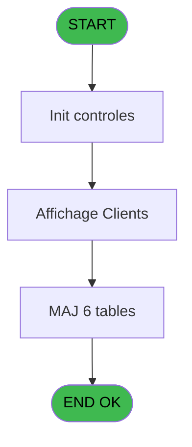
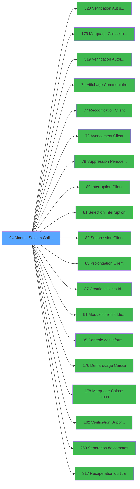

# PBG IDE 94 - Module Sejours CallTask

> **Analyse**: Phases 1-4 2026-02-03 09:19 -> 09:19 (19s) | Assemblage 09:19
> **Pipeline**: V7.2 Enrichi
> **Structure**: 4 onglets (Resume | Ecrans | Donnees | Connexions)

<!-- TAB:Resume -->

## 1. FICHE D'IDENTITE

| Attribut | Valeur |
|----------|--------|
| Projet | PBG |
| IDE Position | 94 |
| Nom Programme | Module Sejours CallTask |
| Fichier source | `Prg_94.xml` |
| Domaine metier | General |
| Taches | 19 (7 ecrans visibles) |
| Tables modifiees | 6 |
| Programmes appeles | 19 |
| :warning: Statut | **ORPHELIN_POTENTIEL** |

## 2. DESCRIPTION FONCTIONNELLE

**Module Sejours CallTask** assure la gestion complete de ce processus.

Le flux de traitement s'organise en **4 blocs fonctionnels** :

- **Traitement** (8 taches) : traitements metier divers
- **Consultation** (5 taches) : ecrans de recherche, selection et consultation
- **Validation** (3 taches) : controles et verifications de coherence
- **Calcul** (3 taches) : calculs de montants, stocks ou compteurs

**Donnees modifiees** : 6 tables en ecriture (hebergement______heb, compteurs________cpt, mouchard_________mou, ez_card, fi_complet_______gm_go, pms_print_param).

Detail : phases du traitement

#### Phase 1 : Traitement (8 taches)

- **94** - Module des Sejours **[[ECRAN]](#ecran-t1)**
- **94.1** - Determination Age Bebe
- **94.2** - Planning sejours **[[ECRAN]](#ecran-t4)**
- **94.2.2.1** - Recuperation date d/f
- **94.2.5** - Demande de confirmation **[[ECRAN]](#ecran-t13)**
- **94.2.6** - Tracage Suppression
- **94.2.6.2** - Tracage
- **94.2.10** - Suppression carte

Delegue a : [Marquage Caisse logique (IDE 179)](PBG-IDE-179.md), [   Recodification Client (IDE 77)](PBG-IDE-77.md), [   Avancement Client (IDE 78)](PBG-IDE-78.md), [   Suppression Periode Client (IDE 79)](PBG-IDE-79.md), [   Interruption Client (IDE 80)](PBG-IDE-80.md), [   Suppression Client (IDE 82)](PBG-IDE-82.md), [   Prolongation Client (IDE 83)](PBG-IDE-83.md), [Modules clients Identite (IDE 91)](PBG-IDE-91.md), [Contrôle des informations (IDE 95)](PBG-IDE-95.md), [Demarquage Caisse (IDE 176)](PBG-IDE-176.md), [Marquage Caisse alpha (IDE 178)](PBG-IDE-178.md), [Recuperation du titre (IDE 317)](PBG-IDE-317.md)

#### Phase 2 : Consultation (5 taches)

- **94.2.1** - Recherche **[[ECRAN]](#ecran-t5)**
- **94.2.2** - Affichage Periodes **[[ECRAN]](#ecran-t7)**
- **94.2.7** - Recherche **[[ECRAN]](#ecran-t18)**
- **94.2.8** - Recherche Prenom **[[ECRAN]](#ecran-t19)**
- **94.2.12** - Affichage Absences **[[ECRAN]](#ecran-t25)**

Delegue a : [   Affichage Commentaire (IDE 74)](PBG-IDE-74.md), [   Selection Interruption (IDE 81)](PBG-IDE-81.md), [Recuperation du titre (IDE 317)](PBG-IDE-317.md)

#### Phase 3 : Calcul (3 taches)

- **94.2.2.2** - Calcul Date Grecques
- **94.2.6.1** - Compteur
- **94.2.9** - Calcul Date Grecques

Delegue a : [Separation de comptes (IDE 269)](PBG-IDE-269.md)

#### Phase 4 : Validation (3 taches)

- **94.2.3** - Verification Nb Filiation
- **94.2.4** - Controle Cloture Caisse
- **94.2.11** - Verif validation

Delegue a : [Verification Aut sans ecran (IDE 320)](PBG-IDE-320.md), [Verification Autorisation (IDE 319)](PBG-IDE-319.md), [Verification Suppression (IDE 182)](PBG-IDE-182.md)

#### Tables impactees

| Table | Operations | Role metier |
|-------|-----------|-------------|
| hebergement______heb | R/**W**/L (3 usages) | Hebergement (chambres) |
| fi_complet_______gm_go | **W** (2 usages) |  |
| mouchard_________mou | **W** (1 usages) |  |
| compteurs________cpt | **W** (1 usages) | Comptes GM (generaux) |
| pms_print_param | **W** (1 usages) |  |
| ez_card | **W** (1 usages) |  |

## 3. BLOCS FONCTIONNELS

### 3.1 Traitement (8 taches)

Traitements internes.

---

#### 94 - Module des Sejours [[ECRAN]](#ecran-t1)

**Role** : Tache d'orchestration : point d'entree du programme (8 sous-taches). Coordonne l'enchainement des traitements.
**Ecran** : 13 x 4 DLU (MDI) | [Voir mockup](#ecran-t1)

7 sous-taches directes

| Tache | Nom | Bloc |
|-------|-----|------|
| [94.1](#t2) | Determination Age Bebe | Traitement |
| [94.2](#t4) | Planning sejours **[[ECRAN]](#ecran-t4)** | Traitement |
| [94.2.2.1](#t8) | Recuperation date d/f | Traitement |
| [94.2.5](#t13) | Demande de confirmation **[[ECRAN]](#ecran-t13)** | Traitement |
| [94.2.6](#t14) | Tracage Suppression | Traitement |
| [94.2.6.2](#t16) | Tracage | Traitement |
| [94.2.10](#t21) | Suppression carte | Traitement |

**Delegue a** : [Marquage Caisse logique (IDE 179)](PBG-IDE-179.md), [   Recodification Client (IDE 77)](PBG-IDE-77.md), [   Avancement Client (IDE 78)](PBG-IDE-78.md)

---

#### 94.1 - Determination Age Bebe

**Role** : Traitement : Determination Age Bebe.
**Variables liees** : D (W0-Age Bebe)
**Delegue a** : [Marquage Caisse logique (IDE 179)](PBG-IDE-179.md), [   Recodification Client (IDE 77)](PBG-IDE-77.md), [   Avancement Client (IDE 78)](PBG-IDE-78.md)

---

#### 94.2 - Planning sejours [[ECRAN]](#ecran-t4)

**Role** : Traitement : Planning sejours.
**Ecran** : 1334 x 311 DLU (MDI) | [Voir mockup](#ecran-t4)
**Delegue a** : [Marquage Caisse logique (IDE 179)](PBG-IDE-179.md), [   Recodification Client (IDE 77)](PBG-IDE-77.md), [   Avancement Client (IDE 78)](PBG-IDE-78.md)

---

#### 94.2.2.1 - Recuperation date d/f

**Role** : Consultation/chargement : Recuperation date d/f.
**Delegue a** : [Marquage Caisse logique (IDE 179)](PBG-IDE-179.md), [   Recodification Client (IDE 77)](PBG-IDE-77.md), [   Avancement Client (IDE 78)](PBG-IDE-78.md)

---

#### 94.2.5 - Demande de confirmation [[ECRAN]](#ecran-t13)

**Role** : Traitement : Demande de confirmation.
**Ecran** : 461 x 71 DLU (Modal) | [Voir mockup](#ecran-t13)
**Delegue a** : [Marquage Caisse logique (IDE 179)](PBG-IDE-179.md), [   Recodification Client (IDE 77)](PBG-IDE-77.md), [   Avancement Client (IDE 78)](PBG-IDE-78.md)

---

#### 94.2.6 - Tracage Suppression

**Role** : Traitement : Tracage Suppression.
**Variables liees** : K (W1 Autorisation Suppression), BE (W1 autorisation suppression)
**Delegue a** : [Marquage Caisse logique (IDE 179)](PBG-IDE-179.md), [   Recodification Client (IDE 77)](PBG-IDE-77.md), [   Avancement Client (IDE 78)](PBG-IDE-78.md)

---

#### 94.2.6.2 - Tracage

**Role** : Traitement : Tracage.
**Delegue a** : [Marquage Caisse logique (IDE 179)](PBG-IDE-179.md), [   Recodification Client (IDE 77)](PBG-IDE-77.md), [   Avancement Client (IDE 78)](PBG-IDE-78.md)

---

#### 94.2.10 - Suppression carte

**Role** : Traitement : Suppression carte.
**Variables liees** : K (W1 Autorisation Suppression), BE (W1 autorisation suppression)
**Delegue a** : [Marquage Caisse logique (IDE 179)](PBG-IDE-179.md), [   Recodification Client (IDE 77)](PBG-IDE-77.md), [   Avancement Client (IDE 78)](PBG-IDE-78.md)

### 3.2 Consultation (5 taches)

Ecrans de recherche et consultation.

---

#### 94.2.1 - Recherche [[ECRAN]](#ecran-t5)

**Role** : Traitement : Recherche.
**Ecran** : 570 x 92 DLU (Modal) | [Voir mockup](#ecran-t5)
**Delegue a** : [   Affichage Commentaire (IDE 74)](PBG-IDE-74.md), [   Selection Interruption (IDE 81)](PBG-IDE-81.md)

---

#### 94.2.2 - Affichage Periodes [[ECRAN]](#ecran-t7)

**Role** : Reinitialisation : Affichage Periodes.
**Ecran** : 747 x 140 DLU (Modal) | [Voir mockup](#ecran-t7)
**Variables liees** : BA (v Libelle affichage ECI)
**Delegue a** : [   Affichage Commentaire (IDE 74)](PBG-IDE-74.md), [   Selection Interruption (IDE 81)](PBG-IDE-81.md)

---

#### 94.2.7 - Recherche [[ECRAN]](#ecran-t18)

**Role** : Traitement : Recherche.
**Ecran** : 571 x 91 DLU (Modal) | [Voir mockup](#ecran-t18)
**Delegue a** : [   Affichage Commentaire (IDE 74)](PBG-IDE-74.md), [   Selection Interruption (IDE 81)](PBG-IDE-81.md)

---

#### 94.2.8 - Recherche Prenom [[ECRAN]](#ecran-t19)

**Role** : Traitement : Recherche Prenom.
**Ecran** : 573 x 93 DLU (Modal) | [Voir mockup](#ecran-t19)
**Delegue a** : [   Affichage Commentaire (IDE 74)](PBG-IDE-74.md), [   Selection Interruption (IDE 81)](PBG-IDE-81.md)

---

#### 94.2.12 - Affichage Absences [[ECRAN]](#ecran-t25)

**Role** : Reinitialisation : Affichage Absences.
**Ecran** : 1070 x 158 DLU (MDI) | [Voir mockup](#ecran-t25)
**Variables liees** : BA (v Libelle affichage ECI)
**Delegue a** : [   Affichage Commentaire (IDE 74)](PBG-IDE-74.md), [   Selection Interruption (IDE 81)](PBG-IDE-81.md)

### 3.3 Calcul (3 taches)

Calculs metier : montants, stocks, compteurs.

---

#### 94.2.2.2 - Calcul Date Grecques

**Role** : Calcul : Calcul Date Grecques.
**Delegue a** : [Separation de comptes (IDE 269)](PBG-IDE-269.md)

---

#### 94.2.6.1 - Compteur

**Role** : Calcul : Compteur.
**Delegue a** : [Separation de comptes (IDE 269)](PBG-IDE-269.md)

---

#### 94.2.9 - Calcul Date Grecques

**Role** : Calcul : Calcul Date Grecques.
**Delegue a** : [Separation de comptes (IDE 269)](PBG-IDE-269.md)

### 3.4 Validation (3 taches)

Controles de coherence : 3 taches verifient les donnees et conditions.

---

#### 94.2.3 - Verification Nb Filiation

**Role** : Verification : Verification Nb Filiation.
**Delegue a** : [Verification Aut sans ecran (IDE 320)](PBG-IDE-320.md), [Verification Autorisation (IDE 319)](PBG-IDE-319.md), [Verification Suppression (IDE 182)](PBG-IDE-182.md)

---

#### 94.2.4 - Controle Cloture Caisse

**Role** : Verification : Controle Cloture Caisse.
**Variables liees** : BF (W1 passe controle caisse)
**Delegue a** : [Verification Aut sans ecran (IDE 320)](PBG-IDE-320.md), [Verification Autorisation (IDE 319)](PBG-IDE-319.md), [Verification Suppression (IDE 182)](PBG-IDE-182.md)

---

#### 94.2.11 - Verif validation

**Role** : Verification : Verif validation.
**Delegue a** : [Verification Aut sans ecran (IDE 320)](PBG-IDE-320.md), [Verification Autorisation (IDE 319)](PBG-IDE-319.md), [Verification Suppression (IDE 182)](PBG-IDE-182.md)

## 5. REGLES METIER

*(Aucune regle metier identifiee)*

## 6. CONTEXTE

- **Appele par**: (aucun)
- **Appelle**: 19 programmes | **Tables**: 21 (W:6 R:6 L:12) | **Taches**: 19 | **Expressions**: 3

<!-- TAB:Ecrans -->

## 8. ECRANS

### 8.1 Forms visibles (7 / 19)

| # | Position | Tache | Nom | Type | Largeur | Hauteur | Bloc |
|---|----------|-------|-----|------|---------|---------|------|
| 1 | 94.2 | 94.2 | Planning sejours | MDI | 1334 | 311 | Traitement |
| 2 | 94.2.2 | 94.2.1 | Recherche | Modal | 570 | 92 | Consultation |
| 3 | 94.2.3 | 94.2.2 | Affichage Periodes | Modal | 747 | 140 | Consultation |
| 4 | 94.2.6 | 94.2.5 | Demande de confirmation | Modal | 461 | 71 | Traitement |
| 5 | 94.2.8 | 94.2.7 | Recherche | Modal | 571 | 91 | Consultation |
| 6 | 94.2.9 | 94.2.8 | Recherche Prenom | Modal | 573 | 93 | Consultation |
| 7 | 94.2.1 | 94.2.12 | Affichage Absences | MDI | 1070 | 158 | Consultation |

### 8.2 Mockups Ecrans

---

#### 94.2 - Planning sejours
**Tache** : [94.2](#t4) | **Type** : MDI | **Dimensions** : 1334 x 311 DLU
**Bloc** : Traitement | **Titre IDE** : Planning sejours

<!-- FORM-DATA:
{
    "width":  1334,
    "vFactor":  8,
    "type":  "MDI",
    "hFactor":  8,
    "controls":  [
                     {
                         "x":  1,
                         "type":  "label",
                         "var":  "",
                         "y":  2,
                         "w":  1328,
                         "fmt":  "",
                         "name":  "",
                         "h":  19,
                         "color":  "",
                         "text":  "",
                         "parent":  null
                     },
                     {
                         "x":  589,
                         "type":  "label",
                         "var":  "",
                         "y":  22,
                         "w":  740,
                         "fmt":  "",
                         "name":  "",
                         "h":  84,
                         "color":  "",
                         "text":  "",
                         "parent":  null
                     },
                     {
                         "x":  4,
                         "type":  "table",
                         "var":  "",
                         "name":  "",
                         "titleH":  12,
                         "color":  "110",
                         "w":  583,
                         "y":  26,
                         "fmt":  "",
                         "parent":  null,
                         "text":  "",
                         "rowH":  13,
                         "h":  257,
                         "cols":  [
                                      {
                                          "title":  "N°Adhérent",
                                          "layer":  1,
                                          "w":  198
                                      },
                                      {
                                          "title":  "Nom",
                                          "layer":  2,
                                          "w":  224
                                      },
                                      {
                                          "title":  "Prénom",
                                          "layer":  3,
                                          "w":  124
                                      }
                                  ],
                         "rows":  3
                     },
                     {
                         "x":  726,
                         "type":  "label",
                         "var":  "",
                         "y":  31,
                         "w":  123,
                         "fmt":  "",
                         "name":  "",
                         "h":  10,
                         "color":  "",
                         "text":  "N° Adhérent",
                         "parent":  4
                     },
                     {
                         "x":  726,
                         "type":  "label",
                         "var":  "",
                         "y":  59,
                         "w":  123,
                         "fmt":  "",
                         "name":  "",
                         "h":  9,
                         "color":  "",
                         "text":  "Séminaire",
                         "parent":  4
                     },
                     {
                         "x":  726,
                         "type":  "label",
                         "var":  "",
                         "y":  73,
                         "w":  123,
                         "fmt":  "",
                         "name":  "",
                         "h":  8,
                         "color":  "",
                         "text":  "Dossier",
                         "parent":  4
                     },
                     {
                         "x":  726,
                         "type":  "label",
                         "var":  "",
                         "y":  87,
                         "w":  123,
                         "fmt":  "",
                         "name":  "",
                         "h":  8,
                         "color":  "",
                         "text":  "Accompagnant",
                         "parent":  4
                     },
                     {
                         "x":  589,
                         "type":  "label",
                         "var":  "",
                         "y":  107,
                         "w":  740,
                         "fmt":  "",
                         "name":  "",
                         "h":  36,
                         "color":  "195",
                         "text":  "Séjour",
                         "parent":  null
                     },
                     {
                         "x":  602,
                         "type":  "label",
                         "var":  "",
                         "y":  119,
                         "w":  88,
                         "fmt":  "",
                         "name":  "",
                         "h":  10,
                         "color":  "",
                         "text":  "Arrivée",
                         "parent":  27
                     },
                     {
                         "x":  874,
                         "type":  "label",
                         "var":  "",
                         "y":  119,
                         "w":  79,
                         "fmt":  "",
                         "name":  "",
                         "h":  10,
                         "color":  "",
                         "text":  "Départ",
                         "parent":  27
                     },
                     {
                         "x":  602,
                         "type":  "label",
                         "var":  "",
                         "y":  130,
                         "w":  88,
                         "fmt":  "",
                         "name":  "",
                         "h":  10,
                         "color":  "",
                         "text":  "Groupe",
                         "parent":  27
                     },
                     {
                         "x":  874,
                         "type":  "label",
                         "var":  "",
                         "y":  130,
                         "w":  84,
                         "fmt":  "",
                         "name":  "",
                         "h":  10,
                         "color":  "",
                         "text":  "Groupe",
                         "parent":  27
                     },
                     {
                         "x":  1,
                         "type":  "label",
                         "var":  "",
                         "y":  287,
                         "w":  1328,
                         "fmt":  "",
                         "name":  "",
                         "h":  24,
                         "color":  "",
                         "text":  "",
                         "parent":  null
                     },
                     {
                         "x":  1126,
                         "type":  "label",
                         "var":  "",
                         "y":  119,
                         "w":  73,
                         "fmt":  "",
                         "name":  "",
                         "h":  10,
                         "color":  "",
                         "text":  "H Dep.Vil",
                         "parent":  27
                     },
                     {
                         "x":  726,
                         "type":  "label",
                         "var":  "",
                         "y":  46,
                         "w":  123,
                         "fmt":  "",
                         "name":  "",
                         "h":  8,
                         "color":  "",
                         "text":  "Qualité",
                         "parent":  4
                     },
                     {
                         "x":  1263,
                         "type":  "label",
                         "var":  "",
                         "y":  119,
                         "w":  24,
                         "fmt":  "",
                         "name":  "",
                         "h":  10,
                         "color":  "",
                         "text":  "L",
                         "parent":  27
                     },
                     {
                         "x":  208,
                         "type":  "edit",
                         "var":  "",
                         "y":  41,
                         "w":  214,
                         "fmt":  "",
                         "name":  "gm_nom",
                         "h":  10,
                         "color":  "110",
                         "text":  "",
                         "parent":  5
                     },
                     {
                         "x":  434,
                         "type":  "edit",
                         "var":  "",
                         "y":  41,
                         "w":  116,
                         "fmt":  "",
                         "name":  "CLI Prenom",
                         "h":  8,
                         "color":  "110",
                         "text":  "",
                         "parent":  5
                     },
                     {
                         "x":  11,
                         "type":  "edit",
                         "var":  "",
                         "y":  40,
                         "w":  126,
                         "fmt":  "#10P0",
                         "name":  "",
                         "h":  10,
                         "color":  "110",
                         "text":  "",
                         "parent":  5
                     },
                     {
                         "x":  149,
                         "type":  "edit",
                         "var":  "",
                         "y":  41,
                         "w":  42,
                         "fmt":  "",
                         "name":  "",
                         "h":  8,
                         "color":  "110",
                         "text":  "",
                         "parent":  5
                     },
                     {
                         "x":  850,
                         "type":  "edit",
                         "var":  "",
                         "y":  59,
                         "w":  235,
                         "fmt":  "",
                         "name":  "",
                         "h":  9,
                         "color":  "",
                         "text":  "",
                         "parent":  4
                     },
                     {
                         "x":  690,
                         "type":  "edit",
                         "var":  "",
                         "y":  119,
                         "w":  122,
                         "fmt":  "",
                         "name":  "",
                         "h":  10,
                         "color":  "",
                         "text":  "",
                         "parent":  27
                     },
                     {
                         "x":  822,
                         "type":  "edit",
                         "var":  "",
                         "y":  119,
                         "w":  42,
                         "fmt":  "UUh",
                         "name":  "",
                         "h":  10,
                         "color":  "",
                         "text":  "",
                         "parent":  27
                     },
                     {
                         "x":  946,
                         "type":  "edit",
                         "var":  "",
                         "y":  119,
                         "w":  127,
                         "fmt":  "DD/MM/YYYY",
                         "name":  "",
                         "h":  10,
                         "color":  "",
                         "text":  "",
                         "parent":  27
                     },
                     {
                         "x":  1077,
                         "type":  "edit",
                         "var":  "",
                         "y":  119,
                         "w":  42,
                         "fmt":  "UUh",
                         "name":  "",
                         "h":  10,
                         "color":  "",
                         "text":  "",
                         "parent":  27
                     },
                     {
                         "x":  1080,
                         "type":  "edit",
                         "var":  "",
                         "y":  72,
                         "w":  200,
                         "fmt":  "",
                         "name":  "V.Libelle fidelisation",
                         "h":  8,
                         "color":  "164",
                         "text":  "",
                         "parent":  4
                     },
                     {
                         "x":  314,
                         "type":  "button",
                         "var":  "",
                         "y":  290,
                         "w":  152,
                         "fmt":  "\u0026Rechercher",
                         "name":  "bouton rech Nom",
                         "h":  18,
                         "color":  "",
                         "text":  "",
                         "parent":  38
                     },
                     {
                         "x":  698,
                         "type":  "button",
                         "var":  "",
                         "y":  290,
                         "w":  152,
                         "fmt":  "\u0026Suppression",
                         "name":  "bouton supprimer",
                         "h":  18,
                         "color":  "",
                         "text":  "",
                         "parent":  38
                     },
                     {
                         "x":  851,
                         "type":  "button",
                         "var":  "",
                         "y":  290,
                         "w":  152,
                         "fmt":  "\u0026Modification",
                         "name":  "bouton modification",
                         "h":  18,
                         "color":  "",
                         "text":  "",
                         "parent":  38
                     },
                     {
                         "x":  1004,
                         "type":  "button",
                         "var":  "",
                         "y":  290,
                         "w":  152,
                         "fmt":  "\u0026Création",
                         "name":  "bouton creation",
                         "h":  18,
                         "color":  "",
                         "text":  "",
                         "parent":  38
                     },
                     {
                         "x":  10,
                         "type":  "edit",
                         "var":  "",
                         "y":  6,
                         "w":  454,
                         "fmt":  "20",
                         "name":  "",
                         "h":  8,
                         "color":  "",
                         "text":  "",
                         "parent":  null
                     },
                     {
                         "x":  1114,
                         "type":  "edit",
                         "var":  "",
                         "y":  7,
                         "w":  203,
                         "fmt":  "WWW DD MMM YYYYT",
                         "name":  "",
                         "h":  8,
                         "color":  "",
                         "text":  "",
                         "parent":  null
                     },
                     {
                         "x":  597,
                         "type":  "image",
                         "var":  "",
                         "y":  30,
                         "w":  126,
                         "fmt":  "",
                         "name":  "",
                         "h":  58,
                         "color":  "",
                         "text":  "",
                         "parent":  4
                     },
                     {
                         "x":  850,
                         "type":  "edit",
                         "var":  "",
                         "y":  31,
                         "w":  158,
                         "fmt":  "16",
                         "name":  "v. no adh",
                         "h":  10,
                         "color":  "",
                         "text":  "",
                         "parent":  4
                     },
                     {
                         "x":  1127,
                         "type":  "edit",
                         "var":  "",
                         "y":  31,
                         "w":  151,
                         "fmt":  "10",
                         "name":  "",
                         "h":  10,
                         "color":  "168",
                         "text":  "",
                         "parent":  4
                     },
                     {
                         "x":  1094,
                         "type":  "edit",
                         "var":  "",
                         "y":  59,
                         "w":  88,
                         "fmt":  "UX5",
                         "name":  "",
                         "h":  9,
                         "color":  "163",
                         "text":  "",
                         "parent":  4
                     },
                     {
                         "x":  1196,
                         "type":  "edit",
                         "var":  "",
                         "y":  59,
                         "w":  80,
                         "fmt":  "4",
                         "name":  "",
                         "h":  9,
                         "color":  "168",
                         "text":  "",
                         "parent":  4
                     },
                     {
                         "x":  850,
                         "type":  "edit",
                         "var":  "",
                         "y":  72,
                         "w":  158,
                         "fmt":  "15",
                         "name":  "v. no dossier",
                         "h":  9,
                         "color":  "",
                         "text":  "",
                         "parent":  4
                     },
                     {
                         "x":  1050,
                         "type":  "edit",
                         "var":  "",
                         "y":  72,
                         "w":  23,
                         "fmt":  "U",
                         "name":  "",
                         "h":  8,
                         "color":  "164",
                         "text":  "",
                         "parent":  4
                     },
                     {
                         "x":  850,
                         "type":  "edit",
                         "var":  "",
                         "y":  85,
                         "w":  342,
                         "fmt":  "UX29",
                         "name":  "",
                         "h":  10,
                         "color":  "",
                         "text":  "",
                         "parent":  4
                     },
                     {
                         "x":  690,
                         "type":  "edit",
                         "var":  "",
                         "y":  130,
                         "w":  174,
                         "fmt":  "15",
                         "name":  "",
                         "h":  10,
                         "color":  "",
                         "text":  "",
                         "parent":  27
                     },
                     {
                         "x":  946,
                         "type":  "edit",
                         "var":  "",
                         "y":  130,
                         "w":  174,
                         "fmt":  "15",
                         "name":  "",
                         "h":  10,
                         "color":  "",
                         "text":  "",
                         "parent":  27
                     },
                     {
                         "x":  8,
                         "type":  "button",
                         "var":  "",
                         "y":  290,
                         "w":  152,
                         "fmt":  "\u0026Quitter",
                         "name":  "bouton quitter",
                         "h":  18,
                         "color":  "",
                         "text":  "",
                         "parent":  38
                     },
                     {
                         "x":  161,
                         "type":  "button",
                         "var":  "",
                         "y":  290,
                         "w":  152,
                         "fmt":  "Import",
                         "name":  "Bt.Import",
                         "h":  18,
                         "color":  "",
                         "text":  "",
                         "parent":  38
                     },
                     {
                         "x":  1158,
                         "type":  "button",
                         "var":  "",
                         "y":  290,
                         "w":  168,
                         "fmt":  "C\u0026ommentaire NA",
                         "name":  "Bt. Commentaires NA",
                         "h":  18,
                         "color":  "",
                         "text":  "",
                         "parent":  38
                     },
                     {
                         "x":  1210,
                         "type":  "edit",
                         "var":  "",
                         "y":  119,
                         "w":  42,
                         "fmt":  "UUh",
                         "name":  "heb_heure_fin effectif",
                         "h":  10,
                         "color":  "",
                         "text":  "",
                         "parent":  27
                     },
                     {
                         "x":  600,
                         "type":  "edit",
                         "var":  "",
                         "y":  96,
                         "w":  643,
                         "fmt":  "80",
                         "name":  "",
                         "h":  10,
                         "color":  "143",
                         "text":  "",
                         "parent":  4
                     },
                     {
                         "x":  1045,
                         "type":  "edit",
                         "var":  "",
                         "y":  31,
                         "w":  77,
                         "fmt":  "30",
                         "name":  "",
                         "h":  10,
                         "color":  "204",
                         "text":  "",
                         "parent":  4
                     },
                     {
                         "x":  850,
                         "type":  "edit",
                         "var":  "",
                         "y":  45,
                         "w":  157,
                         "fmt":  "30",
                         "name":  "",
                         "h":  10,
                         "color":  "",
                         "text":  "",
                         "parent":  4
                     },
                     {
                         "x":  1014,
                         "type":  "edit",
                         "var":  "",
                         "y":  45,
                         "w":  264,
                         "fmt":  "30",
                         "name":  "",
                         "h":  10,
                         "color":  "204",
                         "text":  "",
                         "parent":  4
                     },
                     {
                         "x":  544,
                         "type":  "button",
                         "var":  "",
                         "y":  290,
                         "w":  152,
                         "fmt":  "\u0026Absences",
                         "name":  "bouton absences",
                         "h":  18,
                         "color":  "",
                         "text":  "",
                         "parent":  38
                     },
                     {
                         "x":  1013,
                         "type":  "image",
                         "var":  "",
                         "y":  30,
                         "w":  27,
                         "fmt":  "",
                         "name":  "copy_adh",
                         "h":  11,
                         "color":  "",
                         "text":  "",
                         "parent":  4
                     },
                     {
                         "x":  1014,
                         "type":  "image",
                         "var":  "",
                         "y":  71,
                         "w":  27,
                         "fmt":  "",
                         "name":  "copy_dossier",
                         "h":  11,
                         "color":  "",
                         "text":  "",
                         "parent":  4
                     }
                 ],
    "taskId":  "94.2",
    "height":  311
}
-->

<strong>Champs : 26 champs</strong>

| Pos (x,y) | Nom | Variable | Type |
|-----------|-----|----------|------|
| 208,41 | gm_nom | - | edit |
| 434,41 | CLI Prenom | - | edit |
| 11,40 | #10P0 | - | edit |
| 149,41 | (sans nom) | - | edit |
| 850,59 | (sans nom) | - | edit |
| 690,119 | (sans nom) | - | edit |
| 822,119 | UUh | - | edit |
| 946,119 | DD/MM/YYYY | - | edit |
| 1077,119 | UUh | - | edit |
| 1080,72 | V.Libelle fidelisation | - | edit |
| 10,6 | 20 | - | edit |
| 1114,7 | WWW DD MMM YYYYT | - | edit |
| 850,31 | v. no adh | - | edit |
| 1127,31 | 10 | - | edit |
| 1094,59 | UX5 | - | edit |
| 1196,59 | 4 | - | edit |
| 850,72 | v. no dossier | - | edit |
| 1050,72 | U | - | edit |
| 850,85 | UX29 | - | edit |
| 690,130 | 15 | - | edit |
| 946,130 | 15 | - | edit |
| 1210,119 | heb_heure_fin effectif | - | edit |
| 600,96 | 80 | - | edit |
| 1045,31 | 30 | - | edit |
| 850,45 | 30 | - | edit |
| 1014,45 | 30 | - | edit |

<strong>Boutons : 8 boutons</strong>

| Bouton | Pos (x,y) | Action |
|--------|-----------|--------|
| Rechercher | 314,290 | Ouvre la selection |
| Suppression | 698,290 | Appel [   Suppression Periode Client (IDE 79)](PBG-IDE-79.md) |
| Modification | 851,290 | Modifie l'element |
| Création | 1004,290 | Bouton fonctionnel |
| Quitter | 8,290 | Quitte le programme |
| Import | 161,290 | Bouton fonctionnel |
| Commentaire NA | 1158,290 | Appel [   Affichage Commentaire (IDE 74)](PBG-IDE-74.md) |
| Absences | 544,290 | Bouton fonctionnel |

---

#### 94.2.2 - Recherche
**Tache** : [94.2.1](#t5) | **Type** : Modal | **Dimensions** : 570 x 92 DLU
**Bloc** : Consultation | **Titre IDE** : Recherche

<!-- FORM-DATA:
{
    "width":  570,
    "vFactor":  8,
    "type":  "Modal",
    "hFactor":  8,
    "controls":  [
                     {
                         "x":  154,
                         "type":  "label",
                         "var":  "",
                         "y":  5,
                         "w":  407,
                         "fmt":  "",
                         "name":  "",
                         "h":  55,
                         "color":  "1",
                         "text":  "",
                         "parent":  null
                     },
                     {
                         "x":  163,
                         "type":  "label",
                         "var":  "",
                         "y":  18,
                         "w":  125,
                         "fmt":  "",
                         "name":  "",
                         "h":  8,
                         "color":  "",
                         "text":  "Nom recherché",
                         "parent":  2
                     },
                     {
                         "x":  0,
                         "type":  "label",
                         "var":  "",
                         "y":  65,
                         "w":  566,
                         "fmt":  "",
                         "name":  "",
                         "h":  24,
                         "color":  "",
                         "text":  "",
                         "parent":  null
                     },
                     {
                         "x":  163,
                         "type":  "label",
                         "var":  "",
                         "y":  44,
                         "w":  151,
                         "fmt":  "",
                         "name":  "",
                         "h":  8,
                         "color":  "",
                         "text":  "Prénom recherché",
                         "parent":  2
                     },
                     {
                         "x":  317,
                         "type":  "edit",
                         "var":  "",
                         "y":  17,
                         "w":  238,
                         "fmt":  "",
                         "name":  "",
                         "h":  10,
                         "color":  "110",
                         "text":  "",
                         "parent":  2
                     },
                     {
                         "x":  8,
                         "type":  "button",
                         "var":  "",
                         "y":  68,
                         "w":  154,
                         "fmt":  "\u0026Ok",
                         "name":  "",
                         "h":  18,
                         "color":  "",
                         "text":  "",
                         "parent":  null
                     },
                     {
                         "x":  170,
                         "type":  "button",
                         "var":  "",
                         "y":  68,
                         "w":  154,
                         "fmt":  "A\u0026bandonner",
                         "name":  "",
                         "h":  18,
                         "color":  "",
                         "text":  "",
                         "parent":  null
                     },
                     {
                         "x":  5,
                         "type":  "image",
                         "var":  "",
                         "y":  1,
                         "w":  138,
                         "fmt":  "",
                         "name":  "",
                         "h":  61,
                         "color":  "",
                         "text":  "",
                         "parent":  null
                     },
                     {
                         "x":  317,
                         "type":  "edit",
                         "var":  "",
                         "y":  43,
                         "w":  238,
                         "fmt":  "",
                         "name":  "W2-Recherche Prenom",
                         "h":  10,
                         "color":  "110",
                         "text":  "",
                         "parent":  2
                     }
                 ],
    "taskId":  "94.2.2",
    "height":  92
}
-->

<strong>Champs : 2 champs</strong>

| Pos (x,y) | Nom | Variable | Type |
|-----------|-----|----------|------|
| 317,17 | (sans nom) | - | edit |
| 317,43 | W2-Recherche Prenom | - | edit |

<strong>Boutons : 2 boutons</strong>

| Bouton | Pos (x,y) | Action |
|--------|-----------|--------|
| Ok | 8,68 | Valide la saisie et enregistre |
| Abandonner | 170,68 | Annule et retour au menu |

---

#### 94.2.3 - Affichage Periodes
**Tache** : [94.2.2](#t7) | **Type** : Modal | **Dimensions** : 747 x 140 DLU
**Bloc** : Consultation | **Titre IDE** : Affichage Periodes

<!-- FORM-DATA:
{
    "width":  747,
    "vFactor":  8,
    "type":  "Modal",
    "hFactor":  8,
    "controls":  [
                     {
                         "x":  3,
                         "type":  "label",
                         "var":  "",
                         "y":  0,
                         "w":  740,
                         "fmt":  "",
                         "name":  "",
                         "h":  137,
                         "color":  "195",
                         "text":  "Périodes",
                         "parent":  null
                     },
                     {
                         "x":  14,
                         "type":  "label",
                         "var":  "",
                         "y":  20,
                         "w":  65,
                         "fmt":  "",
                         "name":  "",
                         "h":  10,
                         "color":  "",
                         "text":  "Pont",
                         "parent":  1
                     },
                     {
                         "x":  278,
                         "type":  "label",
                         "var":  "",
                         "y":  20,
                         "w":  81,
                         "fmt":  "",
                         "name":  "",
                         "h":  10,
                         "color":  "",
                         "text":  "Abandon",
                         "parent":  1
                     },
                     {
                         "x":  14,
                         "type":  "label",
                         "var":  "",
                         "y":  9,
                         "w":  61,
                         "fmt":  "",
                         "name":  "",
                         "h":  10,
                         "color":  "",
                         "text":  "Qualité",
                         "parent":  1
                     },
                     {
                         "x":  14,
                         "type":  "label",
                         "var":  "",
                         "y":  32,
                         "w":  113,
                         "fmt":  "",
                         "name":  "",
                         "h":  10,
                         "color":  "",
                         "text":  "Logement",
                         "parent":  1
                     },
                     {
                         "x":  156,
                         "type":  "label",
                         "var":  "",
                         "y":  32,
                         "w":  13,
                         "fmt":  "",
                         "name":  "",
                         "h":  10,
                         "color":  "",
                         "text":  "-",
                         "parent":  1
                     },
                     {
                         "x":  11,
                         "type":  "table",
                         "var":  "",
                         "name":  "",
                         "titleH":  12,
                         "color":  "7",
                         "w":  728,
                         "y":  43,
                         "fmt":  "",
                         "parent":  null,
                         "text":  "",
                         "rowH":  12,
                         "h":  66,
                         "cols":  [
                                      {
                                          "title":  "",
                                          "layer":  1,
                                          "w":  302
                                      },
                                      {
                                          "title":  "",
                                          "layer":  2,
                                          "w":  153
                                      },
                                      {
                                          "title":  "",
                                          "layer":  3,
                                          "w":  148
                                      },
                                      {
                                          "title":  "",
                                          "layer":  4,
                                          "w":  91
                                      }
                                  ],
                         "rows":  4
                     },
                     {
                         "x":  11,
                         "type":  "label",
                         "var":  "",
                         "y":  111,
                         "w":  727,
                         "fmt":  "",
                         "name":  "",
                         "h":  24,
                         "color":  "",
                         "text":  "",
                         "parent":  1
                     },
                     {
                         "x":  278,
                         "type":  "label",
                         "var":  "",
                         "y":  9,
                         "w":  69,
                         "fmt":  "",
                         "name":  "",
                         "h":  10,
                         "color":  "",
                         "text":  "Société",
                         "parent":  1
                     },
                     {
                         "x":  319,
                         "type":  "edit",
                         "var":  "",
                         "y":  46,
                         "w":  64,
                         "fmt":  "DD/MM",
                         "name":  "",
                         "h":  8,
                         "color":  "110",
                         "text":  "",
                         "parent":  14
                     },
                     {
                         "x":  398,
                         "type":  "edit",
                         "var":  "",
                         "y":  46,
                         "w":  64,
                         "fmt":  "HH:MMZ",
                         "name":  "",
                         "h":  8,
                         "color":  "110",
                         "text":  "",
                         "parent":  14
                     },
                     {
                         "x":  470,
                         "type":  "edit",
                         "var":  "",
                         "y":  46,
                         "w":  64,
                         "fmt":  "DD/MM",
                         "name":  "",
                         "h":  8,
                         "color":  "110",
                         "text":  "",
                         "parent":  14
                     },
                     {
                         "x":  550,
                         "type":  "edit",
                         "var":  "",
                         "y":  46,
                         "w":  64,
                         "fmt":  "HH:MMZ A",
                         "name":  "heb_liberation_chambre_0001",
                         "h":  8,
                         "color":  "110",
                         "text":  "",
                         "parent":  14
                     },
                     {
                         "x":  54,
                         "type":  "edit",
                         "var":  "",
                         "y":  46,
                         "w":  263,
                         "fmt":  "",
                         "name":  "HEB Libelle",
                         "h":  8,
                         "color":  "110",
                         "text":  "",
                         "parent":  14
                     },
                     {
                         "x":  620,
                         "type":  "edit",
                         "var":  "",
                         "y":  46,
                         "w":  86,
                         "fmt":  "",
                         "name":  "",
                         "h":  8,
                         "color":  "110",
                         "text":  "",
                         "parent":  14
                     },
                     {
                         "x":  132,
                         "type":  "edit",
                         "var":  "",
                         "y":  9,
                         "w":  75,
                         "fmt":  "",
                         "name":  "",
                         "h":  10,
                         "color":  "",
                         "text":  "",
                         "parent":  1
                     },
                     {
                         "x":  216,
                         "type":  "edit",
                         "var":  "",
                         "y":  9,
                         "w":  53,
                         "fmt":  "",
                         "name":  "",
                         "h":  10,
                         "color":  "142",
                         "text":  "",
                         "parent":  1
                     },
                     {
                         "x":  19,
                         "type":  "edit",
                         "var":  "",
                         "y":  46,
                         "w":  30,
                         "fmt":  "",
                         "name":  "",
                         "h":  8,
                         "color":  "110",
                         "text":  "",
                         "parent":  14
                     },
                     {
                         "x":  132,
                         "type":  "edit",
                         "var":  "",
                         "y":  32,
                         "w":  19,
                         "fmt":  "",
                         "name":  "",
                         "h":  10,
                         "color":  "",
                         "text":  "",
                         "parent":  1
                     },
                     {
                         "x":  176,
                         "type":  "edit",
                         "var":  "",
                         "y":  32,
                         "w":  75,
                         "fmt":  "",
                         "name":  "",
                         "h":  10,
                         "color":  "",
                         "text":  "",
                         "parent":  1
                     },
                     {
                         "x":  263,
                         "type":  "edit",
                         "var":  "",
                         "y":  33,
                         "w":  395,
                         "fmt":  "30",
                         "name":  "",
                         "h":  9,
                         "color":  "142",
                         "text":  "",
                         "parent":  1
                     },
                     {
                         "x":  356,
                         "type":  "edit",
                         "var":  "",
                         "y":  20,
                         "w":  140,
                         "fmt":  "",
                         "name":  "",
                         "h":  10,
                         "color":  "",
                         "text":  "",
                         "parent":  1
                     },
                     {
                         "x":  132,
                         "type":  "edit",
                         "var":  "",
                         "y":  20,
                         "w":  26,
                         "fmt":  "",
                         "name":  "",
                         "h":  10,
                         "color":  "",
                         "text":  "",
                         "parent":  1
                     },
                     {
                         "x":  17,
                         "type":  "button",
                         "var":  "",
                         "y":  114,
                         "w":  144,
                         "fmt":  "\u0026Prolonger",
                         "name":  "Bouton prolongation",
                         "h":  18,
                         "color":  "",
                         "text":  "",
                         "parent":  null
                     },
                     {
                         "x":  161,
                         "type":  "button",
                         "var":  "",
                         "y":  114,
                         "w":  144,
                         "fmt":  "\u0026Interrompre",
                         "name":  "Bouton Interruption",
                         "h":  18,
                         "color":  "",
                         "text":  "",
                         "parent":  null
                     },
                     {
                         "x":  307,
                         "type":  "button",
                         "var":  "",
                         "y":  114,
                         "w":  144,
                         "fmt":  "",
                         "name":  "Bouton avancer",
                         "h":  18,
                         "color":  "",
                         "text":  "",
                         "parent":  null
                     },
                     {
                         "x":  453,
                         "type":  "button",
                         "var":  "",
                         "y":  114,
                         "w":  144,
                         "fmt":  "\u0026Recodifier",
                         "name":  "Bouton recodifier",
                         "h":  18,
                         "color":  "",
                         "text":  "",
                         "parent":  null
                     },
                     {
                         "x":  596,
                         "type":  "button",
                         "var":  "",
                         "y":  114,
                         "w":  144,
                         "fmt":  "\u0026Supprimer",
                         "name":  "Bouton supprimer",
                         "h":  18,
                         "color":  "",
                         "text":  "",
                         "parent":  null
                     },
                     {
                         "x":  356,
                         "type":  "edit",
                         "var":  "",
                         "y":  9,
                         "w":  304,
                         "fmt":  "",
                         "name":  "gm_ste_prestataire",
                         "h":  10,
                         "color":  "",
                         "text":  "",
                         "parent":  1
                     }
                 ],
    "taskId":  "94.2.3",
    "height":  140
}
-->

<strong>Champs : 15 champs</strong>

| Pos (x,y) | Nom | Variable | Type |
|-----------|-----|----------|------|
| 319,46 | DD/MM | - | edit |
| 398,46 | HH:MMZ | - | edit |
| 470,46 | DD/MM | - | edit |
| 550,46 | heb_liberation_chambre_0001 | - | edit |
| 54,46 | HEB Libelle | - | edit |
| 620,46 | (sans nom) | - | edit |
| 132,9 | (sans nom) | - | edit |
| 216,9 | (sans nom) | - | edit |
| 19,46 | (sans nom) | - | edit |
| 132,32 | (sans nom) | - | edit |
| 176,32 | (sans nom) | - | edit |
| 263,33 | 30 | - | edit |
| 356,20 | (sans nom) | - | edit |
| 132,20 | (sans nom) | - | edit |
| 356,9 | gm_ste_prestataire | - | edit |

<strong>Boutons : 5 boutons</strong>

| Bouton | Pos (x,y) | Action |
|--------|-----------|--------|
| Prolonger | 17,114 | Appel [   Prolongation Client (IDE 83)](PBG-IDE-83.md) |
| Interrompre | 161,114 | Appel [   Interruption Client (IDE 80)](PBG-IDE-80.md) |
| avancer | 307,114 | Appel [   Avancement Client (IDE 78)](PBG-IDE-78.md) |
| Recodifier | 453,114 | Appel [   Recodification Client (IDE 77)](PBG-IDE-77.md) |
| Supprimer | 596,114 | Appel [   Suppression Periode Client (IDE 79)](PBG-IDE-79.md) |

---

#### 94.2.6 - Demande de confirmation
**Tache** : [94.2.5](#t13) | **Type** : Modal | **Dimensions** : 461 x 71 DLU
**Bloc** : Traitement | **Titre IDE** : Demande de confirmation

<!-- FORM-DATA:
{
    "width":  461,
    "vFactor":  8,
    "type":  "Modal",
    "hFactor":  8,
    "controls":  [
                     {
                         "x":  0,
                         "type":  "label",
                         "var":  "",
                         "y":  0,
                         "w":  458,
                         "fmt":  "",
                         "name":  "",
                         "h":  69,
                         "color":  "",
                         "text":  "",
                         "parent":  null
                     },
                     {
                         "x":  86,
                         "type":  "label",
                         "var":  "",
                         "y":  12,
                         "w":  181,
                         "fmt":  "",
                         "name":  "",
                         "h":  8,
                         "color":  "",
                         "text":  "Motif de la suppression",
                         "parent":  null
                     },
                     {
                         "x":  3,
                         "type":  "label",
                         "var":  "",
                         "y":  43,
                         "w":  450,
                         "fmt":  "",
                         "name":  "",
                         "h":  25,
                         "color":  "1",
                         "text":  "",
                         "parent":  null
                     },
                     {
                         "x":  86,
                         "type":  "edit",
                         "var":  "",
                         "y":  22,
                         "w":  350,
                         "fmt":  "",
                         "name":  "W2 Motif",
                         "h":  12,
                         "color":  "110",
                         "text":  "",
                         "parent":  null
                     },
                     {
                         "x":  12,
                         "type":  "button",
                         "var":  "",
                         "y":  47,
                         "w":  154,
                         "fmt":  "\u0026Ok",
                         "name":  "bouton oui",
                         "h":  18,
                         "color":  "",
                         "text":  "",
                         "parent":  5
                     },
                     {
                         "x":  175,
                         "type":  "button",
                         "var":  "",
                         "y":  47,
                         "w":  154,
                         "fmt":  "\\A\u0026bandonner",
                         "name":  "bouton non",
                         "h":  18,
                         "color":  "",
                         "text":  "",
                         "parent":  5
                     },
                     {
                         "x":  6,
                         "type":  "image",
                         "var":  "",
                         "y":  3,
                         "w":  76,
                         "fmt":  "",
                         "name":  "",
                         "h":  30,
                         "color":  "",
                         "text":  "",
                         "parent":  1
                     }
                 ],
    "taskId":  "94.2.6",
    "height":  71
}
-->

<strong>Champs : 1 champs</strong>

| Pos (x,y) | Nom | Variable | Type |
|-----------|-----|----------|------|
| 86,22 | W2 Motif | - | edit |

<strong>Boutons : 2 boutons</strong>

| Bouton | Pos (x,y) | Action |
|--------|-----------|--------|
| Ok | 12,47 | Valide la saisie et enregistre |
| \Abandonner | 175,47 | Annule et retour au menu |

---

#### 94.2.8 - Recherche
**Tache** : [94.2.7](#t18) | **Type** : Modal | **Dimensions** : 571 x 91 DLU
**Bloc** : Consultation | **Titre IDE** : Recherche

<!-- FORM-DATA:
{
    "width":  571,
    "vFactor":  8,
    "type":  "Modal",
    "hFactor":  8,
    "controls":  [
                     {
                         "x":  154,
                         "type":  "label",
                         "var":  "",
                         "y":  10,
                         "w":  407,
                         "fmt":  "",
                         "name":  "",
                         "h":  44,
                         "color":  "1",
                         "text":  "",
                         "parent":  null
                     },
                     {
                         "x":  163,
                         "type":  "label",
                         "var":  "",
                         "y":  18,
                         "w":  125,
                         "fmt":  "",
                         "name":  "",
                         "h":  9,
                         "color":  "",
                         "text":  "Type Client",
                         "parent":  2
                     },
                     {
                         "x":  163,
                         "type":  "label",
                         "var":  "",
                         "y":  37,
                         "w":  125,
                         "fmt":  "",
                         "name":  "",
                         "h":  9,
                         "color":  "",
                         "text":  "N° Adherent",
                         "parent":  2
                     },
                     {
                         "x":  0,
                         "type":  "label",
                         "var":  "",
                         "y":  65,
                         "w":  566,
                         "fmt":  "",
                         "name":  "",
                         "h":  24,
                         "color":  "",
                         "text":  "",
                         "parent":  null
                     },
                     {
                         "x":  300,
                         "type":  "edit",
                         "var":  "",
                         "y":  18,
                         "w":  34,
                         "fmt":  "",
                         "name":  "",
                         "h":  10,
                         "color":  "110",
                         "text":  "",
                         "parent":  2
                     },
                     {
                         "x":  300,
                         "type":  "edit",
                         "var":  "",
                         "y":  36,
                         "w":  238,
                         "fmt":  "#10P0",
                         "name":  "",
                         "h":  11,
                         "color":  "110",
                         "text":  "",
                         "parent":  2
                     },
                     {
                         "x":  8,
                         "type":  "button",
                         "var":  "",
                         "y":  69,
                         "w":  154,
                         "fmt":  "\u0026Ok",
                         "name":  "",
                         "h":  18,
                         "color":  "",
                         "text":  "",
                         "parent":  null
                     },
                     {
                         "x":  170,
                         "type":  "button",
                         "var":  "",
                         "y":  69,
                         "w":  154,
                         "fmt":  "A\u0026bandonner",
                         "name":  "",
                         "h":  18,
                         "color":  "",
                         "text":  "",
                         "parent":  null
                     },
                     {
                         "x":  5,
                         "type":  "image",
                         "var":  "",
                         "y":  1,
                         "w":  138,
                         "fmt":  "",
                         "name":  "",
                         "h":  61,
                         "color":  "",
                         "text":  "",
                         "parent":  null
                     }
                 ],
    "taskId":  "94.2.8",
    "height":  91
}
-->

<strong>Champs : 2 champs</strong>

| Pos (x,y) | Nom | Variable | Type |
|-----------|-----|----------|------|
| 300,18 | (sans nom) | - | edit |
| 300,36 | #10P0 | - | edit |

<strong>Boutons : 2 boutons</strong>

| Bouton | Pos (x,y) | Action |
|--------|-----------|--------|
| Ok | 8,69 | Valide la saisie et enregistre |
| Abandonner | 170,69 | Annule et retour au menu |

---

#### 94.2.9 - Recherche Prenom
**Tache** : [94.2.8](#t19) | **Type** : Modal | **Dimensions** : 573 x 93 DLU
**Bloc** : Consultation | **Titre IDE** : Recherche Prenom

<!-- FORM-DATA:
{
    "width":  573,
    "vFactor":  8,
    "type":  "Modal",
    "hFactor":  8,
    "controls":  [
                     {
                         "x":  154,
                         "type":  "label",
                         "var":  "",
                         "y":  23,
                         "w":  407,
                         "fmt":  "",
                         "name":  "",
                         "h":  27,
                         "color":  "1",
                         "text":  "",
                         "parent":  null
                     },
                     {
                         "x":  163,
                         "type":  "label",
                         "var":  "",
                         "y":  34,
                         "w":  125,
                         "fmt":  "",
                         "name":  "",
                         "h":  8,
                         "color":  "",
                         "text":  "Prénom",
                         "parent":  2
                     },
                     {
                         "x":  0,
                         "type":  "label",
                         "var":  "",
                         "y":  65,
                         "w":  566,
                         "fmt":  "",
                         "name":  "",
                         "h":  24,
                         "color":  "",
                         "text":  "",
                         "parent":  null
                     },
                     {
                         "x":  300,
                         "type":  "edit",
                         "var":  "",
                         "y":  33,
                         "w":  238,
                         "fmt":  "UX15",
                         "name":  "",
                         "h":  10,
                         "color":  "110",
                         "text":  "",
                         "parent":  2
                     },
                     {
                         "x":  8,
                         "type":  "button",
                         "var":  "",
                         "y":  68,
                         "w":  154,
                         "fmt":  "\u0026Ok",
                         "name":  "",
                         "h":  18,
                         "color":  "",
                         "text":  "",
                         "parent":  null
                     },
                     {
                         "x":  170,
                         "type":  "button",
                         "var":  "",
                         "y":  68,
                         "w":  154,
                         "fmt":  "A\u0026bandonner",
                         "name":  "",
                         "h":  18,
                         "color":  "",
                         "text":  "",
                         "parent":  null
                     },
                     {
                         "x":  5,
                         "type":  "image",
                         "var":  "",
                         "y":  1,
                         "w":  138,
                         "fmt":  "",
                         "name":  "",
                         "h":  61,
                         "color":  "",
                         "text":  "",
                         "parent":  null
                     }
                 ],
    "taskId":  "94.2.9",
    "height":  93
}
-->

<strong>Champs : 1 champs</strong>

| Pos (x,y) | Nom | Variable | Type |
|-----------|-----|----------|------|
| 300,33 | UX15 | - | edit |

<strong>Boutons : 2 boutons</strong>

| Bouton | Pos (x,y) | Action |
|--------|-----------|--------|
| Ok | 8,68 | Valide la saisie et enregistre |
| Abandonner | 170,68 | Annule et retour au menu |

---

#### 94.2.1 - Affichage Absences
**Tache** : [94.2.12](#t25) | **Type** : MDI | **Dimensions** : 1070 x 158 DLU
**Bloc** : Consultation | **Titre IDE** : Affichage Absences

<!-- FORM-DATA:
{
    "width":  1070,
    "vFactor":  8,
    "type":  "MDI",
    "hFactor":  8,
    "controls":  [
                     {
                         "x":  3,
                         "type":  "label",
                         "var":  "",
                         "y":  0,
                         "w":  1067,
                         "fmt":  "",
                         "name":  "",
                         "h":  129,
                         "color":  "195",
                         "text":  "Absences",
                         "parent":  null
                     },
                     {
                         "x":  6,
                         "type":  "table",
                         "var":  "",
                         "name":  "",
                         "titleH":  12,
                         "color":  "110",
                         "w":  1063,
                         "y":  11,
                         "fmt":  "",
                         "parent":  null,
                         "text":  "",
                         "rowH":  16,
                         "h":  115,
                         "cols":  [
                                      {
                                          "title":  "",
                                          "layer":  1,
                                          "w":  420
                                      },
                                      {
                                          "title":  "Du",
                                          "layer":  2,
                                          "w":  309
                                      },
                                      {
                                          "title":  "Au",
                                          "layer":  3,
                                          "w":  302
                                      }
                                  ],
                         "rows":  3
                     },
                     {
                         "x":  3,
                         "type":  "label",
                         "var":  "",
                         "y":  132,
                         "w":  1066,
                         "fmt":  "",
                         "name":  "",
                         "h":  24,
                         "color":  "",
                         "text":  "",
                         "parent":  null
                     },
                     {
                         "x":  13,
                         "type":  "combobox",
                         "var":  "",
                         "y":  25,
                         "w":  411,
                         "fmt":  "",
                         "name":  "raison",
                         "h":  12,
                         "color":  "110",
                         "text":  "Raison Absence",
                         "parent":  2
                     },
                     {
                         "x":  437,
                         "type":  "edit",
                         "var":  "",
                         "y":  28,
                         "w":  111,
                         "fmt":  "",
                         "name":  "date_debut",
                         "h":  8,
                         "color":  "110",
                         "text":  "",
                         "parent":  2
                     },
                     {
                         "x":  742,
                         "type":  "edit",
                         "var":  "",
                         "y":  28,
                         "w":  108,
                         "fmt":  "",
                         "name":  "date_fin",
                         "h":  8,
                         "color":  "110",
                         "text":  "",
                         "parent":  2
                     },
                     {
                         "x":  155,
                         "type":  "button",
                         "var":  "",
                         "y":  135,
                         "w":  136,
                         "fmt":  "\u0026Modification",
                         "name":  "",
                         "h":  18,
                         "color":  "",
                         "text":  "",
                         "parent":  5
                     },
                     {
                         "x":  298,
                         "type":  "button",
                         "var":  "",
                         "y":  135,
                         "w":  136,
                         "fmt":  "\u0026Création",
                         "name":  "",
                         "h":  18,
                         "color":  "",
                         "text":  "",
                         "parent":  5
                     },
                     {
                         "x":  940,
                         "type":  "button",
                         "var":  "",
                         "y":  135,
                         "w":  128,
                         "fmt":  "\u0026Ok",
                         "name":  "",
                         "h":  18,
                         "color":  "",
                         "text":  "",
                         "parent":  5
                     },
                     {
                         "x":  13,
                         "type":  "button",
                         "var":  "",
                         "y":  135,
                         "w":  136,
                         "fmt":  "\u0026Suppression",
                         "name":  "",
                         "h":  18,
                         "color":  "",
                         "text":  "",
                         "parent":  5
                     },
                     {
                         "x":  549,
                         "type":  "combobox",
                         "var":  "",
                         "y":  26,
                         "w":  175,
                         "fmt":  "",
                         "name":  "abs_repas_depart",
                         "h":  12,
                         "color":  "",
                         "text":  "",
                         "parent":  2
                     },
                     {
                         "x":  854,
                         "type":  "combobox",
                         "var":  "",
                         "y":  26,
                         "w":  181,
                         "fmt":  "",
                         "name":  "abs_repas_retour",
                         "h":  12,
                         "color":  "",
                         "text":  "",
                         "parent":  2
                     },
                     {
                         "x":  440,
                         "type":  "button",
                         "var":  "",
                         "y":  135,
                         "w":  136,
                         "fmt":  "\u0026Annuler",
                         "name":  "",
                         "h":  18,
                         "color":  "",
                         "text":  "",
                         "parent":  null
                     }
                 ],
    "taskId":  "94.2.1",
    "height":  158
}
-->

<strong>Champs : 5 champs</strong>

| Pos (x,y) | Nom | Variable | Type |
|-----------|-----|----------|------|
| 13,25 | raison | - | combobox |
| 437,28 | date_debut | - | edit |
| 742,28 | date_fin | - | edit |
| 549,26 | abs_repas_depart | - | combobox |
| 854,26 | abs_repas_retour | - | combobox |

<strong>Boutons : 5 boutons</strong>

| Bouton | Pos (x,y) | Action |
|--------|-----------|--------|
| Modification | 155,135 | Modifie l'element |
| Création | 298,135 | Bouton fonctionnel |
| Ok | 940,135 | Valide la saisie et enregistre |
| Suppression | 13,135 | Appel [   Suppression Periode Client (IDE 79)](PBG-IDE-79.md) |
| Annuler | 440,135 | Annule et retour au menu |

## 9. NAVIGATION

### 9.1 Enchainement des ecrans

```mermaid
flowchart TD
    START([Entree])
    style START fill:#3fb950
    VF4[94.2 Planning sejours]
    style VF4 fill:#58a6ff
    VF5[94.2.1 Recherche]
    style VF5 fill:#58a6ff
    VF7[94.2.2 Affichage Periodes]
    style VF7 fill:#58a6ff
    VF13[94.2.5 Demande de confirm...]
    style VF13 fill:#58a6ff
    VF18[94.2.7 Recherche]
    style VF18 fill:#58a6ff
    VF19[94.2.8 Recherche Prenom]
    style VF19 fill:#58a6ff
    VF25[94.2.12 Affichage Absences]
    style VF25 fill:#58a6ff
    EXT320[IDE 320 Verification A...]
    style EXT320 fill:#3fb950
    EXT179[IDE 179 Marquage Caiss...]
    style EXT179 fill:#3fb950
    EXT319[IDE 319 Verification A...]
    style EXT319 fill:#3fb950
    EXT74[IDE 74 Affichage Comme...]
    style EXT74 fill:#3fb950
    EXT77[IDE 77 Recodification ...]
    style EXT77 fill:#3fb950
    EXT78[IDE 78 Avancement Client]
    style EXT78 fill:#3fb950
    EXT79[IDE 79 Suppression Per...]
    style EXT79 fill:#3fb950
    EXT80[IDE 80 Interruption Cl...]
    style EXT80 fill:#3fb950
    EXT81[IDE 81 Selection Inter...]
    style EXT81 fill:#3fb950
    EXT82[IDE 82 Suppression Client]
    style EXT82 fill:#3fb950
    EXT83[IDE 83 Prolongation Cl...]
    style EXT83 fill:#3fb950
    EXT87[IDE 87 Creation client...]
    style EXT87 fill:#3fb950
    EXT91[IDE 91 Modules clients...]
    style EXT91 fill:#3fb950
    EXT95[IDE 95 Contrôle des in...]
    style EXT95 fill:#3fb950
    EXT176[IDE 176 Demarquage Caisse]
    style EXT176 fill:#3fb950
    EXT178[IDE 178 Marquage Caiss...]
    style EXT178 fill:#3fb950
    EXT182[IDE 182 Verification S...]
    style EXT182 fill:#3fb950
    EXT269[IDE 269 Separation de ...]
    style EXT269 fill:#3fb950
    EXT317[IDE 317 Recuperation d...]
    style EXT317 fill:#3fb950
    FIN([Sortie])
    style FIN fill:#f85149
    START --> VF4
    VF4 -->|Controle/validation| EXT320
    VF4 -->|Sous-programme| EXT179
    VF4 -->|Controle/validation| EXT319
    VF4 -->|Affichage donnees| EXT74
    VF4 -->|Sous-programme| EXT77
    VF4 -->|Sous-programme| EXT78
    VF4 -->|Sous-programme| EXT79
    VF4 -->|Sous-programme| EXT80
    EXT317 --> FIN
```

**Detail par enchainement :**

| Depuis | Action | Vers | Retour |
|--------|--------|------|--------|
| Planning sejours | Controle/validation | [Verification Aut sans ecran (IDE 320)](PBG-IDE-320.md) | Retour ecran |
| Planning sejours | Sous-programme | [Marquage Caisse logique (IDE 179)](PBG-IDE-179.md) | Retour ecran |
| Planning sejours | Controle/validation | [Verification Autorisation (IDE 319)](PBG-IDE-319.md) | Retour ecran |
| Planning sejours | Affichage donnees | [   Affichage Commentaire (IDE 74)](PBG-IDE-74.md) | Retour ecran |
| Planning sejours | Sous-programme | [   Recodification Client (IDE 77)](PBG-IDE-77.md) | Retour ecran |
| Planning sejours | Sous-programme | [   Avancement Client (IDE 78)](PBG-IDE-78.md) | Retour ecran |
| Planning sejours | Sous-programme | [   Suppression Periode Client (IDE 79)](PBG-IDE-79.md) | Retour ecran |
| Planning sejours | Sous-programme | [   Interruption Client (IDE 80)](PBG-IDE-80.md) | Retour ecran |
| Planning sejours | Selection/consultation | [   Selection Interruption (IDE 81)](PBG-IDE-81.md) | Retour ecran |
| Planning sejours | Sous-programme | [   Suppression Client (IDE 82)](PBG-IDE-82.md) | Retour ecran |
| Planning sejours | Sous-programme | [   Prolongation Client (IDE 83)](PBG-IDE-83.md) | Retour ecran |
| Planning sejours | Sous-programme | [Creation clients Identite (IDE 87)](PBG-IDE-87.md) | Retour ecran |
| Planning sejours | Sous-programme | [Modules clients Identite (IDE 91)](PBG-IDE-91.md) | Retour ecran |
| Planning sejours | Sous-programme | [Contrôle des informations (IDE 95)](PBG-IDE-95.md) | Retour ecran |
| Planning sejours | Sous-programme | [Demarquage Caisse (IDE 176)](PBG-IDE-176.md) | Retour ecran |
| Planning sejours | Sous-programme | [Marquage Caisse alpha (IDE 178)](PBG-IDE-178.md) | Retour ecran |
| Planning sejours | Controle/validation | [Verification Suppression (IDE 182)](PBG-IDE-182.md) | Retour ecran |
| Planning sejours | Sous-programme | [Separation de comptes (IDE 269)](PBG-IDE-269.md) | Retour ecran |
| Planning sejours | Recuperation donnees | [Recuperation du titre (IDE 317)](PBG-IDE-317.md) | Retour ecran |

### 9.3 Structure hierarchique (19 taches)

| Position | Tache | Type | Dimensions | Bloc |
|----------|-------|------|------------|------|
| **94.1** | [**Module des Sejours** (94)](#t1) [mockup](#ecran-t1) | MDI | 13x4 | Traitement |
| 94.1.1 | [Determination Age Bebe (94.1)](#t2) | MDI | - | |
| 94.1.2 | [Planning sejours (94.2)](#t4) [mockup](#ecran-t4) | MDI | 1334x311 | |
| 94.1.3 | [Recuperation date d/f (94.2.2.1)](#t8) | MDI | - | |
| 94.1.4 | [Demande de confirmation (94.2.5)](#t13) [mockup](#ecran-t13) | Modal | 461x71 | |
| 94.1.5 | [Tracage Suppression (94.2.6)](#t14) | MDI | - | |
| 94.1.6 | [Tracage (94.2.6.2)](#t16) | MDI | - | |
| 94.1.7 | [Suppression carte (94.2.10)](#t21) | MDI | - | |
| **94.2** | [**Recherche** (94.2.1)](#t5) [mockup](#ecran-t5) | Modal | 570x92 | Consultation |
| 94.2.1 | [Affichage Periodes (94.2.2)](#t7) [mockup](#ecran-t7) | Modal | 747x140 | |
| 94.2.2 | [Recherche (94.2.7)](#t18) [mockup](#ecran-t18) | Modal | 571x91 | |
| 94.2.3 | [Recherche Prenom (94.2.8)](#t19) [mockup](#ecran-t19) | Modal | 573x93 | |
| 94.2.4 | [Affichage Absences (94.2.12)](#t25) [mockup](#ecran-t25) | MDI | 1070x158 | |
| **94.3** | [**Calcul Date Grecques** (94.2.2.2)](#t9) | MDI | - | Calcul |
| 94.3.1 | [Compteur (94.2.6.1)](#t15) | MDI | - | |
| 94.3.2 | [Calcul Date Grecques (94.2.9)](#t20) | MDI | - | |
| **94.4** | [**Verification Nb Filiation** (94.2.3)](#t10) | MDI | - | Validation |
| 94.4.1 | [Controle Cloture Caisse (94.2.4)](#t12) | MDI | - | |
| 94.4.2 | [Verif validation (94.2.11)](#t22) | - | - | |

### 9.4 Algorigramme

> **Legende**: Vert = START/END OK | Rouge = END KO | Bleu = Decisions
> *Algorigramme auto-genere. Utiliser `/algorigramme` pour une synthese metier detaillee.*

<!-- TAB:Donnees -->

## 10. TABLES

### Tables utilisees (21)

| ID | Nom | Description | Type | R | W | L | Usages |
|----|-----|-------------|------|---|---|---|--------|
| 23 | reseau_cloture___rec | Donnees reseau/cloture | DB | R |   |   | 1 |
| 30 | gm-recherche_____gmr | Index de recherche | DB | R |   |   | 2 |
| 31 | gm-complet_______gmc |  | DB |   |   | L | 1 |
| 34 | hebergement______heb | Hebergement (chambres) | DB | R | **W** | L | 3 |
| 36 | client_gm |  | DB | R |   | L | 2 |
| 68 | compteurs________cpt | Comptes GM (generaux) | DB |   | **W** |   | 1 |
| 84 | mouchard_________mou |  | DB |   | **W** |   | 1 |
| 108 | code_logement____clo |  | DB |   |   | L | 1 |
| 113 | tables_village |  | DB | R |   |   | 1 |
| 131 | fichier_validation |  | DB | R |   |   | 1 |
| 171 | commentaire______com |  | DB |   |   | L | 1 |
| 312 | ez_card |  | DB |   | **W** |   | 1 |
| 315 | fi_complet_______gm_go |  | DB |   | **W** |   | 2 |
| 358 | import_mod |  | DB |   |   | L | 1 |
| 366 | pms_print_param |  | DB |   | **W** |   | 1 |
| 473 | comptage_caisse | Sessions de caisse | TMP |   |   | L | 1 |
| 689 | sous_imputation_par_service | Services / filieres | DB |   |   | L | 1 |
| 732 | arc_pv_comptable |  | DB |   |   | L | 1 |
| 805 | vente_par_moyen_paiement | Donnees de ventes | DB |   |   | L | 1 |
| 807 | plafond_lit |  | DB |   |   | L | 1 |
| 846 | stat_lieu_vente | Statistiques point de vente | TMP |   |   | L | 1 |

### Colonnes par table (7 / 11 tables avec colonnes identifiees)

Table 23 - reseau_cloture___rec (R) - 1 usages

| Lettre | Variable | Acces | Type |
|--------|----------|-------|------|
| A | W2 Cloture en cours | R | Numeric |

Table 30 - gm-recherche_____gmr (R) - 2 usages

| Lettre | Variable | Acces | Type |
|--------|----------|-------|------|
| A | W1-Fin de Tache | R | Logical |
| B | W1-Accord suite | R | Alpha |
| C | W1-Date/Heure | R | Numeric |
| D | W1-Autorisation | R | Alpha |
| E | W1-Motif | R | Alpha |
| F | W1 ret lien Comment | R | Numeric |
| G | W1 N° Cas | R | Numeric |
| H | W1 type traitement | R | Alpha |
| I | W1 Autorisation creation | R | Alpha |
| J | W1 Autorisation Modification | R | Alpha |
| K | W1 Autorisation Suppression | R | Alpha |
| L | Autorisation Prolongement | R | Alpha |
| M | Autorisation Interruption | R | Alpha |
| N | Autorisation Avancement | R | Alpha |
| O | Autorisation Recodifier | R | Alpha |
| P | Autorisation supp periode | R | Alpha |
| Q | W1-Type Client | R | Alpha |
| R | W1-N° Adherent | R | Numeric |
| S | v.lien.Hébergement en cours | R | Logical |
| T | v.Transfert retour vendu ? | R | Logical |
| U | V.code fidelisation | R | Alpha |
| V | V.Libelle fidelisation | R | Alpha |
| W | V.Couleur fidelisation | R | Numeric |
| X | V.Existe ECI (Q60 Location) | R | Logical |
| Y | V.Existe ECI (Q61 Cours) | R | Logical |
| Z | V.Existe ECI (Q62 Enfant) | R | Logical |
| BA | v Libelle affichage ECI | R | Alpha |
| BB | v.retour facilitate your arriva | R | Logical |
| BC | bouton rech Nom | R | Alpha |
| BD | bouton Periode | R | Alpha |
| BE | W1 autorisation suppression | R | Alpha |
| BF | W1 passe controle caisse | R | Alpha |
| BG | bouton supprimer | R | Alpha |
| BH | bouton modification | R | Alpha |
| BI | bouton creation | R | Alpha |
| BJ | v.titre | R | Alpha |
| BK | v. no adh | R | Alpha |
| BL | v. no dossier | R | Alpha |
| BM | Column Name | R | Unicode |

Table 34 - hebergement______heb (R/**W**/L) - 3 usages

| Lettre | Variable | Acces | Type |
|--------|----------|-------|------|
| A | P.Num compte | W | Numeric |
| B | P.Filiation | W | Numeric |
| C | W3-Selection Choix | W | Alpha |
| D | W3-Autorisation | W | Alpha |
| E | W3-Qualite | W | Alpha |
| F | W3-Complement | W | Alpha |
| G | W3-Periode | W | Alpha |
| H | W3-fin tâche | W | Alpha |
| I | W3 date debut | W | Date |
| J | W3 date fin | W | Date |
| K | W3 confirmation (L) | W | Logical |
| L | Bouton prolongation | W | Alpha |
| M | Bouton Interruption | W | Alpha |
| N | Bouton avancer | W | Alpha |
| O | Bouton recodifier | W | Alpha |
| P | Bouton supprimer | W | Alpha |

Table 36 - client_gm (R/L) - 2 usages

| Lettre | Variable | Acces | Type |
|--------|----------|-------|------|
| A | W2_Type Client | R | Alpha |
| B | W2-Rech Adherent | R | Numeric |
| C | W2_code retour | R | Logical |
| D | Bouton Ok | R | Alpha |

Table 68 - compteurs________cpt (**W**) - 1 usages

*Table utilisee uniquement en Link ou aucune colonne Real identifiee dans le DataView.*

Table 84 - mouchard_________mou (**W**) - 1 usages

*Table utilisee uniquement en Link ou aucune colonne Real identifiee dans le DataView.*

Table 113 - tables_village (R) - 1 usages

*Table utilisee uniquement en Link ou aucune colonne Real identifiee dans le DataView.*

Table 131 - fichier_validation (R) - 1 usages

*Table utilisee uniquement en Link ou aucune colonne Real identifiee dans le DataView.*

Table 312 - ez_card (**W**) - 1 usages

*Table utilisee uniquement en Link ou aucune colonne Real identifiee dans le DataView.*

Table 315 - fi_complet_______gm_go (**W**) - 2 usages

*Table utilisee uniquement en Link ou aucune colonne Real identifiee dans le DataView.*

Table 366 - pms_print_param (**W**) - 1 usages

| Lettre | Variable | Acces | Type |
|--------|----------|-------|------|
| A | W3-Selection Choix | W | Alpha |
| B | W3-Logement | W | Alpha |
| C | W3-Autorisation | W | Alpha |
| D | W3-Qualite | W | Alpha |
| E | W3-Complement | W | Alpha |
| F | W3-Periode | W | Alpha |
| G | V.OLD date DEBUT | W | Date |
| H | V.OLD date FIN | W | Date |

## 11. VARIABLES

### 11.1 Parametres entrants (1)

Variables recues en parametre.

| Lettre | Nom | Type | Usage dans |
|--------|-----|------|-----------|
| B | P0 Front/Back | Alpha | - |

### 11.2 Variables de session (13)

Variables persistantes pendant toute la session.

| Lettre | Nom | Type | Usage dans |
|--------|-----|------|-----------|
| S | v.lien.Hébergement en cours | Logical | - |
| T | v.Transfert retour vendu ? | Logical | - |
| U | V.code fidelisation | Alpha | - |
| V | V.Libelle fidelisation | Alpha | - |
| W | V.Couleur fidelisation | Numeric | - |
| X | V.Existe ECI (Q60 Location) | Logical | - |
| Y | V.Existe ECI (Q61 Cours) | Logical | - |
| Z | V.Existe ECI (Q62 Enfant) | Logical | - |
| BA | v Libelle affichage ECI | Alpha | - |
| BB | v.retour facilitate your arriva | Logical | - |
| BJ | v.titre | Alpha | - |
| BK | v. no adh | Alpha | - |
| BL | v. no dossier | Alpha | - |

### 11.3 Autres (25)

Variables diverses.

| Lettre | Nom | Type | Usage dans |
|--------|-----|------|-----------|
| A | P0-Nom Logement | Alpha | - |
| C | W0-Fin de Tache | Logical | 1x refs |
| D | W0-Age Bebe | Numeric | - |
| E | W0-Base Vide | Alpha | - |
| F | W0-Valeur tri | Numeric | - |
| G | W1 N° Cas | Numeric | - |
| H | W1 type traitement | Alpha | - |
| I | W1 Autorisation creation | Alpha | - |
| J | W1 Autorisation Modification | Alpha | - |
| K | W1 Autorisation Suppression | Alpha | - |
| L | Autorisation Prolongement | Alpha | - |
| M | Autorisation Interruption | Alpha | - |
| N | Autorisation Avancement | Alpha | - |
| O | Autorisation Recodifier | Alpha | - |
| P | Autorisation supp periode | Alpha | - |
| Q | W1-Type Client | Alpha | - |
| R | W1-N° Adherent | Numeric | - |
| BC | bouton rech Nom | Alpha | - |
| BD | bouton Periode | Alpha | - |
| BE | W1 autorisation suppression | Alpha | - |
| BF | W1 passe controle caisse | Alpha | - |
| BG | bouton supprimer | Alpha | - |
| BH | bouton modification | Alpha | - |
| BI | bouton creation | Alpha | - |
| BM | Column Name | Unicode | - |

Toutes les 39 variables (liste complete)

| Cat | Lettre | Nom Variable | Type |
|-----|--------|--------------|------|
| P0 | **B** | P0 Front/Back | Alpha |
| V. | **S** | v.lien.Hébergement en cours | Logical |
| V. | **T** | v.Transfert retour vendu ? | Logical |
| V. | **U** | V.code fidelisation | Alpha |
| V. | **V** | V.Libelle fidelisation | Alpha |
| V. | **W** | V.Couleur fidelisation | Numeric |
| V. | **X** | V.Existe ECI (Q60 Location) | Logical |
| V. | **Y** | V.Existe ECI (Q61 Cours) | Logical |
| V. | **Z** | V.Existe ECI (Q62 Enfant) | Logical |
| V. | **BA** | v Libelle affichage ECI | Alpha |
| V. | **BB** | v.retour facilitate your arriva | Logical |
| V. | **BJ** | v.titre | Alpha |
| V. | **BK** | v. no adh | Alpha |
| V. | **BL** | v. no dossier | Alpha |
| Autre | **A** | P0-Nom Logement | Alpha |
| Autre | **C** | W0-Fin de Tache | Logical |
| Autre | **D** | W0-Age Bebe | Numeric |
| Autre | **E** | W0-Base Vide | Alpha |
| Autre | **F** | W0-Valeur tri | Numeric |
| Autre | **G** | W1 N° Cas | Numeric |
| Autre | **H** | W1 type traitement | Alpha |
| Autre | **I** | W1 Autorisation creation | Alpha |
| Autre | **J** | W1 Autorisation Modification | Alpha |
| Autre | **K** | W1 Autorisation Suppression | Alpha |
| Autre | **L** | Autorisation Prolongement | Alpha |
| Autre | **M** | Autorisation Interruption | Alpha |
| Autre | **N** | Autorisation Avancement | Alpha |
| Autre | **O** | Autorisation Recodifier | Alpha |
| Autre | **P** | Autorisation supp periode | Alpha |
| Autre | **Q** | W1-Type Client | Alpha |
| Autre | **R** | W1-N° Adherent | Numeric |
| Autre | **BC** | bouton rech Nom | Alpha |
| Autre | **BD** | bouton Periode | Alpha |
| Autre | **BE** | W1 autorisation suppression | Alpha |
| Autre | **BF** | W1 passe controle caisse | Alpha |
| Autre | **BG** | bouton supprimer | Alpha |
| Autre | **BH** | bouton modification | Alpha |
| Autre | **BI** | bouton creation | Alpha |
| Autre | **BM** | Column Name | Unicode |

## 12. EXPRESSIONS

**3 / 3 expressions decodees (100%)**

### 12.1 Repartition par type

| Type | Expressions | Regles |
|------|-------------|--------|
| CONSTANTE | 1 | 0 |
| OTHER | 2 | 0 |

### 12.2 Expressions cles par type

#### CONSTANTE (1 expressions)

| Type | IDE | Expression | Regle |
|------|-----|------------|-------|
| CONSTANTE | 1 | `1` | - |

#### OTHER (2 expressions)

| Type | IDE | Expression | Regle |
|------|-----|------------|-------|
| OTHER | 3 | `W0-Fin de Tache [C]` | - |
| OTHER | 2 | `GetParam ('FRONT')` | - |

<!-- TAB:Connexions -->

## 13. GRAPHE D'APPELS

### 13.1 Chaine depuis Main (Callers)

**Chemin**: (pas de callers directs)

### 13.2 Callers

| IDE | Nom Programme | Nb Appels |
|-----|---------------|-----------|
| - | (aucun) | - |

### 13.3 Callees (programmes appeles)

### 13.4 Detail Callees avec contexte

| IDE | Nom Programme | Appels | Contexte |
|-----|---------------|--------|----------|
| [320](PBG-IDE-320.md) | Verification Aut sans ecran | 8 | Controle/validation |
| [179](PBG-IDE-179.md) | Marquage Caisse logique | 5 | Sous-programme |
| [319](PBG-IDE-319.md) | Verification Autorisation | 5 | Controle/validation |
| [74](PBG-IDE-74.md) |    Affichage Commentaire | 1 | Affichage donnees |
| [77](PBG-IDE-77.md) |    Recodification Client | 1 | Sous-programme |
| [78](PBG-IDE-78.md) |    Avancement Client | 1 | Sous-programme |
| [79](PBG-IDE-79.md) |    Suppression Periode Client | 1 | Sous-programme |
| [80](PBG-IDE-80.md) |    Interruption Client | 1 | Sous-programme |
| [81](PBG-IDE-81.md) |    Selection Interruption | 1 | Selection/consultation |
| [82](PBG-IDE-82.md) |    Suppression Client | 1 | Sous-programme |
| [83](PBG-IDE-83.md) |    Prolongation Client | 1 | Sous-programme |
| [87](PBG-IDE-87.md) | Creation clients Identite | 1 | Sous-programme |
| [91](PBG-IDE-91.md) | Modules clients Identite | 1 | Sous-programme |
| [95](PBG-IDE-95.md) | Contrôle des informations | 1 | Sous-programme |
| [176](PBG-IDE-176.md) | Demarquage Caisse | 1 | Sous-programme |
| [178](PBG-IDE-178.md) | Marquage Caisse alpha | 1 | Sous-programme |
| [182](PBG-IDE-182.md) | Verification Suppression | 1 | Controle/validation |
| [269](PBG-IDE-269.md) | Separation de comptes | 1 | Sous-programme |
| [317](PBG-IDE-317.md) | Recuperation du titre | 1 | Recuperation donnees |

## 14. RECOMMANDATIONS MIGRATION

### 14.1 Profil du programme

| Metrique | Valeur | Impact migration |
|----------|--------|-----------------|
| Lignes de logique | 733 | Programme volumineux |
| Expressions | 3 | Peu de logique |
| Tables WRITE | 6 | Fort impact donnees |
| Sous-programmes | 19 | Forte dependance |
| Ecrans visibles | 7 | Interface complexe multi-ecrans |
| Code desactive | 1.2% (9 / 733) | Code sain |
| Regles metier | 0 | Pas de regle identifiee |

### 14.2 Plan de migration par bloc

#### Traitement (8 taches: 3 ecrans, 5 traitements)

- **Strategie** : Orchestrateur avec 3 ecrans (Razor/React) et 5 traitements backend (services).
- Les ecrans deviennent des composants UI, les traitements invisibles deviennent des services injectables.
- 19 sous-programme(s) a migrer ou a reutiliser depuis les services existants.
- Decomposer les taches en services unitaires testables.

#### Consultation (5 taches: 5 ecrans, 0 traitement)

- **Strategie** : Composants de recherche/selection en modales.
- 5 ecrans : Recherche, Affichage Periodes, Recherche, Recherche Prenom, Affichage Absences

#### Calcul (3 taches: 0 ecran, 3 traitements)

- **Strategie** : Services de calcul purs (Domain Services).
- Migrer la logique de calcul (stock, compteurs, montants)

#### Validation (3 taches: 0 ecran, 3 traitements)

- **Strategie** : FluentValidation avec validators specifiques.
- Chaque tache de validation -> un validator injectable

### 14.3 Dependances critiques

| Dependance | Type | Appels | Impact |
|------------|------|--------|--------|
| hebergement______heb | Table WRITE (Database) | 1x | Schema + repository |
| compteurs________cpt | Table WRITE (Database) | 1x | Schema + repository |
| mouchard_________mou | Table WRITE (Database) | 1x | Schema + repository |
| ez_card | Table WRITE (Database) | 1x | Schema + repository |
| fi_complet_______gm_go | Table WRITE (Database) | 2x | Schema + repository |
| pms_print_param | Table WRITE (Database) | 1x | Schema + repository |
| [Verification Aut sans ecran (IDE 320)](PBG-IDE-320.md) | Sous-programme | 8x | **CRITIQUE** - Controle/validation |
| [Verification Autorisation (IDE 319)](PBG-IDE-319.md) | Sous-programme | 5x | **CRITIQUE** - Controle/validation |
| [Marquage Caisse logique (IDE 179)](PBG-IDE-179.md) | Sous-programme | 5x | **CRITIQUE** - Sous-programme |
| [Contrôle des informations (IDE 95)](PBG-IDE-95.md) | Sous-programme | 1x | Normale - Sous-programme |
| [Demarquage Caisse (IDE 176)](PBG-IDE-176.md) | Sous-programme | 1x | Normale - Sous-programme |
| [Creation clients Identite (IDE 87)](PBG-IDE-87.md) | Sous-programme | 1x | Normale - Sous-programme |
| [Modules clients Identite (IDE 91)](PBG-IDE-91.md) | Sous-programme | 1x | Normale - Sous-programme |
| [Separation de comptes (IDE 269)](PBG-IDE-269.md) | Sous-programme | 1x | Normale - Sous-programme |
| [Recuperation du titre (IDE 317)](PBG-IDE-317.md) | Sous-programme | 1x | Normale - Recuperation donnees |
| [Marquage Caisse alpha (IDE 178)](PBG-IDE-178.md) | Sous-programme | 1x | Normale - Sous-programme |

---
*Spec DETAILED generee par Pipeline V7.2 - 2026-02-03 09:19*
