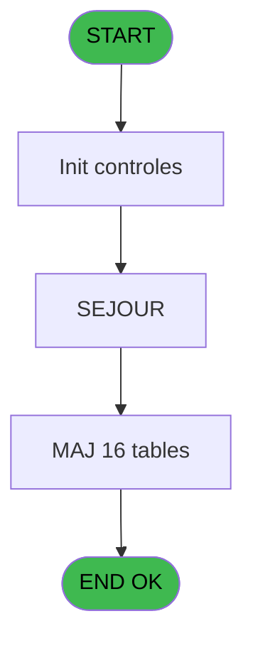
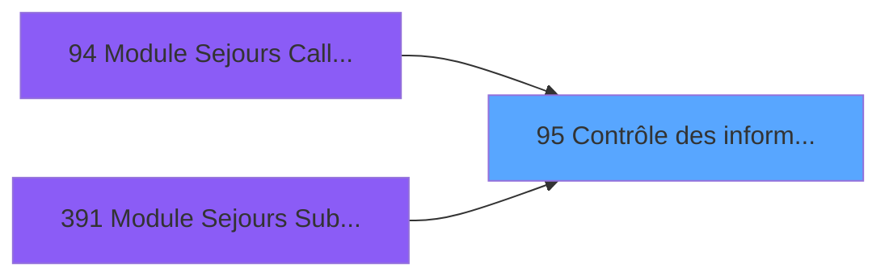

# PBG IDE 95 - Contrôle des informations

> **Analyse**: Phases 1-4 2026-02-03 09:19 -> 09:20 (20s) | Assemblage 09:20
> **Pipeline**: V7.2 Enrichi
> **Structure**: 4 onglets (Resume | Ecrans | Donnees | Connexions)

<!-- TAB:Resume -->

## 1. FICHE D'IDENTITE

| Attribut | Valeur |
|----------|--------|
| Projet | PBG |
| IDE Position | 95 |
| Nom Programme | Contrôle des informations |
| Fichier source | `Prg_95.xml` |
| Domaine metier | General |
| Taches | 17 (17 ecrans visibles) |
| Tables modifiees | 16 |
| Programmes appeles | 1 |

## 2. DESCRIPTION FONCTIONNELLE

**Contrôle des informations** assure la gestion complete de ce processus, accessible depuis [Module Sejours CallTask (IDE 0)](PBG-IDE-0.md), [Module Sejours CallTask (IDE 94)](PBG-IDE-94.md), [Module Sejours SubForm (IDE 391)](PBG-IDE-391.md).

Le flux de traitement s'organise en **2 blocs fonctionnels** :

- **Traitement** (16 taches) : traitements metier divers
- **Calcul** (1 tache) : calculs de montants, stocks ou compteurs

**Donnees modifiees** : 16 tables en ecriture (ann, compteurs________cpt, historik_station, fichier_statistiques, annulation_______anu, ez_card, fra_circuit, fra_commentaire, fra_liste_blanche, fra_prestation, fra_sejour, fra_trafic, ide, import_mod, erreur_od, tempo_ventes).

Detail : phases du traitement

#### Phase 1 : Traitement (16 taches)

- **95** - Contrôle informations - IDE **[[ECRAN]](#ecran-t1)**
- **95.1** - SEJOUR - FRA 3 **[[ECRAN]](#ecran-t2)**
- **95.2** - PRESTATION - FRA 4 **[[ECRAN]](#ecran-t3)**
- **95.3** - CIRCUIT - FRA 5 **[[ECRAN]](#ecran-t4)**
- **95.4** - TRAFIC - FRA 7 **[[ECRAN]](#ecran-t5)**
- **95.5** - COMMENTAIRE - FRA 8 **[[ECRAN]](#ecran-t6)**
- **95.6** - Liste Blanche **[[ECRAN]](#ecran-t7)**
- **95.7** - Dossiers modifies - MOD **[[ECRAN]](#ecran-t8)**
- **95.8** - GM annules - ANN **[[ECRAN]](#ecran-t9)**
- **95.9** - Autres fichiers **[[ECRAN]](#ecran-t10)**
- **95.9.2** - Browse - HISTORIK Station **[[ECRAN]](#ecran-t12)**
- **95.9.3** - Browse - Statistiques     STI **[[ECRAN]](#ecran-t13)**
- **95.9.4** - Browse - ANNULATION       ANU **[[ECRAN]](#ecran-t14)**
- **95.9.5** - Browse - Visa **[[ECRAN]](#ecran-t15)**
- **95.9.6** - Browse - GM_Millesia **[[ECRAN]](#ecran-t16)**
- **95.9.7** - Browse - EZ card pms **[[ECRAN]](#ecran-t17)**

Delegue a : [Dispatch (IDE 96)](PBG-IDE-96.md)

#### Phase 2 : Calcul (1 tache)

- **95.9.1** - Browse - Compteurs        CPT **[[ECRAN]](#ecran-t11)**

#### Tables impactees

| Table | Operations | Role metier |
|-------|-----------|-------------|
| fra_prestation | **W** (1 usages) | Prestations/services vendus |
| erreur_od | **W** (1 usages) |  |
| fra_trafic | **W** (1 usages) |  |
| ide | **W** (1 usages) |  |
| fra_liste_blanche | **W** (1 usages) |  |
| import_mod | **W** (1 usages) |  |
| annulation_______anu | **W** (1 usages) |  |
| fra_circuit | **W** (1 usages) |  |
| tempo_ventes | **W** (1 usages) | Table temporaire ecran |
| compteurs________cpt | **W** (1 usages) | Comptes GM (generaux) |
| ez_card | **W** (1 usages) |  |
| fra_commentaire | **W** (1 usages) |  |
| historik_station | **W** (1 usages) | Historique / journal |
| fra_sejour | **W** (1 usages) |  |
| fichier_statistiques | **W** (1 usages) |  |
| ann | **W** (1 usages) |  |

## 3. BLOCS FONCTIONNELS

### 3.1 Traitement (16 taches)

Traitements internes.

---

#### 95 - Contrôle informations - IDE [[ECRAN]](#ecran-t1)

**Role** : Tache d'orchestration : point d'entree du programme (16 sous-taches). Coordonne l'enchainement des traitements.
**Ecran** : 782 x 386 DLU (MDI) | [Voir mockup](#ecran-t1)

15 sous-taches directes

| Tache | Nom | Bloc |
|-------|-----|------|
| [95.1](#t2) | SEJOUR - FRA 3 **[[ECRAN]](#ecran-t2)** | Traitement |
| [95.2](#t3) | PRESTATION - FRA 4 **[[ECRAN]](#ecran-t3)** | Traitement |
| [95.3](#t4) | CIRCUIT - FRA 5 **[[ECRAN]](#ecran-t4)** | Traitement |
| [95.4](#t5) | TRAFIC - FRA 7 **[[ECRAN]](#ecran-t5)** | Traitement |
| [95.5](#t6) | COMMENTAIRE - FRA 8 **[[ECRAN]](#ecran-t6)** | Traitement |
| [95.6](#t7) | Liste Blanche **[[ECRAN]](#ecran-t7)** | Traitement |
| [95.7](#t8) | Dossiers modifies - MOD **[[ECRAN]](#ecran-t8)** | Traitement |
| [95.8](#t9) | GM annules - ANN **[[ECRAN]](#ecran-t9)** | Traitement |
| [95.9](#t10) | Autres fichiers **[[ECRAN]](#ecran-t10)** | Traitement |
| [95.9.2](#t12) | Browse - HISTORIK Station **[[ECRAN]](#ecran-t12)** | Traitement |
| [95.9.3](#t13) | Browse - Statistiques     STI **[[ECRAN]](#ecran-t13)** | Traitement |
| [95.9.4](#t14) | Browse - ANNULATION       ANU **[[ECRAN]](#ecran-t14)** | Traitement |
| [95.9.5](#t15) | Browse - Visa **[[ECRAN]](#ecran-t15)** | Traitement |
| [95.9.6](#t16) | Browse - GM_Millesia **[[ECRAN]](#ecran-t16)** | Traitement |
| [95.9.7](#t17) | Browse - EZ card pms **[[ECRAN]](#ecran-t17)** | Traitement |

---

#### 95.1 - SEJOUR - FRA 3 [[ECRAN]](#ecran-t2)

**Role** : Traitement : SEJOUR - FRA 3.
**Ecran** : 236 x 101 DLU (MDI) | [Voir mockup](#ecran-t2)

---

#### 95.2 - PRESTATION - FRA 4 [[ECRAN]](#ecran-t3)

**Role** : Traitement : PRESTATION - FRA 4.
**Ecran** : 179 x 95 DLU (MDI) | [Voir mockup](#ecran-t3)

---

#### 95.3 - CIRCUIT - FRA 5 [[ECRAN]](#ecran-t4)

**Role** : Traitement : CIRCUIT - FRA 5.
**Ecran** : 201 x 96 DLU (MDI) | [Voir mockup](#ecran-t4)

---

#### 95.4 - TRAFIC - FRA 7 [[ECRAN]](#ecran-t5)

**Role** : Traitement : TRAFIC - FRA 7.
**Ecran** : 420 x 100 DLU (MDI) | [Voir mockup](#ecran-t5)

---

#### 95.5 - COMMENTAIRE - FRA 8 [[ECRAN]](#ecran-t6)

**Role** : Traitement : COMMENTAIRE - FRA 8.
**Ecran** : 199 x 100 DLU (MDI) | [Voir mockup](#ecran-t6)

---

#### 95.6 - Liste Blanche [[ECRAN]](#ecran-t7)

**Role** : Traitement : Liste Blanche.
**Ecran** : 156 x 181 DLU (MDI) | [Voir mockup](#ecran-t7)

---

#### 95.7 - Dossiers modifies - MOD [[ECRAN]](#ecran-t8)

**Role** : Traitement : Dossiers modifies - MOD.
**Ecran** : 242 x 0 DLU (MDI) | [Voir mockup](#ecran-t8)

---

#### 95.8 - GM annules - ANN [[ECRAN]](#ecran-t9)

**Role** : Traitement : GM annules - ANN.
**Ecran** : 403 x 0 DLU (MDI) | [Voir mockup](#ecran-t9)

---

#### 95.9 - Autres fichiers [[ECRAN]](#ecran-t10)

**Role** : Traitement : Autres fichiers.
**Ecran** : 1554 x 0 DLU (MDI) | [Voir mockup](#ecran-t10)
**Variables liees** : C (Aautres)

---

#### 95.9.2 - Browse - HISTORIK Station [[ECRAN]](#ecran-t12)

**Role** : Traitement : Browse - HISTORIK Station.
**Ecran** : 778 x 166 DLU (MDI) | [Voir mockup](#ecran-t12)

---

#### 95.9.3 - Browse - Statistiques     STI [[ECRAN]](#ecran-t13)

**Role** : Traitement : Browse - Statistiques     STI.
**Ecran** : 778 x 162 DLU (MDI) | [Voir mockup](#ecran-t13)

---

#### 95.9.4 - Browse - ANNULATION       ANU [[ECRAN]](#ecran-t14)

**Role** : Traitement : Browse - ANNULATION       ANU.
**Ecran** : 777 x 164 DLU (MDI) | [Voir mockup](#ecran-t14)

---

#### 95.9.5 - Browse - Visa [[ECRAN]](#ecran-t15)

**Role** : Traitement : Browse - Visa.
**Ecran** : 777 x 166 DLU (MDI) | [Voir mockup](#ecran-t15)

---

#### 95.9.6 - Browse - GM_Millesia [[ECRAN]](#ecran-t16)

**Role** : Traitement : Browse - GM_Millesia.
**Ecran** : 778 x 164 DLU (MDI) | [Voir mockup](#ecran-t16)

---

#### 95.9.7 - Browse - EZ card pms [[ECRAN]](#ecran-t17)

**Role** : Traitement : Browse - EZ card pms.
**Ecran** : 777 x 164 DLU (MDI) | [Voir mockup](#ecran-t17)

### 3.2 Calcul (1 tache)

Calculs metier : montants, stocks, compteurs.

---

#### 95.9.1 - Browse - Compteurs        CPT [[ECRAN]](#ecran-t11)

**Role** : Calcul : Browse - Compteurs        CPT.
**Ecran** : 357 x 164 DLU (MDI) | [Voir mockup](#ecran-t11)

## 5. REGLES METIER

*(Aucune regle metier identifiee)*

## 6. CONTEXTE

- **Appele par**: [Module Sejours CallTask (IDE 0)](PBG-IDE-0.md), [Module Sejours CallTask (IDE 94)](PBG-IDE-94.md), [Module Sejours SubForm (IDE 391)](PBG-IDE-391.md)
- **Appelle**: 1 programmes | **Tables**: 16 (W:16 R:0 L:0) | **Taches**: 17 | **Expressions**: 20

<!-- TAB:Ecrans -->

## 8. ECRANS

### 8.1 Forms visibles (17 / 17)

| # | Position | Tache | Nom | Type | Largeur | Hauteur | Bloc |
|---|----------|-------|-----|------|---------|---------|------|
| 1 | 95 | 95 | Contrôle informations - IDE | MDI | 782 | 386 | Traitement |
| 2 | 95.1 | 95.1 | SEJOUR - FRA 3 | MDI | 236 | 101 | Traitement |
| 3 | 95.2 | 95.2 | PRESTATION - FRA 4 | MDI | 179 | 95 | Traitement |
| 4 | 95.3 | 95.3 | CIRCUIT - FRA 5 | MDI | 201 | 96 | Traitement |
| 5 | 95.4 | 95.4 | TRAFIC - FRA 7 | MDI | 420 | 100 | Traitement |
| 6 | 95.5 | 95.5 | COMMENTAIRE - FRA 8 | MDI | 199 | 100 | Traitement |
| 7 | 95.6 | 95.6 | Liste Blanche | MDI | 156 | 181 | Traitement |
| 8 | 95.7 | 95.7 | Dossiers modifies - MOD | MDI | 242 | 0 | Traitement |
| 9 | 95.8 | 95.8 | GM annules - ANN | MDI | 403 | 0 | Traitement |
| 10 | 95.9 | 95.9 | Autres fichiers | MDI | 1554 | 0 | Traitement |
| 11 | 95.9.1 | 95.9.1 | Browse - Compteurs        CPT | MDI | 357 | 164 | Calcul |
| 12 | 95.9.2 | 95.9.2 | Browse - HISTORIK Station | MDI | 778 | 166 | Traitement |
| 13 | 95.9.3 | 95.9.3 | Browse - Statistiques     STI | MDI | 778 | 162 | Traitement |
| 14 | 95.9.4 | 95.9.4 | Browse - ANNULATION       ANU | MDI | 777 | 164 | Traitement |
| 15 | 95.9.5 | 95.9.5 | Browse - Visa | MDI | 777 | 166 | Traitement |
| 16 | 95.9.6 | 95.9.6 | Browse - GM_Millesia | MDI | 778 | 164 | Traitement |
| 17 | 95.9.7 | 95.9.7 | Browse - EZ card pms | MDI | 777 | 164 | Traitement |

### 8.2 Mockups Ecrans

---

#### 95 - Contrôle informations - IDE
**Tache** : [95](#t1) | **Type** : MDI | **Dimensions** : 782 x 386 DLU
**Bloc** : Traitement | **Titre IDE** : Contrôle informations - IDE

<!-- FORM-DATA:
{
    "width":  782,
    "vFactor":  8,
    "type":  "MDI",
    "hFactor":  4,
    "controls":  [
                     {
                         "x":  0,
                         "type":  "label",
                         "var":  "",
                         "y":  0,
                         "w":  47,
                         "fmt":  "",
                         "name":  "",
                         "h":  8,
                         "color":  "",
                         "text":  "ressource:",
                         "parent":  null
                     },
                     {
                         "x":  206,
                         "type":  "label",
                         "var":  "",
                         "y":  0,
                         "w":  52,
                         "fmt":  "",
                         "name":  "",
                         "h":  8,
                         "color":  "",
                         "text":  "numero rue:",
                         "parent":  null
                     },
                     {
                         "x":  404,
                         "type":  "label",
                         "var":  "",
                         "y":  2,
                         "w":  63,
                         "fmt":  "",
                         "name":  "",
                         "h":  8,
                         "color":  "",
                         "text":  "nb sejour club:",
                         "parent":  null
                     },
                     {
                         "x":  592,
                         "type":  "label",
                         "var":  "",
                         "y":  2,
                         "w":  184,
                         "fmt":  "",
                         "name":  "",
                         "h":  14,
                         "color":  "",
                         "text":  "Fichiers d\u0027importation",
                         "parent":  null
                     },
                     {
                         "x":  0,
                         "type":  "label",
                         "var":  "",
                         "y":  10,
                         "w":  26,
                         "fmt":  "",
                         "name":  "",
                         "h":  8,
                         "color":  "",
                         "text":  "nom:",
                         "parent":  null
                     },
                     {
                         "x":  206,
                         "type":  "label",
                         "var":  "",
                         "y":  10,
                         "w":  40,
                         "fmt":  "",
                         "name":  "",
                         "h":  8,
                         "color":  "",
                         "text":  "nom rue:",
                         "parent":  null
                     },
                     {
                         "x":  404,
                         "type":  "label",
                         "var":  "",
                         "y":  12,
                         "w":  71,
                         "fmt":  "",
                         "name":  "",
                         "h":  8,
                         "color":  "",
                         "text":  "nb sejour village:",
                         "parent":  null
                     },
                     {
                         "x":  0,
                         "type":  "label",
                         "var":  "",
                         "y":  20,
                         "w":  38,
                         "fmt":  "",
                         "name":  "",
                         "h":  8,
                         "color":  "",
                         "text":  "prenom:",
                         "parent":  null
                     },
                     {
                         "x":  206,
                         "type":  "label",
                         "var":  "",
                         "y":  20,
                         "w":  47,
                         "fmt":  "",
                         "name":  "",
                         "h":  8,
                         "color":  "",
                         "text":  "commune:",
                         "parent":  null
                     },
                     {
                         "x":  404,
                         "type":  "label",
                         "var":  "",
                         "y":  22,
                         "w":  108,
                         "fmt":  "",
                         "name":  "",
                         "h":  8,
                         "color":  "",
                         "text":  "type client accompagnant:",
                         "parent":  null
                     },
                     {
                         "x":  0,
                         "type":  "label",
                         "var":  "",
                         "y":  30,
                         "w":  48,
                         "fmt":  "",
                         "name":  "",
                         "h":  8,
                         "color":  "",
                         "text":  "type client:",
                         "parent":  null
                     },
                     {
                         "x":  206,
                         "type":  "label",
                         "var":  "",
                         "y":  30,
                         "w":  54,
                         "fmt":  "",
                         "name":  "",
                         "h":  8,
                         "color":  "",
                         "text":  "code postal:",
                         "parent":  null
                     },
                     {
                         "x":  404,
                         "type":  "label",
                         "var":  "",
                         "y":  32,
                         "w":  97,
                         "fmt":  "",
                         "name":  "",
                         "h":  8,
                         "color":  "",
                         "text":  "numero accompagnant:",
                         "parent":  null
                     },
                     {
                         "x":  0,
                         "type":  "label",
                         "var":  "",
                         "y":  40,
                         "w":  62,
                         "fmt":  "",
                         "name":  "",
                         "h":  8,
                         "color":  "",
                         "text":  "adherent club:",
                         "parent":  null
                     },
                     {
                         "x":  206,
                         "type":  "label",
                         "var":  "",
                         "y":  40,
                         "w":  24,
                         "fmt":  "",
                         "name":  "",
                         "h":  8,
                         "color":  "",
                         "text":  "ville:",
                         "parent":  null
                     },
                     {
                         "x":  404,
                         "type":  "label",
                         "var":  "",
                         "y":  42,
                         "w":  95,
                         "fmt":  "",
                         "name":  "",
                         "h":  8,
                         "color":  "",
                         "text":  "filiation accompagnant:",
                         "parent":  null
                     },
                     {
                         "x":  0,
                         "type":  "label",
                         "var":  "",
                         "y":  50,
                         "w":  54,
                         "fmt":  "",
                         "name":  "",
                         "h":  8,
                         "color":  "",
                         "text":  "filiation club:",
                         "parent":  null
                     },
                     {
                         "x":  206,
                         "type":  "label",
                         "var":  "",
                         "y":  50,
                         "w":  60,
                         "fmt":  "",
                         "name":  "",
                         "h":  8,
                         "color":  "",
                         "text":  "etat province:",
                         "parent":  null
                     },
                     {
                         "x":  404,
                         "type":  "label",
                         "var":  "",
                         "y":  52,
                         "w":  36,
                         "fmt":  "",
                         "name":  "",
                         "h":  8,
                         "color":  "",
                         "text":  "dossier:",
                         "parent":  null
                     },
                     {
                         "x":  0,
                         "type":  "label",
                         "var":  "",
                         "y":  60,
                         "w":  24,
                         "fmt":  "",
                         "name":  "",
                         "h":  8,
                         "color":  "",
                         "text":  "age:",
                         "parent":  null
                     },
                     {
                         "x":  206,
                         "type":  "label",
                         "var":  "",
                         "y":  60,
                         "w":  67,
                         "fmt":  "",
                         "name":  "",
                         "h":  8,
                         "color":  "",
                         "text":  "pays residence:",
                         "parent":  null
                     },
                     {
                         "x":  404,
                         "type":  "label",
                         "var":  "",
                         "y":  62,
                         "w":  58,
                         "fmt":  "",
                         "name":  "",
                         "h":  8,
                         "color":  "",
                         "text":  "ordre dossier:",
                         "parent":  null
                     },
                     {
                         "x":  0,
                         "type":  "label",
                         "var":  "",
                         "y":  70,
                         "w":  80,
                         "fmt":  "",
                         "name":  "",
                         "h":  8,
                         "color":  "",
                         "text":  "date de naissance:",
                         "parent":  null
                     },
                     {
                         "x":  206,
                         "type":  "label",
                         "var":  "",
                         "y":  70,
                         "w":  71,
                         "fmt":  "",
                         "name":  "",
                         "h":  8,
                         "color":  "",
                         "text":  "ville emission visa:",
                         "parent":  null
                     },
                     {
                         "x":  404,
                         "type":  "label",
                         "var":  "",
                         "y":  72,
                         "w":  106,
                         "fmt":  "",
                         "name":  "",
                         "h":  8,
                         "color":  "",
                         "text":  "type client responsable dette:",
                         "parent":  null
                     },
                     {
                         "x":  0,
                         "type":  "label",
                         "var":  "",
                         "y":  80,
                         "w":  68,
                         "fmt":  "",
                         "name":  "",
                         "h":  8,
                         "color":  "",
                         "text":  "pays inscription:",
                         "parent":  null
                     },
                     {
                         "x":  206,
                         "type":  "label",
                         "var":  "",
                         "y":  80,
                         "w":  71,
                         "fmt":  "",
                         "name":  "",
                         "h":  8,
                         "color":  "",
                         "text":  "date emission visa:",
                         "parent":  null
                     },
                     {
                         "x":  404,
                         "type":  "label",
                         "var":  "",
                         "y":  82,
                         "w":  106,
                         "fmt":  "",
                         "name":  "",
                         "h":  8,
                         "color":  "",
                         "text":  "numero responsable dette:",
                         "parent":  null
                     },
                     {
                         "x":  0,
                         "type":  "label",
                         "var":  "",
                         "y":  90,
                         "w":  61,
                         "fmt":  "",
                         "name":  "",
                         "h":  8,
                         "color":  "",
                         "text":  "langue parlee:",
                         "parent":  null
                     },
                     {
                         "x":  206,
                         "type":  "label",
                         "var":  "",
                         "y":  90,
                         "w":  44,
                         "fmt":  "",
                         "name":  "",
                         "h":  8,
                         "color":  "",
                         "text":  "type visa:",
                         "parent":  null
                     },
                     {
                         "x":  404,
                         "type":  "label",
                         "var":  "",
                         "y":  92,
                         "w":  45,
                         "fmt":  "",
                         "name":  "",
                         "h":  8,
                         "color":  "",
                         "text":  "seminaire:",
                         "parent":  null
                     },
                     {
                         "x":  0,
                         "type":  "label",
                         "var":  "",
                         "y":  100,
                         "w":  48,
                         "fmt":  "",
                         "name":  "",
                         "h":  8,
                         "color":  "",
                         "text":  "nationalite:",
                         "parent":  null
                     },
                     {
                         "x":  206,
                         "type":  "label",
                         "var":  "",
                         "y":  100,
                         "w":  36,
                         "fmt":  "",
                         "name":  "",
                         "h":  8,
                         "color":  "",
                         "text":  "millesia:",
                         "parent":  null
                     },
                     {
                         "x":  404,
                         "type":  "label",
                         "var":  "",
                         "y":  102,
                         "w":  28,
                         "fmt":  "",
                         "name":  "",
                         "h":  8,
                         "color":  "",
                         "text":  "sexe:",
                         "parent":  null
                     },
                     {
                         "x":  0,
                         "type":  "label",
                         "var":  "",
                         "y":  110,
                         "w":  48,
                         "fmt":  "",
                         "name":  "",
                         "h":  8,
                         "color":  "",
                         "text":  "profession:",
                         "parent":  null
                     },
                     {
                         "x":  206,
                         "type":  "label",
                         "var":  "",
                         "y":  110,
                         "w":  57,
                         "fmt":  "",
                         "name":  "",
                         "h":  8,
                         "color":  "",
                         "text":  "liste blanche:",
                         "parent":  null
                     },
                     {
                         "x":  404,
                         "type":  "label",
                         "var":  "",
                         "y":  112,
                         "w":  33,
                         "fmt":  "",
                         "name":  "",
                         "h":  8,
                         "color":  "",
                         "text":  "civilite:",
                         "parent":  null
                     },
                     {
                         "x":  0,
                         "type":  "label",
                         "var":  "",
                         "y":  120,
                         "w":  47,
                         "fmt":  "",
                         "name":  "",
                         "h":  8,
                         "color":  "",
                         "text":  "passeport:",
                         "parent":  null
                     },
                     {
                         "x":  206,
                         "type":  "label",
                         "var":  "",
                         "y":  120,
                         "w":  36,
                         "fmt":  "",
                         "name":  "",
                         "h":  8,
                         "color":  "",
                         "text":  "fumeur:",
                         "parent":  null
                     },
                     {
                         "x":  404,
                         "type":  "label",
                         "var":  "",
                         "y":  122,
                         "w":  45,
                         "fmt":  "",
                         "name":  "",
                         "h":  8,
                         "color":  "",
                         "text":  "handicap:",
                         "parent":  null
                     },
                     {
                         "x":  0,
                         "type":  "label",
                         "var":  "",
                         "y":  130,
                         "w":  76,
                         "fmt":  "",
                         "name":  "",
                         "h":  8,
                         "color":  "",
                         "text":  "date delivrance passeport:",
                         "parent":  null
                     },
                     {
                         "x":  404,
                         "type":  "label",
                         "var":  "",
                         "y":  132,
                         "w":  38,
                         "fmt":  "",
                         "name":  "",
                         "h":  8,
                         "color":  "",
                         "text":  "codpay:",
                         "parent":  null
                     },
                     {
                         "x":  0,
                         "type":  "label",
                         "var":  "",
                         "y":  140,
                         "w":  76,
                         "fmt":  "",
                         "name":  "",
                         "h":  8,
                         "color":  "",
                         "text":  "ville delivrance passeport:",
                         "parent":  null
                     },
                     {
                         "x":  206,
                         "type":  "label",
                         "var":  "",
                         "y":  140,
                         "w":  73,
                         "fmt":  "",
                         "name":  "",
                         "h":  10,
                         "color":  "176",
                         "text":  "PARAM DOSSIER",
                         "parent":  null
                     },
                     {
                         "x":  404,
                         "type":  "label",
                         "var":  "",
                         "y":  142,
                         "w":  36,
                         "fmt":  "",
                         "name":  "",
                         "h":  8,
                         "color":  "",
                         "text":  "codnat:",
                         "parent":  null
                     },
                     {
                         "x":  0,
                         "type":  "label",
                         "var":  "",
                         "y":  150,
                         "w":  76,
                         "fmt":  "",
                         "name":  "",
                         "h":  8,
                         "color":  "",
                         "text":  "date fin validite passeport:",
                         "parent":  null
                     },
                     {
                         "x":  206,
                         "type":  "label",
                         "var":  "",
                         "y":  150,
                         "w":  73,
                         "fmt":  "",
                         "name":  "",
                         "h":  10,
                         "color":  "176",
                         "text":  "PARAM ORDRE",
                         "parent":  null
                     },
                     {
                         "x":  404,
                         "type":  "label",
                         "var":  "",
                         "y":  152,
                         "w":  33,
                         "fmt":  "",
                         "name":  "",
                         "h":  8,
                         "color":  "",
                         "text":  "nation:",
                         "parent":  null
                     },
                     {
                         "x":  0,
                         "type":  "line",
                         "var":  "",
                         "y":  164,
                         "w":  780,
                         "fmt":  "",
                         "name":  "",
                         "h":  0,
                         "color":  "",
                         "text":  "",
                         "parent":  null
                     },
                     {
                         "x":  1,
                         "type":  "label",
                         "var":  "",
                         "y":  167,
                         "w":  240,
                         "fmt":  "",
                         "name":  "",
                         "h":  9,
                         "color":  "180",
                         "text":  "SEJOUR - FRA 3",
                         "parent":  null
                     },
                     {
                         "x":  1,
                         "type":  "label",
                         "var":  "",
                         "y":  276,
                         "w":  422,
                         "fmt":  "",
                         "name":  "",
                         "h":  9,
                         "color":  "180",
                         "text":  "TRAFIC - FRA 7",
                         "parent":  null
                     },
                     {
                         "x":  242,
                         "type":  "label",
                         "var":  "",
                         "y":  167,
                         "w":  180,
                         "fmt":  "",
                         "name":  "",
                         "h":  9,
                         "color":  "180",
                         "text":  "PRESTATION - FRA 4",
                         "parent":  null
                     },
                     {
                         "x":  423,
                         "type":  "label",
                         "var":  "",
                         "y":  167,
                         "w":  200,
                         "fmt":  "",
                         "name":  "",
                         "h":  9,
                         "color":  "180",
                         "text":  "CIRCUIT - FRA 5",
                         "parent":  null
                     },
                     {
                         "x":  424,
                         "type":  "label",
                         "var":  "",
                         "y":  276,
                         "w":  200,
                         "fmt":  "",
                         "name":  "",
                         "h":  9,
                         "color":  "180",
                         "text":  "COMMENTAIRE - FRA 8",
                         "parent":  null
                     },
                     {
                         "x":  624,
                         "type":  "label",
                         "var":  "",
                         "y":  167,
                         "w":  156,
                         "fmt":  "",
                         "name":  "",
                         "h":  9,
                         "color":  "180",
                         "text":  "Liste Blanche",
                         "parent":  null
                     },
                     {
                         "x":  282,
                         "type":  "edit",
                         "var":  "",
                         "y":  140,
                         "w":  58,
                         "fmt":  "",
                         "name":  "",
                         "h":  10,
                         "color":  "176",
                         "text":  "",
                         "parent":  null
                     },
                     {
                         "x":  282,
                         "type":  "edit",
                         "var":  "",
                         "y":  150,
                         "w":  24,
                         "fmt":  "",
                         "name":  "",
                         "h":  10,
                         "color":  "176",
                         "text":  "",
                         "parent":  null
                     },
                     {
                         "x":  80,
                         "type":  "edit",
                         "var":  "",
                         "y":  0,
                         "w":  30,
                         "fmt":  "",
                         "name":  "ressource",
                         "h":  10,
                         "color":  "174",
                         "text":  "",
                         "parent":  null
                     },
                     {
                         "x":  80,
                         "type":  "edit",
                         "var":  "",
                         "y":  10,
                         "w":  120,
                         "fmt":  "",
                         "name":  "nom",
                         "h":  10,
                         "color":  "110",
                         "text":  "",
                         "parent":  null
                     },
                     {
                         "x":  80,
                         "type":  "edit",
                         "var":  "",
                         "y":  20,
                         "w":  120,
                         "fmt":  "",
                         "name":  "prenom",
                         "h":  10,
                         "color":  "110",
                         "text":  "",
                         "parent":  null
                     },
                     {
                         "x":  80,
                         "type":  "edit",
                         "var":  "",
                         "y":  30,
                         "w":  13,
                         "fmt":  "",
                         "name":  "type client",
                         "h":  10,
                         "color":  "110",
                         "text":  "",
                         "parent":  null
                     },
                     {
                         "x":  80,
                         "type":  "edit",
                         "var":  "",
                         "y":  40,
                         "w":  63,
                         "fmt":  "",
                         "name":  "adherent club",
                         "h":  10,
                         "color":  "110",
                         "text":  "",
                         "parent":  null
                     },
                     {
                         "x":  80,
                         "type":  "edit",
                         "var":  "",
                         "y":  50,
                         "w":  24,
                         "fmt":  "",
                         "name":  "filiation club",
                         "h":  10,
                         "color":  "110",
                         "text":  "",
                         "parent":  null
                     },
                     {
                         "x":  80,
                         "type":  "edit",
                         "var":  "",
                         "y":  60,
                         "w":  18,
                         "fmt":  "",
                         "name":  "age",
                         "h":  10,
                         "color":  "110",
                         "text":  "",
                         "parent":  null
                     },
                     {
                         "x":  80,
                         "type":  "edit",
                         "var":  "",
                         "y":  70,
                         "w":  52,
                         "fmt":  "",
                         "name":  "date de naissance",
                         "h":  10,
                         "color":  "110",
                         "text":  "",
                         "parent":  null
                     },
                     {
                         "x":  80,
                         "type":  "edit",
                         "var":  "",
                         "y":  80,
                         "w":  24,
                         "fmt":  "",
                         "name":  "pays inscription",
                         "h":  10,
                         "color":  "110",
                         "text":  "",
                         "parent":  null
                     },
                     {
                         "x":  80,
                         "type":  "edit",
                         "var":  "",
                         "y":  90,
                         "w":  13,
                         "fmt":  "",
                         "name":  "langue parlee",
                         "h":  10,
                         "color":  "110",
                         "text":  "",
                         "parent":  null
                     },
                     {
                         "x":  80,
                         "type":  "edit",
                         "var":  "",
                         "y":  100,
                         "w":  120,
                         "fmt":  "",
                         "name":  "nationalite",
                         "h":  10,
                         "color":  "110",
                         "text":  "",
                         "parent":  null
                     },
                     {
                         "x":  80,
                         "type":  "edit",
                         "var":  "",
                         "y":  110,
                         "w":  120,
                         "fmt":  "",
                         "name":  "profession",
                         "h":  10,
                         "color":  "110",
                         "text":  "",
                         "parent":  null
                     },
                     {
                         "x":  80,
                         "type":  "edit",
                         "var":  "",
                         "y":  120,
                         "w":  120,
                         "fmt":  "",
                         "name":  "passeport",
                         "h":  10,
                         "color":  "110",
                         "text":  "",
                         "parent":  null
                     },
                     {
                         "x":  80,
                         "type":  "edit",
                         "var":  "",
                         "y":  130,
                         "w":  52,
                         "fmt":  "",
                         "name":  "date delivrance passeport",
                         "h":  10,
                         "color":  "110",
                         "text":  "",
                         "parent":  null
                     },
                     {
                         "x":  80,
                         "type":  "edit",
                         "var":  "",
                         "y":  140,
                         "w":  120,
                         "fmt":  "",
                         "name":  "ville delivrance passeport",
                         "h":  10,
                         "color":  "110",
                         "text":  "",
                         "parent":  null
                     },
                     {
                         "x":  80,
                         "type":  "edit",
                         "var":  "",
                         "y":  150,
                         "w":  52,
                         "fmt":  "",
                         "name":  "date fin validite passeport",
                         "h":  10,
                         "color":  "110",
                         "text":  "",
                         "parent":  null
                     },
                     {
                         "x":  282,
                         "type":  "edit",
                         "var":  "",
                         "y":  0,
                         "w":  63,
                         "fmt":  "",
                         "name":  "numero rue",
                         "h":  10,
                         "color":  "110",
                         "text":  "",
                         "parent":  null
                     },
                     {
                         "x":  282,
                         "type":  "edit",
                         "var":  "",
                         "y":  10,
                         "w":  120,
                         "fmt":  "",
                         "name":  "nom rue",
                         "h":  10,
                         "color":  "110",
                         "text":  "",
                         "parent":  null
                     },
                     {
                         "x":  282,
                         "type":  "edit",
                         "var":  "",
                         "y":  20,
                         "w":  120,
                         "fmt":  "",
                         "name":  "commune",
                         "h":  10,
                         "color":  "110",
                         "text":  "",
                         "parent":  null
                     },
                     {
                         "x":  282,
                         "type":  "edit",
                         "var":  "",
                         "y":  30,
                         "w":  63,
                         "fmt":  "",
                         "name":  "code postal",
                         "h":  10,
                         "color":  "110",
                         "text":  "",
                         "parent":  null
                     },
                     {
                         "x":  282,
                         "type":  "edit",
                         "var":  "",
                         "y":  40,
                         "w":  120,
                         "fmt":  "",
                         "name":  "ville",
                         "h":  10,
                         "color":  "110",
                         "text":  "",
                         "parent":  null
                     },
                     {
                         "x":  282,
                         "type":  "edit",
                         "var":  "",
                         "y":  50,
                         "w":  63,
                         "fmt":  "",
                         "name":  "etat province",
                         "h":  10,
                         "color":  "110",
                         "text":  "",
                         "parent":  null
                     },
                     {
                         "x":  282,
                         "type":  "edit",
                         "var":  "",
                         "y":  60,
                         "w":  24,
                         "fmt":  "",
                         "name":  "pays residence",
                         "h":  10,
                         "color":  "110",
                         "text":  "",
                         "parent":  null
                     },
                     {
                         "x":  282,
                         "type":  "edit",
                         "var":  "",
                         "y":  70,
                         "w":  120,
                         "fmt":  "",
                         "name":  "ville emission visa",
                         "h":  10,
                         "color":  "110",
                         "text":  "",
                         "parent":  null
                     },
                     {
                         "x":  282,
                         "type":  "edit",
                         "var":  "",
                         "y":  80,
                         "w":  52,
                         "fmt":  "",
                         "name":  "date emission visa",
                         "h":  10,
                         "color":  "110",
                         "text":  "",
                         "parent":  null
                     },
                     {
                         "x":  282,
                         "type":  "edit",
                         "var":  "",
                         "y":  90,
                         "w":  120,
                         "fmt":  "",
                         "name":  "type visa",
                         "h":  10,
                         "color":  "110",
                         "text":  "",
                         "parent":  null
                     },
                     {
                         "x":  282,
                         "type":  "edit",
                         "var":  "",
                         "y":  100,
                         "w":  13,
                         "fmt":  "",
                         "name":  "millesia",
                         "h":  10,
                         "color":  "110",
                         "text":  "",
                         "parent":  null
                     },
                     {
                         "x":  282,
                         "type":  "edit",
                         "var":  "",
                         "y":  110,
                         "w":  13,
                         "fmt":  "",
                         "name":  "liste blanche",
                         "h":  10,
                         "color":  "110",
                         "text":  "",
                         "parent":  null
                     },
                     {
                         "x":  282,
                         "type":  "edit",
                         "var":  "",
                         "y":  120,
                         "w":  13,
                         "fmt":  "",
                         "name":  "fumeur",
                         "h":  10,
                         "color":  "110",
                         "text":  "",
                         "parent":  null
                     },
                     {
                         "x":  514,
                         "type":  "edit",
                         "var":  "",
                         "y":  2,
                         "w":  24,
                         "fmt":  "",
                         "name":  "nb sejour club",
                         "h":  10,
                         "color":  "110",
                         "text":  "",
                         "parent":  null
                     },
                     {
                         "x":  514,
                         "type":  "edit",
                         "var":  "",
                         "y":  12,
                         "w":  24,
                         "fmt":  "",
                         "name":  "nb sejour village",
                         "h":  10,
                         "color":  "110",
                         "text":  "",
                         "parent":  null
                     },
                     {
                         "x":  514,
                         "type":  "edit",
                         "var":  "",
                         "y":  22,
                         "w":  13,
                         "fmt":  "",
                         "name":  "type client accompagnant",
                         "h":  10,
                         "color":  "110",
                         "text":  "",
                         "parent":  null
                     },
                     {
                         "x":  514,
                         "type":  "edit",
                         "var":  "",
                         "y":  32,
                         "w":  63,
                         "fmt":  "",
                         "name":  "numero accompagnant",
                         "h":  10,
                         "color":  "110",
                         "text":  "",
                         "parent":  null
                     },
                     {
                         "x":  514,
                         "type":  "edit",
                         "var":  "",
                         "y":  42,
                         "w":  24,
                         "fmt":  "",
                         "name":  "filiation accompagnant",
                         "h":  10,
                         "color":  "110",
                         "text":  "",
                         "parent":  null
                     },
                     {
                         "x":  514,
                         "type":  "edit",
                         "var":  "",
                         "y":  52,
                         "w":  58,
                         "fmt":  "",
                         "name":  "dossier",
                         "h":  10,
                         "color":  "175",
                         "text":  "",
                         "parent":  null
                     },
                     {
                         "x":  514,
                         "type":  "edit",
                         "var":  "",
                         "y":  62,
                         "w":  24,
                         "fmt":  "",
                         "name":  "ordre dossier",
                         "h":  10,
                         "color":  "175",
                         "text":  "",
                         "parent":  null
                     },
                     {
                         "x":  514,
                         "type":  "edit",
                         "var":  "",
                         "y":  72,
                         "w":  13,
                         "fmt":  "",
                         "name":  "type client responsable dette",
                         "h":  10,
                         "color":  "110",
                         "text":  "",
                         "parent":  null
                     },
                     {
                         "x":  514,
                         "type":  "edit",
                         "var":  "",
                         "y":  82,
                         "w":  63,
                         "fmt":  "",
                         "name":  "numero responsable dette",
                         "h":  10,
                         "color":  "110",
                         "text":  "",
                         "parent":  null
                     },
                     {
                         "x":  457,
                         "type":  "edit",
                         "var":  "",
                         "y":  92,
                         "w":  120,
                         "fmt":  "",
                         "name":  "seminaire",
                         "h":  10,
                         "color":  "110",
                         "text":  "",
                         "parent":  null
                     },
                     {
                         "x":  514,
                         "type":  "edit",
                         "var":  "",
                         "y":  102,
                         "w":  13,
                         "fmt":  "",
                         "name":  "sexe",
                         "h":  10,
                         "color":  "110",
                         "text":  "",
                         "parent":  null
                     },
                     {
                         "x":  514,
                         "type":  "edit",
                         "var":  "",
                         "y":  112,
                         "w":  63,
                         "fmt":  "",
                         "name":  "civilite",
                         "h":  10,
                         "color":  "110",
                         "text":  "",
                         "parent":  null
                     },
                     {
                         "x":  514,
                         "type":  "edit",
                         "var":  "",
                         "y":  122,
                         "w":  18,
                         "fmt":  "",
                         "name":  "handicap",
                         "h":  10,
                         "color":  "110",
                         "text":  "",
                         "parent":  null
                     },
                     {
                         "x":  514,
                         "type":  "edit",
                         "var":  "",
                         "y":  132,
                         "w":  24,
                         "fmt":  "",
                         "name":  "codpay",
                         "h":  10,
                         "color":  "110",
                         "text":  "",
                         "parent":  null
                     },
                     {
                         "x":  514,
                         "type":  "edit",
                         "var":  "",
                         "y":  142,
                         "w":  24,
                         "fmt":  "",
                         "name":  "codnat",
                         "h":  10,
                         "color":  "110",
                         "text":  "",
                         "parent":  null
                     },
                     {
                         "x":  514,
                         "type":  "edit",
                         "var":  "",
                         "y":  152,
                         "w":  24,
                         "fmt":  "",
                         "name":  "nation",
                         "h":  10,
                         "color":  "110",
                         "text":  "",
                         "parent":  null
                     },
                     {
                         "x":  688,
                         "type":  "button",
                         "var":  "",
                         "y":  364,
                         "w":  77,
                         "fmt":  "",
                         "name":  "Aautres",
                         "h":  14,
                         "color":  "",
                         "text":  "",
                         "parent":  null
                     },
                     {
                         "x":  592,
                         "type":  "button",
                         "var":  "",
                         "y":  18,
                         "w":  84,
                         "fmt":  "Identite",
                         "name":  "",
                         "h":  14,
                         "color":  "",
                         "text":  "",
                         "parent":  null
                     },
                     {
                         "x":  690,
                         "type":  "button",
                         "var":  "",
                         "y":  18,
                         "w":  84,
                         "fmt":  "Avertis Modif",
                         "name":  "",
                         "h":  14,
                         "color":  "",
                         "text":  "",
                         "parent":  null
                     },
                     {
                         "x":  592,
                         "type":  "button",
                         "var":  "",
                         "y":  34,
                         "w":  84,
                         "fmt":  "Logement",
                         "name":  "",
                         "h":  14,
                         "color":  "",
                         "text":  "",
                         "parent":  null
                     },
                     {
                         "x":  690,
                         "type":  "button",
                         "var":  "",
                         "y":  34,
                         "w":  84,
                         "fmt":  "Import Modif",
                         "name":  "",
                         "h":  14,
                         "color":  "",
                         "text":  "",
                         "parent":  null
                     },
                     {
                         "x":  592,
                         "type":  "button",
                         "var":  "",
                         "y":  50,
                         "w":  84,
                         "fmt":  "Circuit",
                         "name":  "",
                         "h":  14,
                         "color":  "",
                         "text":  "",
                         "parent":  null
                     },
                     {
                         "x":  690,
                         "type":  "button",
                         "var":  "",
                         "y":  50,
                         "w":  84,
                         "fmt":  "Histo Chaine 184",
                         "name":  "",
                         "h":  14,
                         "color":  "",
                         "text":  "",
                         "parent":  null
                     },
                     {
                         "x":  592,
                         "type":  "button",
                         "var":  "",
                         "y":  66,
                         "w":  84,
                         "fmt":  "Prestations",
                         "name":  "",
                         "h":  14,
                         "color":  "",
                         "text":  "",
                         "parent":  null
                     },
                     {
                         "x":  690,
                         "type":  "button",
                         "var":  "",
                         "y":  66,
                         "w":  84,
                         "fmt":  "Recup Chambre",
                         "name":  "",
                         "h":  14,
                         "color":  "",
                         "text":  "",
                         "parent":  null
                     },
                     {
                         "x":  592,
                         "type":  "button",
                         "var":  "",
                         "y":  82,
                         "w":  84,
                         "fmt":  "Avertissements",
                         "name":  "",
                         "h":  14,
                         "color":  "",
                         "text":  "",
                         "parent":  null
                     },
                     {
                         "x":  690,
                         "type":  "button",
                         "var":  "",
                         "y":  82,
                         "w":  84,
                         "fmt":  "Dossiers modifies",
                         "name":  "",
                         "h":  14,
                         "color":  "",
                         "text":  "",
                         "parent":  null
                     },
                     {
                         "x":  592,
                         "type":  "button",
                         "var":  "",
                         "y":  98,
                         "w":  84,
                         "fmt":  "Reprise",
                         "name":  "",
                         "h":  14,
                         "color":  "",
                         "text":  "",
                         "parent":  null
                     },
                     {
                         "x":  690,
                         "type":  "button",
                         "var":  "",
                         "y":  98,
                         "w":  84,
                         "fmt":  "Histo Chaine 189",
                         "name":  "",
                         "h":  14,
                         "color":  "",
                         "text":  "",
                         "parent":  null
                     },
                     {
                         "x":  592,
                         "type":  "button",
                         "var":  "",
                         "y":  114,
                         "w":  84,
                         "fmt":  "Tronçon",
                         "name":  "",
                         "h":  14,
                         "color":  "",
                         "text":  "",
                         "parent":  null
                     },
                     {
                         "x":  690,
                         "type":  "button",
                         "var":  "",
                         "y":  114,
                         "w":  84,
                         "fmt":  "MOD",
                         "name":  "",
                         "h":  14,
                         "color":  "",
                         "text":  "",
                         "parent":  null
                     },
                     {
                         "x":  592,
                         "type":  "button",
                         "var":  "",
                         "y":  130,
                         "w":  84,
                         "fmt":  "Commentaires",
                         "name":  "",
                         "h":  14,
                         "color":  "",
                         "text":  "",
                         "parent":  null
                     },
                     {
                         "x":  690,
                         "type":  "button",
                         "var":  "",
                         "y":  130,
                         "w":  84,
                         "fmt":  "ANN",
                         "name":  "",
                         "h":  14,
                         "color":  "",
                         "text":  "",
                         "parent":  null
                     },
                     {
                         "x":  592,
                         "type":  "button",
                         "var":  "",
                         "y":  146,
                         "w":  84,
                         "fmt":  "Avertis Ann/Val",
                         "name":  "",
                         "h":  14,
                         "color":  "",
                         "text":  "",
                         "parent":  null
                     },
                     {
                         "x":  690,
                         "type":  "button",
                         "var":  "",
                         "y":  146,
                         "w":  84,
                         "fmt":  "Quitter",
                         "name":  "",
                         "h":  14,
                         "color":  "",
                         "text":  "",
                         "parent":  null
                     },
                     {
                         "x":  1,
                         "type":  "subform",
                         "var":  "",
                         "y":  176,
                         "w":  240,
                         "fmt":  "",
                         "name":  "SEJOUR",
                         "h":  100,
                         "color":  "",
                         "text":  "",
                         "parent":  null
                     },
                     {
                         "x":  242,
                         "type":  "subform",
                         "var":  "",
                         "y":  176,
                         "w":  180,
                         "fmt":  "",
                         "name":  "PRESTATION",
                         "h":  100,
                         "color":  "",
                         "text":  "",
                         "parent":  null
                     },
                     {
                         "x":  423,
                         "type":  "subform",
                         "var":  "",
                         "y":  176,
                         "w":  200,
                         "fmt":  "",
                         "name":  "CIRCUIT",
                         "h":  100,
                         "color":  "",
                         "text":  "",
                         "parent":  null
                     },
                     {
                         "x":  1,
                         "type":  "subform",
                         "var":  "",
                         "y":  284,
                         "w":  422,
                         "fmt":  "",
                         "name":  "TRAFIC",
                         "h":  102,
                         "color":  "",
                         "text":  "",
                         "parent":  null
                     },
                     {
                         "x":  423,
                         "type":  "subform",
                         "var":  "",
                         "y":  284,
                         "w":  200,
                         "fmt":  "",
                         "name":  "COMMENTAIRE",
                         "h":  102,
                         "color":  "",
                         "text":  "",
                         "parent":  null
                     },
                     {
                         "x":  624,
                         "type":  "subform",
                         "var":  "",
                         "y":  176,
                         "w":  158,
                         "fmt":  "",
                         "name":  "LISTE BLANCHE",
                         "h":  183,
                         "color":  "",
                         "text":  "",
                         "parent":  null
                     }
                 ],
    "taskId":  "95",
    "height":  386
}
-->

<strong>Champs : 47 champs</strong>

| Pos (x,y) | Nom | Variable | Type |
|-----------|-----|----------|------|
| 282,140 | (sans nom) | - | edit |
| 282,150 | (sans nom) | - | edit |
| 80,0 | ressource | - | edit |
| 80,10 | nom | - | edit |
| 80,20 | prenom | - | edit |
| 80,30 | type client | - | edit |
| 80,40 | adherent club | - | edit |
| 80,50 | filiation club | - | edit |
| 80,60 | age | - | edit |
| 80,70 | date de naissance | - | edit |
| 80,80 | pays inscription | - | edit |
| 80,90 | langue parlee | - | edit |
| 80,100 | nationalite | - | edit |
| 80,110 | profession | - | edit |
| 80,120 | passeport | - | edit |
| 80,130 | date delivrance passeport | - | edit |
| 80,140 | ville delivrance passeport | - | edit |
| 80,150 | date fin validite passeport | - | edit |
| 282,0 | numero rue | - | edit |
| 282,10 | nom rue | - | edit |
| 282,20 | commune | - | edit |
| 282,30 | code postal | - | edit |
| 282,40 | ville | - | edit |
| 282,50 | etat province | - | edit |
| 282,60 | pays residence | - | edit |
| 282,70 | ville emission visa | - | edit |
| 282,80 | date emission visa | - | edit |
| 282,90 | type visa | - | edit |
| 282,100 | millesia | - | edit |
| 282,110 | liste blanche | - | edit |
| 282,120 | fumeur | - | edit |
| 514,2 | nb sejour club | - | edit |
| 514,12 | nb sejour village | - | edit |
| 514,22 | type client accompagnant | - | edit |
| 514,32 | numero accompagnant | - | edit |
| 514,42 | filiation accompagnant | - | edit |
| 514,52 | dossier | - | edit |
| 514,62 | ordre dossier | - | edit |
| 514,72 | type client responsable dette | - | edit |
| 514,82 | numero responsable dette | - | edit |
| 457,92 | seminaire | - | edit |
| 514,102 | sexe | - | edit |
| 514,112 | civilite | - | edit |
| 514,122 | handicap | - | edit |
| 514,132 | codpay | - | edit |
| 514,142 | codnat | - | edit |
| 514,152 | nation | - | edit |

<strong>Boutons : 19 boutons</strong>

| Bouton | Pos (x,y) | Action |
|--------|-----------|--------|
| Aautres | 688,364 | Bouton fonctionnel |
| Identite | 592,18 | Identification du client |
| Avertis Modif | 690,18 | Modifie l'element |
| Logement | 592,34 | Bouton fonctionnel |
| Import Modif | 690,34 | Modifie l'element |
| Circuit | 592,50 | Bouton fonctionnel |
| Histo Chaine 184 | 690,50 | Bouton fonctionnel |
| Prestations | 592,66 | Bouton fonctionnel |
| Recup Chambre | 690,66 | Bouton fonctionnel |
| Avertissements | 592,82 | Bouton fonctionnel |
| Dossiers modifies | 690,82 | Modifie l'element |
| Reprise | 592,98 | Bouton fonctionnel |
| Histo Chaine 189 | 690,98 | Bouton fonctionnel |
| Tronçon | 592,114 | Bouton fonctionnel |
| MOD | 690,114 | Bouton fonctionnel |
| Commentaires | 592,130 | Bouton fonctionnel |
| ANN | 690,130 | Bouton fonctionnel |
| Avertis Ann/Val | 592,146 | Bouton fonctionnel |
| Quitter | 690,146 | Quitte le programme |

---

#### 95.1 - SEJOUR - FRA 3
**Tache** : [95.1](#t2) | **Type** : MDI | **Dimensions** : 236 x 101 DLU
**Bloc** : Traitement | **Titre IDE** : SEJOUR - FRA 3

<!-- FORM-DATA:
{
    "width":  236,
    "vFactor":  8,
    "type":  "MDI",
    "hFactor":  4,
    "controls":  [
                     {
                         "x":  2,
                         "type":  "table",
                         "var":  "",
                         "name":  "",
                         "titleH":  12,
                         "color":  "110",
                         "w":  53,
                         "y":  4,
                         "fmt":  "",
                         "parent":  null,
                         "text":  "",
                         "rowH":  14,
                         "h":  80,
                         "cols":  [
                                      {
                                          "title":  "",
                                          "layer":  1,
                                          "w":  37
                                      }
                                  ],
                         "rows":  1
                     },
                     {
                         "x":  60,
                         "type":  "label",
                         "var":  "",
                         "y":  2,
                         "w":  88,
                         "fmt":  "",
                         "name":  "",
                         "h":  8,
                         "color":  "",
                         "text":  "TYPE RESSOURCE:",
                         "parent":  null
                     },
                     {
                         "x":  60,
                         "type":  "label",
                         "var":  "",
                         "y":  12,
                         "w":  102,
                         "fmt":  "",
                         "name":  "",
                         "h":  8,
                         "color":  "",
                         "text":  "DATE DEBUT SEJOUR:",
                         "parent":  null
                     },
                     {
                         "x":  60,
                         "type":  "label",
                         "var":  "",
                         "y":  22,
                         "w":  86,
                         "fmt":  "",
                         "name":  "",
                         "h":  8,
                         "color":  "",
                         "text":  "DATE FIN SEJOUR:",
                         "parent":  null
                     },
                     {
                         "x":  60,
                         "type":  "label",
                         "var":  "",
                         "y":  32,
                         "w":  84,
                         "fmt":  "",
                         "name":  "",
                         "h":  8,
                         "color":  "",
                         "text":  "CODE LOGEMENT:",
                         "parent":  null
                     },
                     {
                         "x":  60,
                         "type":  "label",
                         "var":  "",
                         "y":  42,
                         "w":  94,
                         "fmt":  "",
                         "name":  "",
                         "h":  8,
                         "color":  "",
                         "text":  "MODE OCCUPATION:",
                         "parent":  null
                     },
                     {
                         "x":  60,
                         "type":  "label",
                         "var":  "",
                         "y":  52,
                         "w":  72,
                         "fmt":  "",
                         "name":  "",
                         "h":  8,
                         "color":  "",
                         "text":  "NB OCCUPANT:",
                         "parent":  null
                     },
                     {
                         "x":  60,
                         "type":  "label",
                         "var":  "",
                         "y":  62,
                         "w":  93,
                         "fmt":  "",
                         "name":  "",
                         "h":  8,
                         "color":  "",
                         "text":  "NUMERO CHAMBRE:",
                         "parent":  null
                     },
                     {
                         "x":  60,
                         "type":  "label",
                         "var":  "",
                         "y":  72,
                         "w":  70,
                         "fmt":  "",
                         "name":  "",
                         "h":  8,
                         "color":  "",
                         "text":  "MATRIMONIAL:",
                         "parent":  null
                     },
                     {
                         "x":  6,
                         "type":  "edit",
                         "var":  "",
                         "y":  18,
                         "w":  30,
                         "fmt":  "",
                         "name":  "",
                         "h":  10,
                         "color":  "110",
                         "text":  "",
                         "parent":  1
                     },
                     {
                         "x":  164,
                         "type":  "edit",
                         "var":  "",
                         "y":  2,
                         "w":  13,
                         "fmt":  "",
                         "name":  "",
                         "h":  10,
                         "color":  "110",
                         "text":  "",
                         "parent":  null
                     },
                     {
                         "x":  164,
                         "type":  "edit",
                         "var":  "",
                         "y":  12,
                         "w":  52,
                         "fmt":  "",
                         "name":  "",
                         "h":  10,
                         "color":  "110",
                         "text":  "",
                         "parent":  null
                     },
                     {
                         "x":  164,
                         "type":  "edit",
                         "var":  "",
                         "y":  22,
                         "w":  52,
                         "fmt":  "",
                         "name":  "",
                         "h":  10,
                         "color":  "110",
                         "text":  "",
                         "parent":  null
                     },
                     {
                         "x":  164,
                         "type":  "edit",
                         "var":  "",
                         "y":  32,
                         "w":  41,
                         "fmt":  "",
                         "name":  "",
                         "h":  10,
                         "color":  "110",
                         "text":  "",
                         "parent":  null
                     },
                     {
                         "x":  164,
                         "type":  "edit",
                         "var":  "",
                         "y":  42,
                         "w":  13,
                         "fmt":  "",
                         "name":  "",
                         "h":  10,
                         "color":  "110",
                         "text":  "",
                         "parent":  null
                     },
                     {
                         "x":  164,
                         "type":  "edit",
                         "var":  "",
                         "y":  52,
                         "w":  24,
                         "fmt":  "",
                         "name":  "",
                         "h":  10,
                         "color":  "110",
                         "text":  "",
                         "parent":  null
                     },
                     {
                         "x":  164,
                         "type":  "edit",
                         "var":  "",
                         "y":  62,
                         "w":  41,
                         "fmt":  "",
                         "name":  "",
                         "h":  10,
                         "color":  "110",
                         "text":  "",
                         "parent":  null
                     },
                     {
                         "x":  164,
                         "type":  "edit",
                         "var":  "",
                         "y":  72,
                         "w":  13,
                         "fmt":  "",
                         "name":  "",
                         "h":  10,
                         "color":  "110",
                         "text":  "",
                         "parent":  null
                     }
                 ],
    "taskId":  "95.1",
    "height":  101
}
-->

<strong>Champs : 9 champs</strong>

| Pos (x,y) | Nom | Variable | Type |
|-----------|-----|----------|------|
| 6,18 | (sans nom) | - | edit |
| 164,2 | (sans nom) | - | edit |
| 164,12 | (sans nom) | - | edit |
| 164,22 | (sans nom) | - | edit |
| 164,32 | (sans nom) | - | edit |
| 164,42 | (sans nom) | - | edit |
| 164,52 | (sans nom) | - | edit |
| 164,62 | (sans nom) | - | edit |
| 164,72 | (sans nom) | - | edit |

---

#### 95.2 - PRESTATION - FRA 4
**Tache** : [95.2](#t3) | **Type** : MDI | **Dimensions** : 179 x 95 DLU
**Bloc** : Traitement | **Titre IDE** : PRESTATION - FRA 4

<!-- FORM-DATA:
{
    "width":  179,
    "vFactor":  8,
    "type":  "MDI",
    "hFactor":  4,
    "controls":  [
                     {
                         "x":  2,
                         "type":  "table",
                         "var":  "",
                         "name":  "",
                         "titleH":  12,
                         "color":  "110",
                         "w":  51,
                         "y":  4,
                         "fmt":  "",
                         "parent":  null,
                         "text":  "",
                         "rowH":  14,
                         "h":  80,
                         "cols":  [
                                      {
                                          "title":  "",
                                          "layer":  1,
                                          "w":  35
                                      }
                                  ],
                         "rows":  1
                     },
                     {
                         "x":  54,
                         "type":  "label",
                         "var":  "",
                         "y":  3,
                         "w":  65,
                         "fmt":  "",
                         "name":  "",
                         "h":  8,
                         "color":  "",
                         "text":  "type ressource:",
                         "parent":  null
                     },
                     {
                         "x":  54,
                         "type":  "label",
                         "var":  "",
                         "y":  13,
                         "w":  68,
                         "fmt":  "",
                         "name":  "",
                         "h":  8,
                         "color":  "",
                         "text":  "code prestation:",
                         "parent":  null
                     },
                     {
                         "x":  54,
                         "type":  "label",
                         "var":  "",
                         "y":  23,
                         "w":  51,
                         "fmt":  "",
                         "name":  "",
                         "h":  8,
                         "color":  "",
                         "text":  "date debut:",
                         "parent":  null
                     },
                     {
                         "x":  54,
                         "type":  "label",
                         "var":  "",
                         "y":  33,
                         "w":  38,
                         "fmt":  "",
                         "name":  "",
                         "h":  8,
                         "color":  "",
                         "text":  "date fin:",
                         "parent":  null
                     },
                     {
                         "x":  5,
                         "type":  "edit",
                         "var":  "",
                         "y":  18,
                         "w":  30,
                         "fmt":  "",
                         "name":  "",
                         "h":  10,
                         "color":  "110",
                         "text":  "",
                         "parent":  1
                     },
                     {
                         "x":  122,
                         "type":  "edit",
                         "var":  "",
                         "y":  3,
                         "w":  13,
                         "fmt":  "",
                         "name":  "",
                         "h":  10,
                         "color":  "110",
                         "text":  "",
                         "parent":  null
                     },
                     {
                         "x":  122,
                         "type":  "edit",
                         "var":  "",
                         "y":  13,
                         "w":  41,
                         "fmt":  "",
                         "name":  "",
                         "h":  10,
                         "color":  "110",
                         "text":  "",
                         "parent":  null
                     },
                     {
                         "x":  122,
                         "type":  "edit",
                         "var":  "",
                         "y":  23,
                         "w":  52,
                         "fmt":  "",
                         "name":  "",
                         "h":  10,
                         "color":  "110",
                         "text":  "",
                         "parent":  null
                     },
                     {
                         "x":  122,
                         "type":  "edit",
                         "var":  "",
                         "y":  33,
                         "w":  52,
                         "fmt":  "",
                         "name":  "",
                         "h":  10,
                         "color":  "110",
                         "text":  "",
                         "parent":  null
                     }
                 ],
    "taskId":  "95.2",
    "height":  95
}
-->

<strong>Champs : 5 champs</strong>

| Pos (x,y) | Nom | Variable | Type |
|-----------|-----|----------|------|
| 5,18 | (sans nom) | - | edit |
| 122,3 | (sans nom) | - | edit |
| 122,13 | (sans nom) | - | edit |
| 122,23 | (sans nom) | - | edit |
| 122,33 | (sans nom) | - | edit |

---

#### 95.3 - CIRCUIT - FRA 5
**Tache** : [95.3](#t4) | **Type** : MDI | **Dimensions** : 201 x 96 DLU
**Bloc** : Traitement | **Titre IDE** : CIRCUIT - FRA 5

<!-- FORM-DATA:
{
    "width":  201,
    "vFactor":  8,
    "type":  "MDI",
    "hFactor":  4,
    "controls":  [
                     {
                         "x":  2,
                         "type":  "table",
                         "var":  "",
                         "name":  "",
                         "titleH":  12,
                         "color":  "110",
                         "w":  54,
                         "y":  4,
                         "fmt":  "",
                         "parent":  null,
                         "text":  "",
                         "rowH":  14,
                         "h":  80,
                         "cols":  [
                                      {
                                          "title":  "",
                                          "layer":  1,
                                          "w":  39
                                      }
                                  ],
                         "rows":  1
                     },
                     {
                         "x":  64,
                         "type":  "label",
                         "var":  "",
                         "y":  4,
                         "w":  65,
                         "fmt":  "",
                         "name":  "",
                         "h":  8,
                         "color":  "",
                         "text":  "type ressource:",
                         "parent":  null
                     },
                     {
                         "x":  64,
                         "type":  "label",
                         "var":  "",
                         "y":  14,
                         "w":  54,
                         "fmt":  "",
                         "name":  "",
                         "h":  8,
                         "color":  "",
                         "text":  "code circuit:",
                         "parent":  null
                     },
                     {
                         "x":  64,
                         "type":  "label",
                         "var":  "",
                         "y":  24,
                         "w":  51,
                         "fmt":  "",
                         "name":  "",
                         "h":  8,
                         "color":  "",
                         "text":  "date debut:",
                         "parent":  null
                     },
                     {
                         "x":  64,
                         "type":  "label",
                         "var":  "",
                         "y":  34,
                         "w":  38,
                         "fmt":  "",
                         "name":  "",
                         "h":  8,
                         "color":  "",
                         "text":  "date fin:",
                         "parent":  null
                     },
                     {
                         "x":  5,
                         "type":  "edit",
                         "var":  "",
                         "y":  18,
                         "w":  30,
                         "fmt":  "",
                         "name":  "",
                         "h":  10,
                         "color":  "110",
                         "text":  "",
                         "parent":  1
                     },
                     {
                         "x":  130,
                         "type":  "edit",
                         "var":  "",
                         "y":  4,
                         "w":  13,
                         "fmt":  "",
                         "name":  "",
                         "h":  10,
                         "color":  "110",
                         "text":  "",
                         "parent":  null
                     },
                     {
                         "x":  130,
                         "type":  "edit",
                         "var":  "",
                         "y":  14,
                         "w":  41,
                         "fmt":  "",
                         "name":  "",
                         "h":  10,
                         "color":  "110",
                         "text":  "",
                         "parent":  null
                     },
                     {
                         "x":  130,
                         "type":  "edit",
                         "var":  "",
                         "y":  24,
                         "w":  52,
                         "fmt":  "",
                         "name":  "",
                         "h":  10,
                         "color":  "110",
                         "text":  "",
                         "parent":  null
                     },
                     {
                         "x":  130,
                         "type":  "edit",
                         "var":  "",
                         "y":  34,
                         "w":  52,
                         "fmt":  "",
                         "name":  "",
                         "h":  10,
                         "color":  "110",
                         "text":  "",
                         "parent":  null
                     }
                 ],
    "taskId":  "95.3",
    "height":  96
}
-->

<strong>Champs : 5 champs</strong>

| Pos (x,y) | Nom | Variable | Type |
|-----------|-----|----------|------|
| 5,18 | (sans nom) | - | edit |
| 130,4 | (sans nom) | - | edit |
| 130,14 | (sans nom) | - | edit |
| 130,24 | (sans nom) | - | edit |
| 130,34 | (sans nom) | - | edit |

---

#### 95.4 - TRAFIC - FRA 7
**Tache** : [95.4](#t5) | **Type** : MDI | **Dimensions** : 420 x 100 DLU
**Bloc** : Traitement | **Titre IDE** : TRAFIC - FRA 7

<!-- FORM-DATA:
{
    "width":  420,
    "vFactor":  8,
    "type":  "MDI",
    "hFactor":  4,
    "controls":  [
                     {
                         "x":  2,
                         "type":  "table",
                         "var":  "",
                         "name":  "",
                         "titleH":  12,
                         "color":  "110",
                         "w":  53,
                         "y":  4,
                         "fmt":  "",
                         "parent":  null,
                         "text":  "",
                         "rowH":  14,
                         "h":  80,
                         "cols":  [
                                      {
                                          "title":  "",
                                          "layer":  1,
                                          "w":  37
                                      }
                                  ],
                         "rows":  1
                     },
                     {
                         "x":  70,
                         "type":  "label",
                         "var":  "",
                         "y":  0,
                         "w":  65,
                         "fmt":  "",
                         "name":  "",
                         "h":  10,
                         "color":  "",
                         "text":  "type ressource:",
                         "parent":  null
                     },
                     {
                         "x":  248,
                         "type":  "label",
                         "var":  "",
                         "y":  0,
                         "w":  55,
                         "fmt":  "",
                         "name":  "",
                         "h":  10,
                         "color":  "",
                         "text":  "date arrivee:",
                         "parent":  null
                     },
                     {
                         "x":  70,
                         "type":  "label",
                         "var":  "",
                         "y":  10,
                         "w":  54,
                         "fmt":  "",
                         "name":  "",
                         "h":  10,
                         "color":  "",
                         "text":  "type produit:",
                         "parent":  null
                     },
                     {
                         "x":  248,
                         "type":  "label",
                         "var":  "",
                         "y":  10,
                         "w":  60,
                         "fmt":  "",
                         "name":  "",
                         "h":  10,
                         "color":  "",
                         "text":  "heure arrivee:",
                         "parent":  null
                     },
                     {
                         "x":  70,
                         "type":  "label",
                         "var":  "",
                         "y":  20,
                         "w":  57,
                         "fmt":  "",
                         "name":  "",
                         "h":  10,
                         "color":  "",
                         "text":  "code produit:",
                         "parent":  null
                     },
                     {
                         "x":  248,
                         "type":  "label",
                         "var":  "",
                         "y":  20,
                         "w":  73,
                         "fmt":  "",
                         "name":  "",
                         "h":  10,
                         "color":  "",
                         "text":  "code iata arrivee:",
                         "parent":  null
                     },
                     {
                         "x":  70,
                         "type":  "label",
                         "var":  "",
                         "y":  30,
                         "w":  74,
                         "fmt":  "",
                         "name":  "",
                         "h":  10,
                         "color":  "",
                         "text":  "sous type produit:",
                         "parent":  null
                     },
                     {
                         "x":  248,
                         "type":  "label",
                         "var":  "",
                         "y":  30,
                         "w":  45,
                         "fmt":  "",
                         "name":  "",
                         "h":  10,
                         "color":  "",
                         "text":  "categorie:",
                         "parent":  null
                     },
                     {
                         "x":  70,
                         "type":  "label",
                         "var":  "",
                         "y":  40,
                         "w":  28,
                         "fmt":  "",
                         "name":  "",
                         "h":  10,
                         "color":  "",
                         "text":  "sens:",
                         "parent":  null
                     },
                     {
                         "x":  248,
                         "type":  "label",
                         "var":  "",
                         "y":  40,
                         "w":  34,
                         "fmt":  "",
                         "name":  "",
                         "h":  10,
                         "color":  "",
                         "text":  "classe:",
                         "parent":  null
                     },
                     {
                         "x":  70,
                         "type":  "label",
                         "var":  "",
                         "y":  50,
                         "w":  52,
                         "fmt":  "",
                         "name":  "",
                         "h":  10,
                         "color":  "",
                         "text":  "numero vol:",
                         "parent":  null
                     },
                     {
                         "x":  248,
                         "type":  "label",
                         "var":  "",
                         "y":  50,
                         "w":  52,
                         "fmt":  "",
                         "name":  "",
                         "h":  10,
                         "color":  "",
                         "text":  "numero pnr:",
                         "parent":  null
                     },
                     {
                         "x":  70,
                         "type":  "label",
                         "var":  "",
                         "y":  60,
                         "w":  53,
                         "fmt":  "",
                         "name":  "",
                         "h":  10,
                         "color":  "",
                         "text":  "date depart:",
                         "parent":  null
                     },
                     {
                         "x":  248,
                         "type":  "label",
                         "var":  "",
                         "y":  60,
                         "w":  52,
                         "fmt":  "",
                         "name":  "",
                         "h":  10,
                         "color":  "",
                         "text":  "compagnie:",
                         "parent":  null
                     },
                     {
                         "x":  70,
                         "type":  "label",
                         "var":  "",
                         "y":  70,
                         "w":  58,
                         "fmt":  "",
                         "name":  "",
                         "h":  10,
                         "color":  "",
                         "text":  "heure depart:",
                         "parent":  null
                     },
                     {
                         "x":  248,
                         "type":  "label",
                         "var":  "",
                         "y":  70,
                         "w":  41,
                         "fmt":  "",
                         "name":  "",
                         "h":  10,
                         "color":  "",
                         "text":  "affreteur:",
                         "parent":  null
                     },
                     {
                         "x":  70,
                         "type":  "label",
                         "var":  "",
                         "y":  80,
                         "w":  105,
                         "fmt":  "",
                         "name":  "",
                         "h":  10,
                         "color":  "",
                         "text":  "code iata aeroport depart:",
                         "parent":  null
                     },
                     {
                         "x":  6,
                         "type":  "edit",
                         "var":  "",
                         "y":  18,
                         "w":  30,
                         "fmt":  "",
                         "name":  "",
                         "h":  10,
                         "color":  "110",
                         "text":  "",
                         "parent":  1
                     },
                     {
                         "x":  176,
                         "type":  "edit",
                         "var":  "",
                         "y":  0,
                         "w":  13,
                         "fmt":  "",
                         "name":  "",
                         "h":  10,
                         "color":  "110",
                         "text":  "",
                         "parent":  null
                     },
                     {
                         "x":  176,
                         "type":  "edit",
                         "var":  "",
                         "y":  10,
                         "w":  13,
                         "fmt":  "",
                         "name":  "",
                         "h":  10,
                         "color":  "110",
                         "text":  "",
                         "parent":  null
                     },
                     {
                         "x":  176,
                         "type":  "edit",
                         "var":  "",
                         "y":  20,
                         "w":  41,
                         "fmt":  "",
                         "name":  "",
                         "h":  10,
                         "color":  "110",
                         "text":  "",
                         "parent":  null
                     },
                     {
                         "x":  176,
                         "type":  "edit",
                         "var":  "",
                         "y":  30,
                         "w":  18,
                         "fmt":  "",
                         "name":  "",
                         "h":  10,
                         "color":  "110",
                         "text":  "",
                         "parent":  null
                     },
                     {
                         "x":  176,
                         "type":  "edit",
                         "var":  "",
                         "y":  40,
                         "w":  13,
                         "fmt":  "",
                         "name":  "",
                         "h":  10,
                         "color":  "110",
                         "text":  "",
                         "parent":  null
                     },
                     {
                         "x":  176,
                         "type":  "edit",
                         "var":  "",
                         "y":  50,
                         "w":  63,
                         "fmt":  "",
                         "name":  "",
                         "h":  10,
                         "color":  "110",
                         "text":  "",
                         "parent":  null
                     },
                     {
                         "x":  176,
                         "type":  "edit",
                         "var":  "",
                         "y":  60,
                         "w":  52,
                         "fmt":  "",
                         "name":  "",
                         "h":  10,
                         "color":  "110",
                         "text":  "",
                         "parent":  null
                     },
                     {
                         "x":  176,
                         "type":  "edit",
                         "var":  "",
                         "y":  70,
                         "w":  30,
                         "fmt":  "",
                         "name":  "",
                         "h":  10,
                         "color":  "110",
                         "text":  "",
                         "parent":  null
                     },
                     {
                         "x":  176,
                         "type":  "edit",
                         "var":  "",
                         "y":  80,
                         "w":  41,
                         "fmt":  "",
                         "name":  "",
                         "h":  10,
                         "color":  "110",
                         "text":  "",
                         "parent":  null
                     },
                     {
                         "x":  326,
                         "type":  "edit",
                         "var":  "",
                         "y":  0,
                         "w":  52,
                         "fmt":  "",
                         "name":  "",
                         "h":  10,
                         "color":  "110",
                         "text":  "",
                         "parent":  null
                     },
                     {
                         "x":  326,
                         "type":  "edit",
                         "var":  "",
                         "y":  10,
                         "w":  30,
                         "fmt":  "",
                         "name":  "",
                         "h":  10,
                         "color":  "110",
                         "text":  "",
                         "parent":  null
                     },
                     {
                         "x":  326,
                         "type":  "edit",
                         "var":  "",
                         "y":  20,
                         "w":  41,
                         "fmt":  "",
                         "name":  "",
                         "h":  10,
                         "color":  "110",
                         "text":  "",
                         "parent":  null
                     },
                     {
                         "x":  326,
                         "type":  "edit",
                         "var":  "",
                         "y":  30,
                         "w":  41,
                         "fmt":  "",
                         "name":  "",
                         "h":  10,
                         "color":  "110",
                         "text":  "",
                         "parent":  null
                     },
                     {
                         "x":  326,
                         "type":  "edit",
                         "var":  "",
                         "y":  40,
                         "w":  24,
                         "fmt":  "",
                         "name":  "",
                         "h":  10,
                         "color":  "110",
                         "text":  "",
                         "parent":  null
                     },
                     {
                         "x":  326,
                         "type":  "edit",
                         "var":  "",
                         "y":  50,
                         "w":  74,
                         "fmt":  "",
                         "name":  "",
                         "h":  10,
                         "color":  "110",
                         "text":  "",
                         "parent":  null
                     },
                     {
                         "x":  326,
                         "type":  "edit",
                         "var":  "",
                         "y":  60,
                         "w":  58,
                         "fmt":  "",
                         "name":  "",
                         "h":  10,
                         "color":  "110",
                         "text":  "",
                         "parent":  null
                     },
                     {
                         "x":  326,
                         "type":  "edit",
                         "var":  "",
                         "y":  70,
                         "w":  41,
                         "fmt":  "",
                         "name":  "",
                         "h":  10,
                         "color":  "110",
                         "text":  "",
                         "parent":  null
                     }
                 ],
    "taskId":  "95.4",
    "height":  100
}
-->

<strong>Champs : 18 champs</strong>

| Pos (x,y) | Nom | Variable | Type |
|-----------|-----|----------|------|
| 6,18 | (sans nom) | - | edit |
| 176,0 | (sans nom) | - | edit |
| 176,10 | (sans nom) | - | edit |
| 176,20 | (sans nom) | - | edit |
| 176,30 | (sans nom) | - | edit |
| 176,40 | (sans nom) | - | edit |
| 176,50 | (sans nom) | - | edit |
| 176,60 | (sans nom) | - | edit |
| 176,70 | (sans nom) | - | edit |
| 176,80 | (sans nom) | - | edit |
| 326,0 | (sans nom) | - | edit |
| 326,10 | (sans nom) | - | edit |
| 326,20 | (sans nom) | - | edit |
| 326,30 | (sans nom) | - | edit |
| 326,40 | (sans nom) | - | edit |
| 326,50 | (sans nom) | - | edit |
| 326,60 | (sans nom) | - | edit |
| 326,70 | (sans nom) | - | edit |

---

#### 95.5 - COMMENTAIRE - FRA 8
**Tache** : [95.5](#t6) | **Type** : MDI | **Dimensions** : 199 x 100 DLU
**Bloc** : Traitement | **Titre IDE** : COMMENTAIRE - FRA 8

<!-- FORM-DATA:
{
    "width":  199,
    "vFactor":  8,
    "type":  "MDI",
    "hFactor":  4,
    "controls":  [
                     {
                         "x":  2,
                         "type":  "table",
                         "var":  "",
                         "name":  "",
                         "titleH":  12,
                         "color":  "110",
                         "w":  49,
                         "y":  4,
                         "fmt":  "",
                         "parent":  null,
                         "text":  "",
                         "rowH":  14,
                         "h":  80,
                         "cols":  [
                                      {
                                          "title":  "",
                                          "layer":  1,
                                          "w":  35
                                      }
                                  ],
                         "rows":  1
                     },
                     {
                         "x":  68,
                         "type":  "label",
                         "var":  "",
                         "y":  0,
                         "w":  65,
                         "fmt":  "",
                         "name":  "",
                         "h":  8,
                         "color":  "",
                         "text":  "type ressource:",
                         "parent":  null
                     },
                     {
                         "x":  68,
                         "type":  "label",
                         "var":  "",
                         "y":  14,
                         "w":  76,
                         "fmt":  "",
                         "name":  "",
                         "h":  8,
                         "color":  "",
                         "text":  "type commentaire:",
                         "parent":  null
                     },
                     {
                         "x":  68,
                         "type":  "label",
                         "var":  "",
                         "y":  28,
                         "w":  58,
                         "fmt":  "",
                         "name":  "",
                         "h":  8,
                         "color":  "",
                         "text":  "commentaire:",
                         "parent":  null
                     },
                     {
                         "x":  6,
                         "type":  "edit",
                         "var":  "",
                         "y":  18,
                         "w":  30,
                         "fmt":  "",
                         "name":  "",
                         "h":  10,
                         "color":  "110",
                         "text":  "",
                         "parent":  1
                     },
                     {
                         "x":  144,
                         "type":  "edit",
                         "var":  "",
                         "y":  0,
                         "w":  13,
                         "fmt":  "",
                         "name":  "",
                         "h":  10,
                         "color":  "110",
                         "text":  "",
                         "parent":  null
                     },
                     {
                         "x":  144,
                         "type":  "edit",
                         "var":  "",
                         "y":  14,
                         "w":  13,
                         "fmt":  "",
                         "name":  "",
                         "h":  10,
                         "color":  "110",
                         "text":  "",
                         "parent":  null
                     },
                     {
                         "x":  68,
                         "type":  "edit",
                         "var":  "",
                         "y":  38,
                         "w":  128,
                         "fmt":  "",
                         "name":  "",
                         "h":  46,
                         "color":  "110",
                         "text":  "",
                         "parent":  null
                     }
                 ],
    "taskId":  "95.5",
    "height":  100
}
-->

<strong>Champs : 4 champs</strong>

| Pos (x,y) | Nom | Variable | Type |
|-----------|-----|----------|------|
| 6,18 | (sans nom) | - | edit |
| 144,0 | (sans nom) | - | edit |
| 144,14 | (sans nom) | - | edit |
| 68,38 | (sans nom) | - | edit |

---

#### 95.6 - Liste Blanche
**Tache** : [95.6](#t7) | **Type** : MDI | **Dimensions** : 156 x 181 DLU
**Bloc** : Traitement | **Titre IDE** : Liste Blanche

<!-- FORM-DATA:
{
    "width":  156,
    "vFactor":  8,
    "type":  "MDI",
    "hFactor":  4,
    "controls":  [
                     {
                         "x":  16,
                         "type":  "label",
                         "var":  "",
                         "y":  2,
                         "w":  78,
                         "fmt":  "",
                         "name":  "",
                         "h":  8,
                         "color":  "",
                         "text":  "FRA 0",
                         "parent":  null
                     },
                     {
                         "x":  0,
                         "type":  "table",
                         "var":  "",
                         "name":  "",
                         "titleH":  12,
                         "color":  "110",
                         "w":  49,
                         "y":  14,
                         "fmt":  "",
                         "parent":  null,
                         "text":  "",
                         "rowH":  14,
                         "h":  98,
                         "cols":  [
                                      {
                                          "title":  "",
                                          "layer":  1,
                                          "w":  35
                                      }
                                  ],
                         "rows":  1
                     },
                     {
                         "x":  58,
                         "type":  "label",
                         "var":  "",
                         "y":  16,
                         "w":  60,
                         "fmt":  "",
                         "name":  "",
                         "h":  8,
                         "color":  "",
                         "text":  "type ressource:",
                         "parent":  null
                     },
                     {
                         "x":  58,
                         "type":  "label",
                         "var":  "",
                         "y":  26,
                         "w":  48,
                         "fmt":  "",
                         "name":  "",
                         "h":  8,
                         "color":  "",
                         "text":  "code:",
                         "parent":  null
                     },
                     {
                         "x":  58,
                         "type":  "label",
                         "var":  "",
                         "y":  38,
                         "w":  48,
                         "fmt":  "",
                         "name":  "",
                         "h":  8,
                         "color":  "",
                         "text":  "type produit:",
                         "parent":  null
                     },
                     {
                         "x":  60,
                         "type":  "label",
                         "var":  "",
                         "y":  62,
                         "w":  52,
                         "fmt":  "",
                         "name":  "",
                         "h":  8,
                         "color":  "",
                         "text":  "code produit:",
                         "parent":  null
                     },
                     {
                         "x":  60,
                         "type":  "label",
                         "var":  "",
                         "y":  92,
                         "w":  52,
                         "fmt":  "",
                         "name":  "",
                         "h":  8,
                         "color":  "",
                         "text":  "date:",
                         "parent":  null
                     },
                     {
                         "x":  2,
                         "type":  "label",
                         "var":  "",
                         "y":  118,
                         "w":  58,
                         "fmt":  "",
                         "name":  "",
                         "h":  8,
                         "color":  "",
                         "text":  "commentaire:",
                         "parent":  null
                     },
                     {
                         "x":  3,
                         "type":  "edit",
                         "var":  "",
                         "y":  28,
                         "w":  30,
                         "fmt":  "",
                         "name":  "",
                         "h":  10,
                         "color":  "110",
                         "text":  "",
                         "parent":  2
                     },
                     {
                         "x":  118,
                         "type":  "edit",
                         "var":  "",
                         "y":  16,
                         "w":  13,
                         "fmt":  "",
                         "name":  "",
                         "h":  10,
                         "color":  "110",
                         "text":  "",
                         "parent":  null
                     },
                     {
                         "x":  118,
                         "type":  "edit",
                         "var":  "",
                         "y":  26,
                         "w":  24,
                         "fmt":  "",
                         "name":  "",
                         "h":  10,
                         "color":  "110",
                         "text":  "",
                         "parent":  null
                     },
                     {
                         "x":  2,
                         "type":  "edit",
                         "var":  "",
                         "y":  128,
                         "w":  112,
                         "fmt":  "",
                         "name":  "",
                         "h":  34,
                         "color":  "110",
                         "text":  "",
                         "parent":  null
                     },
                     {
                         "x":  118,
                         "type":  "edit",
                         "var":  "",
                         "y":  38,
                         "w":  18,
                         "fmt":  "",
                         "name":  "",
                         "h":  10,
                         "color":  "110",
                         "text":  "",
                         "parent":  null
                     },
                     {
                         "x":  60,
                         "type":  "edit",
                         "var":  "",
                         "y":  72,
                         "w":  52,
                         "fmt":  "",
                         "name":  "",
                         "h":  10,
                         "color":  "110",
                         "text":  "",
                         "parent":  null
                     },
                     {
                         "x":  60,
                         "type":  "edit",
                         "var":  "",
                         "y":  100,
                         "w":  52,
                         "fmt":  "",
                         "name":  "",
                         "h":  10,
                         "color":  "110",
                         "text":  "",
                         "parent":  null
                     }
                 ],
    "taskId":  "95.6",
    "height":  181
}
-->

<strong>Champs : 7 champs</strong>

| Pos (x,y) | Nom | Variable | Type |
|-----------|-----|----------|------|
| 3,28 | (sans nom) | - | edit |
| 118,16 | (sans nom) | - | edit |
| 118,26 | (sans nom) | - | edit |
| 2,128 | (sans nom) | - | edit |
| 118,38 | (sans nom) | - | edit |
| 60,72 | (sans nom) | - | edit |
| 60,100 | (sans nom) | - | edit |

---

#### 95.7 - Dossiers modifies - MOD
**Tache** : [95.7](#t8) | **Type** : MDI | **Dimensions** : 242 x 0 DLU
**Bloc** : Traitement | **Titre IDE** : Dossiers modifies - MOD

<!-- FORM-DATA:
{
    "width":  242,
    "vFactor":  8,
    "type":  "MDI",
    "hFactor":  4,
    "controls":  [
                     {
                         "x":  4,
                         "type":  "table",
                         "var":  "",
                         "name":  "",
                         "titleH":  11,
                         "color":  "5",
                         "w":  236,
                         "y":  8,
                         "fmt":  "",
                         "parent":  null,
                         "text":  "",
                         "rowH":  12,
                         "h":  189,
                         "cols":  [
                                      {
                                          "title":  "",
                                          "layer":  1,
                                          "w":  62
                                      },
                                      {
                                          "title":  "",
                                          "layer":  2,
                                          "w":  79
                                      },
                                      {
                                          "title":  "",
                                          "layer":  3,
                                          "w":  81
                                      }
                                  ],
                         "rows":  3
                     },
                     {
                         "x":  8,
                         "type":  "label",
                         "var":  "",
                         "y":  10,
                         "w":  32,
                         "fmt":  "",
                         "name":  "",
                         "h":  8,
                         "color":  "",
                         "text":  "Dossier",
                         "parent":  1
                     },
                     {
                         "x":  70,
                         "type":  "label",
                         "var":  "",
                         "y":  10,
                         "w":  71,
                         "fmt":  "",
                         "name":  "",
                         "h":  8,
                         "color":  "",
                         "text":  "Code modification",
                         "parent":  1
                     },
                     {
                         "x":  149,
                         "type":  "label",
                         "var":  "",
                         "y":  10,
                         "w":  70,
                         "fmt":  "",
                         "name":  "",
                         "h":  8,
                         "color":  "",
                         "text":  "Date modification",
                         "parent":  1
                     },
                     {
                         "x":  8,
                         "type":  "edit",
                         "var":  "",
                         "y":  21,
                         "w":  54,
                         "fmt":  "",
                         "name":  "",
                         "h":  8,
                         "color":  "",
                         "text":  "",
                         "parent":  1
                     },
                     {
                         "x":  70,
                         "type":  "edit",
                         "var":  "",
                         "y":  21,
                         "w":  15,
                         "fmt":  "",
                         "name":  "",
                         "h":  8,
                         "color":  "",
                         "text":  "",
                         "parent":  1
                     },
                     {
                         "x":  149,
                         "type":  "edit",
                         "var":  "",
                         "y":  21,
                         "w":  58,
                         "fmt":  "",
                         "name":  "",
                         "h":  8,
                         "color":  "",
                         "text":  "",
                         "parent":  1
                     }
                 ],
    "taskId":  "95.7",
    "height":  0
}
-->

<strong>Champs : 3 champs</strong>

| Pos (x,y) | Nom | Variable | Type |
|-----------|-----|----------|------|
| 8,21 | (sans nom) | - | edit |
| 70,21 | (sans nom) | - | edit |
| 149,21 | (sans nom) | - | edit |

---

#### 95.8 - GM annules - ANN
**Tache** : [95.8](#t9) | **Type** : MDI | **Dimensions** : 403 x 0 DLU
**Bloc** : Traitement | **Titre IDE** : GM annules - ANN

<!-- FORM-DATA:
{
    "width":  403,
    "vFactor":  8,
    "type":  "MDI",
    "hFactor":  4,
    "controls":  [
                     {
                         "x":  4,
                         "type":  "table",
                         "var":  "",
                         "name":  "",
                         "titleH":  11,
                         "color":  "110",
                         "w":  398,
                         "y":  8,
                         "fmt":  "",
                         "parent":  null,
                         "text":  "",
                         "rowH":  12,
                         "h":  181,
                         "cols":  [
                                      {
                                          "title":  "Chrono",
                                          "layer":  1,
                                          "w":  39
                                      },
                                      {
                                          "title":  "Type client",
                                          "layer":  2,
                                          "w":  54
                                      },
                                      {
                                          "title":  "Adhérent",
                                          "layer":  3,
                                          "w":  68
                                      },
                                      {
                                          "title":  "Filiation Club",
                                          "layer":  4,
                                          "w":  59
                                      },
                                      {
                                          "title":  "Dossier",
                                          "layer":  5,
                                          "w":  62
                                      },
                                      {
                                          "title":  "Ordre",
                                          "layer":  6,
                                          "w":  33
                                      },
                                      {
                                          "title":  "Date",
                                          "layer":  7,
                                          "w":  67
                                      }
                                  ],
                         "rows":  7
                     },
                     {
                         "x":  8,
                         "type":  "edit",
                         "var":  "",
                         "y":  21,
                         "w":  26,
                         "fmt":  "",
                         "name":  "",
                         "h":  8,
                         "color":  "110",
                         "text":  "",
                         "parent":  1
                     },
                     {
                         "x":  47,
                         "type":  "edit",
                         "var":  "",
                         "y":  21,
                         "w":  10,
                         "fmt":  "",
                         "name":  "",
                         "h":  8,
                         "color":  "110",
                         "text":  "",
                         "parent":  1
                     },
                     {
                         "x":  101,
                         "type":  "edit",
                         "var":  "",
                         "y":  21,
                         "w":  60,
                         "fmt":  "",
                         "name":  "",
                         "h":  8,
                         "color":  "110",
                         "text":  "",
                         "parent":  1
                     },
                     {
                         "x":  169,
                         "type":  "edit",
                         "var":  "",
                         "y":  21,
                         "w":  21,
                         "fmt":  "",
                         "name":  "",
                         "h":  8,
                         "color":  "110",
                         "text":  "",
                         "parent":  1
                     },
                     {
                         "x":  228,
                         "type":  "edit",
                         "var":  "",
                         "y":  21,
                         "w":  54,
                         "fmt":  "",
                         "name":  "",
                         "h":  8,
                         "color":  "110",
                         "text":  "",
                         "parent":  1
                     },
                     {
                         "x":  290,
                         "type":  "edit",
                         "var":  "",
                         "y":  21,
                         "w":  21,
                         "fmt":  "",
                         "name":  "",
                         "h":  8,
                         "color":  "110",
                         "text":  "",
                         "parent":  1
                     },
                     {
                         "x":  323,
                         "type":  "edit",
                         "var":  "",
                         "y":  21,
                         "w":  54,
                         "fmt":  "",
                         "name":  "",
                         "h":  8,
                         "color":  "110",
                         "text":  "",
                         "parent":  1
                     }
                 ],
    "taskId":  "95.8",
    "height":  0
}
-->

<strong>Champs : 7 champs</strong>

| Pos (x,y) | Nom | Variable | Type |
|-----------|-----|----------|------|
| 8,21 | (sans nom) | - | edit |
| 47,21 | (sans nom) | - | edit |
| 101,21 | (sans nom) | - | edit |
| 169,21 | (sans nom) | - | edit |
| 228,21 | (sans nom) | - | edit |
| 290,21 | (sans nom) | - | edit |
| 323,21 | (sans nom) | - | edit |

---

#### 95.9 - Autres fichiers
**Tache** : [95.9](#t10) | **Type** : MDI | **Dimensions** : 1554 x 0 DLU
**Bloc** : Traitement | **Titre IDE** : Autres fichiers

<!-- FORM-DATA:
{
    "width":  1554,
    "vFactor":  8,
    "type":  "MDI",
    "hFactor":  8,
    "controls":  [
                     {
                         "x":  32,
                         "type":  "edit",
                         "var":  "",
                         "y":  16,
                         "w":  240,
                         "fmt":  "",
                         "name":  "",
                         "h":  10,
                         "color":  "1",
                         "text":  "",
                         "parent":  null
                     },
                     {
                         "x":  576,
                         "type":  "button",
                         "var":  "",
                         "y":  35,
                         "w":  400,
                         "fmt":  "CAFIL066 - Histo station",
                         "name":  "",
                         "h":  14,
                         "color":  "",
                         "text":  "",
                         "parent":  null
                     },
                     {
                         "x":  576,
                         "type":  "button",
                         "var":  "",
                         "y":  58,
                         "w":  400,
                         "fmt":  "CAFIL107 - Statistiques import",
                         "name":  "",
                         "h":  14,
                         "color":  "",
                         "text":  "",
                         "parent":  null
                     },
                     {
                         "x":  576,
                         "type":  "button",
                         "var":  "",
                         "y":  80,
                         "w":  400,
                         "fmt":  "CAFIL148 - Annulation",
                         "name":  "",
                         "h":  14,
                         "color":  "",
                         "text":  "",
                         "parent":  null
                     },
                     {
                         "x":  576,
                         "type":  "button",
                         "var":  "",
                         "y":  100,
                         "w":  400,
                         "fmt":  "VISA - N° 233",
                         "name":  "",
                         "h":  14,
                         "color":  "",
                         "text":  "",
                         "parent":  null
                     },
                     {
                         "x":  576,
                         "type":  "button",
                         "var":  "",
                         "y":  122,
                         "w":  400,
                         "fmt":  "MILLESIA GM N° 240",
                         "name":  "",
                         "h":  14,
                         "color":  "",
                         "text":  "",
                         "parent":  null
                     },
                     {
                         "x":  576,
                         "type":  "button",
                         "var":  "",
                         "y":  143,
                         "w":  400,
                         "fmt":  "EZCARD N° 253",
                         "name":  "",
                         "h":  14,
                         "color":  "",
                         "text":  "",
                         "parent":  null
                     },
                     {
                         "x":  576,
                         "type":  "button",
                         "var":  "",
                         "y":  13,
                         "w":  400,
                         "fmt":  "CAFIL046 - Compteurs",
                         "name":  "",
                         "h":  14,
                         "color":  "",
                         "text":  "",
                         "parent":  null
                     }
                 ],
    "taskId":  "95.9",
    "height":  0
}
-->

<strong>Champs : 1 champs</strong>

| Pos (x,y) | Nom | Variable | Type |
|-----------|-----|----------|------|
| 32,16 | (sans nom) | - | edit |

<strong>Boutons : 7 boutons</strong>

| Bouton | Pos (x,y) | Action |
|--------|-----------|--------|
| CAFIL066 - Histo station | 576,35 | Bouton fonctionnel |
| CAFIL107 - Statistiques import | 576,58 | Bouton fonctionnel |
| CAFIL148 - Annulation | 576,80 | Annule et retour au menu |
| VISA - N° 233 | 576,100 | Bouton fonctionnel |
| MILLESIA GM N° 240 | 576,122 | Bouton fonctionnel |
| EZCARD N° 253 | 576,143 | Bouton fonctionnel |
| CAFIL046 - Compteurs | 576,13 | Bouton fonctionnel |

---

#### 95.9.1 - Browse - Compteurs        CPT
**Tache** : [95.9.1](#t11) | **Type** : MDI | **Dimensions** : 357 x 164 DLU
**Bloc** : Calcul | **Titre IDE** : Browse - Compteurs        CPT

<!-- FORM-DATA:
{
    "width":  357,
    "vFactor":  8,
    "type":  "MDI",
    "hFactor":  4,
    "controls":  [
                     {
                         "x":  4,
                         "type":  "table",
                         "var":  "",
                         "name":  "",
                         "titleH":  11,
                         "color":  "110",
                         "w":  346,
                         "y":  8,
                         "fmt":  "",
                         "parent":  null,
                         "text":  "",
                         "rowH":  12,
                         "h":  149,
                         "cols":  [
                                      {
                                          "title":  "CPT Societe",
                                          "layer":  1,
                                          "w":  60
                                      },
                                      {
                                          "title":  "CPT Nom Compteur",
                                          "layer":  2,
                                          "w":  87
                                      },
                                      {
                                          "title":  "CPT Libelle",
                                          "layer":  3,
                                          "w":  97
                                      },
                                      {
                                          "title":  "CPT Dernier Code",
                                          "layer":  4,
                                          "w":  84
                                      }
                                  ],
                         "rows":  4
                     },
                     {
                         "x":  8,
                         "type":  "edit",
                         "var":  "",
                         "y":  21,
                         "w":  10,
                         "fmt":  "",
                         "name":  "",
                         "h":  8,
                         "color":  "110",
                         "text":  "",
                         "parent":  1
                     },
                     {
                         "x":  68,
                         "type":  "edit",
                         "var":  "",
                         "y":  21,
                         "w":  41,
                         "fmt":  "",
                         "name":  "",
                         "h":  8,
                         "color":  "110",
                         "text":  "",
                         "parent":  1
                     },
                     {
                         "x":  155,
                         "type":  "edit",
                         "var":  "",
                         "y":  21,
                         "w":  89,
                         "fmt":  "",
                         "name":  "",
                         "h":  8,
                         "color":  "110",
                         "text":  "",
                         "parent":  1
                     },
                     {
                         "x":  252,
                         "type":  "edit",
                         "var":  "",
                         "y":  21,
                         "w":  49,
                         "fmt":  "",
                         "name":  "",
                         "h":  8,
                         "color":  "110",
                         "text":  "",
                         "parent":  1
                     }
                 ],
    "taskId":  "95.9.1",
    "height":  164
}
-->

<strong>Champs : 4 champs</strong>

| Pos (x,y) | Nom | Variable | Type |
|-----------|-----|----------|------|
| 8,21 | (sans nom) | - | edit |
| 68,21 | (sans nom) | - | edit |
| 155,21 | (sans nom) | - | edit |
| 252,21 | (sans nom) | - | edit |

---

#### 95.9.2 - Browse - HISTORIK Station
**Tache** : [95.9.2](#t12) | **Type** : MDI | **Dimensions** : 778 x 166 DLU
**Bloc** : Traitement | **Titre IDE** : Browse - HISTORIK Station

<!-- FORM-DATA:
{
    "width":  778,
    "vFactor":  8,
    "type":  "MDI",
    "hFactor":  4,
    "controls":  [
                     {
                         "x":  4,
                         "type":  "table",
                         "var":  "",
                         "name":  "",
                         "titleH":  11,
                         "color":  "110",
                         "w":  556,
                         "y":  8,
                         "fmt":  "",
                         "parent":  null,
                         "text":  "",
                         "rowH":  12,
                         "h":  149,
                         "cols":  [
                                      {
                                          "title":  "SOCIETE",
                                          "layer":  1,
                                          "w":  49
                                      },
                                      {
                                          "title":  "STATION",
                                          "layer":  2,
                                          "w":  76
                                      },
                                      {
                                          "title":  "CODAGE",
                                          "layer":  3,
                                          "w":  48
                                      },
                                      {
                                          "title":  "DATE",
                                          "layer":  4,
                                          "w":  70
                                      },
                                      {
                                          "title":  "HEURE",
                                          "layer":  5,
                                          "w":  55
                                      },
                                      {
                                          "title":  "LIBELLE",
                                          "layer":  6,
                                          "w":  240
                                      }
                                  ],
                         "rows":  6
                     },
                     {
                         "x":  8,
                         "type":  "edit",
                         "var":  "",
                         "y":  21,
                         "w":  10,
                         "fmt":  "",
                         "name":  "",
                         "h":  8,
                         "color":  "110",
                         "text":  "",
                         "parent":  1
                     },
                     {
                         "x":  57,
                         "type":  "edit",
                         "var":  "",
                         "y":  21,
                         "w":  68,
                         "fmt":  "",
                         "name":  "",
                         "h":  8,
                         "color":  "110",
                         "text":  "",
                         "parent":  1
                     },
                     {
                         "x":  133,
                         "type":  "edit",
                         "var":  "",
                         "y":  21,
                         "w":  30,
                         "fmt":  "",
                         "name":  "",
                         "h":  8,
                         "color":  "110",
                         "text":  "",
                         "parent":  1
                     },
                     {
                         "x":  181,
                         "type":  "edit",
                         "var":  "",
                         "y":  21,
                         "w":  62,
                         "fmt":  "",
                         "name":  "",
                         "h":  8,
                         "color":  "110",
                         "text":  "",
                         "parent":  1
                     },
                     {
                         "x":  251,
                         "type":  "edit",
                         "var":  "",
                         "y":  21,
                         "w":  47,
                         "fmt":  "",
                         "name":  "",
                         "h":  8,
                         "color":  "110",
                         "text":  "",
                         "parent":  1
                     },
                     {
                         "x":  306,
                         "type":  "edit",
                         "var":  "",
                         "y":  21,
                         "w":  229,
                         "fmt":  "",
                         "name":  "",
                         "h":  8,
                         "color":  "110",
                         "text":  "",
                         "parent":  1
                     }
                 ],
    "taskId":  "95.9.2",
    "height":  166
}
-->

<strong>Champs : 6 champs</strong>

| Pos (x,y) | Nom | Variable | Type |
|-----------|-----|----------|------|
| 8,21 | (sans nom) | - | edit |
| 57,21 | (sans nom) | - | edit |
| 133,21 | (sans nom) | - | edit |
| 181,21 | (sans nom) | - | edit |
| 251,21 | (sans nom) | - | edit |
| 306,21 | (sans nom) | - | edit |

---

#### 95.9.3 - Browse - Statistiques     STI
**Tache** : [95.9.3](#t13) | **Type** : MDI | **Dimensions** : 778 x 162 DLU
**Bloc** : Traitement | **Titre IDE** : Browse - Statistiques     STI

<!-- FORM-DATA:
{
    "width":  778,
    "vFactor":  8,
    "type":  "MDI",
    "hFactor":  4,
    "controls":  [
                     {
                         "x":  4,
                         "type":  "table",
                         "var":  "",
                         "name":  "",
                         "titleH":  11,
                         "color":  "110",
                         "w":  549,
                         "y":  8,
                         "fmt":  "",
                         "parent":  null,
                         "text":  "",
                         "rowH":  12,
                         "h":  149,
                         "cols":  [
                                      {
                                          "title":  "STI Societe",
                                          "layer":  1,
                                          "w":  57
                                      },
                                      {
                                          "title":  "STI Lieu Sejour",
                                          "layer":  2,
                                          "w":  70
                                      },
                                      {
                                          "title":  "STI N° import",
                                          "layer":  3,
                                          "w":  62
                                      },
                                      {
                                          "title":  "STI NB Arrivants",
                                          "layer":  4,
                                          "w":  75
                                      },
                                      {
                                          "title":  "STI Nb Ressources",
                                          "layer":  5,
                                          "w":  86
                                      },
                                      {
                                          "title":  "STI Octets IDE BAT",
                                          "layer":  6,
                                          "w":  90
                                      },
                                      {
                                          "title":  "STI Octets FRA DAT",
                                          "layer":  7,
                                          "w":  91
                                      }
                                  ],
                         "rows":  7
                     },
                     {
                         "x":  564,
                         "type":  "label",
                         "var":  "",
                         "y":  16,
                         "w":  75,
                         "fmt":  "",
                         "name":  "",
                         "h":  8,
                         "color":  "",
                         "text":  "STI Date IDE.DAT",
                         "parent":  null
                     },
                     {
                         "x":  564,
                         "type":  "label",
                         "var":  "",
                         "y":  32,
                         "w":  78,
                         "fmt":  "",
                         "name":  "",
                         "h":  8,
                         "color":  "",
                         "text":  "STI Date FRA.DAT",
                         "parent":  null
                     },
                     {
                         "x":  564,
                         "type":  "label",
                         "var":  "",
                         "y":  48,
                         "w":  64,
                         "fmt":  "",
                         "name":  "",
                         "h":  8,
                         "color":  "",
                         "text":  "STI Date Import",
                         "parent":  null
                     },
                     {
                         "x":  564,
                         "type":  "label",
                         "var":  "",
                         "y":  64,
                         "w":  83,
                         "fmt":  "",
                         "name":  "",
                         "h":  8,
                         "color":  "",
                         "text":  "STI Import Complet ?",
                         "parent":  null
                     },
                     {
                         "x":  564,
                         "type":  "label",
                         "var":  "",
                         "y":  80,
                         "w":  88,
                         "fmt":  "",
                         "name":  "",
                         "h":  8,
                         "color":  "",
                         "text":  "STI Temps Traitement",
                         "parent":  null
                     },
                     {
                         "x":  564,
                         "type":  "label",
                         "var":  "",
                         "y":  96,
                         "w":  69,
                         "fmt":  "",
                         "name":  "",
                         "h":  8,
                         "color":  "",
                         "text":  "STI Commentaire",
                         "parent":  null
                     },
                     {
                         "x":  8,
                         "type":  "edit",
                         "var":  "",
                         "y":  21,
                         "w":  10,
                         "fmt":  "",
                         "name":  "",
                         "h":  8,
                         "color":  "110",
                         "text":  "",
                         "parent":  1
                     },
                     {
                         "x":  65,
                         "type":  "edit",
                         "var":  "",
                         "y":  21,
                         "w":  10,
                         "fmt":  "",
                         "name":  "",
                         "h":  8,
                         "color":  "110",
                         "text":  "",
                         "parent":  1
                     },
                     {
                         "x":  135,
                         "type":  "edit",
                         "var":  "",
                         "y":  21,
                         "w":  32,
                         "fmt":  "",
                         "name":  "",
                         "h":  8,
                         "color":  "110",
                         "text":  "",
                         "parent":  1
                     },
                     {
                         "x":  197,
                         "type":  "edit",
                         "var":  "",
                         "y":  21,
                         "w":  26,
                         "fmt":  "",
                         "name":  "",
                         "h":  8,
                         "color":  "110",
                         "text":  "",
                         "parent":  1
                     },
                     {
                         "x":  272,
                         "type":  "edit",
                         "var":  "",
                         "y":  21,
                         "w":  26,
                         "fmt":  "",
                         "name":  "",
                         "h":  8,
                         "color":  "110",
                         "text":  "",
                         "parent":  1
                     },
                     {
                         "x":  358,
                         "type":  "edit",
                         "var":  "",
                         "y":  21,
                         "w":  38,
                         "fmt":  "",
                         "name":  "",
                         "h":  8,
                         "color":  "110",
                         "text":  "",
                         "parent":  1
                     },
                     {
                         "x":  448,
                         "type":  "edit",
                         "var":  "",
                         "y":  21,
                         "w":  38,
                         "fmt":  "",
                         "name":  "",
                         "h":  8,
                         "color":  "110",
                         "text":  "",
                         "parent":  1
                     },
                     {
                         "x":  664,
                         "type":  "edit",
                         "var":  "",
                         "y":  16,
                         "w":  63,
                         "fmt":  "",
                         "name":  "",
                         "h":  10,
                         "color":  "110",
                         "text":  "",
                         "parent":  null
                     },
                     {
                         "x":  664,
                         "type":  "edit",
                         "var":  "",
                         "y":  32,
                         "w":  63,
                         "fmt":  "",
                         "name":  "",
                         "h":  10,
                         "color":  "110",
                         "text":  "",
                         "parent":  null
                     },
                     {
                         "x":  664,
                         "type":  "edit",
                         "var":  "",
                         "y":  48,
                         "w":  63,
                         "fmt":  "",
                         "name":  "",
                         "h":  10,
                         "color":  "110",
                         "text":  "",
                         "parent":  null
                     },
                     {
                         "x":  664,
                         "type":  "edit",
                         "var":  "",
                         "y":  64,
                         "w":  13,
                         "fmt":  "",
                         "name":  "",
                         "h":  10,
                         "color":  "110",
                         "text":  "",
                         "parent":  null
                     },
                     {
                         "x":  664,
                         "type":  "edit",
                         "var":  "",
                         "y":  80,
                         "w":  52,
                         "fmt":  "",
                         "name":  "",
                         "h":  10,
                         "color":  "110",
                         "text":  "",
                         "parent":  null
                     },
                     {
                         "x":  664,
                         "type":  "edit",
                         "var":  "",
                         "y":  96,
                         "w":  97,
                         "fmt":  "",
                         "name":  "",
                         "h":  10,
                         "color":  "110",
                         "text":  "",
                         "parent":  null
                     }
                 ],
    "taskId":  "95.9.3",
    "height":  162
}
-->

<strong>Champs : 13 champs</strong>

| Pos (x,y) | Nom | Variable | Type |
|-----------|-----|----------|------|
| 8,21 | (sans nom) | - | edit |
| 65,21 | (sans nom) | - | edit |
| 135,21 | (sans nom) | - | edit |
| 197,21 | (sans nom) | - | edit |
| 272,21 | (sans nom) | - | edit |
| 358,21 | (sans nom) | - | edit |
| 448,21 | (sans nom) | - | edit |
| 664,16 | (sans nom) | - | edit |
| 664,32 | (sans nom) | - | edit |
| 664,48 | (sans nom) | - | edit |
| 664,64 | (sans nom) | - | edit |
| 664,80 | (sans nom) | - | edit |
| 664,96 | (sans nom) | - | edit |

---

#### 95.9.4 - Browse - ANNULATION       ANU
**Tache** : [95.9.4](#t14) | **Type** : MDI | **Dimensions** : 777 x 164 DLU
**Bloc** : Traitement | **Titre IDE** : Browse - ANNULATION       ANU

<!-- FORM-DATA:
{
    "width":  777,
    "vFactor":  8,
    "type":  "MDI",
    "hFactor":  4,
    "controls":  [
                     {
                         "x":  4,
                         "type":  "table",
                         "var":  "",
                         "name":  "",
                         "titleH":  11,
                         "color":  "110",
                         "w":  476,
                         "y":  32,
                         "fmt":  "",
                         "parent":  null,
                         "text":  "",
                         "rowH":  12,
                         "h":  125,
                         "cols":  [
                                      {
                                          "title":  "ANU Type Client",
                                          "layer":  1,
                                          "w":  75
                                      },
                                      {
                                          "title":  "ANU N° Adherent",
                                          "layer":  2,
                                          "w":  79
                                      },
                                      {
                                          "title":  "ANU Filiation Club",
                                          "layer":  3,
                                          "w":  80
                                      },
                                      {
                                          "title":  "ANU N° Dossier",
                                          "layer":  4,
                                          "w":  73
                                      },
                                      {
                                          "title":  "ANU N° Ordre",
                                          "layer":  5,
                                          "w":  66
                                      },
                                      {
                                          "title":  "ANU Debut Sejour",
                                          "layer":  6,
                                          "w":  85
                                      }
                                  ],
                         "rows":  6
                     },
                     {
                         "x":  8,
                         "type":  "label",
                         "var":  "",
                         "y":  10,
                         "w":  67,
                         "fmt":  "",
                         "name":  "",
                         "h":  8,
                         "color":  "",
                         "text":  "ANU Type Client",
                         "parent":  null
                     },
                     {
                         "x":  83,
                         "type":  "label",
                         "var":  "",
                         "y":  10,
                         "w":  71,
                         "fmt":  "",
                         "name":  "",
                         "h":  8,
                         "color":  "",
                         "text":  "ANU N° Adherent",
                         "parent":  null
                     },
                     {
                         "x":  162,
                         "type":  "label",
                         "var":  "",
                         "y":  10,
                         "w":  72,
                         "fmt":  "",
                         "name":  "",
                         "h":  8,
                         "color":  "",
                         "text":  "ANU Filiation Club",
                         "parent":  null
                     },
                     {
                         "x":  242,
                         "type":  "label",
                         "var":  "",
                         "y":  10,
                         "w":  65,
                         "fmt":  "",
                         "name":  "",
                         "h":  8,
                         "color":  "",
                         "text":  "ANU N° Dossier",
                         "parent":  null
                     },
                     {
                         "x":  315,
                         "type":  "label",
                         "var":  "",
                         "y":  10,
                         "w":  58,
                         "fmt":  "",
                         "name":  "",
                         "h":  8,
                         "color":  "",
                         "text":  "ANU N° Ordre",
                         "parent":  null
                     },
                     {
                         "x":  381,
                         "type":  "label",
                         "var":  "",
                         "y":  10,
                         "w":  74,
                         "fmt":  "",
                         "name":  "",
                         "h":  8,
                         "color":  "",
                         "text":  "ANU Debut Sejour",
                         "parent":  null
                     },
                     {
                         "x":  8,
                         "type":  "edit",
                         "var":  "",
                         "y":  45,
                         "w":  10,
                         "fmt":  "",
                         "name":  "",
                         "h":  8,
                         "color":  "110",
                         "text":  "",
                         "parent":  1
                     },
                     {
                         "x":  83,
                         "type":  "edit",
                         "var":  "",
                         "y":  45,
                         "w":  60,
                         "fmt":  "",
                         "name":  "",
                         "h":  8,
                         "color":  "110",
                         "text":  "",
                         "parent":  1
                     },
                     {
                         "x":  162,
                         "type":  "edit",
                         "var":  "",
                         "y":  45,
                         "w":  21,
                         "fmt":  "",
                         "name":  "",
                         "h":  8,
                         "color":  "110",
                         "text":  "",
                         "parent":  1
                     },
                     {
                         "x":  242,
                         "type":  "edit",
                         "var":  "",
                         "y":  45,
                         "w":  54,
                         "fmt":  "",
                         "name":  "",
                         "h":  8,
                         "color":  "110",
                         "text":  "",
                         "parent":  1
                     },
                     {
                         "x":  315,
                         "type":  "edit",
                         "var":  "",
                         "y":  45,
                         "w":  21,
                         "fmt":  "",
                         "name":  "",
                         "h":  8,
                         "color":  "110",
                         "text":  "",
                         "parent":  1
                     },
                     {
                         "x":  381,
                         "type":  "edit",
                         "var":  "",
                         "y":  45,
                         "w":  62,
                         "fmt":  "",
                         "name":  "",
                         "h":  8,
                         "color":  "110",
                         "text":  "",
                         "parent":  1
                     }
                 ],
    "taskId":  "95.9.4",
    "height":  164
}
-->

<strong>Champs : 6 champs</strong>

| Pos (x,y) | Nom | Variable | Type |
|-----------|-----|----------|------|
| 8,45 | (sans nom) | - | edit |
| 83,45 | (sans nom) | - | edit |
| 162,45 | (sans nom) | - | edit |
| 242,45 | (sans nom) | - | edit |
| 315,45 | (sans nom) | - | edit |
| 381,45 | (sans nom) | - | edit |

---

#### 95.9.5 - Browse - Visa
**Tache** : [95.9.5](#t15) | **Type** : MDI | **Dimensions** : 777 x 166 DLU
**Bloc** : Traitement | **Titre IDE** : Browse - Visa

<!-- FORM-DATA:
{
    "width":  777,
    "vFactor":  8,
    "type":  "MDI",
    "hFactor":  4,
    "controls":  [
                     {
                         "x":  4,
                         "type":  "table",
                         "var":  "",
                         "name":  "",
                         "titleH":  11,
                         "color":  "110",
                         "w":  553,
                         "y":  8,
                         "fmt":  "",
                         "parent":  null,
                         "text":  "",
                         "rowH":  12,
                         "h":  125,
                         "cols":  [
                                      {
                                          "title":  "VI Societe",
                                          "layer":  1,
                                          "w":  51
                                      },
                                      {
                                          "title":  "VI N° Compte",
                                          "layer":  2,
                                          "w":  63
                                      },
                                      {
                                          "title":  "VI Filiation",
                                          "layer":  3,
                                          "w":  50
                                      },
                                      {
                                          "title":  "VI Visa",
                                          "layer":  4,
                                          "w":  40
                                      },
                                      {
                                          "title":  "VI Date visa",
                                          "layer":  5,
                                          "w":  70
                                      },
                                      {
                                          "title":  "VI Numero Visa",
                                          "layer":  6,
                                          "w":  74
                                      },
                                      {
                                          "title":  "VI Ville emettrice visa",
                                          "layer":  7,
                                          "w":  92
                                      },
                                      {
                                          "title":  "VI Pays de residence",
                                          "layer":  8,
                                          "w":  91
                                      }
                                  ],
                         "rows":  8
                     },
                     {
                         "x":  8,
                         "type":  "label",
                         "var":  "",
                         "y":  144,
                         "w":  41,
                         "fmt":  "",
                         "name":  "",
                         "h":  8,
                         "color":  "",
                         "text":  "VI Chaine",
                         "parent":  null
                     },
                     {
                         "x":  8,
                         "type":  "edit",
                         "var":  "",
                         "y":  21,
                         "w":  10,
                         "fmt":  "",
                         "name":  "",
                         "h":  8,
                         "color":  "110",
                         "text":  "",
                         "parent":  1
                     },
                     {
                         "x":  59,
                         "type":  "edit",
                         "var":  "",
                         "y":  21,
                         "w":  49,
                         "fmt":  "",
                         "name":  "",
                         "h":  8,
                         "color":  "110",
                         "text":  "",
                         "parent":  1
                     },
                     {
                         "x":  122,
                         "type":  "edit",
                         "var":  "",
                         "y":  21,
                         "w":  21,
                         "fmt":  "",
                         "name":  "",
                         "h":  8,
                         "color":  "110",
                         "text":  "",
                         "parent":  1
                     },
                     {
                         "x":  172,
                         "type":  "edit",
                         "var":  "",
                         "y":  21,
                         "w":  32,
                         "fmt":  "",
                         "name":  "",
                         "h":  8,
                         "color":  "110",
                         "text":  "",
                         "parent":  1
                     },
                     {
                         "x":  212,
                         "type":  "edit",
                         "var":  "",
                         "y":  21,
                         "w":  62,
                         "fmt":  "",
                         "name":  "",
                         "h":  8,
                         "color":  "110",
                         "text":  "",
                         "parent":  1
                     },
                     {
                         "x":  282,
                         "type":  "edit",
                         "var":  "",
                         "y":  21,
                         "w":  66,
                         "fmt":  "",
                         "name":  "",
                         "h":  8,
                         "color":  "110",
                         "text":  "",
                         "parent":  1
                     },
                     {
                         "x":  356,
                         "type":  "edit",
                         "var":  "",
                         "y":  21,
                         "w":  77,
                         "fmt":  "",
                         "name":  "",
                         "h":  8,
                         "color":  "110",
                         "text":  "",
                         "parent":  1
                     },
                     {
                         "x":  448,
                         "type":  "edit",
                         "var":  "",
                         "y":  21,
                         "w":  15,
                         "fmt":  "",
                         "name":  "",
                         "h":  8,
                         "color":  "110",
                         "text":  "",
                         "parent":  1
                     },
                     {
                         "x":  53,
                         "type":  "edit",
                         "var":  "",
                         "y":  144,
                         "w":  287,
                         "fmt":  "",
                         "name":  "",
                         "h":  10,
                         "color":  "110",
                         "text":  "",
                         "parent":  null
                     }
                 ],
    "taskId":  "95.9.5",
    "height":  166
}
-->

<strong>Champs : 9 champs</strong>

| Pos (x,y) | Nom | Variable | Type |
|-----------|-----|----------|------|
| 8,21 | (sans nom) | - | edit |
| 59,21 | (sans nom) | - | edit |
| 122,21 | (sans nom) | - | edit |
| 172,21 | (sans nom) | - | edit |
| 212,21 | (sans nom) | - | edit |
| 282,21 | (sans nom) | - | edit |
| 356,21 | (sans nom) | - | edit |
| 448,21 | (sans nom) | - | edit |
| 53,144 | (sans nom) | - | edit |

---

#### 95.9.6 - Browse - GM_Millesia
**Tache** : [95.9.6](#t16) | **Type** : MDI | **Dimensions** : 778 x 164 DLU
**Bloc** : Traitement | **Titre IDE** : Browse - GM_Millesia

<!-- FORM-DATA:
{
    "width":  778,
    "vFactor":  8,
    "type":  "MDI",
    "hFactor":  4,
    "controls":  [
                     {
                         "x":  4,
                         "type":  "table",
                         "var":  "",
                         "name":  "",
                         "titleH":  11,
                         "color":  "110",
                         "w":  276,
                         "y":  8,
                         "fmt":  "",
                         "parent":  null,
                         "text":  "",
                         "rowH":  12,
                         "h":  149,
                         "cols":  [
                                      {
                                          "title":  "MIL Societe",
                                          "layer":  1,
                                          "w":  58
                                      },
                                      {
                                          "title":  "MIL N° Compte",
                                          "layer":  2,
                                          "w":  70
                                      },
                                      {
                                          "title":  "MIL Filiation",
                                          "layer":  3,
                                          "w":  57
                                      },
                                      {
                                          "title":  "MIL Fidelisation",
                                          "layer":  4,
                                          "w":  73
                                      }
                                  ],
                         "rows":  4
                     },
                     {
                         "x":  8,
                         "type":  "edit",
                         "var":  "",
                         "y":  21,
                         "w":  10,
                         "fmt":  "",
                         "name":  "",
                         "h":  8,
                         "color":  "110",
                         "text":  "",
                         "parent":  1
                     },
                     {
                         "x":  66,
                         "type":  "edit",
                         "var":  "",
                         "y":  21,
                         "w":  60,
                         "fmt":  "",
                         "name":  "",
                         "h":  8,
                         "color":  "110",
                         "text":  "",
                         "parent":  1
                     },
                     {
                         "x":  136,
                         "type":  "edit",
                         "var":  "",
                         "y":  21,
                         "w":  21,
                         "fmt":  "",
                         "name":  "",
                         "h":  8,
                         "color":  "110",
                         "text":  "",
                         "parent":  1
                     },
                     {
                         "x":  193,
                         "type":  "edit",
                         "var":  "",
                         "y":  21,
                         "w":  10,
                         "fmt":  "",
                         "name":  "",
                         "h":  8,
                         "color":  "110",
                         "text":  "",
                         "parent":  1
                     }
                 ],
    "taskId":  "95.9.6",
    "height":  164
}
-->

<strong>Champs : 4 champs</strong>

| Pos (x,y) | Nom | Variable | Type |
|-----------|-----|----------|------|
| 8,21 | (sans nom) | - | edit |
| 66,21 | (sans nom) | - | edit |
| 136,21 | (sans nom) | - | edit |
| 193,21 | (sans nom) | - | edit |

---

#### 95.9.7 - Browse - EZ card pms
**Tache** : [95.9.7](#t17) | **Type** : MDI | **Dimensions** : 777 x 164 DLU
**Bloc** : Traitement | **Titre IDE** : Browse - EZ card pms

<!-- FORM-DATA:
{
    "width":  777,
    "vFactor":  8,
    "type":  "MDI",
    "hFactor":  4,
    "controls":  [
                     {
                         "x":  4,
                         "type":  "table",
                         "var":  "",
                         "name":  "",
                         "titleH":  11,
                         "color":  "110",
                         "w":  587,
                         "y":  8,
                         "fmt":  "",
                         "parent":  null,
                         "text":  "",
                         "rowH":  12,
                         "h":  149,
                         "cols":  [
                                      {
                                          "title":  "Société",
                                          "layer":  1,
                                          "w":  39
                                      },
                                      {
                                          "title":  "code GM",
                                          "layer":  2,
                                          "w":  57
                                      },
                                      {
                                          "title":  "Filiation",
                                          "layer":  3,
                                          "w":  38
                                      },
                                      {
                                          "title":  "Card Code",
                                          "layer":  4,
                                          "w":  68
                                      },
                                      {
                                          "title":  "Status",
                                          "layer":  5,
                                          "w":  34
                                      },
                                      {
                                          "title":  "Plafond",
                                          "layer":  6,
                                          "w":  91
                                      },
                                      {
                                          "title":  "Type",
                                          "layer":  7,
                                          "w":  31
                                      },
                                      {
                                          "title":  "Date opération",
                                          "layer":  8,
                                          "w":  70
                                      },
                                      {
                                          "title":  "Time opération",
                                          "layer":  9,
                                          "w":  70
                                      },
                                      {
                                          "title":  "User",
                                          "layer":  10,
                                          "w":  71
                                      }
                                  ],
                         "rows":  10
                     },
                     {
                         "x":  8,
                         "type":  "edit",
                         "var":  "",
                         "y":  21,
                         "w":  10,
                         "fmt":  "",
                         "name":  "",
                         "h":  8,
                         "color":  "110",
                         "text":  "",
                         "parent":  1
                     },
                     {
                         "x":  47,
                         "type":  "edit",
                         "var":  "",
                         "y":  21,
                         "w":  49,
                         "fmt":  "",
                         "name":  "",
                         "h":  8,
                         "color":  "110",
                         "text":  "",
                         "parent":  1
                     },
                     {
                         "x":  104,
                         "type":  "edit",
                         "var":  "",
                         "y":  21,
                         "w":  21,
                         "fmt":  "",
                         "name":  "",
                         "h":  8,
                         "color":  "110",
                         "text":  "",
                         "parent":  1
                     },
                     {
                         "x":  142,
                         "type":  "edit",
                         "var":  "",
                         "y":  21,
                         "w":  60,
                         "fmt":  "",
                         "name":  "",
                         "h":  8,
                         "color":  "110",
                         "text":  "",
                         "parent":  1
                     },
                     {
                         "x":  210,
                         "type":  "edit",
                         "var":  "",
                         "y":  21,
                         "w":  10,
                         "fmt":  "",
                         "name":  "",
                         "h":  8,
                         "color":  "110",
                         "text":  "",
                         "parent":  1
                     },
                     {
                         "x":  244,
                         "type":  "edit",
                         "var":  "",
                         "y":  21,
                         "w":  83,
                         "fmt":  "",
                         "name":  "",
                         "h":  8,
                         "color":  "110",
                         "text":  "",
                         "parent":  1
                     },
                     {
                         "x":  335,
                         "type":  "edit",
                         "var":  "",
                         "y":  21,
                         "w":  10,
                         "fmt":  "",
                         "name":  "",
                         "h":  8,
                         "color":  "110",
                         "text":  "",
                         "parent":  1
                     },
                     {
                         "x":  366,
                         "type":  "edit",
                         "var":  "",
                         "y":  21,
                         "w":  62,
                         "fmt":  "",
                         "name":  "",
                         "h":  8,
                         "color":  "110",
                         "text":  "",
                         "parent":  1
                     },
                     {
                         "x":  436,
                         "type":  "edit",
                         "var":  "",
                         "y":  21,
                         "w":  47,
                         "fmt":  "",
                         "name":  "",
                         "h":  8,
                         "color":  "110",
                         "text":  "",
                         "parent":  1
                     },
                     {
                         "x":  506,
                         "type":  "edit",
                         "var":  "",
                         "y":  21,
                         "w":  60,
                         "fmt":  "",
                         "name":  "",
                         "h":  8,
                         "color":  "110",
                         "text":  "",
                         "parent":  1
                     }
                 ],
    "taskId":  "95.9.7",
    "height":  164
}
-->

<strong>Champs : 10 champs</strong>

| Pos (x,y) | Nom | Variable | Type |
|-----------|-----|----------|------|
| 8,21 | (sans nom) | - | edit |
| 47,21 | (sans nom) | - | edit |
| 104,21 | (sans nom) | - | edit |
| 142,21 | (sans nom) | - | edit |
| 210,21 | (sans nom) | - | edit |
| 244,21 | (sans nom) | - | edit |
| 335,21 | (sans nom) | - | edit |
| 366,21 | (sans nom) | - | edit |
| 436,21 | (sans nom) | - | edit |
| 506,21 | (sans nom) | - | edit |

## 9. NAVIGATION

### 9.1 Enchainement des ecrans

```mermaid
flowchart TD
    START([Entree])
    style START fill:#3fb950
    VF1[95 Contrôle informatio...]
    style VF1 fill:#58a6ff
    VF2[95.1 SEJOUR - FRA 3]
    style VF2 fill:#58a6ff
    VF3[95.2 PRESTATION - FRA 4]
    style VF3 fill:#58a6ff
    VF4[95.3 CIRCUIT - FRA 5]
    style VF4 fill:#58a6ff
    VF5[95.4 TRAFIC - FRA 7]
    style VF5 fill:#58a6ff
    VF6[95.5 COMMENTAIRE - FRA 8]
    style VF6 fill:#58a6ff
    VF7[95.6 Liste Blanche]
    style VF7 fill:#58a6ff
    VF8[95.7 Dossiers modifies -...]
    style VF8 fill:#58a6ff
    VF9[95.8 GM annules - ANN]
    style VF9 fill:#58a6ff
    VF10[95.9 Autres fichiers]
    style VF10 fill:#58a6ff
    VF11[95.9.1 Browse - Compteurs...]
    style VF11 fill:#58a6ff
    VF12[95.9.2 Browse - HISTORIK ...]
    style VF12 fill:#58a6ff
    VF13[95.9.3 Browse - Statistiq...]
    style VF13 fill:#58a6ff
    VF14[95.9.4 Browse - ANNULATIO...]
    style VF14 fill:#58a6ff
    VF15[95.9.5 Browse - Visa]
    style VF15 fill:#58a6ff
    VF16[95.9.6 Browse - GM_Millesia]
    style VF16 fill:#58a6ff
    VF17[95.9.7 Browse - EZ card pms]
    style VF17 fill:#58a6ff
    EXT96[IDE 96 Dispatch]
    style EXT96 fill:#3fb950
    FIN([Sortie])
    style FIN fill:#f85149
    START --> VF1
    VF1 -->|Sous-programme| EXT96
    EXT96 --> FIN
```

**Detail par enchainement :**

| Depuis | Action | Vers | Retour |
|--------|--------|------|--------|
| Contrôle informations - IDE | Sous-programme | [Dispatch (IDE 96)](PBG-IDE-96.md) | Retour ecran |

### 9.3 Structure hierarchique (17 taches)

| Position | Tache | Type | Dimensions | Bloc |
|----------|-------|------|------------|------|
| **95.1** | [**Contrôle informations - IDE** (95)](#t1) [mockup](#ecran-t1) | MDI | 782x386 | Traitement |
| 95.1.1 | [SEJOUR - FRA 3 (95.1)](#t2) [mockup](#ecran-t2) | MDI | 236x101 | |
| 95.1.2 | [PRESTATION - FRA 4 (95.2)](#t3) [mockup](#ecran-t3) | MDI | 179x95 | |
| 95.1.3 | [CIRCUIT - FRA 5 (95.3)](#t4) [mockup](#ecran-t4) | MDI | 201x96 | |
| 95.1.4 | [TRAFIC - FRA 7 (95.4)](#t5) [mockup](#ecran-t5) | MDI | 420x100 | |
| 95.1.5 | [COMMENTAIRE - FRA 8 (95.5)](#t6) [mockup](#ecran-t6) | MDI | 199x100 | |
| 95.1.6 | [Liste Blanche (95.6)](#t7) [mockup](#ecran-t7) | MDI | 156x181 | |
| 95.1.7 | [Dossiers modifies - MOD (95.7)](#t8) [mockup](#ecran-t8) | MDI | 242x0 | |
| 95.1.8 | [GM annules - ANN (95.8)](#t9) [mockup](#ecran-t9) | MDI | 403x0 | |
| 95.1.9 | [Autres fichiers (95.9)](#t10) [mockup](#ecran-t10) | MDI | 1554x0 | |
| 95.1.10 | [Browse - HISTORIK Station (95.9.2)](#t12) [mockup](#ecran-t12) | MDI | 778x166 | |
| 95.1.11 | [Browse - Statistiques     STI (95.9.3)](#t13) [mockup](#ecran-t13) | MDI | 778x162 | |
| 95.1.12 | [Browse - ANNULATION       ANU (95.9.4)](#t14) [mockup](#ecran-t14) | MDI | 777x164 | |
| 95.1.13 | [Browse - Visa (95.9.5)](#t15) [mockup](#ecran-t15) | MDI | 777x166 | |
| 95.1.14 | [Browse - GM_Millesia (95.9.6)](#t16) [mockup](#ecran-t16) | MDI | 778x164 | |
| 95.1.15 | [Browse - EZ card pms (95.9.7)](#t17) [mockup](#ecran-t17) | MDI | 777x164 | |
| **95.2** | [**Browse - Compteurs        CPT** (95.9.1)](#t11) [mockup](#ecran-t11) | MDI | 357x164 | Calcul |

### 9.4 Algorigramme

> **Legende**: Vert = START/END OK | Rouge = END KO | Bleu = Decisions
> *Algorigramme auto-genere. Utiliser `/algorigramme` pour une synthese metier detaillee.*

<!-- TAB:Donnees -->

## 10. TABLES

### Tables utilisees (16)

| ID | Nom | Description | Type | R | W | L | Usages |
|----|-----|-------------|------|---|---|---|--------|
| 11 | ann |  | DB |   | **W** |   | 1 |
| 68 | compteurs________cpt | Comptes GM (generaux) | DB |   | **W** |   | 1 |
| 88 | historik_station | Historique / journal | DB |   | **W** |   | 1 |
| 129 | fichier_statistiques |  | DB |   | **W** |   | 1 |
| 170 | annulation_______anu |  | DB |   | **W** |   | 1 |
| 312 | ez_card |  | DB |   | **W** |   | 1 |
| 317 | fra_circuit |  | DB |   | **W** |   | 1 |
| 318 | fra_commentaire |  | DB |   | **W** |   | 1 |
| 319 | fra_liste_blanche |  | DB |   | **W** |   | 1 |
| 320 | fra_prestation | Prestations/services vendus | DB |   | **W** |   | 1 |
| 321 | fra_sejour |  | DB |   | **W** |   | 1 |
| 322 | fra_trafic |  | DB |   | **W** |   | 1 |
| 344 | ide |  | DB |   | **W** |   | 1 |
| 358 | import_mod |  | DB |   | **W** |   | 1 |
| 359 | erreur_od |  | DB |   | **W** |   | 1 |
| 478 | tempo_ventes | Table temporaire ecran | TMP |   | **W** |   | 1 |

### Colonnes par table (2 / 16 tables avec colonnes identifiees)

Table 11 - ann (**W**) - 1 usages

*Table utilisee uniquement en Link ou aucune colonne Real identifiee dans le DataView.*

Table 68 - compteurs________cpt (**W**) - 1 usages

*Table utilisee uniquement en Link ou aucune colonne Real identifiee dans le DataView.*

Table 88 - historik_station (**W**) - 1 usages

*Table utilisee uniquement en Link ou aucune colonne Real identifiee dans le DataView.*

Table 129 - fichier_statistiques (**W**) - 1 usages

| Lettre | Variable | Acces | Type |
|--------|----------|-------|------|
| A | Autres fichiers | W | Alpha |

Table 170 - annulation_______anu (**W**) - 1 usages

*Table utilisee uniquement en Link ou aucune colonne Real identifiee dans le DataView.*

Table 312 - ez_card (**W**) - 1 usages

*Table utilisee uniquement en Link ou aucune colonne Real identifiee dans le DataView.*

Table 317 - fra_circuit (**W**) - 1 usages

*Table utilisee uniquement en Link ou aucune colonne Real identifiee dans le DataView.*

Table 318 - fra_commentaire (**W**) - 1 usages

*Table utilisee uniquement en Link ou aucune colonne Real identifiee dans le DataView.*

Table 319 - fra_liste_blanche (**W**) - 1 usages

*Table utilisee uniquement en Link ou aucune colonne Real identifiee dans le DataView.*

Table 320 - fra_prestation (**W**) - 1 usages

*Table utilisee uniquement en Link ou aucune colonne Real identifiee dans le DataView.*

Table 321 - fra_sejour (**W**) - 1 usages

*Table utilisee uniquement en Link ou aucune colonne Real identifiee dans le DataView.*

Table 322 - fra_trafic (**W**) - 1 usages

*Table utilisee uniquement en Link ou aucune colonne Real identifiee dans le DataView.*

Table 344 - ide (**W**) - 1 usages

| Lettre | Variable | Acces | Type |
|--------|----------|-------|------|
| A | PARAM DOSSIER | W | Alpha |
| B | PARAM ORDRE | W | Alpha |
| C | Aautres | W | Alpha |

Table 358 - import_mod (**W**) - 1 usages

*Table utilisee uniquement en Link ou aucune colonne Real identifiee dans le DataView.*

Table 359 - erreur_od (**W**) - 1 usages

*Table utilisee uniquement en Link ou aucune colonne Real identifiee dans le DataView.*

Table 478 - tempo_ventes (**W**) - 1 usages

*Table utilisee uniquement en Link ou aucune colonne Real identifiee dans le DataView.*

## 11. VARIABLES

### 11.1 Autres (3)

Variables diverses.

| Lettre | Nom | Type | Usage dans |
|--------|-----|------|-----------|
| A | PARAM DOSSIER | Alpha | [95.7](#t8) |
| B | PARAM ORDRE | Alpha | 1x refs |
| C | Aautres | Alpha | 1x refs |

## 12. EXPRESSIONS

**20 / 20 expressions decodees (100%)**

### 12.1 Repartition par type

| Type | Expressions | Regles |
|------|-------------|--------|
| CONSTANTE | 16 | 0 |
| CONDITION | 2 | 0 |
| OTHER | 1 | 0 |
| STRING | 1 | 0 |

### 12.2 Expressions cles par type

#### CONSTANTE (16 expressions)

| Type | IDE | Expression | Regle |
|------|-----|------------|-------|
| CONSTANTE | 13 | `'11'` | - |
| CONSTANTE | 14 | `'12'` | - |
| CONSTANTE | 11 | `'09'` | - |
| CONSTANTE | 12 | `'10'` | - |
| CONSTANTE | 17 | `'15'` | - |
| ... | | *+11 autres* | |

#### CONDITION (2 expressions)

| Type | IDE | Expression | Regle |
|------|-----|------------|-------|
| CONDITION | 2 | `CndRange (PARAM DOSSIER [A]<>'',PARAM ORDRE [B])` | - |
| CONDITION | 1 | `CndRange (PARAM DOSSIER [A]<>'',PARAM DOSSIER [A])` | - |

#### OTHER (1 expressions)

| Type | IDE | Expression | Regle |
|------|-----|------------|-------|
| OTHER | 20 | `{1,3}` | - |

#### STRING (1 expressions)

| Type | IDE | Expression | Regle |
|------|-----|------------|-------|
| STRING | 18 | `Val (Aautres [C],'4')` | - |

<!-- TAB:Connexions -->

## 13. GRAPHE D'APPELS

### 13.1 Chaine depuis Main (Callers)

Main -> ... -> [Module Sejours CallTask (IDE 0)](PBG-IDE-0.md) -> **Contrôle des informations (IDE 95)**

Main -> ... -> [Module Sejours CallTask (IDE 94)](PBG-IDE-94.md) -> **Contrôle des informations (IDE 95)**

Main -> ... -> [Module Sejours SubForm (IDE 391)](PBG-IDE-391.md) -> **Contrôle des informations (IDE 95)**

### 13.2 Callers

| IDE | Nom Programme | Nb Appels |
|-----|---------------|-----------|
| [0](PBG-IDE-0.md) | Module Sejours CallTask | 1 |
| [94](PBG-IDE-94.md) | Module Sejours CallTask | 1 |
| [391](PBG-IDE-391.md) | Module Sejours SubForm | 1 |

### 13.3 Callees (programmes appeles)

### 13.4 Detail Callees avec contexte

| IDE | Nom Programme | Appels | Contexte |
|-----|---------------|--------|----------|
| [96](PBG-IDE-96.md) | Dispatch | 15 | Sous-programme |

## 14. RECOMMANDATIONS MIGRATION

### 14.1 Profil du programme

| Metrique | Valeur | Impact migration |
|----------|--------|-----------------|
| Lignes de logique | 217 | Taille moyenne |
| Expressions | 20 | Peu de logique |
| Tables WRITE | 16 | Fort impact donnees |
| Sous-programmes | 1 | Peu de dependances |
| Ecrans visibles | 17 | Interface complexe multi-ecrans |
| Code desactive | 0% (0 / 217) | Code sain |
| Regles metier | 0 | Pas de regle identifiee |

### 14.2 Plan de migration par bloc

#### Traitement (16 taches: 16 ecrans, 0 traitement)

- **Strategie** : 16 composant(s) UI (Razor/React) avec formulaires et validation.
- 1 sous-programme(s) a migrer ou a reutiliser depuis les services existants.
- Decomposer les taches en services unitaires testables.

#### Calcul (1 tache: 1 ecran, 0 traitement)

- **Strategie** : Services de calcul purs (Domain Services).
- Migrer la logique de calcul (stock, compteurs, montants)

### 14.3 Dependances critiques

| Dependance | Type | Appels | Impact |
|------------|------|--------|--------|
| ann | Table WRITE (Database) | 1x | Schema + repository |
| compteurs________cpt | Table WRITE (Database) | 1x | Schema + repository |
| historik_station | Table WRITE (Database) | 1x | Schema + repository |
| fichier_statistiques | Table WRITE (Database) | 1x | Schema + repository |
| annulation_______anu | Table WRITE (Database) | 1x | Schema + repository |
| ez_card | Table WRITE (Database) | 1x | Schema + repository |
| fra_circuit | Table WRITE (Database) | 1x | Schema + repository |
| fra_commentaire | Table WRITE (Database) | 1x | Schema + repository |
| fra_liste_blanche | Table WRITE (Database) | 1x | Schema + repository |
| fra_prestation | Table WRITE (Database) | 1x | Schema + repository |
| fra_sejour | Table WRITE (Database) | 1x | Schema + repository |
| fra_trafic | Table WRITE (Database) | 1x | Schema + repository |
| ide | Table WRITE (Database) | 1x | Schema + repository |
| import_mod | Table WRITE (Database) | 1x | Schema + repository |
| erreur_od | Table WRITE (Database) | 1x | Schema + repository |
| tempo_ventes | Table WRITE (Temp) | 1x | Schema + repository |
| [Dispatch (IDE 96)](PBG-IDE-96.md) | Sous-programme | 15x | **CRITIQUE** - Sous-programme |

---
*Spec DETAILED generee par Pipeline V7.2 - 2026-02-03 09:20*
