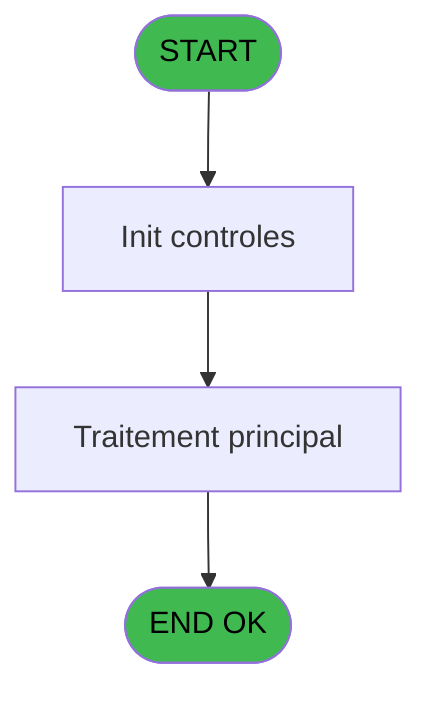
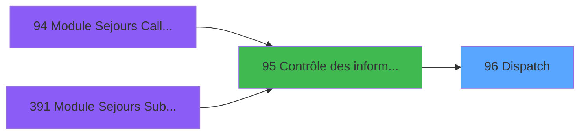
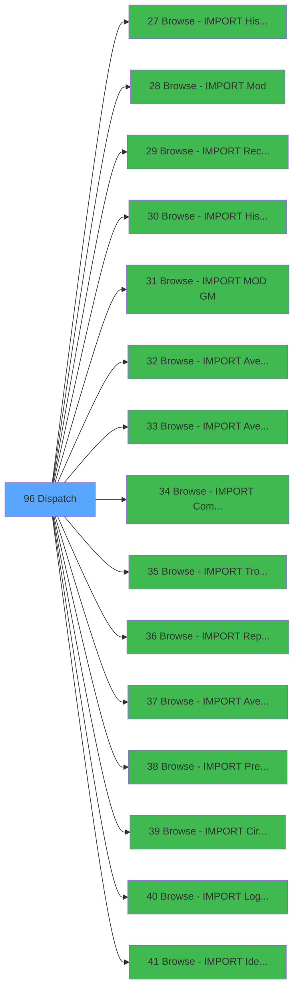

# PBG IDE 96 - Dispatch

> **Analyse**: Phases 1-4 2026-02-03 09:20 -> 09:20 (20s) | Assemblage 09:20
> **Pipeline**: V7.2 Enrichi
> **Structure**: 4 onglets (Resume | Ecrans | Donnees | Connexions)

<!-- TAB:Resume -->

## 1. FICHE D'IDENTITE

| Attribut | Valeur |
|----------|--------|
| Projet | PBG |
| IDE Position | 96 |
| Nom Programme | Dispatch |
| Fichier source | `Prg_96.xml` |
| Domaine metier | General |
| Taches | 1 (0 ecrans visibles) |
| Tables modifiees | 0 |
| Programmes appeles | 15 |

## 2. DESCRIPTION FONCTIONNELLE

**Dispatch** assure la gestion complete de ce processus, accessible depuis [Contrôle des informations (IDE 95)](PBG-IDE-95.md).

Le flux de traitement s'organise en **1 blocs fonctionnels** :

- **Traitement** (1 tache) : traitements metier divers

## 3. BLOCS FONCTIONNELS

### 3.1 Traitement (1 tache)

Traitements internes.

---

#### 96 - Dispatch

**Role** : Traitement : Dispatch.
**Variables liees** : A (ParamDispatch)
**Delegue a** : [Browse - IMPORT Historique Cha (IDE 27)](PBG-IDE-27.md), [Browse - IMPORT Mod (IDE 28)](PBG-IDE-28.md), [Browse - IMPORT Recup N°Chambr (IDE 29)](PBG-IDE-29.md)

## 5. REGLES METIER

*(Aucune regle metier identifiee)*

## 6. CONTEXTE

- **Appele par**: [Contrôle des informations (IDE 95)](PBG-IDE-95.md)
- **Appelle**: 15 programmes | **Tables**: 1 (W:0 R:1 L:0) | **Taches**: 1 | **Expressions**: 25

<!-- TAB:Ecrans -->

## 8. ECRANS

*(Programme sans ecran visible)*

## 9. NAVIGATION

### 9.3 Structure hierarchique (1 tache)

| Position | Tache | Type | Dimensions | Bloc |
|----------|-------|------|------------|------|
| **96.1** | [**Dispatch** (96)](#t1) | MDI | - | Traitement |

### 9.4 Algorigramme

> **Legende**: Vert = START/END OK | Rouge = END KO | Bleu = Decisions
> *Algorigramme auto-genere. Utiliser `/algorigramme` pour une synthese metier detaillee.*

<!-- TAB:Donnees -->

## 10. TABLES

### Tables utilisees (1)

| ID | Nom | Description | Type | R | W | L | Usages |
|----|-----|-------------|------|---|---|---|--------|
| 569 | pointage_articles_caution | Articles et stock | TMP | R |   |   | 1 |

### Colonnes par table (1 / 1 tables avec colonnes identifiees)

Table 569 - pointage_articles_caution (R) - 1 usages

| Lettre | Variable | Acces | Type |
|--------|----------|-------|------|
| A | ParamDispatch | R | Alpha |
| B | ParamRessource | R | Numeric |

## 11. VARIABLES

### 11.1 Autres (2)

Variables diverses.

| Lettre | Nom | Type | Usage dans |
|--------|-----|------|-----------|
| A | ParamDispatch | Alpha | 15x refs |
| B | ParamRessource | Numeric | 1x refs |

## 12. EXPRESSIONS

**25 / 25 expressions decodees (100%)**

### 12.1 Repartition par type

| Type | Expressions | Regles |
|------|-------------|--------|
| REFERENCE_VG | 1 | 0 |
| OTHER | 9 | 0 |
| CONDITION | 15 | 0 |

### 12.2 Expressions cles par type

#### REFERENCE_VG (1 expressions)

| Type | IDE | Expression | Regle |
|------|-----|------------|-------|
| REFERENCE_VG | 1 | `VG20` | - |

#### OTHER (9 expressions)

| Type | IDE | Expression | Regle |
|------|-----|------------|-------|
| OTHER | 8 | `SetParam ('CODE_F',[L])` | - |
| OTHER | 7 | `SetParam ('CODE_C',[K])` | - |
| OTHER | 10 | `SetParam ('CODE_DOSSIER_ORDRE',[I])` | - |
| OTHER | 9 | `SetParam ('CODE_DOSSIER',[H])` | - |
| OTHER | 6 | `SetParam ('CODE_S',[J])` | - |
| ... | | *+4 autres* | |

#### CONDITION (15 expressions)

| Type | IDE | Expression | Regle |
|------|-----|------------|-------|
| CONDITION | 21 | `ParamDispatch [A]='11'` | - |
| CONDITION | 20 | `ParamDispatch [A]='10'` | - |
| CONDITION | 19 | `ParamDispatch [A]='09'` | - |
| CONDITION | 22 | `ParamDispatch [A]='12'` | - |
| CONDITION | 25 | `ParamDispatch [A]='15'` | - |
| ... | | *+10 autres* | |

### 12.3 Toutes les expressions (25)

Voir les 25 expressions

#### REFERENCE_VG (1)

| IDE | Expression Decodee |
|-----|-------------------|
| 1 | `VG20` |

#### OTHER (9)

| IDE | Expression Decodee |
|-----|-------------------|
| 2 | `ParamRessource [B]` |
| 3 | `SetParam ('CODE_CAT',[E])` |
| 4 | `SetParam ('CODE_CAA',[F])` |
| 5 | `SetParam ('CODE_CAF',[G])` |
| 6 | `SetParam ('CODE_S',[J])` |
| 7 | `SetParam ('CODE_C',[K])` |
| 8 | `SetParam ('CODE_F',[L])` |
| 9 | `SetParam ('CODE_DOSSIER',[H])` |
| 10 | `SetParam ('CODE_DOSSIER_ORDRE',[I])` |

#### CONDITION (15)

| IDE | Expression Decodee |
|-----|-------------------|
| 11 | `ParamDispatch [A]='01'` |
| 12 | `ParamDispatch [A]='02'` |
| 13 | `ParamDispatch [A]='03'` |
| 14 | `ParamDispatch [A]='04'` |
| 15 | `ParamDispatch [A]='05'` |
| 16 | `ParamDispatch [A]='06'` |
| 17 | `ParamDispatch [A]='07'` |
| 18 | `ParamDispatch [A]='08'` |
| 19 | `ParamDispatch [A]='09'` |
| 20 | `ParamDispatch [A]='10'` |
| 21 | `ParamDispatch [A]='11'` |
| 22 | `ParamDispatch [A]='12'` |
| 23 | `ParamDispatch [A]='13'` |
| 24 | `ParamDispatch [A]='14'` |
| 25 | `ParamDispatch [A]='15'` |

<!-- TAB:Connexions -->

## 13. GRAPHE D'APPELS

### 13.1 Chaine depuis Main (Callers)

Main -> ... -> [Contrôle des informations (IDE 95)](PBG-IDE-95.md) -> **Dispatch (IDE 96)**

### 13.2 Callers

| IDE | Nom Programme | Nb Appels |
|-----|---------------|-----------|
| [95](PBG-IDE-95.md) | Contrôle des informations | 15 |

### 13.3 Callees (programmes appeles)

### 13.4 Detail Callees avec contexte

| IDE | Nom Programme | Appels | Contexte |
|-----|---------------|--------|----------|
| [27](PBG-IDE-27.md) | Browse - IMPORT Historique Cha | 1 | Historique/consultation |
| [28](PBG-IDE-28.md) | Browse - IMPORT Mod | 1 | Sous-programme |
| [29](PBG-IDE-29.md) | Browse - IMPORT Recup N°Chambr | 1 | Recuperation donnees |
| [30](PBG-IDE-30.md) | Browse - IMPORT Historique Cha | 1 | Historique/consultation |
| [31](PBG-IDE-31.md) | Browse - IMPORT MOD GM | 1 | Sous-programme |
| [32](PBG-IDE-32.md) | Browse - IMPORT Avertiss. MOD | 1 | Sous-programme |
| [33](PBG-IDE-33.md) | Browse - IMPORT Avertiss. AN/V | 1 | Sous-programme |
| [34](PBG-IDE-34.md) | Browse - IMPORT Commentai IMO | 1 | Sous-programme |
| [35](PBG-IDE-35.md) | Browse - IMPORT Troncon   IMT | 1 | Sous-programme |
| [36](PBG-IDE-36.md) | Browse - IMPORT Reprise   IMR | 1 | Sous-programme |
| [37](PBG-IDE-37.md) | Browse - IMPORT Avertiss. IMA | 1 | Sous-programme |
| [38](PBG-IDE-38.md) | Browse - IMPORT PrestationIMP | 1 | Sous-programme |
| [39](PBG-IDE-39.md) | Browse - IMPORT Circuit   IMC | 1 | Sous-programme |
| [40](PBG-IDE-40.md) | Browse - IMPORT Logement  IML | 1 | Sous-programme |
| [41](PBG-IDE-41.md) | Browse - IMPORT Identite  IMI | 1 | Sous-programme |

## 14. RECOMMANDATIONS MIGRATION

### 14.1 Profil du programme

| Metrique | Valeur | Impact migration |
|----------|--------|-----------------|
| Lignes de logique | 57 | Programme compact |
| Expressions | 25 | Peu de logique |
| Tables WRITE | 0 | Impact faible |
| Sous-programmes | 15 | Forte dependance |
| Ecrans visibles | 0 | Ecran unique ou traitement batch |
| Code desactive | 0% (0 / 57) | Code sain |
| Regles metier | 0 | Pas de regle identifiee |

### 14.2 Plan de migration par bloc

#### Traitement (1 tache: 0 ecran, 1 traitement)

- **Strategie** : 1 service(s) backend injectable(s) (Domain Services).
- 15 sous-programme(s) a migrer ou a reutiliser depuis les services existants.
- Decomposer les taches en services unitaires testables.

### 14.3 Dependances critiques

| Dependance | Type | Appels | Impact |
|------------|------|--------|--------|
| [Browse - IMPORT Avertiss. IMA (IDE 37)](PBG-IDE-37.md) | Sous-programme | 1x | Normale - Sous-programme |
| [Browse - IMPORT Reprise   IMR (IDE 36)](PBG-IDE-36.md) | Sous-programme | 1x | Normale - Sous-programme |
| [Browse - IMPORT Troncon   IMT (IDE 35)](PBG-IDE-35.md) | Sous-programme | 1x | Normale - Sous-programme |
| [Browse - IMPORT PrestationIMP (IDE 38)](PBG-IDE-38.md) | Sous-programme | 1x | Normale - Sous-programme |
| [Browse - IMPORT Identite  IMI (IDE 41)](PBG-IDE-41.md) | Sous-programme | 1x | Normale - Sous-programme |
| [Browse - IMPORT Logement  IML (IDE 40)](PBG-IDE-40.md) | Sous-programme | 1x | Normale - Sous-programme |
| [Browse - IMPORT Circuit   IMC (IDE 39)](PBG-IDE-39.md) | Sous-programme | 1x | Normale - Sous-programme |
| [Browse - IMPORT Commentai IMO (IDE 34)](PBG-IDE-34.md) | Sous-programme | 1x | Normale - Sous-programme |
| [Browse - IMPORT Recup N°Chambr (IDE 29)](PBG-IDE-29.md) | Sous-programme | 1x | Normale - Recuperation donnees |
| [Browse - IMPORT Mod (IDE 28)](PBG-IDE-28.md) | Sous-programme | 1x | Normale - Sous-programme |

---
*Spec DETAILED generee par Pipeline V7.2 - 2026-02-03 09:20*
