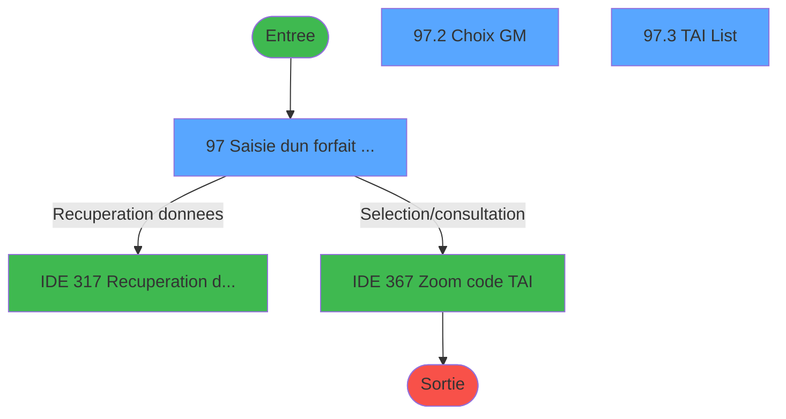
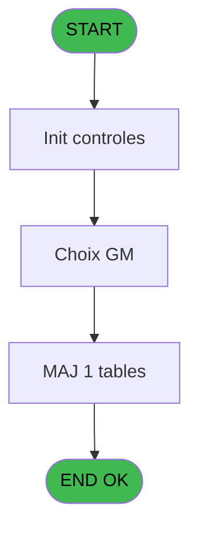
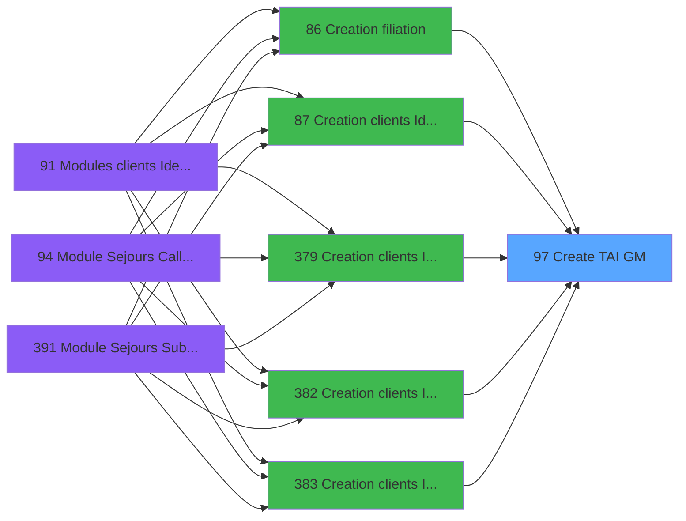
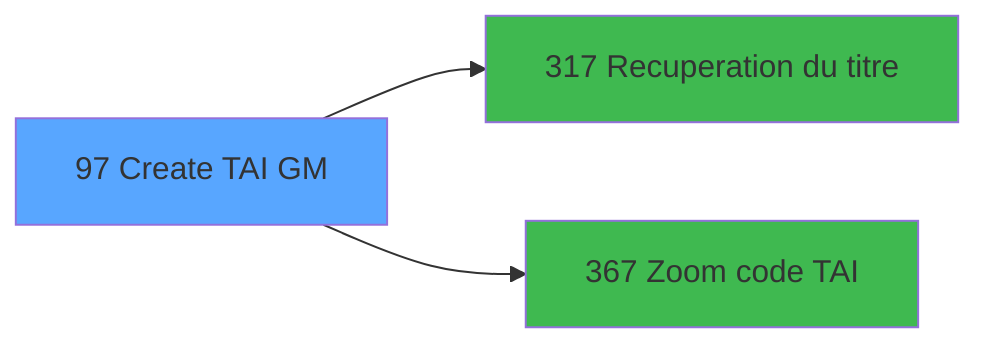

# PBG IDE 97 - Create TAI GM

> **Analyse**: Phases 1-4 2026-02-03 09:20 -> 09:21 (21s) | Assemblage 09:21
> **Pipeline**: V7.2 Enrichi
> **Structure**: 4 onglets (Resume | Ecrans | Donnees | Connexions)

<!-- TAB:Resume -->

## 1. FICHE D'IDENTITE

| Attribut | Valeur |
|----------|--------|
| Projet | PBG |
| IDE Position | 97 |
| Nom Programme | Create TAI GM |
| Fichier source | `Prg_97.xml` |
| Domaine metier | General |
| Taches | 6 (3 ecrans visibles) |
| Tables modifiees | 1 |
| Programmes appeles | 2 |

## 2. DESCRIPTION FONCTIONNELLE

**Create TAI GM** assure la gestion complete de ce processus, accessible depuis [Creation clients Identite (IDE 87)](PBG-IDE-87.md), [Creation clients Identite SAV (IDE 379)](PBG-IDE-379.md), [Creation clients Identite P185 (IDE 382)](PBG-IDE-382.md), [Creation clients Identite PROD (IDE 383)](PBG-IDE-383.md), [Creation clients Identite en c (IDE 384)](PBG-IDE-384.md), [Creation clients Identite SAV* (IDE 386)](PBG-IDE-386.md), [Creation clients Identite_sav (IDE 387)](PBG-IDE-387.md), [Creation filiation (IDE 86)](PBG-IDE-86.md).

Le flux de traitement s'organise en **6 blocs fonctionnels** :

- **Traitement** (1 tache) : traitements metier divers
- **Initialisation** (1 tache) : reinitialisation d'etats et de variables de travail
- **Calcul** (1 tache) : calculs de montants, stocks ou compteurs
- **Saisie** (1 tache) : ecrans de saisie utilisateur (formulaires, champs, donnees)
- **Creation** (1 tache) : insertion d'enregistrements en base (mouvements, prestations)
- **Consultation** (1 tache) : ecrans de recherche, selection et consultation

**Donnees modifiees** : 1 tables en ecriture (heure_de_passage).

**Logique metier** : 1 regles identifiees couvrant conditions metier.

Detail : phases du traitement

#### Phase 1 : Saisie (1 tache)

- **97** - Saisie d'un forfait TAI GM **[[ECRAN]](#ecran-t1)**

#### Phase 2 : Creation (1 tache)

- **97.1** - Creation TAIGM

#### Phase 3 : Consultation (1 tache)

- **97.2** - Choix GM **[[ECRAN]](#ecran-t3)**

Delegue a : [Recuperation du titre (IDE 317)](PBG-IDE-317.md), [Zoom code TAI (IDE 367)](PBG-IDE-367.md)

#### Phase 4 : Traitement (1 tache)

- **97.3** - TAI List **[[ECRAN]](#ecran-t4)**

Delegue a : [Recuperation du titre (IDE 317)](PBG-IDE-317.md)

#### Phase 5 : Initialisation (1 tache)

- **97.4** - RAZ info

#### Phase 6 : Calcul (1 tache)

- **97.5** - Calcul forfait unique

#### Tables impactees

| Table | Operations | Role metier |
|-------|-----------|-------------|
| heure_de_passage | **W**/L (3 usages) |  |

## 3. BLOCS FONCTIONNELS

### 3.1 Saisie (1 tache)

L'operateur saisit les donnees de la transaction via 1 ecran (Saisie d'un forfait TAI GM).

---

#### 97 - Saisie d'un forfait TAI GM [[ECRAN]](#ecran-t1)

**Role** : Saisie des donnees : Saisie d'un forfait TAI GM.
**Ecran** : 1174 x 249 DLU (MDI) | [Voir mockup](#ecran-t1)
**Variables liees** : L (W0 FIN SAISIE FORFAIT), T (W0 Date debut forfait), V (W0 date fin forfait), Y (W0 Code Forfait), BA (V Titre saisie TAI NA)

### 3.2 Creation (1 tache)

Insertion de nouveaux enregistrements en base.

---

#### 97.1 - Creation TAIGM

**Role** : Creation d'enregistrement : Creation TAIGM.

### 3.3 Consultation (1 tache)

Ecrans de recherche et consultation.

---

#### 97.2 - Choix GM [[ECRAN]](#ecran-t3)

**Role** : Selection par l'operateur : Choix GM.
**Ecran** : 795 x 162 DLU (MDI) | [Voir mockup](#ecran-t3)
**Variables liees** : P (Bouton choix compte), Z (Bouton choix forfait)
**Delegue a** : [Zoom code TAI (IDE 367)](PBG-IDE-367.md)

### 3.4 Traitement (1 tache)

Traitements internes.

---

#### 97.3 - TAI List [[ECRAN]](#ecran-t4)

**Role** : Traitement : TAI List.
**Ecran** : 800 x 164 DLU (MDI) | [Voir mockup](#ecran-t4)
**Delegue a** : [Recuperation du titre (IDE 317)](PBG-IDE-317.md)

### 3.5 Initialisation (1 tache)

Reinitialisation d'etats et variables de travail.

---

#### 97.4 - RAZ info

**Role** : Reinitialisation : RAZ info.

### 3.6 Calcul (1 tache)

Calculs metier : montants, stocks, compteurs.

---

#### 97.5 - Calcul forfait unique

**Role** : Calcul : Calcul forfait unique.
**Variables liees** : L (W0 FIN SAISIE FORFAIT), T (W0 Date debut forfait), V (W0 date fin forfait), Y (W0 Code Forfait), S (Existe Forfait)

## 5. REGLES METIER

1 regles identifiees:

### Saisie (1 regles)

#### [RM-001] Si Date ()>W0 Code Forfait [Y] alors Date () sinon W0 Code Forfait [Y])

| Element | Detail |
|---------|--------|
| **Condition** | `Date ()>W0 Code Forfait [Y]` |
| **Si vrai** | Date () |
| **Si faux** | W0 Code Forfait [Y]) |
| **Variables** | Y (W0 Code Forfait) |
| **Expression source** | Expression 30 : `IF (Date ()>W0 Code Forfait [Y],Date (),W0 Code Forfait [Y])` |
| **Exemple** | Si Date ()>W0 Code Forfait [Y] → Date (). Sinon → W0 Code Forfait [Y]) |
| **Impact** | Bloc Saisie |

## 6. CONTEXTE

- **Appele par**: [Creation clients Identite (IDE 87)](PBG-IDE-87.md), [Creation clients Identite SAV (IDE 379)](PBG-IDE-379.md), [Creation clients Identite P185 (IDE 382)](PBG-IDE-382.md), [Creation clients Identite PROD (IDE 383)](PBG-IDE-383.md), [Creation clients Identite en c (IDE 384)](PBG-IDE-384.md), [Creation clients Identite SAV* (IDE 386)](PBG-IDE-386.md), [Creation clients Identite_sav (IDE 387)](PBG-IDE-387.md), [Creation filiation (IDE 86)](PBG-IDE-86.md)
- **Appelle**: 2 programmes | **Tables**: 8 (W:1 R:3 L:7) | **Taches**: 6 | **Expressions**: 35

<!-- TAB:Ecrans -->

## 8. ECRANS

### 8.1 Forms visibles (3 / 6)

| # | Position | Tache | Nom | Type | Largeur | Hauteur | Bloc |
|---|----------|-------|-----|------|---------|---------|------|
| 1 | 97 | 97 | Saisie d'un forfait TAI GM | MDI | 1174 | 249 | Saisie |
| 2 | 97.2 | 97.2 | Choix GM | MDI | 795 | 162 | Consultation |
| 3 | 97.3 | 97.3 | TAI List | MDI | 800 | 164 | Traitement |

### 8.2 Mockups Ecrans

---

#### 97 - Saisie d'un forfait TAI GM
**Tache** : [97](#t1) | **Type** : MDI | **Dimensions** : 1174 x 249 DLU
**Bloc** : Saisie | **Titre IDE** : Saisie d'un forfait TAI GM

<!-- FORM-DATA:
{
    "width":  1174,
    "vFactor":  8,
    "type":  "MDI",
    "hFactor":  8,
    "controls":  [
                     {
                         "x":  2,
                         "type":  "label",
                         "var":  "",
                         "y":  2,
                         "w":  1164,
                         "fmt":  "",
                         "name":  "",
                         "h":  17,
                         "color":  "",
                         "text":  "",
                         "parent":  null
                     },
                     {
                         "x":  260,
                         "type":  "label",
                         "var":  "",
                         "y":  29,
                         "w":  807,
                         "fmt":  "",
                         "name":  "",
                         "h":  178,
                         "color":  "",
                         "text":  "",
                         "parent":  null
                     },
                     {
                         "x":  274,
                         "type":  "label",
                         "var":  "",
                         "y":  34,
                         "w":  786,
                         "fmt":  "",
                         "name":  "",
                         "h":  97,
                         "color":  "",
                         "text":  "",
                         "parent":  null
                     },
                     {
                         "x":  290,
                         "type":  "label",
                         "var":  "",
                         "y":  38,
                         "w":  391,
                         "fmt":  "",
                         "name":  "",
                         "h":  8,
                         "color":  "",
                         "text":  "Identification du compte",
                         "parent":  null
                     },
                     {
                         "x":  288,
                         "type":  "label",
                         "var":  "",
                         "y":  59,
                         "w":  110,
                         "fmt":  "",
                         "name":  "",
                         "h":  10,
                         "color":  "",
                         "text":  "Nom",
                         "parent":  null
                     },
                     {
                         "x":  778,
                         "type":  "label",
                         "var":  "",
                         "y":  59,
                         "w":  98,
                         "fmt":  "",
                         "name":  "",
                         "h":  10,
                         "color":  "",
                         "text":  "Prenom",
                         "parent":  null
                     },
                     {
                         "x":  778,
                         "type":  "label",
                         "var":  "",
                         "y":  76,
                         "w":  98,
                         "fmt":  "",
                         "name":  "",
                         "h":  10,
                         "color":  "",
                         "text":  "Compte",
                         "parent":  null
                     },
                     {
                         "x":  703,
                         "type":  "label",
                         "var":  "",
                         "y":  98,
                         "w":  171,
                         "fmt":  "",
                         "name":  "",
                         "h":  10,
                         "color":  "",
                         "text":  "Date debut sejour",
                         "parent":  null
                     },
                     {
                         "x":  703,
                         "type":  "label",
                         "var":  "",
                         "y":  115,
                         "w":  171,
                         "fmt":  "",
                         "name":  "",
                         "h":  10,
                         "color":  "",
                         "text":  "Date fin sejour",
                         "parent":  null
                     },
                     {
                         "x":  274,
                         "type":  "label",
                         "var":  "",
                         "y":  135,
                         "w":  786,
                         "fmt":  "",
                         "name":  "",
                         "h":  67,
                         "color":  "",
                         "text":  "",
                         "parent":  null
                     },
                     {
                         "x":  290,
                         "type":  "label",
                         "var":  "",
                         "y":  139,
                         "w":  391,
                         "fmt":  "",
                         "name":  "",
                         "h":  8,
                         "color":  "",
                         "text":  "Identification du forfait TAI",
                         "parent":  null
                     },
                     {
                         "x":  711,
                         "type":  "label",
                         "var":  "",
                         "y":  155,
                         "w":  171,
                         "fmt":  "",
                         "name":  "",
                         "h":  11,
                         "color":  "",
                         "text":  "Date debut forfait",
                         "parent":  null
                     },
                     {
                         "x":  288,
                         "type":  "label",
                         "var":  "",
                         "y":  157,
                         "w":  110,
                         "fmt":  "",
                         "name":  "",
                         "h":  10,
                         "color":  "",
                         "text":  "Code Forfait",
                         "parent":  null
                     },
                     {
                         "x":  711,
                         "type":  "label",
                         "var":  "",
                         "y":  174,
                         "w":  120,
                         "fmt":  "",
                         "name":  "",
                         "h":  11,
                         "color":  "",
                         "text":  "Date fin forfait",
                         "parent":  null
                     },
                     {
                         "x":  0,
                         "type":  "label",
                         "var":  "",
                         "y":  216,
                         "w":  1168,
                         "fmt":  "",
                         "name":  "",
                         "h":  24,
                         "color":  "",
                         "text":  "",
                         "parent":  null
                     },
                     {
                         "x":  899,
                         "type":  "button",
                         "var":  "",
                         "y":  219,
                         "w":  168,
                         "fmt":  "",
                         "name":  "Bouton ABANDON",
                         "h":  18,
                         "color":  "",
                         "text":  "",
                         "parent":  null
                     },
                     {
                         "x":  412,
                         "type":  "edit",
                         "var":  "",
                         "y":  59,
                         "w":  281,
                         "fmt":  "U30",
                         "name":  "W0 Nom du GM",
                         "h":  10,
                         "color":  "110",
                         "text":  "",
                         "parent":  null
                     },
                     {
                         "x":  875,
                         "type":  "edit",
                         "var":  "",
                         "y":  59,
                         "w":  104,
                         "fmt":  "",
                         "name":  "",
                         "h":  10,
                         "color":  "110",
                         "text":  "",
                         "parent":  null
                     },
                     {
                         "x":  288,
                         "type":  "button",
                         "var":  "",
                         "y":  108,
                         "w":  306,
                         "fmt":  "",
                         "name":  "Bouton choix compte",
                         "h":  17,
                         "color":  "",
                         "text":  "",
                         "parent":  null
                     },
                     {
                         "x":  875,
                         "type":  "edit",
                         "var":  "",
                         "y":  76,
                         "w":  104,
                         "fmt":  "8Z",
                         "name":  "",
                         "h":  10,
                         "color":  "110",
                         "text":  "",
                         "parent":  null
                     },
                     {
                         "x":  999,
                         "type":  "edit",
                         "var":  "",
                         "y":  76,
                         "w":  48,
                         "fmt":  "3Z",
                         "name":  "",
                         "h":  10,
                         "color":  "110",
                         "text":  "",
                         "parent":  null
                     },
                     {
                         "x":  875,
                         "type":  "edit",
                         "var":  "",
                         "y":  98,
                         "w":  126,
                         "fmt":  "##/##/####Z",
                         "name":  "",
                         "h":  10,
                         "color":  "110",
                         "text":  "",
                         "parent":  null
                     },
                     {
                         "x":  875,
                         "type":  "edit",
                         "var":  "",
                         "y":  115,
                         "w":  126,
                         "fmt":  "##/##/####Z",
                         "name":  "",
                         "h":  10,
                         "color":  "110",
                         "text":  "",
                         "parent":  null
                     },
                     {
                         "x":  875,
                         "type":  "edit",
                         "var":  "",
                         "y":  155,
                         "w":  126,
                         "fmt":  "##/##/####Z",
                         "name":  "W0 Date debut forfait",
                         "h":  11,
                         "color":  "110",
                         "text":  "",
                         "parent":  null
                     },
                     {
                         "x":  1016,
                         "type":  "button",
                         "var":  "",
                         "y":  155,
                         "w":  27,
                         "fmt":  "...",
                         "name":  "CALDEB",
                         "h":  11,
                         "color":  "",
                         "text":  "",
                         "parent":  null
                     },
                     {
                         "x":  875,
                         "type":  "edit",
                         "var":  "",
                         "y":  174,
                         "w":  126,
                         "fmt":  "##/##/####Z",
                         "name":  "W0 date fin forfait",
                         "h":  11,
                         "color":  "110",
                         "text":  "",
                         "parent":  null
                     },
                     {
                         "x":  1016,
                         "type":  "button",
                         "var":  "",
                         "y":  174,
                         "w":  27,
                         "fmt":  "...",
                         "name":  "CALFIN",
                         "h":  11,
                         "color":  "",
                         "text":  "",
                         "parent":  null
                     },
                     {
                         "x":  412,
                         "type":  "edit",
                         "var":  "",
                         "y":  157,
                         "w":  82,
                         "fmt":  "",
                         "name":  "W0 Code Forfait",
                         "h":  10,
                         "color":  "110",
                         "text":  "",
                         "parent":  null
                     },
                     {
                         "x":  288,
                         "type":  "button",
                         "var":  "",
                         "y":  181,
                         "w":  306,
                         "fmt":  "",
                         "name":  "Bouton choix forfait",
                         "h":  17,
                         "color":  "",
                         "text":  "",
                         "parent":  null
                     },
                     {
                         "x":  260,
                         "type":  "button",
                         "var":  "",
                         "y":  219,
                         "w":  168,
                         "fmt":  "\u0026Ok",
                         "name":  "Bouton Ok",
                         "h":  18,
                         "color":  "",
                         "text":  "",
                         "parent":  null
                     },
                     {
                         "x":  8,
                         "type":  "edit",
                         "var":  "",
                         "y":  6,
                         "w":  267,
                         "fmt":  "20",
                         "name":  "",
                         "h":  8,
                         "color":  "",
                         "text":  "",
                         "parent":  null
                     },
                     {
                         "x":  958,
                         "type":  "edit",
                         "var":  "",
                         "y":  6,
                         "w":  203,
                         "fmt":  "WWW DD MMM YYYYT",
                         "name":  "",
                         "h":  8,
                         "color":  "",
                         "text":  "",
                         "parent":  null
                     },
                     {
                         "x":  40,
                         "type":  "image",
                         "var":  "",
                         "y":  74,
                         "w":  184,
                         "fmt":  "",
                         "name":  "",
                         "h":  93,
                         "color":  "",
                         "text":  "",
                         "parent":  null
                     }
                 ],
    "taskId":  "97",
    "height":  249
}
-->

<strong>Champs : 11 champs</strong>

| Pos (x,y) | Nom | Variable | Type |
|-----------|-----|----------|------|
| 412,59 | W0 Nom du GM | - | edit |
| 875,59 | (sans nom) | - | edit |
| 875,76 | 8Z | - | edit |
| 999,76 | 3Z | - | edit |
| 875,98 | ##/##/####Z | - | edit |
| 875,115 | ##/##/####Z | - | edit |
| 875,155 | W0 Date debut forfait | - | edit |
| 875,174 | W0 date fin forfait | - | edit |
| 412,157 | W0 Code Forfait | - | edit |
| 8,6 | 20 | - | edit |
| 958,6 | WWW DD MMM YYYYT | - | edit |

<strong>Boutons : 6 boutons</strong>

| Bouton | Pos (x,y) | Action |
|--------|-----------|--------|
| ABANDON | 899,219 | Annule et retour au menu |
| choix compte | 288,108 | Bouton fonctionnel |
| ... | 1016,155 | Bouton fonctionnel |
| ... | 1016,174 | Bouton fonctionnel |
| choix forfait | 288,181 | Bouton fonctionnel |
| Ok | 260,219 | Valide la saisie et enregistre |

---

#### 97.2 - Choix GM
**Tache** : [97.2](#t3) | **Type** : MDI | **Dimensions** : 795 x 162 DLU
**Bloc** : Consultation | **Titre IDE** : Choix GM

<!-- FORM-DATA:
{
    "width":  795,
    "vFactor":  8,
    "type":  "MDI",
    "hFactor":  8,
    "controls":  [
                     {
                         "x":  6,
                         "type":  "label",
                         "var":  "",
                         "y":  4,
                         "w":  784,
                         "fmt":  "",
                         "name":  "",
                         "h":  17,
                         "color":  "",
                         "text":  "",
                         "parent":  null
                     },
                     {
                         "x":  28,
                         "type":  "table",
                         "var":  "",
                         "name":  "",
                         "titleH":  12,
                         "color":  "110",
                         "w":  746,
                         "y":  29,
                         "fmt":  "",
                         "parent":  null,
                         "text":  "",
                         "rowH":  14,
                         "h":  101,
                         "cols":  [
                                      {
                                          "title":  "Nom",
                                          "layer":  1,
                                          "w":  300
                                      },
                                      {
                                          "title":  "Prénom",
                                          "layer":  2,
                                          "w":  168
                                      },
                                      {
                                          "title":  "Début séjour",
                                          "layer":  3,
                                          "w":  119
                                      },
                                      {
                                          "title":  "Fin séjour",
                                          "layer":  4,
                                          "w":  127
                                      }
                                  ],
                         "rows":  4
                     },
                     {
                         "x":  6,
                         "type":  "label",
                         "var":  "",
                         "y":  136,
                         "w":  784,
                         "fmt":  "",
                         "name":  "",
                         "h":  24,
                         "color":  "",
                         "text":  "",
                         "parent":  null
                     },
                     {
                         "x":  34,
                         "type":  "edit",
                         "var":  "",
                         "y":  43,
                         "w":  291,
                         "fmt":  "",
                         "name":  "GMR Nom",
                         "h":  10,
                         "color":  "110",
                         "text":  "",
                         "parent":  4
                     },
                     {
                         "x":  334,
                         "type":  "edit",
                         "var":  "",
                         "y":  43,
                         "w":  154,
                         "fmt":  "8",
                         "name":  "",
                         "h":  10,
                         "color":  "110",
                         "text":  "",
                         "parent":  4
                     },
                     {
                         "x":  502,
                         "type":  "edit",
                         "var":  "",
                         "y":  43,
                         "w":  112,
                         "fmt":  "##/##/####",
                         "name":  "",
                         "h":  10,
                         "color":  "110",
                         "text":  "",
                         "parent":  4
                     },
                     {
                         "x":  622,
                         "type":  "edit",
                         "var":  "",
                         "y":  43,
                         "w":  112,
                         "fmt":  "##/##/####",
                         "name":  "",
                         "h":  10,
                         "color":  "110",
                         "text":  "",
                         "parent":  4
                     },
                     {
                         "x":  19,
                         "type":  "button",
                         "var":  "",
                         "y":  139,
                         "w":  154,
                         "fmt":  "Choix",
                         "name":  "Choix",
                         "h":  18,
                         "color":  "",
                         "text":  "",
                         "parent":  null
                     },
                     {
                         "x":  19,
                         "type":  "edit",
                         "var":  "",
                         "y":  8,
                         "w":  240,
                         "fmt":  "30",
                         "name":  "",
                         "h":  8,
                         "color":  "",
                         "text":  "",
                         "parent":  null
                     },
                     {
                         "x":  541,
                         "type":  "edit",
                         "var":  "",
                         "y":  8,
                         "w":  240,
                         "fmt":  "WWW DD MMM YYYYT",
                         "name":  "",
                         "h":  8,
                         "color":  "",
                         "text":  "",
                         "parent":  null
                     },
                     {
                         "x":  627,
                         "type":  "button",
                         "var":  "",
                         "y":  139,
                         "w":  154,
                         "fmt":  "Abandon",
                         "name":  "Abandon",
                         "h":  18,
                         "color":  "",
                         "text":  "",
                         "parent":  null
                     }
                 ],
    "taskId":  "97.2",
    "height":  162
}
-->

<strong>Champs : 6 champs</strong>

| Pos (x,y) | Nom | Variable | Type |
|-----------|-----|----------|------|
| 34,43 | GMR Nom | - | edit |
| 334,43 | 8 | - | edit |
| 502,43 | ##/##/#### | - | edit |
| 622,43 | ##/##/#### | - | edit |
| 19,8 | 30 | - | edit |
| 541,8 | WWW DD MMM YYYYT | - | edit |

<strong>Boutons : 2 boutons</strong>

| Bouton | Pos (x,y) | Action |
|--------|-----------|--------|
| Choix | 19,139 | Bouton fonctionnel |
| Abandon | 627,139 | Annule et retour au menu |

---

#### 97.3 - TAI List
**Tache** : [97.3](#t4) | **Type** : MDI | **Dimensions** : 800 x 164 DLU
**Bloc** : Traitement | **Titre IDE** : TAI List

<!-- FORM-DATA:
{
    "width":  800,
    "vFactor":  8,
    "type":  "MDI",
    "hFactor":  8,
    "controls":  [
                     {
                         "x":  8,
                         "type":  "label",
                         "var":  "",
                         "y":  4,
                         "w":  784,
                         "fmt":  "",
                         "name":  "",
                         "h":  18,
                         "color":  "",
                         "text":  "",
                         "parent":  null
                     },
                     {
                         "x":  8,
                         "type":  "table",
                         "var":  "",
                         "name":  "",
                         "titleH":  12,
                         "color":  "110",
                         "w":  782,
                         "y":  27,
                         "fmt":  "",
                         "parent":  null,
                         "text":  "",
                         "rowH":  12,
                         "h":  73,
                         "cols":  [
                                      {
                                          "title":  "Code",
                                          "layer":  1,
                                          "w":  90
                                      },
                                      {
                                          "title":  "Libellé Forfait",
                                          "layer":  2,
                                          "w":  152
                                      },
                                      {
                                          "title":  "Date Début",
                                          "layer":  3,
                                          "w":  117
                                      },
                                      {
                                          "title":  "Date Fin",
                                          "layer":  4,
                                          "w":  114
                                      },
                                      {
                                          "title":  "Nom",
                                          "layer":  5,
                                          "w":  175
                                      },
                                      {
                                          "title":  "Compte",
                                          "layer":  6,
                                          "w":  102
                                      }
                                  ],
                         "rows":  6
                     },
                     {
                         "x":  8,
                         "type":  "label",
                         "var":  "",
                         "y":  136,
                         "w":  784,
                         "fmt":  "",
                         "name":  "",
                         "h":  24,
                         "color":  "",
                         "text":  "",
                         "parent":  null
                     },
                     {
                         "x":  258,
                         "type":  "edit",
                         "var":  "",
                         "y":  41,
                         "w":  107,
                         "fmt":  "",
                         "name":  "",
                         "h":  10,
                         "color":  "110",
                         "text":  "",
                         "parent":  4
                     },
                     {
                         "x":  374,
                         "type":  "edit",
                         "var":  "",
                         "y":  41,
                         "w":  104,
                         "fmt":  "",
                         "name":  "",
                         "h":  10,
                         "color":  "110",
                         "text":  "",
                         "parent":  4
                     },
                     {
                         "x":  16,
                         "type":  "edit",
                         "var":  "",
                         "y":  41,
                         "w":  76,
                         "fmt":  "",
                         "name":  "TAI Code Forfait",
                         "h":  10,
                         "color":  "110",
                         "text":  "",
                         "parent":  4
                     },
                     {
                         "x":  10,
                         "type":  "edit",
                         "var":  "",
                         "y":  120,
                         "w":  88,
                         "fmt":  "",
                         "name":  "",
                         "h":  10,
                         "color":  "144",
                         "text":  "",
                         "parent":  null
                     },
                     {
                         "x":  113,
                         "type":  "edit",
                         "var":  "",
                         "y":  120,
                         "w":  160,
                         "fmt":  "N12.3Z",
                         "name":  "",
                         "h":  10,
                         "color":  "171",
                         "text":  "",
                         "parent":  null
                     },
                     {
                         "x":  19,
                         "type":  "edit",
                         "var":  "",
                         "y":  9,
                         "w":  232,
                         "fmt":  "30",
                         "name":  "",
                         "h":  8,
                         "color":  "",
                         "text":  "",
                         "parent":  null
                     },
                     {
                         "x":  578,
                         "type":  "edit",
                         "var":  "",
                         "y":  9,
                         "w":  203,
                         "fmt":  "WWW DD MMM YYYYT",
                         "name":  "",
                         "h":  8,
                         "color":  "",
                         "text":  "",
                         "parent":  null
                     },
                     {
                         "x":  104,
                         "type":  "edit",
                         "var":  "",
                         "y":  41,
                         "w":  137,
                         "fmt":  "30",
                         "name":  "",
                         "h":  10,
                         "color":  "110",
                         "text":  "",
                         "parent":  4
                     },
                     {
                         "x":  486,
                         "type":  "edit",
                         "var":  "",
                         "y":  41,
                         "w":  165,
                         "fmt":  "30",
                         "name":  "",
                         "h":  10,
                         "color":  "110",
                         "text":  "",
                         "parent":  4
                     },
                     {
                         "x":  662,
                         "type":  "edit",
                         "var":  "",
                         "y":  41,
                         "w":  96,
                         "fmt":  "30",
                         "name":  "",
                         "h":  10,
                         "color":  "110",
                         "text":  "",
                         "parent":  4
                     },
                     {
                         "x":  10,
                         "type":  "edit",
                         "var":  "",
                         "y":  106,
                         "w":  88,
                         "fmt":  "4",
                         "name":  "",
                         "h":  10,
                         "color":  "144",
                         "text":  "",
                         "parent":  null
                     },
                     {
                         "x":  104,
                         "type":  "edit",
                         "var":  "",
                         "y":  106,
                         "w":  137,
                         "fmt":  "30",
                         "name":  "",
                         "h":  10,
                         "color":  "",
                         "text":  "",
                         "parent":  null
                     },
                     {
                         "x":  280,
                         "type":  "edit",
                         "var":  "",
                         "y":  120,
                         "w":  360,
                         "fmt":  "100",
                         "name":  "",
                         "h":  10,
                         "color":  "",
                         "text":  "",
                         "parent":  null
                     },
                     {
                         "x":  649,
                         "type":  "edit",
                         "var":  "",
                         "y":  120,
                         "w":  144,
                         "fmt":  "30",
                         "name":  "",
                         "h":  10,
                         "color":  "171",
                         "text":  "",
                         "parent":  null
                     },
                     {
                         "x":  612,
                         "type":  "button",
                         "var":  "",
                         "y":  139,
                         "w":  168,
                         "fmt":  "Exit",
                         "name":  "",
                         "h":  18,
                         "color":  "",
                         "text":  "",
                         "parent":  null
                     }
                 ],
    "taskId":  "97.3",
    "height":  164
}
-->

<strong>Champs : 14 champs</strong>

| Pos (x,y) | Nom | Variable | Type |
|-----------|-----|----------|------|
| 258,41 | (sans nom) | - | edit |
| 374,41 | (sans nom) | - | edit |
| 16,41 | TAI Code Forfait | - | edit |
| 10,120 | (sans nom) | - | edit |
| 113,120 | N12.3Z | - | edit |
| 19,9 | 30 | - | edit |
| 578,9 | WWW DD MMM YYYYT | - | edit |
| 104,41 | 30 | - | edit |
| 486,41 | 30 | - | edit |
| 662,41 | 30 | - | edit |
| 10,106 | 4 | - | edit |
| 104,106 | 30 | - | edit |
| 280,120 | 100 | - | edit |
| 649,120 | 30 | - | edit |

<strong>Boutons : 1 boutons</strong>

| Bouton | Pos (x,y) | Action |
|--------|-----------|--------|
| Exit | 612,139 | Quitte le programme |

## 9. NAVIGATION

### 9.1 Enchainement des ecrans

**Detail par enchainement :**

| Depuis | Action | Vers | Retour |
|--------|--------|------|--------|
| Saisie d'un forfait TAI GM | Recuperation donnees | [Recuperation du titre (IDE 317)](PBG-IDE-317.md) | Retour ecran |
| Saisie d'un forfait TAI GM | Selection/consultation | [Zoom code TAI (IDE 367)](PBG-IDE-367.md) | Retour ecran |

### 9.3 Structure hierarchique (6 taches)

| Position | Tache | Type | Dimensions | Bloc |
|----------|-------|------|------------|------|
| **97.1** | [**Saisie d'un forfait TAI GM** (97)](#t1) [mockup](#ecran-t1) | MDI | 1174x249 | Saisie |
| **97.2** | [**Creation TAIGM** (97.1)](#t2) | MDI | - | Creation |
| **97.3** | [**Choix GM** (97.2)](#t3) [mockup](#ecran-t3) | MDI | 795x162 | Consultation |
| **97.4** | [**TAI List** (97.3)](#t4) [mockup](#ecran-t4) | MDI | 800x164 | Traitement |
| **97.5** | [**RAZ info** (97.4)](#t5) | MDI | - | Initialisation |
| **97.6** | [**Calcul forfait unique** (97.5)](#t6) | MDI | - | Calcul |

### 9.4 Algorigramme

> **Legende**: Vert = START/END OK | Rouge = END KO | Bleu = Decisions
> *Algorigramme auto-genere. Utiliser `/algorigramme` pour une synthese metier detaillee.*

<!-- TAB:Donnees -->

## 10. TABLES

### Tables utilisees (8)

| ID | Nom | Description | Type | R | W | L | Usages |
|----|-----|-------------|------|---|---|---|--------|
| 26 | comptes_speciaux_spc | Comptes GM (generaux) | DB | R |   |   | 1 |
| 30 | gm-recherche_____gmr | Index de recherche | DB | R |   | L | 3 |
| 34 | hebergement______heb | Hebergement (chambres) | DB |   |   | L | 1 |
| 47 | compte_gm________cgm | Comptes GM (generaux) | DB |   |   | L | 1 |
| 131 | fichier_validation |  | DB |   |   | L | 1 |
| 462 | type_change___________bi |  | DB | R |   | L | 2 |
| 463 | heure_de_passage |  | DB |   | **W** | L | 3 |
| 470 | comptage_coffre | Etat du coffre | TMP |   |   | L | 1 |

### Colonnes par table (4 / 4 tables avec colonnes identifiees)

Table 26 - comptes_speciaux_spc (R) - 1 usages

| Lettre | Variable | Acces | Type |
|--------|----------|-------|------|
| A | P Societe | R | Alpha |
| B | P Decimales | R | Numeric |
| C | P masque | R | Alpha |
| D | P code devise | R | Alpha |
| E | P nom village | R | Alpha |
| F | P TAI Obligatoire | R | Alpha |
| G | P NomGM | R | Alpha |
| H | P Prenom GM | R | Alpha |
| I | P Compte | R | Numeric |
| J | P Filiation | R | Numeric |
| K | Bouton ABANDON | R | Alpha |
| L | W0 FIN SAISIE FORFAIT | R | Logical |
| M | W0 titre | R | Alpha |
| N | W0 Nom du GM | R | Alpha |
| O | W0 Prenom GM | R | Alpha |
| P | Bouton choix compte | R | Alpha |
| Q | W0 Compte | R | Numeric |
| R | W0 Filiation | R | Numeric |
| S | Existe Forfait | R | Logical |
| T | W0 Date debut forfait | R | Date |
| U | Bouton Date Debut | R | Alpha |
| V | W0 date fin forfait | R | Date |
| W | Bouton Date Fin | R | Alpha |
| X | ExisteCompteSpecial | R | Logical |
| Y | W0 Code Forfait | R | Alpha |
| Z | Bouton choix forfait | R | Alpha |
| BA | V Titre saisie TAI NA | R | Alpha |
| BB | W0 validation | R | Logical |
| BC | Bouton Ok | R | Alpha |

Table 30 - gm-recherche_____gmr (R/L) - 3 usages

| Lettre | Variable | Acces | Type |
|--------|----------|-------|------|
| A | V Titre recherche Nom | R | Alpha |
| B | Choix | R | Alpha |

Table 462 - type_change___________bi (R/L) - 2 usages

*Table utilisee uniquement en Link ou aucune colonne Real identifiee dans le DataView.*

Table 463 - heure_de_passage (**W**/L) - 3 usages

*Table utilisee uniquement en Link ou aucune colonne Real identifiee dans le DataView.*

## 11. VARIABLES

### 11.1 Parametres entrants (10)

Variables recues du programme appelant ([Creation clients Identite (IDE 87)](PBG-IDE-87.md)).

| Lettre | Nom | Type | Usage dans |
|--------|-----|------|-----------|
| A | P Societe | Alpha | 1x parametre entrant |
| B | P Decimales | Numeric | - |
| C | P masque | Alpha | - |
| D | P code devise | Alpha | - |
| E | P nom village | Alpha | - |
| F | P TAI Obligatoire | Alpha | - |
| G | P NomGM | Alpha | 1x parametre entrant |
| H | P Prenom GM | Alpha | 1x parametre entrant |
| I | P Compte | Numeric | 1x parametre entrant |
| J | P Filiation | Numeric | 1x parametre entrant |

### 11.2 Variables de session (1)

Variables persistantes pendant toute la session.

| Lettre | Nom | Type | Usage dans |
|--------|-----|------|-----------|
| BA | V Titre saisie TAI NA | Alpha | - |

### 11.3 Variables de travail (10)

Variables internes au programme.

| Lettre | Nom | Type | Usage dans |
|--------|-----|------|-----------|
| L | W0 FIN SAISIE FORFAIT | Logical | - |
| M | W0 titre | Alpha | - |
| N | W0 Nom du GM | Alpha | - |
| O | W0 Prenom GM | Alpha | 1x calcul interne |
| Q | W0 Compte | Numeric | - |
| R | W0 Filiation | Numeric | 3x calcul interne |
| T | W0 Date debut forfait | Date | - |
| V | W0 date fin forfait | Date | - |
| Y | W0 Code Forfait | Alpha | [97](#t1), [97.5](#t6) |
| BB | W0 validation | Logical | - |

### 11.4 Autres (8)

Variables diverses.

| Lettre | Nom | Type | Usage dans |
|--------|-----|------|-----------|
| K | Bouton ABANDON | Alpha | - |
| P | Bouton choix compte | Alpha | - |
| S | Existe Forfait | Logical | [97](#t1), [97.5](#t6) |
| U | Bouton Date Debut | Alpha | - |
| W | Bouton Date Fin | Alpha | - |
| X | ExisteCompteSpecial | Logical | - |
| Z | Bouton choix forfait | Alpha | [97](#t1), [97.2](#t3), [97.5](#t6) |
| BC | Bouton Ok | Alpha | - |

Toutes les 29 variables (liste complete)

| Cat | Lettre | Nom Variable | Type |
|-----|--------|--------------|------|
| P0 | **A** | P Societe | Alpha |
| P0 | **B** | P Decimales | Numeric |
| P0 | **C** | P masque | Alpha |
| P0 | **D** | P code devise | Alpha |
| P0 | **E** | P nom village | Alpha |
| P0 | **F** | P TAI Obligatoire | Alpha |
| P0 | **G** | P NomGM | Alpha |
| P0 | **H** | P Prenom GM | Alpha |
| P0 | **I** | P Compte | Numeric |
| P0 | **J** | P Filiation | Numeric |
| W0 | **L** | W0 FIN SAISIE FORFAIT | Logical |
| W0 | **M** | W0 titre | Alpha |
| W0 | **N** | W0 Nom du GM | Alpha |
| W0 | **O** | W0 Prenom GM | Alpha |
| W0 | **Q** | W0 Compte | Numeric |
| W0 | **R** | W0 Filiation | Numeric |
| W0 | **T** | W0 Date debut forfait | Date |
| W0 | **V** | W0 date fin forfait | Date |
| W0 | **Y** | W0 Code Forfait | Alpha |
| W0 | **BB** | W0 validation | Logical |
| V. | **BA** | V Titre saisie TAI NA | Alpha |
| Autre | **K** | Bouton ABANDON | Alpha |
| Autre | **P** | Bouton choix compte | Alpha |
| Autre | **S** | Existe Forfait | Logical |
| Autre | **U** | Bouton Date Debut | Alpha |
| Autre | **W** | Bouton Date Fin | Alpha |
| Autre | **X** | ExisteCompteSpecial | Logical |
| Autre | **Z** | Bouton choix forfait | Alpha |
| Autre | **BC** | Bouton Ok | Alpha |

## 12. EXPRESSIONS

**35 / 35 expressions decodees (100%)**

### 12.1 Repartition par type

| Type | Expressions | Regles |
|------|-------------|--------|
| CONDITION | 15 | 5 |
| CONSTANTE | 6 | 0 |
| DATE | 1 | 0 |
| REFERENCE_VG | 1 | 0 |
| OTHER | 10 | 0 |
| NEGATION | 1 | 0 |
| STRING | 1 | 0 |

### 12.2 Expressions cles par type

#### CONDITION (15 expressions)

| Type | IDE | Expression | Regle |
|------|-----|------------|-------|
| CONDITION | 30 | `IF (Date ()>W0 Code Forfait [Y],Date (),W0 Code Forfait [Y])` | [RM-001](#rm-RM-001) |
| CONDITION | 21 | `W0 Filiation [R]=0` | - |
| CONDITION | 16 | `[AG]<[AF]` | - |
| CONDITION | 17 | `[BD]<>'O' AND [AW]='Oui' AND IF ([AX],[AX],[AT]='O')` | - |
| CONDITION | 22 | `[BE]=''` | - |
| ... | | *+10 autres* | |

#### CONSTANTE (6 expressions)

| Type | IDE | Expression | Regle |
|------|-----|------------|-------|
| CONSTANTE | 19 | `'Choix du compte'` | - |
| CONSTANTE | 20 | `'Choix du forfait TAI'` | - |
| CONSTANTE | 24 | `110` | - |
| CONSTANTE | 3 | `'&Abandonner'` | - |
| CONSTANTE | 7 | `'H'` | - |
| ... | | *+1 autres* | |

#### DATE (1 expressions)

| Type | IDE | Expression | Regle |
|------|-----|------------|-------|
| DATE | 1 | `Date ()` | - |

#### REFERENCE_VG (1 expressions)

| Type | IDE | Expression | Regle |
|------|-----|------------|-------|
| REFERENCE_VG | 2 | `VG21` | - |

#### OTHER (10 expressions)

| Type | IDE | Expression | Regle |
|------|-----|------------|-------|
| OTHER | 28 | `P Compte [I]` | - |
| OTHER | 27 | `P Prenom GM [H]` | - |
| OTHER | 29 | `P Filiation [J]` | - |
| OTHER | 35 | `{1,1}` | - |
| OTHER | 31 | `Bouton choix forfait [Z]` | - |
| ... | | *+5 autres* | |

#### NEGATION (1 expressions)

| Type | IDE | Expression | Regle |
|------|-----|------------|-------|
| NEGATION | 18 | `NOT ([AG]<[AF])` | - |

#### STRING (1 expressions)

| Type | IDE | Expression | Regle |
|------|-----|------------|-------|
| STRING | 25 | `Trim ([BI])` | - |

### 12.3 Toutes les expressions (35)

Voir les 35 expressions

#### CONDITION (15)

| IDE | Expression Decodee |
|-----|-------------------|
| 14 | `[AI]<[AG]+1` |
| 34 | `CallProg('{493,-1}'PROG,DbName('{462,2}'DSOURCE))=1` |
| 30 | `IF (Date ()>W0 Code Forfait [Y],Date (),W0 Code Forfait [Y])` |
| 15 | `[AG]<Date ()` |
| 10 | `W0 Filiation [R]=0` |
| 11 | `[AG]=0` |
| 12 | `[AI]=0` |
| 13 | `[AI]>Bouton choix forfait [Z]` |
| 16 | `[AG]<[AF]` |
| 17 | `[BD]<>'O' AND [AW]='Oui' AND IF ([AX],[AX],[AT]='O')` |
| 21 | `W0 Filiation [R]=0` |
| 22 | `[BE]=''` |
| 23 | `W0 Prenom GM [O]=''` |
| 32 | `LastClicked ()='CALDEB'` |
| 33 | `LastClicked ()='CALFIN'` |

#### CONSTANTE (6)

| IDE | Expression Decodee |
|-----|-------------------|
| 3 | `'&Abandonner'` |
| 7 | `'H'` |
| 8 | `'EZGUA'` |
| 19 | `'Choix du compte'` |
| 20 | `'Choix du forfait TAI'` |
| 24 | `110` |

#### DATE (1)

| IDE | Expression Decodee |
|-----|-------------------|
| 1 | `Date ()` |

#### REFERENCE_VG (1)

| IDE | Expression Decodee |
|-----|-------------------|
| 2 | `VG21` |

#### OTHER (10)

| IDE | Expression Decodee |
|-----|-------------------|
| 4 | `P Societe [A]` |
| 5 | `W0 Filiation [R]` |
| 6 | `Existe Forfait [S]` |
| 9 | `[BE]` |
| 26 | `P NomGM [G]` |
| 27 | `P Prenom GM [H]` |
| 28 | `P Compte [I]` |
| 29 | `P Filiation [J]` |
| 31 | `Bouton choix forfait [Z]` |
| 35 | `{1,1}` |

#### NEGATION (1)

| IDE | Expression Decodee |
|-----|-------------------|
| 18 | `NOT ([AG]<[AF])` |

#### STRING (1)

| IDE | Expression Decodee |
|-----|-------------------|
| 25 | `Trim ([BI])` |

<!-- TAB:Connexions -->

## 13. GRAPHE D'APPELS

### 13.1 Chaine depuis Main (Callers)

Main -> ... -> [Creation clients Identite (IDE 87)](PBG-IDE-87.md) -> **Create TAI GM (IDE 97)**

Main -> ... -> [Creation clients Identite SAV (IDE 379)](PBG-IDE-379.md) -> **Create TAI GM (IDE 97)**

Main -> ... -> [Creation clients Identite P185 (IDE 382)](PBG-IDE-382.md) -> **Create TAI GM (IDE 97)**

Main -> ... -> [Creation clients Identite PROD (IDE 383)](PBG-IDE-383.md) -> **Create TAI GM (IDE 97)**

Main -> ... -> [Creation clients Identite en c (IDE 384)](PBG-IDE-384.md) -> **Create TAI GM (IDE 97)**

Main -> ... -> [Creation clients Identite SAV* (IDE 386)](PBG-IDE-386.md) -> **Create TAI GM (IDE 97)**

Main -> ... -> [Creation clients Identite_sav (IDE 387)](PBG-IDE-387.md) -> **Create TAI GM (IDE 97)**

Main -> ... -> [Creation filiation (IDE 86)](PBG-IDE-86.md) -> **Create TAI GM (IDE 97)**

### 13.2 Callers

| IDE | Nom Programme | Nb Appels |
|-----|---------------|-----------|
| [87](PBG-IDE-87.md) | Creation clients Identite | 2 |
| [379](PBG-IDE-379.md) | Creation clients Identite SAV | 2 |
| [382](PBG-IDE-382.md) | Creation clients Identite P185 | 2 |
| [383](PBG-IDE-383.md) | Creation clients Identite PROD | 2 |
| [384](PBG-IDE-384.md) | Creation clients Identite en c | 2 |
| [386](PBG-IDE-386.md) | Creation clients Identite SAV* | 2 |
| [387](PBG-IDE-387.md) | Creation clients Identite_sav | 2 |
| [86](PBG-IDE-86.md) | Creation filiation | 1 |

### 13.3 Callees (programmes appeles)

### 13.4 Detail Callees avec contexte

| IDE | Nom Programme | Appels | Contexte |
|-----|---------------|--------|----------|
| [317](PBG-IDE-317.md) | Recuperation du titre | 2 | Recuperation donnees |
| [367](PBG-IDE-367.md) | Zoom code TAI | 2 | Selection/consultation |

## 14. RECOMMANDATIONS MIGRATION

### 14.1 Profil du programme

| Metrique | Valeur | Impact migration |
|----------|--------|-----------------|
| Lignes de logique | 248 | Taille moyenne |
| Expressions | 35 | Peu de logique |
| Tables WRITE | 1 | Impact faible |
| Sous-programmes | 2 | Peu de dependances |
| Ecrans visibles | 3 | Quelques ecrans |
| Code desactive | 0% (0 / 248) | Code sain |
| Regles metier | 1 | Quelques regles a preserver |

### 14.2 Plan de migration par bloc

#### Saisie (1 tache: 1 ecran, 0 traitement)

- **Strategie** : Formulaire React/Blazor avec validation Zod/FluentValidation.
- Reproduire 1 ecran : Saisie d'un forfait TAI GM
- Validation temps reel cote client + serveur

#### Creation (1 tache: 0 ecran, 1 traitement)

- **Strategie** : Repository pattern avec Entity Framework Core.
- Insertion via `IRepository<T>.CreateAsync()`

#### Consultation (1 tache: 1 ecran, 0 traitement)

- **Strategie** : Composants de recherche/selection en modales.
- 1 ecran : Choix GM

#### Traitement (1 tache: 1 ecran, 0 traitement)

- **Strategie** : 1 composant(s) UI (Razor/React) avec formulaires et validation.
- 2 sous-programme(s) a migrer ou a reutiliser depuis les services existants.
- Decomposer les taches en services unitaires testables.

#### Initialisation (1 tache: 0 ecran, 1 traitement)

- **Strategie** : Constructeur/methode `InitAsync()` dans l'orchestrateur.

#### Calcul (1 tache: 0 ecran, 1 traitement)

- **Strategie** : Services de calcul purs (Domain Services).
- Migrer la logique de calcul (stock, compteurs, montants)

### 14.3 Dependances critiques

| Dependance | Type | Appels | Impact |
|------------|------|--------|--------|
| heure_de_passage | Table WRITE (Database) | 1x | Schema + repository |
| [Zoom code TAI (IDE 367)](PBG-IDE-367.md) | Sous-programme | 2x | Haute - Selection/consultation |
| [Recuperation du titre (IDE 317)](PBG-IDE-317.md) | Sous-programme | 2x | Haute - Recuperation donnees |

---
*Spec DETAILED generee par Pipeline V7.2 - 2026-02-03 09:21*
