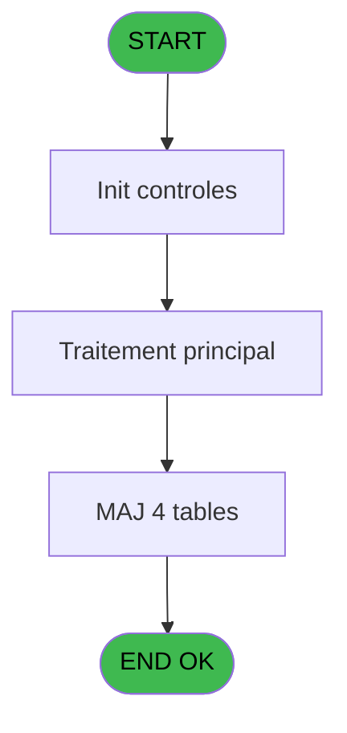
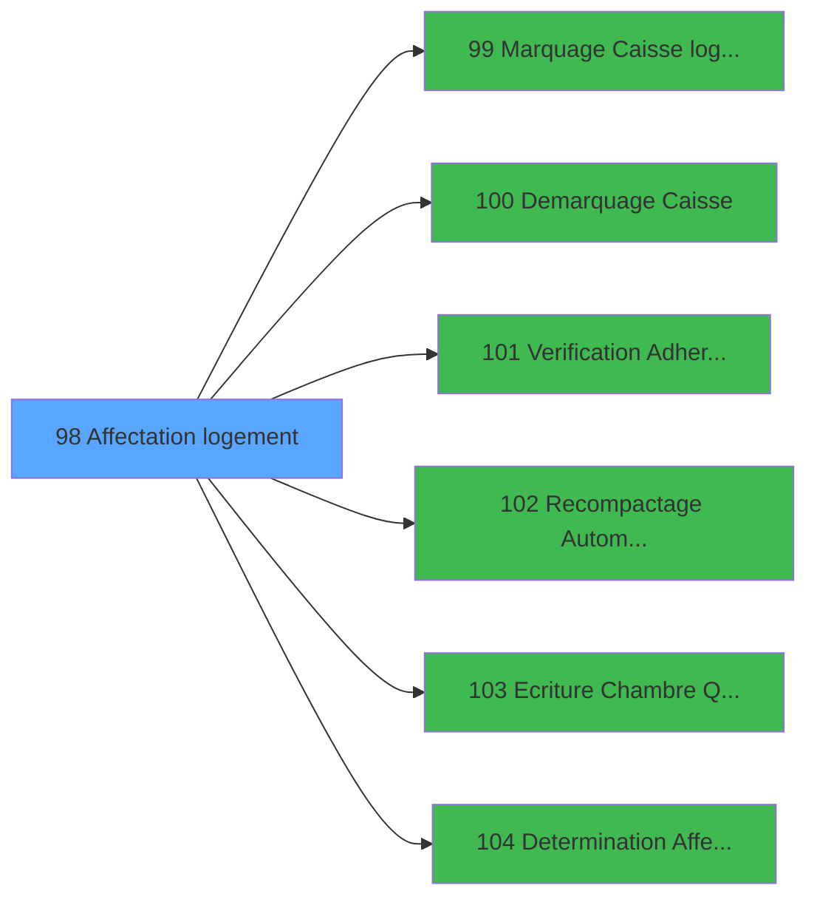

# PBG IDE 98 - Affectation logement

> **Analyse**: Phases 1-4 2026-02-03 09:21 -> 09:21 (20s) | Assemblage 09:21
> **Pipeline**: V7.2 Enrichi
> **Structure**: 4 onglets (Resume | Ecrans | Donnees | Connexions)

<!-- TAB:Resume -->

## 1. FICHE D'IDENTITE

| Attribut | Valeur |
|----------|--------|
| Projet | PBG |
| IDE Position | 98 |
| Nom Programme | Affectation logement |
| Fichier source | `Prg_98.xml` |
| Domaine metier | General |
| Taches | 7 (0 ecrans visibles) |
| Tables modifiees | 4 |
| Programmes appeles | 6 |
| :warning: Statut | **ORPHELIN_POTENTIEL** |

## 2. DESCRIPTION FONCTIONNELLE

**Affectation logement** assure la gestion complete de ce processus.

Le flux de traitement s'organise en **3 blocs fonctionnels** :

- **Traitement** (4 taches) : traitements metier divers
- **Creation** (2 taches) : insertion d'enregistrements en base (mouvements, prestations)
- **Validation** (1 tache) : controles et verifications de coherence

**Donnees modifiees** : 4 tables en ecriture (hebergement______heb, historik_station, fi_complet_______gm_go, tairejet).

Detail : phases du traitement

#### Phase 1 : Traitement (4 taches)

- **98** - Logement Standard **[[ECRAN]](#ecran-t1)**
- **98.1** - Listes des adherents **[[ECRAN]](#ecran-t52)**
- **98.1.1** - Mise à Jour Hebergement
- **98.1.3** - Mise à Jour Hebergement

Delegue a : [Marquage Caisse logique (IDE 99)](PBG-IDE-99.md), [Demarquage Caisse (IDE 100)](PBG-IDE-100.md), [Recompactage Automatique (IDE 102)](PBG-IDE-102.md), [Ecriture Chambre Quadriga (IDE 103)](PBG-IDE-103.md), [Determination Affectation (IDE 104)](PBG-IDE-104.md)

#### Phase 2 : Creation (2 taches)

- **98.1.1.1** - Creation chambre
- **98.1.2** - Creation Historique

#### Phase 3 : Validation (1 tache)

- **98.1.4** - verif eci

Delegue a : [Verification Adherents (IDE 101)](PBG-IDE-101.md)

#### Tables impactees

| Table | Operations | Role metier |
|-------|-----------|-------------|
| hebergement______heb | **W**/L (2 usages) | Hebergement (chambres) |
| historik_station | **W** (1 usages) | Historique / journal |
| fi_complet_______gm_go | **W** (1 usages) |  |
| tairejet | **W** (1 usages) |  |

## 3. BLOCS FONCTIONNELS

### 3.1 Traitement (4 taches)

Traitements internes.

---

#### 98 - Logement Standard [[ECRAN]](#ecran-t1)

**Role** : Traitement : Logement Standard.
**Ecran** : 175 x 90 DLU (MDI) | [Voir mockup](#ecran-t1)

3 sous-taches directes

| Tache | Nom | Bloc |
|-------|-----|------|
| [98.1](#t52) | Listes des adherents **[[ECRAN]](#ecran-t52)** | Traitement |
| [98.1.1](#t53) | Mise à Jour Hebergement | Traitement |
| [98.1.3](#t56) | Mise à Jour Hebergement | Traitement |

**Delegue a** : [Marquage Caisse logique (IDE 99)](PBG-IDE-99.md), [Demarquage Caisse (IDE 100)](PBG-IDE-100.md), [Recompactage Automatique (IDE 102)](PBG-IDE-102.md)

---

#### 98.1 - Listes des adherents [[ECRAN]](#ecran-t52)

**Role** : Traitement : Listes des adherents.
**Ecran** : 1144 x 246 DLU (MDI) | [Voir mockup](#ecran-t52)
**Delegue a** : [Marquage Caisse logique (IDE 99)](PBG-IDE-99.md), [Demarquage Caisse (IDE 100)](PBG-IDE-100.md), [Recompactage Automatique (IDE 102)](PBG-IDE-102.md)

---

#### 98.1.1 - Mise à Jour Hebergement

**Role** : Traitement : Mise à Jour Hebergement.
**Variables liees** : A (P.Lieu sejour), B (P.Statut sejour)
**Delegue a** : [Marquage Caisse logique (IDE 99)](PBG-IDE-99.md), [Demarquage Caisse (IDE 100)](PBG-IDE-100.md), [Recompactage Automatique (IDE 102)](PBG-IDE-102.md)

---

#### 98.1.3 - Mise à Jour Hebergement

**Role** : Traitement : Mise à Jour Hebergement.
**Variables liees** : A (P.Lieu sejour), B (P.Statut sejour)
**Delegue a** : [Marquage Caisse logique (IDE 99)](PBG-IDE-99.md), [Demarquage Caisse (IDE 100)](PBG-IDE-100.md), [Recompactage Automatique (IDE 102)](PBG-IDE-102.md)

### 3.2 Creation (2 taches)

Insertion de nouveaux enregistrements en base.

---

#### 98.1.1.1 - Creation chambre

**Role** : Creation d'enregistrement : Creation chambre.
**Variables liees** : C (P.Chambre)

---

#### 98.1.2 - Creation Historique

**Role** : Consultation/chargement : Creation Historique.

### 3.3 Validation (1 tache)

Controles de coherence : 1 tache verifie les donnees et conditions.

---

#### 98.1.4 - verif eci

**Role** : Verification : verif eci.
**Delegue a** : [Verification Adherents (IDE 101)](PBG-IDE-101.md)

## 5. REGLES METIER

*(Aucune regle metier identifiee)*

## 6. CONTEXTE

- **Appele par**: (aucun)
- **Appelle**: 6 programmes | **Tables**: 10 (W:4 R:2 L:5) | **Taches**: 7 | **Expressions**: 19

<!-- TAB:Ecrans -->

## 8. ECRANS

*(Programme sans ecran visible)*

## 9. NAVIGATION

### 9.3 Structure hierarchique (7 taches)

| Position | Tache | Type | Dimensions | Bloc |
|----------|-------|------|------------|------|
| **98.1** | [**Logement Standard** (98)](#t1) [mockup](#ecran-t1) | MDI | 175x90 | Traitement |
| 98.1.1 | [Listes des adherents (98.1)](#t52) [mockup](#ecran-t52) | MDI | 1144x246 | |
| 98.1.2 | [Mise à Jour Hebergement (98.1.1)](#t53) | MDI | - | |
| 98.1.3 | [Mise à Jour Hebergement (98.1.3)](#t56) | MDI | - | |
| **98.2** | [**Creation chambre** (98.1.1.1)](#t54) | MDI | - | Creation |
| 98.2.1 | [Creation Historique (98.1.2)](#t55) | MDI | - | |
| **98.3** | [**verif eci** (98.1.4)](#t57) | - | - | Validation |

### 9.4 Algorigramme

> **Legende**: Vert = START/END OK | Rouge = END KO | Bleu = Decisions
> *Algorigramme auto-genere. Utiliser `/algorigramme` pour une synthese metier detaillee.*

<!-- TAB:Donnees -->

## 10. TABLES

### Tables utilisees (10)

| ID | Nom | Description | Type | R | W | L | Usages |
|----|-----|-------------|------|---|---|---|--------|
| 31 | gm-complet_______gmc |  | DB | R |   |   | 1 |
| 34 | hebergement______heb | Hebergement (chambres) | DB |   | **W** | L | 2 |
| 36 | client_gm |  | DB |   |   | L | 1 |
| 88 | historik_station | Historique / journal | DB |   | **W** |   | 1 |
| 104 | fichier_menage |  | DB |   |   | L | 1 |
| 131 | fichier_validation |  | DB |   |   | L | 1 |
| 315 | fi_complet_______gm_go |  | DB |   | **W** |   | 1 |
| 358 | import_mod |  | DB |   |   | L | 1 |
| 455 | tairejet |  | DB |   | **W** |   | 1 |
| 805 | vente_par_moyen_paiement | Donnees de ventes | DB | R |   |   | 1 |

### Colonnes par table (1 / 6 tables avec colonnes identifiees)

Table 31 - gm-complet_______gmc (R) - 1 usages

| Lettre | Variable | Acces | Type |
|--------|----------|-------|------|
| A | W3-Fin de Tache | R | Logical |
| B | W3-Sous/Tache | R | Alpha |
| C | W3-Selection Choix | R | Alpha |
| D | W3-Accord Suite | R | Logical |
| E | W3-Confirmation | R | Numeric |
| F | W3-Recherche Nom | R | Alpha |
| G | W3-Confirme | R | Logical |
| H | Bouton selection | R | Alpha |
| I | W3-Existe Res # | R | Logical |
| J | V.Heb nom logement | R | Alpha |
| K | Retour Logement | R | Logical |
| L | V.ECI ski service ? | R | Logical |
| M | V.ECI mini club ? | R | Logical |
| N | V.Comment affec auto | R | Alpha |

Table 34 - hebergement______heb (**W**/L) - 2 usages

*Table utilisee uniquement en Link ou aucune colonne Real identifiee dans le DataView.*

Table 88 - historik_station (**W**) - 1 usages

*Table utilisee uniquement en Link ou aucune colonne Real identifiee dans le DataView.*

Table 315 - fi_complet_______gm_go (**W**) - 1 usages

*Table utilisee uniquement en Link ou aucune colonne Real identifiee dans le DataView.*

Table 455 - tairejet (**W**) - 1 usages

*Table utilisee uniquement en Link ou aucune colonne Real identifiee dans le DataView.*

Table 805 - vente_par_moyen_paiement (R) - 1 usages

*Table utilisee uniquement en Link ou aucune colonne Real identifiee dans le DataView.*

## 11. VARIABLES

### 11.1 Parametres entrants (11)

Variables recues en parametre.

| Lettre | Nom | Type | Usage dans |
|--------|-----|------|-----------|
| A | P.Lieu sejour | Alpha | - |
| B | P.Statut sejour | Alpha | - |
| C | P.Chambre | Alpha | - |
| D | P.Compte | Numeric | - |
| E | P.Filiation | Numeric | - |
| F | P.Date debut | Date | - |
| G | P.Loc occupation std | Numeric | - |
| H | P.Comment affect auto | Alpha | - |
| I | P.Date charnière | Date | - |
| J | P.Societe | Alpha | - |
| K | P.Langue | Alpha | 2x parametre entrant |

### 11.2 Variables de travail (4)

Variables internes au programme.

| Lettre | Nom | Type | Usage dans |
|--------|-----|------|-----------|
| BB | W0 Code 12 | Alpha | - |
| BC | W0 Code 23 | Alpha | - |
| BD | W0 Code 24 | Alpha | - |
| BE | W0 Code 25 | Alpha | - |

### 11.3 Autres (17)

Variables diverses.

| Lettre | Nom | Type | Usage dans |
|--------|-----|------|-----------|
| L | W0-Code Societe | Alpha | 2x refs |
| M | W0-Code Langue | Alpha | 2x refs |
| N | W0-Front/Back | Alpha | 2x refs |
| O | W0-Fin de Tache | Logical | - |
| P | W0-Code Suite | Alpha | - |
| Q | W0-Recherche Std | Alpha | - |
| R | W0-Recherche Cpt | Alpha | - |
| S | W0-Valeur Tri | Numeric | - |
| T | W0-Code LIBC | Alpha | - |
| U | W0-Code DEBC | Alpha | - |
| V | W0-Code B004 | Alpha | - |
| W | W0-Code B011 | Alpha | - |
| X | W0-Code B012 | Alpha | - |
| Y | W0-Code B013 | Alpha | - |
| Z | W0-Code B016 | Alpha | - |
| BA | W0-Code B017 | Alpha | - |
| BF | Choix affichage | Alpha | - |

Toutes les 32 variables (liste complete)

| Cat | Lettre | Nom Variable | Type |
|-----|--------|--------------|------|
| P0 | **A** | P.Lieu sejour | Alpha |
| P0 | **B** | P.Statut sejour | Alpha |
| P0 | **C** | P.Chambre | Alpha |
| P0 | **D** | P.Compte | Numeric |
| P0 | **E** | P.Filiation | Numeric |
| P0 | **F** | P.Date debut | Date |
| P0 | **G** | P.Loc occupation std | Numeric |
| P0 | **H** | P.Comment affect auto | Alpha |
| P0 | **I** | P.Date charnière | Date |
| P0 | **J** | P.Societe | Alpha |
| P0 | **K** | P.Langue | Alpha |
| W0 | **BB** | W0 Code 12 | Alpha |
| W0 | **BC** | W0 Code 23 | Alpha |
| W0 | **BD** | W0 Code 24 | Alpha |
| W0 | **BE** | W0 Code 25 | Alpha |
| Autre | **L** | W0-Code Societe | Alpha |
| Autre | **M** | W0-Code Langue | Alpha |
| Autre | **N** | W0-Front/Back | Alpha |
| Autre | **O** | W0-Fin de Tache | Logical |
| Autre | **P** | W0-Code Suite | Alpha |
| Autre | **Q** | W0-Recherche Std | Alpha |
| Autre | **R** | W0-Recherche Cpt | Alpha |
| Autre | **S** | W0-Valeur Tri | Numeric |
| Autre | **T** | W0-Code LIBC | Alpha |
| Autre | **U** | W0-Code DEBC | Alpha |
| Autre | **V** | W0-Code B004 | Alpha |
| Autre | **W** | W0-Code B011 | Alpha |
| Autre | **X** | W0-Code B012 | Alpha |
| Autre | **Y** | W0-Code B013 | Alpha |
| Autre | **Z** | W0-Code B016 | Alpha |
| Autre | **BA** | W0-Code B017 | Alpha |
| Autre | **BF** | Choix affichage | Alpha |

## 12. EXPRESSIONS

**19 / 19 expressions decodees (100%)**

### 12.1 Repartition par type

| Type | Expressions | Regles |
|------|-------------|--------|
| CONSTANTE | 12 | 0 |
| CALCUL | 2 | 0 |
| OTHER | 3 | 0 |
| CONDITION | 2 | 0 |

### 12.2 Expressions cles par type

#### CONSTANTE (12 expressions)

| Type | IDE | Expression | Regle |
|------|-----|------------|-------|
| CONSTANTE | 10 | `'12'` | - |
| CONSTANTE | 9 | `'B017'` | - |
| CONSTANTE | 8 | `'B016'` | - |
| CONSTANTE | 13 | `'25'` | - |
| CONSTANTE | 12 | `'24'` | - |
| ... | | *+7 autres* | |

#### CALCUL (2 expressions)

| Type | IDE | Expression | Regle |
|------|-----|------------|-------|
| CALCUL | 17 | `Date ()*100+Val (TStr (Time (),'HH'),'##')<P.Langue [K]*100+Val (W0-Code Societe [L],'##') OR Date ()*100+Val (TStr (Time (),'HH'),'##')>=W0-Code Langue [M]*100+Val (W0-Front/Back [N],'##')` | - |
| CALCUL | 16 | `Date ()*100+Val (TStr (Time (),'HH'),'##')>=P.Langue [K]*100+Val (W0-Code Societe [L],'##') AND Date ()*100+Val (TStr (Time (),'HH'),'##')<W0-Code Langue [M]*100+Val (W0-Front/Back [N],'##')` | - |

#### OTHER (3 expressions)

| Type | IDE | Expression | Regle |
|------|-----|------------|-------|
| OTHER | 15 | `[AF]` | - |
| OTHER | 14 | `[AE]` | - |
| OTHER | 1 | `GetParam ('FRONT')` | - |

#### CONDITION (2 expressions)

| Type | IDE | Expression | Regle |
|------|-----|------------|-------|
| CONDITION | 19 | `{1,23}='N'` | - |
| CONDITION | 18 | `{1,23}='P'` | - |

<!-- TAB:Connexions -->

## 13. GRAPHE D'APPELS

### 13.1 Chaine depuis Main (Callers)

**Chemin**: (pas de callers directs)

### 13.2 Callers

| IDE | Nom Programme | Nb Appels |
|-----|---------------|-----------|
| - | (aucun) | - |

### 13.3 Callees (programmes appeles)

### 13.4 Detail Callees avec contexte

| IDE | Nom Programme | Appels | Contexte |
|-----|---------------|--------|----------|
| [99](PBG-IDE-99.md) | Marquage Caisse logique | 2 | Sous-programme |
| [100](PBG-IDE-100.md) | Demarquage Caisse | 2 | Sous-programme |
| [101](PBG-IDE-101.md) | Verification Adherents | 2 | Controle/validation |
| [102](PBG-IDE-102.md) | Recompactage Automatique | 2 | Sous-programme |
| [103](PBG-IDE-103.md) | Ecriture Chambre Quadriga | 2 | Sous-programme |
| [104](PBG-IDE-104.md) | Determination Affectation | 1 | Sous-programme |

## 14. RECOMMANDATIONS MIGRATION

### 14.1 Profil du programme

| Metrique | Valeur | Impact migration |
|----------|--------|-----------------|
| Lignes de logique | 273 | Taille moyenne |
| Expressions | 19 | Peu de logique |
| Tables WRITE | 4 | Impact modere |
| Sous-programmes | 6 | Dependances moderees |
| Ecrans visibles | 0 | Ecran unique ou traitement batch |
| Code desactive | 0% (0 / 273) | Code sain |
| Regles metier | 0 | Pas de regle identifiee |

### 14.2 Plan de migration par bloc

#### Traitement (4 taches: 2 ecrans, 2 traitements)

- **Strategie** : Orchestrateur avec 2 ecrans (Razor/React) et 2 traitements backend (services).
- Les ecrans deviennent des composants UI, les traitements invisibles deviennent des services injectables.
- 6 sous-programme(s) a migrer ou a reutiliser depuis les services existants.
- Decomposer les taches en services unitaires testables.

#### Creation (2 taches: 0 ecran, 2 traitements)

- **Strategie** : Repository pattern avec Entity Framework Core.
- Insertion via `IRepository<T>.CreateAsync()`

#### Validation (1 tache: 0 ecran, 1 traitement)

- **Strategie** : FluentValidation avec validators specifiques.
- Chaque tache de validation -> un validator injectable

### 14.3 Dependances critiques

| Dependance | Type | Appels | Impact |
|------------|------|--------|--------|
| hebergement______heb | Table WRITE (Database) | 1x | Schema + repository |
| historik_station | Table WRITE (Database) | 1x | Schema + repository |
| fi_complet_______gm_go | Table WRITE (Database) | 1x | Schema + repository |
| tairejet | Table WRITE (Database) | 1x | Schema + repository |
| [Recompactage Automatique (IDE 102)](PBG-IDE-102.md) | Sous-programme | 2x | Haute - Sous-programme |
| [Ecriture Chambre Quadriga (IDE 103)](PBG-IDE-103.md) | Sous-programme | 2x | Haute - Sous-programme |
| [Verification Adherents (IDE 101)](PBG-IDE-101.md) | Sous-programme | 2x | Haute - Controle/validation |
| [Marquage Caisse logique (IDE 99)](PBG-IDE-99.md) | Sous-programme | 2x | Haute - Sous-programme |
| [Demarquage Caisse (IDE 100)](PBG-IDE-100.md) | Sous-programme | 2x | Haute - Sous-programme |
| [Determination Affectation (IDE 104)](PBG-IDE-104.md) | Sous-programme | 1x | Normale - Sous-programme |

---
*Spec DETAILED generee par Pipeline V7.2 - 2026-02-03 09:21*
