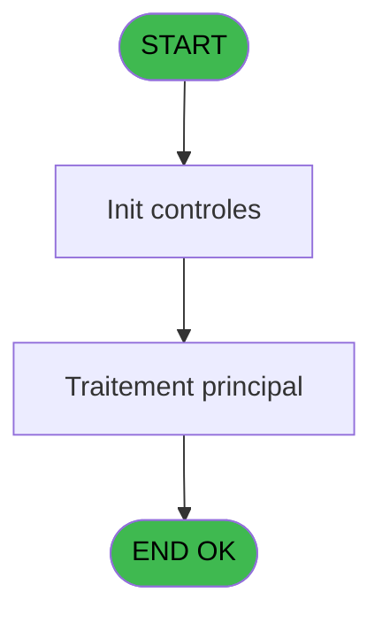
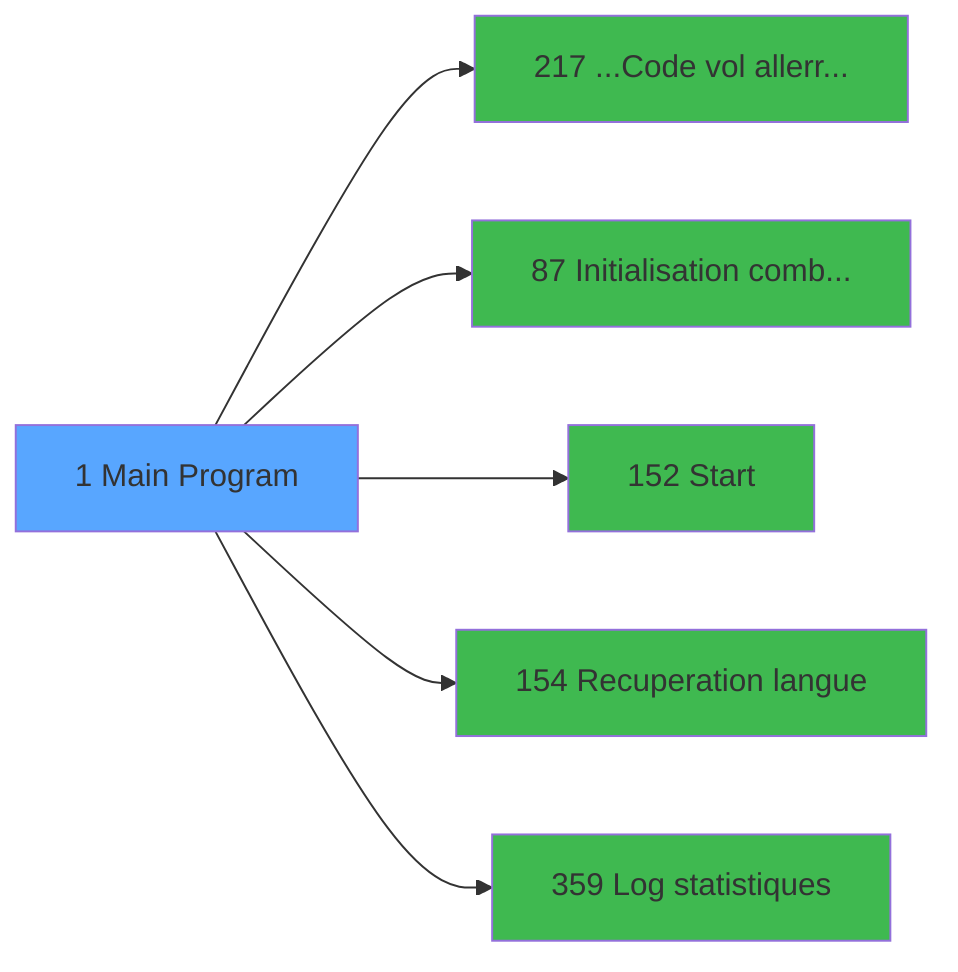

# PBP IDE 1 - Main Program

> **Analyse**: Phases 1-4 2026-02-03 00:49 -> 00:50 (41s) | Assemblage 00:50
> **Pipeline**: V7.2 Enrichi
> **Structure**: 4 onglets (Resume | Ecrans | Donnees | Connexions)

<!-- TAB:Resume -->

## 1. FICHE D'IDENTITE

| Attribut | Valeur |
|----------|--------|
| Projet | PBP |
| IDE Position | 1 |
| Nom Programme | Main Program |
| Fichier source | `Prg_1.xml` |
| Domaine metier | General |
| Taches | 5 (1 ecrans visibles) |
| Tables modifiees | 0 |
| Programmes appeles | 5 |
| :warning: Statut | **ORPHELIN_POTENTIEL** |

## 2. DESCRIPTION FONCTIONNELLE

**Main Program** assure la gestion complete de ce processus.

Le flux de traitement s'organise en **3 blocs fonctionnels** :

- **Traitement** (3 taches) : traitements metier divers
- **Initialisation** (1 tache) : reinitialisation d'etats et de variables de travail
- **Impression** (1 tache) : generation de tickets et documents

Detail : phases du traitement

#### Phase 1 : Impression (1 tache)

- **1** - Planning Print **[[ECRAN]](#ecran-t1)**

#### Phase 2 : Traitement (3 taches)

- **1.1** - resp reception
- **1.2** - recup village
- **1.4** - Recup lieu sejour defaut

Delegue a : [...Code vol aller/retour (IDE 217)](PBP-IDE-217.md), [Start (IDE 152)](PBP-IDE-152.md), [Recuperation langue (IDE 154)](PBP-IDE-154.md), [Log statistiques (IDE 359)](PBP-IDE-359.md)

#### Phase 3 : Initialisation (1 tache)

- **1.3** - Initialistaion Easy Check in

Delegue a : [Initialisation combos reponses (IDE 87)](PBP-IDE-87.md)

## 3. BLOCS FONCTIONNELS

### 3.1 Impression (1 tache)

Generation des documents et tickets.

---

#### 1 - Planning Print [[ECRAN]](#ecran-t1)

**Role** : Generation du document : Planning Print.
**Ecran** : 320 x 200 DLU (Type11) | [Voir mockup](#ecran-t1)
**Variables liees** : R (V.groupe planning ?)

### 3.2 Traitement (3 taches)

Traitements internes.

---

#### 1.1 - resp reception

**Role** : Traitement : resp reception.
**Variables liees** : N (V.resp reception gestion ?), BX (VG.Suivi CA Reception)
**Delegue a** : [...Code vol aller/retour (IDE 217)](PBP-IDE-217.md), [Start (IDE 152)](PBP-IDE-152.md), [Recuperation langue (IDE 154)](PBP-IDE-154.md)

---

#### 1.2 - recup village

**Role** : Consultation/chargement : recup village.
**Variables liees** : S (VG.VILLAGE), W (VG.NOM VILLAGE)
**Delegue a** : [...Code vol aller/retour (IDE 217)](PBP-IDE-217.md), [Start (IDE 152)](PBP-IDE-152.md), [Recuperation langue (IDE 154)](PBP-IDE-154.md)

---

#### 1.4 - Recup lieu sejour defaut

**Role** : Consultation/chargement : Recup lieu sejour defaut.
**Variables liees** : BA (VG.TAXE SEJOUR ACTIF ?), BD (VG.NB LIEU SEJOUR), BE (VG.ETAT EFFEC PAR LIEU SEJOUR ?), BO (VG LIEU SEJOUR  DEFAUT), BP (VG.COMBO LIEU SEJOUR)
**Delegue a** : [...Code vol aller/retour (IDE 217)](PBP-IDE-217.md), [Start (IDE 152)](PBP-IDE-152.md), [Recuperation langue (IDE 154)](PBP-IDE-154.md)

### 3.3 Initialisation (1 tache)

Reinitialisation d'etats et variables de travail.

---

#### 1.3 - Initialistaion Easy Check in

**Role** : Reinitialisation : Initialistaion Easy Check in.
**Variables liees** : E (VG.EASY ARRIVAL ACTIF ?), BI (VG.EASY LOCATION), BJ (VG.EASY COURS), BK (VG.EASY ENFANT), BS (VG.EASY CHECK OUT ACTIF)
**Delegue a** : [Initialisation combos reponses (IDE 87)](PBP-IDE-87.md)

## 5. REGLES METIER

*(Aucune regle metier identifiee)*

## 6. CONTEXTE

- **Appele par**: (aucun)
- **Appelle**: 5 programmes | **Tables**: 4 (W:0 R:4 L:0) | **Taches**: 5 | **Expressions**: 106

<!-- TAB:Ecrans -->

## 8. ECRANS

### 8.1 Forms visibles (1 / 5)

| # | Position | Tache | Nom | Type | Largeur | Hauteur | Bloc |
|---|----------|-------|-----|------|---------|---------|------|
| 1 | 1 | 1 | Planning Print | Type11 | 320 | 200 | Impression |

### 8.2 Mockups Ecrans

## 9. NAVIGATION

Ecran unique: **Planning Print**

### 9.3 Structure hierarchique (5 taches)

| Position | Tache | Type | Dimensions | Bloc |
|----------|-------|------|------------|------|
| **1.1** | [**Planning Print** (1)](#t1) [mockup](#ecran-t1) | Type11 | 320x200 | Impression |
| **1.2** | [**resp reception** (1.1)](#t2) | - | - | Traitement |
| 1.2.1 | [recup village (1.2)](#t3) | - | - | |
| 1.2.2 | [Recup lieu sejour defaut (1.4)](#t12) | - | - | |
| **1.3** | [**Initialistaion Easy Check in** (1.3)](#t10) | - | - | Initialisation |

### 9.4 Algorigramme

> **Legende**: Vert = START/END OK | Rouge = END KO | Bleu = Decisions
> *Algorigramme auto-genere. Utiliser `/algorigramme` pour une synthese metier detaillee.*

<!-- TAB:Donnees -->

## 10. TABLES

### Tables utilisees (4)

| ID | Nom | Description | Type | R | W | L | Usages |
|----|-----|-------------|------|---|---|---|--------|
| 69 | initialisation___ini |  | DB | R |   |   | 1 |
| 81 | societe__________soc |  | DB | R |   |   | 1 |
| 740 | pv_stock_movements | Articles et stock | DB | R |   |   | 1 |
| 880 | evenement |  | DB | R |   |   | 1 |

### Colonnes par table (1 / 4 tables avec colonnes identifiees)

Table 69 - initialisation___ini (R) - 1 usages

*Table utilisee uniquement en Link ou aucune colonne Real identifiee dans le DataView.*

Table 81 - societe__________soc (R) - 1 usages

| Lettre | Variable | Acces | Type |
|--------|----------|-------|------|
| BH | VG.SOCIETE | R | Unicode |

Table 740 - pv_stock_movements (R) - 1 usages

*Table utilisee uniquement en Link ou aucune colonne Real identifiee dans le DataView.*

Table 880 - evenement (R) - 1 usages

*Table utilisee uniquement en Link ou aucune colonne Real identifiee dans le DataView.*

## 11. VARIABLES

### 11.1 Parametres entrants (4)

Variables recues en parametre.

| Lettre | Nom | Type | Usage dans |
|--------|-----|------|-----------|
| DE | p.i.Num compte Aller | Numeric | - |
| DF | p.i.Filliation Aller | Numeric | - |
| DH | p.i.Num compte Retour | Numeric | - |
| DI | p.i.Filliation Retour | Numeric | - |

### 11.2 Variables de session (4)

Variables persistantes pendant toute la session.

| Lettre | Nom | Type | Usage dans |
|--------|-----|------|-----------|
| N | V.resp reception gestion ? | Logical | - |
| R | V.groupe planning ? | Logical | - |
| DG | v.Retour code vol Aller | Unicode | - |
| DJ | v.Retour code vol Retour | Unicode | - |

### 11.3 Variables globales (80)

Variables globales partagees entre programmes.

| Lettre | Nom | Type | Usage dans |
|--------|-----|------|-----------|
| A | VG.LOGIN | Unicode | 1x variable globale |
| B | VG.USER | Unicode | - |
| C | VG.DROIT ACCES IT ? | Logical | 2x variable globale |
| D | VG.FORFAIT SKI ? | Logical | 2x variable globale |
| E | VG.EASY ARRIVAL ACTIF ? | Logical | 2x variable globale |
| F | VG.CB TYPE QUEST LOC LIB | Alpha | - |
| G | VG.CB TYPE QUEST LOC CODE | Alpha | - |
| H | VG.CB TYPE QUEST COURS LIB | Alpha | - |
| I | VG.CB TYPE QUEST COURS CODE | Alpha | - |
| J | VG.CB TYPE QUEST ENF LIB | Alpha | - |
| K | VG.CB TYPE QUEST ENF CODE | Alpha | - |
| L | VG.MASQUE MONTANT | Alpha | - |
| M | VG.VRL ACTIF ? | Logical | - |
| O | VG. IND SEJ PAYE ACTIF | Logical | - |
| P | VG.TABLEAU REMPLISSAGE ACTIF ? | Logical | - |
| Q | VG.CALCUL EFFECTIF ACTIF ? | Logical | - |
| S | VG.VILLAGE | Alpha | - |
| T | VG.DEBUG | Alpha | - |
| U | VG.CODE LANGUE | Unicode | - |
| V | VG.SEPARATEUR | Alpha | - |
| W | VG.NOM VILLAGE | Alpha | - |
| X | VG.AFFECT AUTO ACTIF ? | Logical | - |
| Y | VG.Date version | Alpha | - |
| Z | VG.Version | Alpha | 2x variable globale |
| BA | VG.TAXE SEJOUR ACTIF ? | Logical | - |
| BB | VG.FIDELISATION ACTIF ? | Logical | - |
| BC | VG.CALCUL EFFECTIF 2.0 ACTIF ? | Logical | - |
| BD | VG.NB LIEU SEJOUR | Numeric | - |
| BE | VG.ETAT EFFEC PAR LIEU SEJOUR ? | Alpha | - |
| BF | VG.AUTOM CREDIT BAR ACTIF ? | Logical | - |
| BG | VG.TRAITEMENT BATEAU | Logical | - |
| BH | VG.SOCIETE | Unicode | - |
| BI | VG.EASY LOCATION | Alpha | - |
| BJ | VG.EASY COURS | Alpha | - |
| BK | VG.EASY ENFANT | Alpha | - |
| BL | VG Remontées mécaniques ACTIF | Logical | - |
| BM | VG TRANSFERT ACTIF | Logical | 1x variable globale |
| BN | VG TRANSFERT 2.00 | Logical | - |
| BO | VG LIEU SEJOUR  DEFAUT | Alpha | - |
| BP | VG.COMBO LIEU SEJOUR | Alpha | - |
| BQ | VG.MASQUE | Alpha | - |
| BR | VG.EXTRACTION ASIE | Logical | 1x variable globale |
| BS | VG.EASY CHECK OUT ACTIF | Logical | - |
| BT | VG.CALCUL EFFECTIF 3.0 ACTIF ? | Logical | - |
| BU | VG.EXTRACTION BRESIL | Logical | - |
| BV | VG.PYR ACTIF | Logical | - |
| BW | VG.ChangementCalendrier | Logical | 2x variable globale |
| BX | VG.Suivi CA Reception | Logical | [1.1](#t2) |
| BY | VG.3 Generations Actif | Logical | - |
| BZ | VG.NomAppli | Unicode | - |
| CA | VG.ECO Automatique | Logical | - |
| CB | VG.Garanties Club Auto | Logical | - |
| CC | VG Id VSL V1.00 | Logical | - |
| CD | VG. Auto Chambre Depart | Logical | - |
| CE | VG.Export Automatique Assurance | Logical | - |
| CF | VG.Export DGSN 1.0 ACTIF ? | Logical | - |
| CG | VG.Hostname / terminal | Logical | - |
| CH | VG.Pseudo terminal | Numeric | - |
| CI | VG.Export Palmiye Bodrum | Logical | 1x variable globale |
| CJ | VG.Web service police Brésil | Logical | - |
| CK | VG.Fiche police Turquie | Logical | 1x variable globale |
| CL | VG.FPT 2.00 Police Form TURQUIE | Logical | - |
| CM | VG. Fiche police Turquie v3 | Logical | - |
| CN | VG.VAE/Biking | Logical | 1x variable globale |
| CO | VG.DGS 2.00 Police Form MAROC | Logical | - |
| CP | VG.Verif PLBS par PES | Logical | 1x variable globale |
| CQ | VG.Envoi mail de contrôle | Logical | 1x variable globale |
| CR | VG.FPP 1.00 Police PORTUGAL | Logical | - |
| CS | VG.Gestion Garantie API CM | Logical | - |
| CT | VG.Date creation Prepaid Packag | Logical | - |
| CU | VG.Mail Vente Ass. 0 Soucis | Logical | - |
| CV | VG.Garantie sans bloc. de fonds | Logical | - |
| CW | VG. AEF 1.00 Autono regu eff | Logical | - |
| CX | VG.Facilitate Your Arrival | Logical | - |
| CY | VG.Import GO V2 | Logical | - |
| CZ | VG. CAA 1.00 Criteres chambre | Logical | - |
| DA | VG Recherche logement 1.0 actif | Logical | - |
| DB | VG Control Credit Balance | Logical | - |
| DC | VG Great Member Revamped | Logical | - |
| DD | VG. FYAllergens FYA 2.00 | Logical | - |

Toutes les 88 variables (liste complete)

| Cat | Lettre | Nom Variable | Type |
|-----|--------|--------------|------|
| P0 | **DE** | p.i.Num compte Aller | Numeric |
| P0 | **DF** | p.i.Filliation Aller | Numeric |
| P0 | **DH** | p.i.Num compte Retour | Numeric |
| P0 | **DI** | p.i.Filliation Retour | Numeric |
| V. | **N** | V.resp reception gestion ? | Logical |
| V. | **R** | V.groupe planning ? | Logical |
| V. | **DG** | v.Retour code vol Aller | Unicode |
| V. | **DJ** | v.Retour code vol Retour | Unicode |
| VG | **A** | VG.LOGIN | Unicode |
| VG | **B** | VG.USER | Unicode |
| VG | **C** | VG.DROIT ACCES IT ? | Logical |
| VG | **D** | VG.FORFAIT SKI ? | Logical |
| VG | **E** | VG.EASY ARRIVAL ACTIF ? | Logical |
| VG | **F** | VG.CB TYPE QUEST LOC LIB | Alpha |
| VG | **G** | VG.CB TYPE QUEST LOC CODE | Alpha |
| VG | **H** | VG.CB TYPE QUEST COURS LIB | Alpha |
| VG | **I** | VG.CB TYPE QUEST COURS CODE | Alpha |
| VG | **J** | VG.CB TYPE QUEST ENF LIB | Alpha |
| VG | **K** | VG.CB TYPE QUEST ENF CODE | Alpha |
| VG | **L** | VG.MASQUE MONTANT | Alpha |
| VG | **M** | VG.VRL ACTIF ? | Logical |
| VG | **O** | VG. IND SEJ PAYE ACTIF | Logical |
| VG | **P** | VG.TABLEAU REMPLISSAGE ACTIF ? | Logical |
| VG | **Q** | VG.CALCUL EFFECTIF ACTIF ? | Logical |
| VG | **S** | VG.VILLAGE | Alpha |
| VG | **T** | VG.DEBUG | Alpha |
| VG | **U** | VG.CODE LANGUE | Unicode |
| VG | **V** | VG.SEPARATEUR | Alpha |
| VG | **W** | VG.NOM VILLAGE | Alpha |
| VG | **X** | VG.AFFECT AUTO ACTIF ? | Logical |
| VG | **Y** | VG.Date version | Alpha |
| VG | **Z** | VG.Version | Alpha |
| VG | **BA** | VG.TAXE SEJOUR ACTIF ? | Logical |
| VG | **BB** | VG.FIDELISATION ACTIF ? | Logical |
| VG | **BC** | VG.CALCUL EFFECTIF 2.0 ACTIF ? | Logical |
| VG | **BD** | VG.NB LIEU SEJOUR | Numeric |
| VG | **BE** | VG.ETAT EFFEC PAR LIEU SEJOUR ? | Alpha |
| VG | **BF** | VG.AUTOM CREDIT BAR ACTIF ? | Logical |
| VG | **BG** | VG.TRAITEMENT BATEAU | Logical |
| VG | **BH** | VG.SOCIETE | Unicode |
| VG | **BI** | VG.EASY LOCATION | Alpha |
| VG | **BJ** | VG.EASY COURS | Alpha |
| VG | **BK** | VG.EASY ENFANT | Alpha |
| VG | **BL** | VG Remontées mécaniques ACTIF | Logical |
| VG | **BM** | VG TRANSFERT ACTIF | Logical |
| VG | **BN** | VG TRANSFERT 2.00 | Logical |
| VG | **BO** | VG LIEU SEJOUR  DEFAUT | Alpha |
| VG | **BP** | VG.COMBO LIEU SEJOUR | Alpha |
| VG | **BQ** | VG.MASQUE | Alpha |
| VG | **BR** | VG.EXTRACTION ASIE | Logical |
| VG | **BS** | VG.EASY CHECK OUT ACTIF | Logical |
| VG | **BT** | VG.CALCUL EFFECTIF 3.0 ACTIF ? | Logical |
| VG | **BU** | VG.EXTRACTION BRESIL | Logical |
| VG | **BV** | VG.PYR ACTIF | Logical |
| VG | **BW** | VG.ChangementCalendrier | Logical |
| VG | **BX** | VG.Suivi CA Reception | Logical |
| VG | **BY** | VG.3 Generations Actif | Logical |
| VG | **BZ** | VG.NomAppli | Unicode |
| VG | **CA** | VG.ECO Automatique | Logical |
| VG | **CB** | VG.Garanties Club Auto | Logical |
| VG | **CC** | VG Id VSL V1.00 | Logical |
| VG | **CD** | VG. Auto Chambre Depart | Logical |
| VG | **CE** | VG.Export Automatique Assurance | Logical |
| VG | **CF** | VG.Export DGSN 1.0 ACTIF ? | Logical |
| VG | **CG** | VG.Hostname / terminal | Logical |
| VG | **CH** | VG.Pseudo terminal | Numeric |
| VG | **CI** | VG.Export Palmiye Bodrum | Logical |
| VG | **CJ** | VG.Web service police Brésil | Logical |
| VG | **CK** | VG.Fiche police Turquie | Logical |
| VG | **CL** | VG.FPT 2.00 Police Form TURQUIE | Logical |
| VG | **CM** | VG. Fiche police Turquie v3 | Logical |
| VG | **CN** | VG.VAE/Biking | Logical |
| VG | **CO** | VG.DGS 2.00 Police Form MAROC | Logical |
| VG | **CP** | VG.Verif PLBS par PES | Logical |
| VG | **CQ** | VG.Envoi mail de contrôle | Logical |
| VG | **CR** | VG.FPP 1.00 Police PORTUGAL | Logical |
| VG | **CS** | VG.Gestion Garantie API CM | Logical |
| VG | **CT** | VG.Date creation Prepaid Packag | Logical |
| VG | **CU** | VG.Mail Vente Ass. 0 Soucis | Logical |
| VG | **CV** | VG.Garantie sans bloc. de fonds | Logical |
| VG | **CW** | VG. AEF 1.00 Autono regu eff | Logical |
| VG | **CX** | VG.Facilitate Your Arrival | Logical |
| VG | **CY** | VG.Import GO V2 | Logical |
| VG | **CZ** | VG. CAA 1.00 Criteres chambre | Logical |
| VG | **DA** | VG Recherche logement 1.0 actif | Logical |
| VG | **DB** | VG Control Credit Balance | Logical |
| VG | **DC** | VG Great Member Revamped | Logical |
| VG | **DD** | VG. FYAllergens FYA 2.00 | Logical |

## 12. EXPRESSIONS

**106 / 106 expressions decodees (100%)**

### 12.1 Repartition par type

| Type | Expressions | Regles |
|------|-------------|--------|
| CONCATENATION | 1 | 0 |
| CONSTANTE | 46 | 0 |
| CONDITION | 2 | 0 |
| CAST_LOGIQUE | 19 | 0 |
| OTHER | 36 | 0 |
| NEGATION | 2 | 0 |

### 12.2 Expressions cles par type

#### CONCATENATION (1 expressions)

| Type | IDE | Expression | Regle |
|------|-----|------------|-------|
| CONCATENATION | 42 | `'Planning Print - V '&Trim(ExpCalc('45'EXP))&' - '&Trim(ExpCalc('46'EXP))` | - |

#### CONSTANTE (46 expressions)

| Type | IDE | Expression | Regle |
|------|-----|------------|-------|
| CONSTANTE | 79 | `'FPT'` | - |
| CONSTANTE | 78 | `'FPP'` | - |
| CONSTANTE | 80 | `'VAE'` | - |
| CONSTANTE | 85 | `'Z'` | - |
| CONSTANTE | 84 | `'A'` | - |
| ... | | *+41 autres* | |

#### CONDITION (2 expressions)

| Type | IDE | Expression | Regle |
|------|-----|------------|-------|
| CONDITION | 47 | `Translate ('%club_traitement_bateau%')='O'` | - |
| CONDITION | 1 | `RunMode ()<=2` | - |

#### CAST_LOGIQUE (19 expressions)

| Type | IDE | Expression | Regle |
|------|-----|------------|-------|
| CAST_LOGIQUE | 31 | `MnuShow('ECONEW','FALSE'LOG)` | - |
| CAST_LOGIQUE | 33 | `MnuShow('EFFMENS','FALSE'LOG)` | - |
| CAST_LOGIQUE | 28 | `MnuShow('ECONEW','TRUE'LOG)` | - |
| CAST_LOGIQUE | 30 | `MnuShow('ECO','FALSE'LOG)` | - |
| CAST_LOGIQUE | 34 | `MnuShow('EFFMENS','TRUE'LOG)` | - |
| ... | | *+14 autres* | |

#### OTHER (36 expressions)

| Type | IDE | Expression | Regle |
|------|-----|------------|-------|
| OTHER | 72 | `GetPseudoTerminal()` | - |
| OTHER | 71 | `Term ()` | - |
| OTHER | 81 | `VG.Fiche police Turquie [CK]` | - |
| OTHER | 74 | `VG.Export DGSN 1.0 ACT... [CF]` | - |
| OTHER | 70 | `MnuShow('FDP',VG.Export Palmiye Bodrum [CI])` | - |
| ... | | *+31 autres* | |

#### NEGATION (2 expressions)

| Type | IDE | Expression | Regle |
|------|-----|------------|-------|
| NEGATION | 73 | `NOT VG.Export DGSN 1.0 ACT... [CF]` | - |
| NEGATION | 27 | `NOT [AE]` | - |

### 12.3 Toutes les expressions (106)

Voir les 106 expressions

#### CONCATENATION (1)

| IDE | Expression Decodee |
|-----|-------------------|
| 42 | `'Planning Print - V '&Trim(ExpCalc('45'EXP))&' - '&Trim(ExpCalc('46'EXP))` |

#### CONSTANTE (46)

| IDE | Expression Decodee |
|-----|-------------------|
| 3 | `'SKI'` |
| 4 | `'1.00'` |
| 5 | `'2.00'` |
| 6 | `'3.00'` |
| 20 | `'PP'` |
| 25 | `'EFF'` |
| 26 | `'REM'` |
| 36 | `'CHA'` |
| 40 | `'23/12/2025'` |
| 41 | `'3.82'` |
| 43 | `'TAX'` |
| 46 | `'3.00'` |
| 49 | `'TRA'` |
| 51 | `'EXA'` |
| 52 | `'TPE'` |
| 54 | `'EXB'` |
| 55 | `'PYR'` |
| 56 | `'SCR'` |
| 61 | `'PBP'` |
| 62 | `'ECA'` |
| 63 | `'GCA'` |
| 64 | `'IVS'` |
| 65 | `'ACD'` |
| 66 | `'EAA'` |
| 67 | `'DGS'` |
| 68 | `'T2H'` |
| 75 | `'EMC'` |
| 76 | `'EPB'` |
| 77 | `'FDP'` |
| 78 | `'FPP'` |
| 79 | `'FPT'` |
| 80 | `'VAE'` |
| 84 | `'A'` |
| 85 | `'Z'` |
| 91 | `'ITO'` |
| 92 | `'GAC'` |
| 93 | `'PRP'` |
| 94 | `'INS'` |
| 95 | `'AFB'` |
| 97 | `'AEF'` |
| 98 | `'FYA'` |
| 99 | `'ADI'` |
| 100 | `'CAA'` |
| 102 | `'RLO'` |
| 103 | `'CCB'` |
| 104 | `'GMR'` |

#### CONDITION (2)

| IDE | Expression Decodee |
|-----|-------------------|
| 1 | `RunMode ()<=2` |
| 47 | `Translate ('%club_traitement_bateau%')='O'` |

#### CAST_LOGIQUE (19)

| IDE | Expression Decodee |
|-----|-------------------|
| 2 | `CallProg(ProgIdx('hasRight','TRUE'LOG),VG.LOGIN [A],'ACCESALL')` |
| 7 | `MnuShow('SKI','TRUE'LOG)` |
| 10 | `MnuShow('ECO','TRUE'LOG)` |
| 11 | `MnuShow('SKI','FALSE'LOG)` |
| 12 | `MnuShow('REM','FALSE'LOG)` |
| 13 | `MnuShow('VRL','FALSE'LOG)` |
| 14 | `MnuShow('VRL','TRUE'LOG)` |
| 22 | `MnuShow('REMP','FALSE'LOG)` |
| 23 | `MnuShow('REMP','TRUE'LOG)` |
| 24 | `MnuShow('REM','TRUE'LOG)` |
| 28 | `MnuShow('ECONEW','TRUE'LOG)` |
| 30 | `MnuShow('ECO','FALSE'LOG)` |
| 31 | `MnuShow('ECONEW','FALSE'LOG)` |
| 33 | `MnuShow('EFFMENS','FALSE'LOG)` |
| 34 | `MnuShow('EFFMENS','TRUE'LOG)` |
| 37 | `MnuShow('AFFEXT','FALSE'LOG)` |
| 39 | `MnuShow('AFFEXT','TRUE'LOG)` |
| 96 | `'TRUE'LOG` |
| 106 | `'TRUE'LOG` |

#### OTHER (36)

| IDE | Expression Decodee |
|-----|-------------------|
| 8 | `VG.EASY ARRIVAL ACTIF ? [E]` |
| 9 | `MnuShow('ECI',VG.EASY ARRIVAL ACTIF ? [E])` |
| 15 | `VG.Version [Z] OR VG.FORFAIT SKI ? [D]` |
| 16 | `VG.DROIT ACCES IT ? [C] OR [AB]` |
| 17 | `VG.DROIT ACCES IT ? [C] OR [AB] OR [AF]` |
| 18 | `VG.Version [Z]` |
| 19 | `VG.FORFAIT SKI ? [D]` |
| 21 | `[AD]` |
| 29 | `[AE]` |
| 32 | `Translate('%DEBUG%')` |
| 35 | `Translate('%club_excel_separator%')` |
| 38 | `[AL]` |
| 44 | `MnuShow('TAX',[AO])` |
| 45 | `[AO]` |
| 48 | `VG Remontées mécanique... [BL]` |
| 50 | `MnuShow('EDITRA',VG TRANSFERT ACTIF [BM])` |
| 53 | `MnuShow('EAC',VG.EXTRACTION ASIE [BR])` |
| 57 | `MnuShow('SLS',VG.ChangementCalendrier [BW])` |
| 58 | `MnuShow('SI',VG.ChangementCalendrier [BW])` |
| 59 | `MnuShow('VAE',VG.Gestion Garantie AP... [CS])` |
| 60 | `MnuShow('3GEN',VG.Suivi CA Reception [BX])` |
| 69 | `MnuShow('DGSN',VG.Export Automatique ... [CE])` |
| 70 | `MnuShow('FDP',VG.Export Palmiye Bodrum [CI])` |
| 71 | `Term ()` |
| 72 | `GetPseudoTerminal()` |
| 74 | `VG.Export DGSN 1.0 ACT... [CF]` |
| 81 | `VG.Fiche police Turquie [CK]` |
| 82 | `VG.FPT 2.00 Police For... [CL]` |
| 83 | `VG.VAE/Biking [CN]` |
| 86 | `VG.DGS 2.00 Police For... [CO]` |
| 87 | `VG.Verif PLBS par PES [CP]` |
| 88 | `VG.Envoi mail de contrôle [CQ]` |
| 89 | `MnuShow('FDPNEW',VG.Date creation Prepa... [CT] OR VG.Mail Vente Ass. 0 S... [CU] OR VG. CAA 1.00 Criteres ... [CZ])` |
| 90 | `MnuShow('FDPTU3',[DV])` |
| 101 | `MnuShow('EXTCA',[DO])` |
| 105 | `MnuShow('ALLERGEN',[DX])` |

#### NEGATION (2)

| IDE | Expression Decodee |
|-----|-------------------|
| 27 | `NOT [AE]` |
| 73 | `NOT VG.Export DGSN 1.0 ACT... [CF]` |

<!-- TAB:Connexions -->

## 13. GRAPHE D'APPELS

### 13.1 Chaine depuis Main (Callers)

**Chemin**: (pas de callers directs)

### 13.2 Callers

| IDE | Nom Programme | Nb Appels |
|-----|---------------|-----------|
| - | (aucun) | - |

### 13.3 Callees (programmes appeles)

### 13.4 Detail Callees avec contexte

| IDE | Nom Programme | Appels | Contexte |
|-----|---------------|--------|----------|
| [217](PBP-IDE-217.md) | ...Code vol aller/retour | 2 | Sous-programme |
| [87](PBP-IDE-87.md) | Initialisation combos reponses | 1 | Reinitialisation |
| [152](PBP-IDE-152.md) | Start | 1 | Sous-programme |
| [154](PBP-IDE-154.md) | Recuperation langue | 1 | Recuperation donnees |
| [359](PBP-IDE-359.md) | Log statistiques | 1 | Sous-programme |

## 14. RECOMMANDATIONS MIGRATION

### 14.1 Profil du programme

| Metrique | Valeur | Impact migration |
|----------|--------|-----------------|
| Lignes de logique | 295 | Taille moyenne |
| Expressions | 106 | Logique moderee |
| Tables WRITE | 0 | Impact faible |
| Sous-programmes | 5 | Peu de dependances |
| Ecrans visibles | 1 | Ecran unique ou traitement batch |
| Code desactive | 2% (6 / 295) | Code sain |
| Regles metier | 0 | Pas de regle identifiee |

### 14.2 Plan de migration par bloc

#### Impression (1 tache: 1 ecran, 0 traitement)

- **Strategie** : Templates HTML -> PDF via wkhtmltopdf ou Puppeteer.
- `PrintService` injectable avec choix imprimante

#### Traitement (3 taches: 0 ecran, 3 traitements)

- **Strategie** : 3 service(s) backend injectable(s) (Domain Services).
- 5 sous-programme(s) a migrer ou a reutiliser depuis les services existants.
- Decomposer les taches en services unitaires testables.

#### Initialisation (1 tache: 0 ecran, 1 traitement)

- **Strategie** : Constructeur/methode `InitAsync()` dans l'orchestrateur.

### 14.3 Dependances critiques

| Dependance | Type | Appels | Impact |
|------------|------|--------|--------|
| [...Code vol aller/retour (IDE 217)](PBP-IDE-217.md) | Sous-programme | 2x | Haute - Sous-programme |
| [Recuperation langue (IDE 154)](PBP-IDE-154.md) | Sous-programme | 1x | Normale - Recuperation donnees |
| [Log statistiques (IDE 359)](PBP-IDE-359.md) | Sous-programme | 1x | Normale - Sous-programme |
| [Initialisation combos reponses (IDE 87)](PBP-IDE-87.md) | Sous-programme | 1x | Normale - Reinitialisation |
| [Start (IDE 152)](PBP-IDE-152.md) | Sous-programme | 1x | Normale - Sous-programme |

---
*Spec DETAILED generee par Pipeline V7.2 - 2026-02-03 00:50*
