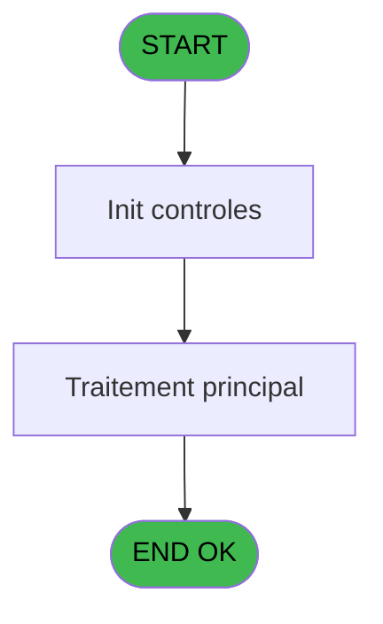

# PBP IDE 100 - Export

> **Analyse**: Phases 1-4 2026-02-03 09:22 -> 09:22 (19s) | Assemblage 09:22
> **Pipeline**: V7.2 Enrichi
> **Structure**: 4 onglets (Resume | Ecrans | Donnees | Connexions)

<!-- TAB:Resume -->

## 1. FICHE D'IDENTITE

| Attribut | Valeur |
|----------|--------|
| Projet | PBP |
| IDE Position | 100 |
| Nom Programme | Export |
| Fichier source | `Prg_100.xml` |
| Domaine metier | General |
| Taches | 2 (0 ecrans visibles) |
| Tables modifiees | 0 |
| Programmes appeles | 0 |

## 2. DESCRIPTION FONCTIONNELLE

**Export** assure la gestion complete de ce processus, accessible depuis [Preparation étiquettes(Chambre (IDE 97)](PBP-IDE-97.md).

Le flux de traitement s'organise en **1 blocs fonctionnels** :

- **Traitement** (2 taches) : traitements metier divers

**Logique metier** : 8 regles identifiees couvrant conditions metier, valeurs par defaut.

## 3. BLOCS FONCTIONNELS

### 3.1 Traitement (2 taches)

Traitements internes.

---

#### 100 - Export [[ECRAN]](#ecran-t1)

**Role** : Traitement : Export.
**Ecran** : 586 x 231 DLU (MDI) | [Voir mockup](#ecran-t1)

---

#### 100.1 - export [[ECRAN]](#ecran-t2)

**Role** : Traitement : export.
**Ecran** : 145 x 59 DLU (MDI) | [Voir mockup](#ecran-t2)

## 5. REGLES METIER

8 regles identifiees:

### Autres (8 regles)

#### [RM-001] Si [AA]='10' alors 'AM' sinon 'PM')

| Element | Detail |
|---------|--------|
| **Condition** | `[AA]='10'` |
| **Si vrai** | 'AM' |
| **Si faux** | 'PM') |
| **Expression source** | Expression 11 : `IF ([AA]='10','AM','PM')` |
| **Exemple** | Si [AA]='10' → 'AM'. Sinon → 'PM') |

#### [RM-002] Si [AC]='10' alors 'AM' sinon 'PM')

| Element | Detail |
|---------|--------|
| **Condition** | `[AC]='10'` |
| **Si vrai** | 'AM' |
| **Si faux** | 'PM') |
| **Expression source** | Expression 12 : `IF ([AC]='10','AM','PM')` |
| **Exemple** | Si [AC]='10' → 'AM'. Sinon → 'PM') |

#### [RM-003] Si [AW] OR [AX] OR [BD] alors 'EA'&ExpCalc('22'EXP) sinon '')

| Element | Detail |
|---------|--------|
| **Condition** | `[AW] OR [AX] OR [BD]` |
| **Si vrai** | 'EA'&ExpCalc('22'EXP) |
| **Si faux** | '') |
| **Expression source** | Expression 19 : `IF([AW] OR [AX] OR [BD],'EA'&ExpCalc('22'EXP),'')` |
| **Exemple** | Si [AW] OR [AX] OR [BD] → 'EA'&ExpCalc('22'EXP). Sinon → '') |

#### [RM-004] Si [AW] alors VG61 sinon '') & IF([AX],VG62,'') & IF([BD],VG63,'')

| Element | Detail |
|---------|--------|
| **Condition** | `[AW]` |
| **Si vrai** | VG61 |
| **Si faux** | '') & IF([AX],VG62,'') & IF([BD],VG63,'') |
| **Expression source** | Expression 20 : `IF([AW],VG61,'') & IF([AX],VG62,'') & IF([BD],VG63,'')` |
| **Exemple** | Si [AW] → VG61. Sinon → '') & IF([AX],VG62,'') & IF([BD],VG63,'') |

#### [RM-005] Traitement si Trim([BR]) est renseigne

| Element | Detail |
|---------|--------|
| **Condition** | `Trim([BR])<>''` |
| **Si vrai** | 'ECI' |
| **Si faux** | '') |
| **Expression source** | Expression 21 : `IF(Trim([BR])<>'','ECI','')` |
| **Exemple** | Si Trim([BR])<>'' → 'ECI'. Sinon → '') |

#### [RM-006] Traitement si Trim([BO]) est renseigne

| Element | Detail |
|---------|--------|
| **Condition** | `Trim([BO])<>''` |
| **Si vrai** | 'Up' |
| **Si faux** | '') |
| **Expression source** | Expression 22 : `IF(Trim([BO])<>'','Up','')` |
| **Exemple** | Si Trim([BO])<>'' → 'Up'. Sinon → '') |

#### [RM-007] Valeur par defaut si [BS],[K] est vide

| Element | Detail |
|---------|--------|
| **Condition** | `[BS]` |
| **Si vrai** | [K]='' |
| **Si faux** | 'TRUE'LOG) |
| **Expression source** | Expression 23 : `IF([BS],[K]='','TRUE'LOG)` |
| **Exemple** | Si [BS] → [K]=''. Sinon → 'TRUE'LOG) |

#### [RM-008] Si [BW]='@@' alors '' sinon [BW])

| Element | Detail |
|---------|--------|
| **Condition** | `[BW]='@@'` |
| **Si vrai** | '' |
| **Si faux** | [BW]) |
| **Expression source** | Expression 25 : `IF([BW]='@@','',[BW])` |
| **Exemple** | Si [BW]='@@' → ''. Sinon → [BW]) |

## 6. CONTEXTE

- **Appele par**: [Preparation étiquettes(Chambre (IDE 97)](PBP-IDE-97.md)
- **Appelle**: 0 programmes | **Tables**: 11 (W:0 R:1 L:10) | **Taches**: 2 | **Expressions**: 25

<!-- TAB:Ecrans -->

## 8. ECRANS

*(Programme sans ecran visible)*

## 9. NAVIGATION

### 9.3 Structure hierarchique (2 taches)

| Position | Tache | Type | Dimensions | Bloc |
|----------|-------|------|------------|------|
| **100.1** | [**Export** (100)](#t1) [mockup](#ecran-t1) | MDI | 586x231 | Traitement |
| 100.1.1 | [export (100.1)](#t2) [mockup](#ecran-t2) | MDI | 145x59 | |

### 9.4 Algorigramme

> **Legende**: Vert = START/END OK | Rouge = END KO | Bleu = Decisions
> *Algorigramme auto-genere. Utiliser `/algorigramme` pour une synthese metier detaillee.*

<!-- TAB:Donnees -->

## 10. TABLES

### Tables utilisees (11)

| ID | Nom | Description | Type | R | W | L | Usages |
|----|-----|-------------|------|---|---|---|--------|
| 31 | gm-complet_______gmc |  | DB | R |   |   | 2 |
| 34 | hebergement______heb | Hebergement (chambres) | DB |   |   | L | 2 |
| 35 | personnel_go______go |  | DB |   |   | L | 1 |
| 36 | client_gm |  | DB |   |   | L | 1 |
| 39 | depot_garantie___dga | Depots et garanties | DB |   |   | L | 1 |
| 103 | logement_client__loc |  | DB |   |   | L | 2 |
| 113 | tables_village |  | DB |   |   | L | 2 |
| 121 | tables_pays_ventes | Donnees de ventes | DB |   |   | L | 1 |
| 285 | email |  | DB |   |   | L | 2 |
| 358 | import_mod |  | DB |   |   | L | 1 |
| 804 | valeur_credit_bar_defaut |  | DB |   |   | L | 1 |

### Colonnes par table (1 / 1 tables avec colonnes identifiees)

Table 31 - gm-complet_______gmc (R) - 2 usages

| Lettre | Variable | Acces | Type |
|--------|----------|-------|------|
| A | P.Date Debut | R | Date |
| B | P.Date Fin | R | Date |
| C | P.Seminaire | R | Alpha |
| D | P. Sans GM-SEM | R | Logical |
| E | V.nomprenom | R | Alpha |
| F | v. Existe ECI Q60 | R | Logical |
| G | v. Existe ECI Q61 | R | Logical |
| H | v. Existe ECI Q62 | R | Logical |

## 11. VARIABLES

### 11.1 Parametres entrants (4)

Variables recues du programme appelant ([Preparation étiquettes(Chambre (IDE 97)](PBP-IDE-97.md)).

| Lettre | Nom | Type | Usage dans |
|--------|-----|------|-----------|
| A | P.Date Debut | Date | 1x parametre entrant |
| B | P.Date Fin | Date | 2x parametre entrant |
| C | P.Seminaire | Alpha | - |
| D | P. Sans GM-SEM | Logical | 1x parametre entrant |

### 11.2 Variables de session (4)

Variables persistantes pendant toute la session.

| Lettre | Nom | Type | Usage dans |
|--------|-----|------|-----------|
| E | V.nomprenom | Alpha | 1x session |
| F | v. Existe ECI Q60 | Logical | - |
| G | v. Existe ECI Q61 | Logical | - |
| H | v. Existe ECI Q62 | Logical | 1x session |

## 12. EXPRESSIONS

**25 / 25 expressions decodees (100%)**

### 12.1 Repartition par type

| Type | Expressions | Regles |
|------|-------------|--------|
| CONDITION | 9 | 7 |
| CAST_LOGIQUE | 1 | 5 |
| CONSTANTE | 7 | 0 |
| OTHER | 7 | 0 |
| CONCATENATION | 1 | 0 |

### 12.2 Expressions cles par type

#### CONDITION (9 expressions)

| Type | IDE | Expression | Regle |
|------|-----|------------|-------|
| CONDITION | 21 | `IF(Trim([BR])<>'','ECI','')` | [RM-005](#rm-RM-005) |
| CONDITION | 22 | `IF(Trim([BO])<>'','Up','')` | [RM-006](#rm-RM-006) |
| CONDITION | 25 | `IF([BW]='@@','',[BW])` | [RM-008](#rm-RM-008) |
| CONDITION | 20 | `IF([AW],VG61,'') & IF([AX],VG62,'') & IF([BD],VG63,'')` | [RM-004](#rm-RM-004) |
| CONDITION | 11 | `IF ([AA]='10','AM','PM')` | [RM-001](#rm-RM-001) |
| ... | | *+4 autres* | |

#### CAST_LOGIQUE (1 expressions)

| Type | IDE | Expression | Regle |
|------|-----|------------|-------|
| CAST_LOGIQUE | 23 | `IF([BS],[K]='','TRUE'LOG)` | [RM-007](#rm-RM-007) |

#### CONSTANTE (7 expressions)

| Type | IDE | Expression | Regle |
|------|-----|------------|-------|
| CONSTANTE | 16 | `60` | - |
| CONSTANTE | 17 | `61` | - |
| CONSTANTE | 18 | `62` | - |
| CONSTANTE | 9 | `'F'` | - |
| CONSTANTE | 2 | `'c:\temp\etiquettes.txt'` | - |
| ... | | *+2 autres* | |

#### OTHER (7 expressions)

| Type | IDE | Expression | Regle |
|------|-----|------------|-------|
| OTHER | 7 | `[Y]` | - |
| OTHER | 10 | `[AJ]` | - |
| OTHER | 24 | `[BW]` | - |
| OTHER | 6 | `[J]` | - |
| OTHER | 1 | `P.Date Debut [A]` | - |
| ... | | *+2 autres* | |

#### CONCATENATION (1 expressions)

| Type | IDE | Expression | Regle |
|------|-----|------------|-------|
| CONCATENATION | 13 | `Trim (P. Sans GM-SEM [D])&'  '&Trim (V.nomprenom [E])` | - |

### 12.3 Toutes les expressions (25)

Voir les 25 expressions

#### CONDITION (9)

| IDE | Expression Decodee |
|-----|-------------------|
| 11 | `IF ([AA]='10','AM','PM')` |
| 12 | `IF ([AC]='10','AM','PM')` |
| 19 | `IF([AW] OR [AX] OR [BD],'EA'&ExpCalc('22'EXP),'')` |
| 20 | `IF([AW],VG61,'') & IF([AX],VG62,'') & IF([BD],VG63,'')` |
| 21 | `IF(Trim([BR])<>'','ECI','')` |
| 22 | `IF(Trim([BO])<>'','Up','')` |
| 25 | `IF([BW]='@@','',[BW])` |
| 14 | `CndRange(Trim(P.Date Fin [B])<>'',P.Date Fin [B])` |
| 15 | `Trim(P.Date Fin [B])=''` |

#### CAST_LOGIQUE (1)

| IDE | Expression Decodee |
|-----|-------------------|
| 23 | `IF([BS],[K]='','TRUE'LOG)` |

#### CONSTANTE (7)

| IDE | Expression Decodee |
|-----|-------------------|
| 2 | `'c:\temp\etiquettes.txt'` |
| 3 | `'H'` |
| 8 | `'VBATI'` |
| 9 | `'F'` |
| 16 | `60` |
| 17 | `61` |
| 18 | `62` |

#### OTHER (7)

| IDE | Expression Decodee |
|-----|-------------------|
| 1 | `P.Date Debut [A]` |
| 4 | `v. Existe ECI Q62 [H]` |
| 5 | `[I]` |
| 6 | `[J]` |
| 7 | `[Y]` |
| 10 | `[AJ]` |
| 24 | `[BW]` |

#### CONCATENATION (1)

| IDE | Expression Decodee |
|-----|-------------------|
| 13 | `Trim (P. Sans GM-SEM [D])&'  '&Trim (V.nomprenom [E])` |

<!-- TAB:Connexions -->

## 13. GRAPHE D'APPELS

### 13.1 Chaine depuis Main (Callers)

Main -> ... -> [Preparation étiquettes(Chambre (IDE 97)](PBP-IDE-97.md) -> **Export (IDE 100)**

### 13.2 Callers

| IDE | Nom Programme | Nb Appels |
|-----|---------------|-----------|
| [97](PBP-IDE-97.md) | Preparation étiquettes(Chambre | 1 |

### 13.3 Callees (programmes appeles)

### 13.4 Detail Callees avec contexte

| IDE | Nom Programme | Appels | Contexte |
|-----|---------------|--------|----------|
| - | (aucun) | - | - |

## 14. RECOMMANDATIONS MIGRATION

### 14.1 Profil du programme

| Metrique | Valeur | Impact migration |
|----------|--------|-----------------|
| Lignes de logique | 171 | Programme compact |
| Expressions | 25 | Peu de logique |
| Tables WRITE | 0 | Impact faible |
| Sous-programmes | 0 | Peu de dependances |
| Ecrans visibles | 0 | Ecran unique ou traitement batch |
| Code desactive | 0% (0 / 171) | Code sain |
| Regles metier | 8 | Quelques regles a preserver |

### 14.2 Plan de migration par bloc

#### Traitement (2 taches: 2 ecrans, 0 traitement)

- **Strategie** : 2 composant(s) UI (Razor/React) avec formulaires et validation.
- Decomposer les taches en services unitaires testables.

### 14.3 Dependances critiques

| Dependance | Type | Appels | Impact |
|------------|------|--------|--------|

---
*Spec DETAILED generee par Pipeline V7.2 - 2026-02-03 09:22*
