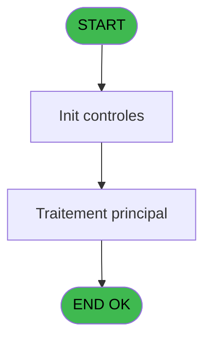
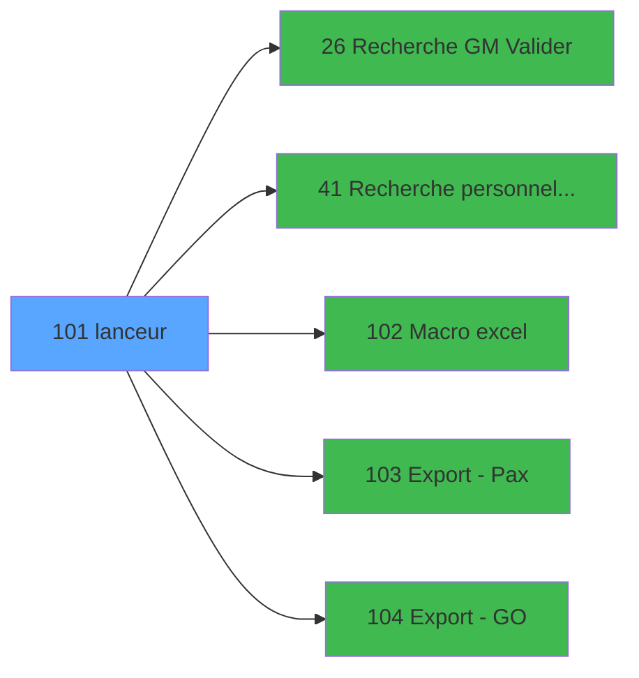

# PBP IDE 101 - lanceur

> **Analyse**: Phases 1-4 2026-02-03 09:22 -> 09:23 (20s) | Assemblage 09:23
> **Pipeline**: V7.2 Enrichi
> **Structure**: 4 onglets (Resume | Ecrans | Donnees | Connexions)

<!-- TAB:Resume -->

## 1. FICHE D'IDENTITE

| Attribut | Valeur |
|----------|--------|
| Projet | PBP |
| IDE Position | 101 |
| Nom Programme | lanceur |
| Fichier source | `Prg_101.xml` |
| Domaine metier | General |
| Taches | 1 (1 ecrans visibles) |
| Tables modifiees | 0 |
| Programmes appeles | 5 |
| :warning: Statut | **ORPHELIN_POTENTIEL** |

## 2. DESCRIPTION FONCTIONNELLE

**lanceur** assure la gestion complete de ce processus.

Le flux de traitement s'organise en **1 blocs fonctionnels** :

- **Traitement** (1 tache) : traitements metier divers

## 3. BLOCS FONCTIONNELS

### 3.1 Traitement (1 tache)

Traitements internes.

---

#### 101 - Listes PAX et Crew [[ECRAN]](#ecran-t1)

**Role** : Traitement : Listes PAX et Crew.
**Ecran** : 278 x 131 DLU (MDI) | [Voir mockup](#ecran-t1)
**Delegue a** : [Macro excel (IDE 102)](PBP-IDE-102.md), [Export - Pax (IDE 103)](PBP-IDE-103.md), [Export - GO (IDE 104)](PBP-IDE-104.md)

## 5. REGLES METIER

*(Aucune regle metier identifiee)*

## 6. CONTEXTE

- **Appele par**: (aucun)
- **Appelle**: 5 programmes | **Tables**: 0 (W:0 R:0 L:0) | **Taches**: 1 | **Expressions**: 9

<!-- TAB:Ecrans -->

## 8. ECRANS

### 8.1 Forms visibles (1 / 1)

| # | Position | Tache | Nom | Type | Largeur | Hauteur | Bloc |
|---|----------|-------|-----|------|---------|---------|------|
| 1 | 101 | 101 | Listes PAX et Crew | MDI | 278 | 131 | Traitement |

### 8.2 Mockups Ecrans

---

#### 101 - Listes PAX et Crew
**Tache** : [101](#t1) | **Type** : MDI | **Dimensions** : 278 x 131 DLU
**Bloc** : Traitement | **Titre IDE** : Listes PAX et Crew

<!-- FORM-DATA:
{
    "width":  278,
    "vFactor":  8,
    "type":  "MDI",
    "hFactor":  4,
    "controls":  [
                     {
                         "x":  146,
                         "type":  "label",
                         "var":  "",
                         "y":  36,
                         "w":  119,
                         "fmt":  "",
                         "name":  "",
                         "h":  39,
                         "color":  "141",
                         "text":  "Edition des listes PAX et Crew",
                         "parent":  null
                     },
                     {
                         "x":  4,
                         "type":  "label",
                         "var":  "",
                         "y":  95,
                         "w":  270,
                         "fmt":  "",
                         "name":  "",
                         "h":  33,
                         "color":  "",
                         "text":  "",
                         "parent":  null
                     },
                     {
                         "x":  178,
                         "type":  "button",
                         "var":  "",
                         "y":  101,
                         "w":  91,
                         "fmt":  "\u0026Ok",
                         "name":  "b.ok",
                         "h":  23,
                         "color":  "",
                         "text":  "",
                         "parent":  null
                     },
                     {
                         "x":  11,
                         "type":  "button",
                         "var":  "",
                         "y":  101,
                         "w":  91,
                         "fmt":  "\u0026Quitter",
                         "name":  "b.quitter",
                         "h":  23,
                         "color":  "",
                         "text":  "",
                         "parent":  3
                     },
                     {
                         "x":  17,
                         "type":  "image",
                         "var":  "",
                         "y":  19,
                         "w":  91,
                         "fmt":  "",
                         "name":  "",
                         "h":  59,
                         "color":  "",
                         "text":  "",
                         "parent":  null
                     }
                 ],
    "taskId":  "101",
    "height":  131
}
-->

<strong>Boutons : 2 boutons</strong>

| Bouton | Pos (x,y) | Action |
|--------|-----------|--------|
| Ok | 178,101 | Valide la saisie et enregistre |
| Quitter | 11,101 | Quitte le programme |

## 9. NAVIGATION

Ecran unique: **Listes PAX et Crew**

### 9.3 Structure hierarchique (1 tache)

| Position | Tache | Type | Dimensions | Bloc |
|----------|-------|------|------------|------|
| **101.1** | [**Listes PAX et Crew** (101)](#t1) [mockup](#ecran-t1) | MDI | 278x131 | Traitement |

### 9.4 Algorigramme

> **Legende**: Vert = START/END OK | Rouge = END KO | Bleu = Decisions
> *Algorigramme auto-genere. Utiliser `/algorigramme` pour une synthese metier detaillee.*

<!-- TAB:Donnees -->

## 10. TABLES

### Tables utilisees (0)

| ID | Nom | Description | Type | R | W | L | Usages |
|----|-----|-------------|------|---|---|---|--------|

### Colonnes par table (0 / 0 tables avec colonnes identifiees)

## 11. VARIABLES

### 11.1 Autres (2)

Variables diverses.

| Lettre | Nom | Type | Usage dans |
|--------|-----|------|-----------|
| A | b.ok | Alpha | - |
| B | b.quitter | Alpha | - |

## 12. EXPRESSIONS

**9 / 9 expressions decodees (100%)**

### 12.1 Repartition par type

| Type | Expressions | Regles |
|------|-------------|--------|
| CONSTANTE | 3 | 0 |
| DATE | 3 | 0 |
| OTHER | 3 | 0 |

### 12.2 Expressions cles par type

#### CONSTANTE (3 expressions)

| Type | IDE | Expression | Regle |
|------|-----|------------|-------|
| CONSTANTE | 9 | `'Actions'` | - |
| CONSTANTE | 4 | `'L'` | - |
| CONSTANTE | 3 | `'C'` | - |

#### DATE (3 expressions)

| Type | IDE | Expression | Regle |
|------|-----|------------|-------|
| DATE | 8 | `'Liste Crew le '&DStr (Date (),'DD/MM/YYYY')` | - |
| DATE | 7 | `'Liste PAX le '&DStr (Date (),'DD/MM/YYYY')` | - |
| DATE | 2 | `Date ()` | - |

#### OTHER (3 expressions)

| Type | IDE | Expression | Regle |
|------|-----|------------|-------|
| OTHER | 6 | `INIGet ('[MAGIC_LOGICAL_NAMES]club_env')&'tmp_crew.TXT'` | - |
| OTHER | 5 | `INIGet ('[MAGIC_LOGICAL_NAMES]club_env')&'tmp_pax.TXT'` | - |
| OTHER | 1 | `DbDel ('{632,2}'DSOURCE,'')` | - |

<!-- TAB:Connexions -->

## 13. GRAPHE D'APPELS

### 13.1 Chaine depuis Main (Callers)

**Chemin**: (pas de callers directs)

### 13.2 Callers

| IDE | Nom Programme | Nb Appels |
|-----|---------------|-----------|
| - | (aucun) | - |

### 13.3 Callees (programmes appeles)

### 13.4 Detail Callees avec contexte

| IDE | Nom Programme | Appels | Contexte |
|-----|---------------|--------|----------|
| [26](PBP-IDE-26.md) |    Recherche GM Valider | 1 | Sous-programme |
| [41](PBP-IDE-41.md) |    Recherche personnel Valider | 1 | Sous-programme |
| [102](PBP-IDE-102.md) | Macro excel | 1 | Sous-programme |
| [103](PBP-IDE-103.md) | Export - Pax | 1 | Sous-programme |
| [104](PBP-IDE-104.md) | Export - GO | 1 | Sous-programme |

## 14. RECOMMANDATIONS MIGRATION

### 14.1 Profil du programme

| Metrique | Valeur | Impact migration |
|----------|--------|-----------------|
| Lignes de logique | 12 | Programme compact |
| Expressions | 9 | Peu de logique |
| Tables WRITE | 0 | Impact faible |
| Sous-programmes | 5 | Peu de dependances |
| Ecrans visibles | 1 | Ecran unique ou traitement batch |
| Code desactive | 0% (0 / 12) | Code sain |
| Regles metier | 0 | Pas de regle identifiee |

### 14.2 Plan de migration par bloc

#### Traitement (1 tache: 1 ecran, 0 traitement)

- **Strategie** : 1 composant(s) UI (Razor/React) avec formulaires et validation.
- 5 sous-programme(s) a migrer ou a reutiliser depuis les services existants.
- Decomposer les taches en services unitaires testables.

### 14.3 Dependances critiques

| Dependance | Type | Appels | Impact |
|------------|------|--------|--------|
| [Export - Pax (IDE 103)](PBP-IDE-103.md) | Sous-programme | 1x | Normale - Sous-programme |
| [Export - GO (IDE 104)](PBP-IDE-104.md) | Sous-programme | 1x | Normale - Sous-programme |
| [Macro excel (IDE 102)](PBP-IDE-102.md) | Sous-programme | 1x | Normale - Sous-programme |
| [   Recherche GM Valider (IDE 26)](PBP-IDE-26.md) | Sous-programme | 1x | Normale - Sous-programme |
| [   Recherche personnel Valider (IDE 41)](PBP-IDE-41.md) | Sous-programme | 1x | Normale - Sous-programme |

---
*Spec DETAILED generee par Pipeline V7.2 - 2026-02-03 09:23*
