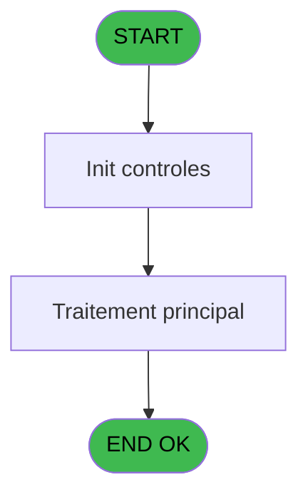

# PBP IDE 102 - Macro excel

> **Analyse**: Phases 1-4 2026-02-03 09:23 -> 09:23 (21s) | Assemblage 09:23
> **Pipeline**: V7.2 Enrichi
> **Structure**: 4 onglets (Resume | Ecrans | Donnees | Connexions)

<!-- TAB:Resume -->

## 1. FICHE D'IDENTITE

| Attribut | Valeur |
|----------|--------|
| Projet | PBP |
| IDE Position | 102 |
| Nom Programme | Macro excel |
| Fichier source | `Prg_102.xml` |
| Domaine metier | General |
| Taches | 1 (0 ecrans visibles) |
| Tables modifiees | 0 |
| Programmes appeles | 0 |

## 2. DESCRIPTION FONCTIONNELLE

**Macro excel** assure la gestion complete de ce processus, accessible depuis [lanceur (IDE 101)](PBP-IDE-101.md).

Le flux de traitement s'organise en **1 blocs fonctionnels** :

- **Impression** (1 tache) : generation de tickets et documents

## 3. BLOCS FONCTIONNELS

### 3.1 Impression (1 tache)

Generation des documents et tickets.

---

#### 102 - Print batch

**Role** : Generation du document : Print batch.

## 5. REGLES METIER

*(Aucune regle metier identifiee)*

## 6. CONTEXTE

- **Appele par**: [lanceur (IDE 101)](PBP-IDE-101.md)
- **Appelle**: 0 programmes | **Tables**: 0 (W:0 R:0 L:0) | **Taches**: 1 | **Expressions**: 10

<!-- TAB:Ecrans -->

## 8. ECRANS

*(Programme sans ecran visible)*

## 9. NAVIGATION

### 9.3 Structure hierarchique (1 tache)

| Position | Tache | Type | Dimensions | Bloc |
|----------|-------|------|------------|------|
| **102.1** | [**Print batch** (102)](#t1) | MDI | - | Impression |

### 9.4 Algorigramme

> **Legende**: Vert = START/END OK | Rouge = END KO | Bleu = Decisions
> *Algorigramme auto-genere. Utiliser `/algorigramme` pour une synthese metier detaillee.*

<!-- TAB:Donnees -->

## 10. TABLES

### Tables utilisees (0)

| ID | Nom | Description | Type | R | W | L | Usages |
|----|-----|-------------|------|---|---|---|--------|

### Colonnes par table (0 / 0 tables avec colonnes identifiees)

## 11. VARIABLES

### 11.1 Parametres entrants (7)

Variables recues du programme appelant ([lanceur (IDE 101)](PBP-IDE-101.md)).

| Lettre | Nom | Type | Usage dans |
|--------|-----|------|-----------|
| A | P. Ligne Excel | Alpha | 6x parametre entrant |
| B | P. Column Excel | Alpha | 6x parametre entrant |
| C | p.file path1 | Alpha | 1x parametre entrant |
| D | p.file path2 | Alpha | 1x parametre entrant |
| E | P.Titre | Alpha | 2x parametre entrant |
| F | P.Titre 2 | Alpha | 1x parametre entrant |
| G | P. Macro name | Alpha | 1x parametre entrant |

## 12. EXPRESSIONS

**10 / 10 expressions decodees (100%)**

### 12.1 Repartition par type

| Type | Expressions | Regles |
|------|-------------|--------|
| CONSTANTE | 1 | 0 |
| OTHER | 3 | 0 |
| CONCATENATION | 6 | 0 |

### 12.2 Expressions cles par type

#### CONSTANTE (1 expressions)

| Type | IDE | Expression | Regle |
|------|-----|------------|-------|
| CONSTANTE | 10 | `'%club_env%macros.xls'` | - |

#### OTHER (3 expressions)

| Type | IDE | Expression | Regle |
|------|-----|------------|-------|
| OTHER | 8 | `DDExec ('Excel','System','','[RUN("Recup" ;FALSE)]')` | - |
| OTHER | 2 | `DDEEnd ('Excel',INIGet ('[MAGIC_LOGICAL_NAMES]club_env')&'macros.xls')` | - |
| OTHER | 1 | `DDEBegin ('Excel',INIGet ('[MAGIC_LOGICAL_NAMES]club_env')&'macros.xls')` | - |

#### CONCATENATION (6 expressions)

| Type | IDE | Expression | Regle |
|------|-----|------------|-------|
| CONCATENATION | 5 | `DDEPoke ('Excel',INIGet ('[MAGIC_LOGICAL_NAMES]club_env')&'macros.xls',P. Ligne Excel [A]&'5'&P. Column Excel [B]&'1',Trim (P. Macro name [G]))` | - |
| CONCATENATION | 6 | `DDEPoke ('Excel',INIGet ('[MAGIC_LOGICAL_NAMES]club_env')&'macros.xls',P. Ligne Excel [A]&'3'&P. Column Excel [B]&'1',Trim (P.Titre [E]))` | - |
| CONCATENATION | 7 | `DDEPoke ('Excel',INIGet ('[MAGIC_LOGICAL_NAMES]club_env')&'macros.xls',P. Ligne Excel [A]&'4'&P. Column Excel [B]&'1',Trim (P.Titre 2 [F]))` | - |
| CONCATENATION | 9 | `DDEPoke ('Excel',INIGet ('[MAGIC_LOGICAL_NAMES]club_env')&'macros.xls',P. Ligne Excel [A]&'1'&P. Column Excel [B]&'1','')` | - |
| CONCATENATION | 3 | `DDEPoke ('Excel',INIGet ('[MAGIC_LOGICAL_NAMES]club_env')&'macros.xls',P. Ligne Excel [A]&'1'&P. Column Excel [B]&'1',Trim (p.file path1 [C]))` | - |
| ... | | *+1 autres* | |

<!-- TAB:Connexions -->

## 13. GRAPHE D'APPELS

### 13.1 Chaine depuis Main (Callers)

Main -> ... -> [lanceur (IDE 101)](PBP-IDE-101.md) -> **Macro excel (IDE 102)**

### 13.2 Callers

| IDE | Nom Programme | Nb Appels |
|-----|---------------|-----------|
| [101](PBP-IDE-101.md) | lanceur | 1 |

### 13.3 Callees (programmes appeles)

### 13.4 Detail Callees avec contexte

| IDE | Nom Programme | Appels | Contexte |
|-----|---------------|--------|----------|
| - | (aucun) | - | - |

## 14. RECOMMANDATIONS MIGRATION

### 14.1 Profil du programme

| Metrique | Valeur | Impact migration |
|----------|--------|-----------------|
| Lignes de logique | 20 | Programme compact |
| Expressions | 10 | Peu de logique |
| Tables WRITE | 0 | Impact faible |
| Sous-programmes | 0 | Peu de dependances |
| Ecrans visibles | 0 | Ecran unique ou traitement batch |
| Code desactive | 0% (0 / 20) | Code sain |
| Regles metier | 0 | Pas de regle identifiee |

### 14.2 Plan de migration par bloc

#### Impression (1 tache: 0 ecran, 1 traitement)

- **Strategie** : Templates HTML -> PDF via wkhtmltopdf ou Puppeteer.
- `PrintService` injectable avec choix imprimante

### 14.3 Dependances critiques

| Dependance | Type | Appels | Impact |
|------------|------|--------|--------|

---
*Spec DETAILED generee par Pipeline V7.2 - 2026-02-03 09:23*
