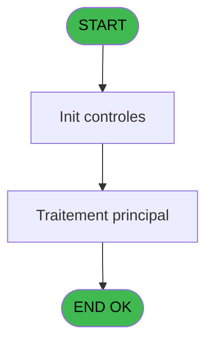
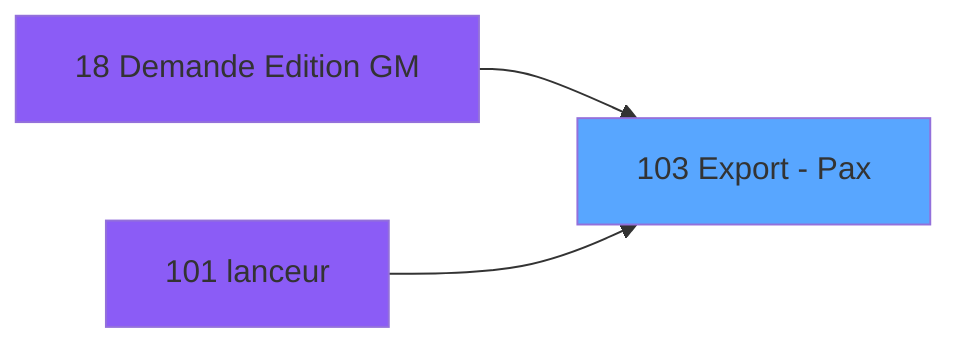

# PBP IDE 103 - Export - Pax

> **Analyse**: Phases 1-4 2026-02-03 09:23 -> 09:24 (20s) | Assemblage 09:24
> **Pipeline**: V7.2 Enrichi
> **Structure**: 4 onglets (Resume | Ecrans | Donnees | Connexions)

<!-- TAB:Resume -->

## 1. FICHE D'IDENTITE

| Attribut | Valeur |
|----------|--------|
| Projet | PBP |
| IDE Position | 103 |
| Nom Programme | Export - Pax |
| Fichier source | `Prg_103.xml` |
| Domaine metier | General |
| Taches | 1 (0 ecrans visibles) |
| Tables modifiees | 0 |
| Programmes appeles | 0 |

## 2. DESCRIPTION FONCTIONNELLE

**Export - Pax** assure la gestion complete de ce processus, accessible depuis [Demande Edition GM (IDE 18)](PBP-IDE-18.md), [lanceur (IDE 101)](PBP-IDE-101.md).

Le flux de traitement s'organise en **1 blocs fonctionnels** :

- **Traitement** (1 tache) : traitements metier divers

**Logique metier** : 1 regles identifiees couvrant conditions metier.

## 3. BLOCS FONCTIONNELS

### 3.1 Traitement (1 tache)

Traitements internes.

---

#### 103 - Export - Pax [[ECRAN]](#ecran-t1)

**Role** : Traitement : Export - Pax.
**Ecran** : 215 x 71 DLU (MDI) | [Voir mockup](#ecran-t1)

## 5. REGLES METIER

1 regles identifiees:

### Autres (1 regles)

#### [RM-001] Si p.eapis [A] alors INIGet ('[MAGIC_LOGICAL_NAMES]club_exportdata')&'PAX.CSV' sinon '%club_env%tmp_pax.txt')

| Element | Detail |
|---------|--------|
| **Condition** | `p.eapis [A]` |
| **Si vrai** | INIGet ('[MAGIC_LOGICAL_NAMES]club_exportdata')&'PAX.CSV' |
| **Si faux** | '%club_env%tmp_pax.txt') |
| **Variables** | A (p.eapis) |
| **Expression source** | Expression 1 : `IF (p.eapis [A],INIGet ('[MAGIC_LOGICAL_NAMES]club_exportdat` |
| **Exemple** | Si p.eapis [A] → INIGet ('[MAGIC_LOGICAL_NAMES]club_exportdata')&'PAX.CSV'. Sinon → '%club_env%tmp_pax.txt') |
| **Impact** | [103 - Export - Pax](#t1) |

## 6. CONTEXTE

- **Appele par**: [Demande Edition GM (IDE 18)](PBP-IDE-18.md), [lanceur (IDE 101)](PBP-IDE-101.md)
- **Appelle**: 0 programmes | **Tables**: 1 (W:0 R:1 L:0) | **Taches**: 1 | **Expressions**: 7

<!-- TAB:Ecrans -->

## 8. ECRANS

*(Programme sans ecran visible)*

## 9. NAVIGATION

### 9.3 Structure hierarchique (1 tache)

| Position | Tache | Type | Dimensions | Bloc |
|----------|-------|------|------------|------|
| **103.1** | [**Export - Pax** (103)](#t1) [mockup](#ecran-t1) | MDI | 215x71 | Traitement |

### 9.4 Algorigramme

> **Legende**: Vert = START/END OK | Rouge = END KO | Bleu = Decisions
> *Algorigramme auto-genere. Utiliser `/algorigramme` pour une synthese metier detaillee.*

<!-- TAB:Donnees -->

## 10. TABLES

### Tables utilisees (1)

| ID | Nom | Description | Type | R | W | L | Usages |
|----|-----|-------------|------|---|---|---|--------|
| 632 | tempo_selection | Table temporaire ecran | DB | R |   |   | 1 |

### Colonnes par table (1 / 1 tables avec colonnes identifiees)

Table 632 - tempo_selection (R) - 1 usages

| Lettre | Variable | Acces | Type |
|--------|----------|-------|------|
| A | p.eapis | R | Logical |
| B | v.Delimiter | R | Alpha |
| C | v.line | R | Alpha |

## 11. VARIABLES

### 11.1 Parametres entrants (1)

Variables recues du programme appelant ([Demande Edition GM (IDE 18)](PBP-IDE-18.md)).

| Lettre | Nom | Type | Usage dans |
|--------|-----|------|-----------|
| A | p.eapis | Logical | 4x parametre entrant |

### 11.2 Variables de session (2)

Variables persistantes pendant toute la session.

| Lettre | Nom | Type | Usage dans |
|--------|-----|------|-----------|
| B | v.Delimiter | Alpha | - |
| C | v.line | Alpha | 1x session |

## 12. EXPRESSIONS

**7 / 7 expressions decodees (100%)**

### 12.1 Repartition par type

| Type | Expressions | Regles |
|------|-------------|--------|
| CONDITION | 2 | 5 |
| CONCATENATION | 2 | 0 |
| OTHER | 2 | 0 |
| NEGATION | 1 | 0 |

### 12.2 Expressions cles par type

#### CONDITION (2 expressions)

| Type | IDE | Expression | Regle |
|------|-----|------------|-------|
| CONDITION | 1 | `IF (p.eapis [A],INIGet ('[MAGIC_LOGICAL_NAMES]club_exportdata')&'PAX.CSV','%club_env%tmp_pax.txt')` | [RM-001](#rm-RM-001) |
| CONDITION | 7 | `IF (p.eapis [A],'3'INDEX,'1'INDEX)` | - |

#### CONCATENATION (2 expressions)

| Type | IDE | Expression | Regle |
|------|-----|------------|-------|
| CONCATENATION | 4 | `'Last Name'&Trim ([N])&'First Name'&Trim ([N])&'Middle Name'&Trim ([N])&'Nationality'&Trim ([N])&'Sex'&Trim ([N])&'Date of Birth'&Trim ([N])&'Passport Number'&Trim ([N])&'Country of Issue'&Trim ([N])&'Date of Expiry'` | - |
| CONCATENATION | 5 | `Trim ([D])&Trim ([N])&Trim ([E])&Trim ([N])&Trim ([N])&Trim ([H])&Trim ([N])&Trim (v.line [C])&Trim ([N])&DStr ([F],'YYYY-MM-DD')&Trim ([N])&Trim ([J])&Trim ([N])&Trim ([L])&Trim ([N])&DStr ([M],'YYYY-MM-DD')` | - |

#### OTHER (2 expressions)

| Type | IDE | Expression | Regle |
|------|-----|------------|-------|
| OTHER | 3 | `INIGet ('[MAGIC_LOGICAL_NAMES]club_excel_separator')` | - |
| OTHER | 2 | `p.eapis [A]` | - |

#### NEGATION (1 expressions)

| Type | IDE | Expression | Regle |
|------|-----|------------|-------|
| NEGATION | 6 | `NOT (p.eapis [A])` | - |

<!-- TAB:Connexions -->

## 13. GRAPHE D'APPELS

### 13.1 Chaine depuis Main (Callers)

Main -> ... -> [Demande Edition GM (IDE 18)](PBP-IDE-18.md) -> **Export - Pax (IDE 103)**

Main -> ... -> [lanceur (IDE 101)](PBP-IDE-101.md) -> **Export - Pax (IDE 103)**

### 13.2 Callers

| IDE | Nom Programme | Nb Appels |
|-----|---------------|-----------|
| [18](PBP-IDE-18.md) | Demande Edition GM | 3 |
| [101](PBP-IDE-101.md) | lanceur | 1 |

### 13.3 Callees (programmes appeles)

### 13.4 Detail Callees avec contexte

| IDE | Nom Programme | Appels | Contexte |
|-----|---------------|--------|----------|
| - | (aucun) | - | - |

## 14. RECOMMANDATIONS MIGRATION

### 14.1 Profil du programme

| Metrique | Valeur | Impact migration |
|----------|--------|-----------------|
| Lignes de logique | 29 | Programme compact |
| Expressions | 7 | Peu de logique |
| Tables WRITE | 0 | Impact faible |
| Sous-programmes | 0 | Peu de dependances |
| Ecrans visibles | 0 | Ecran unique ou traitement batch |
| Code desactive | 0% (0 / 29) | Code sain |
| Regles metier | 1 | Quelques regles a preserver |

### 14.2 Plan de migration par bloc

#### Traitement (1 tache: 1 ecran, 0 traitement)

- **Strategie** : 1 composant(s) UI (Razor/React) avec formulaires et validation.
- Decomposer les taches en services unitaires testables.

### 14.3 Dependances critiques

| Dependance | Type | Appels | Impact |
|------------|------|--------|--------|

---
*Spec DETAILED generee par Pipeline V7.2 - 2026-02-03 09:24*
