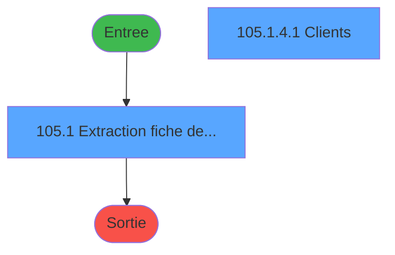
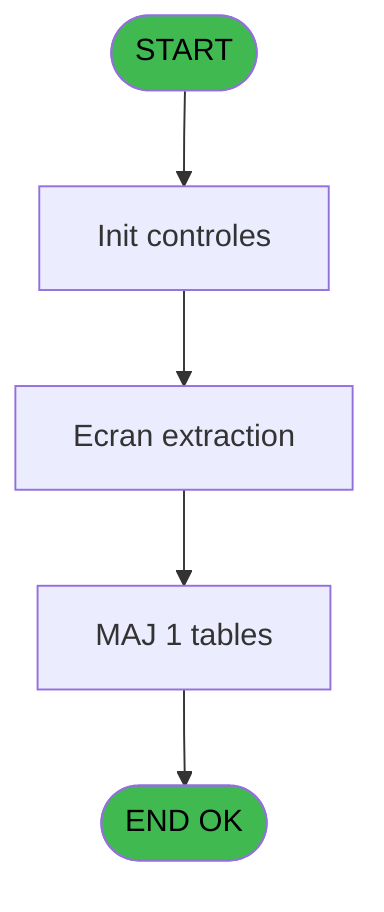

# PBP IDE 105 - Extraction

> **Analyse**: Phases 1-4 2026-02-03 09:24 -> 09:25 (20s) | Assemblage 09:25
> **Pipeline**: V7.2 Enrichi
> **Structure**: 4 onglets (Resume | Ecrans | Donnees | Connexions)

<!-- TAB:Resume -->

## 1. FICHE D'IDENTITE

| Attribut | Valeur |
|----------|--------|
| Projet | PBP |
| IDE Position | 105 |
| Nom Programme | Extraction |
| Fichier source | `Prg_105.xml` |
| Domaine metier | General |
| Taches | 10 (2 ecrans visibles) |
| Tables modifiees | 1 |
| Programmes appeles | 0 |
| :warning: Statut | **ORPHELIN_POTENTIEL** |

## 2. DESCRIPTION FONCTIONNELLE

**Extraction** assure la gestion complete de ce processus.

Le flux de traitement s'organise en **2 blocs fonctionnels** :

- **Traitement** (9 taches) : traitements metier divers
- **Initialisation** (1 tache) : reinitialisation d'etats et de variables de travail

**Donnees modifiees** : 1 tables en ecriture (table_utilisateurs).

Detail : phases du traitement

#### Phase 1 : Traitement (9 taches)

- **105.1** - Extraction fiche de police **[[ECRAN]](#ecran-t1)**
- **105.1.1** - Count
- **105.1.2** - (sans nom)
- **105.1.3** - (sans nom)
- **105** - Ecran extraction
- **105.1.4** - Count
- **105.1.4.1** - Clients **[[ECRAN]](#ecran-t20)**
- **105.1.4.1.2** - Fill XML
- **105.1.4.1.3** - Fill XML

#### Phase 2 : Initialisation (1 tache)

- **105.1.4.1.1** - XML Initial

#### Tables impactees

| Table | Operations | Role metier |
|-------|-----------|-------------|
| table_utilisateurs | **W** (1 usages) |  |

## 3. BLOCS FONCTIONNELS

### 3.1 Traitement (9 taches)

Traitements internes.

---

#### 105.1 - Extraction fiche de police [[ECRAN]](#ecran-t1)

**Role** : Tache d'orchestration : point d'entree du programme (9 sous-taches). Coordonne l'enchainement des traitements.
**Ecran** : 928 x 172 DLU (MDI) | [Voir mockup](#ecran-t1)

8 sous-taches directes

| Tache | Nom | Bloc |
|-------|-----|------|
| [105.1.1](#t5) | Count | Traitement |
| [105.1.2](#t6) | (sans nom) | Traitement |
| [105.1.3](#t13) | (sans nom) | Traitement |
| [105](#t14) | Ecran extraction | Traitement |
| [105.1.4](#t17) | Count | Traitement |
| [105.1.4.1](#t20) | Clients **[[ECRAN]](#ecran-t20)** | Traitement |
| [105.1.4.1.2](#t22) | Fill XML | Traitement |
| [105.1.4.1.3](#t23) | Fill XML | Traitement |

**Variables liees** : A (p. Type Fiche de Police), S (v.FicheComplet? (incomplet))

---

#### 105.1.1 - Count

**Role** : Traitement : Count.
**Variables liees** : BD (v. Count arrivants validés), BE (v. Count arrivants)

---

#### 105.1.2 - (sans nom)

**Role** : Traitement interne.

---

#### 105.1.3 - (sans nom)

**Role** : Traitement interne.

---

#### 105 - Ecran extraction

**Role** : Traitement : Ecran extraction.

---

#### 105.1.4 - Count

**Role** : Traitement : Count.
**Variables liees** : BD (v. Count arrivants validés), BE (v. Count arrivants)

---

#### 105.1.4.1 - Clients [[ECRAN]](#ecran-t20)

**Role** : Traitement : Clients.
**Ecran** : 463 x 30 DLU (Type6) | [Voir mockup](#ecran-t20)

---

#### 105.1.4.1.2 - Fill XML

**Role** : Traitement : Fill XML.

---

#### 105.1.4.1.3 - Fill XML

**Role** : Traitement : Fill XML.

### 3.2 Initialisation (1 tache)

Reinitialisation d'etats et variables de travail.

---

#### 105.1.4.1.1 - XML Initial

**Role** : Reinitialisation : XML Initial.

## 5. REGLES METIER

*(Aucune regle metier identifiee)*

## 6. CONTEXTE

- **Appele par**: (aucun)
- **Appelle**: 0 programmes | **Tables**: 10 (W:1 R:1 L:8) | **Taches**: 10 | **Expressions**: 6

<!-- TAB:Ecrans -->

## 8. ECRANS

### 8.1 Forms visibles (2 / 10)

| # | Position | Tache | Nom | Type | Largeur | Hauteur | Bloc |
|---|----------|-------|-----|------|---------|---------|------|
| 1 | 105 | 105.1 | Extraction fiche de police | MDI | 928 | 172 | Traitement |
| 2 | 105.2.1 | 105.1.4.1 | Clients | Type6 | 463 | 30 | Traitement |

### 8.2 Mockups Ecrans

---

#### 105 - Extraction fiche de police
**Tache** : [105.1](#t1) | **Type** : MDI | **Dimensions** : 928 x 172 DLU
**Bloc** : Traitement | **Titre IDE** : Extraction fiche de police

<!-- FORM-DATA:
{
    "width":  928,
    "vFactor":  8,
    "type":  "MDI",
    "hFactor":  8,
    "controls":  [
                     {
                         "x":  0,
                         "type":  "label",
                         "var":  "",
                         "y":  0,
                         "w":  922,
                         "fmt":  "",
                         "name":  "",
                         "h":  24,
                         "color":  "",
                         "text":  "",
                         "parent":  null
                     },
                     {
                         "x":  52,
                         "type":  "label",
                         "var":  "",
                         "y":  24,
                         "w":  662,
                         "fmt":  "",
                         "name":  "",
                         "h":  118,
                         "color":  "",
                         "text":  "",
                         "parent":  null
                     },
                     {
                         "x":  727,
                         "type":  "label",
                         "var":  "",
                         "y":  24,
                         "w":  186,
                         "fmt":  "",
                         "name":  "",
                         "h":  118,
                         "color":  "",
                         "text":  "",
                         "parent":  null
                     },
                     {
                         "x":  62,
                         "type":  "label",
                         "var":  "",
                         "y":  67,
                         "w":  89,
                         "fmt":  "",
                         "name":  "",
                         "h":  10,
                         "color":  "",
                         "text":  "Arrivée du",
                         "parent":  5
                     },
                     {
                         "x":  0,
                         "type":  "label",
                         "var":  "",
                         "y":  147,
                         "w":  922,
                         "fmt":  "",
                         "name":  "",
                         "h":  24,
                         "color":  "",
                         "text":  "",
                         "parent":  null
                     },
                     {
                         "x":  358,
                         "type":  "label",
                         "var":  "",
                         "y":  67,
                         "w":  45,
                         "fmt":  "",
                         "name":  "",
                         "h":  10,
                         "color":  "",
                         "text":  "Au",
                         "parent":  5
                     },
                     {
                         "x":  62,
                         "type":  "label",
                         "var":  "",
                         "y":  33,
                         "w":  215,
                         "fmt":  "",
                         "name":  "",
                         "h":  10,
                         "color":  "",
                         "text":  "Enregistrer sous :",
                         "parent":  5
                     },
                     {
                         "x":  62,
                         "type":  "label",
                         "var":  "",
                         "y":  84,
                         "w":  70,
                         "fmt":  "",
                         "name":  "",
                         "h":  12,
                         "color":  "",
                         "text":  "Qualité",
                         "parent":  5
                     },
                     {
                         "x":  62,
                         "type":  "label",
                         "var":  "",
                         "y":  103,
                         "w":  90,
                         "fmt":  "",
                         "name":  "",
                         "h":  12,
                         "color":  "",
                         "text":  "Nationalité",
                         "parent":  5
                     },
                     {
                         "x":  63,
                         "type":  "label",
                         "var":  "",
                         "y":  122,
                         "w":  90,
                         "fmt":  "",
                         "name":  "",
                         "h":  12,
                         "color":  "",
                         "text":  "Sélection",
                         "parent":  5
                     },
                     {
                         "x":  62,
                         "type":  "edit",
                         "var":  "",
                         "y":  50,
                         "w":  586,
                         "fmt":  "",
                         "name":  "tut_repertoire_export",
                         "h":  10,
                         "color":  "",
                         "text":  "",
                         "parent":  5
                     },
                     {
                         "x":  659,
                         "type":  "button",
                         "var":  "",
                         "y":  50,
                         "w":  33,
                         "fmt":  "...",
                         "name":  "b_Choix répertoire_0001",
                         "h":  10,
                         "color":  "",
                         "text":  "",
                         "parent":  5
                     },
                     {
                         "x":  165,
                         "type":  "edit",
                         "var":  "",
                         "y":  67,
                         "w":  126,
                         "fmt":  "DD/MM/YYYYZ",
                         "name":  "w0_DateMin",
                         "h":  10,
                         "color":  "110",
                         "text":  "",
                         "parent":  5
                     },
                     {
                         "x":  301,
                         "type":  "button",
                         "var":  "",
                         "y":  67,
                         "w":  33,
                         "fmt":  "...",
                         "name":  "b_DateMin",
                         "h":  10,
                         "color":  "",
                         "text":  "",
                         "parent":  5
                     },
                     {
                         "x":  427,
                         "type":  "edit",
                         "var":  "",
                         "y":  67,
                         "w":  126,
                         "fmt":  "DD/MM/YYYYZ",
                         "name":  "w0_DateMax",
                         "h":  10,
                         "color":  "110",
                         "text":  "",
                         "parent":  5
                     },
                     {
                         "x":  563,
                         "type":  "button",
                         "var":  "",
                         "y":  67,
                         "w":  33,
                         "fmt":  "...",
                         "name":  "b_DateMax",
                         "h":  10,
                         "color":  "",
                         "text":  "",
                         "parent":  null
                     },
                     {
                         "x":  8,
                         "type":  "edit",
                         "var":  "",
                         "y":  2,
                         "w":  267,
                         "fmt":  "20",
                         "name":  "",
                         "h":  8,
                         "color":  "",
                         "text":  "",
                         "parent":  1
                     },
                     {
                         "x":  707,
                         "type":  "edit",
                         "var":  "",
                         "y":  8,
                         "w":  203,
                         "fmt":  "WWW DD MMM YYYYT",
                         "name":  "",
                         "h":  8,
                         "color":  "",
                         "text":  "",
                         "parent":  1
                     },
                     {
                         "x":  8,
                         "type":  "edit",
                         "var":  "",
                         "y":  12,
                         "w":  331,
                         "fmt":  "25",
                         "name":  "",
                         "h":  8,
                         "color":  "",
                         "text":  "",
                         "parent":  1
                     },
                     {
                         "x":  763,
                         "type":  "image",
                         "var":  "",
                         "y":  33,
                         "w":  128,
                         "fmt":  "",
                         "name":  "",
                         "h":  56,
                         "color":  "",
                         "text":  "",
                         "parent":  6
                     },
                     {
                         "x":  9,
                         "type":  "button",
                         "var":  "",
                         "y":  150,
                         "w":  154,
                         "fmt":  "\u0026Quitter",
                         "name":  "",
                         "h":  18,
                         "color":  "",
                         "text":  "",
                         "parent":  14
                     },
                     {
                         "x":  176,
                         "type":  "edit",
                         "var":  "",
                         "y":  150,
                         "w":  742,
                         "fmt":  "",
                         "name":  "v.Complément message d\u0027erreur",
                         "h":  10,
                         "color":  "",
                         "text":  "",
                         "parent":  14
                     },
                     {
                         "x":  176,
                         "type":  "edit",
                         "var":  "",
                         "y":  160,
                         "w":  742,
                         "fmt":  "50",
                         "name":  "",
                         "h":  10,
                         "color":  "",
                         "text":  "",
                         "parent":  14
                     },
                     {
                         "x":  165,
                         "type":  "combobox",
                         "var":  "",
                         "y":  84,
                         "w":  125,
                         "fmt":  "",
                         "name":  "v.Qualite",
                         "h":  12,
                         "color":  "",
                         "text":  "\\ ,VSL,PROP,CLUB,IGP,ORDI",
                         "parent":  5
                     },
                     {
                         "x":  165,
                         "type":  "edit",
                         "var":  "",
                         "y":  103,
                         "w":  33,
                         "fmt":  "",
                         "name":  "w0_Pays",
                         "h":  12,
                         "color":  "110",
                         "text":  "",
                         "parent":  5
                     },
                     {
                         "x":  259,
                         "type":  "edit",
                         "var":  "",
                         "y":  103,
                         "w":  332,
                         "fmt":  "",
                         "name":  "pn_libelle",
                         "h":  12,
                         "color":  "",
                         "text":  "",
                         "parent":  5
                     },
                     {
                         "x":  211,
                         "type":  "button",
                         "var":  "",
                         "y":  103,
                         "w":  33,
                         "fmt":  "...",
                         "name":  "b_Pays",
                         "h":  12,
                         "color":  "",
                         "text":  "",
                         "parent":  5
                     },
                     {
                         "x":  743,
                         "type":  "button",
                         "var":  "",
                         "y":  98,
                         "w":  154,
                         "fmt":  "\u0026Extraction",
                         "name":  "b_Extraire",
                         "h":  18,
                         "color":  "",
                         "text":  "",
                         "parent":  6
                     },
                     {
                         "x":  165,
                         "type":  "combobox",
                         "var":  "",
                         "y":  122,
                         "w":  273,
                         "fmt":  "",
                         "name":  "v.Listing",
                         "h":  12,
                         "color":  "",
                         "text":  "\\ ,C,I",
                         "parent":  5
                     },
                     {
                         "x":  743,
                         "type":  "button",
                         "var":  "",
                         "y":  120,
                         "w":  154,
                         "fmt":  "\u0026Listing",
                         "name":  "b_Listing",
                         "h":  18,
                         "color":  "",
                         "text":  "",
                         "parent":  6
                     }
                 ],
    "taskId":  "105",
    "height":  172
}
-->

<strong>Champs : 12 champs</strong>

| Pos (x,y) | Nom | Variable | Type |
|-----------|-----|----------|------|
| 62,50 | tut_repertoire_export | - | edit |
| 165,67 | w0_DateMin | - | edit |
| 427,67 | w0_DateMax | - | edit |
| 8,2 | 20 | - | edit |
| 707,8 | WWW DD MMM YYYYT | - | edit |
| 8,12 | 25 | - | edit |
| 176,150 | v.Complément message d'erreur | - | edit |
| 176,160 | 50 | - | edit |
| 165,84 | v.Qualite | - | combobox |
| 165,103 | w0_Pays | - | edit |
| 259,103 | pn_libelle | - | edit |
| 165,122 | v.Listing | - | combobox |

<strong>Boutons : 7 boutons</strong>

| Bouton | Pos (x,y) | Action |
|--------|-----------|--------|
| ... | 659,50 | Bouton fonctionnel |
| ... | 301,67 | Bouton fonctionnel |
| ... | 563,67 | Bouton fonctionnel |
| Quitter | 9,150 | Quitte le programme |
| ... | 211,103 | Bouton fonctionnel |
| Extraction | 743,98 | Bouton fonctionnel |
| Listing | 743,120 | Bouton fonctionnel |

## 9. NAVIGATION

### 9.1 Enchainement des ecrans

**Detail par enchainement :**

| Depuis | Action | Vers | Retour |
|--------|--------|------|--------|

### 9.3 Structure hierarchique (10 taches)

| Position | Tache | Type | Dimensions | Bloc |
|----------|-------|------|------------|------|
| **105.1** | [**Extraction fiche de police** (105.1)](#t1) [mockup](#ecran-t1) | MDI | 928x172 | Traitement |
| 105.1.1 | [Count (105.1.1)](#t5) | MDI | - | |
| 105.1.2 | [(sans nom) (105.1.2)](#t6) | - | - | |
| 105.1.3 | [(sans nom) (105.1.3)](#t13) | - | - | |
| 105.1.4 | [Ecran extraction (105)](#t14) | - | - | |
| 105.1.5 | [Count (105.1.4)](#t17) | MDI | - | |
| 105.1.6 | [Clients (105.1.4.1)](#t20) [mockup](#ecran-t20) | Type6 | 463x30 | |
| 105.1.7 | [Fill XML (105.1.4.1.2)](#t22) | - | - | |
| 105.1.8 | [Fill XML (105.1.4.1.3)](#t23) | - | - | |
| **105.2** | [**XML Initial** (105.1.4.1.1)](#t21) | - | - | Initialisation |

### 9.4 Algorigramme

> **Legende**: Vert = START/END OK | Rouge = END KO | Bleu = Decisions
> *Algorigramme auto-genere. Utiliser `/algorigramme` pour une synthese metier detaillee.*

<!-- TAB:Donnees -->

## 10. TABLES

### Tables utilisees (10)

| ID | Nom | Description | Type | R | W | L | Usages |
|----|-----|-------------|------|---|---|---|--------|
| 30 | gm-recherche_____gmr | Index de recherche | DB | R |   |   | 2 |
| 31 | gm-complet_______gmc |  | DB |   |   | L | 2 |
| 34 | hebergement______heb | Hebergement (chambres) | DB |   |   | L | 1 |
| 36 | client_gm |  | DB |   |   | L | 2 |
| 109 | table_utilisateurs |  | DB |   | **W** |   | 1 |
| 364 | pms_footer_comment |  | DB |   |   | L | 2 |
| 372 | pv_budget |  | DB |   |   | L | 1 |
| 837 | ##_pv_customer_dat |  | DB |   |   | L | 1 |
| 1053 | Table_1053 |  | MEM |   |   | L | 2 |
| 1071 | Table_1071 |  | MEM |   |   | L | 2 |

### Colonnes par table (3 / 2 tables avec colonnes identifiees)

Table 30 - gm-recherche_____gmr (R) - 2 usages

*Table utilisee uniquement en Link ou aucune colonne Real identifiee dans le DataView.*

Table 109 - table_utilisateurs (**W**) - 1 usages

| Lettre | Variable | Acces | Type |
|--------|----------|-------|------|
| A | p. Type Fiche de Police | W | Alpha |
| B | b.Choix répertoire | W | Alpha |
| C | v.DateMin | W | Date |
| D | b.DateMin | W | Alpha |
| E | v.DateMax | W | Date |
| F | b.DateMax | W | Alpha |
| G | v.Nombre de jour écart | W | Numeric |
| H | v.Qualite | W | Alpha |
| I | v.Pays | W | Alpha |
| J | b. Pays | W | Alpha |
| K | v.Pays existe? | W | Logical |
| L | v.Libelle pays FRE ou ANG | W | Unicode |
| M | v.Nb lignes | W | Numeric |
| N | b.Extraire | W | Alpha |
| O | v.Répertoire export | W | Unicode |
| P | v.Heure export | W | Time |
| Q | v.Fichier export | W | Unicode |
| R | v.Fichier horodaté | W | Unicode |
| S | v.FicheComplet? (incomplet) | W | Logical |
| T | v.ajout pour diff nom fichier | W | Unicode |
| U | v.Csv | W | Unicode |
| V | v.Xlsx | W | Unicode |
| W | v.Csv final | W | Unicode |
| X | v.Xlsx final | W | Unicode |
| Y | v.Premier export | W | Unicode |
| Z | v.Buffer export | W | Unicode |
| BA | v.No ordre export | W | Numeric |
| BB | v.Complément message d'erreur | W | Unicode |
| BC | v.Batch id père | W | Numeric |
| BD | v. Count arrivants validés | W | Numeric |
| BE | v. Count arrivants | W | Numeric |
| BF | v.Listing | W | Unicode |
| BG | v.requete enreg complet | W | Unicode |
| BH | v.requete enreg incomplet | W | Unicode |
| BI | v.requête complémentaire vue | W | Unicode |
| BJ | v. Doit-on continuer? | W | Numeric |
| BK | >Listing? | W | Logical |
| BL | v.Retour DirDlg | W | Unicode |
| BM | CHG_REASON_tut_repertoire_expo | W | Numeric |
| BN | CHG_PRV_tut_repertoire_export | W | Unicode |
| BO | CHG_REASON_v.DateMin | W | Numeric |
| BP | CHG_PRV_v.DateMin | W | Date |
| BQ | CHG_REASON_v.DateMax | W | Numeric |
| BR | CHG_PRV_v.DateMax | W | Date |

## 11. VARIABLES

### 11.1 Parametres entrants (1)

Variables recues en parametre.

| Lettre | Nom | Type | Usage dans |
|--------|-----|------|-----------|
| A | p. Type Fiche de Police | Alpha | - |

### 11.2 Variables de session (31)

Variables persistantes pendant toute la session.

| Lettre | Nom | Type | Usage dans |
|--------|-----|------|-----------|
| C | v.DateMin | Date | - |
| E | v.DateMax | Date | - |
| G | v.Nombre de jour écart | Numeric | - |
| H | v.Qualite | Alpha | - |
| I | v.Pays | Alpha | - |
| K | v.Pays existe? | Logical | - |
| L | v.Libelle pays FRE ou ANG | Unicode | - |
| M | v.Nb lignes | Numeric | - |
| O | v.Répertoire export | Unicode | - |
| P | v.Heure export | Time | - |
| Q | v.Fichier export | Unicode | - |
| R | v.Fichier horodaté | Unicode | - |
| S | v.FicheComplet? (incomplet) | Logical | - |
| T | v.ajout pour diff nom fichier | Unicode | - |
| U | v.Csv | Unicode | - |
| V | v.Xlsx | Unicode | - |
| W | v.Csv final | Unicode | - |
| X | v.Xlsx final | Unicode | - |
| Y | v.Premier export | Unicode | - |
| Z | v.Buffer export | Unicode | - |
| BA | v.No ordre export | Numeric | - |
| BB | v.Complément message d'erreur | Unicode | - |
| BC | v.Batch id père | Numeric | - |
| BD | v. Count arrivants validés | Numeric | - |
| BE | v. Count arrivants | Numeric | - |
| BF | v.Listing | Unicode | - |
| BG | v.requete enreg complet | Unicode | - |
| BH | v.requete enreg incomplet | Unicode | - |
| BI | v.requête complémentaire vue | Unicode | - |
| BJ | v. Doit-on continuer? | Numeric | - |
| BL | v.Retour DirDlg | Unicode | - |

### 11.3 Autres (12)

Variables diverses.

| Lettre | Nom | Type | Usage dans |
|--------|-----|------|-----------|
| B | b.Choix répertoire | Alpha | - |
| D | b.DateMin | Alpha | - |
| F | b.DateMax | Alpha | - |
| J | b. Pays | Alpha | - |
| N | b.Extraire | Alpha | - |
| BK | >Listing? | Logical | - |
| BM | CHG_REASON_tut_repertoire_expo | Numeric | - |
| BN | CHG_PRV_tut_repertoire_export | Unicode | - |
| BO | CHG_REASON_v.DateMin | Numeric | - |
| BP | CHG_PRV_v.DateMin | Date | - |
| BQ | CHG_REASON_v.DateMax | Numeric | - |
| BR | CHG_PRV_v.DateMax | Date | - |

Toutes les 44 variables (liste complete)

| Cat | Lettre | Nom Variable | Type |
|-----|--------|--------------|------|
| P0 | **A** | p. Type Fiche de Police | Alpha |
| V. | **C** | v.DateMin | Date |
| V. | **E** | v.DateMax | Date |
| V. | **G** | v.Nombre de jour écart | Numeric |
| V. | **H** | v.Qualite | Alpha |
| V. | **I** | v.Pays | Alpha |
| V. | **K** | v.Pays existe? | Logical |
| V. | **L** | v.Libelle pays FRE ou ANG | Unicode |
| V. | **M** | v.Nb lignes | Numeric |
| V. | **O** | v.Répertoire export | Unicode |
| V. | **P** | v.Heure export | Time |
| V. | **Q** | v.Fichier export | Unicode |
| V. | **R** | v.Fichier horodaté | Unicode |
| V. | **S** | v.FicheComplet? (incomplet) | Logical |
| V. | **T** | v.ajout pour diff nom fichier | Unicode |
| V. | **U** | v.Csv | Unicode |
| V. | **V** | v.Xlsx | Unicode |
| V. | **W** | v.Csv final | Unicode |
| V. | **X** | v.Xlsx final | Unicode |
| V. | **Y** | v.Premier export | Unicode |
| V. | **Z** | v.Buffer export | Unicode |
| V. | **BA** | v.No ordre export | Numeric |
| V. | **BB** | v.Complément message d'erreur | Unicode |
| V. | **BC** | v.Batch id père | Numeric |
| V. | **BD** | v. Count arrivants validés | Numeric |
| V. | **BE** | v. Count arrivants | Numeric |
| V. | **BF** | v.Listing | Unicode |
| V. | **BG** | v.requete enreg complet | Unicode |
| V. | **BH** | v.requete enreg incomplet | Unicode |
| V. | **BI** | v.requête complémentaire vue | Unicode |
| V. | **BJ** | v. Doit-on continuer? | Numeric |
| V. | **BL** | v.Retour DirDlg | Unicode |
| Autre | **B** | b.Choix répertoire | Alpha |
| Autre | **D** | b.DateMin | Alpha |
| Autre | **F** | b.DateMax | Alpha |
| Autre | **J** | b. Pays | Alpha |
| Autre | **N** | b.Extraire | Alpha |
| Autre | **BK** | >Listing? | Logical |
| Autre | **BM** | CHG_REASON_tut_repertoire_expo | Numeric |
| Autre | **BN** | CHG_PRV_tut_repertoire_export | Unicode |
| Autre | **BO** | CHG_REASON_v.DateMin | Numeric |
| Autre | **BP** | CHG_PRV_v.DateMin | Date |
| Autre | **BQ** | CHG_REASON_v.DateMax | Numeric |
| Autre | **BR** | CHG_PRV_v.DateMax | Date |

## 12. EXPRESSIONS

**6 / 6 expressions decodees (100%)**

### 12.1 Repartition par type

| Type | Expressions | Regles |
|------|-------------|--------|
| CONSTANTE | 3 | 0 |
| REFERENCE_VG | 3 | 0 |

### 12.2 Expressions cles par type

#### CONSTANTE (3 expressions)

| Type | IDE | Expression | Regle |
|------|-----|------------|-------|
| CONSTANTE | 3 | `'P'` | - |
| CONSTANTE | 2 | `'T'` | - |
| CONSTANTE | 1 | `'M'` | - |

#### REFERENCE_VG (3 expressions)

| Type | IDE | Expression | Regle |
|------|-----|------------|-------|
| REFERENCE_VG | 6 | `VG104` | - |
| REFERENCE_VG | 5 | `VG99` | - |
| REFERENCE_VG | 4 | `VG98` | - |

<!-- TAB:Connexions -->

## 13. GRAPHE D'APPELS

### 13.1 Chaine depuis Main (Callers)

**Chemin**: (pas de callers directs)

### 13.2 Callers

| IDE | Nom Programme | Nb Appels |
|-----|---------------|-----------|
| - | (aucun) | - |

### 13.3 Callees (programmes appeles)

### 13.4 Detail Callees avec contexte

| IDE | Nom Programme | Appels | Contexte |
|-----|---------------|--------|----------|
| - | (aucun) | - | - |

## 14. RECOMMANDATIONS MIGRATION

### 14.1 Profil du programme

| Metrique | Valeur | Impact migration |
|----------|--------|-----------------|
| Lignes de logique | 651 | Programme volumineux |
| Expressions | 6 | Peu de logique |
| Tables WRITE | 1 | Impact faible |
| Sous-programmes | 0 | Peu de dependances |
| Ecrans visibles | 2 | Quelques ecrans |
| Code desactive | 0.6% (4 / 651) | Code sain |
| Regles metier | 0 | Pas de regle identifiee |

### 14.2 Plan de migration par bloc

#### Traitement (9 taches: 2 ecrans, 7 traitements)

- **Strategie** : Orchestrateur avec 2 ecrans (Razor/React) et 7 traitements backend (services).
- Les ecrans deviennent des composants UI, les traitements invisibles deviennent des services injectables.
- Decomposer les taches en services unitaires testables.

#### Initialisation (1 tache: 0 ecran, 1 traitement)

- **Strategie** : Constructeur/methode `InitAsync()` dans l'orchestrateur.

### 14.3 Dependances critiques

| Dependance | Type | Appels | Impact |
|------------|------|--------|--------|
| table_utilisateurs | Table WRITE (Database) | 1x | Schema + repository |

---
*Spec DETAILED generee par Pipeline V7.2 - 2026-02-03 09:25*
