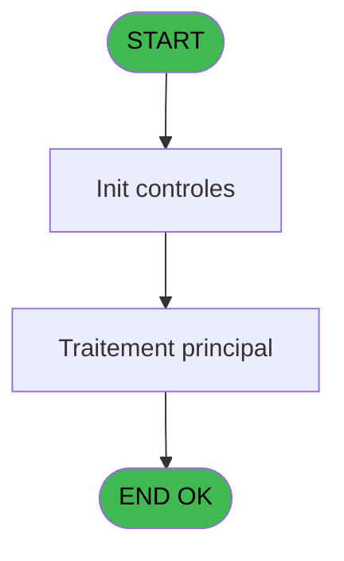

# PBP IDE 106 - Liste Fiche Police

> **Analyse**: Phases 1-4 2026-02-03 09:25 -> 09:25 (20s) | Assemblage 09:25
> **Pipeline**: V7.2 Enrichi
> **Structure**: 4 onglets (Resume | Ecrans | Donnees | Connexions)

<!-- TAB:Resume -->

## 1. FICHE D'IDENTITE

| Attribut | Valeur |
|----------|--------|
| Projet | PBP |
| IDE Position | 106 |
| Nom Programme | Liste Fiche Police |
| Fichier source | `Prg_106.xml` |
| Domaine metier | General |
| Taches | 1 (1 ecrans visibles) |
| Tables modifiees | 0 |
| Programmes appeles | 1 |
| :warning: Statut | **ORPHELIN_POTENTIEL** |

## 2. DESCRIPTION FONCTIONNELLE

**Liste Fiche Police** assure la gestion complete de ce processus.

Le flux de traitement s'organise en **1 blocs fonctionnels** :

- **Traitement** (1 tache) : traitements metier divers

## 3. BLOCS FONCTIONNELS

### 3.1 Traitement (1 tache)

Traitements internes.

---

#### 106 - Liste Fiche Police [[ECRAN]](#ecran-t1)

**Role** : Traitement : Liste Fiche Police.
**Ecran** : 673 x 118 DLU (MDI) | [Voir mockup](#ecran-t1)
**Variables liees** : D (V.Uniquement fiches rensaignée?)
**Delegue a** : [Exportation Fiche Police Turqu (IDE 107)](PBP-IDE-107.md)

## 5. REGLES METIER

*(Aucune regle metier identifiee)*

## 6. CONTEXTE

- **Appele par**: (aucun)
- **Appelle**: 1 programmes | **Tables**: 0 (W:0 R:0 L:0) | **Taches**: 1 | **Expressions**: 13

<!-- TAB:Ecrans -->

## 8. ECRANS

### 8.1 Forms visibles (1 / 1)

| # | Position | Tache | Nom | Type | Largeur | Hauteur | Bloc |
|---|----------|-------|-----|------|---------|---------|------|
| 1 | 106 | 106 | Liste Fiche Police | MDI | 673 | 118 | Traitement |

### 8.2 Mockups Ecrans

---

#### 106 - Liste Fiche Police
**Tache** : [106](#t1) | **Type** : MDI | **Dimensions** : 673 x 118 DLU
**Bloc** : Traitement | **Titre IDE** : Liste Fiche Police

<!-- FORM-DATA:
{
    "width":  673,
    "vFactor":  8,
    "type":  "MDI",
    "hFactor":  8,
    "controls":  [
                     {
                         "x":  0,
                         "type":  "label",
                         "var":  "",
                         "y":  1,
                         "w":  670,
                         "fmt":  "",
                         "name":  "",
                         "h":  19,
                         "color":  "",
                         "text":  "",
                         "parent":  null
                     },
                     {
                         "x":  16,
                         "type":  "label",
                         "var":  "",
                         "y":  24,
                         "w":  417,
                         "fmt":  "",
                         "name":  "",
                         "h":  59,
                         "color":  "",
                         "text":  "",
                         "parent":  null
                     },
                     {
                         "x":  444,
                         "type":  "label",
                         "var":  "",
                         "y":  24,
                         "w":  202,
                         "fmt":  "",
                         "name":  "",
                         "h":  59,
                         "color":  "",
                         "text":  "",
                         "parent":  null
                     },
                     {
                         "x":  43,
                         "type":  "label",
                         "var":  "",
                         "y":  33,
                         "w":  30,
                         "fmt":  "",
                         "name":  "",
                         "h":  10,
                         "color":  "",
                         "text":  "Du",
                         "parent":  5
                     },
                     {
                         "x":  0,
                         "type":  "label",
                         "var":  "",
                         "y":  92,
                         "w":  672,
                         "fmt":  "",
                         "name":  "",
                         "h":  24,
                         "color":  "",
                         "text":  "",
                         "parent":  null
                     },
                     {
                         "x":  96,
                         "type":  "edit",
                         "var":  "",
                         "y":  33,
                         "w":  126,
                         "fmt":  "DD/MM/YYYY",
                         "name":  "w0_DateMin",
                         "h":  10,
                         "color":  "110",
                         "text":  "",
                         "parent":  5
                     },
                     {
                         "x":  224,
                         "type":  "button",
                         "var":  "",
                         "y":  33,
                         "w":  30,
                         "fmt":  "...",
                         "name":  "b_DateMin",
                         "h":  10,
                         "color":  "",
                         "text":  "",
                         "parent":  5
                     },
                     {
                         "x":  507,
                         "type":  "button",
                         "var":  "",
                         "y":  95,
                         "w":  154,
                         "fmt":  "\u0026Impression",
                         "name":  "b_Imprimer",
                         "h":  18,
                         "color":  "",
                         "text":  "",
                         "parent":  14
                     },
                     {
                         "x":  3,
                         "type":  "edit",
                         "var":  "",
                         "y":  3,
                         "w":  267,
                         "fmt":  "20",
                         "name":  "",
                         "h":  8,
                         "color":  "",
                         "text":  "",
                         "parent":  1
                     },
                     {
                         "x":  458,
                         "type":  "edit",
                         "var":  "",
                         "y":  6,
                         "w":  203,
                         "fmt":  "WWW DD MMM YYYYT",
                         "name":  "",
                         "h":  8,
                         "color":  "",
                         "text":  "",
                         "parent":  1
                     },
                     {
                         "x":  3,
                         "type":  "edit",
                         "var":  "",
                         "y":  11,
                         "w":  331,
                         "fmt":  "25",
                         "name":  "",
                         "h":  8,
                         "color":  "",
                         "text":  "",
                         "parent":  1
                     },
                     {
                         "x":  464,
                         "type":  "image",
                         "var":  "",
                         "y":  31,
                         "w":  165,
                         "fmt":  "",
                         "name":  "",
                         "h":  50,
                         "color":  "",
                         "text":  "",
                         "parent":  6
                     },
                     {
                         "x":  7,
                         "type":  "button",
                         "var":  "",
                         "y":  95,
                         "w":  154,
                         "fmt":  "\u0026Quitter",
                         "name":  "",
                         "h":  18,
                         "color":  "",
                         "text":  "",
                         "parent":  14
                     },
                     {
                         "x":  43,
                         "type":  "checkbox",
                         "var":  "",
                         "y":  47,
                         "w":  375,
                         "fmt":  "",
                         "name":  "V.Uniquement fiches rensaignée?",
                         "h":  12,
                         "color":  "",
                         "text":  "Uniquement les fiches de police renseignées",
                         "parent":  5
                     },
                     {
                         "x":  43,
                         "type":  "checkbox",
                         "var":  "",
                         "y":  65,
                         "w":  248,
                         "fmt":  "",
                         "name":  "V.Nom en Turc?",
                         "h":  12,
                         "color":  "",
                         "text":  "Nom de colonne en turc",
                         "parent":  5
                     }
                 ],
    "taskId":  "106",
    "height":  118
}
-->

<strong>Champs : 6 champs</strong>

| Pos (x,y) | Nom | Variable | Type |
|-----------|-----|----------|------|
| 96,33 | w0_DateMin | - | edit |
| 3,3 | 20 | - | edit |
| 458,6 | WWW DD MMM YYYYT | - | edit |
| 3,11 | 25 | - | edit |
| 43,47 | V.Uniquement fiches rensaignée? | - | checkbox |
| 43,65 | V.Nom en Turc? | - | checkbox |

<strong>Boutons : 3 boutons</strong>

| Bouton | Pos (x,y) | Action |
|--------|-----------|--------|
| ... | 224,33 | Bouton fonctionnel |
| Impression | 507,95 | Bouton fonctionnel |
| Quitter | 7,95 | Quitte le programme |

## 9. NAVIGATION

Ecran unique: **Liste Fiche Police**

### 9.3 Structure hierarchique (1 tache)

| Position | Tache | Type | Dimensions | Bloc |
|----------|-------|------|------------|------|
| **106.1** | [**Liste Fiche Police** (106)](#t1) [mockup](#ecran-t1) | MDI | 673x118 | Traitement |

### 9.4 Algorigramme

> **Legende**: Vert = START/END OK | Rouge = END KO | Bleu = Decisions
> *Algorigramme auto-genere. Utiliser `/algorigramme` pour une synthese metier detaillee.*

<!-- TAB:Donnees -->

## 10. TABLES

### Tables utilisees (0)

| ID | Nom | Description | Type | R | W | L | Usages |
|----|-----|-------------|------|---|---|---|--------|

### Colonnes par table (0 / 0 tables avec colonnes identifiees)

## 11. VARIABLES

### 11.1 Variables de session (2)

Variables persistantes pendant toute la session.

| Lettre | Nom | Type | Usage dans |
|--------|-----|------|-----------|
| D | V.Uniquement fiches rensaignée? | Logical | - |
| E | V.Nom en Turc? | Logical | - |

### 11.2 Autres (5)

Variables diverses.

| Lettre | Nom | Type | Usage dans |
|--------|-----|------|-----------|
| A | w0_TitreEcran | Alpha | 2x refs |
| B | w0_DateMin | Date | - |
| C | b_DateMin | Alpha | - |
| F | w0_NbSansDate | Numeric | - |
| G | b_Imprimer | Alpha | - |

## 12. EXPRESSIONS

**13 / 13 expressions decodees (100%)**

### 12.1 Repartition par type

| Type | Expressions | Regles |
|------|-------------|--------|
| CONSTANTE | 3 | 0 |
| DATE | 1 | 0 |
| OTHER | 4 | 0 |
| REFERENCE_VG | 1 | 0 |
| CAST_LOGIQUE | 2 | 0 |
| STRING | 2 | 0 |

### 12.2 Expressions cles par type

#### CONSTANTE (3 expressions)

| Type | IDE | Expression | Regle |
|------|-----|------------|-------|
| CONSTANTE | 9 | `0` | - |
| CONSTANTE | 5 | `'&Imprimer'` | - |
| CONSTANTE | 4 | `'...'` | - |

#### DATE (1 expressions)

| Type | IDE | Expression | Regle |
|------|-----|------------|-------|
| DATE | 7 | `Date ()` | - |

#### OTHER (4 expressions)

| Type | IDE | Expression | Regle |
|------|-----|------------|-------|
| OTHER | 8 | `GetParam ('VILLAGE')` | - |
| OTHER | 13 | `MlsTrans('Exportation fiche police Turque')` | - |
| OTHER | 2 | `SetCrsr (2)` | - |
| OTHER | 3 | `SetCrsr (1)` | - |

#### REFERENCE_VG (1 expressions)

| Type | IDE | Expression | Regle |
|------|-----|------------|-------|
| REFERENCE_VG | 6 | `VG2` | - |

#### CAST_LOGIQUE (2 expressions)

| Type | IDE | Expression | Regle |
|------|-----|------------|-------|
| CAST_LOGIQUE | 12 | `'FALSE'LOG` | - |
| CAST_LOGIQUE | 11 | `'TRUE'LOG` | - |

#### STRING (2 expressions)

| Type | IDE | Expression | Regle |
|------|-----|------------|-------|
| STRING | 10 | `Trim(w0_TitreEcran [A])` | - |
| STRING | 1 | `Trim (w0_TitreEcran [A])` | - |

<!-- TAB:Connexions -->

## 13. GRAPHE D'APPELS

### 13.1 Chaine depuis Main (Callers)

**Chemin**: (pas de callers directs)

### 13.2 Callers

| IDE | Nom Programme | Nb Appels |
|-----|---------------|-----------|
| - | (aucun) | - |

### 13.3 Callees (programmes appeles)

### 13.4 Detail Callees avec contexte

| IDE | Nom Programme | Appels | Contexte |
|-----|---------------|--------|----------|
| [107](PBP-IDE-107.md) | Exportation Fiche Police Turqu | 1 | Sous-programme |

## 14. RECOMMANDATIONS MIGRATION

### 14.1 Profil du programme

| Metrique | Valeur | Impact migration |
|----------|--------|-----------------|
| Lignes de logique | 24 | Programme compact |
| Expressions | 13 | Peu de logique |
| Tables WRITE | 0 | Impact faible |
| Sous-programmes | 1 | Peu de dependances |
| Ecrans visibles | 1 | Ecran unique ou traitement batch |
| Code desactive | 0% (0 / 24) | Code sain |
| Regles metier | 0 | Pas de regle identifiee |

### 14.2 Plan de migration par bloc

#### Traitement (1 tache: 1 ecran, 0 traitement)

- **Strategie** : 1 composant(s) UI (Razor/React) avec formulaires et validation.
- 1 sous-programme(s) a migrer ou a reutiliser depuis les services existants.
- Decomposer les taches en services unitaires testables.

### 14.3 Dependances critiques

| Dependance | Type | Appels | Impact |
|------------|------|--------|--------|
| [Exportation Fiche Police Turqu (IDE 107)](PBP-IDE-107.md) | Sous-programme | 1x | Normale - Sous-programme |

---
*Spec DETAILED generee par Pipeline V7.2 - 2026-02-03 09:25*
