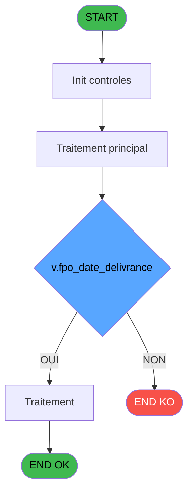

# PBP IDE 107 - Exportation Fiche Police Turqu

> **Analyse**: Phases 1-4 2026-02-03 09:25 -> 09:26 (21s) | Assemblage 09:26
> **Pipeline**: V7.2 Enrichi
> **Structure**: 4 onglets (Resume | Ecrans | Donnees | Connexions)

<!-- TAB:Resume -->

## 1. FICHE D'IDENTITE

| Attribut | Valeur |
|----------|--------|
| Projet | PBP |
| IDE Position | 107 |
| Nom Programme | Exportation Fiche Police Turqu |
| Fichier source | `Prg_107.xml` |
| Domaine metier | General |
| Taches | 1 (0 ecrans visibles) |
| Tables modifiees | 0 |
| Programmes appeles | 0 |

## 2. DESCRIPTION FONCTIONNELLE

**Exportation Fiche Police Turqu** assure la gestion complete de ce processus, accessible depuis [Liste Fiche Police (IDE 106)](PBP-IDE-106.md).

Le flux de traitement s'organise en **1 blocs fonctionnels** :

- **Traitement** (1 tache) : traitements metier divers

**Logique metier** : 3 regles identifiees couvrant conditions metier, valeurs par defaut.

## 3. BLOCS FONCTIONNELS

### 3.1 Traitement (1 tache)

Traitements internes.

---

#### 107 - Impression cde forfait ski

**Role** : Generation du document : Impression cde forfait ski.

## 5. REGLES METIER

3 regles identifiees:

### Autres (3 regles)

#### [RM-001] Si v.fpo_date_delivrance [Y] alors 'Soyadi' sinon MlsTrans('Nom'))

| Element | Detail |
|---------|--------|
| **Condition** | `v.fpo_date_delivrance [Y]` |
| **Si vrai** | 'Soyadi' |
| **Si faux** | MlsTrans('Nom')) |
| **Variables** | Y (v.fpo_date_delivrance) |
| **Expression source** | Expression 5 : `IF(v.fpo_date_delivrance [Y],'Soyadi',MlsTrans('Nom'))` |
| **Exemple** | Si v.fpo_date_delivrance [Y] → 'Soyadi'. Sinon → MlsTrans('Nom')) |

#### [RM-002] Si Trim(V.Ligne export csv [BR])='00000000' OR Trim(V.Ligne export csv [BR])='' alors [AH] sinon V.Ligne export csv [BR])

| Element | Detail |
|---------|--------|
| **Condition** | `Trim(V.Ligne export csv [BR])='00000000' OR Trim(V.Ligne export csv [BR])=''` |
| **Si vrai** | [AH] |
| **Si faux** | V.Ligne export csv [BR]) |
| **Variables** | BR (V.Ligne export csv) |
| **Expression source** | Expression 24 : `IF(Trim(V.Ligne export csv [BR])='00000000' OR Trim(V.Ligne ` |
| **Exemple** | Si Trim(V.Ligne export csv [BR])='00000000' OR Trim(V.Ligne export csv [BR])='' → [AH]. Sinon → V.Ligne export csv [BR]) |

#### [RM-003] Si Trim(v.Compteur [BS])='00000000' OR Trim(v.Compteur [BS])='' alors [AI] sinon v.Compteur [BS])

| Element | Detail |
|---------|--------|
| **Condition** | `Trim(v.Compteur [BS])='00000000' OR Trim(v.Compteur [BS])=''` |
| **Si vrai** | [AI] |
| **Si faux** | v.Compteur [BS]) |
| **Variables** | BS (v.Compteur) |
| **Expression source** | Expression 25 : `IF(Trim(v.Compteur [BS])='00000000' OR Trim(v.Compteur [BS])` |
| **Exemple** | Si Trim(v.Compteur [BS])='00000000' OR Trim(v.Compteur [BS])='' → [AI]. Sinon → v.Compteur [BS]) |

## 6. CONTEXTE

- **Appele par**: [Liste Fiche Police (IDE 106)](PBP-IDE-106.md)
- **Appelle**: 0 programmes | **Tables**: 0 (W:0 R:0 L:0) | **Taches**: 1 | **Expressions**: 25

<!-- TAB:Ecrans -->

## 8. ECRANS

*(Programme sans ecran visible)*

## 9. NAVIGATION

### 9.3 Structure hierarchique (1 tache)

| Position | Tache | Type | Dimensions | Bloc |
|----------|-------|------|------------|------|
| **107.1** | [**Impression cde forfait ski** (107)](#t1) | - | - | Traitement |

### 9.4 Algorigramme

> **Legende**: Vert = START/END OK | Rouge = END KO | Bleu = Decisions
> *Algorigramme auto-genere. Utiliser `/algorigramme` pour une synthese metier detaillee.*

<!-- TAB:Donnees -->

## 10. TABLES

### Tables utilisees (0)

| ID | Nom | Description | Type | R | W | L | Usages |
|----|-----|-------------|------|---|---|---|--------|

### Colonnes par table (0 / 0 tables avec colonnes identifiees)

## 11. VARIABLES

### 11.1 Parametres entrants (3)

Variables recues du programme appelant ([Liste Fiche Police (IDE 106)](PBP-IDE-106.md)).

| Lettre | Nom | Type | Usage dans |
|--------|-----|------|-----------|
| A | P.Date reference | Date | - |
| B | P.Uniquement fiche renseignée? | Logical | - |
| C | P.Libelle colonne en Turque? | Logical | - |

### 11.2 Variables de session (42)

Variables persistantes pendant toute la session.

| Lettre | Nom | Type | Usage dans |
|--------|-----|------|-----------|
| D | v.gmr_societe | Unicode | - |
| E | v.gmr_code_gm | Numeric | - |
| F | v.gmr_filiation_villag | Numeric | 1x session |
| G | v.gmr_nom__30_ | Unicode | 2x session |
| H | v.gmr_prenom__8_ | Unicode | - |
| I | v.gmr_sexe | Unicode | 1x session |
| J | v.Unicode Homme | Unicode | 1x session |
| K | v.Sexe en lettre | Unicode | 1x session |
| L | v.fpo_piece_id | Unicode | - |
| M | v.fpo_numero_piece | Unicode | - |
| N | v.fpo_turkid | Unicode | - |
| O | v.fpo_ville_naissance | Unicode | - |
| P | v.fpo_date_naissance | Unicode | - |
| Q | v.heb_nom_logement | Unicode | 1x session |
| R | v.fpo_code_nationalite | Unicode | - |
| S | v.gmr_debut_sejour | Unicode | - |
| T | v.gmr_fin_sejour | Unicode | - |
| U | v.fpo_date_debut_sejour | Unicode | - |
| V | v.fpo_date_fin_sejour | Unicode | - |
| W | v.DATE_DEB_SEJOUR | Unicode | - |
| X | v.DATE_FIN_SEJOUR | Unicode | - |
| Y | v.fpo_date_delivrance | Unicode | 16x session |
| Z | v.fpo_date_validite | Unicode | - |
| BA | v.fpo_pays_delivrance | Unicode | 1x session |
| BB | v.Existe Reponse? | Logical | 1x session |
| BC | v.Libelle_nom__30_ | Unicode | 1x session |
| BD | v.Libelle_prenom__8_ | Unicode | 1x session |
| BE | v.Libelle_sexe | Unicode | 1x session |
| BF | v.Libelle_numero_piece | Unicode | 1x session |
| BG | v.Libelle_turkid | Unicode | - |
| BH | v.Libelle_ville_naissance | Unicode | - |
| BI | v.Libelle_date_naissance | Unicode | 1x session |
| BJ | v.Libelle_nom_logement | Unicode | 1x session |
| BK | v.Libelle_code_nationalite | Unicode | - |
| BL | v.Libelle_date_debut_sejour | Unicode | - |
| BM | v.Libelle_date_fin_sejour | Unicode | - |
| BN | v.Libelle_date_delivrance | Unicode | - |
| BO | v.Libelle_date_validite | Unicode | - |
| BP | v.Libelle_pays_delivrance | Unicode | - |
| BQ | v.Clause Where | Unicode | 2x session |
| BR | V.Ligne export csv | Alpha | 1x session |
| BS | v.Compteur | Numeric | 1x session |

Toutes les 45 variables (liste complete)

| Cat | Lettre | Nom Variable | Type |
|-----|--------|--------------|------|
| P0 | **A** | P.Date reference | Date |
| P0 | **B** | P.Uniquement fiche renseignée? | Logical |
| P0 | **C** | P.Libelle colonne en Turque? | Logical |
| V. | **D** | v.gmr_societe | Unicode |
| V. | **E** | v.gmr_code_gm | Numeric |
| V. | **F** | v.gmr_filiation_villag | Numeric |
| V. | **G** | v.gmr_nom__30_ | Unicode |
| V. | **H** | v.gmr_prenom__8_ | Unicode |
| V. | **I** | v.gmr_sexe | Unicode |
| V. | **J** | v.Unicode Homme | Unicode |
| V. | **K** | v.Sexe en lettre | Unicode |
| V. | **L** | v.fpo_piece_id | Unicode |
| V. | **M** | v.fpo_numero_piece | Unicode |
| V. | **N** | v.fpo_turkid | Unicode |
| V. | **O** | v.fpo_ville_naissance | Unicode |
| V. | **P** | v.fpo_date_naissance | Unicode |
| V. | **Q** | v.heb_nom_logement | Unicode |
| V. | **R** | v.fpo_code_nationalite | Unicode |
| V. | **S** | v.gmr_debut_sejour | Unicode |
| V. | **T** | v.gmr_fin_sejour | Unicode |
| V. | **U** | v.fpo_date_debut_sejour | Unicode |
| V. | **V** | v.fpo_date_fin_sejour | Unicode |
| V. | **W** | v.DATE_DEB_SEJOUR | Unicode |
| V. | **X** | v.DATE_FIN_SEJOUR | Unicode |
| V. | **Y** | v.fpo_date_delivrance | Unicode |
| V. | **Z** | v.fpo_date_validite | Unicode |
| V. | **BA** | v.fpo_pays_delivrance | Unicode |
| V. | **BB** | v.Existe Reponse? | Logical |
| V. | **BC** | v.Libelle_nom__30_ | Unicode |
| V. | **BD** | v.Libelle_prenom__8_ | Unicode |
| V. | **BE** | v.Libelle_sexe | Unicode |
| V. | **BF** | v.Libelle_numero_piece | Unicode |
| V. | **BG** | v.Libelle_turkid | Unicode |
| V. | **BH** | v.Libelle_ville_naissance | Unicode |
| V. | **BI** | v.Libelle_date_naissance | Unicode |
| V. | **BJ** | v.Libelle_nom_logement | Unicode |
| V. | **BK** | v.Libelle_code_nationalite | Unicode |
| V. | **BL** | v.Libelle_date_debut_sejour | Unicode |
| V. | **BM** | v.Libelle_date_fin_sejour | Unicode |
| V. | **BN** | v.Libelle_date_delivrance | Unicode |
| V. | **BO** | v.Libelle_date_validite | Unicode |
| V. | **BP** | v.Libelle_pays_delivrance | Unicode |
| V. | **BQ** | v.Clause Where | Unicode |
| V. | **BR** | V.Ligne export csv | Alpha |
| V. | **BS** | v.Compteur | Numeric |

## 12. EXPRESSIONS

**25 / 25 expressions decodees (100%)**

### 12.1 Repartition par type

| Type | Expressions | Regles |
|------|-------------|--------|
| CALCULATION | 1 | 0 |
| CONDITION | 18 | 3 |
| CAST_LOGIQUE | 1 | 0 |
| CONSTANTE | 1 | 0 |
| FORMAT | 3 | 0 |
| CONCATENATION | 1 | 0 |

### 12.2 Expressions cles par type

#### CALCULATION (1 expressions)

| Type | IDE | Expression | Regle |
|------|-----|------------|-------|
| CALCULATION | 22 | `v.Clause Where [BQ]+1` | - |

#### CONDITION (18 expressions)

| Type | IDE | Expression | Regle |
|------|-----|------------|-------|
| CONDITION | 25 | `IF(Trim(v.Compteur [BS])='00000000' OR Trim(v.Compteur [BS])='',[AI],v.Compteur [BS])` | [RM-003](#rm-RM-003) |
| CONDITION | 24 | `IF(Trim(V.Ligne export csv [BR])='00000000' OR Trim(V.Ligne export csv [BR])='',[AH],V.Ligne export csv [BR])` | [RM-002](#rm-RM-002) |
| CONDITION | 5 | `IF(v.fpo_date_delivrance [Y],'Soyadi',MlsTrans('Nom'))` | [RM-001](#rm-RM-001) |
| CONDITION | 18 | `IF(v.fpo_date_delivrance [Y],'Geçerlilik tarihi',MlsTrans('Date validité'))` | - |
| CONDITION | 17 | `IF(v.fpo_date_delivrance [Y],'Düzenleme tarihi',MlsTrans('Date de délivrance'))` | - |
| ... | | *+13 autres* | |

#### CAST_LOGIQUE (1 expressions)

| Type | IDE | Expression | Regle |
|------|-----|------------|-------|
| CAST_LOGIQUE | 8 | `CASE('TRUE'LOG,v.fpo_date_delivrance [Y] AND [AC]=v.Libelle_nom_logement [BJ],'Erkek',
     v.fpo_date_delivrance [Y] AND [AC]<>v.Libelle_nom_logement [BJ],'Kadin',
     [AC]=v.Libelle_nom_logement [BJ],MlsTrans('Masculin'),
     MlsTrans('Féminin'))` | - |

#### CONSTANTE (1 expressions)

| Type | IDE | Expression | Regle |
|------|-----|------------|-------|
| CONSTANTE | 21 | `'H'` | - |

#### FORMAT (3 expressions)

| Type | IDE | Expression | Regle |
|------|-----|------------|-------|
| FORMAT | 4 | `Trim(v.Sexe en lettre [K])&VG36&
Trim(v.Unicode Homme [J])&VG36&
Trim(v.Libelle_date_naissance [BI])&VG36&
Trim(v.gmr_filiation_villag [F])&VG36&
Trim(v.gmr_sexe [I])&VG36&
Trim([AD])&VG36&
IF(Trim([AE])='00000000' OR Trim([AE])='','',DStr(DVal([AE],'YYYYMMDD'),'DD/MM/YYYY'))&VG36&
Trim([AF])&VG36&
Trim([AG])&VG36&
IF(Trim([BW])='00000000' OR Trim([BW])='','',DStr(DVal([BW],'YYYYMMDD'),'DD/MM/YYYY'))&VG36&
IF(Trim([BX])='00000000' OR Trim([BX])='','',DStr(DVal([BX],'YYYYMMDD'),'DD/MM/YYYY'))&VG36&
IF(Trim([AJ])='00000000' OR Trim([AJ])='','',DStr(DVal([AJ],'YYYYMMDD'),'DD/MM/YYYY'))&VG36&
IF(Trim([AK])='00000000' OR Trim([AK])='','',DStr(DVal([AK],'YYYYMMDD'),'DD/MM/YYYY'))&VG36&
Trim([AL])` | - |
| FORMAT | 2 | `Translate('%club_exportdata%')&'FIC_POL_TURK_'&Trim(DStr(v.gmr_nom__30_ [G],'DDMMYYYY'))&IF(v.fpo_date_delivrance [Y],'T','O')&'.csv'` | - |
| FORMAT | 1 | `DStr(v.gmr_nom__30_ [G],'YYYYMMDD')` | - |

#### CONCATENATION (1 expressions)

| Type | IDE | Expression | Regle |
|------|-----|------------|-------|
| CONCATENATION | 3 | `Trim([AV])&VG36&
Trim([AU])&VG36&
Trim([AW])&VG36&
Trim([AS])&VG36&
Trim([AT])&VG36&
Trim([AX])&VG36&
Trim([AY])&VG36&
Trim([AZ])&VG36&
Trim(v.fpo_pays_delivrance [BA])&VG36&
Trim(v.Existe Reponse? [BB])&VG36&
Trim(v.Libelle_nom__30_ [BC])&VG36&
Trim(v.Libelle_prenom__8_ [BD])&VG36&
Trim(v.Libelle_sexe [BE])&VG36&
Trim(v.Libelle_numero_piece [BF])` | - |

### 12.3 Toutes les expressions (25)

Voir les 25 expressions

#### CALCULATION (1)

| IDE | Expression Decodee |
|-----|-------------------|
| 22 | `v.Clause Where [BQ]+1` |

#### CONDITION (18)

| IDE | Expression Decodee |
|-----|-------------------|
| 5 | `IF(v.fpo_date_delivrance [Y],'Soyadi',MlsTrans('Nom'))` |
| 6 | `IF(v.fpo_date_delivrance [Y],'Adi',MlsTrans('Prénom'))` |
| 7 | `IF(v.fpo_date_delivrance [Y],'Cinsiyet',MlsTrans('Genre'))` |
| 9 | `IF(v.fpo_date_delivrance [Y],'TC KimlikNo',MlsTrans('Numéro de carte d''identité'))` |
| 10 | `IF(v.fpo_date_delivrance [Y],'GecerliBelge',MlsTrans('Numéro de passeport'))` |
| 11 | `IF(v.fpo_date_delivrance [Y],'Dogum Yeri',MlsTrans('Lieu de naissance'))` |
| 12 | `IF(v.fpo_date_delivrance [Y],'Dogum Tarihi',MlsTrans('Date de naissance'))` |
| 13 | `IF(v.fpo_date_delivrance [Y],'VerilenOda',MlsTrans('Chambre'))` |
| 14 | `IF(v.fpo_date_delivrance [Y],'Uyruğu',MlsTrans('Nationalité'))` |
| 15 | `IF(v.fpo_date_delivrance [Y],'Kalış başlangıç ​​tarihi',MlsTrans('Date début séjour'))` |
| 16 | `IF(v.fpo_date_delivrance [Y],'Kalışın bitiş tarihi',MlsTrans('Date fin séjour'))` |
| 17 | `IF(v.fpo_date_delivrance [Y],'Düzenleme tarihi',MlsTrans('Date de délivrance'))` |
| 18 | `IF(v.fpo_date_delivrance [Y],'Geçerlilik tarihi',MlsTrans('Date validité'))` |
| 19 | `IF(v.fpo_date_delivrance [Y],'Verildiği ülke',MlsTrans('Pays délivrance'))` |
| 20 | `IF(v.heb_nom_logement [Q],' and
     EXISTS (
        SELECT 1
        FROM reponses
        WHERE reponses.rep_code_societe = gmr_societe
          AND reponses.rep_compte = gmr_code_gm
          AND reponses.rep_filiation = gmr_filiation_villag
          AND reponses.rep_code_prestation = ''FORMPO''
    )','')` |
| 24 | `IF(Trim(V.Ligne export csv [BR])='00000000' OR Trim(V.Ligne export csv [BR])='',[AH],V.Ligne export csv [BR])` |
| 25 | `IF(Trim(v.Compteur [BS])='00000000' OR Trim(v.Compteur [BS])='',[AI],v.Compteur [BS])` |
| 23 | `v.Clause Where [BQ]=0` |

#### CAST_LOGIQUE (1)

| IDE | Expression Decodee |
|-----|-------------------|
| 8 | `CASE('TRUE'LOG,v.fpo_date_delivrance [Y] AND [AC]=v.Libelle_nom_logement [BJ],'Erkek',
     v.fpo_date_delivrance [Y] AND [AC]<>v.Libelle_nom_logement [BJ],'Kadin',
     [AC]=v.Libelle_nom_logement [BJ],MlsTrans('Masculin'),
     MlsTrans('Féminin'))` |

#### CONSTANTE (1)

| IDE | Expression Decodee |
|-----|-------------------|
| 21 | `'H'` |

#### FORMAT (3)

| IDE | Expression Decodee |
|-----|-------------------|
| 1 | `DStr(v.gmr_nom__30_ [G],'YYYYMMDD')` |
| 2 | `Translate('%club_exportdata%')&'FIC_POL_TURK_'&Trim(DStr(v.gmr_nom__30_ [G],'DDMMYYYY'))&IF(v.fpo_date_delivrance [Y],'T','O')&'.csv'` |
| 4 | `Trim(v.Sexe en lettre [K])&VG36&
Trim(v.Unicode Homme [J])&VG36&
Trim(v.Libelle_date_naissance [BI])&VG36&
Trim(v.gmr_filiation_villag [F])&VG36&
Trim(v.gmr_sexe [I])&VG36&
Trim([AD])&VG36&
IF(Trim([AE])='00000000' OR Trim([AE])='','',DStr(DVal([AE],'YYYYMMDD'),'DD/MM/YYYY'))&VG36&
Trim([AF])&VG36&
Trim([AG])&VG36&
IF(Trim([BW])='00000000' OR Trim([BW])='','',DStr(DVal([BW],'YYYYMMDD'),'DD/MM/YYYY'))&VG36&
IF(Trim([BX])='00000000' OR Trim([BX])='','',DStr(DVal([BX],'YYYYMMDD'),'DD/MM/YYYY'))&VG36&
IF(Trim([AJ])='00000000' OR Trim([AJ])='','',DStr(DVal([AJ],'YYYYMMDD'),'DD/MM/YYYY'))&VG36&
IF(Trim([AK])='00000000' OR Trim([AK])='','',DStr(DVal([AK],'YYYYMMDD'),'DD/MM/YYYY'))&VG36&
Trim([AL])` |

#### CONCATENATION (1)

| IDE | Expression Decodee |
|-----|-------------------|
| 3 | `Trim([AV])&VG36&
Trim([AU])&VG36&
Trim([AW])&VG36&
Trim([AS])&VG36&
Trim([AT])&VG36&
Trim([AX])&VG36&
Trim([AY])&VG36&
Trim([AZ])&VG36&
Trim(v.fpo_pays_delivrance [BA])&VG36&
Trim(v.Existe Reponse? [BB])&VG36&
Trim(v.Libelle_nom__30_ [BC])&VG36&
Trim(v.Libelle_prenom__8_ [BD])&VG36&
Trim(v.Libelle_sexe [BE])&VG36&
Trim(v.Libelle_numero_piece [BF])` |

<!-- TAB:Connexions -->

## 13. GRAPHE D'APPELS

### 13.1 Chaine depuis Main (Callers)

Main -> ... -> [Liste Fiche Police (IDE 106)](PBP-IDE-106.md) -> **Exportation Fiche Police Turqu (IDE 107)**

### 13.2 Callers

| IDE | Nom Programme | Nb Appels |
|-----|---------------|-----------|
| [106](PBP-IDE-106.md) | Liste Fiche Police | 1 |

### 13.3 Callees (programmes appeles)

### 13.4 Detail Callees avec contexte

| IDE | Nom Programme | Appels | Contexte |
|-----|---------------|--------|----------|
| - | (aucun) | - | - |

## 14. RECOMMANDATIONS MIGRATION

### 14.1 Profil du programme

| Metrique | Valeur | Impact migration |
|----------|--------|-----------------|
| Lignes de logique | 61 | Programme compact |
| Expressions | 25 | Peu de logique |
| Tables WRITE | 0 | Impact faible |
| Sous-programmes | 0 | Peu de dependances |
| Ecrans visibles | 0 | Ecran unique ou traitement batch |
| Code desactive | 0% (0 / 61) | Code sain |
| Regles metier | 3 | Quelques regles a preserver |

### 14.2 Plan de migration par bloc

#### Traitement (1 tache: 0 ecran, 1 traitement)

- **Strategie** : 1 service(s) backend injectable(s) (Domain Services).
- Decomposer les taches en services unitaires testables.

### 14.3 Dependances critiques

| Dependance | Type | Appels | Impact |
|------------|------|--------|--------|

---
*Spec DETAILED generee par Pipeline V7.2 - 2026-02-03 09:26*
