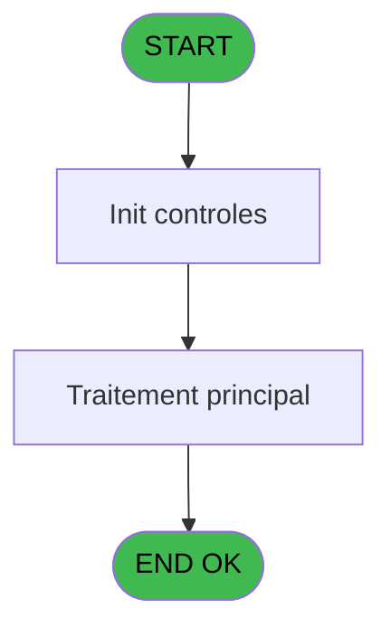
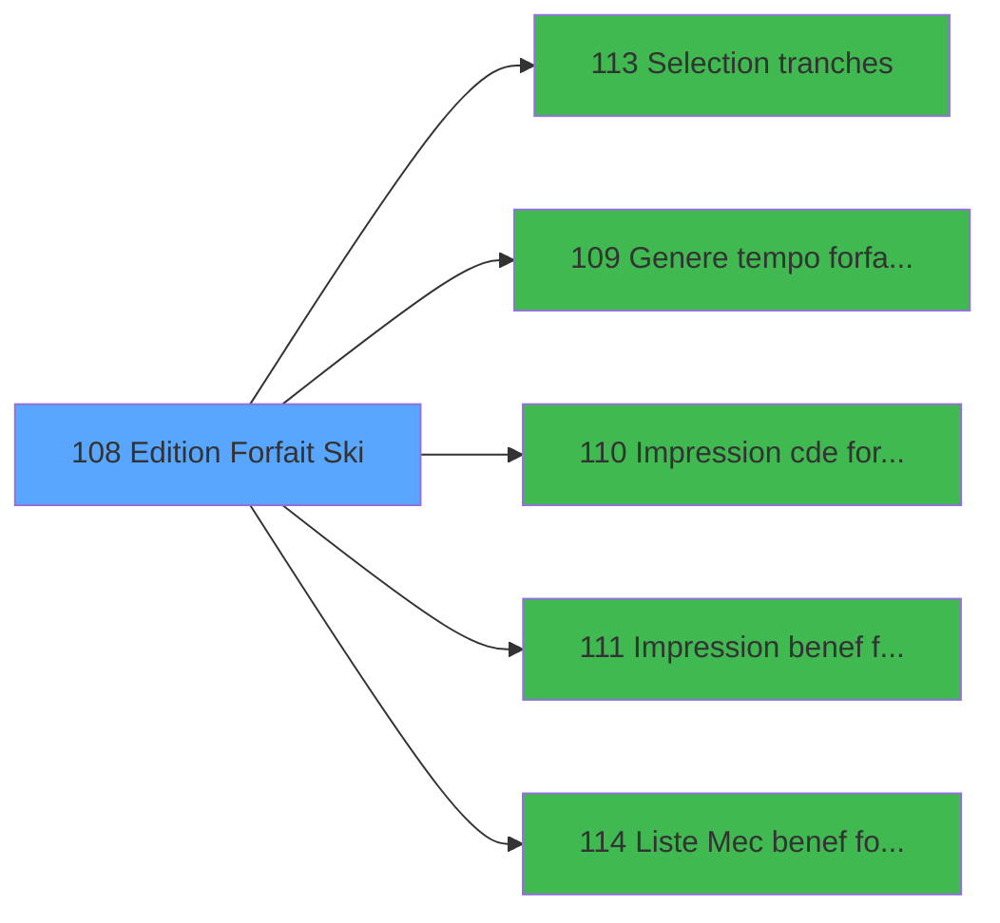

# PBP IDE 108 - Edition Forfait Ski

> **Analyse**: Phases 1-4 2026-02-03 09:26 -> 09:26 (20s) | Assemblage 09:26
> **Pipeline**: V7.2 Enrichi
> **Structure**: 4 onglets (Resume | Ecrans | Donnees | Connexions)

<!-- TAB:Resume -->

## 1. FICHE D'IDENTITE

| Attribut | Valeur |
|----------|--------|
| Projet | PBP |
| IDE Position | 108 |
| Nom Programme | Edition Forfait Ski |
| Fichier source | `Prg_108.xml` |
| Domaine metier | Impression |
| Taches | 2 (1 ecrans visibles) |
| Tables modifiees | 0 |
| Programmes appeles | 5 |
| :warning: Statut | **ORPHELIN_POTENTIEL** |

## 2. DESCRIPTION FONCTIONNELLE

**Edition Forfait Ski** assure la gestion complete de ce processus.

Le flux de traitement s'organise en **2 blocs fonctionnels** :

- **Traitement** (1 tache) : traitements metier divers
- **Impression** (1 tache) : generation de tickets et documents

Detail : phases du traitement

#### Phase 1 : Impression (1 tache)

- **108** - Edition Forfait Ski **[[ECRAN]](#ecran-t1)**

Delegue a : [Liste Mec benef forfait ski (IDE 114)](PBP-IDE-114.md)

#### Phase 2 : Traitement (1 tache)

- **108.1** - Maj tempo

Delegue a : [Genere tempo forfait ski (IDE 109)](PBP-IDE-109.md), [Impression cde forfait ski (IDE 110)](PBP-IDE-110.md), [Impression benef forfait ski (IDE 111)](PBP-IDE-111.md), [Liste Mec benef forfait ski (IDE 114)](PBP-IDE-114.md)

## 3. BLOCS FONCTIONNELS

### 3.1 Impression (1 tache)

Generation des documents et tickets.

---

#### 108 - Edition Forfait Ski [[ECRAN]](#ecran-t1)

**Role** : Generation du document : Edition Forfait Ski.
**Ecran** : 1000 x 217 DLU (MDI) | [Voir mockup](#ecran-t1)
**Variables liees** : M (V.Existe qualite forfait ski ?), L (b_Edition)

### 3.2 Traitement (1 tache)

Traitements internes.

---

#### 108.1 - Maj tempo

**Role** : Traitement : Maj tempo.
**Delegue a** : [Genere tempo forfait ski (IDE 109)](PBP-IDE-109.md), [Impression cde forfait ski (IDE 110)](PBP-IDE-110.md), [Impression benef forfait ski (IDE 111)](PBP-IDE-111.md)

## 5. REGLES METIER

*(Aucune regle metier identifiee)*

## 6. CONTEXTE

- **Appele par**: (aucun)
- **Appelle**: 5 programmes | **Tables**: 3 (W:0 R:1 L:2) | **Taches**: 2 | **Expressions**: 28

<!-- TAB:Ecrans -->

## 8. ECRANS

### 8.1 Forms visibles (1 / 2)

| # | Position | Tache | Nom | Type | Largeur | Hauteur | Bloc |
|---|----------|-------|-----|------|---------|---------|------|
| 1 | 108 | 108 | Edition Forfait Ski | MDI | 1000 | 217 | Impression |

### 8.2 Mockups Ecrans

---

#### 108 - Edition Forfait Ski
**Tache** : [108](#t1) | **Type** : MDI | **Dimensions** : 1000 x 217 DLU
**Bloc** : Impression | **Titre IDE** : Edition Forfait Ski

<!-- FORM-DATA:
{
    "width":  1000,
    "vFactor":  8,
    "type":  "MDI",
    "hFactor":  8,
    "controls":  [
                     {
                         "x":  1,
                         "type":  "label",
                         "var":  "",
                         "y":  0,
                         "w":  993,
                         "fmt":  "",
                         "name":  "",
                         "h":  20,
                         "color":  "1",
                         "text":  "",
                         "parent":  null
                     },
                     {
                         "x":  0,
                         "type":  "label",
                         "var":  "",
                         "y":  190,
                         "w":  993,
                         "fmt":  "",
                         "name":  "",
                         "h":  24,
                         "color":  "1",
                         "text":  "",
                         "parent":  null
                     },
                     {
                         "x":  389,
                         "type":  "label",
                         "var":  "",
                         "y":  25,
                         "w":  409,
                         "fmt":  "",
                         "name":  "",
                         "h":  162,
                         "color":  "195",
                         "text":  "Paramètres",
                         "parent":  null
                     },
                     {
                         "x":  397,
                         "type":  "label",
                         "var":  "",
                         "y":  109,
                         "w":  55,
                         "fmt":  "",
                         "name":  "",
                         "h":  9,
                         "color":  "",
                         "text":  "Date",
                         "parent":  6
                     },
                     {
                         "x":  397,
                         "type":  "label",
                         "var":  "",
                         "y":  129,
                         "w":  122,
                         "fmt":  "",
                         "name":  "",
                         "h":  10,
                         "color":  "",
                         "text":  "Tranches d\u0027âge",
                         "parent":  6
                     },
                     {
                         "x":  397,
                         "type":  "label",
                         "var":  "",
                         "y":  146,
                         "w":  242,
                         "fmt":  "",
                         "name":  "",
                         "h":  12,
                         "color":  "",
                         "text":  "Avec commandes précédentes",
                         "parent":  6
                     },
                     {
                         "x":  397,
                         "type":  "label",
                         "var":  "",
                         "y":  165,
                         "w":  242,
                         "fmt":  "",
                         "name":  "",
                         "h":  12,
                         "color":  "",
                         "text":  "Commentaires",
                         "parent":  6
                     },
                     {
                         "x":  476,
                         "type":  "label",
                         "var":  "",
                         "y":  38,
                         "w":  224,
                         "fmt":  "",
                         "name":  "",
                         "h":  45,
                         "color":  "",
                         "text":  "",
                         "parent":  6
                     },
                     {
                         "x":  512,
                         "type":  "label",
                         "var":  "",
                         "y":  45,
                         "w":  46,
                         "fmt":  "",
                         "name":  "",
                         "h":  9,
                         "color":  "",
                         "text":  "Total",
                         "parent":  13
                     },
                     {
                         "x":  512,
                         "type":  "label",
                         "var":  "",
                         "y":  66,
                         "w":  78,
                         "fmt":  "",
                         "name":  "",
                         "h":  9,
                         "color":  "",
                         "text":  "Sélection",
                         "parent":  13
                     },
                     {
                         "x":  800,
                         "type":  "label",
                         "var":  "",
                         "y":  25,
                         "w":  186,
                         "fmt":  "",
                         "name":  "",
                         "h":  162,
                         "color":  "",
                         "text":  "",
                         "parent":  null
                     },
                     {
                         "x":  14,
                         "type":  "table",
                         "var":  "",
                         "name":  "",
                         "titleH":  12,
                         "color":  "110",
                         "w":  371,
                         "y":  27,
                         "fmt":  "",
                         "parent":  null,
                         "text":  "",
                         "rowH":  11,
                         "h":  159,
                         "cols":  [
                                      {
                                          "title":  "",
                                          "layer":  1,
                                          "w":  336
                                      }
                                  ],
                         "rows":  1
                     },
                     {
                         "x":  532,
                         "type":  "edit",
                         "var":  "",
                         "y":  109,
                         "w":  126,
                         "fmt":  "",
                         "name":  "w0_Date",
                         "h":  10,
                         "color":  "110",
                         "text":  "",
                         "parent":  6
                     },
                     {
                         "x":  660,
                         "type":  "button",
                         "var":  "",
                         "y":  109,
                         "w":  25,
                         "fmt":  "...",
                         "name":  "b_Date",
                         "h":  10,
                         "color":  "",
                         "text":  "",
                         "parent":  6
                     },
                     {
                         "x":  532,
                         "type":  "edit",
                         "var":  "",
                         "y":  129,
                         "w":  126,
                         "fmt":  "",
                         "name":  "w0_ tranche",
                         "h":  10,
                         "color":  "110",
                         "text":  "",
                         "parent":  6
                     },
                     {
                         "x":  660,
                         "type":  "button",
                         "var":  "",
                         "y":  129,
                         "w":  25,
                         "fmt":  "...",
                         "name":  "b_Tranche",
                         "h":  10,
                         "color":  "",
                         "text":  "",
                         "parent":  6
                     },
                     {
                         "x":  639,
                         "type":  "combobox",
                         "var":  "",
                         "y":  146,
                         "w":  144,
                         "fmt":  "",
                         "name":  "w0_Avec_cde précédentes",
                         "h":  12,
                         "color":  "110",
                         "text":  "O,N",
                         "parent":  6
                     },
                     {
                         "x":  639,
                         "type":  "combobox",
                         "var":  "",
                         "y":  165,
                         "w":  144,
                         "fmt":  "",
                         "name":  "W0_Type commentaire_0001",
                         "h":  12,
                         "color":  "110",
                         "text":  "",
                         "parent":  6
                     },
                     {
                         "x":  816,
                         "type":  "button",
                         "var":  "",
                         "y":  157,
                         "w":  154,
                         "fmt":  "\u0026Impression",
                         "name":  "b_Edition",
                         "h":  18,
                         "color":  "",
                         "text":  "",
                         "parent":  22
                     },
                     {
                         "x":  56,
                         "type":  "edit",
                         "var":  "",
                         "y":  29,
                         "w":  277,
                         "fmt":  "",
                         "name":  "qua_libelle",
                         "h":  8,
                         "color":  "110",
                         "text":  "",
                         "parent":  25
                     },
                     {
                         "x":  20,
                         "type":  "checkbox",
                         "var":  "",
                         "y":  29,
                         "w":  30,
                         "fmt":  "",
                         "name":  "TUL MARQUEUR",
                         "h":  9,
                         "color":  "110",
                         "text":  "",
                         "parent":  25
                     },
                     {
                         "x":  604,
                         "type":  "edit",
                         "var":  "",
                         "y":  45,
                         "w":  56,
                         "fmt":  "",
                         "name":  "",
                         "h":  9,
                         "color":  "",
                         "text":  "",
                         "parent":  13
                     },
                     {
                         "x":  604,
                         "type":  "edit",
                         "var":  "",
                         "y":  66,
                         "w":  56,
                         "fmt":  "",
                         "name":  "",
                         "h":  9,
                         "color":  "",
                         "text":  "",
                         "parent":  13
                     },
                     {
                         "x":  6,
                         "type":  "edit",
                         "var":  "",
                         "y":  2,
                         "w":  267,
                         "fmt":  "20",
                         "name":  "",
                         "h":  8,
                         "color":  "",
                         "text":  "",
                         "parent":  1
                     },
                     {
                         "x":  717,
                         "type":  "edit",
                         "var":  "",
                         "y":  6,
                         "w":  267,
                         "fmt":  "WWW DD MMM YYYYT",
                         "name":  "",
                         "h":  8,
                         "color":  "",
                         "text":  "",
                         "parent":  1
                     },
                     {
                         "x":  6,
                         "type":  "edit",
                         "var":  "",
                         "y":  11,
                         "w":  331,
                         "fmt":  "25",
                         "name":  "",
                         "h":  8,
                         "color":  "",
                         "text":  "",
                         "parent":  1
                     },
                     {
                         "x":  810,
                         "type":  "image",
                         "var":  "",
                         "y":  42,
                         "w":  162,
                         "fmt":  "",
                         "name":  "",
                         "h":  53,
                         "color":  "",
                         "text":  "",
                         "parent":  22
                     },
                     {
                         "x":  8,
                         "type":  "button",
                         "var":  "",
                         "y":  193,
                         "w":  154,
                         "fmt":  "\u0026Quitter",
                         "name":  "",
                         "h":  18,
                         "color":  "",
                         "text":  "",
                         "parent":  5
                     }
                 ],
    "taskId":  "108",
    "height":  217
}
-->

<strong>Champs : 11 champs</strong>

| Pos (x,y) | Nom | Variable | Type |
|-----------|-----|----------|------|
| 532,109 | w0_Date | - | edit |
| 532,129 | w0_ tranche | - | edit |
| 639,146 | w0_Avec_cde précédentes | - | combobox |
| 639,165 | W0_Type commentaire_0001 | - | combobox |
| 56,29 | qua_libelle | - | edit |
| 20,29 | TUL MARQUEUR | - | checkbox |
| 604,45 | (sans nom) | - | edit |
| 604,66 | (sans nom) | - | edit |
| 6,2 | 20 | - | edit |
| 717,6 | WWW DD MMM YYYYT | - | edit |
| 6,11 | 25 | - | edit |

<strong>Boutons : 4 boutons</strong>

| Bouton | Pos (x,y) | Action |
|--------|-----------|--------|
| ... | 660,109 | Bouton fonctionnel |
| ... | 660,129 | Bouton fonctionnel |
| Impression | 816,157 | Appel [Impression cde forfait ski (IDE 110)](PBP-IDE-110.md) |
| Quitter | 8,193 | Quitte le programme |

## 9. NAVIGATION

Ecran unique: **Edition Forfait Ski**

### 9.3 Structure hierarchique (2 taches)

| Position | Tache | Type | Dimensions | Bloc |
|----------|-------|------|------------|------|
| **108.1** | [**Edition Forfait Ski** (108)](#t1) [mockup](#ecran-t1) | MDI | 1000x217 | Impression |
| **108.2** | [**Maj tempo** (108.1)](#t2) | - | - | Traitement |

### 9.4 Algorigramme

> **Legende**: Vert = START/END OK | Rouge = END KO | Bleu = Decisions
> *Algorigramme auto-genere. Utiliser `/algorigramme` pour une synthese metier detaillee.*

<!-- TAB:Donnees -->

## 10. TABLES

### Tables utilisees (3)

| ID | Nom | Description | Type | R | W | L | Usages |
|----|-----|-------------|------|---|---|---|--------|
| 120 | tables_qualites__qua |  | DB | R |   |   | 2 |
| 637 | tempo_zone_secteur | Table temporaire ecran | DB |   |   | L | 2 |
| 797 | log_effectif_envoi |  | DB |   |   | L | 1 |

### Colonnes par table (1 / 1 tables avec colonnes identifiees)

Table 120 - tables_qualites__qua (R) - 2 usages

| Lettre | Variable | Acces | Type |
|--------|----------|-------|------|
| A | w0_Date | R | Date |
| B | b_Date | R | Alpha |
| C | w0_ tranche | R | Alpha |
| D | b_Tranche | R | Alpha |
| E | w0_Avec_cde précédentes | R | Alpha |
| F | W0_Type commentaire | R | Alpha |
| G | w0_tranche mini | R | Numeric |
| H | w0_tranche maxi | R | Numeric |
| I | V.Existe tranche ? | R | Logical |
| J | w0_Total | R | Numeric |
| K | w0_Selection | R | Numeric |
| L | b_Edition | R | Alpha |
| M | V.Existe qualite forfait ski ? | R | Logical |
| N | V.Libelle tranche csv | R | Alpha |
| O | V.Nb tranche | R | Numeric |

## 11. VARIABLES

### 11.1 Variables de session (4)

Variables persistantes pendant toute la session.

| Lettre | Nom | Type | Usage dans |
|--------|-----|------|-----------|
| I | V.Existe tranche ? | Logical | - |
| M | V.Existe qualite forfait ski ? | Logical | - |
| N | V.Libelle tranche csv | Alpha | - |
| O | V.Nb tranche | Numeric | - |

### 11.2 Autres (11)

Variables diverses.

| Lettre | Nom | Type | Usage dans |
|--------|-----|------|-----------|
| A | w0_Date | Date | 1x refs |
| B | b_Date | Alpha | - |
| C | w0_ tranche | Alpha | - |
| D | b_Tranche | Alpha | - |
| E | w0_Avec_cde précédentes | Alpha | - |
| F | W0_Type commentaire | Alpha | - |
| G | w0_tranche mini | Numeric | 4x refs |
| H | w0_tranche maxi | Numeric | 3x refs |
| J | w0_Total | Numeric | - |
| K | w0_Selection | Numeric | - |
| L | b_Edition | Alpha | 1x refs |

## 12. EXPRESSIONS

**28 / 28 expressions decodees (100%)**

### 12.1 Repartition par type

| Type | Expressions | Regles |
|------|-------------|--------|
| CONSTANTE | 7 | 0 |
| DATE | 1 | 0 |
| FORMAT | 3 | 0 |
| REFERENCE_VG | 2 | 0 |
| OTHER | 8 | 0 |
| CONDITION | 4 | 0 |
| CAST_LOGIQUE | 1 | 0 |
| NEGATION | 2 | 0 |

### 12.2 Expressions cles par type

#### CONSTANTE (7 expressions)

| Type | IDE | Expression | Regle |
|------|-----|------------|-------|
| CONSTANTE | 14 | `'TFSKI'` | - |
| CONSTANTE | 26 | `'N'` | - |
| CONSTANTE | 27 | `'O'` | - |
| CONSTANTE | 13 | `''` | - |
| CONSTANTE | 1 | `'...'` | - |
| ... | | *+2 autres* | |

#### DATE (1 expressions)

| Type | IDE | Expression | Regle |
|------|-----|------------|-------|
| DATE | 4 | `Date ()` | - |

#### FORMAT (3 expressions)

| Type | IDE | Expression | Regle |
|------|-----|------------|-------|
| FORMAT | 23 | `Trim(Str(w0_tranche mini [G],'3Z'))&MlsTrans(' ans et plus')` | - |
| FORMAT | 21 | `Trim(Str(w0_tranche mini [G],'3Z'))&MlsTrans(' ans à ')&Trim(Str(w0_tranche maxi [H],'3Z'))&MlsTrans(' ans')` | - |
| FORMAT | 28 | `Translate('%club_exportdata%')&'CDE_FORF_SKI_'&Trim(
DStr(w0_Date [A],'DDMMYYYY'))&'.csv'` | - |

#### REFERENCE_VG (2 expressions)

| Type | IDE | Expression | Regle |
|------|-----|------------|-------|
| REFERENCE_VG | 12 | `VG1` | - |
| REFERENCE_VG | 3 | `VG2` | - |

#### OTHER (8 expressions)

| Type | IDE | Expression | Regle |
|------|-----|------------|-------|
| OTHER | 17 | `V.Existe qualite forfa... [M]` | - |
| OTHER | 16 | `b_Edition [L]` | - |
| OTHER | 24 | `MlsTrans('Vous devez créer les tranches d''ages !')` | - |
| OTHER | 19 | `MlsTrans('Toutes')` | - |
| OTHER | 6 | `SetCrsr (1)` | - |
| ... | | *+3 autres* | |

#### CONDITION (4 expressions)

| Type | IDE | Expression | Regle |
|------|-----|------------|-------|
| CONDITION | 20 | `w0_tranche mini [G]=0 AND w0_tranche maxi [H]=0` | - |
| CONDITION | 22 | `w0_tranche mini [G]<>0 AND w0_tranche maxi [H]=0` | - |
| CONDITION | 9 | `[Z]=0` | - |
| CONDITION | 18 | `[Z]<>0` | - |

#### CAST_LOGIQUE (1 expressions)

| Type | IDE | Expression | Regle |
|------|-----|------------|-------|
| CAST_LOGIQUE | 10 | `'TRUE'LOG` | - |

#### NEGATION (2 expressions)

| Type | IDE | Expression | Regle |
|------|-----|------------|-------|
| NEGATION | 25 | `NOT [V]` | - |
| NEGATION | 11 | `NOT [AB]` | - |

### 12.3 Toutes les expressions (28)

Voir les 28 expressions

#### CONSTANTE (7)

| IDE | Expression Decodee |
|-----|-------------------|
| 1 | `'...'` |
| 2 | `'Edition des forfaits de ski'` |
| 7 | `0` |
| 13 | `''` |
| 14 | `'TFSKI'` |
| 26 | `'N'` |
| 27 | `'O'` |

#### DATE (1)

| IDE | Expression Decodee |
|-----|-------------------|
| 4 | `Date ()` |

#### FORMAT (3)

| IDE | Expression Decodee |
|-----|-------------------|
| 28 | `Translate('%club_exportdata%')&'CDE_FORF_SKI_'&Trim(
DStr(w0_Date [A],'DDMMYYYY'))&'.csv'` |
| 21 | `Trim(Str(w0_tranche mini [G],'3Z'))&MlsTrans(' ans à ')&Trim(Str(w0_tranche maxi [H],'3Z'))&MlsTrans(' ans')` |
| 23 | `Trim(Str(w0_tranche mini [G],'3Z'))&MlsTrans(' ans et plus')` |

#### REFERENCE_VG (2)

| IDE | Expression Decodee |
|-----|-------------------|
| 3 | `VG2` |
| 12 | `VG1` |

#### OTHER (8)

| IDE | Expression Decodee |
|-----|-------------------|
| 5 | `SetCrsr (2)` |
| 6 | `SetCrsr (1)` |
| 8 | `GetParam ('VILLAGE')` |
| 15 | `GetParam('SOCIETE')` |
| 16 | `b_Edition [L]` |
| 17 | `V.Existe qualite forfa... [M]` |
| 19 | `MlsTrans('Toutes')` |
| 24 | `MlsTrans('Vous devez créer les tranches d''ages !')` |

#### CONDITION (4)

| IDE | Expression Decodee |
|-----|-------------------|
| 9 | `[Z]=0` |
| 18 | `[Z]<>0` |
| 20 | `w0_tranche mini [G]=0 AND w0_tranche maxi [H]=0` |
| 22 | `w0_tranche mini [G]<>0 AND w0_tranche maxi [H]=0` |

#### CAST_LOGIQUE (1)

| IDE | Expression Decodee |
|-----|-------------------|
| 10 | `'TRUE'LOG` |

#### NEGATION (2)

| IDE | Expression Decodee |
|-----|-------------------|
| 11 | `NOT [AB]` |
| 25 | `NOT [V]` |

<!-- TAB:Connexions -->

## 13. GRAPHE D'APPELS

### 13.1 Chaine depuis Main (Callers)

**Chemin**: (pas de callers directs)

### 13.2 Callers

| IDE | Nom Programme | Nb Appels |
|-----|---------------|-----------|
| - | (aucun) | - |

### 13.3 Callees (programmes appeles)

### 13.4 Detail Callees avec contexte

| IDE | Nom Programme | Appels | Contexte |
|-----|---------------|--------|----------|
| [113](PBP-IDE-113.md) | Selection tranches | 2 | Selection/consultation |
| [109](PBP-IDE-109.md) | Genere tempo forfait ski | 1 | Sous-programme |
| [110](PBP-IDE-110.md) | Impression cde forfait ski | 1 | Sous-programme |
| [111](PBP-IDE-111.md) | Impression benef forfait ski | 1 | Sous-programme |
| [114](PBP-IDE-114.md) | Liste Mec benef forfait ski | 1 | Configuration impression |

## 14. RECOMMANDATIONS MIGRATION

### 14.1 Profil du programme

| Metrique | Valeur | Impact migration |
|----------|--------|-----------------|
| Lignes de logique | 108 | Programme compact |
| Expressions | 28 | Peu de logique |
| Tables WRITE | 0 | Impact faible |
| Sous-programmes | 5 | Peu de dependances |
| Ecrans visibles | 1 | Ecran unique ou traitement batch |
| Code desactive | 0% (0 / 108) | Code sain |
| Regles metier | 0 | Pas de regle identifiee |

### 14.2 Plan de migration par bloc

#### Impression (1 tache: 1 ecran, 0 traitement)

- **Strategie** : Templates HTML -> PDF via wkhtmltopdf ou Puppeteer.
- `PrintService` injectable avec choix imprimante

#### Traitement (1 tache: 0 ecran, 1 traitement)

- **Strategie** : 1 service(s) backend injectable(s) (Domain Services).
- 5 sous-programme(s) a migrer ou a reutiliser depuis les services existants.
- Decomposer les taches en services unitaires testables.

### 14.3 Dependances critiques

| Dependance | Type | Appels | Impact |
|------------|------|--------|--------|
| [Selection tranches (IDE 113)](PBP-IDE-113.md) | Sous-programme | 2x | Haute - Selection/consultation |
| [Impression benef forfait ski (IDE 111)](PBP-IDE-111.md) | Sous-programme | 1x | Normale - Sous-programme |
| [Liste Mec benef forfait ski (IDE 114)](PBP-IDE-114.md) | Sous-programme | 1x | Normale - Configuration impression |
| [Genere tempo forfait ski (IDE 109)](PBP-IDE-109.md) | Sous-programme | 1x | Normale - Sous-programme |
| [Impression cde forfait ski (IDE 110)](PBP-IDE-110.md) | Sous-programme | 1x | Normale - Sous-programme |

---
*Spec DETAILED generee par Pipeline V7.2 - 2026-02-03 09:26*
