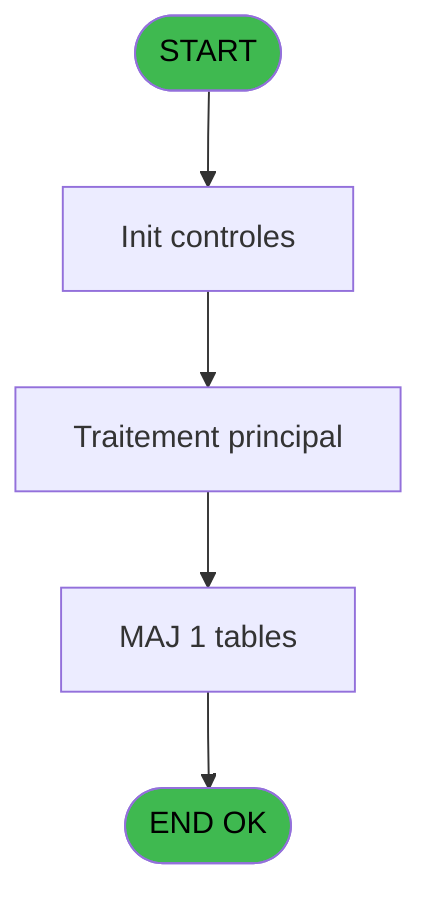

# PBP IDE 109 - Genere tempo forfait ski

> **Analyse**: Phases 1-4 2026-02-03 09:26 -> 09:26 (20s) | Assemblage 09:27
> **Pipeline**: V7.2 Enrichi
> **Structure**: 4 onglets (Resume | Ecrans | Donnees | Connexions)

<!-- TAB:Resume -->

## 1. FICHE D'IDENTITE

| Attribut | Valeur |
|----------|--------|
| Projet | PBP |
| IDE Position | 109 |
| Nom Programme | Genere tempo forfait ski |
| Fichier source | `Prg_109.xml` |
| Domaine metier | General |
| Taches | 6 (0 ecrans visibles) |
| Tables modifiees | 1 |
| Programmes appeles | 0 |

## 2. DESCRIPTION FONCTIONNELLE

**Genere tempo forfait ski** assure la gestion complete de ce processus, accessible depuis [Edition Forfait Ski (IDE 108)](PBP-IDE-108.md).

Le flux de traitement s'organise en **2 blocs fonctionnels** :

- **Traitement** (4 taches) : traitements metier divers
- **Calcul** (2 taches) : calculs de montants, stocks ou compteurs

**Donnees modifiees** : 1 tables en ecriture (log_effectif_envoi).

Detail : phases du traitement

#### Phase 1 : Traitement (4 taches)

- **109.1** - Rempli tempo SQL **[[ECRAN]](#ecran-t1)**
- **109** - (sans nom)
- **109.4** - Rempli tempo SQL **[[ECRAN]](#ecran-t10)**
- **109.5** - Rempli tempo SQL **[[ECRAN]](#ecran-t13)**

#### Phase 2 : Calcul (2 taches)

- **109.2** - Calcul clause qualite
- **109.3** - Calcul clause qualite

#### Tables impactees

| Table | Operations | Role metier |
|-------|-----------|-------------|
| log_effectif_envoi | **W** (1 usages) |  |

## 3. BLOCS FONCTIONNELS

### 3.1 Traitement (4 taches)

Traitements internes.

---

#### 109.1 - Rempli tempo SQL [[ECRAN]](#ecran-t1)

**Role** : Traitement : Rempli tempo SQL.
**Ecran** : 746 x 195 DLU | [Voir mockup](#ecran-t1)

3 sous-taches directes

| Tache | Nom | Bloc |
|-------|-----|------|
| [109](#t2) | (sans nom) | Traitement |
| [109.4](#t10) | Rempli tempo SQL **[[ECRAN]](#ecran-t10)** | Traitement |
| [109.5](#t13) | Rempli tempo SQL **[[ECRAN]](#ecran-t13)** | Traitement |

---

#### 109 - (sans nom)

**Role** : Traitement interne.

---

#### 109.4 - Rempli tempo SQL [[ECRAN]](#ecran-t10)

**Role** : Traitement : Rempli tempo SQL.
**Ecran** : 746 x 195 DLU | [Voir mockup](#ecran-t10)

---

#### 109.5 - Rempli tempo SQL [[ECRAN]](#ecran-t13)

**Role** : Traitement : Rempli tempo SQL.
**Ecran** : 746 x 195 DLU | [Voir mockup](#ecran-t13)

### 3.2 Calcul (2 taches)

Calculs metier : montants, stocks, compteurs.

---

#### 109.2 - Calcul clause qualite

**Role** : Calcul : Calcul clause qualite.

---

#### 109.3 - Calcul clause qualite

**Role** : Calcul : Calcul clause qualite.

## 5. REGLES METIER

*(Aucune regle metier identifiee)*

## 6. CONTEXTE

- **Appele par**: [Edition Forfait Ski (IDE 108)](PBP-IDE-108.md)
- **Appelle**: 0 programmes | **Tables**: 5 (W:1 R:2 L:2) | **Taches**: 6 | **Expressions**: 12

<!-- TAB:Ecrans -->

## 8. ECRANS

*(Programme sans ecran visible)*

## 9. NAVIGATION

### 9.3 Structure hierarchique (6 taches)

| Position | Tache | Type | Dimensions | Bloc |
|----------|-------|------|------------|------|
| **109.1** | [**Rempli tempo SQL** (109.1)](#t1) [mockup](#ecran-t1) | - | 746x195 | Traitement |
| 109.1.1 | [(sans nom) (109)](#t2) | - | - | |
| 109.1.2 | [Rempli tempo SQL (109.4)](#t10) [mockup](#ecran-t10) | - | 746x195 | |
| 109.1.3 | [Rempli tempo SQL (109.5)](#t13) [mockup](#ecran-t13) | - | 746x195 | |
| **109.2** | [**Calcul clause qualite** (109.2)](#t3) | - | - | Calcul |
| 109.2.1 | [Calcul clause qualite (109.3)](#t6) | - | - | |

### 9.4 Algorigramme

> **Legende**: Vert = START/END OK | Rouge = END KO | Bleu = Decisions
> *Algorigramme auto-genere. Utiliser `/algorigramme` pour une synthese metier detaillee.*

<!-- TAB:Donnees -->

## 10. TABLES

### Tables utilisees (5)

| ID | Nom | Description | Type | R | W | L | Usages |
|----|-----|-------------|------|---|---|---|--------|
| 30 | gm-recherche_____gmr | Index de recherche | DB | R |   |   | 2 |
| 31 | gm-complet_______gmc |  | DB |   |   | L | 2 |
| 637 | tempo_zone_secteur | Table temporaire ecran | DB | R |   |   | 1 |
| 797 | log_effectif_envoi |  | DB |   | **W** |   | 1 |
| 798 | type_article | Articles et stock | DB |   |   | L | 2 |

### Colonnes par table (2 / 3 tables avec colonnes identifiees)

Table 30 - gm-recherche_____gmr (R) - 2 usages

| Lettre | Variable | Acces | Type |
|--------|----------|-------|------|
| A | gmc_nom_complet | R | Unicode |
| B | gmc_prenom_complet | R | Unicode |
| C | heb_num_compte | R | Numeric |
| D | heb_filiation | R | Numeric |
| E | heb_date_debut | R | Alpha |
| F | heb_date_fin | R | Alpha |
| G | heb_age_num | R | Numeric |
| H | heb_complement_type | R | Unicode |
| I | V.Calc tranche min | R | Numeric |
| J | V.Calc tranche max | R | Numeric |
| K | V.Séjour de 2 ou 3 Nuits ? | R | Logical |
| L | V.Nb Nuité Séjour | R | Numeric |
| M | V.Date debut forfait benef | R | Date |
| N | V.Date fin forfait benef | R | Date |
| O | V.Arrivée un dimanche? | R | Logical |

Table 637 - tempo_zone_secteur (R) - 1 usages

*Table utilisee uniquement en Link ou aucune colonne Real identifiee dans le DataView.*

Table 797 - log_effectif_envoi (**W**) - 1 usages

*Table utilisee uniquement en Link ou aucune colonne Real identifiee dans le DataView.*

## 11. VARIABLES

### 11.1 Variables de session (7)

Variables persistantes pendant toute la session.

| Lettre | Nom | Type | Usage dans |
|--------|-----|------|-----------|
| I | V.Calc tranche min | Numeric | - |
| J | V.Calc tranche max | Numeric | - |
| K | V.Séjour de 2 ou 3 Nuits ? | Logical | - |
| L | V.Nb Nuité Séjour | Numeric | - |
| M | V.Date debut forfait benef | Date | - |
| N | V.Date fin forfait benef | Date | 2x session |
| O | V.Arrivée un dimanche? | Logical | - |

### 11.2 Autres (8)

Variables diverses.

| Lettre | Nom | Type | Usage dans |
|--------|-----|------|-----------|
| A | gmc_nom_complet | Unicode | - |
| B | gmc_prenom_complet | Unicode | - |
| C | heb_num_compte | Numeric | - |
| D | heb_filiation | Numeric | - |
| E | heb_date_debut | Alpha | - |
| F | heb_date_fin | Alpha | - |
| G | heb_age_num | Numeric | 6x refs |
| H | heb_complement_type | Unicode | 5x refs |

## 12. EXPRESSIONS

**12 / 12 expressions decodees (100%)**

### 12.1 Repartition par type

| Type | Expressions | Regles |
|------|-------------|--------|
| CONSTANTE | 1 | 0 |
| OTHER | 1 | 0 |
| CONDITION | 6 | 0 |
| FORMAT | 4 | 0 |

### 12.2 Expressions cles par type

#### CONSTANTE (1 expressions)

| Type | IDE | Expression | Regle |
|------|-----|------------|-------|
| CONSTANTE | 9 | `''` | - |

#### OTHER (1 expressions)

| Type | IDE | Expression | Regle |
|------|-----|------------|-------|
| OTHER | 1 | `DbDel('{798,2}'DSOURCE,'')` | - |

#### CONDITION (6 expressions)

| Type | IDE | Expression | Regle |
|------|-----|------------|-------|
| CONDITION | 10 | `V.Date fin forfait benef [N]='O'` | - |
| CONDITION | 11 | `V.Date fin forfait benef [N]<>'O'` | - |
| CONDITION | 12 | `'and gmc_date_cde_forf_ski=''00000000'''` | - |
| CONDITION | 2 | `heb_age_num [G]=0 AND heb_complement_type [H]=0` | - |
| CONDITION | 3 | `heb_complement_type [H]<>0` | - |
| ... | | *+1 autres* | |

#### FORMAT (4 expressions)

| Type | IDE | Expression | Regle |
|------|-----|------------|-------|
| FORMAT | 7 | `Trim(Str(heb_age_num [G],'3'))&MlsTrans(' à ')&Trim(Str(heb_complement_type [H],'3'))&MlsTrans(' ans')&VG36` | - |
| FORMAT | 8 | `Trim(Str(heb_age_num [G],'3'))&MlsTrans(' ans et plus')&VG36` | - |
| FORMAT | 5 | `' and heb_age_num between '&Trim(Str(heb_age_num [G],'3'))&' and '&Trim(Str(heb_complement_type [H],'3'))` | - |
| FORMAT | 6 | `' and heb_age_num >= '&Trim(Str(heb_age_num [G],'3'))` | - |

<!-- TAB:Connexions -->

## 13. GRAPHE D'APPELS

### 13.1 Chaine depuis Main (Callers)

Main -> ... -> [Edition Forfait Ski (IDE 108)](PBP-IDE-108.md) -> **Genere tempo forfait ski (IDE 109)**

### 13.2 Callers

| IDE | Nom Programme | Nb Appels |
|-----|---------------|-----------|
| [108](PBP-IDE-108.md) | Edition Forfait Ski | 1 |

### 13.3 Callees (programmes appeles)

### 13.4 Detail Callees avec contexte

| IDE | Nom Programme | Appels | Contexte |
|-----|---------------|--------|----------|
| - | (aucun) | - | - |

## 14. RECOMMANDATIONS MIGRATION

### 14.1 Profil du programme

| Metrique | Valeur | Impact migration |
|----------|--------|-----------------|
| Lignes de logique | 373 | Taille moyenne |
| Expressions | 12 | Peu de logique |
| Tables WRITE | 1 | Impact faible |
| Sous-programmes | 0 | Peu de dependances |
| Ecrans visibles | 0 | Ecran unique ou traitement batch |
| Code desactive | 11.3% (42 / 373) | A verifier |
| Regles metier | 0 | Pas de regle identifiee |

### 14.2 Plan de migration par bloc

#### Traitement (4 taches: 3 ecrans, 1 traitement)

- **Strategie** : Orchestrateur avec 3 ecrans (Razor/React) et 1 traitements backend (services).
- Les ecrans deviennent des composants UI, les traitements invisibles deviennent des services injectables.
- Decomposer les taches en services unitaires testables.

#### Calcul (2 taches: 0 ecran, 2 traitements)

- **Strategie** : Services de calcul purs (Domain Services).
- Migrer la logique de calcul (stock, compteurs, montants)

### 14.3 Dependances critiques

| Dependance | Type | Appels | Impact |
|------------|------|--------|--------|
| log_effectif_envoi | Table WRITE (Database) | 1x | Schema + repository |

---
*Spec DETAILED generee par Pipeline V7.2 - 2026-02-03 09:27*
