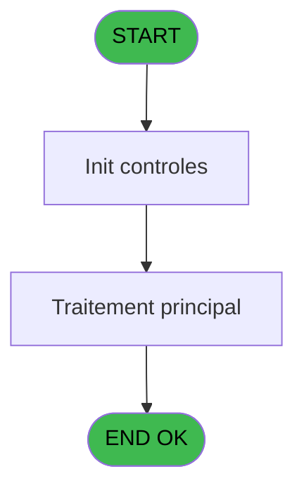

# PBP IDE 110 - Impression cde forfait ski

> **Analyse**: Phases 1-4 2026-02-03 09:27 -> 09:27 (19s) | Assemblage 09:27
> **Pipeline**: V7.2 Enrichi
> **Structure**: 4 onglets (Resume | Ecrans | Donnees | Connexions)

<!-- TAB:Resume -->

## 1. FICHE D'IDENTITE

| Attribut | Valeur |
|----------|--------|
| Projet | PBP |
| IDE Position | 110 |
| Nom Programme | Impression cde forfait ski |
| Fichier source | `Prg_110.xml` |
| Domaine metier | General |
| Taches | 3 (0 ecrans visibles) |
| Tables modifiees | 0 |
| Programmes appeles | 0 |

## 2. DESCRIPTION FONCTIONNELLE

**Impression cde forfait ski** assure la gestion complete de ce processus, accessible depuis [Edition Forfait Ski (IDE 108)](PBP-IDE-108.md).

Le flux de traitement s'organise en **1 blocs fonctionnels** :

- **Traitement** (3 taches) : traitements metier divers

## 3. BLOCS FONCTIONNELS

### 3.1 Traitement (3 taches)

Traitements internes.

---

#### 110 - Impression cde forfait ski

**Role** : Generation du document : Impression cde forfait ski.

---

#### 110.1 - Edite tranche

**Role** : Traitement : Edite tranche.
**Variables liees** : B (P.Libelle tranche csv), C (P.Tranche mini), D (P.Tranche maxi), F (V.Ligne tranche)

---

#### 110.2 - Edite tranche

**Role** : Traitement : Edite tranche.
**Variables liees** : B (P.Libelle tranche csv), C (P.Tranche mini), D (P.Tranche maxi), F (V.Ligne tranche)

## 5. REGLES METIER

*(Aucune regle metier identifiee)*

## 6. CONTEXTE

- **Appele par**: [Edition Forfait Ski (IDE 108)](PBP-IDE-108.md)
- **Appelle**: 0 programmes | **Tables**: 2 (W:0 R:2 L:1) | **Taches**: 3 | **Expressions**: 6

<!-- TAB:Ecrans -->

## 8. ECRANS

*(Programme sans ecran visible)*

## 9. NAVIGATION

### 9.3 Structure hierarchique (3 taches)

| Position | Tache | Type | Dimensions | Bloc |
|----------|-------|------|------------|------|
| **110.1** | [**Impression cde forfait ski** (110)](#t1) | - | - | Traitement |
| 110.1.1 | [Edite tranche (110.1)](#t2) | - | - | |
| 110.1.2 | [Edite tranche (110.2)](#t5) | - | - | |

### 9.4 Algorigramme

> **Legende**: Vert = START/END OK | Rouge = END KO | Bleu = Decisions
> *Algorigramme auto-genere. Utiliser `/algorigramme` pour une synthese metier detaillee.*

<!-- TAB:Donnees -->

## 10. TABLES

### Tables utilisees (2)

| ID | Nom | Description | Type | R | W | L | Usages |
|----|-----|-------------|------|---|---|---|--------|
| 797 | log_effectif_envoi |  | DB | R |   |   | 2 |
| 798 | type_article | Articles et stock | DB | R |   | L | 3 |

### Colonnes par table (2 / 2 tables avec colonnes identifiees)

Table 797 - log_effectif_envoi (R) - 2 usages

| Lettre | Variable | Acces | Type |
|--------|----------|-------|------|
| G | V.Total general effectif | R | Numeric |

Table 798 - type_article (R/L) - 3 usages

| Lettre | Variable | Acces | Type |
|--------|----------|-------|------|
| A | P.Date reference | R | Date |
| B | P.Libelle tranche csv | R | Alpha |
| C | P.Tranche mini | R | Numeric |
| D | P.Tranche maxi | R | Numeric |
| E | V.Ligne export csv | R | Alpha |
| F | V.Ligne tranche | R | Alpha |
| G | V.Total general effectif | R | Numeric |

## 11. VARIABLES

### 11.1 Parametres entrants (4)

Variables recues du programme appelant ([Edition Forfait Ski (IDE 108)](PBP-IDE-108.md)).

| Lettre | Nom | Type | Usage dans |
|--------|-----|------|-----------|
| A | P.Date reference | Date | - |
| B | P.Libelle tranche csv | Alpha | - |
| C | P.Tranche mini | Numeric | 1x parametre entrant |
| D | P.Tranche maxi | Numeric | 1x parametre entrant |

### 11.2 Variables de session (3)

Variables persistantes pendant toute la session.

| Lettre | Nom | Type | Usage dans |
|--------|-----|------|-----------|
| E | V.Ligne export csv | Alpha | - |
| F | V.Ligne tranche | Alpha | - |
| G | V.Total general effectif | Numeric | 1x session |

## 12. EXPRESSIONS

**6 / 6 expressions decodees (100%)**

### 12.1 Repartition par type

| Type | Expressions | Regles |
|------|-------------|--------|
| CALCULATION | 1 | 0 |
| CONSTANTE | 1 | 0 |
| FORMAT | 3 | 0 |
| CONCATENATION | 1 | 0 |

### 12.2 Expressions cles par type

#### CALCULATION (1 expressions)

| Type | IDE | Expression | Regle |
|------|-----|------------|-------|
| CALCULATION | 5 | `[X]+[J]` | - |

#### CONSTANTE (1 expressions)

| Type | IDE | Expression | Regle |
|------|-----|------------|-------|
| CONSTANTE | 2 | `'D'` | - |

#### FORMAT (3 expressions)

| Type | IDE | Expression | Regle |
|------|-----|------------|-------|
| FORMAT | 6 | `'TOTAL '&VG36&VG36&Trim([S])&Trim(Str([X],'6'))` | - |
| FORMAT | 4 | `Trim(DStr(P.Tranche mini [C],'DD/MM/YYYY'))&' AU '&Trim(DStr(P.Tranche maxi [D],'DD/MM/YYYY'))&VG36&Trim(Str([K],'3'))&VG36&Trim([S])&Trim(Str([J],'6'))` | - |
| FORMAT | 1 | `Translate('%club_exportdata%')&'CDE_FORF_SKI_'&Trim(DStr(V.Total general effectif [G],'DDMMYYYY'))&'.csv'` | - |

#### CONCATENATION (1 expressions)

| Type | IDE | Expression | Regle |
|------|-----|------------|-------|
| CONCATENATION | 3 | `'Ski pass valable du'&VG36&'Nbr de jours'&VG36&Trim([Q])&'Total'` | - |

<!-- TAB:Connexions -->

## 13. GRAPHE D'APPELS

### 13.1 Chaine depuis Main (Callers)

Main -> ... -> [Edition Forfait Ski (IDE 108)](PBP-IDE-108.md) -> **Impression cde forfait ski (IDE 110)**

### 13.2 Callers

| IDE | Nom Programme | Nb Appels |
|-----|---------------|-----------|
| [108](PBP-IDE-108.md) | Edition Forfait Ski | 1 |

### 13.3 Callees (programmes appeles)

### 13.4 Detail Callees avec contexte

| IDE | Nom Programme | Appels | Contexte |
|-----|---------------|--------|----------|
| - | (aucun) | - | - |

## 14. RECOMMANDATIONS MIGRATION

### 14.1 Profil du programme

| Metrique | Valeur | Impact migration |
|----------|--------|-----------------|
| Lignes de logique | 52 | Programme compact |
| Expressions | 6 | Peu de logique |
| Tables WRITE | 0 | Impact faible |
| Sous-programmes | 0 | Peu de dependances |
| Ecrans visibles | 0 | Ecran unique ou traitement batch |
| Code desactive | 1.9% (1 / 52) | Code sain |
| Regles metier | 0 | Pas de regle identifiee |

### 14.2 Plan de migration par bloc

#### Traitement (3 taches: 0 ecran, 3 traitements)

- **Strategie** : 3 service(s) backend injectable(s) (Domain Services).
- Decomposer les taches en services unitaires testables.

### 14.3 Dependances critiques

| Dependance | Type | Appels | Impact |
|------------|------|--------|--------|

---
*Spec DETAILED generee par Pipeline V7.2 - 2026-02-03 09:27*
