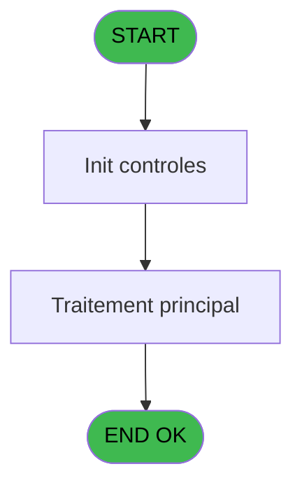

# PBP IDE 111 - Impression benef forfait ski

> **Analyse**: Phases 1-4 2026-02-03 09:27 -> 09:27 (20s) | Assemblage 09:27
> **Pipeline**: V7.2 Enrichi
> **Structure**: 4 onglets (Resume | Ecrans | Donnees | Connexions)

<!-- TAB:Resume -->

## 1. FICHE D'IDENTITE

| Attribut | Valeur |
|----------|--------|
| Projet | PBP |
| IDE Position | 111 |
| Nom Programme | Impression benef forfait ski |
| Fichier source | `Prg_111.xml` |
| Domaine metier | General |
| Taches | 1 (0 ecrans visibles) |
| Tables modifiees | 0 |
| Programmes appeles | 0 |

## 2. DESCRIPTION FONCTIONNELLE

**Impression benef forfait ski** assure la gestion complete de ce processus, accessible depuis [Edition Forfait Ski (IDE 108)](PBP-IDE-108.md).

Le flux de traitement s'organise en **1 blocs fonctionnels** :

- **Traitement** (1 tache) : traitements metier divers

**Logique metier** : 1 regles identifiees couvrant conditions metier.

## 3. BLOCS FONCTIONNELS

### 3.1 Traitement (1 tache)

Traitements internes.

---

#### 111 - Impression benef forfait ski

**Role** : Generation du document : Impression benef forfait ski.

## 5. REGLES METIER

1 regles identifiees:

### Autres (1 regles)

#### [RM-001] Traitement si [BP] est non nul

| Element | Detail |
|---------|--------|
| **Condition** | `[BP]<>0` |
| **Si vrai** | MlsTrans('De ')&Trim(Str([H] |
| **Si faux** | '3'))&MlsTrans(' ans à ')&Trim(Str([BP],'3'))&MlsTrans(' ans'),MlsTrans('+ de ')&Trim(Str([H],'3'))&MlsTrans(' ans')) |
| **Expression source** | Expression 8 : `IF([BP]<>0,MlsTrans('De ')&Trim(Str([H],'3'))&MlsTrans(' ans` |
| **Exemple** | Si [BP]<>0 → MlsTrans('De ')&Trim(Str([H] |

## 6. CONTEXTE

- **Appele par**: [Edition Forfait Ski (IDE 108)](PBP-IDE-108.md)
- **Appelle**: 0 programmes | **Tables**: 2 (W:0 R:1 L:1) | **Taches**: 1 | **Expressions**: 9

<!-- TAB:Ecrans -->

## 8. ECRANS

*(Programme sans ecran visible)*

## 9. NAVIGATION

### 9.3 Structure hierarchique (1 tache)

| Position | Tache | Type | Dimensions | Bloc |
|----------|-------|------|------------|------|
| **111.1** | [**Impression benef forfait ski** (111)](#t2) | MDI | - | Traitement |

### 9.4 Algorigramme

> **Legende**: Vert = START/END OK | Rouge = END KO | Bleu = Decisions
> *Algorigramme auto-genere. Utiliser `/algorigramme` pour une synthese metier detaillee.*

<!-- TAB:Donnees -->

## 10. TABLES

### Tables utilisees (2)

| ID | Nom | Description | Type | R | W | L | Usages |
|----|-----|-------------|------|---|---|---|--------|
| 120 | tables_qualites__qua |  | DB |   |   | L | 1 |
| 798 | type_article | Articles et stock | DB | R |   |   | 1 |

### Colonnes par table (0 / 1 tables avec colonnes identifiees)

Table 798 - type_article (R) - 1 usages

*Table utilisee uniquement en Link ou aucune colonne Real identifiee dans le DataView.*

## 11. VARIABLES

*(Programme sans variables locales mappees)*

## 12. EXPRESSIONS

**9 / 9 expressions decodees (100%)**

### 12.1 Repartition par type

| Type | Expressions | Regles |
|------|-------------|--------|
| CONCATENATION | 2 | 0 |
| CONDITION | 1 | 5 |
| CONSTANTE | 1 | 0 |
| DATE | 1 | 0 |
| OTHER | 3 | 0 |
| CAST_LOGIQUE | 1 | 0 |

### 12.2 Expressions cles par type

#### CONCATENATION (2 expressions)

| Type | IDE | Expression | Regle |
|------|-----|------------|-------|
| CONCATENATION | 1 | `MlsTrans ('Edition du')&' '&DStr (Date (),'DD/MM/YYYY')&' '&MlsTrans ('à')&' '&TStr (Time (),'HH:MM:SS')` | - |
| CONCATENATION | 9 | `'- '&Str (Page (0,1),'3P0Z0')&' -'` | - |

#### CONDITION (1 expressions)

| Type | IDE | Expression | Regle |
|------|-----|------------|-------|
| CONDITION | 8 | `IF([BP]<>0,MlsTrans('De ')&Trim(Str([H],'3'))&MlsTrans(' ans à ')&Trim(Str([BP],'3'))&MlsTrans(' ans'),MlsTrans('+ de ')&Trim(Str([H],'3'))&MlsTrans(' ans'))` | [RM-001](#rm-RM-001) |

#### CONSTANTE (1 expressions)

| Type | IDE | Expression | Regle |
|------|-----|------------|-------|
| CONSTANTE | 7 | `'B'` | - |

#### DATE (1 expressions)

| Type | IDE | Expression | Regle |
|------|-----|------------|-------|
| DATE | 3 | `'LISTE DES BENEFICIAIRES FORFAIT SKI AU '&DStr ([BO],'DD/MM/YYYY')` | - |

#### OTHER (3 expressions)

| Type | IDE | Expression | Regle |
|------|-----|------------|-------|
| OTHER | 6 | `[BQ]` | - |
| OTHER | 5 | `GetParam('SOCIETE')` | - |
| OTHER | 2 | `'Village '&GetParam ('VILLAGE')` | - |

#### CAST_LOGIQUE (1 expressions)

| Type | IDE | Expression | Regle |
|------|-----|------------|-------|
| CAST_LOGIQUE | 4 | `'TRUE'LOG` | - |

<!-- TAB:Connexions -->

## 13. GRAPHE D'APPELS

### 13.1 Chaine depuis Main (Callers)

Main -> ... -> [Edition Forfait Ski (IDE 108)](PBP-IDE-108.md) -> **Impression benef forfait ski (IDE 111)**

### 13.2 Callers

| IDE | Nom Programme | Nb Appels |
|-----|---------------|-----------|
| [108](PBP-IDE-108.md) | Edition Forfait Ski | 1 |

### 13.3 Callees (programmes appeles)

### 13.4 Detail Callees avec contexte

| IDE | Nom Programme | Appels | Contexte |
|-----|---------------|--------|----------|
| - | (aucun) | - | - |

## 14. RECOMMANDATIONS MIGRATION

### 14.1 Profil du programme

| Metrique | Valeur | Impact migration |
|----------|--------|-----------------|
| Lignes de logique | 20 | Programme compact |
| Expressions | 9 | Peu de logique |
| Tables WRITE | 0 | Impact faible |
| Sous-programmes | 0 | Peu de dependances |
| Ecrans visibles | 0 | Ecran unique ou traitement batch |
| Code desactive | 0% (0 / 20) | Code sain |
| Regles metier | 1 | Quelques regles a preserver |

### 14.2 Plan de migration par bloc

#### Traitement (1 tache: 0 ecran, 1 traitement)

- **Strategie** : 1 service(s) backend injectable(s) (Domain Services).
- Decomposer les taches en services unitaires testables.

### 14.3 Dependances critiques

| Dependance | Type | Appels | Impact |
|------------|------|--------|--------|

---
*Spec DETAILED generee par Pipeline V7.2 - 2026-02-03 09:28*
